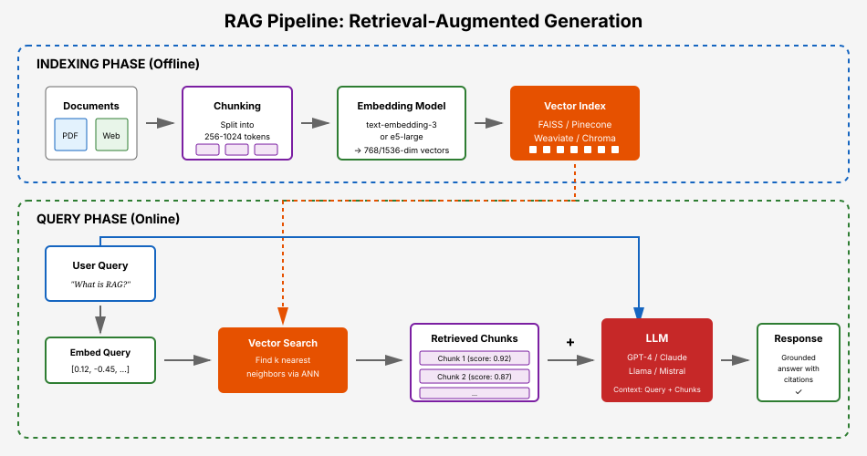
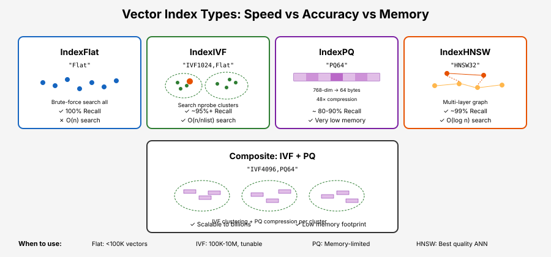
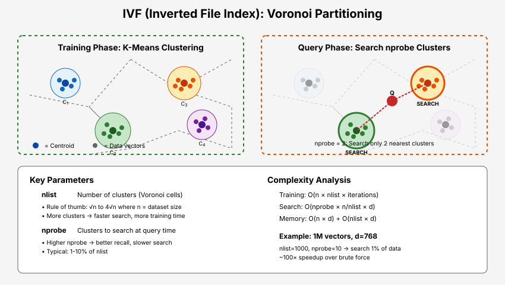
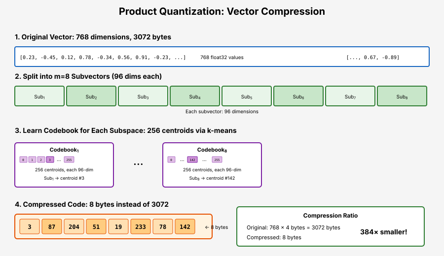
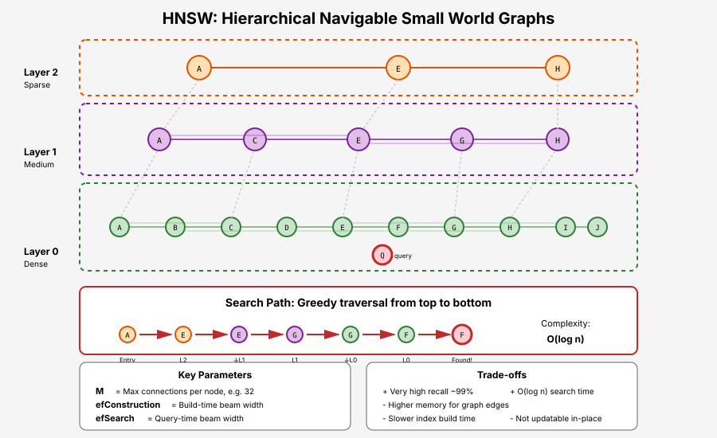
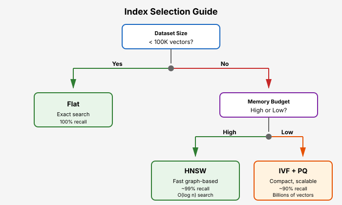

# Appendix: Retrieval-Augmented Generation (RAG) and Vector Search

This appendix covers Retrieval-Augmented Generation (RAG) systems and the vector search algorithms that power them. We explore the core ANN (Approximate Nearest Neighbor) algorithms—IVF, Product Quantization, and HNSW—that originated in academic research and were popularized by libraries like FAISS, and are now implemented across the modern vector database ecosystem.

## Table of Contents

- [Overview of RAG](#overview-of-rag)
- [The RAG Pipeline](#the-rag-pipeline)
- [Vector Embeddings for Retrieval](#vector-embeddings-for-retrieval)
- [Exact Nearest Neighbor Search](#exact-nearest-neighbor-search)
- [Approximate Nearest Neighbor (ANN) Search](#approximate-nearest-neighbor-ann-search)
- [Vector Index Types](#vector-index-types)
- [Inverted File Index (IVF)](#inverted-file-index-ivf)
- [Product Quantization (PQ)](#product-quantization-pq)
- [Hierarchical Navigable Small Worlds (HNSW)](#hierarchical-navigable-small-worlds-hnsw)
- [Composite Indexes](#composite-indexes)
- [Practical RAG Implementation](#practical-rag-implementation)
- [Vector Database Ecosystem](#vector-database-ecosystem)
- [Advanced RAG Techniques](#advanced-rag-techniques)
- [References](#references)

---

## Overview of RAG

**The Problem:** Large language models have a knowledge cutoff date and can hallucinate facts. They also can't access private or domain-specific information not in their training data.

**The Solution:** Retrieval-Augmented Generation (RAG) augments LLM prompts with relevant documents retrieved from an external knowledge base, grounding responses in actual source material.



**Key Benefits:**

| Benefit | Description |
|---------|-------------|
| **Up-to-date knowledge** | Retrieve from continuously updated document stores |
| **Reduced hallucination** | Ground responses in retrieved facts |
| **Domain specialization** | Access private/proprietary documents |
| **Traceability** | Cite sources for generated content |
| **Cost efficiency** | Cheaper than fine-tuning for many use cases |

**RAG vs Fine-tuning:**

```math
\large \text{RAG: } P(y|x) = \sum_{d \in \mathcal{D}} P(y|x, d) \cdot P(d|x)
```

- **RAG**: Retrieves relevant documents $d$ at inference time, conditions generation on them
- **Fine-tuning**: Bakes knowledge into model weights, requires retraining for updates

---

## The RAG Pipeline

A typical RAG system consists of two main phases:

### Indexing Phase (Offline)

1. **Document Loading**: Ingest documents from various sources (PDFs, web pages, databases)
2. **Chunking**: Split documents into manageable pieces (typically 256-1024 tokens)
3. **Embedding**: Convert chunks to dense vectors using an embedding model
4. **Indexing**: Store vectors in a searchable index (FAISS, Pinecone, Weaviate, etc.)

### Query Phase (Online)

1. **Query Embedding**: Convert user query to vector using same embedding model
2. **Retrieval**: Find k most similar document chunks via vector search
3. **Context Assembly**: Combine retrieved chunks into prompt context
4. **Generation**: LLM generates response conditioned on query + retrieved context

```python
from dataclasses import dataclass
from typing import List, Tuple
import numpy as np


@dataclass
class Document:
    """A document chunk with content and metadata."""
    id: str
    content: str
    embedding: np.ndarray
    metadata: dict


class SimpleRAG:
    """A minimal RAG implementation for understanding the core concepts."""

    def __init__(
        self,
        embedding_model,  # e.g., SentenceTransformer
        llm,              # e.g., OpenAI client
        chunk_size: int = 512,
        chunk_overlap: int = 50,
        top_k: int = 5
    ):
        self.embedding_model = embedding_model
        self.llm = llm
        self.chunk_size = chunk_size
        self.chunk_overlap = chunk_overlap
        self.top_k = top_k
        self.documents: List[Document] = []
        self.index = None  # Vector index (FAISS, etc.)

    def chunk_text(self, text: str) -> List[str]:
        """Split text into overlapping chunks."""
        words = text.split()
        chunks = []

        for i in range(0, len(words), self.chunk_size - self.chunk_overlap):
            chunk = ' '.join(words[i:i + self.chunk_size])
            if chunk:
                chunks.append(chunk)

        return chunks

    def add_documents(self, texts: List[str], metadatas: List[dict] = None):
        """Index documents for retrieval."""
        metadatas = metadatas or [{}] * len(texts)

        for idx, (text, metadata) in enumerate(zip(texts, metadatas)):
            chunks = self.chunk_text(text)

            for chunk_idx, chunk in enumerate(chunks):
                # Embed the chunk
                embedding = self.embedding_model.encode(chunk)

                doc = Document(
                    id=f"{idx}_{chunk_idx}",
                    content=chunk,
                    embedding=embedding,
                    metadata=metadata
                )
                self.documents.append(doc)

        # Build vector index
        self._build_index()

    def _build_index(self):
        """Build FAISS index from document embeddings."""
        import faiss

        embeddings = np.array([doc.embedding for doc in self.documents])
        dimension = embeddings.shape[1]

        # Simple flat index for exact search
        # In production, use IVF or HNSW for scalability
        self.index = faiss.IndexFlatIP(dimension)  # Inner product (for normalized vectors = cosine)

        # Normalize for cosine similarity
        faiss.normalize_L2(embeddings)
        self.index.add(embeddings)

    def retrieve(self, query: str) -> List[Tuple[Document, float]]:
        """Retrieve top-k most relevant documents for query."""
        # Embed query
        query_embedding = self.embedding_model.encode(query)
        query_embedding = query_embedding.reshape(1, -1)

        # Normalize for cosine similarity
        import faiss
        faiss.normalize_L2(query_embedding)

        # Search
        scores, indices = self.index.search(query_embedding, self.top_k)

        results = []
        for score, idx in zip(scores[0], indices[0]):
            if idx >= 0:  # FAISS returns -1 for missing results
                results.append((self.documents[idx], float(score)))

        return results

    def generate(self, query: str) -> str:
        """Generate response using RAG."""
        # Retrieve relevant documents
        retrieved = self.retrieve(query)

        # Build context from retrieved documents
        context_parts = []
        for doc, score in retrieved:
            context_parts.append(f"[Relevance: {score:.2f}]\n{doc.content}")

        context = "\n\n---\n\n".join(context_parts)

        # Create prompt with retrieved context
        prompt = f"""Use the following context to answer the question.
If the context doesn't contain relevant information, say so.

Context:
{context}

Question: {query}

Answer:"""

        # Generate response
        response = self.llm.generate(prompt)
        return response
```

---

## Vector Embeddings for Retrieval

The quality of RAG depends heavily on embedding quality. Good embeddings should:

1. **Capture semantic similarity**: Similar meanings → nearby vectors
2. **Handle asymmetry**: Queries are often short, documents are long
3. **Generalize across domains**: Work on unseen content

### Popular Embedding Models

| Model | Dimensions | Max Tokens | Notes |
|-------|-----------|------------|-------|
| `text-embedding-3-small` (OpenAI) | 1536 | 8191 | Good balance of quality/cost |
| `text-embedding-3-large` (OpenAI) | 3072 | 8191 | Highest quality, higher cost |
| `e5-large-v2` | 1024 | 512 | Open source, strong performance |
| `bge-large-en-v1.5` | 1024 | 512 | Open source, multilingual variants |
| `gte-large` | 1024 | 512 | Open source, Alibaba |

### Embedding for Asymmetric Search

For query-document retrieval, some models use instruction prefixes:

```python
# E5 model example
query_embedding = model.encode("query: What is photosynthesis?")
doc_embedding = model.encode("passage: Photosynthesis is the process by which plants...")

# BGE model example
query_embedding = model.encode("Represent this sentence for searching: What is photosynthesis?")
doc_embedding = model.encode("Photosynthesis is the process by which plants...")
```

---

## Exact Nearest Neighbor Search

The simplest approach: compute distance to every vector in the database.

```python
def exact_nearest_neighbors(query: np.ndarray, database: np.ndarray, k: int) -> np.ndarray:
    """
    Brute-force k-nearest neighbors.

    Time complexity: O(n * d) where n = num vectors, d = dimension
    Space complexity: O(n * d)
    """
    # Compute all distances (using inner product for normalized vectors)
    # For cosine similarity: normalize vectors first, then inner product
    similarities = database @ query  # Shape: (n,)

    # Get top-k indices
    top_k_indices = np.argpartition(similarities, -k)[-k:]
    top_k_indices = top_k_indices[np.argsort(similarities[top_k_indices])[::-1]]

    return top_k_indices
```

**Problem**: Linear scaling doesn't work for millions/billions of vectors.

| Vectors | Dimensions | Exact Search Time |
|---------|------------|-------------------|
| 1M | 768 | ~100ms |
| 10M | 768 | ~1s |
| 100M | 768 | ~10s |
| 1B | 768 | ~100s |

**Solution**: Approximate Nearest Neighbor (ANN) algorithms trade perfect accuracy for massive speedups.

---

## Approximate Nearest Neighbor (ANN) Search

ANN algorithms find vectors that are *probably* the nearest neighbors, with tunable accuracy/speed tradeoffs.

**Key Metrics:**

- **Recall@k**: Fraction of true top-k neighbors found
- **QPS**: Queries per second
- **Memory**: RAM required for index
- **Build time**: Time to construct index

```math
\large \text{Recall@}k = \frac{|\text{ANN top-}k \cap \text{Exact top-}k|}{k}
```

**ANN Algorithm Families:**

| Family | Examples | Mechanism |
|--------|----------|-----------|
| **Tree-based** | KD-tree, Ball tree | Hierarchical space partitioning |
| **Hash-based** | LSH | Locality-sensitive hashing |
| **Cluster-based** | IVF | Partition into Voronoi cells |
| **Graph-based** | HNSW, NSG | Navigate proximity graphs |
| **Quantization** | PQ, SQ | Compress vectors |

---

## Vector Index Types

Modern vector search relies on a small set of core algorithms that have been implemented across many libraries and databases. These algorithms—IVF, Product Quantization, and HNSW—were developed in academic research and popularized by early libraries like FAISS (Facebook, 2017), but are now ubiquitous.



### Core Index Types

| Index Type | Speed | Memory | Accuracy | Use Case |
|------------|-------|--------|----------|----------|
| **Flat/Brute-force** | Slow | High | 100% | Small datasets (<100K) |
| **IVF** | Fast | High | ~95%+ | Medium datasets, tunable |
| **PQ** | Very fast | Very low | ~80-90% | Memory-constrained |
| **HNSW** | Very fast | High | ~99%+ | Highest quality ANN |
| **IVF+PQ** | Fast | Low | ~85-95% | Large datasets, balanced |

### FAISS Example

FAISS remains the most commonly used library for prototyping and understanding these algorithms:

```python
import faiss

# Examples of FAISS index factory strings
index = faiss.index_factory(768, "Flat")           # Exact search
index = faiss.index_factory(768, "IVF1024,Flat")   # IVF with 1024 clusters
index = faiss.index_factory(768, "IVF1024,PQ64")   # IVF + Product Quantization
index = faiss.index_factory(768, "HNSW32")         # HNSW with M=32
```

Most vector databases (Pinecone, Weaviate, Milvus, Qdrant, etc.) use these same algorithms internally, often with additional optimizations.

---

## Inverted File Index (IVF)

IVF partitions the vector space into Voronoi cells using k-means clustering. At query time, only vectors in nearby cells are searched.



### How IVF Works

**Training Phase:**
1. Sample vectors from the dataset
2. Run k-means to find `nlist` cluster centroids
3. Assign each vector to its nearest centroid

**Query Phase:**
1. Find `nprobe` nearest centroids to query
2. Search only vectors in those clusters
3. Return top-k from searched vectors

```python
import faiss
import numpy as np


def create_ivf_index(
    vectors: np.ndarray,
    nlist: int = 100,
    nprobe: int = 10
) -> faiss.Index:
    """
    Create an IVF index for approximate nearest neighbor search.

    Args:
        vectors: Database vectors, shape (n, d)
        nlist: Number of Voronoi cells (clusters)
        nprobe: Number of cells to search at query time

    Returns:
        Trained FAISS IVF index
    """
    n, d = vectors.shape

    # Quantizer: how to find nearest centroids
    quantizer = faiss.IndexFlatL2(d)

    # IVF index
    index = faiss.IndexIVFFlat(quantizer, d, nlist)

    # IVF requires training on representative vectors
    index.train(vectors)

    # Add vectors to index
    index.add(vectors)

    # Set search-time parameter
    index.nprobe = nprobe

    return index


# Example usage
d = 768  # Embedding dimension
n = 1_000_000  # 1M vectors

# Generate random vectors (in practice, these are embeddings)
np.random.seed(42)
vectors = np.random.randn(n, d).astype('float32')

# Rule of thumb: nlist = sqrt(n) to 4*sqrt(n)
nlist = int(np.sqrt(n))  # 1000 clusters

index = create_ivf_index(vectors, nlist=nlist, nprobe=50)

# Search
query = np.random.randn(1, d).astype('float32')
distances, indices = index.search(query, k=10)
```

### IVF Parameter Tuning

**`nlist` (number of clusters):**
- Too few: Large clusters, slow search
- Too many: Training expensive, may miss neighbors at cluster boundaries
- Rule of thumb: $\sqrt{n}$ to $4\sqrt{n}$

**`nprobe` (clusters to search):**
- Higher = better recall, slower search
- Typical range: 1-10% of nlist
- Tune based on recall requirements

```math
\large \text{Search complexity} \approx O\left(\text{nprobe} \cdot \frac{n}{\text{nlist}} \cdot d\right)
```

---

## Product Quantization (PQ)

Product Quantization compresses vectors by splitting them into subvectors and quantizing each independently. This dramatically reduces memory while enabling fast distance computation.



### How PQ Works

**Training Phase:**
1. Split each d-dimensional vector into m subvectors of dimension d/m
2. For each subspace, run k-means to find 256 centroids (codebook)
3. Each subvector is replaced by its nearest centroid's ID (1 byte)

**Compression:**
- Original: d × 4 bytes (float32) = 3072 bytes for d=768
- Compressed: m bytes (e.g., 64 bytes for m=64)
- Compression ratio: 48× in this example

**Distance Computation:**
- Precompute distances from query subvectors to all centroids
- Look up and sum precomputed distances using codes

```python
import faiss
import numpy as np


def create_pq_index(
    vectors: np.ndarray,
    m: int = 64,           # Number of subquantizers
    nbits: int = 8         # Bits per subquantizer (256 centroids)
) -> faiss.Index:
    """
    Create a Product Quantization index.

    Memory per vector: m * nbits / 8 bytes
    For m=64, nbits=8: 64 bytes per vector

    Args:
        vectors: Training vectors, shape (n, d)
        m: Number of subvector splits (must divide d)
        nbits: Bits per code (8 = 256 centroids per subspace)
    """
    n, d = vectors.shape
    assert d % m == 0, f"Dimension {d} must be divisible by m={m}"

    # Create PQ index
    index = faiss.IndexPQ(d, m, nbits)

    # Train the codebooks
    index.train(vectors)

    # Add vectors (they get compressed)
    index.add(vectors)

    return index


def asymmetric_distance_computation(
    query: np.ndarray,      # Shape: (d,)
    codes: np.ndarray,      # Shape: (n, m), uint8 codes
    codebooks: np.ndarray,  # Shape: (m, 256, d/m)
    m: int
) -> np.ndarray:
    """
    Compute distances using Asymmetric Distance Computation (ADC).

    The query is NOT quantized - we compute exact distances from
    query subvectors to codebook centroids, then look up.

    This is faster than symmetric (both quantized) and more accurate.
    """
    d = query.shape[0]
    dsub = d // m
    n = codes.shape[0]

    # Precompute distance tables: distance from each query subvector
    # to each centroid in corresponding codebook
    # Shape: (m, 256)
    distance_tables = np.zeros((m, 256))

    for i in range(m):
        query_sub = query[i * dsub:(i + 1) * dsub]
        # Distance from query subvector to all 256 centroids
        distance_tables[i] = np.sum(
            (codebooks[i] - query_sub) ** 2,
            axis=1
        )

    # Look up distances using codes and sum
    # This is very fast: just table lookups and additions
    distances = np.zeros(n)
    for i in range(m):
        distances += distance_tables[i, codes[:, i]]

    return distances
```

### PQ Trade-offs

| Parameter | Effect on Accuracy | Effect on Memory | Effect on Speed |
|-----------|-------------------|------------------|-----------------|
| ↑ m (more subvectors) | ↑ Better | ↑ More memory | ↓ Slower |
| ↑ nbits (more centroids) | ↑ Better | ↑ More memory | ↓ Slower |
| ↑ Training data | ↑ Better codebooks | - | - |

**Typical configurations:**
- `PQ64`: 64 bytes per vector, good balance
- `PQ32`: 32 bytes per vector, more compression
- `PQ128`: 128 bytes per vector, higher accuracy

---

## Hierarchical Navigable Small Worlds (HNSW)

HNSW builds a multi-layer graph where each node connects to its approximate nearest neighbors. Search navigates this graph from coarse (top layers) to fine (bottom layer).



### How HNSW Works

**Construction:**
1. Insert vectors one at a time
2. Each vector is assigned a random maximum layer (exponentially distributed)
3. For each layer from top to assigned layer:
   - Find M nearest neighbors via greedy search
   - Create bidirectional edges

**Search:**
1. Start at entry point in top layer
2. Greedily move to nearest neighbor until local minimum
3. Move down one layer, repeat
4. At layer 0, collect ef candidates, return top-k

```python
import faiss
import numpy as np


def create_hnsw_index(
    vectors: np.ndarray,
    M: int = 32,           # Connections per node
    ef_construction: int = 200,  # Neighbors considered during build
    ef_search: int = 128   # Neighbors considered during search
) -> faiss.Index:
    """
    Create an HNSW index.

    HNSW provides excellent recall with very fast search,
    but requires more memory than IVF-based indexes.

    Args:
        vectors: Database vectors, shape (n, d)
        M: Number of connections per node per layer
           Higher M = better recall, more memory, slower build
        ef_construction: Search width during index building
           Higher = better graph quality, slower build
        ef_search: Search width during query
           Higher = better recall, slower search
    """
    n, d = vectors.shape

    # Create HNSW index
    index = faiss.IndexHNSWFlat(d, M)

    # Set construction parameter
    index.hnsw.efConstruction = ef_construction

    # Add vectors (index is built incrementally)
    index.add(vectors)

    # Set search parameter
    index.hnsw.efSearch = ef_search

    return index


# Memory estimation
def estimate_hnsw_memory(n: int, d: int, M: int) -> int:
    """Estimate HNSW index memory in bytes."""
    vector_memory = n * d * 4  # float32 vectors
    graph_memory = n * M * 2 * 4  # M connections per layer, ~2 layers avg, 4 bytes per link
    return vector_memory + graph_memory
```

### HNSW Parameters

| Parameter | Description | Typical Values |
|-----------|-------------|----------------|
| `M` | Connections per node | 16-64 (higher = better recall, more RAM) |
| `efConstruction` | Build-time search width | 100-500 (higher = better graph) |
| `efSearch` | Query-time search width | 50-200 (tune for recall/speed) |

**HNSW Properties:**
- **Build time**: O(n log n)
- **Search time**: O(log n) average case
- **Memory**: O(n × (d + M)) - stores full vectors + graph
- **Recall**: Typically 95-99%+ with proper tuning

---

## Composite Indexes

Production systems often combine these algorithms for better trade-offs:

### IVF + PQ (Memory-Efficient)

Combines clustering with compression—the standard approach for billion-scale search:

```python
# FAISS example
index = faiss.index_factory(768, "IVF4096,PQ64")
```

- Searches only relevant clusters (IVF)
- Vectors are compressed (PQ)
- Used by: Pinecone, Milvus, Weaviate (as options)

### IVF + HNSW (Fast Coarse Search)

Uses graph-based search to find relevant clusters:

```python
# Use HNSW to find clusters instead of flat search
index = faiss.index_factory(768, "IVF4096_HNSW32,Flat")
```

- HNSW for fast centroid search
- Flat storage in clusters for exact distances

### Two-Stage with Re-ranking

Retrieve many candidates quickly, then re-score precisely:

```python
# First stage: fast approximate search with PQ
# Second stage: re-rank top candidates with exact distances
index = faiss.index_factory(768, "IVF1024,PQ64,RFlat")
```

This pattern (fast retrieval → precise reranking) is fundamental to production RAG systems and extends beyond vector search to include cross-encoder rerankers.

---

## Practical RAG Implementation

### Chunking Strategies

Chunking significantly impacts retrieval quality:

```python
from typing import List
import re


def chunk_by_sentences(
    text: str,
    max_chunk_size: int = 512,
    overlap_sentences: int = 1
) -> List[str]:
    """
    Chunk text by sentences, respecting max size.
    Overlap ensures context continuity.
    """
    # Simple sentence splitting (use spaCy/nltk for production)
    sentences = re.split(r'(?<=[.!?])\s+', text)

    chunks = []
    current_chunk = []
    current_size = 0

    for sent in sentences:
        sent_size = len(sent.split())

        if current_size + sent_size > max_chunk_size and current_chunk:
            chunks.append(' '.join(current_chunk))
            # Keep overlap_sentences for context
            current_chunk = current_chunk[-overlap_sentences:] if overlap_sentences else []
            current_size = sum(len(s.split()) for s in current_chunk)

        current_chunk.append(sent)
        current_size += sent_size

    if current_chunk:
        chunks.append(' '.join(current_chunk))

    return chunks


def chunk_by_paragraphs(text: str, max_chunk_size: int = 1024) -> List[str]:
    """Chunk by paragraphs, splitting large ones."""
    paragraphs = text.split('\n\n')
    chunks = []

    for para in paragraphs:
        if len(para.split()) <= max_chunk_size:
            chunks.append(para)
        else:
            # Split large paragraphs by sentences
            chunks.extend(chunk_by_sentences(para, max_chunk_size))

    return chunks
```

### Hybrid Search (Dense + Sparse)

Combine semantic search with keyword matching:

```python
import numpy as np
from rank_bm25 import BM25Okapi


class HybridRetriever:
    """Combine dense (vector) and sparse (BM25) retrieval."""

    def __init__(
        self,
        embedding_model,
        documents: List[str],
        alpha: float = 0.5  # Weight for dense scores
    ):
        self.embedding_model = embedding_model
        self.documents = documents
        self.alpha = alpha

        # Build dense index
        self.embeddings = embedding_model.encode(documents)

        # Build sparse index (BM25)
        tokenized = [doc.lower().split() for doc in documents]
        self.bm25 = BM25Okapi(tokenized)

    def search(self, query: str, k: int = 10) -> List[Tuple[int, float]]:
        """
        Hybrid search combining dense and sparse scores.

        Uses Reciprocal Rank Fusion (RRF) for score combination.
        """
        # Dense retrieval
        query_emb = self.embedding_model.encode(query)
        dense_scores = self.embeddings @ query_emb
        dense_ranks = np.argsort(-dense_scores)

        # Sparse retrieval (BM25)
        sparse_scores = self.bm25.get_scores(query.lower().split())
        sparse_ranks = np.argsort(-sparse_scores)

        # Reciprocal Rank Fusion
        rrf_scores = {}
        rrf_k = 60  # RRF constant

        for rank, idx in enumerate(dense_ranks):
            rrf_scores[idx] = rrf_scores.get(idx, 0) + self.alpha / (rrf_k + rank + 1)

        for rank, idx in enumerate(sparse_ranks):
            rrf_scores[idx] = rrf_scores.get(idx, 0) + (1 - self.alpha) / (rrf_k + rank + 1)

        # Sort by combined score
        results = sorted(rrf_scores.items(), key=lambda x: -x[1])[:k]
        return results
```

---

## Vector Database Ecosystem

The ANN algorithms described above are implemented across a rich ecosystem of vector databases and libraries:

### Libraries (Self-Hosted)

| Library | Language | Algorithms | Notes |
|---------|----------|------------|-------|
| **FAISS** | C++/Python | IVF, PQ, HNSW, Flat | Facebook. The reference implementation, widely used for research |
| **Annoy** | C++/Python | Random projection trees | Spotify. Simple, memory-mapped, good for static datasets |
| **ScaNN** | C++/Python | Anisotropic PQ, tree-based | Google. State-of-the-art accuracy/speed |
| **hnswlib** | C++/Python | HNSW only | Lightweight, just the HNSW algorithm |
| **USearch** | C++/multi | HNSW variants | Unum. Single-file, language-agnostic |

### Vector Databases (Managed/Self-Hosted)

| Database | Index Types | Hosted? | Notes |
|----------|-------------|---------|-------|
| **Pinecone** | Proprietary (IVF-based) | Managed only | Fully managed, simple API |
| **Weaviate** | HNSW, Flat | Both | GraphQL API, modules for ML |
| **Milvus** | IVF, HNSW, DiskANN, PQ | Both | Zilliz. GPU support, very feature-rich |
| **Qdrant** | HNSW | Both | Rust. Filtering, payload storage |
| **Chroma** | HNSW (via hnswlib) | Both | Python-native, simple, popular for prototyping |
| **LanceDB** | IVF-PQ, Flat | Self-hosted | Serverless, columnar storage |
| **pgvector** | IVF, HNSW | Self-hosted | PostgreSQL extension |
| **Elasticsearch** | HNSW | Both | Added vector search to existing search engine |

### Choosing a Solution

**For prototyping/research:**
- FAISS or Chroma—simple, well-documented, Python-friendly

**For production with <10M vectors:**
- pgvector if already using PostgreSQL
- Qdrant or Weaviate for dedicated vector DB
- Chroma for simple use cases

**For production at scale (>100M vectors):**
- Pinecone (managed, least operational burden)
- Milvus (self-hosted, most features)
- Consider GPU acceleration (FAISS, Milvus)

**Key considerations:**
- Filtering requirements (metadata filtering varies widely in performance)
- Update patterns (some indexes handle updates better than others)
- Operational complexity (managed vs self-hosted)
- Hybrid search needs (vector + keyword)

---

## Advanced RAG Techniques

### Query Transformation

Improve retrieval by transforming queries:

```python
class QueryTransformer:
    """Transform queries for better retrieval."""

    def __init__(self, llm):
        self.llm = llm

    def hypothetical_document(self, query: str) -> str:
        """
        HyDE: Generate hypothetical document that would answer the query.
        Embed the hypothetical doc instead of the query.
        """
        prompt = f"""Write a short passage that would answer this question:
Question: {query}
Passage:"""
        return self.llm.generate(prompt)

    def expand_query(self, query: str) -> List[str]:
        """Generate multiple query variations for better recall."""
        prompt = f"""Generate 3 different ways to ask this question:
Original: {query}
Variations:
1."""
        response = self.llm.generate(prompt)
        variations = [query] + [v.strip() for v in response.split('\n') if v.strip()]
        return variations

    def decompose_query(self, query: str) -> List[str]:
        """Break complex query into sub-questions."""
        prompt = f"""Break this question into simpler sub-questions:
Question: {query}
Sub-questions:
1."""
        response = self.llm.generate(prompt)
        return [q.strip() for q in response.split('\n') if q.strip()]
```

### Reranking

Improve precision with a cross-encoder reranker:

```python
from sentence_transformers import CrossEncoder


class Reranker:
    """Rerank retrieved documents using a cross-encoder."""

    def __init__(self, model_name: str = "cross-encoder/ms-marco-MiniLM-L-6-v2"):
        self.model = CrossEncoder(model_name)

    def rerank(
        self,
        query: str,
        documents: List[str],
        top_k: int = 5
    ) -> List[Tuple[str, float]]:
        """
        Rerank documents using cross-encoder.

        Cross-encoders are more accurate than bi-encoders but slower
        (can't pre-compute document embeddings).
        """
        # Create query-document pairs
        pairs = [[query, doc] for doc in documents]

        # Score all pairs
        scores = self.model.predict(pairs)

        # Sort by score
        ranked = sorted(zip(documents, scores), key=lambda x: -x[1])

        return ranked[:top_k]
```

### Contextual Compression

Reduce noise by extracting relevant parts:

```python
class ContextualCompressor:
    """Extract only relevant parts of retrieved documents."""

    def __init__(self, llm):
        self.llm = llm

    def compress(self, query: str, document: str) -> str:
        """Extract sentences relevant to the query."""
        prompt = f"""Given a question and a document, extract only the sentences
that are relevant to answering the question. If nothing is relevant, say "NOT_RELEVANT".

Question: {query}

Document:
{document}

Relevant excerpts:"""

        response = self.llm.generate(prompt)

        if "NOT_RELEVANT" in response:
            return None
        return response
```

---

## Scaling Considerations

### Index Selection Guide



### Benchmarking Your Setup

```python
import time
import numpy as np


def benchmark_index(
    index,
    queries: np.ndarray,
    ground_truth: np.ndarray,
    k: int = 10
) -> dict:
    """Benchmark an index for speed and accuracy."""

    n_queries = len(queries)

    # Measure speed
    start = time.time()
    _, results = index.search(queries, k)
    elapsed = time.time() - start

    # Measure recall
    recalls = []
    for i in range(n_queries):
        true_neighbors = set(ground_truth[i, :k])
        found_neighbors = set(results[i])
        recall = len(true_neighbors & found_neighbors) / k
        recalls.append(recall)

    return {
        'qps': n_queries / elapsed,
        'avg_latency_ms': elapsed / n_queries * 1000,
        'recall@k': np.mean(recalls),
        'recall_std': np.std(recalls)
    }
```

---

## References

### Papers

1. Lewis et al. (2020). [Retrieval-Augmented Generation for Knowledge-Intensive NLP Tasks](https://arxiv.org/abs/2005.11401)
2. Johnson et al. (2019). [Billion-scale similarity search with GPUs](https://arxiv.org/abs/1702.08734) (FAISS)
3. Malkov & Yashunin (2018). [Efficient and robust approximate nearest neighbor search using HNSW](https://arxiv.org/abs/1603.09320)
4. Jégou et al. (2011). [Product Quantization for Nearest Neighbor Search](https://ieeexplore.ieee.org/document/5432202)
5. Gao et al. (2022). [Precise Zero-Shot Dense Retrieval without Relevance Labels](https://arxiv.org/abs/2212.10496) (HyDE)

### Libraries and Databases

- [FAISS](https://github.com/facebookresearch/faiss) - Facebook AI Similarity Search (reference implementation)
- [ScaNN](https://github.com/google-research/google-research/tree/master/scann) - Google's state-of-the-art ANN
- [hnswlib](https://github.com/nmslib/hnswlib) - Lightweight HNSW implementation
- [Annoy](https://github.com/spotify/annoy) - Spotify's approximate nearest neighbors
- [Milvus](https://milvus.io/) - Open-source vector database
- [Qdrant](https://qdrant.tech/) - Vector database with filtering
- [Weaviate](https://weaviate.io/) - Vector database with modules
- [Chroma](https://www.trychroma.com/) - Simple embedding database
- [Pinecone](https://www.pinecone.io/) - Managed vector database
- [pgvector](https://github.com/pgvector/pgvector) - PostgreSQL extension

### RAG Frameworks

- [LangChain](https://github.com/langchain-ai/langchain) - RAG framework
- [LlamaIndex](https://github.com/run-llama/llama_index) - Data framework for LLMs
- [Sentence Transformers](https://www.sbert.net/) - Embedding models

---

## Exercises

1. **Implement a RAG system** using FAISS and a local LLM. Index a set of documents and answer questions about them.

2. **Compare index types**: Benchmark Flat, IVF, PQ, and HNSW on the same dataset. Plot recall@10 vs QPS.

3. **Tune IVF parameters**: For a 1M vector dataset, find optimal `nlist` and `nprobe` for 95% recall.

4. **Implement hybrid search**: Combine BM25 and dense retrieval using RRF. Compare to dense-only.

5. **Build a reranking pipeline**: Use a bi-encoder for retrieval and cross-encoder for reranking. Measure improvement.

6. **Explore chunking strategies**: Compare sentence, paragraph, and semantic chunking on a QA task.

7. **Implement HyDE**: Generate hypothetical documents for queries and compare retrieval quality to direct query embedding.
