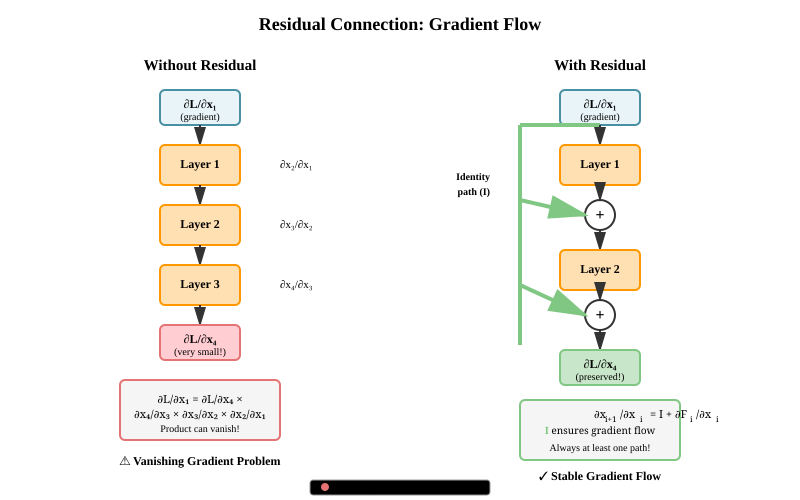

# Appendix: Residual Connections

This appendix covers the fundamentals of residual connections (skip connections), which are a prerequisite concept for understanding transformer architectures. While transformers use residual connections extensively, the concept originated from earlier work on deep neural networks.

---

## Residual Connections

Residual connections (skip connections) add the input of a sub-layer to its output:

```math
\mathbf{y} = \mathbf{x} + \text{SubLayer}(\mathbf{x})
```

### Why Residuals Matter

**Training deep networks:**
Without residual connections, deep networks suffer from:

1. **Vanishing gradients**: Gradients shrink exponentially with depth
2. **Degradation**: Deeper networks perform worse than shallower ones

**How residuals help:**

- Create identity mappings for gradient flow
- Allow each layer to learn refinements rather than full transformations
- Enable training of 100+ layer transformers

**Mathematical insight:**

Consider a network with $L$ layers. During backpropagation:

Without residuals:

```math
\frac{\partial \mathcal{L}}{\partial \mathbf{x}_1} = \frac{\partial \mathcal{L}}{\partial \mathbf{x}_{L}} \prod_{i=1}^{L-1} \frac{\partial \mathbf{x}_{i+1}}{\partial \mathbf{x}_i}
```

With residuals ($\mathbf{x}_{i+1} = \mathbf{x}_i + F_i(\mathbf{x}_i)$):

```math
\frac{\partial \mathbf{x}_{i+1}}{\partial \mathbf{x}_i} = \mathbf{I} + \frac{\partial F_i(\mathbf{x}_i)}{\partial \mathbf{x}_i}
```

The identity term $\mathbf{I}$ ensures gradients can flow directly backward.

### Gradient Flow Analysis

**The Problem Being Solved:**

In deep neural networks, gradients must propagate backward through many layers during backpropagation. Without special architectural considerations, gradients either vanish (become exponentially small) or explode (become exponentially large) as they flow through layers. This phenomenon severely limits network depth—historically, training networks beyond 10-20 layers was extremely difficult.

**Theoretical Justification:**

Consider backpropagation through $L$ layers. The gradient at layer $\ell$ is:

```math
\frac{\partial \mathcal{L}}{\partial \mathbf{x}_\ell} = \frac{\partial \mathcal{L}}{\partial \mathbf{x}_{L}} \prod_{i=\ell}^{L-1} \frac{\partial \mathbf{x}_{i+1}}{\partial \mathbf{x}_i}
```

If any Jacobian $\frac{\partial \mathbf{x}_{i+1}}{\partial \mathbf{x}_i}$ has:

- Eigenvalues < 1: gradients shrink exponentially (vanishing gradients)
- Eigenvalues > 1: gradients grow exponentially (exploding gradients)

With residual connections $\mathbf{x}_{i+1} = \mathbf{x}_i + F_i(\mathbf{x}_i)$:

```math
\frac{\partial \mathbf{x}_{i+1}}{\partial \mathbf{x}_i} = \mathbf{I} + \frac{\partial F_i(\mathbf{x}_i)}{\partial \mathbf{x}_i}
```

The identity matrix $\mathbf{I}$ ensures at least one eigenvalue equals 1, preventing complete gradient vanishing.

**Relationship to Alternatives:**

- **Highway Networks**: Earlier approach using learned gating mechanisms; residuals are simpler and equally effective
- **Dense Connections (DenseNet)**: Connects every layer to every other layer; more connections but much higher memory cost
- **Gradient clipping**: Addresses exploding gradients but doesn't solve vanishing gradients
- **Careful initialization**: Helps but doesn't fundamentally solve the problem for very deep networks

**Key Insights That Make Residuals Work:**

1. **Identity mapping provides gradient highway**: Gradients can flow directly backward through identity connections, bypassing problematic transformations
2. **Learning refinements vs transformations**: With residuals, $F(\mathbf{x})$ only needs to learn the difference (refinement) from identity, which is easier than learning the full transformation
3. **Ensemble interpretation**: A residual network with $L$ layers implicitly contains $2^{L}$ paths of different lengths, acting like an ensemble
4. **Dynamic depth**: During training, the network can effectively adjust its depth by learning to skip certain layers when beneficial

```python
import torch
import torch.nn as nn


def analyze_gradient_flow():
    """Demonstrate gradient flow with and without residual connections."""
    import torch.nn.functional as F

    # Simple network without residuals
    class WithoutResidual(nn.Module):
        def __init__(self, d_model, depth):
            super().__init__()
            self.layers = nn.ModuleList([
                nn.Linear(d_model, d_model) for _ in range(depth)
            ])

        def forward(self, x):
            for layer in self.layers:
                x = torch.tanh(layer(x))  # Non-linearity
            return x

    # Network with residuals
    class WithResidual(nn.Module):
        def __init__(self, d_model, depth):
            super().__init__()
            self.layers = nn.ModuleList([
                nn.Linear(d_model, d_model) for _ in range(depth)
            ])

        def forward(self, x):
            for layer in self.layers:
                x = x + torch.tanh(layer(x))  # Residual connection
            return x

    d_model = 128
    depth = 20
    batch_size = 4

    # Create models
    no_res = WithoutResidual(d_model, depth)
    with_res = WithResidual(d_model, depth)

    # Forward pass
    x = torch.randn(batch_size, d_model, requires_grad=True)

    # Without residual
    x_no_res = x.clone().detach().requires_grad_(True)
    out_no_res = no_res(x_no_res)
    loss_no_res = out_no_res.sum()
    loss_no_res.backward()

    # With residual
    x_with_res = x.clone().detach().requires_grad_(True)
    out_with_res = with_res(x_with_res)
    loss_with_res = out_with_res.sum()
    loss_with_res.backward()

    # Compare gradient magnitudes
    print("Gradient flow comparison:")
    print(f"Without residual - input gradient norm: {x_no_res.grad.norm():.6f}")
    print(f"With residual - input gradient norm: {x_with_res.grad.norm():.6f}")

    # Check layer gradients
    print("\nLayer gradient norms (first 5 layers):")
    for i in range(5):
        grad_no_res = no_res.layers[i].weight.grad.norm()
        grad_with_res = with_res.layers[i].weight.grad.norm()
        print(f"  Layer {i}: no_res={grad_no_res:.6f}, with_res={grad_with_res:.6f}")

if __name__ == "__main__":
    analyze_gradient_flow()
```

**Typical output:**

- Without residuals: gradients become very small (vanishing)
- With residuals: gradients remain stable across layers

**Visualization:**



The diagram illustrates how residual connections create an identity path for gradients to flow backward through the network. Without residuals, gradients must pass through multiple transformations and can vanish. With residuals, the identity path (I) ensures gradients can flow directly, maintaining stable gradient magnitudes throughout training.

---

## References

- **Deep Residual Learning for Image Recognition** - He et al., 2015
