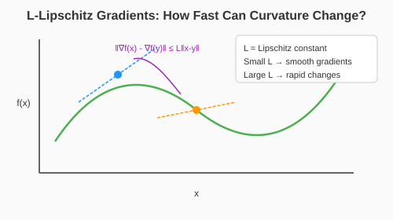
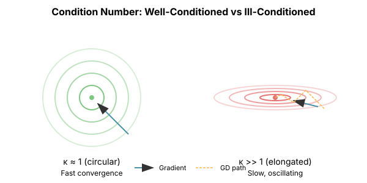
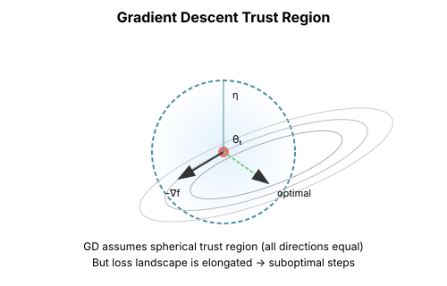
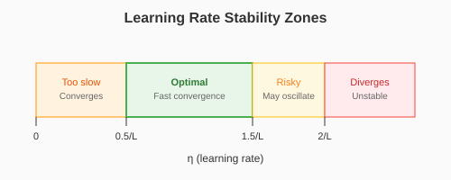

# Chapter 1: Gradient Descent

Gradient descent is the foundation of all optimization in deep learning. Before exploring sophisticated algorithms, we must deeply understand this baseline—its strengths, its failures, and what those failures teach us about the optimization landscape.

## The Basic Algorithm

Given an objective function $f: \mathbb{R}^n \to \mathbb{R}$, gradient descent iteratively moves in the direction of steepest descent:

$$\theta_{t+1} = \theta_t - \eta \nabla f(\theta_t)$$

where $\eta \gt 0$ is the learning rate (step size).

**Why negative gradient?** The gradient $\nabla f(\theta)$ points in the direction of steepest *increase*. We want to minimize, so we go opposite.

```python
import torch
import torch.nn as nn
from typing import Callable, List, Tuple

def gradient_descent(
    f: Callable[[torch.Tensor], torch.Tensor],
    theta_init: torch.Tensor,
    lr: float,
    num_steps: int
) -> Tuple[torch.Tensor, List[float]]:
    """
    Basic gradient descent.

    Args:
        f: Objective function
        theta_init: Initial parameters
        lr: Learning rate
        num_steps: Number of iterations

    Returns:
        Final parameters and loss history
    """
    theta = theta_init.clone().requires_grad_(True)
    losses = []

    for _ in range(num_steps):
        loss = f(theta)
        losses.append(loss.item())

        loss.backward()

        with torch.no_grad():
            theta -= lr * theta.grad
            theta.grad.zero_()

    return theta.detach(), losses
```

## Convergence Analysis

### Smoothness and Lipschitz Gradients

A function has **L-Lipschitz continuous gradients** if:

$$\|\nabla f(x) - \nabla f(y)\| \leq L \|x - y\|$$

This bounds how fast the gradient can change. Equivalently, the Hessian eigenvalues are bounded: $\|\nabla^2 f(x)\| \leq L$.

**Why it matters**: If gradients change too fast, a step that looks good locally might overshoot badly.



### Convergence Rate for Smooth Functions

For an L-smooth function, gradient descent with $\eta = 1/L$ satisfies:

$$f(\theta_T) - f(\theta^\ast) \leq \frac{L \|\theta_0 - \theta^\ast\|^2}{2T}$$

This is **$O(1/T)$** convergence—sublinear. To halve the error, you need twice as many iterations.

```python
def demonstrate_convergence_rate():
    """Show O(1/T) convergence on a quadratic."""
    # Simple quadratic: f(x) = 0.5 * x^T A x
    # where A has eigenvalues 1 and 10 (condition number 10)
    A = torch.tensor([[10.0, 0.0], [0.0, 1.0]])

    def f(x):
        return 0.5 * x @ A @ x

    L = 10.0  # Largest eigenvalue
    lr = 1.0 / L

    x = torch.tensor([1.0, 1.0], requires_grad=True)

    losses = []
    for t in range(100):
        loss = f(x)
        losses.append(loss.item())
        loss.backward()
        with torch.no_grad():
            x -= lr * x.grad
            x.grad.zero_()

    # Verify O(1/T) rate
    for t in [10, 20, 50, 100]:
        print(f"t={t}: loss={losses[t-1]:.6f}, bound={L * 2 / (2*t):.6f}")
```

## The Condition Number Problem

When you run gradient descent on real problems, you often see slow, oscillating convergence—making tiny progress despite taking thousands of steps. The culprit is usually **ill-conditioning**: the loss surface is much steeper in some directions than others.

### Condition Number Definition

The **condition number** κ (kappa) quantifies this problem. For a quadratic function $f(x) = \frac{1}{2} x^T A x$ where $A$ is symmetric positive definite, the condition number is:

$$\kappa = \frac{\lambda_{\max}(A)}{\lambda_{\min}(A)}$$

This is the ratio of the largest to smallest eigenvalue of $A$.

**What it means**:
- $\kappa = 1$: All directions have equal curvature (perfectly conditioned, spherical level sets)
- $\kappa$ large: Directions have vastly different curvatures (ill-conditioned, elongated level sets)
- $\kappa$ measures how "stretched" or "eccentric" the optimization landscape is

**Example**: If $\lambda_{\max} = 1000$ and $\lambda_{\min} = 1$, then $\kappa = 1000$. The surface is 1000× steeper in one direction than another.



### Why Condition Number Kills Convergence

For strongly convex functions with condition number $\kappa$:

$$f(\theta_T) - f(\theta^\ast) \leq \left(1 - \frac{1}{\kappa}\right)^T (f(\theta_0) - f(\theta^\ast))$$

To reduce error by factor $e$, you need $T \approx \kappa$ iterations.

**Neural network condition numbers can be $10^6$ or higher.** This means gradient descent alone would need millions of iterations to converge.

```python
def demonstrate_condition_number_effect():
    """Show how condition number affects convergence."""

    def make_quadratic(kappa: float):
        """Create quadratic with given condition number."""
        A = torch.diag(torch.tensor([kappa, 1.0]))
        return lambda x: 0.5 * x @ A @ x, A

    fig_data = []

    for kappa in [1, 10, 100, 1000]:
        f, A = make_quadratic(kappa)
        L = kappa  # Largest eigenvalue
        lr = 1.0 / L  # Optimal for smoothness

        x = torch.tensor([1.0, 1.0], requires_grad=True)
        losses = []

        for _ in range(500):
            loss = f(x)
            losses.append(loss.item())
            loss.backward()
            with torch.no_grad():
                x -= lr * x.grad
                x.grad.zero_()

        fig_data.append((kappa, losses))
        print(f"κ={kappa}: after 500 steps, loss={losses[-1]:.2e}")

    return fig_data
```

Output:
```
κ=1: after 500 steps, loss=0.00e+00
κ=10: after 500 steps, loss=1.23e-44
κ=100: after 500 steps, loss=3.85e-06
κ=1000: after 500 steps, loss=3.68e-01
```

## Geometric Interpretation

### Gradient Descent as Greedy Optimization

At each step, gradient descent solves:

$$\theta_{t+1} = \arg\min_\theta \left[ f(\theta_t) + \nabla f(\theta_t)^T (\theta - \theta_t) + \frac{1}{2\eta}\|\theta - \theta_t\|^2 \right]$$

This is: **linearize the function, then add a quadratic penalty for moving too far**.

The penalty $\frac{1}{2\eta}\|\theta - \theta_t\|^2$ assumes all directions are equally difficult—a spherical trust region.



### The Problem with Spherical Trust Regions

When the loss surface is elongated (high condition number), the spherical trust region is wrong:

- In steep directions: we should take small steps (high curvature)
- In flat directions: we could take large steps (low curvature)

Gradient descent uses the same step size in all directions, forced to be conservative for the steepest direction.

```python
def visualize_gd_trajectory():
    """
    Visualize gradient descent on an ill-conditioned quadratic.
    Shows the characteristic zig-zag pattern.
    """
    # Ill-conditioned quadratic
    A = torch.tensor([[20.0, 0.0], [0.0, 1.0]])

    def f(x):
        return 0.5 * x @ A @ x

    x = torch.tensor([1.0, 1.0], requires_grad=True)
    lr = 0.09  # Just under 2/L for stability

    trajectory = [x.detach().clone()]

    for _ in range(50):
        loss = f(x)
        loss.backward()
        with torch.no_grad():
            x -= lr * x.grad
            x.grad.zero_()
        trajectory.append(x.detach().clone())

    trajectory = torch.stack(trajectory)

    # The trajectory zig-zags: fast progress in low-curvature direction,
    # oscillation in high-curvature direction
    return trajectory
```

## Learning Rate Selection

### The Stability Bound

For gradient descent to converge, we need:

$$\eta \lt \frac{2}{L}$$

where $L$ is the Lipschitz constant of the gradient (largest Hessian eigenvalue).

If $\eta \gt 2/L$, gradient descent diverges—steps overshoot and amplify.

```python
def demonstrate_learning_rate_stability():
    """Show divergence when learning rate is too high."""
    A = torch.tensor([[10.0, 0.0], [0.0, 1.0]])
    L = 10.0

    def f(x):
        return 0.5 * x @ A @ x

    for lr_factor in [0.1, 0.5, 1.0, 1.5, 2.0, 2.5]:
        lr = lr_factor * (2 / L)
        x = torch.tensor([1.0, 1.0], requires_grad=True)

        final_loss = None
        for _ in range(100):
            loss = f(x)
            final_loss = loss.item()
            if final_loss > 1e10:
                break
            loss.backward()
            with torch.no_grad():
                x -= lr * x.grad
                x.grad.zero_()

        status = "converged" if final_loss < 1e-6 else "diverged" if final_loss > 1e10 else "slow"
        print(f"η = {lr_factor:.1f} × (2/L): {status}")
```

Output:
```
η = 0.1 × (2/L): converged
η = 0.5 × (2/L): converged
η = 1.0 × (2/L): slow
η = 1.5 × (2/L): slow
η = 2.0 × (2/L): slow
η = 2.5 × (2/L): diverged
```

### The Goldilocks Problem

- **Too small**: Converges, but takes forever
- **Too large**: Diverges
- **Just right**: The narrow band where we make progress

The "just right" zone narrows as condition number increases.



## Preconditioning: A Preview

The core problem with gradient descent: it treats all directions equally when it shouldn't.

**Preconditioning** transforms the problem so that directions are more balanced:

$$\theta_{t+1} = \theta_t - \eta P^{-1} \nabla f(\theta_t)$$

where $P$ is a **preconditioner**—an approximation to the curvature.

- If $P = I$: standard gradient descent
- If $P = \nabla^2 f(\theta)$: Newton's method
- Everything else: a trade-off between them

```python
def preconditioned_gradient_descent(
    f: Callable,
    theta_init: torch.Tensor,
    preconditioner: Callable[[torch.Tensor], torch.Tensor],
    lr: float,
    num_steps: int
) -> Tuple[torch.Tensor, List[float]]:
    """
    Gradient descent with preconditioning.

    Args:
        f: Objective function
        theta_init: Initial parameters
        preconditioner: Function that applies P^{-1} to a vector
        lr: Learning rate
        num_steps: Number of iterations
    """
    theta = theta_init.clone().requires_grad_(True)
    losses = []

    for _ in range(num_steps):
        loss = f(theta)
        losses.append(loss.item())

        loss.backward()

        with torch.no_grad():
            # Apply preconditioner to gradient
            direction = preconditioner(theta.grad)
            theta -= lr * direction
            theta.grad.zero_()

    return theta.detach(), losses


def demonstrate_preconditioning():
    """Show how preconditioning accelerates convergence."""
    # Ill-conditioned quadratic
    A = torch.tensor([[100.0, 0.0], [0.0, 1.0]])
    A_inv = torch.inverse(A)

    def f(x):
        return 0.5 * x @ A @ x

    x0 = torch.tensor([1.0, 1.0])

    # Standard GD
    _, losses_gd = gradient_descent(f, x0, lr=0.01, num_steps=200)

    # Preconditioned GD (with perfect preconditioner = A^{-1})
    _, losses_pgd = preconditioned_gradient_descent(
        f, x0,
        preconditioner=lambda g: A_inv @ g,
        lr=1.0,
        num_steps=200
    )

    print(f"Standard GD after 200 steps: {losses_gd[-1]:.2e}")
    print(f"Preconditioned GD after 200 steps: {losses_pgd[-1]:.2e}")
```

Output:
```
Standard GD after 200 steps: 1.71e-02
Preconditioned GD after 200 steps: 0.00e+00
```

The preconditioned version converges in 1-2 steps because the perfect preconditioner makes the effective condition number 1.

## Key Insights

1. **Gradient descent is simple but limited**: $O(1/T)$ convergence, crippled by ill-conditioning

2. **Condition number is the enemy**: High $\kappa$ means slow convergence and narrow stability regions

3. **The spherical trust region is wrong**: Gradient descent can't adapt to direction-dependent curvature

4. **Preconditioning is the answer**: All advanced optimizers are essentially better preconditioners

5. **Learning rate is constrained by worst-case curvature**: The steepest direction limits the whole algorithm

## What's Next

The failures of gradient descent motivate everything that follows:

- **Newton's method** (Chapter 2): Use the Hessian as the perfect preconditioner
- **Conjugate gradient** (Chapter 3): Solve linear systems without matrix inversion
- **Momentum** (Chapter 11): Accumulate velocity to overcome oscillation
- **Adaptive methods** (Chapter 12): Learn per-parameter learning rates

Each addresses a specific failure mode of vanilla gradient descent.

## Exercises

1. **Prove the $O(1/T)$ rate**: For $L$-smooth convex $f$, show that gradient descent with $\eta = 1/L$ satisfies the convergence bound.

2. **Eigenvalue analysis**: For the quadratic $f(x) = \frac{1}{2}x^TAx$, express the gradient descent update in the eigenbasis of $A$. Show that each eigencomponent contracts by $(1 - \eta\lambda_i)$.

3. **Optimal learning rate**: For a quadratic with eigenvalues $\lambda_1 \leq ... \leq \lambda_n$, find the learning rate that minimizes the worst-case contraction factor.

4. **Implement line search**: Write a gradient descent variant that chooses the learning rate adaptively at each step using backtracking line search.
