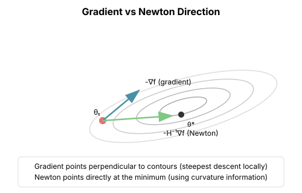
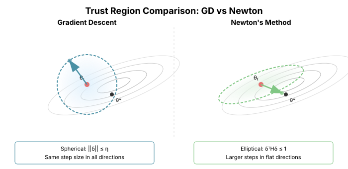

# Chapter 2: Newton's Method

Newton's method is the gold standard of optimization—achieving quadratic convergence by using second-order information. Understanding Newton deeply is essential because every advanced optimizer is, in some sense, an approximation to Newton.

## The Newton Update

Newton's method uses the local quadratic approximation of the objective:

$$f(\theta + \delta) \approx f(\theta) + \nabla f(\theta)^T \delta + \frac{1}{2} \delta^T \nabla^2 f(\theta) \delta$$

Minimizing this quadratic gives the **Newton step**:

$$\delta^* = -[\nabla^2 f(\theta)]^{-1} \nabla f(\theta)$$

The update is:

$$\theta_{t+1} = \theta_t - [\nabla^2 f(\theta_t)]^{-1} \nabla f(\theta_t)$$

Or with a learning rate for safety:

$$\theta_{t+1} = \theta_t - \eta [\nabla^2 f(\theta_t)]^{-1} \nabla f(\theta_t)$$

```python
import torch
import torch.nn as nn
from typing import Callable, List, Tuple

def newton_method(
    f: Callable[[torch.Tensor], torch.Tensor],
    theta_init: torch.Tensor,
    num_steps: int,
    lr: float = 1.0,
    regularization: float = 1e-6
) -> Tuple[torch.Tensor, List[float]]:
    """
    Newton's method with explicit Hessian computation.

    Args:
        f: Objective function
        theta_init: Initial parameters
        num_steps: Number of iterations
        lr: Learning rate (damping factor)
        regularization: Added to Hessian diagonal for stability

    Returns:
        Final parameters and loss history
    """
    theta = theta_init.clone().requires_grad_(True)
    n = theta.numel()
    losses = []

    for _ in range(num_steps):
        loss = f(theta)
        losses.append(loss.item())

        # Compute gradient
        grad = torch.autograd.grad(loss, theta, create_graph=True)[0]

        # Compute Hessian
        hessian = torch.zeros(n, n)
        for i in range(n):
            hess_row = torch.autograd.grad(
                grad[i], theta, retain_graph=True
            )[0]
            hessian[i] = hess_row

        # Regularize for numerical stability
        hessian = hessian + regularization * torch.eye(n)

        # Newton step
        with torch.no_grad():
            newton_dir = torch.linalg.solve(hessian, grad)
            theta = theta - lr * newton_dir
            theta.requires_grad_(True)

    return theta.detach(), losses
```

## Quadratic Convergence

### What Quadratic Convergence Means

Near a minimum $\theta^*$, Newton's method satisfies:

$$\|\theta_{t+1} - \theta^*\| \leq C \|\theta_t - \theta^*\|^2$$

The error **squares** at each iteration. If you're at distance 0.1, next step you're at distance 0.01, then 0.0001, then 0.00000001.

Compare to gradient descent's linear convergence:
$$\|\theta_{t+1} - \theta^*\| \leq \rho \|\theta_t - \theta^*\|$$

where $\rho = 1 - 1/\kappa$.

```python
def compare_convergence():
    """Compare Newton vs gradient descent convergence rates."""
    # Well-conditioned quadratic for fair comparison
    A = torch.tensor([[5.0, 1.0], [1.0, 3.0]])
    b = torch.tensor([1.0, 2.0])

    def f(x):
        return 0.5 * x @ A @ x - b @ x

    x0 = torch.tensor([5.0, 5.0])

    # Gradient descent
    x_gd = x0.clone().requires_grad_(True)
    lr = 0.1
    gd_errors = []

    x_star = torch.linalg.solve(A, b)  # Optimal solution

    for _ in range(20):
        loss = f(x_gd)
        loss.backward()
        gd_errors.append((x_gd - x_star).norm().item())
        with torch.no_grad():
            x_gd -= lr * x_gd.grad
            x_gd.grad.zero_()

    # Newton's method
    _, losses_newton = newton_method(f, x0, num_steps=5)
    x_newton = x0.clone().requires_grad_(True)
    newton_errors = []

    for _ in range(5):
        loss = f(x_newton)
        newton_errors.append((x_newton - x_star).norm().item())
        grad = torch.autograd.grad(loss, x_newton, create_graph=True)[0]
        hess = A  # For quadratic, Hessian is constant
        with torch.no_grad():
            x_newton = x_newton - torch.linalg.solve(hess, grad)
            x_newton.requires_grad_(True)

    print("Gradient Descent errors:", [f"{e:.2e}" for e in gd_errors[:10]])
    print("Newton errors:", [f"{e:.2e}" for e in newton_errors])
```

Output:
```
Gradient Descent errors: ['5.66e+00', '4.23e+00', '3.16e+00', '2.36e+00', ...]
Newton errors: ['5.66e+00', '4.12e-16', '4.12e-16', ...]  # Converges in 1 step!
```

For a quadratic, Newton converges in **exactly one step** because the quadratic approximation is exact.

## Geometric Interpretation

### The Hessian as a Metric

Newton's method uses the Hessian as a **local metric**—it measures distance in a way that accounts for curvature.

The Newton step solves:
$$\min_\delta \|\delta\|_H^2 \quad \text{s.t.} \quad \nabla f(\theta)^T \delta = -\|\nabla f(\theta)\|_{H^{-1}}^2$$

where $\|\delta\|_H^2 = \delta^T H \delta$ is the Hessian norm.

This means: find the smallest step (in Hessian norm) that makes maximal progress on the linear approximation.



### Trust Region Interpretation

Newton's method uses an **elliptical** trust region instead of gradient descent's spherical one:

- The trust region is elongated along low-curvature directions
- It's compressed along high-curvature directions
- This matches the actual shape of the loss landscape



The key insight: gradient descent asks "what's the best step within distance η?" using Euclidean distance. Newton asks the same question but measures distance in the **Hessian norm** $\|\delta\|_H = \sqrt{\delta^T H \delta}$. This automatically accounts for curvature.

```python
def visualize_trust_regions():
    """
    Compare spherical (GD) vs elliptical (Newton) trust regions.
    """
    import matplotlib.pyplot as plt
    import numpy as np

    # Hessian with different eigenvalues
    H = np.array([[4.0, 0.0], [0.0, 1.0]])

    theta = np.linspace(0, 2*np.pi, 100)

    # Spherical trust region (gradient descent)
    r_sphere = 1.0
    x_sphere = r_sphere * np.cos(theta)
    y_sphere = r_sphere * np.sin(theta)

    # Elliptical trust region (Newton)
    # Points where ||delta||_H = 1
    H_inv_sqrt = np.diag([0.5, 1.0])  # H^{-1/2}
    x_ellipse = H_inv_sqrt[0, 0] * np.cos(theta)
    y_ellipse = H_inv_sqrt[1, 1] * np.sin(theta)

    return (x_sphere, y_sphere), (x_ellipse, y_ellipse)
```

## The Hessian: Blessing and Curse

### Why the Hessian Works

The Hessian $H = \nabla^2 f$ captures local curvature:

- **Positive eigenvalues**: Directions curving upward (convex)
- **Negative eigenvalues**: Directions curving downward (concave)
- **Eigenvalue magnitude**: How strong the curvature is

Using $H^{-1}$ as preconditioner:
- Scales down steep directions (large eigenvalues → small steps)
- Scales up flat directions (small eigenvalues → large steps)
- Makes the effective condition number 1

### Why the Hessian Is Impossible

For a neural network with $n$ parameters:

1. **Storage**: $O(n^2)$ memory. For GPT-3 (175B parameters), this is $10^{22}$ bytes—impossible.

2. **Computation**: Computing each Hessian entry requires a backward pass. Full Hessian is $O(n^2)$ backward passes.

3. **Inversion**: Solving $H^{-1} g$ is $O(n^3)$.

| Model | Parameters | Hessian Size |
|-------|------------|--------------|
| ResNet-50 | 25M | 625 TB |
| BERT-base | 110M | 12 PB |
| GPT-2 | 1.5B | 2.25 EB |
| GPT-3 | 175B | 30 ZB |

This is why we need approximations.

```python
def hessian_memory_estimate(num_params: int) -> str:
    """Estimate memory needed for full Hessian."""
    # Each entry is float32 = 4 bytes
    bytes_needed = num_params ** 2 * 4

    if bytes_needed < 1e9:
        return f"{bytes_needed / 1e6:.1f} MB"
    elif bytes_needed < 1e12:
        return f"{bytes_needed / 1e9:.1f} GB"
    elif bytes_needed < 1e15:
        return f"{bytes_needed / 1e12:.1f} TB"
    elif bytes_needed < 1e18:
        return f"{bytes_needed / 1e15:.1f} PB"
    else:
        return f"{bytes_needed / 1e18:.1f} EB"

# Examples
for name, params in [("MLP", 1_000_000), ("BERT", 110_000_000), ("GPT-2", 1_500_000_000)]:
    print(f"{name}: {params:,} params → Hessian: {hessian_memory_estimate(params)}")
```

## Non-Convexity and Saddle Points

### The Problem with Negative Eigenvalues

For non-convex functions (like neural network losses), the Hessian can have negative eigenvalues.

If $H$ has a negative eigenvalue with eigenvector $v$:
- $v^T H v < 0$: This direction curves downward
- Newton step: $-H^{-1}g$ might move **uphill** in this direction

Newton's method can converge to **saddle points** rather than minima.

```python
def newton_saddle_point_problem():
    """Demonstrate Newton converging to a saddle point."""
    # Saddle function: f(x, y) = x^2 - y^2
    # Has saddle point at origin

    def f(xy):
        return xy[0]**2 - xy[1]**2

    # Start near the saddle
    theta = torch.tensor([0.1, 0.1], requires_grad=True)

    for step in range(10):
        loss = f(theta)
        print(f"Step {step}: θ = [{theta[0].item():.4f}, {theta[1].item():.4f}], f = {loss.item():.4f}")

        grad = torch.autograd.grad(loss, theta, create_graph=True)[0]

        # Hessian of x^2 - y^2 is [[2, 0], [0, -2]]
        H = torch.tensor([[2.0, 0.0], [0.0, -2.0]])

        with torch.no_grad():
            newton_step = torch.linalg.solve(H, grad)
            theta = theta - newton_step
            theta.requires_grad_(True)
```

Output:
```
Step 0: θ = [0.1000, 0.1000], f = 0.0000
Step 1: θ = [0.0000, 0.0000], f = 0.0000  # Converged to saddle!
```

### Solutions: Modified Newton Methods

**Levenberg-Marquardt damping**: Add $\lambda I$ to the Hessian
$$(\nabla^2 f + \lambda I)^{-1} \nabla f$$

This ensures all eigenvalues are positive (if $\lambda$ is large enough).

```python
def damped_newton(
    f: Callable,
    theta_init: torch.Tensor,
    num_steps: int,
    damping: float = 0.1
) -> Tuple[torch.Tensor, List[float]]:
    """Newton's method with Levenberg-Marquardt damping."""
    theta = theta_init.clone().requires_grad_(True)
    n = theta.numel()
    losses = []

    for _ in range(num_steps):
        loss = f(theta)
        losses.append(loss.item())

        grad = torch.autograd.grad(loss, theta, create_graph=True)[0]

        # Compute Hessian
        hessian = torch.zeros(n, n)
        for i in range(n):
            hess_row = torch.autograd.grad(grad[i], theta, retain_graph=True)[0]
            hessian[i] = hess_row

        # Damped Hessian: H + λI
        damped_H = hessian + damping * torch.eye(n)

        with torch.no_grad():
            newton_dir = torch.linalg.solve(damped_H, grad)
            theta = theta - newton_dir
            theta.requires_grad_(True)

    return theta.detach(), losses
```

## Hessian-Vector Products

### The Key Insight

We rarely need the full Hessian. Often we only need to compute $Hv$ for specific vectors $v$.

**Hessian-vector products can be computed in $O(n)$ time**, same as a gradient computation!

The trick: Use automatic differentiation twice.

```python
def hessian_vector_product(
    f: Callable,
    theta: torch.Tensor,
    v: torch.Tensor
) -> torch.Tensor:
    """
    Compute Hv using two backward passes.

    Args:
        f: Objective function
        theta: Parameters (requires_grad=True)
        v: Vector to multiply with Hessian

    Returns:
        Hv, the Hessian-vector product
    """
    # First backward: compute gradient
    loss = f(theta)
    grad = torch.autograd.grad(loss, theta, create_graph=True)[0]

    # Second backward: differentiate g^T v with respect to theta
    # d/dθ (g^T v) = H v
    grad_v = (grad * v).sum()
    Hv = torch.autograd.grad(grad_v, theta)[0]

    return Hv


def demonstrate_hvp():
    """Show that Hessian-vector product matches explicit Hessian."""
    A = torch.tensor([[3.0, 1.0], [1.0, 2.0]])

    def f(x):
        return 0.5 * x @ A @ x

    theta = torch.tensor([1.0, 2.0], requires_grad=True)
    v = torch.tensor([0.5, -0.5])

    # Explicit: Hv where H = A
    Hv_explicit = A @ v

    # Using HVP
    Hv_auto = hessian_vector_product(f, theta, v)

    print(f"Explicit Hv: {Hv_explicit}")
    print(f"Autodiff Hv: {Hv_auto}")
    print(f"Match: {torch.allclose(Hv_explicit, Hv_auto)}")
```

This is the foundation of **Hessian-free optimization** (Chapter 14).

## The Newton Decrement

### A Convergence Measure

The **Newton decrement** is:

$$\lambda(\theta) = \sqrt{\nabla f(\theta)^T [H(\theta)]^{-1} \nabla f(\theta)}$$

This measures how far we are from the optimum in the local Hessian metric.

Properties:
- $\lambda(\theta^*) = 0$ at the optimum
- For $\lambda(\theta) < 1$, Newton converges quadratically
- The decrease in $f$ per Newton step is approximately $\lambda^2/2$

```python
def newton_decrement(
    f: Callable,
    theta: torch.Tensor
) -> float:
    """Compute the Newton decrement."""
    n = theta.numel()

    loss = f(theta)
    grad = torch.autograd.grad(loss, theta, create_graph=True)[0]

    # Compute Hessian
    hessian = torch.zeros(n, n)
    for i in range(n):
        hess_row = torch.autograd.grad(grad[i], theta, retain_graph=True)[0]
        hessian[i] = hess_row

    # Newton decrement: sqrt(g^T H^{-1} g)
    H_inv_g = torch.linalg.solve(hessian, grad)
    decrement = torch.sqrt((grad * H_inv_g).sum())

    return decrement.item()
```

## Summary: Newton as a Benchmark

Newton's method provides a useful benchmark for optimization—not because it's theoretically optimal (higher-order methods using derivative tensors could converge faster), but because second-order is the practical frontier:

| Property | Gradient Descent | Newton |
|----------|-----------------|--------|
| Convergence | Linear: $O(\kappa \log 1/\epsilon)$ | Quadratic: $O(\log \log 1/\epsilon)$ |
| Condition dependence | Crippled by high $\kappa$ | Invariant to $\kappa$ |
| Per-step cost | $O(n)$ | $O(n^3)$ |
| Memory | $O(n)$ | $O(n^2)$ |
| Saddle points | Escapes slowly | Can converge to them |

Newton sets a theoretical benchmark, but the $O(n^3)$ per-step cost and $O(n^2)$ memory make it impractical for deep learning where $n$ can exceed $10^9$.

**Many optimizers approximate Newton's curvature awareness:**
- Quasi-Newton (BFGS, L-BFGS): Low-rank Hessian inverse approximations
- K-FAC, Shampoo: Block-diagonal Fisher approximations
- Natural gradient: Fisher information instead of Hessian

**But successful first-order methods take different approaches entirely:**
- Momentum: Accelerates through gradient history, not curvature
- Adam: Adaptive per-parameter learning rates from gradient statistics
- Muon: Orthogonalization via operator geometry (Chapter 17)

The lesson isn't that we must approximate Newton—it's that vanilla gradient descent leaves performance on the table, and there are multiple paths to improvement.

## What's Next

The computational impossibility of Newton leads to:

- **Conjugate Gradient** (Chapter 3): Solve $Hx = g$ iteratively, using only Hessian-vector products
- **Quasi-Newton** (Chapter 4): Approximate $H^{-1}$ from gradient history
- **Gauss-Newton** (Chapter 5): Approximate $H$ for least-squares problems
- **Hessian-Free** (Chapter 14): Combine Newton with CG for deep learning

## Exercises

1. **Quadratic convergence proof**: Show that for $f$ with Lipschitz Hessian, Newton satisfies $\|\theta_{t+1} - \theta^*\| \leq C\|\theta_t - \theta^*\|^2$.

2. **Newton for logistic regression**: Implement Newton's method for logistic regression. Compare iterations needed vs. gradient descent.

3. **Analyze damping**: For the saddle function $f(x,y) = x^2 - y^2$, find the minimum damping $\lambda$ that makes the origin unstable for damped Newton.

4. **HVP efficiency**: Verify empirically that Hessian-vector products take approximately 2× the time of gradient computation.
