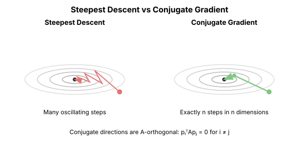
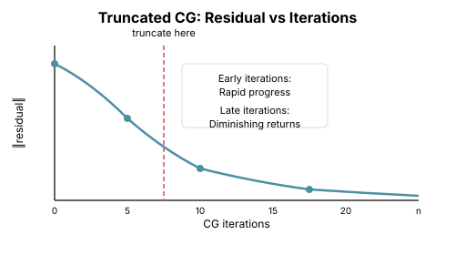

# Chapter 3: Conjugate Gradient

Conjugate Gradient (CG) is one of the most elegant algorithms in numerical optimization. It solves linear systems $Ax = b$ without ever forming the matrix $A$—only requiring matrix-vector products. This makes it the key enabling technology for Hessian-free optimization in deep learning.

## The Problem: Solving Linear Systems

Newton's method requires solving:

$$H \delta = -g$$

where $H = \nabla^2 f$ is the Hessian and $g = \nabla f$ is the gradient.

Direct solution via $\delta = -H^{-1}g$ requires:
- **$O(n^2)$** memory to store H
- **$O(n^3)$** time to solve the system

CG solves this using only **$O(n)$** memory and **$O(kn)$** time, where $k$ is typically small.

## Conjugate Directions

### The Key Insight

Consider a quadratic $f(x) = \frac{1}{2}x^TAx - b^Tx$. Its minimum is at $x^* = A^{-1}b$.

A set of directions $\{p_0, p_1, \ldots, p_{n-1}\}$ is **A-conjugate** if:

$$p_i^T A p_j = 0 \quad \text{for } i \neq j$$

This is orthogonality in the **A-inner product**: $\langle u, v \rangle_A = u^T A v$.

**Remarkable fact**: If you search along n A-conjugate directions, you find the exact minimum in exactly n steps.



```python
import torch
from typing import Callable, Tuple, List, Optional

def conjugate_gradient(
    A: torch.Tensor,
    b: torch.Tensor,
    x0: Optional[torch.Tensor] = None,
    max_iter: Optional[int] = None,
    tol: float = 1e-10
) -> Tuple[torch.Tensor, List[float]]:
    """
    Conjugate Gradient for solving Ax = b.

    Args:
        A: Symmetric positive definite matrix (n x n)
        b: Right-hand side vector (n,)
        x0: Initial guess (default: zeros)
        max_iter: Maximum iterations (default: n)
        tol: Convergence tolerance

    Returns:
        Solution x and residual history
    """
    n = b.shape[0]
    if x0 is None:
        x = torch.zeros_like(b)
    else:
        x = x0.clone()

    if max_iter is None:
        max_iter = n

    # Initial residual r = b - Ax
    r = b - A @ x
    p = r.clone()  # Initial search direction
    rs_old = r @ r  # ||r||^2

    residuals = [rs_old.sqrt().item()]

    for i in range(max_iter):
        # Matrix-vector product (the expensive part)
        Ap = A @ p

        # Step size: minimize along direction p
        alpha = rs_old / (p @ Ap)

        # Update solution
        x = x + alpha * p

        # Update residual
        r = r - alpha * Ap

        rs_new = r @ r

        residuals.append(rs_new.sqrt().item())

        # Check convergence
        if rs_new.sqrt() < tol:
            break

        # Conjugate direction for next iteration
        beta = rs_new / rs_old
        p = r + beta * p

        rs_old = rs_new

    return x, residuals
```

## Why CG Works

### The Krylov Subspace

After k iterations, CG has explored the **Krylov subspace**:

$$\mathcal{K}_k(A, b) = \text{span}\{b, Ab, A^2b, \ldots, A^{k-1}b\}$$

CG finds the **best solution within this subspace**—the x that minimizes $\|x - x^*\|_A$.

```python
def demonstrate_krylov():
    """Show how CG explores Krylov subspaces."""
    # 3x3 system for visualization
    A = torch.tensor([
        [4.0, 1.0, 0.0],
        [1.0, 3.0, 1.0],
        [0.0, 1.0, 2.0]
    ])
    b = torch.tensor([1.0, 2.0, 3.0])

    # Build Krylov basis explicitly
    K = [b]
    for i in range(2):
        K.append(A @ K[-1])

    print("Krylov vectors:")
    for i, v in enumerate(K):
        print(f"  A^{i} b = {v}")

    # CG solution at each step
    x, residuals = conjugate_gradient(A, b, max_iter=3)

    print(f"\nCG converges in {len(residuals)-1} iterations")
    print(f"Solution: {x}")
    print(f"True solution: {torch.linalg.solve(A, b)}")
```

### Convergence Rate

For a matrix with condition number $\kappa$:

$$\|x_k - x^*\|_A \leq 2\left(\frac{\sqrt{\kappa} - 1}{\sqrt{\kappa} + 1}\right)^k \|x_0 - x^*\|_A$$

Key observations:
- Convergence depends on $\sqrt{\kappa}$, not $\kappa$ (much better than gradient descent!)
- For well-conditioned systems ($\kappa$ small), converges in few iterations
- Worst case: n iterations for exact solution

```python
def cg_convergence_analysis():
    """Analyze CG convergence on systems with different condition numbers."""

    for kappa in [10, 100, 1000]:
        # Diagonal matrix with condition number kappa
        n = 100
        eigenvalues = torch.linspace(1, kappa, n)
        A = torch.diag(eigenvalues)
        b = torch.randn(n)

        x, residuals = conjugate_gradient(A, b, max_iter=200)

        # Find iteration where residual < 1e-6
        for i, r in enumerate(residuals):
            if r < 1e-6:
                print(f"κ = {kappa}: converged in {i} iterations")
                break
        else:
            print(f"κ = {kappa}: residual after 200 iters = {residuals[-1]:.2e}")

        # Theoretical bound: k ≈ sqrt(κ) * log(2/ε)
        theory = int(0.5 * kappa**0.5 * 13.8)  # log(2/1e-6) ≈ 13.8
        print(f"  Theoretical bound: ~{theory} iterations")
```

## The Matrix-Free Property

### Only Needing Ax

The crucial insight: **CG only accesses A through matrix-vector products**.

Look at the algorithm:
- We never index into A
- We never store A
- We only compute `A @ p`

This means we can use CG when:
1. A is too large to store
2. A is defined implicitly (like a Hessian)
3. We can compute Av efficiently without forming A

```python
def matrix_free_cg(
    matvec: Callable[[torch.Tensor], torch.Tensor],
    b: torch.Tensor,
    max_iter: int = 100,
    tol: float = 1e-6
) -> Tuple[torch.Tensor, List[float]]:
    """
    Matrix-free conjugate gradient.

    Args:
        matvec: Function computing A @ v for any vector v
        b: Right-hand side
        max_iter: Maximum iterations
        tol: Convergence tolerance

    Returns:
        Solution and residual history
    """
    x = torch.zeros_like(b)
    r = b - matvec(x)  # r = b since x = 0
    p = r.clone()
    rs_old = r @ r

    residuals = [rs_old.sqrt().item()]

    for _ in range(max_iter):
        Ap = matvec(p)  # Only place we use A!

        alpha = rs_old / (p @ Ap)
        x = x + alpha * p
        r = r - alpha * Ap

        rs_new = r @ r
        residuals.append(rs_new.sqrt().item())

        if rs_new.sqrt() < tol:
            break

        beta = rs_new / rs_old
        p = r + beta * p
        rs_old = rs_new

    return x, residuals
```

### CG for the Hessian

Since we can compute Hessian-vector products in $O(n)$ time (Chapter 2), we can use CG to solve Newton systems:

```python
def cg_newton_step(
    loss_fn: Callable[[torch.Tensor], torch.Tensor],
    theta: torch.Tensor,
    cg_iters: int = 10
) -> torch.Tensor:
    """
    Compute Newton step using CG (Hessian-free).

    Args:
        loss_fn: Loss function
        theta: Current parameters
        cg_iters: Number of CG iterations

    Returns:
        Approximate Newton step
    """
    # Compute gradient
    loss = loss_fn(theta)
    grad = torch.autograd.grad(loss, theta, create_graph=True)[0]

    # Define Hessian-vector product function
    def hvp(v):
        gv = (grad * v).sum()
        Hv = torch.autograd.grad(gv, theta, retain_graph=True)[0]
        return Hv

    # Solve H @ step = -grad using CG
    # Note: we solve for the negative gradient
    step, _ = matrix_free_cg(hvp, -grad.detach(), max_iter=cg_iters)

    return step
```

## Preconditioning

### When CG Is Slow

CG's convergence depends on $\sqrt{\kappa}$. For ill-conditioned systems, this is still too slow.

**Preconditioning** transforms the problem to have better conditioning.

Instead of solving $Ax = b$, we solve:

$$M^{-1}Ax = M^{-1}b$$

where M is a **preconditioner**—an easily invertible approximation to A.

The effective condition number becomes $\kappa(M^{-1}A)$, which can be much smaller.

```python
def preconditioned_cg(
    A: torch.Tensor,
    b: torch.Tensor,
    M_inv: Callable[[torch.Tensor], torch.Tensor],
    max_iter: int = 100,
    tol: float = 1e-6
) -> Tuple[torch.Tensor, List[float]]:
    """
    Preconditioned Conjugate Gradient.

    Args:
        A: Matrix (or matvec function)
        b: Right-hand side
        M_inv: Function applying M^{-1}
        max_iter: Maximum iterations
        tol: Tolerance

    Returns:
        Solution and residual history
    """
    x = torch.zeros_like(b)
    r = b.clone()
    z = M_inv(r)  # z = M^{-1} r
    p = z.clone()
    rz_old = r @ z

    residuals = [r.norm().item()]

    for _ in range(max_iter):
        Ap = A @ p
        alpha = rz_old / (p @ Ap)

        x = x + alpha * p
        r = r - alpha * Ap

        residuals.append(r.norm().item())

        if r.norm() < tol:
            break

        z = M_inv(r)
        rz_new = r @ z

        beta = rz_new / rz_old
        p = z + beta * p

        rz_old = rz_new

    return x, residuals


def demonstrate_preconditioning():
    """Show how preconditioning accelerates CG."""
    n = 100
    # Ill-conditioned system
    eigenvalues = torch.cat([
        torch.ones(90),  # 90 eigenvalues at 1
        torch.tensor([100.0] * 10)  # 10 eigenvalues at 100
    ])
    A = torch.diag(eigenvalues)
    b = torch.randn(n)

    # Standard CG
    _, residuals_std = conjugate_gradient(A, b, max_iter=50)

    # Jacobi preconditioner: M = diag(A)
    M_diag = torch.diag(A)
    M_inv = lambda r: r / M_diag

    _, residuals_precond = preconditioned_cg(A, b, M_inv, max_iter=50)

    print(f"Standard CG residual after 20 iters: {residuals_std[20]:.2e}")
    print(f"Preconditioned CG residual after 20 iters: {residuals_precond[20]:.2e}")
```

### Common Preconditioners

| Preconditioner | M | Cost | When to Use |
|---------------|---|------|-------------|
| Jacobi | diag(A) | $O(n)$ | Diagonally dominant A |
| Block Jacobi | Block-diag(A) | O(blocks) | Block structure |
| Incomplete Cholesky | Sparse L L^T ≈ A | O(nnz) | Sparse A |
| SSOR | Symmetric overrelaxation | O(nnz) | Sparse A |

For neural networks, diagonal and block-diagonal preconditioners are most practical.

## CG for Nonlinear Optimization

### Nonlinear CG

CG can be adapted for general (non-quadratic) optimization:

```python
def nonlinear_cg(
    f: Callable[[torch.Tensor], torch.Tensor],
    x0: torch.Tensor,
    max_iter: int = 1000,
    tol: float = 1e-6,
    method: str = 'FR'  # Fletcher-Reeves
) -> Tuple[torch.Tensor, List[float]]:
    """
    Nonlinear Conjugate Gradient.

    Args:
        f: Objective function
        x0: Initial point
        max_iter: Maximum iterations
        tol: Gradient norm tolerance
        method: 'FR' (Fletcher-Reeves) or 'PR' (Polak-Ribière)

    Returns:
        Solution and loss history
    """
    x = x0.clone().requires_grad_(True)
    losses = []

    # Initial gradient
    loss = f(x)
    losses.append(loss.item())
    grad = torch.autograd.grad(loss, x)[0]
    p = -grad.clone()  # Initial direction = negative gradient
    grad_old = grad.clone()

    for i in range(max_iter):
        # Line search (simple backtracking)
        alpha = 1.0
        x_new = x.detach() - alpha * p
        x_new.requires_grad_(True)

        for _ in range(20):  # Line search iterations
            loss_new = f(x_new)
            if loss_new < loss - 1e-4 * alpha * (grad @ p):
                break
            alpha *= 0.5
            x_new = (x.detach() - alpha * p).requires_grad_(True)

        x = x_new
        loss = f(x)
        losses.append(loss.item())

        grad = torch.autograd.grad(loss, x)[0]

        if grad.norm() < tol:
            break

        # Compute beta
        if method == 'FR':
            # Fletcher-Reeves
            beta = (grad @ grad) / (grad_old @ grad_old)
        else:
            # Polak-Ribière
            beta = (grad @ (grad - grad_old)) / (grad_old @ grad_old)
            beta = max(0, beta)  # Reset if negative

        # Update direction
        p = -grad + beta * p
        grad_old = grad.clone()

    return x.detach(), losses
```

### Why Nonlinear CG Differs

For quadratics, CG is exact because:
1. The Hessian is constant
2. Conjugacy is preserved across iterations

For general functions:
- The "Hessian" changes at each point
- Conjugacy is only approximate
- We need line search for stability
- Periodic restarts help (reset to steepest descent)

## Truncated CG: The Key to Hessian-Free

### Early Stopping

For Newton's method in deep learning, we don't need an exact solution to $Hx = g$.

**Truncated CG**: Stop after k << n iterations.

Why this works:
1. Early CG iterations make rapid progress
2. Later iterations refine increasingly small errors
3. The Hessian itself is approximate (due to stochasticity)

```python
def truncated_cg_newton(
    loss_fn: Callable,
    theta: torch.Tensor,
    cg_iters: int = 10,
    damping: float = 1e-2
) -> torch.Tensor:
    """
    Truncated CG for approximate Newton step.

    This is the core of Hessian-free optimization.
    """
    loss = loss_fn(theta)
    grad = torch.autograd.grad(loss, theta, create_graph=True)[0]

    def hvp(v):
        gv = (grad * v).sum()
        Hv = torch.autograd.grad(gv, theta, retain_graph=True)[0]
        # Add damping for stability
        return Hv + damping * v

    # Only run a few CG iterations
    step, _ = matrix_free_cg(hvp, -grad.detach(), max_iter=cg_iters)

    return step
```

### How Many Iterations?

Practical guidelines:
- **10-50 iterations** typical for deep learning
- More iterations = more accurate Newton direction
- Diminishing returns after the first few
- Computation: k HVPs ≈ 2k backward passes



## Key Takeaways

1. **CG solves linear systems in $O(n)$ memory** using only matrix-vector products

2. **Convergence depends on $\sqrt{\kappa}$**, much better than gradient descent's $\kappa$

3. **Matrix-free nature** enables use with implicit matrices (Hessians)

4. **Truncated CG** gives approximate Newton steps cheaply

5. **Preconditioning** is crucial for ill-conditioned problems

6. **CG is the computational core of Hessian-free optimization**

## What's Next

- **Chapter 4 (Quasi-Newton)**: Another approach—approximate H⁻¹ from gradient history
- **Chapter 5 (Gauss-Newton)**: Special Hessian structure for least-squares
- **Chapter 14 (Hessian-Free)**: Putting CG to work in deep learning

## Further Reading

The definitive introduction to conjugate gradient is Jonathan Shewchuk's masterpiece:

**[An Introduction to the Conjugate Gradient Method Without the Agonizing Pain](https://www.cs.cmu.edu/~quake-papers/painless-conjugate-gradient.pdf)** (CMU, 1994)

This beautifully illustrated 64-page tutorial builds CG from first principles with geometric intuition. It covers:
- Why steepest descent fails on elongated quadratics
- The geometric meaning of A-conjugacy
- Gram-Schmidt orthogonalization and its connection to CG
- Preconditioning and convergence analysis

If you want to deeply understand CG, Shewchuk's tutorial is essential reading.

## Exercises

1. **Verify conjugacy**: Implement CG and verify that the search directions satisfy $p_i^T A p_j = 0$.

2. **Eigenvalue convergence**: For a diagonal matrix, show that CG converges to components along small eigenvalues first.

3. **Preconditioner comparison**: Compare Jacobi preconditioning vs no preconditioning on a random ill-conditioned system.

4. **Truncation study**: For a neural network loss, plot how the Newton step quality varies with number of CG iterations.

5. **Implement restart**: Modify nonlinear CG to restart every n iterations. Does it help convergence?
