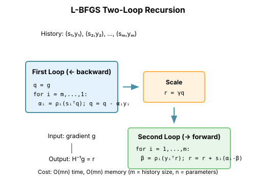

# Chapter 4: Quasi-Newton Methods

Quasi-Newton methods approximate the Hessian (or its inverse) from gradient information alone. They achieve superlinear convergence—faster than gradient descent but without the O(n²) cost of Newton's method.

## The Core Idea

Newton's method uses $H^{-1} g$. We can't compute or store H for large problems.

**Quasi-Newton insight**: Build an approximation $B \approx H$ (or $B^{-1} \approx H^{-1}$) incrementally from the gradients we observe.

At each step, we require the approximation to satisfy the **secant condition**:

$$B_{k+1} s_k = y_k$$

where:
- $s_k = \theta_{k+1} - \theta_k$ (step taken)
- $y_k = g_{k+1} - g_k$ (gradient change)

This says: "the approximation should match the curvature we actually observed."

## BFGS: The Gold Standard

### The BFGS Update

BFGS (Broyden-Fletcher-Goldfarb-Shanno) maintains an approximation $B_k^{-1}$ to the inverse Hessian:

$$B_{k+1}^{-1} = \left(I - \rho_k s_k y_k^T\right) B_k^{-1} \left(I - \rho_k y_k s_k^T\right) + \rho_k s_k s_k^T$$

where $\rho_k = \frac{1}{y_k^T s_k}$.

```python
import torch
from typing import Callable, List, Tuple, Optional

def bfgs(
    f: Callable[[torch.Tensor], torch.Tensor],
    x0: torch.Tensor,
    max_iter: int = 100,
    tol: float = 1e-6
) -> Tuple[torch.Tensor, List[float]]:
    """
    BFGS quasi-Newton optimization.

    Args:
        f: Objective function
        x0: Initial point
        max_iter: Maximum iterations
        tol: Gradient norm tolerance

    Returns:
        Solution and loss history
    """
    n = x0.numel()
    x = x0.clone().requires_grad_(True)

    # Initialize inverse Hessian approximation to identity
    B_inv = torch.eye(n)

    losses = []

    # Initial gradient
    loss = f(x)
    losses.append(loss.item())
    grad = torch.autograd.grad(loss, x)[0]

    for k in range(max_iter):
        if grad.norm() < tol:
            break

        # Search direction
        p = -B_inv @ grad

        # Line search (backtracking)
        alpha = 1.0
        x_new = x.detach() + alpha * p
        x_new.requires_grad_(True)

        for _ in range(20):
            loss_new = f(x_new)
            # Armijo condition
            if loss_new < loss + 1e-4 * alpha * (grad @ p):
                break
            alpha *= 0.5
            x_new = (x.detach() + alpha * p).requires_grad_(True)

        # Compute gradient at new point
        loss = f(x_new)
        losses.append(loss.item())
        grad_new = torch.autograd.grad(loss, x_new)[0]

        # BFGS update
        s = x_new.detach() - x.detach()  # Step
        y = grad_new - grad  # Gradient change

        rho = 1.0 / (y @ s + 1e-10)

        # Sherman-Morrison-Woodbury update
        I = torch.eye(n)
        B_inv = (I - rho * s.outer(y)) @ B_inv @ (I - rho * y.outer(s)) + rho * s.outer(s)

        x = x_new
        grad = grad_new

    return x.detach(), losses
```

### Why BFGS Works

1. **Secant condition**: $B_{k+1} s_k = y_k$ ensures the approximation matches observed curvature

2. **Positive definiteness**: If $y_k^T s_k > 0$ and $B_k$ is positive definite, so is $B_{k+1}$

3. **Minimal change**: BFGS makes the smallest possible update to $B_k$ that satisfies the secant condition

4. **Superlinear convergence**: Near a minimum, BFGS converges faster than linear (but not quite quadratic)

```python
def compare_convergence_rates():
    """Compare gradient descent, BFGS, and Newton."""
    # Rosenbrock function: hard to optimize
    def rosenbrock(x):
        return (1 - x[0])**2 + 100 * (x[1] - x[0]**2)**2

    x0 = torch.tensor([-1.0, 1.0])

    # Gradient descent
    x_gd = x0.clone().requires_grad_(True)
    losses_gd = []
    lr = 0.001

    for _ in range(1000):
        loss = rosenbrock(x_gd)
        losses_gd.append(loss.item())
        loss.backward()
        with torch.no_grad():
            x_gd -= lr * x_gd.grad
            x_gd.grad.zero_()

    # BFGS
    _, losses_bfgs = bfgs(rosenbrock, x0, max_iter=100)

    print(f"GD after 1000 steps: {losses_gd[-1]:.6f}")
    print(f"BFGS after {len(losses_bfgs)} steps: {losses_bfgs[-1]:.6f}")
```

## L-BFGS: Limited-Memory BFGS

### The Memory Problem

BFGS stores the full n×n matrix $B^{-1}$. For neural networks with millions of parameters, this is prohibitive.

**L-BFGS** stores only the last m pairs $(s_i, y_i)$ and computes $B^{-1}g$ on-the-fly.

Memory: O(mn) instead of O(n²).

```python
def lbfgs(
    f: Callable[[torch.Tensor], torch.Tensor],
    x0: torch.Tensor,
    max_iter: int = 100,
    m: int = 10,  # History size
    tol: float = 1e-6
) -> Tuple[torch.Tensor, List[float]]:
    """
    L-BFGS: Limited-memory BFGS.

    Args:
        f: Objective function
        x0: Initial point
        max_iter: Maximum iterations
        m: Number of recent pairs to store
        tol: Gradient norm tolerance

    Returns:
        Solution and loss history
    """
    x = x0.clone().requires_grad_(True)

    # History buffers
    s_history = []  # Steps
    y_history = []  # Gradient differences
    rho_history = []  # 1 / (y^T s)

    losses = []

    loss = f(x)
    losses.append(loss.item())
    grad = torch.autograd.grad(loss, x)[0]

    for k in range(max_iter):
        if grad.norm() < tol:
            break

        # Compute search direction via two-loop recursion
        q = grad.clone()

        # First loop: right to left
        alphas = []
        for s, y, rho in zip(reversed(s_history), reversed(y_history), reversed(rho_history)):
            alpha = rho * (s @ q)
            alphas.append(alpha)
            q = q - alpha * y

        alphas = list(reversed(alphas))

        # Initial Hessian approximation (scaled identity)
        if len(s_history) > 0:
            s_last, y_last = s_history[-1], y_history[-1]
            gamma = (s_last @ y_last) / (y_last @ y_last + 1e-10)
        else:
            gamma = 1.0

        r = gamma * q

        # Second loop: left to right
        for i, (s, y, rho) in enumerate(zip(s_history, y_history, rho_history)):
            beta = rho * (y @ r)
            r = r + s * (alphas[i] - beta)

        p = -r  # Search direction

        # Line search
        alpha = 1.0
        x_new = x.detach() + alpha * p
        x_new.requires_grad_(True)

        for _ in range(20):
            loss_new = f(x_new)
            if loss_new < loss + 1e-4 * alpha * (grad @ p):
                break
            alpha *= 0.5
            x_new = (x.detach() + alpha * p).requires_grad_(True)

        loss = f(x_new)
        losses.append(loss.item())
        grad_new = torch.autograd.grad(loss, x_new)[0]

        # Update history
        s = x_new.detach() - x.detach()
        y = grad_new - grad
        rho = 1.0 / (y @ s + 1e-10)

        if len(s_history) >= m:
            s_history.pop(0)
            y_history.pop(0)
            rho_history.pop(0)

        s_history.append(s)
        y_history.append(y)
        rho_history.append(rho)

        x = x_new
        grad = grad_new

    return x.detach(), losses
```

### The Two-Loop Recursion

L-BFGS computes $H^{-1}g$ efficiently using the two-loop recursion:

**First loop** (backward through history):
```
q = g
for i = k-1, ..., k-m:
    α_i = ρ_i * s_i^T q
    q = q - α_i * y_i
```

**Apply initial Hessian**: $r = H_0 q$ (often $H_0 = \gamma I$)

**Second loop** (forward through history):
```
for i = k-m, ..., k-1:
    β = ρ_i * y_i^T r
    r = r + s_i * (α_i - β)
return r
```

This computes the matrix-vector product in O(mn) without forming the matrix.



## L-BFGS in Deep Learning

### PyTorch's LBFGS

PyTorch provides L-BFGS as `torch.optim.LBFGS`:

```python
import torch
import torch.nn as nn

def train_with_lbfgs():
    """Example of L-BFGS for neural network training."""
    # Simple problem: fit a sine wave
    torch.manual_seed(42)

    X = torch.linspace(0, 2 * 3.14159, 100).unsqueeze(1)
    y = torch.sin(X)

    model = nn.Sequential(
        nn.Linear(1, 50),
        nn.Tanh(),
        nn.Linear(50, 1)
    )

    optimizer = torch.optim.LBFGS(
        model.parameters(),
        lr=1.0,
        max_iter=20,
        history_size=10,
        line_search_fn='strong_wolfe'
    )

    losses = []

    def closure():
        optimizer.zero_grad()
        pred = model(X)
        loss = nn.MSELoss()(pred, y)
        loss.backward()
        losses.append(loss.item())
        return loss

    for epoch in range(10):
        optimizer.step(closure)
        print(f"Epoch {epoch}: loss = {losses[-1]:.6f}")

    return losses
```

### Why L-BFGS Often Fails for Deep Learning

L-BFGS was designed for smooth, deterministic optimization. Deep learning violates these assumptions:

1. **Stochastic gradients**: Each minibatch gives a different gradient. The $(s, y)$ pairs from different batches are inconsistent.

2. **Non-convexity**: L-BFGS assumes locally convex structure. Neural networks have saddle points and flat regions.

3. **Scale mismatch**: Different layers have wildly different gradient scales. A single global curvature approximation is inadequate.

4. **Memory**: Even m=10 pairs means 20n floats. For large models, this is prohibitive.

```python
def lbfgs_stochastic_failure():
    """Demonstrate L-BFGS instability with stochastic gradients."""
    torch.manual_seed(42)

    n_samples = 1000
    X = torch.randn(n_samples, 100)
    y = torch.randn(n_samples, 1)

    model = nn.Sequential(
        nn.Linear(100, 50),
        nn.ReLU(),
        nn.Linear(50, 1)
    )

    # Full batch - L-BFGS works well
    optimizer = torch.optim.LBFGS(model.parameters(), lr=0.1)

    def closure_full():
        optimizer.zero_grad()
        loss = nn.MSELoss()(model(X), y)
        loss.backward()
        return loss

    for _ in range(10):
        loss = optimizer.step(closure_full)
        print(f"Full batch loss: {loss:.4f}")

    # Reset model
    for p in model.parameters():
        p.data = torch.randn_like(p.data) * 0.1

    # Minibatch - L-BFGS struggles
    batch_size = 32
    for epoch in range(5):
        perm = torch.randperm(n_samples)
        for i in range(0, n_samples, batch_size):
            batch_X = X[perm[i:i+batch_size]]
            batch_y = y[perm[i:i+batch_size]]

            def closure():
                optimizer.zero_grad()
                loss = nn.MSELoss()(model(batch_X), batch_y)
                loss.backward()
                return loss

            try:
                loss = optimizer.step(closure)
            except RuntimeError as e:
                print(f"L-BFGS failed: {e}")
                break
```

## Comparison: When to Use What

| Method | Memory | Per-Iter Cost | Best For |
|--------|--------|---------------|----------|
| Gradient Descent | O(n) | O(n) | Simple, convex |
| BFGS | O(n²) | O(n²) | Small problems, exact Hessian not available |
| L-BFGS | O(mn) | O(mn) | Medium problems, deterministic gradients |
| Newton/CG | O(n) | O(kn) | When HVPs are cheap |

### Practical Guidelines

**Use L-BFGS when**:
- Full-batch training is feasible
- Problem is medium-sized (thousands to millions of parameters)
- Smooth, well-conditioned objective
- Fine-tuning, not training from scratch

**Avoid L-BFGS when**:
- Using minibatch training
- Very large models (memory)
- Highly non-convex landscapes
- Need distributed training

## The Secant Condition and Curvature

### Understanding the Secant Condition

The secant condition $Bs = y$ comes from the mean value theorem:

$$g(\theta + s) - g(\theta) = \left[\int_0^1 H(\theta + ts) dt\right] s$$

So $y = \bar{H} s$ where $\bar{H}$ is the "average" Hessian along the step.

The secant condition says: "match the curvature we observed."

### The Curvature Condition

For BFGS to work, we need $y^T s > 0$:

$$y^T s = (g_{k+1} - g_k)^T (x_{k+1} - x_k) > 0$$

This means: the gradient component along our step should increase.

For convex functions, this is automatic. For non-convex functions (like neural networks), violations occur frequently.

```python
def check_curvature_condition():
    """Monitor the curvature condition during optimization."""
    def nonconvex_function(x):
        # x^4 - x^2: has local min at ±1/√2, saddle at 0
        return x[0]**4 - x[0]**2 + x[1]**2

    x = torch.tensor([0.1, 0.1], requires_grad=True)

    s_list = []
    y_list = []
    curvature_ok = []

    grad_old = None

    for i in range(50):
        loss = nonconvex_function(x)
        grad = torch.autograd.grad(loss, x)[0]

        if grad_old is not None:
            s = x.detach() - x_old
            y = grad - grad_old
            ys = (y @ s).item()

            s_list.append(s)
            y_list.append(y)
            curvature_ok.append(ys > 0)

            if ys <= 0:
                print(f"Step {i}: curvature condition VIOLATED (y^T s = {ys:.4f})")

        x_old = x.detach().clone()
        grad_old = grad.clone()

        with torch.no_grad():
            x = x - 0.1 * grad
            x.requires_grad_(True)

    print(f"\nCurvature condition satisfied: {sum(curvature_ok)}/{len(curvature_ok)}")
```

## Key Takeaways

1. **Quasi-Newton builds curvature approximations from gradients** without computing Hessians

2. **BFGS achieves superlinear convergence** with O(n²) memory

3. **L-BFGS reduces memory to O(mn)** using the two-loop recursion

4. **The secant condition** is the key constraint: match observed curvature

5. **Stochastic gradients break quasi-Newton** because the curvature signals are noisy

6. **Use L-BFGS for fine-tuning**, not general deep learning training

## What's Next

- **Chapter 5 (Gauss-Newton)**: A different Hessian approximation for least-squares
- **Chapter 6 (Why These Break)**: Understanding the deep learning scaling wall
- **Chapter 14 (Hessian-Free)**: Combining CG with curvature for deep learning

## Exercises

1. **Implement SR1**: The symmetric rank-1 update is simpler than BFGS. Implement it and compare.

2. **History size study**: For L-BFGS, how does convergence change with history size m?

3. **Curvature condition**: Implement a "damped BFGS" that handles $y^T s \leq 0$ by interpolating with a damped update.

4. **Stochastic quasi-Newton**: Implement a simple stochastic quasi-Newton that only uses (s, y) pairs when the curvature condition is satisfied.
