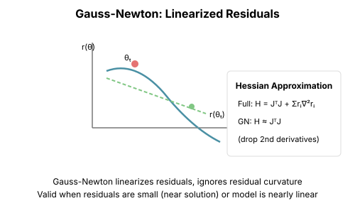

# Chapter 5: Gauss-Newton and the Least-Squares Structure

**How this differs from Newton (Chapter 2)**: Newton uses the exact Hessian $\nabla^2 L$. Gauss-Newton is a *specific approximation* that replaces $\nabla^2 L$ with $J^TJ$ (the Jacobian of residuals). This approximation only makes sense for least-squares losses—but when it applies, it has special properties that Newton lacks (always positive semi-definite, connects to Fisher information).

**Important context**: Like Newton, Gauss-Newton is not a practical optimizer for neural networks. Computing the full Jacobian for a modern network is completely intractable—ResNet-50 would require storing 25 trillion elements. Nobody uses Gauss-Newton directly for deep learning.

So why dedicate a chapter to it? Because Gauss-Newton is *foundational theory* that explains why practical methods work:

- **Adam's per-parameter scaling** approximates the diagonal of $J^TJ$
- **Natural gradient** (Chapter 15) is Gauss-Newton viewed through statistics
- **K-FAC** (Chapter 16) makes Gauss-Newton tractable via Kronecker factorization
- **The Fisher information matrix** equals the Gauss-Newton Hessian for Gaussian likelihoods

Understanding Gauss-Newton gives you the conceptual foundation to understand *why* these practical methods are designed the way they are. It's the idealized algorithm that modern optimizers approximate.

## The Core Idea

Many machine learning losses have a special structure: they're sums of squared errors. Gauss-Newton exploits this structure to get a Hessian approximation that's always positive semi-definite, cheaper to compute, and often better behaved than the true Hessian.

## The Least-Squares Problem

Consider minimizing:

$$L(\theta) = \frac{1}{2} \sum_{i=1}^{n} r_i(\theta)^2 = \frac{1}{2} \|r(\theta)\|^2$$

where $r(\theta) \in \mathbb{R}^n$ is the **residual vector**.

Examples:
- **Regression**: $r_i(\theta) = y_i - f(x_i; \theta)$
- **Neural networks with MSE loss**: $r_i(\theta) = y_i - \text{net}(x_i; \theta)$
- **Maximum likelihood** (Gaussian noise): Equivalent to least squares

## The Hessian of Least-Squares

### Exact Hessian

For $L(\theta) = \frac{1}{2}\|r(\theta)\|^2$:

$$\nabla L = J^T r$$

$$\nabla^2 L = J^T J + \sum_{i=1}^{n} r_i \nabla^2 r_i$$

where $J = \frac{\partial r}{\partial \theta}$ is the **Jacobian** of the residuals.

### The Gauss-Newton Approximation

**Drop the second term**:

$$H_{GN} = J^T J$$

Why is this reasonable?
1. **Near the solution**: If $r_i \approx 0$, the second term vanishes
2. **Always positive semi-definite**: $J^T J \succeq 0$ regardless of the landscape
3. **Cheap**: We already compute $J$ for the gradient



```python
import torch
import torch.nn as nn
from typing import Callable, List, Tuple

def compute_jacobian(
    residual_fn: Callable[[torch.Tensor], torch.Tensor],
    theta: torch.Tensor
) -> torch.Tensor:
    """
    Compute the Jacobian of residuals with respect to parameters.

    Args:
        residual_fn: Function returning residual vector
        theta: Parameters

    Returns:
        Jacobian matrix J (n_residuals x n_params)
    """
    theta = theta.clone().requires_grad_(True)
    residuals = residual_fn(theta)
    n_residuals = residuals.numel()
    n_params = theta.numel()

    J = torch.zeros(n_residuals, n_params)

    for i in range(n_residuals):
        if theta.grad is not None:
            theta.grad.zero_()

        residuals[i].backward(retain_graph=True)
        J[i] = theta.grad.clone()

    return J


def gauss_newton(
    residual_fn: Callable[[torch.Tensor], torch.Tensor],
    theta_init: torch.Tensor,
    max_iter: int = 100,
    tol: float = 1e-6,
    damping: float = 1e-4
) -> Tuple[torch.Tensor, List[float]]:
    """
    Gauss-Newton optimization.

    Args:
        residual_fn: Function returning residual vector
        theta_init: Initial parameters
        max_iter: Maximum iterations
        tol: Convergence tolerance
        damping: Levenberg-Marquardt damping

    Returns:
        Optimized parameters and loss history
    """
    theta = theta_init.clone()
    n_params = theta.numel()
    losses = []

    for iteration in range(max_iter):
        # Compute residuals and loss
        r = residual_fn(theta)
        loss = 0.5 * (r ** 2).sum()
        losses.append(loss.item())

        if loss.item() < tol:
            break

        # Compute Jacobian
        J = compute_jacobian(residual_fn, theta)

        # Gauss-Newton approximation: H ≈ J^T J
        JTJ = J.T @ J

        # Add damping for numerical stability (Levenberg-Marquardt)
        JTJ = JTJ + damping * torch.eye(n_params)

        # Gradient
        g = J.T @ r.detach()

        # Gauss-Newton step
        step = torch.linalg.solve(JTJ, -g)

        # Update
        theta = theta + step

        # Check convergence
        if step.norm() < tol:
            break

    return theta, losses
```

## Levenberg-Marquardt

### Interpolating Between Gradient Descent and Gauss-Newton

The **Levenberg-Marquardt** algorithm adds adaptive damping:

$$(J^T J + \lambda I) \delta = -J^T r$$

- **Large $\lambda$**: Behaves like gradient descent (safe, small steps)
- **Small $\lambda$**: Behaves like Gauss-Newton (fast convergence near solution)

```python
def levenberg_marquardt(
    residual_fn: Callable[[torch.Tensor], torch.Tensor],
    theta_init: torch.Tensor,
    max_iter: int = 100,
    tol: float = 1e-8
) -> Tuple[torch.Tensor, List[float]]:
    """
    Levenberg-Marquardt algorithm with adaptive damping.
    """
    theta = theta_init.clone()
    n_params = theta.numel()

    # Initial damping
    lambd = 1e-3
    nu = 2.0  # Damping adjustment factor

    losses = []
    r = residual_fn(theta)
    loss = 0.5 * (r ** 2).sum()
    losses.append(loss.item())

    for iteration in range(max_iter):
        J = compute_jacobian(residual_fn, theta)
        g = J.T @ r.detach()

        # Try Levenberg-Marquardt step
        JTJ = J.T @ J
        damped = JTJ + lambd * torch.eye(n_params)
        step = torch.linalg.solve(damped, -g)

        # Evaluate new point
        theta_new = theta + step
        r_new = residual_fn(theta_new)
        loss_new = 0.5 * (r_new ** 2).sum()

        # Compute gain ratio
        predicted_reduction = -(g @ step + 0.5 * step @ JTJ @ step)
        actual_reduction = loss - loss_new
        rho = actual_reduction / (predicted_reduction + 1e-10)

        if rho > 0:  # Accept step
            theta = theta_new
            r = r_new
            loss = loss_new
            losses.append(loss.item())

            # Decrease damping (be more aggressive)
            lambd = lambd * max(1/3, 1 - (2*rho - 1)**3)
            nu = 2.0
        else:  # Reject step
            # Increase damping (be more conservative)
            lambd = lambd * nu
            nu = 2 * nu

        if g.norm() < tol or step.norm() < tol:
            break

    return theta, losses
```

### The Trust Region Interpretation

Levenberg-Marquardt can be understood as a trust-region method:

$$\min_\delta \|r + J\delta\|^2 \quad \text{s.t.} \quad \|\delta\| \leq \Delta$$

The damping $\lambda$ plays the role of a Lagrange multiplier for the constraint.

## Connection to Fisher Information

### The Fisher Matrix

For probabilistic models with log-likelihood $\log p(y|x;\theta)$:

$$F = \mathbb{E}\left[\nabla \log p \cdot \nabla \log p^T\right]$$

The Fisher information matrix.

### Gauss-Newton ≈ Fisher

For Gaussian likelihood (equivalent to squared error):

$$p(y|x;\theta) = \mathcal{N}(y; f(x;\theta), \sigma^2 I)$$

$$\log p = -\frac{1}{2\sigma^2}\|y - f(x;\theta)\|^2 + \text{const}$$

The Fisher matrix is:

$$F = \frac{1}{\sigma^2} J^T J$$

**This is exactly the Gauss-Newton Hessian!**

```python
def demonstrate_fisher_gauss_newton_equivalence():
    """Show that Gauss-Newton Hessian equals Fisher for MSE."""
    torch.manual_seed(42)

    # Simple linear model
    n_samples, n_features = 100, 5
    X = torch.randn(n_samples, n_features)
    theta_true = torch.randn(n_features)
    y = X @ theta_true + 0.1 * torch.randn(n_samples)

    theta = torch.randn(n_features, requires_grad=True)

    # Gauss-Newton Hessian: J^T J
    residuals = y - X @ theta
    J = -X  # Jacobian of residuals
    H_gn = J.T @ J

    # Fisher information: E[∇log p ⋅ ∇log p^T]
    # For Gaussian, ∇log p = (y - Xθ)x / σ²
    # F = (1/σ²) X^T X
    sigma_sq = 0.1 ** 2  # Noise variance
    F = (1 / sigma_sq) * X.T @ X

    # They're proportional!
    print(f"Gauss-Newton H:\n{H_gn[:3, :3]}")
    print(f"Fisher (scaled):\n{(sigma_sq * F)[:3, :3]}")
    print(f"Match: {torch.allclose(H_gn, sigma_sq * F)}")
```

This connection is deep:
- **Gauss-Newton** = optimization viewpoint
- **Fisher** = statistical viewpoint
- They're the same matrix (up to scaling)!

This leads directly to **natural gradient** (Chapter 15).

## Jacobian-Vector Products

### Avoiding the Full Jacobian

For neural networks, forming the full Jacobian is expensive:

$$J \in \mathbb{R}^{n_{outputs} \times n_{params}}$$

For ImageNet (1000 classes) with ResNet-50 (25M params): J has 25 trillion elements!

Instead, we can compute:
- **Jacobian-vector products** (JVP): $Jv$ for any vector v
- **Vector-Jacobian products** (VJP): $J^T u$ for any vector u

```python
def jacobian_vector_product(
    residual_fn: Callable,
    theta: torch.Tensor,
    v: torch.Tensor
) -> torch.Tensor:
    """
    Compute Jv using forward-mode AD.
    """
    # In PyTorch, use torch.autograd.functional.jvp
    # Here's the conceptual implementation

    theta = theta.clone().requires_grad_(True)
    r = residual_fn(theta)

    # JVP: Jv = d/dt r(θ + tv)|_{t=0}
    # Use a directional derivative
    with torch.enable_grad():
        # Create a dummy function
        def r_of_t(t):
            return residual_fn(theta + t * v)

        # Differentiate at t=0
        Jv = torch.autograd.functional.jvp(
            lambda th: residual_fn(th),
            (theta,),
            (v,)
        )[1]

    return Jv


def vector_jacobian_product(
    residual_fn: Callable,
    theta: torch.Tensor,
    u: torch.Tensor
) -> torch.Tensor:
    """
    Compute J^T u using backward-mode AD.
    This is what .backward() computes!
    """
    theta = theta.clone().requires_grad_(True)
    r = residual_fn(theta)

    # VJP: J^T u = ∇_θ (u^T r)
    JTu = torch.autograd.grad((u * r).sum(), theta)[0]

    return JTu
```

### Matrix-Free Gauss-Newton

We can run CG on the Gauss-Newton system using only JVPs and VJPs:

$$(J^T J) \delta = -J^T r$$

To compute $(J^T J) v$:
1. Compute $w = Jv$ (JVP)
2. Compute $J^T w$ (VJP)

```python
def matrix_free_gauss_newton_step(
    residual_fn: Callable,
    theta: torch.Tensor,
    cg_iters: int = 20,
    damping: float = 1e-4
) -> torch.Tensor:
    """
    Compute Gauss-Newton step using matrix-free CG.
    """
    theta = theta.clone().requires_grad_(True)
    r = residual_fn(theta)

    # Gradient: J^T r
    g = torch.autograd.grad((r ** 2).sum() / 2, theta)[0]

    def gauss_newton_matvec(v):
        """Compute (J^T J + λI) v without forming J."""
        # JVP: Jv
        _, Jv = torch.autograd.functional.jvp(
            residual_fn, (theta,), (v,)
        )
        # VJP: J^T (Jv)
        JTJv = torch.autograd.grad(
            (Jv.detach() * residual_fn(theta)).sum(),
            theta,
            retain_graph=True
        )[0]
        # Add damping
        return JTJv + damping * v

    # Solve (J^T J + λI) δ = -g using CG
    delta = torch.zeros_like(g)
    residual = -g.clone()
    p = residual.clone()

    for _ in range(cg_iters):
        Ap = gauss_newton_matvec(p)
        alpha = (residual @ residual) / (p @ Ap + 1e-10)
        delta = delta + alpha * p
        residual_new = residual - alpha * Ap
        beta = (residual_new @ residual_new) / (residual @ residual + 1e-10)
        p = residual_new + beta * p
        residual = residual_new

    return delta
```

## Why This Matters for Deep Learning

You cannot run Gauss-Newton on a neural network—the Jacobian is astronomically large. But understanding it explains *why practical optimizers work*.

### The Gauss-Newton Intuition Behind Adam

Consider what the diagonal of $J^TJ$ represents: it measures how much each parameter affects the residuals. Parameters with large influence get scaled down; parameters with small influence get scaled up. This is *exactly* what Adam's $v_t$ (the exponential moving average of squared gradients) approximates.

When you write:
```python
v_t = beta2 * v_{t-1} + (1 - beta2) * g_t^2
update = g_t / (sqrt(v_t) + eps)
```

You're approximating $\text{diag}(J^TJ)^{-1/2} g$—a diagonal Gauss-Newton step.

### The Path to Practical Methods

The theoretical framework of Gauss-Newton leads to practical algorithms:

| Gauss-Newton Concept | Practical Approximation |
|---------------------|------------------------|
| Full $J^TJ$ matrix | Intractable for neural nets |
| Diagonal of $J^TJ$ | Adam, RMSprop, Adagrad |
| Block-diagonal $J^TJ$ | K-FAC (Chapter 16) |
| Kronecker-factored blocks | K-FAC, Shampoo |
| Fisher information view | Natural gradient (Chapter 15) |

### What Would Be Needed

If you could somehow use Gauss-Newton on neural networks, you'd need:

1. **Damping**: Essential for non-convex landscapes
2. **Block-diagonal approximation**: Treat each layer independently
3. **Fisher sampling**: Sample from the model's output distribution
4. **Truncation**: Use only a few CG iterations

These are exactly the modifications that K-FAC and related methods use (Chapter 16).

## Key Takeaways

1. **Gauss-Newton is foundational theory, not a practical algorithm** for deep learning—the Jacobian is intractably large

2. **$H_{GN} = J^T J$** ignores residual second derivatives—a positive semi-definite approximation

3. **Adam approximates diagonal Gauss-Newton**—this is why per-parameter learning rates work

4. **Gauss-Newton = Fisher** for Gaussian likelihood models—connecting optimization to statistics

5. **Understanding this theory** explains why K-FAC, natural gradient, and adaptive methods are designed the way they are

6. **The idealized algorithm** that practical optimizers approximate in various ways

## What's Next

- **Chapter 6 (Why These Break)**: Understanding the scaling wall for deep learning
- **Chapter 15 (Natural Gradient)**: The statistical viewpoint of Gauss-Newton
- **Chapter 16 (K-FAC)**: Practical second-order methods for deep learning

## Exercises

1. **Verify the Hessian formula**: Derive the exact Hessian of $\frac{1}{2}\|r(\theta)\|^2$ and identify the Gauss-Newton approximation.

2. **Compare convergence**: Implement Gauss-Newton and gradient descent for nonlinear regression. Compare convergence rates.

3. **Damping study**: Plot convergence of Levenberg-Marquardt for different initial damping values.

4. **Matrix-free verification**: Verify that the matrix-free Gauss-Newton step matches the explicit version on a small problem.

5. **Fisher connection**: For logistic regression, show that the Fisher information equals the Gauss-Newton Hessian for the cross-entropy loss.
