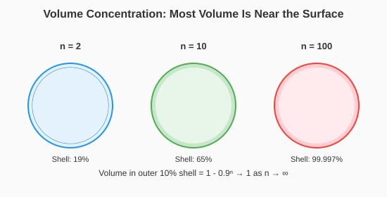
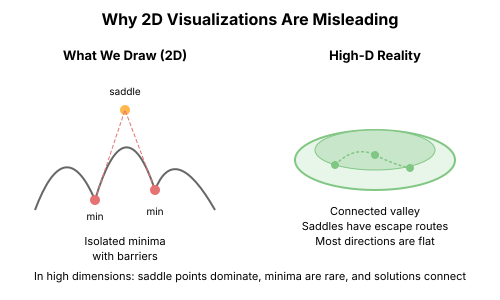

# Chapter 6: High-Dimensional Geometry

Our intuitions about optimization come from 2D and 3D visualizations. These intuitions are catastrophically wrong in high dimensions. This chapter rebuilds intuition for the geometry of neural network optimization.

## The Curse of Dimensionality

### Volume Concentrates in Shells

In high dimensions, almost all volume of a ball is near its surface.

For a ball of radius R in n dimensions:
$$\frac{\text{Vol}(\text{shell of width } \epsilon R)}{\text{Vol}(\text{ball})} = 1 - (1-\epsilon)^n \approx 1 \text{ for large } n$$

```python
import torch
import numpy as np

def volume_concentration():
    """Show that volume concentrates in outer shells."""
    epsilon = 0.1  # Shell is outer 10% of radius

    for n in [2, 10, 100, 1000]:
        inner_fraction = (1 - epsilon) ** n
        shell_fraction = 1 - inner_fraction
        print(f"n = {n:4d}: {shell_fraction*100:.4f}% of volume in outer {epsilon*100:.0f}% shell")
```

Output:
```
n =    2: 19.0000% of volume in outer 10% shell
n =   10: 65.1322% of volume in outer 10% shell
n =  100: 99.9973% of volume in outer 10% shell
n = 1000: 100.0000% of volume in outer 10% shell
```

**Implication**: In high dimensions, random points are almost always far from the origin, and almost always the same distance from each other.



### Points Are Approximately Equidistant

For random points $x, y \in \mathbb{R}^n$ with entries from $\mathcal{N}(0, 1)$:

$$\|x - y\|^2 \approx 2n$$

with very small relative variance as $n \to \infty$.

```python
def demonstrate_equidistance():
    """Show that random high-dimensional points are equidistant."""
    torch.manual_seed(42)

    for n in [10, 100, 1000, 10000]:
        # Generate random points
        n_points = 100
        points = torch.randn(n_points, n)

        # Compute pairwise distances
        distances = []
        for i in range(n_points):
            for j in range(i+1, n_points):
                dist = (points[i] - points[j]).norm().item()
                distances.append(dist)

        distances = torch.tensor(distances)
        expected = np.sqrt(2 * n)

        print(f"n = {n:5d}: mean dist = {distances.mean():.2f}, "
              f"std = {distances.std():.2f}, expected = {expected:.2f}")
```

Output:
```
n =    10: mean dist = 4.41, std = 0.76, expected = 4.47
n =   100: mean dist = 14.12, std = 0.72, expected = 14.14
n =  1000: mean dist = 44.68, std = 0.72, expected = 44.72
n = 10000: mean dist = 141.32, std = 0.72, expected = 141.42
```

The relative variance **shrinks** as dimension increases.

## Concentration of Measure

### Gaussian Annulus Theorem

For a random point $x \sim \mathcal{N}(0, I_n)$:

$$P\left(\left| \|x\| - \sqrt{n} \right| \gt t\right) \leq 2e^{-t^2/2}$$

Almost all mass is in a thin shell at radius $\sqrt{n}$.

```python
def gaussian_annulus():
    """Verify the Gaussian annulus phenomenon."""
    torch.manual_seed(42)

    for n in [10, 100, 1000]:
        samples = torch.randn(10000, n)
        norms = samples.norm(dim=1)

        expected_norm = np.sqrt(n)

        # What fraction is within 10% of expected?
        tolerance = 0.1 * expected_norm
        within = ((norms - expected_norm).abs() < tolerance).float().mean()

        print(f"n = {n:4d}: {within*100:.1f}% of points within 10% of expected norm")
```

### Johnson-Lindenstrauss Lemma

High-dimensional structure is preserved by random projections!

For any set of n points in $\mathbb{R}^d$, there exists a projection to $k = O(\log n / \epsilon^2)$ dimensions that preserves all pairwise distances within factor $(1 \pm \epsilon)$.

**Implication**: The effective dimensionality of data may be much lower than the ambient dimension.

```python
def johnson_lindenstrauss_demo():
    """Demonstrate distance preservation under random projection."""
    torch.manual_seed(42)

    # Original high-dimensional points
    d_high = 1000
    n_points = 100
    X = torch.randn(n_points, d_high)

    # Compute original distances
    original_dists = torch.cdist(X, X)

    for d_low in [10, 50, 100, 500]:
        # Random projection matrix (scaled appropriately)
        projection = torch.randn(d_high, d_low) / np.sqrt(d_low)

        # Project points
        X_proj = X @ projection

        # Compute projected distances
        proj_dists = torch.cdist(X_proj, X_proj)

        # Compute distortion
        mask = torch.triu(torch.ones(n_points, n_points), diagonal=1).bool()
        distortion = (proj_dists[mask] / original_dists[mask]).std()

        print(f"d = {d_low:3d}: distance distortion std = {distortion:.4f}")
```

## Gradients in High Dimensions

### Gradients Are Approximately Orthogonal

For random points $\theta_1, \theta_2$ in parameter space, the gradients $g_1 = \nabla L(\theta_1)$ and $g_2 = \nabla L(\theta_2)$ are nearly orthogonal.

```python
def gradient_orthogonality():
    """Show that gradients at different points are nearly orthogonal."""
    torch.manual_seed(42)

    import torch.nn as nn

    # Create a network
    model = nn.Sequential(
        nn.Linear(100, 50),
        nn.ReLU(),
        nn.Linear(50, 10)
    )

    n_params = sum(p.numel() for p in model.parameters())
    print(f"Model has {n_params} parameters")

    # Generate random data
    X = torch.randn(32, 100)
    y = torch.randint(0, 10, (32,))

    # Collect gradients at random parameter values
    gradients = []

    for _ in range(10):
        # Randomize parameters
        for p in model.parameters():
            p.data = torch.randn_like(p)

        # Compute gradient
        output = model(X)
        loss = nn.CrossEntropyLoss()(output, y)
        loss.backward()

        grad = torch.cat([p.grad.flatten() for p in model.parameters()])
        gradients.append(grad.clone())

        model.zero_grad()

    # Compute cosine similarities
    gradients = torch.stack(gradients)
    gradients = gradients / gradients.norm(dim=1, keepdim=True)

    cos_sim = gradients @ gradients.T

    # Off-diagonal elements
    mask = ~torch.eye(10, dtype=bool)
    off_diag = cos_sim[mask]

    print(f"Mean |cosine similarity|: {off_diag.abs().mean():.4f}")
    print(f"Expected for random: {1/np.sqrt(n_params):.4f}")
```

### The Gradient Is a Poor Search Direction

In high dimensions, the gradient only tells you about an infinitesimally small region.

Consider: the gradient at $\theta$ is orthogonal to almost every direction you might move!

For a random direction $v$:
$$\cos(\theta, v) \approx 0$$

The gradient is "special" only in a $O(1/\sqrt{n})$ neighborhood.

## The Loss Landscape Is Not Like Mountains

### The 2D Picture Is Misleading

When we visualize loss landscapes in 2D, we see:
- Distinct peaks and valleys
- Clear ridges connecting saddles
- Obvious paths between minima



### The High-Dimensional Reality

In high dimensions:
- Most points are not special (not critical points)
- Critical points are isolated and rare
- The "valleys" are vast—exponentially many dimensions are flat
- "Ridges" have exponentially many escape routes

```python
def hessian_spectrum_analysis():
    """Analyze the eigenvalue distribution of a neural network Hessian."""
    torch.manual_seed(42)
    import torch.nn as nn

    # Small network for tractable Hessian computation
    model = nn.Sequential(
        nn.Linear(20, 30),
        nn.Tanh(),
        nn.Linear(30, 10)
    )

    n_params = sum(p.numel() for p in model.parameters())
    print(f"Parameters: {n_params}")

    X = torch.randn(100, 20)
    y = torch.randint(0, 10, (100,))

    def loss_fn():
        return nn.CrossEntropyLoss()(model(X), y)

    # Compute full Hessian (expensive!)
    params = list(model.parameters())
    flat_params = torch.cat([p.flatten() for p in params])

    # Use finite differences for Hessian
    hessian = torch.zeros(n_params, n_params)
    eps = 1e-4

    def get_grad():
        model.zero_grad()
        loss = loss_fn()
        loss.backward()
        return torch.cat([p.grad.flatten() for p in params])

    base_grad = get_grad()

    for i in range(min(100, n_params)):  # Compute subset for speed
        # Perturb parameter i
        param_idx = 0
        offset = i
        for p in params:
            if offset < p.numel():
                p.data.view(-1)[offset] += eps
                break
            offset -= p.numel()
            param_idx += 1

        new_grad = get_grad()
        hessian[i, :] = (new_grad - base_grad) / eps

        # Restore
        offset = i
        for p in params:
            if offset < p.numel():
                p.data.view(-1)[offset] -= eps
                break
            offset -= p.numel()

    # Analyze eigenvalue distribution
    eigenvalues = torch.linalg.eigvalsh(hessian[:100, :100])

    print(f"Eigenvalue stats:")
    print(f"  Min: {eigenvalues.min():.4f}")
    print(f"  Max: {eigenvalues.max():.4f}")
    print(f"  Positive: {(eigenvalues > 0).sum()}")
    print(f"  Negative: {(eigenvalues < 0).sum()}")
```

## Implications for Optimization

### Why SGD Works Despite High Dimensions

1. **Most directions don't matter**: The loss varies significantly in only a few directions (the top Hessian eigenvalues)

2. **Random perturbations help**: Noise from minibatches explores the many flat directions

3. **The gradient is informative locally**: Even if it's nearly orthogonal to most directions, it points toward local descent

### The Effective Dimensionality

Neural network losses have much lower effective dimensionality than parameter count suggests:

- Hessian eigenvalues decay rapidly
- Most eigenvalues are near zero
- Optimization happens in a low-dimensional subspace

```python
def effective_dimensionality():
    """Estimate effective dimensionality from Hessian eigenvalues."""
    # Simulated eigenvalue distribution (typical for neural networks)
    n = 1000

    # Power-law decay with bulk near zero
    eigenvalues = torch.zeros(n)
    eigenvalues[:50] = torch.linspace(100, 10, 50)  # Large eigenvalues
    eigenvalues[50:200] = torch.linspace(10, 1, 150)  # Medium
    eigenvalues[200:] = torch.randn(800) * 0.1  # Bulk near zero

    # Effective dimensionality metrics

    # 1. Participation ratio
    eigenvalues_sq = eigenvalues ** 2
    participation = eigenvalues_sq.sum() ** 2 / (eigenvalues_sq ** 2).sum()

    # 2. Number with |λ| > threshold
    threshold = 1.0
    significant = (eigenvalues.abs() > threshold).sum()

    # 3. Fraction of trace
    total_trace = eigenvalues.abs().sum()
    top_k_fraction = eigenvalues[:50].abs().sum() / total_trace

    print(f"Total dimensions: {n}")
    print(f"Participation ratio: {participation:.1f}")
    print(f"Eigenvalues > {threshold}: {significant}")
    print(f"Top 50 eigenvalues: {top_k_fraction*100:.1f}% of trace")
```

## The Blessing of Dimensionality

### More Dimensions Can Help

Counterintuitively, more parameters can make optimization **easier**:

1. **More escape routes**: High-dimensional saddles have many descent directions
2. **Smoother interpolation**: The function can fit data without sharp features
3. **Better conditioning**: Adding parameters can reduce the condition number

```python
def overparameterization_helps():
    """Demonstrate that more parameters can help optimization."""
    torch.manual_seed(42)
    import torch.nn as nn
    import torch.optim as optim

    # Fixed data
    X = torch.randn(50, 10)
    y = torch.randn(50, 1)

    results = {}

    for width in [10, 50, 100, 500]:
        model = nn.Sequential(
            nn.Linear(10, width),
            nn.ReLU(),
            nn.Linear(width, 1)
        )

        optimizer = optim.SGD(model.parameters(), lr=0.01)

        for step in range(1000):
            optimizer.zero_grad()
            loss = nn.MSELoss()(model(X), y)
            loss.backward()
            optimizer.step()

        final_loss = nn.MSELoss()(model(X), y).item()
        n_params = sum(p.numel() for p in model.parameters())
        results[width] = (n_params, final_loss)

    print("Width | Params | Final Loss")
    print("-" * 30)
    for width, (params, loss) in results.items():
        print(f"{width:5d} | {params:6d} | {loss:.6f}")
```

## Key Intuitions

### What to Unlearn from 2D

| 2D Intuition | High-D Reality |
|--------------|----------------|
| Local minima are isolated | Local minima connect via flat regions |
| Saddles block paths | Saddles have many escape routes |
| The gradient points to the minimum | The gradient is nearly orthogonal to most directions |
| Distance matters | All random points are equidistant |
| Volume is spread out | Volume concentrates in shells |

### What to Learn for High-D

1. **Think in terms of subspaces**, not points
2. **Random directions are orthogonal** to everything
3. **Most curvature is near zero**—few directions matter
4. **More parameters can help**, not hurt
5. **Concentration of measure** dominates

## What's Next

- **Chapter 7**: Saddle points and critical point geometry
- **Chapter 8**: Symmetries and why local minima are equivalent
- **Chapter 9**: Mode connectivity—paths between solutions
- **Chapter 10**: Why SGD finds good solutions

## Exercises

1. **Volume concentration**: Derive the formula for the fraction of a ball's volume within radius $(1-\epsilon)R$.

2. **Gradient angles**: For a 1000-dimensional network, empirically measure the distribution of angles between gradients at random points.

3. **Effective rank**: Compute the effective rank of the Hessian (using participation ratio) for networks of different sizes.

4. **JL verification**: Verify the Johnson-Lindenstrauss bound empirically for random point sets.
