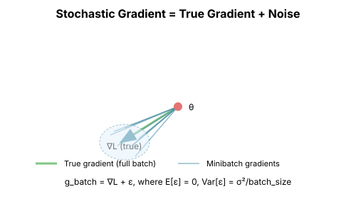

# Chapter 6: Why Classical Methods Break in Deep Learning

We've built up a beautiful hierarchy of optimization methods: gradient descent, Newton, conjugate gradient, quasi-Newton, Gauss-Newton. Each is more sophisticated than the last. Yet the deep learning community largely ignores them in favor of simple variants of SGD. Why?

This chapter explains the fundamental barriers that prevent classical second-order methods from scaling to modern neural networks.

## The Scale Problem

### The Numbers

Consider training a modern language model:

| Model | Parameters | Hessian Size | Time to Invert |
|-------|------------|--------------|----------------|
| BERT-base | 110M | 48 PB | ~years |
| GPT-2 | 1.5B | 9 EB | ~centuries |
| LLaMA-7B | 7B | 196 EB | ~millennia |
| GPT-4 | ~1T | 4 ZB | ~heat death |

The Hessian has $n^2$ entries. For 100B parameters, that's $10^{22}$ floats—more than atoms in a human body.

```python
import torch

def scaling_analysis():
    """Analyze the scaling of different optimization methods."""

    methods = {
        "Gradient Descent": lambda n: (n, n),  # (memory, compute per step)
        "L-BFGS (m=10)": lambda n: (20*n, 20*n),
        "Newton (explicit)": lambda n: (n**2, n**3),
        "Newton (CG, k=100)": lambda n: (n, 100*n),
        "K-FAC (approx)": lambda n: (n, n),  # roughly
    }

    param_counts = [1e6, 1e8, 1e10, 1e12]  # 1M to 1T

    print("Memory requirements (GB):")
    print("-" * 60)
    for n in param_counts:
        print(f"\nn = {n:.0e} parameters:")
        for name, cost_fn in methods.items():
            mem, _ = cost_fn(n)
            mem_gb = mem * 4 / 1e9  # float32
            if mem_gb < 1:
                print(f"  {name}: {mem_gb*1000:.1f} MB")
            elif mem_gb < 1000:
                print(f"  {name}: {mem_gb:.1f} GB")
            elif mem_gb < 1e6:
                print(f"  {name}: {mem_gb/1000:.1f} TB")
            else:
                print(f"  {name}: {mem_gb/1e6:.1f} PB")
```

### Why $O(n^2)$ Is Impossible

Even storing the Hessian is infeasible:

- **Memory bandwidth**: Reading 1 PB at 1 TB/s takes 1000 seconds per iteration
- **Communication**: Distributing across machines adds massive latency
- **Cost**: Storing 1 PB costs ~$20,000/month on cloud storage

No algorithmic cleverness can overcome storing $n^2$ entries when $n = 10^{11}$.

## The Stochasticity Problem

### Minibatch Gradients Are Noisy

Deep learning uses **stochastic** gradient descent:

$$g_t = \nabla L_{B_t}(\theta_t)$$

where $B_t$ is a random minibatch, not the full dataset.

This gradient is an unbiased estimator of the true gradient:
$$\mathbb{E}[g_t] = \nabla L(\theta_t)$$

But it has variance:
$$\text{Var}[g_t] = \frac{\sigma^2}{|B|}$$



### Second-Order Methods Amplify Noise

For Newton's method:
$$\delta = -H^{-1} g$$

If $g$ has variance $\sigma^2$, then $H^{-1}g$ has variance $\|H^{-1}\|^2 \sigma^2$.

For ill-conditioned problems, $\|H^{-1}\|$ is large (it equals $1/\lambda_{min}$), so **noise is amplified**.

```python
def demonstrate_noise_amplification():
    """Show how preconditioning amplifies gradient noise."""
    torch.manual_seed(42)

    # Ill-conditioned Hessian
    eigenvalues = torch.tensor([1.0, 0.01])  # Condition number 100
    H = torch.diag(eigenvalues)
    H_inv = torch.diag(1.0 / eigenvalues)

    # True gradient
    g_true = torch.tensor([1.0, 1.0])

    # Simulate noisy gradients
    noise_std = 0.1
    n_samples = 1000

    gd_steps = []
    newton_steps = []

    for _ in range(n_samples):
        noise = torch.randn(2) * noise_std
        g_noisy = g_true + noise

        # Gradient descent step
        gd_step = g_noisy
        gd_steps.append(gd_step)

        # Newton step
        newton_step = H_inv @ g_noisy
        newton_steps.append(newton_step)

    gd_steps = torch.stack(gd_steps)
    newton_steps = torch.stack(newton_steps)

    print("Gradient Descent steps:")
    print(f"  Mean: {gd_steps.mean(0)}")
    print(f"  Std:  {gd_steps.std(0)}")

    print("\nNewton steps:")
    print(f"  Mean: {newton_steps.mean(0)}")
    print(f"  Std:  {newton_steps.std(0)}")
    print(f"\nNote: Newton step std in direction 2 is {newton_steps[:, 1].std():.1f}x larger!")
```

### The Curvature Problem for Quasi-Newton

BFGS and L-BFGS build curvature estimates from gradient differences:

$$y_k = g_{k+1} - g_k$$

With stochastic gradients:
$$y_k = (g_{true,k+1} + \epsilon_{k+1}) - (g_{true,k} + \epsilon_k)$$

The signal-to-noise ratio degrades:
- **Signal**: $g_{true,k+1} - g_{true,k}$ (often small for similar iterates)
- **Noise**: $\epsilon_{k+1} - \epsilon_k$ (doesn't shrink)

The curvature estimate becomes dominated by noise.

## The Non-Convexity Problem

### Saddle Points Everywhere

Neural network loss surfaces have many **saddle points**—critical points where the Hessian has both positive and negative eigenvalues.

At a saddle point with eigenvalue $\lambda \lt 0$:

$$H^{-1}g \text{ points } \textbf{toward} \text{ the saddle, not away!}$$

Newton's method converges to saddle points; it doesn't escape them.

```python
def newton_at_saddle():
    """Demonstrate Newton converging to a saddle point."""
    # Saddle function: f(x,y) = x² - y²
    def f(xy):
        return xy[0]**2 - xy[1]**2

    def grad(xy):
        return torch.tensor([2*xy[0], -2*xy[1]])

    def hessian():
        return torch.tensor([[2.0, 0.0], [0.0, -2.0]])

    # Newton's method
    xy = torch.tensor([0.5, 0.5])
    H = hessian()

    print("Newton's method on saddle function x² - y²:")
    for i in range(5):
        g = grad(xy)
        print(f"  Step {i}: xy = {xy.numpy()}, f = {f(xy):.4f}")

        # Newton step
        step = torch.linalg.solve(H, g)
        xy = xy - step

    print(f"\nConverged to: {xy.numpy()} (the saddle point!)")
```

### The Index of Critical Points

Random matrix theory tells us: in high dimensions, most critical points are saddle points.

For a random function in $n$ dimensions, the probability that a critical point is a local minimum is approximately:

$$P(\text{minimum}) \approx 2^{-n}$$

For $n = 100$, this is $10^{-30}$. For $n = 10^9$, it's inconceivably small.

This is actually **good news** (see Chapter 8)—but it means Newton's method has the wrong behavior.

## The Heterogeneity Problem

### Different Layers, Different Scales

Neural networks have massive variation across layers:

| Layer Type | Typical Gradient Scale |
|------------|----------------------|
| Embedding | $10^{-3}$ |
| Early layers | $10^{-4}$ |
| Late layers | $10^{-2}$ |
| Output layer | $10^{-1}$ |

A single global learning rate (or curvature approximation) can't handle this.

```python
def analyze_gradient_heterogeneity():
    """Show gradient scale variation across layers."""
    import torch.nn as nn

    # Create a typical network
    model = nn.Sequential(
        nn.Embedding(10000, 512),
        nn.Linear(512, 512),
        nn.ReLU(),
        nn.Linear(512, 512),
        nn.ReLU(),
        nn.Linear(512, 512),
        nn.ReLU(),
        nn.Linear(512, 10)
    )

    # Random forward pass
    x = torch.randint(0, 10000, (32,))
    y = torch.randint(0, 10, (32,))

    output = model[0](x)  # Embedding: shape (32, 512)
    for layer in model[1:]:
        output = layer(output)

    loss = nn.CrossEntropyLoss()(output, y)
    loss.backward()

    # Analyze gradient norms per layer
    print("Gradient norms by layer:")
    for i, (name, param) in enumerate(model.named_parameters()):
        if param.grad is not None:
            grad_norm = param.grad.norm().item()
            param_norm = param.data.norm().item()
            print(f"  {name}: grad={grad_norm:.6f}, param={param_norm:.2f}, ratio={grad_norm/param_norm:.6f}")
```

### Block Structure

The Hessian has structure that reflects network architecture:

```
        Layer 1    Layer 2    Layer 3
       ┌─────────┬─────────┬─────────┐
Layer 1│  Dense  │ Sparse  │ ~Zero   │
       ├─────────┼─────────┼─────────┤
Layer 2│ Sparse  │  Dense  │ Sparse  │
       ├─────────┼─────────┼─────────┤
Layer 3│ ~Zero   │ Sparse  │  Dense  │
       └─────────┴─────────┴─────────┘
```

The diagonal blocks (within-layer) are dense. Off-diagonal blocks (cross-layer) are sparse or near-zero.

This is exploited by **block-diagonal approximations** (K-FAC, Shampoo).

## The Information Geometry Problem

### Gradient Descent in Parameter Space

Standard gradient descent moves in parameter space:

$$\theta_{t+1} = \theta_t - \eta \nabla_\theta L$$

But parameters are **not the natural coordinates** for neural networks.

### The Problem with Parameter Space

Consider two different parameterizations of the same function:

$$f(x) = \sigma(w_1 x + b_1)$$
$$g(x) = \sigma(w_2 \cdot 2x + b_2) \text{ where } w_2 = w_1/2$$

These represent the same function, but gradient descent behaves differently on them!

This is the motivation for **natural gradient** (Chapter 15), which uses the geometry of the function space rather than parameter space.

## What Actually Works

### Stochastic + Simple = Robust

The deep learning community has converged on methods that are:

1. **Stochastic**: Work with minibatches
2. **First-order**: Only use gradients, not Hessians
3. **Diagonal or block-diagonal**: Per-parameter or per-layer adaptation
4. **Momentum-based**: Smooth out noise over time

### The Successful Adaptations

Each successful "second-order inspired" method addresses specific problems:

| Method | What It Does | What It Approximates |
|--------|--------------|---------------------|
| Adam | Diagonal preconditioning | $\text{diag}(H)^{-1}$ |
| K-FAC | Block Kronecker structure | Fisher matrix |
| Shampoo | Per-layer preconditioning | Layer Hessians |
| Muon | Orthogonalization | Operator geometry |

None of these use the full Hessian. All exploit problem structure.

## A Path Forward

### The Useful Insights from Second-Order Methods

Despite their impracticality, second-order methods teach us:

1. **Condition number matters**: Preconditioning helps
2. **Curvature varies by direction**: Per-parameter scaling helps
3. **Layer structure matters**: Block-diagonal approximations help
4. **The Fisher is cheaper than the Hessian**: For probabilistic models

### The Design Principles

Successful optimizers for deep learning:

1. **Approximate the curvature, don't compute it exactly**
2. **Exploit the structure** (layers, batches, output dimensions)
3. **Be robust to noise** (momentum, averaging)
4. **Scale with the problem** ($O(n)$ or $O(n \cdot \text{layers})$)

## Summary: The Scaling Wall

| Barrier | What Breaks | Solution |
|---------|-------------|----------|
| $O(n^2)$ memory | Newton, BFGS | Diagonal/block approximations |
| Stochastic gradients | Quasi-Newton curvature | Exponential averaging |
| Non-convexity | Newton at saddles | SGD noise helps! |
| Heterogeneity | Global learning rate | Per-parameter/layer rates |
| Scale | Everything explicit | Implicit methods (HVP) |

The rest of this book explores how these barriers shape both the loss landscape (Part II) and the practical methods that work (Part III).

## What's Next

Part II dives into the deep learning loss landscape:
- **Chapter 7**: Why high-dimensional intuition is different
- **Chapter 8**: Saddle points and random matrix theory
- **Chapter 9**: Symmetries and equivalent minima
- **Chapter 10**: Mode connectivity
- **Chapter 11**: Why SGD works despite everything

## Exercises

1. **Memory calculation**: For a model with 1B parameters, calculate the memory needed for: full Hessian, L-BFGS with m=10, diagonal approximation.

2. **Noise amplification**: Derive the variance of $H^{-1}g$ in terms of the variance of $g$ and the eigenvalues of $H$.

3. **Layer gradient analysis**: Train a small network and plot gradient norms per layer over training. How do they change?

4. **Stochastic curvature**: Implement naive stochastic L-BFGS and show that it fails. What happens to the curvature estimates?
