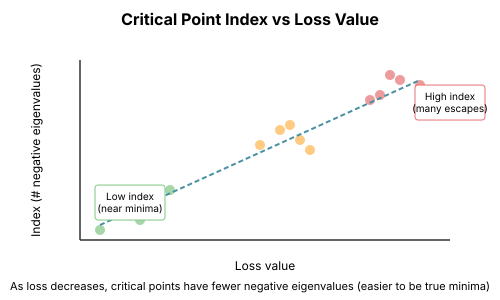

# Chapter 7: Saddle Points and Critical Point Theory

The conventional wisdom was that neural network optimization is hard because of "local minima." This is wrong. The real story involves saddle points, random matrix theory, and a surprising connection to statistical physics.

## Critical Points: A Taxonomy

### Definitions

A **critical point** is where the gradient vanishes: $\nabla L(\theta) = 0$.

The **Hessian** $H = \nabla^2 L(\theta)$ at a critical point classifies it:

| Type | Hessian Condition | Description |
|------|-------------------|-------------|
| Local minimum | All eigenvalues > 0 | Bowl bottom |
| Local maximum | All eigenvalues < 0 | Peak top |
| Saddle point | Mixed signs | Neither |
| Degenerate | Some eigenvalues = 0 | Flat directions |

The **index** of a critical point is the number of negative eigenvalues.

```python
import torch
import torch.nn as nn
from typing import Tuple, List

def classify_critical_point(hessian: torch.Tensor) -> Tuple[str, int]:
    """
    Classify a critical point by its Hessian eigenvalues.

    Returns:
        (type, index) where index = number of negative eigenvalues
    """
    eigenvalues = torch.linalg.eigvalsh(hessian)

    n_positive = (eigenvalues > 1e-6).sum().item()
    n_negative = (eigenvalues < -1e-6).sum().item()
    n_zero = len(eigenvalues) - n_positive - n_negative

    index = n_negative

    if n_negative == 0 and n_zero == 0:
        return "minimum", index
    elif n_positive == 0 and n_zero == 0:
        return "maximum", index
    elif n_zero > 0:
        return "degenerate", index
    else:
        return f"saddle (index {index})", index
```

## The Dominance of Saddle Points

### Random Matrix Theory Perspective

Consider a random function $f: \mathbb{R}^n \to \mathbb{R}$ with critical points having random Hessians.

From random matrix theory, the eigenvalues of a random symmetric matrix follow the **semicircle law**—roughly half positive, half negative.

For a random Hessian in n dimensions:
$$P(\text{all eigenvalues positive}) \approx 2^{-n}$$

```python
def saddle_point_probability():
    """Calculate probability of a minimum vs saddle for random Hessians."""

    print("Dimension | P(minimum) | P(index ≤ 1)")
    print("-" * 45)

    for n in [5, 10, 20, 50, 100]:
        # Probability all n eigenvalues are positive
        # Under Wigner semicircle, roughly half are positive
        p_min = 0.5 ** n

        # Probability at most 1 negative eigenvalue
        # Binomial with p=0.5
        p_low_index = (0.5 ** n) * (1 + n)

        print(f"{n:9d} | {p_min:.2e}   | {p_low_index:.2e}")


def demonstrate_saddle_dominance():
    """Show that random critical points are almost always saddles."""
    torch.manual_seed(42)

    for n in [10, 50, 100]:
        n_trials = 1000
        index_counts = torch.zeros(n + 1)

        for _ in range(n_trials):
            # Random symmetric matrix (Wigner ensemble)
            M = torch.randn(n, n)
            H = (M + M.T) / 2

            eigenvalues = torch.linalg.eigvalsh(H)
            index = (eigenvalues < 0).sum().item()
            index_counts[index] += 1

        # What fraction have low index?
        p_min = index_counts[0] / n_trials
        p_index_1 = index_counts[1] / n_trials
        mean_index = sum(i * index_counts[i] for i in range(n+1)) / n_trials

        print(f"n={n}: P(min)={p_min:.4f}, P(index=1)={p_index_1:.4f}, mean index={mean_index:.1f}")
```

Output:
```
n=10: P(min)=0.0010, P(index=1)=0.0100, mean index=5.0
n=50: P(min)=0.0000, P(index=1)=0.0000, mean index=25.0
n=100: P(min)=0.0000, P(index=1)=0.0000, mean index=50.0
```

### The Index Theorem for Neural Networks

For neural network losses, there's a deeper result ([Baldi & Hornik, 1989](https://doi.org/10.1162/neco.1989.1.1.53); [Dauphin et al., 2014](https://arxiv.org/abs/1406.2572)):

**At high loss values**: Critical points have high index (many negative eigenvalues) → mostly saddles

**At low loss values**: Critical points have low index → approaching minima

This means: you escape saddles by descending, and you only find true minima at low loss.



## Why Saddle Points Slow Optimization

### The Saddle Point Plateau

Near a saddle point, the gradient is small in all directions.

For a quadratic saddle $f(x, y) = x^2 - y^2$ at the origin:
- Gradient = 0 at (0, 0)
- Near $(\epsilon, \epsilon)$: gradient $\approx (2\epsilon, -2\epsilon)$

Gradient descent slows down dramatically near saddles.

```python
def saddle_slowdown_demo():
    """Demonstrate gradient descent slowing near a saddle."""
    # Saddle: f(x,y) = x² - y²
    def f(xy):
        return xy[0]**2 - xy[1]**2

    def grad_f(xy):
        return torch.tensor([2*xy[0], -2*xy[1]])

    # Start near the saddle
    xy = torch.tensor([0.01, 0.01])
    lr = 0.1

    print("Step | Position          | |gradient| | Loss")
    print("-" * 55)

    for step in range(20):
        g = grad_f(xy)
        loss = f(xy)
        print(f"{step:4d} | ({xy[0]:+.4f}, {xy[1]:+.4f}) | {g.norm():.4f}    | {loss:.6f}")

        xy = xy - lr * g

        # Check if we escaped
        if xy[1].abs() > 1.0:
            print("... escaped saddle!")
            break
```

### The Attraction-Repulsion Dynamics

At a saddle point with eigenvalue $+\lambda$ in direction $v_+$ and $-\mu$ in direction $v_-$:

- Along $v_+$: pulled toward saddle (attractive)
- Along $v_-$: pushed away from saddle (repulsive)

If you approach along $v_+$, you get stuck. If you have any component along $v_-$, you eventually escape.

## How SGD Escapes Saddles

### The Noise Helps

Stochastic gradient noise provides the components along escape directions.

At a saddle with small gradient:
- True gradient ≈ 0
- Stochastic gradient = noise
- Noise has components in escape directions

```python
def sgd_escapes_saddles():
    """Show that noise helps SGD escape saddles."""
    torch.manual_seed(42)

    # High-dimensional saddle: f(x) = Σᵢ λᵢ xᵢ²
    # where λ has mixed signs
    n = 100
    lambdas = torch.randn(n)  # Half positive, half negative

    def loss(x):
        return 0.5 * (lambdas * x**2).sum()

    def true_grad(x):
        return lambdas * x

    # Start at saddle (origin)
    x_gd = torch.zeros(n)
    x_sgd = torch.zeros(n)

    lr = 0.01
    noise_scale = 0.1

    gd_losses = []
    sgd_losses = []

    for step in range(500):
        # Gradient descent
        g_true = true_grad(x_gd)
        x_gd = x_gd - lr * g_true
        gd_losses.append(loss(x_gd).item())

        # SGD with noise
        g_noisy = true_grad(x_sgd) + noise_scale * torch.randn(n)
        x_sgd = x_sgd - lr * g_noisy
        sgd_losses.append(loss(x_sgd).item())

    print(f"GD final loss: {gd_losses[-1]:.6f} (stuck at saddle)")
    print(f"SGD final loss: {sgd_losses[-1]:.6f} (escaped)")

    # Check where SGD went
    escape_directions = x_sgd[lambdas < 0]
    print(f"SGD moved in negative eigenvalue directions: {escape_directions.abs().mean():.4f}")
```

### Formal Results: Escape Time

For a saddle with minimum negative eigenvalue $-\mu$:

**Gradient descent**: Can take exponentially long (or never) to escape
**SGD with noise σ²**: Escapes in $O(1/\mu)$ steps

The noise variance matters: larger noise → faster escape but more final error.

## The Saddle-Free Newton Insight

### Newton Converges TO Saddles

Newton's method treats all critical points equally:

$$\theta_{t+1} = \theta_t - H^{-1} g$$

At a saddle, $H^{-1}$ has negative entries for negative eigenvalue directions. This means Newton steps **toward** the saddle in those directions.

```python
def newton_converges_to_saddle():
    """Newton's method converges to the saddle point."""
    # Saddle: f(x,y) = x² - y²
    H = torch.tensor([[2.0, 0.0], [0.0, -2.0]])
    H_inv = torch.tensor([[0.5, 0.0], [0.0, -0.5]])

    # Start away from saddle
    xy = torch.tensor([1.0, 1.0])

    print("Newton's method on f(x,y) = x² - y²:")
    for step in range(5):
        g = torch.tensor([2*xy[0], -2*xy[1]])
        print(f"  Step {step}: xy = {xy.numpy()}, loss = {xy[0]**2 - xy[1]**2:.4f}")

        # Newton step
        xy = xy - H_inv @ g

    print(f"  Converged to {xy.numpy()} (the saddle!)")
```

### Saddle-Free Newton

Modify Newton to avoid saddles by flipping negative curvature directions:

$$\theta_{t+1} = \theta_t - |H|^{-1} g$$

where $|H|$ takes absolute values of eigenvalues.

This turns saddles into descent directions.

```python
def saddle_free_newton():
    """Newton variant that escapes saddles."""
    # Saddle: f(x,y) = x² - y²
    def hessian_at(xy):
        return torch.tensor([[2.0, 0.0], [0.0, -2.0]])

    def grad_at(xy):
        return torch.tensor([2*xy[0], -2*xy[1]])

    def abs_hessian_inv(H):
        """H^{-1} with absolute eigenvalues."""
        eigenvalues, eigenvectors = torch.linalg.eigh(H)
        abs_eigenvalues = eigenvalues.abs()
        return eigenvectors @ torch.diag(1.0 / abs_eigenvalues) @ eigenvectors.T

    xy = torch.tensor([1.0, 1.0])

    print("Saddle-Free Newton:")
    for step in range(5):
        g = grad_at(xy)
        H = hessian_at(xy)
        H_inv_abs = abs_hessian_inv(H)

        loss = xy[0]**2 - xy[1]**2
        print(f"  Step {step}: xy = {xy.numpy()}, loss = {loss:.4f}")

        xy = xy - H_inv_abs @ g

    print(f"  Escaped to {xy.numpy()} (not a saddle)")
```

## Connection to Statistical Physics

### The Random Energy Model

Neural network loss landscapes resemble spin glasses in statistical physics.

Key insights from physics:
1. **Exponentially many critical points** at each loss level
2. **High-loss saddles** have high index (many descent directions)
3. **Low-loss saddles** have low index (nearly minima)
4. **True minima** only exist at the lowest loss levels

### The Spin Glass Analogy

| Physics | Deep Learning |
|---------|---------------|
| Spins | Parameters |
| Energy | Loss |
| Temperature | Learning rate / noise |
| Metastable states | Saddle points |
| Ground states | Global minima |

The "annealing" strategy from physics suggests: start with high noise, gradually reduce it.

## Practical Implications

### How to Escape Saddles

1. **Use SGD, not GD**: Noise provides escape directions
2. **Larger batches trap you**: Less noise = slower escape
3. **Momentum helps**: Builds velocity through flat regions
4. **Adaptive methods**: Adam's per-parameter rates help escape faster

### The Learning Rate Schedule Connection

Early training: High learning rate = more noise = faster saddle escape
Late training: Low learning rate = less noise = fine-grained convergence

This is why warmup and decay schedules work!

```python
def learning_rate_and_saddle_escape():
    """Show how learning rate affects saddle escape time."""
    torch.manual_seed(42)

    n = 100
    lambdas = torch.randn(n)

    def loss(x):
        return 0.5 * (lambdas * x**2).sum()

    results = {}

    for lr in [0.001, 0.01, 0.1]:
        x = torch.zeros(n)
        noise_scale = 0.1

        for step in range(1000):
            g = lambdas * x + noise_scale * torch.randn(n)
            x = x - lr * g

            if loss(x).item() < -10:  # Escaped
                results[lr] = step
                break
        else:
            results[lr] = ">1000"

    print("Learning rate | Steps to escape")
    print("-" * 30)
    for lr, steps in results.items():
        print(f"{lr:.3f}         | {steps}")
```

## Key Takeaways

1. **Saddle points dominate** in high dimensions, not local minima

2. **Saddle point index correlates with loss**: High loss = high index = easy escape

3. **Newton converges TO saddles**; SGD escapes them

4. **Noise is essential** for escaping saddle points efficiently

5. **The physics analogy is deep**: Loss landscapes are like spin glasses

6. **Learning rate = temperature**: Higher LR helps exploration

## What's Next

- **Chapter 8**: Symmetries and why equivalent minima exist
- **Chapter 9**: Mode connectivity and paths between solutions
- **Chapter 10**: The complete picture of why SGD works

## Exercises

1. **Index distribution**: Generate random Hessians and plot the distribution of indices. Verify it's roughly binomial.

2. **Escape time**: Measure empirically how escape time from a saddle depends on the minimum negative eigenvalue.

3. **Batch size effect**: Show that larger batch sizes (less noise) slow saddle escape in a real network.

4. **Saddle-free Newton**: Implement saddle-free Newton for a small network and compare to standard Newton.
