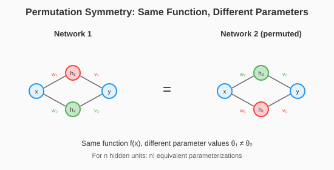

# Chapter 9: Symmetry and Equivalent Minima

A popular argument claims: "Neural networks have many local minima, but they're all equivalent due to symmetry." This chapter explains this argument in detail, then explains why it's incomplete and what it actually tells us.

## The Permutation Symmetry Argument

### Hidden Unit Permutation

Consider a single hidden layer network:
$$f(x; W_1, W_2) = W_2 \sigma(W_1 x)$$

If we permute the hidden units using permutation matrix P:
$$f(x; W_1 P^T, P W_2) = W_2 P^T \cdot P \sigma(W_1 x) = W_2 \sigma(W_1 x) = f(x; W_1, W_2)$$

The network computes the **same function** with different parameters!

```python
import torch
import torch.nn as nn
import itertools

def demonstrate_permutation_symmetry():
    """Show that permuting hidden units gives equivalent networks."""
    torch.manual_seed(42)

    # Simple network
    input_dim = 3
    hidden_dim = 4
    output_dim = 2

    W1 = torch.randn(hidden_dim, input_dim)
    W2 = torch.randn(output_dim, hidden_dim)

    def forward(x, w1, w2):
        return w2 @ torch.relu(w1 @ x)

    # Test input
    x = torch.randn(input_dim)
    original_output = forward(x, W1, W2)

    print("Original output:", original_output)

    # Try all permutations of hidden units
    print("\nAll permutations give same output:")
    for perm in itertools.permutations(range(hidden_dim)):
        P = torch.zeros(hidden_dim, hidden_dim)
        for i, j in enumerate(perm):
            P[i, j] = 1

        W1_perm = P @ W1
        W2_perm = W2 @ P.T

        perm_output = forward(x, W1_perm, W2_perm)
        matches = torch.allclose(original_output, perm_output)
        print(f"  Perm {perm}: matches = {matches}")
```

### Counting Equivalent Minima

For a network with:
- Layer 1: $h_1$ hidden units
- Layer 2: $h_2$ hidden units
- ...
- Layer L: $h_L$ hidden units

The number of equivalent parameterizations is:
$$h_1! \times h_2! \times \cdots \times h_L!$$

For a small network with layers [100, 100, 100]:
$$100! \times 100! \times 100! \approx 10^{470}$$

This is more than atoms in the observable universe, squared, many times over.

```python
import math

def count_symmetries():
    """Count the number of equivalent parameterizations."""
    architectures = [
        [10, 10],
        [100, 100],
        [512, 512],
        [100, 100, 100],
        [1024, 1024, 1024, 1024],
    ]

    print("Architecture | Log₁₀(symmetries)")
    print("-" * 40)

    for arch in architectures:
        log_symmetries = sum(math.lgamma(h + 1) / math.log(10) for h in arch)
        print(f"{str(arch):20} | {log_symmetries:.1f}")
```

Output:
```
Architecture | Log₁₀(symmetries)
[10, 10]             | 13.1
[100, 100]           | 315.1
[512, 512]           | 2392.3
[100, 100, 100]      | 472.7
[1024, 1024, 1024, 1024] | 10552.2
```

### The Optimistic Conclusion

"Don't worry about local minima! There are $\prod_l h_l!$ equivalent copies of every minimum. Even if you find a 'different' local minimum, it's probably just a permuted version of the same solution."



## Why This Argument Is Incomplete

### Problem 1: It's Measure Zero

The permutation symmetry creates a **discrete** set of equivalent points:
- For each minimum $\theta^*$, there are $\prod_l h_l!$ equivalent points
- These are isolated points in parameter space
- The set of all equivalent points has **measure zero**

But gradient descent is continuous! The probability of landing exactly on an equivalent point is zero.

The relevant question is: **Are minima connected by low-loss paths?** Discrete equivalence doesn't answer this.

```python
def measure_zero_illustration():
    """Show that equivalent points are isolated, not connected."""
    torch.manual_seed(42)

    # Simple 2D case for visualization
    # Two "equivalent" minima at θ₁ and θ₂

    theta1 = torch.tensor([1.0, 0.0])
    theta2 = torch.tensor([0.0, 1.0])  # "Equivalent" by some symmetry

    # Linear path between them
    t_values = torch.linspace(0, 1, 100)

    # Even for equivalent points, the path between them may have high loss
    # The "equivalence" only holds at those exact points

    print("Equivalent points are isolated:")
    print(f"  θ₁ = {theta1.numpy()}")
    print(f"  θ₂ = {theta2.numpy()}")
    print(f"  Midpoint θ = {((theta1 + theta2)/2).numpy()}")
    print("  The midpoint is NOT equivalent to either endpoint!")
```

### Problem 2: It Doesn't Explain Generalization

Permutation symmetry tells us:
- Different parameter values can give the same function
- Many "local minima" are actually the same solution

It does NOT tell us:
- Why the solutions found generalize well
- Why different random initializations find similar solutions
- Why overparameterization helps optimization

Two networks with the same loss can have very different generalization!

```python
def symmetry_doesnt_explain_generalization():
    """Demonstrate that equivalent training loss doesn't mean equivalent generalization."""
    torch.manual_seed(42)

    # Training data
    n_train = 100
    X_train = torch.randn(n_train, 10)
    y_train = (X_train[:, 0] + X_train[:, 1] > 0).float().unsqueeze(1)

    # Test data
    n_test = 1000
    X_test = torch.randn(n_test, 10)
    y_test = (X_test[:, 0] + X_test[:, 1] > 0).float().unsqueeze(1)

    # Train two networks with different seeds
    results = []

    for seed in [42, 123]:
        torch.manual_seed(seed)

        model = nn.Sequential(
            nn.Linear(10, 50),
            nn.ReLU(),
            nn.Linear(50, 1),
            nn.Sigmoid()
        )

        optimizer = torch.optim.Adam(model.parameters(), lr=0.01)

        for _ in range(500):
            pred = model(X_train)
            loss = nn.BCELoss()(pred, y_train)
            optimizer.zero_grad()
            loss.backward()
            optimizer.step()

        train_loss = nn.BCELoss()(model(X_train), y_train).item()
        test_loss = nn.BCELoss()(model(X_test), y_test).item()
        test_acc = ((model(X_test) > 0.5).float() == y_test).float().mean().item()

        results.append((seed, train_loss, test_loss, test_acc))

    print("Seed | Train Loss | Test Loss | Test Acc")
    print("-" * 45)
    for seed, train, test, acc in results:
        print(f"{seed:4d} | {train:.6f}   | {test:.6f}  | {acc:.4f}")
```

### Problem 3: Real Minima Aren't All Equivalent

The permutation argument only proves:
- Every minimum has many equivalent copies
- NOT that all minima are equivalent to each other

There can still be:
- Genuinely different local minima with different loss
- Minima with same loss but different basins of attraction
- Minima that generalize differently

```python
def different_minima_exist():
    """Show that genuinely different local minima can exist."""
    torch.manual_seed(42)

    # Non-convex loss with multiple distinct minima
    # f(x) = (x² - 1)² has minima at ±1, not related by any symmetry

    def f(x):
        return (x**2 - 1)**2

    # Find minima from different starting points
    minima_found = []

    for x0 in [-2.0, -0.5, 0.5, 2.0]:
        x = torch.tensor([x0], requires_grad=True)

        for _ in range(100):
            loss = f(x)
            loss.backward()
            with torch.no_grad():
                x -= 0.1 * x.grad
                x.grad.zero_()

        minima_found.append((x0, x.item(), f(x).item()))

    print("Starting point | Converged to | Loss")
    print("-" * 40)
    for start, end, loss in minima_found:
        print(f"{start:+.1f}           | {end:+.4f}       | {loss:.6f}")
```

### Problem 4: Sign Symmetry Is Different

ReLU networks also have sign symmetry: flipping the sign of incoming and outgoing weights for a unit gives the same function.

But this requires $\sigma(-x) = -\sigma(x)$, which ReLU doesn't satisfy!

For ReLU: $\text{ReLU}(-x) \neq -\text{ReLU}(x)$

So sign symmetry is broken for ReLU, reducing the symmetry group.

```python
def relu_breaks_sign_symmetry():
    """Show that ReLU breaks sign flip symmetry."""
    x = torch.tensor([-1.0, 0.0, 1.0])

    print("ReLU(x):", torch.relu(x))
    print("ReLU(-x):", torch.relu(-x))
    print("-ReLU(x):", -torch.relu(x))
    print("ReLU(-x) == -ReLU(x)?", torch.allclose(torch.relu(-x), -torch.relu(x)))
```

## What the Symmetry Argument DOES Tell Us

### 1. Parameter Space Is Highly Redundant

Many different parameter vectors correspond to the same function. The "function space" is much smaller than parameter space.

This suggests we should think about optimization in function space, not parameter space → natural gradient (Chapter 15).

### 2. The Loss Surface Has Structure

The existence of exact equivalences means the loss surface isn't random. There's geometric structure we can exploit.

### 3. Local Minima Are "Clustered"

Even if discrete equivalence doesn't connect minima, it suggests they cluster in regions of parameter space.

### 4. Overparameterization Creates Redundancy

More parameters = more symmetries = more redundancy. This might explain why wider networks are easier to optimize.

## Beyond Permutation: Continuous Symmetries

### Scaling Symmetry

For networks with homogeneous activations, scaling weights up in one layer and down in the next preserves the function:

$$f(x; \alpha W_1, W_2/\alpha) = f(x; W_1, W_2)$$

This is a **continuous** symmetry ($\alpha$ can be any positive number).

```python
def scaling_symmetry():
    """Demonstrate scaling symmetry in linear layers."""
    torch.manual_seed(42)

    W1 = torch.randn(5, 3)
    W2 = torch.randn(2, 5)
    x = torch.randn(3)

    original = W2 @ (W1 @ x)

    for alpha in [0.5, 1.0, 2.0, 10.0]:
        scaled = (W2 / alpha) @ (alpha * W1 @ x)
        print(f"α = {alpha:4.1f}: matches = {torch.allclose(original, scaled)}")
```

### The Rescaling Manifold

The scaling symmetry creates continuous curves of equivalent solutions—not just isolated points.

These curves have implications:
- The Hessian has zero eigenvalues along scale directions
- Optimization can drift along these manifolds
- Weight decay breaks this symmetry (intentionally!)

## The True Picture: Mode Connectivity

### What Actually Connects Minima

Recent research (Garipov et al., 2018; Draxler et al., 2018) shows:

Different minima found by SGD are connected by **paths of low loss**.

Not through permutation symmetry, but through actual smooth paths in parameter space!

This is much stronger than discrete equivalence. See Chapter 10 for details.

### The Corrected Understanding

| Old View | Current Understanding |
|----------|----------------------|
| Many local minima trap optimization | Few distinct basins, most minima equivalent |
| Symmetry proves minima are equivalent | Symmetry is discrete; mode connectivity is what matters |
| Find THE global minimum | Most minima work equally well |
| Local minima are the problem | Saddle points are the real issue |

## Key Takeaways

1. **Permutation symmetry exists**: Hidden unit reordering gives equivalent networks

2. **But it's discrete symmetry**: Creates isolated equivalent points, not connected regions

3. **Doesn't explain generalization**: Same loss can give different test performance

4. **Doesn't prove all minima are equivalent**: Just that each minimum has copies

5. **Scaling symmetry is continuous**: Creates curves, not just points

6. **Mode connectivity is the real story**: Minima are connected by low-loss paths

7. **The function space view helps**: Natural gradient considers function equivalence

## What's Next

- **Chapter 10**: Mode connectivity—the paths that actually connect solutions
- **Chapter 11**: Why SGD finds good minima in the first place

## Exercises

1. **Count symmetries**: For your favorite architecture, calculate the number of equivalent parameterizations.

2. **Verify permutation invariance**: Train a network, permute hidden units, verify outputs match.

3. **Breaking symmetry**: Add weight decay. Does it change which minimum SGD finds?

4. **Scaling manifold**: For a linear network, trace the curve of equivalent solutions under scaling.

5. **Different minima**: Find two genuinely different local minima (different loss values) for a simple non-convex objective.
