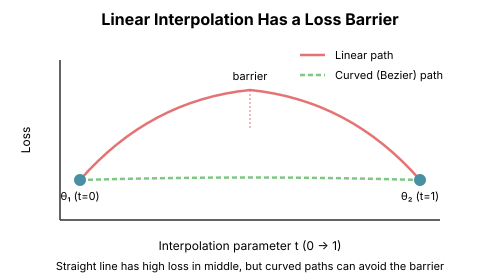

# Chapter 10: Mode Connectivity

One of the most surprising discoveries in deep learning theory: independently trained neural networks are connected by paths of low loss. This "mode connectivity" fundamentally changes how we think about the loss landscape.

## The Discovery

### Independent Solutions Are Connected

Train the same architecture with different random seeds. You get different solutions $\theta_1$ and $\theta_2$.

**Surprising fact** (Garipov et al., 2018; Draxler et al., 2018): There exist paths from $\theta_1$ to $\theta_2$ where the loss stays low the entire way.

```python
import torch
import torch.nn as nn
import torch.optim as optim
from typing import Callable, List

def train_model(model: nn.Module, X: torch.Tensor, y: torch.Tensor,
                epochs: int = 100) -> None:
    """Train a model to convergence."""
    optimizer = optim.Adam(model.parameters(), lr=0.01)
    criterion = nn.CrossEntropyLoss()

    for _ in range(epochs):
        optimizer.zero_grad()
        loss = criterion(model(X), y)
        loss.backward()
        optimizer.step()


def linear_interpolation_loss(
    model1: nn.Module,
    model2: nn.Module,
    X: torch.Tensor,
    y: torch.Tensor,
    n_points: int = 21
) -> List[float]:
    """Compute loss along linear path between two models."""
    criterion = nn.CrossEntropyLoss()
    losses = []

    import copy

    params1 = {name: p.data.clone() for name, p in model1.named_parameters()}
    params2 = {name: p.data.clone() for name, p in model2.named_parameters()}

    # Create interpolated model by copying model1
    interp_model = copy.deepcopy(model1)

    for t in torch.linspace(0, 1, n_points):
        # Interpolate parameters
        for name, p in interp_model.named_parameters():
            p.data = (1 - t) * params1[name] + t * params2[name]

        with torch.no_grad():
            loss = criterion(interp_model(X), y)
            losses.append(loss.item())

    return losses


def demonstrate_linear_barrier():
    """Show that linear interpolation has a loss barrier."""
    torch.manual_seed(42)

    # Create data
    X = torch.randn(500, 20)
    y = (X[:, 0] + X[:, 1] > 0).long()

    # Train two models from different initializations
    model1 = nn.Sequential(nn.Linear(20, 50), nn.ReLU(), nn.Linear(50, 2))
    model2 = nn.Sequential(nn.Linear(20, 50), nn.ReLU(), nn.Linear(50, 2))

    torch.manual_seed(42)
    for p in model1.parameters():
        nn.init.normal_(p, 0, 0.1)

    torch.manual_seed(123)  # Different seed
    for p in model2.parameters():
        nn.init.normal_(p, 0, 0.1)

    train_model(model1, X, y)
    train_model(model2, X, y)

    # Check linear path
    losses = linear_interpolation_loss(model1, model2, X, y)

    print("Loss along linear interpolation:")
    print(f"  Endpoint 1: {losses[0]:.4f}")
    print(f"  Midpoint:   {losses[10]:.4f}")
    print(f"  Endpoint 2: {losses[-1]:.4f}")
    print(f"  Max loss:   {max(losses):.4f}")
    print(f"  Loss barrier: {max(losses) - min(losses[0], losses[-1]):.4f}")
```

### The Linear Barrier

Linear interpolation between solutions typically shows a **loss barrier**—the loss increases in the middle.

But this doesn't mean there's no path! It means the **straight line** isn't the right path.



## Finding Low-Loss Paths

### Quadratic Bezier Curves

Instead of a straight line, use a quadratic Bezier curve with a learned midpoint:

$$\theta(t) = (1-t)^2 \theta_1 + 2t(1-t) \theta_m + t^2 \theta_2$$

where $\theta_m$ is optimized to minimize the path loss.

```python
def bezier_path_loss(
    theta1: torch.Tensor,
    theta2: torch.Tensor,
    theta_mid: torch.Tensor,
    loss_fn: Callable[[torch.Tensor], torch.Tensor],
    n_points: int = 11
) -> torch.Tensor:
    """Compute average loss along a quadratic Bezier curve."""
    total_loss = 0

    for t in torch.linspace(0, 1, n_points):
        # Quadratic Bezier interpolation
        theta = (1-t)**2 * theta1 + 2*t*(1-t) * theta_mid + t**2 * theta2
        total_loss = total_loss + loss_fn(theta)

    return total_loss / n_points


def find_bezier_path(
    model1: nn.Module,
    model2: nn.Module,
    X: torch.Tensor,
    y: torch.Tensor,
    n_iterations: int = 500
) -> nn.Module:
    """Find a low-loss Bezier path between two models."""

    # Flatten model parameters
    params1 = torch.cat([p.flatten() for p in model1.parameters()])
    params2 = torch.cat([p.flatten() for p in model2.parameters()])

    import copy

    # Initialize midpoint as average
    params_mid = ((params1 + params2) / 2).clone().requires_grad_(True)

    # Create a template model for evaluation
    template = copy.deepcopy(model1)

    def set_params(model, flat_params):
        idx = 0
        for p in model.parameters():
            size = p.numel()
            p.data = flat_params[idx:idx+size].view(p.shape)
            idx += size

    criterion = nn.CrossEntropyLoss()

    def loss_fn(flat_params):
        set_params(template, flat_params)
        return criterion(template(X), y)

    optimizer = optim.Adam([params_mid], lr=0.1)

    for i in range(n_iterations):
        optimizer.zero_grad()

        # Sample random point on curve
        t = torch.rand(1)
        theta = (1-t)**2 * params1 + 2*t*(1-t) * params_mid + t**2 * params2

        loss = loss_fn(theta)
        loss.backward()
        optimizer.step()

        if i % 100 == 0:
            # Evaluate full path
            path_losses = []
            for t in torch.linspace(0, 1, 11):
                theta = (1-t)**2 * params1 + 2*t*(1-t) * params_mid.detach() + t**2 * params2
                path_losses.append(loss_fn(theta).item())
            print(f"Iter {i}: max path loss = {max(path_losses):.4f}")

    return params_mid.detach()
```

### The Result: Flat Paths Exist

After optimization, the Bezier curve has nearly constant low loss from $\theta_1$ to $\theta_2$.

This means:
- The two solutions are in the **same basin**
- There's no barrier between them
- The loss landscape is more like a **valley** than isolated pits

## Implications for the Loss Landscape

### The Single Basin Hypothesis

Mode connectivity suggests that (for well-trained networks):

**All good solutions lie in a single connected basin of low loss.**

There aren't many isolated local minima—there's essentially one "solution manifold."

```python
def visualize_mode_connectivity():
    """
    Conceptual visualization of mode connectivity.

    In 2D this would show:
    - Multiple trained networks as points
    - Low-loss paths connecting them
    - The "solution manifold" they all lie on
    """
    # This is conceptual - real visualization requires dimensionality reduction

    concepts = """
    Traditional View:
    ┌─────────────────────────┐
    │    ∪     ∪     ∪       │  Isolated minima
    │   min1  min2  min3     │
    │ ╱╲   ╱╲   ╱╲   ╱╲     │  Barriers between
    └─────────────────────────┘

    Mode Connectivity View:
    ┌─────────────────────────┐
    │  ───────────────────    │  Connected valley
    │     •     •     •       │  Solutions on manifold
    │    min1  min2  min3     │
    └─────────────────────────┘
    """
    print(concepts)
```

### Loss Landscape Taxonomy

| Landscape Type | Linear Interp | Bezier Path | Implications |
|---------------|--------------|-------------|--------------|
| Convex | No barrier | - | Unique minimum |
| Disconnected | High barrier | High barrier | Distinct basins |
| Mode connected | Barrier | No barrier | Same basin |
| Linear mode connected | No barrier | - | Flat basin |

## Linear Mode Connectivity

### The Stronger Property

Sometimes even the **linear** path has no barrier. This is **linear mode connectivity** (Frankle et al., 2020).

When does this happen?
- Networks trained from the same initialization (lottery tickets)
- Networks with the same pretrained backbone
- Late in training (after the "chaotic" early phase)

```python
def check_linear_mode_connectivity(
    model1: nn.Module,
    model2: nn.Module,
    X: torch.Tensor,
    y: torch.Tensor,
    threshold: float = 0.05
) -> bool:
    """
    Check if two models are linearly mode connected.

    Returns True if the linear interpolation never exceeds
    endpoint losses by more than threshold.
    """
    criterion = nn.CrossEntropyLoss()

    with torch.no_grad():
        loss1 = criterion(model1(X), y).item()
        loss2 = criterion(model2(X), y).item()
        endpoint_max = max(loss1, loss2)

    params1 = {name: p.data for name, p in model1.named_parameters()}
    params2 = {name: p.data for name, p in model2.named_parameters()}

    max_interp_loss = 0

    for t in torch.linspace(0.1, 0.9, 9):  # Skip endpoints
        for name, p in model1.named_parameters():
            p.data = (1 - t) * params1[name] + t * params2[name]

        with torch.no_grad():
            loss = criterion(model1(X), y).item()
            max_interp_loss = max(max_interp_loss, loss)

    # Restore original parameters
    for name, p in model1.named_parameters():
        p.data = params1[name]

    barrier = max_interp_loss - endpoint_max
    return barrier < threshold
```

### The Training Phase Matters

**Early training** (random initialization → first few epochs):
- Networks diverge rapidly
- Not linearly mode connected

**Late training** (after "chaotic" phase):
- Networks stabilize into the same basin
- Linearly mode connected

This connects to the **lottery ticket hypothesis**: the "winning ticket" emerges early and determines the final basin.

## Why Mode Connectivity Matters

### 1. Model Averaging Works

If solutions are connected by low-loss paths, averaging models makes sense:

$$\theta_{avg} = \frac{1}{n} \sum_{i=1}^n \theta_i$$

is likely to have low loss too!

This explains why ensemble averaging and model soups work.

```python
def model_averaging_demo():
    """Show that averaging connected models gives a good model."""
    torch.manual_seed(42)

    X = torch.randn(500, 20)
    y = (X[:, 0] + X[:, 1] > 0).long()

    # Train multiple models
    models = []
    for seed in [42, 43, 44, 45, 46]:
        torch.manual_seed(seed)
        model = nn.Sequential(nn.Linear(20, 50), nn.ReLU(), nn.Linear(50, 2))
        train_model(model, X, y, epochs=200)
        models.append(model)

    # Evaluate individual models
    criterion = nn.CrossEntropyLoss()
    individual_losses = [criterion(m(X), y).item() for m in models]

    # Create averaged model
    avg_model = nn.Sequential(nn.Linear(20, 50), nn.ReLU(), nn.Linear(50, 2))
    with torch.no_grad():
        for name, p in avg_model.named_parameters():
            p.data = torch.stack([
                dict(m.named_parameters())[name].data for m in models
            ]).mean(0)

    avg_loss = criterion(avg_model(X), y).item()

    print("Individual model losses:", [f"{l:.4f}" for l in individual_losses])
    print(f"Averaged model loss: {avg_loss:.4f}")
```

### 2. Federated Learning

In federated learning, different clients train on different data. Mode connectivity suggests their solutions can be meaningfully averaged.

### 3. Understanding Generalization

Mode connectivity implies:
- The basin of good solutions is large
- There's not much difference between solutions
- Generalization is more about the basin than the specific point

### 4. Neural Network Lottery Tickets

Linear mode connectivity from a common initialization explains lottery tickets:
- The initialization determines the basin
- Different training runs stay in that basin
- The "ticket" is the basin, not the specific weights

## The Geometry of Solution Spaces

### Low-Dimensional Structure

Even though parameter space is huge, the solution manifold appears low-dimensional.

Evidence:
- Random directions quickly leave the low-loss region
- Only specific directions maintain low loss
- The effective dimensionality is much smaller than parameter count

```python
def probe_solution_manifold():
    """
    Explore the local dimensionality of the solution manifold.
    """
    torch.manual_seed(42)

    X = torch.randn(500, 20)
    y = (X[:, 0] + X[:, 1] > 0).long()

    model = nn.Sequential(nn.Linear(20, 50), nn.ReLU(), nn.Linear(50, 2))
    train_model(model, X, y, epochs=200)

    criterion = nn.CrossEntropyLoss()
    base_loss = criterion(model(X), y).item()

    # Probe random directions
    params = {name: p.data.clone() for name, p in model.named_parameters()}
    n_params = sum(p.numel() for p in model.parameters())

    results = []
    for _ in range(20):
        # Random direction
        direction = {}
        for name, p in model.named_parameters():
            direction[name] = torch.randn_like(p)
            direction[name] /= direction[name].norm()

        # Probe along direction
        losses_along_dir = []
        for eps in torch.linspace(-0.5, 0.5, 21):
            for name, p in model.named_parameters():
                p.data = params[name] + eps * direction[name]
            loss = criterion(model(X), y).item()
            losses_along_dir.append(loss)

        # Restore
        for name, p in model.named_parameters():
            p.data = params[name]

        results.append(losses_along_dir)

    results = torch.tensor(results)
    print(f"Base loss: {base_loss:.4f}")
    print(f"Mean loss at distance 0.5: {results[:, -1].mean():.4f}")
    print(f"Std of losses: {results[:, -1].std():.4f}")
    print("\nMost random directions quickly leave the low-loss region!")
```

## Key Takeaways

1. **Mode connectivity is real**: Independent solutions are connected by low-loss paths

2. **Linear paths have barriers**: But curved paths don't

3. **Linear mode connectivity** holds for networks from similar initializations

4. **The solution space is connected**: Not isolated minima, but a single basin

5. **This explains practical phenomena**: Model averaging, ensembles, federated learning

6. **The loss landscape is simpler than thought**: More like a valley than Swiss cheese

## What's Next

- **Chapter 11**: The complete picture—why SGD finds good solutions

## Further Reading

- Garipov et al. (2018): "Loss Surfaces, Mode Connectivity, and Fast Ensembling of DNNs"
- Draxler et al. (2018): "Essentially No Barriers in Neural Network Energy Landscape"
- Frankle et al. (2020): "Linear Mode Connectivity and the Lottery Ticket Hypothesis"

## Exercises

1. **Find a Bezier path**: Train two networks, find the optimal Bezier midpoint, plot the path loss.

2. **Barrier height**: How does the linear interpolation barrier depend on network width?

3. **Early vs late**: Compare linear mode connectivity for checkpoints from early vs late training.

4. **Model soup**: Average 5+ trained models and evaluate. Does averaging help?
