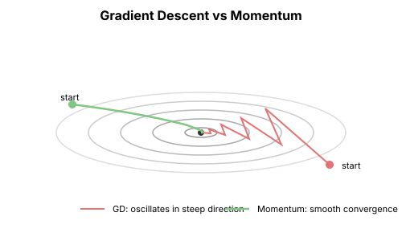
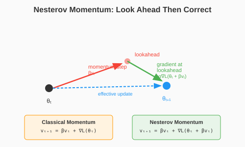

# Chapter 12: Momentum and Acceleration

With the theoretical foundations in place, we now turn to practical methods. Momentum is the first major improvement over vanilla gradient descent—a simple idea with deep consequences.

## The Momentum Idea

### Physics Intuition

Imagine a ball rolling down a hill. It doesn't stop immediately when the gradient changes—it has **inertia**. Momentum optimization mimics this physics.

```python
import torch
import torch.nn as nn
from typing import List, Tuple, Callable

def gradient_descent_vs_momentum():
    """Compare gradient descent with and without momentum."""
    # Ill-conditioned quadratic
    A = torch.tensor([[10.0, 0.0], [0.0, 1.0]])

    def f(x):
        return 0.5 * x @ A @ x

    def grad_f(x):
        return A @ x

    # Gradient descent
    x_gd = torch.tensor([10.0, 1.0])
    gd_trajectory = [x_gd.clone()]

    # Momentum
    x_mom = torch.tensor([10.0, 1.0])
    v = torch.zeros(2)  # Velocity
    mom_trajectory = [x_mom.clone()]

    lr = 0.1
    beta = 0.9

    for _ in range(50):
        # GD update
        x_gd = x_gd - lr * grad_f(x_gd)
        gd_trajectory.append(x_gd.clone())

        # Momentum update
        v = beta * v + grad_f(x_mom)  # Accumulate velocity
        x_mom = x_mom - lr * v
        mom_trajectory.append(x_mom.clone())

    print(f"GD final: {gd_trajectory[-1].numpy()}, loss: {f(gd_trajectory[-1]):.6f}")
    print(f"Momentum final: {mom_trajectory[-1].numpy()}, loss: {f(mom_trajectory[-1]):.6f}")

    return gd_trajectory, mom_trajectory
```



### The Update Rule

**Polyak's Heavy Ball** (1964):

$$v_{t+1} = \beta v_t + \nabla f(\theta_t)$$
$$\theta_{t+1} = \theta_t - \eta v_{t+1}$$

- $\beta$: momentum coefficient (typically 0.9)
- $v_t$: velocity (accumulated gradient)
- The velocity persists across steps

```python
class MomentumSGD:
    """
    SGD with Polyak momentum.
    """
    def __init__(self, params, lr: float = 0.01, momentum: float = 0.9):
        self.params = list(params)
        self.lr = lr
        self.momentum = momentum
        self.velocities = [torch.zeros_like(p) for p in self.params]

    def step(self):
        for p, v in zip(self.params, self.velocities):
            if p.grad is None:
                continue

            # Update velocity
            v.mul_(self.momentum).add_(p.grad)

            # Update parameters
            p.data.sub_(self.lr * v)

    def zero_grad(self):
        for p in self.params:
            if p.grad is not None:
                p.grad.zero_()
```

## Why Momentum Works

### 1. Dampening Oscillations

In ill-conditioned problems, GD oscillates in high-curvature directions.

Momentum averages over oscillations:
- In the oscillating direction: gradients cancel out
- In the consistent direction: gradients accumulate

The result: faster progress in the direction that matters.

```python
def momentum_dampens_oscillations():
    """Show how momentum reduces oscillation."""
    # Highly ill-conditioned: κ = 100
    A = torch.tensor([[100.0, 0.0], [0.0, 1.0]])

    def grad_f(x):
        return A @ x

    x_gd = torch.tensor([1.0, 1.0])
    x_mom = torch.tensor([1.0, 1.0])
    v = torch.zeros(2)

    lr = 0.015  # Near stability limit for GD
    beta = 0.9

    gd_x1 = []
    mom_x1 = []

    for _ in range(100):
        x_gd = x_gd - lr * grad_f(x_gd)
        gd_x1.append(x_gd[0].item())

        v = beta * v + grad_f(x_mom)
        x_mom = x_mom - lr * v
        mom_x1.append(x_mom[0].item())

    print(f"GD oscillation amplitude: {max(gd_x1[-10:]) - min(gd_x1[-10:]):.4f}")
    print(f"Momentum final x1: {mom_x1[-1]:.6f}")
```

### 2. Accelerating Through Flat Regions

When the gradient is small but consistent, momentum builds up:

After $k$ steps with constant gradient $g$:
$$v_k = g(1 + \beta + \beta^2 + \cdots + \beta^{k-1}) = g\frac{1-\beta^k}{1-\beta}$$

For $\beta = 0.9$: Effective gradient is amplified by up to 10×.

### 3. Escaping Saddle Points Faster

At saddles, the gradient is near zero. Momentum's velocity persists:
- Even with small gradients, the optimizer keeps moving
- Noise in previous gradients provides escape velocity

## Nesterov Accelerated Gradient (NAG)

### The Lookahead Idea

Nesterov (1983) improved momentum with a key insight:

**Don't compute the gradient at the current position—compute it at where you're about to be.**

$$\theta_{lookahead} = \theta_t - \beta v_t$$
$$v_{t+1} = \beta v_t + \nabla f(\theta_{lookahead})$$
$$\theta_{t+1} = \theta_t - \eta v_{t+1}$$

This "looks ahead" to anticipate where momentum is taking you.



```python
class NesterovSGD:
    """
    SGD with Nesterov accelerated gradient.
    """
    def __init__(self, params, lr: float = 0.01, momentum: float = 0.9):
        self.params = list(params)
        self.lr = lr
        self.momentum = momentum
        self.velocities = [torch.zeros_like(p) for p in self.params]

    def step(self, loss_fn: Callable):
        # Look ahead
        for p, v in zip(self.params, self.velocities):
            p.data.sub_(self.momentum * v)

        # Compute gradient at lookahead position
        loss = loss_fn()
        loss.backward()

        # Update
        for p, v in zip(self.params, self.velocities):
            if p.grad is None:
                continue

            # Update velocity with gradient at lookahead
            v.mul_(self.momentum).add_(p.grad)

            # The momentum step was already taken; now add gradient step
            p.data.sub_(self.lr * p.grad)

        self.zero_grad()

    def zero_grad(self):
        for p in self.params:
            if p.grad is not None:
                p.grad.zero_()
```

### PyTorch's Implementation

PyTorch uses an equivalent reformulation:

```python
def nesterov_update_pytorch_style(param, grad, velocity, lr, momentum):
    """
    PyTorch's mathematically equivalent Nesterov implementation.
    Avoids the explicit lookahead.
    """
    velocity.mul_(momentum).add_(grad)
    param.sub_(lr * (grad + momentum * velocity))
```

### Why Nesterov Is Better

For convex quadratics with condition number $\kappa$:

| Method | Convergence Rate |
|--------|------------------|
| Gradient Descent | $O(\kappa \log 1/\epsilon)$ |
| Heavy Ball Momentum | $O(\sqrt{\kappa} \log 1/\epsilon)$ |
| Nesterov Accelerated | $O(\sqrt{\kappa} \log 1/\epsilon)$ (optimal) |

Nesterov achieves the **optimal rate** for first-order methods on convex problems.

## Momentum in Practice

### Typical Settings

| Hyperparameter | Common Value | Notes |
|---------------|--------------|-------|
| $\beta$ (momentum) | 0.9 | Higher for stable, lower for noisy |
| Learning rate | Reduced vs no-momentum | Momentum amplifies steps |

### Interaction with Learning Rate

With momentum $\beta = 0.9$, the effective step size is amplified by $1/(1-\beta) = 10$.

Rule of thumb: If using momentum, you may need to reduce the learning rate.

```python
def lr_momentum_interaction():
    """Show that momentum requires learning rate adjustment."""
    A = torch.tensor([[10.0, 0.0], [0.0, 1.0]])

    def f(x):
        return 0.5 * x @ A @ x

    def grad_f(x):
        return A @ x

    results = []

    for momentum, lr in [(0.0, 0.1), (0.9, 0.1), (0.9, 0.01)]:
        x = torch.tensor([10.0, 1.0])
        v = torch.zeros(2)

        losses = []
        for step in range(100):
            losses.append(f(x).item())
            v = momentum * v + grad_f(x)
            x = x - lr * v

        final = f(x).item()
        diverged = final > 1e10 or torch.isnan(torch.tensor(final))

        results.append((momentum, lr, "DIVERGED" if diverged else f"{final:.6f}"))

    print("Momentum | LR   | Final Loss")
    print("-" * 35)
    for mom, lr, final in results:
        print(f"{mom:.1f}      | {lr:.2f} | {final}")
```

### Momentum Schedule

Some practitioners reduce momentum early in training:
- Start with $\beta = 0.5$
- Gradually increase to $\beta = 0.9$

This allows larger learning rates early ($\beta$ is lower) and stable convergence later ($\beta$ is higher).

## Understanding the Dynamics

### The Eigenvalue View

For a quadratic $f(x) = \frac{1}{2}x^TAx$, momentum dynamics decompose by eigenvalue.

For eigenvalue $\lambda$ with eigenvector $v$, the component along $v$ follows:

$$x_{t+1}^{(v)} = (1 + \beta - \eta\lambda)x_t^{(v)} - \beta x_{t-1}^{(v)}$$

This is a second-order linear recurrence—it can oscillate if parameters are wrong.

```python
def eigenvalue_dynamics():
    """Analyze momentum dynamics per eigenvalue."""
    import numpy as np

    def analyze_eigenvalue(lam, lr, beta, steps=100):
        """Track convergence for a single eigenvalue."""
        x = 1.0
        x_prev = 1.0

        trajectory = [x]
        for _ in range(steps):
            x_new = (1 + beta - lr * lam) * x - beta * x_prev
            x_prev = x
            x = x_new
            trajectory.append(x)

        return trajectory

    lr = 0.1
    beta = 0.9

    print("Eigenvalue | Converges? | Final value")
    print("-" * 40)

    for lam in [0.1, 1.0, 5.0, 10.0, 20.0]:
        traj = analyze_eigenvalue(lam, lr, beta)
        final = traj[-1]
        converges = abs(final) < 0.01

        print(f"{lam:10.1f} | {'Yes':10} | {final:+.6f}" if converges
              else f"{lam:10.1f} | {'No':10} | {final:+.2e}")
```

### Stability Conditions

For momentum to be stable, the learning rate must satisfy:

$$\eta < \frac{(1 + \beta)^2}{\lambda_{max}}$$

This is more restrictive than GD ($\eta < 2/\lambda_{\max}$) when $\beta > 0$.

## Momentum and Noise

### Momentum Smooths Gradient Noise

With stochastic gradients, momentum averages over past noise:

$$v_t = \sum_{i=0}^{t-1} \beta^i g_{t-1-i}$$

The effective noise variance is reduced by a factor of $(1-\beta^2)/(1-\beta)^2 \approx (1+\beta)/(1-\beta)$.

For $\beta = 0.9$: Noise reduced by factor of 19.

### But Momentum Has Memory

Momentum remembers old gradients. If the loss landscape changes (new data, curriculum), old velocities can be misleading.

Solutions:
- Reduce momentum early in training
- Reset momentum after major changes
- Use learning rate warmup

## Key Takeaways

1. **Momentum accelerates convergence** by $O(\sqrt{\kappa})$ for quadratics

2. **It dampens oscillations** in high-curvature directions

3. **Nesterov's lookahead** improves stability and is optimal for convex problems

4. **Momentum requires lower learning rates** due to amplification

5. **It smooths stochastic noise** by averaging over history

6. **The standard setting $\beta = 0.9$** works well in practice

## What's Next

- **Chapter 13**: Adaptive learning rates—per-parameter scaling
- This builds toward Adam, which combines momentum with adaptivity

## Exercises

1. **Eigenvalue stability**: For what range of learning rates is momentum stable for eigenvalue $\lambda = 10$ with $\beta = 0.9$?

2. **Noise reduction**: Empirically measure the variance reduction from momentum on a noisy gradient.

3. **Nesterov vs Polyak**: Compare convergence on a real neural network. When does Nesterov help?

4. **Momentum schedule**: Implement and test a momentum schedule that starts at 0.5 and increases to 0.99.
