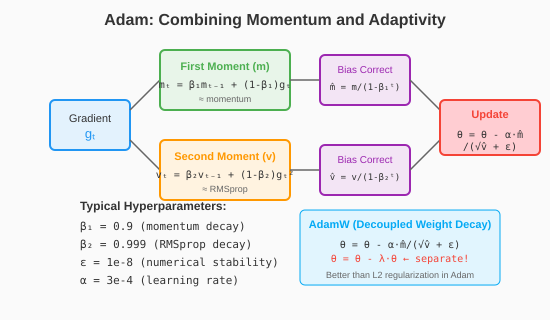
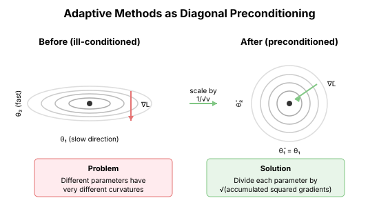

# Chapter 13: Adaptive Learning Rates

Momentum uses a single learning rate for all parameters. But neural networks have wildly different gradient scales across parameters. Adaptive methods address this by maintaining per-parameter learning rates.

## The Problem: Scale Mismatch

### Different Parameters, Different Gradients

In a neural network:
- Embedding layers: tiny gradients
- Early layers: moderate gradients
- Late layers: large gradients
- Bias terms: different scale from weights

```python
import torch
import torch.nn as nn

def gradient_scale_analysis():
    """Show gradient scale variation across layers."""
    torch.manual_seed(42)

    model = nn.Sequential(
        nn.Embedding(10000, 256),
        nn.Linear(256, 256),
        nn.ReLU(),
        nn.Linear(256, 256),
        nn.ReLU(),
        nn.Linear(256, 100)
    )

    # Random forward pass
    x = torch.randint(0, 10000, (32, 10))
    y = torch.randint(0, 100, (32,))

    embed = model[0](x).mean(dim=1)  # Average embeddings
    out = embed
    for layer in model[1:]:
        out = layer(out)

    loss = nn.CrossEntropyLoss()(out, y)
    loss.backward()

    print("Layer                  | Grad Norm    | Param Norm  | Ratio")
    print("-" * 65)
    for name, param in model.named_parameters():
        if param.grad is not None:
            g_norm = param.grad.norm().item()
            p_norm = param.data.norm().item()
            print(f"{name:22} | {g_norm:.6f}     | {p_norm:.4f}     | {g_norm/p_norm:.6f}")
```

### Why One Learning Rate Fails

A single learning rate must be:
- Small enough for the largest gradients (stability)
- Large enough for the smallest gradients (progress)

These constraints are often incompatible.

## AdaGrad: The First Adaptive Method

### The Idea

**AdaGrad** (Duchi et al., 2011): Scale each parameter's learning rate by the sum of squared gradients seen so far.

Parameters that had large gradients get smaller learning rates.

$$v_t = v_{t-1} + g_t^2$$
$$\theta_t = \theta_{t-1} - \frac{\eta}{\sqrt{v_t} + \epsilon} g_t$$

The $\sqrt{v_t}$ grows monotonically, so learning rates only decrease.

```python
class AdaGrad:
    """AdaGrad optimizer."""
    def __init__(self, params, lr: float = 0.01, eps: float = 1e-8):
        self.params = list(params)
        self.lr = lr
        self.eps = eps
        self.sum_sq_grads = [torch.zeros_like(p) for p in self.params]

    def step(self):
        for p, v in zip(self.params, self.sum_sq_grads):
            if p.grad is None:
                continue

            # Accumulate squared gradients
            v.add_(p.grad ** 2)

            # Adaptive update
            p.data.sub_(self.lr * p.grad / (v.sqrt() + self.eps))

    def zero_grad(self):
        for p in self.params:
            if p.grad is not None:
                p.grad.zero_()
```

### AdaGrad's Problem

The accumulated sum $v_t$ grows forever. Eventually, learning rates become vanishingly small.

For deep learning with many epochs: AdaGrad stops learning too early.

## RMSProp: Fixing the Accumulation

### The Fix: Exponential Moving Average

**RMSProp** (Hinton, unpublished, 2012): Use an exponential moving average instead of a sum.

$$v_t = \beta v_{t-1} + (1-\beta) g_t^2$$
$$\theta_t = \theta_{t-1} - \frac{\eta}{\sqrt{v_t} + \epsilon} g_t$$

Typical $\beta = 0.99$: Averages over ~100 recent gradients.

```python
class RMSProp:
    """RMSProp optimizer."""
    def __init__(self, params, lr: float = 0.01, beta: float = 0.99, eps: float = 1e-8):
        self.params = list(params)
        self.lr = lr
        self.beta = beta
        self.eps = eps
        self.v = [torch.zeros_like(p) for p in self.params]

    def step(self):
        for p, v in zip(self.params, self.v):
            if p.grad is None:
                continue

            # Exponential moving average of squared gradients
            v.mul_(self.beta).add_((1 - self.beta) * p.grad ** 2)

            # Adaptive update
            p.data.sub_(self.lr * p.grad / (v.sqrt() + self.eps))

    def zero_grad(self):
        for p in self.params:
            if p.grad is not None:
                p.grad.zero_()
```

### Why RMSProp Works

1. **Bounded denominator**: $v_t$ doesn't grow forever
2. **Adapts to local curvature**: Recent gradients matter most
3. **Per-parameter**: Each coordinate has its own scale

## Adam: Combining Momentum and Adaptivity

### The Best of Both Worlds

**Adam** (Kingma & Ba, 2015): Momentum + RMSProp + Bias Correction.

$$m_t = \beta_1 m_{t-1} + (1-\beta_1) g_t \quad \text{(momentum)}$$
$$v_t = \beta_2 v_{t-1} + (1-\beta_2) g_t^2 \quad \text{(adaptivity)}$$
$$\hat{m}_t = \frac{m_t}{1-\beta_1^t}, \quad \hat{v}_t = \frac{v_t}{1-\beta_2^t} \quad \text{(bias correction)}$$
$$\theta_t = \theta_{t-1} - \frac{\eta \hat{m}_t}{\sqrt{\hat{v}_t} + \epsilon}$$

```python
class Adam:
    """Adam optimizer with bias correction."""
    def __init__(self, params, lr: float = 0.001,
                 betas: tuple = (0.9, 0.999), eps: float = 1e-8):
        self.params = list(params)
        self.lr = lr
        self.beta1, self.beta2 = betas
        self.eps = eps
        self.m = [torch.zeros_like(p) for p in self.params]  # First moment
        self.v = [torch.zeros_like(p) for p in self.params]  # Second moment
        self.t = 0

    def step(self):
        self.t += 1

        for p, m, v in zip(self.params, self.m, self.v):
            if p.grad is None:
                continue

            g = p.grad

            # Update moments
            m.mul_(self.beta1).add_((1 - self.beta1) * g)
            v.mul_(self.beta2).add_((1 - self.beta2) * g ** 2)

            # Bias correction
            m_hat = m / (1 - self.beta1 ** self.t)
            v_hat = v / (1 - self.beta2 ** self.t)

            # Update parameters
            p.data.sub_(self.lr * m_hat / (v_hat.sqrt() + self.eps))

    def zero_grad(self):
        for p in self.params:
            if p.grad is not None:
                p.grad.zero_()
```

### Why Bias Correction?

At initialization, $m_0 = v_0 = 0$. Without correction:

$$m_1 = 0.1 \cdot g_1 \quad \text{(biased toward 0)}$$
$$v_1 = 0.001 \cdot g_1^2 \quad \text{(severely biased)}$$

Bias correction: $\hat{m}_1 = m_1/(1-0.9) = g_1$ (unbiased).

Early steps need this correction most.

### Adam's Hyperparameters

| Parameter | Typical Value | Effect |
|-----------|--------------|--------|
| lr | 0.001 | Step size |
| β₁ | 0.9 | Momentum decay |
| β₂ | 0.999 | Squared gradient decay |
| ε | 1e-8 | Numerical stability |

**β₂ is crucial**: Too small = noisy estimates. Too large = slow adaptation.



## AdamW: Fixing Weight Decay

### The Problem with L2 in Adam

Standard L2 regularization adds $\frac{\lambda}{2}\|\theta\|^2$ to the loss:

$$g_t = \nabla L(\theta_t) + \lambda \theta_t$$

But in Adam, this gets scaled by the adaptive learning rate!

```python
def l2_in_adam_problem():
    """Show that L2 regularization is scaled non-uniformly by Adam."""
    # Two parameters with different gradient histories
    theta1 = torch.tensor([1.0])  # Has seen large gradients
    theta2 = torch.tensor([1.0])  # Has seen small gradients

    v1 = torch.tensor([100.0])  # Large accumulated second moment
    v2 = torch.tensor([0.01])   # Small accumulated second moment

    lambda_reg = 0.01
    lr = 0.001

    # The L2 penalty is the same: lambda * theta = 0.01
    l2_penalty = lambda_reg * theta1.item()

    # But Adam scales it differently!
    effective_penalty_1 = l2_penalty / (v1.sqrt() + 1e-8)
    effective_penalty_2 = l2_penalty / (v2.sqrt() + 1e-8)

    print(f"L2 penalty: {l2_penalty:.4f}")
    print(f"Effective penalty for param 1: {effective_penalty_1.item():.6f}")
    print(f"Effective penalty for param 2: {effective_penalty_2.item():.6f}")
    print(f"Ratio: {effective_penalty_2.item() / effective_penalty_1.item():.1f}x")
```

### AdamW: Decoupled Weight Decay

**AdamW** (Loshchilov & Hutter, 2019): Apply weight decay **after** the adaptive scaling.

$$\theta_t = \theta_{t-1} - \eta \left( \frac{\hat{m}_t}{\sqrt{\hat{v}_t} + \epsilon} + \lambda \theta_{t-1} \right)$$

The weight decay $\lambda\theta$ is **not** scaled by $1/\sqrt{v}$.

```python
class AdamW:
    """AdamW with decoupled weight decay."""
    def __init__(self, params, lr: float = 0.001,
                 betas: tuple = (0.9, 0.999), eps: float = 1e-8,
                 weight_decay: float = 0.01):
        self.params = list(params)
        self.lr = lr
        self.beta1, self.beta2 = betas
        self.eps = eps
        self.weight_decay = weight_decay
        self.m = [torch.zeros_like(p) for p in self.params]
        self.v = [torch.zeros_like(p) for p in self.params]
        self.t = 0

    def step(self):
        self.t += 1

        for p, m, v in zip(self.params, self.m, self.v):
            if p.grad is None:
                continue

            g = p.grad

            # Update moments (same as Adam)
            m.mul_(self.beta1).add_((1 - self.beta1) * g)
            v.mul_(self.beta2).add_((1 - self.beta2) * g ** 2)

            # Bias correction
            m_hat = m / (1 - self.beta1 ** self.t)
            v_hat = v / (1 - self.beta2 ** self.t)

            # Update with DECOUPLED weight decay
            p.data.sub_(self.lr * m_hat / (v_hat.sqrt() + self.eps))
            p.data.sub_(self.lr * self.weight_decay * p.data)  # Decoupled!

    def zero_grad(self):
        for p in self.params:
            if p.grad is not None:
                p.grad.zero_()
```

### AdamW Is the Default for LLMs

Nearly all modern LLM training uses AdamW:
- GPT-2, GPT-3, GPT-4
- LLaMA, Mistral
- All major open models

## Understanding Adaptive Methods Geometrically

### Diagonal Preconditioning

Adaptive methods apply a **diagonal preconditioner**:

$$\theta_{t+1} = \theta_t - \eta D_t^{-1} g_t$$

where $D_t = \text{diag}(\sqrt{v_t})$.

This is an approximation to Newton:
- Newton: $H^{-1}$
- Adaptive: $\text{diag}(H)^{-1}$ (roughly)



### Sign Descent Interpretation

In the limit of small updates, Adam approaches **sign descent**:

$$\theta_t \approx \theta_{t-1} - \eta \cdot \text{sign}(m_t)$$

Each parameter moves by approximately the same amount, regardless of gradient magnitude.

## Practical Considerations

### When to Use What

| Optimizer | When to Use |
|-----------|-------------|
| SGD+Momentum | Convex, well-understood problems, final fine-tuning |
| Adam | Default for most deep learning |
| AdamW | When using weight decay (most LLM training) |

### Common Issues

1. **Adam can converge to bad minima** in some cases (see: "The Marginal Value of Adaptive Gradient Methods")

2. **Learning rate needs tuning** per problem

3. **β₂ too high** can cause slow adaptation

4. **ε matters** for numerical stability with half-precision

### Hyperparameter Guidelines

For LLMs:
```python
optimizer = torch.optim.AdamW(
    model.parameters(),
    lr=1e-4,           # Start here, tune
    betas=(0.9, 0.95),  # Lower β₂ than default
    eps=1e-8,
    weight_decay=0.1    # Typical for LLMs
)
```

## Key Takeaways

1. **Adaptive methods learn per-parameter learning rates**

2. **AdaGrad accumulates forever** → learning stops

3. **RMSProp uses exponential averaging** → bounded accumulation

4. **Adam = Momentum + RMSProp** with bias correction

5. **AdamW decouples weight decay** from adaptive scaling

6. **AdamW is the default** for modern LLM training

## What's Next

- **Chapter 14**: Hessian-free optimization—using CG for the Newton direction
- **Chapter 15**: Natural gradient—using Fisher information geometry

## Exercises

1. **Bias correction timing**: How many steps until the bias correction factor exceeds 0.9?

2. **Compare Adam vs SGD**: Train the same network with both. How do loss curves differ?

3. **β₂ sensitivity**: How does Adam performance change with β₂ ∈ {0.9, 0.99, 0.999, 0.9999}?

4. **Weight decay comparison**: Compare L2 regularization in Adam vs AdamW weight decay.
