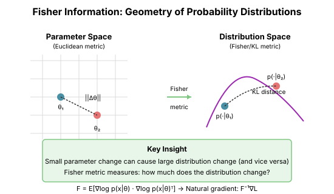

# Chapter 15: Natural Gradient and Fisher Information

The natural gradient takes a radically different view: optimize in **function space**, not parameter space. This leads to the Fisher information matrix and deep connections between optimization and statistics.

## The Problem with Parameter Space

### Reparameterization Sensitivity

Consider a simple model: $p(y|x) = \mathcal{N}(y; \theta x, 1)$.

Now reparameterize: $\phi = \theta^3$, so $\theta = \phi^{1/3}$.

The model is the same, but gradient descent behaves differently!

```python
import torch
import numpy as np

def reparameterization_sensitivity():
    """Show that GD depends on parameterization."""
    # Data
    x, y = torch.tensor([1.0]), torch.tensor([3.0])

    # Loss in θ space: (y - θx)²
    def loss_theta(theta):
        return (y - theta * x) ** 2

    # Loss in φ space where θ = φ^(1/3)
    def loss_phi(phi):
        theta = torch.sign(phi) * torch.abs(phi) ** (1/3)
        return (y - theta * x) ** 2

    # Gradient descent from same "equivalent" starting point
    theta = torch.tensor([1.0], requires_grad=True)
    phi = torch.tensor([1.0], requires_grad=True)  # Same θ

    lr = 0.1

    print("Step | θ-space θ | φ-space θ")
    print("-" * 35)

    for step in range(10):
        theta_val = theta.item()
        phi_theta_val = np.sign(phi.item()) * abs(phi.item()) ** (1/3)

        print(f"{step:4d} | {theta_val:9.4f} | {phi_theta_val:9.4f}")

        # GD in θ space
        loss = loss_theta(theta)
        loss.backward()
        with torch.no_grad():
            theta -= lr * theta.grad
            theta.grad.zero_()

        # GD in φ space
        loss = loss_phi(phi)
        loss.backward()
        with torch.no_grad():
            phi -= lr * phi.grad
            phi.grad.zero_()
```

The paths are different even though the model is identical!

## The Natural Gradient Idea

### Optimization in Distribution Space

Optimize in the space of distributions, not parameters ([Amari, 1998](https://direct.mit.edu/neco/article/10/2/251/6143/Natural-Gradient-Works-Efficiently-in-Learning)).

The "natural" metric on distributions is the **KL divergence**:

$$D_{KL}(p_\theta \| p_{\theta + d\theta}) \approx \frac{1}{2} d\theta^T F(\theta) d\theta$$

where $F$ is the **Fisher information matrix**.

### The Fisher Information Matrix

$$F(\theta) = \mathbb{E}_{p(y|x;\theta)}\left[ \nabla_\theta \log p(y|x;\theta) \cdot \nabla_\theta \log p(y|x;\theta)^T \right]$$

This measures how much the distribution changes when parameters change.

```python
def compute_fisher_information(
    model: torch.nn.Module,
    data_loader: torch.utils.data.DataLoader,
    n_samples: int = 1000
) -> dict:
    """
    Estimate Fisher information for each parameter.

    Returns diagonal Fisher approximation.
    """
    fisher = {name: torch.zeros_like(p) for name, p in model.named_parameters()}

    model.eval()
    count = 0

    for x, _ in data_loader:
        if count >= n_samples:
            break

        # Forward pass
        logits = model(x)

        # Sample from model's distribution
        probs = torch.softmax(logits, dim=-1)
        y_sample = torch.multinomial(probs, 1).squeeze()

        # Compute log probability gradient
        log_prob = torch.log_softmax(logits, dim=-1)
        selected_log_prob = log_prob.gather(1, y_sample.unsqueeze(1)).sum()

        model.zero_grad()
        selected_log_prob.backward()

        # Accumulate squared gradients
        for name, p in model.named_parameters():
            if p.grad is not None:
                fisher[name] += p.grad ** 2

        count += x.shape[0]

    # Average
    for name in fisher:
        fisher[name] /= count

    return fisher
```

### The Natural Gradient Update

$$\theta_{t+1} = \theta_t - \eta F(\theta_t)^{-1} \nabla L(\theta_t)$$

This is **invariant to reparameterization**: Different parameterizations give the same path in distribution space.

## Connection to Newton and Gauss-Newton

### Fisher = Expected Hessian

For log-likelihood objectives:

$$-\nabla^2 \log p(y|x;\theta) \approx F(\theta) + \text{terms depending on residuals}$$

At the optimum (where residuals are small), Fisher ≈ Hessian.

### Fisher = Gauss-Newton

For models with Gaussian output:

$$p(y|x;\theta) = \mathcal{N}(y; f(x;\theta), \sigma^2 I)$$

The Fisher is exactly:

$$F = \frac{1}{\sigma^2} J^T J$$

where $J$ is the Jacobian of $f$ with respect to $\theta$.

**This is the Gauss-Newton matrix from Chapter 5!**

```python
def fisher_equals_gauss_newton():
    """Demonstrate Fisher = Gauss-Newton for Gaussian models."""
    torch.manual_seed(42)

    # Simple linear model: y ~ N(Xθ, σ²)
    n, d = 100, 5
    X = torch.randn(n, d)
    theta = torch.randn(d, requires_grad=True)
    sigma_sq = 0.1

    # Gauss-Newton: J^T J / σ²
    # Here J = X (Jacobian of predictions wrt θ)
    GN = X.T @ X / sigma_sq

    # Fisher: E[∇log p ⋅ ∇log p^T]
    # For Gaussian: ∇log p = (y - Xθ)X / σ²
    # E[(y - Xθ)(y - Xθ)^T] = σ² I
    # So Fisher = X^T @ I @ X / σ² = X^T X / σ²
    Fisher = X.T @ X / sigma_sq

    print(f"GN[0,0] = {GN[0,0].item():.4f}")
    print(f"Fisher[0,0] = {Fisher[0,0].item():.4f}")
    print(f"Equal: {torch.allclose(GN, Fisher)}")
```

## Geometric Interpretation

### The Fisher Metric

The Fisher matrix defines a **Riemannian metric** on parameter space:

$$\|d\theta\|_F^2 = d\theta^T F d\theta$$

This measures distance in terms of **how much the output distribution changes**.



### Why It's "Natural"

1. **Reparameterization invariant**: Same answer regardless of how you parameterize

2. **Matches distribution distance**: Steps of equal Fisher-norm change the distribution equally

3. **Optimal in information-geometric sense**: Follows geodesics in distribution space

## Natural Gradient in Practice

### The Problem: Fisher Is Huge

$F \in \mathbb{R}^{n \times n}$ where $n$ = number of parameters.

Storing and inverting this is impossible for neural networks.

### Diagonal Fisher

The simplest approximation: only keep the diagonal.

$$\theta_{t+1} = \theta_t - \eta \frac{g_t}{\text{diag}(F_t) + \epsilon}$$

This is basically **Adam** (without momentum)!

```python
class DiagonalNaturalGradient:
    """Natural gradient with diagonal Fisher approximation."""

    def __init__(self, params, lr: float = 0.01, beta: float = 0.999,
                 eps: float = 1e-8):
        self.params = list(params)
        self.lr = lr
        self.beta = beta
        self.eps = eps
        self.fisher_diag = [torch.zeros_like(p) for p in self.params]

    def step(self, model, x, sample_output: bool = True):
        """
        Take a natural gradient step.

        If sample_output=True, samples y from model (proper Fisher).
        If False, uses the gradient directly (empirical Fisher).
        """
        model.zero_grad()

        # Forward
        logits = model(x)

        if sample_output:
            # Sample from model distribution
            with torch.no_grad():
                probs = torch.softmax(logits, dim=-1)
                y = torch.multinomial(probs, 1).squeeze()
        else:
            # Use predicted class (empirical Fisher)
            y = logits.argmax(dim=-1)

        # Compute gradient of log probability
        log_prob = torch.log_softmax(logits, dim=-1)
        loss = -log_prob.gather(1, y.unsqueeze(1)).mean()
        loss.backward()

        # Update Fisher diagonal estimate and take step
        for p, f in zip(self.params, self.fisher_diag):
            if p.grad is None:
                continue

            # Update Fisher diagonal (EMA of squared gradients)
            f.mul_(self.beta).add_((1 - self.beta) * p.grad ** 2)

            # Natural gradient step
            p.data.sub_(self.lr * p.grad / (f.sqrt() + self.eps))
```

### Block-Diagonal Fisher

Better approximation: Keep block structure (one block per layer).

This leads to **K-FAC** (next chapter).

## Empirical Fisher vs True Fisher

### True Fisher

Samples $y$ from the model's distribution:
$$F = \mathbb{E}_{x \sim \text{data}} \mathbb{E}_{y \sim p(\cdot|x;\theta)}[\nabla \log p \cdot \nabla \log p^T]$$

### Empirical Fisher

Uses the actual label:
$$\hat{F} = \mathbb{E}_{(x,y) \sim \text{data}}[\nabla \log p(y|x;\theta) \cdot \nabla \log p(y|x;\theta)^T]$$

The empirical Fisher is easier to compute but doesn't have the same theoretical guarantees.

```python
def compare_fisher_estimates():
    """Compare true vs empirical Fisher."""
    import torch.nn as nn

    torch.manual_seed(42)

    model = nn.Linear(10, 3)
    x = torch.randn(100, 10)
    y_true = torch.randint(0, 3, (100,))

    # Empirical Fisher: use true labels
    model.zero_grad()
    logits = model(x)
    loss = nn.CrossEntropyLoss()(logits, y_true)
    loss.backward()

    empirical_fisher_diag = model.weight.grad ** 2

    # True Fisher: sample from model
    model.zero_grad()
    logits = model(x)
    probs = torch.softmax(logits, dim=-1)
    y_sampled = torch.multinomial(probs, 1).squeeze()

    log_prob = torch.log_softmax(logits, dim=-1)
    sampled_loss = -log_prob.gather(1, y_sampled.unsqueeze(1)).mean()
    sampled_loss.backward()

    true_fisher_diag = model.weight.grad ** 2

    print(f"Empirical Fisher norm: {empirical_fisher_diag.norm():.4f}")
    print(f"True Fisher norm: {true_fisher_diag.norm():.4f}")
    print(f"Correlation: {torch.corrcoef(torch.stack([empirical_fisher_diag.flatten(), true_fisher_diag.flatten()]))[0,1]:.4f}")
```

## Key Insights

### Why Natural Gradient Matters

1. **Reparameterization invariance**: The update is independent of how you parameterize the model

2. **Connects to statistics**: Fisher information is fundamental in estimation theory

3. **Explains Adam**: Diagonal Fisher ≈ Adam's second moment

4. **Foundation for K-FAC**: Block Fisher gives principled layer-wise updates

### The Hierarchy

| Method | Approximation | Cost |
|--------|--------------|------|
| Full Natural Gradient | $F^{-1}$ | $O(n^3)$ |
| K-FAC | Block Kronecker | $O(n)$ |
| Diagonal Fisher | $\text{diag}(F)^{-1}$ | $O(n)$ |
| Adam | EMA of $\text{diag}(F)$ | $O(n)$ |

## Key Takeaways

1. **Natural gradient optimizes in distribution space**, not parameter space

2. **The Fisher information** measures sensitivity of distributions to parameters

3. **Fisher = Gauss-Newton** for Gaussian likelihoods

4. **Reparameterization invariance** is the key theoretical property

5. **Diagonal Fisher ≈ Adam**, explaining why adaptive methods work

6. **Full Fisher is intractable**, leading to approximations (K-FAC)

## What's Next

- **Chapter 16**: K-FAC, Shampoo, SOAP—practical second-order methods
- These use Kronecker structure to make Fisher tractable

## Exercises

1. **Verify reparameterization invariance**: Show natural gradient gives same trajectory under reparameterization.

2. **Fisher for different distributions**: Compute the Fisher matrix for Bernoulli, Poisson, and Categorical.

3. **Empirical vs true Fisher**: When do they differ most?

4. **Implement diagonal natural gradient**: Train a network with diagonal Fisher. Compare to Adam.
