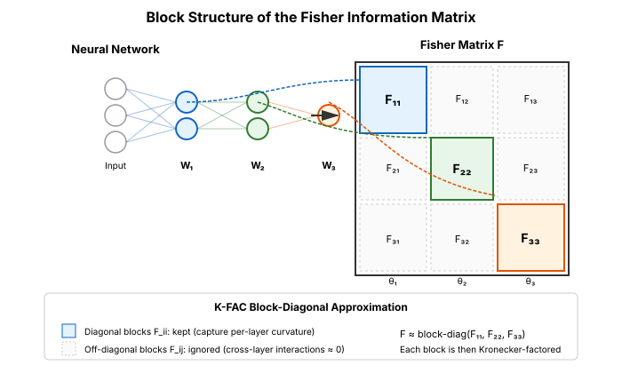
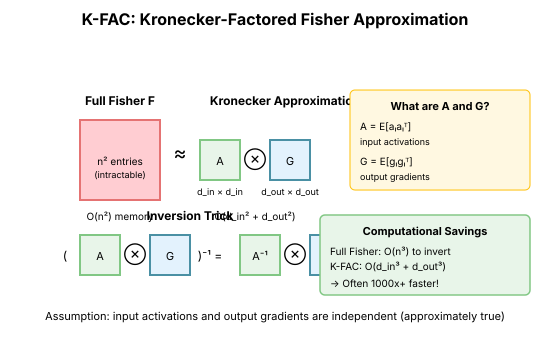

# Chapter 16: Practical Second-Order Methods

K-FAC, Shampoo, and SOAP represent the state-of-the-art in tractable second-order optimization for deep learning. They exploit the structure of neural networks to approximate curvature efficiently.

## K-FAC: Kronecker-Factored Approximate Curvature

### From Natural Gradient to K-FAC

Recall from [Chapter 15](15-natural-gradient.md) that the natural gradient update is:

$$\theta_{t+1} = \theta_t - \eta F^{-1} \nabla_\theta \mathcal{L}$$

where $F$ is the Fisher information matrix. The problem is that for a network with $n$ parameters, $F$ is $n \times n$—storing it alone costs $O(n^2)$, and inverting it costs $O(n^3)$. For modern networks with billions of parameters, this is impossible.

**K-FAC** ([Martens & Grosse, 2015](https://arxiv.org/abs/1503.05671)) makes this tractable by exploiting the *block structure* of the Fisher matrix and the *Kronecker structure* within each block.

### Block Structure of the Fisher

The Fisher information matrix has a natural block structure corresponding to layers. For a network with $L$ layers:

$$
F = \begin{pmatrix}
F_{11} & F_{12} & \cdots \\
F_{21} & F_{22} & \cdots \\
\vdots &        & \ddots
\end{pmatrix}
$$

The key approximation is to treat layers as independent, zeroing out the off-diagonal blocks:

$$F \approx \text{block-diag}(F_{11}, F_{22}, \ldots, F_{LL})$$

This is reasonable because most of the curvature information for each layer is contained in its own block.



### Deriving the Kronecker Structure

Now consider a single fully-connected layer: $y = Wa$ where $a \in \mathbb{R}^m$ is the input activation and $y \in \mathbb{R}^n$ is the pre-activation output. The weight matrix $W \in \mathbb{R}^{n \times m}$ has $nm$ parameters.

The Fisher block for this layer is:

$$F_W = \mathbb{E}\left[ \text{vec}(\nabla_W \log p)\ \text{vec}(\nabla_W \log p)^T \right]$$

where $\text{vec}(\cdot)$ flattens the matrix into a vector.

**Step 1: Compute the gradient.** By the chain rule:

$$\nabla_W \log p = g \cdot a^T$$

where $g = \nabla_y \log p \in \mathbb{R}^n$ is the gradient with respect to the layer's output. This is the outer product of the output gradient and input activation.

**Step 2: Vectorize.** Using the identity $\text{vec}(uv^T) = v \otimes u$:

$$\text{vec}(\nabla_W \log p) = a \otimes g$$

**Step 3: Compute the Fisher block.** Substituting:

$$F_W = \mathbb{E}\left[ (a \otimes g)(a \otimes g)^T \right] = \mathbb{E}\left[ (a \otimes g)(a^T \otimes g^T) \right]$$

Using the mixed-product property $(A \otimes B)(C \otimes D) = (AC) \otimes (BD)$:

$$F_W = \mathbb{E}\left[ (aa^T) \otimes (gg^T) \right]$$

**Step 4: The independence assumption.** Here comes the crucial approximation. If we assume $a$ and $g$ are statistically independent:

$$F_W = \mathbb{E}\left[ (aa^T) \otimes (gg^T) \right] \approx \mathbb{E}[aa^T] \otimes \mathbb{E}[gg^T] = A \otimes G$$

where:
- $A = \mathbb{E}[aa^T] \in \mathbb{R}^{m \times m}$: the input activation covariance
- $G = \mathbb{E}[gg^T] \in \mathbb{R}^{n \times n}$: the output gradient covariance

### Why the Independence Assumption Works

The assumption that activations and gradients are independent is *not* strictly true—they're connected through the forward and backward pass. However:

1. **They come from different data dimensions**: $a$ summarizes the input at this layer, while $g$ summarizes information flowing back from the loss.

2. **Correlation weakens with depth**: In deep networks, many layers separate the computation of $a$ (determined by early layers) from $g$ (determined by later layers).

3. **It works empirically**: Despite being an approximation, K-FAC achieves significant speedups over first-order methods in practice.

4. **The alternative is intractable**: Without this assumption, we'd need to store the full $nm \times nm$ matrix.

### The Computational Win

The Kronecker factorization reduces complexity dramatically:

| Operation | Full Fisher | K-FAC |
|-----------|-------------|-------|
| Storage | $O((nm)^2)$ | $O(m^2 + n^2)$ |
| Inverse | $O((nm)^3)$ | $O(m^3 + n^3)$ |

For a layer with $m = n = 1000$, full Fisher needs 1 trillion elements; K-FAC needs 2 million.

**Inverting the Kronecker product** uses the identity:

$$(A \otimes G)^{-1} = A^{-1} \otimes G^{-1}$$

So instead of inverting an $nm \times nm$ matrix, we invert two smaller matrices independently.

### Applying the Natural Gradient

To compute the K-FAC update $F^{-1} \text{vec}(\nabla_W)$, we use another Kronecker identity. If $\text{vec}(\nabla_W) = a \otimes g$ conceptually, then:

$$(A \otimes G)^{-1} \text{vec}(\nabla_W) = \text{vec}(G^{-1} \nabla_W A^{-1})$$

So the natural gradient update becomes a simple matrix sandwich: $G^{-1} \nabla_W A^{-1}$.



```python
import torch
import torch.nn as nn
from typing import Dict, List, Tuple

class KFACOptimizer:
    """
    K-FAC optimizer for fully-connected networks.
    """
    def __init__(self, model: nn.Module, lr: float = 0.01,
                 damping: float = 1e-3, update_freq: int = 10):
        self.model = model
        self.lr = lr
        self.damping = damping
        self.update_freq = update_freq
        self.step_count = 0

        # Store factors for each layer
        self.A_factors: Dict[str, torch.Tensor] = {}  # Input covariance
        self.G_factors: Dict[str, torch.Tensor] = {}  # Output gradient covariance

        # Register hooks to capture activations and gradients
        self.activations: Dict[str, torch.Tensor] = {}
        self.gradients: Dict[str, torch.Tensor] = {}
        self._register_hooks()

    def _register_hooks(self):
        for name, module in self.model.named_modules():
            if isinstance(module, nn.Linear):
                module.register_forward_hook(
                    lambda m, inp, out, n=name: self._save_activation(n, inp[0])
                )
                module.register_full_backward_hook(
                    lambda m, grad_in, grad_out, n=name: self._save_gradient(n, grad_out[0])
                )

    def _save_activation(self, name: str, activation: torch.Tensor):
        # Add ones for bias
        a = torch.cat([activation, torch.ones(activation.shape[0], 1, device=activation.device)], dim=1)
        self.activations[name] = a

    def _save_gradient(self, name: str, gradient: torch.Tensor):
        self.gradients[name] = gradient

    def update_factors(self):
        """Update Kronecker factors from recent batch."""
        for name, module in self.model.named_modules():
            if isinstance(module, nn.Linear) and name in self.activations:
                a = self.activations[name]
                g = self.gradients[name]

                # Update A: input covariance
                A = (a.T @ a) / a.shape[0]
                if name in self.A_factors:
                    self.A_factors[name] = 0.9 * self.A_factors[name] + 0.1 * A
                else:
                    self.A_factors[name] = A

                # Update G: gradient covariance
                G = (g.T @ g) / g.shape[0]
                if name in self.G_factors:
                    self.G_factors[name] = 0.9 * self.G_factors[name] + 0.1 * G
                else:
                    self.G_factors[name] = G

    def step(self):
        """Take a K-FAC step."""
        self.step_count += 1

        # Update factors periodically
        if self.step_count % self.update_freq == 0:
            self.update_factors()

        for name, module in self.model.named_modules():
            if isinstance(module, nn.Linear) and name in self.A_factors:
                A = self.A_factors[name]
                G = self.G_factors[name]

                # Add damping
                A_damped = A + self.damping * torch.eye(A.shape[0], device=A.device)
                G_damped = G + self.damping * torch.eye(G.shape[0], device=G.device)

                # Compute natural gradient: (A ⊗ G)^{-1} vec(grad)
                # = A^{-1} grad G^{-1}  (using Kronecker inverse property)

                # Get gradient as matrix
                grad_w = module.weight.grad
                grad_b = module.bias.grad if module.bias is not None else None

                if grad_w is not None:
                    # Include bias gradient in the computation
                    if grad_b is not None:
                        grad_full = torch.cat([grad_w, grad_b.unsqueeze(1)], dim=1)
                    else:
                        grad_full = grad_w

                    # Natural gradient: G^{-1} @ grad @ A^{-1}
                    A_inv = torch.linalg.inv(A_damped)
                    G_inv = torch.linalg.inv(G_damped)

                    natural_grad = G_inv @ grad_full @ A_inv

                    # Update
                    with torch.no_grad():
                        if grad_b is not None:
                            module.weight.sub_(self.lr * natural_grad[:, :-1])
                            module.bias.sub_(self.lr * natural_grad[:, -1])
                        else:
                            module.weight.sub_(self.lr * natural_grad)

    def zero_grad(self):
        self.model.zero_grad()
```

## Shampoo: Preconditioning for Arbitrary Tensors

### Beyond Kronecker

**Shampoo** ([Gupta et al., 2018](https://arxiv.org/abs/1802.09568)) generalizes K-FAC to arbitrary tensors:

For a weight matrix $W \in \mathbb{R}^{m \times n}$:
- Maintain $L \in \mathbb{R}^{m \times m}$: Left preconditioner
- Maintain $R \in \mathbb{R}^{n \times n}$: Right preconditioner

Update: $W_{new} = W - \eta \cdot L^{-1/2} \cdot G \cdot R^{-1/2}$

```python
class ShampooOptimizer:
    """
    Shampoo optimizer for matrix parameters.
    """
    def __init__(self, params, lr: float = 0.01, beta: float = 0.9,
                 eps: float = 1e-8):
        self.params = list(params)
        self.lr = lr
        self.beta = beta
        self.eps = eps

        # Initialize preconditioners
        self.L = []  # Left preconditioners
        self.R = []  # Right preconditioners

        for p in self.params:
            if p.dim() >= 2:
                m, n = p.shape[0], p.shape[1]
                self.L.append(torch.eye(m, device=p.device) * eps)
                self.R.append(torch.eye(n, device=p.device) * eps)
            else:
                self.L.append(None)
                self.R.append(None)

    def step(self):
        for i, p in enumerate(self.params):
            if p.grad is None:
                continue

            g = p.grad

            if p.dim() >= 2 and self.L[i] is not None:
                # Update preconditioners
                # L accumulates G @ G^T
                # R accumulates G^T @ G
                self.L[i] = self.beta * self.L[i] + (1 - self.beta) * (g @ g.T)
                self.R[i] = self.beta * self.R[i] + (1 - self.beta) * (g.T @ g)

                # Compute L^{-1/2} and R^{-1/2}
                L_inv_sqrt = matrix_inverse_sqrt(self.L[i] + self.eps * torch.eye(self.L[i].shape[0], device=p.device))
                R_inv_sqrt = matrix_inverse_sqrt(self.R[i] + self.eps * torch.eye(self.R[i].shape[0], device=p.device))

                # Preconditioned gradient
                precond_grad = L_inv_sqrt @ g @ R_inv_sqrt

                p.data.sub_(self.lr * precond_grad)
            else:
                # Standard SGD for 1D parameters
                p.data.sub_(self.lr * g)

    def zero_grad(self):
        for p in self.params:
            if p.grad is not None:
                p.grad.zero_()


def matrix_inverse_sqrt(A: torch.Tensor) -> torch.Tensor:
    """Compute A^{-1/2} via eigendecomposition."""
    eigenvalues, eigenvectors = torch.linalg.eigh(A)
    eigenvalues = eigenvalues.clamp(min=1e-8)  # Numerical stability
    return eigenvectors @ torch.diag(1.0 / eigenvalues.sqrt()) @ eigenvectors.T
```

### Shampoo for Higher-Order Tensors

For a tensor $W \in \mathbb{R}^{d_1 \times d_2 \times \cdots \times d_k}$:
- Maintain k preconditioners $P_1, \ldots, P_k$
- Each $P_i \in \mathbb{R}^{d_i \times d_i}$

This covers:
- Convolutions (4D tensors)
- Attention weights (3D or 4D)
- Any shaped parameter

## SOAP: Shampoo Meets Adam

### Combining the Best

**SOAP** ([Vyas et al., 2024](https://arxiv.org/abs/2409.11321)) combines:
- Shampoo's preconditioners for curvature
- Adam's momentum and per-element adaptivity
- Efficient implementation tricks

```python
class SOAPOptimizer:
    """
    Simplified SOAP optimizer.
    Combines Shampoo-style preconditioning with Adam.
    """
    def __init__(self, params, lr: float = 0.001,
                 betas: Tuple[float, float] = (0.9, 0.999),
                 shampoo_beta: float = 0.9,
                 eps: float = 1e-8,
                 precondition_freq: int = 10):
        self.params = list(params)
        self.lr = lr
        self.beta1, self.beta2 = betas
        self.shampoo_beta = shampoo_beta
        self.eps = eps
        self.precondition_freq = precondition_freq
        self.t = 0

        # Adam states
        self.m = [torch.zeros_like(p) for p in self.params]
        self.v = [torch.zeros_like(p) for p in self.params]

        # Shampoo preconditioners
        self.L = []
        self.R = []
        self.L_inv_sqrt = []
        self.R_inv_sqrt = []

        for p in self.params:
            if p.dim() >= 2:
                m, n = p.shape[0], p.shape[1]
                self.L.append(torch.eye(m, device=p.device) * eps)
                self.R.append(torch.eye(n, device=p.device) * eps)
                self.L_inv_sqrt.append(torch.eye(m, device=p.device))
                self.R_inv_sqrt.append(torch.eye(n, device=p.device))
            else:
                self.L.append(None)
                self.R.append(None)
                self.L_inv_sqrt.append(None)
                self.R_inv_sqrt.append(None)

    def step(self):
        self.t += 1

        for i, p in enumerate(self.params):
            if p.grad is None:
                continue

            g = p.grad

            # Update Adam moments
            self.m[i] = self.beta1 * self.m[i] + (1 - self.beta1) * g
            self.v[i] = self.beta2 * self.v[i] + (1 - self.beta2) * g ** 2

            # Bias correction
            m_hat = self.m[i] / (1 - self.beta1 ** self.t)
            v_hat = self.v[i] / (1 - self.beta2 ** self.t)

            if p.dim() >= 2 and self.L[i] is not None:
                # Update Shampoo preconditioners
                self.L[i] = self.shampoo_beta * self.L[i] + (1 - self.shampoo_beta) * (g @ g.T)
                self.R[i] = self.shampoo_beta * self.R[i] + (1 - self.shampoo_beta) * (g.T @ g)

                # Periodically recompute inverse square roots
                if self.t % self.precondition_freq == 0:
                    self.L_inv_sqrt[i] = matrix_inverse_sqrt(self.L[i] + self.eps * torch.eye(self.L[i].shape[0], device=p.device))
                    self.R_inv_sqrt[i] = matrix_inverse_sqrt(self.R[i] + self.eps * torch.eye(self.R[i].shape[0], device=p.device))

                # Apply Shampoo preconditioning to Adam update
                adam_update = m_hat / (v_hat.sqrt() + self.eps)
                precond_update = self.L_inv_sqrt[i] @ adam_update @ self.R_inv_sqrt[i]

                p.data.sub_(self.lr * precond_update)
            else:
                # Standard Adam for 1D
                p.data.sub_(self.lr * m_hat / (v_hat.sqrt() + self.eps))

    def zero_grad(self):
        for p in self.params:
            if p.grad is not None:
                p.grad.zero_()
```

## Comparison of Methods

### Computational Costs

| Method | Per-Step Cost | Memory |
|--------|--------------|--------|
| SGD | $O(n)$ | $O(n)$ |
| Adam | $O(n)$ | $O(2n)$ |
| K-FAC | $O(n + \Sigma d_i^2)$ | $O(n + \Sigma d_i^2)$ |
| Shampoo | $O(n + \Sigma d_i^3)$ | $O(n + \Sigma d_i^2)$ |
| SOAP | $O(n + \Sigma d_i^3/k)$ | $O(n + \Sigma d_i^2)$ |

Where $d_i$ are layer dimensions and $k$ is precondition frequency.

### When to Use What

| Scenario | Best Choice |
|----------|-------------|
| Limited compute | AdamW |
| Moderate compute, want gains | Shampoo |
| Training LLMs from scratch | SOAP or AdamW |
| Fine-tuning | AdamW usually sufficient |
| Research/ablations | Start with AdamW |

## Distributed Implementation Considerations

### K-FAC Distribution

K-FAC is naturally distributed:
- Each worker maintains local factors A, G
- Factors are averaged periodically
- Inversion is done locally

### Shampoo Distribution

For large matrices:
- Distribute the matrix across workers
- Use distributed matrix operations for preconditioning
- The preconditioners are relatively small

## Recent Advances

### Momentum for Preconditioners

Recent work uses momentum for the preconditioner updates:
$$L_t = \beta L_{t-1} + (1-\beta) G_t G_t^T$$

This smooths out noise in the estimates.

### Lower-Rank Approximations

For very large layers:
- Use low-rank approximations of preconditioners
- Reduces both storage and computation

### Grafting

Combine the direction from one optimizer with the magnitude from another:
- Direction from Shampoo (better geometry)
- Magnitude from Adam (better calibration)

## Key Takeaways

1. **K-FAC exploits Kronecker structure** in Fisher/Hessian

2. **Shampoo generalizes** to arbitrary tensor shapes

3. **SOAP combines** Shampoo with Adam's adaptivity

4. **Matrix square roots are expensive** but can be amortized

5. **Practical gains** require careful implementation

6. **AdamW remains competitive** for many applications

## What's Next

- **Chapter 17**: Muon—a different geometric approach using operator norms

## Exercises

1. **Implement K-FAC**: Train a small MLP with K-FAC. Compare to Adam.

2. **Factor update frequency**: How often should you update Kronecker factors?

3. **Preconditioner rank**: What happens if you use low-rank preconditioners?

4. **Shampoo for convolutions**: Extend Shampoo to handle 4D convolutional weights.
