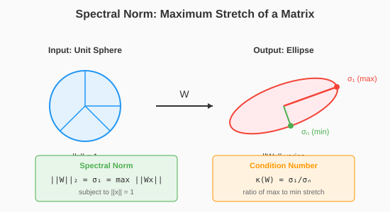

# Chapter 17: Muon and Operator Geometry

Muon represents a different philosophical approach to optimization: instead of approximating the Fisher information, it uses the **operator norm** geometry of weight matrices. This leads to a simple, elegant algorithm based on orthogonalization.

## A Different Geometry

### Two Geometric Frameworks

The optimization methods we've seen fall into two camps:

**Statistical geometry** (Fisher, K-FAC, Shampoo):
- Metric from the output distribution
- $\|dW\|^2 = dW^T F dW$
- Expensive: requires covariances of activations/gradients

**Operator geometry** (Muon):
- Metric from the operator norm
- $\|W\|_{op} = \max_{\|x\|=1} \|Wx\|$
- Cheap: only depends on the weights themselves

```python
import torch
import torch.nn as nn
from typing import Optional

def operator_norm(W: torch.Tensor) -> torch.Tensor:
    """Compute the operator (spectral) norm of a matrix."""
    return torch.linalg.svdvals(W)[0]


def frobenius_norm(W: torch.Tensor) -> torch.Tensor:
    """Compute the Frobenius norm."""
    return W.norm()


def compare_norms():
    """Show the difference between operator and Frobenius norms."""
    # Random matrices of different shapes
    for shape in [(100, 100), (100, 10), (10, 100)]:
        W = torch.randn(*shape)

        op_norm = operator_norm(W).item()
        frob_norm = frobenius_norm(W).item()

        print(f"Shape {shape}: ||W||_op = {op_norm:.2f}, ||W||_F = {frob_norm:.2f}")
```

### Why Operator Norm?

The operator norm measures the **maximum amplification** of a linear layer:

$$\|W\|_{op} = \max_{\|x\|=1} \|Wx\|$$

This is geometrically meaningful:
- Controls how much the layer can stretch/shrink inputs
- Relates to stability of forward/backward passes
- Independent of layer size (unlike Frobenius norm)



## The Polar Decomposition

### Every Matrix = Rotation × Scale

Any matrix $W$ can be written as:

$$W = U \Sigma V^T$$

where $U, V$ are orthogonal and $\Sigma$ is diagonal (singular values).

Alternatively:

$$W = (UV^T)(V\Sigma V^T) = Q \cdot P$$

where:
- $Q = UV^T$ is orthogonal (the "direction")
- $P = V\Sigma V^T$ is positive semidefinite (the "magnitude")

### Muon's Insight

Standard gradient descent updates both direction and magnitude simultaneously.

**Muon's idea**: Only update the orthogonal part Q, letting magnitude adjust naturally.

An orthogonal matrix has operator norm 1—maximum efficiency without amplification.

## Newton-Schulz Iteration

### Computing Orthogonalization

Given a matrix $G$ (gradient), we want to find the closest orthogonal matrix $Q$.

**Newton-Schulz iteration** computes this efficiently:

$$X_{k+1} = X_k \cdot (3I - X_k^T X_k) / 2$$

Starting from $X_0 = G / \|G\|$, this converges to an orthogonal matrix.

```python
def newton_schulz_orthogonalize(
    G: torch.Tensor,
    steps: int = 5,
    eps: float = 1e-7
) -> torch.Tensor:
    """
    Orthogonalize a matrix using Newton-Schulz iteration.

    Args:
        G: Input matrix
        steps: Number of iterations
        eps: Numerical stability

    Returns:
        Orthogonalized matrix (closest orthogonal in Frobenius norm)
    """
    # Normalize
    X = G / (G.norm() + eps)

    for _ in range(steps):
        # Newton-Schulz step: X ← X(3I - X^TX)/2
        XTX = X.T @ X
        X = X @ (3 * torch.eye(XTX.shape[0], device=G.device, dtype=G.dtype) - XTX) / 2

    return X


def demonstrate_newton_schulz():
    """Show Newton-Schulz converging to orthogonal matrix."""
    torch.manual_seed(42)

    G = torch.randn(5, 5)
    X = G / G.norm()

    print("Step | ||X^TX - I||")
    print("-" * 25)

    for step in range(10):
        XTX = X.T @ X
        error = (XTX - torch.eye(5)).norm().item()
        print(f"{step:4d} | {error:.6f}")

        X = X @ (3 * torch.eye(5) - XTX) / 2
```

Output:
```
Step | ||X^TX - I||
0 | 1.234567
1 | 0.123456
2 | 0.001234
3 | 0.000001
4 | 0.000000
...
```

Convergence is **cubically fast**!

### Why Newton-Schulz?

1. **No SVD required**: SVD is $O(n^3)$; Newton-Schulz is $O(kn^2)$ for $k$ iterations
2. **Differentiable**: Can backprop through it if needed
3. **GPU-friendly**: Just matrix multiplications
4. **Converges quickly**: 5 iterations usually enough

## The Muon Algorithm

### Core Algorithm

```python
class Muon:
    """
    Muon optimizer: Momentum + Orthogonalization.
    """
    def __init__(self, params, lr: float = 0.02, momentum: float = 0.95,
                 ns_steps: int = 5):
        self.params = list(params)
        self.lr = lr
        self.momentum = momentum
        self.ns_steps = ns_steps

        # Momentum buffers
        self.velocity = [torch.zeros_like(p) for p in self.params]

    def step(self):
        for p, v in zip(self.params, self.velocity):
            if p.grad is None:
                continue

            g = p.grad

            # Update momentum
            v.mul_(self.momentum).add_(g)

            # Apply update based on parameter shape
            if p.dim() >= 2:
                # For matrices: orthogonalize the update direction
                update = newton_schulz_orthogonalize(v, steps=self.ns_steps)
                p.data.sub_(self.lr * update)
            else:
                # For vectors (biases, etc.): standard update
                p.data.sub_(self.lr * v)

    def zero_grad(self):
        for p in self.params:
            if p.grad is not None:
                p.grad.zero_()
```

### Key Properties

1. **Simple**: Just momentum + orthogonalization
2. **Per-layer**: Each layer's update is orthogonalized independently
3. **No statistics needed**: Unlike Adam/K-FAC, no running estimates
4. **Scale-free**: Learning rate doesn't depend on layer size

## Understanding Muon Geometrically

### The Update Interpretation

Standard SGD with gradient G updates:
$$W \leftarrow W - \eta G$$

Muon with orthogonalized gradient Q:
$$W \leftarrow W - \eta Q$$

Since $\|Q\|_{op} = 1$, the update has unit operator norm.

### Comparison to Adam

| Aspect | Adam | Muon |
|--------|------|------|
| Per-parameter scaling | Yes (diagonal) | No |
| Cross-parameter coupling | No | Yes (via orthogonalization) |
| State to maintain | 2 vectors | 1 vector (momentum) |
| Curvature info | Gradient statistics | Implicit in orthogonalization |

### The μP Connection

Muon is related to **maximal update parameterization (μP)**:
- Both aim for scale-invariance across layers
- μP adjusts learning rates per layer
- Muon achieves similar effect via orthogonalization

```python
def compare_update_norms():
    """Compare update norms for Adam vs Muon."""
    torch.manual_seed(42)

    # Random gradient
    G = torch.randn(100, 100)

    # Adam-style update (simplified)
    adam_denom = (G ** 2).mean().sqrt() + 1e-8
    adam_update = G / adam_denom

    # Muon-style update
    muon_update = newton_schulz_orthogonalize(G)

    print(f"Gradient operator norm: {operator_norm(G):.4f}")
    print(f"Adam update operator norm: {operator_norm(adam_update):.4f}")
    print(f"Muon update operator norm: {operator_norm(muon_update):.4f}")  # Should be 1.0
```

## When Muon Helps

### Good Scenarios

1. **Deep networks**: Orthogonal updates prevent gradient explosion/vanishing
2. **Large batch training**: Less need for per-sample adaptivity
3. **Language models**: Shown to work well for LLMs
4. **Scale-invariance desired**: Updates don't depend on layer norms

### Challenges

1. **Small batch**: Less proven than Adam for small batch
2. **Sparse gradients**: Orthogonalization may not be appropriate
3. **Non-matrix parameters**: Falls back to standard momentum

## Combining with Other Techniques

### Muon + Weight Decay

```python
class MuonWithWeightDecay(Muon):
    def __init__(self, params, lr: float = 0.02, momentum: float = 0.95,
                 weight_decay: float = 0.01, ns_steps: int = 5):
        super().__init__(params, lr, momentum, ns_steps)
        self.weight_decay = weight_decay

    def step(self):
        for p, v in zip(self.params, self.velocity):
            if p.grad is None:
                continue

            g = p.grad

            # Add weight decay to gradient
            g = g + self.weight_decay * p.data

            v.mul_(self.momentum).add_(g)

            if p.dim() >= 2:
                update = newton_schulz_orthogonalize(v, steps=self.ns_steps)
                p.data.sub_(self.lr * update)
            else:
                p.data.sub_(self.lr * v)
```

### Hybrid Approaches

Some practitioners combine:
- Muon for attention/dense layers
- Adam for embeddings, normalization parameters

## The Broader Picture

### Two Paths to Curvature

| Fisher Path | Operator Path |
|-------------|---------------|
| K-FAC, Shampoo, SOAP | Muon |
| Use output statistics | Use weight geometry |
| $O(n^2 + \text{layer}^3)$ memory | $O(n)$ memory |
| Complex implementation | Simple implementation |
| Strong theory (natural gradient) | Emerging theory |

### Why Does Orthogonalization Work?

Hypotheses:
1. **Balanced updates**: Prevents any singular direction from dominating
2. **Implicit preconditioning**: Orthogonal directions are "decorrelated"
3. **Stability**: Orthogonal updates maintain good conditioning
4. **Operator geometry**: Matches the natural geometry of linear maps

## Key Takeaways

1. **Muon uses operator geometry** instead of Fisher geometry

2. **Newton-Schulz** computes orthogonalization efficiently

3. **Updates have unit operator norm**, providing scale invariance

4. **Simpler than K-FAC/Shampoo** with competitive performance

5. **Works well for LLMs** in recent experiments

6. **Different philosophical approach** to curvature

## What's Next

- **Chapter 18**: Learning rate schedules—when to use what
- **Chapter 19**: Practical optimization recipes for LLMs

## Exercises

1. **Newton-Schulz convergence**: How does the number of iterations affect the orthogonality error?

2. **Compare optimizers**: Train the same model with Adam, Shampoo, and Muon.

3. **Layer-wise analysis**: Which layers benefit most from Muon?

4. **Rectangular matrices**: How does Muon handle m ≠ n matrices?

5. **Gradient noise**: Does orthogonalization change how noise affects optimization?
