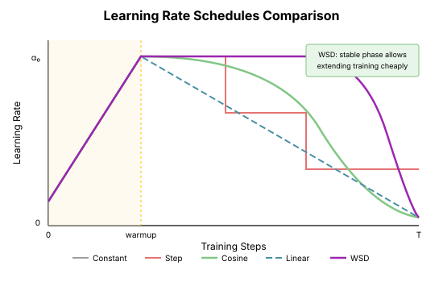

# Chapter 18: Learning Rate Schedules

The learning rate is the most important hyperparameter in deep learning. This chapter covers the theory and practice of learning rate schedules—how to vary the learning rate during training.

## Why Schedules Matter

### The Fundamental Tradeoff

**Early training**: High learning rate needed for exploration, escaping saddles
**Late training**: Low learning rate needed for fine-grained convergence

A single learning rate can't optimize both phases.

```python
import torch
import torch.nn as nn
from typing import Callable, List

def demonstrate_schedule_importance():
    """Show that constant LR is suboptimal."""
    torch.manual_seed(42)

    # Simple optimization problem
    def make_model():
        return nn.Sequential(
            nn.Linear(20, 100),
            nn.ReLU(),
            nn.Linear(100, 10)
        )

    X = torch.randn(500, 20)
    y = torch.randint(0, 10, (500,))

    results = {}

    # Constant high LR
    model = make_model()
    optimizer = torch.optim.SGD(model.parameters(), lr=0.1)
    losses = []
    for _ in range(1000):
        loss = nn.CrossEntropyLoss()(model(X), y)
        losses.append(loss.item())
        optimizer.zero_grad()
        loss.backward()
        optimizer.step()
    results['constant_high'] = losses

    # Constant low LR
    model = make_model()
    optimizer = torch.optim.SGD(model.parameters(), lr=0.001)
    losses = []
    for _ in range(1000):
        loss = nn.CrossEntropyLoss()(model(X), y)
        losses.append(loss.item())
        optimizer.zero_grad()
        loss.backward()
        optimizer.step()
    results['constant_low'] = losses

    # Decaying LR
    model = make_model()
    optimizer = torch.optim.SGD(model.parameters(), lr=0.1)
    scheduler = torch.optim.lr_scheduler.CosineAnnealingLR(optimizer, T_max=1000)
    losses = []
    for _ in range(1000):
        loss = nn.CrossEntropyLoss()(model(X), y)
        losses.append(loss.item())
        optimizer.zero_grad()
        loss.backward()
        optimizer.step()
        scheduler.step()
    results['cosine_decay'] = losses

    print("Final losses:")
    for name, losses in results.items():
        print(f"  {name}: {losses[-1]:.4f}")
```

## Common Schedules

### Step Decay

Reduce LR by a factor at fixed epochs.

$$\eta_t = \eta_0 \cdot \gamma^{\lfloor t / \text{step\_size} \rfloor}$$

```python
def step_decay_schedule(base_lr: float, epoch: int,
                        step_size: int = 30, gamma: float = 0.1) -> float:
    """Step decay: drop LR by gamma every step_size epochs."""
    return base_lr * (gamma ** (epoch // step_size))
```

**Pros**: Simple, well-understood
**Cons**: Discontinuous, requires tuning step points

### Exponential Decay

Smooth exponential reduction.

$$\eta_t = \eta_0 \cdot \gamma^t$$

```python
def exponential_decay(base_lr: float, step: int, gamma: float = 0.99) -> float:
    """Exponential decay."""
    return base_lr * (gamma ** step)
```

### Cosine Annealing

Smooth decay following a cosine curve.

$$\eta_t = \eta_{min} + \frac{1}{2}(\eta_{max} - \eta_{min})\left(1 + \cos\left(\frac{t}{T}\pi\right)\right)$$

```python
import math

def cosine_annealing(base_lr: float, step: int, total_steps: int,
                     min_lr: float = 0.0) -> float:
    """Cosine annealing schedule."""
    return min_lr + 0.5 * (base_lr - min_lr) * (1 + math.cos(math.pi * step / total_steps))


def visualize_schedules():
    """Plot common schedules."""
    import matplotlib.pyplot as plt

    steps = list(range(1000))
    base_lr = 0.1

    schedules = {
        'Step (every 300)': [step_decay_schedule(base_lr, s, 300, 0.1) for s in steps],
        'Exponential': [exponential_decay(base_lr, s, 0.995) for s in steps],
        'Cosine': [cosine_annealing(base_lr, s, 1000) for s in steps],
    }

    for name, lrs in schedules.items():
        print(f"{name}: starts at {lrs[0]:.4f}, ends at {lrs[-1]:.6f}")
```



## Warmup

### Why Warmup?

At initialization:
- Gradients can be large and unstable
- Adam's running estimates are unreliable
- The model hasn't "settled" into a good region

**Warmup** starts with a low LR and gradually increases it.

```python
def linear_warmup(base_lr: float, step: int, warmup_steps: int) -> float:
    """Linear warmup from 0 to base_lr."""
    if step < warmup_steps:
        return base_lr * (step / warmup_steps)
    return base_lr


def warmup_then_decay(base_lr: float, step: int, warmup_steps: int,
                      total_steps: int, min_lr: float = 0.0) -> float:
    """Linear warmup followed by cosine decay."""
    if step < warmup_steps:
        return base_lr * (step / warmup_steps)

    decay_steps = total_steps - warmup_steps
    decay_step = step - warmup_steps
    return cosine_annealing(base_lr, decay_step, decay_steps, min_lr)
```

### Warmup Duration

Rules of thumb:
- **Transformers**: 1-5% of total training
- **LLMs**: Often 0.1-1% (shorter for large batches)
- **Vision**: 5-10 epochs or ~1000 steps

## Warmup-Stable-Decay (WSD)

### The Modern Standard

**WSD** splits training into three phases:

1. **Warmup**: Linear increase
2. **Stable**: Constant high LR (the majority of training)
3. **Decay**: Cosine or linear decrease

```python
def wsd_schedule(base_lr: float, step: int,
                 warmup_steps: int, stable_steps: int, decay_steps: int,
                 min_lr: float = 0.0) -> float:
    """Warmup-Stable-Decay schedule."""
    total = warmup_steps + stable_steps + decay_steps

    if step < warmup_steps:
        # Warmup phase
        return base_lr * (step / warmup_steps)
    elif step < warmup_steps + stable_steps:
        # Stable phase
        return base_lr
    else:
        # Decay phase
        decay_progress = (step - warmup_steps - stable_steps) / decay_steps
        return min_lr + (base_lr - min_lr) * (1 + math.cos(math.pi * decay_progress)) / 2


def wsd_from_fractions(base_lr: float, step: int, total_steps: int,
                       warmup_frac: float = 0.01,
                       decay_frac: float = 0.1,
                       min_lr: float = 0.0) -> float:
    """WSD with fraction-based phase specification."""
    warmup_steps = int(total_steps * warmup_frac)
    decay_steps = int(total_steps * decay_frac)
    stable_steps = total_steps - warmup_steps - decay_steps

    return wsd_schedule(base_lr, step, warmup_steps, stable_steps, decay_steps, min_lr)
```

### Why WSD Works

1. **Warmup**: Stabilizes training start
2. **Stable**: Long phase at high LR maximizes exploration
3. **Decay**: Final refinement to precise minimum

## Batch Size Scaling

### Linear Scaling Rule

When increasing batch size by k, increase learning rate by k:

$$\eta_{new} = k \cdot \eta_{base}$$

**Intuition**: Larger batches have lower gradient variance, can support larger steps.

```python
def scale_lr_for_batch(base_lr: float, base_batch: int, new_batch: int) -> float:
    """Scale learning rate for different batch size."""
    return base_lr * (new_batch / base_batch)


def batch_size_schedule():
    """Example: scaling LR with batch size."""
    base_lr = 0.1
    base_batch = 32

    for batch_size in [32, 64, 128, 256, 512, 1024]:
        scaled_lr = scale_lr_for_batch(base_lr, base_batch, batch_size)
        print(f"Batch {batch_size:4d}: LR = {scaled_lr:.4f}")
```

### Square Root Scaling

An alternative that's sometimes more stable:

$$\eta_{new} = \sqrt{k} \cdot \eta_{base}$$

Used when linear scaling causes instability.

## Cyclical Learning Rates

### The Idea

Instead of monotonic decay, **cycle** the learning rate up and down.

**Benefits**:
- Escapes local minima during training
- Can find flatter minima
- Sometimes faster convergence

```python
def cyclical_lr(base_lr: float, max_lr: float, step: int,
                cycle_length: int) -> float:
    """Triangular cyclical learning rate."""
    cycle = step // cycle_length
    x = abs(step / (cycle_length / 2) - 2 * cycle - 1)
    return base_lr + (max_lr - base_lr) * max(0, 1 - x)


def one_cycle_lr(base_lr: float, max_lr: float, step: int,
                 total_steps: int, pct_start: float = 0.3) -> float:
    """1cycle policy: ramp up, then ramp down."""
    ramp_steps = int(total_steps * pct_start)

    if step < ramp_steps:
        # Ramp up
        return base_lr + (max_lr - base_lr) * (step / ramp_steps)
    else:
        # Ramp down (cosine)
        progress = (step - ramp_steps) / (total_steps - ramp_steps)
        return base_lr + (max_lr - base_lr) * (1 + math.cos(math.pi * progress)) / 2
```

## Learning Rate Finder

### Empirical LR Selection

**LR finder** (Smith, 2017): Train for a few epochs with exponentially increasing LR, plot loss vs LR.

The best LR is usually just before the loss explodes.

```python
def lr_finder(model: nn.Module, train_loader, criterion,
              min_lr: float = 1e-7, max_lr: float = 10,
              num_iter: int = 100):
    """Find optimal learning rate range."""
    import copy

    # Save initial state
    initial_state = copy.deepcopy(model.state_dict())

    optimizer = torch.optim.SGD(model.parameters(), lr=min_lr)

    # Exponential LR increase
    mult = (max_lr / min_lr) ** (1 / num_iter)

    lrs = []
    losses = []

    for i, (x, y) in enumerate(train_loader):
        if i >= num_iter:
            break

        optimizer.zero_grad()
        loss = criterion(model(x), y)
        loss.backward()
        optimizer.step()

        lrs.append(optimizer.param_groups[0]['lr'])
        losses.append(loss.item())

        # Increase LR
        for param_group in optimizer.param_groups:
            param_group['lr'] *= mult

        # Stop if loss explodes
        if loss.item() > 4 * losses[0]:
            break

    # Restore model
    model.load_state_dict(initial_state)

    return lrs, losses
```

## Practical Recommendations

### For LLMs

```python
# Typical LLM schedule
def llm_schedule(step: int, total_steps: int, base_lr: float = 1e-4):
    warmup = int(0.01 * total_steps)  # 1% warmup
    return warmup_then_decay(base_lr, step, warmup, total_steps, min_lr=base_lr * 0.1)
```

### For Vision

```python
# Typical ImageNet schedule
def imagenet_schedule(epoch: int, base_lr: float = 0.1):
    # Step decay at epochs 30, 60, 90
    if epoch < 30:
        return base_lr
    elif epoch < 60:
        return base_lr * 0.1
    elif epoch < 90:
        return base_lr * 0.01
    else:
        return base_lr * 0.001
```

### General Guidelines

| Scenario | Recommendation |
|----------|----------------|
| Unknown task | Start with LR finder |
| LLM pretraining | WSD with 1% warmup |
| Fine-tuning | Lower LR (10-100x), shorter warmup |
| Small dataset | Cyclical LR can help |
| Large batch | Scale LR with batch size |

## Key Takeaways

1. **Schedules are essential**: Constant LR is rarely optimal

2. **Warmup stabilizes training**, especially for transformers

3. **WSD is the modern standard** for LLMs

4. **Batch size affects LR**: Scale appropriately

5. **LR finder helps** when starting new tasks

6. **The decay phase is often short**: Most training at stable high LR

## What's Next

- **Chapter 19**: Practical optimization—putting it all together

## Exercises

1. **Compare schedules**: Train the same model with step, cosine, and WSD schedules.

2. **Warmup ablation**: How does training change with 0%, 1%, 5%, 10% warmup?

3. **LR finder**: Implement and run LR finder on a new task.

4. **Batch scaling**: Verify that linear scaling works for 2x, 4x batch size.
