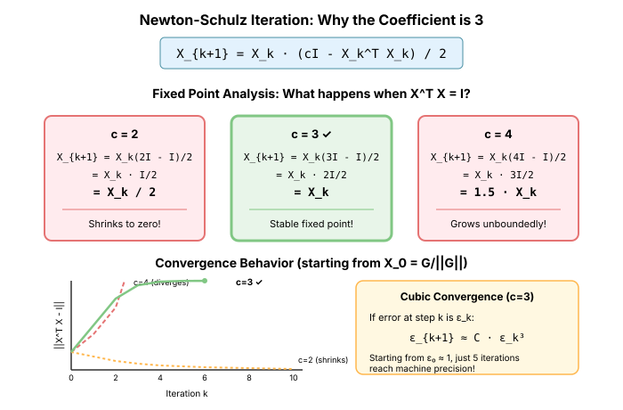
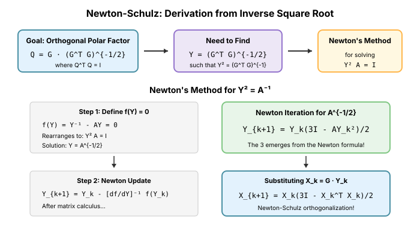

# Appendix: Mathematical Foundations

This appendix provides reference material for the mathematical concepts used throughout the book.

## A. Linear Algebra Review

### Eigenvalue Decomposition

For a symmetric matrix $A \in \mathbb{R}^{n \times n}$:

$$A = Q \Lambda Q^T$$

where:
- $Q$ is orthogonal ($Q^T Q = I$)
- $\Lambda = \text{diag}(\lambda_1, \ldots, \lambda_n)$ contains eigenvalues
- $Aq_i = \lambda_i q_i$ for eigenvector $q_i$

**Properties**:
- All eigenvalues are real for symmetric matrices
- Eigenvectors are orthogonal
- $A$ is positive definite iff all $\lambda_i > 0$

### Singular Value Decomposition (SVD)

For any matrix $A \in \mathbb{R}^{m \times n}$:

$$A = U \Sigma V^T$$

where:
- $U \in \mathbb{R}^{m \times m}$ is orthogonal (left singular vectors)
- $V \in \mathbb{R}^{n \times n}$ is orthogonal (right singular vectors)
- $\Sigma \in \mathbb{R}^{m \times n}$ is diagonal with singular values $\sigma_i \geq 0$

**Key relationships**:
- Singular values: $\sigma_i = \sqrt{\lambda_i(A^T A)} = \sqrt{\lambda_i(A A^T)}$
- Operator norm: $\|A\|_{op} = \sigma_1$ (largest singular value)
- Frobenius norm: $\|A\|_F = \sqrt{\sum_i \sigma_i^2}$

### Kronecker Product

For $A \in \mathbb{R}^{m \times n}$ and $B \in \mathbb{R}^{p \times q}$:

$$A \otimes B = \begin{bmatrix} a_{11}B & \cdots & a_{1n}B \\ \vdots & \ddots & \vdots \\ a_{m1}B & \cdots & a_{mn}B \end{bmatrix} \in \mathbb{R}^{mp \times nq}$$

**Properties**:
- $(A \otimes B)^{-1} = A^{-1} \otimes B^{-1}$
- $(A \otimes B)(C \otimes D) = (AC) \otimes (BD)$
- $\text{vec}(AXB) = (B^T \otimes A)\text{vec}(X)$

The last property is why Kronecker structure appears in K-FAC.

## B. Newton-Schulz Iteration: Why the Coefficient is 3

The Newton-Schulz iteration for orthogonalization is:

$$X_{k+1} = X_k \cdot \frac{(3I - X_k^T X_k)}{2}$$

The coefficient 3 may seem arbitrary, but it emerges naturally from two perspectives: fixed-point analysis and Newton's method for computing matrix inverse square roots.



### Fixed Point Analysis

At convergence, we want $X^T X = I$ (orthogonality). For this to be a stable fixed point, we need the iteration to preserve $X$ when $X^T X = I$.

**For general coefficient $c$:** If $X^T X = I$:
$$X_{k+1} = X_k \cdot \frac{(cI - I)}{2} = X_k \cdot \frac{(c-1)}{2} I = \frac{c-1}{2} X_k$$

For $X$ to be preserved exactly, we need:
$$\frac{c-1}{2} = 1 \implies c = 3$$

**What happens with other values?**

| Coefficient | Multiplier | Behavior |
|-------------|------------|----------|
| $c = 2$ | $\frac{1}{2}$ | $X$ shrinks by half each iteration |
| $c = 3$ | $1$ | $X$ preserved (correct fixed point) |
| $c = 4$ | $\frac{3}{2}$ | $X$ grows by 50% each iteration |

Only $c = 3$ creates a stable fixed point at orthogonal matrices.

### Derivation from Newton's Method

The deeper reason for the 3 comes from Newton's method for computing matrix functions.



**Goal:** Find the orthogonal polar factor $Q$ of a matrix $G$:
$$Q = G \cdot (G^T G)^{-1/2}$$

This requires computing $Y = (G^T G)^{-1/2}$, the inverse square root.

**Newton's method for $Y^2 = A^{-1}$:**

Define $f(Y) = Y^{-1} - AY = 0$, whose solution is $Y = A^{-1/2}$.

Applying Newton's method to this equation (with appropriate matrix calculus) yields:
$$Y_{k+1} = \frac{1}{2}Y_k(3I - AY_k^2)$$

The 3 arises from the specific form of Newton's method applied to the inverse square root problem.

**Transforming to Newton-Schulz:**

Let $A = G^T G$ (the Gram matrix) and define $X_k = G Y_k$. Then:
- $X_k^T X_k = Y_k^T G^T G Y_k = Y_k^T A Y_k$
- If $Y_k \to A^{-1/2}$, then $X_k \to G A^{-1/2}$, the orthogonal polar factor

Substituting into the Newton iteration:
$$X_{k+1} = G Y_{k+1} = G \cdot \frac{1}{2}Y_k(3I - AY_k^2) = \frac{1}{2}X_k(3I - X_k^T X_k)$$

This is exactly the Newton-Schulz iteration!

### Cubic Convergence

A key property of Newton-Schulz is **cubic convergence**: the error cubes at each step.

Let $E_k = X_k^T X_k - I$ measure the deviation from orthogonality. One can show:
$$\|E_{k+1}\| \leq C \|E_k\|^3$$

for some constant $C$ when $\|E_0\|$ is small enough.

**Why cubic instead of quadratic?** Standard Newton's method has quadratic convergence. The extra power comes from the symmetry of the problem—we're finding a matrix that satisfies $X^T X = I$, a symmetric constraint.

**Practical implication:** Starting from $X_0 = G/\|G\|_F$ (Frobenius-normalized), typically 5 iterations suffice:

| Iteration | Typical $\|E_k\|$ |
|-----------|-------------------|
| 0 | ~1 |
| 1 | ~0.1 |
| 2 | ~0.001 |
| 3 | ~10⁻⁹ |
| 4 | ~10⁻²⁷ |

### The Schulz Iteration (Historical Note)

The iteration is named after Günther Schulz, who in 1933 discovered this method for computing matrix inverses. The variant for orthogonalization—sometimes called the "Newton-Schulz" iteration—was developed later and is now widely used in numerical linear algebra and, more recently, in machine learning optimizers like Muon.

## C. Calculus Review

### Gradient

For $f: \mathbb{R}^n \to \mathbb{R}$:

$$\nabla f(x) = \begin{bmatrix} \frac{\partial f}{\partial x_1} \\ \vdots \\ \frac{\partial f}{\partial x_n} \end{bmatrix}$$

The gradient points in the direction of steepest ascent.

### Hessian

$$H = \nabla^2 f(x) = \begin{bmatrix} \frac{\partial^2 f}{\partial x_1^2} & \cdots & \frac{\partial^2 f}{\partial x_1 \partial x_n} \\ \vdots & \ddots & \vdots \\ \frac{\partial^2 f}{\partial x_n \partial x_1} & \cdots & \frac{\partial^2 f}{\partial x_n^2} \end{bmatrix}$$

**Properties**:
- Symmetric for smooth $f$: $\frac{\partial^2 f}{\partial x_i \partial x_j} = \frac{\partial^2 f}{\partial x_j \partial x_i}$
- At a minimum: $H \succeq 0$ (positive semi-definite)
- Eigenvalues give curvature in each direction

### Jacobian

For $f: \mathbb{R}^n \to \mathbb{R}^m$:

$$J = \frac{\partial f}{\partial x} = \begin{bmatrix} \frac{\partial f_1}{\partial x_1} & \cdots & \frac{\partial f_1}{\partial x_n} \\ \vdots & \ddots & \vdots \\ \frac{\partial f_m}{\partial x_1} & \cdots & \frac{\partial f_m}{\partial x_n} \end{bmatrix} \in \mathbb{R}^{m \times n}$$

The Jacobian generalizes the gradient to vector-valued functions.

### Directional Derivatives

The **directional derivative** measures the rate of change of $f$ along a direction $v$:

$$D_v f(x) = \lim_{t \to 0} \frac{f(x + tv) - f(x)}{t} = \nabla f(x)^T v$$

For vector-valued functions, the directional derivative gives the **Jacobian-vector product (JVP)**:

$$D_v f(x) = Jv$$

This is the "forward mode" of automatic differentiation.

**Hessian-vector products** are directional derivatives of the gradient:

$$Hv = D_v(\nabla f)(x) = \lim_{t \to 0} \frac{\nabla f(x + tv) - \nabla f(x)}{t}$$

This identity is central to Hessian-free optimization (Chapter 14).

### Finite Difference Approximation

When analytic derivatives aren't available (or as a simple implementation), we can approximate directional derivatives using **finite differences**:

**Forward difference**:
$$D_v f(x) \approx \frac{f(x + \epsilon v) - f(x)}{\epsilon}$$

**Central difference** (more accurate, costs 2 evaluations):
$$D_v f(x) \approx \frac{f(x + \epsilon v) - f(x - \epsilon v)}{2\epsilon}$$

**Choosing $\epsilon$**: There's a tradeoff:
- Too large: Truncation error dominates (approximation is inaccurate)
- Too small: Floating-point rounding error dominates

For float32, $\epsilon \approx 10^{-4}$ is often reasonable. For float64, $\epsilon \approx 10^{-7}$ works better.

**Error analysis** for forward difference:
$$\frac{f(x + \epsilon v) - f(x)}{\epsilon} = D_v f(x) + O(\epsilon)$$

For central difference:
$$\frac{f(x + \epsilon v) - f(x - \epsilon v)}{2\epsilon} = D_v f(x) + O(\epsilon^2)$$

**Example: Finite difference Hessian-vector product**

```python
def hvp_finite_diff(f, x, v, eps=1e-4):
    """
    Approximate Hv using finite differences.

    Hv = (∇f(x + εv) - ∇f(x)) / ε

    Args:
        f: Scalar function
        x: Point at which to evaluate
        v: Direction vector
        eps: Finite difference step size

    Returns:
        Approximate Hessian-vector product
    """
    grad_plus = gradient(f, x + eps * v)
    grad_x = gradient(f, x)
    return (grad_plus - grad_x) / eps
```

In practice, autodiff (using `torch.autograd.grad` with `create_graph=True`) is preferred over finite differences because:
1. It's exact (no truncation error)
2. It's numerically stable
3. It can be more efficient for high-dimensional problems

However, finite differences remain useful for:
- Gradient checking / debugging
- When autodiff isn't available
- Understanding what autodiff is computing

### Forward vs Reverse Mode Automatic Differentiation

Automatic differentiation (autodiff) computes exact derivatives by applying the chain rule systematically. There are two modes, corresponding to the two ways of parenthesizing a chain of matrix multiplications.

**Setup**: Consider a composition $f = f_n \circ f_{n-1} \circ \cdots \circ f_1$ where input $x \in \mathbb{R}^m$ and output $y \in \mathbb{R}^k$. The Jacobian is:

$$J = J_n J_{n-1} \cdots J_1 \in \mathbb{R}^{k \times m}$$

where $J_i$ is the Jacobian of layer $i$.

**Forward Mode (JVP - Jacobian-Vector Product)**

Computes $Jv$ for a given vector $v \in \mathbb{R}^m$:

$$Jv = J_n(J_{n-1}(\cdots(J_1 v)))$$

- Propagates a "tangent" $v$ forward through the computation
- Each layer computes: $v_{i+1} = J_i v_i$
- Cost: One forward pass, computing derivatives alongside values
- Efficient when: $m \ll k$ (few inputs, many outputs)

```python
# PyTorch forward-mode AD (requires torch >= 2.0)
import torch
from torch.func import jvp

def f(x):
    return x ** 2 + torch.sin(x)

x = torch.randn(3)
v = torch.randn(3)  # Tangent vector

# Compute f(x) and Jv simultaneously
y, Jv = jvp(f, (x,), (v,))
```

**Reverse Mode (VJP - Vector-Jacobian Product)**

Computes $u^T J$ for a given vector $u \in \mathbb{R}^k$:

$$u^T J = (((u^T J_n) J_{n-1}) \cdots) J_1$$

- Propagates a "cotangent" $u$ backward through the computation
- Each layer computes: $u_i = u_{i+1}^T J_i$ (equivalently $u_i = J_i^T u_{i+1}$)
- Cost: One forward pass (to save activations) + one backward pass
- Efficient when: $k \ll m$ (few outputs, many inputs)

```python
# PyTorch reverse-mode AD (standard backprop)
import torch

x = torch.randn(3, requires_grad=True)
y = (x ** 2 + torch.sin(x)).sum()  # Scalar output

y.backward()  # Computes gradient = J^T · 1
print(x.grad)  # The gradient

# For non-scalar outputs, use grad with vector:
x = torch.randn(3, requires_grad=True)
y = x ** 2 + torch.sin(x)  # Vector output
u = torch.randn(3)  # Cotangent vector

# VJP: compute u^T J
uTJ = torch.autograd.grad(y, x, grad_outputs=u)[0]
```

**Why Deep Learning Uses Reverse Mode**

For a neural network with loss $L: \mathbb{R}^n \to \mathbb{R}$:
- Input dimension: $n$ (millions to billions of parameters)
- Output dimension: 1 (scalar loss)

| Mode | Computes | Cost |
|------|----------|------|
| Forward | $Jv$ (one directional derivative) | $O(n)$ per direction |
| Reverse | $\nabla L = J^T \cdot 1$ (full gradient) | $O(n)$ total |

To get the full gradient with forward mode, we'd need $n$ passes (one per parameter). Reverse mode gets it in one pass. This is why backpropagation (reverse mode) is universal in deep learning.

**Hessian-Vector Products: Combining Both Modes**

For HVP $Hv = \nabla^2 f \cdot v$, we can use either:

1. **Forward-over-reverse**: Compute directional derivative of gradient
   ```python
   from torch.func import jvp, grad

   def hvp_forward_over_reverse(f, x, v):
       # grad(f) gives a function that computes gradient
       # jvp of that function gives Hv
       _, Hv = jvp(grad(f), (x,), (v,))
       return Hv
   ```

2. **Reverse-over-reverse**: Differentiate through the backward pass
   ```python
   def hvp_reverse_over_reverse(f, x, v):
       # Standard approach: differentiate g^T v where g = ∇f
       x = x.requires_grad_(True)
       y = f(x)
       g, = torch.autograd.grad(y, x, create_graph=True)
       gv = (g * v).sum()
       Hv, = torch.autograd.grad(gv, x)
       return Hv
   ```

Both give the same result; the choice depends on framework support and memory tradeoffs.

**Summary Table**

| Aspect | Forward Mode | Reverse Mode |
|--------|--------------|--------------|
| Computes | $Jv$ (JVP) | $u^T J$ (VJP) |
| Direction | Input → Output | Output → Input |
| Memory | O(1) extra | O(depth) for activations |
| Best when | Few inputs | Few outputs |
| Deep learning | Rare | Standard (backprop) |

## D. Convexity and Smoothness

### Convexity

A function $f$ is **convex** if:

$$f(\alpha x + (1-\alpha) y) \leq \alpha f(x) + (1-\alpha) f(y), \quad \forall \alpha \in [0, 1]$$

**Equivalent conditions** (for differentiable $f$):
- $f(y) \geq f(x) + \nabla f(x)^T (y - x)$ (first-order)
- $\nabla^2 f(x) \succeq 0$ for all $x$ (second-order)

### Strong Convexity

$f$ is **μ-strongly convex** if:

$$f(y) \geq f(x) + \nabla f(x)^T (y - x) + \frac{\mu}{2}\|y - x\|^2$$

Equivalently: $\nabla^2 f(x) \succeq \mu I$ for all $x$.

### Smoothness

$f$ has **L-Lipschitz continuous gradients** if:

$$\|\nabla f(x) - \nabla f(y)\| \leq L \|x - y\|$$

Equivalently: $\nabla^2 f(x) \preceq L I$ for all $x$.

### Condition Number

The **condition number** measures how "stretched" or "elongated" the level sets of a function are, which directly impacts optimization difficulty.

**For quadratic functions** $f(x) = \frac{1}{2}x^T A x$ where $A$ is symmetric positive definite:

$$\kappa(A) = \frac{\lambda_{\max}(A)}{\lambda_{\min}(A)}$$

This is the ratio of the largest to smallest eigenvalue of $A$.

**For general smooth, strongly convex functions**:

$$\kappa = \frac{L}{\mu}$$

where $L$ is the Lipschitz constant of the gradient and $\mu$ is the strong convexity parameter.

**Why it matters**:
- $\kappa = 1$: Perfectly conditioned (sphere-like level sets) - gradient descent converges in one step
- $\kappa$ large: Ill-conditioned (elongated level sets) - gradient descent requires $O(\kappa)$ iterations
- Neural networks often have $\kappa \geq 10^6$, making vanilla gradient descent impractical

**Geometric interpretation**: The condition number measures the eccentricity of the quadratic approximation. High condition number means the function has vastly different curvatures in different directions—steep in some directions, flat in others.

## E. Convergence Theory

### Gradient Descent Convergence

**For L-smooth convex functions** with $\eta = 1/L$:

$$f(x_T) - f(x^*) \leq \frac{L \|x_0 - x^*\|^2}{2T}$$

**For L-smooth, μ-strongly convex functions** with $\eta = 1/L$:

$$\|x_T - x^*\|^2 \leq \left(1 - \frac{\mu}{L}\right)^T \|x_0 - x^*\|^2$$

### Newton Convergence

For functions with Lipschitz Hessian, near the optimum:

$$\|x_{t+1} - x^*\| \leq C \|x_t - x^*\|^2$$

This is **quadratic convergence**—the error squares each step.

### Momentum Convergence

For L-smooth, μ-strongly convex functions with optimal momentum:

$$f(x_T) - f(x^*) \leq \left(1 - \frac{1}{\sqrt{\kappa}}\right)^T (f(x_0) - f(x^*))$$

This is the **optimal rate** for first-order methods.

## F. Information Theory

### KL Divergence

$$D_{KL}(P \| Q) = \mathbb{E}_{x \sim P}\left[\log \frac{P(x)}{Q(x)}\right]$$

**Properties**:
- $D_{KL}(P \| Q) \geq 0$
- $D_{KL}(P \| Q) = 0$ iff $P = Q$
- Not symmetric: $D_{KL}(P \| Q) \neq D_{KL}(Q \| P)$

### Fisher Information

$$F(\theta) = \mathbb{E}_{x \sim p_\theta}\left[\nabla_\theta \log p_\theta(x) \cdot \nabla_\theta \log p_\theta(x)^T\right]$$

**Equivalent form**:

$$F(\theta) = -\mathbb{E}_{x \sim p_\theta}\left[\nabla_\theta^2 \log p_\theta(x)\right]$$

**Local KL approximation**:

$$D_{KL}(p_\theta \| p_{\theta + d\theta}) \approx \frac{1}{2} d\theta^T F(\theta) d\theta$$

> For a comprehensive treatment including the score function, Cramér-Rao bound, Fisher for common distributions, and connections to neural network optimization, see [Appendix: Fisher Information In Depth](21-appendix-fisher.md).

## G. Probability Distributions

### Gaussian Distribution

$$p(x) = \frac{1}{\sqrt{(2\pi)^n |\Sigma|}} \exp\left(-\frac{1}{2}(x - \mu)^T \Sigma^{-1} (x - \mu)\right)$$

**Fisher information for Gaussian mean**:

$$F = \Sigma^{-1}$$

### Categorical Distribution

For $p(y = k) = \pi_k$ where $\sum_k \pi_k = 1$:

$$\log p(y = k) = \log \pi_k$$

**Softmax parameterization**: $\pi_k = \frac{\exp(\theta_k)}{\sum_j \exp(\theta_j)}$

## H. Key Identities

### Matrix Calculus

$$\frac{\partial}{\partial X} \text{tr}(AX) = A^T$$

$$\frac{\partial}{\partial X} \text{tr}(X^T A X) = (A + A^T) X$$

$$\frac{\partial}{\partial x} x^T A x = (A + A^T) x$$

For symmetric $A$: $\frac{\partial}{\partial x} x^T A x = 2Ax$

### Woodbury Identity

$$(A + UCV)^{-1} = A^{-1} - A^{-1}U(C^{-1} + VA^{-1}U)^{-1}VA^{-1}$$

Useful for low-rank updates to inverses.

### Sherman-Morrison

$$(A + uv^T)^{-1} = A^{-1} - \frac{A^{-1}uv^TA^{-1}}{1 + v^TA^{-1}u}$$

Special case of Woodbury for rank-1 updates.

## I. Numerical Stability

### Floating-Point Precision

| Type | Bits | Exponent | Mantissa | Range | Epsilon |
|------|------|----------|----------|-------|---------|
| fp16 | 16 | 5 | 10 | ~6×10⁴ | ~10⁻³ |
| bf16 | 16 | 8 | 7 | ~10³⁸ | ~10⁻² |
| fp32 | 32 | 8 | 23 | ~10³⁸ | ~10⁻⁷ |

**Implications for optimization**:
- bf16: Good range, acceptable precision for gradients
- Loss scaling often needed for fp16
- Master weights in fp32 for stability

### Gradient Clipping

**Global norm clipping**:
$$g' = \begin{cases} g & \text{if } \|g\| \leq c \\ c \cdot g / \|g\| & \text{otherwise} \end{cases}$$

**Per-parameter clipping**:
$$g'_i = \text{clip}(g_i, -c, c)$$

Global norm is generally preferred—preserves relative magnitudes.

## J. Notation Reference

| Symbol | Meaning |
|--------|---------|
| $\theta$ | Parameters |
| $L$ or $\ell$ | Loss function |
| $g$ or $\nabla L$ | Gradient |
| $H$ or $\nabla^2 L$ | Hessian |
| $F$ | Fisher information matrix |
| $J$ | Jacobian |
| $\eta$ | Learning rate |
| $\beta$ | Momentum coefficient |
| $\kappa$ | Condition number |
| $\lambda$ | Eigenvalue or regularization |
| $\sigma$ | Singular value |
| $\|\cdot\|$ | Euclidean norm |
| $\|\cdot\|_F$ | Frobenius norm |
| $\|\cdot\|_{op}$ | Operator (spectral) norm |
| $\otimes$ | Kronecker product |
| $\succeq$ | Positive semi-definite |
| $\mathbb{E}$ | Expectation |

## Further Reading

### Classical Optimization
- [Nocedal & Wright, "Numerical Optimization"](https://www.springer.com/gp/book/9780387303031)
- [Boyd & Vandenberghe, "Convex Optimization"](https://web.stanford.edu/~boyd/cvxbook/)

### Deep Learning Optimization
- [Bottou, Curtis, & Nocedal, "Optimization Methods for Large-Scale Machine Learning"](https://arxiv.org/abs/1606.04838)
- [Ruder, "An Overview of Gradient Descent Optimization Algorithms"](https://arxiv.org/abs/1609.04747)

### Second-Order Methods
- [Martens, "Deep Learning via Hessian-free Optimization"](https://www.cs.toronto.edu/~jmartens/docs/Deep_HessianFree.pdf)
- [Martens & Grosse, "Optimizing Neural Networks with Kronecker-factored Approximate Curvature"](https://arxiv.org/abs/1503.05671)

### Natural Gradient
- [Amari, "Natural Gradient Works Efficiently in Learning"](https://direct.mit.edu/neco/article/10/2/251/6143/Natural-Gradient-Works-Efficiently-in-Learning)
- [Pascanu & Bengio, "Revisiting Natural Gradient for Deep Networks"](https://arxiv.org/abs/1301.3584)

### Loss Landscape
- [Li et al., "Visualizing the Loss Landscape of Neural Nets"](https://arxiv.org/abs/1712.09913)
- [Garipov et al., "Loss Surfaces, Mode Connectivity, and Fast Ensembling"](https://arxiv.org/abs/1802.10026)

### Modern Optimizers
- [Loshchilov & Hutter, "Decoupled Weight Decay Regularization" (AdamW)](https://arxiv.org/abs/1711.05101)
- [Vyas et al., "SOAP: Improving and Stabilizing Shampoo using Adam"](https://arxiv.org/abs/2409.11321)
