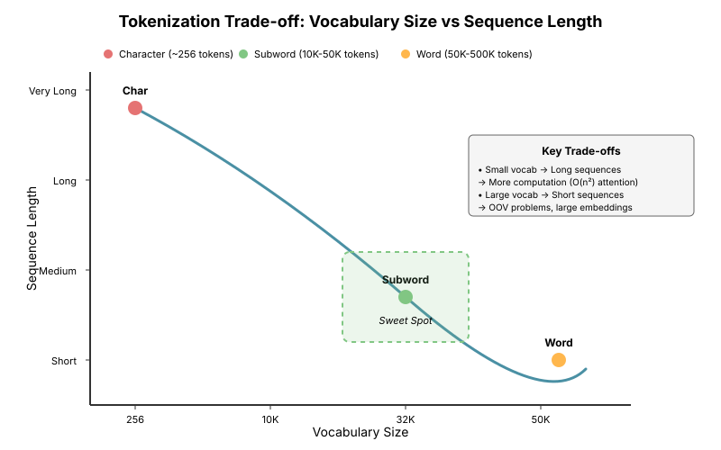
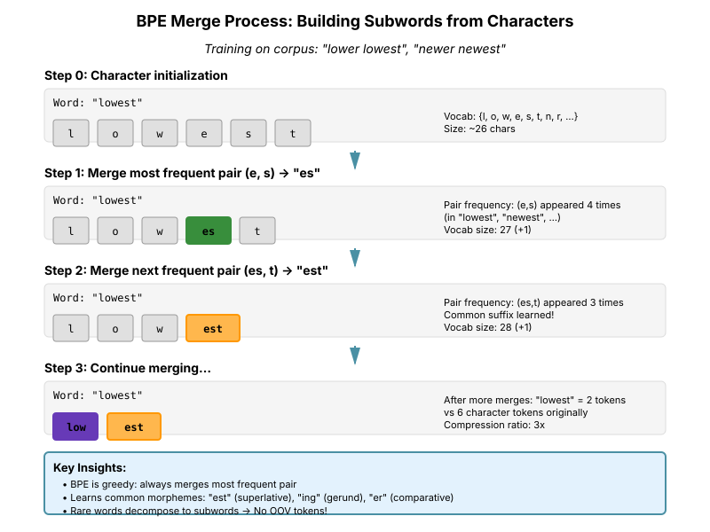
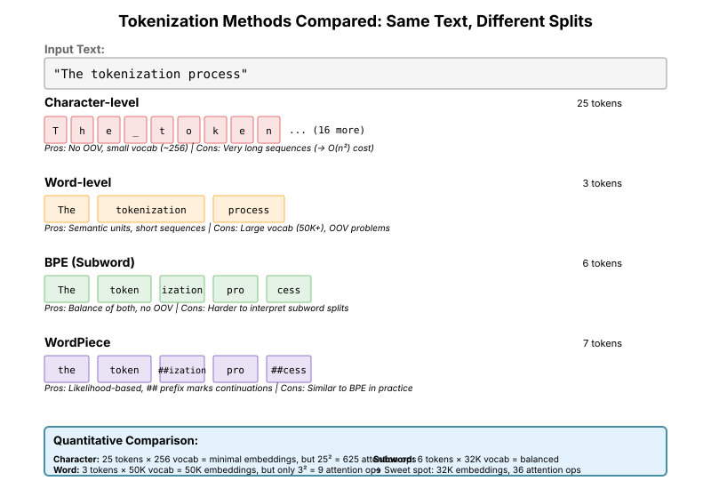

# Chapter 1: Tokenization

## Introduction

Tokenization is the first and foundational step in any natural language processing pipeline, especially for Large Language Models (LLMs). It converts raw text into discrete units (tokens) that can be processed by neural networks. The choice of tokenization strategy significantly impacts model performance, vocabulary size, training efficiency, and the ability to handle rare words and out-of-vocabulary (OOV) terms.

In this chapter, we'll explore various tokenization approaches, implement them from scratch using PyTorch, and understand their mathematical foundations and practical trade-offs.

**Learning Objectives:**

- Understand different tokenization strategies and their trade-offs
- Implement character-level, word-level, and subword tokenizers from scratch
- Learn Byte Pair Encoding (BPE), WordPiece, and SentencePiece algorithms
- Build practical tokenizers for modern LLM applications

## 1.1 Why Tokenization Matters

Before diving into implementations, let's understand why tokenization is critical:

1. **Vocabulary Size**: Determines model parameters and computational cost
2. **Semantic Representation**: Affects how well the model captures meaning
3. **Rare Words**: Impacts handling of infrequent terms and morphological variations
4. **Multilingual Support**: Critical for cross-lingual applications
5. **Compression**: Influences sequence length and memory requirements

The fundamental tension in tokenization is between **granularity** and **vocabulary size**:

- Fine-grained (character-level): Small vocabulary, long sequences
- Coarse-grained (word-level): Large vocabulary, short sequences
- Middle ground (subword): Balanced approach used by modern LLMs



This visualization shows the inverse relationship between vocabulary size and sequence length. Character-level tokenization produces very long sequences (high computational cost in O(n²) attention), while word-level creates short sequences but requires huge vocabularies. Subword methods like BPE and WordPiece occupy the "sweet spot" with moderate vocabulary sizes (10K-50K) and manageable sequence lengths.

## 1.2 Character-Level Tokenization

Character-level tokenization splits text into individual characters. It has the smallest possible vocabulary size but produces the longest sequences.

### 1.2.1 Mathematical Formulation

Given a text string $T$ of length $n$ over an alphabet $\Sigma$:

```math
\large T = c_{1}c_{2}...c_n, \quad c_i \in \Sigma
```

The tokenization function $\tau: T \rightarrow \mathbb{Z}^n$ maps each character to an integer ID:

```math
\large \tau(T) = [id(c_1), id(c_2), ..., id(c_n)]
```

where $id: \Sigma \rightarrow \{0, 1, ..., |\Sigma|-1\}$ is a bijective mapping.

### 1.2.2 Computational Complexity

**Training Complexity:**

```math
\large O(N)
```

where $N$ is the total number of characters in the corpus. Training simply involves collecting all unique characters.

**Encoding Complexity:**

```math
\large O(n)
```

where $n$ is the length of the text to encode. Each character is mapped to its ID in constant time.

**Space Complexity:**

```math
\large O(|\Sigma|)
```

where $|\Sigma|$ is the alphabet size (typically 256-150K for Unicode).

### 1.2.3 Advantages and Disadvantages

**Advantages:**

- Very small vocabulary size (typically \lt 256 for ASCII, \lt 150K for Unicode)
- No OOV words - can handle any character
- Useful for tasks like spelling correction or morphological analysis

**Disadvantages:**

- Long sequences increase computational cost ($O(n^2)$ for attention mechanisms)
- Difficult to capture long-range semantic dependencies
- Each token carries less semantic information

### 1.2.4 Implementation

**Problem Being Solved:**

Character-level tokenization must map arbitrary text to integer sequences that neural networks can process. The core challenge is maintaining bidirectional mappings (char-to-ID and ID-to-char) while handling special tokens that control model behavior (padding, unknown tokens, sequence boundaries).

**Theoretical Justification:**

The character tokenizer implements a bijective function $\tau: \Sigma \rightarrow \mathbb{N}$ where $\Sigma$ is our alphabet. This mapping must be:

1. **Injective**: Different characters map to different IDs (no collisions)
2. **Surjective**: All IDs correspond to valid characters (complete coverage)
3. **Efficient**: $O(1)$ lookups using hash tables (dictionaries in Python)

Special tokens serve specific purposes in the learning objective:

- `[PAD]`: Enables batching by making sequences uniform length (attention masks zero these out)
- `[BOS]`/`[EOS]`: Teach the model sequence boundaries (critical for generation)
- `[UNK]`: Provides a graceful degradation path for unseen characters

**Relation to Alternatives:**

Unlike word-level or subword tokenizers that require corpus statistics, character tokenizers need only observe the character set. This makes them:

- **Simpler**: No merge operations or frequency counting
- **Deterministic**: Same text always produces same tokens (no vocabulary-dependent splits)
- **Complete**: Zero information loss from the original text

The tradeoff is sequence length: character sequences are typically 4-6x longer than subword sequences, increasing quadratic attention costs.

**Key Insight:**

The implementation uses dictionary-based lookups rather than a fixed character table (like ASCII codes) to maintain flexibility: we can add special tokens, control ID assignment order, and easily serialize/deserialize the vocabulary. The special tokens are initialized first to guarantee they occupy the lowest IDs (0-3), which can be useful for certain model architectures that reserve ID ranges.

```python
import torch
from typing import List, Dict, Tuple
from collections import Counter

class CharTokenizer:
    """Character-level tokenizer implementation."""

    def __init__(self, special_tokens: List[str] = None):
        """
        Initialize character tokenizer.

        Args:
            special_tokens: List of special tokens like [PAD], [UNK], [BOS], [EOS]
        """
        self.special_tokens = special_tokens or ['[PAD]', '[UNK]', '[BOS]', '[EOS]']
        self.char_to_id: Dict[str, int] = {}
        self.id_to_char: Dict[int, str] = {}
        self.vocab_size = 0

        # Initialize with special tokens
        for token in self.special_tokens:
            self._add_char(token)

    def _add_char(self, char: str) -> int:
        """Add a character to the vocabulary."""
        if char not in self.char_to_id:
            char_id = len(self.char_to_id)
            self.char_to_id[char] = char_id
            self.id_to_char[char_id] = char
            self.vocab_size = len(self.char_to_id)
        return self.char_to_id[char]

    def build_vocab(self, texts: List[str]) -> None:
        """
        Build vocabulary from a list of texts.

        Args:
            texts: List of training texts
        """
        unique_chars = set()
        for text in texts:
            unique_chars.update(text)

        # Add all unique characters to vocabulary
        for char in sorted(unique_chars):
            self._add_char(char)

    def encode(self, text: str, add_special_tokens: bool = True) -> List[int]:
        """
        Encode text to token IDs.

        Args:
            text: Input text string
            add_special_tokens: Whether to add [BOS] and [EOS] tokens

        Returns:
            List of token IDs
        """
        token_ids = []

        if add_special_tokens:
            token_ids.append(self.char_to_id['[BOS]'])

        for char in text:
            if char in self.char_to_id:
                token_ids.append(self.char_to_id[char])
            else:
                token_ids.append(self.char_to_id['[UNK]'])

        if add_special_tokens:
            token_ids.append(self.char_to_id['[EOS]'])

        return token_ids

    def decode(self, token_ids: List[int], skip_special_tokens: bool = True) -> str:
        """
        Decode token IDs back to text.

        Args:
            token_ids: List of token IDs
            skip_special_tokens: Whether to skip special tokens in output

        Returns:
            Decoded text string
        """
        chars = []
        for token_id in token_ids:
            char = self.id_to_char.get(token_id, '[UNK]')
            if skip_special_tokens and char in self.special_tokens:
                continue
            chars.append(char)
        return ''.join(chars)

    def encode_batch(self, texts: List[str],
                     max_length: int = None,
                     padding: bool = True) -> torch.Tensor:
        """
        Encode a batch of texts to padded tensor.

        Args:
            texts: List of text strings
            max_length: Maximum sequence length (truncate if longer)
            padding: Whether to pad sequences to same length

        Returns:
            Tensor of shape (batch_size, seq_length)
        """
        encoded = [self.encode(text) for text in texts]

        if max_length is not None:
            encoded = [seq[:max_length] for seq in encoded]

        if padding:
            max_len = max(len(seq) for seq in encoded)
            pad_id = self.char_to_id['[PAD]']
            padded = [seq + [pad_id] * (max_len - len(seq)) for seq in encoded]
            return torch.tensor(padded, dtype=torch.long)
        else:
            return encoded


# Example Usage
if __name__ == "__main__":
    # Sample texts
    texts = [
        "Hello, world!",
        "Tokenization is fundamental to NLP.",
        "Characters are the building blocks."
    ]

    # Initialize and build vocabulary
    tokenizer = CharTokenizer()
    tokenizer.build_vocab(texts)

    print(f"Vocabulary size: {tokenizer.vocab_size}")
    print(f"Sample characters: {list(tokenizer.char_to_id.keys())[:20]}")

    # Encode a text
    sample_text = "Hello!"
    encoded = tokenizer.encode(sample_text)
    print(f"\nOriginal: {sample_text}")
    print(f"Encoded: {encoded}")
    print(f"Decoded: {tokenizer.decode(encoded)}")

    # Batch encoding
    batch_tensor = tokenizer.encode_batch(texts)
    print(f"\nBatch shape: {batch_tensor.shape}")
    print(f"Batch tensor:\n{batch_tensor}")
```

## 1.3 Word-Level Tokenization

Word-level tokenization splits text into words, typically using whitespace and punctuation as delimiters. This was the dominant approach before the rise of subword methods.

### 1.3.1 Mathematical Formulation

Given text $T$, we split it into words $w_1, w_2, ..., w_m$ where $m \leq n$ and each word $w_i$ is a sequence of characters:

```math
\large T = w_1 \, w_2 \, ... \, w_m
```

The vocabulary $V$ is the set of all unique words in the training corpus:

```math
\large V = \{w_1, w_2, ..., w_{|V|}\}
```

Tokenization maps each word to its index in $V$:

```math
\large \tau(w_i) = j \quad \text{where} \quad w_i = V[j]
```

### 1.3.2 Computational Complexity

**Training Complexity:**

```math
\large O(N + V \log V)
```

where $N$ is the corpus size and $V$ is the vocabulary size. The $V \log V$ term comes from sorting words by frequency to select the most common ones.

**Encoding Complexity:**

```math
\large O(n)
```

where $n$ is the text length. Each word lookup in a hash table is $O(1)$ on average.

**Space Complexity:**

```math
\large O(V)
```

where $V$ is the vocabulary size (typically 50K-500K words).

### 1.3.3 Advantages and Disadvantages

**Advantages:**

- Tokens carry semantic meaning
- Shorter sequences than character-level
- Intuitive and interpretable

**Disadvantages:**

- Large vocabulary size (often 50K-500K words)
- OOV problem for rare or unseen words
- Doesn't handle morphological variations well
- Language-dependent (challenges with Chinese, Japanese, etc.)

### 1.3.4 Implementation

**Problem Being Solved:**

Word-level tokenization faces a fundamental challenge: natural language contains millions of distinct words (including proper nouns, technical terms, inflections), but we must restrict vocabulary size for computational feasibility. This creates the **vocabulary selection problem**: which words to keep?

**Theoretical Justification:**

The solution is based on **Zipf's Law**, which states that word frequency follows a power-law distribution:

```math
\large f(r) \propto \frac{1}{r^\alpha}
```

where $f(r)$ is the frequency of the word ranked $r$-th, and $\alpha \approx 1$ for natural language.

This means:

- The top 10,000 words cover ~95% of tokens in typical English text
- The long tail (rare words) accounts for most vocabulary diversity but few actual tokens
- **Frequency-based truncation** maximizes corpus coverage while minimizing vocabulary size

For words outside the vocabulary, we use the `[UNK]` token. The expected number of UNK tokens is:

```math
\large E[\text{UNK}] = N \times P(w \notin V) \approx N \times (1 - \text{coverage})
```

With vocab size 50K, we typically get 95-98% coverage, meaning 2-5% of running tokens are UNK.

**Relation to Alternatives:**

Compared to character and subword methods:

- **vs Character**: Word tokenizers capture semantic units directly but fail on unseen words
- **vs Subword**: Words are linguistically natural but create larger vocabularies and can't decompose rare words

The regex-based splitting (`\w+|[^\w\s]`) is a simplified approach. Production systems use:

- **NLTK/spaCy**: Linguistically-informed tokenization with language-specific rules
- **Moses tokenizer**: Handles punctuation, contractions, and edge cases
- **Language-specific rules**: Different rules for agglutinative languages, CJK scripts, etc.

**Key Insight:**

The frequency-based vocabulary selection is a **greedy approximation** to the optimal vocabulary that maximizes corpus coverage. The true optimum would consider:

1. Word co-occurrence patterns (phrases like "New York" vs individual words)
2. Morphological relationships (keeping "run", "running", "runner" vs just "run")
3. Task-specific importance (domain terms may be rare but critical)

However, simple frequency-based selection works well in practice due to Zipf's Law, making it the standard baseline approach.

```python
import re
from typing import List, Dict, Optional
import torch

class WordTokenizer:
    """Word-level tokenizer with frequency-based vocabulary."""

    def __init__(self,
                 vocab_size: int = 10000,
                 special_tokens: List[str] = None,
                 lowercase: bool = True):
        """
        Initialize word tokenizer.

        Args:
            vocab_size: Maximum vocabulary size
            special_tokens: Special tokens to include
            lowercase: Whether to lowercase all text
        """
        self.vocab_size = vocab_size
        self.lowercase = lowercase
        self.special_tokens = special_tokens or ['[PAD]', '[UNK]', '[BOS]', '[EOS]']
        self.word_to_id: Dict[str, int] = {}
        self.id_to_word: Dict[int, str] = {}
        self.word_freq: Counter = Counter()

        # Initialize special tokens
        for token in self.special_tokens:
            self._add_word(token)

    def _add_word(self, word: str) -> int:
        """Add a word to vocabulary."""
        if word not in self.word_to_id:
            word_id = len(self.word_to_id)
            self.word_to_id[word] = word_id
            self.id_to_word[word_id] = word
        return self.word_to_id[word]

    def _tokenize_text(self, text: str) -> List[str]:
        """
        Split text into words using regex.

        This is a simple tokenizer. Production systems use more sophisticated
        approaches like spaCy or NLTK.
        """
        if self.lowercase:
            text = text.lower()

        # Split on whitespace and punctuation, but keep punctuation
        words = re.findall(r'\w+|[^\w\s]', text)
        return words

    def build_vocab(self, texts: List[str]) -> None:
        """
        Build vocabulary from texts, keeping most frequent words.

        Args:
            texts: List of training texts
        """
        # Count word frequencies
        for text in texts:
            words = self._tokenize_text(text)
            self.word_freq.update(words)

        # Get most common words (excluding special tokens count)
        num_special = len(self.special_tokens)
        most_common = self.word_freq.most_common(self.vocab_size - num_special)

        # Add to vocabulary
        for word, freq in most_common:
            self._add_word(word)

        print(f"Built vocabulary with {len(self.word_to_id)} words")
        print(f"Corpus vocabulary: {len(self.word_freq)} unique words")
        if len(self.word_freq) \gt self.vocab_size:
            print(f"Truncated to top {self.vocab_size} most frequent words")

    def encode(self, text: str, add_special_tokens: bool = True) -> List[int]:
        """Encode text to token IDs."""
        words = self._tokenize_text(text)
        token_ids = []

        if add_special_tokens:
            token_ids.append(self.word_to_id['[BOS]'])

        unk_id = self.word_to_id['[UNK]']
        for word in words:
            token_ids.append(self.word_to_id.get(word, unk_id))

        if add_special_tokens:
            token_ids.append(self.word_to_id['[EOS]'])

        return token_ids

    def decode(self, token_ids: List[int], skip_special_tokens: bool = True) -> str:
        """Decode token IDs back to text."""
        words = []
        for token_id in token_ids:
            word = self.id_to_word.get(token_id, '[UNK]')
            if skip_special_tokens and word in self.special_tokens:
                continue
            words.append(word)

        # Simple detokenization: join with spaces, but handle punctuation
        text = ' '.join(words)
        # Remove spaces before punctuation
        text = re.sub(r'\s+([.,!?;:])', r'\1', text)
        return text

    def encode_batch(self, texts: List[str],
                     max_length: int = None,
                     padding: bool = True) -> torch.Tensor:
        """Encode batch of texts to padded tensor."""
        encoded = [self.encode(text) for text in texts]

        if max_length is not None:
            encoded = [seq[:max_length] for seq in encoded]

        if padding:
            max_len = max(len(seq) for seq in encoded)
            pad_id = self.word_to_id['[PAD]']
            padded = [seq + [pad_id] * (max_len - len(seq)) for seq in encoded]
            return torch.tensor(padded, dtype=torch.long)
        else:
            return encoded


# Example Usage
if __name__ == "__main__":
    texts = [
        "The quick brown fox jumps over the lazy dog.",
        "Natural language processing is fascinating!",
        "Tokenization is the first step in NLP pipelines.",
        "The tokenizer converts text into tokens."
    ]

    tokenizer = WordTokenizer(vocab_size=50, lowercase=True)
    tokenizer.build_vocab(texts)

    print(f"\nVocabulary size: {len(tokenizer.word_to_id)}")
    print(f"Most common words: {tokenizer.word_freq.most_common(10)}")

    sample = "The tokenizer is working!"
    encoded = tokenizer.encode(sample)
    decoded = tokenizer.decode(encoded)

    print(f"\nOriginal: {sample}")
    print(f"Encoded: {encoded}")
    print(f"Decoded: {decoded}")

    # Demonstrate OOV handling
    oov_text = "Supercalifragilisticexpialidocious!"
    encoded_oov = tokenizer.encode(oov_text)
    print(f"\nOOV text: {oov_text}")
    print(f"Encoded (note [UNK] tokens): {encoded_oov}")
```

## 1.4 Subword Tokenization

Subword tokenization represents the sweet spot between character and word-level approaches. It splits rare words into meaningful subword units while keeping common words intact. This is the dominant approach in modern LLMs.

**Key Insight**: Frequent words remain whole, rare words are split into subwords, and all words can be represented without OOV issues.

### 1.4.1 Byte Pair Encoding (BPE)

BPE, originally a data compression algorithm, was adapted for NLP by Sennrich et al. (2016) in ["Neural Machine Translation of Rare Words with Subword Units"](https://arxiv.org/abs/1508.07909). It's used in GPT-2, GPT-3, RoBERTa, and many other models.

#### Algorithm

BPE iteratively merges the most frequent pair of consecutive tokens:

**Training Algorithm:**

1. Initialize vocabulary with all characters in the corpus
2. Repeat for $k$ iterations (or until desired vocab size):
   - Count all adjacent token pairs in the corpus
   - Find the most frequent pair $(a, b)$
   - Merge all occurrences of $(a, b)$ into a new token $ab$
   - Add $ab$ to the vocabulary

**Encoding Algorithm:**

1. Start with character-level tokenization
2. Iteratively apply learned merge rules until no more merges possible

#### Mathematical Formulation

Let $V_0$ be the initial character vocabulary. At each step $i$:

```math
\large V_{i+1} = V_i \cup \{a \circ b\}
```

where $(a, b) = \arg\max_{(x,y) \in V_i \times V_i} \text{count}(xy)$ and $\circ$ denotes concatenation.

The final vocabulary after $k$ merges:

```math
\large V_k = V_0 \cup \{m_1, m_2, ..., m_k\}
```

where $m_i$ is the $i$-th merge operation.

#### Computational Complexity

**Training Complexity:**

```math
\large O(N \times M)
```

where $N$ is the corpus size and $M$ is the number of merge operations (typically $M = $ vocab\_size - charset\_size). At each merge step, we need to scan the corpus to count pairs and apply the merge.

More precisely:

- Counting pairs: $O(N)$ per iteration
- Finding max pair: $O(P)$ where $P$ is the number of unique pairs
- Applying merge: $O(N)$ per iteration
- Total over $M$ iterations: $O(N \times M)$

**Encoding Complexity:**

```math
\large O(n \times M)
```

where $n$ is the text length and $M$ is the number of merges. For each position in the text, we may need to check multiple merge rules. With efficient implementation using a priority queue or trie, this can be reduced to $O(n \log M)$.

**Space Complexity:**

```math
\large O(V + M)
```

where $V$ is the vocabulary size and $M$ is the number of merge rules stored.

#### Implementation

**Problem Being Solved:**

BPE must learn which character sequences to merge to balance vocabulary size and sequence length. The core challenge is discovering subword units that are **statistically frequent** enough to warrant inclusion in the vocabulary, while being **compositional** enough to represent rare words.

**Theoretical Justification:**

BPE is a **greedy algorithm** that approximates the optimal vocabulary by iteratively selecting the merge with maximum frequency:

```math
\large m_i = \arg\max_{(a,b) \in V_i \times V_i} \text{count}(ab)
```

This greedy approach is justified by the **principle of compositionality**: common subword units appear across many words, so merging them reduces total sequence length while preserving information.

The algorithm converges because:

1. Each merge reduces the number of token boundaries by at least 1
2. The corpus is finite, so eventually no beneficial merges remain
3. We typically stop after $k$ merges (where $k$ = vocab\_size - charset\_size)

**Why frequency works**: The most frequent pairs are typically:

- Common morphemes: "-ing", "-tion", "un-"
- Frequent words: "the", "and", "is"
- Common substrings: "er", "ed", "ly"

By greedily merging these, we capture both complete common words and reusable subword pieces.

**Relation to Alternatives:**

- **vs WordPiece**: BPE uses raw frequency; WordPiece uses likelihood ratio (mutual information). BPE is simpler and faster; WordPiece is more theoretically principled.
- **vs Unigram LM**: BPE builds vocabulary bottom-up (characters → subwords); Unigram starts with many subwords and prunes. BPE is more interpretable; Unigram can find better global solutions.
- **vs Word-level**: BPE decomposes rare words into subwords rather than mapping to UNK, enabling better generalization.

**Key Insights:**

1. **Order matters**: BPE merges are applied sequentially during encoding. The merge order learned during training determines how text is segmented.

2. **Deterministic segmentation**: Given fixed merge rules, BPE produces consistent tokenization (unlike probabilistic methods like Unigram).

3. **Compression vs semantics**: Early merges create common words ("the", "and"); later merges may create non-semantic units ("er", "##ion") that exist purely for compression.

4. **Character initialization**: Starting from characters ensures we can represent any word, avoiding the OOV problem entirely.



This visualization demonstrates how BPE iteratively builds up subword units from characters. Starting with character-level tokens, BPE greedily merges the most frequent adjacent pairs at each step. Common morphemes like "est" (superlative suffix) emerge naturally from the frequency-based merging process, creating a vocabulary that balances compression with semantic meaning.

```python
import re
from typing import List, Dict, Tuple
from collections import Counter, defaultdict
import torch

class BPETokenizer:
    """Byte Pair Encoding tokenizer implementation."""

    def __init__(self, vocab_size: int = 1000):
        """
        Initialize BPE tokenizer.

        Args:
            vocab_size: Target vocabulary size
        """
        self.vocab_size = vocab_size
        self.token_to_id: Dict[str, int] = {}
        self.id_to_token: Dict[int, str] = {}
        self.merges: List[Tuple[str, str]] = []
        self.special_tokens = ['[PAD]', '[UNK]', '[BOS]', '[EOS]']

        # Initialize special tokens
        for token in self.special_tokens:
            self._add_token(token)

    def _add_token(self, token: str) -> int:
        """Add token to vocabulary."""
        if token not in self.token_to_id:
            token_id = len(self.token_to_id)
            self.token_to_id[token] = token_id
            self.id_to_token[token_id] = token
        return self.token_to_id[token]

    def _get_stats(self, words: Dict[str, int]) -> Counter:
        """
        Count frequency of adjacent token pairs.

        Args:
            words: Dictionary mapping word (as space-separated tokens) to frequency

        Returns:
            Counter of token pair frequencies
        """
        pairs = Counter()
        for word, freq in words.items():
            symbols = word.split()
            for i in range(len(symbols) - 1):
                pairs[(symbols[i], symbols[i+1])] += freq
        return pairs

    def _merge_pair(self, pair: Tuple[str, str], words: Dict[str, int]) -> Dict[str, int]:
        """
        Merge all occurrences of a token pair in the vocabulary.

        Args:
            pair: Tuple of (token1, token2) to merge
            words: Current word vocabulary

        Returns:
            Updated word vocabulary with merged pairs
        """
        new_words = {}
        bigram = ' '.join(pair)
        replacement = ''.join(pair)

        for word in words:
            new_word = word.replace(bigram, replacement)
            new_words[new_word] = words[word]

        return new_words

    def train(self, texts: List[str], verbose: bool = False) -> None:
        """
        Train BPE tokenizer on texts.

        Args:
            texts: List of training texts
            verbose: Whether to print training progress
        """
        # Preprocess: simple tokenization and character splitting
        word_freqs = Counter()
        for text in texts:
            words = text.lower().split()
            word_freqs.update(words)

        # Convert words to character sequences with space separators
        # e.g., "hello" -> "h e l l o"
        words = {' '.join(word): freq for word, freq in word_freqs.items()}

        # Add all individual characters to vocabulary
        chars = set()
        for word in words.keys():
            chars.update(word.split())

        for char in sorted(chars):
            self._add_token(char)

        # Perform BPE merges
        num_merges = self.vocab_size - len(self.token_to_id)

        for i in range(num_merges):
            pairs = self._get_stats(words)
            if not pairs:
                break

            # Get most frequent pair
            best_pair = max(pairs, key=pairs.get)

            if verbose and i % 100 == 0:
                print(f"Merge {i}: {best_pair} (freq: {pairs[best_pair]})")

            # Merge the pair
            words = self._merge_pair(best_pair, words)

            # Record merge operation
            self.merges.append(best_pair)

            # Add merged token to vocabulary
            merged_token = ''.join(best_pair)
            self._add_token(merged_token)

        print(f"Training complete. Vocabulary size: {len(self.token_to_id)}")
        print(f"Number of merges: {len(self.merges)}")

    def _tokenize_word(self, word: str) -> List[str]:
        """
        Tokenize a single word using learned BPE merges.

        Args:
            word: Word to tokenize

        Returns:
            List of subword tokens
        """
        # Start with character-level tokenization
        tokens = list(word)

        # Apply each merge operation in order
        for pair in self.merges:
            i = 0
            while i \lt len(tokens) - 1:
                if (tokens[i], tokens[i+1]) == pair:
                    # Merge the pair
                    tokens = tokens[:i] + [''.join(pair)] + tokens[i+2:]
                else:
                    i += 1

        return tokens

    def encode(self, text: str, add_special_tokens: bool = True) -> List[int]:
        """
        Encode text to token IDs.

        Args:
            text: Input text
            add_special_tokens: Whether to add [BOS] and [EOS]

        Returns:
            List of token IDs
        """
        token_ids = []

        if add_special_tokens:
            token_ids.append(self.token_to_id['[BOS]'])

        # Simple word splitting
        words = text.lower().split()
        unk_id = self.token_to_id['[UNK]']

        for word in words:
            # Tokenize word into subwords
            subwords = self._tokenize_word(word)

            for subword in subwords:
                token_ids.append(self.token_to_id.get(subword, unk_id))

        if add_special_tokens:
            token_ids.append(self.token_to_id['[EOS]'])

        return token_ids

    def decode(self, token_ids: List[int], skip_special_tokens: bool = True) -> str:
        """
        Decode token IDs to text.

        Args:
            token_ids: List of token IDs
            skip_special_tokens: Whether to skip special tokens

        Returns:
            Decoded text
        """
        tokens = []
        for token_id in token_ids:
            token = self.id_to_token.get(token_id, '[UNK]')
            if skip_special_tokens and token in self.special_tokens:
                continue
            tokens.append(token)

        # Join tokens and add spaces between words (heuristic)
        # In practice, you'd want more sophisticated detokenization
        text = ''.join(tokens)
        # Add space after common word endings
        text = re.sub(r'([a-z])([A-Z])', r'\1 \2', text)

        return text

    def encode_batch(self, texts: List[str],
                     max_length: int = None,
                     padding: bool = True) -> torch.Tensor:
        """Encode batch of texts."""
        encoded = [self.encode(text) for text in texts]

        if max_length is not None:
            encoded = [seq[:max_length] for seq in encoded]

        if padding:
            max_len = max(len(seq) for seq in encoded)
            pad_id = self.token_to_id['[PAD]']
            padded = [seq + [pad_id] * (max_len - len(seq)) for seq in encoded]
            return torch.tensor(padded, dtype=torch.long)
        else:
            return encoded


# Example Usage
if __name__ == "__main__":
    # Training corpus
    corpus = [
        "low lower lowest",
        "new newer newest",
        "wide wider widest",
        "the quick brown fox",
        "the lazy dog jumped",
        "tokenization is important for language models"
    ]

    # Train BPE
    bpe = BPETokenizer(vocab_size=200)
    bpe.train(corpus, verbose=True)

    # Show some learned merges
    print(f"\nFirst 10 merges: {bpe.merges[:10]}")
    print(f"\nVocabulary sample: {list(bpe.token_to_id.keys())[:30]}")

    # Test encoding
    test_text = "the lowest"
    encoded = bpe.encode(test_text)
    print(f"\nOriginal: {test_text}")
    print(f"Encoded: {encoded}")
    print(f"Tokens: {[bpe.id_to_token[i] for i in encoded]}")
    print(f"Decoded: {bpe.decode(encoded)}")
```

### 1.4.2 WordPiece

WordPiece, developed by Google and used in BERT, is similar to BPE but uses a different merge criterion. Instead of frequency, it chooses merges that maximize the likelihood of the training data.

#### Algorithm Difference

While BPE uses frequency:

```math
\large \text{score}_{\text{BPE}}(a, b) = \text{count}(ab)
```

WordPiece uses likelihood:

```math
\large \text{score}_{\text{WordPiece}}(a, b) = \frac{P(ab)}{P(a)P(b)} = \frac{\text{count}(ab)}{\text{count}(a) \cdot \text{count}(b)}
```

This scores pairs by how much their joint probability exceeds their independent probabilities (mutual information).

#### Computational Complexity

**Training Complexity:**

```math
\large O(N \times M \times T)
```

where $N$ is the corpus size, $M$ is the number of merge operations, and $T$ is the average number of tokens per word. WordPiece is slightly more expensive than BPE because computing the mutual information score requires counting both pairs and individual tokens.

**Encoding Complexity:**

```math
\large O(n^2)
```

This is the worst-case complexity for the greedy longest-match-first algorithm, where $n$ is the word length. For each position, we try to match the longest possible subword, which can take $O(n)$ time, and we do this for each of $n$ positions.

In practice, encoding is often faster than worst-case due to:

- Most matches succeed quickly with common subwords
- Subword length is typically bounded

**Space Complexity:**

```math
\large O(V)
```

where $V$ is the vocabulary size.

#### Implementation

**Problem Being Solved:**

WordPiece improves upon BPE by selecting merges that maximize the **likelihood of the training data** rather than just raw frequency. The problem is: how do we choose merges that help the model learn better language representations?

**Theoretical Justification:**

WordPiece uses **pointwise mutual information (PMI)** as its merge criterion:

```math
\large \text{PMI}(a, b) = \log \frac{P(ab)}{P(a)P(b)} = \log \frac{\text{count}(ab)}{\text{count}(a) \cdot \text{count}(b)}
```

This measures how much more likely $a$ and $b$ are to appear together than would be expected if they were independent.

**Why PMI is better than raw frequency:**

Consider two candidate merges:

- Pair 1: ("e", "r") appears 10,000 times, but "e" appears 50,000 times and "r" appears 40,000 times
- Pair 2: ("qu", "i") appears 5,000 times, but "qu" appears 5,100 times and "i" appears 40,000 times

Raw frequency favors Pair 1. But PMI reveals:

- PMI(e, r) = log(10,000 / (50,000 × 40,000)) = very negative (anti-correlated!)
- PMI(qu, i) = log(5,000 / (5,100 × 40,000)) = less negative (more associated)

"qu" almost always appears with "i" (as in "quick", "quit"), making it a more meaningful unit than the accidental co-occurrence of "e" and "r".

**Mathematical Equivalence:**

The PMI score is equivalent to:

```math
\large \text{score}(a,b) = \frac{P(ab)}{P(a)P(b)}
```

Maximizing this is equivalent to maximizing the log-likelihood of the data under a unigram language model, which is why this produces better language representations.

**Relation to Alternatives:**

- **vs BPE**: WordPiece considers both frequency AND association strength. This creates more linguistically meaningful subwords.
- **vs Unigram**: WordPiece is still greedy (locally optimal); Unigram optimizes globally using EM algorithm.

**Key Insights:**

1. **Longest-match-first encoding**: Unlike BPE which applies merges in training order, WordPiece greedily matches the longest subword at each position. This is faster but can be suboptimal.

2. **Prefix marking**: The `##` prefix distinguishes word-initial tokens ("play") from continuations ("##ing"), allowing the model to learn position-dependent representations.

3. **BERT's success**: WordPiece was crucial to BERT's performance. The likelihood-based merging creates subwords that align with morphological boundaries, helping BERT learn better word representations.

```python
import math
from typing import List, Dict, Tuple
from collections import Counter
import torch

class WordPieceTokenizer:
    """WordPiece tokenizer implementation (used in BERT)."""

    def __init__(self, vocab_size: int = 1000, prefix: str = "##"):
        """
        Initialize WordPiece tokenizer.

        Args:
            vocab_size: Target vocabulary size
            prefix: Prefix for continuation tokens (e.g., "##" in BERT)
        """
        self.vocab_size = vocab_size
        self.prefix = prefix
        self.token_to_id: Dict[str, int] = {}
        self.id_to_token: Dict[int, str] = {}
        self.special_tokens = ['[PAD]', '[UNK]', '[CLS]', '[SEP]', '[MASK]']

        # Initialize special tokens
        for token in self.special_tokens:
            self._add_token(token)

    def _add_token(self, token: str) -> int:
        """Add token to vocabulary."""
        if token not in self.token_to_id:
            token_id = len(self.token_to_id)
            self.token_to_id[token] = token_id
            self.id_to_token[token_id] = token
        return self.token_to_id[token]

    def _get_pair_scores(self, words: Dict[str, int]) -> Dict[Tuple[str, str], float]:
        """
        Calculate scores for all token pairs using mutual information.

        Args:
            words: Dictionary of words (as token sequences) to frequencies

        Returns:
            Dictionary mapping pairs to their scores
        """
        pair_counts = Counter()
        token_counts = Counter()

        # Count pairs and individual tokens
        for word, freq in words.items():
            tokens = word.split()
            for i in range(len(tokens)):
                token_counts[tokens[i]] += freq
                if i \lt len(tokens) - 1:
                    pair_counts[(tokens[i], tokens[i+1])] += freq

        # Calculate mutual information score
        scores = {}
        for pair, pair_freq in pair_counts.items():
            token1_freq = token_counts[pair[0]]
            token2_freq = token_counts[pair[1]]

            # Score = P(pair) / (P(token1) * P(token2))
            # Using counts as proxy for probabilities
            score = pair_freq / (token1_freq * token2_freq)
            scores[pair] = score

        return scores

    def _merge_pair(self, pair: Tuple[str, str], words: Dict[str, int]) -> Dict[str, int]:
        """Merge a token pair in the vocabulary."""
        new_words = {}
        bigram = ' '.join(pair)
        replacement = ''.join(pair)

        for word in words:
            new_word = word.replace(bigram, replacement)
            new_words[new_word] = words[word]

        return new_words

    def train(self, texts: List[str], verbose: bool = False) -> None:
        """
        Train WordPiece tokenizer on texts.

        Args:
            texts: List of training texts
            verbose: Whether to print training progress
        """
        # Build initial word vocabulary
        word_freqs = Counter()
        for text in texts:
            words = text.lower().split()
            word_freqs.update(words)

        # Initialize with character-level tokens
        # First character has no prefix, subsequent chars have prefix
        words = {}
        for word, freq in word_freqs.items():
            if len(word) \gt 0:
                # First char without prefix, rest with prefix
                tokens = [word[0]] + [self.prefix + c for c in word[1:]]
                words[' '.join(tokens)] = freq

        # Collect all unique base tokens
        chars = set()
        for word in words.keys():
            chars.update(word.split())

        for char in sorted(chars):
            self._add_token(char)

        # Perform merges
        num_merges = self.vocab_size - len(self.token_to_id)

        for i in range(num_merges):
            scores = self._get_pair_scores(words)
            if not scores:
                break

            # Get best pair by score
            best_pair = max(scores, key=scores.get)

            if verbose and i % 100 == 0:
                print(f"Merge {i}: {best_pair} (score: {scores[best_pair]:.6f})")

            # Merge the pair
            words = self._merge_pair(best_pair, words)

            # Add merged token to vocabulary
            merged_token = ''.join(best_pair)
            self._add_token(merged_token)

        print(f"Training complete. Vocabulary size: {len(self.token_to_id)}")

    def _tokenize_word(self, word: str) -> List[str]:
        """
        Tokenize a word using greedy longest-match-first algorithm.

        This is the standard WordPiece encoding algorithm.
        """
        if not word:
            return []

        tokens = []
        start = 0

        while start \lt len(word):
            end = len(word)
            found = False

            # Try to find longest matching subword
            while start \lt end:
                substr = word[start:end]
                # Add prefix if not at word start
                if start \gt 0:
                    substr = self.prefix + substr

                if substr in self.token_to_id:
                    tokens.append(substr)
                    found = True
                    break

                end -= 1

            if not found:
                # Unknown character, use [UNK]
                tokens.append('[UNK]')
                start += 1
            else:
                start = end

        return tokens

    def encode(self, text: str, add_special_tokens: bool = True) -> List[int]:
        """
        Encode text to token IDs.

        Args:
            text: Input text
            add_special_tokens: Whether to add [CLS] and [SEP]

        Returns:
            List of token IDs
        """
        token_ids = []

        if add_special_tokens:
            token_ids.append(self.token_to_id['[CLS]'])

        words = text.lower().split()

        for word in words:
            subwords = self._tokenize_word(word)
            for subword in subwords:
                token_ids.append(self.token_to_id.get(subword,
                                                      self.token_to_id['[UNK]']))

        if add_special_tokens:
            token_ids.append(self.token_to_id['[SEP]'])

        return token_ids

    def decode(self, token_ids: List[int], skip_special_tokens: bool = True) -> str:
        """Decode token IDs to text."""
        tokens = []
        for token_id in token_ids:
            token = self.id_to_token.get(token_id, '[UNK]')
            if skip_special_tokens and token in self.special_tokens:
                continue
            tokens.append(token)

        # Remove prefix markers and join
        text = ''.join(tokens).replace(self.prefix, '')

        return text

    def encode_batch(self, texts: List[str],
                     max_length: int = None,
                     padding: bool = True) -> torch.Tensor:
        """Encode batch of texts."""
        encoded = [self.encode(text) for text in texts]

        if max_length is not None:
            encoded = [seq[:max_length] for seq in encoded]

        if padding:
            max_len = max(len(seq) for seq in encoded)
            pad_id = self.token_to_id['[PAD]']
            padded = [seq + [pad_id] * (max_len - len(seq)) for seq in encoded]
            return torch.tensor(padded, dtype=torch.long)
        else:
            return encoded


# Example Usage
if __name__ == "__main__":
    corpus = [
        "playing played player",
        "running runner run",
        "tokenization tokenizer tokenize",
        "the model is training on data"
    ]

    # Train WordPiece
    wp = WordPieceTokenizer(vocab_size=150, prefix="##")
    wp.train(corpus, verbose=True)

    # Test encoding
    test_text = "the player is running"
    encoded = wp.encode(test_text)

    print(f"\nOriginal: {test_text}")
    print(f"Encoded: {encoded}")
    print(f"Tokens: {[wp.id_to_token[i] for i in encoded]}")
    print(f"Decoded: {wp.decode(encoded)}")

    # Show vocabulary sample
    print(f"\nVocabulary size: {len(wp.token_to_id)}")
    print(f"Sample tokens: {list(wp.token_to_id.keys())[:30]}")
```

### 1.4.3 SentencePiece

SentencePiece, developed by Google, is a language-independent tokenizer that treats the input as a raw stream of Unicode characters. Unlike BPE and WordPiece which require pre-tokenization, SentencePiece works directly on raw text.

**Key Features:**

- Language-agnostic (no pre-tokenization required)
- Treats whitespace as a normal character (using ▁ symbol)
- Supports both BPE and Unigram Language Model algorithms
- Used in T5, ALBERT, XLNet, and many multilingual models

**Unigram Language Model**: Unlike BPE (which starts small and grows), the unigram model starts with a large vocabulary and iteratively removes tokens that minimize the loss in likelihood.

The objective is to find the tokenization that maximizes:

```math
\large P(x) = \prod_{s \in S(x)} P(s)
```

where $S(x)$ is the set of all possible segmentations of input $x$, and we choose:

```math
\large x^\ast = \arg\max_{x \in S(x)} P(x)
```

Since we don't implement SentencePiece from scratch here (it's quite complex), we show how to use the library.

**Problem Being Solved:**

Traditional tokenizers (BPE, WordPiece) require **pre-tokenization** - splitting text into words before applying subword segmentation. This assumption breaks for:

- Languages without clear word boundaries (Chinese, Japanese, Thai)
- Informal text with inconsistent spacing
- Code, URLs, and structured data
- Mixed-language text

SentencePiece solves this by treating input as a **raw character stream** and learning segmentation directly.

**Theoretical Justification:**

SentencePiece's unigram language model maximizes:

```math
\large \mathcal{L} = \sum_{i=1}^{N} \log P(X_i) = \sum_{i=1}^{N} \log \left( \sum_{s \in S(X_i)} P(s) \right)
```

where $S(X_i)$ is the set of all possible segmentations of sentence $X_i$.

The probability of a segmentation is:

```math
\large P(s) = \prod_{j=1}^{|s|} P(t_j)
```

where $t_j$ are the tokens in segmentation $s$.

**Training via EM algorithm:**

1. E-step: Compute expected counts of each subword under current model
2. M-step: Update subword probabilities, prune unlikely subwords
3. Repeat until convergence

**Why this works:**

- **Language agnostic**: No assumptions about word boundaries
- **Probabilistic**: Models uncertainty in segmentation (e.g., "New York" could be one or two tokens)
- **Optimal given model**: EM finds (local) maximum likelihood solution

**Relation to Alternatives:**

- **vs BPE/WordPiece**: SentencePiece needs no pre-tokenization, handles whitespace explicitly with ▁ symbol
- **Character coverage**: The `character_coverage` parameter (e.g., 0.9995) controls how many unique characters to include, enabling size/coverage tradeoff for different scripts

**Key Insights:**

1. **Whitespace as character**: The ▁ symbol represents space, making "hello" and " hello" distinguishable (important for GPT-style models)

2. **Reversibility**: Because whitespace is encoded, decoding is lossless: decode(encode(text)) == text

3. **Used in production**: T5, ALBERT, XLNet all use SentencePiece because of its language-agnostic properties and clean implementation

```python
# Installation: pip install sentencepiece

import sentencepiece as spm
import torch
from typing import List

class SentencePieceTokenizer:
    """Wrapper around SentencePiece for consistent interface."""

    def __init__(self, model_path: str = None):
        """
        Initialize SentencePiece tokenizer.

        Args:
            model_path: Path to trained SentencePiece model
        """
        self.model_path = model_path
        self.sp = None
        if model_path:
            self.sp = spm.SentencePieceProcessor()
            self.sp.load(model_path)

    def train(self,
              input_file: str,
              model_prefix: str,
              vocab_size: int = 8000,
              model_type: str = 'bpe',
              character_coverage: float = 0.9995,
              special_tokens: List[str] = None):
        """
        Train SentencePiece model.

        Args:
            input_file: Path to training text file
            model_prefix: Prefix for output model files
            vocab_size: Target vocabulary size
            model_type: 'bpe' or 'unigram'
            character_coverage: Character coverage (1.0 for langs with small charset)
            special_tokens: Additional special tokens
        """
        if special_tokens is None:
            special_tokens = ['[PAD]', '[UNK]', '[BOS]', '[EOS]', '[MASK]']

        # Build training command
        train_args = (
            f'--input={input_file} '
            f'--model_prefix={model_prefix} '
            f'--vocab_size={vocab_size} '
            f'--model_type={model_type} '
            f'--character_coverage={character_coverage} '
            f'--pad_id=0 --unk_id=1 --bos_id=2 --eos_id=3 '
            f'--user_defined_symbols={",".join(special_tokens[4:])}'
        )

        spm.SentencePieceTrainer.train(train_args)

        # Load trained model
        self.model_path = f'{model_prefix}.model'
        self.sp = spm.SentencePieceProcessor()
        self.sp.load(self.model_path)

        print(f"Trained SentencePiece model: {self.model_path}")
        print(f"Vocabulary size: {self.sp.vocab_size()}")

    def encode(self, text: str, add_special_tokens: bool = True) -> List[int]:
        """Encode text to token IDs."""
        if not self.sp:
            raise ValueError("Model not loaded. Train or load a model first.")

        if add_special_tokens:
            # Add BOS and EOS
            ids = [self.sp.bos_id()] + self.sp.encode(text) + [self.sp.eos_id()]
        else:
            ids = self.sp.encode(text)

        return ids

    def decode(self, token_ids: List[int], skip_special_tokens: bool = True) -> str:
        """Decode token IDs to text."""
        if not self.sp:
            raise ValueError("Model not loaded. Train or load a model first.")

        if skip_special_tokens:
            # Filter special tokens
            special_ids = {self.sp.pad_id(), self.sp.unk_id(),
                          self.sp.bos_id(), self.sp.eos_id()}
            token_ids = [id for id in token_ids if id not in special_ids]

        return self.sp.decode(token_ids)

    def encode_batch(self, texts: List[str],
                     max_length: int = None,
                     padding: bool = True) -> torch.Tensor:
        """Encode batch of texts."""
        encoded = [self.encode(text) for text in texts]

        if max_length is not None:
            encoded = [seq[:max_length] for seq in encoded]

        if padding:
            max_len = max(len(seq) for seq in encoded)
            pad_id = self.sp.pad_id()
            padded = [seq + [pad_id] * (max_len - len(seq)) for seq in encoded]
            return torch.tensor(padded, dtype=torch.long)
        else:
            return encoded

    def get_vocab(self) -> Dict[int, str]:
        """Get vocabulary mapping."""
        if not self.sp:
            raise ValueError("Model not loaded.")

        return {i: self.sp.id_to_piece(i) for i in range(self.sp.vocab_size())}


# Example Usage (requires training file)
if __name__ == "__main__":
    # Create sample training file
    with open('/tmp/train.txt', 'w', encoding='utf-8') as f:
        f.write("The quick brown fox jumps over the lazy dog.\n")
        f.write("Natural language processing with transformers.\n")
        f.write("Tokenization is the foundation of NLP.\n")
        f.write("SentencePiece is language agnostic.\n")

    # Train tokenizer
    sp_tokenizer = SentencePieceTokenizer()
    sp_tokenizer.train(
        input_file='/tmp/train.txt',
        model_prefix='/tmp/sp_model',
        vocab_size=100,
        model_type='bpe'
    )

    # Test encoding
    test_text = "Tokenization with SentencePiece"
    encoded = sp_tokenizer.encode(test_text)
    decoded = sp_tokenizer.decode(encoded)

    print(f"\nOriginal: {test_text}")
    print(f"Encoded: {encoded}")
    print(f"Decoded: {decoded}")

    # Show vocabulary
    vocab = sp_tokenizer.get_vocab()
    print(f"\nVocabulary size: {len(vocab)}")
    print(f"Sample tokens: {[(i, vocab[i]) for i in range(20)]}")
```

## 1.5 Comparison of Tokenization Methods



This side-by-side comparison shows how different tokenization methods split the same input text. Notice how character-level produces 25 tokens (very long), word-level produces just 3 tokens (shortest but can't handle rare words), while subword methods (BPE, WordPiece) produce 6-7 tokens - striking a balance. The visualization also shows the computational trade-off: character-level requires 625 attention operations (25²) versus only 36 for BPE (6²), while vocabulary sizes range from 256 (character) to 50K+ (word).

| Method | Vocab Size | Seq Length | OOV Handling | Pros | Cons | Used In |
|--------|-----------|------------|--------------|------|------|---------|
| **Character** | ~256-150K | Long | Perfect | Simple, no OOV | Long sequences, weak semantics | Some RNNs, character-level models |
| **Word** | 50K-500K | Short | Poor | Semantic units, short | Large vocab, OOV problem | Early NLP, simple tasks |
| **BPE** | 10K-50K | Medium | Good | Balance, popular | Frequency-based, no linguistic | GPT-2/3, RoBERTa, BART |
| **WordPiece** | 10K-50K | Medium | Good | Likelihood-based | Requires pre-tokenization | BERT, DistilBERT, ELECTRA |
| **SentencePiece** | 8K-32K | Medium | Perfect | Language-agnostic, clean | Complex implementation | T5, ALBERT, XLNet, mT5 |

### Vocabulary Size Impact

The relationship between vocabulary size and sequence length for a corpus of size $N$ tokens:

```math
\large \text{Sequence Length} \approx \frac{N}{\text{Avg Tokens per Word} \times \text{Compression Ratio}}
```

For a fixed corpus:

- Character-level: $V \approx 256$, sequences ~10x longer than words
- Word-level: $V \approx 50K$, shortest sequences but OOV issues
- Subword: $V \approx 32K$, sequences ~1.5-2x longer than words, no OOV

## 1.6 Modern Tokenizers: Practical Usage

In practice, you'll often use existing tokenizer libraries rather than implementing from scratch.

**Problem Being Solved:**

Production systems need tokenizers that are:

1. **Fast**: Implemented in C++/Rust (HuggingFace tokenizers are 10-100x faster than pure Python)
2. **Battle-tested**: Handle edge cases discovered across thousands of applications
3. **Compatible**: Work seamlessly with model architectures (GPT-2, BERT, T5)
4. **Feature-complete**: Support batching, padding, truncation, special tokens, attention masks

**Why Use Pre-trained Tokenizers:**

The tokenizer is **part of the model architecture**. A model trained with GPT-2's tokenizer expects:

- Specific vocabulary (50,257 tokens)
- Specific subword splits ("running" → ["run", "ning"])
- Specific special token IDs

Using a different tokenizer, even with the same algorithm, will produce different token IDs and break the model. This is why we load tokenizers with `from_pretrained()` - we're loading the exact vocabulary the model was trained with.

**Key Insight:**

The tokenizer's learned vocabulary is a **trained component** of the model, not just a preprocessing step. The model's embedding layer has dimensions `[vocab_size, embed_dim]`, and changing the vocabulary invalidates these learned embeddings.

Here's how to use the most common ones:

```python
# Using Hugging Face Transformers
from transformers import (
    AutoTokenizer,
    GPT2Tokenizer,
    BertTokenizer,
    T5Tokenizer
)
import torch

# GPT-2 (BPE)
gpt2_tokenizer = AutoTokenizer.from_pretrained('gpt2')
text = "Tokenization is fundamental to NLP!"
encoded = gpt2_tokenizer(text, return_tensors='pt')
print(f"GPT-2 encoding: {encoded['input_ids']}")
print(f"Tokens: {gpt2_tokenizer.tokenize(text)}")

# BERT (WordPiece)
bert_tokenizer = AutoTokenizer.from_pretrained('bert-base-uncased')
encoded = bert_tokenizer(text, return_tensors='pt')
print(f"\nBERT encoding: {encoded['input_ids']}")
print(f"Tokens: {bert_tokenizer.tokenize(text)}")

# T5 (SentencePiece)
t5_tokenizer = AutoTokenizer.from_pretrained('t5-small')
encoded = t5_tokenizer(text, return_tensors='pt')
print(f"\nT5 encoding: {encoded['input_ids']}")
print(f"Tokens: {t5_tokenizer.tokenize(text)}")

# Batch processing with padding and attention masks
texts = [
    "Short text",
    "This is a much longer text that will require padding in the batch"
]

batch_encoded = gpt2_tokenizer(
    texts,
    padding=True,
    truncation=True,
    max_length=20,
    return_tensors='pt'
)

print(f"\nBatch input_ids shape: {batch_encoded['input_ids'].shape}")
print(f"Batch attention_mask:\n{batch_encoded['attention_mask']}")
```

## 1.7 Advanced Topics

### 1.7.1 Byte-Level BPE

Used in GPT-2 and later models, Byte-Level BPE operates on bytes rather than characters, ensuring that any text can be encoded without UNK tokens.

**Problem Being Solved:**

Character-level BPE faces challenges with:

- **Unicode complexity**: 149,186 defined characters in Unicode 15.0
- **Unknown characters**: New emojis, rare scripts, corrupted text
- **Inconsistent encoding**: Different byte representations (UTF-8, UTF-16, etc.)

**Theoretical Justification:**

Byte-level BPE works on the **byte representation** of UTF-8 encoded text:

1. Any Unicode string can be represented as UTF-8 bytes
2. UTF-8 uses 1-4 bytes per character
3. There are exactly 256 possible byte values

This gives us a **complete, fixed base vocabulary** of 256 tokens. The BPE algorithm then merges frequent byte sequences.

**Advantages:**

- **Universal**: Can represent any byte sequence (including binary data!)
- **No UNK tokens**: Every possible input has a valid encoding
- **Consistent**: Same byte sequence always tokenizes identically
- **Compact base vocabulary**: Only 256 base tokens vs ~150K Unicode characters

**Disadvantage:**

- Byte sequences for non-ASCII characters can be unintuitive
- Example: "世" (Chinese) → 3 bytes in UTF-8 → needs multiple tokens if not merged

**Key Insight:**

GPT-2's innovation was combining byte-level encoding with BPE merges. This means:

- Base vocabulary: 256 bytes
- After merges: ~50K tokens covering common byte sequences
- Result: Common words are single tokens, rare words split to bytes, **zero UNK tokens**

This is why GPT-2 can handle any text - emojis, code, mathematics, corrupted input - without failing.

```python
# GPT-2 uses byte-level BPE
from transformers import GPT2Tokenizer

tokenizer = GPT2Tokenizer.from_pretrained('gpt2')

# Can handle any Unicode, emojis, etc.
text = "Hello 世界 🌍!"
tokens = tokenizer.tokenize(text)
print(f"Tokens: {tokens}")
print(f"IDs: {tokenizer.encode(text)}")

# The tokenizer can handle absolutely any byte sequence
binary_text = "\\x00\\xff\\xfe"
print(f"Binary tokens: {tokenizer.tokenize(binary_text)}")
```

### 1.7.2 Tokenization and Model Performance

Tokenization choices affect:

1. **Training Speed**: Vocabulary size impacts embedding layer size


   ```math
\large \text{Embedding Params} = V \times d_{model}
   ```

   where $V$ is vocab size and $d_{model}$ is embedding dimension.

2. **Inference Speed**: Longer sequences → more compute


   ```math
\large \text{Attention Cost} = O(n^2 d)
   ```

   where $n$ is sequence length.

3. **Generalization**: Subword tokenization improves handling of rare words through compositional understanding.

### 1.7.3 Handling Special Tokens

**Problem Being Solved:**

Neural networks process fixed-size tensors, but language comes in variable-length sequences. Special tokens solve several critical problems:

1. **Sequence boundaries**: Where does input start/end?
2. **Batch processing**: How to handle different lengths in one batch?
3. **Task specification**: How to signal tasks (e.g., "translate this" vs "summarize this")?
4. **Masking**: How to mark positions for the model to predict?

**Theoretical Justification:**

Special tokens are **learned symbols** with trainable embeddings. The model learns their semantics through training:

- `[PAD]`: The attention mechanism learns to assign zero weight to these positions via attention masks
- `[BOS]`/`[EOS]`: The model learns these mark distribution boundaries (important for likelihood: $P(\text{sequence}) = P(w_1|[BOS]) \cdot P(w_2|w_1,[BOS]) \cdots P([EOS]|w_n,...,w_1,[BOS])$)
- `[SEP]`: For tasks like NLI, separates premise from hypothesis
- `[MASK]`: For BERT's masked language modeling objective

**Mathematical Role:**

For a sequence of length $n$ with padding to length $N$:

```math
\large \text{attention\_mask} = [1, 1, ..., 1, 0, 0, ..., 0]
```
```math
\large \text{attention\_weights}_{ij} = \begin{cases} \text{softmax}(\text{score}_{ij}) & \text{if mask}_j = 1 \\ 0 & \text{if mask}_j = 0 \end{cases}
```

This ensures padding doesn't affect the model's computations.

**Key Insight:**

Position IDs must account for padding. For a padded sequence:

```text
tokens:    [BOS,  10,  20,  30,  EOS, PAD, PAD]
positions: [  0,   1,   2,   3,    4,   0,   0]
```

Padding positions get ID 0 (not 5, 6) so positional embeddings don't learn spurious patterns from padding positions.

Special tokens serve various purposes:

```python
class TokenizerWithSpecialTokens:
    """Demonstrates special token handling."""

    def __init__(self):
        self.special_tokens = {
            '[PAD]': 0,   # Padding for batch processing
            '[UNK]': 1,   # Unknown tokens
            '[BOS]': 2,   # Beginning of sequence
            '[EOS]': 3,   # End of sequence
            '[CLS]': 4,   # Classification token (BERT)
            '[SEP]': 5,   # Separator token (BERT)
            '[MASK]': 6,  # Masking token (BERT MLM)
        }

    def create_attention_mask(self, input_ids: torch.Tensor) -> torch.Tensor:
        """
        Create attention mask (1 for real tokens, 0 for padding).

        Args:
            input_ids: Tensor of shape (batch_size, seq_length)

        Returns:
            Attention mask of same shape
        """
        pad_token_id = self.special_tokens['[PAD]']
        return (input_ids != pad_token_id).long()

    def create_position_ids(self, input_ids: torch.Tensor) -> torch.Tensor:
        """
        Create position IDs for positional encoding.

        Args:
            input_ids: Tensor of shape (batch_size, seq_length)

        Returns:
            Position IDs of same shape
        """
        attention_mask = self.create_attention_mask(input_ids)
        position_ids = attention_mask.cumsum(dim=1) - 1
        position_ids.masked_fill_(attention_mask == 0, 0)
        return position_ids


# Example
tokenizer = TokenizerWithSpecialTokens()
input_ids = torch.tensor([
    [2, 10, 20, 30, 3, 0, 0],  # Sequence with padding
    [2, 15, 25, 35, 40, 45, 3]  # Full sequence
])

attention_mask = tokenizer.create_attention_mask(input_ids)
position_ids = tokenizer.create_position_ids(input_ids)

print(f"Input IDs:\n{input_ids}")
print(f"Attention Mask:\n{attention_mask}")
print(f"Position IDs:\n{position_ids}")
```

### 1.7.4 Common Tokenization Pitfalls

Understanding common pitfalls in tokenization is critical for debugging model behavior and avoiding subtle bugs in production systems. These issues often manifest as unexpected model performance or generation artifacts.

#### Leading and Trailing Spaces

Different tokenizers handle whitespace differently, which can significantly impact model behavior:

```python
from transformers import GPT2Tokenizer, BertTokenizer

gpt2_tok = GPT2Tokenizer.from_pretrained('gpt2')
bert_tok = BertTokenizer.from_pretrained('bert-base-uncased')

text1 = "hello"
text2 = " hello"  # Leading space

# GPT-2 treats leading space as significant
print("GPT-2:")
print(f"'{text1}': {gpt2_tok.tokenize(text1)}")  # ['hello']
print(f"'{text2}': {gpt2_tok.tokenize(text2)}")  # ['Ġhello'] - different token!

# BERT strips and normalizes spaces
print("\nBERT:")
print(f"'{text1}': {bert_tok.tokenize(text1)}")  # ['hello']
print(f"'{text2}': {bert_tok.tokenize(text2)}")  # ['hello'] - same!
```

**Why this matters:**

- GPT-2's byte-level BPE uses `Ġ` (U+0120) to represent spaces
- The token for " hello" (with space) is different from "hello" (without space)
- This affects generation: GPT-2 can distinguish between word-initial and mid-sentence positions
- Prompt engineering must account for this: `"The cat"` vs `" The cat"` may behave differently

**Best practices:**

- Be consistent with spacing in prompts
- Understand your model's space handling before fine-tuning
- When concatenating text, verify tokenization doesn't change unexpectedly

#### Case Sensitivity

Case handling varies across tokenizers and has significant implications:

```python
from transformers import BertTokenizer, GPT2Tokenizer

bert_cased = BertTokenizer.from_pretrained('bert-base-cased')
bert_uncased = BertTokenizer.from_pretrained('bert-base-uncased')
gpt2_tok = GPT2Tokenizer.from_pretrained('gpt2')

text = "Apple makes iPhones."

print("BERT (cased):", bert_cased.tokenize(text))
# ['Apple', 'makes', 'i', '##Ph', '##ones', '.']

print("BERT (uncased):", bert_uncased.tokenize(text))
# ['apple', 'makes', 'iphones', '.']  # Lowercased, different segmentation!

print("GPT-2:", gpt2_tok.tokenize(text))
# ['Apple', 'Ġmakes', 'Ġi', 'Ph', 'ones', '.']  # Case-sensitive
```

**Implications:**

- **Vocabulary size**: Uncased models have ~30% smaller vocabularies
- **Named entities**: "Apple" (company) vs "apple" (fruit) are the same token in uncased models
- **Rare word handling**: "iPhone" might be in cased vocab but "iphone" gets split in uncased
- **Performance trade-offs**: Uncased models generally perform better on case-insensitive tasks

**Best practices:**

- Choose cased models for tasks requiring case distinction (NER, code generation)
- Use uncased models for case-insensitive tasks (sentiment analysis, QA)
- Normalize case in preprocessing if using uncased models
- Be aware that mixed-case rare words may tokenize differently

#### Subword Boundary Ambiguity

Tokenization can create ambiguities that affect model understanding:

```python
examples = [
    ("New York", "NewYork"),           # Space matters
    ("re-training", "retraining"),      # Hyphenation
    ("email", "e-mail", "e mail"),      # Multiple valid forms
]

tokenizer = GPT2Tokenizer.from_pretrained('gpt2')

for example in examples:
    print(f"\nComparing: {example}")
    for variant in example:
        tokens = tokenizer.tokenize(variant)
        print(f"  '{variant}': {tokens}")

# Output shows different tokenizations:
# 'New York': ['New', 'ĠYork']
# 'NewYork': ['New', 'York']  # Different! No space token
#
# 're-training': ['re', '-', 'training']
# 'retraining': ['ret', 'raining']  # Completely different!
```

**Why this matters:**

- Named entities: "New York" vs "NewYork" have different representations
- This affects:
  - Entity recognition and extraction
  - Coreference resolution (model may not recognize variants as the same entity)
  - Retrieval and search (embedding similarity affected by tokenization)

**Mathematical implication:**

For embeddings $E$, the representation of "New York" is:

```math
\large \text{repr}(\text{"New York"}) = f(E[\text{"New"}], E[\text{"ĠYork"}])
```

While "NewYork" gives:

```math
\large \text{repr}(\text{"NewYork"}) = f(E[\text{"New"}], E[\text{"York"}])
```

These use different tokens (with/without space), leading to different embeddings even though they refer to the same entity.

**Best practices:**

- Normalize entities during preprocessing (choose one canonical form)
- For NER tasks, train with diverse entity representations
- Consider using character-aware or byte-level tokenizers for robustness
- Test critical entities/terms in your domain with your tokenizer

#### Detokenization Challenges

Reversing tokenization is non-trivial and often lossy:

```python
import re

class NaiveDetokenizer:
    """Common mistakes in detokenization."""

    def wrong_detokenize_bpe(self, tokens):
        """Incorrect: just joins tokens."""
        # This loses word boundaries!
        return ''.join(tokens)
        # "['The', 'Ġquick', 'Ġbrown']" -> "TheĠquickĠbrown" (wrong!)

    def wrong_detokenize_wordpiece(self, tokens, prefix="##"):
        """Incorrect: only removes prefix."""
        # This loses spaces between words!
        return ''.join(tokens).replace(prefix, '')
        # "['play', '##ing', 'is', 'fun']" -> "playingisfun" (wrong!)

    def correct_detokenize_wordpiece(self, tokens, prefix="##"):
        """Correct: track word boundaries."""
        result = []
        current_word = []

        for token in tokens:
            if token.startswith(prefix):
                # Continuation of current word
                current_word.append(token[len(prefix):])
            else:
                # New word starts
                if current_word:
                    result.append(''.join(current_word))
                current_word = [token]

        if current_word:
            result.append(''.join(current_word))

        return ' '.join(result)
```

**Common detokenization issues:**

1. **Punctuation spacing**: "Hello , world !" should be "Hello, world!"
2. **Contractions**: "do n't" should be "don't"
3. **Quotes**: `" Hello "` should be `"Hello"`
4. **Special characters**: Unicode normalization, byte-level encoding artifacts

**Best practices:**

- Use the tokenizer's built-in decode method when available
- Implement language-specific detokenization rules
- Test round-trip encoding/decoding on real data
- Keep track of original text during preprocessing for reference

#### Tokenization Effects on Model Behavior

Tokenization can cause unexpected model failures:

```python
# Famous GPT-2/GPT-3 example: "SolidGoldMagikarp"
# This token appeared in training data but was never seen in text context
# Caused bizarre model behavior when used

# Why? The token was in Reddit usernames but never in actual text
# Model had no semantic understanding of it

# Another example: Unicode edge cases
text_with_rare_unicode = "Hello \u200b world"  # Zero-width space

# Different tokenizers handle this differently
# May silently drop it, split incorrectly, or create rare tokens
```

**Pitfall categories:**

1. **Rare tokens with poor embeddings**:
   - Tokens that appear in training but in limited contexts
   - Solution: Monitor token frequency distribution, filter very rare tokens

2. **Subword confusability**:


   ```python
   # "resume" vs "résumé" may tokenize completely differently
   text1 = "resume"   # Tokens: ['res', 'ume']
   text2 = "résumé"   # Tokens: ['r', 'é', 's', 'um', 'é']
   # Model may not recognize these as related!
   ```

3. **Tokenization instability**:
   - Small text changes causing large tokenization changes
   - Example: Adding a space can change downstream token boundaries

**Mitigation strategies:**

- Audit tokenization on domain-specific vocabulary
- Monitor rare token usage in production
- Use byte-level tokenizers for robustness
- Test edge cases (Unicode, special characters, mixed languages)

#### Cross-lingual Tokenization Issues

Different languages have vastly different tokenization efficiency:

```python
from transformers import AutoTokenizer

tokenizer = AutoTokenizer.from_pretrained('gpt2')

# Compare tokenization efficiency across languages
examples = {
    'English': "The quick brown fox jumps over the lazy dog.",
    'Chinese': "快速的棕色狐狸跳过了懒狗。",  # Same meaning
    'Arabic': "الثعلب البني السريع يقفز فوق الكلب الكسول.",  # Same meaning
    'Korean': "빠른 갈색 여우가 게으른 개를 뛰어넘습니다.",  # Same meaning
}

for lang, text in examples.items():
    tokens = tokenizer.tokenize(text)
    print(f"{lang:10} | {len(tokens):3} tokens | {len(text):3} chars | "
          f"Ratio: {len(tokens)/len(text):.2f}")

# Output (approximate):
# English    |  10 tokens |  44 chars | Ratio: 0.23
# Chinese    |  25 tokens |  15 chars | Ratio: 1.67  # 7x worse!
# Arabic     |  35 tokens |  42 chars | Ratio: 0.83  # 3.6x worse
# Korean     |  30 tokens |  22 chars | Ratio: 1.36  # 5.9x worse
```

**Why this happens:**

- GPT-2 was trained primarily on English text
- English subwords are well-represented in vocabulary
- Non-Latin scripts often fall back to character or byte-level encoding
- This creates **tokenization bias** in multilingual applications

**Implications:**

```math
\large \text{Compute cost} \propto \text{sequence length}^2
```

For the same semantic content:

- Chinese text uses ~7x more tokens than English
- Attention cost is ~49x higher ($7^2$)
- Context window fills ~7x faster

**Solutions:**

- Use multilingual tokenizers (e.g., mBERT, XLM-R, mT5)
- Train language-specific or multilingual models
- For SentencePiece: set character\_coverage appropriately
  - English: 0.9995 (nearly all chars)
  - Chinese/Japanese: 0.9995 (many characters)
  - Mixed multilingual: 0.9999 (maximize coverage)

#### Empty String and Edge Cases

Edge cases that can cause silent failures:

```python
def test_edge_cases(tokenizer):
    """Test cases that often reveal bugs."""

    edge_cases = [
        "",                          # Empty string
        " ",                         # Only whitespace
        "   ",                       # Multiple spaces
        "\n\n\n",                    # Only newlines
        "\t\t\t",                    # Only tabs
        "🤖" * 100,                  # Long emoji sequence
        "a" * 10000,                 # Very long word
        "\x00\x01\x02",              # Control characters
        "hello" + "\u200b" * 50 + "world",  # Zero-width characters
    ]

    for text in edge_cases:
        try:
            tokens = tokenizer.encode(text)
            decoded = tokenizer.decode(tokens)
            if decoded != text.strip():  # Most tokenizers strip spaces
                print(f"Round-trip failed for: {repr(text)}")
        except Exception as e:
            print(f"Error on {repr(text)}: {e}")
```

**Common issues:**

- Empty strings may cause index errors
- Very long sequences exceed max\_length silently
- Control characters may be stripped without warning
- Combining characters may separate from base characters

**Best practices:**

```python
def robust_tokenize(text, tokenizer, max_length=512):
    """Tokenization with proper error handling."""

    # Handle edge cases
    if not text or not text.strip():
        # Return appropriate empty encoding
        return [tokenizer.bos_token_id, tokenizer.eos_token_id]

    # Normalize whitespace
    text = ' '.join(text.split())

    # Encode with truncation
    tokens = tokenizer.encode(
        text,
        max_length=max_length,
        truncation=True,
        add_special_tokens=True
    )

    # Verify tokenization
    if len(tokens) == 0:
        raise ValueError(f"Tokenization produced empty sequence for: {text[:100]}")

    return tokens
```

## 1.8 Building a Complete Tokenizer Pipeline

**Problem Being Solved:**

A production tokenizer needs to unify all the concepts we've covered:

- Multiple tokenization algorithms (char, word, BPE)
- Batch processing with padding and truncation
- Special token handling
- Attention mask generation
- Serialization/deserialization (saving/loading)
- Clean API compatible with PyTorch and modern frameworks

**Theoretical Justification:**

This implementation follows the **HuggingFace tokenizers API design**, which has become the de facto standard because:

1. **Composability**: Separates encoding, padding, truncation into independent operations
2. **Consistency**: Same API across all tokenization algorithms
3. **Efficiency**: Returns dictionaries with all necessary tensors (input_ids, attention_mask)
4. **Flexibility**: Handles single text or batches transparently

**Key Design Decisions:**

1. **Return dictionaries**: Models expect `{input_ids: ..., attention_mask: ...}`, not just token IDs
2. **Polymorphic input**: Accept both `str` and `List[str]` to handle single/batch seamlessly
3. **JSON serialization**: Vocabulary must be serializable for deployment
4. **Configurable**: All hyperparameters stored in config for reproducibility

**Why This Matters:**

In production ML systems, the tokenizer is deployed alongside the model. It must:

- Produce identical output on different machines/platforms
- Handle edge cases gracefully (empty strings, very long inputs)
- Provide features for batching (critical for training efficiency)
- Be serializable (save/load from disk)

Let's build a production-ready tokenizer with all features:

```python
import json
import pickle
from pathlib import Path
from typing import List, Dict, Optional, Union
import torch

class ProductionTokenizer:
    """Production-ready tokenizer with full feature set."""

    def __init__(self,
                 vocab_size: int = 10000,
                 tokenization_type: str = 'bpe',
                 special_tokens: Dict[str, int] = None):
        """
        Initialize production tokenizer.

        Args:
            vocab_size: Target vocabulary size
            tokenization_type: 'char', 'word', or 'bpe'
            special_tokens: Dict mapping special token strings to IDs
        """
        self.vocab_size = vocab_size
        self.tokenization_type = tokenization_type

        # Default special tokens
        if special_tokens is None:
            self.special_tokens = {
                '[PAD]': 0,
                '[UNK]': 1,
                '[BOS]': 2,
                '[EOS]': 3,
                '[MASK]': 4
            }
        else:
            self.special_tokens = special_tokens

        self.token_to_id: Dict[str, int] = {}
        self.id_to_token: Dict[int, str] = {}

        # Initialize with special tokens
        for token, token_id in self.special_tokens.items():
            self.token_to_id[token] = token_id
            self.id_to_token[token_id] = token

        # For BPE
        self.merges: List[Tuple[str, str]] = []

    def train(self, texts: List[str], verbose: bool = False) -> None:
        """Train tokenizer on corpus."""
        if self.tokenization_type == 'bpe':
            self._train_bpe(texts, verbose)
        elif self.tokenization_type == 'word':
            self._train_word(texts, verbose)
        elif self.tokenization_type == 'char':
            self._train_char(texts, verbose)
        else:
            raise ValueError(f"Unknown tokenization type: {self.tokenization_type}")

    def _train_bpe(self, texts: List[str], verbose: bool) -> None:
        """Train BPE tokenizer (simplified version from earlier)."""
        # Implementation from BPETokenizer class above
        # (omitted for brevity - use the earlier implementation)
        pass

    def _train_word(self, texts: List[str], verbose: bool) -> None:
        """Train word-level tokenizer."""
        # Implementation from WordTokenizer class above
        pass

    def _train_char(self, texts: List[str], verbose: bool) -> None:
        """Train character-level tokenizer."""
        # Implementation from CharTokenizer class above
        pass

    def encode(self,
               text: Union[str, List[str]],
               add_special_tokens: bool = True,
               max_length: Optional[int] = None,
               padding: bool = False,
               truncation: bool = False,
               return_tensors: Optional[str] = None) -> Union[List[int], Dict[str, torch.Tensor]]:
        """
        Encode text(s) to token IDs with full feature set.

        Args:
            text: Single string or list of strings
            add_special_tokens: Add [BOS] and [EOS]
            max_length: Maximum sequence length
            padding: Pad to max_length or longest in batch
            truncation: Truncate sequences longer than max_length
            return_tensors: 'pt' for PyTorch tensors, None for lists

        Returns:
            Encoded token IDs as list or dict with tensors
        """
        # Handle single text vs batch
        is_batch = isinstance(text, list)
        texts = text if is_batch else [text]

        # Encode each text
        all_token_ids = []
        for txt in texts:
            token_ids = self._encode_single(txt, add_special_tokens)

            # Truncation
            if truncation and max_length and len(token_ids) \gt max_length:
                token_ids = token_ids[:max_length]

            all_token_ids.append(token_ids)

        # Padding
        if padding:
            target_length = max_length if max_length else max(len(ids) for ids in all_token_ids)
            pad_id = self.special_tokens['[PAD]']
            all_token_ids = [
                ids + [pad_id] * (target_length - len(ids))
                for ids in all_token_ids
            ]

        # Return format
        if return_tensors == 'pt':
            input_ids = torch.tensor(all_token_ids, dtype=torch.long)
            attention_mask = self._create_attention_mask(input_ids)

            result = {
                'input_ids': input_ids,
                'attention_mask': attention_mask
            }

            if not is_batch:
                # Return single-item batch
                result = {k: v for k, v in result.items()}

            return result
        else:
            return all_token_ids if is_batch else all_token_ids[0]

    def _encode_single(self, text: str, add_special_tokens: bool) -> List[int]:
        """Encode a single text string."""
        # Implementation depends on tokenization_type
        # (use implementations from earlier classes)
        pass

    def _create_attention_mask(self, input_ids: torch.Tensor) -> torch.Tensor:
        """Create attention mask (1 for real tokens, 0 for padding)."""
        pad_id = self.special_tokens['[PAD]']
        return (input_ids != pad_id).long()

    def decode(self,
               token_ids: Union[List[int], torch.Tensor],
               skip_special_tokens: bool = True) -> str:
        """Decode token IDs to text."""
        if isinstance(token_ids, torch.Tensor):
            token_ids = token_ids.tolist()

        tokens = []
        for token_id in token_ids:
            token = self.id_to_token.get(token_id, '[UNK]')

            if skip_special_tokens and token in self.special_tokens:
                continue

            tokens.append(token)

        # Join tokens (implementation depends on tokenization type)
        return ' '.join(tokens)

    def save(self, save_path: Union[str, Path]) -> None:
        """Save tokenizer to disk."""
        save_path = Path(save_path)
        save_path.mkdir(parents=True, exist_ok=True)

        # Save configuration
        config = {
            'vocab_size': self.vocab_size,
            'tokenization_type': self.tokenization_type,
            'special_tokens': self.special_tokens
        }

        with open(save_path / 'config.json', 'w') as f:
            json.dump(config, f, indent=2)

        # Save vocabulary
        with open(save_path / 'vocab.json', 'w') as f:
            json.dump(self.token_to_id, f, indent=2)

        # Save merges (for BPE)
        if self.tokenization_type == 'bpe':
            with open(save_path / 'merges.pkl', 'wb') as f:
                pickle.dump(self.merges, f)

        print(f"Tokenizer saved to {save_path}")

    @classmethod
    def load(cls, load_path: Union[str, Path]) -> 'ProductionTokenizer':
        """Load tokenizer from disk."""
        load_path = Path(load_path)

        # Load configuration
        with open(load_path / 'config.json', 'r') as f:
            config = json.load(f)

        # Create tokenizer instance
        tokenizer = cls(**config)

        # Load vocabulary
        with open(load_path / 'vocab.json', 'r') as f:
            tokenizer.token_to_id = json.load(f)
            tokenizer.id_to_token = {int(v): k for k, v in tokenizer.token_to_id.items()}

        # Load merges (for BPE)
        if tokenizer.tokenization_type == 'bpe':
            merge_path = load_path / 'merges.pkl'
            if merge_path.exists():
                with open(merge_path, 'rb') as f:
                    tokenizer.merges = pickle.load(f)

        print(f"Tokenizer loaded from {load_path}")
        return tokenizer
```

## 1.9 Exercises

### Exercise 1: Vocabulary Size Analysis
Implement a function to analyze how vocabulary size affects sequence length:

```python
def analyze_vocab_size_impact(text: str, vocab_sizes: List[int]) -> Dict:
    """
    Analyze how different vocabulary sizes affect tokenization.

    Args:
        text: Sample text
        vocab_sizes: List of vocabulary sizes to test

    Returns:
        Dictionary with analysis results
    """
    # TODO: Implement this
    # 1. Train BPE tokenizers with different vocab sizes
    # 2. Encode the same text with each
    # 3. Record sequence length, compression ratio, etc.
    pass
```

### Exercise 2: OOV Analysis
Compare how different tokenization methods handle out-of-vocabulary words:

```python
def compare_oov_handling(train_texts: List[str], test_texts: List[str]) -> Dict:
    """
    Compare OOV handling across tokenization methods.

    Args:
        train_texts: Training corpus
        test_texts: Test corpus with OOV words

    Returns:
        Comparison results
    """
    # TODO: Implement this
    # 1. Train char, word, and BPE tokenizers
    # 2. Test on OOV-heavy test set
    # 3. Measure UNK token frequency
    pass
```

### Exercise 3: Multilingual Tokenization
Build a tokenizer that handles multiple languages:

```python
def build_multilingual_tokenizer(texts_by_language: Dict[str, List[str]]) -> ProductionTokenizer:
    """
    Build a tokenizer for multiple languages.

    Args:
        texts_by_language: Dict mapping language code to texts

    Returns:
        Trained multilingual tokenizer
    """
    # TODO: Implement this
    # Consider: character coverage, script diversity, shared subwords
    pass
```

### Exercise 4: Custom Merging Strategy
Implement a custom merge criterion for BPE:

```python
def custom_merge_criterion(pair: Tuple[str, str],
                          pair_freq: int,
                          token_freqs: Dict[str, int]) -> float:
    """
    Custom scoring function for BPE merges.

    Args:
        pair: Token pair
        pair_freq: Frequency of the pair
        token_freqs: Frequencies of individual tokens

    Returns:
        Score for this merge (higher = better)
    """
    # TODO: Implement a custom criterion
    # Ideas: consider token length, entropy, linguistic features
    pass
```

## 1.10 Key Takeaways

1. **Tokenization is fundamental**: It bridges raw text and neural network processing
2. **Trade-offs are everywhere**: Vocabulary size vs sequence length, semantic meaning vs granularity
3. **Subword methods dominate**: BPE, WordPiece, and SentencePiece offer the best balance
4. **Language matters**: Different languages benefit from different tokenization strategies
5. **Special tokens are crucial**: They enable models to learn task-specific behaviors
6. **No one-size-fits-all**: Choose tokenization based on your task, data, and constraints

## 1.11 Further Reading

**Foundational Papers:**

- [Neural Machine Translation of Rare Words with Subword Units (BPE)](https://arxiv.org/abs/1508.07909) - Sennrich et al., 2016
- [Japanese and Korean Voice Search (WordPiece)](https://research.google/pubs/pub37842/) - Schuster & Nakajima, 2012
- [SentencePiece: A simple and language independent approach to subword tokenization](https://arxiv.org/abs/1808.06226) - Kudo & Richardson, 2018
- [Language Models are Unsupervised Multitask Learners (GPT-2/Byte-level BPE)](https://cdn.openai.com/better-language-models/language_models_are_unsupervised_multitask_learners.pdf) - Radford et al., 2019

**Libraries and Tools:**

- [Hugging Face Tokenizers](https://github.com/huggingface/tokenizers) - Fast, production-ready tokenizers
- [SentencePiece](https://github.com/google/sentencepiece) - Google's language-independent tokenizer
- [tiktoken](https://github.com/openai/tiktoken) - OpenAI's fast BPE tokenizer

**Next Chapter:**
Continue to [Chapter 2: Embeddings](02-embeddings.md) to learn how tokens are converted into dense vector representations.

---

*This chapter provided a comprehensive introduction to tokenization. You should now understand the algorithms, be able to implement them from scratch, and know how to choose the right approach for your application. The implementations here are educational; for production, use battle-tested libraries like Hugging Face Tokenizers or SentencePiece.*
