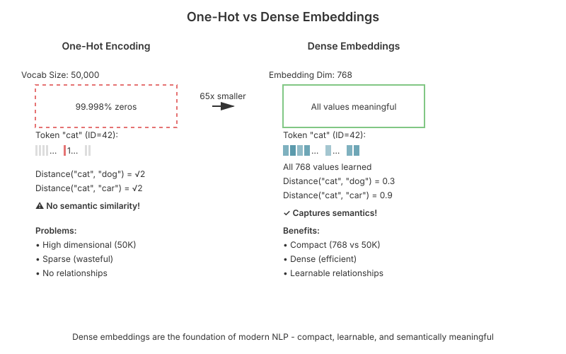
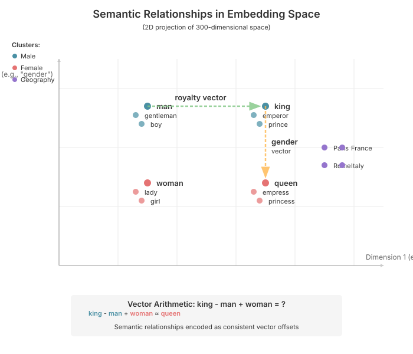
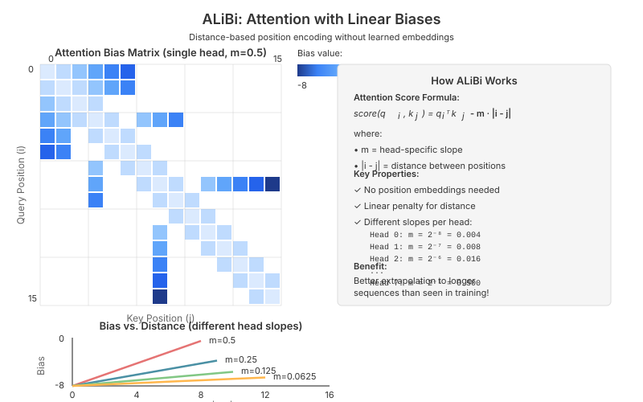

# Chapter 2: Embeddings

Embeddings are the foundation of modern NLP and LLMs. They transform discrete tokens (words, subwords, or characters) into continuous vector representations that neural networks can process. This chapter covers the evolution from classical word embeddings to modern learned embeddings used in transformers.

## Table of Contents

1. [Introduction](#introduction)
2. [Why Embeddings?](#why-embeddings)
3. [Classical Word Embeddings](#classical-word-embeddings)
   - [Word2Vec](#word2vec)
   - [GloVe](#glove)
   - [Key Insights](#key-insights-from-classical-embeddings)
4. [Learned Embeddings in Neural Networks](#learned-embeddings-in-neural-networks)
5. [Embedding Layers in PyTorch](#embedding-layers-in-pytorch)
6. [Embeddings in Modern LLMs](#embeddings-in-modern-llms)
7. [Advanced Topics](#advanced-topics)
   - [Vocabulary Expansion](#vocabulary-expansion)
   - [Embedding Compression and Quantization](#embedding-compression-and-quantization)
   - [Subword Embeddings](#subword-embeddings)
   - [Character-Level Embeddings](#character-level-embeddings)
   - [Contextualized Embeddings](#contextualized-embeddings)
8. [Common Interview Questions](#common-interview-questions)
9. [Summary](#summary)
10. [Exercises](#exercises)

---

## Introduction

After tokenization (see [Tokenization](01-tokenization.md)), we have a sequence of discrete token IDs. But neural networks operate on continuous values. **Embeddings** bridge this gap by mapping each discrete token to a dense, continuous vector.

For example, with a vocabulary of 50,000 tokens and an embedding dimension of 768:

- Token ID `42` → Vector of shape `(768,)` with learnable values
- Token ID `1337` → Different vector of shape `(768,)` with learnable values

These vectors are learned during training to capture semantic and syntactic relationships between tokens.

---

## Why Embeddings?

### The Problem with One-Hot Encoding

A naive approach would be to use one-hot encoding:

```python
import torch

vocab_size = 50000
token_id = 42

# One-hot encoding
one_hot = torch.zeros(vocab_size)
one_hot[token_id] = 1.0

print(f"Shape: {one_hot.shape}")  # (50000,)
print(f"Non-zero elements: {one_hot.sum()}")  # 1.0
```

**Problems with one-hot encoding:**

1. **High dimensionality**: For a vocabulary of 50K tokens, each token is represented by a 50K-dimensional vector
2. **Sparsity**: 99.998% of values are zeros (wasteful storage and computation)
3. **No semantic relationships**: The distance between any two tokens is always the same
   - `distance("cat", "dog")` = `distance("cat", "car")` = $\sqrt{2}$
   - Can't capture that "cat" and "dog" are more similar than "cat" and "car"

### The Solution: Dense Embeddings

Instead, we use **dense embeddings**:

```python
vocab_size = 50000
embedding_dim = 768

# Embedding matrix: each row is a token's embedding
embedding_matrix = torch.randn(vocab_size, embedding_dim)

# Look up token 42
token_embedding = embedding_matrix[42]

print(f"Shape: {token_embedding.shape}")  # (768,)
print(f"All values non-zero: {(token_embedding != 0).all()}")  # True
```

**Benefits:**

1. **Compact**: 768 dimensions instead of 50,000
2. **Dense**: All values are meaningful
3. **Learnable**: Embeddings are optimized to capture relationships
4. **Semantic**: Similar tokens have similar embeddings (after training)



---

## Classical Word Embeddings

Before transformers, researchers developed methods to learn word embeddings from large corpora. While modern LLMs learn embeddings end-to-end, understanding these classical methods provides important intuition.

### Word2Vec

Word2Vec (Mikolov et al., 2013) introduced two efficient methods for learning word embeddings:

#### Skip-Gram Model

**Intuition**: Predict context words from a center word.

**Objective**: Given a center word $w_t$, maximize the probability of observing context words $w_{t-k}, \ldots, w_{t-1}, w_{t+1}, \ldots, w_{t+k}$:

```math
\mathcal{L} = \frac{1}{T} \sum_{t=1}^{T} \sum_{-k \leq j \leq k, j \neq 0} \log p(w_{t+j} | w_t)
```

where the probability is modeled as:

```math
p(w_{O} | w_{I}) = \frac{\exp(\mathbf{v}_{w_{O}}^\top \mathbf{v}_{w_{I}})}{\sum_{w=1}^{V} \exp(\mathbf{v}_w^\top \mathbf{v}_{w_{I}})}
```

**Key Insight**: Words that appear in similar contexts have similar embeddings.

#### CBOW (Continuous Bag of Words)

**Intuition**: Predict center word from context words (reverse of Skip-Gram).

**Objective**: Given context words, predict the center word:

```math
\mathcal{L} = \frac{1}{T} \sum_{t=1}^{T} \log p(w_t | w_{t-k}, \ldots, w_{t-1}, w_{t+1}, \ldots, w_{t+k})
```

#### Implementation Considerations

**The Computational Challenge**:

Both Skip-Gram and CBOW face the same fundamental problem: the softmax normalization requires summing over the entire vocabulary. For a vocabulary of 50,000 words, computing:

```math
p(w_{O} | w_{I}) = \frac{\exp(\mathbf{v}_{w_{O}}^\top \mathbf{v}_{w_{I}})}{\sum_{w=1}^{50000} \exp(\mathbf{v}_w^\top \mathbf{v}_{w_{I}})}
```

is prohibitively expensive when repeated millions of times during training.

**Why Negative Sampling Matters**:

The solution is **negative sampling**, which transforms the problem from multi-class classification (predict the exact word from 50K options) to binary classification (is this a real word pair or not?). Instead of computing probabilities over all words, we:

1. **Positive examples**: Take actual (center, context) pairs from the corpus
2. **Negative examples**: Sample $k$ random words (typically 5-20) that are unlikely to appear in this context

This reduces complexity from $O(V)$ to $O(k)$ per training example—a 1000x speedup for typical values.

**Theoretical Foundation**:

Negative sampling is based on **Noise Contrastive Estimation (NCE)**: if we can distinguish real data from noise, we've learned the data distribution. By learning to discriminate context words from random words, the model implicitly learns which words co-occur frequently.

**Why This Preserves the Distributional Hypothesis**:

Words with similar contexts will:

- Have similar positive training examples (similar context words)
- Require similar decision boundaries to separate from negative samples
- Therefore, learn similar embedding vectors

**Relationship to Alternatives**:

- **Hierarchical Softmax**: Uses a binary tree to reduce complexity to $O(\log V)$, but negative sampling often performs better empirically
- **Full Softmax**: Exact but slow; mainly used for small vocabularies or with GPU optimization
- **Sampled Softmax**: Similar to negative sampling but maintains proper probability distribution

**Simplified Implementation (Skip-Gram concept):**

```python
import torch
import torch.nn as nn
import torch.nn.functional as F

class SkipGramModel(nn.Module):
    """Simplified Skip-Gram Word2Vec model.

    Predicts context words from center word.
    Uses negative sampling for efficient training.
    """
    def __init__(self, vocab_size: int, embedding_dim: int):
        super().__init__()
        # Each word has two embeddings: as center word and as context word
        self.center_embeddings = nn.Embedding(vocab_size, embedding_dim)
        self.context_embeddings = nn.Embedding(vocab_size, embedding_dim)

        # Initialize with small random values
        self.center_embeddings.weight.data.uniform_(-0.5/embedding_dim, 0.5/embedding_dim)
        self.context_embeddings.weight.data.uniform_(-0.5/embedding_dim, 0.5/embedding_dim)

    def forward(
        self,
        center_word: torch.Tensor,  # (batch_size,)
        context_word: torch.Tensor,  # (batch_size,)
        negative_words: torch.Tensor = None  # (batch_size, n_negatives)
    ) -> torch.Tensor:
        """
        Compute loss for center-context pairs with negative sampling.

        Args:
            center_word: Center word IDs
            context_word: Positive context word IDs
            negative_words: Negative sample word IDs

        Returns:
            Loss value
        """
        # Get embeddings
        center_emb = self.center_embeddings(center_word)  # (batch, emb_dim)
        context_emb = self.context_embeddings(context_word)  # (batch, emb_dim)

        # Positive score: dot product between center and context
        pos_score = torch.sum(center_emb * context_emb, dim=1)  # (batch,)
        pos_loss = F.logsigmoid(pos_score)

        # Negative sampling loss
        if negative_words is not None:
            neg_emb = self.context_embeddings(negative_words)  # (batch, n_neg, emb_dim)
            # Compute scores with all negatives
            neg_score = torch.bmm(neg_emb, center_emb.unsqueeze(2)).squeeze(2)  # (batch, n_neg)
            neg_loss = F.logsigmoid(-neg_score).sum(dim=1)  # (batch,)
        else:
            neg_loss = 0

        # Maximize positive score, minimize negative scores
        return -(pos_loss + neg_loss).mean()

# Example usage
vocab_size = 10000
embedding_dim = 300

model = SkipGramModel(vocab_size, embedding_dim)

# Batch of training examples
center_words = torch.tensor([10, 20, 30])  # "cat", "dog", "tree"
context_words = torch.tensor([11, 21, 31])  # "meow", "bark", "leaf"
negative_words = torch.randint(0, vocab_size, (3, 5))  # 5 negative samples each

loss = model(center_words, context_words, negative_words)
print(f"Loss: {loss.item():.4f}")

# After training, we can use the embeddings
word_id = 10
embedding = model.center_embeddings.weight[word_id]
print(f"Embedding for word {word_id}: {embedding[:5]}")  # First 5 dimensions
```

**Negative Sampling**: Instead of computing the full softmax over all vocabulary (expensive), sample a few negative examples:

```math
\log \sigma(\mathbf{v}_{w_O}^\top \mathbf{v}_{w_I}) + \sum_{i=1}^{k} \mathbb{E}_{w_i \sim P_n(w)} \left[\log \sigma(-\mathbf{v}_{w_i}^\top \mathbf{v}_{w_I})\right]
```

### GloVe

GloVe (Global Vectors, Pennington et al., 2014) takes a different approach: directly model word co-occurrence statistics.

**Key Idea**: The ratio of co-occurrence probabilities encodes semantic relationships.

**Example**:

- $P(\text{solid} | \text{ice})$ is high, $P(\text{solid} | \text{steam})$ is low
- $P(\text{gas} | \text{ice})$ is low, $P(\text{gas} | \text{steam})$ is high
- The ratio $\frac{P(\text{solid} | \text{ice})}{P(\text{solid} | \text{steam})}$ is large
- The ratio $\frac{P(\text{gas} | \text{ice})}{P(\text{gas} | \text{steam})}$ is small

**Objective**: Learn embeddings such that their dot product approximates log co-occurrence:

```math
\mathbf{w}_i^\top \tilde{\mathbf{w}}_j + b_i + \tilde{b}_j = \log X_{ij}
```

where $X_{ij}$ is the number of times word $j$ appears in the context of word $i$.

**Full Objective with Weighting**:

```math
J = \sum_{i,j=1}^{V} f(X_{ij}) \left(\mathbf{w}_i^\top \tilde{\mathbf{w}}_j + b_i + \tilde{b}_j - \log X_{ij}\right)^2
```

where $f(x)$ is a weighting function that prevents rare and very frequent co-occurrences from dominating:

```math
f(x) = \begin{cases}
(x/x_{\max})^{0.75} & \text{if } x < x_{\max} \\
1 & \text{otherwise}
\end{cases}
```

#### Why GloVe Differs from Word2Vec

**The Fundamental Insight**:

While Word2Vec processes text sequentially (one context window at a time), GloVe takes a global approach by first computing a **co-occurrence matrix** for the entire corpus. This captures all word-pair statistics before training begins.

**Problem Being Solved**:

Word2Vec's local training windows may miss global patterns. For example:

- "ice" and "solid" may co-occur rarely in any single document
- But across the entire corpus, their co-occurrence is statistically significant
- GloVe captures this by aggregating all co-occurrences first

**Theoretical Motivation**:

The ratio of co-occurrence probabilities reveals semantic relationships:

```math
\frac{P(\text{solid} | \text{ice})}{P(\text{solid} | \text{steam})} \gg 1 \quad \text{(ice is solid, steam is not)}
```

```math
\frac{P(\text{gas} | \text{ice})}{P(\text{gas} | \text{steam})} \ll 1 \quad \text{(steam is gas, ice is not)}
```

```math
\frac{P(\text{water} | \text{ice})}{P(\text{water} | \text{steam})} \approx 1 \quad \text{(both are water)}
```

GloVe embeddings are designed so that their dot product captures these ratios, making analogies like "king - man + woman = queen" emerge naturally.

**Key Algorithmic Differences from Word2Vec**:

1. **Training Data**: GloVe uses pre-computed co-occurrence matrix; Word2Vec uses raw text
2. **Objective**: GloVe minimizes reconstruction error of log co-occurrences; Word2Vec maximizes prediction probability
3. **Complexity**: GloVe is $O(|X|)$ where $X$ is the set of non-zero co-occurrences; Word2Vec is $O(T)$ where $T$ is corpus size
4. **Theoretical Foundation**: GloVe is explicitly designed to encode co-occurrence ratios; Word2Vec achieves this implicitly

**When to Prefer GloVe**:

- When you can afford to compute the co-occurrence matrix (requires $O(V^2)$ memory for dense matrix, though sparse in practice)
- When you want more interpretable embeddings (explicit relationship to co-occurrence statistics)
- When you need reproducible results (deterministic given co-occurrence matrix)

**When to Prefer Word2Vec**:

- For very large corpora where storing co-occurrence matrix is impractical
- When you want online/streaming learning (Word2Vec can update incrementally)
- When implementation simplicity matters (no need to compute matrix first)

```python
class GloVeModel(nn.Module):
    """Simplified GloVe model.

    Minimizes the difference between dot product and log co-occurrence.
    In practice, co-occurrence matrix is computed separately from corpus.
    """
    def __init__(self, vocab_size: int, embedding_dim: int):
        super().__init__()
        # Two sets of embeddings (word and context)
        self.word_embeddings = nn.Embedding(vocab_size, embedding_dim)
        self.context_embeddings = nn.Embedding(vocab_size, embedding_dim)
        # Bias terms
        self.word_biases = nn.Embedding(vocab_size, 1)
        self.context_biases = nn.Embedding(vocab_size, 1)

        # Initialize
        for param in self.parameters():
            param.data.uniform_(-0.5/embedding_dim, 0.5/embedding_dim)

    def forward(
        self,
        word_ids: torch.Tensor,  # (batch_size,)
        context_ids: torch.Tensor,  # (batch_size,)
        cooccurrence: torch.Tensor,  # (batch_size,) log co-occurrence counts
        weights: torch.Tensor  # (batch_size,) f(X_ij)
    ) -> torch.Tensor:
        """
        Compute weighted least squares loss.

        Args:
            word_ids: Word indices
            context_ids: Context word indices
            cooccurrence: Log of co-occurrence counts
            weights: Weight function f(X_ij)

        Returns:
            Weighted loss
        """
        # Get embeddings and biases
        word_emb = self.word_embeddings(word_ids)  # (batch, emb_dim)
        context_emb = self.context_embeddings(context_ids)  # (batch, emb_dim)
        word_bias = self.word_biases(word_ids).squeeze()  # (batch,)
        context_bias = self.context_biases(context_ids).squeeze()  # (batch,)

        # Dot product + biases
        prediction = torch.sum(word_emb * context_emb, dim=1) + word_bias + context_bias

        # Weighted squared error
        loss = weights * (prediction - cooccurrence) ** 2

        return loss.mean()

# Example: Simulated co-occurrence data
vocab_size = 10000
embedding_dim = 300

model = GloVeModel(vocab_size, embedding_dim)

# Simulated batch
word_ids = torch.tensor([10, 20, 30])
context_ids = torch.tensor([11, 21, 31])
log_cooccurrence = torch.tensor([5.2, 4.8, 6.1])  # log(X_ij)
weights = torch.tensor([0.8, 0.9, 0.7])  # f(X_ij)

loss = model(word_ids, context_ids, log_cooccurrence, weights)
print(f"GloVe loss: {loss.item():.4f}")
```

### Key Insights from Classical Embeddings

1. **Distributional Hypothesis**: "You shall know a word by the company it keeps" (Firth, 1957)
   - Words in similar contexts have similar meanings
   - Captured by both Word2Vec and GloVe

2. **Semantic Arithmetic**: Famous examples:
   - `king - man + woman ≈ queen`
   - `Paris - France + Italy ≈ Rome`

#### Understanding Semantic Arithmetic

**Why Vector Arithmetic Works**:

One of the most remarkable properties of word embeddings is that mathematical operations in embedding space correspond to semantic relationships. This isn't a coincidence—it emerges from how embeddings encode the distributional hypothesis.

**The Theoretical Foundation**:

When embeddings are trained on co-occurrence data, they learn to encode relationships as vector offsets. Consider:

- Words like "king" and "queen" share many contexts (royalty, castle, throne, crown)
- They differ systematically in gender-related contexts (he/she, his/her, prince/princess)
- This creates a consistent "gender" direction in embedding space

Mathematically, if we denote the embedding of word $w$ as $\mathbf{e}_w$:

```math
\mathbf{e}_{\text{queen}} - \mathbf{e}_{\text{king}} \approx \mathbf{e}_{\text{woman}} - \mathbf{e}_{\text{man}}
```

Both sides capture the same semantic relationship (female → male), just anchored at different base concepts (royalty vs common people).

**Why This Matters for NLP**:

1. **Analogical Reasoning**: Models can solve analogies without explicit training
2. **Transfer Learning**: Relationships learned in one domain transfer to others
3. **Semantic Compositionality**: Complex meanings can be constructed from simpler components
4. **Bias Detection**: These relationships can reveal societal biases in training data

**Practical Considerations**:

- **Not Perfect**: Arithmetic works best for clear, systematic relationships (gender, geography, verb tense)
- **Context Matters**: Static embeddings can't distinguish word senses ("bank" as river vs financial)
- **Magnitude Matters**: Normalization is often needed for best results (cosine similarity vs Euclidean distance)
- **Multiple Valid Answers**: "king - man + woman" might reasonably give "queen", "princess", or "duchess"

**The Linear Substructure Hypothesis**:

These arithmetic properties suggest embeddings have **linear substructures**: semantic relationships correspond to consistent directions in the high-dimensional embedding space. This is remarkable because nothing in Word2Vec or GloVe's training objective explicitly encourages this—it emerges from learning to predict context.

```python
def demonstrate_word_arithmetic():
    """Demonstrate semantic arithmetic with embeddings."""
    # Simulate pre-trained embeddings (in practice, load from file)
    vocab = {
        'king': 0, 'queen': 1, 'man': 2, 'woman': 3,
        'paris': 4, 'france': 5, 'rome': 6, 'italy': 7
    }

    # Random embeddings for demonstration
    # In practice, these would be trained
    embeddings = torch.randn(len(vocab), 300)

    # Normalize embeddings (common practice)
    embeddings = F.normalize(embeddings, p=2, dim=1)

    def find_closest(target_embedding, exclude_ids=[]):
        """Find closest word to target embedding."""
        similarities = torch.matmul(embeddings, target_embedding)
        # Exclude the input words
        for idx in exclude_ids:
            similarities[idx] = -float('inf')
        closest_idx = similarities.argmax().item()
        closest_word = [w for w, i in vocab.items() if i == closest_idx][0]
        return closest_word, similarities[closest_idx].item()

    # king - man + woman = ?
    result_emb = (embeddings[vocab['king']]

                  - embeddings[vocab['man']]
                  + embeddings[vocab['woman']])

    result_emb = F.normalize(result_emb, p=2, dim=0)

    closest, similarity = find_closest(
        result_emb,
        exclude_ids=[vocab['king'], vocab['man'], vocab['woman']]
    )
    print(f"king - man + woman = {closest} (similarity: {similarity:.3f})")

demonstrate_word_arithmetic()
```



3. **Dimensionality**: Typical dimensions: 50-300 for Word2Vec/GloVe
   - Smaller: faster, less expressive
   - Larger: more expressive, risk of overfitting

4. **Static vs. Contextual**: Word2Vec and GloVe produce **static** embeddings
   - Each word has one embedding regardless of context
   - "bank" (river) and "bank" (financial) have the same embedding
   - Modern transformers solve this with **contextual** embeddings

---

## Learned Embeddings in Neural Networks

In modern deep learning, embeddings are learned end-to-end as part of the model.

### The Embedding Layer

An embedding layer is simply a **lookup table**:

```math
\text{Embedding}: \mathbb{N} \rightarrow \mathbb{R}^d
```

where:

- Input: Token ID $t \in \{0, 1, \ldots, V-1\}$
- Output: Dense vector $\mathbf{e}_t \in \mathbb{R}^d$

**Mathematically**, it's a matrix multiplication with one-hot vectors:

```math
\mathbf{e}_t = \mathbf{E} \cdot \text{one\_hot}(t)
```

where $\mathbf{E} \in \mathbb{R}^{V \times d}$ is the embedding matrix.

**In practice**, we just index into the matrix (much more efficient):

```math
\mathbf{e}_t = \mathbf{E}[t, :]
```

### Training Embeddings

Embeddings are learned via backpropagation along with the rest of the network.

**Forward pass**: Look up embeddings
**Backward pass**: Gradient updates only affect the embeddings that were actually used

#### How Gradient Updates Work for Embeddings

**The Sparse Update Property**:

Unlike typical neural network layers where all parameters receive gradients in every batch, embedding layers have a unique property: **only embeddings of tokens present in the current batch receive gradient updates**. This has important implications for training efficiency and dynamics.

**Why Sparse Updates Occur**:

Mathematically, an embedding lookup can be viewed as:

```math
\mathbf{e}_t = \mathbf{E} \cdot \text{one\_hot}(t)
```

where $\mathbf{E} \in \mathbb{R}^{V \times d}$ is the embedding matrix. The gradient with respect to $\mathbf{E}$ is:

```math
\frac{\partial \mathcal{L}}{\partial \mathbf{E}} = \text{one\_hot}(t) \cdot \frac{\partial \mathcal{L}}{\partial \mathbf{e}_t}^\top
```

Since one-hot encoding is zero everywhere except position $t$, gradients only flow to row $t$ of the embedding matrix. All other embeddings receive zero gradient.

**Practical Implications**:

1. **Training Efficiency**: Don't need to compute or store gradients for the entire $V \times d$ matrix, only for tokens in the batch
2. **Vocabulary Coverage**: Rare tokens get fewer updates, potentially learning slower or less accurately
3. **Batch Size Matters**: Larger batches → more unique tokens → more embeddings updated per step
4. **Stale Embeddings**: Tokens never seen during training retain their initialization

**Comparison to Other Layers**:

- **Dense layer**: All $d_{\text{in}} \times d_{\text{out}}$ parameters get gradients every batch
- **Embedding layer**: Only $k \times d$ parameters get gradients, where $k$ is the number of unique tokens in batch
- For vocabulary of 50K and batch with 100 unique tokens: 99.8% of embeddings unchanged in that step

**Why This Works**:

Despite sparse updates, embeddings learn effectively because:

1. **Frequent tokens** get many updates across batches (see the word "the" thousands of times)
2. **Rare tokens** get fewer but more concentrated signal (specialized contexts)
3. **Shared gradients** from downstream layers provide consistent learning signal

```python
# Gradient flow illustration
import torch
import torch.nn as nn

vocab_size = 100
embedding_dim = 16
batch_size = 4
seq_len = 10

# Create embedding layer
embedding = nn.Embedding(vocab_size, embedding_dim)

# Input token IDs
token_ids = torch.randint(0, vocab_size, (batch_size, seq_len))

# Forward pass
embedded = embedding(token_ids)  # (batch, seq_len, embedding_dim)

# Dummy loss (just for illustration)
loss = embedded.sum()

# Backward pass
loss.backward()

# Check which embeddings got gradients
print(f"Gradient shape: {embedding.weight.grad.shape}")  # (vocab_size, embedding_dim)
print(f"Non-zero gradient rows: {(embedding.weight.grad.abs().sum(dim=1) > 0).sum()}")
# Only embeddings for tokens in token_ids have non-zero gradients
unique_tokens = token_ids.unique()
print(f"Unique tokens in batch: {len(unique_tokens)}")
```

**Key Properties**:

1. **Sparse updates**: Only embeddings of tokens in the batch get updated
2. **Shared parameters**: Same token ID always maps to same embedding
3. **Position-independent**: Token gets same embedding regardless of position (position added separately, see [Positional Encodings](07-positional-encodings.md))

---

## Embedding Layers in PyTorch

PyTorch provides `nn.Embedding` for efficient embedding lookup.

### Basic Usage

```python
import torch
import torch.nn as nn

# Create embedding layer
vocab_size = 50000
embedding_dim = 768

embedding = nn.Embedding(
    num_embeddings=vocab_size,
    embedding_dim=embedding_dim
)

# Check parameters
print(f"Number of parameters: {vocab_size * embedding_dim:,}")
print(f"Weight shape: {embedding.weight.shape}")  # (50000, 768)

# Forward pass with single token
token_id = torch.tensor([42])
embedded = embedding(token_id)
print(f"Output shape: {embedded.shape}")  # (1, 768)

# Forward pass with sequence
sequence = torch.tensor([10, 20, 30, 40, 50])
embedded_seq = embedding(sequence)
print(f"Sequence output shape: {embedded_seq.shape}")  # (5, 768)

# Forward pass with batch of sequences
batch = torch.tensor([
    [10, 20, 30, 40],
    [15, 25, 35, 45],
    [11, 21, 31, 41]
])
embedded_batch = embedding(batch)
print(f"Batch output shape: {embedded_batch.shape}")  # (3, 4, 768)
```

### Initialization Strategies

Different initialization strategies affect training dynamics:

#### Why Initialization Matters for Embeddings

**The Problem**:

Poor initialization can lead to:

1. **Slow convergence**: Embeddings start too far from useful regions of space
2. **Vanishing/exploding gradients**: Initial values too small/large → numerical issues
3. **Breaking symmetry**: Need diversity among initial embeddings
4. **Scale mismatch**: Embeddings should have similar magnitude to other layer activations

**Theoretical Considerations**:

For stable training, we want initial embeddings to have appropriate variance. Consider a simple linear layer after embedding:

```math
\mathbf{h} = \mathbf{W}\mathbf{e}
```

If $\mathbf{e}$ has variance $\sigma_e^2$ and $\mathbf{W}$ has variance $\sigma_w^2$, then $\mathbf{h}$ has variance approximately $d \cdot \sigma_e^2 \cdot \sigma_w^2$ where $d$ is embedding dimension. For variance to remain stable through the network, we need careful initialization.

**Common Strategies and Their Rationale**:

1. **PyTorch Default** $\text{Uniform}(-\frac{1}{\sqrt{V}}, \frac{1}{\sqrt{V}})$:
   - Based on Xavier initialization principle
   - Variance = $\frac{1}{3V}$ (very small for large vocabularies)
   - Often suboptimal for modern transformers

2. **Fixed Normal** $\mathcal{N}(0, 0.02)$:
   - Empirically validated across GPT, BERT, etc.
   - Variance independent of vocabulary size
   - Provides consistent scale regardless of architecture

3. **Scaled Normal** $\mathcal{N}(0, d^{-0.5})$:
   - Variance = $1/d$ → smaller values for larger dimensions
   - Maintains roughly unit variance after aggregation
   - Theoretical justification from attention mechanics

4. **Xavier/Glorot** $\text{Uniform}(-\sqrt{\frac{6}{V+d}}, \sqrt{\frac{6}{V+d}})$:
   - Designed for maintaining variance through linear layers
   - Fan-in (vocabulary size) and fan-out (embedding dimension) both matter
   - Less common for embeddings, more for linear layers

**Impact on Downstream Components**:

When embeddings are combined with positional encodings, their scales must be compatible:

- If embeddings are too large: positional info gets drowned out
- If embeddings are too small: position dominates, losing token information
- Solution: Either normalize both, or use compatible initialization schemes

```python
def compare_initializations():
    """Compare different embedding initialization strategies."""

    vocab_size = 1000
    embedding_dim = 128

    # 1. Default initialization (uniform)
    emb_default = nn.Embedding(vocab_size, embedding_dim)
    print(f"Default - Mean: {emb_default.weight.mean():.4f}, "
          f"Std: {emb_default.weight.std():.4f}")

    # 2. Normal initialization
    emb_normal = nn.Embedding(vocab_size, embedding_dim)
    nn.init.normal_(emb_normal.weight, mean=0.0, std=0.02)
    print(f"Normal(0, 0.02) - Mean: {emb_normal.weight.mean():.4f}, "
          f"Std: {emb_normal.weight.std():.4f}")

    # 3. Xavier/Glorot initialization
    emb_xavier = nn.Embedding(vocab_size, embedding_dim)
    nn.init.xavier_uniform_(emb_xavier.weight)
    print(f"Xavier - Mean: {emb_xavier.weight.mean():.4f}, "
          f"Std: {emb_xavier.weight.std():.4f}")

    # 4. Scaled normal (common for transformers)
    emb_scaled = nn.Embedding(vocab_size, embedding_dim)
    nn.init.normal_(emb_scaled.weight, mean=0.0, std=embedding_dim**-0.5)
    print(f"Normal(0, d^-0.5) - Mean: {emb_scaled.weight.mean():.4f}, "
          f"Std: {emb_scaled.weight.std():.4f}")

compare_initializations()
```

**Common Initialization in Transformers**:

- GPT-2, GPT-3: $\mathcal{N}(0, 0.02)$
- BERT: $\mathcal{N}(0, 0.02)$
- Many others: $\mathcal{N}(0, d^{-0.5})$ where $d$ is embedding dimension

### Padding and Masking

When working with variable-length sequences, we need padding:

```python
class EmbeddingWithPadding(nn.Module):
    """Embedding layer with padding support."""

    def __init__(
        self,
        vocab_size: int,
        embedding_dim: int,
        padding_idx: int = 0
    ):
        super().__init__()
        # padding_idx ensures padding token always has zero embedding
        self.embedding = nn.Embedding(
            vocab_size,
            embedding_dim,
            padding_idx=padding_idx
        )
        self.padding_idx = padding_idx

    def forward(self, token_ids: torch.Tensor) -> tuple[torch.Tensor, torch.Tensor]:
        """
        Args:
            token_ids: (batch, seq_len) token IDs

        Returns:
            embeddings: (batch, seq_len, embedding_dim)
            mask: (batch, seq_len) boolean mask (True = real token, False = padding)
        """
        embeddings = self.embedding(token_ids)

        # Create attention mask (True for real tokens, False for padding)
        mask = (token_ids != self.padding_idx)

        return embeddings, mask

# Example with variable length sequences
vocab_size = 1000
embedding_dim = 128
padding_idx = 0

model = EmbeddingWithPadding(vocab_size, embedding_dim, padding_idx)

# Batch with different lengths (padded to same length)
batch = torch.tensor([
    [5, 10, 15, 20, 25, 0, 0],  # Length 5 + 2 padding
    [7, 12, 17, 22, 0, 0, 0],   # Length 4 + 3 padding
    [3, 8, 13, 18, 23, 28, 33]  # Length 7 (no padding)
])

embeddings, mask = model(batch)

print(f"Embeddings shape: {embeddings.shape}")  # (3, 7, 128)
print(f"Mask shape: {mask.shape}")  # (3, 7)
print(f"Mask:\n{mask}")
print(f"\nPadding embedding (should be zeros):\n{embeddings[0, 5][:5]}")  # First 5 dims
print(f"Non-padding embedding:\n{embeddings[0, 0][:5]}")
```

### Pre-trained Embeddings

Sometimes we want to use pre-trained embeddings (e.g., from Word2Vec or GloVe):

```python
def load_pretrained_embeddings():
    """Example of loading and using pre-trained embeddings."""

    # Simulate pre-trained embeddings (in practice, load from file)
    vocab_size = 10000
    embedding_dim = 300
    pretrained_weights = torch.randn(vocab_size, embedding_dim)

    # Option 1: Load and freeze
    embedding_frozen = nn.Embedding(vocab_size, embedding_dim)
    embedding_frozen.weight = nn.Parameter(pretrained_weights)
    embedding_frozen.weight.requires_grad = False  # Freeze

    print(f"Frozen embeddings trainable: {embedding_frozen.weight.requires_grad}")

    # Option 2: Load and fine-tune
    embedding_finetune = nn.Embedding(vocab_size, embedding_dim)
    embedding_finetune.weight = nn.Parameter(pretrained_weights)
    # Leave requires_grad=True (default)

    print(f"Fine-tunable embeddings trainable: {embedding_finetune.weight.requires_grad}")

    # Option 3: Initialize from pretrained, but with special tokens
    special_tokens = 100  # e.g., [PAD], [UNK], [CLS], [SEP], etc.
    new_vocab_size = vocab_size + special_tokens

    embedding_extended = nn.Embedding(new_vocab_size, embedding_dim)
    # Copy pretrained weights
    embedding_extended.weight.data[:vocab_size] = pretrained_weights
    # Randomly initialize special tokens
    embedding_extended.weight.data[vocab_size:].normal_(mean=0.0, std=0.02)

    print(f"Extended vocab size: {new_vocab_size}")

load_pretrained_embeddings()
```

---

## Embeddings in Modern LLMs

Modern LLMs use learned embeddings with several key characteristics:

### 1. Large Embedding Dimensions

| Model | Vocabulary Size | Embedding Dim | Parameters |
|-------|----------------|---------------|------------|
| GPT-2 (small) | 50,257 | 768 | 38.6M |
| GPT-2 (large) | 50,257 | 1,280 | 64.3M |
| BERT-base | 30,522 | 768 | 23.4M |
| LLaMA 2 (7B) | 32,000 | 4,096 | 131M |
| LLaMA 3 (8B) | 128,256 | 4,096 | 525M |
| GPT-3 | 50,257 | 12,288 | 617M |

**Note**: Embedding parameters can be a significant fraction of total parameters, especially in smaller models!

### 2. Tied Embeddings

Many models **tie** input embeddings and output projection weights to reduce parameters:

```python
class LanguageModel(nn.Module):
    """Language model with tied embeddings.

    The same weight matrix is used for:

    1. Input: token ID → embedding
    2. Output: hidden state → logits over vocabulary

    This reduces parameters and can improve performance.
    """

    def __init__(
        self,
        vocab_size: int,
        embedding_dim: int,
        hidden_dim: int,
        tie_weights: bool = True
    ):
        super().__init__()

        # Input embedding
        self.embedding = nn.Embedding(vocab_size, embedding_dim)

        # Model body (simplified - would be transformer layers)
        self.body = nn.Linear(embedding_dim, hidden_dim)

        # Output projection
        if tie_weights:
            # Ensure dimensions match
            assert embedding_dim == hidden_dim, \
                "Hidden dim must equal embedding dim for weight tying"
            # Share weights with embedding
            self.output_projection = nn.Linear(hidden_dim, vocab_size, bias=False)
            self.output_projection.weight = self.embedding.weight
        else:
            # Separate output projection
            self.output_projection = nn.Linear(hidden_dim, vocab_size)

    def forward(self, token_ids: torch.Tensor) -> torch.Tensor:
        # Input embedding
        x = self.embedding(token_ids)  # (batch, seq_len, embedding_dim)

        # Model body
        x = self.body(x)  # (batch, seq_len, hidden_dim)

        # Output projection
        logits = self.output_projection(x)  # (batch, seq_len, vocab_size)

        return logits

# Example
vocab_size = 50000
d_model = 768

# With weight tying: vocab_size * d_model parameters (shared)
model_tied = LanguageModel(vocab_size, d_model, d_model, tie_weights=True)
tied_params = sum(p.numel() for p in model_tied.parameters())

# Without weight tying: 2 * vocab_size * d_model parameters (separate)
model_untied = LanguageModel(vocab_size, d_model, d_model, tie_weights=False)
untied_params = sum(p.numel() for p in model_untied.parameters())

print(f"Parameters with tied weights: {tied_params:,}")
print(f"Parameters without tied weights: {untied_params:,}")
print(f"Savings: {untied_params - tied_params:,} ({(1 - tied_params/untied_params)*100:.1f}%)")
```

**Models that tie weights**: GPT-2, BERT, T5, many others
**Models that don't**: Some larger models keep them separate

### 3. Embedding + Position

Embeddings alone don't encode position. Modern transformers add positional information:

```python
class TransformerEmbedding(nn.Module):
    """Combined token + position embedding for transformers.

    This is the first layer of transformer models.
    See [Positional Encodings](07-positional-encodings.md) for details on position.
    """

    def __init__(
        self,
        vocab_size: int,
        max_seq_len: int,
        embedding_dim: int,
        dropout: float = 0.1
    ):
        super().__init__()

        # Token embeddings
        self.token_embedding = nn.Embedding(vocab_size, embedding_dim)

        # Position embeddings (learned)
        self.position_embedding = nn.Embedding(max_seq_len, embedding_dim)

        # Dropout for regularization
        self.dropout = nn.Dropout(dropout)

        # Register position IDs buffer (not a parameter, but part of state)
        self.register_buffer(
            'position_ids',
            torch.arange(max_seq_len).expand((1, -1))
        )

    def forward(self, token_ids: torch.Tensor) -> torch.Tensor:
        """
        Args:
            token_ids: (batch, seq_len) token IDs

        Returns:
            embeddings: (batch, seq_len, embedding_dim)
        """
        batch_size, seq_len = token_ids.shape

        # Token embeddings
        token_emb = self.token_embedding(token_ids)  # (batch, seq_len, emb_dim)

        # Position embeddings
        positions = self.position_ids[:, :seq_len]  # (1, seq_len)
        position_emb = self.position_embedding(positions)  # (1, seq_len, emb_dim)

        # Combine (broadcast addition)
        embeddings = token_emb + position_emb  # (batch, seq_len, emb_dim)

        # Apply dropout
        embeddings = self.dropout(embeddings)

        return embeddings

# Example usage
vocab_size = 50000
max_seq_len = 2048
embedding_dim = 768

model = TransformerEmbedding(vocab_size, max_seq_len, embedding_dim)

# Input sequence
batch = torch.tensor([
    [10, 20, 30, 40, 50],
    [15, 25, 35, 45, 55]
])

output = model(batch)
print(f"Output shape: {output.shape}")  # (2, 5, 768)
```

**Modern variants**:

- **Learned positions** (GPT, BERT): As shown above
- **Sinusoidal positions** (original Transformer): Fixed, deterministic patterns
- **Rotary embeddings (RoPE)** (LLaMA, GPT-Neo): Applied in attention, not added to embeddings
- **ALiBi** (Attention with Linear Biases): No position embeddings at all!
- See [Positional Encodings](07-positional-encodings.md) for full details

### Alternative: ALiBi (No Position Embeddings)

Some modern models like BLOOM use **ALiBi** (Attention with Linear Biases), which doesn't use position embeddings at all. Instead, it adds a bias directly to attention scores based on distance.

**Key Idea**: Add a linearly decreasing bias to attention scores based on key-query distance:

```math
\text{attention\_score}(q_i, k_j) = q_i^\top k_j - m \cdot |i - j|
```

where $m$ is a head-specific slope.

**Advantages**:

1. **No position embeddings needed**: Saves parameters
2. **Better length extrapolation**: Can handle sequences longer than seen during training
3. **Simpler**: One less component to worry about

```python
class ALiBiEmbedding(nn.Module):
    """
    Embedding layer for models using ALiBi positional encoding.

    ALiBi doesn't add position embeddings - it only uses token embeddings.
    Position information is added later as biases in attention scores.
    """

    def __init__(
        self,
        vocab_size: int,
        embedding_dim: int,
        dropout: float = 0.1
    ):
        super().__init__()

        # Only token embeddings (no position embeddings!)
        self.token_embedding = nn.Embedding(vocab_size, embedding_dim)
        self.dropout = nn.Dropout(dropout)

    def forward(self, token_ids: torch.Tensor) -> torch.Tensor:
        """
        Args:
            token_ids: (batch, seq_len) token IDs

        Returns:
            embeddings: (batch, seq_len, embedding_dim)
        """
        # Just token embeddings, no position
        embeddings = self.token_embedding(token_ids)
        embeddings = self.dropout(embeddings)
        return embeddings

def get_alibi_slopes(num_heads: int) -> torch.Tensor:
    """
    Generate ALiBi slopes for each attention head.

    Slopes form a geometric sequence. For 8 heads:
    [2^(-8/8), 2^(-7/8), ..., 2^(-1/8)]

    Args:
        num_heads: Number of attention heads

    Returns:
        slopes: (num_heads,) tensor of slopes
    """
    def get_slopes_power_of_2(n):
        start = 2 ** (-(2 ** -(torch.log2(torch.tensor(n)).item())))
        ratio = start
        return torch.tensor([start * (ratio ** i) for i in range(n)])

    # Handle non-power-of-2 number of heads
    if (num_heads & (num_heads - 1)) == 0:  # is power of 2
        return get_slopes_power_of_2(num_heads)
    else:
        # Closest power of 2
        closest_power = 2 ** torch.log2(torch.tensor(num_heads)).floor().int()
        slopes = get_slopes_power_of_2(closest_power)
        # Add extra slopes by interpolating
        extra = num_heads - closest_power
        extra_slopes = get_slopes_power_of_2(2 * closest_power)[:extra]
        return torch.cat([slopes, extra_slopes])

def get_alibi_bias(seq_len: int, num_heads: int) -> torch.Tensor:
    """
    Generate ALiBi bias matrix for attention.

    The bias is added to attention scores BEFORE softmax:
    attention_scores = Q @ K^T + alibi_bias

    Args:
        seq_len: Sequence length
        num_heads: Number of attention heads

    Returns:
        bias: (num_heads, seq_len, seq_len) bias matrix
    """
    # Get slopes for each head
    slopes = get_alibi_slopes(num_heads)  # (num_heads,)

    # Create distance matrix
    # distances[i, j] = |i - j|
    positions = torch.arange(seq_len)
    distances = (positions.unsqueeze(0) - positions.unsqueeze(1)).abs()  # (seq_len, seq_len)

    # Apply slopes: bias[h, i, j] = -slope[h] * distance[i, j]
    bias = -slopes.unsqueeze(-1).unsqueeze(-1) * distances.unsqueeze(0)  # (num_heads, seq_len, seq_len)

    return bias

# Example usage
vocab_size = 50000
embedding_dim = 768
seq_len = 128
num_heads = 12

# Embedding layer (no position embeddings)
alibi_embedding = ALiBiEmbedding(vocab_size, embedding_dim)

# Input
tokens = torch.tensor([[1, 2, 3, 4, 5]])
embeddings = alibi_embedding(tokens)
print(f"Embeddings shape: {embeddings.shape}")  # (1, 5, 768)

# ALiBi bias for attention
alibi_bias = get_alibi_bias(seq_len, num_heads)
print(f"ALiBi bias shape: {alibi_bias.shape}")  # (12, 128, 128)

# Visualize bias for one head
import matplotlib.pyplot as plt

plt.figure(figsize=(10, 4))

plt.subplot(1, 2, 1)
plt.imshow(alibi_bias[0, :20, :20], cmap='viridis')
plt.colorbar(label='Bias value')
plt.xlabel('Key position')
plt.ylabel('Query position')
plt.title('ALiBi Bias (Head 0, first 20 tokens)')

plt.subplot(1, 2, 2)
# Show bias as function of distance for different heads
for head in [0, 3, 6, 9]:
    bias_values = alibi_bias[head, 10, :20]  # Query at position 10
    distances = torch.arange(20) - 10
    plt.plot(distances.abs(), bias_values, label=f'Head {head}', marker='o')

plt.xlabel('Distance |i - j|')
plt.ylabel('Bias value')
plt.title('ALiBi Bias vs Distance')
plt.legend()
plt.grid(True)
plt.tight_layout()
plt.show()
```



**Models using ALiBi**:

- BLOOM (BigScience)
- MPT (MosaicML)
- Some variants of LLaMA

**Trade-offs**:

- **Pro**: Better extrapolation to longer sequences
- **Pro**: Fewer parameters (no position embeddings)
- **Con**: Slightly different training dynamics
- **Con**: Not as widely adopted as RoPE or learned positions

### 4. Embedding Scaling

Some models scale embeddings by $\sqrt{d_{\text{model}}}$:

```python
class ScaledEmbedding(nn.Module):
    """Embedding layer with scaling (used in original Transformer).

    Scaling helps balance the magnitude of embeddings and positional encodings.
    """

    def __init__(self, vocab_size: int, embedding_dim: int):
        super().__init__()
        self.embedding = nn.Embedding(vocab_size, embedding_dim)
        self.scale = embedding_dim ** 0.5

    def forward(self, token_ids: torch.Tensor) -> torch.Tensor:
        return self.embedding(token_ids) * self.scale

# Example
embedding_dim = 512
scaled_emb = ScaledEmbedding(10000, embedding_dim)

token = torch.tensor([42])
output = scaled_emb(token)

print(f"Embedding dimension: {embedding_dim}")
print(f"Scale factor: {embedding_dim ** 0.5}")
print(f"Output magnitude: {output.norm().item():.2f}")
```

**Who uses scaling**:

- Original Transformer (Vaswani et al., 2017): Yes
- BERT: No
- GPT-2/3: No
- T5: Yes

---

## Advanced Topics

### Vocabulary Expansion

When adapting pre-trained models to new domains, you often need to add new tokens to the vocabulary (e.g., domain-specific terms, new languages, special tokens).

**Challenge**: How do you initialize embeddings for new tokens without destroying pre-trained knowledge?

#### The Vocabulary Expansion Problem

**Why This Matters**:

Pre-trained language models are powerful, but their vocabularies are fixed during pre-training. When adapting to new domains, you encounter:

- **Domain-specific terms**: Medical (ventilator, triage), legal (tort, plaintiff), scientific (chromatography)
- **New languages**: Multilingual expansion of monolingual models
- **Special tokens**: Task-specific markers ([CITATION], [CODE_START])
- **Recent terms**: "COVID-19", "ChatGPT", "blockchain" (for older models)

**The Catastrophic Forgetting Risk**:

Simply retraining the model with random initialization for new tokens can cause:

1. **Gradient instability**: New tokens have random embeddings → large gradients → destabilize pre-trained embeddings
2. **Distribution shift**: New tokens in random regions of embedding space → model needs to adapt entire space
3. **Slow adaptation**: Random embeddings need many updates to become useful

**Key Insight**:

The embedding space learned during pre-training has structure:

- Similar words cluster together
- Semantic relationships form linear subspaces
- Magnitude and variance follow learned distributions

New token embeddings should respect this structure from initialization, allowing the model to leverage pre-trained knowledge immediately.

**Theoretical Approaches**:

1. **Random Initialization**: $\mathbf{e}_{\text{new}} \sim \mathcal{N}(0, 0.02)$
   - **Pro**: Simple, matches pre-training initialization
   - **Con**: Ignores embedding space structure, may land in uninformative regions

2. **Distribution Matching**: Initialize to match statistics of existing embeddings
   - **Pro**: New tokens have similar norm/variance to existing ones
   - **Con**: Still doesn't leverage semantic information

3. **Nearest Neighbor Averaging**: Average embeddings of $k$ semantically similar existing tokens
   - **Pro**: Places new token near semantically relevant region
   - **Con**: Requires manual mapping of new tokens to existing vocabulary

4. **Subword Composition**: For compound/derived words, average their constituent subwords
   - **Pro**: Leverages compositional structure (e.g., "COVID-19" from "CO", "VID", "19")
   - **Con**: Only works for tokens that decompose into existing subwords

**The Learning Rate Strategy**:

After initialization, use differential learning rates:

- **Pre-trained embeddings**: Low learning rate (1e-5) to preserve knowledge
- **New embeddings**: Higher learning rate (1e-3) to adapt quickly
- **Other layers**: Medium learning rate based on how much adaptation needed

This prevents new tokens from destabilizing the model while allowing them to learn quickly.

#### Strategies for Adding New Tokens

```python
class VocabularyExpander:
    """Helper class for expanding vocabulary of pre-trained models."""

    def __init__(self, original_embedding: nn.Embedding):
        """
        Args:
            original_embedding: Pre-trained embedding layer
        """
        self.original_embedding = original_embedding
        self.vocab_size = original_embedding.num_embeddings
        self.embedding_dim = original_embedding.embedding_dim

    def expand_random(
        self,
        new_tokens: int,
        std: float = 0.02
    ) -> nn.Embedding:
        """
        Expand vocabulary with random initialization.

        Args:
            new_tokens: Number of new tokens to add
            std: Standard deviation for random initialization

        Returns:
            Expanded embedding layer
        """
        new_vocab_size = self.vocab_size + new_tokens
        expanded_embedding = nn.Embedding(new_vocab_size, self.embedding_dim)

        # Copy pre-trained embeddings
        expanded_embedding.weight.data[:self.vocab_size] = \
            self.original_embedding.weight.data

        # Initialize new tokens randomly
        nn.init.normal_(
            expanded_embedding.weight.data[self.vocab_size:],
            mean=0.0,
            std=std
        )

        return expanded_embedding

    def expand_mean_pooling(
        self,
        new_tokens: int,
        k: int = 100
    ) -> nn.Embedding:
        """
        Initialize new tokens as mean of k random existing embeddings.

        This often works better than random initialization as it places
        new tokens in a reasonable region of embedding space.

        Args:
            new_tokens: Number of new tokens to add
            k: Number of existing embeddings to average

        Returns:
            Expanded embedding layer
        """
        new_vocab_size = self.vocab_size + new_tokens
        expanded_embedding = nn.Embedding(new_vocab_size, self.embedding_dim)

        # Copy pre-trained embeddings
        expanded_embedding.weight.data[:self.vocab_size] = \
            self.original_embedding.weight.data

        # Initialize each new token as mean of k random embeddings
        for i in range(new_tokens):
            # Sample k random token indices
            random_indices = torch.randint(0, self.vocab_size, (k,))
            # Average their embeddings
            mean_embedding = self.original_embedding.weight.data[random_indices].mean(dim=0)
            expanded_embedding.weight.data[self.vocab_size + i] = mean_embedding

        return expanded_embedding

    def expand_subword_pooling(
        self,
        new_token_texts: list[str],
        tokenizer,
        pooling: str = 'mean'
    ) -> nn.Embedding:
        """
        Initialize new tokens based on their subword decomposition.

        Example: "COVID-19" might tokenize as ["CO", "VID", "-", "19"]
                 Initialize as mean of these subword embeddings.

        Args:
            new_token_texts: Text of new tokens
            tokenizer: Tokenizer that can decompose into subwords
            pooling: 'mean' or 'sum'

        Returns:
            Expanded embedding layer
        """
        new_vocab_size = self.vocab_size + len(new_token_texts)
        expanded_embedding = nn.Embedding(new_vocab_size, self.embedding_dim)

        # Copy pre-trained embeddings
        expanded_embedding.weight.data[:self.vocab_size] = \
            self.original_embedding.weight.data

        # Initialize each new token from its subword representation
        for i, text in enumerate(new_token_texts):
            # Tokenize into subwords (assuming tokenizer returns token IDs)
            subword_ids = tokenizer.encode(text)

            # Get embeddings for subwords
            subword_embeddings = self.original_embedding.weight.data[subword_ids]

            # Pool (mean or sum)
            if pooling == 'mean':
                new_embedding = subword_embeddings.mean(dim=0)
            else:  # sum
                new_embedding = subword_embeddings.sum(dim=0)

            expanded_embedding.weight.data[self.vocab_size + i] = new_embedding

        return expanded_embedding

# Example usage
vocab_size = 50000
embedding_dim = 768

# Pre-trained embedding
pretrained_emb = nn.Embedding(vocab_size, embedding_dim)
# Simulate pre-training
nn.init.normal_(pretrained_emb.weight.data, mean=0.0, std=0.02)

expander = VocabularyExpander(pretrained_emb)

# Add 1000 new tokens (e.g., domain-specific vocabulary)
new_tokens = 1000

# Method 1: Random initialization
expanded_random = expander.expand_random(new_tokens)
print(f"Random expansion: {expanded_random.num_embeddings} tokens")

# Method 2: Mean pooling initialization
expanded_mean = expander.expand_mean_pooling(new_tokens, k=100)
print(f"Mean pooling expansion: {expanded_mean.num_embeddings} tokens")

# Compare embedding statistics
print(f"\nOriginal embeddings - Mean: {pretrained_emb.weight.data.mean():.4f}, "
      f"Std: {pretrained_emb.weight.data.std():.4f}")
print(f"New tokens (random) - Mean: {expanded_random.weight.data[vocab_size:].mean():.4f}, "
      f"Std: {expanded_random.weight.data[vocab_size:].std():.4f}")
print(f"New tokens (mean pool) - Mean: {expanded_mean.weight.data[vocab_size:].mean():.4f}, "
      f"Std: {expanded_mean.weight.data[vocab_size:].std():.4f}")
```

#### Best Practices for Vocabulary Expansion

1. **Initialize new tokens carefully**: Random initialization can place new tokens far from meaningful regions
2. **Use lower learning rates initially**: Let new tokens adapt while keeping pre-trained embeddings stable
3. **Consider freezing pre-trained embeddings**: At least for the first few epochs
4. **Validate on domain-specific data**: Ensure new tokens are learning meaningful representations

```python
def train_with_expanded_vocabulary(
    model,
    original_vocab_size: int,
    optimizer,
    lr_original: float = 1e-5,
    lr_new: float = 1e-3
):
    """
    Use different learning rates for original vs new embeddings.

    Common pattern when expanding vocabulary:

    - Small LR for pre-trained embeddings (preserve knowledge)
    - Larger LR for new embeddings (learn quickly)

    """
    # Separate parameter groups
    original_params = model.embedding.weight[:original_vocab_size]
    new_params = model.embedding.weight[original_vocab_size:]

    optimizer = torch.optim.Adam([
        {'params': [original_params], 'lr': lr_original},
        {'params': [new_params], 'lr': lr_new}
    ])

    return optimizer
```

### Embedding Compression and Quantization

For deployment, embedding layers can consume significant memory. Compression techniques reduce model size while maintaining performance.

#### Why Compress Embeddings?

**The Memory Problem**:

Embedding layers can dominate model size, especially for smaller models or large vocabularies:

- **GPT-2 Small**: 38.6M embedding parameters out of 124M total (31%)
- **LLaMA 3 (8B)**: 525M embedding parameters out of 8B total (6.6%)
- **Mobile deployment**: Embedding table alone may exceed memory budget

For a 128K vocabulary with 4096 dimensions in float32: $128K \times 4096 \times 4 \text{ bytes} = 2.1 \text{ GB}$ just for embeddings!

**Problem Characteristics**:

Embeddings have unique properties that make them amenable to compression:

1. **Sparse Access**: During inference, only a small fraction of embeddings used per query
2. **Redundancy**: Similar words have similar embeddings → potential for factorization
3. **Robustness**: Small perturbations don't drastically change meaning (unlike weights in critical layers)
4. **Separability**: Embedding matrix can be compressed independently from other layers

**Compression Approaches**:

1. **Low-Rank Factorization**: $\mathbf{E} \in \mathbb{R}^{V \times d} \approx \mathbf{A} \mathbf{B}$ where $\mathbf{A} \in \mathbb{R}^{V \times r}$, $\mathbf{B} \in \mathbb{R}^{r \times d}$, $r \ll d$
   - **Reduction**: $V \times d \rightarrow V \times r + r \times d$
   - **Best for**: Moderate compression (2-4x) with minimal quality loss

2. **Quantization**: Reduce precision from float32 to float16, int8, or even lower
   - **Reduction**: 4x (float32 → int8), 2x (float32 → float16)
   - **Best for**: Aggressive compression with acceptable quality-memory tradeoff

3. **Hashing**: Map large vocabulary to smaller set of embeddings via hash functions
   - **Reduction**: Arbitrary (vocabulary-independent size)
   - **Best for**: Extremely large vocabularies where some collision acceptable

4. **Product Quantization**: Decompose each embedding into sub-vectors, quantize each independently
   - **Reduction**: Exponential in codebook size
   - **Best for**: Extreme compression when retrieval accuracy less critical

**Quality vs. Compression Tradeoff**:

- **Lossless** (1x): No compression, full precision
- **Minimal loss** (2x): float16, small quality degradation
- **Moderate loss** (4-8x): int8 quantization or low-rank factorization
- **Significant loss** (10x+): Aggressive quantization or hashing, noticeable degradation

The acceptable tradeoff depends on:

- Task sensitivity (translation very sensitive, sentiment analysis more robust)
- Model size (small models can't afford quality loss; large models more robust)
- Deployment constraints (mobile/edge require aggressive compression)

#### Memory Estimation

```python
def estimate_embedding_memory(
    vocab_size: int,
    embedding_dim: int,
    dtype=torch.float32
) -> dict:
    """
    Estimate memory usage of embedding layer.

    Args:
        vocab_size: Vocabulary size
        embedding_dim: Embedding dimension
        dtype: Data type (default: float32)

    Returns:
        Dictionary with memory statistics
    """
    bytes_per_param = {
        torch.float32: 4,
        torch.float16: 2,
        torch.bfloat16: 2,
        torch.int8: 1
    }[dtype]

    total_params = vocab_size * embedding_dim
    total_bytes = total_params * bytes_per_param

    # Convert to appropriate unit
    if total_bytes < 1024**2:
        size_str = f"{total_bytes / 1024:.2f} KB"
    elif total_bytes < 1024**3:
        size_str = f"{total_bytes / 1024**2:.2f} MB"
    else:
        size_str = f"{total_bytes / 1024**3:.2f} GB"

    return {
        'parameters': total_params,
        'bytes': total_bytes,
        'size': size_str,
        'dtype': dtype
    }

# Examples from real models
print("GPT-2 Small:")
print(estimate_embedding_memory(50257, 768, torch.float32))

print("\nLLaMA 3 (8B):")
print(estimate_embedding_memory(128256, 4096, torch.float32))

print("\nLLaMA 3 (8B) with float16:")
print(estimate_embedding_memory(128256, 4096, torch.float16))
```

#### Technique 1: Low-Rank Factorization

Decompose embedding matrix $\mathbf{E} \in \mathbb{R}^{V \times d}$ into two smaller matrices:

```math
\mathbf{E} \approx \mathbf{A} \mathbf{B}
```

where $\mathbf{A} \in \mathbb{R}^{V \times r}$ and $\mathbf{B} \in \mathbb{R}^{r \times d}$ with $r \ll \min(V, d)$.

**Parameter reduction**: From $V \times d$ to $V \times r + r \times d$

**Theoretical Motivation**:

The key insight is that embedding matrices often have **low intrinsic dimensionality**. Even though embeddings live in $d$-dimensional space, the actual semantic structure may only require a lower-dimensional manifold.

**Why Low-Rank Works**:

1. **Semantic clustering**: Related words cluster together, reducing effective dimensionality
2. **Redundancy**: Many embedding dimensions are correlated (e.g., "animal-ness", "formality")
3. **SVD principle**: Most variance captured by top singular values

Mathematically, if we perform SVD on the embedding matrix:

```math
\mathbf{E} = \mathbf{U} \mathbf{\Sigma} \mathbf{V}^\top
```

We often find that the singular values decay rapidly, meaning we can approximate $\mathbf{E}$ with only the top $r$ singular values:

```math
\mathbf{E} \approx \mathbf{U}_{:r} \mathbf{\Sigma}_{r} \mathbf{V}_{:r}^\top
```

Setting $\mathbf{A} = \mathbf{U}_{:r} \mathbf{\Sigma}_{r}^{1/2}$ and $\mathbf{B} = \mathbf{\Sigma}_{r}^{1/2} \mathbf{V}_{:r}^\top$ gives the factorization.

**When It Works Best**:

- **Large embedding dimension** ($d \geq 1024$): More room for redundancy
- **Structured vocabularies**: Technical domains where words cluster semantically
- **After pre-training**: Trained embeddings have more structure than random

**Compression Ratio**:

For vocabulary $V = 50000$, embedding dimension $d = 768$, rank $r = 256$:

- Original: $50000 \times 768 = 38.4M$ parameters
- Factorized: $50000 \times 256 + 256 \times 768 = 13.0M$ parameters
- Compression: $\frac{38.4M}{13.0M} \approx 3x$

**Quality Considerations**:

- **Rank too small** ($r \ll d$): Significant information loss, degraded performance
- **Rank too large** ($r \approx d$): Minimal compression, wasted computation
- **Optimal rank**: Depends on task; typically $r = 0.25d$ to $0.5d$ works well

**Relationship to ALBERT**:

ALBERT (A Lite BERT) uses factorized embeddings to reduce parameters:

- Embedding dimension $E = 128$ (small)
- Hidden dimension $H = 4096$ (large)
- Factorization: $V \rightarrow E \rightarrow H$
- Allows large hidden layers without huge embedding tables

```python
class FactorizedEmbedding(nn.Module):
    """
    Low-rank factorized embedding layer.

    Instead of storing V x d matrix, store V x r and r x d matrices.
    Reduces parameters from V*d to V*r + r*d.
    """

    def __init__(
        self,
        vocab_size: int,
        embedding_dim: int,
        rank: int
    ):
        """
        Args:
            vocab_size: Vocabulary size (V)
            embedding_dim: Final embedding dimension (d)
            rank: Bottleneck dimension (r)
        """
        super().__init__()

        assert rank < min(vocab_size, embedding_dim), \
            "Rank should be smaller than vocab_size and embedding_dim"

        self.vocab_size = vocab_size
        self.embedding_dim = embedding_dim
        self.rank = rank

        # First matrix: V x r
        self.embedding_A = nn.Embedding(vocab_size, rank)
        # Second matrix: r x d
        self.projection_B = nn.Linear(rank, embedding_dim, bias=False)

        # Initialize
        nn.init.normal_(self.embedding_A.weight, mean=0.0, std=0.02)
        nn.init.normal_(self.projection_B.weight, mean=0.0, std=0.02)

    def forward(self, token_ids: torch.Tensor) -> torch.Tensor:
        """
        Args:
            token_ids: (batch, seq_len) or (batch,)

        Returns:
            embeddings: (batch, seq_len, embedding_dim) or (batch, embedding_dim)
        """
        # Lookup in low-rank space
        low_rank = self.embedding_A(token_ids)  # (..., rank)
        # Project to full dimension
        embeddings = self.projection_B(low_rank)  # (..., embedding_dim)
        return embeddings

    def num_parameters(self) -> int:
        """Calculate total parameters."""
        return self.vocab_size * self.rank + self.rank * self.embedding_dim

# Example: Compare standard vs factorized
vocab_size = 50000
embedding_dim = 768

# Standard embedding
standard_emb = nn.Embedding(vocab_size, embedding_dim)
standard_params = vocab_size * embedding_dim

# Factorized embedding with rank 256
rank = 256
factorized_emb = FactorizedEmbedding(vocab_size, embedding_dim, rank)
factorized_params = factorized_emb.num_parameters()

print(f"Standard embedding: {standard_params:,} parameters "
      f"({estimate_embedding_memory(vocab_size, embedding_dim, torch.float32)['size']})")
print(f"Factorized embedding (rank={rank}): {factorized_params:,} parameters "
      f"({estimate_embedding_memory(vocab_size, rank, torch.float32)['size']})")
print(f"Reduction: {(1 - factorized_params/standard_params)*100:.1f}%")

# Test forward pass
tokens = torch.tensor([[1, 2, 3], [4, 5, 6]])
output = factorized_emb(tokens)
print(f"\nOutput shape: {output.shape}")  # (2, 3, 768)
```

#### Technique 2: Quantization

Reduce precision of embedding weights from 32-bit floats to 16-bit or 8-bit.

**The Quantization Principle**:

Most neural network weights don't require full 32-bit precision. Quantization maps continuous values to a discrete set of levels, trading precision for memory/compute efficiency.

**Why Quantization Works for Embeddings**:

1. **Robustness**: Small perturbations to embeddings don't drastically change model behavior
2. **Continuous optimization**: Embeddings are learned through continuous optimization, creating smooth distributions
3. **Redundant precision**: Float32 provides ~7 decimal digits of precision; most embeddings don't need this

**Mathematical Framework**:

Quantization maps floating-point values to integers via:

```math
q = \text{round}\left(\frac{x - z}{s}\right)
```

where:

- $x$ is the original float value
- $q$ is the quantized integer
- $s$ is the scale factor (step size)
- $z$ is the zero-point (offset)

Dequantization recovers approximate values:

```math
\hat{x} = s \cdot q + z
```

**Quantization Schemes**:

1. **Symmetric quantization**: $z = 0$, values in $[-\alpha, \alpha]$ map to $[-127, 127]$ (int8)
   - Scale: $s = \alpha / 127$
   - Simple, but wastes range if values are skewed

2. **Asymmetric quantization**: $z \neq 0$, values in $[\alpha, \beta]$ map to full range
   - Scale: $s = (\beta - \alpha) / 255$
   - Zero-point: $z = -\alpha / s$
   - Better range utilization, slightly more complex

3. **Per-tensor quantization**: Single $(s, z)$ for entire embedding matrix
   - Simple, minimal overhead
   - Suboptimal if different rows have different ranges

4. **Per-row quantization**: Different $(s_i, z_i)$ for each embedding
   - Better approximation quality
   - Storage overhead for scales/zero-points
   - Recommended for embeddings

**Precision Options**:

- **FP32 → FP16**: 2x compression, minimal quality loss (<0.1% degradation)
  - Direct hardware support on modern GPUs
  - Recommended first step

- **FP32 → INT8**: 4x compression, small quality loss (0.5-2% degradation)
  - Requires calibration (choosing good $s$ and $z$)
  - Good for production deployment

- **FP32 → INT4**: 8x compression, moderate quality loss (2-5% degradation)
  - Aggressive, requires careful tuning
  - Viable for very large models or extreme constraints

**Quality vs. Memory**:

| Precision | Bytes/param | Compression | Quality Loss |
|-----------|-------------|-------------|--------------|
| FP32 | 4 | 1x | 0% |
| FP16 | 2 | 2x | <0.1% |
| INT8 | 1 | 4x | 0.5-2% |
| INT4 | 0.5 | 8x | 2-5% |

**Calibration Strategy**:

For best results, choose scale and zero-point based on actual embedding statistics:

1. **Min-Max**: $s = (\max(x) - \min(x)) / 255$ (simple, sensitive to outliers)
2. **Percentile**: Use 99th percentile instead of max (robust to outliers)
3. **MSE optimal**: Choose $(s, z)$ minimizing $\sum (x_i - \hat{x}_i)^2$ (best quality, slower)

```python
class QuantizedEmbedding(nn.Module):
    """
    Quantized embedding layer using lower precision.

    Stores embeddings in int8 but computes in float32/float16.
    Reduces memory by 4x (float32 to int8) or 2x (float16 to int8).
    """

    def __init__(
        self,
        vocab_size: int,
        embedding_dim: int,
        n_bits: int = 8
    ):
        super().__init__()

        self.vocab_size = vocab_size
        self.embedding_dim = embedding_dim
        self.n_bits = n_bits

        # Store quantized weights
        if n_bits == 8:
            # int8: range [-128, 127]
            self.register_buffer(
                'quantized_weight',
                torch.randint(-128, 127, (vocab_size, embedding_dim), dtype=torch.int8)
            )
        else:
            raise NotImplementedError(f"Only 8-bit quantization implemented")

        # Store scale and zero_point for dequantization
        # Each embedding has its own scale/zero_point
        self.register_buffer('scale', torch.randn(vocab_size, 1))
        self.register_buffer('zero_point', torch.zeros(vocab_size, 1))

    @classmethod
    def from_embedding(cls, embedding: nn.Embedding, n_bits: int = 8):
        """
        Create quantized embedding from existing embedding.

        Args:
            embedding: Standard nn.Embedding layer
            n_bits: Number of bits for quantization

        Returns:
            Quantized embedding layer
        """
        instance = cls(
            embedding.num_embeddings,
            embedding.embedding_dim,
            n_bits
        )

        # Quantize weights
        weight = embedding.weight.data

        if n_bits == 8:
            # Per-row quantization
            min_vals = weight.min(dim=1, keepdim=True)[0]
            max_vals = weight.max(dim=1, keepdim=True)[0]

            # Calculate scale and zero_point
            scale = (max_vals - min_vals) / 255.0
            zero_point = -min_vals / scale

            # Quantize: float -> int8
            quantized = torch.round(weight / scale + zero_point).clamp(-128, 127)

            instance.quantized_weight = quantized.to(torch.int8)
            instance.scale = scale
            instance.zero_point = zero_point

        return instance

    def forward(self, token_ids: torch.Tensor) -> torch.Tensor:
        """
        Args:
            token_ids: (batch, seq_len)

        Returns:
            embeddings: (batch, seq_len, embedding_dim)
        """
        # Lookup quantized embeddings
        quantized = self.quantized_weight[token_ids]  # (..., embedding_dim) int8
        scale = self.scale[token_ids]  # (..., 1)
        zero_point = self.zero_point[token_ids]  # (..., 1)

        # Dequantize: int8 -> float
        dequantized = scale * (quantized.float() - zero_point)

        return dequantized

    def memory_usage(self) -> dict:
        """Calculate memory usage."""
        quantized_bytes = self.vocab_size * self.embedding_dim * 1  # int8
        scale_bytes = self.vocab_size * 4  # float32
        zero_point_bytes = self.vocab_size * 4  # float32

        total_bytes = quantized_bytes + scale_bytes + zero_point_bytes

        return {
            'quantized_weights': f"{quantized_bytes / 1024**2:.2f} MB",
            'scale_zero_point': f"{(scale_bytes + zero_point_bytes) / 1024**2:.2f} MB",
            'total': f"{total_bytes / 1024**2:.2f} MB"
        }

# Example: Quantize existing embedding
vocab_size = 50000
embedding_dim = 768

# Standard embedding
standard_emb = nn.Embedding(vocab_size, embedding_dim)
nn.init.normal_(standard_emb.weight, mean=0.0, std=0.02)

# Create quantized version
quantized_emb = QuantizedEmbedding.from_embedding(standard_emb, n_bits=8)

# Compare memory
standard_memory = vocab_size * embedding_dim * 4  # float32
print(f"Standard embedding: {standard_memory / 1024**2:.2f} MB")
print(f"Quantized embedding: {quantized_emb.memory_usage()}")

# Compare outputs
tokens = torch.tensor([[1, 2, 3]])
standard_output = standard_emb(tokens)
quantized_output = quantized_emb(tokens)

# Compute quantization error
error = (standard_output - quantized_output).abs().mean()
print(f"\nMean quantization error: {error.item():.6f}")
```

#### Technique 3: Hash Embeddings

For extremely large vocabularies, use hashing to reduce embedding table size.

**The Hashing Trick**:

Instead of storing one embedding per vocabulary item, store a fixed number of embeddings and use hash functions to map tokens to embeddings. Multiple tokens share the same embedding (collision), but with careful design, this causes minimal interference.

**When Hash Embeddings Are Needed**:

- **Very large vocabularies**: Character n-grams, product IDs, URLs (millions to billions of items)
- **Open vocabularies**: New items added continuously (e.g., user IDs in recommendation)
- **Memory constraints**: Embedding table must fit in limited memory
- **Rare items**: Long tail of infrequent tokens where individual embeddings aren't justified

**Theoretical Foundation**:

The **hashing trick** (Weinberger et al., 2009) from feature hashing:

- Map high-dimensional sparse features to lower-dimensional dense space
- Collisions average out with enough dimensions
- Works because most tokens are approximately independent

**Why Collisions Are Acceptable**:

Consider vocabulary of 1M tokens, hash to 100K buckets:

- Average 10 tokens per bucket
- If tokens are unrelated (e.g., "apple" and "zebra" hash to same bucket):
  - They appear in completely different contexts
  - Gradient updates push embedding in different directions
  - Result: embedding represents average of both contexts
  - Impact: Small, since contexts rarely overlap

**Multi-Hash Ensembling**:

Use multiple hash functions and average their embeddings:

```math
\mathbf{e}_t = \frac{1}{k} \sum_{i=1}^{k} \mathbf{E}^{(i)}[h_i(t)]
```

where $h_i$ is the $i$-th hash function and $\mathbf{E}^{(i)}$ is the $i$-th embedding table.

**Why This Helps**:

- Reduces collision impact: Two tokens rarely collide in ALL hash tables
- Increases effective capacity: $k$ tables with $m$ buckets ≈ $m^k$ effective buckets
- Smooths gradients: Updates distributed across multiple embeddings

**Hash Function Design**:

Good hash functions for embeddings should:

1. **Distribute uniformly**: Avoid clustering in few buckets
2. **Be deterministic**: Same token always maps to same bucket(s)
3. **Be fast**: Hashing happens at every lookup
4. **Be independent**: Multiple hash functions should be uncorrelated

Common choices:

- **Murmur hash**, **CityHash**: Fast, good distribution
- **Simple modulo**: $h(x) = (ax + b) \bmod m$ for prime $m$ and random $a, b$

**Parameter Tuning**:

- **Number of buckets** ($m$): Larger = fewer collisions, more memory
  - Rule of thumb: $m = \frac{V}{10}$ to $\frac{V}{2}$ where $V$ is vocabulary size

- **Number of hash functions** ($k$): More = better quality, more computation
  - Typical: $k = 2$ to $k = 4$

- **Embedding dimension** ($d$): Independent of hashing; set based on task needs

**Compression Ratio**:

For vocabulary $V = 1000000$, $m = 100000$ buckets, $k = 2$ hash functions, $d = 256$:

- Standard: $1000000 \times 256 = 256M$ parameters
- Hash: $2 \times 100000 \times 256 = 51.2M$ parameters
- Compression: 5x

**Limitations**:

- **Collision interference**: Unrelated tokens share embeddings
- **No individual adaptation**: Can't fine-tune specific token embeddings
- **Debugging difficulty**: Hard to interpret what embedding represents
- **Not suitable for all tasks**: Works for large-scale retrieval; poor for small, precise vocabularies

**When to Use**:

✓ Recommendation systems (millions of items)
✓ Search engines (billions of documents)
✓ Character n-gram models (combinatorially large vocab)
✗ Standard language modeling (vocabulary is manageable)
✗ Tasks requiring precise word distinctions (sentiment analysis, NER)

```python
class HashEmbedding(nn.Module):
    """
    Hash embedding using the hashing trick.

    Instead of storing V embeddings, store K < V embeddings.
    Multiple tokens hash to same embedding (collision).

    Useful for very large vocabularies where rare tokens can share embeddings.
    """

    def __init__(
        self,
        vocab_size: int,
        embedding_dim: int,
        num_buckets: int,
        num_hashes: int = 2
    ):
        """
        Args:
            vocab_size: Original vocabulary size
            embedding_dim: Embedding dimension
            num_buckets: Number of hash buckets (K < V)
            num_hashes: Number of hash functions (ensemble)
        """
        super().__init__()

        self.vocab_size = vocab_size
        self.embedding_dim = embedding_dim
        self.num_buckets = num_buckets
        self.num_hashes = num_hashes

        # Multiple hash tables
        self.embeddings = nn.ModuleList([
            nn.Embedding(num_buckets, embedding_dim)
            for _ in range(num_hashes)
        ])

        # Initialize
        for emb in self.embeddings:
            nn.init.normal_(emb.weight, mean=0.0, std=0.02)

    def forward(self, token_ids: torch.Tensor) -> torch.Tensor:
        """
        Args:
            token_ids: (batch, seq_len)

        Returns:
            embeddings: (batch, seq_len, embedding_dim)
        """
        # Apply multiple hash functions and average
        embeddings_list = []

        for i, emb_table in enumerate(self.embeddings):
            # Simple hash: (token_id * prime + offset) % num_buckets
            prime = [179424673, 179424691, 179424697][i % 3]
            offset = i * 1000
            hashed_ids = ((token_ids * prime + offset) % self.num_buckets)

            embeddings_list.append(emb_table(hashed_ids))

        # Average embeddings from all hash functions
        return torch.stack(embeddings_list).mean(dim=0)

    def num_parameters(self) -> int:
        """Calculate total parameters."""
        return self.num_buckets * self.embedding_dim * self.num_hashes

# Example
vocab_size = 1_000_000  # Very large vocabulary
embedding_dim = 256
num_buckets = 100_000  # 10x reduction

hash_emb = HashEmbedding(vocab_size, embedding_dim, num_buckets, num_hashes=2)

standard_params = vocab_size * embedding_dim
hash_params = hash_emb.num_parameters()

print(f"Standard embedding: {standard_params:,} parameters")
print(f"Hash embedding: {hash_params:,} parameters")
print(f"Reduction: {(1 - hash_params/standard_params)*100:.1f}%")
```

### Subword Embeddings

After subword tokenization (see [Tokenization](01-tokenization.md)), we embed subword tokens:

```python
# Example: BPE tokens
# "unhappiness" might be tokenized as: ["un", "happiness"]
# Each subword gets its own embedding

vocab = {
    "un": 0,
    "happiness": 1,
    "pre": 2,
    "process": 3,
    # ... etc
}

embedding = nn.Embedding(len(vocab), 128)

# "unhappiness"
tokens = torch.tensor([0, 1])  # ["un", "happiness"]
embedded = embedding(tokens)  # (2, 128)

print(f"Token embeddings shape: {embedded.shape}")
```

**Advantage**: Vocabulary stays manageable while handling arbitrary words
**Disadvantage**: Multi-token words have no single embedding (must process sequence)

### Character-Level Embeddings

Some models use character-level embeddings, then aggregate to word level:

```python
class CharCNN(nn.Module):
    """Character-level CNN for word embeddings.

    Used in models like ELMo. Processes character sequence with CNN
    to produce word-level representation.
    """

    def __init__(
        self,
        char_vocab_size: int,
        char_embedding_dim: int,
        output_dim: int,
        kernel_sizes: list[int] = [3, 4, 5]
    ):
        super().__init__()

        self.char_embedding = nn.Embedding(char_vocab_size, char_embedding_dim)

        # Multiple filter sizes (like in Kim CNN)
        self.convs = nn.ModuleList([
            nn.Conv1d(char_embedding_dim, output_dim // len(kernel_sizes), k)
            for k in kernel_sizes
        ])

    def forward(self, char_ids: torch.Tensor) -> torch.Tensor:
        """
        Args:
            char_ids: (batch, max_word_len) character IDs for one word

        Returns:
            word_embedding: (batch, output_dim)
        """
        # Embed characters
        x = self.char_embedding(char_ids)  # (batch, max_word_len, char_emb_dim)
        x = x.permute(0, 2, 1)  # (batch, char_emb_dim, max_word_len)

        # Apply convolutions and max pooling
        conv_outputs = []
        for conv in self.convs:
            conv_out = torch.relu(conv(x))  # (batch, filters, seq_len - k + 1)
            pooled = torch.max(conv_out, dim=2)[0]  # (batch, filters)
            conv_outputs.append(pooled)

        # Concatenate all filters
        word_embedding = torch.cat(conv_outputs, dim=1)  # (batch, output_dim)

        return word_embedding

# Example
char_vocab = 256  # ASCII characters
word = "hello"
char_ids = torch.tensor([[ord(c) for c in word]])  # (1, 5)

model = CharCNN(char_vocab, char_embedding_dim=16, output_dim=128)
word_emb = model(char_ids)
print(f"Word embedding shape: {word_emb.shape}")  # (1, 128)
```

### Contextualized Embeddings

Classical embeddings (Word2Vec, GloVe) are **static**: same embedding regardless of context.

Modern transformers produce **contextualized** embeddings: the embedding depends on the entire sequence.

```python
def demonstrate_contextualized_embeddings():
    """Show how transformer embeddings are contextualized."""

    # Simplified transformer (just 1 self-attention layer)
    embedding_dim = 128
    vocab_size = 1000

    # Initial (static) embeddings
    embedding = nn.Embedding(vocab_size, embedding_dim)

    # Self-attention layer (see [Basic Attention](03-basic-attention.md))
    attention = nn.MultiheadAttention(embedding_dim, num_heads=4, batch_first=True)

    # Two sentences with word "bank"
    # Sentence 1: "river bank" (token IDs: [100, 42])
    # Sentence 2: "money bank" (token IDs: [200, 42])

    sent1 = torch.tensor([[100, 42]])  # river bank
    sent2 = torch.tensor([[200, 42]])  # money bank

    # Static embeddings (same for "bank" in both contexts)
    emb1_static = embedding(sent1)
    emb2_static = embedding(sent2)

    bank_emb1_static = emb1_static[0, 1]  # bank in "river bank"
    bank_emb2_static = emb2_static[0, 1]  # bank in "money bank"

    print("Static embeddings:")
    print(f"Are 'bank' embeddings identical? {torch.allclose(bank_emb1_static, bank_emb2_static)}")

    # Contextualized embeddings (different after attention)
    emb1_context, _ = attention(emb1_static, emb1_static, emb1_static)
    emb2_context, _ = attention(emb2_static, emb2_static, emb2_static)

    bank_emb1_context = emb1_context[0, 1]  # bank in "river bank"
    bank_emb2_context = emb2_context[0, 1]  # bank in "money bank"

    print("\nContextualized embeddings:")
    print(f"Are 'bank' embeddings identical? {torch.allclose(bank_emb1_context, bank_emb2_context)}")
    print(f"Cosine similarity: {F.cosine_similarity(bank_emb1_context.unsqueeze(0), bank_emb2_context.unsqueeze(0)).item():.3f}")

demonstrate_contextualized_embeddings()
```

**Key insight**: The **input** to a transformer is static embeddings, but the **output** of each layer is contextualized. By the final layer, each token's representation incorporates information from the entire sequence.

---

## Common Interview Questions

This section covers frequent interview questions about embeddings, with detailed answers and implementation insights.

### Q1: Explain why we use embeddings instead of one-hot encoding.

**Answer**:

Embeddings solve three critical problems with one-hot encoding:

1. **Dimensionality**: One-hot vectors have dimension equal to vocabulary size (e.g., 50,000), while embeddings typically use 256-4,096 dimensions.
   - Computational complexity: Matrix multiplication with one-hot is $O(V)$ where $V$ is vocab size
   - With embeddings: Just a lookup, $O(1)$ per token

2. **Sparsity**: One-hot vectors are 99.99%+ zeros (wasteful storage and computation)
   - Example: 50K vocabulary → 50K-dimensional vector with 1 non-zero element
   - Embeddings: All values are meaningful (dense representation)

3. **Semantic relationships**: One-hot encoding treats all tokens as equally different
   - Distance between any two one-hot vectors: $\sqrt{2}$
   - Embeddings: Similar tokens (e.g., "cat", "dog") have similar vectors
   - Enables the model to learn and leverage semantic similarities

**Code example**:

```python
# One-hot: O(V) space, no semantics
one_hot = torch.zeros(50000)
one_hot[42] = 1.0

# Embedding: O(d) space, learned semantics
embedding = nn.Embedding(50000, 768)
emb_vector = embedding(torch.tensor([42]))  # (768,)
```

**Follow-up**: What about memory?

- One-hot: $O(V)$ per token in memory
- Embedding lookup: $O(d)$ per token in memory
- Embedding table itself: $O(V \times d)$ parameters (shared across all tokens)

### Q2: What is weight tying and when would you use it?

**Answer**:

**Weight tying** means sharing the same weight matrix for input embeddings and output projection in language models.

**How it works**:

- Input: Token ID → Embedding (via weight matrix $\mathbf{W}$)
- Output: Hidden state → Logits over vocabulary (via weight matrix $\mathbf{W}^T$)
- With tying: Use same $\mathbf{W}$ for both

**Mathematical formulation**:

- Input embedding: $\mathbf{e}_t = \mathbf{W}[t, :]$ (row lookup)
- Output logits: $\mathbf{logits} = \mathbf{h} \mathbf{W}^T$ (matrix multiplication)

**Benefits**:

1. **Parameter reduction**: Save $V \times d$ parameters
   - Example: GPT-2 (50K vocab, 768 dim) saves 38.6M parameters
   - Percentage saved depends on model size (more significant in smaller models)

2. **Implicit regularization**: Forces the model to use consistent representations
   - Input: "cat" → vector
   - Output: Predict "cat" → same vector
   - Can improve generalization

**Requirements**:

- Hidden dimension must equal embedding dimension: $d_{\text{hidden}} = d_{\text{embedding}}$
- If they differ, you need a projection layer

**When NOT to tie**:

1. **Different input/output vocabularies**: E.g., translation models where source and target languages differ
2. **Different optimal dimensions**: Sometimes you want different capacities
3. **Very large models**: Parameter savings become less significant

**Code example**:

```python
class LMWithTying(nn.Module):
    def __init__(self, vocab_size, d_model, tie_weights=True):
        super().__init__()
        self.embedding = nn.Embedding(vocab_size, d_model)
        self.output_proj = nn.Linear(d_model, vocab_size, bias=False)

        if tie_weights:
            self.output_proj.weight = self.embedding.weight  # Share weights!

# Savings: For GPT-2 small (50,257 vocab, 768 dim)
# Untied: 2 * 50,257 * 768 = 77.2M parameters
# Tied: 50,257 * 768 = 38.6M parameters (50% reduction)
```

### Q3: How do static and contextualized embeddings differ?

**Answer**:

**Static embeddings** (Word2Vec, GloVe):

- Each word has exactly **one** embedding vector
- Same vector regardless of context
- Learned from co-occurrence statistics

**Contextualized embeddings** (BERT, GPT, transformers):

- Each word has **different** embedding based on context
- Embedding depends on entire sequence
- Learned end-to-end with the model

**Classic example - "bank"**:

```python
# Static embedding: "bank" always gets same vector
word2vec_bank = word2vec["bank"]  # Same vector always

# Both sentences use SAME embedding:
# "I sat by the river bank" → word2vec["bank"]
# "I went to the bank to deposit money" → word2vec["bank"]

# Contextualized embedding: "bank" varies with context
# Sentence 1: "I sat by the river bank"
emb1 = transformer(["I", "sat", "by", "the", "river", "bank"])
bank_emb1 = emb1[5]  # Embedding for "bank" in this context

# Sentence 2: "I went to the bank to deposit money"
emb2 = transformer(["I", "went", "to", "the", "bank", "to", "deposit", "money"])
bank_emb2 = emb2[4]  # Different embedding for "bank"!

# bank_emb1 ≠ bank_emb2 (different contexts)
```

**How transformers create contextualization**:

1. **Initial embedding**: Static (same for all contexts)
2. **Self-attention layers**: Mix information from all positions
3. **Output embedding**: Contextualized (depends on full sequence)

**Technical detail**:

- Layer 0 (input): Static embeddings
- Layer 1-N: Each layer makes embeddings more contextualized
- Layer N (output): Fully contextualized embeddings

**Why it matters**:

- Polysemy: Words with multiple meanings (bank, rock, set)
- Syntax: Same word, different roles ("The **bear** ran" vs "I can't **bear** it")
- Semantic disambiguation: "Apple" (fruit) vs "Apple" (company)

### Q4: How would you handle out-of-vocabulary (OOV) words?

**Answer**:

There are several strategies, each with trade-offs:

**1. Subword tokenization** (most common in modern LLMs):

```python
# BPE/WordPiece breaks unknown words into known pieces
# "unhappiness" → ["un", "happiness"]
# "COVID-19" → ["CO", "VID", "-", "19"]

tokenizer = BPETokenizer(vocab_size=50000)
tokens = tokenizer.encode("supercalifragilisticexpialidocious")
# Even rare words can be represented!
```

**Pros**: Handles any word (even typos), finite vocabulary
**Cons**: Long words → many tokens, no single embedding for the word

**2. Character-level fallback**:

```python
class HybridEmbedding(nn.Module):
    """Use word embeddings when possible, character CNN for OOV."""

    def __init__(self, word_vocab_size, char_vocab_size, emb_dim):
        super().__init__()
        self.word_emb = nn.Embedding(word_vocab_size, emb_dim)
        self.char_cnn = CharCNN(char_vocab_size, emb_dim)  # From earlier
        self.unk_id = 0

    def forward(self, word_ids, char_ids):
        # Use word embedding for known words
        word_embs = self.word_emb(word_ids)

        # For UNK tokens, use character CNN
        is_unk = (word_ids == self.unk_id)
        if is_unk.any():
            char_embs = self.char_cnn(char_ids[is_unk])
            word_embs[is_unk] = char_embs

        return word_embs
```

**Pros**: Handles any word, leverages word embeddings when possible
**Cons**: Increased complexity, character-based representations may be weaker

**3. UNK token with frequency-based replacement**:

```python
# Map rare words to [UNK] during training
# At inference, map OOV words to [UNK]
vocab = {"[UNK]": 0, "the": 1, "cat": 2, ...}

def tokenize(text, vocab):
    return [vocab.get(word, vocab["[UNK]"]) for word in text.split()]
```

**Pros**: Simple, works reasonably well
**Cons**: All OOV words get same embedding (loses information)

**4. Hash embeddings** (for very large vocabularies):

```python
# Map words to buckets via hashing
# Multiple words may share embeddings (controlled collision)
hash_emb = HashEmbedding(
    vocab_size=1_000_000,
    num_buckets=100_000,  # 10x compression
    embedding_dim=256
)
```

**Pros**: Handles infinite vocabulary, bounded memory
**Cons**: Collisions (different words share embeddings)

**Modern best practice**: Subword tokenization (BPE, WordPiece, SentencePiece)

- Used by: GPT, BERT, LLaMA, T5, etc.
- Vocabulary size: 30K-256K
- Can represent any text in any language
- Balances vocabulary size and sequence length

### Q5: What are the trade-offs of different embedding dimensions?

**Answer**:

Embedding dimension $d$ is a critical hyperparameter with several trade-offs:

**Small dimensions (50-300)**:

- **Pros**:
  - Fewer parameters (less memory)
  - Faster computation
  - Less prone to overfitting on small datasets
  - Good for Word2Vec/GloVe on limited data

- **Cons**:
  - Limited expressiveness
  - May not capture complex semantic relationships
  - Bottleneck for downstream tasks

**Medium dimensions (512-1024)**:

- **Balanced choice for many tasks**
- Common in medium-sized transformers
- Good trade-off between capacity and efficiency

**Large dimensions (2048-16384)**:

- **Pros**:
  - High expressiveness
  - Can capture nuanced relationships
  - Better performance on complex tasks
  - Standard for large LLMs

- **Cons**:
  - Many parameters: $V \times d$ grows linearly with $d$
  - More memory and computation
  - Risk of overfitting on small datasets
  - May need regularization

**Concrete example**:

```python
# Parameter count scales linearly with dimension
vocab_size = 50000

d_small = 256   # 12.8M parameters
d_medium = 768  # 38.4M parameters
d_large = 4096  # 204.8M parameters

# For LLaMA 3 (128K vocab):
d_llama = 4096  # 524M parameters just for embeddings!
```

**Rules of thumb**:

1. **Match model capacity**: Embedding dim should match or exceed hidden dim
2. **Scale with data**: Larger datasets can support larger embeddings
3. **Consider downstream tasks**: Some tasks need richer representations
4. **Memory constraints**: In production, smaller embeddings may be necessary

**Common choices by model**:
| Model | Vocab Size | Embedding Dim | Notes |
|-------|-----------|---------------|-------|
| BERT-base | 30K | 768 | Standard choice |
| GPT-2 | 50K | 768-1600 | Scales with model size |
| LLaMA 2 (7B) | 32K | 4096 | Large for better quality |
| LLaMA 3 (8B) | 128K | 4096 | Large vocab + dim |

### Q6: Explain the distributional hypothesis and how it relates to embeddings.

**Answer**:

**Distributional Hypothesis**: *"You shall know a word by the company it keeps"* (J.R. Firth, 1957)

**Core idea**: Words that appear in similar contexts have similar meanings.

**Examples**:

```text
"The cat sat on the mat"
"The dog sat on the mat"
```

→ "cat" and "dog" appear in similar contexts → likely have similar meanings (both animals, pets, etc.)

```text
"I love pizza"
"I love pasta"
"I love sushi"
```

→ "pizza", "pasta", "sushi" appear in similar contexts → all are foods

**How embeddings implement this**:

**Word2Vec (Skip-gram)**:

- Objective: Predict context words from center word
- Words with similar contexts get similar embeddings
- Training pushes embeddings of co-occurring words closer

**GloVe**:

- Objective: Embeddings' dot product ≈ log co-occurrence count
- If words co-occur frequently, their embeddings will be similar

**Mathematical formulation**:

Skip-gram maximizes:

```math
\mathcal{L} = \sum_{t=1}^{T} \sum_{-k \leq j \leq k, j \neq 0} \log p(w_{t+j} | w_t)
```

where $p(w_{O} | w_{I}) = \frac{\exp(\mathbf{v}_{w_{O}}^\top \mathbf{v}_{w_{I}})}{\sum_{w} \exp(\mathbf{v}_w^\top \mathbf{v}_{w_{I}})}$

**Key insight**: The model can only predict context from embedding, so it's forced to encode contextual information in the embedding.

**Why it works**:

1. **Substitutability**: Semantically similar words are often interchangeable
2. **Co-occurrence patterns**: Context reveals meaning
3. **Statistical learning**: Patterns emerge from large-scale data

**Limitations**:

1. **Doesn't capture all meaning**: Antonyms may have similar contexts ("hot" vs "cold")
2. **Static**: Same embedding regardless of specific usage
3. **Domain-dependent**: "bank" in finance corpus vs geography corpus

**Modern transformers**:

- Still based on distributional hypothesis
- But learn **contextualized** distributions
- Each layer refines understanding of "context"

### Q7: How do you initialize embeddings and why does it matter?

**Answer**:

Initialization affects training dynamics, convergence speed, and final performance.

**Common strategies**:

**1. Random Uniform**:

```python
embedding = nn.Embedding(vocab_size, d)
# PyTorch default: Uniform(-1/sqrt(vocab_size), 1/sqrt(vocab_size))
```


- **Pros**: Simple, symmetry breaking
- **Cons**: May not be optimal scale

**2. Random Normal** (most common for transformers):

```python
embedding = nn.Embedding(vocab_size, d)
nn.init.normal_(embedding.weight, mean=0.0, std=0.02)
# Used by: GPT-2, BERT, LLaMA
```


- **Pros**: Well-studied, stable training
- **Std = 0.02**: Common choice, keeps initial activations reasonable

**3. Scaled Normal**:

```python
embedding = nn.Embedding(vocab_size, d)
nn.init.normal_(embedding.weight, mean=0.0, std=d**-0.5)
```


- **Pros**: Scale-invariant, mathematically principled
- **Cons**: Very small values for large $d$

**4. Xavier/Glorot**:

```python
embedding = nn.Embedding(vocab_size, d)
nn.init.xavier_uniform_(embedding.weight)
```


- **Pros**: Maintains variance across layers
- **Cons**: Designed for linear layers, less common for embeddings

**Why initialization matters**:

1. **Gradient flow**: Bad initialization → vanishing/exploding gradients
2. **Training speed**: Good initialization → faster convergence
3. **Final performance**: Can affect local optima reached
4. **Numerical stability**: Too large → overflow, too small → underflow

**What happens with bad initialization**:

```python
# Too large
nn.init.normal_(embedding.weight, std=10.0)
# → Large activations → saturated softmax → vanishing gradients

# Too small
nn.init.normal_(embedding.weight, std=0.0001)
# → Tiny activations → slow learning → long training
```

**Pre-trained embeddings**:

```python
# Load pre-trained (Word2Vec, GloVe)
pretrained = load_word2vec("path/to/embeddings")
embedding.weight.data = pretrained

# Options:
# 1. Freeze: embedding.weight.requires_grad = False
# 2. Fine-tune: Leave requires_grad = True
# 3. Separate LR: Use parameter groups in optimizer
```

**Best practices**:

1. **For random initialization**: Use $\mathcal{N}(0, 0.02)$ (works well empirically)
2. **For transfer learning**: Load pre-trained, then fine-tune with lower LR
3. **For new tokens**: Initialize similar to existing vocabulary (mean pooling)
4. **Check scale**: Monitor embedding norms during training

**Rule of thumb**: Initial embedding norm should be $O(\sqrt{d})$ for stable training.

---

## Summary

### Key Takeaways

1. **Embeddings map discrete tokens to continuous vectors**
   - Enables neural network processing
   - Learned end-to-end during training

2. **Evolution of embeddings**:
   - **Static** (Word2Vec, GloVe): One embedding per word
   - **Contextualized** (Transformers): Embedding depends on context

3. **Modern LLM embeddings**:
   - Large dimensions (768-12,288)
   - Often tied with output projection
   - Combined with positional encodings
   - Can represent 20-50% of model parameters in small models

4. **PyTorch implementation**:
   - `nn.Embedding` is a simple lookup table
   - Efficient: only used embeddings get gradients
   - Supports padding, pre-trained weights, weight tying

5. **Connection to next chapters**:
   - Embeddings are the **input** to attention mechanisms
   - Position is added via positional encodings ([Positional Encodings](07-positional-encodings.md))
   - Attention creates **contextualized** representations ([Basic Attention](03-basic-attention.md))

### Comparison Table

| Aspect | Word2Vec/GloVe | Transformer Embeddings |
|--------|----------------|------------------------|
| **Learning** | Pre-training objective | End-to-end with model |
| **Context** | Static (one per word) | Contextualized (via attention) |
| **Typical Dim** | 50-300 | 768-12,288 |
| **Position** | None | Added separately |
| **Subwords** | No | Yes (BPE, etc.) |
| **Parameters** | vocab × dim | vocab × dim (input) |

---

## References

### Key Papers

1. Mikolov et al. (2013). [Efficient Estimation of Word Representations in Vector Space](https://arxiv.org/abs/1301.3781) (Word2Vec)
2. Mikolov et al. (2013). [Distributed Representations of Words and Phrases and their Compositionality](https://arxiv.org/abs/1310.4546) (Word2Vec improvements, negative sampling)
3. Pennington et al. (2014). [GloVe: Global Vectors for Word Representation](https://aclanthology.org/D14-1162/)
4. Bojanowski et al. (2017). [Enriching Word Vectors with Subword Information](https://arxiv.org/abs/1607.04606) (FastText)
5. Vaswani et al. (2017). [Attention Is All You Need](https://arxiv.org/abs/1706.03762) (Original Transformer)
6. Devlin et al. (2019). [BERT: Pre-training of Deep Bidirectional Transformers](https://arxiv.org/abs/1810.04805)
7. Radford et al. (2019). [Language Models are Unsupervised Multitask Learners](https://cdn.openai.com/better-language-models/language_models_are_unsupervised_multitask_learners.pdf) (GPT-2)
8. Press & Wolf (2017). [Using the Output Embedding to Improve Language Models](https://arxiv.org/abs/1608.05859) (Weight tying)
9. Press et al. (2022). [Train Short, Test Long: Attention with Linear Biases Enables Input Length Extrapolation](https://arxiv.org/abs/2108.12409) (ALiBi)

### Additional Resources

- [The Illustrated Word2Vec](https://jalammar.github.io/illustrated-word2vec/) - Jay Alammar
- [Word embeddings tutorial](https://pytorch.org/tutorials/beginner/nlp/word_embeddings_tutorial.html) - PyTorch
- [Understanding word embeddings](https://www.tensorflow.org/text/guide/word_embeddings) - TensorFlow

---

## Exercises

### Conceptual Questions

1. **Why embeddings?** Explain why we use dense embeddings instead of one-hot encodings. What are the three main advantages?

2. **Static vs. Contextualized**: What is the difference between static embeddings (Word2Vec) and contextualized embeddings (from transformers)? Give an example where this matters.

3. **Word2Vec variants**: What is the difference between Skip-Gram and CBOW? When would you prefer one over the other?

4. **Weight tying**: Explain weight tying between input embeddings and output projection. What are the benefits? What is the requirement?

5. **Embedding dimension**: Why don't we just use very large embedding dimensions (e.g., 10,000)? What are the trade-offs?

### Coding Exercises

#### Exercise 1: Implement Word2Vec Skip-Gram with Negative Sampling

Complete the training loop for the Skip-Gram model:

```python
import torch
import torch.nn as nn
import torch.optim as optim
from torch.utils.data import Dataset, DataLoader

class SkipGramDataset(Dataset):
    """Dataset for Skip-Gram training."""

    def __init__(self, text, vocab, window_size=2, n_negatives=5):
        """
        Args:
            text: List of token IDs
            vocab: Vocabulary (dict mapping token to ID)
            window_size: Context window size
            n_negatives: Number of negative samples
        """
        self.text = text
        self.vocab_size = len(vocab)
        self.window_size = window_size
        self.n_negatives = n_negatives

        # Create positive pairs (center, context)
        self.pairs = []
        for i in range(len(text)):
            center = text[i]
            for j in range(max(0, i - window_size),
                          min(len(text), i + window_size + 1)):
                if i != j:
                    context = text[j]
                    self.pairs.append((center, context))

    def __len__(self):
        return len(self.pairs)

    def __getitem__(self, idx):
        center, context = self.pairs[idx]
        # Sample negative examples (random tokens)
        negatives = torch.randint(0, self.vocab_size, (self.n_negatives,))
        return torch.tensor(center), torch.tensor(context), negatives

# TODO: Implement training loop
def train_skipgram(text, vocab, embedding_dim=128, epochs=5, lr=0.01):
    """
    Train Skip-Gram model.

    Your task:

    1. Create dataset and dataloader
    2. Initialize model and optimizer
    3. Implement training loop
    4. Return trained embeddings

    """
    # Your code here
    pass

# Test with small corpus
corpus = ["the", "cat", "sat", "on", "the", "mat", "the", "dog", "sat", "on", "the", "log"]
vocab = {word: i for i, word in enumerate(set(corpus))}
text = [vocab[word] for word in corpus]

# Train model
# embeddings = train_skipgram(text, vocab)
# print(f"Learned embeddings shape: {embeddings.shape}")
```

#### Exercise 2: Implement Embedding with Dynamic Padding

Implement a collate function that handles variable-length sequences:

```python
def collate_with_padding(batch, padding_idx=0):
    """
    Collate function for DataLoader that pads sequences to same length.

    Args:
        batch: List of sequences (each is a list of token IDs)
        padding_idx: ID to use for padding

    Returns:
        padded_batch: (batch_size, max_len) tensor
        lengths: (batch_size,) tensor of original lengths

    TODO: Implement this function
    """
    # Your code here
    pass

# Test
batch = [
    [1, 2, 3, 4, 5],
    [1, 2, 3],
    [1, 2, 3, 4, 5, 6, 7]
]

# padded, lengths = collate_with_padding(batch)
# print(f"Padded shape: {padded.shape}")
# print(f"Lengths: {lengths}")
# print(f"Padded batch:\n{padded}")
```

#### Exercise 3: Compare Initialization Strategies

Empirically test different initialization strategies:

```python
def test_initialization_impact():
    """
    Test how initialization affects training.

    TODO:

    1. Create a simple language model
    2. Train with different embedding initializations:
       - Random uniform
       - Normal(0, 0.02)
       - Normal(0, d^-0.5)
       - Xavier/Glorot
    3. Compare convergence speed and final loss
    4. Plot results

    """
    # Your code here
    pass
```

#### Exercise 4: Visualize Embeddings

Use t-SNE or PCA to visualize learned embeddings:

```python
def visualize_embeddings(embeddings, vocab, method='tsne'):
    """
    Visualize embeddings in 2D.

    Args:
        embeddings: (vocab_size, embedding_dim) tensor
        vocab: Dictionary mapping word to ID
        method: 'tsne' or 'pca'

    TODO:

    1. Reduce dimensionality to 2D
    2. Plot points
    3. Label with words
    4. Observe clustering (e.g., similar words nearby)

    """
    import matplotlib.pyplot as plt
    from sklearn.manifold import TSNE
    from sklearn.decomposition import PCA

    # Your code here
    pass
```

#### Exercise 5: Implement Tied Embeddings

Create a simple language model with optional weight tying:

```python
class SimpleLM(nn.Module):
    """
    Simple language model to test tied vs untied embeddings.

    TODO:

    1. Implement forward pass
    2. Support both tied and untied weights
    3. Compare:
       - Number of parameters
       - Training speed
       - Final perplexity

    """

    def __init__(
        self,
        vocab_size: int,
        embedding_dim: int,
        hidden_dim: int,
        num_layers: int,
        tie_weights: bool = True
    ):
        super().__init__()
        # Your code here
        pass

    def forward(self, x):
        # Your code here
        pass

# Compare tied vs untied
# model_tied = SimpleLM(10000, 512, 512, 2, tie_weights=True)
# model_untied = SimpleLM(10000, 512, 512, 2, tie_weights=False)
# Compare parameter counts and training
```

### Challenge Exercise

**Build a complete embedding + positional encoding module** that:

1. Supports both learned and sinusoidal positional encodings
2. Handles padding correctly
3. Includes dropout
4. Supports weight tying with output layer
5. Can load pre-trained embeddings

This will be useful for implementing transformers in later chapters!

---

**Next**: [Basic Attention](03-basic-attention.md) - Learn how attention mechanisms use embeddings to create contextualized representations.
