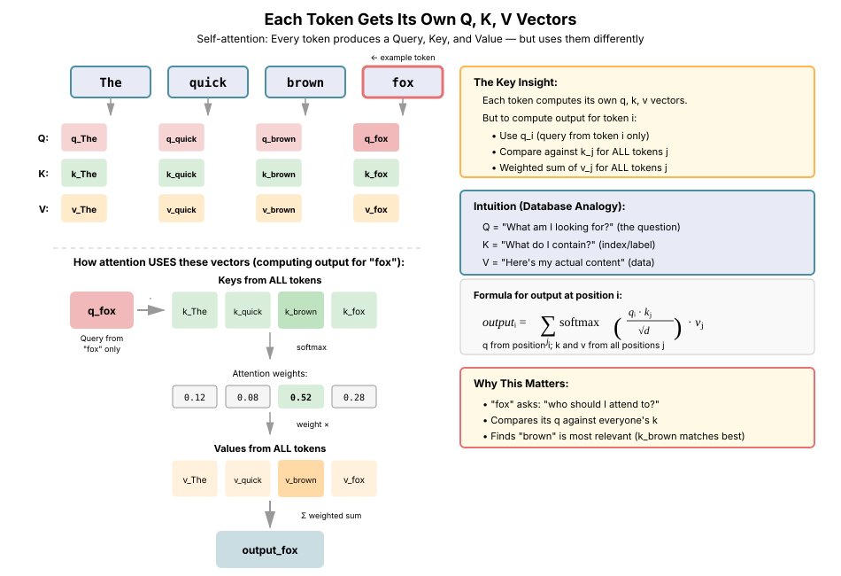
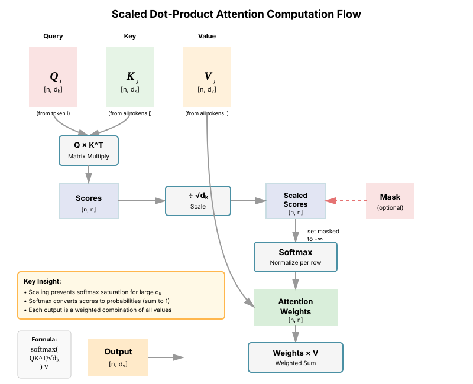
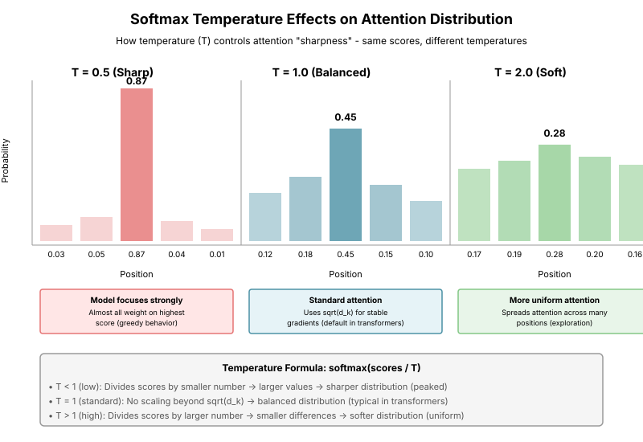
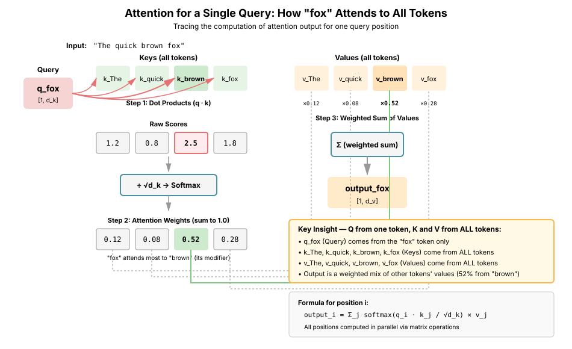
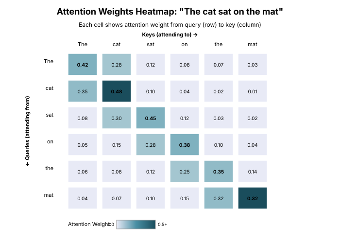

# Chapter 3: Basic Attention

The attention mechanism is the fundamental building block of modern transformer architectures and Large Language Models. This chapter covers the core concepts behind attention, starting from intuition and building up to the scaled dot-product attention used in transformers.

## Table of Contents

1. [Intuition Behind Attention](#intuition-behind-attention)
2. [Attention as Soft Dictionary Lookup](#attention-as-soft-dictionary-lookup)
3. [Dot-Product Attention](#dot-product-attention)
4. [Scaled Dot-Product Attention](#scaled-dot-product-attention)
5. [Attention Weights and Visualization](#attention-weights-and-visualization)
6. [Masking: Padding and Beyond](#masking-padding-and-beyond)
7. [Implementing Attention in PyTorch](#implementing-attention-in-pytorch)
8. [Computational Complexity](#computational-complexity)
9. [Common Pitfalls and Best Practices](#common-pitfalls-and-best-practices)
10. [Summary](#summary)
11. [References](#references)
12. [Exercises](#exercises)

---

## Intuition Behind Attention

### The Problem: Fixed-Length Representations

Before attention, sequence-to-sequence models used fixed-length vector representations. For example, an encoder RNN would process an entire sentence and compress it into a single hidden state vector. This created a bottleneck: all information had to flow through this single vector, regardless of sequence length.

```python
# Old approach: Fixed-length bottleneck
# Encoder RNN compresses entire sequence into single vector h
h = encoder_rnn(input_sequence)  # h has fixed size (e.g., 512)

# Decoder must reconstruct everything from h
output = decoder_rnn(h, target_sequence)

# Problem: Information loss for long sequences!
```

### The Attention Solution: Dynamic Context

Attention allows the model to **dynamically focus on different parts of the input** at each step. Instead of compressing everything into a fixed vector, the model maintains access to all input representations and learns which ones are relevant.

**Key Insight**: When generating each output token, the model should be able to "look back" at the input and decide which parts are most relevant right now.

```python
# With attention: Dynamic, selective focus
for each output position:
    # Compute relevance of each input position
    relevance_scores = attention(query, all_inputs)

    # Weighted combination based on relevance
    context = weighted_sum(all_inputs, relevance_scores)

    # Generate output using this dynamic context
    output = decoder(context)
```

### Real-World Analogy

Think of attention like highlighting text in a document:

- **Query**: "What is the capital of France?"
- **Keys/Values**: Words in a reference book
- **Attention**: Your eyes scanning the text, focusing more on "Paris" and "France" while skimming over irrelevant words

The attention mechanism learns to do this automatically, deciding which parts of the input deserve more "focus" for the current task.

---

## Attention as Soft Dictionary Lookup

A powerful way to understand attention is as a **differentiable, probabilistic dictionary lookup**.

### Traditional Dictionary

```python
# Hard lookup: Exact key match
dictionary = {
    "cat": "a small domesticated carnivore",
    "dog": "a domesticated carnivore of the family Canidae"
}

query = "cat"
result = dictionary[query]  # Returns exact match or KeyError
```

### Attention as Soft Lookup

Attention generalizes this to:

1. **Soft matching**: Instead of exact key matches, compute similarity between query and all keys
2. **Weighted retrieval**: Return a weighted combination of all values, not just one

```python
# Soft lookup: Similarity-based retrieval
keys = ["cat", "dog", "feline", "canine"]
values = [embedding_1, embedding_2, embedding_3, embedding_4]

query = "kitten"  # Not an exact match

# 1. Compute similarity between query and each key
similarities = [similarity(query, k) for k in keys]
# Result: [0.8, 0.1, 0.7, 0.05]  # "cat" and "feline" are most similar

# 2. Convert to probability distribution (softmax)
attention_weights = softmax(similarities)
# Result: [0.42, 0.05, 0.48, 0.05]

# 3. Return weighted combination of values
result = sum(weight * value for weight, value in zip(attention_weights, values))
```

This formulation has several advantages:

- **Differentiable**: Can be trained with backpropagation
- **Flexible**: Handles approximate matches
- **Informative**: Weights tell us what the model is "attending to"

---

## Dot-Product Attention

The most common way to compute similarity in attention is the **dot product**.

In self-attention, the Query (Q), Key (K), and Value (V) vectors are all computed from the same input embeddings through learned linear projections:



### Mathematical Formulation

Given:

- Query vector $\mathbf{q} \in \mathbb{R}^d$ (what we're looking for)
- Key vectors $\mathbf{k}_1, \ldots, \mathbf{k}_n \in \mathbb{R}^d$ (what we're looking in)
- Value vectors $\mathbf{v}_1, \ldots, \mathbf{v}_n \in \mathbb{R}^{d_v}$ (what we retrieve)

**Step 1: Compute attention scores**

```math
\large \text{score}(\mathbf{q}, \mathbf{k}_i) = \mathbf{q}^T \mathbf{k}_i
```

The dot product measures similarity: higher values indicate more similar (aligned) vectors.

**Step 2: Normalize scores to probabilities**

```math
\large \alpha_i = \frac{\exp(\mathbf{q}^T \mathbf{k}_i)}{\sum_{j=1}^n \exp(\mathbf{q}^T \mathbf{k}_j)} = \text{softmax}(\mathbf{q}^T \mathbf{k}_i)
```

**Step 3: Compute weighted sum of values**

```math
\large \text{output} = \sum_{i=1}^n \alpha_i \mathbf{v}_i
```

### Matrix Form

For efficiency, we batch multiple queries together:

```math
\large \text{Attention}(Q, K, V) = \text{softmax}(QK^T)V
```

Where:

- $Q \in \mathbb{R}^{n_q \times d_k}$ (query matrix, $n_q$ queries)
- $K \in \mathbb{R}^{n_k \times d_k}$ (key matrix, $n_k$ keys)
- $V \in \mathbb{R}^{n_k \times d_v}$ (value matrix, $n_k$ values)
- Output $\in \mathbb{R}^{n_q \times d_v}$

### Why Dot Product?

The dot product has several advantages:

1. **Efficient**: Highly optimized on GPUs (matrix multiplication)
2. **Geometric interpretation**: Measures cosine similarity (when normalized)
3. **Simple**: No additional parameters to learn

**Geometric intuition**: $\mathbf{q}^T \mathbf{k} = \|\mathbf{q}\| \|\mathbf{k}\| \cos(\theta)$

Vectors pointing in the same direction (small $\theta$) have high dot product.

### PyTorch Implementation

**Why This Implementation Matters**: While we've covered the theory, a working implementation reveals critical practical considerations: handling batches efficiently, managing optional masks, and maintaining numerical stability. This implementation forms the foundation for all transformer-based models.

**Theoretical Basis**: This code directly implements the mathematical formulation from above. The key design decision is using matrix operations instead of explicit loops, which:

1. Leverages GPU parallelism (critical for performance)
2. Makes the code more readable and closer to the mathematical notation
3. Allows automatic differentiation to work efficiently

**Relation to Alternatives**:

- **Additive attention** (Bahdanau et al., 2014) uses a small feedforward network to compute scores, requiring learnable parameters. Dot-product attention requires no extra parameters and is faster.
- **Multiplicative attention** with a learned weight matrix $W$ computes $\mathbf{q}^T W \mathbf{k}$. Plain dot-product is simpler and works just as well in practice.
- **Cosine similarity** normalizes vectors first. Dot-product implicitly captures both similarity and magnitude.

**Key Insights**:

1. **Broadcasting**: The mask operations use PyTorch's broadcasting, allowing a single mask to apply across batches
2. **Masked fill with -inf**: Setting masked positions to negative infinity ensures they become ~0 after softmax, effectively removing them from the weighted sum
3. **Return attention weights**: Returning weights enables visualization and analysis, helping us understand what the model learns

```python
import torch
import torch.nn.functional as F

def dot_product_attention(
    Q: torch.Tensor,  # [batch, n_queries, d_k]
    K: torch.Tensor,  # [batch, n_keys, d_k]
    V: torch.Tensor,  # [batch, n_keys, d_v]
    mask: torch.Tensor = None  # [batch, n_queries, n_keys]
) -> torch.Tensor:
    """
    Compute dot-product attention.

    Args:
        Q: Query matrix
        K: Key matrix
        V: Value matrix
        mask: Optional mask (1 = keep, 0 = mask out)

    Returns:
        Attention output [batch, n_queries, d_v]
    """
    # Step 1: Compute attention scores (Q @ K^T)
    # Shape: [batch, n_queries, n_keys]
    scores = torch.matmul(Q, K.transpose(-2, -1))

    # Step 2: Apply mask (optional)
    if mask is not None:
        # Set masked positions to large negative value
        # so they become ~0 after softmax
        scores = scores.masked_fill(mask == 0, float('-inf'))

    # Step 3: Normalize to probabilities
    # Shape: [batch, n_queries, n_keys]
    attention_weights = F.softmax(scores, dim=-1)

    # Step 4: Weighted sum of values
    # Shape: [batch, n_queries, d_v]
    output = torch.matmul(attention_weights, V)

    return output, attention_weights


# Example usage
def attention_example():
    """Simple attention example."""
    batch_size = 2
    n_queries = 3
    n_keys = 5
    d_k = 64  # Key/query dimension
    d_v = 64  # Value dimension

    # Random queries, keys, values
    Q = torch.randn(batch_size, n_queries, d_k)
    K = torch.randn(batch_size, n_keys, d_k)
    V = torch.randn(batch_size, n_keys, d_v)

    # Compute attention
    output, weights = dot_product_attention(Q, K, V)

    print(f"Q shape: {Q.shape}")
    print(f"K shape: {K.shape}")
    print(f"V shape: {V.shape}")
    print(f"Output shape: {output.shape}")  # [2, 3, 64]
    print(f"Attention weights shape: {weights.shape}")  # [2, 3, 5]
    print(f"Weights sum to 1: {weights[0, 0].sum():.4f}")

    return output, weights
```

---

## Scaled Dot-Product Attention

The version of attention used in transformers includes an important modification: **scaling by $\sqrt{d_k}$**.



### The Variance Problem

When the dimension $d_k$ is large, the dot products grow large in magnitude. This pushes the softmax into regions with extremely small gradients, slowing down learning.

**Analysis**: If $\mathbf{q}$ and $\mathbf{k}$ have independent components with mean 0 and variance 1:

```math
\large \mathbb{E}[\mathbf{q}^T \mathbf{k}] = 0
```

```math
\large \text{Var}(\mathbf{q}^T \mathbf{k}) = \text{Var}\left(\sum_{i=1}^{d_k} q_i k_i\right) = d_k
```

As $d_k$ increases, the variance of the dot product increases linearly. Large values saturate the softmax.

### The Solution: Scaling

To counteract this, we scale by $\sqrt{d_k}$:

```math
\large \text{Attention}(Q, K, V) = \text{softmax}\left(\frac{QK^T}{\sqrt{d_k}}\right)V
```

This ensures the variance of $\frac{\mathbf{q}^T \mathbf{k}}{\sqrt{d_k}}$ is approximately 1, regardless of $d_k$:

```math
\large \text{Var}\left(\frac{\mathbf{q}^T \mathbf{k}}{\sqrt{d_k}}\right) = \frac{\text{Var}(\mathbf{q}^T \mathbf{k})}{d_k} = \frac{d_k}{d_k} = 1
```

### Empirical Comparison

**Problem Being Solved**: The scaling factor's importance isn't immediately obvious from theory alone. This empirical demonstration shows the dramatic difference in attention distributions with and without scaling, making the abstract variance argument concrete.

**Theoretical Justification**: As $d_k$ grows, unscaled dot products have standard deviation $\sqrt{d_k}$, pushing them into the "tails" of the softmax where the gradient is near zero. This experiment directly measures the resulting attention concentration (saturation).

**Relation to Alternatives**:

- **Learnable temperature**: Some models make temperature a learned parameter. This adds flexibility but requires careful initialization.
- **Fixed normalization**: Alternatives like L2 normalization of queries/keys can also control magnitude, but scaling is simpler and equally effective.

**Key Insight**: The maximum attention weight is the critical metric. When it approaches 1.0 (as with large $d_k$ unscaled), the model essentially performs hard selection rather than soft weighting, limiting its ability to combine information from multiple positions.

```python
import torch
import matplotlib.pyplot as plt

def compare_scaling():
    """Demonstrate the effect of scaling on softmax."""
    d_k_values = [16, 64, 256, 1024]

    fig, axes = plt.subplots(1, 2, figsize=(12, 4))

    for d_k in d_k_values:
        # Random query and keys
        q = torch.randn(d_k)
        K = torch.randn(10, d_k)

        # Unscaled dot products
        scores_unscaled = K @ q
        attn_unscaled = torch.softmax(scores_unscaled, dim=0)

        # Scaled dot products
        scores_scaled = (K @ q) / (d_k ** 0.5)
        attn_scaled = torch.softmax(scores_scaled, dim=0)

        # Plot
        axes[0].plot(attn_unscaled.numpy(), label=f'd_k={d_k}')
        axes[1].plot(attn_scaled.numpy(), label=f'd_k={d_k}')

    axes[0].set_title('Unscaled Attention')
    axes[0].set_ylabel('Attention Weight')
    axes[0].legend()

    axes[1].set_title('Scaled Attention')
    axes[1].set_ylabel('Attention Weight')
    axes[1].legend()

    plt.tight_layout()
    plt.savefig('attention_scaling.png', dpi=150, bbox_inches='tight')
    print("Saved attention_scaling.png")

    # Print max attention weights to show saturation
    print("\nMax attention weight (shows saturation):")
    for d_k in d_k_values:
        q = torch.randn(d_k)
        K = torch.randn(10, d_k)

        scores_unscaled = K @ q
        attn_unscaled = torch.softmax(scores_unscaled, dim=0)

        scores_scaled = (K @ q) / (d_k ** 0.5)
        attn_scaled = torch.softmax(scores_scaled, dim=0)

        print(f"d_k={d_k:4d}: Unscaled max={attn_unscaled.max():.4f}, "
              f"Scaled max={attn_scaled.max():.4f}")
```

**Expected output**:

```text
Max attention weight (shows saturation):
d_k=  16: Unscaled max=0.2891, Scaled max=0.2456
d_k=  64: Unscaled max=0.6723, Scaled max=0.2198
d_k= 256: Unscaled max=0.9821, Scaled max=0.2534
d_k=1024: Unscaled max=0.9998, Scaled max=0.2387
```

Notice how unscaled attention becomes increasingly "sharp" (one weight close to 1) as $d_k$ grows, while scaled attention remains balanced.

### Attention Temperature (Optional)

While $\sqrt{d_k}$ is the standard scaling factor, attention can be controlled more generally with a **temperature parameter** $T$:

```math
\large \text{Attention}(Q, K, V) = \text{softmax}\left(\frac{QK^T}{T}\right)V
```



The temperature controls the "sharpness" of the attention distribution:

- **$T \lt 1$**: "Sharper" attention (more peaked distribution)
  - Model focuses more strongly on highest-scoring positions
  - Useful for controllable generation (greedy behavior)

- **$T \gt 1$**: "Softer" attention (more uniform distribution)
  - Model distributes attention more evenly
  - Useful for exploration or sampling diverse outputs

- **$T = \sqrt{d_k}$**: Standard scaled attention (recommended default)
  - Balances sharpness with stable gradients

**Note**: Temperature is primarily used in controllable text generation and sampling strategies, not in standard transformer training. During training, $T = \sqrt{d_k}$ is the conventional choice.

```python
def attention_with_temperature(
    Q: torch.Tensor,
    K: torch.Tensor,
    V: torch.Tensor,
    temperature: float = 1.0,
    mask: torch.Tensor = None
) -> tuple[torch.Tensor, torch.Tensor]:
    """
    Attention with configurable temperature.

    Args:
        Q, K, V: Query, key, value matrices
        temperature: Temperature parameter (default: 1.0)
        mask: Optional attention mask

    Returns:
        output, attention_weights
    """
    d_k = Q.size(-1)

    # Score with temperature (note: standard scaling would use sqrt(d_k))
    scores = torch.matmul(Q, K.transpose(-2, -1)) / temperature

    if mask is not None:
        scores = scores.masked_fill(mask == 0, float('-inf'))

    attention_weights = F.softmax(scores, dim=-1)
    output = torch.matmul(attention_weights, V)

    return output, attention_weights


# Demonstration
def demonstrate_temperature():
    """Show effect of different temperatures on attention distribution."""
    torch.manual_seed(42)
    Q = torch.randn(1, 1, 64)  # Single query
    K = torch.randn(1, 5, 64)  # 5 keys
    V = torch.randn(1, 5, 64)

    temperatures = [0.5, 1.0, 2.0]

    print("Attention weights for different temperatures:")
    for T in temperatures:
        _, weights = attention_with_temperature(Q, K, V, temperature=T)
        print(f"T={T}: {weights[0, 0].detach().numpy()}")

    # Expected output shows increasing uniformity as T increases:
    # T=0.5: [0.03, 0.01, 0.91, 0.04, 0.01]  # Sharp
    # T=1.0: [0.10, 0.08, 0.52, 0.18, 0.12]  # Balanced
    # T=2.0: [0.17, 0.15, 0.30, 0.21, 0.17]  # Soft
```

### PyTorch Implementation

**Why This Implementation Is Critical**: This is the exact attention mechanism used in the original Transformer paper and virtually all modern LLMs (GPT, BERT, LLaMA, etc.). Understanding this implementation means understanding the core computational primitive of modern AI.

**Theoretical Foundation**: The implementation adds two crucial elements to basic dot-product attention:

1. **Scaling by $\sqrt{d_k}$**: Maintains stable gradient flow as discussed above
2. **Dropout on attention weights**: Provides regularization by randomly zeroing out some attention connections during training, preventing overfitting to specific attention patterns

**Comparison to Alternatives**:

- **Pre-norm vs post-norm**: This shows the core attention; layer normalization placement varies (we'll see this in full transformer layers)
- **Flash Attention**: Computes the exact same result but with better memory access patterns (Chapter 26)
- **Relative positional bias**: Some variants (like T5) add learned biases to attention scores before softmax

**Key Implementation Insights**:

1. **Dropout on weights, not output**: Applying dropout to attention weights (not the final output) is more effective because it forces the model to not rely on single attention connections
2. **Training mode matters**: We only apply dropout during training (`if dropout_p \gt 0.0`), not inference
3. **Modularity**: Returning both output and weights separates computation from visualization/analysis

```python
import torch
import torch.nn.functional as F
import math

def scaled_dot_product_attention(
    Q: torch.Tensor,  # [batch, n_queries, d_k]
    K: torch.Tensor,  # [batch, n_keys, d_k]
    V: torch.Tensor,  # [batch, n_keys, d_v]
    mask: torch.Tensor = None,  # [batch, n_queries, n_keys]
    dropout_p: float = 0.0
) -> tuple[torch.Tensor, torch.Tensor]:
    """
    Scaled dot-product attention (from "Attention Is All You Need").

    This is the fundamental attention mechanism used in transformers.

    Args:
        Q: Query matrix [batch, n_queries, d_k]
        K: Key matrix [batch, n_keys, d_k]
        V: Value matrix [batch, n_keys, d_v]
        mask: Optional attention mask [batch, n_queries, n_keys]
        dropout_p: Dropout probability for attention weights

    Returns:
        output: Attention output [batch, n_queries, d_v]
        attention_weights: Attention weights [batch, n_queries, n_keys]
    """
    d_k = Q.size(-1)

    # Compute attention scores and scale
    # Shape: [batch, n_queries, n_keys]
    scores = torch.matmul(Q, K.transpose(-2, -1)) / math.sqrt(d_k)

    # Apply mask (if provided)
    if mask is not None:
        scores = scores.masked_fill(mask == 0, float('-inf'))

    # Compute attention weights (normalize)
    attention_weights = F.softmax(scores, dim=-1)

    # Apply dropout (for regularization during training)
    if dropout_p \gt 0.0:
        attention_weights = F.dropout(attention_weights, p=dropout_p)

    # Weighted sum of values
    output = torch.matmul(attention_weights, V)

    return output, attention_weights


class ScaledDotProductAttention(torch.nn.Module):
    """
    Scaled dot-product attention as a PyTorch module.

    This is a reusable module you can use in larger architectures.
    """

    def __init__(self, dropout: float = 0.1):
        super().__init__()
        self.dropout = dropout

    def forward(
        self,
        Q: torch.Tensor,
        K: torch.Tensor,
        V: torch.Tensor,
        mask: torch.Tensor = None
    ) -> tuple[torch.Tensor, torch.Tensor]:
        """
        Forward pass.

        Args:
            Q: Queries [batch, n_queries, d_k]
            K: Keys [batch, n_keys, d_k]
            V: Values [batch, n_keys, d_v]
            mask: Optional mask [batch, n_queries, n_keys]

        Returns:
            output, attention_weights
        """
        d_k = Q.size(-1)

        # Scaled scores
        scores = torch.matmul(Q, K.transpose(-2, -1)) / math.sqrt(d_k)

        if mask is not None:
            scores = scores.masked_fill(mask == 0, float('-inf'))

        # Attention weights
        attn = F.softmax(scores, dim=-1)

        if self.training and self.dropout \gt 0:
            attn = F.dropout(attn, p=self.dropout)

        # Output
        output = torch.matmul(attn, V)

        return output, attn
```

---

## Attention Weights and Visualization

Attention weights provide valuable insights into what the model is "looking at." Visualizing them helps with:

- Debugging model behavior
- Building intuition
- Interpreting model decisions

The following diagram traces how a single query position ("fox") computes its attention output by attending to all keys:





### Extracting and Visualizing Attention

**Why Visualization Matters**: Attention weights are one of the few directly interpretable components of neural networks. Unlike hidden activations, they have a clear semantic meaning: "how much does position A attend to position B?" This makes them invaluable for debugging, building intuition, and (with caveats) explaining model behavior.

**Theoretical Justification**: Since attention weights are probabilities (sum to 1, all non-negative), they can be visualized as heatmaps where intensity directly represents the strength of the relationship between positions. This probabilistic interpretation is what makes the visualization meaningful.

**Relation to Other Visualization Techniques**:

- **Gradient-based methods** (like saliency maps) show what input changes affect outputs but are noisy and hard to interpret
- **Activation maximization** shows what inputs activate neurons but doesn't explain token relationships
- **Attention visualization** directly shows learned relationships between positions without requiring additional computation

**Key Insights**:

1. **Detaching from computation graph**: We use `.detach()` to avoid keeping gradients in memory - visualization is analysis, not training
2. **Multiple granularities**: Can visualize single examples (detailed patterns) or aggregate across many examples (general trends)
3. **Interpretability caveat**: High attention doesn't always mean causal importance (see Jain & Wallace, 2019), but it's still useful for understanding patterns

```python
import torch
import matplotlib.pyplot as plt
import seaborn as sns

def visualize_attention(
    attention_weights: torch.Tensor,
    query_labels: list[str] = None,
    key_labels: list[str] = None,
    title: str = "Attention Weights"
):
    """
    Visualize attention weights as a heatmap.

    Args:
        attention_weights: [n_queries, n_keys] attention matrix
        query_labels: Labels for query dimension (y-axis)
        key_labels: Labels for key dimension (x-axis)
        title: Plot title
    """
    # Convert to numpy
    weights = attention_weights.detach().cpu().numpy()

    # Create figure
    plt.figure(figsize=(10, 8))

    # Plot heatmap
    sns.heatmap(
        weights,
        xticklabels=key_labels if key_labels else range(weights.shape[1]),
        yticklabels=query_labels if query_labels else range(weights.shape[0]),
        cmap='viridis',
        cbar_kws={'label': 'Attention Weight'},
        fmt='.2f',
        linewidths=0.5
    )

    plt.title(title)
    plt.xlabel('Keys (attending to)')
    plt.ylabel('Queries (attending from)')
    plt.tight_layout()
    plt.savefig('attention_heatmap.png', dpi=150, bbox_inches='tight')
    print("Saved attention_heatmap.png")


def attention_example_with_words():
    """
    Example: Attention over word embeddings.

    This demonstrates attention in a more concrete setting.
    """
    # Simulated scenario: Translating "The cat sat on the mat"
    source_words = ["The", "cat", "sat", "on", "the", "mat"]
    target_words = ["Le", "chat"]  # "The cat" in French (partial)

    n_source = len(source_words)
    n_target = len(target_words)
    d_model = 64

    # Simulate embeddings (in practice, these come from an embedding layer)
    torch.manual_seed(42)
    source_embeddings = torch.randn(1, n_source, d_model)
    target_embeddings = torch.randn(1, n_target, d_model)

    # In encoder-decoder attention:
    # Q comes from decoder (target), K and V from encoder (source)
    Q = target_embeddings
    K = source_embeddings
    V = source_embeddings

    # Compute attention
    output, attention_weights = scaled_dot_product_attention(Q, K, V)

    print("Attention output shape:", output.shape)  # [1, 2, 64]
    print("\nAttention weights:")
    print(attention_weights[0])  # [2, 6]

    # Visualize
    visualize_attention(
        attention_weights[0],
        query_labels=target_words,
        key_labels=source_words,
        title="Cross-Attention: French -> English"
    )

    # Analyze: Which source words does each target word attend to?
    print("\nAttention analysis:")
    for i, target_word in enumerate(target_words):
        weights = attention_weights[0, i]
        top_k = 3
        top_indices = weights.argsort(descending=True)[:top_k]

        print(f"\n'{target_word}' attends most to:")
        for idx in top_indices:
            print(f"  '{source_words[idx]}': {weights[idx]:.3f}")


def attention_patterns():
    """
    Demonstrate different attention patterns.
    """
    seq_len = 8
    d_k = 64

    patterns = {}

    # 1. Uniform attention (all positions equally)
    Q = torch.zeros(1, seq_len, d_k)
    K = torch.zeros(1, seq_len, d_k)
    V = torch.randn(1, seq_len, d_k)
    _, attn = scaled_dot_product_attention(Q, K, V)
    patterns['Uniform'] = attn[0]

    # 2. Focused attention (one position)
    Q = torch.randn(1, seq_len, d_k)
    K = torch.randn(1, seq_len, d_k)
    # Make one key very similar to all queries
    K[:, :, 3] = Q[:, :, 0] * 10  # Position 3 matches strongly
    V = torch.randn(1, seq_len, d_k)
    _, attn = scaled_dot_product_attention(Q, K, V)
    patterns['Focused'] = attn[0]

    # 3. Local attention (nearby positions)
    Q = torch.randn(1, seq_len, d_k)
    K = torch.randn(1, seq_len, d_k)
    # Make keys similar to nearby queries
    for i in range(seq_len):
        for j in range(max(0, i-1), min(seq_len, i+2)):
            K[:, j] = K[:, j] + Q[:, i] * 2
    V = torch.randn(1, seq_len, d_k)
    _, attn = scaled_dot_product_attention(Q, K, V)
    patterns['Local'] = attn[0]

    # Visualize all patterns
    fig, axes = plt.subplots(1, 3, figsize=(15, 4))
    for ax, (name, pattern) in zip(axes, patterns.items()):
        im = ax.imshow(pattern.detach().numpy(), cmap='viridis', aspect='auto')
        ax.set_title(f'{name} Attention')
        ax.set_xlabel('Key Position')
        ax.set_ylabel('Query Position')
        plt.colorbar(im, ax=ax)

    plt.tight_layout()
    plt.savefig('attention_patterns.png', dpi=150, bbox_inches='tight')
    print("Saved attention_patterns.png")
```

### Interpreting Attention Weights

**Important caveat**: Attention weights show what the model *attends to*, but this doesn't always mean those positions *caused* the prediction. See Jain & Wallace (2019) and Wiegreffe & Pinter (2019) for discussion of attention as explanation.

That said, attention weights are useful for:

1. **Debugging**: Spotting anomalies (e.g., attending to padding tokens)
2. **Intuition**: Understanding general patterns (e.g., "models attend to previous token in language modeling")
3. **Feature analysis**: Identifying which heads specialize in different patterns

---

## Masking: Padding and Beyond

Attention masks serve multiple purposes beyond just handling variable-length sequences.

### Padding Masks

The masks we've seen so far are **padding masks**: they prevent the model from attending to padding tokens in variable-length batches.

**Problem Being Solved**: In real applications, sequences in a batch have different lengths (e.g., sentences of varying word counts). GPUs require rectangular tensors, so we pad shorter sequences. Without masking, the model would attend to meaningless padding tokens, degrading performance and wasting computation.

**Theoretical Justification**: Padding tokens carry no semantic information. If attention weights include padding positions, the model:

1. Dilutes meaningful attention by distributing weight to padding
2. Learns spurious patterns based on padding position rather than content
3. Produces different outputs for the same content with different padding

Masking ensures the model behaves as if padding doesn't exist.

**Comparison to Alternatives**:

- **No padding** (process sequences individually): Eliminates batching, massively reducing GPU utilization
- **Packed sequences**: More complex data structure; harder to implement and debug
- **Masking**: Simple, efficient, and standard across all modern implementations

**Key Insight**: We set masked positions to `-inf` before softmax. After softmax, $e^{-\infty} = 0$, so these positions contribute zero to the weighted sum. This is mathematically elegant and numerically stable.

```python
def create_padding_mask(seq_len: torch.Tensor, max_len: int) -> torch.Tensor:
    """
    Create padding mask for batch of sequences.

    Args:
        seq_len: [batch] actual length of each sequence
        max_len: Maximum sequence length

    Returns:
        mask: [batch, max_len, max_len] where 1 = valid, 0 = padding
    """
    batch_size = seq_len.size(0)

    # Create mask: [batch, max_len]
    mask = torch.arange(max_len, device=seq_len.device)[None, :] \lt seq_len[:, None]

    # Expand for attention: [batch, max_len, max_len]
    # Each query position can attend to all valid key positions
    mask = mask[:, None, :].expand(batch_size, max_len, max_len)

    return mask


# Example
seq_lengths = torch.tensor([3, 5, 2])  # Batch of 3 sequences
max_len = 5
padding_mask = create_padding_mask(seq_lengths, max_len)

print("Padding mask for sequence of length 3:")
print(padding_mask[0])
# Output:
# [[1, 1, 1, 0, 0],  # Query 0 can attend to keys 0,1,2 (not 3,4)
#  [1, 1, 1, 0, 0],  # Query 1 can attend to keys 0,1,2
#  [1, 1, 1, 0, 0],  # Query 2 can attend to keys 0,1,2
#  [1, 1, 1, 0, 0],  # (padding positions, but shown for completeness)
#  [1, 1, 1, 0, 0]]
```

### Causal Masking (Preview)

Beyond padding, masking is also used for **causal (autoregressive) attention**, where each position can only attend to itself and previous positions, never future positions.

**Problem Being Solved**: In autoregressive language modeling (predicting the next token), we need to prevent the model from "cheating" by looking at future tokens during training. Without causal masking, the model could trivially copy the next token from the input.

**Theoretical Justification**: During training, we have the full sequence available, but at inference time, we generate one token at a time. Causal masking ensures:

1. **Training-inference consistency**: The model sees the same information during training as it will at inference
2. **Proper conditional probabilities**: We model $P(x_t | x_1, ..., x_{t-1})$, not $P(x_t | x_1, ..., x_n)$
3. **Efficient parallel training**: We can train on all positions simultaneously while maintaining the autoregressive property

**Comparison to Architectures**:

- **Bidirectional (BERT-style)**: No causal mask, used for understanding tasks where full context is available
- **Causal (GPT-style)**: Causal mask, used for generation tasks
- **Prefix-LM**: Bidirectional on prefix (e.g., prompt), causal on suffix (generation)

**Key Insight**: The lower triangular structure means position $i$ can attend to positions $0$ through $i$ but not $i+1$ through $n$. This creates a "flow" of information from left to right, matching the temporal ordering of language.

```python
def create_causal_mask(seq_len: int) -> torch.Tensor:
    """
    Create causal mask for autoregressive attention.

    Args:
        seq_len: Sequence length

    Returns:
        mask: [seq_len, seq_len] lower triangular matrix
              1 = can attend, 0 = cannot attend (future)
    """
    # Lower triangular matrix (including diagonal)
    mask = torch.tril(torch.ones(seq_len, seq_len))
    return mask


# Example
causal_mask = create_causal_mask(5)
print("Causal mask (each position cannot see the future):")
print(causal_mask)
# Output:
# [[1, 0, 0, 0, 0],  # Position 0 can only attend to itself
#  [1, 1, 0, 0, 0],  # Position 1 can attend to 0, 1
#  [1, 1, 1, 0, 0],  # Position 2 can attend to 0, 1, 2
#  [1, 1, 1, 1, 0],  # Position 3 can attend to 0, 1, 2, 3
#  [1, 1, 1, 1, 1]]  # Position 4 can attend to all previous
```

**Why causal masking?** In language modeling and decoder-only architectures (like GPT), we want to predict the next token based only on previous context. Allowing attention to future tokens would be "cheating" - the model would see the answer during training.

**Key differences:**

- **Bidirectional attention** (no causal mask): Used in encoders like BERT for understanding tasks
- **Causal attention** (with causal mask): Used in decoders like GPT for generation tasks

This is covered in depth in [Chapter 5: Bidirectional vs Causal Attention](05-bidirectional-causal-attention.md).

```python
def attention_with_causal_mask_example():
    """Demonstrate causal attention in action."""
    seq_len = 5
    d_k = 64

    Q = torch.randn(1, seq_len, d_k)
    K = torch.randn(1, seq_len, d_k)
    V = torch.randn(1, seq_len, d_k)

    # Create causal mask
    causal_mask = create_causal_mask(seq_len)[None, :, :]  # Add batch dim

    # Apply attention with causal mask
    output, attn_weights = scaled_dot_product_attention(Q, K, V, mask=causal_mask)

    print("Causal attention weights (note the triangular pattern):")
    print(attn_weights[0])
    # Each row sums to 1, but only attending to current and past positions
    # Future positions (upper triangle) have ~0 weight

    # Verify no attention to future
    for i in range(seq_len):
        future_attention = attn_weights[0, i, i+1:].sum()
        print(f"Position {i} attention to future: {future_attention:.6f}")
        # Should be ~0 for all positions
```

**Combining Masks**: In practice, you may need both padding and causal masks. These can be combined with element-wise AND:

```python
def combine_masks(padding_mask: torch.Tensor, causal_mask: torch.Tensor) -> torch.Tensor:
    """Combine padding and causal masks."""
    # Both masks must be 1 (valid AND not future)
    return padding_mask & causal_mask
```

---

## Implementing Attention in PyTorch

### Complete Attention Layer

Here's a complete, production-ready attention layer:

**Problem Being Solved**: In practice, we rarely use attention with raw embeddings directly as Q, K, V. Instead, we need learned **projections** that transform the input into query, key, and value spaces. This allows the model to learn what to search for (queries), what to match against (keys), and what to retrieve (values).

**Theoretical Justification**: Learned linear projections serve several purposes:

1. **Representation learning**: The model learns task-specific transformations of the input for different roles (Q vs K vs V)
2. **Dimension control**: Can project to lower dimensions (e.g., $d_{model} = 512 \to d_k = 64$) to save computation
3. **Expressiveness**: Without projections, the model can only attend based on raw embedding similarity; with projections, it learns what aspects to compare
4. **Multi-head preparation**: These projections enable multi-head attention (next chapter) by creating different subspaces

**Relation to Alternatives**:

- **No projections**: Would mean Q = K = V = input. This is theoretically possible but severely limits what patterns the attention can learn
- **Non-linear projections**: Could use MLPs instead of linear layers, but this adds complexity without much benefit in practice
- **Shared projections**: Could share weights between Q/K/V, but separate projections are more expressive

**Key Design Decisions**:

1. **Separate $W_q$, $W_k$, $W_v$**: Different projections for different roles is critical for expressiveness
2. **Output projection $W_o$**: Maps back to d_model, enabling residual connections and stacking
3. **Xavier initialization**: Keeps activation magnitudes stable across layers
4. **No bias terms**: Standard in transformers; biases don't significantly help and add parameters

```python
import torch
import torch.nn as nn
import torch.nn.functional as F
import math

class Attention(nn.Module):
    """
    Single-head attention layer with learned query, key, value projections.

    This is the basic building block that will be extended to multi-head
    attention in the next chapter.
    """

    def __init__(
        self,
        d_model: int,
        d_k: int = None,
        d_v: int = None,
        dropout: float = 0.1
    ):
        """
        Args:
            d_model: Model dimension (input/output dimension)
            d_k: Key/query dimension (default: d_model)
            d_v: Value dimension (default: d_model)
            dropout: Dropout probability for attention weights
        """
        super().__init__()

        self.d_model = d_model
        self.d_k = d_k or d_model
        self.d_v = d_v or d_model

        # Learned projections
        self.W_q = nn.Linear(d_model, self.d_k, bias=False)
        self.W_k = nn.Linear(d_model, self.d_k, bias=False)
        self.W_v = nn.Linear(d_model, self.d_v, bias=False)

        # Output projection (back to d_model)
        self.W_o = nn.Linear(self.d_v, d_model, bias=False)

        self.dropout = nn.Dropout(dropout)

        self._reset_parameters()

    def _reset_parameters(self):
        """Initialize parameters using Xavier uniform initialization."""
        for module in [self.W_q, self.W_k, self.W_v, self.W_o]:
            nn.init.xavier_uniform_(module.weight)

    def forward(
        self,
        query: torch.Tensor,
        key: torch.Tensor,
        value: torch.Tensor,
        mask: torch.Tensor = None
    ) -> tuple[torch.Tensor, torch.Tensor]:
        """
        Forward pass.

        Args:
            query: [batch, n_queries, d_model]
            key: [batch, n_keys, d_model]
            value: [batch, n_keys, d_model]
            mask: [batch, n_queries, n_keys] or broadcastable

        Returns:
            output: [batch, n_queries, d_model]
            attention_weights: [batch, n_queries, n_keys]
        """
        # Linear projections
        Q = self.W_q(query)  # [batch, n_queries, d_k]
        K = self.W_k(key)    # [batch, n_keys, d_k]
        V = self.W_v(value)  # [batch, n_keys, d_v]

        # Scaled dot-product attention
        scores = torch.matmul(Q, K.transpose(-2, -1)) / math.sqrt(self.d_k)

        if mask is not None:
            scores = scores.masked_fill(mask == 0, float('-inf'))

        attention_weights = F.softmax(scores, dim=-1)
        attention_weights = self.dropout(attention_weights)

        # Weighted sum of values
        context = torch.matmul(attention_weights, V)

        # Project back to d_model
        output = self.W_o(context)

        return output, attention_weights


class SelfAttention(nn.Module):
    """
    Self-attention layer where Q, K, V all come from the same input.

    This is used in transformer encoder layers.
    """

    def __init__(self, d_model: int, dropout: float = 0.1):
        super().__init__()
        self.attention = Attention(d_model, dropout=dropout)

    def forward(
        self,
        x: torch.Tensor,
        mask: torch.Tensor = None
    ) -> tuple[torch.Tensor, torch.Tensor]:
        """
        Args:
            x: [batch, seq_len, d_model]
            mask: [batch, seq_len, seq_len]

        Returns:
            output, attention_weights
        """
        # Self-attention: Q = K = V = x
        return self.attention(x, x, x, mask)


def test_attention():
    """Test attention implementation."""
    batch_size = 2
    seq_len = 10
    d_model = 512

    # Create attention layer
    attn = Attention(d_model, d_k=64, d_v=64, dropout=0.1)

    # Random input
    x = torch.randn(batch_size, seq_len, d_model)

    # Self-attention
    output, weights = attn(x, x, x)

    print(f"Input shape: {x.shape}")
    print(f"Output shape: {output.shape}")
    print(f"Attention weights shape: {weights.shape}")

    # Check attention weights sum to 1
    assert torch.allclose(weights.sum(dim=-1), torch.ones(batch_size, seq_len))
    print("✓ Attention weights sum to 1")

    # Check output dimension
    assert output.shape == x.shape
    print("✓ Output shape matches input shape")

    print("\nTest passed!")

    return attn, output, weights


if __name__ == "__main__":
    test_attention()
```

### Using Embeddings from Previous Chapter

Attention typically operates on embeddings from [Chapter 2: Embeddings](02-embeddings.md):

**Why This Connection Matters**: This example bridges two fundamental chapters, showing how discrete tokens (Chapter 1-2) flow through continuous attention mechanisms (Chapter 3). This is the beginning of the transformer pipeline: tokens → embeddings → attention → representations.

**Theoretical Flow**:

1. **Tokens to embeddings**: Maps discrete token IDs to continuous vectors that capture semantic meaning
2. **Positional information**: Adds position encodings so attention knows about order (critical since attention itself is permutation-equivariant)
3. **Attention mixing**: Allows each position to gather information from all others based on learned relevance
4. **Contextualized representations**: Output combines the token's own embedding with information from the entire sequence

**Architectural Perspective**: This is essentially a single transformer encoder layer minus the feedforward network and layer normalization. It shows the core computation: embedding + position + self-attention.

**Key Insight**: Without positional embeddings, attention would be purely content-based (permutation-equivariant). Adding positions makes it sensitive to order, which is essential for language where "dog bites man" ≠ "man bites dog."

```python
import torch
import torch.nn as nn

class EmbeddingWithAttention(nn.Module):
    """
    Combines embeddings with self-attention.

    This shows how Chapter 2 (Embeddings) and Chapter 3 (Attention) connect.
    """

    def __init__(
        self,
        vocab_size: int,
        d_model: int,
        max_seq_len: int = 512,
        dropout: float = 0.1
    ):
        super().__init__()

        # From Chapter 2: Token embeddings
        self.token_embedding = nn.Embedding(vocab_size, d_model)

        # From Chapter 2: Positional embeddings (learned)
        self.positional_embedding = nn.Embedding(max_seq_len, d_model)

        # From Chapter 3: Self-attention
        self.attention = SelfAttention(d_model, dropout)

        self.dropout = nn.Dropout(dropout)

    def forward(
        self,
        input_ids: torch.Tensor,
        mask: torch.Tensor = None
    ) -> torch.Tensor:
        """
        Args:
            input_ids: [batch, seq_len] token indices
            mask: [batch, seq_len, seq_len] attention mask

        Returns:
            output: [batch, seq_len, d_model]
        """
        batch_size, seq_len = input_ids.shape

        # Token embeddings
        token_emb = self.token_embedding(input_ids)

        # Positional embeddings
        positions = torch.arange(seq_len, device=input_ids.device)
        pos_emb = self.positional_embedding(positions)

        # Combine embeddings
        embeddings = self.dropout(token_emb + pos_emb)

        # Apply self-attention
        output, attn_weights = self.attention(embeddings, mask)

        return output


# Example usage
def example_with_embeddings():
    """Demonstrate attention with embeddings."""
    vocab_size = 10000
    d_model = 256
    batch_size = 4
    seq_len = 20

    # Create model
    model = EmbeddingWithAttention(vocab_size, d_model)

    # Random input tokens
    input_ids = torch.randint(0, vocab_size, (batch_size, seq_len))

    # Forward pass
    output = model(input_ids)

    print(f"Input shape: {input_ids.shape}")
    print(f"Output shape: {output.shape}")
```

---

## Computational Complexity

Understanding the computational complexity of attention is crucial for scaling to long sequences.

### Time Complexity

For sequence length $n$ and dimension $d$:

1. **$QK^T$ computation**: $O(n^2 d)$
   - $Q \in \mathbb{R}^{n \times d}$, $K^T \in \mathbb{R}^{d \times n}$
   - Result: $n \times n$ matrix
   - Operations: $n^2$ dot products of dimension $d$

2. **Softmax**: $O(n^2)$
   - Applied to $n \times n$ matrix

3. **Attention weights × V**: $O(n^2 d)$
   - Attention weights: $n \times n$, $V$: $n \times d$

**Total: $O(n^2 d)$**

The $n^2$ term dominates for long sequences, making standard attention expensive.

### Memory Complexity

1. **Attention matrix**: $O(n^2)$
   - Must store the $n \times n$ attention weights
   - This is the main bottleneck for long sequences

2. **Intermediate activations**: $O(nd)$
   - $Q$, $K$, $V$ matrices

**Total: $O(n^2 + nd)$**

For long sequences (e.g., $n = 10000$), the $O(n^2)$ memory can be prohibitive.

### Complexity Analysis

**Why Empirical Measurement Matters**: While theoretical complexity tells us attention is $O(n^2 d)$, empirical measurement reveals:

1. **Practical constants**: Big-O notation hides constant factors that can be significant
2. **Hardware effects**: GPU memory bandwidth, cache behavior, and parallelism affect real-world performance
3. **Scaling behavior**: Confirms theory matches practice and helps predict performance at larger scales

**Theoretical Prediction**: For sequence length $n$:

- Time should scale as $n^2$ (quadratic)
- Memory for attention matrix should scale as $n^2$
- The quadratic scaling means doubling sequence length quadruples compute time

**Why This Matters for LLMs**:

- GPT-3 uses 2048 context: ~4 MB per attention head per example
- 100K context (long-context models): ~40 GB per head - barely fits on largest GPUs!
- This quadratic bottleneck is why techniques like Flash Attention (Chapter 26) and sparse attention (Chapter 26) are critical for modern LLMs

**Key Insight**: The attention matrix memory ($n \times n$ floats) is often the limiting factor, not compute time. Even if we could compute it quickly, storing it for backpropagation becomes prohibitive for long sequences.

```python
import torch
import time
import matplotlib.pyplot as plt

def measure_attention_complexity():
    """Empirically measure attention complexity."""
    d_model = 512
    sequence_lengths = [128, 256, 512, 1024, 2048]
    times = []
    memory = []

    device = 'cuda' if torch.cuda.is_available() else 'cpu'

    for n in sequence_lengths:
        # Create inputs
        Q = torch.randn(1, n, d_model, device=device)
        K = torch.randn(1, n, d_model, device=device)
        V = torch.randn(1, n, d_model, device=device)

        # Warm up
        for _ in range(3):
            _ = scaled_dot_product_attention(Q, K, V)

        # Measure time
        if device == 'cuda':
            torch.cuda.synchronize()

        start = time.time()
        for _ in range(10):
            output, _ = scaled_dot_product_attention(Q, K, V)

        if device == 'cuda':
            torch.cuda.synchronize()

        elapsed = (time.time() - start) / 10
        times.append(elapsed)

        # Measure memory (attention matrix)
        attn_memory = n * n * 4 / (1024 ** 2)  # MB (float32)
        memory.append(attn_memory)

        print(f"n={n:4d}: {elapsed*1000:.2f}ms, "
              f"attention matrix: {attn_memory:.2f} MB")

    # Plot
    fig, axes = plt.subplots(1, 2, figsize=(12, 4))

    # Time complexity
    axes[0].plot(sequence_lengths, times, 'o-', label='Measured')
    # Theoretical O(n²)
    theoretical = [t * (n/sequence_lengths[0])**2 for n, t in
                   zip(sequence_lengths, [times[0]]*len(times))]
    axes[0].plot(sequence_lengths, theoretical, '--', label='O(n²) theoretical')
    axes[0].set_xlabel('Sequence Length')
    axes[0].set_ylabel('Time (s)')
    axes[0].set_title('Attention Time Complexity')
    axes[0].legend()
    axes[0].grid(True)

    # Memory complexity
    axes[1].plot(sequence_lengths, memory, 'o-')
    axes[1].set_xlabel('Sequence Length')
    axes[1].set_ylabel('Memory (MB)')
    axes[1].set_title('Attention Matrix Memory')
    axes[1].grid(True)

    plt.tight_layout()
    plt.savefig('attention_complexity.png', dpi=150, bbox_inches='tight')
    print("\nSaved attention_complexity.png")


# Expected output (approximate):
# n= 128:  1.23ms, attention matrix: 0.06 MB
# n= 256:  4.87ms, attention matrix: 0.25 MB
# n= 512: 19.43ms, attention matrix: 1.00 MB
# n=1024: 77.68ms, attention matrix: 4.00 MB
# n=2048: 310.72ms, attention matrix: 16.00 MB
```

### Implications for Long Sequences

The $O(n^2)$ complexity limits vanilla attention:

- **n = 512**: Manageable (1 MB)
- **n = 2048**: Borderline (16 MB per head)
- **n = 100,000**: Infeasible (40 GB per head!)

Solutions (covered in later chapters):

- [Flash Attention](13-flash-attention.md): Same complexity but 2-4x faster via better memory access
- [Efficient Attention](14-efficient-attention.md): Linear or sparse attention variants
- [Long Context Techniques](23-long-context.md): Specialized methods for ultra-long contexts

---

## Common Pitfalls and Best Practices

### 1. Forgetting to Scale

```python
# ❌ Wrong: Unscaled attention
scores = torch.matmul(Q, K.transpose(-2, -1))
attention = torch.softmax(scores, dim=-1)

# ✅ Correct: Scaled attention
scores = torch.matmul(Q, K.transpose(-2, -1)) / math.sqrt(d_k)
attention = torch.softmax(scores, dim=-1)
```

### 2. Incorrect Mask Application

```python
# ❌ Wrong: Masking after softmax (doesn't zero out masked positions)
scores = torch.matmul(Q, K.transpose(-2, -1)) / math.sqrt(d_k)
attention = torch.softmax(scores, dim=-1)
attention = attention.masked_fill(mask == 0, 0)  # Too late!

# ✅ Correct: Mask before softmax
scores = torch.matmul(Q, K.transpose(-2, -1)) / math.sqrt(d_k)
scores = scores.masked_fill(mask == 0, float('-inf'))
attention = torch.softmax(scores, dim=-1)  # Masked positions become ~0
```

### 3. Dimension Mismatches

```python
# ❌ Wrong: K not transposed
scores = torch.matmul(Q, K)  # Shape mismatch!

# ✅ Correct: Transpose last two dimensions
scores = torch.matmul(Q, K.transpose(-2, -1))
```

### 4. Not Detaching Attention Weights for Visualization

```python
# ❌ Wrong: Keeps gradient graph (wastes memory)
attention_weights = attention_weights

# ✅ Correct: Detach for visualization/logging
attention_weights = attention_weights.detach()
```

### 5. Numerical Stability in Softmax

```python
# ❌ Potential issue: Large negative values
scores = scores.masked_fill(mask == 0, -1e9)  # Can cause NaN in mixed precision

# ✅ Better: Use float('-inf')
scores = scores.masked_fill(mask == 0, float('-inf'))
```

### Best Practices Checklist

- ✅ Always scale by $\sqrt{d_k}$
- ✅ Apply mask before softmax, not after
- ✅ Use `float('-inf')` for masking, not large negative numbers
- ✅ Check attention weights sum to 1 (for debugging)
- ✅ Detach attention weights when logging/visualizing
- ✅ Use PyTorch's built-in `F.scaled_dot_product_attention` when possible (PyTorch 2.0+)

---

## Summary

### Key Concepts

1. **Attention Mechanism**: Allows models to dynamically focus on relevant parts of the input
   - Queries: What we're looking for
   - Keys: What we're looking in
   - Values: What we retrieve

2. **Dot-Product Attention**: Compute similarity via dot product
   - $\text{score}(\mathbf{q}, \mathbf{k}) = \mathbf{q}^T \mathbf{k}$

3. **Scaled Dot-Product Attention**: Scale by $\sqrt{d_k}$ to maintain stable gradients
   - $\text{Attention}(Q, K, V) = \text{softmax}\left(\frac{QK^T}{\sqrt{d_k}}\right)V$

4. **Complexity**: $O(n^2 d)$ time, $O(n^2)$ memory
   - Main bottleneck for long sequences

### Mathematical Summary

```math
\large \begin{align*}
\text{Attention}(Q, K, V) &= \text{softmax}\left(\frac{QK^T}{\sqrt{d_k}}\right)V \\
\text{where } Q &\in \mathbb{R}^{n_q \times d_k} \\
K &\in \mathbb{R}^{n_k \times d_k} \\
V &\in \mathbb{R}^{n_k \times d_v} \\
\text{Output} &\in \mathbb{R}^{n_q \times d_v}
\end{align*}
```

### Connection to Other Chapters

- **Previous**: [Embeddings](02-embeddings.md) - Attention operates on embedded representations
- **Next**: [Multi-Head Attention](04-multi-head-attention.md) - Running attention multiple times in parallel
- **Related**:
  - [Bidirectional vs Causal Attention](05-bidirectional-causal-attention.md) - Different masking strategies
  - [Flash Attention](13-flash-attention.md) - Efficient implementation

### Interview Talking Points

1. **Why attention?** Overcomes fixed-length bottleneck, allows dynamic focus
2. **Why scale?** Prevents softmax saturation for large dimensions
3. **Complexity?** $O(n^2)$ is the main limitation for long sequences
4. **Self-attention vs cross-attention?** Self: Q=K=V from same source; Cross: Q from one source, K=V from another

---

## References

### Core Papers

1. **[Attention Is All You Need](https://arxiv.org/abs/1706.03762)** (Vaswani et al., 2017)
   - Original transformer paper introducing scaled dot-product attention
   - The foundational work for modern LLMs

2. **[Neural Machine Translation by Jointly Learning to Align and Translate](https://arxiv.org/abs/1409.0473)** (Bahdanau et al., 2014)
   - First attention mechanism for NMT
   - Introduced the concept of alignment (attention weights)

3. **[Effective Approaches to Attention-based Neural Machine Translation](https://arxiv.org/abs/1508.04025)** (Luong et al., 2015)
   - Global vs local attention
   - Different attention score functions (dot, general, concat)

### Analysis and Interpretation

4. **[Attention is not Explanation](https://arxiv.org/abs/1902.10186)** (Jain & Wallace, 2019)
   - Critical analysis of attention as explanation
   - Important for understanding limitations

5. **[Attention is not not Explanation](https://arxiv.org/abs/1908.04626)** (Wiegreffe & Pinter, 2019)
   - Response to above, more nuanced view
   - When attention can be meaningful

### Tutorials and Resources

6. [The Illustrated Transformer](http://jalammar.github.io/illustrated-transformer/) - Jay Alammar
   - Excellent visual guide to transformers and attention

7. [Attention? Attention!](https://lilianweng.github.io/posts/2018-06-24-attention/) - Lilian Weng
   - Comprehensive blog post on attention mechanisms

8. [PyTorch Transformer Tutorial](https://pytorch.org/tutorials/beginner/transformer_tutorial.html)
   - Official PyTorch tutorial

---

## Exercises

### Conceptual Questions

1. **Variance Analysis**: Prove that if $\mathbf{q}, \mathbf{k} \in \mathbb{R}^d$ have independent components with mean 0 and variance 1, then $\text{Var}(\mathbf{q}^T \mathbf{k}) = d$.

2. **Softmax Properties**:

   a) Why do we apply softmax to attention scores rather than a different normalization like L2?
   b) What happens to attention weights if all scores are equal?
   c) What if one score is much larger than the others?

3. **Self vs Cross Attention**: Explain the difference between self-attention and cross-attention. Give an example application for each.

4. **Attention as Retrieval**: In what sense is attention similar to a key-value store? What's the key difference that makes it "soft" or "fuzzy"?

### Coding Exercises

5. **Implement from Scratch**: Implement scaled dot-product attention without using any existing attention functions. Test it against PyTorch's `F.scaled_dot_product_attention`.

```python
def my_scaled_attention(Q, K, V, mask=None):
    # Your implementation here
    pass

# Test
Q = torch.randn(2, 4, 64)
K = torch.randn(2, 4, 64)
V = torch.randn(2, 4, 64)

my_output, my_weights = my_scaled_attention(Q, K, V)
pt_output = F.scaled_dot_product_attention(Q, K, V)

assert torch.allclose(my_output, pt_output, atol=1e-5)
```

6. **Attention Patterns**: Create synthetic Q, K, V such that:

   a) Each query attends uniformly to all keys
   b) Each query attends only to itself (diagonal attention)
   c) Each query attends only to the previous position

7. **Efficiency Comparison**: Measure the time and memory for attention with sequence lengths [128, 256, 512, 1024, 2048, 4096]. Plot the results and verify the $O(n^2)$ complexity.

8. **Visualization**: Implement a function to visualize attention weights for a real sentence. You can use pre-trained model (e.g., BERT) or train a small model on a simple task.

### Advanced Exercises

9. **Additive Attention**: Implement additive attention (Bahdanau-style):


   ```math
\large \text{score}(\mathbf{q}, \mathbf{k}) = \mathbf{v}^T \tanh(W_q \mathbf{q} + W_k \mathbf{k})
   ```

   Compare it with dot-product attention. Which is faster? Why?

10. **Sparse Attention**: Implement a version of attention where each query only attends to a local window of $w$ keys around its position. How does complexity change?

11. **Multi-Query Retrieval**: Extend attention to retrieve the top-$k$ weighted values instead of using all values. How would you make this differentiable?

12. **Gradient Flow**: Analyze how gradients flow through attention. What happens to gradients for positions with very low attention weight? Is this a problem?

### Research Questions

13. **Attention Alternatives**: The dot product is not the only similarity function. Research and list 3 alternative attention mechanisms. What are their pros/cons?

14. **Long Sequences**: Why is $O(n^2)$ attention problematic for long sequences? At what sequence length does it become infeasible on a typical GPU (e.g., 80GB A100)?

15. **Attention in Biology**: Read about biological attention mechanisms (e.g., visual attention in neuroscience). How does transformer attention compare? What are the key differences?

---

**Next Chapter**: [Multi-Head Attention](04-multi-head-attention.md) - Learn how running attention in parallel with different learned projections improves model capacity and allows the model to attend to different representation subspaces simultaneously.
