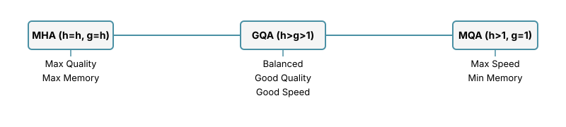
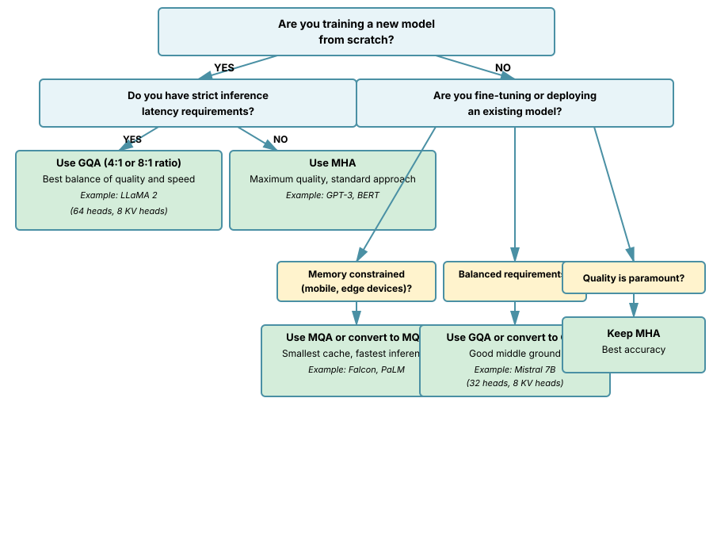

# Chapter 4: Multi-Head Attention

Multi-Head Attention (MHA) is a core component of the Transformer architecture, enabling models to learn different representation subspaces and attend to information from different positions simultaneously. This chapter builds on the foundation laid in [Basic Attention](03-basic-attention.md) and introduces the multi-head mechanism that powers modern LLMs.

## Table of Contents

1. [Why Multiple Heads?](#why-multiple-heads)
2. [Mathematical Formulation](#mathematical-formulation)
3. [Implementation from Scratch](#implementation-from-scratch)
4. [Concatenation and Projection](#concatenation-and-projection)
5. [Multi-Query Attention (MQA)](#multi-query-attention-mqa)
6. [Grouped-Query Attention (GQA)](#grouped-query-attention-gqa)
7. [Comparison: MHA vs MQA vs GQA](#comparison-mha-vs-mqa-vs-gqa)
   - [KV Cache Implementation](#kv-cache-implementation)
   - [When to Use Each Variant: Decision Guidelines](#when-to-use-each-variant-decision-guidelines)
8. [Practical Considerations](#practical-considerations)
   - [Common Pitfalls](#6-common-pitfalls)
9. [Exercises](#exercises)
10. [References](#references)

---

## Why Multiple Heads?

The intuition behind multi-head attention is that different attention heads can learn to focus on different aspects of the input:

- **Head 1**: Might learn syntactic relationships (e.g., subject-verb agreement)
- **Head 2**: Might learn semantic relationships (e.g., co-reference resolution)
- **Head 3**: Might learn positional patterns (e.g., attending to adjacent words)
- **Head 4**: Might learn long-range dependencies (e.g., matching opening and closing brackets)

By having multiple heads operating in parallel, the model can:

1. **Attend to different positions simultaneously**: One head can look at nearby words while another examines distant context
2. **Learn different representation subspaces**: Each head operates in its own subspace, allowing richer feature extraction
3. **Increase model capacity**: More parameters to capture complex patterns
4. **Improve robustness**: Multiple perspectives reduce the risk of missing important information

### Empirical Evidence

Research has shown that attention heads do specialize:

- Heads in lower layers tend to focus on positional and syntactic patterns
- Heads in middle layers capture semantic relationships
- Heads in upper layers perform task-specific reasoning
- Some heads are more important than others (can be pruned without significant loss)

---

## Mathematical Formulation

### Single-Head Attention Recap

From [Basic Attention](03-basic-attention.md), recall that scaled dot-product attention is:

```math
\text{Attention}(Q, K, V) = \text{softmax}\left(\frac{QK^T}{\sqrt{d_k}}\right)V
```

where:

- $Q \in \mathbb{R}^{n \times d_k}$ are queries
- $K \in \mathbb{R}^{m \times d_k}$ are keys
- $V \in \mathbb{R}^{m \times d_v}$ are values
- $d_k$ is the key/query dimension
- $n$ is the target sequence length, $m$ is the source sequence length

### Multi-Head Attention

Multi-head attention runs $h$ attention operations in parallel, each with its own learned projection matrices:

```math
\begin{align}
\text{MultiHead}(Q, K, V) &= \text{Concat}(\text{head}_1, \ldots, \text{head}_h)W^{O} \\
\text{where } \text{head}_i &= \text{Attention}(QW_i^{Q}, KW_i^{K}, VW_i^{V})
\end{align}
```

The projection matrices are:

- $W_i^{Q} \in \mathbb{R}^{d_{\text{model}} \times d_k}$ projects queries for head $i$
- $W_i^{K} \in \mathbb{R}^{d_{\text{model}} \times d_k}$ projects keys for head $i$
- $W_i^{V} \in \mathbb{R}^{d_{\text{model}} \times d_v}$ projects values for head $i$
- $W^{O} \in \mathbb{R}^{hd_v \times d_{\text{model}}}$ projects the concatenated output

### Dimension Constraints

Typically:

- $d_k = d_v = d_{\text{model}} / h$ (the head dimension)
- With $h$ heads, the total dimension is $h \times (d_{\text{model}} / h) = d_{\text{model}}$
- This keeps the computational cost similar to single-head attention with full dimension

**Example**: For GPT-2 with $d_{\text{model}} = 768$ and $h = 12$:

- Each head has dimension $d_k = d_v = 768 / 12 = 64$
- Total parameters: roughly the same as single-head attention

---

## Implementation from Scratch

### The Problem: Combining Parallel Attention Mechanisms

While the mathematical formulation gives us the blueprint, implementing multi-head attention efficiently requires solving several computational challenges:

1. **Efficient Parallelization**: We need to compute $h$ attention operations simultaneously without iterating through heads sequentially
2. **Memory Layout**: Tensor shapes must be organized to leverage GPU/TPU parallelism effectively
3. **Dimension Management**: We must carefully track and transform shapes through splits, transposes, and concatenations

### Theoretical Foundation

The key insight is that all heads can share the same projection operations by using a larger projection matrix and then splitting:

**Naive approach** (inefficient):

- Create $h$ separate $d_{\text{model}} \times d_k$ projection matrices
- Loop through heads sequentially

**Efficient approach** (what we implement):

- Create a single $d_{\text{model}} \times d_{\text{model}}$ projection matrix
- Reshape to split into $h$ heads of dimension $d_k$
- Process all heads in parallel using batch matrix operations

This works because matrix multiplication is associative:

```math
(XW)\text{.view}(h, d_k) \equiv X(W\text{.view}(h, d_k))
```

### Why This Implementation Strategy

The implementation below uses the "project-then-split" approach because:

1. **Single GEMM (General Matrix Multiply)**: One large matrix multiplication is more efficient than $h$ small ones due to better hardware utilization
2. **Batch Processing**: GPUs excel at parallel operations on regularly-shaped tensors
3. **Memory Coalescing**: Contiguous memory access patterns improve cache performance
4. **Framework Optimization**: PyTorch/CUDA kernels are highly optimized for large matrix operations

### Relationship to Alternatives

**Alternative 1: Separate Linear Layers per Head**

- More intuitive but slower
- Each head is an explicit `nn.Linear` module
- Sequential processing kills performance

**Alternative 2: Grouped Convolutions**

- Can achieve similar effect using grouped 1D convolutions
- Less common in practice, harder to reason about

**Alternative 3: Einsum Operations**

- More concise notation using `torch.einsum`
- Can be harder to optimize, less explicit about shapes

Our implementation balances clarity, performance, and maintainability.

### Implementation

Let's implement multi-head attention in PyTorch:

```python
import torch
import torch.nn as nn
import torch.nn.functional as F
import math

class MultiHeadAttention(nn.Module):
    """
    Multi-Head Attention mechanism.

    Args:
        d_model: Dimension of the model (embedding dimension)
        num_heads: Number of attention heads
        dropout: Dropout probability (default: 0.1)
    """

    def __init__(self, d_model, num_heads, dropout=0.1):
        super().__init__()
        assert d_model % num_heads == 0, "d_model must be divisible by num_heads"

        self.d_model = d_model
        self.num_heads = num_heads
        self.d_k = d_model // num_heads  # dimension per head

        # Linear projections for Q, K, V
        self.W_q = nn.Linear(d_model, d_model)
        self.W_k = nn.Linear(d_model, d_model)
        self.W_v = nn.Linear(d_model, d_model)

        # Output projection
        self.W_o = nn.Linear(d_model, d_model)

        self.dropout = nn.Dropout(dropout)

    def split_heads(self, x, batch_size):
        """
        Split the last dimension into (num_heads, d_k).
        Transpose to put heads next to batch dimension.

        Args:
            x: tensor of shape (batch_size, seq_len, d_model)

        Returns:
            tensor of shape (batch_size, num_heads, seq_len, d_k)
        """
        x = x.view(batch_size, -1, self.num_heads, self.d_k)
        return x.transpose(1, 2)

    def forward(self, query, key, value, mask=None):
        """
        Forward pass for multi-head attention.

        Args:
            query: tensor of shape (batch_size, seq_len_q, d_model)
            key: tensor of shape (batch_size, seq_len_k, d_model)
            value: tensor of shape (batch_size, seq_len_v, d_model)
            mask: optional tensor for masking attention weights
                  shape (batch_size, 1, 1, seq_len_k) or (batch_size, 1, seq_len_q, seq_len_k)

        Returns:
            output: tensor of shape (batch_size, seq_len_q, d_model)
            attention_weights: tensor of shape (batch_size, num_heads, seq_len_q, seq_len_k)
        """
        batch_size = query.size(0)

        # Linear projections
        Q = self.W_q(query)  # (batch_size, seq_len_q, d_model)
        K = self.W_k(key)    # (batch_size, seq_len_k, d_model)
        V = self.W_v(value)  # (batch_size, seq_len_v, d_model)

        # Split into multiple heads
        Q = self.split_heads(Q, batch_size)  # (batch_size, num_heads, seq_len_q, d_k)
        K = self.split_heads(K, batch_size)  # (batch_size, num_heads, seq_len_k, d_k)
        V = self.split_heads(V, batch_size)  # (batch_size, num_heads, seq_len_v, d_k)

        # Scaled dot-product attention
        scores = torch.matmul(Q, K.transpose(-2, -1)) / math.sqrt(self.d_k)
        # scores shape: (batch_size, num_heads, seq_len_q, seq_len_k)

        # Apply mask if provided (for causal attention or padding)
        if mask is not None:
            scores = scores.masked_fill(mask == 0, float('-inf'))

        # Softmax to get attention weights
        attention_weights = F.softmax(scores, dim=-1)
        attention_weights = self.dropout(attention_weights)

        # Apply attention to values
        context = torch.matmul(attention_weights, V)
        # context shape: (batch_size, num_heads, seq_len_q, d_k)

        # Concatenate heads
        context = context.transpose(1, 2).contiguous()
        # shape: (batch_size, seq_len_q, num_heads, d_k)

        context = context.view(batch_size, -1, self.d_model)
        # shape: (batch_size, seq_len_q, d_model)

        # Final linear projection
        output = self.W_o(context)

        return output, attention_weights


# Example usage
def test_multi_head_attention():
    """Test the multi-head attention implementation."""
    batch_size = 2
    seq_len = 10
    d_model = 512
    num_heads = 8

    # Create random input
    x = torch.randn(batch_size, seq_len, d_model)

    # Initialize multi-head attention
    mha = MultiHeadAttention(d_model, num_heads)

    # Forward pass (self-attention)
    output, attention_weights = mha(x, x, x)

    print(f"Input shape: {x.shape}")
    print(f"Output shape: {output.shape}")
    print(f"Attention weights shape: {attention_weights.shape}")

    # Verify shapes
    assert output.shape == x.shape
    assert attention_weights.shape == (batch_size, num_heads, seq_len, seq_len)

    print("\nMulti-head attention test passed!")

    # Create a causal mask for autoregressive models
    causal_mask = torch.tril(torch.ones(seq_len, seq_len)).view(1, 1, seq_len, seq_len)
    output_masked, attn_masked = mha(x, x, x, mask=causal_mask)

    print(f"\nWith causal mask:")
    print(f"Output shape: {output_masked.shape}")
    print(f"Attention weights shape: {attn_masked.shape}")

    # Visualize attention pattern for the first head
    import matplotlib.pyplot as plt

    plt.figure(figsize=(12, 5))

    plt.subplot(1, 2, 1)
    plt.imshow(attention_weights[0, 0].detach().numpy(), cmap='viridis')
    plt.title('Attention Pattern (Head 0, No Mask)')
    plt.xlabel('Key Position')
    plt.ylabel('Query Position')
    plt.colorbar()

    plt.subplot(1, 2, 2)
    plt.imshow(attn_masked[0, 0].detach().numpy(), cmap='viridis')
    plt.title('Attention Pattern (Head 0, Causal Mask)')
    plt.xlabel('Key Position')
    plt.ylabel('Query Position')
    plt.colorbar()

    plt.tight_layout()
    plt.savefig('multihead_attention_patterns.png', dpi=150, bbox_inches='tight')
    print("\nAttention patterns saved to 'multihead_attention_patterns.png'")

if __name__ == "__main__":
    test_multi_head_attention()
```

### Key Implementation Details

1. **Projection**: We use a single linear layer for each of Q, K, V that projects to `d_model`, then split into heads
2. **Split Heads**: Reshape from `(batch, seq_len, d_model)` to `(batch, num_heads, seq_len, d_k)`
3. **Parallel Computation**: All heads compute attention simultaneously using batch matrix multiplication
4. **Concatenation**: After attention, transpose and reshape to concatenate head outputs
5. **Output Projection**: A final linear layer mixes information across heads

---

## Concatenation and Projection

### Why Concatenate?

After computing attention for each head independently, we concatenate the outputs:

```python
# Each head output has shape (batch_size, seq_len_q, d_k)
# After concatenating h heads:
concatenated = torch.cat([head_1, head_2, ..., head_h], dim=-1)
# Shape: (batch_size, seq_len_q, h * d_k) = (batch_size, seq_len_q, d_model)
```

### Why Final Projection?

The output projection $W^{O}$ serves several purposes:

1. **Mixing head information**: Allows heads to interact and share information
2. **Dimensionality control**: Ensures output dimension matches input
3. **Additional capacity**: Adds learnable parameters for the final transformation
4. **Residual connection**: Output can be added directly to the input (see [The Transformer Block](09-transformer-block.md))

### Alternative: Separate Projection per Head

#### Why Consider This Alternative?

While our main implementation uses a unified projection matrix, understanding the explicit per-head approach illuminates important theoretical concepts:

**The Problem**: How can we ensure each head learns truly independent representations?

**Theoretical Consideration**:
With a shared projection matrix that we split, there's a subtle question: Are the heads really independent, or are they constrained by sharing the same input transformation?

**Answer**: They are independent after the split because:

1. Each head's parameters are separate subsets of the full weight matrix
2. Gradients flow independently to each subset during backpropagation
3. The split is just a computational trick; mathematically it's equivalent to separate matrices

#### The Explicit Approach

Some implementations make this independence explicit by using separate `nn.Module` objects for each head:

```python
# Alternative approach (less common)
class MultiHeadAttentionAlt(nn.Module):
    def __init__(self, d_model, num_heads, dropout=0.1):
        super().__init__()
        self.heads = nn.ModuleList([
            AttentionHead(d_model, d_model // num_heads)
            for _ in range(num_heads)
        ])
        self.W_o = nn.Linear(d_model, d_model)
        self.dropout = nn.Dropout(dropout)

    def forward(self, query, key, value, mask=None):
        # Compute each head separately
        head_outputs = [head(query, key, value, mask) for head in self.heads]

        # Concatenate
        concatenated = torch.cat(head_outputs, dim=-1)

        # Project
        output = self.W_o(concatenated)
        return output
```

This is less efficient due to the loop, but conceptually equivalent.

---

## Multi-Query Attention (MQA)

Multi-Query Attention (MQA) is a variant that reduces memory usage and inference latency by sharing keys and values across all attention heads while keeping separate queries for each head.

### Motivation: The KV Cache Bottleneck

In autoregressive inference (like in GPT models), the KV cache can become a memory bottleneck:

- **Standard MHA**: Each head stores its own K and V for all previous tokens
- **Memory per layer**: $2 \times h \times \text{seq\_len} \times d_k \times \text{batch\_size}$
- For long sequences and many heads, this becomes prohibitive

**Concrete Example**: For a 70B parameter model with 64 attention heads serving a 2048-token context:

- Each layer needs ~64 MB of KV cache (in FP16)
- With 80 layers: ~5 GB per user
- With 100 concurrent users: ~500 GB just for KV cache!

### The Core Insight

**Problem**: Do we really need separate key and value representations for each head?

**Observation**: In many models, different query heads often attend to similar positions in the input sequence, just with different weights. This suggests the keys and values could be shared.

**MQA's Answer**: Keep separate queries per head (to maintain diversity in what to attend to) but share keys and values (reducing memory dramatically).

### Theoretical Justification

Why does sharing K and V across heads work?

1. **Information Flow**: The diversity comes from different query projections, not from different key/value representations
2. **Empirical Evidence**: PaLM paper showed only ~1% quality degradation on most benchmarks
3. **Representation Redundancy**: Studies show high correlation between what different heads' K and V matrices learn
4. **Attention Pattern Diversity**: The important diversity is in the attention patterns (determined by Q·K^T), not in the value transformations

### Mathematical Formulation

```math
\begin{align}
\text{MQA}(Q, K, V) &= \text{Concat}(\text{head}_1, \ldots, \text{head}_h)W^{O} \\
\text{where } \text{head}_i &= \text{Attention}(QW_i^{Q}, KW^{K}, VW^{V})
\end{align}
```

Key difference: All heads share the same $W^{K}$ and $W^{V}$ (no subscript $i$).

**Parameter Reduction**:

- MHA K,V params: $2 \times d_{\text{model}} \times d_{\text{model}}$
- MQA K,V params: $2 \times d_{\text{model}} \times d_k$ where $d_k = d_{\text{model}} / h$
- Reduction factor: $h$ (e.g., 32x for 32 heads)

### How It Relates to Standard MHA

Think of MQA as making this transformation:

**MHA**: Each head asks "What should I attend to?" AND "How should I represent what I find?"

**MQA**: Each head asks "What should I attend to?" (separate queries) but they all share "How should I represent what I find?" (shared K,V)

### Implementation

```python
class MultiQueryAttention(nn.Module):
    """
    Multi-Query Attention (MQA) - shares keys and values across all heads.

    Used in models like PaLM, Falcon, and GPT-J for faster inference.

    Args:
        d_model: Dimension of the model
        num_heads: Number of query heads
        dropout: Dropout probability
    """

    def __init__(self, d_model, num_heads, dropout=0.1):
        super().__init__()
        assert d_model % num_heads == 0

        self.d_model = d_model
        self.num_heads = num_heads
        self.d_k = d_model // num_heads

        # Separate query projection for each head
        self.W_q = nn.Linear(d_model, d_model)

        # Shared key and value projections (only d_k dimensions, not d_model)
        self.W_k = nn.Linear(d_model, self.d_k)
        self.W_v = nn.Linear(d_model, self.d_k)

        self.W_o = nn.Linear(d_model, d_model)
        self.dropout = nn.Dropout(dropout)

    def forward(self, query, key, value, mask=None):
        batch_size = query.size(0)

        # Project queries (multi-head)
        Q = self.W_q(query).view(batch_size, -1, self.num_heads, self.d_k)
        Q = Q.transpose(1, 2)  # (batch_size, num_heads, seq_len_q, d_k)

        # Project keys and values (shared across heads)
        K = self.W_k(key).unsqueeze(1)  # (batch_size, 1, seq_len_k, d_k)
        V = self.W_v(value).unsqueeze(1)  # (batch_size, 1, seq_len_v, d_k)

        # K and V will broadcast across the num_heads dimension

        # Scaled dot-product attention
        scores = torch.matmul(Q, K.transpose(-2, -1)) / math.sqrt(self.d_k)

        if mask is not None:
            scores = scores.masked_fill(mask == 0, float('-inf'))

        attention_weights = F.softmax(scores, dim=-1)
        attention_weights = self.dropout(attention_weights)

        # Apply attention
        context = torch.matmul(attention_weights, V)
        # (batch_size, num_heads, seq_len_q, d_k)

        # Concatenate heads
        context = context.transpose(1, 2).contiguous()
        context = context.view(batch_size, -1, self.d_model)

        # Output projection
        output = self.W_o(context)

        return output, attention_weights


def compare_mha_mqa_memory():
    """
    Compare memory usage of MHA vs MQA.

    This demonstrates why MQA was invented: for large models with many heads,
    the KV cache can become the primary memory bottleneck in inference.

    The reduction is proportional to the number of heads - with 32 heads,
    MQA uses 32x less KV cache memory than MHA!
    """
    d_model = 4096
    num_heads = 32
    seq_len = 2048
    batch_size = 1

    # MHA parameters for K and V projections
    mha_kv_params = 2 * (d_model * d_model)

    # MQA parameters for K and V projections
    d_k = d_model // num_heads
    mqa_kv_params = 2 * (d_model * d_k)

    print("Parameter Comparison:")
    print(f"MHA K,V params: {mha_kv_params:,}")
    print(f"MQA K,V params: {mqa_kv_params:,}")
    print(f"Reduction: {mha_kv_params / mqa_kv_params:.1f}x")

    # KV cache size
    mha_cache = 2 * batch_size * num_heads * seq_len * d_k * 2  # 2 bytes for fp16
    mqa_cache = 2 * batch_size * 1 * seq_len * d_k * 2

    print(f"\nKV Cache Size (FP16):")
    print(f"MHA cache: {mha_cache / 1e6:.1f} MB")
    print(f"MQA cache: {mqa_cache / 1e6:.1f} MB")
    print(f"Reduction: {mha_cache / mqa_cache:.1f}x")

if __name__ == "__main__":
    compare_mha_mqa_memory()
```

### MQA Trade-offs

**Advantages:**

- Reduced KV cache size by factor of $h$ (number of heads)
- Faster inference, especially for long sequences
- Lower memory bandwidth requirements

**Disadvantages:**

- Slightly lower quality (empirically ~1% worse on some benchmarks)
- Less expressive: heads must share the same key/value representations
- Training time benefits are minimal (KV cache is an inference concern)

**Used in**: PaLM, Falcon, GPT-J, StarCoder

---

## Grouped-Query Attention (GQA)

Grouped-Query Attention (GQA) is a middle ground between MHA and MQA, grouping queries into sets that share keys and values.

### Motivation: The Goldilocks Problem

GQA aims to balance the quality of MHA with the efficiency of MQA:

- **MHA**: $h$ separate K, V projections (highest quality, most memory)
- **MQA**: 1 shared K, V projection (lowest memory, slight quality loss)
- **GQA**: $g$ groups of K, V projections where $1 < g < h$ (balanced trade-off)

**The Problem**: MQA gives us great memory savings but sometimes loses too much quality. Can we get most of the memory benefits with minimal quality loss?

### The Core Insight: Partial Sharing

**Observation**: Attention heads often cluster into groups that learn similar patterns:

- Some heads focus on local context (syntactic patterns)
- Some heads focus on long-range dependencies (discourse structure)
- Some heads focus on specific semantic relationships

**GQA's Answer**: Instead of forcing all heads to share K,V (MQA) or giving each head its own K,V (MHA), cluster heads into groups that share K,V within the group.

### Theoretical Justification

Why does grouping work better than full sharing (MQA)?

1. **Representation Capacity**: With $g$ groups, the model has $g$ different ways to represent context (vs. 1 for MQA)
2. **Functional Specialization**: Different groups can specialize in different types of attention patterns
3. **Empirical Evidence**: LLaMA 2 paper showed GQA with 8 KV heads (out of 64 query heads) achieves ~99.5% of MHA quality
4. **Information Theory**: The mutual information between heads within a group is often higher than between heads across different functional roles

### The Trade-off Spectrum



### Mathematical Formulation

With $h$ total heads divided into $g$ groups of size $h/g$:

```math
\begin{align}
\text{GQA}(Q, K, V) &= \text{Concat}(\text{head}_1, \ldots, \text{head}_h)W^{O} \\
\text{where } \text{head}_i &= \text{Attention}(QW_i^{Q}, KW_{j(i)}^{K}, VW_{j(i)}^{V})
\end{align}
```

Here $j(i) = \lfloor i / (h/g) \rfloor$ maps head $i$ to its group.

**Example**: With 32 query heads and 8 KV heads:

- Heads 0-3 share KV head 0
- Heads 4-7 share KV head 1
- Heads 8-11 share KV head 2
- ... and so on

**Memory Savings**:

- Cache size: $2 \times g \times \text{seq\_len} \times d_k$ (vs. $2 \times h \times \text{seq\_len} \times d_k$ for MHA)
- Reduction factor: $h/g$ (e.g., 4x for 32 heads with 8 groups)

### How It Relates to MHA and MQA

**MHA**: Every query head has its own K,V head → Maximum expressiveness, maximum memory

**GQA**: Groups of query heads share K,V heads → Balanced expressiveness and memory

**MQA**: All query heads share one K,V head → Minimum memory, reduced expressiveness

Think of it as a spectrum of sharing:

- No sharing (MHA): Fine-grained specialization but expensive
- Partial sharing (GQA): Group-level specialization with efficiency
- Full sharing (MQA): Minimal specialization but very efficient

### Implementation

```python
class GroupedQueryAttention(nn.Module):
    """
    Grouped-Query Attention (GQA) - middle ground between MHA and MQA.

    Used in LLaMA 2, LLaMA 3, Mistral, and other modern LLMs.

    Args:
        d_model: Dimension of the model
        num_heads: Number of query heads
        num_kv_heads: Number of key/value heads (must divide num_heads evenly)
        dropout: Dropout probability
    """

    def __init__(self, d_model, num_heads, num_kv_heads, dropout=0.1):
        super().__init__()
        assert d_model % num_heads == 0
        assert num_heads % num_kv_heads == 0, "num_heads must be divisible by num_kv_heads"

        self.d_model = d_model
        self.num_heads = num_heads
        self.num_kv_heads = num_kv_heads
        self.num_queries_per_kv = num_heads // num_kv_heads
        self.d_k = d_model // num_heads

        # Query projections for all heads
        self.W_q = nn.Linear(d_model, d_model)

        # Key and value projections for KV heads only
        self.W_k = nn.Linear(d_model, num_kv_heads * self.d_k)
        self.W_v = nn.Linear(d_model, num_kv_heads * self.d_k)

        self.W_o = nn.Linear(d_model, d_model)
        self.dropout = nn.Dropout(dropout)

    def forward(self, query, key, value, mask=None):
        batch_size = query.size(0)
        seq_len_q = query.size(1)
        seq_len_k = key.size(1)

        # Project and split queries (all heads)
        Q = self.W_q(query).view(batch_size, seq_len_q, self.num_heads, self.d_k)
        Q = Q.transpose(1, 2)  # (batch_size, num_heads, seq_len_q, d_k)

        # Project and split keys and values (KV heads only)
        K = self.W_k(key).view(batch_size, seq_len_k, self.num_kv_heads, self.d_k)
        K = K.transpose(1, 2)  # (batch_size, num_kv_heads, seq_len_k, d_k)

        V = self.W_v(value).view(batch_size, seq_len_k, self.num_kv_heads, self.d_k)
        V = V.transpose(1, 2)  # (batch_size, num_kv_heads, seq_len_v, d_k)

        # Repeat K and V for each query group
        # Shape: (batch_size, num_heads, seq_len_k, d_k)
        K = K.repeat_interleave(self.num_queries_per_kv, dim=1)
        V = V.repeat_interleave(self.num_queries_per_kv, dim=1)

        # Now K, V have the same number of heads as Q
        # Proceed with standard attention
        scores = torch.matmul(Q, K.transpose(-2, -1)) / math.sqrt(self.d_k)

        if mask is not None:
            scores = scores.masked_fill(mask == 0, float('-inf'))

        attention_weights = F.softmax(scores, dim=-1)
        attention_weights = self.dropout(attention_weights)

        context = torch.matmul(attention_weights, V)
        # (batch_size, num_heads, seq_len_q, d_k)

        # Concatenate heads
        context = context.transpose(1, 2).contiguous()
        context = context.view(batch_size, seq_len_q, self.d_model)

        # Output projection
        output = self.W_o(context)

        return output, attention_weights


def test_gqa():
    """
    Test GQA with different group configurations.

    This demonstrates the spectrum from MHA to MQA:

    - 8 heads, 8 KV heads = MHA (no sharing)
    - 8 heads, 4 KV heads = GQA (2 query heads per KV head)
    - 8 heads, 2 KV heads = GQA (4 query heads per KV head)
    - 8 heads, 1 KV head = MQA (all query heads share one KV head)

    Notice how parameter count decreases as we increase sharing,
    while output shape remains the same (the model is still expressive,
    just with different internal structure).
    """
    batch_size = 2
    seq_len = 16
    d_model = 512

    configurations = [
        (8, 8, "MHA (8 heads, 8 KV heads)"),
        (8, 4, "GQA (8 heads, 4 KV heads)"),
        (8, 2, "GQA (8 heads, 2 KV heads)"),
        (8, 1, "MQA (8 heads, 1 KV head)"),
    ]

    x = torch.randn(batch_size, seq_len, d_model)

    print("Comparing different GQA configurations:\n")

    for num_heads, num_kv_heads, description in configurations:
        gqa = GroupedQueryAttention(d_model, num_heads, num_kv_heads)

        # Count parameters
        num_params = sum(p.numel() for p in gqa.parameters())

        # Forward pass
        output, _ = gqa(x, x, x)

        print(f"{description}")
        print(f"  Parameters: {num_params:,}")
        print(f"  Queries per KV: {num_heads // num_kv_heads}")
        print(f"  Output shape: {output.shape}")
        print()

if __name__ == "__main__":
    test_gqa()
```

### GQA Trade-offs

**Advantages:**

- Flexible trade-off between quality and efficiency
- Significantly reduces KV cache compared to MHA
- Minimal quality loss compared to MHA (much better than MQA)
- Can be chosen per model requirements

**Disadvantages:**

- More complex implementation than MHA or MQA
- Requires careful tuning of the number of KV heads

**Typical Configurations:**

- **LLaMA 2 70B**: 64 query heads, 8 KV heads (8:1 ratio)
- **LLaMA 3**: Similar ratios
- **Mistral 7B**: 32 query heads, 8 KV heads (4:1 ratio)

---

## Comparison: MHA vs MQA vs GQA

### Why This Comparison Matters

Understanding the performance characteristics of different attention variants is crucial for:

1. **Model Selection**: Choosing the right architecture for your use case
2. **Deployment Planning**: Estimating memory and compute requirements
3. **Interview Preparation**: Being able to discuss trade-offs intelligently
4. **Research Decisions**: Knowing when to use which variant in new architectures

### What We're Measuring

This benchmark quantifies the three key trade-offs:

1. **Parameter Count**: How many weights do we need to store?
   - Affects model size on disk
   - Impacts loading time and storage costs

2. **Memory Usage (KV Cache)**: How much memory does inference require?
   - Critical for batch size and concurrent users
   - Determines hardware requirements for deployment

3. **Inference Speed**: How fast can we generate tokens?
   - Affects user experience (latency)
   - Determines throughput (tokens/second/GPU)

### Theoretical Expectations

Before running the benchmark, let's predict the results:

**Parameter Count**:

- MHA should have the most parameters (separate K,V for each head)
- GQA should be in the middle (some sharing)
- MQA should have the fewest (maximum sharing)

**KV Cache**:

- Scales linearly with number of KV heads
- MHA: $2 \times h$ cache entries
- GQA: $2 \times g$ cache entries
- MQA: $2 \times 1$ cache entries

**Speed**:

- Smaller cache → better memory bandwidth utilization → faster
- BUT: Differences are modest because compute (QK^T) dominates on small batches
- Speedup is more pronounced for: long sequences, large batch sizes, memory-bound hardware

### The Benchmark

Let's create a comprehensive comparison:

```python
import torch
import torch.nn as nn
import time

def benchmark_attention_variants():
    """
    Benchmark MHA, MQA, and GQA in terms of:

    - Parameter count
    - Memory usage
    - Inference speed

    """
    d_model = 4096
    num_heads = 32
    seq_len = 2048
    batch_size = 1

    print("=" * 80)
    print(f"Benchmark Configuration:")
    print(f"  d_model: {d_model}")
    print(f"  num_heads: {num_heads}")
    print(f"  seq_len: {seq_len}")
    print(f"  batch_size: {batch_size}")
    print("=" * 80)

    # Create models
    mha = MultiHeadAttention(d_model, num_heads)
    mqa = MultiQueryAttention(d_model, num_heads)
    gqa_4 = GroupedQueryAttention(d_model, num_heads, num_kv_heads=8)
    gqa_2 = GroupedQueryAttention(d_model, num_heads, num_kv_heads=4)

    models = [
        ("MHA (32 heads)", mha),
        ("GQA-8 (32 heads, 8 KV)", gqa_4),
        ("GQA-4 (32 heads, 4 KV)", gqa_2),
        ("MQA (32 heads, 1 KV)", mqa),
    ]

    # Generate input
    x = torch.randn(batch_size, seq_len, d_model)

    print("\nParameter Count Comparison:")
    print("-" * 80)
    for name, model in models:
        num_params = sum(p.numel() for p in model.parameters())
        print(f"{name:30s}: {num_params:,} parameters")

    # KV Cache analysis
    print("\nKV Cache Size (per token, FP16):")
    print("-" * 80)
    d_k = d_model // num_heads

    cache_sizes = [
        ("MHA", 2 * num_heads * d_k * 2),  # 2 for K,V; 2 for FP16 bytes
        ("GQA-8", 2 * 8 * d_k * 2),
        ("GQA-4", 2 * 4 * d_k * 2),
        ("MQA", 2 * 1 * d_k * 2),
    ]

    base_size = cache_sizes[0][1]
    for name, size in cache_sizes:
        reduction = base_size / size
        print(f"{name:30s}: {size:6d} bytes/token ({reduction:4.1f}x reduction)")

    # Total cache for full sequence
    print(f"\nTotal KV Cache for {seq_len} tokens:")
    print("-" * 80)
    for name, size_per_token in cache_sizes:
        total_mb = (size_per_token * seq_len) / (1024 * 1024)
        print(f"{name:30s}: {total_mb:6.2f} MB")

    # Speed benchmark (CPU)
    print("\nInference Speed (CPU, 10 runs):")
    print("-" * 80)

    for name, model in models:
        model.eval()
        with torch.no_grad():
            # Warmup
            for _ in range(3):
                _ = model(x, x, x)

            # Benchmark
            start = time.time()
            for _ in range(10):
                _ = model(x, x, x)
            elapsed = time.time() - start

            print(f"{name:30s}: {elapsed:.4f}s total, {elapsed/10:.4f}s per run")

    print("=" * 80)


def visualize_attention_heads():
    """
    Visualize what different heads might learn.

    This demonstrates the diversity of attention patterns across heads.
    Different heads often specialize in different types of relationships:

    - Local patterns (adjacent tokens)
    - Long-range dependencies (distant tokens)
    - Specific syntactic/semantic relationships

    """
    import matplotlib.pyplot as plt

    seq_len = 20
    d_model = 128
    num_heads = 4

    # Create input sequence
    x = torch.randn(1, seq_len, d_model)

    # Initialize MHA
    mha = MultiHeadAttention(d_model, num_heads, dropout=0.0)
    mha.eval()

    with torch.no_grad():
        _, attention_weights = mha(x, x, x)

    # attention_weights: (1, num_heads, seq_len, seq_len)
    attention_weights = attention_weights[0].numpy()  # (num_heads, seq_len, seq_len)

    fig, axes = plt.subplots(1, num_heads, figsize=(16, 4))

    for i in range(num_heads):
        im = axes[i].imshow(attention_weights[i], cmap='viridis', vmin=0, vmax=0.5)
        axes[i].set_title(f'Head {i+1}')
        axes[i].set_xlabel('Key Position')
        axes[i].set_ylabel('Query Position')
        plt.colorbar(im, ax=axes[i])

    plt.tight_layout()
    plt.savefig('attention_heads_visualization.png', dpi=150, bbox_inches='tight')
    print("Saved attention heads visualization to 'attention_heads_visualization.png'")


if __name__ == "__main__":
    benchmark_attention_variants()
    print("\n")
    visualize_attention_heads()
```

### Summary Table

| Variant | Query Heads | KV Heads | KV Cache Size | Quality | Speed | Used In |
|---------|-------------|----------|---------------|---------|-------|---------|
| **MHA** | $h$ | $h$ | $2 \times h \times d_k$ | Best | Baseline | GPT-2, GPT-3, BERT |
| **GQA** | $h$ | $g$ | $2 \times g \times d_k$ | Very Good | Faster | LLaMA 2/3, Mistral |
| **MQA** | $h$ | $1$ | $2 \times 1 \times d_k$ | Good | Fastest | PaLM, Falcon |

### KV Cache Implementation

The KV cache is critical for efficient autoregressive generation in models like GPT. During generation, we can reuse previously computed key and value tensors instead of recomputing them for all tokens at each step.

#### The Problem: Redundant Computation in Autoregressive Generation

**Scenario**: Generating text one token at a time (like ChatGPT does)

**Naive Approach**:

```text
Step 1: Process "Hello" → Generate "world"
Step 2: Process "Hello world" → Generate "!"
Step 3: Process "Hello world !" → Generate next token
...
```

At each step, we recompute attention for ALL previous tokens, even though their K,V representations never change!

**Why This Is Wasteful**:

- Token "Hello" gets recomputed 100 times for a 100-token generation
- For a 2048-token context, we're doing $O(n^2)$ redundant K,V computations
- For a large model, this can waste 90%+ of computation time

#### The Solution: Cache Key and Value Tensors

**Key Insight**: In autoregressive generation, the key and value representations of previously generated tokens are invariant - they don't change when we add new tokens.

**Mathematical Justification**:
For token position $i$, its key and value are:

```math
K_i = W_{K} \cdot h_i, \quad V_i = W_{V} \cdot h_i
```

where $h_i$ is the hidden state at position $i$. Once computed, $h_i$ doesn't change when we generate position $i+1, i+2, \ldots$

**Caching Strategy**:

```text
Step 1: Compute K[0], V[0] for "Hello" → Cache them → Generate "world"
Step 2: Compute K[1], V[1] for "world" → Append to cache → Generate "!"
Step 3: Compute K[2], V[2] for "!" → Append to cache → Generate next
```

#### Why This Works: Attention's Decomposability

Attention is computed as:

```math
\text{Attention}(Q, K, V) = \text{softmax}\left(\frac{QK^T}{\sqrt{d_k}}\right)V
```

For a new query $q_{\text{new}}$ attending to cached keys $K_{\text{cache}}$:

```math
\text{scores} = q_{\text{new}} \cdot [K_{\text{cache}}, k_{\text{new}}]^T
```

This is exactly equivalent to recomputing everything, but we only compute $k_{\text{new}}$ instead of all keys!

#### Trade-offs and Practical Considerations

**Benefits**:

- Speedup: Linear in sequence length (10x for 10 tokens, 100x for 100 tokens)
- Critical for interactive applications (chatbots, code completion)

**Costs**:

- Memory: Must store $2 \times \text{num\_kv\_heads} \times \text{seq\_len} \times d_k$ per layer
- Implementation complexity: Need to manage cache state
- Batch processing: Each sequence in batch needs its own cache

**This is why MQA and GQA matter**: They reduce the cache size by sharing K,V across query heads!

#### Implementation Details

```python
class MultiHeadAttentionWithCache(nn.Module):
    """
    Multi-head attention with KV caching for autoregressive generation.

    During generation, we only compute K,V for new tokens and reuse
    cached values for previous tokens.
    """

    def __init__(self, d_model, num_heads, dropout=0.1):
        super().__init__()
        assert d_model % num_heads == 0

        self.d_model = d_model
        self.num_heads = num_heads
        self.d_k = d_model // num_heads

        self.W_q = nn.Linear(d_model, d_model)
        self.W_k = nn.Linear(d_model, d_model)
        self.W_v = nn.Linear(d_model, d_model)
        self.W_o = nn.Linear(d_model, d_model)
        self.dropout = nn.Dropout(dropout)

    def forward(self, query, key, value, mask=None, kv_cache=None, use_cache=False):
        """
        Forward pass with optional KV caching.

        Args:
            query: (batch_size, seq_len_q, d_model)
            key: (batch_size, seq_len_k, d_model)
            value: (batch_size, seq_len_v, d_model)
            mask: optional attention mask
            kv_cache: dict with 'key' and 'value' tensors from previous steps
            use_cache: whether to return cache for next step

        Returns:
            output: (batch_size, seq_len_q, d_model)
            attention_weights: (batch_size, num_heads, seq_len_q, seq_len_k)
            new_cache: dict with updated 'key' and 'value' (if use_cache=True)
        """
        batch_size = query.size(0)
        seq_len_q = query.size(1)

        # Always compute query for current tokens
        Q = self.W_q(query).view(batch_size, seq_len_q, self.num_heads, self.d_k)
        Q = Q.transpose(1, 2)  # (batch_size, num_heads, seq_len_q, d_k)

        if kv_cache is not None:
            # Use cached K, V and only compute for new tokens
            K_new = self.W_k(key).view(batch_size, -1, self.num_heads, self.d_k)
            K_new = K_new.transpose(1, 2)
            V_new = self.W_v(value).view(batch_size, -1, self.num_heads, self.d_k)
            V_new = V_new.transpose(1, 2)

            # Concatenate with cached values
            K = torch.cat([kv_cache['key'], K_new], dim=2)
            V = torch.cat([kv_cache['value'], V_new], dim=2)
        else:
            # First step: compute K, V for all tokens
            K = self.W_k(key).view(batch_size, -1, self.num_heads, self.d_k)
            K = K.transpose(1, 2)
            V = self.W_v(value).view(batch_size, -1, self.num_heads, self.d_k)
            V = V.transpose(1, 2)

        # Scaled dot-product attention
        scores = torch.matmul(Q, K.transpose(-2, -1)) / math.sqrt(self.d_k)

        if mask is not None:
            scores = scores.masked_fill(mask == 0, float('-inf'))

        attention_weights = F.softmax(scores, dim=-1)
        attention_weights = self.dropout(attention_weights)

        context = torch.matmul(attention_weights, V)
        context = context.transpose(1, 2).contiguous()
        context = context.view(batch_size, seq_len_q, self.d_model)

        output = self.W_o(context)

        # Prepare cache for next step
        new_cache = None
        if use_cache:
            new_cache = {'key': K, 'value': V}

        return output, attention_weights, new_cache


def demonstrate_kv_cache():
    """
    Demonstrate the benefits of KV caching for autoregressive generation.

    This example shows the dramatic speedup from KV caching.

    Without cache: O(n²) computation - recompute K,V for all previous tokens each step
    With cache: O(n) computation - only compute K,V for new tokens

    For n=100 tokens, this is ~100x speedup in K,V computation.
    The actual speedup is smaller due to Q computation and attention matmul,
    but still very significant (typically 10-50x for real workloads).
    """
    d_model = 512
    num_heads = 8
    batch_size = 1

    # Initialize model
    mha_with_cache = MultiHeadAttentionWithCache(d_model, num_heads)
    mha_with_cache.eval()

    print("Autoregressive Generation with KV Cache")
    print("=" * 60)

    # Simulate generating 10 tokens
    max_seq_len = 10
    context_len = 5  # Start with 5 tokens of context

    # Initial context
    context = torch.randn(batch_size, context_len, d_model)

    print(f"Initial context length: {context_len}")
    print(f"Generating {max_seq_len - context_len} new tokens\n")

    # Method 1: WITHOUT cache (recompute everything each step)
    print("Method 1: Without KV Cache")
    print("-" * 60)

    import time
    start = time.time()

    current_seq = context
    for step in range(context_len, max_seq_len):
        # Generate next token representation
        new_token = torch.randn(batch_size, 1, d_model)
        current_seq = torch.cat([current_seq, new_token], dim=1)

        with torch.no_grad():
            # Recompute attention for ALL tokens every time
            output, _, _ = mha_with_cache(current_seq, current_seq, current_seq)

        print(f"  Step {step - context_len + 1}: Processed {current_seq.size(1)} tokens")

    time_without_cache = time.time() - start
    print(f"Total time: {time_without_cache:.4f}s\n")

    # Method 2: WITH cache (only process new tokens)
    print("Method 2: With KV Cache")
    print("-" * 60)

    start = time.time()

    current_seq = context
    kv_cache = None

    # First step: process initial context
    with torch.no_grad():
        output, _, kv_cache = mha_with_cache(
            current_seq, current_seq, current_seq,
            use_cache=True
        )
    print(f"  Initial: Processed {context_len} tokens, cached K,V")

    for step in range(context_len, max_seq_len):
        # Generate next token representation
        new_token = torch.randn(batch_size, 1, d_model)

        with torch.no_grad():
            # Only compute attention for the NEW token
            output, _, kv_cache = mha_with_cache(
                new_token, new_token, new_token,
                kv_cache=kv_cache,
                use_cache=True
            )

        print(f"  Step {step - context_len + 1}: Processed 1 new token, cache size: {kv_cache['key'].size(2)}")

    time_with_cache = time.time() - start
    print(f"Total time: {time_with_cache:.4f}s")

    print(f"\nSpeedup: {time_without_cache / time_with_cache:.2f}x")

    # Memory analysis
    print("\n" + "=" * 60)
    print("Memory Analysis (per layer)")
    print("-" * 60)

    d_k = d_model // num_heads
    cache_size_bytes = 2 * num_heads * max_seq_len * d_k * 2  # 2 for K,V; 2 bytes for FP16
    cache_size_mb = cache_size_bytes / (1024 * 1024)

    print(f"KV cache size for {max_seq_len} tokens: {cache_size_mb:.2f} MB")
    print(f"For 40 layers (GPT-3 scale): {40 * cache_size_mb:.2f} MB")
    print(f"For batch size 32: {32 * 40 * cache_size_mb / 1024:.2f} GB")


if __name__ == "__main__":
    demonstrate_kv_cache()
```

**Key Points:**

- **Without cache**: For each new token, we recompute K,V for all previous tokens (wasteful)
- **With cache**: We only compute K,V for the new token and concatenate with cached values
- **Speedup**: Approximately linear in sequence length (10x faster for 10 tokens, 100x for 100 tokens)
- **Trade-off**: Uses more memory to store cache, but saves massive computation time

This is why MQA and GQA are valuable—they reduce the cache size by sharing K,V across heads.

### When to Use Each Variant: Decision Guidelines

Choosing between MHA, MQA, and GQA depends on your specific requirements. Here's a decision framework:

#### Decision Flowchart



#### Detailed Guidelines

**Use MHA when:**

- Training from scratch with quality as primary goal
- Model size is small to medium (< 7B parameters)
- Inference speed is not critical (research, offline processing)
- You have ample memory for KV cache
- You need the best possible performance on benchmarks

**Example scenarios:**

- Training BERT-style encoder models
- Small fine-tuned models for specific tasks
- Research experiments where quality matters most

**Use GQA when:**

- Deploying medium to large models (7B-70B parameters)
- You need a balance between quality and efficiency
- Serving many concurrent users (shared KV cache overhead)
- You want near-MHA quality with significant memory savings

**Recommended configurations:**

- Small models (< 1B): 8-16 query heads, 2-4 KV heads (4:1 ratio)
- Medium models (1B-10B): 32 query heads, 4-8 KV heads (4:1 to 8:1)
- Large models (> 10B): 64 query heads, 8 KV heads (8:1 ratio)

**Use MQA when:**

- Deploying on memory-constrained devices (mobile, IoT)
- Maximum inference throughput is critical
- Serving extremely long contexts (> 32K tokens)
- You can accept ~1-2% quality degradation
- Latency is more important than accuracy

**Example scenarios:**

- Code completion in IDEs (low latency critical)
- Real-time chatbots with many concurrent users
- Mobile deployment of LLMs
- Streaming applications

#### Practical Recommendations by Use Case

| Use Case | Recommended | Reasoning |
|----------|-------------|-----------|
| **Research/Academia** | MHA | Reproducibility, standard baseline |
| **Production Chatbot (7B-13B)** | GQA (4:1) | Balance quality and cost |
| **Production Chatbot (70B+)** | GQA (8:1) | Necessary for memory efficiency |
| **Code Completion** | MQA or GQA (8:1) | Low latency critical |
| **Document Analysis** | MHA or GQA (4:1) | Quality matters, offline okay |
| **Mobile Deployment** | MQA | Strict memory constraints |
| **Batch Processing** | MHA | Throughput via batching, quality focus |
| **Long Context (32K+)** | GQA or MQA | KV cache becomes bottleneck |

#### Converting Between Variants

If you have a pre-trained MHA model and want to switch:

**MHA → GQA:**

- Merge groups of K,V heads by averaging their weights
- Fine-tune for a small number of steps (~1-5% of original training)
- Minimal quality loss (< 1%) with proper conversion
- See "GQA: Training Generalized Multi-Query Transformer Models" paper

**MHA → MQA:**

- Average all K,V heads into a single head
- Requires more extensive fine-tuning (~5-10% of original training)
- Expect ~1-2% quality loss on downstream tasks

**GQA → MHA:**

- Duplicate each KV head to serve its query group
- No fine-tuning needed (MHA is strictly more expressive)
- Increases memory usage proportionally

#### Performance Expectations

Based on typical configurations (e.g., LLaMA-style models):

| Metric | MHA (Baseline) | GQA (8:1) | MQA |
|--------|---------------|-----------|-----|
| **Quality** | 100% | ~99.5% | ~98.5% |
| **KV Cache Size** | 1x | 0.125x (8× smaller) | 0.03x (32× smaller) |
| **Inference Speed** | 1x | 1.2-1.4x | 1.5-2x |
| **Training Speed** | 1x | ~1.0x | ~1.0x |

*Note: Inference speedup depends on batch size, sequence length, and hardware. Benefits are most pronounced for long sequences.*

---

## Practical Considerations

### 1. Choosing the Number of Heads

**Common configurations:**

- Small models (100M params): 8-12 heads
- Medium models (1B params): 16-32 heads
- Large models (10B+ params): 32-64 heads

**Guidelines:**

- More heads = more capacity but more memory
- Ensure $d_k = d_{\text{model}} / h$ is not too small (typically 64-128)
- Powers of 2 are preferred for hardware efficiency

### 2. Head Pruning

Research shows many heads can be removed without significant performance loss:

#### The Problem: Not All Heads Are Created Equal

**Empirical Observation**: In trained transformers, some attention heads contribute much more to model performance than others.

**Key Findings** (from "Are Sixteen Heads Really Better than One?"):

- In BERT, up to 40% of heads can be pruned with <1% quality loss
- Some layers have only 1-2 "important" heads
- Some heads learn nearly identical patterns (redundancy)

**Why Does This Happen?**

1. **Over-parameterization**: Models are trained with excess capacity for optimization stability
2. **Task Specificity**: Not all patterns learned during pretraining matter for downstream tasks
3. **Redundancy**: Multiple heads sometimes converge to similar functions

#### Theoretical Foundation: Gradient-Based Importance

**The Idea**: If a head is important, removing it should significantly impact the loss.

**Method**: Measure importance as the sensitivity of loss to removing that head:

```math
\text{Importance}(h) = \left|\frac{\partial \mathcal{L}}{\partial h}\right|
```

**Practical Approximation**: Use the magnitude of gradients flowing through the head as a proxy:

```math
\text{Importance}(h) \approx \sum_{\text{params } \theta \in h} \|\nabla_\theta \mathcal{L}\|
```

#### Why This Matters

**For Deployment**:

- Reduce model size and inference latency
- Deploy smaller models on resource-constrained devices
- Improve throughput by removing computational overhead

**For Understanding**:

- Reveals which linguistic phenomena the model finds important
- Helps interpret what different heads learn
- Guides architecture design for future models

#### Implementation

```python
def analyze_head_importance(model, dataloader):
    """
    Analyze which attention heads are most important.
    Based on "Are Sixteen Heads Really Better than One?" (Michel et al., 2019)
    """
    head_importance = torch.zeros(model.num_layers, model.num_heads)

    model.eval()
    for batch in dataloader:
        # Forward pass with hooks to capture head outputs
        outputs = model(batch)
        loss = outputs.loss

        # Compute gradients
        loss.backward()

        # Accumulate head importance (gradient-based)
        for layer_idx, layer in enumerate(model.layers):
            for head_idx in range(model.num_heads):
                # Importance = gradient magnitude
                head_importance[layer_idx, head_idx] += layer.attention.heads[head_idx].grad.abs().sum()

    return head_importance
```

### 3. Initialization

Proper initialization is crucial for multi-head attention:

#### The Problem: Training Instability Without Proper Initialization

**Why Initialization Matters**:

1. **Gradient Flow**: Poor initialization can cause vanishing or exploding gradients
2. **Symmetry Breaking**: Attention heads need different starting points to learn different patterns
3. **Residual Connections**: In transformers, attention outputs are added to residuals; improper scaling causes instability

#### Theoretical Foundation

**Goal**: Initialize weights so that:

1. Activations have reasonable variance throughout the network
2. Gradients flow smoothly backward without vanishing/exploding
3. The residual path doesn't dominate or get dominated

**Xavier/Glorot Initialization**:
For a layer with $n_{\text{in}}$ inputs and $n_{\text{out}}$ outputs:

```math
W \sim \mathcal{N}(0, \sigma^2), \quad \sigma = \sqrt{\frac{2}{n_{\text{in}} + n_{\text{out}}}}
```

**Why This Works**:

- Preserves variance of activations forward and gradients backward
- For linear layer: $\text{Var}(\text{output}) \approx \text{Var}(\text{input})$
- Prevents activation magnitudes from exploding or vanishing

#### Special Consideration: Output Projection

**The Problem**: In transformers, attention output is added to a residual:

```math
\text{output} = \text{input} + \text{Attention}(\text{input})
```

If attention output has large magnitude, it can overwhelm the residual path, causing training instability.

**Solution**: Scale down the output projection initialization:

```math
W^{O} \sim \mathcal{N}(0, \sigma^2 / \sqrt{2})
```

The $1/\sqrt{2}$ factor accounts for the fact that we're adding two paths (residual + attention).

#### How This Relates to Other Initialization Schemes

**Kaiming Initialization**: Better for ReLU networks

- Uses $\sigma = \sqrt{2/n_{\text{in}}}$
- Not typically used for transformers (no ReLU in attention)

**Small Constant Initialization**: Sometimes used for output projection

- $W^{O} \sim \mathcal{N}(0, 0.01^2)$
- Very conservative; can slow early training

**Layer-wise Scaling**: Some models (e.g., GPT-2) scale by $1/\sqrt{N_{\text{layers}}}$

- Compensates for accumulation through residual connections

#### Implementation

```python
def init_multihead_attention(module):
    """Initialize multi-head attention weights."""
    if isinstance(module, nn.Linear):
        # Xavier/Glorot initialization
        nn.init.xavier_uniform_(module.weight)
        if module.bias is not None:
            nn.init.zeros_(module.bias)

    # Some models use scaled initialization for output projection
    # to account for residual connection paths
    if hasattr(module, 'W_o'):
        nn.init.xavier_uniform_(module.W_o.weight, gain=1/math.sqrt(2))
```

### 4. Computational Complexity

For sequence length $n$ and model dimension $d$:

| Operation | Complexity |
|-----------|------------|
| Q, K, V projections | $O(n \cdot d^2)$ |
| Attention scores | $O(n^2 \cdot d)$ |
| Attention output | $O(n^2 \cdot d)$ |
| Output projection | $O(n \cdot d^2)$ |
| **Total** | $O(n^2 \cdot d + n \cdot d^2)$ |

For long sequences ($n > d$), the $O(n^2 \cdot d)$ term dominates, which motivates efficient attention variants (see [Flash Attention](12-flash-attention.md) and [Other Efficient Attention Variants](13-efficient-attention.md)).

### 5. Memory Optimization

#### The Problem: Memory Blowup for Long Sequences

Standard attention has a memory problem with very long sequences:

**Memory Requirement**: Storing the full attention matrix requires $O(n^2)$ memory

- For $n = 1024$: ~1M elements
- For $n = 4096$: ~16M elements
- For $n = 16384$: ~268M elements per head!

**Why This Happens**:
The attention scores matrix $S = QK^T$ has shape `(seq_len, seq_len)`, and we need to store it before applying softmax and multiplying by V.

#### The Solution: Chunked Attention

**Key Insight**: We don't need to materialize the entire $n \times n$ attention matrix at once. We can compute attention for chunks of queries while attending to all keys.

**Mathematical Foundation**:
Attention is computed row-wise (each query independently):

```math
\text{Output}_i = \sum_{j} \text{softmax}(q_i K^T)_j \cdot v_j
```

This means we can compute rows $i$ to $i+c$ (a chunk) separately, never storing the full matrix.

**Memory Reduction**:

- Standard: $O(n^2)$ memory
- Chunked: $O(n \cdot c)$ memory where $c$ is chunk size
- Typical: $c = 512$ → ~32x memory reduction for $n = 16K$

#### How It Relates to Flash Attention

**Chunking** (what we implement below): Simple approach, reduces memory by processing in chunks

- Trade-off: Slightly slower due to repeated loads
- Easy to implement
- Good for extremely long sequences on limited hardware

**Flash Attention** (see Chapter 12): Sophisticated approach using fused kernels

- Trade-off: Faster AND more memory efficient
- Requires custom CUDA kernels
- State-of-the-art for production systems

Our chunked implementation is a stepping stone to understanding Flash Attention's principles.

#### Implementation

```python
class MemoryEfficientMultiHeadAttention(nn.Module):
    """
    Memory-efficient MHA using chunking for very long sequences.
    Computes attention in chunks to reduce peak memory.
    """

    def __init__(self, d_model, num_heads, chunk_size=512, dropout=0.1):
        super().__init__()
        self.d_model = d_model
        self.num_heads = num_heads
        self.d_k = d_model // num_heads
        self.chunk_size = chunk_size

        self.W_q = nn.Linear(d_model, d_model)
        self.W_k = nn.Linear(d_model, d_model)
        self.W_v = nn.Linear(d_model, d_model)
        self.W_o = nn.Linear(d_model, d_model)
        self.dropout = nn.Dropout(dropout)

    def forward(self, query, key, value, mask=None):
        batch_size, seq_len, _ = query.shape

        # Project
        Q = self.W_q(query).view(batch_size, seq_len, self.num_heads, self.d_k).transpose(1, 2)
        K = self.W_k(key).view(batch_size, seq_len, self.num_heads, self.d_k).transpose(1, 2)
        V = self.W_v(value).view(batch_size, seq_len, self.num_heads, self.d_k).transpose(1, 2)

        # Compute attention in chunks
        outputs = []
        for i in range(0, seq_len, self.chunk_size):
            j = min(i + self.chunk_size, seq_len)
            Q_chunk = Q[:, :, i:j, :]

            # Compute attention for this chunk
            scores = torch.matmul(Q_chunk, K.transpose(-2, -1)) / math.sqrt(self.d_k)

            if mask is not None:
                scores = scores.masked_fill(mask[:, :, i:j, :] == 0, float('-inf'))

            attn = F.softmax(scores, dim=-1)
            attn = self.dropout(attn)

            output_chunk = torch.matmul(attn, V)
            outputs.append(output_chunk)

        # Concatenate chunks
        context = torch.cat(outputs, dim=2)
        context = context.transpose(1, 2).contiguous().view(batch_size, seq_len, self.d_model)

        return self.W_o(context), None
```

### 6. Common Pitfalls

When implementing and using multi-head attention, be aware of these common mistakes:

#### Pitfall 1: Forgetting to Scale Attention Scores

**Problem:**

```python
# WRONG: No scaling
scores = torch.matmul(Q, K.transpose(-2, -1))
attention_weights = F.softmax(scores, dim=-1)
```

**Why it's wrong:** Without scaling by $\sqrt{d_k}$, the dot products can have large magnitudes, pushing softmax into regions with very small gradients (vanishing gradients).

**Correct:**

```python
# CORRECT: Scale by sqrt(d_k)
scores = torch.matmul(Q, K.transpose(-2, -1)) / math.sqrt(self.d_k)
attention_weights = F.softmax(scores, dim=-1)
```

**Impact:** Can lead to training instability, slow convergence, or complete failure to train.

#### Pitfall 2: Incorrect Mask Broadcasting

**Problem:**

```python
# WRONG: Mask shape doesn't broadcast correctly
mask = torch.tril(torch.ones(seq_len, seq_len))  # Shape: (seq_len, seq_len)
scores = scores.masked_fill(mask == 0, float('-inf'))  # ERROR!
```

**Why it's wrong:** The mask needs to broadcast to `(batch_size, num_heads, seq_len_q, seq_len_k)` but shape `(seq_len, seq_len)` doesn't have the batch and head dimensions.

**Correct:**

```python
# CORRECT: Add batch and head dimensions
mask = torch.tril(torch.ones(seq_len, seq_len)).view(1, 1, seq_len, seq_len)
# Shape: (1, 1, seq_len, seq_len) - broadcasts correctly
scores = scores.masked_fill(mask == 0, float('-inf'))
```

**Common mask shapes:**

- Causal mask: `(1, 1, seq_len, seq_len)` - broadcasts across batch and heads
- Padding mask: `(batch_size, 1, 1, seq_len)` - broadcasts across heads and queries
- Combined mask: `(batch_size, 1, seq_len, seq_len)` or `(batch_size, num_heads, seq_len, seq_len)`

#### Pitfall 3: Missing `.contiguous()` Before `.view()`

**Problem:**

```python
# WRONG: view() after transpose() without contiguous()
context = context.transpose(1, 2).view(batch_size, -1, self.d_model)  # May error!
```

**Why it's wrong:** After `transpose()`, the tensor is not stored contiguously in memory. `view()` requires contiguous memory.

**Correct:**

```python
# CORRECT: Add .contiguous()
context = context.transpose(1, 2).contiguous().view(batch_size, -1, self.d_model)
```

**Alternative:** Use `reshape()` instead of `view()` (automatically handles non-contiguous tensors)

```python
context = context.transpose(1, 2).reshape(batch_size, -1, self.d_model)
```

#### Pitfall 4: Wrong Softmax Dimension

**Problem:**

```python
# WRONG: Softmax over wrong dimension
scores = torch.matmul(Q, K.transpose(-2, -1)) / math.sqrt(self.d_k)
attention_weights = F.softmax(scores, dim=-2)  # WRONG!
```

**Why it's wrong:** Softmax should be over the key dimension (last dimension), not the query dimension.

**Correct:**

```python
# CORRECT: Softmax over last dimension (keys)
attention_weights = F.softmax(scores, dim=-1)
```

**Visualization:**

```text
scores shape: (batch, num_heads, seq_len_q, seq_len_k)
                                   ^^^^^^^    ^^^^^^^
                                   queries    keys

We want: for each query, softmax over all keys → dim=-1
```

#### Pitfall 5: Incorrect Head Splitting

**Problem:**

```python
# WRONG: Incorrect reshape order
Q = self.W_q(query)  # (batch, seq_len, d_model)
Q = Q.view(batch_size, -1, self.d_k, self.num_heads)  # WRONG ORDER!
Q = Q.transpose(1, 2)
```

**Why it's wrong:** This splits the heads incorrectly across the feature dimension.

**Correct:**

```python
# CORRECT: Split into (seq_len, num_heads, d_k)
Q = self.W_q(query)  # (batch, seq_len, d_model)
Q = Q.view(batch_size, -1, self.num_heads, self.d_k)  # Correct order
Q = Q.transpose(1, 2)  # (batch, num_heads, seq_len, d_k)
```

#### Pitfall 6: Not Using Dropout on Attention Weights

**Problem:**

```python
# SUBOPTIMAL: No dropout on attention weights
attention_weights = F.softmax(scores, dim=-1)
context = torch.matmul(attention_weights, V)  # No regularization!
```

**Why it's suboptimal:** Dropout on attention weights acts as regularization and prevents overfitting to specific attention patterns.

**Correct:**

```python
# BETTER: Apply dropout to attention weights
attention_weights = F.softmax(scores, dim=-1)
attention_weights = self.dropout(attention_weights)
context = torch.matmul(attention_weights, V)
```

**Note:** Typical dropout rate for attention is 0.1 (same as other layers).

#### Pitfall 7: Dimension Mismatch in GQA

**Problem:**

```python
# WRONG: Forgetting to repeat K,V in GQA
K = self.W_k(key).view(batch_size, -1, self.num_kv_heads, self.d_k).transpose(1, 2)
V = self.W_v(value).view(batch_size, -1, self.num_kv_heads, self.d_k).transpose(1, 2)
# K, V have num_kv_heads, but Q has num_heads!
scores = torch.matmul(Q, K.transpose(-2, -1))  # ERROR: dimension mismatch!
```

**Correct:**

```python
# CORRECT: Repeat K,V to match Q's number of heads
K = K.repeat_interleave(self.num_queries_per_kv, dim=1)
V = V.repeat_interleave(self.num_queries_per_kv, dim=1)
# Now K, V have num_heads (same as Q)
scores = torch.matmul(Q, K.transpose(-2, -1))  # Works!
```

#### Pitfall 8: Inefficient KV Cache Concatenation

**Problem:**

```python
# INEFFICIENT: Creating new tensors repeatedly
for step in range(1000):
    K_new = compute_new_keys()
    K_cache = torch.cat([K_cache, K_new], dim=2)  # Reallocates memory each time!
```

**Why it's inefficient:** Each `cat()` allocates new memory and copies all data. For long sequences, this becomes very slow.

**Better approach:**

```python
# BETTER: Pre-allocate cache
max_seq_len = 1000
K_cache = torch.zeros(batch_size, num_heads, max_seq_len, d_k)
current_pos = 0

for step in range(max_seq_len):
    K_new = compute_new_keys()  # Shape: (batch, num_heads, 1, d_k)
    K_cache[:, :, current_pos:current_pos+1, :] = K_new  # In-place update
    current_pos += 1
```

#### Pitfall 9: Using MHA for Inference Without Considering Memory

**Problem:** Using standard MHA for a 70B parameter model with long context (32K tokens) can require 100+ GB of KV cache.

**Solution:** Use GQA or MQA for large-scale deployment:

```python
# For large models, prefer GQA
model = GroupedQueryAttention(
    d_model=8192,
    num_heads=64,
    num_kv_heads=8,  # 8x memory reduction
)
```

#### Pitfall 10: Not Initializing Output Projection Properly

**Problem:**

```python
# SUBOPTIMAL: Default initialization
self.W_o = nn.Linear(d_model, d_model)  # Uses default init
```

**Why it's suboptimal:** When using residual connections, the output should have smaller initial variance to prevent instability.

**Better:**

```python
# BETTER: Scaled initialization for residual connections
self.W_o = nn.Linear(d_model, d_model)
nn.init.xavier_uniform_(self.W_o.weight, gain=1/math.sqrt(2))
# Or use small constant scaling
nn.init.xavier_uniform_(self.W_o.weight, gain=0.1)
```

#### Quick Debugging Checklist

When your multi-head attention isn't working, check:

1. ✓ Are attention scores scaled by $\sqrt{d_k}$?
2. ✓ Is softmax applied on `dim=-1` (over keys)?
3. ✓ Are mask shapes compatible for broadcasting?
4. ✓ Did you use `.contiguous()` before `.view()`?
5. ✓ Are head dimensions split correctly (`num_heads, d_k` order)?
6. ✓ For GQA: Did you repeat K,V to match Q's head count?
7. ✓ Are you applying dropout to attention weights during training?
8. ✓ Do all tensor shapes match at each operation?

**Testing tip:** Add shape assertions throughout your code:

```python
assert Q.shape == (batch_size, num_heads, seq_len_q, d_k)
assert scores.shape == (batch_size, num_heads, seq_len_q, seq_len_k)
assert output.shape == (batch_size, seq_len_q, d_model)
```

---

## Exercises

### Exercise 1: Implement Head-Specific Analysis

Write code to analyze what different attention heads learn:

```python
def analyze_attention_patterns(model, text_samples):
    """
    Analyze attention patterns across different heads.

    Tasks:

    1. Compute average attention distance for each head
    2. Identify heads that focus on local vs global context
    3. Visualize attention patterns for sample inputs

    """
    # Your implementation here
    pass
```

### Exercise 2: Convert MHA to GQA

Given a pre-trained model with MHA, write a function to convert it to GQA:

```python
def convert_mha_to_gqa(mha_model, num_kv_heads):
    """
    Convert a Multi-Head Attention model to Grouped-Query Attention.

    Hint: You'll need to merge K and V projections from multiple heads.
    Consider averaging or more sophisticated merging strategies.
    """
    # Your implementation here
    pass
```

### Exercise 3: Benchmark on Real Data

Implement a benchmark comparing MHA, MQA, and GQA on a language modeling task:

```python
def benchmark_on_language_modeling():
    """

    1. Train small transformers with MHA, MQA, and GQA
    2. Compare training time, memory usage, and final perplexity
    3. Analyze the trade-offs

    """
    # Your implementation here
    pass
```

### Exercise 4: Implement Flash Attention Interface

Modify the MultiHeadAttention class to support flash attention:

```python
class MultiHeadAttentionWithFlash(MultiHeadAttention):
    """
    Multi-head attention with optional flash attention backend.

    When use_flash=True, use torch.nn.functional.scaled_dot_product_attention
    which implements flash attention when available.
    """

    def __init__(self, d_model, num_heads, dropout=0.1, use_flash=True):
        super().__init__(d_model, num_heads, dropout)
        self.use_flash = use_flash

    def forward(self, query, key, value, mask=None):
        # Your implementation here
        # Hint: Use F.scaled_dot_product_attention when use_flash=True
        pass
```

### Exercise 5: Head Pruning

Implement head pruning based on importance scores:

```python
def prune_attention_heads(model, keep_ratio=0.5):
    """
    Prune less important attention heads.

    1. Compute head importance (e.g., gradient-based)
    2. Identify least important heads
    3. Remove them and adjust model architecture

    """
    # Your implementation here
    pass
```

---

## References

### Foundational Papers

1. **Attention Is All You Need** (Vaswani et al., 2017)
   - Original Transformer paper introducing multi-head attention
   - [arXiv:1706.03762](https://arxiv.org/abs/1706.03762)

2. **Fast Transformer Decoding: One Write-Head is All You Need** (Shazeer, 2019)
   - Introduces Multi-Query Attention (MQA)
   - [arXiv:1911.02150](https://arxiv.org/abs/1911.02150)

3. **GQA: Training Generalized Multi-Query Transformer Models from Multi-Head Checkpoints** (Ainslie et al., 2023)
   - Introduces Grouped-Query Attention
   - [arXiv:2305.13245](https://arxiv.org/abs/2305.13245)

### Analysis and Understanding

4. **Are Sixteen Heads Really Better than One?** (Michel et al., 2019)
   - Shows many attention heads can be pruned
   - [arXiv:1905.10650](https://arxiv.org/abs/1905.10650)

5. **Analyzing Multi-Head Self-Attention: Specialized Heads Do the Heavy Lifting, the Rest Can Be Pruned** (Voita et al., 2019)
   - Analyzes head specialization and importance
   - [arXiv:1905.09418](https://arxiv.org/abs/1905.09418)

### Applications in Modern LLMs

6. **LLaMA: Open and Efficient Foundation Language Models** (Touvron et al., 2023)
   - Uses multi-head attention with RMSNorm
   - [arXiv:2302.13971](https://arxiv.org/abs/2302.13971)

7. **LLaMA 2: Open Foundation and Fine-Tuned Chat Models** (Touvron et al., 2023)
   - Introduces GQA for improved efficiency
   - [arXiv:2307.09288](https://arxiv.org/abs/2307.09288)

8. **Mistral 7B** (Jiang et al., 2023)
   - Uses GQA with sliding window attention
   - [arXiv:2310.06825](https://arxiv.org/abs/2310.06825)

### Efficient Attention Variants

9. **Flash Attention: Fast and Memory-Efficient Exact Attention with IO-Awareness** (Dao et al., 2022)
   - Algorithm for efficient attention computation
   - See [Flash Attention](12-flash-attention.md)
   - [arXiv:2205.14135](https://arxiv.org/abs/2205.14135)

10. **Self-Attention Does Not Need O(n²) Memory** (Rabe & Staats, 2021)
    - Memory-efficient attention computation
    - [arXiv:2112.05682](https://arxiv.org/abs/2112.05682)

---

## Summary

In this chapter, we covered:

1. **Multi-Head Attention**: The standard mechanism that enables parallel attention patterns
2. **Implementation Details**: How to split heads, compute attention, and recombine outputs
3. **Multi-Query Attention (MQA)**: Shares K,V across heads for memory efficiency
4. **Grouped-Query Attention (GQA)**: Balances quality and efficiency with grouped K,V
5. **Trade-offs**: Parameter count, memory usage, inference speed, and model quality
6. **Practical Considerations**: Initialization, head pruning, and optimization strategies

Multi-head attention is a cornerstone of modern LLMs. Understanding the trade-offs between MHA, MQA, and GQA is essential for both interviews and practical model development.

**Next Chapter**: [Bidirectional vs Causal Attention](05-bidirectional-causal-attention.md) - Learn about different attention masking patterns for different tasks.

**Related Chapters**:

- [Basic Attention](03-basic-attention.md) - Foundation of attention mechanisms
- [Flash Attention](12-flash-attention.md) - Efficient attention computation
- [The Transformer Block](09-transformer-block.md) - How MHA fits into the full architecture
- [Architecture Comparison: Modern LLMs](31-model-architectures.md) - See which models use which attention variants
