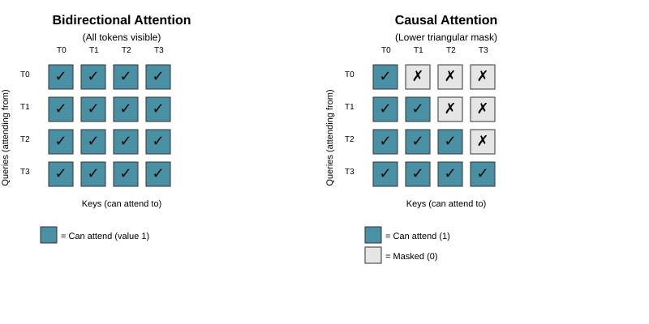
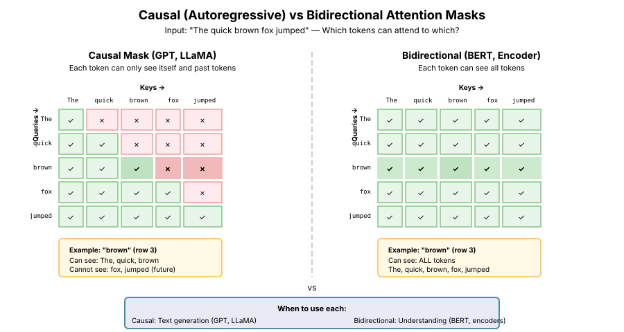
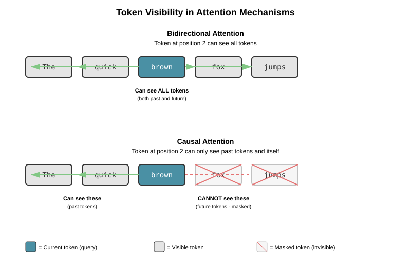
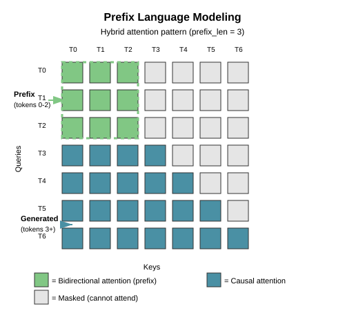

# Chapter 5: Bidirectional vs Causal Attention

Understanding when and how to mask attention is crucial for building effective transformer models. This chapter explores two fundamental attention patterns: bidirectional (full) attention used in BERT-style encoders, and causal (masked) attention used in GPT-style autoregressive models.

## Table of Contents

1. [Overview](#overview)
2. [Bidirectional (Full) Attention](#bidirectional-full-attention)
   - [Concept and Use Cases](#concept-and-use-cases)
   - [Mathematical Formulation](#mathematical-formulation)
   - [Implementation](#implementation)
3. [Causal (Masked) Attention](#causal-masked-attention)
   - [Autoregressive Modeling](#autoregressive-modeling)
   - [Causal Mask Construction](#causal-mask-construction)
   - [Implementation](#causal-implementation)
4. [Attention Masks in Detail](#attention-masks-in-detail)
   - [Mask Types](#mask-types)
   - [Combining Masks](#combining-masks)
   - [Padding Masks](#padding-masks)
5. [Encoder vs Decoder Architectures](#encoder-vs-decoder-architectures)
6. [Practical Considerations](#practical-considerations)
7. [Performance Implications](#performance-implications)
8. [Complete Examples](#complete-examples)
9. [Summary](#summary)
10. [Exercises](#exercises)

---

## Overview

Attention mechanisms allow tokens to attend to other tokens in a sequence, but not all attention patterns are appropriate for all tasks:

| Attention Type | Description | Used In | Key Property |
|----------------|-------------|---------|--------------|
| **Bidirectional** | Each token attends to all tokens | BERT, encoders | Context from both directions |
| **Causal** | Each token attends only to previous tokens | GPT, decoders | Cannot see future tokens |
| **Cross-Attention** | Attend to different sequence | Encoder-decoder | See [Chapter 6](06-cross-attention.md) |

The choice between bidirectional and causal attention fundamentally determines what tasks your model can perform:

- **Bidirectional attention** is ideal for understanding tasks: classification, named entity recognition, question answering
- **Causal attention** is essential for generation tasks: text generation, code completion, language modeling

---

## Bidirectional (Full) Attention

### Concept and Use Cases

Bidirectional attention allows each token to attend to **all** tokens in the sequence, including both previous and future tokens. This provides rich contextual information from both directions.

**Example:** Consider the sentence "The bank by the river was steep."

With bidirectional attention:

- "bank" can attend to both "river" (right) and "the" (left)
- This helps disambiguate "bank" (riverbank vs financial institution)

**Use Cases:**

1. **Text Classification**: Sentiment analysis, topic classification
2. **Named Entity Recognition (NER)**: Identifying entities in text
3. **Question Answering**: Understanding context to extract answers
4. **Masked Language Modeling**: BERT-style pre-training
5. **Encoders in Seq2Seq**: Processing source sequences

### Mathematical Formulation

Recall from [Chapter 3: Basic Attention](03-basic-attention.md) that scaled dot-product attention is:

```math
\text{Attention}(Q, K, V) = \text{softmax}\left(\frac{QK^T}{\sqrt{d_k}}\right)V
```

For bidirectional attention, we compute attention scores for **all** pairs of tokens:

```math
\text{Attention}_{\text{bi}}(Q, K, V) = \text{softmax}\left(\frac{QK^T}{\sqrt{d_k}}\right)V
```

where the attention score matrix $A = QK^T / \sqrt{d_k}$ is a full $n \times n$ matrix (where $n$ is sequence length), with no masking applied.

### Mathematical Formulation with Masks

When applying masks to attention, we formally define masked attention as:

```math
\text{Attention}(Q, K, V, M) = \text{softmax}\left(\frac{QK^T}{\sqrt{d_k}} \odot M + (1-M) \cdot (-\infty)\right)V
```

where:

- $M$ is a binary mask matrix with shape $(n, n)$
- $M_{ij} = 1$ if position $i$ can attend to position $j$, and $0$ otherwise
- $\odot$ denotes element-wise multiplication
- $(1-M) \cdot (-\infty)$ sets masked positions to $-\infty$ before softmax

**Why $-\infty$?**

Setting masked positions to $-\infty$ ensures they have zero probability after softmax:

```math
\text{softmax}(-\infty) = \frac{e^{-\infty}}{\sum_j e^{s_j}} = \frac{0}{\sum_j e^{s_j}} = 0
```

**Practical Implementation:**

In code, we typically apply masks directly to the score matrix before softmax:

```math
S_{\text{masked}} = S \odot M + (1-M) \cdot (-\infty)
```

or equivalently using `masked_fill`:

```python
scores = scores.masked_fill(mask == 0, float('-inf'))
```

**Attention Score Matrix (Bidirectional):**

For a sequence of length 4, all positions can attend to all positions:



The figure above shows the key difference between bidirectional and causal attention masks:

- **Left (Bidirectional)**: Full matrix with all 1s - each token can attend to all tokens
- **Right (Causal)**: Lower triangular matrix - each token can only attend to previous tokens and itself

### Implementation

**Problem Being Solved:**

In many NLP tasks like sentiment analysis, named entity recognition, or question answering, we need the model to understand the full context of each word before making predictions. A word's meaning often depends on both the words that come before it AND after it. For instance, in "The bank by the river," we can't correctly interpret "bank" without seeing "river" afterwards.

**Theoretical Justification:**

Bidirectional attention implements the full self-attention mechanism from the original Transformer paper without any masking constraints. The key theoretical insight is that when we don't need to generate sequences autoregressively, we can allow each position to access information from the entire input sequence. This creates richer representations because:

1. **Contextual Ambiguity Resolution**: Words with multiple meanings are disambiguated using both left and right context
2. **Long-Range Dependencies**: Information can flow freely in both directions without positional constraints
3. **Parallel Computation**: All position-to-position relationships are computed simultaneously

The attention mechanism computes a weighted sum of all value vectors, where weights are determined by the compatibility between queries and keys:

```math
\alpha_{ij} = \frac{\exp(q_i \cdot k_j / \sqrt{d_k})}{\sum_{j'} \exp(q_i \cdot k_{j'} / \sqrt{d_k})}
```

This allows position $i$ to "attend to" position $j$ with weight $\alpha_{ij}$ regardless of their relative positions.

**Relation to Alternatives:**

- **vs. Causal Attention**: Bidirectional attention uses the full $n \times n$ attention matrix, while causal attention masks out the upper triangle. This makes bidirectional unsuitable for generation but ideal for understanding.
- **vs. RNNs**: Unlike LSTMs/GRUs which process sequentially, bidirectional attention allows direct connections between all positions, avoiding the vanishing gradient problem for long-range dependencies.
- **vs. CNNs**: While CNNs use fixed-size local windows, attention dynamically focuses on relevant positions regardless of distance.

**Key Insights:**

1. **No Information Leakage Concerns**: Since we're not predicting future tokens, there's no risk of the model "cheating" by seeing answers during training
2. **Symmetric Attention**: The attention pattern is naturally symmetric for many understanding tasks
3. **Padding Handling**: We still need padding masks to prevent attending to padding tokens in variable-length sequences

```python
import torch
import torch.nn as nn
import math

class BidirectionalAttention(nn.Module):
    """Bidirectional (full) attention mechanism.

    Each token can attend to all tokens in the sequence,
    including both past and future tokens.

    Args:
        d_model: Dimension of the model
        dropout: Dropout probability (default: 0.1)
    """
    def __init__(self, d_model: int, dropout: float = 0.1):
        super().__init__()
        self.d_model = d_model
        self.dropout = nn.Dropout(dropout)

    def forward(
        self,
        query: torch.Tensor,  # (batch, seq_len, d_model)
        key: torch.Tensor,    # (batch, seq_len, d_model)
        value: torch.Tensor,  # (batch, seq_len, d_model)
        mask: torch.Tensor = None  # Optional padding mask
    ) -> tuple[torch.Tensor, torch.Tensor]:
        """
        Args:
            query: Query tensor
            key: Key tensor
            value: Value tensor
            mask: Optional padding mask (1 for valid, 0 for padding)

        Returns:
            output: Attention output (batch, seq_len, d_model)
            attention_weights: Attention weights (batch, seq_len, seq_len)
        """
        # Compute attention scores
        scores = torch.matmul(query, key.transpose(-2, -1))  # (batch, seq_len, seq_len)
        scores = scores / math.sqrt(self.d_model)

        # Apply padding mask if provided
        if mask is not None:
            # mask shape: (batch, seq_len) or (batch, 1, seq_len)
            if mask.dim() == 2:
                mask = mask.unsqueeze(1)  # (batch, 1, seq_len)
            # Expand mask to (batch, seq_len, seq_len)
            mask = mask.unsqueeze(1).expand(-1, scores.size(1), -1)
            scores = scores.masked_fill(mask == 0, float('-inf'))

        # Compute attention weights
        attention_weights = torch.softmax(scores, dim=-1)
        attention_weights = self.dropout(attention_weights)

        # Apply attention to values
        output = torch.matmul(attention_weights, value)

        return output, attention_weights


# Example usage
def test_bidirectional_attention():
    """Test bidirectional attention on a simple sequence."""
    batch_size = 2
    seq_len = 5
    d_model = 8

    # Create sample input
    x = torch.randn(batch_size, seq_len, d_model)

    # Initialize attention
    attention = BidirectionalAttention(d_model)

    # Forward pass (Q, K, V all from same input for self-attention)
    output, attn_weights = attention(x, x, x)

    print(f"Input shape: {x.shape}")
    print(f"Output shape: {output.shape}")
    print(f"Attention weights shape: {attn_weights.shape}")
    print(f"\nAttention weights for first item in batch:")
    print(attn_weights[0].detach().numpy())
    print(f"\nEach row sums to 1: {attn_weights[0].sum(dim=-1)}")

if __name__ == "__main__":
    test_bidirectional_attention()
```

**Key Points:**

- No masking means all positions can attend to all other positions
- Each row of the attention matrix sums to 1 (after softmax)
- Padding masks can still be applied to ignore padding tokens

---

## Causal (Masked) Attention

### Autoregressive Modeling

Causal attention is essential for autoregressive models, where we generate one token at a time and cannot "peek" at future tokens during training or generation.

**Why Causal?**

When training a language model to predict the next token, we must ensure the model cannot see future tokens:

```text
Input:     "The cat sat on the"
Target:    "cat sat on the mat"
           ↑   ↑   ↑   ↑   ↑
Predict:   cat sat on the mat (without seeing future!)
```

If we allowed the model to see "mat" when predicting "cat", it would cheat and learn nothing useful.

**Autoregressive Generation:**

During generation, we produce tokens sequentially:

```text
Step 1: "The" → predict "cat"
Step 2: "The cat" → predict "sat"
Step 3: "The cat sat" → predict "on"
...
```

At each step, we can only use previously generated tokens.

### Causal Mask Construction

A causal mask is a lower triangular matrix that prevents attention to future positions:



The diagram above shows how causal and bidirectional masks differ using a concrete example with "The quick brown fox jumped". In the causal mask (left), each token can only attend to itself and previous tokens - "brown" can see "The" and "quick" but not "fox" or "jumped". In the bidirectional mask (right), every token can attend to every other token, enabling full context access.

```python
def create_causal_mask(seq_len: int) -> torch.Tensor:
    """Create a causal (lower triangular) mask.

    Args:
        seq_len: Sequence length

    Returns:
        mask: Boolean mask of shape (seq_len, seq_len)
              True for positions that can be attended to
              False for future positions that should be masked
    """
    # Create lower triangular matrix
    mask = torch.tril(torch.ones(seq_len, seq_len))
    return mask.bool()


# Example: Causal mask for sequence length 4
mask = create_causal_mask(4)
print("Causal mask (1 = can attend, 0 = masked):")
print(mask.int())
```

Output:

```text
Causal mask (1 = can attend, 0 = masked):
tensor([[1, 0, 0, 0],
        [1, 1, 0, 0],
        [1, 1, 1, 0],
        [1, 1, 1, 1]])
```

**Visualization:**



The figure above illustrates what each token can "see" in different attention mechanisms:

- **Bidirectional**: Token "brown" (position 2) can attend to all tokens in both directions
- **Causal**: Token "brown" (position 2) can only attend to previous tokens ("The", "quick") and itself; future tokens ("fox", "jumps") are masked out

### Causal Implementation

**Problem Being Solved:**

During autoregressive generation (e.g., language modeling), we must prevent the model from accessing future tokens that haven't been generated yet. This creates a critical challenge: during training, we have access to the entire target sequence, but we must simulate the sequential generation process to ensure the model learns patterns that will work during actual inference.

**Theoretical Justification:**

Causal attention ensures that the probability distribution we learn during training matches what we'll use during generation. Formally, in language modeling we want to model:

```math
P(x_1, x_2, \ldots, x_n) = \prod_{t=1}^{n} P(x_t \mid x_1, \ldots, x_{t-1})
```

By masking future positions, we enforce that the representation at position $t$ depends only on positions $1$ through $t$. This is implemented via a causal (lower triangular) mask:

```math
\text{Mask}_{ij} = \begin{cases}
1 & \text{if } i \geq j \\
0 & \text{if } i < j
\end{cases}
```

When applied before softmax (by setting masked positions to $-\infty$), this ensures that attention weights for future positions are exactly zero.

**Relation to Alternatives:**

- **vs. Bidirectional Attention**: Causal attention restricts information flow to maintain causality, sacrificing bidirectional context for the ability to generate sequences
- **vs. Traditional RNNs**: Both enforce causality, but attention can be computed in parallel during training (while RNNs must process sequentially), and attention provides direct access to all previous states without the bottleneck of a single hidden state
- **vs. Teacher Forcing without Masking**: Without causal masking, the model could learn to copy future tokens rather than predict them, leading to poor generation quality

**Key Insights:**

1. **Training-Inference Consistency**: The causal mask ensures training mimics inference conditions, preventing exposure bias
2. **Parallel Training**: Despite the sequential dependencies, we can compute attention for all positions in parallel during training by using the mask
3. **KV Caching Opportunity**: The causal structure enables caching key and value vectors during generation, reducing computation from $O(n^2)$ to $O(n)$ per new token
4. **Lower Triangular Structure**: The mask forms a lower triangular matrix, which is computationally easy to construct and apply

```python
class CausalAttention(nn.Module):
    """Causal (masked) attention for autoregressive models.

    Each token can only attend to previous tokens and itself,
    preventing information flow from future positions.

    Args:
        d_model: Dimension of the model
        dropout: Dropout probability (default: 0.1)
    """
    def __init__(self, d_model: int, dropout: float = 0.1):
        super().__init__()
        self.d_model = d_model
        self.dropout = nn.Dropout(dropout)
        # We'll create the mask on-the-fly to handle variable sequence lengths

    def forward(
        self,
        query: torch.Tensor,  # (batch, seq_len, d_model)
        key: torch.Tensor,    # (batch, seq_len, d_model)
        value: torch.Tensor,  # (batch, seq_len, d_model)
        mask: torch.Tensor = None  # Optional additional mask
    ) -> tuple[torch.Tensor, torch.Tensor]:
        """
        Args:
            query: Query tensor
            key: Key tensor
            value: Value tensor
            mask: Optional additional mask (e.g., padding mask)

        Returns:
            output: Attention output (batch, seq_len, d_model)
            attention_weights: Attention weights (batch, seq_len, seq_len)
        """
        batch_size, seq_len, _ = query.shape

        # Compute attention scores
        scores = torch.matmul(query, key.transpose(-2, -1))  # (batch, seq_len, seq_len)
        scores = scores / math.sqrt(self.d_model)

        # Create causal mask
        causal_mask = torch.tril(torch.ones(seq_len, seq_len, device=query.device))
        causal_mask = causal_mask.bool()

        # Apply causal mask
        scores = scores.masked_fill(~causal_mask, float('-inf'))

        # Apply additional mask if provided (e.g., padding mask)
        if mask is not None:
            if mask.dim() == 2:
                mask = mask.unsqueeze(1)  # (batch, 1, seq_len)
            mask = mask.unsqueeze(1).expand(-1, seq_len, -1)
            scores = scores.masked_fill(mask == 0, float('-inf'))

        # Compute attention weights
        attention_weights = torch.softmax(scores, dim=-1)
        attention_weights = self.dropout(attention_weights)

        # Apply attention to values
        output = torch.matmul(attention_weights, value)

        return output, attention_weights


# Example usage
def test_causal_attention():
    """Test causal attention and visualize masking."""
    batch_size = 1
    seq_len = 5
    d_model = 8

    # Create sample input
    x = torch.randn(batch_size, seq_len, d_model)

    # Initialize attention
    attention = CausalAttention(d_model, dropout=0.0)  # No dropout for visualization

    # Forward pass
    output, attn_weights = attention(x, x, x)

    print(f"Input shape: {x.shape}")
    print(f"Output shape: {output.shape}")
    print(f"Attention weights shape: {attn_weights.shape}")
    print(f"\nCausal attention weights (each row sums to 1):")
    print(attn_weights[0].detach().numpy())
    print(f"\nNote: Upper triangle is zero (masked out)")

if __name__ == "__main__":
    test_causal_attention()
```

---

## Attention Masks in Detail

### Mask Convention Warning

**IMPORTANT:** Different frameworks and libraries use **opposite** mask conventions. Always check the documentation!

| Framework/Library | Convention | True/1 means | False/0 means |
|-------------------|-----------|--------------|---------------|
| **Custom implementations** (this chapter) | Positive masking | Can attend | Cannot attend (masked) |
| **PyTorch `nn.MultiheadAttention`** | Negative masking | **Cannot attend (masked)** | Can attend |
| **HuggingFace Transformers** | Positive masking | Can attend | Cannot attend (masked) |
| **TensorFlow** | Negative masking | **Cannot attend (masked)** | Can attend |

**Example - Causal Mask:**

```python
import torch
import torch.nn as nn

seq_len = 4

# Custom implementation (this chapter): 1 = can attend
custom_causal_mask = torch.tril(torch.ones(seq_len, seq_len))
print("Custom (1=can attend):")
print(custom_causal_mask.int())
# [[1, 0, 0, 0],
#  [1, 1, 0, 0],
#  [1, 1, 1, 0],
#  [1, 1, 1, 1]]

# PyTorch nn.MultiheadAttention: True = MASKED (opposite!)
pytorch_causal_mask = torch.triu(torch.ones(seq_len, seq_len), diagonal=1).bool()
print("\nPyTorch nn.MultiheadAttention (True=masked):")
print(pytorch_causal_mask)
# [[False,  True,  True,  True],
#  [False, False,  True,  True],
#  [False, False, False,  True],
#  [False, False, False, False]]

# Using with PyTorch's MultiheadAttention
attn = nn.MultiheadAttention(embed_dim=64, num_heads=8, batch_first=True)
x = torch.randn(2, seq_len, 64)

# Note: attn_mask uses opposite convention!
output, weights = attn(x, x, x, attn_mask=pytorch_causal_mask)
```

**Why the difference?**

- **Positive masking** (1=attend): More intuitive, mask indicates valid positions
- **Negative masking** (1=masked): Used in some frameworks for historical reasons

**Best Practice:**

1. Always read the documentation for the specific library you're using
2. Test with a simple example to verify mask behavior
3. Add comments in your code explaining the convention
4. Be extra careful when porting code between frameworks

### Mask Types

There are several types of masks commonly used in transformers:

#### 1. Causal Mask (Look-Ahead Mask)

Prevents attending to future positions:

```python
def causal_mask(seq_len: int) -> torch.Tensor:
    """Lower triangular mask for autoregressive models."""
    return torch.tril(torch.ones(seq_len, seq_len)).bool()
```

#### 2. Padding Mask

Prevents attending to padding tokens:

```python
def padding_mask(seq: torch.Tensor, pad_idx: int = 0) -> torch.Tensor:
    """Create mask for padding tokens.

    Args:
        seq: Input sequence (batch, seq_len) with token indices
        pad_idx: Index used for padding (default: 0)

    Returns:
        mask: Boolean mask (batch, seq_len), True for real tokens
    """
    return seq != pad_idx
```

#### 3. Custom Masks

You can create custom masks for specific patterns:

```python
def block_diagonal_mask(seq_len: int, block_size: int) -> torch.Tensor:
    """Create a block diagonal mask.

    Useful for processing multiple independent sequences in parallel.
    """
    mask = torch.zeros(seq_len, seq_len)
    num_blocks = seq_len // block_size
    for i in range(num_blocks):
        start = i * block_size
        end = start + block_size
        mask[start:end, start:end] = 1
    return mask.bool()
```

### Combining Masks

**Problem Being Solved:**

In real-world applications, we often face multiple masking requirements simultaneously. For example, in a batch of variable-length sequences for language modeling, we need both:

1. **Causal masking** to prevent attending to future tokens (for autoregressive modeling)
2. **Padding masking** to prevent attending to padding tokens (for computational efficiency in batched processing)

These constraints must be applied together correctly, or the model will either cheat (by seeing future tokens) or produce incorrect results (by attending to meaningless padding).

**Theoretical Justification:**

Mathematically, combining masks is a logical conjunction operation. A position $i$ can attend to position $j$ if and only if:

- The causal constraint is satisfied: $i \geq j$ (for autoregressive models)
- The padding constraint is satisfied: position $j$ is not a padding token

We implement this using the logical AND operation:

```math
\text{CombinedMask}_{ij} = \text{CausalMask}_{ij} \land \text{PaddingMask}_{j}
```

Note that padding mask is position-specific (depends only on $j$), while causal mask is pair-specific (depends on both $i$ and $j$).

**Relation to Alternatives:**

- **Sequential Masking**: We could apply masks one at a time, but this is computationally less efficient than combining them first
- **Separate Mask Application**: Some implementations apply masks at different stages, but combining them upfront ensures clarity and prevents bugs
- **Implicit Masking**: Some frameworks handle padding implicitly, but explicit combination gives more control and transparency

**Key Insights:**

1. **Broadcasting**: The padding mask needs to be broadcast from shape `(batch, seq_len)` to `(batch, seq_len, seq_len)` to combine with the causal mask
2. **Logical AND**: We use element-wise AND (`&`) rather than addition or multiplication to properly combine boolean masks
3. **Order Independence**: Since AND is commutative, the order of combining masks doesn't matter
4. **Batch Dimension**: Padding masks are batch-specific (different sequences have different lengths), while causal masks are universal (same for all sequences)

Often, you need to combine multiple masks (e.g., causal + padding):

```python
def combine_masks(
    causal_mask: torch.Tensor,  # (seq_len, seq_len)
    padding_mask: torch.Tensor,  # (batch, seq_len)
) -> torch.Tensor:
    """Combine causal and padding masks.

    Args:
        causal_mask: Causal mask (seq_len, seq_len)
        padding_mask: Padding mask (batch, seq_len)

    Returns:
        combined_mask: Combined mask (batch, seq_len, seq_len)
    """
    batch_size, seq_len = padding_mask.shape

    # Expand causal mask to batch dimension
    causal = causal_mask.unsqueeze(0).expand(batch_size, -1, -1)

    # Expand padding mask to attention dimension
    # Padding mask: (batch, seq_len) -> (batch, 1, seq_len) -> (batch, seq_len, seq_len)
    padding = padding_mask.unsqueeze(1).expand(-1, seq_len, -1)

    # Combine with logical AND
    combined = causal & padding

    return combined


# Example: Combining masks
def test_combined_masks():
    """Test combining causal and padding masks."""
    seq_len = 6
    batch_size = 2

    # Create sequences with padding (0 = padding)
    seq = torch.tensor([
        [1, 2, 3, 4, 5, 0],  # Last token is padding
        [1, 2, 3, 0, 0, 0],  # Last three tokens are padding
    ])

    # Create masks
    causal = causal_mask(seq_len)
    padding = padding_mask(seq)
    combined = combine_masks(causal, padding)

    print("Causal mask:")
    print(causal.int())
    print("\nPadding mask (batch 0):")
    print(padding[0].int())
    print("\nPadding mask (batch 1):")
    print(padding[1].int())
    print("\nCombined mask (batch 0):")
    print(combined[0].int())
    print("\nCombined mask (batch 1):")
    print(combined[1].int())

if __name__ == "__main__":
    test_combined_masks()
```

### Padding Masks

Padding masks ensure that padding tokens don't contribute to attention:

```python
class AttentionWithPadding(nn.Module):
    """Attention with proper padding mask handling.

    Demonstrates how to handle variable-length sequences with padding.
    """
    def __init__(self, d_model: int, causal: bool = False, dropout: float = 0.1):
        super().__init__()
        self.d_model = d_model
        self.causal = causal
        self.dropout = nn.Dropout(dropout)

    def forward(
        self,
        query: torch.Tensor,  # (batch, seq_len, d_model)
        key: torch.Tensor,
        value: torch.Tensor,
        key_padding_mask: torch.Tensor = None  # (batch, seq_len), True for valid tokens
    ) -> tuple[torch.Tensor, torch.Tensor]:
        """
        Args:
            query, key, value: QKV tensors
            key_padding_mask: Mask for padding tokens (True for valid, False for padding)
        """
        batch_size, seq_len, _ = query.shape

        # Compute attention scores
        scores = torch.matmul(query, key.transpose(-2, -1)) / math.sqrt(self.d_model)

        # Create mask (starts as all ones)
        mask = torch.ones(seq_len, seq_len, device=query.device, dtype=torch.bool)

        # Apply causal mask if needed
        if self.causal:
            causal_mask = torch.tril(torch.ones(seq_len, seq_len, device=query.device))
            mask = mask & causal_mask.bool()

        # Apply padding mask if provided
        if key_padding_mask is not None:
            # key_padding_mask: (batch, seq_len)
            # We need to broadcast this to (batch, seq_len, seq_len)
            # A position can attend to a key only if that key is not padding
            padding_mask = key_padding_mask.unsqueeze(1).expand(-1, seq_len, -1)
            mask = mask.unsqueeze(0) & padding_mask
        else:
            mask = mask.unsqueeze(0).expand(batch_size, -1, -1)

        # Apply mask to scores
        scores = scores.masked_fill(~mask, float('-inf'))

        # Compute attention weights
        attention_weights = torch.softmax(scores, dim=-1)

        # Replace NaN values (can occur if entire row is masked) with 0
        attention_weights = attention_weights.masked_fill(torch.isnan(attention_weights), 0.0)

        attention_weights = self.dropout(attention_weights)

        # Apply attention to values
        output = torch.matmul(attention_weights, value)

        return output, attention_weights
```

---

## Encoder vs Decoder Architectures

Understanding the relationship between attention types and architecture is crucial:

### BERT-Style Encoder (Bidirectional)

```python
class EncoderLayer(nn.Module):
    """Transformer encoder layer with bidirectional attention.

    Used in BERT-style models for understanding tasks.
    """
    def __init__(self, d_model: int, n_heads: int, d_ff: int, dropout: float = 0.1):
        super().__init__()
        self.self_attn = nn.MultiheadAttention(d_model, n_heads, dropout=dropout, batch_first=True)
        self.ffn = nn.Sequential(
            nn.Linear(d_model, d_ff),
            nn.GELU(),
            nn.Dropout(dropout),
            nn.Linear(d_ff, d_model),
            nn.Dropout(dropout)
        )
        self.norm1 = nn.LayerNorm(d_model)
        self.norm2 = nn.LayerNorm(d_model)

    def forward(self, x: torch.Tensor, mask: torch.Tensor = None) -> torch.Tensor:
        """
        Args:
            x: Input (batch, seq_len, d_model)
            mask: Optional padding mask
        """
        # Self-attention with residual connection
        # Note: No causal mask, so this is bidirectional
        attn_out, _ = self.self_attn(x, x, x, key_padding_mask=mask)
        x = self.norm1(x + attn_out)

        # Feed-forward network with residual connection
        ffn_out = self.ffn(x)
        x = self.norm2(x + ffn_out)

        return x
```

### GPT-Style Decoder (Causal)

```python
class DecoderLayer(nn.Module):
    """Transformer decoder layer with causal attention.

    Used in GPT-style models for generation tasks.
    """
    def __init__(self, d_model: int, n_heads: int, d_ff: int, dropout: float = 0.1):
        super().__init__()
        self.self_attn = nn.MultiheadAttention(d_model, n_heads, dropout=dropout, batch_first=True)
        self.ffn = nn.Sequential(
            nn.Linear(d_model, d_ff),
            nn.GELU(),
            nn.Dropout(dropout),
            nn.Linear(d_ff, d_model),
            nn.Dropout(dropout)
        )
        self.norm1 = nn.LayerNorm(d_model)
        self.norm2 = nn.LayerNorm(d_model)

    def forward(self, x: torch.Tensor, mask: torch.Tensor = None) -> torch.Tensor:
        """
        Args:
            x: Input (batch, seq_len, d_model)
            mask: Optional padding mask (causal mask is automatic)
        """
        batch_size, seq_len, _ = x.shape

        # Create causal mask
        causal_mask = torch.triu(torch.ones(seq_len, seq_len, device=x.device), diagonal=1).bool()

        # Self-attention with causal mask
        attn_out, _ = self.self_attn(
            x, x, x,
            attn_mask=causal_mask,
            key_padding_mask=mask
        )
        x = self.norm1(x + attn_out)

        # Feed-forward network
        ffn_out = self.ffn(x)
        x = self.norm2(x + ffn_out)

        return x
```

**Key Differences:**

| Aspect | Encoder (BERT) | Decoder (GPT) |
|--------|----------------|---------------|
| Attention Type | Bidirectional | Causal |
| Use Case | Understanding | Generation |
| Training Objective | Masked LM (MLM) | Next token prediction |
| Can see future? | Yes | No |
| Examples | BERT, RoBERTa, ALBERT | GPT-2/3/4, LLaMA, Claude |

See [Chapter 11: Building a Complete Transformer](11-complete-transformer.md) for full encoder-decoder architectures.

---

## Practical Considerations

### When to Use Bidirectional Attention

Use bidirectional attention when:

1. **Task requires full context**: Classification, NER, QA
2. **No generation needed**: The model doesn't produce sequences
3. **Training with MLM**: Using masked language modeling
4. **Fixed-length outputs**: Like classification labels

**Example Tasks:**

- Sentiment classification: "This movie is great!" → Positive
- Named Entity Recognition: "Apple is in Cupertino" → [ORG] [LOC]
- Question Answering: Extract answer span from context

### When to Use Causal Attention

Use causal attention when:

1. **Autoregressive generation**: Producing sequences token-by-token
2. **Language modeling**: Predicting next tokens
3. **Preventing information leakage**: Training must match inference
4. **Streaming applications**: Processing text incrementally

**Example Tasks:**

- Text generation: "Once upon a time" → continue the story
- Code completion: "def fibonacci(" → complete the function
- Language modeling: Evaluate likelihood of sequences

### Hybrid Approaches

Some models use both:

**T5 (Encoder-Decoder):**

- Encoder: Bidirectional attention on input
- Decoder: Causal self-attention + cross-attention to encoder

**Prefix LM:**

- Bidirectional attention on prefix (prompt)
- Causal attention on generated tokens

**Problem Being Solved:**

In many generation tasks, we have a prefix (like a prompt or instruction) that provides context, followed by generated completion. For the prefix, we want bidirectional attention (to fully understand the context), but for generation we need causal attention. This hybrid approach combines the benefits of both: rich understanding of the input with proper autoregressive generation.

**Theoretical Justification:**

Prefix language modeling creates a hybrid attention pattern:

```math
\text{Mask}_{ij} = \begin{cases}
1 & \text{if } i, j < \text{prefix\_len} \text{ (bidirectional on prefix)} \\
1 & \text{if } i \geq \text{prefix\_len} \text{ and } j \leq i \text{ (causal after prefix)} \\
0 & \text{otherwise}
\end{cases}
```

This allows the model to:

1. Fully understand the prefix using bidirectional context
2. Generate coherently using causal attention
3. Attend from generated tokens back to the prefix

The objective combines both:

```math
\mathcal{L} = -\sum_{t=\text{prefix\_len}}^{T} \log P(x_t \mid x_{\text{prefix}}, x_{\text{prefix\_len}}, \ldots, x_{t-1})
```

**Relation to Alternatives:**

- **vs. Pure Causal (GPT)**: Prefix LM allows richer understanding of the input context through bidirectional attention
- **vs. Pure Bidirectional (BERT)**: Prefix LM can still generate autoregressively after the prefix
- **vs. Encoder-Decoder (T5)**: Prefix LM uses a single model with one attention pattern, rather than separate encoder/decoder

**Key Insights:**

1. **Attention Asymmetry**: Prefix tokens attend bidirectionally within prefix; generated tokens attend causally to everything
2. **Boundary Handling**: The transition at `prefix_len` must be handled carefully to maintain the correct attention pattern
3. **Training Flexibility**: This approach works well for instruction-following models where the instruction is the prefix
4. **Generation Quality**: Bidirectional understanding of the prefix can improve generation quality

```python
def create_prefix_lm_mask(seq_len: int, prefix_len: int) -> torch.Tensor:
    """Create mask for prefix language modeling.

    Tokens in the prefix can attend bidirectionally to the prefix.
    Tokens after the prefix use causal attention to everything.

    Args:
        seq_len: Total sequence length
        prefix_len: Length of the bidirectional prefix

    Returns:
        mask: Attention mask (seq_len, seq_len)
    """
    mask = torch.zeros(seq_len, seq_len)

    # Prefix tokens can attend to all prefix tokens (bidirectional)
    mask[:prefix_len, :prefix_len] = 1

    # Generated tokens use causal attention to everything
    for i in range(prefix_len, seq_len):
        mask[i, :i+1] = 1  # Can attend to prefix + previous generated tokens

    return mask.bool()


# Example: Prefix LM mask
prefix_mask = create_prefix_lm_mask(seq_len=8, prefix_len=3)
print("Prefix LM mask (prefix_len=3):")
print(prefix_mask.int())
```

**Visualization of Prefix LM Mask:**



This hybrid attention pattern shows:

- **Green cells (top-left)**: Prefix tokens (0-2) use bidirectional attention within the prefix
- **Blue cells (lower-left)**: Generated tokens (3+) use causal attention to all previous tokens including the prefix
- **Gray cells**: Masked positions that cannot be attended to

---

## Performance Implications

### Computational Complexity

Both bidirectional and causal attention have the same asymptotic complexity:

```math
\text{Time Complexity: } O(n^2 d)
```
```math
\text{Space Complexity: } O(n^2)
```

where $n$ is sequence length and $d$ is model dimension.

**However**, causal attention can be optimized during **autoregressive generation**:

### KV Caching for Causal Attention

**Problem Being Solved:**

During autoregressive text generation, we generate one token at a time. At each step, we need to compute attention over all previously generated tokens. Without optimization, this means recomputing the keys and values for all previous tokens at each step, leading to $O(n^2)$ complexity for generating $n$ tokens. For long sequences, this becomes prohibitively expensive.

**Theoretical Justification:**

The key insight is that in causal attention, previously computed key and value vectors never change. When generating token $t$, we compute:

```math
\text{output}_t = \text{Attention}(q_t, [k_1, \ldots, k_t], [v_1, \ldots, v_t])
```

Since $k_1, \ldots, k_{t-1}$ and $v_1, \ldots, v_{t-1}$ were already computed in previous steps, we can cache them:

```math
\begin{align}
\text{cached}_K^{(t)} &= [k_1, \ldots, k_{t-1}] \\
\text{cached}_V^{(t)} &= [v_1, \ldots, v_{t-1}] \\
\text{output}_t &= \text{Attention}(q_t, [\text{cached}_K^{(t)}, k_t], [\text{cached}_V^{(t)}, v_t])
\end{align}
```

This reduces the computation per step from $O(t \cdot d)$ to $O(d)$ for computing new K,V pairs, though attention computation itself remains $O(t)$.

**Relation to Alternatives:**

- **vs. Recomputation**: Without caching, we'd recompute all K,V pairs at each step, wasting computation
- **vs. Bidirectional Attention**: Bidirectional attention cannot use KV caching because future context changes as new tokens are generated, requiring full recomputation
- **vs. State-Space Models**: Models like Mamba achieve $O(1)$ per-token generation by using fixed-size state, but may sacrifice some modeling capacity

**Key Insights:**

1. **Memory-Computation Tradeoff**: KV caching trades memory (storing all previous K,V pairs) for computation (not recomputing them)
2. **Linear Scaling**: Cache grows linearly with sequence length: $O(n \cdot d \cdot \text{layers})$
3. **Batch Efficiency**: For batch inference, cache size multiplies by batch size, becoming a significant memory bottleneck
4. **Layer-wise Caching**: Each transformer layer needs its own cache, multiplying memory requirements
5. **No Causal Mask Needed**: During generation with cache, we only compute attention for the current token, so no causal mask is required

During generation, causal attention allows for KV caching:

```python
class CausalAttentionWithCache(nn.Module):
    """Causal attention with KV caching for efficient generation.

    During autoregressive generation, we can cache previous K,V values
    and only compute new ones for the current token.
    """
    def __init__(self, d_model: int):
        super().__init__()
        self.d_model = d_model

    def forward(
        self,
        query: torch.Tensor,  # (batch, 1, d_model) for generation
        key: torch.Tensor,    # (batch, current_len, d_model)
        value: torch.Tensor,  # (batch, current_len, d_model)
        cached_k: torch.Tensor = None,  # Previous keys
        cached_v: torch.Tensor = None,  # Previous values
    ) -> tuple[torch.Tensor, torch.Tensor, torch.Tensor]:
        """
        Args:
            query: Query for current token
            key: Key for current token
            value: Value for current token
            cached_k: Cached keys from previous tokens
            cached_v: Cached values from previous tokens

        Returns:
            output: Attention output
            new_cached_k: Updated key cache
            new_cached_v: Updated value cache
        """
        # Concatenate with cache
        if cached_k is not None:
            key = torch.cat([cached_k, key], dim=1)
            value = torch.cat([cached_v, value], dim=1)

        # Compute attention (query is only for current token)
        scores = torch.matmul(query, key.transpose(-2, -1)) / math.sqrt(self.d_model)
        # No need for causal mask since query is only current token

        attn_weights = torch.softmax(scores, dim=-1)
        output = torch.matmul(attn_weights, value)

        return output, key, value  # Return updated cache


def demonstrate_kv_caching():
    """Demonstrate KV caching for efficient generation."""
    d_model = 64
    attention = CausalAttentionWithCache(d_model)

    # Initial cache
    cached_k, cached_v = None, None

    # Generate 5 tokens
    for i in range(5):
        # Current token query, key, value
        q = torch.randn(1, 1, d_model)  # Single token
        k = torch.randn(1, 1, d_model)
        v = torch.randn(1, 1, d_model)

        # Forward with cache
        output, cached_k, cached_v = attention(q, k, v, cached_k, cached_v)

        print(f"Step {i+1}: Cache size = {cached_k.shape[1]}")

    print(f"\nFinal cache contains keys/values for all {cached_k.shape[1]} tokens")

if __name__ == "__main__":
    demonstrate_kv_caching()
```

**Performance Benefit:**

- Without caching: $O(n^2)$ operations per new token
- With caching: $O(n)$ operations per new token

This is why GPT-style models (causal) can generate efficiently, while BERT-style models (bidirectional) cannot do incremental generation.

### KV Cache Memory Calculation

Understanding KV cache memory requirements is crucial for deploying large language models. Let's work through a detailed example.

**Setup:** Consider a 7B parameter GPT-style model with:

- Number of layers: 32
- Number of attention heads: 32
- Head dimension: 128
- Total model dimension: $d_{model} = 32 \times 128 = 4096$
- Maximum sequence length: 4096 tokens
- Batch size: 8
- Precision: FP16 (2 bytes per parameter)

**Memory Calculation:**

For each layer, we cache both K and V matrices. Each has shape:

```math
(batch\_size, num\_heads, seq\_len, head\_dim)
```

Memory per layer (in bytes):

```math
\begin{align}
\text{Memory}_{\text{layer}} &= 2 \times batch \times heads \times seq\_len \times head\_dim \times bytes \\
&= 2 \times 8 \times 32 \times 4096 \times 128 \times 2 \\
&= 2 \times 8 \times 32 \times 4096 \times 128 \times 2 \\
&= 536{,}870{,}912 \text{ bytes} \\
&= 512 \text{ MB per layer}
\end{align}
```

Total KV cache memory across all layers:

```math
\begin{align}
\text{Total KV Cache} &= \text{Memory}_{\text{layer}} \times num\_layers \\
&= 512 \text{ MB} \times 32 \\
&= 16{,}384 \text{ MB} \\
&= 16 \text{ GB}
\end{align}
```

**Compare to Model Weights:**

Model weights in FP16:

```math
\begin{align}
\text{Model Size} &= 7{,}000{,}000{,}000 \times 2 \text{ bytes} \\
&= 14{,}000 \text{ MB} \\
&= 14 \text{ GB}
\end{align}
```

**Key Insight:** The KV cache (16 GB) is actually **larger** than the model weights (14 GB) for this configuration!

**Scaling Analysis:**

Memory scales linearly with:

1. **Batch size**: Doubling batch size → doubles KV cache
2. **Sequence length**: Doubling context → doubles KV cache
3. **Number of layers**: More layers → more cache

**Problem Being Solved:**

When deploying large language models in production, understanding memory requirements is critical for capacity planning and cost estimation. The KV cache can consume more memory than the model weights themselves, yet is often overlooked in deployment planning. We need a systematic way to calculate and analyze these requirements across different configurations.

**Theoretical Justification:**

The KV cache memory requirement is determined by the storage needed for key and value matrices across all layers. For each layer, we store:

```math
\text{Memory}_{\text{layer}} = 2 \times B \times H \times L \times D \times P
```

where:

- $B$ = batch size (number of concurrent sequences)
- $H$ = number of attention heads
- $L$ = sequence length (context window)
- $D$ = head dimension
- $P$ = precision in bytes (2 for FP16, 4 for FP32)
- Factor of 2 accounts for both K and V caches

Total memory across $N$ layers:

```math
\text{Total Memory} = N \times \text{Memory}_{\text{layer}} = 2 \times N \times B \times H \times L \times D \times P
```

This scales linearly with each parameter, making it straightforward to predict but expensive for large models.

**Relation to Alternatives:**

- **Multi-Query Attention (MQA)**: Shares K,V across all heads, reducing memory by factor of $H$: $\text{Memory}_{\text{MQA}} = \text{Memory}_{\text{standard}} / H$
- **Grouped-Query Attention (GQA)**: Shares K,V across groups of heads, offering a middle ground between MQA and standard attention
- **Quantized Cache**: Using INT8 or INT4 reduces $P$ by 2-4x, though may impact quality slightly
- **Paged Attention (vLLM)**: Reduces fragmentation and enables dynamic allocation, but doesn't change total memory requirements

**Key Insights:**

1. **Dominates Model Size**: For long contexts, KV cache can exceed model parameter memory
2. **Batch Size Impact**: Cache scales linearly with batch size, making batching expensive
3. **Context Length Impact**: Doubling context doubles cache size - this is why models often limit context
4. **Per-Token Cost**: Cache per token is constant ($2 \times N \times H \times D \times P$ bytes), making it easy to budget
5. **Layer Scaling**: Deep models pay a multiplicative cost in cache memory

**Practical Implementation:**

```python
def calculate_kv_cache_memory(
    batch_size: int,
    num_layers: int,
    num_heads: int,
    head_dim: int,
    seq_len: int,
    bytes_per_param: int = 2  # FP16
) -> dict:
    """Calculate KV cache memory requirements.

    Args:
        batch_size: Batch size for inference
        num_layers: Number of transformer layers
        num_heads: Number of attention heads per layer
        head_dim: Dimension of each attention head
        seq_len: Maximum sequence length
        bytes_per_param: Bytes per parameter (2 for FP16, 4 for FP32)

    Returns:
        Dictionary with memory statistics in various units
    """
    # 2 for K and V caches
    cache_size_bytes = (
        2 * batch_size * num_layers * num_heads * seq_len * head_dim * bytes_per_param
    )

    cache_size_mb = cache_size_bytes / (1024 ** 2)
    cache_size_gb = cache_size_bytes / (1024 ** 3)

    # Per-token memory (useful for understanding scaling)
    per_token_bytes = cache_size_bytes / (batch_size * seq_len)
    per_token_kb = per_token_bytes / 1024

    # Per-layer memory
    per_layer_mb = cache_size_mb / num_layers

    return {
        'total_bytes': cache_size_bytes,
        'total_mb': cache_size_mb,
        'total_gb': cache_size_gb,
        'per_token_kb': per_token_kb,
        'per_layer_mb': per_layer_mb,
        'config': {
            'batch_size': batch_size,
            'num_layers': num_layers,
            'num_heads': num_heads,
            'head_dim': head_dim,
            'seq_len': seq_len,
            'precision': f'FP{bytes_per_param * 8}'
        }
    }


# Example: 7B parameter model
def example_kv_cache_analysis():
    """Analyze KV cache requirements for different scenarios."""

    # Base configuration (similar to LLaMA-7B)
    base_config = {
        'batch_size': 8,
        'num_layers': 32,
        'num_heads': 32,
        'head_dim': 128,
        'seq_len': 4096,
        'bytes_per_param': 2  # FP16
    }

    print("=" * 70)
    print("KV Cache Memory Analysis for 7B Model")
    print("=" * 70)

    # Scenario 1: Base configuration
    result = calculate_kv_cache_memory(**base_config)
    print("\nScenario 1: Standard Configuration")
    print(f"  Batch size: {result['config']['batch_size']}")
    print(f"  Sequence length: {result['config']['seq_len']}")
    print(f"  Precision: {result['config']['precision']}")
    print(f"  Total KV cache: {result['total_gb']:.2f} GB")
    print(f"  Per layer: {result['per_layer_mb']:.2f} MB")
    print(f"  Per token: {result['per_token_kb']:.2f} KB")

    # Scenario 2: Longer context
    long_context = base_config.copy()
    long_context['seq_len'] = 8192  # Double context
    result2 = calculate_kv_cache_memory(**long_context)
    print(f"\nScenario 2: 2x Longer Context ({long_context['seq_len']} tokens)")
    print(f"  Total KV cache: {result2['total_gb']:.2f} GB")
    print(f"  Increase: {(result2['total_gb'] / result['total_gb'] - 1) * 100:.0f}%")

    # Scenario 3: Batch size 1 (single user)
    single_user = base_config.copy()
    single_user['batch_size'] = 1
    result3 = calculate_kv_cache_memory(**single_user)
    print(f"\nScenario 3: Single User (batch=1)")
    print(f"  Total KV cache: {result3['total_gb']:.2f} GB")
    print(f"  Savings vs batch=8: {result['total_gb'] - result3['total_gb']:.2f} GB")

    # Scenario 4: FP32 precision
    fp32 = base_config.copy()
    fp32['bytes_per_param'] = 4
    result4 = calculate_kv_cache_memory(**fp32)
    print(f"\nScenario 4: FP32 Precision")
    print(f"  Total KV cache: {result4['total_gb']:.2f} GB")
    print(f"  Increase vs FP16: {(result4['total_gb'] / result['total_gb'] - 1) * 100:.0f}%")

    # Compare to model size
    model_params = 7_000_000_000
    model_size_gb = (model_params * 2) / (1024 ** 3)  # FP16
    print(f"\nComparison to Model Weights:")
    print(f"  Model size (FP16): {model_size_gb:.2f} GB")
    print(f"  KV cache (base): {result['total_gb']:.2f} GB")
    print(f"  Ratio (cache/model): {result['total_gb'] / model_size_gb:.2f}x")
    print(f"\n  💡 The KV cache is larger than the model itself!")

    print("\n" + "=" * 70)
    print("Key Takeaways:")
    print("  • KV cache scales linearly with batch size and sequence length")
    print("  • For long contexts, cache can exceed model size")
    print("  • Reducing batch size or using quantization saves memory")
    print("  • This is why context length is often limited in practice")
    print("=" * 70)


if __name__ == "__main__":
    example_kv_cache_analysis()
```

**Sample Output:**

```text
======================================================================
KV Cache Memory Analysis for 7B Model
======================================================================

Scenario 1: Standard Configuration
  Batch size: 8
  Sequence length: 4096
  Precision: FP16
  Total KV cache: 16.00 GB
  Per layer: 512.00 MB
  Per token: 128.00 KB

Scenario 2: 2x Longer Context (8192 tokens)
  Total KV cache: 32.00 GB
  Increase: 100%

Scenario 3: Single User (batch=1)
  Total KV cache: 2.00 GB
  Savings vs batch=8: 14.00 GB

Scenario 4: FP32 Precision
  Total KV cache: 32.00 GB
  Increase vs FP16: 100%

Comparison to Model Weights:
  Model size (FP16): 13.04 GB
  KV cache (base): 16.00 GB
  Ratio (cache/model): 1.23x

  💡 The KV cache is larger than the model itself!

======================================================================
Key Takeaways:
  • KV cache scales linearly with batch size and sequence length
  • For long contexts, cache can exceed model size
  • Reducing batch size or using quantization saves memory
  • This is why context length is often limited in practice
======================================================================
```

**Optimization Strategies:**

1. **Multi-Query Attention (MQA)**: Share K,V across heads → reduces cache by $num\_heads$ factor
2. **Grouped-Query Attention (GQA)**: Share K,V across groups of heads → balanced tradeoff
3. **Quantization**: Use INT8/INT4 for cache → 2-4x memory reduction
4. **Paged Attention**: Dynamic memory allocation (used in vLLM)
5. **Sequence parallelism**: Distribute cache across GPUs

### Memory Considerations

**Training:**

- Both require $O(n^2)$ memory for attention matrices
- Causal attention can use Flash Attention optimizations (see [Chapter 26: Flash Attention](13-flash-attention.md))

**Inference:**

- Bidirectional: Always computes full $O(n^2)$ attention
- Causal: Can use KV caching to reduce compute (not memory of cache itself)

---

## Complete Examples

### Example 1: BERT-Style Masked Language Modeling

**Problem Being Solved:**

BERT-style models need to learn contextual representations that capture word meaning in context, not just static word embeddings. The masked language modeling (MLM) task requires predicting masked tokens using bidirectional context, which is fundamentally different from left-to-right language modeling. We need an attention mechanism that can access full bidirectional context while being trainable with multi-head attention.

**Theoretical Justification:**

BERT's masked language modeling objective is:

```math
\mathcal{L}_{\text{MLM}} = -\mathbb{E}_{x \sim D} \left[ \sum_{i \in \text{masked}} \log P(x_i \mid x_{\backslash i}) \right]
```

where $x_{\backslash i}$ represents the sequence with position $i$ masked. Crucially, the model can use both left and right context to predict the masked token. This is implemented using bidirectional self-attention where each position can attend to all other positions.

The multi-head mechanism allows the model to attend to different representation subspaces simultaneously:

```math
\text{MultiHead}(Q, K, V) = \text{Concat}(\text{head}_1, \ldots, \text{head}_h)W^{O}
```

where each head computes:

```math
\text{head}_i = \text{Attention}(QW_i^{Q}, KW_i^{K}, VW_i^{V})
```

**Relation to Alternatives:**

- **vs. GPT (Causal)**: BERT's bidirectional attention provides richer representations for understanding tasks, but cannot generate text autoregressively
- **vs. ELMo**: While ELMo concatenates separate forward and backward LSTM representations, BERT jointly conditions on both directions through attention
- **vs. Word2Vec/GloVe**: Unlike static embeddings, BERT produces contextualized embeddings where "bank" has different representations in "river bank" vs "savings bank"

**Key Insights:**

1. **No Causal Mask**: Unlike GPT, we don't apply a causal mask because we're not doing autoregressive generation
2. **Multi-Head Projection**: Each head learns to focus on different aspects of context (syntax, semantics, etc.)
3. **Padding Mask Only**: We only need to mask padding tokens, not future positions
4. **Symmetric Dependencies**: The attention pattern is naturally symmetric for bidirectional understanding

```python
class BERTSelfAttention(nn.Module):
    """Self-attention for BERT (bidirectional).

    This is used in masked language modeling where tokens can
    attend to all other tokens in both directions.
    """
    def __init__(self, d_model: int, n_heads: int, dropout: float = 0.1):
        super().__init__()
        assert d_model % n_heads == 0

        self.d_model = d_model
        self.n_heads = n_heads
        self.head_dim = d_model // n_heads

        # Linear projections
        self.q_proj = nn.Linear(d_model, d_model)
        self.k_proj = nn.Linear(d_model, d_model)
        self.v_proj = nn.Linear(d_model, d_model)
        self.out_proj = nn.Linear(d_model, d_model)

        self.dropout = nn.Dropout(dropout)

    def forward(
        self,
        x: torch.Tensor,  # (batch, seq_len, d_model)
        padding_mask: torch.Tensor = None  # (batch, seq_len)
    ) -> torch.Tensor:
        batch_size, seq_len, _ = x.shape

        # Linear projections and reshape for multi-head
        Q = self.q_proj(x).view(batch_size, seq_len, self.n_heads, self.head_dim).transpose(1, 2)
        K = self.k_proj(x).view(batch_size, seq_len, self.n_heads, self.head_dim).transpose(1, 2)
        V = self.v_proj(x).view(batch_size, seq_len, self.n_heads, self.head_dim).transpose(1, 2)

        # Compute attention scores
        scores = torch.matmul(Q, K.transpose(-2, -1)) / math.sqrt(self.head_dim)

        # Apply padding mask if provided (no causal mask!)
        if padding_mask is not None:
            # padding_mask: (batch, seq_len) -> (batch, 1, 1, seq_len)
            mask = padding_mask.unsqueeze(1).unsqueeze(2)
            scores = scores.masked_fill(mask == 0, float('-inf'))

        # Attention weights and output
        attn_weights = torch.softmax(scores, dim=-1)
        attn_weights = self.dropout(attn_weights)

        output = torch.matmul(attn_weights, V)
        output = output.transpose(1, 2).contiguous().view(batch_size, seq_len, self.d_model)
        output = self.out_proj(output)

        return output


# Example: Masked Language Modeling
def test_bert_mlm():
    """Demonstrate BERT-style masked language modeling."""
    batch_size = 2
    seq_len = 10
    d_model = 64
    n_heads = 8

    # Create input with some masked tokens
    x = torch.randn(batch_size, seq_len, d_model)

    # Initialize BERT attention
    bert_attn = BERTSelfAttention(d_model, n_heads)

    # Forward pass (bidirectional)
    output = bert_attn(x)

    print(f"Input shape: {x.shape}")
    print(f"Output shape: {output.shape}")
    print("Each token attended to ALL other tokens (bidirectional)")

if __name__ == "__main__":
    test_bert_mlm()
```

### Example 2: GPT-Style Autoregressive Generation

**Problem Being Solved:**

GPT-style models need to generate coherent text by predicting one token at a time, where each prediction can only use previously generated tokens. During training, we have the full target sequence, but we must prevent the model from "peeking ahead" to maintain consistency between training and inference. We need an efficient implementation that enforces causality while supporting multi-head attention.

**Theoretical Justification:**

GPT models are trained using the language modeling objective:

```math
\mathcal{L}_{\text{LM}} = -\sum_{t=1}^{T} \log P(x_t \mid x_{<t})
```

The causal constraint ensures that $P(x_t \mid x_{<t})$ depends only on $x_1, \ldots, x_{t-1}$. This is enforced via a causal mask:

```math
\text{Attention}(Q, K, V) = \text{softmax}\left(\frac{QK^T}{\sqrt{d_k}} + M_{\text{causal}}\right)V
```

where $M_{\text{causal}}$ is a lower triangular mask with $-\infty$ in the upper triangle. This ensures:

```math
\alpha_{ij} = 0 \quad \text{for } i < j
```

preventing information flow from future to past.

**Relation to Alternatives:**

- **vs. BERT (Bidirectional)**: GPT sacrifices bidirectional context for the ability to generate sequences coherently
- **vs. RNN Language Models**: GPT processes the entire sequence in parallel during training (despite sequential dependencies), while RNNs must process sequentially
- **vs. Masked Prefix LM**: Some models use bidirectional attention on prefixes and causal on generated portions, but pure GPT uses causal throughout for simplicity

**Key Insights:**

1. **Causal Mask Registration**: We register the causal mask as a buffer (not a parameter) so it moves with the model to GPU/CPU and persists across forward passes
2. **Maximum Sequence Length**: We create a mask for the maximum possible sequence length upfront, then slice it as needed
3. **Combined with Padding**: The causal mask can be combined with padding masks for variable-length sequences
4. **Generation Efficiency**: During inference, this architecture enables KV caching for efficient token-by-token generation

```python
class GPTSelfAttention(nn.Module):
    """Self-attention for GPT (causal).

    This is used in autoregressive language modeling where tokens
    can only attend to previous tokens.
    """
    def __init__(self, d_model: int, n_heads: int, max_seq_len: int = 1024, dropout: float = 0.1):
        super().__init__()
        assert d_model % n_heads == 0

        self.d_model = d_model
        self.n_heads = n_heads
        self.head_dim = d_model // n_heads

        # Linear projections
        self.q_proj = nn.Linear(d_model, d_model)
        self.k_proj = nn.Linear(d_model, d_model)
        self.v_proj = nn.Linear(d_model, d_model)
        self.out_proj = nn.Linear(d_model, d_model)

        self.dropout = nn.Dropout(dropout)

        # Register causal mask as buffer (not a parameter)
        self.register_buffer(
            'causal_mask',
            torch.tril(torch.ones(max_seq_len, max_seq_len)).view(1, 1, max_seq_len, max_seq_len)
        )

    def forward(
        self,
        x: torch.Tensor,  # (batch, seq_len, d_model)
        padding_mask: torch.Tensor = None  # (batch, seq_len)
    ) -> torch.Tensor:
        batch_size, seq_len, _ = x.shape

        # Linear projections and reshape for multi-head
        Q = self.q_proj(x).view(batch_size, seq_len, self.n_heads, self.head_dim).transpose(1, 2)
        K = self.k_proj(x).view(batch_size, seq_len, self.n_heads, self.head_dim).transpose(1, 2)
        V = self.v_proj(x).view(batch_size, seq_len, self.n_heads, self.head_dim).transpose(1, 2)

        # Compute attention scores
        scores = torch.matmul(Q, K.transpose(-2, -1)) / math.sqrt(self.head_dim)

        # Apply causal mask (always for GPT)
        causal_mask = self.causal_mask[:, :, :seq_len, :seq_len]
        scores = scores.masked_fill(causal_mask == 0, float('-inf'))

        # Apply padding mask if provided
        if padding_mask is not None:
            mask = padding_mask.unsqueeze(1).unsqueeze(2)
            scores = scores.masked_fill(mask == 0, float('-inf'))

        # Attention weights and output
        attn_weights = torch.softmax(scores, dim=-1)
        attn_weights = self.dropout(attn_weights)

        output = torch.matmul(attn_weights, V)
        output = output.transpose(1, 2).contiguous().view(batch_size, seq_len, self.d_model)
        output = self.out_proj(output)

        return output


# Example: Autoregressive generation
def test_gpt_generation():
    """Demonstrate GPT-style autoregressive generation."""
    batch_size = 1
    seq_len = 10
    d_model = 64
    n_heads = 8

    # Create input
    x = torch.randn(batch_size, seq_len, d_model)

    # Initialize GPT attention
    gpt_attn = GPTSelfAttention(d_model, n_heads)

    # Forward pass (causal)
    output = gpt_attn(x)

    print(f"Input shape: {x.shape}")
    print(f"Output shape: {output.shape}")
    print("Each token attended to ONLY previous tokens (causal)")
    print("This ensures the model can't cheat during training")

if __name__ == "__main__":
    test_gpt_generation()
```

### Example 3: Comparing Both

```python
def compare_attention_patterns():
    """Visualize the difference between bidirectional and causal attention."""
    import matplotlib.pyplot as plt

    seq_len = 8
    d_model = 64

    # Create sample input
    x = torch.randn(1, seq_len, d_model)

    # Bidirectional attention
    bi_attn = BidirectionalAttention(d_model, dropout=0.0)
    _, bi_weights = bi_attn(x, x, x)

    # Causal attention
    causal_attn = CausalAttention(d_model, dropout=0.0)
    _, causal_weights = causal_attn(x, x, x)

    # Plot
    fig, (ax1, ax2) = plt.subplots(1, 2, figsize=(12, 5))

    # Bidirectional
    im1 = ax1.imshow(bi_weights[0].detach().numpy(), cmap='viridis')
    ax1.set_title('Bidirectional Attention\n(All positions visible)')
    ax1.set_xlabel('Key Position')
    ax1.set_ylabel('Query Position')
    plt.colorbar(im1, ax=ax1)

    # Causal
    im2 = ax2.imshow(causal_weights[0].detach().numpy(), cmap='viridis')
    ax2.set_title('Causal Attention\n(Only past positions visible)')
    ax2.set_xlabel('Key Position')
    ax2.set_ylabel('Query Position')
    plt.colorbar(im2, ax=ax2)

    plt.tight_layout()
    plt.savefig('attention_comparison.png', dpi=150, bbox_inches='tight')
    print("Saved visualization to attention_comparison.png")

if __name__ == "__main__":
    compare_attention_patterns()
```

---

## Summary

### Key Takeaways

1. **Bidirectional Attention**:
   - Each token can attend to all tokens in the sequence
   - Used for understanding tasks (classification, NER, QA)
   - Examples: BERT, RoBERTa, encoders in seq2seq models
   - Cannot be used for autoregressive generation

2. **Causal Attention**:
   - Each token can only attend to previous tokens and itself
   - Essential for autoregressive generation
   - Used in language modeling and text generation
   - Examples: GPT-2/3/4, LLaMA, Claude
   - Enables KV caching for efficient generation

3. **Attention Masks**:
   - **Causal mask**: Lower triangular matrix, prevents future attention
   - **Padding mask**: Prevents attention to padding tokens
   - **Combined masks**: Use logical AND to combine multiple masks
   - Masks are applied before softmax by setting masked positions to $-\infty$

4. **Architecture Patterns**:
   - **Encoder-only** (BERT): Bidirectional attention throughout
   - **Decoder-only** (GPT): Causal attention throughout
   - **Encoder-decoder** (T5): Bidirectional in encoder, causal + cross-attention in decoder

5. **Performance**:
   - Same computational complexity: $O(n^2 d)$
   - Causal attention enables KV caching: $O(n)$ per token during generation
   - Both can use Flash Attention optimizations

### Choosing the Right Attention

| Criterion | Bidirectional | Causal |
|-----------|---------------|--------|
| Task type | Understanding | Generation |
| Training objective | MLM, classification | Next token prediction |
| Can generate text? | No | Yes |
| Inference efficiency | Standard | KV caching |
| Context | Full sequence | Left-to-right |

### References

**Key Papers:**

1. Vaswani et al. (2017). [Attention Is All You Need](https://arxiv.org/abs/1706.03762)
   - Original transformer with both encoder (bidirectional) and decoder (causal)

2. Devlin et al. (2018). [BERT: Pre-training of Deep Bidirectional Transformers](https://arxiv.org/abs/1810.04805)
   - Bidirectional attention for language understanding

3. Radford et al. (2019). [Language Models are Unsupervised Multitask Learners](https://cdn.openai.com/better-language-models/language_models_are_unsupervised_multitask_learners.pdf) (GPT-2)
   - Causal attention for language modeling

4. Brown et al. (2020). [Language Models are Few-Shot Learners](https://arxiv.org/abs/2005.14165) (GPT-3)
   - Scaling causal language models

5. Liu et al. (2019). [RoBERTa: A Robustly Optimized BERT Pretraining Approach](https://arxiv.org/abs/1907.11692)
   - Improved bidirectional pre-training

**Related Chapters:**

- [Chapter 3: Basic Attention](03-basic-attention.md) - Foundation
- [Chapter 4: Multi-Head Attention](04-multi-head-attention.md) - Multi-head with masking
- [Chapter 6: Cross-Attention](06-cross-attention.md) - Attention between sequences
- [Chapter 11: Building a Complete Transformer](11-complete-transformer.md) - Full architectures
- [Chapter 26: Flash Attention](13-flash-attention.md) - Efficient attention computation

---

## Exercises

### Exercise 1: Implement Custom Masks

Create a function that generates a "future window" mask where each position can see the next K positions (in addition to all previous positions):

```python
def future_window_mask(seq_len: int, window_size: int) -> torch.Tensor:
    """Create a mask allowing limited future attention.

    Each position can attend to:

    - All previous positions
    - Itself
    - The next window_size positions

    Args:
        seq_len: Sequence length
        window_size: Number of future positions to see

    Returns:
        mask: Boolean mask (seq_len, seq_len)
    """
    # TODO: Implement this
    pass

# Test your implementation
mask = future_window_mask(8, window_size=2)
print(mask.int())
```

### Exercise 2: Analyze Attention Patterns

Given a sequence "The quick brown fox jumps over the lazy dog", implement code to:

1. Compute attention weights using bidirectional attention
2. Compute attention weights using causal attention
3. Identify which words "fox" attends to most in each case
4. Explain the differences

### Exercise 3: KV Cache Memory Calculation

Calculate the memory required for KV caching for a GPT-style model:

- Parameters: 7B total
- Layers: 32
- Heads: 32
- Head dimension: 128
- Context length: 4096 tokens
- Batch size: 8
- Precision: FP16

Show your work and compare to the model weight memory.

### Exercise 4: Implement Sliding Window Attention

Implement a sliding window attention mask where each position can only attend to the previous W positions:

```python
def sliding_window_mask(seq_len: int, window_size: int) -> torch.Tensor:
    """Create sliding window attention mask.

    Each position can attend to:

    - Itself
    - Previous window_size positions

    This is used in models like Mistral for efficient long-context attention.

    Args:
        seq_len: Sequence length
        window_size: Size of the sliding window

    Returns:
        mask: Boolean mask (seq_len, seq_len)
    """
    # TODO: Implement this
    pass

# Test
mask = sliding_window_mask(10, window_size=3)
print(mask.int())
```

### Exercise 5: Prefix Language Modeling

Implement a complete attention module that supports prefix language modeling:

- Given a prefix length, apply bidirectional attention within the prefix
- Apply causal attention to the rest of the sequence (attending to prefix + previous tokens)
- Test with a concrete example

### Exercise 6: Attention Mask Debugging

Given the following code that isn't working correctly, identify and fix the bug:

```python
def broken_causal_attention(query, key, value):
    """This code has a bug - find and fix it!"""
    scores = torch.matmul(query, key.transpose(-2, -1))
    scores = scores / math.sqrt(query.size(-1))

    # Create causal mask
    seq_len = query.size(1)
    mask = torch.triu(torch.ones(seq_len, seq_len))

    # Apply mask
    scores = scores.masked_fill(mask, float('-inf'))

    attn = torch.softmax(scores, dim=-1)
    output = torch.matmul(attn, value)
    return output
```

### Exercise 7: Multi-Head Causal Attention

Extend the `CausalAttention` class to support multi-head attention as shown in [Chapter 4: Multi-Head Attention](04-multi-head-attention.md). Ensure the causal mask is correctly applied across all heads.

### Exercise 8: Compare Training Efficiency

Implement a simple training loop for both:

1. Bidirectional attention (BERT-style with masked tokens)
2. Causal attention (GPT-style with next token prediction)

Measure and compare:

- Time per batch
- Memory usage
- Convergence speed (loss decrease)

Use a small toy dataset and model (d_model=128, 2 layers).

---

**Next Chapter:** [Chapter 6: Cross-Attention](06-cross-attention.md) - Learn about attention between different sequences, used in encoder-decoder models and multimodal architectures.
