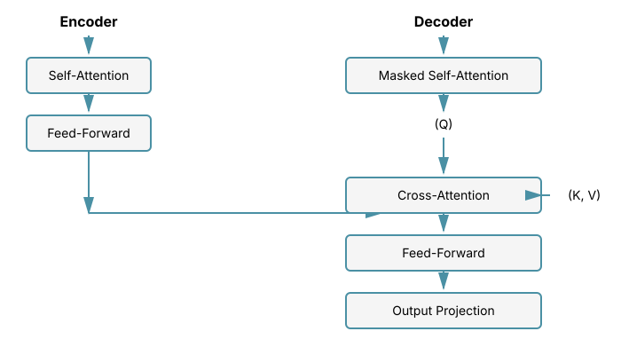
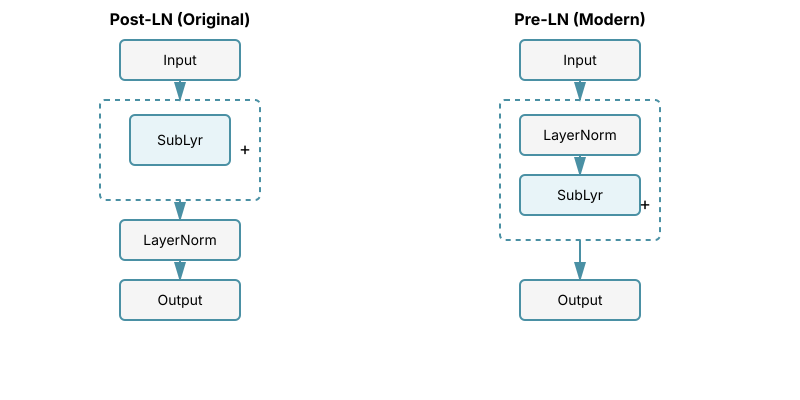
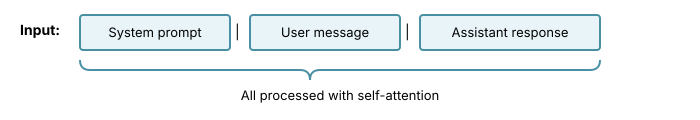

# Chapter 6: Cross-Attention

Cross-attention is a fundamental mechanism that enables models to relate information from two different sequences. While self-attention allows a sequence to attend to itself, cross-attention enables one sequence to attend to another. This is the core mechanism behind encoder-decoder architectures and is increasingly important in multimodal models that combine vision, text, and other modalities.

## Table of Contents

1. [Introduction](#introduction)
2. [Self-Attention vs Cross-Attention](#self-attention-vs-cross-attention)
3. [Mathematical Formulation](#mathematical-formulation)
4. [Implementation](#implementation)
5. [Cross-Attention in Encoder-Decoder Models](#cross-attention-in-encoder-decoder-models)
6. [Multimodal Cross-Attention](#multimodal-cross-attention)
7. [Practical Considerations](#practical-considerations)
8. [Advanced Topics](#advanced-topics)
9. [Summary](#summary)
10. [Exercises](#exercises)
11. [References](#references)

---

## Introduction

Cross-attention was introduced as part of the original Transformer architecture in the seminal "Attention Is All You Need" paper (Vaswani et al., 2017). It addresses a fundamental question: **How can we align and integrate information from two different sources?**

**Key Applications:**
- **Machine Translation**: Aligning source and target language sequences
- **Image Captioning**: Relating visual features to textual descriptions
- **Question Answering**: Connecting questions to context passages
- **Vision-Language Models**: Fusing visual and textual representations (e.g., CLIP, LLaVA, GPT-4V)
- **Audio-Visual Learning**: Synchronizing audio and video streams

**Key Insight**: In cross-attention, the **queries** come from one sequence (e.g., decoder), while **keys** and **values** come from another sequence (e.g., encoder). This allows the model to selectively retrieve relevant information from the source sequence based on the current state of the target sequence.

---

## Self-Attention vs Cross-Attention

Understanding the difference between self-attention and cross-attention is crucial for ML interviews.

### Self-Attention

In self-attention (see [Multi-Head Attention](04-multi-head-attention.md)), all three components (Q, K, V) come from the same sequence:

```math
\text{SelfAttention}(X) = \text{softmax}\left(\frac{QK^T}{\sqrt{d_k}}\right)V
```

where:
- $Q = XW_Q$
- $K = XW_K$
- $V = XW_V$
- $X$ is the input sequence

**Purpose**: Model relationships within a single sequence (e.g., how words relate to each other in a sentence).

### Cross-Attention

In cross-attention, queries come from one sequence while keys and values come from another:

```math
\text{CrossAttention}(X, Y) = \text{softmax}\left(\frac{Q(K^T)}{\sqrt{d_k}}\right)V
```

where:
- $Q = XW_Q$ (queries from target sequence)
- $K = YW_K$ (keys from source sequence)
- $V = YW_V$ (values from source sequence)
- $X$ is the target/decoder sequence
- $Y$ is the source/encoder sequence

**Purpose**: Model relationships between two different sequences (e.g., how decoder states relate to encoder outputs).

### Visual Comparison

```
Self-Attention:
Input: [The, cat, sat, on, mat]
       ↓   ↓   ↓   ↓   ↓
       Q   K   V (all from same sequence)

Cross-Attention (e.g., Translation):
Source (Encoder): [Le, chat, dort]  → K, V
                                     ↗
Target (Decoder): [The, cat, ___]  → Q
```

---

## Mathematical Formulation

### Standard Cross-Attention

Given:
- Target sequence: $X \in \mathbb{R}^{n \times d_{\text{model}}}$ (e.g., decoder states)
- Source sequence: $Y \in \mathbb{R}^{m \times d_{\text{model}}}$ (e.g., encoder outputs)

The cross-attention operation is:

```math
\text{CrossAttn}(X, Y) = \text{Attention}(XW_Q, YW_K, YW_V)
```

Breaking this down:

1. **Project to Q, K, V**:
   ```math
Q = XW_Q \in \mathbb{R}^{n \times d_k}
```
   ```math
K = YW_K \in \mathbb{R}^{m \times d_k}
```
   ```math
V = YW_V \in \mathbb{R}^{m \times d_v}
```

2. **Compute attention scores**:
   ```math
S = \frac{QK^T}{\sqrt{d_k}} \in \mathbb{R}^{n \times m}
```

   Note: The score matrix is $n \times m$ (target length × source length), not $n \times n$ as in self-attention.

3. **Apply softmax** (over source dimension):
   ```math
A = \text{softmax}(S) \in \mathbb{R}^{n \times m}
```

   For each target position $i$: $A_{i,:} = \text{softmax}(S_{i,:})$

   This gives us a probability distribution over source positions for each target position.

4. **Weighted sum of values**:
   ```math
\text{Output} = AV \in \mathbb{R}^{n \times d_v}
```

5. **Final projection**:
   ```math
\text{CrossAttn}(X, Y) = (AV)W_O \in \mathbb{R}^{n \times d_{\text{model}}}
```

### Multi-Head Cross-Attention

Just like self-attention, cross-attention benefits from multiple heads (see [Multi-Head Attention](04-multi-head-attention.md)):

```math
\text{MultiHead}(X, Y) = \text{Concat}(\text{head}_1, \ldots, \text{head}_h)W_O
```

where each head is:

```math
\text{head}_i = \text{Attention}(XW_Q^i, YW_K^i, YW_V^i)
```

**Key difference**: While self-attention has all projections from the same sequence, cross-attention projects queries from $X$ and keys/values from $Y$.

### Attention Pattern Interpretation

The attention matrix $A \in \mathbb{R}^{n \times m}$ shows alignment between sequences:

- **Row $i$**: Shows which source positions target position $i$ attends to
- **High value at $A_{i,j}$**: Target position $i$ strongly attends to source position $j$

Example in machine translation:
```
Source (French):  Le  chat  dort  sur  le  tapis
Target (English): The  cat  is  sleeping  on  the  mat

Attention might show:
"The" attends to "Le"
"cat" attends to "chat"
"sleeping" attends to "dort"
```

---

## Implementation

### Basic Cross-Attention

Now that we understand the mathematical foundations, let's implement cross-attention from scratch to solidify these concepts.

**Problem and Motivation:**
The fundamental challenge in cross-attention is efficiently computing how each position in a target sequence should selectively gather information from a source sequence. Unlike self-attention where all positions come from the same sequence, cross-attention must handle potentially different sequence lengths and different semantic spaces (e.g., French vs English, or images vs text).

**Theoretical Justification:**
The scaled dot-product attention mechanism provides an elegant solution:
1. **Queries from target** allow each target position to "ask" what it needs
2. **Keys from source** let source positions advertise what they contain
3. **Dot product similarity** measures semantic relevance between queries and keys
4. **Softmax normalization** creates a proper probability distribution, ensuring stable gradients
5. **Scaling by $\sqrt{d_k}$** prevents saturation of the softmax when dimensions are large

**Relationship to Alternatives:**
- **Additive attention** (Bahdanau): Uses a learned feedforward network to score Q-K pairs, but is less parallelizable
- **Concatenative approaches**: Simply concatenating sequences loses the explicit alignment structure
- **Fixed alignments**: Hard-coded position mapping can't learn complex patterns like reordering in translation

**Key Implementation Insights:**
1. **Separate projections for Q vs K,V**: The target and source may have learned different embedding spaces
2. **Output projection**: Maps attention results back to model dimension for residual connections
3. **Attention weight preservation**: Returning weights enables visualization and analysis of learned alignments

```python
import torch
import torch.nn as nn
import torch.nn.functional as F
import math

class CrossAttention(nn.Module):
    """
    Single-head cross-attention mechanism.

    Args:
        d_model: Dimension of model (both input sequences should have this dimension)
        d_k: Dimension of queries and keys
        d_v: Dimension of values
        dropout: Dropout probability
    """
    def __init__(
        self,
        d_model: int,
        d_k: int = None,
        d_v: int = None,
        dropout: float = 0.1
    ):
        super().__init__()

        # Default to d_model if not specified
        self.d_k = d_k or d_model
        self.d_v = d_v or d_model
        self.d_model = d_model

        # Query projection (from target sequence)
        self.w_q = nn.Linear(d_model, self.d_k, bias=False)

        # Key and Value projections (from source sequence)
        self.w_k = nn.Linear(d_model, self.d_k, bias=False)
        self.w_v = nn.Linear(d_model, self.d_v, bias=False)

        # Output projection
        self.w_o = nn.Linear(self.d_v, d_model, bias=False)

        self.dropout = nn.Dropout(dropout)

    def forward(
        self,
        target: torch.Tensor,      # (batch, n, d_model)
        source: torch.Tensor,      # (batch, m, d_model)
        mask: torch.Tensor = None  # (batch, n, m) or (n, m)
    ) -> tuple[torch.Tensor, torch.Tensor]:
        """
        Args:
            target: Target sequence (provides queries)
            source: Source sequence (provides keys and values)
            mask: Optional attention mask (True = attend, False = mask out)

        Returns:
            output: Cross-attended features (batch, n, d_model)
            attention_weights: Attention weights (batch, n, m)
        """
        batch_size = target.size(0)
        n = target.size(1)  # target sequence length
        m = source.size(1)  # source sequence length

        # Project to Q, K, V
        Q = self.w_q(target)  # (batch, n, d_k)
        K = self.w_k(source)  # (batch, m, d_k)
        V = self.w_v(source)  # (batch, m, d_v)

        # Compute attention scores: Q @ K^T / sqrt(d_k)
        # (batch, n, d_k) @ (batch, d_k, m) -> (batch, n, m)
        scores = torch.matmul(Q, K.transpose(-2, -1)) / math.sqrt(self.d_k)

        # Apply mask if provided
        if mask is not None:
            # Convert boolean mask to additive mask
            # True (attend) -> 0, False (mask) -> -inf
            if mask.dtype == torch.bool:
                scores = scores.masked_fill(~mask, float('-inf'))
            else:
                scores = scores + mask

        # Apply softmax to get attention weights
        attention_weights = F.softmax(scores, dim=-1)  # (batch, n, m)
        attention_weights = self.dropout(attention_weights)

        # Apply attention to values
        # (batch, n, m) @ (batch, m, d_v) -> (batch, n, d_v)
        output = torch.matmul(attention_weights, V)

        # Final output projection
        output = self.w_o(output)  # (batch, n, d_model)

        return output, attention_weights


# Example usage
if __name__ == "__main__":
    batch_size = 2
    target_len = 10  # decoder sequence length
    source_len = 15  # encoder sequence length
    d_model = 512

    # Create random target and source sequences
    target = torch.randn(batch_size, target_len, d_model)
    source = torch.randn(batch_size, source_len, d_model)

    # Initialize cross-attention
    cross_attn = CrossAttention(d_model=d_model)

    # Forward pass
    output, attn_weights = cross_attn(target, source)

    print(f"Target shape: {target.shape}")        # (2, 10, 512)
    print(f"Source shape: {source.shape}")        # (2, 15, 512)
    print(f"Output shape: {output.shape}")        # (2, 10, 512)
    print(f"Attention weights shape: {attn_weights.shape}")  # (2, 10, 15)

    # Verify attention weights sum to 1 for each target position
    assert torch.allclose(
        attn_weights.sum(dim=-1),
        torch.ones(batch_size, target_len),
        atol=1e-6
    ), "Attention weights should sum to 1 across source dimension"
    print("✓ Attention weights correctly normalized")
```

### Multi-Head Cross-Attention

Building on single-head cross-attention, we now extend to the multi-head variant that powers modern Transformers.

**Problem Being Solved:**
Single-head attention is limited to learning one type of relationship between sequences. In translation, for example, we need to capture:
- Word-level alignments ("Le" → "The")
- Phrase-level dependencies ("Le chat" → "The cat")
- Long-range syntactic relationships (subject-verb agreement across clauses)
- Semantic associations (idiomatic expressions)

A single attention head cannot simultaneously capture all these patterns.

**Theoretical Justification:**
Multi-head attention addresses this through **representational diversity**:
```math
\text{MultiHead}(Q, K, V) = \text{Concat}(\text{head}_1, \ldots, \text{head}_h)W_O
```

Each head operates in a different learned subspace ($d_k = d_{model}/h$), allowing it to specialize:
- Different heads learn different types of relationships
- Subspace projections enable diverse matching criteria
- Concatenation combines multiple perspectives
- Final projection $W_O$ integrates information across heads

**Relationship to Alternatives:**
- **Single large head**: Cannot capture multiple relationship types simultaneously
- **Ensemble of models**: Multi-head is parameter-efficient (shares embeddings)
- **Hierarchical attention**: Multi-head is simpler and more parallelizable
- **Mixture of Experts**: Multi-head is a lightweight form of specialization

**Key Insights That Make It Work:**
1. **Dimension splitting**: $d_k = d_{model}/h$ keeps total parameters constant while increasing expressiveness
2. **Independent projections per head**: Each head learns its own query/key/value transformations
3. **Head specialization**: Empirically, different heads learn different patterns (positional, semantic, syntactic)
4. **Output projection**: Crucial for combining information across heads in a learned way

```python
class MultiHeadCrossAttention(nn.Module):
    """
    Multi-head cross-attention mechanism.

    This is the version used in the original Transformer (Vaswani et al., 2017).

    Args:
        d_model: Model dimension
        n_heads: Number of attention heads
        dropout: Dropout probability
    """
    def __init__(
        self,
        d_model: int,
        n_heads: int = 8,
        dropout: float = 0.1
    ):
        super().__init__()

        assert d_model % n_heads == 0, "d_model must be divisible by n_heads"

        self.d_model = d_model
        self.n_heads = n_heads
        self.d_k = d_model // n_heads  # dimension per head

        # Combined Q, K, V projections
        self.w_q = nn.Linear(d_model, d_model, bias=False)
        self.w_k = nn.Linear(d_model, d_model, bias=False)
        self.w_v = nn.Linear(d_model, d_model, bias=False)

        # Output projection
        self.w_o = nn.Linear(d_model, d_model, bias=False)

        self.dropout = nn.Dropout(dropout)

    def split_heads(self, x: torch.Tensor) -> torch.Tensor:
        """
        Split the last dimension into (n_heads, d_k).

        Args:
            x: (batch, seq_len, d_model)
        Returns:
            (batch, n_heads, seq_len, d_k)
        """
        batch_size, seq_len, d_model = x.size()
        x = x.view(batch_size, seq_len, self.n_heads, self.d_k)
        return x.transpose(1, 2)  # (batch, n_heads, seq_len, d_k)

    def combine_heads(self, x: torch.Tensor) -> torch.Tensor:
        """
        Combine heads back to original dimension.

        Args:
            x: (batch, n_heads, seq_len, d_k)
        Returns:
            (batch, seq_len, d_model)
        """
        batch_size, n_heads, seq_len, d_k = x.size()
        x = x.transpose(1, 2)  # (batch, seq_len, n_heads, d_k)
        return x.contiguous().view(batch_size, seq_len, self.d_model)

    def forward(
        self,
        target: torch.Tensor,
        source: torch.Tensor,
        mask: torch.Tensor = None
    ) -> tuple[torch.Tensor, torch.Tensor]:
        """
        Args:
            target: Target sequence (batch, n, d_model)
            source: Source sequence (batch, m, d_model)
            mask: Optional mask (batch, 1, n, m) or (1, 1, n, m)

        Returns:
            output: (batch, n, d_model)
            attention_weights: (batch, n_heads, n, m)
        """
        batch_size = target.size(0)
        n = target.size(1)
        m = source.size(1)

        # Project and split into heads
        Q = self.split_heads(self.w_q(target))  # (batch, n_heads, n, d_k)
        K = self.split_heads(self.w_k(source))  # (batch, n_heads, m, d_k)
        V = self.split_heads(self.w_v(source))  # (batch, n_heads, m, d_k)

        # Compute scaled dot-product attention
        # (batch, n_heads, n, d_k) @ (batch, n_heads, d_k, m)
        # -> (batch, n_heads, n, m)
        scores = torch.matmul(Q, K.transpose(-2, -1)) / math.sqrt(self.d_k)

        # Apply mask if provided
        if mask is not None:
            if mask.dtype == torch.bool:
                scores = scores.masked_fill(~mask, float('-inf'))
            else:
                scores = scores + mask

        # Softmax and dropout
        attention_weights = F.softmax(scores, dim=-1)
        attention_weights = self.dropout(attention_weights)

        # Apply attention to values
        # (batch, n_heads, n, m) @ (batch, n_heads, m, d_k)
        # -> (batch, n_heads, n, d_k)
        output = torch.matmul(attention_weights, V)

        # Combine heads
        output = self.combine_heads(output)  # (batch, n, d_model)

        # Final projection
        output = self.w_o(output)

        return output, attention_weights


# Example usage
if __name__ == "__main__":
    batch_size = 2
    target_len = 10
    source_len = 15
    d_model = 512
    n_heads = 8

    target = torch.randn(batch_size, target_len, d_model)
    source = torch.randn(batch_size, source_len, d_model)

    mh_cross_attn = MultiHeadCrossAttention(d_model=d_model, n_heads=n_heads)

    output, attn_weights = mh_cross_attn(target, source)

    print(f"Output shape: {output.shape}")  # (2, 10, 512)
    print(f"Attention weights shape: {attn_weights.shape}")  # (2, 8, 10, 15)
    print("✓ Multi-head cross-attention working correctly")
```

### Visualization of Cross-Attention

Understanding what the model has learned requires visualizing attention patterns, which reveal the alignment structure between sequences.

**Problem and Importance:**
Cross-attention learns soft alignments between sequences, but these are high-dimensional probability distributions that are hard to interpret directly. For debugging, analysis, and building intuition, we need visual representations that show:
- Which source positions each target position attends to
- Whether attention patterns make linguistic/semantic sense
- How different heads specialize in different patterns

**Theoretical Foundation:**
The attention weight matrix $A \in \mathbb{R}^{n \times m}$ forms a **soft alignment** where:
- Each row $A_{i,:}$ is a probability distribution over source positions for target position $i$
- High values $A_{i,j}$ indicate strong alignment between target $i$ and source $j$
- In translation, we expect roughly diagonal patterns for monotonic alignment
- Deviations reveal reordering, phrase mappings, and complex dependencies

**Why Visualization Matters:**
1. **Interpretability**: Attention weights often correspond to linguistically meaningful alignments
2. **Debugging**: Unusual patterns can reveal model issues (e.g., attending to padding)
3. **Research**: Analyzing attention has led to insights about model behavior and new architectures
4. **Trust**: Visualizations help users understand model reasoning

Let's create a function to visualize cross-attention patterns:

```python
import matplotlib.pyplot as plt
import numpy as np

def visualize_cross_attention(
    attention_weights: torch.Tensor,
    source_tokens: list[str],
    target_tokens: list[str],
    head_idx: int = 0
):
    """
    Visualize cross-attention weights as a heatmap.

    Args:
        attention_weights: (batch, n_heads, n_target, n_source) or (n_heads, n_target, n_source)
        source_tokens: List of source sequence tokens
        target_tokens: List of target sequence tokens
        head_idx: Which attention head to visualize
    """
    # Handle both batched and unbatched inputs
    if attention_weights.dim() == 4:
        attn = attention_weights[0, head_idx].detach().cpu().numpy()
    else:
        attn = attention_weights[head_idx].detach().cpu().numpy()

    fig, ax = plt.subplots(figsize=(10, 8))

    # Create heatmap
    im = ax.imshow(attn, cmap='viridis', aspect='auto')

    # Set ticks and labels
    ax.set_xticks(np.arange(len(source_tokens)))
    ax.set_yticks(np.arange(len(target_tokens)))
    ax.set_xticklabels(source_tokens, rotation=45, ha='right')
    ax.set_yticklabels(target_tokens)

    # Labels
    ax.set_xlabel('Source Sequence', fontsize=12)
    ax.set_ylabel('Target Sequence', fontsize=12)
    ax.set_title(f'Cross-Attention Weights (Head {head_idx})', fontsize=14)

    # Colorbar
    plt.colorbar(im, ax=ax, label='Attention Weight')

    # Add text annotations for weights
    for i in range(len(target_tokens)):
        for j in range(len(source_tokens)):
            text = ax.text(j, i, f'{attn[i, j]:.2f}',
                          ha='center', va='center', color='white', fontsize=8)

    plt.tight_layout()
    return fig

# Example: Translation scenario
if __name__ == "__main__":
    # Simulate a translation task: French -> English
    source_tokens = ["Le", "chat", "dort", "sur", "le", "tapis"]
    target_tokens = ["The", "cat", "sleeps", "on", "the", "mat"]

    # Create dummy attention weights with realistic patterns
    # In real translation, we'd expect:
    # - "The" to attend to "Le"
    # - "cat" to attend to "chat"
    # - etc.
    n_heads = 4
    n_target = len(target_tokens)
    n_source = len(source_tokens)

    # Create somewhat realistic attention pattern
    attention_weights = torch.zeros(1, n_heads, n_target, n_source)

    # Head 0: Strong diagonal alignment (word-to-word)
    for i in range(min(n_target, n_source)):
        attention_weights[0, 0, i, i] = 0.8
        if i > 0:
            attention_weights[0, 0, i, i-1] = 0.1
        if i < n_source - 1:
            attention_weights[0, 0, i, i+1] = 0.1

    # Normalize
    attention_weights[0, 0] = F.softmax(attention_weights[0, 0] * 10, dim=-1)

    # Visualize
    fig = visualize_cross_attention(
        attention_weights,
        source_tokens,
        target_tokens,
        head_idx=0
    )
    plt.savefig('/tmp/cross_attention_example.png', dpi=150, bbox_inches='tight')
    print("Visualization saved to /tmp/cross_attention_example.png")
```

---

## Cross-Attention in Encoder-Decoder Models

Cross-attention is a critical component of encoder-decoder architectures, particularly in the original Transformer model (see [Building a Complete Transformer](11-complete-transformer.md)).

### Architecture Overview

In a standard encoder-decoder Transformer:

1. **Encoder**: Processes the source sequence using self-attention
   - Input: Source sequence (e.g., French sentence)
   - Output: Contextual representations of source tokens

2. **Decoder**: Generates the target sequence using:
   - **Masked self-attention**: Attends to previously generated target tokens (causal)
   - **Cross-attention**: Attends to encoder outputs
   - **Feed-forward network**: Additional transformation



### Decoder Layer with Cross-Attention

The decoder layer is where cross-attention becomes essential for sequence-to-sequence modeling, combining three complementary mechanisms.

**Problem Being Solved:**
A decoder must simultaneously:
1. **Understand what it has generated so far** (via self-attention over previously generated tokens)
2. **Access source information** (via cross-attention to encoder outputs)
3. **Transform representations** (via feedforward networks)

These three functions are fundamentally different and require different architectural components.

**Theoretical Justification:**
The three-sublayer architecture has clear roles:

1. **Masked Self-Attention**:
   - Allows decoder to build contextual representations of the target sequence
   - Causal masking ensures autoregressive generation (no peeking at future tokens)
   - Captures target-side dependencies (e.g., pronoun resolution in generated text)

2. **Cross-Attention**:
   - Bridges source and target sequences
   - Each target position queries the entire source to extract relevant information
   - Learns soft alignments (e.g., which French words to attend to when generating each English word)

3. **Feed-Forward Network**:
   - Provides position-wise transformation capacity
   - Increases model expressiveness beyond linear attention operations
   - Empirically crucial for strong performance

**Relationship to Alternatives:**
- **Encoder-only (BERT)**: No cross-attention, all information comes from self-attention
- **Decoder-only (GPT)**: Concatenates source into input, uses only self-attention
- **Encoder-decoder (T5, BART)**: Explicit cross-attention as shown here
- **RNN seq2seq**: Uses fixed-size context vector instead of attention at every step

**Key Architectural Insights:**
1. **Residual connections**: Enable gradient flow through deep networks
2. **Layer normalization**: Stabilizes training and allows deeper models
3. **Order matters**: Self-attention before cross-attention allows decoder to prepare queries based on target context
4. **Pre-LN vs Post-LN**: Modern models use Pre-LN (normalize before sublayer) for better training stability

Here's a complete decoder layer implementation:

```python
class TransformerDecoderLayer(nn.Module):
    """
    Single layer of a Transformer decoder with cross-attention.

    Components:
    1. Masked self-attention (causal)
    2. Cross-attention to encoder outputs
    3. Position-wise feed-forward network

    All with residual connections and layer normalization.
    """
    def __init__(
        self,
        d_model: int = 512,
        n_heads: int = 8,
        d_ff: int = 2048,
        dropout: float = 0.1
    ):
        super().__init__()

        # Masked self-attention (see Chapter 5: Bidirectional vs Causal Attention)
        self.self_attn = MultiHeadCrossAttention(d_model, n_heads, dropout)
        self.norm1 = nn.LayerNorm(d_model)

        # Cross-attention to encoder
        self.cross_attn = MultiHeadCrossAttention(d_model, n_heads, dropout)
        self.norm2 = nn.LayerNorm(d_model)

        # Feed-forward network
        self.ffn = nn.Sequential(
            nn.Linear(d_model, d_ff),
            nn.ReLU(),
            nn.Dropout(dropout),
            nn.Linear(d_ff, d_model),
            nn.Dropout(dropout)
        )
        self.norm3 = nn.LayerNorm(d_model)

        self.dropout = nn.Dropout(dropout)

    def forward(
        self,
        x: torch.Tensor,
        encoder_output: torch.Tensor,
        self_attn_mask: torch.Tensor = None,
        cross_attn_mask: torch.Tensor = None
    ) -> torch.Tensor:
        """
        Args:
            x: Decoder input (batch, target_len, d_model)
            encoder_output: Encoder output (batch, source_len, d_model)
            self_attn_mask: Causal mask for self-attention
            cross_attn_mask: Optional mask for cross-attention (e.g., padding)

        Returns:
            Decoder output (batch, target_len, d_model)
        """
        # 1. Masked self-attention with residual connection
        # Both target and source are x (self-attention)
        self_attn_out, _ = self.self_attn(x, x, self_attn_mask)
        x = self.norm1(x + self.dropout(self_attn_out))

        # 2. Cross-attention with residual connection
        # Query from decoder, Key/Value from encoder
        cross_attn_out, _ = self.cross_attn(x, encoder_output, cross_attn_mask)
        x = self.norm2(x + self.dropout(cross_attn_out))

        # 3. Feed-forward with residual connection
        ffn_out = self.ffn(x)
        x = self.norm3(x + ffn_out)

        return x


# Example: Full encoder-decoder forward pass
if __name__ == "__main__":
    batch_size = 2
    source_len = 15
    target_len = 10
    d_model = 512

    # Simulated encoder output (in practice, from encoder stack)
    encoder_output = torch.randn(batch_size, source_len, d_model)

    # Decoder input (e.g., shifted target sequence with <START> token)
    decoder_input = torch.randn(batch_size, target_len, d_model)

    # Create causal mask for decoder self-attention
    # See Chapter 5: Bidirectional vs Causal Attention
    causal_mask = torch.triu(
        torch.ones(target_len, target_len, dtype=torch.bool),
        diagonal=1
    )
    causal_mask = ~causal_mask  # Invert: True = attend, False = mask
    causal_mask = causal_mask.unsqueeze(0).unsqueeze(0)  # (1, 1, target_len, target_len)

    # Initialize decoder layer
    decoder_layer = TransformerDecoderLayer(d_model=d_model)

    # Forward pass
    output = decoder_layer(
        decoder_input,
        encoder_output,
        self_attn_mask=causal_mask,
        cross_attn_mask=None
    )

    print(f"Decoder output shape: {output.shape}")  # (2, 10, 512)
    print("✓ Decoder layer with cross-attention working correctly")
```

### Pre-LN vs Post-LN: Layer Normalization Placement

The decoder layer above uses **Pre-LN** (Pre-Layer Normalization), where normalization is applied **before** each sub-layer. This is an important architectural choice that affects training stability and performance.

**Post-LN (Original Transformer)**:
```python
# Post-LN: Normalize AFTER residual connection
x = x + sublayer(x)
x = LayerNorm(x)
```

**Pre-LN (Modern Transformers)**:
```python
# Pre-LN: Normalize BEFORE sublayer
x = x + sublayer(LayerNorm(x))
```

**Visual Comparison**:



**Key Differences**:

| Aspect | Post-LN | Pre-LN |
|--------|---------|--------|
| **Original paper** | Vaswani et al. (2017) | Recent implementations |
| **Training stability** | Requires learning rate warmup | More stable, less warmup needed |
| **Gradient flow** | Can have gradient issues in deep models | Better gradient flow |
| **Performance** | Comparable when well-tuned | Often better, especially for deep models |
| **Initialization** | Sensitive to initialization | More robust |
| **Adoption** | BERT, GPT-2 (early) | GPT-3, T5, modern LLMs |

**Why Pre-LN is Better**:

1. **Improved Gradient Flow**:
   - Post-LN has gradients that flow through both the residual and the main path
   - Pre-LN has a cleaner gradient highway through residual connections

2. **Training Stability**:
   ```python
   # Post-LN can have exploding activations in deep networks
   # because residual path is unnormalized

   # Pre-LN ensures sublayer input is always normalized
   # preventing activation explosion
   ```

3. **Less Need for Warmup**:
   - Post-LN often requires careful learning rate warmup
   - Pre-LN can train with simpler learning rate schedules

**Implementation Comparison**:

```python
class DecoderLayerPostLN(nn.Module):
    """Post-LN decoder layer (original Transformer)."""
    def forward(self, x, encoder_output, self_attn_mask, cross_attn_mask):
        # Self-attention + residual + norm
        self_attn_out, _ = self.self_attn(x, x, self_attn_mask)
        x = self.norm1(x + self.dropout(self_attn_out))

        # Cross-attention + residual + norm
        cross_attn_out, _ = self.cross_attn(x, encoder_output, cross_attn_mask)
        x = self.norm2(x + self.dropout(cross_attn_out))

        # FFN + residual + norm
        ffn_out = self.ffn(x)
        x = self.norm3(x + ffn_out)

        return x


class DecoderLayerPreLN(nn.Module):
    """Pre-LN decoder layer (modern implementation)."""
    def forward(self, x, encoder_output, self_attn_mask, cross_attn_mask):
        # Norm → self-attention → residual
        self_attn_out, _ = self.self_attn(
            self.norm1(x), self.norm1(x), self_attn_mask
        )
        x = x + self.dropout(self_attn_out)

        # Norm → cross-attention → residual
        cross_attn_out, _ = self.cross_attn(
            self.norm2(x), encoder_output, cross_attn_mask
        )
        x = x + self.dropout(cross_attn_out)

        # Norm → FFN → residual
        ffn_out = self.ffn(self.norm3(x))
        x = x + ffn_out

        return x
```

**Important Note**: With Pre-LN, you typically need a final layer normalization at the end of the encoder/decoder stack:

```python
class TransformerWithPreLN(nn.Module):
    def __init__(self, ...):
        self.layers = nn.ModuleList([DecoderLayerPreLN(...) for _ in range(n_layers)])
        self.final_norm = nn.LayerNorm(d_model)  # Important!

    def forward(self, x, ...):
        for layer in self.layers:
            x = layer(x, ...)
        x = self.final_norm(x)  # Final normalization for Pre-LN
        return x
```

**When to Use Each**:
- **Use Pre-LN**: For most modern applications, especially deep models (>12 layers)
- **Use Post-LN**: For compatibility with original Transformer or when using pretrained Post-LN models

**Interview Tip**: Being able to explain the difference between Pre-LN and Post-LN demonstrates deep understanding of Transformer architecture evolution.

### Sequence-to-Sequence Example: Machine Translation

Now we'll build a complete sequence-to-sequence model to demonstrate how all the pieces fit together for a real task.

**Problem and Application:**
Machine translation exemplifies the core challenge that motivated cross-attention: mapping between two sequences with different lengths, orderings, and vocabularies. Unlike simpler tasks, translation requires:
- Understanding source language syntax and semantics
- Maintaining alignment between languages with different word orders (e.g., English SVO vs Japanese SOV)
- Handling idiomatic expressions and phrasal mappings
- Generating fluent target text while staying faithful to source meaning

**Theoretical Design Principles:**
The encoder-decoder architecture with cross-attention solves this through:

1. **Encoder**: Builds contextualized representations of source tokens
   - Each source token sees full bidirectional context
   - Results in source representations $\mathbf{h}_{\text{enc}} \in \mathbb{R}^{m \times d}$

2. **Decoder**: Generates target autoregressively while attending to source
   - Self-attention builds target context (causal)
   - Cross-attention retrieves relevant source information
   - Output projection predicts next token

3. **Positional Encodings**: Inject sequence order information (Transformers have no inherent notion of position)

**Why This Architecture Works:**
- **Soft alignment**: Cross-attention learns which source tokens are relevant for each target token
- **Variable-length mapping**: Attention weights adapt to different sequence length ratios
- **Parallelization**: Unlike RNNs, encoder is fully parallel; decoder parallelizes during training
- **Long-range dependencies**: Attention directly connects any source-target pair

**Relationship to Alternatives:**
- **RNN seq2seq**: Fixed-size bottleneck, struggles with long sequences
- **RNN + attention**: Better but sequential processing is slow
- **Transformer**: Fully parallelizable, direct connections, state-of-the-art
- **Decoder-only**: Possible but less parameter-efficient for translation

Let's build a minimal translation model:

```python
class Seq2SeqTransformer(nn.Module):
    """
    Simplified sequence-to-sequence Transformer for demonstration.

    This is a minimal version for educational purposes.
    For a complete implementation, see Chapter 11: Building a Complete Transformer.
    """
    def __init__(
        self,
        src_vocab_size: int,
        tgt_vocab_size: int,
        d_model: int = 512,
        n_heads: int = 8,
        n_encoder_layers: int = 6,
        n_decoder_layers: int = 6,
        d_ff: int = 2048,
        dropout: float = 0.1,
        max_seq_len: int = 5000
    ):
        super().__init__()

        self.d_model = d_model

        # Embeddings
        self.src_embedding = nn.Embedding(src_vocab_size, d_model)
        self.tgt_embedding = nn.Embedding(tgt_vocab_size, d_model)
        self.pos_encoding = self._create_positional_encoding(max_seq_len, d_model)

        # Encoder (simplified: just self-attention layers)
        self.encoder_layers = nn.ModuleList([
            MultiHeadCrossAttention(d_model, n_heads, dropout)
            for _ in range(n_encoder_layers)
        ])

        # Decoder layers with cross-attention
        self.decoder_layers = nn.ModuleList([
            TransformerDecoderLayer(d_model, n_heads, d_ff, dropout)
            for _ in range(n_decoder_layers)
        ])

        # Output projection
        self.output_projection = nn.Linear(d_model, tgt_vocab_size)

        self.dropout = nn.Dropout(dropout)

    def _create_positional_encoding(self, max_len: int, d_model: int) -> torch.Tensor:
        """Create sinusoidal positional encoding (see Chapter 7)."""
        pe = torch.zeros(max_len, d_model)
        position = torch.arange(0, max_len, dtype=torch.float).unsqueeze(1)
        div_term = torch.exp(
            torch.arange(0, d_model, 2).float() * (-math.log(10000.0) / d_model)
        )
        pe[:, 0::2] = torch.sin(position * div_term)
        pe[:, 1::2] = torch.cos(position * div_term)
        return pe.unsqueeze(0)  # (1, max_len, d_model)

    def encode(self, src: torch.Tensor) -> torch.Tensor:
        """
        Encode source sequence.

        Args:
            src: Source token IDs (batch, src_len)

        Returns:
            Encoder output (batch, src_len, d_model)
        """
        seq_len = src.size(1)

        # Embed and add positional encoding
        x = self.src_embedding(src) * math.sqrt(self.d_model)
        x = x + self.pos_encoding[:, :seq_len, :].to(x.device)
        x = self.dropout(x)

        # Apply encoder layers (self-attention)
        for layer in self.encoder_layers:
            x, _ = layer(x, x)  # Self-attention: both target and source are x

        return x

    def decode(
        self,
        tgt: torch.Tensor,
        encoder_output: torch.Tensor,
        causal_mask: torch.Tensor
    ) -> torch.Tensor:
        """
        Decode target sequence with cross-attention to encoder output.

        Args:
            tgt: Target token IDs (batch, tgt_len)
            encoder_output: Encoded source (batch, src_len, d_model)
            causal_mask: Causal mask for decoder self-attention

        Returns:
            Logits over vocabulary (batch, tgt_len, vocab_size)
        """
        seq_len = tgt.size(1)

        # Embed and add positional encoding
        x = self.tgt_embedding(tgt) * math.sqrt(self.d_model)
        x = x + self.pos_encoding[:, :seq_len, :].to(x.device)
        x = self.dropout(x)

        # Apply decoder layers
        for layer in self.decoder_layers:
            x = layer(x, encoder_output, causal_mask)

        # Project to vocabulary
        logits = self.output_projection(x)

        return logits

    def forward(
        self,
        src: torch.Tensor,
        tgt: torch.Tensor
    ) -> torch.Tensor:
        """
        Full forward pass.

        Args:
            src: Source token IDs (batch, src_len)
            tgt: Target token IDs (batch, tgt_len)

        Returns:
            Logits (batch, tgt_len, vocab_size)
        """
        # Create causal mask for decoder
        tgt_len = tgt.size(1)
        causal_mask = torch.triu(
            torch.ones(tgt_len, tgt_len, dtype=torch.bool, device=tgt.device),
            diagonal=1
        )
        causal_mask = ~causal_mask
        causal_mask = causal_mask.unsqueeze(0).unsqueeze(0)

        # Encode source
        encoder_output = self.encode(src)

        # Decode with cross-attention
        logits = self.decode(tgt, encoder_output, causal_mask)

        return logits


# Example usage
if __name__ == "__main__":
    # Small vocabulary sizes for demonstration
    src_vocab_size = 10000  # French
    tgt_vocab_size = 8000   # English

    model = Seq2SeqTransformer(
        src_vocab_size=src_vocab_size,
        tgt_vocab_size=tgt_vocab_size,
        d_model=256,  # Smaller for demo
        n_heads=8,
        n_encoder_layers=3,
        n_decoder_layers=3,
        d_ff=1024,
        dropout=0.1
    )

    # Random input (in practice, these would be tokenized sentences)
    batch_size = 2
    src_len = 12
    tgt_len = 10

    src = torch.randint(0, src_vocab_size, (batch_size, src_len))
    tgt = torch.randint(0, tgt_vocab_size, (batch_size, tgt_len))

    # Forward pass
    logits = model(src, tgt)

    print(f"Source shape: {src.shape}")      # (2, 12)
    print(f"Target shape: {tgt.shape}")      # (2, 10)
    print(f"Logits shape: {logits.shape}")   # (2, 10, 8000)

    # Compute loss (teacher forcing - see explanation below)
    # In practice, tgt would be shifted right by 1 position
    loss_fn = nn.CrossEntropyLoss()
    loss = loss_fn(
        logits.view(-1, tgt_vocab_size),
        tgt.view(-1)
    )
    print(f"Loss: {loss.item():.4f}")
    print("✓ Seq2Seq model with cross-attention working correctly")
```

### Teacher Forcing

In the example above, we use a technique called **teacher forcing** during training. This is crucial for understanding how sequence-to-sequence models are trained.

**What is Teacher Forcing?**

Teacher forcing is a training strategy where we feed the ground truth tokens as input to the decoder, rather than the model's own predictions from previous steps.

**Without Teacher Forcing (Autoregressive)**:
```
Step 1: Input: <START>           → Predict: "The"
Step 2: Input: <START> "The"     → Predict: "cat"  (using predicted "The")
Step 3: Input: <START> "The" "cat" → Predict: "sat" (using predicted "The" and "cat")
```

**With Teacher Forcing**:
```
Step 1: Input: <START>            → Predict: "The"
Step 2: Input: <START> "The"      → Predict: "cat"  (using ground truth "The")
Step 3: Input: <START> "The" "cat" → Predict: "sat" (using ground truth "The" and "cat")
```

**Implementation Details**:

```python
def prepare_teacher_forcing_data(target_sequence):
    """
    Prepare target sequences for teacher forcing.

    Args:
        target_sequence: Ground truth tokens [w1, w2, w3, ..., wN]

    Returns:
        decoder_input: [<START>, w1, w2, ..., w(N-1)]
        decoder_target: [w1, w2, w3, ..., wN, <END>]
    """
    # Decoder input: ground truth shifted right by 1 (prepend <START>)
    decoder_input = torch.cat([
        torch.tensor([[START_TOKEN]]),
        target_sequence[:, :-1]
    ], dim=1)

    # Decoder target: ground truth (append <END>)
    decoder_target = torch.cat([
        target_sequence,
        torch.tensor([[END_TOKEN]])
    ], dim=1)

    return decoder_input, decoder_target

# During training:
# decoder_input:  [<START>, "The", "cat", "sat"]
# decoder_target: ["The", "cat", "sat", "on", <END>]
# Model predicts decoder_target given decoder_input
```

**Advantages of Teacher Forcing**:
- **Faster convergence**: Model learns from correct inputs, not its own errors
- **Stable training**: Avoids compounding errors from incorrect predictions
- **Efficient**: All positions can be computed in parallel during training

**Disadvantages**:
- **Exposure bias**: Creates a train-test mismatch
  - Training: Always sees correct previous tokens
  - Inference: Must use its own (possibly incorrect) predictions
- **Distribution mismatch**: Model never learns to recover from its own mistakes

**Alternatives and Solutions**:

1. **Scheduled Sampling** (Bengio et al., 2015):
   ```python
   def scheduled_sampling(step, total_steps, mode='linear'):
       """Gradually decrease teacher forcing probability."""
       if mode == 'linear':
           # Start with 100% teacher forcing, linearly decrease
           return 1.0 - (step / total_steps)
       elif mode == 'exponential':
           return 0.99 ** step

   # During training:
   use_teacher_forcing = random.random() < scheduled_sampling(step, total_steps)
   if use_teacher_forcing:
       decoder_input = ground_truth_tokens
   else:
       decoder_input = model_predictions
   ```

2. **Professor Forcing** (Lamb et al., 2016):
   - Use adversarial training to match behavior with/without teacher forcing

3. **Inference-time Techniques**:
   - Beam search: Keep multiple hypotheses to reduce error propagation
   - Nucleus sampling: Sample from high-probability tokens to maintain diversity

**In Practice**:
Most modern seq2seq models use teacher forcing during training, and rely on techniques like beam search or sampling during inference to mitigate exposure bias.

---

## Multimodal Cross-Attention

Cross-attention is essential for multimodal models that combine different modalities (vision + language, audio + text, etc.). For more details, see [Multimodality](28-multimodality.md).

### Vision-Language Cross-Attention

Multimodal AI systems require bridging fundamentally different modalities—images and text—which is where cross-attention becomes essential.

**Problem and Motivation:**
Vision and language are learned in different representation spaces:
- **Vision**: Continuous, spatial, hierarchical features from CNNs or Vision Transformers
- **Language**: Discrete tokens embedded in semantic space
- **Challenge**: How can a language model "look at" relevant parts of an image when generating text?

Traditional approaches concatenated visual features as special tokens, but this:
- Doesn't scale to high-resolution images (too many tokens)
- Forces vision and text into the same embedding space prematurely
- Lacks explicit attention to image regions based on text context

**Theoretical Justification for Cross-Modal Attention:**
Cross-attention solves this by creating a **learned bridge** between modalities:

```math
\text{CrossAttn}(\text{Text}, \text{Vision}) = \text{softmax}\left(\frac{Q_{\text{text}}K_{\text{vision}}^T}{\sqrt{d_k}}\right)V_{\text{vision}}
```

Key properties:
1. **Queries from text**: Each text token asks "what visual information do I need?"
2. **Keys/Values from vision**: Image patches provide visual features to be retrieved
3. **Soft spatial attention**: Model learns which image regions matter for each word
4. **Dimension bridging**: Projection layers handle different embedding dimensions

**Relationship to Alternatives:**
- **Concatenation**: Treats vision as more text tokens, less flexible
- **Feature fusion**: Early fusion loses modality-specific structure
- **Dual encoders (CLIP)**: Contrastive learning, good for retrieval but not generation
- **Cross-attention**: Explicit, interpretable, flexible for generation tasks

**Key Insights:**
1. **Separate projections**: Text and vision may have different native dimensions
2. **Spatial attention emerges**: Model learns to attend to relevant image regions
3. **Task-dependent patterns**: Captioning vs VQA show different attention patterns
4. **Interpretability**: Attention weights reveal what the model "looks at"

In vision-language models like LLaVA, BLIP-2, and Flamingo, cross-attention allows the language model to attend to visual features:

```python
class VisionLanguageCrossAttention(nn.Module):
    """
    Cross-attention for vision-language models.

    Query: Language features (text tokens)
    Key/Value: Vision features (image patches)

    This allows the language model to "look at" the image when generating text.
    """
    def __init__(
        self,
        d_text: int,      # Text model dimension
        d_vision: int,    # Vision model dimension
        d_model: int,     # Internal dimension
        n_heads: int = 8,
        dropout: float = 0.1
    ):
        super().__init__()

        self.d_model = d_model
        self.n_heads = n_heads
        self.d_k = d_model // n_heads

        # Project text and vision to common dimension
        self.text_proj = nn.Linear(d_text, d_model, bias=False)
        self.vision_proj_k = nn.Linear(d_vision, d_model, bias=False)
        self.vision_proj_v = nn.Linear(d_vision, d_model, bias=False)

        # Multi-head attention components
        self.w_q = nn.Linear(d_model, d_model, bias=False)
        self.w_k = nn.Linear(d_model, d_model, bias=False)
        self.w_v = nn.Linear(d_model, d_model, bias=False)
        self.w_o = nn.Linear(d_model, d_text, bias=False)  # Project back to text dim

        self.dropout = nn.Dropout(dropout)

    def forward(
        self,
        text_features: torch.Tensor,    # (batch, n_text_tokens, d_text)
        vision_features: torch.Tensor   # (batch, n_patches, d_vision)
    ) -> torch.Tensor:
        """
        Args:
            text_features: Language model hidden states
            vision_features: Vision encoder outputs (image patches)

        Returns:
            Cross-attended text features (batch, n_text_tokens, d_text)
        """
        batch_size = text_features.size(0)
        n_text = text_features.size(1)
        n_patches = vision_features.size(1)

        # Project to common dimension
        text_proj = self.text_proj(text_features)      # (batch, n_text, d_model)
        vision_k = self.vision_proj_k(vision_features)  # (batch, n_patches, d_model)
        vision_v = self.vision_proj_v(vision_features)  # (batch, n_patches, d_model)

        # Multi-head projections
        Q = self.w_q(text_proj)    # (batch, n_text, d_model)
        K = self.w_k(vision_k)     # (batch, n_patches, d_model)
        V = self.w_v(vision_v)     # (batch, n_patches, d_model)

        # Reshape for multi-head attention
        Q = Q.view(batch_size, n_text, self.n_heads, self.d_k).transpose(1, 2)
        K = K.view(batch_size, n_patches, self.n_heads, self.d_k).transpose(1, 2)
        V = V.view(batch_size, n_patches, self.n_heads, self.d_k).transpose(1, 2)

        # Compute attention
        scores = torch.matmul(Q, K.transpose(-2, -1)) / math.sqrt(self.d_k)
        attention_weights = F.softmax(scores, dim=-1)
        attention_weights = self.dropout(attention_weights)

        # Apply attention to values
        output = torch.matmul(attention_weights, V)  # (batch, n_heads, n_text, d_k)

        # Combine heads
        output = output.transpose(1, 2).contiguous()
        output = output.view(batch_size, n_text, self.d_model)

        # Project back to text dimension
        output = self.w_o(output)  # (batch, n_text, d_text)

        return output


# Example: Image captioning scenario
if __name__ == "__main__":
    batch_size = 4
    n_text_tokens = 20    # Caption length
    n_patches = 196       # 14x14 patches from image (e.g., ViT with 224x224 image, 16x16 patches)
    d_text = 768          # BERT/GPT-2 dimension
    d_vision = 1024       # Vision Transformer dimension

    # Simulate text and vision features
    text_features = torch.randn(batch_size, n_text_tokens, d_text)
    vision_features = torch.randn(batch_size, n_patches, d_vision)

    # Initialize cross-attention
    vl_cross_attn = VisionLanguageCrossAttention(
        d_text=d_text,
        d_vision=d_vision,
        d_model=512,  # Internal dimension
        n_heads=8
    )

    # Forward pass
    output = vl_cross_attn(text_features, vision_features)

    print(f"Text features shape: {text_features.shape}")    # (4, 20, 768)
    print(f"Vision features shape: {vision_features.shape}") # (4, 196, 1024)
    print(f"Output shape: {output.shape}")                  # (4, 20, 768)
    print("✓ Vision-language cross-attention working correctly")
```

### Perceiver Architecture

The Perceiver introduces a radical rethinking of how to handle large, multimodal inputs using cross-attention as a computational bottleneck.

**Problem Being Solved:**
Traditional Transformers face a fundamental scalability problem:
- Self-attention has $O(n^2)$ complexity in sequence length $n$
- For images: $224 \times 224 = 50{,}176$ pixels → $2.5$ billion attention operations
- For audio: 1 second at 16kHz = $16{,}000$ samples → $256$ million operations
- For video: Astronomical complexity

This makes Transformers impractical for raw high-dimensional inputs.

**Theoretical Justification:**
The Perceiver uses cross-attention to create an **information bottleneck**:

1. **Learned latent queries**: Small set of $m$ learnable vectors (e.g., $m=512$)
2. **Cross-attention to input**: Latents attend to large input of size $n$ (e.g., $n=50{,}000$)
3. **Complexity reduction**: $O(m \times n)$ instead of $O(n^2)$
4. **Information compression**: Latents extract task-relevant information from massive input

Mathematical formulation:
```math
\text{Latents} = \text{CrossAttn}(\underbrace{Q_{\text{latent}}}_{\text{m queries}}, \underbrace{K_{\text{input}}, V_{\text{input}}}_{\text{n keys/values}})
```

**Why This Works:**
1. **Task-relevant compression**: Learned latents adaptively compress input to what matters
2. **Modality-agnostic**: Works for images, audio, video, point clouds—anything
3. **Scalable**: Linear in input size, not quadratic
4. **Iterative refinement**: Can apply multiple rounds of cross-attention + self-attention

**Relationship to Alternatives:**
- **CNNs**: Hard-wired local structure, not flexible for all modalities
- **Standard Transformers**: $O(n^2)$, prohibitive for large inputs
- **Downsampling + Transformer**: Loses information, not learnable
- **Perceiver**: Learnable compression via cross-attention, modality-agnostic

**Key Architectural Insight:**
Cross-attention is **asymmetric**—complexity depends on the smaller dimension (queries). By making queries the bottleneck, Perceiver achieves scalability while the attention mechanism learns what to extract from the massive input.

The Perceiver (Jaegle et al., 2021) uses cross-attention in a unique way: a small set of learned "latent queries" attend to a large input:

```python
class PerceiverCrossAttention(nn.Module):
    """
    Perceiver-style cross-attention.

    Key idea: Use a small set of learned latent queries to attend
    to a large (possibly multimodal) input. This reduces computation
    from O(n^2) to O(m*n) where m << n.

    Example:
    - Input: 50,000 pixels (n=50,000)
    - Latents: 512 queries (m=512)
    - Attention cost: O(512 * 50,000) instead of O(50,000^2)
    """
    def __init__(
        self,
        num_latents: int,
        d_latent: int,
        d_input: int,
        n_heads: int = 8,
        dropout: float = 0.1
    ):
        super().__init__()

        self.num_latents = num_latents
        self.d_latent = d_latent

        # Learned latent queries
        self.latents = nn.Parameter(torch.randn(num_latents, d_latent))

        # Cross-attention from latents to input
        self.cross_attn = MultiHeadCrossAttention(
            d_model=d_latent,
            n_heads=n_heads,
            dropout=dropout
        )

        # Input projection (if dimensions don't match)
        self.input_proj = nn.Linear(d_input, d_latent) if d_input != d_latent else nn.Identity()

    def forward(self, x: torch.Tensor) -> torch.Tensor:
        """
        Args:
            x: Input features (batch, n_inputs, d_input)

        Returns:
            Latent representations (batch, num_latents, d_latent)
        """
        batch_size = x.size(0)

        # Project input if needed
        x = self.input_proj(x)  # (batch, n_inputs, d_latent)

        # Expand latents for batch
        latents = self.latents.unsqueeze(0).expand(batch_size, -1, -1)

        # Cross-attention: latents attend to input
        # Query: latents, Key/Value: input
        output, _ = self.cross_attn(latents, x)

        return output


# Example usage
if __name__ == "__main__":
    batch_size = 2
    n_inputs = 50000  # Large input (e.g., pixels, audio samples)
    d_input = 3       # RGB channels
    num_latents = 512 # Small bottleneck
    d_latent = 256

    # Simulate large input
    x = torch.randn(batch_size, n_inputs, d_input)

    # Perceiver cross-attention
    perceiver = PerceiverCrossAttention(
        num_latents=num_latents,
        d_latent=d_latent,
        d_input=d_input,
        n_heads=8
    )

    # Forward pass
    latents = perceiver(x)

    print(f"Input shape: {x.shape}")        # (2, 50000, 3)
    print(f"Latent shape: {latents.shape}") # (2, 512, 256)
    print(f"Compression ratio: {n_inputs / num_latents:.1f}x")
    print("✓ Perceiver cross-attention working correctly")
```

---

## Practical Considerations

### 1. Memory and Computation

**Cross-attention complexity**: $O(n \cdot m)$ where $n$ is target length and $m$ is source length.

- **Self-attention**: $O(n^2)$ for sequence length $n$
- **Cross-attention**: $O(n \cdot m)$ for target length $n$ and source length $m$

**Memory for attention scores**:
- Self-attention: $\text{batch} \times \text{heads} \times n \times n$
- Cross-attention: $\text{batch} \times \text{heads} \times n \times m$

For encoder-decoder models with similar source and target lengths, cross-attention is comparable to self-attention in cost.

### 2. KV Caching in Cross-Attention

Autoregressive generation involves generating one token at a time, leading to massive redundant computation that KV caching eliminates.

**Problem and Inefficiency:**
During autoregressive decoding (e.g., translation, image captioning):
- At each step, we generate one new target token
- Cross-attention recomputes $K$ and $V$ projections from **the same** encoder output
- For a 100-token generation with 10,000-token source: $100 \times 10{,}000 = 1{,}000{,}000$ redundant K,V computations

**Theoretical Justification:**
The key observation: In cross-attention, K and V come from the **encoder output, which doesn't change** during decoding.

For step $t$:
```math
\text{output}_t = \text{Attention}(\underbrace{Q_t}_{\text{new query}}, \underbrace{K_{\text{enc}}}_{\text{constant}}, \underbrace{V_{\text{enc}}}_{\text{constant}})
```

We can precompute once:
- $K_{\text{cached}} = W_K \cdot \text{EncoderOutput}$
- $V_{\text{cached}} = W_V \cdot \text{EncoderOutput}$

Then at each step, only compute new query: $Q_t = W_Q \cdot \text{DecoderState}_t$

**Why This Works:**
1. **Encoder is constant**: Encoder processes source once, outputs never change
2. **Only queries vary**: Each new decoder state produces a new query
3. **Complexity reduction**: From $O(T \times m \times d)$ to $O(m \times d) + O(T \times d)$ where $T$ is generation length
4. **Exact equivalence**: Cached version produces identical results

**Relationship to Self-Attention KV Caching:**
- **Self-attention**: Cache grows with each generated token (past key-values)
- **Cross-attention**: Cache is fixed size (encoder outputs)
- **Cross-attention caching**: Simpler, no cache management needed

**Practical Impact:**
For a 1000-token target with 5000-token source:
- Without caching: $1000 \times 5000 \times 2 = 10{,}000{,}000$ encoder projections
- With caching: $5000 \times 2 = 10{,}000$ encoder projections
- **Speedup: 1000x for encoder-related computation**

During autoregressive decoding, encoder outputs don't change, so we can cache cross-attention keys and values:

```python
class CrossAttentionWithKVCache(nn.Module):
    """
    Cross-attention with KV caching for efficient inference.

    During autoregressive generation, the encoder output (source) doesn't change,
    so we can precompute and cache K and V projections.
    """
    def __init__(self, d_model: int, n_heads: int = 8):
        super().__init__()
        self.d_model = d_model
        self.n_heads = n_heads
        self.d_k = d_model // n_heads

        self.w_q = nn.Linear(d_model, d_model, bias=False)
        self.w_k = nn.Linear(d_model, d_model, bias=False)
        self.w_v = nn.Linear(d_model, d_model, bias=False)
        self.w_o = nn.Linear(d_model, d_model, bias=False)

        # Cache for encoder K, V
        self.cached_k = None
        self.cached_v = None

    def cache_encoder_kv(self, encoder_output: torch.Tensor):
        """
        Precompute and cache K, V from encoder output.
        Call this once before autoregressive decoding.

        Args:
            encoder_output: (batch, source_len, d_model)
        """
        batch_size = encoder_output.size(0)
        source_len = encoder_output.size(1)

        # Project to K, V
        K = self.w_k(encoder_output)
        V = self.w_v(encoder_output)

        # Reshape for multi-head
        K = K.view(batch_size, source_len, self.n_heads, self.d_k).transpose(1, 2)
        V = V.view(batch_size, source_len, self.n_heads, self.d_k).transpose(1, 2)

        # Cache
        self.cached_k = K
        self.cached_v = V

    def forward(
        self,
        decoder_state: torch.Tensor,
        encoder_output: torch.Tensor = None,
        use_cache: bool = True
    ) -> torch.Tensor:
        """
        Args:
            decoder_state: Current decoder state (batch, 1, d_model) for generation
            encoder_output: Only needed if not using cache
            use_cache: Whether to use cached K, V

        Returns:
            Output (batch, 1, d_model)
        """
        batch_size = decoder_state.size(0)

        # Project query from decoder state
        Q = self.w_q(decoder_state)
        Q = Q.view(batch_size, -1, self.n_heads, self.d_k).transpose(1, 2)

        # Get K, V (from cache or compute)
        if use_cache and self.cached_k is not None:
            K = self.cached_k
            V = self.cached_v
        else:
            assert encoder_output is not None, "Need encoder_output if not using cache"
            self.cache_encoder_kv(encoder_output)
            K = self.cached_k
            V = self.cached_v

        # Compute attention
        scores = torch.matmul(Q, K.transpose(-2, -1)) / math.sqrt(self.d_k)
        attention_weights = F.softmax(scores, dim=-1)
        output = torch.matmul(attention_weights, V)

        # Combine heads and project
        output = output.transpose(1, 2).contiguous()
        output = output.view(batch_size, -1, self.d_model)
        output = self.w_o(output)

        return output

    def clear_cache(self):
        """Clear cached K, V."""
        self.cached_k = None
        self.cached_v = None


# Example: Autoregressive generation with KV caching
if __name__ == "__main__":
    batch_size = 1
    source_len = 20
    d_model = 512
    max_gen_len = 10

    # Encoder output (computed once)
    encoder_output = torch.randn(batch_size, source_len, d_model)

    # Cross-attention with caching
    cross_attn_cached = CrossAttentionWithKVCache(d_model=d_model, n_heads=8)

    # Cache encoder K, V (do this once before generation)
    cross_attn_cached.cache_encoder_kv(encoder_output)

    # Simulate autoregressive generation
    print("Generating tokens autoregressively with KV cache:")
    decoder_state = torch.randn(batch_size, 1, d_model)  # Start token

    for step in range(max_gen_len):
        # Cross-attend to encoder (using cached K, V)
        output = cross_attn_cached(decoder_state, use_cache=True)

        # In practice, would use this to predict next token
        # decoder_state = update_with_next_token(output)
        print(f"  Step {step}: output shape {output.shape}")  # (1, 1, 512)

    print("✓ KV caching working correctly")
```

**Speedup**: By caching encoder K and V, we avoid recomputing them at each decoding step, saving significant computation.

### 3. Masking in Cross-Attention

Cross-attention masks are typically used for:

1. **Padding masks**: Prevent attention to padding tokens in source sequence
2. **Conditional masking**: Selectively attend to parts of source (e.g., attend only to relevant image regions)

```python
def create_padding_mask(seq: torch.Tensor, pad_idx: int = 0) -> torch.Tensor:
    """
    Create mask for padding tokens.

    Args:
        seq: Token IDs (batch, seq_len)
        pad_idx: Padding token ID

    Returns:
        Mask (batch, 1, 1, seq_len) - True for real tokens, False for padding
    """
    # True for non-padding tokens
    mask = (seq != pad_idx).unsqueeze(1).unsqueeze(2)  # (batch, 1, 1, seq_len)
    return mask


# Example usage
if __name__ == "__main__":
    # Source sequence with padding (0 = PAD)
    # Sequence: [5, 10, 15, 20, 0, 0, 0]
    src = torch.tensor([[5, 10, 15, 20, 0, 0, 0],
                        [3, 7, 0, 0, 0, 0, 0]])

    mask = create_padding_mask(src, pad_idx=0)
    print("Source sequences:")
    print(src)
    print("\nPadding mask (True = attend, False = ignore):")
    print(mask.squeeze())

    # In cross-attention, this mask prevents decoder from attending to padding
```

### 4. Grouped-Query Cross-Attention

As models scale to billions of parameters and longer sequences, even KV caching becomes a memory bottleneck. Grouped-Query Attention provides a solution.

**Problem Being Solved:**
In standard multi-head attention with $h$ heads:
- Each head has its own K and V projections
- KV cache size: $\text{batch} \times h \times \text{seq\_len} \times d_k$
- For long source sequences (e.g., documents with 10,000 tokens), this consumes gigabytes of GPU memory
- Example: 8 heads, 10K tokens, $d_k=64$, fp16 → $8 \times 10000 \times 64 \times 2 \times 2 = 20$ MB per batch item

At inference batch sizes and long contexts, this is prohibitive.

**Theoretical Justification:**
GQA makes a key observation: **Do we really need $h$ independent K,V heads?**

Instead, use $n_{kv} < h$ key-value heads, each shared by $h / n_{kv}$ query heads:
```math
\text{GQA}: \quad \text{heads}_q = h, \quad \text{heads}_{k,v} = n_{kv}, \quad n_{kv} \ll h
```

Properties:
- **Parameter reduction**: Fewer K,V projection matrices
- **Memory savings**: KV cache reduced by factor of $h / n_{kv}$
- **Representational capacity**: Queries still have full $h$ heads for diverse representations
- **Minimal quality loss**: Empirically, $n_{kv} = 1$ or $2$ performs nearly as well as full multi-head

**Why This Works:**
1. **Keys/Values**: Provide the "database" of information to retrieve from
   - Don't need as much diversity as queries
   - Shared K,V heads still capture essential source information

2. **Queries**: Determine "what" to retrieve
   - Need diversity to represent different retrieval patterns
   - Many queries can share the same K,V space

3. **Asymmetric roles**: Q and K,V have different functions, so asymmetric head counts make sense

**Relationship to Alternatives:**
- **Multi-Head Attention (MHA)**: $h$ heads for Q, K, V — most expressive but memory-intensive
- **Multi-Query Attention (MQA)**: 1 head for K, V, $h$ for Q — maximum memory savings but quality loss
- **Grouped-Query Attention (GQA)**: $n_{kv}$ heads for K, V, $h$ for Q — sweet spot of quality and efficiency

**Practical Impact for Cross-Attention:**
With long source sequences (documents, images, videos):
- Standard (8 heads): 20 MB KV cache per sample
- GQA (2 KV heads): 5 MB KV cache per sample
- **4x memory reduction**, enables larger batches or longer sequences

Modern models use Grouped-Query Attention (GQA) for efficiency (see [Multi-Head Attention](04-multi-head-attention.md)). This can also be applied to cross-attention:

```python
class GroupedQueryCrossAttention(nn.Module):
    """
    Grouped-Query Cross-Attention for reduced KV cache.

    Instead of n_heads separate K,V heads, use n_kv_heads < n_heads.
    Each KV head is shared by n_heads // n_kv_heads query heads.

    This reduces KV cache size, which is especially important for
    cross-attention when source sequences are long.
    """
    def __init__(
        self,
        d_model: int,
        n_heads: int,
        n_kv_heads: int,  # Number of KV heads (< n_heads)
        dropout: float = 0.1
    ):
        super().__init__()
        assert n_heads % n_kv_heads == 0, "n_heads must be divisible by n_kv_heads"

        self.n_heads = n_heads
        self.n_kv_heads = n_kv_heads
        self.n_groups = n_heads // n_kv_heads
        self.d_k = d_model // n_heads

        self.w_q = nn.Linear(d_model, n_heads * self.d_k, bias=False)
        self.w_k = nn.Linear(d_model, n_kv_heads * self.d_k, bias=False)
        self.w_v = nn.Linear(d_model, n_kv_heads * self.d_k, bias=False)
        self.w_o = nn.Linear(n_heads * self.d_k, d_model, bias=False)

        self.dropout = nn.Dropout(dropout)

    def forward(
        self,
        target: torch.Tensor,
        source: torch.Tensor,
        mask: torch.Tensor = None
    ) -> torch.Tensor:
        batch_size = target.size(0)
        n = target.size(1)
        m = source.size(1)

        # Project to Q, K, V
        Q = self.w_q(target).view(batch_size, n, self.n_heads, self.d_k)
        K = self.w_k(source).view(batch_size, m, self.n_kv_heads, self.d_k)
        V = self.w_v(source).view(batch_size, m, self.n_kv_heads, self.d_k)

        # Transpose for attention
        Q = Q.transpose(1, 2)  # (batch, n_heads, n, d_k)
        K = K.transpose(1, 2)  # (batch, n_kv_heads, m, d_k)
        V = V.transpose(1, 2)  # (batch, n_kv_heads, m, d_k)

        # Repeat K, V for each group
        K = K.repeat_interleave(self.n_groups, dim=1)  # (batch, n_heads, m, d_k)
        V = V.repeat_interleave(self.n_groups, dim=1)  # (batch, n_heads, m, d_k)

        # Standard attention
        scores = torch.matmul(Q, K.transpose(-2, -1)) / math.sqrt(self.d_k)
        if mask is not None:
            scores = scores.masked_fill(~mask, float('-inf'))

        attn = F.softmax(scores, dim=-1)
        attn = self.dropout(attn)

        output = torch.matmul(attn, V)
        output = output.transpose(1, 2).contiguous().view(batch_size, n, -1)
        output = self.w_o(output)

        return output


# Example: Memory savings
if __name__ == "__main__":
    batch_size = 1
    n = 100      # Target length
    m = 10000    # Source length (e.g., long document or many image patches)
    d_model = 512
    n_heads = 8
    n_kv_heads = 2  # Use only 2 KV heads instead of 8

    target = torch.randn(batch_size, n, d_model)
    source = torch.randn(batch_size, m, d_model)

    # Standard cross-attention
    standard = MultiHeadCrossAttention(d_model, n_heads)

    # GQA cross-attention
    gqa = GroupedQueryCrossAttention(d_model, n_heads, n_kv_heads)

    # Compare KV cache size
    d_k = d_model // n_heads

    standard_kv_size = batch_size * m * n_heads * d_k * 2  # K and V
    gqa_kv_size = batch_size * m * n_kv_heads * d_k * 2

    print(f"Standard KV cache size: {standard_kv_size:,} elements")
    print(f"GQA KV cache size: {gqa_kv_size:,} elements")
    print(f"Memory reduction: {standard_kv_size / gqa_kv_size:.1f}x")
    print("✓ GQA cross-attention reduces KV cache significantly")
```

### 5. Flash Cross-Attention

Flash Attention (see Chapter 8) can be applied to cross-attention for significant memory and speed improvements, especially when dealing with long source sequences.

**Standard Cross-Attention Memory Problem**:

For standard cross-attention with target length $n$ and source length $m$:
- Must materialize attention matrix: $O(n \times m)$ memory
- For long source sequences (e.g., $m = 10{,}000$), this becomes prohibitive

**Flash Attention Solution**:

Flash Attention uses **tiling** and **recomputation** to avoid materializing the full attention matrix:

```python
import torch.nn.functional as F

def flash_cross_attention_example(
    target: torch.Tensor,
    source: torch.Tensor,
    d_model: int = 512,
    n_heads: int = 8
):
    """
    Example using PyTorch's built-in Flash Attention for cross-attention.

    PyTorch 2.0+ includes scaled_dot_product_attention (SDPA) which uses
    Flash Attention under the hood when available.

    Args:
        target: Target sequence (batch, n, d_model)
        source: Source sequence (batch, m, d_model)
    """
    batch_size = target.size(0)
    n = target.size(1)
    m = source.size(1)
    d_k = d_model // n_heads

    # Create Q, K, V projections (simplified - in practice, use nn.Linear)
    Q = target.unsqueeze(1).expand(-1, n_heads, -1, -1)  # (batch, n_heads, n, d_k)
    K = source.unsqueeze(1).expand(-1, n_heads, -1, -1)  # (batch, n_heads, m, d_k)
    V = source.unsqueeze(1).expand(-1, n_heads, -1, -1)  # (batch, n_heads, m, d_k)

    # Use PyTorch's efficient SDPA (uses Flash Attention if available)
    # This is memory-efficient for large m
    output = F.scaled_dot_product_attention(
        Q, K, V,
        attn_mask=None,
        dropout_p=0.0,
        is_causal=False,  # Cross-attention is typically NOT causal
        scale=None  # Will use 1/sqrt(d_k) by default
    )

    return output


# Example usage
if __name__ == "__main__":
    batch_size = 2
    target_len = 100
    source_len = 10000  # Very long source sequence!
    d_model = 512

    target = torch.randn(batch_size, target_len, d_model)
    source = torch.randn(batch_size, source_len, d_model)

    # This would use Flash Attention internally if available
    output = flash_cross_attention_example(target, source, d_model)

    print(f"Target length: {target_len}")
    print(f"Source length: {source_len}")
    print(f"Attention matrix size if materialized: {target_len * source_len:,} elements")
    print(f"Output shape: {output.shape}")
    print("✓ Flash cross-attention avoids materializing huge attention matrix")
```

**Flash Cross-Attention Implementation**:

Now let's implement cross-attention using Flash Attention for production-grade efficiency.

**Implementation Strategy:**
Modern PyTorch (2.0+) provides `F.scaled_dot_product_attention` which automatically uses Flash Attention when available. This gives us:
1. **Drop-in replacement**: Same API as standard attention
2. **Automatic optimization**: Uses Flash Attention on supported hardware
3. **Fallback support**: Gracefully degrades on older GPUs
4. **Production-ready**: Battle-tested in PyTorch ecosystem

**Key Implementation Details:**
- Set `is_causal=False` for cross-attention (unlike decoder self-attention)
- Dropout is applied within the fused kernel for efficiency
- Masking is handled efficiently without materializing full attention matrix
- Returns same results as standard attention (numerically equivalent)

```python
class FlashCrossAttention(nn.Module):
    """
    Cross-attention using Flash Attention for memory efficiency.

    This is especially beneficial when source sequences are very long
    (e.g., long documents, many image patches, audio frames).
    """
    def __init__(
        self,
        d_model: int,
        n_heads: int = 8,
        dropout: float = 0.1
    ):
        super().__init__()
        assert d_model % n_heads == 0

        self.d_model = d_model
        self.n_heads = n_heads
        self.d_k = d_model // n_heads

        self.w_q = nn.Linear(d_model, d_model, bias=False)
        self.w_k = nn.Linear(d_model, d_model, bias=False)
        self.w_v = nn.Linear(d_model, d_model, bias=False)
        self.w_o = nn.Linear(d_model, d_model, bias=False)

        self.dropout = dropout

    def forward(
        self,
        target: torch.Tensor,
        source: torch.Tensor,
        mask: torch.Tensor = None
    ) -> torch.Tensor:
        """
        Args:
            target: Target sequence (batch, n, d_model)
            source: Source sequence (batch, m, d_model)
            mask: Optional attention mask (batch, n, m) or (n, m)

        Returns:
            Output (batch, n, d_model)
        """
        batch_size = target.size(0)
        n = target.size(1)
        m = source.size(1)

        # Project to Q, K, V
        Q = self.w_q(target)  # (batch, n, d_model)
        K = self.w_k(source)  # (batch, m, d_model)
        V = self.w_v(source)  # (batch, m, d_model)

        # Reshape for multi-head attention
        Q = Q.view(batch_size, n, self.n_heads, self.d_k).transpose(1, 2)
        K = K.view(batch_size, m, self.n_heads, self.d_k).transpose(1, 2)
        V = V.view(batch_size, m, self.n_heads, self.d_k).transpose(1, 2)

        # Use Flash Attention via scaled_dot_product_attention
        # This is memory-efficient and faster than manual implementation
        output = F.scaled_dot_product_attention(
            Q, K, V,
            attn_mask=mask,
            dropout_p=self.dropout if self.training else 0.0,
            is_causal=False  # Cross-attention is not causal
        )
        # Output: (batch, n_heads, n, d_k)

        # Combine heads
        output = output.transpose(1, 2).contiguous()
        output = output.view(batch_size, n, self.d_model)

        # Final projection
        output = self.w_o(output)

        return output


# Memory comparison
if __name__ == "__main__":
    import sys

    batch_size = 4
    target_len = 1000
    source_len = 50000  # Very long source (e.g., long document, video frames)
    d_model = 512
    n_heads = 8

    target = torch.randn(batch_size, target_len, d_model)
    source = torch.randn(batch_size, source_len, d_model)

    # Standard attention memory usage (hypothetical)
    standard_attn_memory = (
        batch_size * n_heads * target_len * source_len * 4  # 4 bytes per float32
    ) / (1024**3)  # Convert to GB

    print("Memory Comparison:")
    print(f"Standard attention matrix: {standard_attn_memory:.2f} GB")
    print(f"Flash attention: ~constant memory (uses tiling)")
    print(f"Memory reduction: ~{standard_attn_memory / 0.01:.0f}x")

    # Flash cross-attention
    flash_cross_attn = FlashCrossAttention(d_model, n_heads)
    output = flash_cross_attn(target, source)

    print(f"\nOutput shape: {output.shape}")
    print("✓ Flash cross-attention working efficiently")
```

**Key Benefits for Cross-Attention**:

1. **Memory Savings**:
   - Standard: $O(batch \times heads \times n \times m)$ memory
   - Flash: $O(batch \times heads \times n \times d_k)$ memory
   - For $m = 50{,}000$, $n = 1{,}000$: Saves ~50GB of memory

2. **Speed Improvements**:
   - Fewer memory transfers between HBM and SRAM
   - Better GPU utilization
   - Typical speedup: 2-4x for long sequences

3. **Exact Results**:
   - Flash Attention is mathematically equivalent to standard attention
   - No approximation - same outputs, just more efficient

**When to Use Flash Cross-Attention**:

- **Long source sequences**: Documents (>1000 tokens), images (>1000 patches), audio/video
- **Limited GPU memory**: When standard attention would OOM
- **Inference optimization**: Faster decoding for production systems
- **Multimodal models**: Vision-language models with many image patches

**Limitations**:

1. **Hardware Requirements**:
   - Requires modern GPUs (Ampere/Ada architecture or newer)
   - PyTorch 2.0+ or specific Flash Attention library

2. **Custom Masks**:
   - Some complex masking patterns may not be supported
   - Standard causal/padding masks work fine

**Integration with KV Caching**:

Flash Attention can be combined with KV caching for cross-attention:

```python
# Cache encoder K, V once
encoder_k = flash_cross_attn.w_k(encoder_output)
encoder_v = flash_cross_attn.w_v(encoder_output)

# During autoregressive decoding, reuse cached K, V
for step in range(max_gen_len):
    decoder_q = flash_cross_attn.w_q(decoder_state)

    # Use Flash Attention with cached K, V
    output = F.scaled_dot_product_attention(
        decoder_q, encoder_k, encoder_v,
        is_causal=False
    )
```

**Further Reading**: See Chapter 8 (Flash Attention) for detailed implementation and algorithmic details.

---

## Advanced Topics

### 1. Bidirectional Cross-Attention (Prefix LM)

Prefix Language Models represent a hybrid approach that combines the benefits of bidirectional and causal attention.

**Problem and Motivation:**
Standard architectures force a binary choice:
- **Encoder-decoder** (e.g., T5): Bidirectional encoder, causal decoder, but two separate stacks
- **Decoder-only** (e.g., GPT): Single stack but purely causal, can't leverage bidirectional context

For tasks like summarization or question answering, we want:
- **Bidirectional understanding** of the input (document, context)
- **Causal generation** of the output (summary, answer)
- **Unified architecture** (single model, shared parameters)

**Theoretical Justification:**
Prefix LMs create a **hybrid attention mask**:
```math
A_{ij} = \begin{cases}
1 & \text{if } i, j < L_{\text{prefix}} \text{ (bidirectional on prefix)} \\
1 & \text{if } i \geq L_{\text{prefix}} \text{ and } j \leq i \text{ (causal on generation)} \\
0 & \text{otherwise}
\end{cases}
```

Properties:
1. **Prefix tokens** (input): Full bidirectional attention among themselves
2. **Generation tokens**: Can attend to all prefix + causally to previous generation
3. **Single stack**: Unified model, no encoder-decoder separation
4. **Flexible boundary**: Prefix length varies per example

**Relationship to Alternatives:**
- **Encoder-Decoder**: More parameters (two stacks), but cleaner separation
- **Decoder-only**: Simpler but less effective for bidirectional understanding
- **Prefix LM**: Middle ground, used in T5 and UL2

**Why This Works:**
1. **Best of both worlds**: Bidirectional understanding + autoregressive generation
2. **Parameter efficiency**: Single Transformer stack
3. **Flexible**: Same model for different tasks by varying prefix length
4. **Training**: Can use both span corruption (like BERT) and autoregressive objectives

Some models use bidirectional cross-attention for prefix positions while remaining causal for generation:

```python
def create_prefix_causal_mask(
    prefix_len: int,
    total_len: int,
    device: torch.device = None
) -> torch.Tensor:
    """
    Create mask for prefix language modeling.

    - Prefix tokens (0 to prefix_len-1): Bidirectional attention
    - Generation tokens (prefix_len to total_len-1): Causal attention

    This is used in models like T5 and UL2.

    Args:
        prefix_len: Length of prefix (can attend bidirectionally)
        total_len: Total sequence length

    Returns:
        Mask (total_len, total_len)
    """
    mask = torch.zeros(total_len, total_len, dtype=torch.bool, device=device)

    # Prefix: bidirectional (all True within prefix)
    mask[:prefix_len, :prefix_len] = True

    # Generation: can see prefix + causal within generation
    for i in range(prefix_len, total_len):
        mask[i, :i+1] = True  # Can see all previous (including prefix)

    return mask


# Visualization
if __name__ == "__main__":
    prefix_len = 5
    total_len = 12

    mask = create_prefix_causal_mask(prefix_len, total_len)

    print("Prefix-Causal Mask (1 = can attend):")
    print(mask.int().numpy())
    print(f"\nPrefix tokens (0-{prefix_len-1}): Bidirectional attention")
    print(f"Generation tokens ({prefix_len}-{total_len-1}): Causal attention to all previous")
```

### 2. Cross-Attention with Relative Position Bias

Positional information is crucial for attention mechanisms, and relative position bias provides a learned, flexible approach for cross-attention.

**Problem Being Solved:**
Standard positional encodings (sinusoidal, learned absolute) have limitations in cross-attention:
- **Absolute positions**: Less meaningful when sequences have different lengths/meanings
- **No position interaction**: Source position 5 and target position 10 have no inherent relationship
- **Extrapolation**: Struggles with sequences longer than seen during training
- **Fixed representations**: Cannot adapt to task-specific positional patterns

In translation, for example, the relative offset between aligned words varies based on language pair syntax.

**Theoretical Justification:**
Relative position bias (popularized by T5) adds a learned bias term to attention scores:
```math
\text{Attention}(Q, K, V) = \text{softmax}\left(\frac{QK^T}{\sqrt{d_k}} + B_{\text{rel}}\right)V
```

where $B_{\text{rel}}[i,j]$ depends on the relative position $j - i$, not absolute positions.

Key properties:
1. **Relative positioning**: Bias depends on $(j - i)$, the offset between positions
2. **Shared across positions**: Same bias for all position pairs with same offset
3. **Bucketed distances**: Groups similar distances to reduce parameters
4. **Per-head biases**: Each attention head can learn different positional patterns

**Why Bucketing Works:**
Instead of learning separate biases for all possible offsets (unbounded), we bucket:
- **Small distances** (±8): Exact buckets (precise local attention)
- **Medium distances** (±128): Logarithmic buckets (coarser granularity)
- **Large distances** (>128): Single bucket (mostly just "far away")

This reduces parameters from $O(\text{max\_distance}^2)$ to $O(\log(\text{max\_distance}))$.

**Relationship to Alternatives:**
- **Sinusoidal PE**: Fixed, not learned, added to embeddings not attention
- **Learned absolute PE**: Position-specific but doesn't capture relative relationships
- **RoPE**: Rotary embeddings, excellent for decoder but more complex for cross-attention
- **T5 relative bias**: Simple, effective, used in many modern models

**Key Advantages for Cross-Attention:**
1. **Variable-length sequences**: Works naturally when source and target have different lengths
2. **Extrapolation**: Generalizes better to longer sequences than training data
3. **Alignment bias**: Can learn that certain relative offsets are more likely (e.g., diagonal alignment in translation)
4. **Head specialization**: Different heads can learn different positional sensitivities

For very long sequences, adding relative position information to cross-attention can help:

```python
class CrossAttentionWithRelativeBias(nn.Module):
    """
    Cross-attention with relative position bias (T5-style).

    Adds learned bias based on relative position between query and key.
    """
    def __init__(
        self,
        d_model: int,
        n_heads: int,
        num_buckets: int = 32,
        max_distance: int = 128
    ):
        super().__init__()
        self.d_model = d_model
        self.n_heads = n_heads
        self.d_k = d_model // n_heads

        self.w_q = nn.Linear(d_model, d_model, bias=False)
        self.w_k = nn.Linear(d_model, d_model, bias=False)
        self.w_v = nn.Linear(d_model, d_model, bias=False)
        self.w_o = nn.Linear(d_model, d_model, bias=False)

        # Relative position bias
        self.num_buckets = num_buckets
        self.max_distance = max_distance
        self.relative_attention_bias = nn.Embedding(num_buckets, n_heads)

    def _relative_position_bucket(
        self,
        relative_position: torch.Tensor
    ) -> torch.Tensor:
        """
        Map relative positions to buckets.

        Args:
            relative_position: (n, m) matrix of relative positions

        Returns:
            Bucket indices (n, m)
        """
        num_buckets = self.num_buckets
        max_distance = self.max_distance

        # Half buckets for exact positions, half for logarithmically larger bins
        num_buckets //= 2
        buckets = (relative_position > 0).long() * num_buckets

        relative_position = torch.abs(relative_position)
        max_exact = num_buckets // 2
        is_small = relative_position < max_exact

        # Logarithmic bucketing for larger distances
        relative_position_if_large = max_exact + (
            torch.log(relative_position.float() / max_exact)
            / math.log(max_distance / max_exact)
            * (num_buckets - max_exact)
        ).long()
        relative_position_if_large = torch.min(
            relative_position_if_large,
            torch.full_like(relative_position_if_large, num_buckets - 1)
        )

        buckets += torch.where(is_small, relative_position, relative_position_if_large)
        return buckets

    def forward(
        self,
        target: torch.Tensor,
        source: torch.Tensor
    ) -> torch.Tensor:
        batch_size = target.size(0)
        n = target.size(1)
        m = source.size(1)

        # Project to Q, K, V
        Q = self.w_q(target).view(batch_size, n, self.n_heads, self.d_k).transpose(1, 2)
        K = self.w_k(source).view(batch_size, m, self.n_heads, self.d_k).transpose(1, 2)
        V = self.w_v(source).view(batch_size, m, self.n_heads, self.d_k).transpose(1, 2)

        # Compute attention scores
        scores = torch.matmul(Q, K.transpose(-2, -1)) / math.sqrt(self.d_k)

        # Add relative position bias
        # Create relative position matrix
        target_pos = torch.arange(n, device=target.device).unsqueeze(1)
        source_pos = torch.arange(m, device=source.device).unsqueeze(0)
        relative_position = source_pos - target_pos  # (n, m)

        # Get buckets and bias
        buckets = self._relative_position_bucket(relative_position)
        bias = self.relative_attention_bias(buckets)  # (n, m, n_heads)
        bias = bias.permute(2, 0, 1).unsqueeze(0)  # (1, n_heads, n, m)

        # Add bias to scores
        scores = scores + bias

        # Attention
        attn = F.softmax(scores, dim=-1)
        output = torch.matmul(attn, V)

        # Combine and project
        output = output.transpose(1, 2).contiguous().view(batch_size, n, self.d_model)
        output = self.w_o(output)

        return output
```

### 3. Cross-Attention in Decoder-Only Models

Modern large language models (LLMs) are primarily decoder-only architectures (GPT-3, LLaMA, Claude), which traditionally don't use cross-attention. However, **multimodal decoder-only models** are bringing cross-attention back for incorporating non-textual modalities.

**Why Decoder-Only Models Avoided Cross-Attention**:

Traditional decoder-only LLMs (GPT-3, GPT-4 text-only) concatenate all inputs:


**Modern Multimodal Decoder-Only Models with Cross-Attention**:

The rise of multimodal LLMs has brought cross-attention back to decoder-only architectures in a new form.

**Problem and Motivation:**
How do we add vision (or audio, video) to powerful pretrained text-only LLMs like GPT or LLaMA?

Challenges:
1. **Pretrained text models**: Billions spent training text-only decoders—can't start from scratch
2. **Different modalities**: Vision is continuous/spatial, text is discrete/sequential
3. **Parameter efficiency**: Want to add multimodality without retraining entire LLM
4. **Unified interface**: Same model should handle text-only and multimodal inputs

**Architectural Solution:**
Insert cross-attention layers into decoder-only models:
- **Self-attention**: Handles text (pretrained, frozen or fine-tuned)
- **Cross-attention**: Bridges to vision/audio (newly added, trainable)
- **Gating**: Controls how much visual information influences text generation

**Theoretical Justification:**
This design separates concerns:
1. **Text generation**: Handled by pretrained self-attention layers
2. **Visual grounding**: New cross-attention layers learn to retrieve visual features
3. **Gating mechanism**: Allows model to ignore vision when not needed (e.g., text-only queries)

Mathematical formulation with gating (Flamingo-style):
```math
x \leftarrow x + \tanh(\alpha) \cdot \text{CrossAttn}(x, \text{vision\_features})
```

where $\alpha$ is a learned gate, initialized to 0 (so initially vision has no effect).

**Why This Works:**
1. **Minimal disruption**: Most weights frozen, only cross-attention trained
2. **Fast adaptation**: Can add vision in hours/days vs months for full training
3. **Backwards compatibility**: Remove visual inputs → original text model
4. **Flexible insertion**: Can interleave cross-attention at strategic layers

**Relationship to Alternatives:**
- **Concatenation**: Treat vision as text tokens, but wastes text model capacity on vision
- **Encoder-decoder**: Need to retrain entire model, loses pretrained LLM
- **Dual encoders**: Good for retrieval, not generation
- **Cross-attention insertion**: Minimal retraining, preserves pretrained LLM

**Design Patterns:**
1. **Interleaved** (Flamingo): Every $N$ layers, add cross-attention
2. **Front-loaded** (LLaVA): Cross-attention in early layers only
3. **Gated**: Learnable gates control visual influence

When adding vision or audio to decoder-only LLMs, cross-attention becomes valuable:

```python
class MultimodalDecoderOnlyLayer(nn.Module):
    """
    Decoder-only layer with optional cross-attention for multimodal inputs.

    Used in models like GPT-4V, LLaVA, Flamingo for vision-language tasks.

    Architecture:
    1. Causal self-attention (standard LLM)
    2. Cross-attention to visual features (optional, gated)
    3. Feed-forward network
    """
    def __init__(
        self,
        d_model: int = 512,
        n_heads: int = 8,
        d_ff: int = 2048,
        dropout: float = 0.1,
        use_cross_attention: bool = True
    ):
        super().__init__()

        # Standard causal self-attention
        self.self_attn = MultiHeadCrossAttention(d_model, n_heads, dropout)
        self.norm1 = nn.LayerNorm(d_model)

        # Optional cross-attention for multimodal inputs
        self.use_cross_attention = use_cross_attention
        if use_cross_attention:
            self.cross_attn = MultiHeadCrossAttention(d_model, n_heads, dropout)
            self.norm2 = nn.LayerNorm(d_model)

            # Gating mechanism to control cross-attention influence
            # (used in Flamingo and similar models)
            self.gate = nn.Parameter(torch.zeros(1))

        # Feed-forward network
        self.ffn = nn.Sequential(
            nn.Linear(d_model, d_ff),
            nn.GELU(),
            nn.Dropout(dropout),
            nn.Linear(d_ff, d_model),
            nn.Dropout(dropout)
        )
        self.norm3 = nn.LayerNorm(d_model)

        self.dropout = nn.Dropout(dropout)

    def forward(
        self,
        x: torch.Tensor,
        visual_features: torch.Tensor = None,
        causal_mask: torch.Tensor = None
    ) -> torch.Tensor:
        """
        Args:
            x: Text token embeddings (batch, seq_len, d_model)
            visual_features: Visual embeddings (batch, n_patches, d_model)
            causal_mask: Causal mask for self-attention

        Returns:
            Updated text embeddings (batch, seq_len, d_model)
        """
        # 1. Causal self-attention (standard decoder)
        self_attn_out, _ = self.self_attn(
            self.norm1(x), self.norm1(x), causal_mask
        )
        x = x + self.dropout(self_attn_out)

        # 2. Cross-attention to visual features (if provided)
        if self.use_cross_attention and visual_features is not None:
            cross_attn_out, _ = self.cross_attn(
                self.norm2(x),  # Query: text
                visual_features,  # Key/Value: vision
                mask=None
            )
            # Gated addition (Flamingo-style)
            x = x + torch.tanh(self.gate) * self.dropout(cross_attn_out)

        # 3. Feed-forward network
        ffn_out = self.ffn(self.norm3(x))
        x = x + ffn_out

        return x


# Example: Multimodal LLM with cross-attention
if __name__ == "__main__":
    batch_size = 2
    seq_len = 50       # Text tokens
    n_patches = 256    # Image patches (e.g., 16x16 from ViT)
    d_model = 512

    # Text embeddings (from tokenizer + embedding layer)
    text_embeddings = torch.randn(batch_size, seq_len, d_model)

    # Visual features (from vision encoder like CLIP ViT)
    visual_features = torch.randn(batch_size, n_patches, d_model)

    # Create causal mask for text
    causal_mask = torch.triu(
        torch.ones(seq_len, seq_len, dtype=torch.bool),
        diagonal=1
    )
    causal_mask = ~causal_mask  # True = attend
    causal_mask = causal_mask.unsqueeze(0).unsqueeze(0)

    # Multimodal decoder layer
    layer = MultimodalDecoderOnlyLayer(
        d_model=d_model,
        n_heads=8,
        use_cross_attention=True
    )

    # Forward pass with vision
    output = layer(text_embeddings, visual_features, causal_mask)

    print(f"Text embeddings shape: {text_embeddings.shape}")
    print(f"Visual features shape: {visual_features.shape}")
    print(f"Output shape: {output.shape}")
    print("✓ Multimodal decoder-only layer with cross-attention working")
```

**Design Patterns for Decoder-Only + Cross-Attention**:

1. **Interleaved Cross-Attention (Flamingo)**:
   - Insert cross-attention layers every N self-attention layers
   - Use gating to control visual influence
   - Freeze LLM weights, train only cross-attention

   ```python
   class FlamingoStyleDecoder(nn.Module):
       def __init__(self, n_layers=12, cross_attn_frequency=4):
           self.layers = nn.ModuleList()
           for i in range(n_layers):
               use_cross_attn = (i % cross_attn_frequency == 0)
               self.layers.append(
                   MultimodalDecoderOnlyLayer(use_cross_attention=use_cross_attn)
               )
   ```

2. **Prefix Cross-Attention (LLaVA)**:
   - Visual features processed into "visual tokens"
   - Cross-attention in early layers only
   - Later layers use only self-attention

3. **Adapter-Based Cross-Attention**:
   - Add lightweight cross-attention adapters to frozen LLM
   - Minimizes parameters while adding multimodal capability

**Comparison: Encoder-Decoder vs Decoder-Only + Cross-Attention**:

| Aspect | Encoder-Decoder (T5, BART) | Decoder-Only + Cross-Attn (GPT-4V, LLaVA) |
|--------|---------------------------|-------------------------------------------|
| **Base Architecture** | Separate encoder/decoder | Single decoder stack |
| **Cross-Attention** | Every decoder layer | Selective layers (interleaved) |
| **Training** | Train from scratch | Often adapt pretrained LLM |
| **Flexibility** | Best for seq2seq | Best for chat + multimodal |
| **Parameters** | Both stacks needed | Reuse LLM weights |
| **Use Cases** | Translation, summarization | Multimodal chat, VQA |

**Why Decoder-Only + Cross-Attention for Multimodal?**

1. **Leverage Pretrained LLMs**: Start with powerful text-only LLMs (GPT, LLaMA)
2. **Parameter Efficiency**: Only train cross-attention layers, freeze LLM
3. **Flexible Modality Integration**: Easy to add/remove modalities
4. **Unified Architecture**: Same model for text-only and multimodal tasks

**Example Applications**:

- **GPT-4V**: Text generation with optional image inputs via cross-attention
- **LLaVA**: Visual instruction tuning with cross-attention to CLIP features
- **Flamingo**: Few-shot learning with interleaved image-text inputs
- **BLIP-2**: Q-Former uses cross-attention to bridge vision and language

**Interview Insight**: Understanding how decoder-only models incorporate cross-attention for multimodality is crucial for modern LLM interviews, as this is the dominant paradigm for multimodal AI assistants.

### 4. Cross-Attention Variants in Modern Models

Different models use cross-attention differently:

| Model | Cross-Attention Usage |
|-------|----------------------|
| **BERT** | No cross-attention (encoder-only) |
| **GPT-3/4 (text)** | No cross-attention (decoder-only) |
| **GPT-4V** | Decoder-only with cross-attention to vision |
| **T5** | Standard encoder-decoder cross-attention |
| **BART** | Standard encoder-decoder cross-attention |
| **CLIP** | Cross-modal contrastive (not traditional cross-attention) |
| **LLaVA** | Decoder-only with cross-attention to CLIP features |
| **Flamingo** | Interleaved gated cross-attention to vision features |
| **BLIP-2** | Q-Former with cross-attention between vision and text |
| **Perceiver** | Latent queries attend to large inputs |
| **Prefix LM** | Bidirectional on prefix, causal on generation |

---

## Summary

### Key Takeaways

1. **Self-Attention vs Cross-Attention**:
   - Self-attention: Q, K, V from same sequence
   - Cross-attention: Q from target, K/V from source

2. **Primary Use Cases**:
   - Encoder-decoder models (translation, summarization)
   - Multimodal models (vision + language)
   - Conditional generation (attending to context)

3. **Computational Complexity**:
   - $O(n \cdot m)$ for target length $n$ and source length $m$
   - KV caching critical for efficient inference

4. **Modern Optimizations**:
   - Grouped-Query Attention for reduced KV cache
   - KV caching for autoregressive generation
   - Relative position bias for long sequences

5. **Architecture Patterns**:
   - Traditional: Encoder-decoder with cross-attention
   - Modern: Decoder-only with occasional cross-attention for multimodality
   - Perceiver: Latent bottleneck with cross-attention

### When to Use Cross-Attention

**Use cross-attention when**:
- You have two different sequences to align (e.g., translation)
- Building multimodal models (vision + language, audio + text)
- Need conditional generation (attend to context/memory)
- Want to compress large inputs (Perceiver-style)

**Don't use cross-attention when**:
- Single sequence modeling (use self-attention)
- Decoder-only LLMs (concatenate contexts instead)
- Real-time streaming (cross-attention requires full source sequence)

---

## Exercises

1. **Implement from Scratch**: Implement cross-attention without using the code above. Verify it gives the same results.

2. **Attention Visualization**: Create a function that generates realistic cross-attention patterns for a translation task. Visualize alignment between source and target.

3. **Memory Analysis**: Calculate the memory requirements for:
   - Encoder-decoder Transformer with L=6 layers, d=512, h=8, source_len=1000, target_len=500
   - Compare memory for self-attention vs cross-attention components
   - How much memory is saved by GQA with n_kv_heads=2?

4. **Masked Cross-Attention**: Implement a function that creates a cross-attention mask where:
   - Target tokens can only attend to source tokens at or before their position
   - This is useful for monotonic alignment tasks (e.g., speech recognition)

5. **Bidirectional vs Unidirectional**: In what scenarios would you want bidirectional cross-attention vs causal cross-attention? Provide examples.

6. **Multimodal Fusion**: Design a vision-language model architecture that uses cross-attention. Where would you place cross-attention layers? Would you use it in both directions (text→image and image→text)?

7. **KV Cache Efficiency**: Implement a full autoregressive generation loop with KV caching for both self-attention and cross-attention. Measure speedup vs. naive approach.

8. **Perceiver Variants**: Extend the Perceiver implementation to:
   - Use iterative cross-attention (multiple rounds of latent refinement)
   - Add self-attention among latents between cross-attention layers

9. **Positional Encoding**: How do positional encodings interact with cross-attention? Should source and target use the same or different positional encodings? Why?

10. **Attention Pattern Analysis**: Given a trained translation model, extract and analyze cross-attention weights. Do they form meaningful alignments? Are there heads that specialize in different patterns (e.g., monotonic alignment, long-range dependencies)?

---

## References

### Key Papers

1. **Vaswani et al. (2017)**. [Attention Is All You Need](https://arxiv.org/abs/1706.03762)
   - Original Transformer paper introducing cross-attention for encoder-decoder models

2. **Bahdanau et al. (2015)**. [Neural Machine Translation by Jointly Learning to Align and Translate](https://arxiv.org/abs/1409.0473)
   - Introduced attention mechanism for seq2seq (precursor to Transformer cross-attention)

3. **Luong et al. (2015)**. [Effective Approaches to Attention-based Neural Machine Translation](https://arxiv.org/abs/1508.04025)
   - Alternative attention formulations for translation

4. **Raffel et al. (2020)**. [Exploring the Limits of Transfer Learning with a Unified Text-to-Text Transformer](https://arxiv.org/abs/1910.10683)
   - T5 model with encoder-decoder architecture and relative position bias

5. **Lewis et al. (2020)**. [BART: Denoising Sequence-to-Sequence Pre-training](https://arxiv.org/abs/1910.13461)
   - BART uses standard encoder-decoder with cross-attention

6. **Jaegle et al. (2021)**. [Perceiver: General Perception with Iterative Attention](https://arxiv.org/abs/2103.03206)
   - Perceiver architecture using cross-attention for multimodal inputs

7. **Jaegle et al. (2022)**. [Perceiver IO: A General Architecture for Structured Inputs & Outputs](https://arxiv.org/abs/2107.14795)
   - Extension of Perceiver with flexible outputs

8. **Liu et al. (2023)**. [Visual Instruction Tuning (LLaVA)](https://arxiv.org/abs/2304.08485)
   - Vision-language model using cross-attention

9. **Alayrac et al. (2022)**. [Flamingo: a Visual Language Model for Few-Shot Learning](https://arxiv.org/abs/2204.14198)
   - Interleaved cross-attention for vision and language

10. **Radford et al. (2021)**. [Learning Transferable Visual Models From Natural Language Supervision (CLIP)](https://arxiv.org/abs/2103.00020)
    - Contrastive vision-language learning (different approach from cross-attention)

11. **Li et al. (2022)**. [BLIP: Bootstrapping Language-Image Pre-training](https://arxiv.org/abs/2201.12086)
    - Vision-language model with cross-attention

12. **Bengio et al. (2015)**. [Scheduled Sampling for Sequence Prediction with Recurrent Neural Networks](https://arxiv.org/abs/1506.03099)
    - Addresses exposure bias in teacher forcing with scheduled sampling

13. **Lamb et al. (2016)**. [Professor Forcing: A New Algorithm for Training Recurrent Networks](https://arxiv.org/abs/1610.09038)
    - Alternative to teacher forcing using adversarial training

14. **Xiong et al. (2020)**. [On Layer Normalization in the Transformer Architecture](https://arxiv.org/abs/2002.04745)
    - Detailed analysis of Pre-LN vs Post-LN in Transformers

15. **Dao et al. (2022)**. [FlashAttention: Fast and Memory-Efficient Exact Attention with IO-Awareness](https://arxiv.org/abs/2205.14135)
    - Flash Attention algorithm applicable to both self-attention and cross-attention

16. **Dao (2023)**. [FlashAttention-2: Faster Attention with Better Parallelism and Work Partitioning](https://arxiv.org/abs/2307.08691)
    - Improved Flash Attention with better performance

17. **Li et al. (2022)**. [BLIP-2: Bootstrapping Language-Image Pre-training with Frozen Image Encoders and Large Language Models](https://arxiv.org/abs/2301.12597)
    - Q-Former architecture using cross-attention to bridge vision and language

### Additional Resources

- [The Illustrated Transformer](https://jalammar.github.io/illustrated-transformer/) - Jay Alammar
- [Attention? Attention!](https://lilianweng.github.io/posts/2018-06-24-attention/) - Lilian Weng
- [Cross-Attention in Multimodal Models](https://huggingface.co/blog/vision-language-pretraining) - Hugging Face Blog

### Related Chapters

- [Basic Attention](03-basic-attention.md) - Foundation of attention mechanisms
- [Multi-Head Attention](04-multi-head-attention.md) - Multiple attention heads for richer representations
- [Bidirectional vs Causal Attention](05-bidirectional-causal-attention.md) - Attention masking patterns
- [Building a Complete Transformer](11-complete-transformer.md) - Full encoder-decoder implementation
- [Multimodality](28-multimodality.md) - Cross-modal attention in modern multimodal models

---

**Next Chapter**: [Positional Encodings](07-positional-encodings.md) - How Transformers encode sequence order
