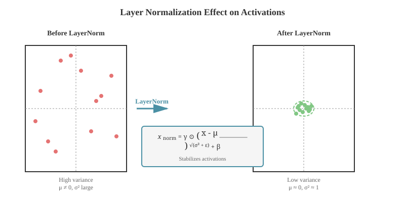
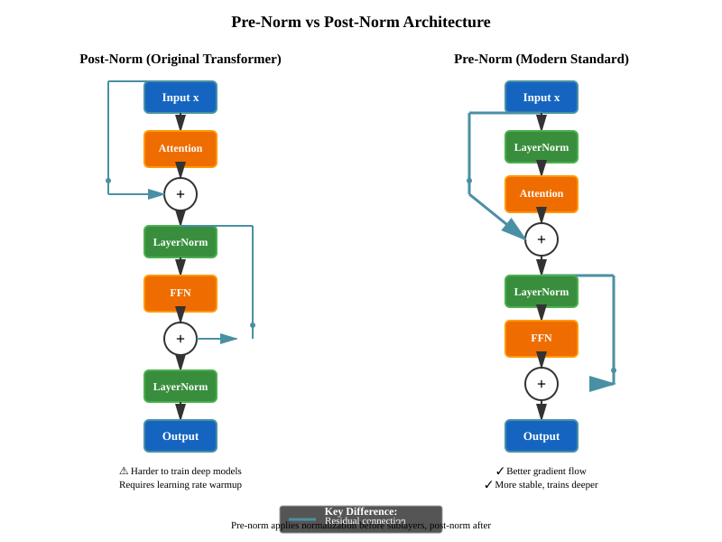

# Chapter 9: The Transformer Block

The transformer block is the fundamental building unit of modern LLMs. Understanding its components - layer normalization, feed-forward networks, residual connections, and their arrangement - is essential for implementing and debugging transformer models. This chapter covers the architecture choices that make transformers trainable at scale.

## Table of Contents

1. [Overview](#overview)
2. [Layer Normalization](#layer-normalization)
   - [LayerNorm](#layernorm)
   - [RMSNorm](#rmsnorm)
   - [Implementation and Comparison](#implementation-and-comparison)
3. [Feed-Forward Networks](#feed-forward-networks)
   - [FFN Structure](#ffn-structure)
   - [Implementation](#ffn-implementation)
4. [Residual Connections](#residual-connections)
5. [Pre-Norm vs Post-Norm](#pre-norm-vs-post-norm)
   - [Post-Norm Architecture](#post-norm-architecture)
   - [Pre-Norm Architecture](#pre-norm-architecture)
   - [Why Pre-Norm is Standard](#why-pre-norm-is-standard)
6. [Complete Transformer Block Implementation](#complete-transformer-block-implementation)
   - [Creating Attention Masks](#creating-attention-masks)
   - [Initialization Strategies](#initialization-strategies)
7. [Visualization and Analysis](#visualization-and-analysis)
8. [Modern Variants](#modern-variants)
   - [Parallel Attention and FFN](#parallel-attention-and-ffn)
   - [Grouped Query Attention (GQA)](#grouped-query-attention-gqa)
9. [Exercises](#exercises)
10. [Common Interview Questions](#common-interview-questions)

---

## Overview

A transformer block processes input sequences through two main sub-layers:

1. **Self-Attention Layer**: Captures relationships between tokens (covered in [Multi-Head Attention](04-multi-head-attention.md))
2. **Feed-Forward Network (FFN)**: Processes each position independently

Each sub-layer is wrapped with:

- **Residual connections**: Enable gradient flow in deep networks
- **Layer normalization**: Stabilize training

The arrangement of these components (pre-norm vs post-norm) significantly affects training stability and performance.

---

## Layer Normalization

Layer normalization normalizes activations across the feature dimension for each example independently. This is crucial for stable training of deep transformers.

### LayerNorm

**Original formulation** from [Ba et al., 2016](https://arxiv.org/abs/1607.06450):

For input $\mathbf{x} \in \mathbb{R}^d$:

```math
\text{LayerNorm}(\mathbf{x}) = \gamma \odot \frac{\mathbf{x} - \mu}{\sqrt{\sigma^2 + \epsilon}} + \beta
```

where:

- $\mu = \frac{1}{d}\sum_{i=1}^d x_i$ (mean)
- $\sigma^2 = \frac{1}{d}\sum_{i=1}^d (x_i - \mu)^2$ (variance)
- $\gamma, \beta \in \mathbb{R}^d$ are learned scale and shift parameters
- $\epsilon$ is a small constant for numerical stability (typically $10^{-5}$ or $10^{-6}$)

**Key properties:**

- Normalizes across features (d), not batch dimension
- Each example normalized independently
- Invariant to scale and shift transformations

### RMSNorm

**Root Mean Square Normalization** from [Zhang & Sennrich, 2019](https://arxiv.org/abs/1910.07467), used in modern LLMs (LLaMA, GPT-4, etc.):

```math
\text{RMSNorm}(\mathbf{x}) = \gamma \odot \frac{\mathbf{x}}{\text{RMS}(\mathbf{x})}
```

where:

```math
\text{RMS}(\mathbf{x}) = \sqrt{\frac{1}{d}\sum_{i=1}^d x_i^2 + \epsilon}
```

**Differences from LayerNorm:**

- No mean centering (removes $\mu$)
- No bias term ($\beta$)
- ~10-15% faster computation
- Empirically similar or better performance

**Why RMSNorm works:**

- Re-centering contributes little to training stability
- Scale normalization is the key factor
- Simpler computation, fewer parameters

### Implementation and Comparison

**The Problem Being Solved:**

Layer normalization addresses the internal covariate shift problem in deep neural networks. During training, the distribution of layer inputs changes as parameters in previous layers update, forcing each layer to continuously adapt. This phenomenon slows down training and makes it difficult to use high learning rates. For transformers processing variable-length sequences, batch normalization (which normalizes across the batch dimension) is unsuitable because:

1. Batch statistics are unreliable with variable sequence lengths
2. Training and inference behavior differs significantly
3. Small batch sizes (common in NLP due to memory constraints) lead to noisy statistics

**Theoretical Justification:**

Layer normalization normalizes across features rather than batch examples, computing statistics independently for each example in the batch. This approach is theoretically sound because:

1. **Independence from batch composition**: Each example is normalized based only on its own statistics, making behavior identical during training and inference
2. **Scale invariance**: The normalization makes the network invariant to the scale of input features, which is crucial when dealing with embeddings of different magnitudes
3. **Reparameterization**: The learned affine parameters $\gamma$ (scale) and $\beta$ (shift) allow the network to recover any desired distribution if needed

**Relationship to Alternatives:**

- **Batch Normalization**: Normalizes across batch dimension; works well for CNNs with large batches but fails for transformers with variable-length sequences
- **Group Normalization**: Divides features into groups and normalizes within groups; useful for CNNs but unnecessary for transformers
- **Instance Normalization**: Similar to LayerNorm but without learned parameters; used in style transfer
- **RMSNorm**: Simplified version that removes mean centering and bias; faster with similar performance

**Key Insights That Make LayerNorm Work:**

1. **Feature-wise normalization is sufficient**: Normalizing across the feature dimension alone stabilizes training, even without batch statistics
2. **Learnable affine transform preserves expressiveness**: The $\gamma$ and $\beta$ parameters ensure the network can undo normalization if needed
3. **Zero-mean, unit-variance initialization**: Forces each layer to start from a consistent distribution, preventing activation explosion in deep networks
4. **Gradient flow improvement**: By maintaining consistent activation scales, LayerNorm prevents gradient vanishing/explosion during backpropagation

```python
import torch
import torch.nn as nn
import matplotlib.pyplot as plt
import numpy as np

class LayerNorm(nn.Module):
    """Standard Layer Normalization with learned affine parameters."""

    def __init__(self, d_model: int, eps: float = 1e-6):
        super().__init__()
        self.eps = eps
        # Learnable scale and shift
        self.gamma = nn.Parameter(torch.ones(d_model))
        self.beta = nn.Parameter(torch.zeros(d_model))

    def forward(self, x: torch.Tensor) -> torch.Tensor:
        """
        Args:
            x: shape (batch, seq_len, d_model)
        Returns:
            normalized: shape (batch, seq_len, d_model)
        """
        # Compute mean and variance across d_model dimension
        mean = x.mean(dim=-1, keepdim=True)  # (batch, seq_len, 1)
        var = x.var(dim=-1, keepdim=True, unbiased=False)  # (batch, seq_len, 1)

        # Normalize
        x_norm = (x - mean) / torch.sqrt(var + self.eps)

        # Scale and shift
        return self.gamma * x_norm + self.beta


class RMSNorm(nn.Module):
    """Root Mean Square Normalization - more efficient than LayerNorm."""

    def __init__(self, d_model: int, eps: float = 1e-6):
        super().__init__()
        self.eps = eps
        # Only learnable scale, no bias
        self.gamma = nn.Parameter(torch.ones(d_model))

    def forward(self, x: torch.Tensor) -> torch.Tensor:
        """
        Args:
            x: shape (batch, seq_len, d_model)
        Returns:
            normalized: shape (batch, seq_len, d_model)
        """
        # Compute RMS
        rms = torch.sqrt(torch.mean(x ** 2, dim=-1, keepdim=True) + self.eps)

        # Normalize and scale
        return self.gamma * (x / rms)


# Optimized RMSNorm (closer to production implementations)
class RMSNormOptimized(nn.Module):
    """Optimized RMSNorm using rsqrt for better performance."""

    def __init__(self, d_model: int, eps: float = 1e-6):
        super().__init__()
        self.eps = eps
        self.gamma = nn.Parameter(torch.ones(d_model))

    def forward(self, x: torch.Tensor) -> torch.Tensor:
        # Using rsqrt is faster than 1/sqrt
        norm = x * torch.rsqrt(x.pow(2).mean(-1, keepdim=True) + self.eps)
        return self.gamma * norm


# Comparison
def compare_normalizations():
    """Compare LayerNorm and RMSNorm behavior."""
    d_model = 512
    batch_size = 2
    seq_len = 10

    # Create test input
    x = torch.randn(batch_size, seq_len, d_model)

    # Initialize normalizations
    ln = LayerNorm(d_model)
    rms = RMSNorm(d_model)

    # Forward pass
    ln_out = ln(x)
    rms_out = rms(x)

    print("Input statistics:")
    print(f"  Mean: {x.mean():.4f}, Std: {x.std():.4f}")
    print("\nLayerNorm output statistics:")
    print(f"  Mean: {ln_out.mean():.6f}, Std: {ln_out.std():.4f}")
    print("\nRMSNorm output statistics:")
    print(f"  Mean: {rms_out.mean():.4f}, Std: {rms_out.std():.4f}")

    # Check per-example statistics
    print("\nPer-example statistics (first example, first position):")
    print(f"  LayerNorm - Mean: {ln_out[0, 0].mean():.6f}, Std: {ln_out[0, 0].std():.4f}")
    print(f"  RMSNorm - Mean: {rms_out[0, 0].mean():.4f}, Std: {rms_out[0, 0].std():.4f}")

    # Benchmark
    import time

    x_cuda = x.cuda() if torch.cuda.is_available() else x
    ln_cuda = ln.cuda() if torch.cuda.is_available() else ln
    rms_cuda = rms.cuda() if torch.cuda.is_available() else rms

    # Warmup
    for _ in range(10):
        _ = ln_cuda(x_cuda)
        _ = rms_cuda(x_cuda)

    # Time LayerNorm
    if torch.cuda.is_available():
        torch.cuda.synchronize()
    start = time.time()
    for _ in range(100):
        _ = ln_cuda(x_cuda)
    if torch.cuda.is_available():
        torch.cuda.synchronize()
    ln_time = time.time() - start

    # Time RMSNorm
    if torch.cuda.is_available():
        torch.cuda.synchronize()
    start = time.time()
    for _ in range(100):
        _ = rms_cuda(x_cuda)
    if torch.cuda.is_available():
        torch.cuda.synchronize()
    rms_time = time.time() - start

    print(f"\nSpeed comparison (100 iterations):")
    print(f"  LayerNorm: {ln_time*1000:.2f}ms")
    print(f"  RMSNorm: {rms_time*1000:.2f}ms")
    print(f"  Speedup: {ln_time/rms_time:.2f}x")


if __name__ == "__main__":
    compare_normalizations()
```

**Output interpretation:**

- LayerNorm produces outputs with mean ≈ 0 (due to centering)
- RMSNorm preserves the mean but normalizes scale
- RMSNorm is 10-15% faster

**Visualization:**



The diagram above illustrates how layer normalization transforms scattered, high-variance activations into a normalized distribution with controlled mean and variance, stabilizing training across deep networks.

---

## Feed-Forward Networks

The feed-forward network (FFN) processes each position independently with the same learned transformation.

### FFN Structure

Standard FFN consists of two linear transformations with a non-linear activation:

```math
\text{FFN}(\mathbf{x}) = \mathbf{W}_2 \cdot \sigma(\mathbf{W}_1 \mathbf{x} + \mathbf{b}_1) + \mathbf{b}_2
```

where:

- $\mathbf{x} \in \mathbb{R}^{d_{\text{model}}}$ is the input
- $\mathbf{W}_1 \in \mathbb{R}^{d_{\text{ff}} \times d_{\text{model}}}$, $\mathbf{W}_2 \in \mathbb{R}^{d_{\text{model}} \times d_{\text{ff}}}$
- $d_{\text{ff}}$ is the intermediate dimension (typically $4 \times d_{\text{model}}$)
- $\sigma$ is the activation function (see [Activation Functions](10-activation-functions.md))

**Standard choices:**

- Original Transformer: $d_{\text{ff}} = 4 \times d_{\text{model}}$, activation = ReLU
- Modern LLMs: $d_{\text{ff}} = \frac{8}{3} \times d_{\text{model}}$ or $3.5 \times d_{\text{model}}$, activation = SwiGLU/GeGLU

**Why is FFN needed?**

- Attention is linear (weighted sum), FFN adds non-linearity
- FFN processes each position independently (position-wise)
- Provides additional capacity and expressiveness
- Can be thought of as key-value memory (shown in research)

### FFN Implementation

**The Problem Being Solved:**

Self-attention mechanisms are fundamentally linear operations—they compute weighted sums of value vectors. Without non-linearity, stacking multiple attention layers would be equivalent to a single attention layer (since compositions of linear transformations are still linear). The FFN introduces the essential non-linear transformations that enable transformers to learn complex, non-linear representations and decision boundaries.

**Theoretical Justification:**

The FFN serves multiple theoretical roles:

1. **Universal approximation**: A two-layer FFN with non-linear activation is a universal function approximator (by the universal approximation theorem), allowing transformers to represent arbitrary functions
2. **Position-wise processing**: Unlike attention which mixes information across positions, FFN processes each position independently, providing computational diversity
3. **Key-value memory interpretation**: Recent research (Geva et al., 2020) shows FFN layers function as key-value memories, where different neurons activate for different input patterns and contribute specific knowledge
4. **Capacity expansion**: The intermediate dimension $d_{ff}$ (typically 4x larger than $d_{model}$) provides additional capacity for the model to store and process information

**Relationship to Alternatives:**

- **Single linear layer**: Would be insufficient—no non-linearity means limited expressiveness
- **Deeper FFN (3+ layers)**: Provides more flexibility but at the cost of increased parameters and computation; empirically, 2 layers work well
- **Gated architectures (GLU, SwiGLU)**: Modern alternative that uses gating mechanisms instead of simple activation; provides better performance but requires more parameters
- **Mixture of Experts (MoE)**: Sparse variant where only a subset of FFN "experts" activate for each input; enables scaling to massive parameter counts

**Key Insights That Make FFN Work:**

1. **The 4x expansion ratio**: Empirically discovered sweet spot balancing capacity and efficiency; too small underfits, too large shows diminishing returns
2. **Position-wise independence**: Processing each position separately is computationally efficient (fully parallelizable) and provides a different inductive bias from attention
3. **Bottleneck architecture**: Expanding then contracting ($d_{\text{model}} \to d_{\text{ff}} \to d_{\text{model}}$) forces learning of compressed, useful representations
4. **Where parameters go**: FFN typically contains 60-70% of transformer parameters, making it the primary storage for learned knowledge

```python
class FeedForward(nn.Module):
    """Position-wise Feed-Forward Network."""

    def __init__(
        self,
        d_model: int,
        d_ff: int,
        dropout: float = 0.1,
        activation: str = "relu"
    ):
        """
        Args:
            d_model: Model dimension
            d_ff: Feed-forward intermediate dimension
            dropout: Dropout probability
            activation: Activation function ('relu', 'gelu')
        """
        super().__init__()
        self.w1 = nn.Linear(d_model, d_ff)
        self.w2 = nn.Linear(d_ff, d_model)
        self.dropout = nn.Dropout(dropout)

        # Activation function
        if activation == "relu":
            self.activation = nn.ReLU()
        elif activation == "gelu":
            self.activation = nn.GELU()
        else:
            raise ValueError(f"Unknown activation: {activation}")

    def forward(self, x: torch.Tensor) -> torch.Tensor:
        """
        Args:
            x: shape (batch, seq_len, d_model)
        Returns:
            output: shape (batch, seq_len, d_model)
        """
        # First linear layer + activation
        hidden = self.activation(self.w1(x))  # (batch, seq_len, d_ff)

        # Dropout
        hidden = self.dropout(hidden)

        # Second linear layer
        output = self.w2(hidden)  # (batch, seq_len, d_model)

        return output


# Example usage
def test_ffn():
    d_model = 512
    d_ff = 2048  # 4x expansion
    batch_size = 2
    seq_len = 10

    ffn = FeedForward(d_model, d_ff, activation="gelu")

    x = torch.randn(batch_size, seq_len, d_model)
    output = ffn(x)

    print(f"Input shape: {x.shape}")
    print(f"Output shape: {output.shape}")
    print(f"FFN parameters: {sum(p.numel() for p in ffn.parameters()):,}")
    # Parameters: d_model * d_ff + d_ff + d_ff * d_model + d_model
    #           = 2 * d_model * d_ff + d_ff + d_model
    #           = 2 * 512 * 2048 + 2048 + 512 = 2,099,712

if __name__ == "__main__":
    test_ffn()
```

**Parameter count:**

- FFN has ~$2 \times d_{\text{model}} \times d_{\text{ff}}$ parameters
- With $d_{\text{ff}} = 4 \times d_{\text{model}}$, FFN has $8 \times d_{\text{model}}^2$ parameters
- This is typically 2/3 of all transformer block parameters

---

## Residual Connections

Residual connections (skip connections) add the input of a sub-layer to its output:

```math
\mathbf{y} = \mathbf{x} + \text{SubLayer}(\mathbf{x})
```

Residual connections are essential for training deep transformers, enabling gradient flow through 100+ layers. They solve the vanishing gradient problem by providing identity shortcuts that allow gradients to flow directly backward.

For a detailed treatment of residual connections, including gradient flow analysis, mathematical justification, and code examples, see [Appendix: Residual Connections](../appendices/residual-connections.md).

---

## Pre-Norm vs Post-Norm

The arrangement of layer normalization relative to sub-layers significantly impacts training.

### Post-Norm Architecture

**Original Transformer** ([Vaswani et al., 2017](https://arxiv.org/abs/1706.03762)):

```text
x → [Self-Attention] → [Add & Norm] → [FFN] → [Add & Norm] → output
     ↑_______________↓                 ↑_______↓
```

Mathematically:

```math
\begin{align}
\mathbf{y}_1 &= \text{LayerNorm}(\mathbf{x} + \text{Attention}(\mathbf{x})) \\
\mathbf{y}_2 &= \text{LayerNorm}(\mathbf{y}_1 + \text{FFN}(\mathbf{y}_1))
\end{align}
```

**Issues:**

- Gradients flow through normalization layers during backprop
- Harder to train very deep models (>12 layers)
- Often requires careful learning rate warmup

### Pre-Norm Architecture

**Modern standard** ([Xiong et al., 2020](https://arxiv.org/abs/2002.04745)):

```text
x → [Norm] → [Self-Attention] → [Add] → [Norm] → [FFN] → [Add] → output
     ↑_________________________↓          ↑_______________↓
```

Mathematically:

```math
\begin{align}
\mathbf{y}_1 &= \mathbf{x} + \text{Attention}(\text{LayerNorm}(\mathbf{x})) \\
\mathbf{y}_2 &= \mathbf{y}_1 + \text{FFN}(\text{LayerNorm}(\mathbf{y}_1))
\end{align}
```

**Advantages:**

- Gradients flow directly through residual connections
- More stable training for deep models (100+ layers)
- Less sensitive to learning rate and initialization
- Standard in modern LLMs (GPT-3, LLaMA, PaLM, etc.)

**Visualization:**



The diagram compares the two architectural choices. In post-norm (left), normalization happens after the residual addition, forcing gradients to flow through normalization layers. In pre-norm (right), normalization happens before sub-layers, allowing gradients to flow directly through the residual connections (thick blue lines), resulting in more stable training.

### Why Pre-Norm is Standard

**Research findings:**

1. **Training stability** ([Xiong et al., 2020](https://arxiv.org/abs/2002.04745)):
   - Pre-norm enables training without learning rate warmup
   - Supports larger learning rates
   - Better gradient flow in deep networks

2. **Performance** (empirical):
   - Pre-norm often matches or exceeds post-norm final performance
   - Especially beneficial for very deep models (>24 layers)

3. **Gradient analysis:**
   - Post-norm: gradient norm grows with depth
   - Pre-norm: gradient norm stays bounded

**Trade-offs:**

- Pre-norm: Better training, slightly worse representation power
- Post-norm: Theoretically stronger, harder to optimize
- Modern practice: Pre-norm + final norm after all blocks

```python
def compare_architectures():
    """Compare pre-norm and post-norm gradient flow."""

    class PostNormBlock(nn.Module):
        def __init__(self, d_model):
            super().__init__()
            self.linear = nn.Linear(d_model, d_model)
            self.norm = nn.LayerNorm(d_model)

        def forward(self, x):
            # Apply transformation, add residual, then normalize
            return self.norm(x + self.linear(x))

    class PreNormBlock(nn.Module):
        def __init__(self, d_model):
            super().__init__()
            self.linear = nn.Linear(d_model, d_model)
            self.norm = nn.LayerNorm(d_model)

        def forward(self, x):
            # Normalize, apply transformation, then add residual
            return x + self.linear(self.norm(x))

    d_model = 128
    depth = 24

    # Create deep networks
    post_norm = nn.Sequential(*[PostNormBlock(d_model) for _ in range(depth)])
    pre_norm = nn.Sequential(*[PreNormBlock(d_model) for _ in range(depth)])

    x = torch.randn(4, 10, d_model, requires_grad=True)

    # Test post-norm
    x_post = x.clone().detach().requires_grad_(True)
    out_post = post_norm(x_post)
    loss_post = out_post.mean()
    loss_post.backward()

    # Test pre-norm
    x_pre = x.clone().detach().requires_grad_(True)
    out_pre = pre_norm(x_pre)
    loss_pre = out_pre.mean()
    loss_pre.backward()

    print(f"Depth: {depth} layers")
    print(f"Post-norm input gradient norm: {x_post.grad.norm():.6f}")
    print(f"Pre-norm input gradient norm: {x_pre.grad.norm():.6f}")
    print(f"Pre-norm is more stable: {x_pre.grad.norm() > x_post.grad.norm()}")

if __name__ == "__main__":
    compare_architectures()
```

---

## Complete Transformer Block Implementation

Now we combine all components into a complete transformer block.

```python
from typing import Optional

class TransformerBlock(nn.Module):
    """
    Complete transformer block with pre-norm architecture.

    This is the standard building block of modern LLMs.
    """

    def __init__(
        self,
        d_model: int,
        n_heads: int,
        d_ff: int,
        dropout: float = 0.1,
        norm_type: str = "rmsnorm",
        activation: str = "gelu"
    ):
        """
        Args:
            d_model: Model dimension
            n_heads: Number of attention heads
            d_ff: Feed-forward intermediate dimension
            dropout: Dropout probability
            norm_type: Type of normalization ('layernorm' or 'rmsnorm')
            activation: Activation function for FFN
        """
        super().__init__()

        # Normalization layers
        if norm_type == "layernorm":
            self.norm1 = LayerNorm(d_model)
            self.norm2 = LayerNorm(d_model)
        elif norm_type == "rmsnorm":
            self.norm1 = RMSNorm(d_model)
            self.norm2 = RMSNorm(d_model)
        else:
            raise ValueError(f"Unknown norm_type: {norm_type}")

        # Self-attention (simplified - see Multi-Head Attention chapter)
        self.self_attn = nn.MultiheadAttention(
            d_model,
            n_heads,
            dropout=dropout,
            batch_first=True
        )

        # Feed-forward network
        self.ffn = FeedForward(d_model, d_ff, dropout, activation)

        self.dropout = nn.Dropout(dropout)

    def forward(
        self,
        x: torch.Tensor,
        mask: Optional[torch.Tensor] = None
    ) -> torch.Tensor:
        """
        Args:
            x: Input tensor of shape (batch, seq_len, d_model)
            mask: Optional attention mask (batch, seq_len, seq_len) or (seq_len, seq_len)

        Returns:
            output: shape (batch, seq_len, d_model)
        """
        # Self-attention with pre-norm
        # 1. Normalize
        x_norm = self.norm1(x)

        # 2. Self-attention
        attn_output, _ = self.self_attn(
            x_norm, x_norm, x_norm,
            attn_mask=mask,
            need_weights=False
        )

        # 3. Residual connection
        x = x + self.dropout(attn_output)

        # Feed-forward with pre-norm
        # 1. Normalize
        x_norm = self.norm2(x)

        # 2. FFN
        ffn_output = self.ffn(x_norm)

        # 3. Residual connection
        x = x + self.dropout(ffn_output)

        return x


# Example: Stack multiple blocks
class TransformerStack(nn.Module):
    """Stack of transformer blocks forming a complete transformer."""

    def __init__(
        self,
        n_layers: int,
        d_model: int,
        n_heads: int,
        d_ff: int,
        dropout: float = 0.1,
        norm_type: str = "rmsnorm"
    ):
        super().__init__()

        self.blocks = nn.ModuleList([
            TransformerBlock(d_model, n_heads, d_ff, dropout, norm_type)
            for _ in range(n_layers)
        ])

        # Final normalization (common in modern LLMs)
        if norm_type == "rmsnorm":
            self.final_norm = RMSNorm(d_model)
        else:
            self.final_norm = LayerNorm(d_model)

    def forward(
        self,
        x: torch.Tensor,
        mask: Optional[torch.Tensor] = None
    ) -> torch.Tensor:
        """
        Args:
            x: Input embeddings (batch, seq_len, d_model)
            mask: Optional attention mask

        Returns:
            output: shape (batch, seq_len, d_model)
        """
        for block in self.blocks:
            x = block(x, mask)

        # Final normalization
        x = self.final_norm(x)

        return x


# Testing the complete implementation
def test_transformer_block():
    # Model configuration
    d_model = 512
    n_heads = 8
    d_ff = 2048
    n_layers = 6
    batch_size = 2
    seq_len = 10

    # Create model
    model = TransformerStack(
        n_layers=n_layers,
        d_model=d_model,
        n_heads=n_heads,
        d_ff=d_ff,
        dropout=0.1,
        norm_type="rmsnorm"
    )

    # Create input
    x = torch.randn(batch_size, seq_len, d_model)

    # Forward pass
    output = model(x)

    print("Transformer Stack Test:")
    print(f"  Input shape: {x.shape}")
    print(f"  Output shape: {output.shape}")
    print(f"  Number of layers: {n_layers}")
    print(f"  Parameters: {sum(p.numel() for p in model.parameters()):,}")

    # Parameter breakdown
    block_params = sum(p.numel() for p in model.blocks[0].parameters())
    print(f"  Parameters per block: {block_params:,}")

if __name__ == "__main__":
    test_transformer_block()
```

### Creating Attention Masks

**The Problem Being Solved:**

In many sequence modeling tasks, we need to control the information flow between positions. For autoregressive language modeling (like GPT), a model must predict the next token using only previous tokens—allowing it to see future tokens would be cheating and lead to poor generalization. Similarly, for variable-length sequences, we need to prevent attention to padding tokens that carry no meaningful information.

**Theoretical Justification:**

Attention masks implement two critical constraints:

1. **Causality (autoregressive property)**: For language modeling, the probability of token $i$ must depend only on tokens $1, ..., i-1$:


   ```math
P(x_i | x_1, ..., x_{i-1}, x_{i+1}, ..., x_n) = P(x_i | x_1, ..., x_{i-1})
```

   Violating this makes training and inference inconsistent—the model trains with future information but can't access it during generation.

2. **Padding invariance**: Padding tokens should not influence the representation of real tokens. Mathematically, for any padding position $p$:


   ```math
\text{Attention}(\mathbf{q}_i, \mathbf{k}_p, \mathbf{v}_p) = 0
```

**Relationship to Alternatives:**

- **Explicit position checks**: Could check positions in attention computation, but masking is cleaner and more efficient
- **Separate training/inference code**: Could use different attention for training vs inference, but masking unifies them
- **Truncation instead of padding**: Removing padding eliminates the need for padding masks but requires complex batching logic and reduces GPU utilization
- **Bidirectional models (BERT)**: Don't use causal masks, allowing attention in all directions; suitable for understanding tasks but not generation

**Key Insights That Make Masking Work:**

1. **Softmax with -inf**: Adding $-\infty$ to attention scores before softmax ensures those positions get 0 attention weight after softmax, effectively removing them
2. **Triangular structure for causality**: An upper triangular mask naturally represents the constraint that position $i$ can only attend to $j \leq i$
3. **Combination via logical OR**: Causal and padding masks can be combined naturally—a position is masked if it's either padding OR in the future
4. **One-time computation**: Masks are input-independent (except for padding lengths) and can be precomputed and reused

Attention masks are crucial for controlling which positions can attend to which. Here's how to create common mask types:

```python
def create_causal_mask(seq_len: int, device: str = 'cpu') -> torch.Tensor:
    """
    Create a causal (autoregressive) mask for decoder self-attention.

    Prevents positions from attending to future positions.
    For position i, can only attend to positions j <= i.

    Args:
        seq_len: Sequence length
        device: Device to create tensor on

    Returns:
        mask: Boolean mask of shape (seq_len, seq_len)
              True indicates positions that should be masked (not attended to)
    """
    # Create upper triangular matrix (excluding diagonal)
    mask = torch.triu(torch.ones(seq_len, seq_len, device=device), diagonal=1)

    # Convert to boolean: 1 -> True (masked), 0 -> False (not masked)
    mask = mask.bool()

    return mask


def create_padding_mask(lengths: torch.Tensor, max_len: int) -> torch.Tensor:
    """
    Create padding mask for variable-length sequences.

    Args:
        lengths: Actual length of each sequence (batch_size,)
        max_len: Maximum sequence length (padded length)

    Returns:
        mask: Boolean mask of shape (batch_size, max_len)
              True indicates padding positions
    """
    batch_size = lengths.size(0)

    # Create position indices
    positions = torch.arange(max_len, device=lengths.device).unsqueeze(0)  # (1, max_len)

    # Compare with lengths
    mask = positions >= lengths.unsqueeze(1)  # (batch_size, max_len)

    return mask


def create_combined_mask(
    seq_len: int,
    padding_lengths: Optional[torch.Tensor] = None,
    device: str = 'cpu'
) -> torch.Tensor:
    """
    Create combined causal + padding mask for decoder.

    Args:
        seq_len: Sequence length
        padding_lengths: Optional actual lengths for each sequence in batch
        device: Device to create tensor on

    Returns:
        mask: Boolean mask of shape (batch_size, seq_len, seq_len) or (seq_len, seq_len)
    """
    # Start with causal mask
    causal_mask = create_causal_mask(seq_len, device)  # (seq_len, seq_len)

    if padding_lengths is not None:
        # Create padding mask
        padding_mask = create_padding_mask(padding_lengths, seq_len)  # (batch, seq_len)

        # Expand padding mask to (batch, seq_len, seq_len)
        # A position should be masked if it's padding OR if it's in the future
        batch_size = padding_lengths.size(0)

        # Expand causal mask for batch
        causal_mask = causal_mask.unsqueeze(0).expand(batch_size, -1, -1)  # (batch, seq_len, seq_len)

        # Expand padding mask: mask column j if position j is padding
        padding_mask_expanded = padding_mask.unsqueeze(1).expand(-1, seq_len, -1)  # (batch, seq_len, seq_len)

        # Combine: mask if EITHER causal OR padding
        mask = causal_mask | padding_mask_expanded
    else:
        mask = causal_mask

    return mask


# Example usage and visualization
def test_masks():
    """Demonstrate mask creation and visualization."""
    import matplotlib.pyplot as plt

    seq_len = 10

    # 1. Causal mask
    causal_mask = create_causal_mask(seq_len)

    # 2. Padding mask (simulate batch with different lengths)
    batch_size = 3
    lengths = torch.tensor([10, 7, 5])  # Different sequence lengths
    padding_mask = create_padding_mask(lengths, seq_len)

    # 3. Combined mask
    combined_mask = create_combined_mask(seq_len, lengths)

    # Visualize
    fig, axes = plt.subplots(2, 2, figsize=(12, 10))

    # Causal mask
    axes[0, 0].imshow(causal_mask.float(), cmap='RdYlGn_r', vmin=0, vmax=1)
    axes[0, 0].set_title('Causal Mask\n(True = masked position)')
    axes[0, 0].set_xlabel('Key Position')
    axes[0, 0].set_ylabel('Query Position')

    # Padding mask (first example)
    axes[0, 1].imshow(padding_mask.float(), cmap='RdYlGn_r', vmin=0, vmax=1)
    axes[0, 1].set_title('Padding Mask\n(True = padding position)')
    axes[0, 1].set_xlabel('Position')
    axes[0, 1].set_ylabel('Batch Example')

    # Combined mask (first example in batch)
    axes[1, 0].imshow(combined_mask[0].float(), cmap='RdYlGn_r', vmin=0, vmax=1)
    axes[1, 0].set_title(f'Combined Mask (Example 0, length={lengths[0]})')
    axes[1, 0].set_xlabel('Key Position')
    axes[1, 0].set_ylabel('Query Position')

    # Combined mask (third example - most padding)
    axes[1, 1].imshow(combined_mask[2].float(), cmap='RdYlGn_r', vmin=0, vmax=1)
    axes[1, 1].set_title(f'Combined Mask (Example 2, length={lengths[2]})')
    axes[1, 1].set_xlabel('Key Position')
    axes[1, 1].set_ylabel('Query Position')

    plt.tight_layout()
    plt.savefig('attention_masks.png', dpi=150, bbox_inches='tight')
    print("Mask visualization saved to 'attention_masks.png'")

    # Print some examples
    print("\nCausal mask (first 5x5):")
    print(causal_mask[:5, :5].int())

    print("\nCombined mask for sequence of length 5 (showing 5x10):")
    print(combined_mask[2, :5, :].int())


# Using masks with PyTorch's MultiheadAttention
def example_with_attention():
    """Example of using masks with transformer block."""
    batch_size = 2
    seq_len = 8
    d_model = 64

    # Create transformer block
    block = TransformerBlock(d_model=d_model, n_heads=4, d_ff=256)

    # Create input
    x = torch.randn(batch_size, seq_len, d_model)

    # Create causal mask for autoregressive generation
    # PyTorch MultiheadAttention expects mask where True/inf values are masked
    mask = create_causal_mask(seq_len)

    # For PyTorch MultiheadAttention, convert boolean to float mask
    # True -> -inf, False -> 0
    attn_mask = torch.zeros_like(mask, dtype=torch.float)
    attn_mask = attn_mask.masked_fill(mask, float('-inf'))

    # Forward pass with mask
    output = block(x, mask=attn_mask)

    print(f"\nExample with attention mask:")
    print(f"  Input shape: {x.shape}")
    print(f"  Mask shape: {attn_mask.shape}")
    print(f"  Output shape: {output.shape}")


if __name__ == "__main__":
    test_masks()
    example_with_attention()
```

**Key points about masks:**

1. **Causal mask**: Upper triangular, prevents attending to future positions
2. **Padding mask**: Masks out padding tokens in variable-length sequences
3. **Combined mask**: Logical OR of causal and padding masks
4. **Format**: PyTorch's `MultiheadAttention` expects:
   - Boolean tensor where `True` = masked
   - Or float tensor where `-inf` = masked, `0` = not masked

### Initialization Strategies

**The Problem Being Solved:**

Poor weight initialization can make deep neural networks untrainable. If weights are too large, activations and gradients explode; if too small, they vanish. Both scenarios prevent effective learning. The challenge is particularly acute for transformers because:

1. They are very deep (often 24-96+ layers)
2. They use residual connections that can accumulate signals
3. Different components (attention, FFN, normalization) have different characteristics
4. The same initialization strategy must work across various model scales

**Theoretical Justification:**

Good initialization maintains signal propagation through both forward and backward passes. For a layer with input dimension $d_{in}$ and output dimension $d_{out}$:

**Xavier/Glorot initialization** assumes linear activations and derives the variance:

```math
\text{Var}(W_{ij}) = \frac{2}{d_{in} + d_{out}}
```

This ensures that variance of activations and gradients remains roughly constant across layers. The symmetric form considers both forward (depends on $d_{in}$) and backward (depends on $d_{out}$) passes.

**Kaiming/He initialization** accounts for ReLU activations which zero out half the neurons:

```math
\text{Var}(W_{ij}) = \frac{2}{d_{in}}
```

For very deep transformers, **scaled initialization** prevents residual path signals from growing:

```math
W \gets W \cdot \frac{1}{\sqrt{2L}}
```

where $L$ is the number of layers. This is based on the analysis that with $L$ residual blocks, variance grows by a factor of $L$.

**Relationship to Alternatives:**

- **Random initialization**: Without proper scaling, fails catastrophically for deep networks
- **Pre-trained initialization**: Transfer learning approach; excellent when available but requires compatible architecture
- **Layer-sequential training**: Train layers one at a time; avoids initialization issues but extremely slow
- **Fixup initialization**: Alternative that eliminates need for normalization layers; less commonly used than proper init + normalization

**Key Insights That Make Good Initialization Work:**

1. **Variance preservation**: Keeping activation variance roughly constant prevents explosion/vanishing
2. **Component-specific strategies**: Normalization layers should start at identity (γ=1, β=0); linear layers need careful scaling
3. **Depth-aware scaling**: Very deep models benefit from scaling down residual contributions
4. **Activation-aware**: Different activations (ReLU vs GELU vs tanh) have different statistics and need different initialization

Proper weight initialization is crucial for training stability and convergence speed. Different components require different initialization strategies.

```python
class TransformerBlockWithInit(nn.Module):
    """
    Transformer block with careful initialization following modern best practices.
    """

    def __init__(
        self,
        d_model: int,
        n_heads: int,
        d_ff: int,
        dropout: float = 0.1,
        depth: int = 12,  # Total depth of the model (for scaled init)
        norm_type: str = "rmsnorm"
    ):
        super().__init__()

        # Normalization layers
        if norm_type == "rmsnorm":
            self.norm1 = RMSNorm(d_model)
            self.norm2 = RMSNorm(d_model)
        else:
            self.norm1 = LayerNorm(d_model)
            self.norm2 = LayerNorm(d_model)

        # Self-attention
        self.self_attn = nn.MultiheadAttention(
            d_model, n_heads, dropout=dropout, batch_first=True
        )

        # Feed-forward network
        self.ffn = FeedForward(d_model, d_ff, dropout)
        self.dropout = nn.Dropout(dropout)

        # Store depth for initialization
        self.depth = depth

        # Initialize weights
        self._init_weights()

    def _init_weights(self):
        """
        Initialize weights following best practices for deep transformers.

        Strategy:

        1. LayerNorm/RMSNorm: gamma=1, beta=0 (already done by PyTorch)
        2. Attention: Xavier/Glorot uniform initialization
        3. FFN: Xavier/Glorot with optional depth scaling
        4. Residual path scaling (optional, for very deep models)

        """
        # Attention weights - Xavier/Glorot initialization
        # PyTorch's MultiheadAttention already uses reasonable init, but we can override
        for name, param in self.self_attn.named_parameters():
            if 'weight' in name:
                # Xavier uniform initialization
                nn.init.xavier_uniform_(param)
            elif 'bias' in name:
                # Zero bias
                nn.init.zeros_(param)

        # FFN weights - Xavier/Glorot initialization
        for name, param in self.ffn.named_parameters():
            if 'weight' in name:
                # Xavier uniform
                nn.init.xavier_uniform_(param)

                # Optional: Scale by depth for very deep models
                # This is used in some modern architectures
                if self.depth > 12:
                    with torch.no_grad():
                        param.data *= (1.0 / np.sqrt(2.0 * self.depth))
            elif 'bias' in name:
                nn.init.zeros_(param)

        # Normalization layers (gamma=1, beta=0)
        # This is already done by PyTorch's LayerNorm, but explicit for clarity:
        for norm in [self.norm1, self.norm2]:
            if hasattr(norm, 'gamma'):
                nn.init.ones_(norm.gamma)
            if hasattr(norm, 'beta'):
                nn.init.zeros_(norm.beta)

    def forward(self, x: torch.Tensor, mask: Optional[torch.Tensor] = None):
        # Pre-norm architecture
        # Self-attention
        x_norm = self.norm1(x)
        attn_output, _ = self.self_attn(x_norm, x_norm, x_norm, attn_mask=mask, need_weights=False)
        x = x + self.dropout(attn_output)

        # FFN
        x_norm = self.norm2(x)
        ffn_output = self.ffn(x_norm)
        x = x + self.dropout(ffn_output)

        return x


def compare_initialization_strategies():
    """Compare different initialization strategies."""

    def init_xavier(model):
        """Standard Xavier initialization."""
        for name, param in model.named_parameters():
            if 'weight' in name and param.dim() >= 2:
                nn.init.xavier_uniform_(param)
            elif 'bias' in name:
                nn.init.zeros_(param)

    def init_kaiming(model):
        """Kaiming/He initialization (good for ReLU)."""
        for name, param in model.named_parameters():
            if 'weight' in name and param.dim() >= 2:
                nn.init.kaiming_uniform_(param, nonlinearity='relu')
            elif 'bias' in name:
                nn.init.zeros_(param)

    def init_scaled(model, depth):
        """Scaled initialization for deep networks."""
        for name, param in model.named_parameters():
            if 'weight' in name and param.dim() >= 2:
                nn.init.xavier_uniform_(param)
                with torch.no_grad():
                    param.data *= (1.0 / np.sqrt(2.0 * depth))
            elif 'bias' in name:
                nn.init.zeros_(param)

    # Create test models
    d_model = 512
    depth = 24

    models = {
        'Xavier': TransformerBlock(d_model, 8, 2048),
        'Kaiming': TransformerBlock(d_model, 8, 2048),
        'Scaled': TransformerBlock(d_model, 8, 2048),
    }

    # Initialize
    init_xavier(models['Xavier'])
    init_kaiming(models['Kaiming'])
    init_scaled(models['Scaled'], depth)

    # Test forward pass and gradient flow
    x = torch.randn(2, 10, d_model, requires_grad=True)

    print("Initialization Strategy Comparison:\n")

    for name, model in models.items():
        # Forward
        output = model(x.clone())
        loss = output.mean()

        # Backward
        model.zero_grad()
        loss.backward()

        # Check gradient norms
        grad_norms = [p.grad.norm().item() for p in model.parameters() if p.grad is not None]
        avg_grad_norm = np.mean(grad_norms)

        # Check weight magnitudes
        weight_norms = [p.norm().item() for name, p in model.named_parameters() if 'weight' in name]
        avg_weight_norm = np.mean(weight_norms)

        print(f"{name} Initialization:")
        print(f"  Average weight norm: {avg_weight_norm:.4f}")
        print(f"  Average gradient norm: {avg_grad_norm:.6f}")
        print(f"  Output mean: {output.mean().item():.4f}")
        print(f"  Output std: {output.std().item():.4f}")
        print()


if __name__ == "__main__":
    compare_initialization_strategies()
```

**Initialization best practices:**

1. **Normalization layers**:
   - $\gamma$ (scale) initialized to 1
   - $\beta$ (shift) initialized to 0
   - Already done by PyTorch's `LayerNorm`/`nn.Parameter(torch.ones(...))`

2. **Linear layers**:
   - **Xavier/Glorot**: Standard for transformers


     ```math
W \sim U\left[-\sqrt{\frac{6}{d_{\text{in}} + d_{\text{out}}}}, \sqrt{\frac{6}{d_{\text{in}} + d_{\text{out}}}}\right]
```


   - **Kaiming/He**: Better for ReLU activations


     ```math
W \sim U\left[-\sqrt{\frac{6}{d_{\text{in}}}}, \sqrt{\frac{6}{d_{\text{in}}}}\right]
```


   - **Scaled initialization**: For very deep models (>24 layers)


     ```math
W \gets W / \sqrt{2L}
```

     where $L$ is the number of layers

3. **Bias terms**: Initialized to 0

4. **Embedding layers**: Often initialized from $\mathcal{N}(0, d_{\text{model}}^{-0.5})$

5. **Special considerations**:
   - GPT-2/3: Scale attention output and FFN output by $1/\sqrt{2L}$
   - T5: Use fan-in scaling for all weights
   - BERT: Use truncated normal with std=0.02

**Why initialization matters:**

- Poor initialization → vanishing/exploding gradients
- Different activations need different strategies (ReLU → Kaiming, Tanh → Xavier)
- Deeper models often need scaled initialization
- Proper init allows higher learning rates and faster convergence

---

## Visualization and Analysis

```python
def visualize_block_activations():
    """Visualize how activations change through a transformer block."""
    import matplotlib.pyplot as plt
    import numpy as np

    d_model = 128
    seq_len = 20
    batch_size = 1

    # Create a transformer block
    block = TransformerBlock(
        d_model=d_model,
        n_heads=4,
        d_ff=512,
        norm_type="rmsnorm"
    )
    block.eval()

    # Create input with some structure
    x = torch.randn(batch_size, seq_len, d_model)

    # Track activations
    activations = {}

    def hook_fn(name):
        def hook(module, input, output):
            activations[name] = output.detach()
        return hook

    # Register hooks
    block.norm1.register_forward_hook(hook_fn('after_norm1'))
    block.self_attn.register_forward_hook(hook_fn('after_attn'))
    block.norm2.register_forward_hook(hook_fn('after_norm2'))
    block.ffn.register_forward_hook(hook_fn('after_ffn'))

    # Forward pass
    with torch.no_grad():
        output = block(x)

    # Visualize
    fig, axes = plt.subplots(2, 3, figsize=(15, 8))
    fig.suptitle('Transformer Block Activations')

    def plot_activation(ax, tensor, title):
        # Plot heatmap of activations
        data = tensor[0].cpu().numpy()  # (seq_len, d_model)
        im = ax.imshow(data.T, aspect='auto', cmap='RdBu_r', vmin=-2, vmax=2)
        ax.set_title(title)
        ax.set_xlabel('Sequence Position')
        ax.set_ylabel('Feature Dimension')
        plt.colorbar(im, ax=ax)

    # Plot each stage
    plot_activation(axes[0, 0], x, 'Input')
    plot_activation(axes[0, 1], activations['after_norm1'], 'After Norm1')

    # For attention output, we need to get it differently
    plot_activation(axes[0, 2], output, 'After Attention + Residual')
    plot_activation(axes[1, 0], activations['after_norm2'], 'After Norm2')
    plot_activation(axes[1, 1], activations['after_ffn'], 'After FFN')
    plot_activation(axes[1, 2], output, 'Final Output')

    plt.tight_layout()
    plt.savefig('transformer_block_activations.png', dpi=150, bbox_inches='tight')
    print("Visualization saved to 'transformer_block_activations.png'")


def analyze_parameter_distribution():
    """Analyze where parameters are distributed in a transformer block."""
    d_model = 768  # BERT-base size
    n_heads = 12
    d_ff = 3072  # 4x expansion

    block = TransformerBlock(d_model, n_heads, d_ff, norm_type="rmsnorm")

    # Count parameters by component
    param_counts = {}

    # Attention parameters
    attn_params = sum(p.numel() for p in block.self_attn.parameters())
    param_counts['Self-Attention'] = attn_params

    # FFN parameters
    ffn_params = sum(p.numel() for p in block.ffn.parameters())
    param_counts['Feed-Forward'] = ffn_params

    # Normalization parameters
    norm_params = sum(p.numel() for p in block.norm1.parameters()) + \
                  sum(p.numel() for p in block.norm2.parameters())
    param_counts['Normalization'] = norm_params

    total = sum(param_counts.values())

    print("Parameter Distribution in Transformer Block:")
    print(f"  Total: {total:,}")
    for name, count in param_counts.items():
        percentage = 100 * count / total
        print(f"  {name}: {count:,} ({percentage:.1f}%)")

    # Visualize
    plt.figure(figsize=(10, 6))
    components = list(param_counts.keys())
    counts = list(param_counts.values())
    colors = ['#FF6B6B', '#4ECDC4', '#45B7D1']

    plt.bar(components, counts, color=colors)
    plt.ylabel('Number of Parameters')
    plt.title(f'Transformer Block Parameter Distribution (d_model={d_model})')
    plt.xticks(rotation=15)

    # Add percentage labels
    for i, (component, count) in enumerate(zip(components, counts)):
        percentage = 100 * count / total
        plt.text(i, count, f'{percentage:.1f}%', ha='center', va='bottom')

    plt.tight_layout()
    plt.savefig('transformer_block_params.png', dpi=150, bbox_inches='tight')
    print("\nParameter distribution plot saved to 'transformer_block_params.png'")


if __name__ == "__main__":
    visualize_block_activations()
    analyze_parameter_distribution()
```

**Key insights:**

- FFN typically contains 60-70% of parameters
- Attention contains 30-40% of parameters
- Normalization is negligible (<1%)

---

## Modern Variants

### LLaMA Architecture

[LLaMA](https://arxiv.org/abs/2302.13971) and [LLaMA 2](https://arxiv.org/abs/2307.09288) use:

- **RMSNorm** instead of LayerNorm
- **SwiGLU** activation (see [Activation Functions](10-activation-functions.md))
- **Pre-normalization**
- **RoPE** positional embeddings (see [RoPE](08-rope.md))

```python
class LLaMABlock(nn.Module):
    """Transformer block following LLaMA architecture."""

    def __init__(self, d_model: int, n_heads: int, d_ff: int, dropout: float = 0.0):
        super().__init__()

        self.norm1 = RMSNorm(d_model)
        self.norm2 = RMSNorm(d_model)

        # Self-attention (would include RoPE in practice)
        self.self_attn = nn.MultiheadAttention(
            d_model, n_heads, dropout=dropout, batch_first=True
        )

        # SwiGLU FFN (simplified)
        # Actual implementation: see Activation Functions chapter
        self.ffn = FeedForward(d_model, d_ff, dropout=dropout, activation="gelu")

    def forward(self, x: torch.Tensor, mask: Optional[torch.Tensor] = None):
        # Pre-norm architecture
        # Attention
        h = self.norm1(x)
        h, _ = self.self_attn(h, h, h, attn_mask=mask, need_weights=False)
        x = x + h

        # FFN
        h = self.norm2(x)
        h = self.ffn(h)
        x = x + h

        return x
```

### GPT-3 Architecture

GPT-3 uses:

- **LayerNorm** (not RMSNorm)
- **GELU** activation
- **Pre-normalization**
- **Learned positional embeddings**

### Parallel Attention and FFN

**The Problem Being Solved:**

In standard transformers, attention and FFN are computed sequentially—each must wait for the previous to complete. This creates two issues:

1. **Sequential dependencies**: Can't parallelize computation of attention and FFN, leaving compute resources idle
2. **Memory overhead**: Must store two separate normalization layers and their intermediate activations
3. **Training throughput**: Sequential computation increases wall-clock training time

Modern models (GPT-J, PaLM) address this by computing attention and FFN in parallel, improving hardware utilization and training speed.

**Theoretical Justification:**

The parallel architecture is based on several observations:

1. **Independence of operations**: Attention captures token relationships; FFN processes individual positions. These operations are conceptually independent and both take the same input
2. **Additive combination**: Since both paths connect via residual additions, we can mathematically regroup:


   ```math
\begin{align}
   \text{Sequential: } & \mathbf{y} = \mathbf{x} + \text{FFN}(\mathbf{x} + \text{Attn}(\mathbf{x})) \\
   \text{Parallel: } & \mathbf{y} = \mathbf{x} + \text{Attn}(\mathbf{x}) + \text{FFN}(\mathbf{x})
   \end{align}
```


3. **Shared normalization**: Both paths can normalize the same input, reducing parameters and computation

**Relationship to Alternatives:**

- **Sequential (standard)**: Better model quality, more flexible gradient flow, but slower
- **Interleaved attention-FFN**: Some models alternate single-head attention with FFN; different trade-off
- **Shared parameters**: Could share weights between attention and FFN; too constrained, hurts performance
- **Mixture of Experts (MoE)**: Different parallelization strategy where multiple FFN experts compute in parallel

**Key Insights That Make Parallel Architecture Work:**

1. **GPU parallelism**: Modern accelerators can compute attention and FFN simultaneously using different compute units
2. **Single normalization**: Only one norm layer needed, saving ~50% of normalization computation
3. **Memory efficiency**: Fewer intermediate activations to store during backward pass
4. **Trade-off is acceptable**: Slight quality degradation (~1-2% worse) is often worth 15-20% speed improvement

Some modern models (GPT-J, PaLM) compute attention and FFN in parallel rather than sequentially for improved efficiency:

**Standard (sequential) architecture:**

```python
# Sequential: attention, then FFN
h1 = x + attention(norm1(x))
h2 = h1 + ffn(norm2(h1))
```

**Parallel architecture:**

```python
# Parallel: attention and FFN computed simultaneously
x_norm = norm(x)
h = x + attention(x_norm) + ffn(x_norm)
```

**Implementation:**

```python
class ParallelTransformerBlock(nn.Module):
    """
    Transformer block with parallel attention and FFN computation.

    Used in GPT-J, PaLM for improved efficiency.
    """

    def __init__(
        self,
        d_model: int,
        n_heads: int,
        d_ff: int,
        dropout: float = 0.1,
        norm_type: str = "rmsnorm"
    ):
        super().__init__()

        # Single normalization layer (shared)
        if norm_type == "rmsnorm":
            self.norm = RMSNorm(d_model)
        else:
            self.norm = LayerNorm(d_model)

        # Self-attention
        self.self_attn = nn.MultiheadAttention(
            d_model, n_heads, dropout=dropout, batch_first=True
        )

        # Feed-forward network
        self.ffn = FeedForward(d_model, d_ff, dropout)

        self.dropout = nn.Dropout(dropout)

    def forward(
        self,
        x: torch.Tensor,
        mask: Optional[torch.Tensor] = None
    ) -> torch.Tensor:
        """
        Parallel computation of attention and FFN.

        Args:
            x: Input tensor (batch, seq_len, d_model)
            mask: Optional attention mask

        Returns:
            output: shape (batch, seq_len, d_model)
        """
        # Single normalization
        x_norm = self.norm(x)

        # Compute attention and FFN in parallel
        attn_output, _ = self.self_attn(
            x_norm, x_norm, x_norm,
            attn_mask=mask,
            need_weights=False
        )
        ffn_output = self.ffn(x_norm)

        # Combine: add both to input
        x = x + self.dropout(attn_output) + self.dropout(ffn_output)

        return x


# Comparison of sequential vs parallel
def compare_sequential_vs_parallel():
    """Compare sequential and parallel transformer architectures."""
    import time

    d_model = 768
    n_heads = 12
    d_ff = 3072
    batch_size = 4
    seq_len = 512

    # Create both versions
    sequential = TransformerBlock(d_model, n_heads, d_ff, norm_type="rmsnorm")
    parallel = ParallelTransformerBlock(d_model, n_heads, d_ff, norm_type="rmsnorm")

    # Move to GPU if available
    device = torch.device('cuda' if torch.cuda.is_available() else 'cpu')
    sequential = sequential.to(device)
    parallel = parallel.to(device)

    # Create input
    x = torch.randn(batch_size, seq_len, d_model, device=device)

    # Warmup
    for _ in range(10):
        _ = sequential(x)
        _ = parallel(x)

    # Benchmark sequential
    if torch.cuda.is_available():
        torch.cuda.synchronize()
    start = time.time()
    for _ in range(100):
        _ = sequential(x)
    if torch.cuda.is_available():
        torch.cuda.synchronize()
    seq_time = time.time() - start

    # Benchmark parallel
    if torch.cuda.is_available():
        torch.cuda.synchronize()
    start = time.time()
    for _ in range(100):
        _ = parallel(x)
    if torch.cuda.is_available():
        torch.cuda.synchronize()
    par_time = time.time() - start

    print("Sequential vs Parallel Comparison:")
    print(f"  Sequential time: {seq_time*1000:.2f}ms")
    print(f"  Parallel time: {par_time*1000:.2f}ms")
    print(f"  Speedup: {seq_time/par_time:.2f}x")

    # Parameter counts
    seq_params = sum(p.numel() for p in sequential.parameters())
    par_params = sum(p.numel() for p in parallel.parameters())

    print(f"\nParameter counts:")
    print(f"  Sequential: {seq_params:,}")
    print(f"  Parallel: {par_params:,}")
    print(f"  Difference: {seq_params - par_params:,} (sequential has extra norm layer)")


if __name__ == "__main__":
    compare_sequential_vs_parallel()
```

**Trade-offs:**

| Aspect | Sequential | Parallel |
|--------|-----------|----------|
| **Speed** | Slower | ~15-20% faster |
| **Memory** | More (stores intermediate) | Less (single normalization) |
| **Parameters** | 2 norm layers | 1 norm layer |
| **Performance** | Slightly better (empirically) | Slightly worse |
| **Gradient flow** | Two residual paths | Single combined path |

**When to use:**

- **Sequential**: When model quality is paramount, standard in most LLMs
- **Parallel**: When speed/efficiency is critical, used in GPT-J (6B params), PaLM

### Grouped Query Attention (GQA)

**The Problem Being Solved:**

During inference with autoregressive language models, the KV cache becomes a critical bottleneck:

1. **Memory**: For long contexts (8k-128k tokens), storing keys and values for all heads consumes gigabytes of memory
2. **Bandwidth**: Loading KV cache from memory to compute is often the limiting factor for inference speed
3. **Cost**: Memory requirements limit batch size, reducing throughput and increasing serving costs

Standard multi-head attention uses $n$ independent KV heads, which is expensive. Multi-Query Attention (MQA) uses just 1 shared KV head, which is very efficient but can hurt model quality.

**Theoretical Justification:**

Grouped Query Attention balances between MHA and MQA:

**Standard MHA**: Each query head $i$ attends using its own keys and values:

```math
\text{head}_i = \text{Attention}(Q_i, K_i, V_i)
```


- Maximum expressiveness: each head can learn different patterns
- Maximum memory: $2 \times n_{\text{heads}} \times d_{\text{head}} \times L$ KV cache

**Multi-Query Attention (MQA)**: All query heads share a single KV head:

```math
\text{head}_i = \text{Attention}(Q_i, K_{\text{shared}}, V_{\text{shared}})
```


- Minimum memory: $2 \times 1 \times d_{\text{head}} \times L$ KV cache
- Reduced expressiveness: all queries must use same keys/values

**GQA**: Groups of query heads share KV heads:

```math
\text{head}_i = \text{Attention}(Q_i, K_{\lfloor i / g \rfloor}, V_{\lfloor i / g \rfloor})
```


- Balanced memory: $2 \times g \times d_{\text{head}} \times L$ KV cache
- Balanced expressiveness: multiple KV patterns, but shared within groups

**Relationship to Alternatives:**

- **Standard MHA**: Best quality, highest memory cost; standard in older models (GPT-3, BERT)
- **Multi-Query Attention (MQA)**: Fastest, lowest quality; used in PaLM, Falcon
- **GQA**: Sweet spot between MHA and MQA; used in LLaMA 2, Mistral, Gemma
- **Flash Attention**: Orthogonal optimization focusing on attention computation itself, not KV cache size

**Key Insights That Make GQA Work:**

1. **Graceful degradation**: Reducing from $n$ to $n/4$ KV heads has minimal quality impact (unlike going to 1 head)
2. **Inference bottleneck**: KV cache memory bandwidth, not computation, is the bottleneck for large models during inference
3. **Long-context scaling**: Benefits increase dramatically with context length (128k tokens vs 2k tokens)
4. **Training-inference consistency**: Unlike some optimizations, GQA uses the same architecture for training and inference

Modern LLMs (LLaMA 2, Mistral, Gemma) use **Grouped Query Attention** to reduce memory and computation:

**Standard Multi-Head Attention:**

- $n$ heads, each with its own Q, K, V projections
- KV cache size: $2 \times n_{\text{heads}} \times d_{\text{head}} \times \text{seq\_len}$

**Multi-Query Attention (MQA):**

- $n$ query heads, but only 1 shared K, V head
- Reduces KV cache by $n_{\text{heads}}$ times
- Used in PaLM, Falcon

**Grouped Query Attention (GQA):**

- $n$ query heads, grouped into $g$ groups
- Each group shares K, V heads
- Example: 32 query heads, 8 KV heads → 4 queries per KV group
- Balances quality vs efficiency

```python
class GroupedQueryAttention(nn.Module):
    """
    Grouped Query Attention (GQA) as used in LLaMA 2.

    Multiple query heads share key/value heads in groups.
    """

    def __init__(
        self,
        d_model: int,
        n_query_heads: int,
        n_kv_heads: int,
        dropout: float = 0.1
    ):
        """
        Args:
            d_model: Model dimension
            n_query_heads: Number of query heads
            n_kv_heads: Number of key/value heads (n_query_heads must be divisible by this)
            dropout: Dropout probability
        """
        super().__init__()

        assert n_query_heads % n_kv_heads == 0, "n_query_heads must be divisible by n_kv_heads"

        self.n_query_heads = n_query_heads
        self.n_kv_heads = n_kv_heads
        self.n_groups = n_query_heads // n_kv_heads  # queries per KV head
        self.d_head = d_model // n_query_heads

        # Projections
        self.q_proj = nn.Linear(d_model, d_model)
        self.k_proj = nn.Linear(d_model, n_kv_heads * self.d_head)
        self.v_proj = nn.Linear(d_model, n_kv_heads * self.d_head)
        self.out_proj = nn.Linear(d_model, d_model)

        self.dropout = nn.Dropout(dropout)

    def forward(self, x: torch.Tensor, mask: Optional[torch.Tensor] = None):
        batch_size, seq_len, d_model = x.shape

        # Project Q, K, V
        q = self.q_proj(x)  # (batch, seq_len, d_model)
        k = self.k_proj(x)  # (batch, seq_len, n_kv_heads * d_head)
        v = self.v_proj(x)  # (batch, seq_len, n_kv_heads * d_head)

        # Reshape Q to (batch, n_query_heads, seq_len, d_head)
        q = q.view(batch_size, seq_len, self.n_query_heads, self.d_head).transpose(1, 2)

        # Reshape K, V to (batch, n_kv_heads, seq_len, d_head)
        k = k.view(batch_size, seq_len, self.n_kv_heads, self.d_head).transpose(1, 2)
        v = v.view(batch_size, seq_len, self.n_kv_heads, self.d_head).transpose(1, 2)

        # Repeat K, V for each group: (batch, n_query_heads, seq_len, d_head)
        k = k.repeat_interleave(self.n_groups, dim=1)
        v = v.repeat_interleave(self.n_groups, dim=1)

        # Scaled dot-product attention
        scores = torch.matmul(q, k.transpose(-2, -1)) / np.sqrt(self.d_head)

        if mask is not None:
            scores = scores.masked_fill(mask == float('-inf'), float('-inf'))

        attn = torch.softmax(scores, dim=-1)
        attn = self.dropout(attn)

        # Apply attention to values
        out = torch.matmul(attn, v)  # (batch, n_query_heads, seq_len, d_head)

        # Reshape and project
        out = out.transpose(1, 2).contiguous().view(batch_size, seq_len, -1)
        out = self.out_proj(out)

        return out


# Example usage
def test_gqa():
    """Test Grouped Query Attention."""
    d_model = 4096
    n_query_heads = 32
    n_kv_heads = 8  # 4 queries share each KV head
    batch_size = 2
    seq_len = 128

    gqa = GroupedQueryAttention(d_model, n_query_heads, n_kv_heads)

    x = torch.randn(batch_size, seq_len, d_model)
    output = gqa(x)

    print("Grouped Query Attention Test:")
    print(f"  Query heads: {n_query_heads}")
    print(f"  KV heads: {n_kv_heads}")
    print(f"  Groups: {n_query_heads // n_kv_heads}")
    print(f"  Input shape: {x.shape}")
    print(f"  Output shape: {output.shape}")

    # Compare parameter counts
    standard_mha = nn.MultiheadAttention(d_model, n_query_heads, batch_first=True)
    mha_params = sum(p.numel() for p in standard_mha.parameters())
    gqa_params = sum(p.numel() for p in gqa.parameters())

    print(f"\nParameter comparison:")
    print(f"  Standard MHA: {mha_params:,}")
    print(f"  GQA: {gqa_params:,}")
    print(f"  Reduction: {(1 - gqa_params/mha_params)*100:.1f}%")


if __name__ == "__main__":
    test_gqa()
```

**Benefits of GQA:**

- **Reduced KV cache**: Critical for long-context inference
- **Better quality than MQA**: More KV capacity than single shared head
- **Used in production**: LLaMA 2 (70B), Mistral 7B, Gemma

### Differences in Modern LLMs

| Model | Normalization | FFN Activation | Position Encoding | $d_{ff}$ ratio | Special Features |
|-------|--------------|----------------|-------------------|----------------|-----------------|
| GPT-2/3 | LayerNorm | GELU | Learned | 4x | Standard MHA |
| LLaMA 1/2/3 | RMSNorm | SwiGLU | RoPE | 8/3x | GQA (LLaMA 2+) |
| PaLM | RMSNorm | SwiGLU | RoPE | 4x | Parallel attn+FFN |
| Mistral | RMSNorm | SwiGLU | RoPE | 8/3x | GQA, Sliding Window |
| GPT-4 | RMSNorm (likely) | SwiGLU (likely) | RoPE (likely) | Unknown | Unknown |

---

## Exercises

### Exercise 1: Implement Post-Norm Block

Implement a transformer block using post-norm architecture and compare training stability with pre-norm.

```python
def exercise1():
    """
    TODO: Implement PostNormTransformerBlock

    Requirements:

    - Use post-norm architecture (norm after residual)
    - Compare gradient flow with pre-norm version
    - Train a small model and observe convergence

    """
    pass
```

**Solution approach:**

- Swap order: apply sub-layer, add residual, then normalize
- Compare gradient norms at different depths
- Try training with and without learning rate warmup

### Exercise 2: Analyze FFN Expansion Ratio

Experiment with different $d_{ff}/d_{model}$ ratios and measure:

- Parameter count
- Training speed
- Model performance

```python
def exercise2():
    """
    TODO: Test FFN expansion ratios

    Test ratios: 1x, 2x, 4x, 8x
    Measure: params, FLOPs, performance on simple task
    """
    pass
```

**Expected findings:**

- Higher ratios: more parameters, slower, potentially better performance
- Diminishing returns beyond 4x
- Trade-off between capacity and efficiency

### Exercise 3: Implement Parallel Attention and FFN

Some recent models (PaLM, GPT-J) compute attention and FFN in parallel rather than sequentially.

```python
def exercise3():
    """
    TODO: Implement parallel transformer block

    Architecture:
        x_norm = norm(x)
        attn_out = attention(x_norm)
        ffn_out = ffn(x_norm)
        output = x + attn_out + ffn_out

    Compare:

    - Speed vs sequential
    - Memory usage
    - Performance

    """
    pass
```

**Hint:** Parallel version is faster but may sacrifice some performance.

### Exercise 4: Add Dropout Variations

Implement different dropout strategies:

- Standard dropout
- DropPath/Stochastic depth
- Attention dropout vs FFN dropout

```python
def exercise4():
    """
    TODO: Implement and compare dropout strategies

    Compare:

    - No dropout
    - Standard dropout
    - Stochastic depth (drop entire blocks)

    """
    pass
```

### Exercise 5: Gradient Norm Analysis

Track and visualize gradient norms through training:

- Per-layer gradient norms
- How they change with depth
- Effect of normalization type

```python
def exercise5():
    """
    TODO: Track gradient norms during training

    Plot:

    - Gradient norm vs layer depth
    - Gradient norm over training steps
    - Compare pre-norm vs post-norm

    """
    pass
```

---

## Common Interview Questions

This section covers frequently asked questions about transformer blocks in ML interviews, with concise, technically accurate answers.

### Q1: Why use pre-norm instead of post-norm architecture?

**Answer:**

Pre-norm provides better training stability for deep transformers:

1. **Gradient flow**: Residual connections bypass normalization layers, allowing gradients to flow directly
2. **Training stability**: Can train without learning rate warmup, supports higher learning rates
3. **Depth scaling**: Enables 100+ layer models (post-norm struggles beyond ~12 layers)
4. **Empirical performance**: Matches or exceeds post-norm on most tasks

**Mathematical insight:**

```math
\frac{\partial L}{\partial x} = \frac{\partial L}{\partial \text{output}} \cdot \left(\mathbf{I} + \frac{\partial F(x)}{\partial x}\right)
```

The identity term $\mathbf{I}$ ensures gradients don't vanish, even if $\frac{\partial F(x)}{\partial x}$ is small.

**Follow-up**: Modern practice combines pre-norm during training with a final normalization after all blocks for output stability.

---

### Q2: Why is RMSNorm used instead of LayerNorm in modern LLMs?

**Answer:**

RMSNorm offers similar performance with better efficiency:

1. **Speed**: 10-15% faster (removes mean computation and re-centering)
2. **Simplicity**: Fewer operations, no bias term
3. **Empirical results**: Similar or better performance on language modeling
4. **Memory**: Slightly lower memory footprint

**Mathematical comparison:**

LayerNorm:

```math
\text{LN}(x) = \gamma \odot \frac{x - \mu}{\sqrt{\sigma^2 + \epsilon}} + \beta
```

RMSNorm:

```math
\text{RMS}(x) = \gamma \odot \frac{x}{\sqrt{\frac{1}{d}\sum x_i^2 + \epsilon}}
```

**Key insight**: Re-centering (mean subtraction) contributes little to training stability; scale normalization is the critical factor.

**Used in**: LLaMA, PaLM, GPT-4 (likely), most modern LLMs

---

### Q3: Why do residual connections help training deep networks?

**Answer:**

Residual connections solve the vanishing gradient and degradation problems:

1. **Identity mapping**: Creates direct path for gradients to flow backward
2. **Gradient magnitude**: Prevents exponential decay/growth of gradients
3. **Learning refinements**: Layers learn to refine representations, not complete transformations
4. **Ensemble-like behavior**: Network can leverage multiple depth "ensembles"

**Mathematical proof**:

Without residuals:

```math
\frac{\partial L}{\partial x_0} = \frac{\partial L}{\partial x_{L}} \prod_{i=0}^{L-1} \frac{\partial x_{i+1}}{\partial x_i}
```

If any Jacobian $\frac{\partial x_{i+1}}{\partial x_i}$ has norm < 1, gradients vanish exponentially.

With residuals ($x_{i+1} = x_i + F_i(x_i)$):

```math
\frac{\partial x_{i+1}}{\partial x_i} = \mathbf{I} + \frac{\partial F_i(x_i)}{\partial x_i}
```

The identity ensures the derivative is always at least $\mathbf{I}$, preventing vanishing.

**Practical impact**: Enables 100+ layer transformers (GPT-3, PaLM, etc.)

---

### Q4: What percentage of transformer parameters are in the FFN?

**Answer:**

Approximately **60-70%** of transformer block parameters are in the feed-forward network.

**Parameter breakdown** (for $d_{model} = 768$, $d_{ff} = 3072$):

- **Attention**: $4 \times d_{model}^2 = 4 \times 768^2 = 2.4M$ parameters
  - Q, K, V, O projections: each $d_{model} \times d_{model}$

- **FFN**: $2 \times d_{model} \times d_{ff} = 2 \times 768 \times 3072 = 4.7M$ parameters
  - Up-projection: $d_{model} \times d_{ff}$
  - Down-projection: $d_{ff} \times d_{model}$

- **Normalization**: $2 \times d_{model} = 2 \times 768 = 1.5K$ parameters (negligible)

**FFN percentage**: $\frac{4.7M}{2.4M + 4.7M} \approx 66\%$

**Implication**: FFN is the computational and memory bottleneck in transformers.

---

### Q5: What's the typical FFN expansion ratio and why?

**Answer:**

**Standard ratio**: $d_{ff} = 4 \times d_{model}$ (original Transformer)

**Modern ratios**:

- **SwiGLU/GeGLU activations**: $d_{ff} = \frac{8}{3} \times d_{model} \approx 2.67 \times d_{model}$
- **Reason**: Gated activations use 2 weight matrices in parallel, so reducing $d_{ff}$ keeps parameter count similar

**Why these ratios?**

1. **Capacity**: FFN needs sufficient capacity to store knowledge
2. **Non-linearity**: Wider hidden layer → more expressive transformations
3. **Empirical**: 4x found through experimentation, works well across tasks
4. **Diminishing returns**: Beyond 8x shows little improvement

**Trade-off**:

- Larger ratio → more parameters, slower, potentially better performance
- Smaller ratio → faster, fewer parameters, may underfit

**Modern practice**:

- Standard transformers: 4x
- Gated activations (SwiGLU): 8/3x to 3.5x
- LLaMA, PaLM: 8/3x with SwiGLU

---

### Q6: How do you create a causal mask for autoregressive generation?

**Answer:**

A causal mask prevents position $i$ from attending to positions $j > i$ (future positions):

```python
def create_causal_mask(seq_len):
    # Upper triangular matrix with 1s above diagonal
    mask = torch.triu(torch.ones(seq_len, seq_len), diagonal=1)

    # Convert to attention mask: 1 -> -inf (masked), 0 -> 0 (attend)
    mask = mask.masked_fill(mask == 1, float('-inf'))

    return mask
```

**Visualization** (seq_len=5):

```text
     0   1   2   3   4
0 [  0  -∞  -∞  -∞  -∞ ]
1 [  0   0  -∞  -∞  -∞ ]
2 [  0   0   0  -∞  -∞ ]
3 [  0   0   0   0  -∞ ]
4 [  0   0   0   0   0 ]
```

Position 2 can attend to positions 0, 1, 2 but not 3, 4.

**Key points**:

- Applied before softmax in attention computation
- `-inf` values become 0 after softmax
- Essential for GPT-style decoder-only models
- Can combine with padding masks for variable-length sequences

---

### Q7: What initialization strategy should you use for transformer weights?

**Answer:**

**Standard practice**:

1. **Normalization layers** (LayerNorm/RMSNorm):
   - Scale ($\gamma$): Initialize to 1
   - Bias ($\beta$): Initialize to 0

2. **Linear layers** (Attention, FFN):
   - **Xavier/Glorot** uniform: $W \sim U\left[-\sqrt{\frac{6}{d_{in} + d_{out}}}, \sqrt{\frac{6}{d_{in} + d_{out}}}\right]$
   - Biases: Initialize to 0

3. **Deep models** (>24 layers):
   - **Scaled initialization**: Multiply weights by $\frac{1}{\sqrt{2L}}$ where $L$ is depth
   - Used in GPT-2/3: Scale residual path outputs

**Why it matters**:

- Poor init → vanishing/exploding gradients
- Proper init → stable training, faster convergence, higher learning rates

**Alternatives**:

- **Kaiming/He**: Better for ReLU activations
- **T5**: Fan-in scaling
- **BERT**: Truncated normal with std=0.02

---

### Q8: What's the difference between Grouped Query Attention (GQA) and Multi-Head Attention (MHA)?

**Answer:**

**Multi-Head Attention (MHA)**:

- Each of $n$ heads has its own Q, K, V projections
- KV cache size: $2 \times n_{heads} \times d_{head} \times seq\_len$

**Grouped Query Attention (GQA)**:

- $n$ query heads, but only $g$ key/value heads (where $g < n$)
- Multiple query heads share each K, V head
- KV cache size: $2 \times g \times d_{head} \times seq\_len$

**Example**: 32 query heads, 8 KV heads → 4 queries share each KV head

**Benefits**:

1. **Reduced KV cache**: $\frac{n}{g}$ times smaller (critical for long-context inference)
2. **Better than MQA**: Multi-Query Attention ($g=1$) can hurt quality; GQA balances quality vs efficiency
3. **Faster inference**: Less memory bandwidth for KV cache access

**Trade-offs**:

- Slightly reduced model quality vs full MHA
- Better quality than MQA (single shared KV head)
- Memory/speed sweet spot

**Used in**: LLaMA 2 (70B), Mistral 7B, Gemma

---

### Q9: Why do some models use parallel attention and FFN instead of sequential?

**Answer:**

**Sequential** (standard):

```text
x = x + attention(norm(x))
x = x + ffn(norm(x))
```

**Parallel** (GPT-J, PaLM):

```text
x_norm = norm(x)
x = x + attention(x_norm) + ffn(x_norm)
```

**Benefits of parallel**:

1. **Speed**: 15-20% faster (single normalization, parallel computation)
2. **Memory**: Lower activation memory (one norm instead of two)
3. **Parameters**: Fewer parameters (one norm layer)

**Trade-offs**:

- Slightly worse model quality (empirically)
- Single residual path instead of two
- Less flexible gradient flow

**When to use**:

- **Sequential**: Standard choice, better quality (GPT-3, LLaMA, BERT)
- **Parallel**: When efficiency is critical (GPT-J, PaLM)

**Practical impact**: Parallel can train larger models in same time budget, but sequential often preferred for final model quality.

---

### Q10: How does the transformer block enable training of 100+ layer models?

**Answer:**

Four key architectural choices enable very deep transformers:

1. **Residual connections**:
   - Create identity gradient paths: $\frac{\partial x_{i+1}}{\partial x_i} = \mathbf{I} + \frac{\partial F}{\partial x_i}$
   - Prevent vanishing gradients in deep networks

2. **Pre-normalization**:
   - Gradients bypass normalization layers
   - More stable than post-norm for deep models
   - Reduces gradient norm growth with depth

3. **Scaled initialization** (for very deep models):
   - Scale residual outputs by $\frac{1}{\sqrt{2L}}$
   - Prevents activation explosion in early training
   - Used in GPT-3, etc.

4. **Layer normalization**:
   - Stabilizes activations at each layer
   - Prevents internal covariate shift
   - RMSNorm variant is faster for very deep models

**Examples of deep transformers**:

- GPT-3: 96 layers (175B parameters)
- PaLM: 118 layers (540B parameters)
- Megatron-Turing NLG: 105 layers (530B parameters)

**Without these techniques**: Models struggle beyond 12-24 layers due to vanishing gradients and training instability.

---

## Summary

The transformer block is the fundamental building unit of modern LLMs:

**Key components:**

1. **Layer Normalization**: RMSNorm is standard (faster, similar performance)
2. **Feed-Forward Network**: Typically 4x expansion with non-linear activation
3. **Residual Connections**: Essential for gradient flow in deep networks
4. **Pre-Norm**: Standard in modern LLMs for training stability

**Important insights:**

- Pre-norm enables training very deep models (100+ layers)
- FFN contains ~2/3 of transformer parameters
- Residual connections create direct gradient paths
- RMSNorm is 10-15% faster than LayerNorm with similar performance

**Modern best practices:**

- Use pre-norm architecture
- Use RMSNorm for efficiency
- FFN expansion ratio of 4x (or 8/3x with SwiGLU)
- GELU or SwiGLU activation (see [Activation Functions](10-activation-functions.md))

In the next chapters, we'll explore:

- [Activation Functions](10-activation-functions.md): SwiGLU, GeGLU, and modern activations
- [Building a Complete Transformer](11-complete-transformer.md): Stacking blocks into full models

---

## References

1. **Attention is All You Need** - Vaswani et al., 2017

   [https://arxiv.org/abs/1706.03762](https://arxiv.org/abs/1706.03762)
   Original transformer with post-norm architecture

2. **Layer Normalization** - Ba et al., 2016

   [https://arxiv.org/abs/1607.06450](https://arxiv.org/abs/1607.06450)
   Introduction of layer normalization

3. **Root Mean Square Layer Normalization** - Zhang & Sennrich, 2019

   [https://arxiv.org/abs/1910.07467](https://arxiv.org/abs/1910.07467)
   RMSNorm formulation

4. **On Layer Normalization in the Transformer Architecture** - Xiong et al., 2020

   [https://arxiv.org/abs/2002.04745](https://arxiv.org/abs/2002.04745)
   Analysis of pre-norm vs post-norm

5. **Deep Residual Learning for Image Recognition** - He et al., 2015

   [https://arxiv.org/abs/1512.03385](https://arxiv.org/abs/1512.03385)
   Introduction of residual connections

6. **LLaMA: Open and Efficient Foundation Language Models** - Touvron et al., 2023

   [https://arxiv.org/abs/2302.13971](https://arxiv.org/abs/2302.13971)
   LLaMA architecture with RMSNorm and SwiGLU

7. **LLaMA 2: Open Foundation and Fine-Tuned Chat Models** - Touvron et al., 2023

   [https://arxiv.org/abs/2307.09288](https://arxiv.org/abs/2307.09288)
   LLaMA 2 improvements and training details

8. **GLU Variants Improve Transformer** - Shazeer, 2020

   [https://arxiv.org/abs/2002.05202](https://arxiv.org/abs/2002.05202)
   SwiGLU and gated linear units

9. **PaLM: Scaling Language Modeling with Pathways** - Chowdhery et al., 2022

   [https://arxiv.org/abs/2204.02311](https://arxiv.org/abs/2204.02311)
   PaLM architecture choices
