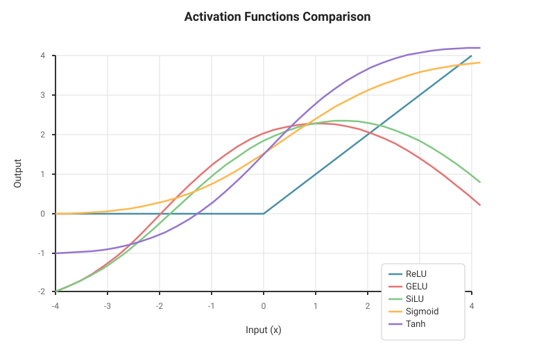
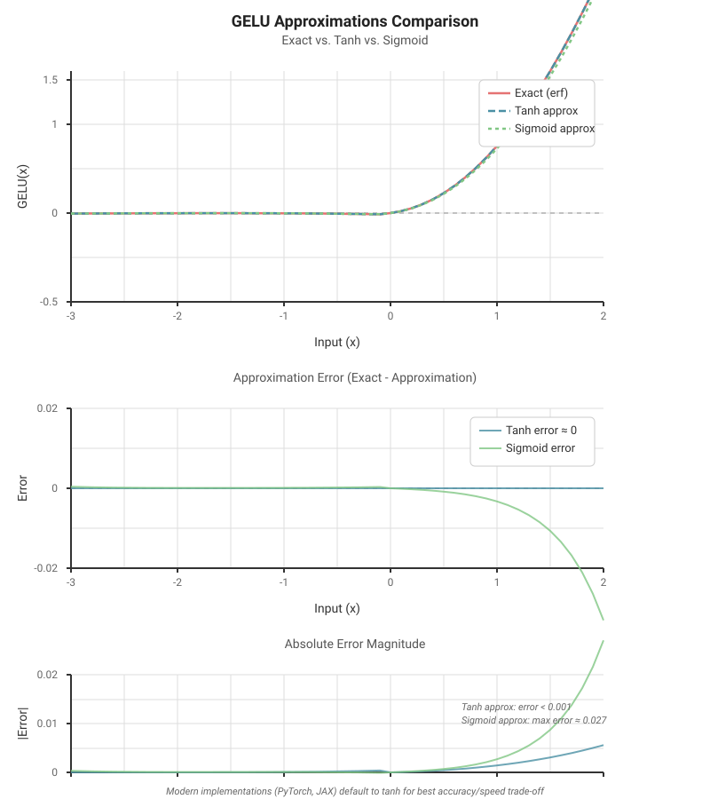
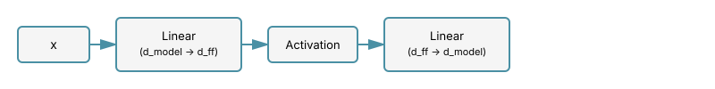
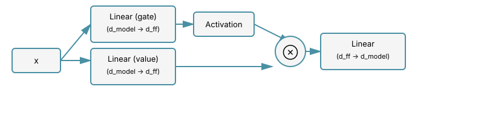
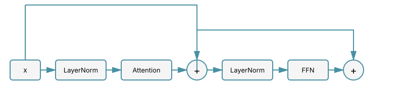

# Chapter 10: Activation Functions

Activation functions are critical non-linear transformations in neural networks that allow them to learn complex patterns. In Large Language Models, the choice of activation function significantly impacts model performance, training dynamics, and computational efficiency. This chapter explores the evolution from simple ReLU to modern gated activations like SwiGLU used in state-of-the-art models.

## Table of Contents

1. [Why Activation Functions Matter](#why-activation-functions-matter)
2. [ReLU and Its Limitations](#relu-and-its-limitations)
3. [GELU: Gaussian Error Linear Unit](#gelu-gaussian-error-linear-unit)
4. [SiLU/Swish: Smooth Activation](#siluswish-smooth-activation)
5. [Gated Linear Units (GLU)](#gated-linear-units-glu)
6. [SwiGLU: The Modern Standard](#swiglu-the-modern-standard)
7. [GeGLU: GELU-based Gating](#geglu-gelu-based-gating)
8. [Activation Functions in Modern LLMs](#activation-functions-in-modern-llms)
9. [Comparative Analysis](#comparative-analysis)
10. [Implementation Examples](#implementation-examples)
11. [Exercises](#exercises)

---

## Why Activation Functions Matter

Activation functions serve several critical purposes in neural networks:

1. **Non-linearity**: Without activation functions, stacking multiple linear layers would still produce a linear transformation
2. **Gradient flow**: The derivative of the activation affects how gradients propagate during backpropagation
3. **Expressiveness**: Different activations enable networks to learn different types of patterns
4. **Computational efficiency**: Some activations are faster to compute than others

In the context of LLMs, activation functions are primarily used in the feed-forward network (FFN) within each transformer block (see [The Transformer Block](09-transformer-block.md)). The FFN typically looks like:

```math
\text{FFN}(x) = \text{Activation}(xW_1 + b_1)W_2 + b_2
```

where $W_1$ projects from model dimension $d_{\text{model}}$ to a larger dimension $d_{\text{ff}}$ (typically $4 \times d_{\text{model}}$), and $W_2$ projects back down.

### Visual Comparison

The following graph compares the most important activation functions used in modern LLMs:



This visualization shows how different activation functions transform inputs. Notice:

- **ReLU** (blue) has a hard cutoff at zero and grows linearly for positive values
- **GELU** (red) and **SiLU** (green) are smooth, non-monotonic functions that allow small negative values
- **Sigmoid** (orange) and **Tanh** (purple) are bounded functions, with tanh centered around zero

The smooth, non-monotonic nature of GELU and SiLU is why they perform better than ReLU in modern transformers. Key observations:

- **Non-monotonic behavior**: Both GELU and SiLU have a characteristic "dip" - they become slightly negative for moderately negative inputs (around $x = -1$ to $-2$) before approaching zero. This is visible as a shallow minimum in their curves.
- **Better gradient flow**: Unlike ReLU's zero gradient for all $x \lt 0$, GELU and SiLU maintain non-zero gradients everywhere, preventing "dying neurons"
- **Smooth transitions**: The absence of sharp corners (like ReLU's kink at $x=0$) provides more stable optimization
- **Self-gating property**: These functions naturally weight inputs by their magnitude, creating adaptive, context-dependent transformations

---

## ReLU and Its Limitations

### Definition

The Rectified Linear Unit (ReLU) is one of the simplest activation functions:

```math
\text{ReLU}(x) = \max(0, x) = \begin{cases}
x & \text{if } x \gt 0 \\
0 & \text{if } x \leq 0
\end{cases}
```

**Derivative:**

```math
\frac{d}{dx}\text{ReLU}(x) = \begin{cases}
1 & \text{if } x \gt 0 \\
0 & \text{if } x \leq 0
\end{cases}
```

### Advantages

- Computationally efficient (simple thresholding)
- No vanishing gradient problem for positive values
- Sparse activations (many zeros)

### Limitations

1. **Dying ReLU problem**: Neurons can get stuck outputting zero for all inputs, effectively "dying"
2. **Not smooth**: The discontinuity at zero can cause optimization issues
3. **Not zero-centered**: Outputs are always non-negative
4. **Hard cutoff**: The sharp transition at zero may not be ideal for learning

### Implementation

**Problem and Motivation:**

While ReLU has significant limitations for modern LLMs, understanding its implementation is important because:

1. It serves as the baseline against which all other activations are compared
2. Many legacy models and codebases still use ReLU
3. The simplicity of ReLU makes it ideal for understanding the basic FFN structure

**Implementation Considerations:**

When implementing ReLU in a feed-forward network, we face a fundamental trade-off:

- **Computational efficiency**: ReLU is extremely fast (just a max operation)
- **Expressiveness**: The hard cutoff at zero limits the function class the network can learn
- **Gradient flow**: The zero gradient for negative inputs can cause neurons to "die" during training

The code below demonstrates ReLU in the context of a complete FFN module, following the standard transformer architecture where the hidden dimension $d_{\text{ff}}$ is typically 4 times the model dimension $d_{\text{model}}$.

```python
import torch
import torch.nn as nn
import matplotlib.pyplot as plt
import numpy as np

class ReLUFFN(nn.Module):
    """Feed-forward network with ReLU activation."""
    def __init__(self, d_model: int, d_ff: int, dropout: float = 0.1):
        super().__init__()
        self.w1 = nn.Linear(d_model, d_ff)
        self.w2 = nn.Linear(d_ff, d_model)
        self.dropout = nn.Dropout(dropout)

    def forward(self, x: torch.Tensor) -> torch.Tensor:
        return self.w2(self.dropout(torch.relu(self.w1(x))))

# Visualize ReLU
x = torch.linspace(-3, 3, 1000)
y = torch.relu(x)

plt.figure(figsize=(10, 6))
plt.plot(x.numpy(), y.numpy(), label='ReLU(x)', linewidth=2)
plt.grid(True, alpha=0.3)
plt.xlabel('x')
plt.ylabel('ReLU(x)')
plt.title('ReLU Activation Function')
plt.legend()
plt.show()
```

Despite its limitations, ReLU was widely used in early deep learning models due to its simplicity and computational efficiency. However, modern LLMs have largely moved to more sophisticated activations.

---

## GELU: Gaussian Error Linear Unit

### Definition

GELU (Gaussian Error Linear Unit) is a smooth activation function that weights inputs by their magnitude, approximating a stochastic regularizer.

**Exact formulation:**

```math
\text{GELU}(x) = x \cdot \Phi(x)
```

where $\Phi(x)$ is the cumulative distribution function of the standard Gaussian distribution:

```math
\Phi(x) = P(X \leq x) \text{ where } X \sim \mathcal{N}(0, 1) = \frac{1}{2}\left[1 + \text{erf}\left(\frac{x}{\sqrt{2}}\right)\right]
```

**Approximation** (commonly used for efficiency):

```math
\text{GELU}(x) \approx x \cdot \sigma(1.702x)
```

or the more accurate approximation:

```math
\text{GELU}(x) \approx 0.5x\left(1 + \tanh\left[\sqrt{\frac{2}{\pi}}\left(x + 0.044715x^3\right)\right]\right)
```

### Intuition

GELU can be thought of as a smooth version of ReLU that:

- Allows small negative values to pass through (rather than hard cutoff at zero)
- Weights inputs by their value (probabilistic interpretation)
- Has smooth gradients everywhere

The key insight is that GELU multiplies the input by a value between 0 and 1 based on how much greater it is than other inputs. This creates a stochastic regularization effect where inputs are dropped with a probability that depends on their magnitude.

**Understanding the Non-Monotonic Behavior (The "Dip"):**

A distinctive feature of GELU is that it's **non-monotonic**: for moderately negative inputs (around $x \approx -1$ to $-2$), the function actually *decreases* slightly before asymptotically approaching zero. This happens because:

1. **Mathematically**: GELU is $x \cdot \Phi(x)$ where $\Phi$ is the Gaussian CDF
   - For negative $x$, we have a negative number multiplied by a positive probability
   - As $x$ becomes more negative, $\Phi(x) \to 0$, so the product $x \cdot \Phi(x) \to 0$
   - But initially (for moderately negative $x$), $\Phi(x)$ is still relatively large (e.g., $\Phi(-1) \approx 0.16$)
   - This creates a minimum around $x \approx -0.82$ where $\text{GELU}(x) \approx -0.17$

2. **Why this is beneficial**:
   - **Implicit regularization**: The slight negative output for moderately negative inputs creates a "soft penalty" that can help with regularization, similar to L2 weight decay
   - **Smooth gradient flow**: Unlike ReLU's hard zero gradient for negative inputs, GELU has non-zero gradients everywhere, preventing "dying neurons"
   - **Differentiability**: The smooth, differentiable nature everywhere (no kink at 0 like ReLU) helps optimization converge more reliably
   - **Self-gating property**: The function naturally weights inputs by their magnitude in a probabilistic way

3. **Practical implications**:
   - The non-monotonicity doesn't cause problems in practice - the minimum is shallow (only about -0.17)
   - Models learn to work with this behavior effectively
   - The smooth transition around zero is crucial for stable optimization in deep networks
   - This behavior may contribute to implicit noise injection during training, providing regularization benefits

### Derivative

```math
\frac{d}{dx}\text{GELU}(x) = \Phi(x) + x \cdot \phi(x)
```

where $\phi(x) = \frac{1}{\sqrt{2\pi}}e^{-x^2/2}$ is the Gaussian probability density function.

### Properties

- **Smooth**: Differentiable everywhere
- **Non-monotonic**: Has a slight negative region for small negative inputs
- **Better gradient flow**: Smooth gradients help with optimization
- **Empirically strong**: Works well in practice for transformers

### Usage in Models

GELU is used in:

- **BERT** (2018): One of the first major transformer models to use GELU
- **GPT-2** (2019): OpenAI adopted GELU for the GPT series
- **GPT-3** (2020): Continued use of GELU
- Many other transformer-based models

### Implementation

**Problem and Motivation:**

The key challenge GELU addresses is: *How can we create a smooth, probabilistically-motivated activation that improves upon ReLU's hard cutoff while maintaining computational efficiency?*

**Why This Matters:**

GELU represents a paradigm shift from ReLU because:

1. **Smooth gradients everywhere**: Unlike ReLU's discontinuous derivative, GELU is differentiable everywhere, leading to more stable optimization
2. **Stochastic regularization interpretation**: GELU can be viewed as applying dropout with a probability that adapts based on the input magnitude
3. **Better empirical performance**: GELU consistently outperformed ReLU in transformer models, as demonstrated by BERT and GPT-2

**Theoretical Justification:**

The exact GELU formula $x \cdot \Phi(x)$ has an elegant interpretation: it's the expected transformation of $x$ under stochastic regularization where we multiply the input by either 0 or 1 depending on whether $x$ is greater than a random sample from $\mathcal{N}(0, 1)$. This creates adaptive regularization where larger inputs are more likely to pass through.

**Approximation Trade-offs:**

The implementation provides three variants:

1. **Exact (erf-based)**: Most accurate but slower due to error function computation
2. **Tanh approximation**: Nearly identical results with faster computation (commonly used)
3. **Sigmoid approximation**: Fastest but less accurate

Modern implementations (PyTorch, JAX) default to the tanh approximation as it provides the best accuracy/speed trade-off. The code below demonstrates all three approaches so you can understand the trade-offs in practice.

### Visual Comparison of GELU Approximations

The following diagram compares the three GELU implementations and their approximation errors:



**Key observations from the visualization:**

- **Top plot**: All three GELU variants produce nearly identical curves. The exact (erf-based) GELU is shown in solid red, while the tanh and sigmoid approximations are shown with dashed lines.
- **Middle plot**: The approximation errors (exact - approximation) reveal that:
  - The **tanh approximation error is essentially zero** across the entire range (< 0.001 everywhere)
  - The **sigmoid approximation** has larger errors, especially for large positive values (max error ≈ 0.027 at x=2)
- **Bottom plot**: Absolute error magnitude confirms that tanh is far more accurate than sigmoid, justifying its use as the default in modern frameworks.

This is why PyTorch and JAX default to the tanh approximation: it provides essentially exact results while being faster to compute than the error function.

```python
import torch
import torch.nn as nn
import torch.nn.functional as F
import math

class GELUFFN(nn.Module):
    """Feed-forward network with GELU activation."""
    def __init__(self, d_model: int, d_ff: int, dropout: float = 0.1, approximate: str = 'none'):
        super().__init__()
        self.w1 = nn.Linear(d_model, d_ff)
        self.w2 = nn.Linear(d_ff, d_model)
        self.dropout = nn.Dropout(dropout)
        self.approximate = approximate

    def forward(self, x: torch.Tensor) -> torch.Tensor:
        # PyTorch's GELU supports 'none' (exact) or 'tanh' (approximation)
        return self.w2(self.dropout(F.gelu(self.w1(x), approximate=self.approximate)))

# Manual implementation of GELU variants
def gelu_exact(x: torch.Tensor) -> torch.Tensor:
    """Exact GELU using error function."""
    return x * 0.5 * (1.0 + torch.erf(x / math.sqrt(2.0)))

def gelu_tanh_approx(x: torch.Tensor) -> torch.Tensor:
    """GELU approximation using tanh."""
    return 0.5 * x * (1.0 + torch.tanh(
        math.sqrt(2.0 / math.pi) * (x + 0.044715 * torch.pow(x, 3))
    ))

def gelu_sigmoid_approx(x: torch.Tensor) -> torch.Tensor:
    """GELU approximation using sigmoid."""
    return x * torch.sigmoid(1.702 * x)

# Test the approximations
x = torch.linspace(-3, 3, 1000)
y_exact = gelu_exact(x)
y_tanh = gelu_tanh_approx(x)
y_sigmoid = gelu_sigmoid_approx(x)

# Compute maximum errors
tanh_error = torch.abs(y_exact - y_tanh).max()
sigmoid_error = torch.abs(y_exact - y_sigmoid).max()

print(f"Tanh approximation max error: {tanh_error:.6f}")      # ~ 0.0001
print(f"Sigmoid approximation max error: {sigmoid_error:.6f}")  # ~ 0.027
```

**Key Papers:**

- [Gaussian Error Linear Units (GELUs)](https://arxiv.org/abs/1606.08415) (Hendrycks & Gimpel, 2016)

---

## SiLU/Swish: Smooth Activation

### Definition

SiLU (Sigmoid Linear Unit), also known as Swish, is another smooth activation function:

```math
\text{SiLU}(x) = x \cdot \sigma(x) = \frac{x}{1 + e^{-x}}
```

where $\sigma(x)$ is the sigmoid function.

### Derivative

```math
\frac{d}{dx}\text{SiLU}(x) = \sigma(x) + x \cdot \sigma(x)(1 - \sigma(x)) = \sigma(x)(1 + x(1 - \sigma(x)))
```

### Properties

- **Smooth and non-monotonic**: Similar to GELU but with a simpler formula
- **Self-gated**: The input gates itself through the sigmoid
- **Unbounded above, bounded below**: Output range is approximately $[-0.28, \infty)$

**Understanding the Non-Monotonic Behavior (The "Dip"):**

Like GELU, SiLU exhibits a characteristic **non-monotonic** behavior where it dips slightly negative for moderately negative inputs before approaching zero. This is a key distinguishing feature from ReLU:

1. **Mathematically**: SiLU is $f(x) = x \cdot \sigma(x)$ where $\sigma$ is the sigmoid function
   - When $x$ is negative, $x$ itself is negative
   - But $\sigma(x)$ is always positive (between 0 and 0.5 for negative $x$)
   - The product is therefore negative: (negative) × (positive) = negative
   - As $x$ becomes more negative, $\sigma(x) \to 0$, so the product approaches zero
   - This creates a **minimum around $x \approx -1.28$ where $f(x) \approx -0.278$**
   - The function is non-monotonic: it decreases from 0 to this minimum, then increases back toward 0

2. **Why this is beneficial**:
   - **Self-gating mechanism**: The input directly controls how much of itself passes through via the sigmoid. Large positive inputs pass through nearly unchanged ($\sigma(x) \approx 1$), while negative inputs are suppressed but not killed entirely
   - **Gradient flow**: Unlike ReLU's hard zero gradient for $x \lt 0$, SiLU maintains non-zero gradients everywhere, preventing the "dying neuron" problem
   - **Smoothness**: The continuous, differentiable nature everywhere (no kink at $x=0$) provides more stable optimization landscapes
   - **Implicit regularization**: The shallow negative region creates a soft penalty for moderately negative activations, similar to a learned form of regularization

3. **Connection to why SiLU outperforms ReLU**:
   - **Smooth transition**: The smooth curve around zero (vs ReLU's sharp corner) provides better gradient information during backpropagation
   - **Non-zero gradients for negative inputs**: Prevents neurons from permanently "dying" during training
   - **Adaptive computation**: The self-gating property allows the network to learn context-dependent scaling of features
   - **Better optimization**: The smooth derivatives help gradient-based optimizers find better solutions

4. **Practical implications**:
   - The minimum at approximately -0.278 is shallow and doesn't cause numerical issues
   - Neural networks trained with SiLU learn to effectively utilize this non-monotonic behavior
   - The smooth gradients contribute to more stable training dynamics in deep networks
   - This behavior is particularly effective in transformers where smooth activations help with the complex, high-dimensional optimization landscape

### Comparison with GELU

SiLU and GELU are very similar in shape and performance:

- Both are smooth and non-monotonic
- GELU is slightly smoother near zero
- SiLU is computationally simpler (no error function)
- In practice, they often perform comparably

### Implementation

**Problem and Motivation:**

SiLU addresses the question: *Can we achieve GELU-like performance with a simpler, more computationally efficient formula?*

**Key Insight:**

The breakthrough of SiLU/Swish is the **self-gating** property: $x \cdot \sigma(x)$. Instead of using a Gaussian CDF like GELU, it uses the simpler sigmoid function. This provides:

1. **Computational simplicity**: Sigmoid is faster to compute than error functions
2. **Similar behavior**: The shape of SiLU closely approximates GELU
3. **Better hardware support**: Sigmoid is a primitive operation on most hardware accelerators

**Relation to Alternatives:**

- **vs ReLU**: SiLU is smooth everywhere, avoiding the dying ReLU problem
- **vs GELU**: Nearly identical performance but computationally simpler
- **vs Tanh**: Self-gating (multiplicative) vs. pure non-linearity (additive)

**Why It Works:**

The self-gating mechanism $x \cdot \sigma(x)$ creates an adaptive scaling where:

- Large positive inputs: $\sigma(x) \approx 1$, so output $\approx x$ (linear passthrough)
- Large negative inputs: $\sigma(x) \approx 0$, so output $\approx 0$ (suppressed)
- Near zero: Smooth interpolation between these extremes

This creates a non-monotonic function with smooth gradients that helps with optimization.

```python
import torch
import torch.nn as nn
import torch.nn.functional as F

class SiLUFFN(nn.Module):
    """Feed-forward network with SiLU/Swish activation."""
    def __init__(self, d_model: int, d_ff: int, dropout: float = 0.1):
        super().__init__()
        self.w1 = nn.Linear(d_model, d_ff)
        self.w2 = nn.Linear(d_ff, d_model)
        self.dropout = nn.Dropout(dropout)

    def forward(self, x: torch.Tensor) -> torch.Tensor:
        # PyTorch has F.silu() built-in
        return self.w2(self.dropout(F.silu(self.w1(x))))

# Manual implementation
def silu(x: torch.Tensor) -> torch.Tensor:
    """SiLU/Swish activation."""
    return x * torch.sigmoid(x)

# Visualize SiLU vs GELU
x = torch.linspace(-3, 3, 1000)
y_silu = silu(x)
y_gelu = gelu_exact(x)

plt.figure(figsize=(12, 6))
plt.plot(x.numpy(), y_silu.numpy(), label='SiLU/Swish', linewidth=2)
plt.plot(x.numpy(), y_gelu.numpy(), '--', label='GELU', linewidth=2)
plt.grid(True, alpha=0.3)
plt.xlabel('x')
plt.ylabel('Activation(x)')
plt.title('SiLU vs GELU')
plt.legend()
plt.axhline(y=0, color='k', linestyle='-', linewidth=0.5)
plt.axvline(x=0, color='k', linestyle='-', linewidth=0.5)
plt.show()

# Show the difference
plt.figure(figsize=(12, 6))
plt.plot(x.numpy(), (y_silu - y_gelu).numpy(), linewidth=2)
plt.grid(True, alpha=0.3)
plt.xlabel('x')
plt.ylabel('SiLU(x) - GELU(x)')
plt.title('Difference between SiLU and GELU')
plt.axhline(y=0, color='k', linestyle='-', linewidth=0.5)
plt.axvline(x=0, color='k', linestyle='-', linewidth=0.5)
plt.show()
```

**Key Papers:**

- [Swish: a Self-Gated Activation Function](https://arxiv.org/abs/1710.05941) (Ramachandran et al., 2017)
- [Sigmoid-Weighted Linear Units for Neural Network Function Approximation in Reinforcement Learning](https://arxiv.org/abs/1702.03118) (Elfwing et al., 2017)

---

## Gated Linear Units (GLU)

### Definition

Gated Linear Units (GLU) introduced the concept of using one projection to gate another:

```math
\text{GLU}(x) = (xW + b) \otimes \sigma(xV + c)
```

where $\otimes$ denotes element-wise multiplication, and $\sigma$ is the sigmoid function.

In the context of feed-forward networks, this means splitting the intermediate dimension:

```math
\text{GLU}(x) = \sigma(xW_g) \otimes (xW)
```

### Key Insight

The gating mechanism allows the network to control information flow dynamically. Some neurons can learn to be "gates" that modulate the output of other neurons based on the input.

### Variants

The GLU paper and subsequent work by Shazeer (2020) introduced several variants by changing the activation function used for gating:

1. **GLU**: Uses sigmoid for gating
2. **Bilinear**: No activation (linear)
3. **ReGLU**: Uses ReLU for gating
4. **GEGLU**: Uses GELU for gating
5. **SwiGLU**: Uses SiLU/Swish for gating

General form:

```math
\text{ActivationGLU}(x) = \text{Activation}(xW_g) \otimes (xW)
```

### Architecture Impact

When using GLU variants in the FFN, the architecture changes:

**Standard FFN:**



**GLU FFN:**



This requires **twice the parameters** in the first projection (or equivalently, if keeping parameters constant, the intermediate dimension is halved). In practice, for LLMs:

- Standard FFN: $d_{\text{ff}} = 4 \times d_{\text{model}}$
- GLU FFN: $d_{\text{ff}} = \frac{8}{3} \times d_{\text{model}} \approx 2.67 \times d_{\text{model}}$ (to maintain similar parameter count)

**Key Papers:**

- [Language Modeling with Gated Convolutional Networks](https://arxiv.org/abs/1612.08083) (Dauphin et al., 2017) - Original GLU
- [GLU Variants Improve Transformer](https://arxiv.org/abs/2002.05202) (Shazeer, 2020) - Comprehensive study of GLU variants

---

## SwiGLU: The Modern Standard

### Definition

SwiGLU (Swish-Gated Linear Unit) uses the SiLU/Swish activation for gating:

```math
\text{SwiGLU}(x, W, V, b, c) = \text{SiLU}(xW + b) \otimes (xV + c)
```

Simplified notation (without biases, which are often omitted in transformers):

```math
\text{SwiGLU}(x) = \text{SiLU}(xW) \otimes (xV)
```

where:

- $x \in \mathbb{R}^{d_{\text{model}}}$ is the input
- $W, V \in \mathbb{R}^{d_{\text{model}} \times d_{\text{ff}}}$ are learned weight matrices
- $\otimes$ is element-wise multiplication

### Why SwiGLU?

Shazeer's empirical study (2020) found that SwiGLU consistently outperformed other variants:

1. Better than standard GELU/SiLU (non-gated versions)
2. Better than other gated variants (GEGLU, ReGLU)
3. Provides a good balance between performance and computational cost

### Usage in Modern LLMs

SwiGLU has become the activation of choice for many state-of-the-art models:

- **LLaMA** (Meta, 2023): Uses SwiGLU
- **LLaMA 2** (Meta, 2023): Uses SwiGLU
- **LLaMA 3** (Meta, 2024): Uses SwiGLU
- **PaLM** (Google, 2022): Uses SwiGLU
- **Mistral** (Mistral AI, 2023): Uses SwiGLU
- **Mixtral** (Mistral AI, 2024): Uses SwiGLU (MoE version)

See [Architecture Comparison: Modern LLMs](27-model-architectures.md) for a comprehensive comparison.

### Implementation

**Problem Being Solved:**

How do we build a feed-forward network that combines the smooth properties of SiLU with the dynamic gating mechanism of GLU to achieve state-of-the-art performance in large language models?

**Theoretical Foundation:**

SwiGLU's success stems from combining two powerful ideas:

1. **Gating mechanism**: Allows the network to learn what information to pass (value path) and how much to pass (gate path)
2. **Smooth activation**: SiLU provides smooth gradients that help with optimization at scale

The formula $\text{SwiGLU}(x) = \text{SiLU}(xW) \otimes (xV)$ creates a **multiplicative interaction** between two learned transformations of the input. This is fundamentally different from additive non-linearities.

**Why This Works Better:**

The key insight from Shazeer's empirical study is that gated activations allow for **context-dependent feature selection**. The gate path learns to amplify or suppress features from the value path based on the input, creating more expressive transformations than simple pointwise non-linearities.

**Relation to Alternatives:**

- **vs GELU**: SwiGLU adds gating, which empirically improves performance by 1-2% on language tasks
- **vs GeGLU**: SiLU is computationally simpler than GELU, with similar or slightly better performance
- **vs Standard SiLU**: The gated version consistently outperforms the non-gated version

**Implementation Considerations:**

The main challenge with SwiGLU is the parameter increase: we need separate weight matrices $W$ and $V$ for the gate and value paths. To maintain similar parameter counts to standard FFNs, the hidden dimension $d_{\text{ff}}$ is typically reduced from $4d_{\text{model}}$ to $\frac{8}{3}d_{\text{model}}$ (rounded to multiples of 256 for hardware efficiency). The code below implements this following the LLaMA architecture.

```python
import torch
import torch.nn as nn
import torch.nn.functional as F

class SwiGLUFFN(nn.Module):
    """
    Feed-forward network with SwiGLU activation.

    Following the LLaMA architecture, this uses:

    - No biases
    - Hidden dimension scaled to maintain parameter count similar to standard FFN

    """
    def __init__(
        self,
        d_model: int,
        d_ff: int = None,
        dropout: float = 0.1,
        bias: bool = False
    ):
        super().__init__()
        # Default: maintain similar param count to standard FFN with d_ff = 4 * d_model
        # Standard FFN params: d_model * d_ff + d_ff * d_model = 2 * d_model * d_ff
        # SwiGLU params: d_model * d_ff + d_model * d_ff + d_ff * d_model = d_model * (2*d_ff + d_ff)
        # To match: 2 * d_model * 4 * d_model = d_model * 3 * d_ff  →  d_ff = 8/3 * d_model
        if d_ff is None:
            d_ff = int(8 * d_model / 3)
            # Round to nearest multiple of 256 for hardware efficiency (common practice)
            d_ff = 256 * ((d_ff + 255) // 256)

        self.w1 = nn.Linear(d_model, d_ff, bias=bias)  # Gate projection
        self.w2 = nn.Linear(d_ff, d_model, bias=bias)  # Output projection
        self.w3 = nn.Linear(d_model, d_ff, bias=bias)  # Value projection
        self.dropout = nn.Dropout(dropout)

    def forward(self, x: torch.Tensor) -> torch.Tensor:
        """
        Args:
            x: Input tensor of shape (batch_size, seq_len, d_model)

        Returns:
            Output tensor of shape (batch_size, seq_len, d_model)
        """
        # SwiGLU: Swish(xW1) ⊗ (xW3)
        gate = F.silu(self.w1(x))
        value = self.w3(x)
        hidden = gate * value
        return self.w2(self.dropout(hidden))

# Example usage
batch_size, seq_len, d_model = 2, 10, 512
x = torch.randn(batch_size, seq_len, d_model)

swiglu_ffn = SwiGLUFFN(d_model)
output = swiglu_ffn(x)

print(f"Input shape: {x.shape}")
print(f"Output shape: {output.shape}")
print(f"Hidden dimension (d_ff): {swiglu_ffn.w1.out_features}")
print(f"Parameter count: {sum(p.numel() for p in swiglu_ffn.parameters()):,}")

# Compare with standard GELU FFN
class StandardFFN(nn.Module):
    def __init__(self, d_model: int, dropout: float = 0.1):
        super().__init__()
        d_ff = 4 * d_model  # Standard expansion factor
        self.w1 = nn.Linear(d_model, d_ff, bias=False)
        self.w2 = nn.Linear(d_ff, d_model, bias=False)
        self.dropout = nn.Dropout(dropout)

    def forward(self, x: torch.Tensor) -> torch.Tensor:
        return self.w2(self.dropout(F.gelu(self.w1(x))))

standard_ffn = StandardFFN(d_model)
print(f"\nStandard FFN parameter count: {sum(p.numel() for p in standard_ffn.parameters()):,}")
print(f"SwiGLU FFN parameter count: {sum(p.numel() for p in swiglu_ffn.parameters()):,}")
```

### Computational Considerations

**FLOPs comparison** (per token):

- Standard FFN with GELU: $2 \times d_{\text{model}} \times d_{\text{ff}} + \text{activation cost}$
- SwiGLU FFN: $3 \times d_{\text{model}} \times d_{\text{ff}}$ (with adjusted $d_{\text{ff}}$)

When $d_{\text{ff}}$ is adjusted to maintain similar parameter count:

- Standard: $2 \times d_{\text{model}} \times 4d_{\text{model}} = 8d_{\text{model}}^2$ FLOPs
- SwiGLU: $3 \times d_{\text{model}} \times \frac{8}{3}d_{\text{model}} = 8d_{\text{model}}^2$ FLOPs

The FLOPs are approximately equal when maintaining similar parameter counts, but SwiGLU consistently shows better performance empirically.

**Key Papers:**

- [GLU Variants Improve Transformer](https://arxiv.org/abs/2002.05202) (Shazeer, 2020)
- [LLaMA: Open and Efficient Foundation Language Models](https://arxiv.org/abs/2302.13971) (Touvron et al., 2023)
- [PaLM: Scaling Language Modeling with Pathways](https://arxiv.org/abs/2204.02311) (Chowdhery et al., 2022)

---

## GeGLU: GELU-based Gating

### Definition

GeGLU (GELU-Gated Linear Unit) uses GELU activation for gating:

```math
\text{GeGLU}(x) = \text{GELU}(xW) \otimes (xV)
```

### Properties

GeGLU combines:

- The smooth, probabilistic nature of GELU
- The gating mechanism of GLU

### Performance

According to Shazeer's study:

- GeGLU performs better than non-gated GELU
- GeGLU performs slightly worse than SwiGLU in most tasks
- The difference between GeGLU and SwiGLU is often small

### Usage

GeGLU is less common in production LLMs compared to SwiGLU, but it's used in some models:

- Experimental variants of various models
- Some vision-language models

### Implementation

**Problem and Motivation:**

GeGLU addresses the question: *What happens if we combine GELU's probabilistic smoothness with GLU's gating mechanism?*

**Theoretical Justification:**

GeGLU represents an alternative approach to gating that uses GELU instead of SiLU. The rationale is:

1. **GELU's theoretical foundation**: The Gaussian CDF has a strong probabilistic interpretation
2. **Proven success**: GELU already showed strong results in GPT-2/3 and BERT
3. **Gating benefits**: Adding the gating mechanism should improve upon non-gated GELU

**Why GeGLU vs SwiGLU?**

Shazeer's empirical comparison found:

- **SwiGLU**: Slightly better empirical performance (typically 0.1-0.2% improvement)
- **GeGLU**: Nearly as good, but GELU is slightly more expensive to compute
- **Use case**: GeGLU is a reasonable choice if you're already using GELU elsewhere and want consistency

**Relation to Alternatives:**

- **vs SwiGLU**: Very similar performance, SwiGLU slightly faster and marginally better
- **vs GELU (non-gated)**: GeGLU consistently outperforms by leveraging the gating mechanism
- **vs ReGLU**: GeGLU performs better due to smooth gradients (vs ReLU's discontinuity)

**When to Use:**

GeGLU is a good choice when:

- You want gated activation but prefer GELU's probabilistic interpretation
- Your codebase already uses GELU and you want consistency
- The small performance difference from SwiGLU doesn't matter for your application

The implementation below is nearly identical to SwiGLU, with the only difference being the activation function used for gating.

```python
import torch
import torch.nn as nn
import torch.nn.functional as F

class GeGLUFFN(nn.Module):
    """Feed-forward network with GeGLU activation."""
    def __init__(
        self,
        d_model: int,
        d_ff: int = None,
        dropout: float = 0.1,
        bias: bool = False
    ):
        super().__init__()
        if d_ff is None:
            d_ff = int(8 * d_model / 3)
            d_ff = 256 * ((d_ff + 255) // 256)

        self.w1 = nn.Linear(d_model, d_ff, bias=bias)  # Gate projection
        self.w2 = nn.Linear(d_ff, d_model, bias=bias)  # Output projection
        self.w3 = nn.Linear(d_model, d_ff, bias=bias)  # Value projection
        self.dropout = nn.Dropout(dropout)

    def forward(self, x: torch.Tensor) -> torch.Tensor:
        """GeGLU: GELU(xW1) ⊗ (xW3)"""
        gate = F.gelu(self.w1(x))
        value = self.w3(x)
        hidden = gate * value
        return self.w2(self.dropout(hidden))

# Compare all GLU variants
class GLUVariants(nn.Module):
    """Module to compare different GLU variants."""
    def __init__(self, d_model: int, variant: str = 'swiglu'):
        super().__init__()
        d_ff = int(8 * d_model / 3)
        d_ff = 256 * ((d_ff + 255) // 256)

        self.w1 = nn.Linear(d_model, d_ff, bias=False)
        self.w2 = nn.Linear(d_ff, d_model, bias=False)
        self.w3 = nn.Linear(d_model, d_ff, bias=False)
        self.variant = variant

    def forward(self, x: torch.Tensor) -> torch.Tensor:
        value = self.w3(x)

        if self.variant == 'swiglu':
            gate = F.silu(self.w1(x))
        elif self.variant == 'geglu':
            gate = F.gelu(self.w1(x))
        elif self.variant == 'reglu':
            gate = F.relu(self.w1(x))
        elif self.variant == 'glu':
            gate = torch.sigmoid(self.w1(x))
        else:
            raise ValueError(f"Unknown variant: {self.variant}")

        return self.w2(gate * value)

# Test all variants
d_model = 512
x = torch.randn(2, 10, d_model)

for variant in ['swiglu', 'geglu', 'reglu', 'glu']:
    model = GLUVariants(d_model, variant=variant)
    output = model(x)
    print(f"{variant.upper()}: input {x.shape} → output {output.shape}")
```

---

## Activation Functions in Modern LLMs

Here's a summary of which activation functions are used in major LLMs:

| Model | Activation | Year | Notes |
|-------|------------|------|-------|
| **GPT-2** | GELU | 2019 | Popularized GELU in LLMs |
| **GPT-3** | GELU | 2020 | Continued with GELU |
| **BERT** | GELU | 2018 | One of the first to use GELU |
| **T5** | ReLU / GELU | 2019 | GeGLU in some variants |
| **PaLM** | SwiGLU | 2022 | Early adopter of SwiGLU |
| **LLaMA** | SwiGLU | 2023 | SwiGLU became standard |
| **LLaMA 2** | SwiGLU | 2023 | Continued SwiGLU |
| **LLaMA 3** | SwiGLU | 2024 | Continued SwiGLU |
| **Mistral 7B** | SwiGLU | 2023 | SwiGLU |
| **Mixtral 8x7B** | SwiGLU | 2024 | SwiGLU in MoE |
| **Qwen** | SwiGLU | 2023-2024 | SwiGLU |
| **Gemma** | GeGLU | 2024 | Uses GELU variant |
| **Phi-3** | SwiGLU | 2024 | SwiGLU |

**Key Trends:**

1. **2018-2020**: GELU dominates (GPT, BERT era)
2. **2022+**: Shift to SwiGLU for large models
3. **Current**: SwiGLU is the default choice for new LLMs

For more details, see [Architecture Comparison: Modern LLMs](27-model-architectures.md).

---

## Comparative Analysis

### Performance Comparison

Based on Shazeer's empirical study and subsequent research:

**Quality Ranking** (best to worst):

1. SwiGLU
2. GeGLU
3. GELU / SiLU (non-gated)
4. Mish
5. ReLU
6. ReGLU

**Note on Mish**: Mish is defined as $\text{Mish}(x) = x \cdot \tanh(\text{softplus}(x)) = x \cdot \tanh(\ln(1 + e^x))$. While less common in large-scale LLMs, it has been used in some computer vision models and smaller language models. It's similar in spirit to GELU/SiLU (smooth, non-monotonic) but hasn't gained the same traction in the LLM community as gated variants. For interview preparation, it's sufficient to know it exists as an alternative smooth activation, but SwiGLU/GeGLU are far more important for modern LLM work.

**Computational Cost:**

- ReLU: Lowest (simple thresholding)
- GELU: Medium (requires error function or approximation)
- SiLU: Medium (requires sigmoid)
- GLU variants: Higher (double projections, but adjustable via $d_{\text{ff}}$)

### Why GLU Variants Perform Better

Several hypotheses:

1. **Dynamic gating**: The network can learn to control information flow based on input
2. **Selective activation**: Different dimensions can be activated independently
3. **Increased expressiveness**: The gating mechanism adds a form of multiplicative interaction
4. **Better gradient flow**: The gating path provides an additional route for gradients

**Intuitive Explanation:**

Think of gated activations as learning both **what** information to pass forward (the value path) **and how much** to pass (the gate path). This is fundamentally different from non-gated activations:

- **Non-gated (GELU, SiLU)**: Apply the same activation pattern to all features based purely on their values
- **Gated (SwiGLU, GeGLU)**: Learn context-dependent activation patterns where the gate can suppress or amplify features based on what's needed

For example, in a language model processing "The cat sat on the ___":

- The **value path** might compute representations related to possible completions ("mat", "floor", "chair")
- The **gate path** learns which of these features are relevant given the context (furniture-related features should be amplified)

This multiplicative interaction creates a richer function class than simple pointwise non-linearities.

**Empirical Evidence from Shazeer (2020):**

Shazeer's comprehensive study on the Transformer translation task showed:

- SwiGLU achieved the best performance across multiple datasets
- GeGLU was a close second (within 0.1 BLEU)
- Both significantly outperformed non-gated GELU
- The improvement held across different model sizes and training budgets

The gating mechanism appears to help models learn more selective and context-dependent transformations, which is particularly valuable for the complex patterns in natural language.

### Numerical Stability and Memory Considerations

When implementing and deploying activation functions, several practical considerations matter:

**Numerical Stability:**

1. **Sigmoid Saturation** (affects SiLU, GLU variants):
   - For very large $|x|$, sigmoid approaches 0 or 1, potentially causing gradient vanishing
   - In practice, modern architectures (layer norm, skip connections) mitigate this
   - PyTorch implementations use numerically stable formulas

2. **Exponential Overflow** (GELU exact formula):
   - The error function $\text{erf}(x)$ is numerically stable for all $x$
   - The tanh approximation avoids exponential overflow for large inputs
   - Most implementations default to tanh approximation for this reason

3. **Implementation Tip**:

   ```python
   # Numerically stable sigmoid for very negative values
   def stable_sigmoid(x: torch.Tensor) -> torch.Tensor:
       """Numerically stable sigmoid implementation."""
       return torch.where(
           x >= 0,
           1 / (1 + torch.exp(-x)),
           torch.exp(x) / (1 + torch.exp(x))
       )
   ```

**Memory Considerations:**

1. **Activation Memory** (for backward pass):
   - Non-gated activations: Store intermediate values for backprop
   - Gated activations: Must store BOTH gate and value paths
   - Memory usage: GLU variants require approximately 2x activation memory

2. **Gradient Checkpointing**:
   - Can recompute activations during backward pass to save memory
   - Trade-off: Reduces memory by ~33% but adds ~33% compute time
   - Essential for training very large models

3. **Memory Example**:

   ```python
   # For a layer with input shape (batch_size, seq_len, d_model):
   # Standard activation memory: batch_size * seq_len * d_ff
   # SwiGLU activation memory: batch_size * seq_len * d_ff * 2
   # (must store both gate and value for backprop)
   ```

4. **Hardware Efficiency**:
   - Many implementations round $d_{\text{ff}}$ to multiples of 256 or 512
   - This ensures efficient memory access patterns on GPUs/TPUs
   - Example: LLaMA rounds to nearest 256 for optimal hardware utilization

**Practical Tip for Production**: Use PyTorch's built-in implementations (`F.gelu`, `F.silu`) which are optimized for both numerical stability and hardware efficiency. Only implement custom versions for learning or when you need specific behavior.

### Practical Considerations

**When to use what:**

- **Research/experiments**: Try SwiGLU first (current best practice)
- **Small models**: GELU is simpler and nearly as good
- **Parameter-constrained**: GELU uses fewer parameters than GLU variants
- **Legacy models**: GELU for compatibility with existing codebases
- **Production LLMs**: SwiGLU is the standard

### Visualization Comparison

**Problem and Motivation:**

Understanding activation functions theoretically is important, but **visualizing** them is crucial for developing intuition about:

1. **How they differ**: The shape differences between ReLU, GELU, and SiLU
2. **Why gating works**: Visual demonstration of the multiplicative gating effect
3. **Gradient behavior**: How the derivatives differ and impact training

**What These Visualizations Show:**

The code below creates two key visualizations:

1. **Activation Comparison Plot**: Shows how different activations transform the same input range. This helps you see:
   - ReLU's hard cutoff at zero
   - GELU and SiLU's smooth curves and slight negative regions
   - The non-monotonic behavior of smooth activations

2. **Gating Effect Plot**: Demonstrates the power of GLU-style gating by showing:
   - The separate gate and value paths
   - How multiplication creates context-dependent transformations
   - The difference between gated and non-gated outputs

**Key Insights to Look For:**

When running these visualizations, notice:

- GELU and SiLU are nearly identical in shape but GELU is slightly smoother near zero
- The gating mechanism creates a **different shape** than just applying the activation to the value
- Gated activations can produce outputs that neither the gate nor value could produce alone

```python
import torch
import matplotlib.pyplot as plt
import numpy as np

def plot_all_activations():
    """Compare all major activation functions."""
    x = torch.linspace(-3, 3, 1000)

    # Compute activations
    activations = {
        'ReLU': torch.relu(x),
        'GELU': gelu_exact(x),
        'SiLU': silu(x),
    }

    # Plot
    plt.figure(figsize=(14, 8))

    for name, y in activations.items():
        plt.plot(x.numpy(), y.numpy(), label=name, linewidth=2)

    plt.grid(True, alpha=0.3)
    plt.xlabel('x', fontsize=12)
    plt.ylabel('Activation(x)', fontsize=12)
    plt.title('Comparison of Activation Functions', fontsize=14)
    plt.legend(fontsize=11)
    plt.axhline(y=0, color='k', linestyle='-', linewidth=0.5)
    plt.axvline(x=0, color='k', linestyle='-', linewidth=0.5)
    plt.tight_layout()
    plt.show()

plot_all_activations()

def plot_glu_effect():
    """Visualize the effect of gating."""
    x = torch.linspace(-3, 3, 1000)

    # Simulate gate and value
    gate_input = x
    value_input = x * 0.8  # Slightly different

    # Non-gated
    non_gated = silu(value_input)

    # Gated (SwiGLU)
    gate = silu(gate_input)
    gated = gate * value_input

    plt.figure(figsize=(14, 8))

    plt.subplot(2, 2, 1)
    plt.plot(x.numpy(), value_input.numpy(), linewidth=2)
    plt.title('Value Input')
    plt.grid(True, alpha=0.3)

    plt.subplot(2, 2, 2)
    plt.plot(x.numpy(), gate.numpy(), linewidth=2)
    plt.title('Gate (SiLU of input)')
    plt.grid(True, alpha=0.3)

    plt.subplot(2, 2, 3)
    plt.plot(x.numpy(), non_gated.numpy(), linewidth=2)
    plt.title('Non-gated: SiLU(value)')
    plt.grid(True, alpha=0.3)

    plt.subplot(2, 2, 4)
    plt.plot(x.numpy(), gated.numpy(), linewidth=2, label='Gated')
    plt.plot(x.numpy(), non_gated.numpy(), '--', linewidth=2, alpha=0.7, label='Non-gated')
    plt.title('Comparison: Gated vs Non-gated')
    plt.legend()
    plt.grid(True, alpha=0.3)

    plt.tight_layout()
    plt.show()

plot_glu_effect()
```

---

## Implementation Examples

### Complete FFN Implementations

**Problem and Motivation:**

When building real transformer models, you need a flexible FFN implementation that can:

1. **Support multiple activations**: Switch between different activations for experimentation
2. **Handle parameter budgets correctly**: Adjust $d_{\text{ff}}$ based on whether using gated activations
3. **Follow best practices**: Match production implementations (no bias, proper rounding)

**Why This Implementation Matters:**

This unified implementation demonstrates several key engineering practices:

1. **Automatic dimension calculation**: For GLU variants, automatically adjusts $d_{\text{ff}}$ to $\frac{8d}{3}$ to maintain similar parameter counts to standard FFN
2. **Hardware alignment**: Rounds $d_{\text{ff}}$ to multiples of 256 for optimal GPU/TPU performance
3. **Conditional architecture**: Uses different layer structures for gated vs non-gated activations

**Theoretical Foundation:**

The implementation handles two fundamentally different architectures:

**Non-gated (ReLU, GELU, SiLU):**

```math
\text{FFN}(x) = W_2 \cdot \text{Activation}(W_1 x)
```


- Parameters: $2 \times d_{\text{model}} \times d_{\text{ff}}$
- Standard choice: $d_{\text{ff}} = 4 \times d_{\text{model}}$

**Gated (SwiGLU, GeGLU, etc.):**

```math
\text{FFN}(x) = W_2 \cdot (\text{Activation}(W_1 x) \otimes W_3 x)
```


- Parameters: $d_{\text{model}} \times d_{\text{ff}} \times 3$ (three weight matrices)
- Adjusted choice: $d_{\text{ff}} = \frac{8}{3} \times d_{\text{model}}$ to match non-gated parameter count

**Key Design Decisions:**

The code below makes several production-ready choices:

- **No bias by default**: Following LLaMA and other modern LLMs
- **Dropout placement**: Applied after activation, before final projection
- **Hardware efficiency**: Dimension rounding to 256

This is the type of flexible, production-quality implementation you'd use in real research or production code.

```python
import torch
import torch.nn as nn
import torch.nn.functional as F
from typing import Optional

class FeedForwardNetwork(nn.Module):
    """
    Flexible FFN implementation supporting multiple activation types.

    Args:
        d_model: Model dimension
        d_ff: Feed-forward dimension (if None, computed based on activation type)
        activation: Type of activation ('relu', 'gelu', 'silu', 'swiglu', 'geglu')
        dropout: Dropout probability
        bias: Whether to use bias in linear layers
    """
    def __init__(
        self,
        d_model: int,
        d_ff: Optional[int] = None,
        activation: str = 'swiglu',
        dropout: float = 0.1,
        bias: bool = False
    ):
        super().__init__()
        self.activation = activation.lower()

        # Compute d_ff based on activation type
        if d_ff is None:
            if self.activation in ['swiglu', 'geglu', 'reglu', 'glu']:
                # GLU variants: adjust for double projection
                d_ff = int(8 * d_model / 3)
                d_ff = 256 * ((d_ff + 255) // 256)  # Round to multiple of 256
            else:
                # Standard activations
                d_ff = 4 * d_model

        self.d_ff = d_ff

        # Define layers
        if self.activation in ['swiglu', 'geglu', 'reglu', 'glu']:
            # GLU variants need gate and value projections
            self.w1 = nn.Linear(d_model, d_ff, bias=bias)  # Gate
            self.w2 = nn.Linear(d_ff, d_model, bias=bias)  # Output
            self.w3 = nn.Linear(d_model, d_ff, bias=bias)  # Value
        else:
            # Standard FFN
            self.w1 = nn.Linear(d_model, d_ff, bias=bias)
            self.w2 = nn.Linear(d_ff, d_model, bias=bias)

        self.dropout = nn.Dropout(dropout)

    def forward(self, x: torch.Tensor) -> torch.Tensor:
        """
        Args:
            x: Input tensor of shape (batch_size, seq_len, d_model)

        Returns:
            Output tensor of shape (batch_size, seq_len, d_model)
        """
        if self.activation == 'relu':
            hidden = F.relu(self.w1(x))

        elif self.activation == 'gelu':
            hidden = F.gelu(self.w1(x))

        elif self.activation == 'silu':
            hidden = F.silu(self.w1(x))

        elif self.activation == 'swiglu':
            gate = F.silu(self.w1(x))
            value = self.w3(x)
            hidden = gate * value

        elif self.activation == 'geglu':
            gate = F.gelu(self.w1(x))
            value = self.w3(x)
            hidden = gate * value

        elif self.activation == 'reglu':
            gate = F.relu(self.w1(x))
            value = self.w3(x)
            hidden = gate * value

        elif self.activation == 'glu':
            gate = torch.sigmoid(self.w1(x))
            value = self.w3(x)
            hidden = gate * value

        else:
            raise ValueError(f"Unknown activation: {self.activation}")

        return self.w2(self.dropout(hidden))

# Test all activation types
d_model = 512
batch_size = 2
seq_len = 10
x = torch.randn(batch_size, seq_len, d_model)

print("Activation Function Comparison:")
print("-" * 70)

for activation in ['relu', 'gelu', 'silu', 'swiglu', 'geglu']:
    ffn = FeedForwardNetwork(d_model, activation=activation)
    output = ffn(x)
    param_count = sum(p.numel() for p in ffn.parameters())

    print(f"{activation.upper():10s} | d_ff={ffn.d_ff:4d} | params={param_count:,} | "
          f"shape={tuple(output.shape)}")

# Benchmark forward pass speed
import time

def benchmark_activation(activation: str, n_iter: int = 1000):
    """Benchmark forward pass speed."""
    ffn = FeedForwardNetwork(d_model, activation=activation).cuda()
    x_cuda = x.cuda()

    # Warmup
    for _ in range(10):
        _ = ffn(x_cuda)

    torch.cuda.synchronize()
    start = time.time()

    for _ in range(n_iter):
        _ = ffn(x_cuda)

    torch.cuda.synchronize()
    elapsed = time.time() - start

    return elapsed / n_iter * 1000  # ms per iteration

if torch.cuda.is_available():
    print("\nSpeed Benchmark (ms per forward pass):")
    print("-" * 50)

    for activation in ['relu', 'gelu', 'silu', 'swiglu', 'geglu']:
        time_ms = benchmark_activation(activation)
        print(f"{activation.upper():10s} | {time_ms:.4f} ms")
```

### Using in a Complete Transformer Block

**Problem and Context:**

Understanding activations in isolation is important, but they exist within the broader transformer architecture. This section demonstrates:

1. **Integration**: How FFN with configurable activations fits into the full transformer block
2. **Architecture pattern**: The standard pre-norm pattern used in modern LLMs
3. **End-to-end model**: Building a complete mini language model with different activations

**Why This Matters for Interviews:**

Being able to explain how activation functions fit into the transformer architecture shows:

- **System-level understanding**: You know where activations are used (FFN, not attention)
- **Architectural knowledge**: You understand the pre-norm vs post-norm distinction
- **Practical experience**: You can build complete models, not just isolated components

**Architectural Pattern:**

Modern transformers use the **pre-norm** pattern (normalize before each sub-layer):



This differs from the original "Attention is All You Need" post-norm pattern and provides:

- Better gradient flow in deep networks
- More stable training
- Ability to train much deeper models

**Key Implementation Details:**

The code below shows:

1. How the FFN with configurable activation integrates into the transformer block
2. How to build a complete mini-LLM with different activations
3. Parameter count comparison between GELU and SwiGLU variants

**Relation to Production Models:**

This pattern is used in all modern LLMs:

- **GPT-2/3**: Pre-norm with GELU FFN
- **LLaMA**: Pre-norm with SwiGLU FFN
- **PaLM**: Pre-norm with SwiGLU FFN

```python
import torch
import torch.nn as nn
import torch.nn.functional as F

class TransformerBlock(nn.Module):
    """
    Complete transformer block with configurable activation.

    This implements the "pre-norm" architecture used in modern LLMs:

    - Input passes through LayerNorm before each sub-layer
    - Residual connections add the input to the output of each sub-layer
    - Two main components: Multi-Head Attention and Feed-Forward Network (FFN)

    """
    def __init__(
        self,
        d_model: int,
        n_heads: int,
        d_ff: Optional[int] = None,
        activation: str = 'swiglu',
        dropout: float = 0.1,
        bias: bool = False
    ):
        super().__init__()

        # Layer normalization
        self.ln1 = nn.LayerNorm(d_model)
        self.ln2 = nn.LayerNorm(d_model)

        # Multi-head attention (using PyTorch's implementation)
        self.attn = nn.MultiheadAttention(
            d_model,
            n_heads,
            dropout=dropout,
            bias=bias,
            batch_first=True
        )

        # Feed-forward network with configurable activation
        self.ffn = FeedForwardNetwork(
            d_model,
            d_ff=d_ff,
            activation=activation,
            dropout=dropout,
            bias=bias
        )

        self.dropout = nn.Dropout(dropout)

    def forward(
        self,
        x: torch.Tensor,
        attn_mask: Optional[torch.Tensor] = None
    ) -> torch.Tensor:
        """
        Args:
            x: Input tensor of shape (batch_size, seq_len, d_model)
            attn_mask: Attention mask for causal/bidirectional attention

        Returns:
            Output tensor of shape (batch_size, seq_len, d_model)
        """
        # Pre-norm: normalize before attention
        normed = self.ln1(x)
        attn_out, _ = self.attn(normed, normed, normed, attn_mask=attn_mask)
        x = x + self.dropout(attn_out)

        # Pre-norm: normalize before FFN
        x = x + self.ffn(self.ln2(x))

        return x

# Example: Build a mini-LLM with different activations
class MiniLM(nn.Module):
    """Small language model with configurable activation."""
    def __init__(
        self,
        vocab_size: int,
        d_model: int = 512,
        n_layers: int = 6,
        n_heads: int = 8,
        activation: str = 'swiglu',
        max_seq_len: int = 1024,
        dropout: float = 0.1
    ):
        super().__init__()

        self.embedding = nn.Embedding(vocab_size, d_model)
        self.pos_embedding = nn.Embedding(max_seq_len, d_model)

        self.blocks = nn.ModuleList([
            TransformerBlock(
                d_model=d_model,
                n_heads=n_heads,
                activation=activation,
                dropout=dropout
            )
            for _ in range(n_layers)
        ])

        self.ln_f = nn.LayerNorm(d_model)
        self.lm_head = nn.Linear(d_model, vocab_size, bias=False)

        # Tie weights (common practice)
        self.lm_head.weight = self.embedding.weight

        self.max_seq_len = max_seq_len

    def forward(self, input_ids: torch.Tensor) -> torch.Tensor:
        """
        Args:
            input_ids: Token IDs of shape (batch_size, seq_len)

        Returns:
            Logits of shape (batch_size, seq_len, vocab_size)
        """
        batch_size, seq_len = input_ids.shape

        # Create causal mask
        causal_mask = torch.triu(
            torch.ones(seq_len, seq_len, device=input_ids.device),
            diagonal=1
        ).bool()

        # Embeddings
        token_emb = self.embedding(input_ids)
        pos_ids = torch.arange(seq_len, device=input_ids.device).unsqueeze(0)
        pos_emb = self.pos_embedding(pos_ids)

        x = token_emb + pos_emb

        # Transformer blocks
        for block in self.blocks:
            x = block(x, attn_mask=causal_mask)

        # Final layer norm and projection
        x = self.ln_f(x)
        logits = self.lm_head(x)

        return logits

# Compare models with different activations
vocab_size = 10000
batch_size = 2
seq_len = 64

print("\nMini-LM Comparison:")
print("-" * 70)

for activation in ['gelu', 'swiglu']:
    model = MiniLM(
        vocab_size=vocab_size,
        d_model=512,
        n_layers=6,
        n_heads=8,
        activation=activation
    )

    input_ids = torch.randint(0, vocab_size, (batch_size, seq_len))
    logits = model(input_ids)

    param_count = sum(p.numel() for p in model.parameters())

    print(f"{activation.upper():10s} | params={param_count:,} | "
          f"output_shape={tuple(logits.shape)}")
```

---

## Exercises

### Exercise 1: Implement Custom Activations

Implement the following activation functions from scratch:

a) GELU using the exact formulation with error function
b) GELU using the tanh approximation
c) SiLU/Swish
d) Verify they match PyTorch's built-in implementations

```python
import torch
import torch.nn.functional as F
import math

def test_activation_implementation():
    """Test your implementations against PyTorch."""
    x = torch.randn(1000, 512)

    # Your implementations here
    your_gelu = ...  # TODO
    your_silu = ...  # TODO

    # PyTorch implementations
    pytorch_gelu = F.gelu(x)
    pytorch_silu = F.silu(x)

    # Check accuracy
    gelu_error = torch.abs(your_gelu - pytorch_gelu).max()
    silu_error = torch.abs(your_silu - pytorch_silu).max()

    print(f"GELU max error: {gelu_error:.6f}")
    print(f"SiLU max error: {silu_error:.6f}")

    assert gelu_error \lt 1e-5, "GELU implementation is incorrect"
    assert silu_error \lt 1e-5, "SiLU implementation is incorrect"

    print("All tests passed!")

# test_activation_implementation()
```

### Exercise 2: Compare GLU Variants

Implement all GLU variants (GLU, ReGLU, GEGLU, SwiGLU) and compare them on a small language modeling task.

Tasks:
a) Train 4 small models (same architecture, different activations) on a toy dataset
b) Compare final loss and perplexity
c) Compare training time
d) Plot loss curves

```python
import torch
import torch.nn as nn
from torch.utils.data import DataLoader, TensorDataset

def compare_glu_variants():
    """Compare GLU variants on language modeling."""
    # TODO: Implement
    # 1. Create small toy dataset
    # 2. Train 4 models with different activations
    # 3. Compare results
    pass
```

### Exercise 3: Activation Function Analysis

For each activation function (ReLU, GELU, SiLU):

a) Plot the activation function and its derivative
b) Compute the percentage of "dead neurons" (outputs that are exactly 0)
c) Compute the mean absolute gradient for different input ranges
d) Analyze which activation has the smoothest gradients

```python
import torch
import matplotlib.pyplot as plt
import numpy as np

def analyze_activation(activation_fn, name: str):
    """Analyze properties of an activation function."""
    x = torch.linspace(-5, 5, 1000, requires_grad=True)

    # TODO: Implement analysis
    # 1. Plot activation and derivative
    # 2. Compute dead neuron percentage
    # 3. Analyze gradient smoothness
    pass

# analyze_activation(F.relu, "ReLU")
# analyze_activation(F.gelu, "GELU")
# analyze_activation(F.silu, "SiLU")
```

### Exercise 4: Parameter Efficiency

Compare parameter efficiency between standard FFN and SwiGLU FFN:

a) For a fixed parameter budget (e.g., 10M parameters), what dimensions can each architecture support?
b) Which architecture achieves better perplexity with the same parameter count?
c) Plot perplexity vs. parameter count for both architectures

```python
def compare_parameter_efficiency():
    """Compare standard FFN vs SwiGLU FFN with fixed parameter budget."""
    # TODO: Implement
    pass
```

### Exercise 5: Gradient Flow Analysis

Analyze gradient flow through different activations:

a) Create a deep network (20+ layers) with residual connections
b) Train on a simple task
c) Measure gradient magnitude at each layer for different activations
d) Determine which activation has the most stable gradient flow

```python
def analyze_gradient_flow(activation: str, n_layers: int = 20):
    """Analyze gradient flow through deep networks."""
    # TODO: Implement
    # Hint: Hook into backward pass to capture gradients at each layer
    pass
```

### Solutions

Solutions to these exercises can be found in the accompanying notebook: `solutions/10-activation-functions-solutions.ipynb`

---

## Quick Reference: Activation Functions for Interviews

This table provides a quick reference for common interview questions about activation functions:

| Activation | Formula | Key Properties | Modern Usage | When to Use |
|------------|---------|----------------|--------------|-------------|
| **ReLU** | $\max(0, x)$ | Simple, fast, sparse outputs | Legacy models | Simple baselines only |
| **GELU** | $x \cdot \Phi(x)$ | Smooth, probabilistic | GPT-2/3, BERT | GPT-era models (2018-2020) |
| **SiLU/Swish** | $x \cdot \sigma(x)$ | Smooth, self-gated | Various experiments | Alternative to GELU |
| **SwiGLU** | $\text{silu}(xW) \otimes (xV)$ | Gated, best empirical performance | **LLaMA, PaLM, Mistral** | **Default for new LLMs (2022+)** |
| **GeGLU** | $\text{gelu}(xW) \otimes (xV)$ | Gated, slightly behind SwiGLU | Gemma, some experiments | Alternative gated option |
| **Mish** | $x \cdot \tanh(\ln(1+e^x))$ | Smooth, non-monotonic | Rare in LLMs | Computer vision mostly |

**Interview Quick Facts:**

- **"What activation does LLaMA use?"** → SwiGLU
- **"What activation did GPT-2/3 use?"** → GELU (tanh approximation)
- **"Why SwiGLU over GELU?"** → Gating mechanism allows dynamic, context-dependent activation; empirically better performance
- **"Parameter impact of SwiGLU?"** → Requires 2 projections (gate + value), so $d_{\text{ff}}$ adjusted from $4d$ to $\frac{8d}{3}$ to maintain similar parameter count
- **"Computational cost difference?"** → Similar FLOPs when $d_{\text{ff}}$ is adjusted, but SwiGLU uses more activation memory (2x)

**Common Interview Question: "How would you choose between GELU and SwiGLU for a new model?"**

Answer framework:

1. **Default choice**: SwiGLU (current best practice, used by leading models)
2. **Consider GELU if**:
   - Parameter budget is very tight (SwiGLU needs ~33% more parameters for same $d_{\text{ff}}$)
   - Compatibility with existing GPT-2/3-style codebases is important
   - Model is small and the performance difference won't matter much
3. **Performance**: SwiGLU consistently shows better results across benchmarks
4. **Trend**: Industry has moved to SwiGLU (LLaMA, PaLM, Mistral, etc.)

---

## Summary

In this chapter, we explored activation functions used in Large Language Models:

1. **ReLU**: Simple but has limitations (dying ReLU, hard cutoff)
2. **GELU**: Smooth, probabilistic activation used in GPT-2/3 and BERT
3. **SiLU/Swish**: Similar to GELU but computationally simpler
4. **GLU**: Introduced gating mechanism for better control of information flow
5. **SwiGLU**: Current best practice, used in LLaMA, PaLM, Mistral
6. **GeGLU**: GELU-based gating, slightly worse than SwiGLU

**Key Takeaways:**

- Modern LLMs have largely converged on SwiGLU for feed-forward networks
- Gated activations (SwiGLU, GeGLU) consistently outperform non-gated versions
- The parameter increase from gating is typically offset by adjusting the hidden dimension
- The choice of activation function can significantly impact model performance

**For ML Interviews:**

- Be able to explain why gated activations work better
- Know which models use which activations (GELU for GPT-2/3, SwiGLU for LLaMA)
- Understand the trade-offs (parameters, computation, performance)
- Be able to implement SwiGLU from scratch

**Next Steps:**

- [Building a Complete Transformer](11-complete-transformer.md): Putting it all together
- [Architecture Comparison: Modern LLMs](27-model-architectures.md): See how activation functions are used in production models

---

## References

1. Hendrycks, D., & Gimpel, K. (2016). Gaussian Error Linear Units (GELUs). arXiv:1606.08415. [https://arxiv.org/abs/1606.08415](https://arxiv.org/abs/1606.08415)

2. Ramachandran, P., Zoph, B., & Le, Q. V. (2017). Swish: a Self-Gated Activation Function. arXiv:1710.05941. [https://arxiv.org/abs/1710.05941](https://arxiv.org/abs/1710.05941)

3. Dauphin, Y. N., Fan, A., Auli, M., & Grangier, D. (2017). Language Modeling with Gated Convolutional Networks. ICML 2017. arXiv:1612.08083. [https://arxiv.org/abs/1612.08083](https://arxiv.org/abs/1612.08083)

4. **Shazeer, N. (2020). GLU Variants Improve Transformer. arXiv:2002.05202.** [https://arxiv.org/abs/2002.05202](https://arxiv.org/abs/2002.05202) **(Key paper for GLU variants)**

5. Touvron, H., et al. (2023). LLaMA: Open and Efficient Foundation Language Models. arXiv:2302.13971. [https://arxiv.org/abs/2302.13971](https://arxiv.org/abs/2302.13971)

6. Chowdhery, A., et al. (2022). PaLM: Scaling Language Modeling with Pathways. arXiv:2204.02311. [https://arxiv.org/abs/2204.02311](https://arxiv.org/abs/2204.02311)

7. Devlin, J., et al. (2018). BERT: Pre-training of Deep Bidirectional Transformers for Language Understanding. arXiv:1810.04805. [https://arxiv.org/abs/1810.04805](https://arxiv.org/abs/1810.04805)

8. Radford, A., et al. (2019). Language Models are Unsupervised Multitask Learners (GPT-2). OpenAI Blog. [https://cdn.openai.com/better-language-models/language_models_are_unsupervised_multitask_learners.pdf](https://cdn.openai.com/better-language-models/language_models_are_unsupervised_multitask_learners.pdf)
