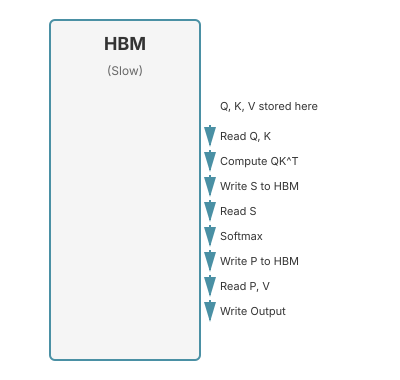
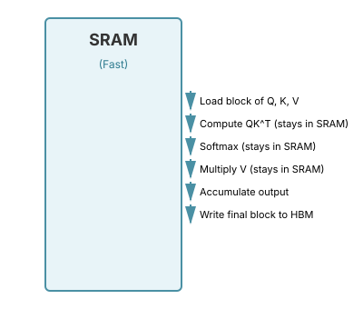
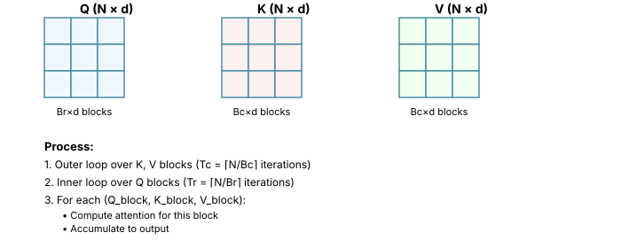

# Chapter 12: Flash Attention

Flash Attention is an IO-aware attention algorithm that achieves 2-4x speedup and reduces memory usage from O(N²) to O(N) for sequence length N. Understanding Flash Attention is essential for ML interviews because it demonstrates how algorithm design must consider hardware characteristics, not just theoretical complexity.

This chapter covers the fundamental problem Flash Attention solves, the algorithmic techniques it uses, and practical implementation considerations.

## Table of Contents

1. [The Memory Bottleneck Problem](#the-memory-bottleneck-problem)
2. [GPU Memory Hierarchy](#gpu-memory-hierarchy)
3. [Standard Attention Analysis](#standard-attention-analysis)
4. [IO-Aware Algorithm Design](#io-aware-algorithm-design)
5. [Tiling Strategy](#tiling-strategy)
6. [Online Softmax Algorithm](#online-softmax-algorithm)
7. [Forward Pass Algorithm](#forward-pass-algorithm)
8. [Backward Pass and Recomputation](#backward-pass-and-recomputation)
9. [Implementation Considerations](#implementation-considerations)
10. [FlashAttention Versions](#flashattention-versions)
11. [Using Flash Attention in Practice](#using-flash-attention-in-practice)
12. [When NOT to Use Flash Attention](#when-not-to-use-flash-attention)
13. [Debugging and Troubleshooting](#debugging-and-troubleshooting)
14. [Deployment Challenges](#deployment-challenges)
15. [Theoretical Analysis](#theoretical-analysis)
16. [Extensions and Variants](#extensions-and-variants)
17. [Common Interview Questions](#common-interview-questions)
18. [Summary](#summary)

---

## The Memory Bottleneck Problem

### The O(N²) Problem

Standard attention has a fundamental memory problem that becomes critical for long sequences:

```math
\text{Attention}(Q, K, V) = \text{softmax}\left(\frac{QK^T}{\sqrt{d_k}}\right)V
```

The attention matrix $S = QK^T$ has shape $(N, N)$ where $N$ is the sequence length. For modern LLMs with long contexts:

- 32K context: $32{,}768^2 = 1{,}073{,}741{,}824$ elements
- 100K context: $100{,}000^2 = 10{,}000{,}000{,}000$ elements
- Each element in FP16: 2 bytes

**Memory requirements:**
- 32K context: 2 GB per attention head
- 100K context: 20 GB per attention head
- With 64 heads: 1.28 TB (!)

This is clearly infeasible. But the problem is not just memory size—it's memory bandwidth.

```python
import torch
import time

def demonstrate_memory_bottleneck():
    """
    Demonstrate that attention is memory-bound, not compute-bound.

    On modern GPUs, the bottleneck is moving data between HBM and SRAM,
    not the actual computation.
    """
    device = 'cuda' if torch.cuda.is_available() else 'cpu'

    # Configuration
    batch_size = 8
    n_heads = 8
    seq_len = 4096
    head_dim = 64

    # Create random Q, K, V
    Q = torch.randn(batch_size, n_heads, seq_len, head_dim, device=device, dtype=torch.float16)
    K = torch.randn(batch_size, n_heads, seq_len, head_dim, device=device, dtype=torch.float16)
    V = torch.randn(batch_size, n_heads, seq_len, head_dim, device=device, dtype=torch.float16)

    # Warmup
    for _ in range(10):
        _ = torch.matmul(Q, K.transpose(-2, -1))

    torch.cuda.synchronize()

    # Time just QK^T (compute)
    start = time.time()
    for _ in range(100):
        scores = torch.matmul(Q, K.transpose(-2, -1))
    torch.cuda.synchronize()
    compute_time = (time.time() - start) / 100

    # Time full attention (compute + memory)
    start = time.time()
    for _ in range(100):
        scores = torch.matmul(Q, K.transpose(-2, -1)) / (head_dim ** 0.5)
        attn = torch.softmax(scores, dim=-1)
        out = torch.matmul(attn, V)
    torch.cuda.synchronize()
    full_time = (time.time() - start) / 100

    print(f"Sequence length: {seq_len}")
    print(f"QK^T compute time: {compute_time*1000:.2f} ms")
    print(f"Full attention time: {full_time*1000:.2f} ms")
    print(f"Memory overhead ratio: {full_time/compute_time:.2f}x")
    print(f"\nAttention matrix size: {seq_len * seq_len * 2 / 1e6:.2f} MB per head")
```

**Key insight:** On modern GPUs with high FLOPS but limited memory bandwidth, the bottleneck is not computation but moving data between memory levels.

---

## GPU Memory Hierarchy

Understanding GPU memory hierarchy is critical for understanding Flash Attention's design.

### Memory Levels

**The Problem:**
Modern GPUs have a fundamental trade-off in their memory hierarchy: fast memory is tiny, and large memory is slow. This hierarchical design is unavoidable due to physics (larger memory requires longer wire distances) and economics (SRAM is ~30x more expensive than DRAM per byte). Understanding this hierarchy is essential because Flash Attention's entire design optimizes for this specific constraint.

**Theoretical Background:**
The memory hierarchy creates a performance gap that traditional algorithms ignore. Classical algorithm analysis focuses on FLOP count (time complexity) and peak memory usage (space complexity), assuming uniform memory access time. However, on GPUs:
- Accessing SRAM takes ~1 cycle
- Accessing HBM takes ~100+ cycles
- The bandwidth difference is 10-15x

This means an algorithm with the same FLOP count can be 10x slower if it makes poor memory access choices. Flash Attention recognizes that for attention, **data movement time dominates computation time**.

**How This Relates to Alternatives:**
- Traditional attention: Optimized for FLOPs, ignores memory hierarchy
- Flash Attention: Optimized for memory bandwidth, accepts redundant computation
- Sparse attention: Reduces FLOPs but doesn't address memory bandwidth
- Approximate attention: Reduces both but sacrifices exactness

The key insight is that on modern hardware, we should minimize HBM access even at the cost of additional computation, because GPUs have excess compute capacity but scarce memory bandwidth.

```python
class GPUMemoryHierarchy:
    """
    GPU memory hierarchy (NVIDIA Ampere/Hopper architecture).

    Flash Attention's core insight: Minimize HBM ↔ SRAM transfers.
    """

    SRAM = {
        'name': 'On-chip SRAM (Shared Memory + L1/L2 Cache)',
        'size_A100': '20 MB per SM × 108 SMs = ~2 GB total',
        'size_H100': '32 MB per SM × 132 SMs = ~4 GB total',
        'bandwidth': '~20 TB/s (A100), ~30 TB/s (H100)',
        'latency': '~1 cycle',
        'notes': 'Fast but tiny. Must fit working set here for efficiency.'
    }

    HBM = {
        'name': 'High Bandwidth Memory (DRAM)',
        'size_A100': '40 GB or 80 GB',
        'size_H100': '80 GB',
        'bandwidth': '1.5-2 TB/s (A100), 3 TB/s (H100)',
        'latency': '~100s of cycles',
        'notes': 'Large but slow. This is the bottleneck!'
    }

    @staticmethod
    def bandwidth_ratio() -> float:
        """
        SRAM is ~10-15x faster than HBM.

        This means: Reading 1 MB from HBM costs as much time as
        performing ~10-15 TFLOPS of computation on data in SRAM.

        Implication: We should do maximum computation on data
        while it's in SRAM, even if it means redundant computation.
        """
        return 20 / 1.5  # ~13x on A100


def calculate_memory_bandwidth_cost():
    """
    Calculate the cost of memory transfers vs computation.

    This shows why Flash Attention's recomputation strategy makes sense.
    """
    # Constants for A100
    hbm_bandwidth = 1.5e12  # 1.5 TB/s = 1.5e12 bytes/s
    compute_throughput = 312e12  # 312 TFLOPS FP16

    # For a sequence of length N with head dimension d
    N = 4096
    d = 64

    # Standard attention memory transfers (bytes)
    # Read Q, K, V: 3 × N × d × 2 bytes (FP16)
    # Write S = QK^T: N × N × 2 bytes
    # Read S for softmax: N × N × 2 bytes
    # Write P = softmax(S): N × N × 2 bytes
    # Read P, V for output: (N × N + N × d) × 2 bytes

    total_memory_bytes = (
        3 * N * d * 2 +      # Read Q, K, V
        N * N * 2 +          # Write S
        N * N * 2 +          # Read S
        N * N * 2 +          # Write P
        (N * N + N * d) * 2  # Read P, V
    )

    memory_time = total_memory_bytes / hbm_bandwidth

    # Computation (FLOPs)
    # QK^T: 2 × N × N × d (matmul)
    # Softmax: ~5 × N × N (exp, sum, divide)
    # PV: 2 × N × N × d (matmul)

    total_flops = (
        2 * N * N * d +  # QK^T
        5 * N * N +      # Softmax
        2 * N * N * d    # PV
    )

    compute_time = total_flops / compute_throughput

    print(f"Sequence length: {N}")
    print(f"Memory transfer time: {memory_time*1000:.3f} ms")
    print(f"Compute time: {compute_time*1000:.3f} ms")
    print(f"Memory bound by: {memory_time/compute_time:.2f}x")
    print(f"\nTotal memory accessed: {total_memory_bytes/1e9:.2f} GB")
    print(f"Attention is {'memory-bound' if memory_time > compute_time else 'compute-bound'}")

    return memory_time, compute_time
```

**Key takeaway:** For attention, memory transfers dominate computation time. Flash Attention addresses this by minimizing HBM access.

---

## Standard Attention Analysis

Let's analyze standard attention implementation to understand where the bottleneck is.

```python
import torch
import torch.nn.functional as F

class StandardAttention:
    """
    Standard attention implementation with detailed memory analysis.

    This is what we want to improve.
    """

    @staticmethod
    def forward(
        Q: torch.Tensor,  # (batch, n_heads, seq_len, head_dim)
        K: torch.Tensor,
        V: torch.Tensor,
        causal: bool = False
    ) -> torch.Tensor:
        """
        Standard attention forward pass.

        Memory complexity: O(N²) due to storing attention matrix.
        """
        batch, n_heads, N, d = Q.shape

        # Step 1: Compute attention scores S = QK^T / √d
        # Memory: Allocate N×N matrix, write to HBM
        scores = torch.matmul(Q, K.transpose(-2, -1)) / (d ** 0.5)
        # HBM writes: N² × batch × n_heads elements

        # Step 2: Apply causal mask if needed
        if causal:
            mask = torch.triu(torch.ones(N, N, device=Q.device), diagonal=1).bool()
            scores = scores.masked_fill(mask, float('-inf'))
            # HBM reads: N² (mask), HBM writes: N²

        # Step 3: Softmax
        # Memory: Read N² from HBM, write N² back
        attention_weights = F.softmax(scores, dim=-1)
        # HBM reads: N², HBM writes: N²

        # Step 4: Weighted sum of values
        # Memory: Read N² (attention) + Nd (V), write Nd (output)
        output = torch.matmul(attention_weights, V)
        # HBM reads: N² + Nd, HBM writes: Nd

        return output

    @staticmethod
    def memory_analysis(batch: int, n_heads: int, seq_len: int, head_dim: int) -> dict:
        """
        Analyze memory requirements and HBM accesses.

        Returns dictionary with memory statistics.
        """
        N = seq_len
        d = head_dim

        # Memory storage (in elements, multiply by 2 for FP16 bytes)
        attention_matrix = batch * n_heads * N * N
        inputs_outputs = batch * n_heads * 3 * N * d  # Q, K, V

        total_elements = attention_matrix + inputs_outputs
        total_bytes = total_elements * 2  # FP16

        # HBM accesses (read + write operations)
        # Forward pass
        hbm_reads_fwd = (
            3 * N * d +      # Read Q, K, V
            N * N +          # Read scores for softmax
            N * N +          # Read attention for matmul with V
            N * d            # Read V
        ) * batch * n_heads * 2  # FP16 bytes

        hbm_writes_fwd = (
            N * N +          # Write scores
            N * N +          # Write attention weights
            N * d            # Write output
        ) * batch * n_heads * 2

        total_hbm_access = hbm_reads_fwd + hbm_writes_fwd

        return {
            'peak_memory_gb': total_bytes / 1e9,
            'attention_matrix_gb': attention_matrix * 2 / 1e9,
            'hbm_access_gb': total_hbm_access / 1e9,
            'memory_complexity': 'O(N²)',
            'hbm_complexity': 'O(N² + Nd)',
        }


# Example analysis
def compare_sequence_lengths():
    """Compare memory requirements for different sequence lengths."""
    batch = 8
    n_heads = 32
    head_dim = 128

    for seq_len in [1024, 4096, 16384, 65536]:
        stats = StandardAttention.memory_analysis(batch, n_heads, seq_len, head_dim)
        print(f"\nSequence length: {seq_len}")
        print(f"  Peak memory: {stats['peak_memory_gb']:.2f} GB")
        print(f"  Attention matrix: {stats['attention_matrix_gb']:.2f} GB")
        print(f"  HBM access: {stats['hbm_access_gb']:.2f} GB")
```

**Problems with standard attention:**
1. **O(N²) memory:** Must store full attention matrix
2. **Excessive HBM access:** Attention matrix written/read multiple times
3. **Limited sequence length:** Cannot fit long sequences in memory
4. **Memory-bound:** Spends more time moving data than computing

---

## IO-Aware Algorithm Design

Flash Attention is designed around the principle: **minimize HBM access, even at the cost of extra computation**.

### Core Principles

Flash Attention is built on three key design principles that work together to achieve both memory efficiency and speed:

#### Principle 1: Tiling (Kernel Fusion)

**Standard approach (3 separate kernels):**
- Kernel 1: Compute $QK^T$, write to HBM
- Kernel 2: Softmax, read from HBM, write to HBM
- Kernel 3: Multiply by V, read from HBM

**Flash Attention (1 fused kernel):**
- Process Q, K, V in blocks that fit in SRAM
- Never write intermediate attention matrix to HBM
- Output final result directly

**Key insight:** Do all operations on a tile while it's in SRAM. This kernel fusion eliminates expensive HBM read/write operations between steps.

#### Principle 2: Recomputation in Backward Pass

**Standard approach:**
- Store attention matrix for backward pass
- Cost: $O(N^2)$ memory

**Flash Attention:**
- Don't store attention matrix
- Recompute it on-the-fly during backward pass
- Cost: $O(N)$ memory, but extra computation

**Trade-off: Memory bandwidth vs. compute**
- Modern GPUs have excess compute capacity
- But limited memory bandwidth
- Therefore: Recomputation is actually faster!

This counter-intuitive design choice is at the heart of Flash Attention's efficiency.

#### Principle 3: Online (Incremental) Softmax

**Challenge:** How to compute softmax over blocks?

Softmax requires global statistics (max and sum over all elements), but we're processing in blocks!

**Solution: Online softmax algorithm**
- Maintain running max and sum
- Update incrementally as we process each block
- Mathematically exact, no approximation

This is the key algorithmic innovation that makes tiled attention possible.

### Data Movement: Standard vs Flash Attention

**Standard Attention:**



**Flash Attention:**



**Key difference:** Intermediate results never leave SRAM!

---

## Tiling Strategy

Flash Attention divides Q, K, V into blocks (tiles) that fit in SRAM.

### Block Size Selection

**The Problem:**
When dividing matrices into blocks, we face a critical trade-off: larger blocks mean fewer kernel invocations (less overhead), but blocks must fit in SRAM. If blocks are too large, they spill to HBM, defeating the purpose of tiling. If blocks are too small, we waste time on kernel overhead and don't fully utilize the GPU.

**Theoretical Justification:**
The optimal block size is determined by the SRAM capacity constraint. We need to fit in SRAM simultaneously:
- One Q block (Br × d elements)
- One K block (Bc × d elements)
- One V block (Bc × d elements)
- Attention scores (Br × Bc elements)
- Output accumulator (Br × d elements)

This gives us: $(3B_r + 3B_c)d + B_r B_c \leq M$ where $M$ is SRAM capacity.

The Flash Attention paper proves that choosing $B_c = \Theta(M / d)$ and $B_r = \min(B_c, d)$ yields optimal I/O complexity of $\Theta(N^2 d^2 / M)$ HBM accesses.

**How This Relates to Alternatives:**
- Too small blocks: More kernel launches, poor hardware utilization
- Too large blocks: Spill to HBM, lose all benefits
- Dynamic blocking (e.g., cuBLAS): Generic, not optimized for attention's specific pattern
- Flash Attention's approach: Mathematically optimal block size for attention

**Key Insight:**
Block size is hardware-dependent: A100 has different SRAM than H100. Flash Attention automatically tunes this based on GPU architecture, which is why a single CUDA kernel doesn't work optimally everywhere—you need hardware-specific compilation.

```python
import math

class TilingStrategy:
    """
    Tiling strategy for Flash Attention.

    Key question: What block size to use?
    Answer: As large as possible while fitting in SRAM.
    """

    @staticmethod
    def compute_block_size(
        sram_size: int,           # SRAM available (bytes)
        head_dim: int,            # Head dimension d
        dtype_bytes: int = 2      # FP16 = 2 bytes
    ) -> tuple[int, int]:
        """
        Compute optimal block sizes Bc (columns) and Br (rows).

        We need to fit in SRAM:
        - Q block: Br × d
        - K block: Bc × d
        - V block: Bc × d
        - S block: Br × Bc (attention scores)
        - O block: Br × d (output accumulator)

        Total: (3Br + 3Bc)d + BrBc elements

        Constraint: (3Br + 3Bc)d + BrBc ≤ SRAM_size / dtype_bytes

        For Flash Attention, they use:
        - Bc = ⌊SRAM_size / (4d)⌋
        - Br = min(Bc, d)
        """
        # Simplified: Assume Bc = Br for simplicity
        # Constraint: 6Bd + B² ≤ M where M = SRAM_size / dtype_bytes
        # Approximately: B ≈ √(M) when B² dominates
        # Or: B ≈ M/(6d) when 6Bd dominates

        M = sram_size // dtype_bytes

        # Use the formula from the paper
        Bc = M // (4 * head_dim)
        Br = min(Bc, head_dim)

        return Bc, Br

    @staticmethod
    def example_block_sizes():
        """
        Example block sizes for typical configurations.
        """
        # A100: ~20 MB SRAM per SM
        # But we can't use all of it (need space for other things)
        # Flash Attention uses ~16 KB - 64 KB per block

        configs = [
            {'gpu': 'A100', 'sram_kb': 32, 'head_dim': 64},
            {'gpu': 'A100', 'sram_kb': 32, 'head_dim': 128},
            {'gpu': 'H100', 'sram_kb': 64, 'head_dim': 128},
        ]

        for config in configs:
            sram_bytes = config['sram_kb'] * 1024
            d = config['head_dim']
            Bc, Br = TilingStrategy.compute_block_size(sram_bytes, d)

            print(f"{config['gpu']}, d={d}, SRAM={config['sram_kb']}KB:")
            print(f"  Bc={Bc}, Br={Br}")
            print(f"  Memory used: {(6*Br*d + Br*Bc)*2/1024:.1f} KB\n")


def visualize_tiling():
    """
    Visualize how matrices are divided into blocks.



    Total iterations: Tr × Tc
    But each iteration operates on small blocks in SRAM!
    """
    pass
```

---

## Online Softmax Algorithm

The key algorithmic innovation in Flash Attention is computing softmax incrementally over blocks.

### Standard Softmax

Standard softmax requires two passes over the data:

```math
\text{softmax}(x_i) = \frac{e^{x_i}}{\sum_{j} e^{x_j}}
```

**Two-pass algorithm:**
1. First pass: Find $m = \max_j x_j$ (for numerical stability)
2. Second pass: Compute $\sum_j e^{x_j - m}$ and $\frac{e^{x_i - m}}{\sum_j e^{x_j - m}}$

**Problem:** We're processing in blocks, so we can't make two passes!

### Online Softmax (Safe Softmax)

```python
import torch
import math

class OnlineSoftmax:
    """
    Online (incremental) softmax algorithm.

    Key idea: Update running statistics as we see new blocks.

    Reference: "Online normalizer calculation for softmax" (Milakov & Gimelshein, 2018)
    """

    @staticmethod
    def standard_softmax(x: torch.Tensor) -> torch.Tensor:
        """
        Standard softmax (two-pass).

        Args:
            x: Input tensor [..., n]

        Returns:
            Softmax output [..., n]
        """
        # Pass 1: Find max for numerical stability
        m = x.max(dim=-1, keepdim=True).values

        # Pass 2: Compute exp and sum
        exp_x = torch.exp(x - m)
        sum_exp = exp_x.sum(dim=-1, keepdim=True)

        return exp_x / sum_exp

    @staticmethod
    def online_softmax_step(
        m_old: torch.Tensor,     # Previous max
        l_old: torch.Tensor,     # Previous sum of exp
        x_new: torch.Tensor      # New block of values
    ) -> tuple[torch.Tensor, torch.Tensor, torch.Tensor]:
        """
        Update softmax statistics with new block.

        Mathematical derivation:

        Old state:
          m_old = max(x_1, ..., x_k)
          l_old = Σ exp(x_i - m_old)

        New values: x_{k+1}, ..., x_{k+j}

        New max:
          m_new = max(m_old, max(x_new))

        Key insight: We can update l_old to account for new max!

          l_new = l_old × exp(m_old - m_new) + Σ exp(x_new - m_new)

        This rescaling ensures numerical stability.

        Args:
            m_old: Current max value
            l_old: Current sum of exponentials (scaled by old max)
            x_new: New block of values

        Returns:
            m_new: Updated max
            l_new: Updated sum
            weights: Softmax weights for x_new
        """
        # Find max of new block
        m_new_block = x_new.max(dim=-1, keepdim=True).values

        # Global max
        m_new = torch.maximum(m_old, m_new_block)

        # Rescale old sum with new max
        # l_old was computed with m_old, now we use m_new
        l_old_rescaled = l_old * torch.exp(m_old - m_new)

        # Compute exp for new block with new max
        exp_new = torch.exp(x_new - m_new)
        l_new_block = exp_new.sum(dim=-1, keepdim=True)

        # Updated sum
        l_new = l_old_rescaled + l_new_block

        return m_new, l_new, exp_new

    @staticmethod
    def online_softmax_demo():
        """
        Demonstrate online softmax matches standard softmax.
        """
        # Generate random scores
        x = torch.randn(4, 100)

        # Standard softmax
        standard_result = OnlineSoftmax.standard_softmax(x)

        # Online softmax (process in blocks of 20)
        block_size = 20
        n_blocks = x.shape[-1] // block_size

        # Initialize
        m = torch.full((4, 1), float('-inf'))
        l = torch.zeros(4, 1)

        exp_blocks = []

        for i in range(n_blocks):
            block = x[:, i*block_size:(i+1)*block_size]
            m, l, exp_block = OnlineSoftmax.online_softmax_step(m, l, block)
            exp_blocks.append(exp_block)

        # Final normalization
        online_result = torch.cat(exp_blocks, dim=-1) / l

        # Verify they match
        print("Max difference:", (standard_result - online_result).abs().max().item())
        print("Results match:", torch.allclose(standard_result, online_result, atol=1e-5))

        return standard_result, online_result


class FlashAttentionSoftmax:
    """
    Softmax as used in Flash Attention.

    We need to compute softmax over rows of the attention matrix,
    but we're processing K, V in blocks.
    """

    @staticmethod
    def flash_attention_softmax_update(
        m_old: torch.Tensor,     # (Br, 1) - row-wise max so far
        l_old: torch.Tensor,     # (Br, 1) - row-wise sum so far
        O_old: torch.Tensor,     # (Br, d) - output accumulator
        Q_block: torch.Tensor,   # (Br, d) - query block
        K_block: torch.Tensor,   # (Bc, d) - key block
        V_block: torch.Tensor    # (Bc, d) - value block
    ) -> tuple[torch.Tensor, torch.Tensor, torch.Tensor]:
        """
        Update Flash Attention state with new K, V block.

        This is the core of the Flash Attention algorithm.

        Args:
            m_old: Previous row-wise max
            l_old: Previous row-wise sum of exp
            O_old: Previous output accumulator
            Q_block: Current query block (Br × d)
            K_block: Current key block (Bc × d)
            V_block: Current value block (Bc × d)

        Returns:
            m_new: Updated max
            l_new: Updated sum
            O_new: Updated output
        """
        d = Q_block.shape[-1]

        # Compute attention scores for this block
        # S_block: (Br, Bc)
        S_block = torch.matmul(Q_block, K_block.T) / math.sqrt(d)

        # Update max and sum using online softmax
        m_new_block = S_block.max(dim=-1, keepdim=True).values  # (Br, 1)
        m_new = torch.maximum(m_old, m_new_block)

        # Rescale old statistics
        exp_correction = torch.exp(m_old - m_new)  # (Br, 1)
        l_old_rescaled = l_old * exp_correction

        # Compute exp for new block
        exp_S_block = torch.exp(S_block - m_new)  # (Br, Bc)
        l_new_block = exp_S_block.sum(dim=-1, keepdim=True)  # (Br, 1)
        l_new = l_old_rescaled + l_new_block

        # Update output accumulator
        # Key insight: Need to rescale old output because max changed!
        O_old_rescaled = O_old * exp_correction  # (Br, d)
        O_new_block = torch.matmul(exp_S_block, V_block)  # (Br, d)
        O_new = O_old_rescaled + O_new_block

        return m_new, l_new, O_new
```

**Key mathematical insight:**

When the max changes from $m_{old}$ to $m_{new}$, we need to rescale everything:

```math
\begin{align}
l_{new} &= l_{old} \cdot e^{m_{old} - m_{new}} + \sum_{j \in \text{new block}} e^{S_{ij} - m_{new}} \\
O_{new} &= O_{old} \cdot e^{m_{old} - m_{new}} + \sum_{j \in \text{new block}} e^{S_{ij} - m_{new}} V_j
\end{align}
```

This allows us to maintain exact softmax while processing in blocks!

---

## Forward Pass Algorithm

Now we can put together the complete Flash Attention forward pass.

**The Problem Being Solved:**
Standard attention computes the full N×N attention matrix and stores it in HBM between operations. For a 4K sequence with FP16, this is 32 MB per head—small enough to fit in HBM but too large for SRAM. The result: every operation (QK^T, softmax, multiply by V) requires slow HBM reads/writes.

**Theoretical Justification:**
Flash Attention's forward pass is based on the associativity of attention operations. Mathematically:

```math
\text{Attention}(Q, K, V) = \sum_{j=1}^{N} \frac{e^{q_i \cdot k_j}}{\sum_{l=1}^{N} e^{q_i \cdot k_l}} v_j
```

The key observation: we can compute this sum incrementally by processing K, V in blocks, as long as we maintain the correct normalization (via online softmax). This is **exact**, not approximate—we get the same result as if we computed the full attention matrix.

**How This Algorithm Relates to Alternatives:**
- **Standard attention:** Computes full attention matrix, then multiplies by V. Simple but slow.
- **Chunked attention:** Processes in chunks but still materializes attention matrix for each chunk.
- **Flash Attention:** Never materializes full attention matrix—only processes blocks in SRAM.
- **Approximate methods (e.g., Linformer):** Change the attention computation itself, losing exactness.

**Key Insight That Makes It Work:**
The online softmax algorithm allows us to update normalization statistics incrementally. When we process a new K,V block and find a larger attention score, we don't need to go back and recompute previous blocks—we just rescale the accumulated output by $e^{m_{old} - m_{new}}$. This rescaling operation is mathematically equivalent to having computed with the correct normalization from the start.

```python
import torch
import math

class FlashAttentionForward:
    """
    Complete Flash Attention forward pass implementation.

    This is a simplified but functional version for educational purposes.
    The actual implementation uses CUDA kernels for efficiency.
    """

    @staticmethod
    def forward(
        Q: torch.Tensor,     # (batch, n_heads, N, d)
        K: torch.Tensor,     # (batch, n_heads, N, d)
        V: torch.Tensor,     # (batch, n_heads, N, d)
        block_size_c: int = 64,  # Bc: block size for K, V
        block_size_r: int = 64,  # Br: block size for Q
        causal: bool = False
    ) -> torch.Tensor:
        """
        Flash Attention forward pass.

        Algorithm (simplified):

        1. Divide Q into Tr = ⌈N/Br⌉ blocks: Q_1, ..., Q_Tr
        2. Divide K, V into Tc = ⌈N/Bc⌉ blocks: K_1, V_1, ..., K_Tc, V_Tc
        3. For each Q block i:
             Initialize O_i = 0, l_i = 0, m_i = -∞
             For each K, V block j:
               If causal and j > i: skip
               Compute S_ij = Q_i K_j^T / √d
               Update m_i, l_i, O_i using online softmax
             Normalize: O_i = O_i / l_i
        4. Concatenate all O_i blocks

        Memory complexity: O(N) instead of O(N²)
        - Never store full N×N attention matrix
        - Only store Br×Bc blocks in SRAM at a time
        """
        batch, n_heads, N, d = Q.shape

        # Number of blocks
        Tr = math.ceil(N / block_size_r)
        Tc = math.ceil(N / block_size_c)

        # Initialize output
        O = torch.zeros_like(Q)

        # Process each Q block
        for i in range(Tr):
            # Extract Q block
            start_r = i * block_size_r
            end_r = min((i + 1) * block_size_r, N)
            Q_block = Q[:, :, start_r:end_r, :]  # (batch, n_heads, Br, d)

            Br_actual = end_r - start_r

            # Initialize statistics for this Q block
            m_i = torch.full(
                (batch, n_heads, Br_actual, 1),
                float('-inf'),
                device=Q.device,
                dtype=Q.dtype
            )
            l_i = torch.zeros(
                (batch, n_heads, Br_actual, 1),
                device=Q.device,
                dtype=Q.dtype
            )
            O_i = torch.zeros(
                (batch, n_heads, Br_actual, d),
                device=Q.device,
                dtype=Q.dtype
            )

            # Process each K, V block
            for j in range(Tc):
                # Causal masking: skip future blocks
                if causal and j > i:
                    break

                # Extract K, V block
                start_c = j * block_size_c
                end_c = min((j + 1) * block_size_c, N)
                K_block = K[:, :, start_c:end_c, :]  # (batch, n_heads, Bc, d)
                V_block = V[:, :, start_c:end_c, :]

                Bc_actual = end_c - start_c

                # Compute attention scores for this block
                S_ij = torch.matmul(Q_block, K_block.transpose(-2, -1)) / math.sqrt(d)
                # S_ij: (batch, n_heads, Br, Bc)

                # Apply causal mask within block if needed
                if causal and i == j:
                    # Within-block causal mask
                    mask = torch.triu(
                        torch.ones(Br_actual, Bc_actual, device=Q.device),
                        diagonal=1
                    ).bool()
                    S_ij = S_ij.masked_fill(mask, float('-inf'))

                # Update statistics using online softmax
                m_ij = S_ij.max(dim=-1, keepdim=True).values  # (batch, n_heads, Br, 1)
                m_i_new = torch.maximum(m_i, m_ij)

                # Rescale old values
                alpha = torch.exp(m_i - m_i_new)  # (batch, n_heads, Br, 1)

                # Compute new exp values
                exp_S_ij = torch.exp(S_ij - m_i_new)  # (batch, n_heads, Br, Bc)

                # Update sum
                l_i = l_i * alpha + exp_S_ij.sum(dim=-1, keepdim=True)

                # Update output
                O_i = O_i * alpha + torch.matmul(exp_S_ij, V_block)

                # Update max
                m_i = m_i_new

            # Final normalization for this Q block
            O_i = O_i / l_i

            # Store result
            O[:, :, start_r:end_r, :] = O_i

        return O

    @staticmethod
    def test_correctness():
        """
        Test Flash Attention matches standard attention.
        """
        torch.manual_seed(42)

        batch = 2
        n_heads = 4
        seq_len = 256
        head_dim = 64

        Q = torch.randn(batch, n_heads, seq_len, head_dim)
        K = torch.randn(batch, n_heads, seq_len, head_dim)
        V = torch.randn(batch, n_heads, seq_len, head_dim)

        # Standard attention
        scores = torch.matmul(Q, K.transpose(-2, -1)) / math.sqrt(head_dim)
        attn = torch.softmax(scores, dim=-1)
        output_standard = torch.matmul(attn, V)

        # Flash attention
        output_flash = FlashAttentionForward.forward(
            Q, K, V,
            block_size_c=64,
            block_size_r=64
        )

        # Compare
        max_diff = (output_standard - output_flash).abs().max().item()
        print(f"Max difference: {max_diff}")
        print(f"Results match: {torch.allclose(output_standard, output_flash, atol=1e-4)}")

        return output_standard, output_flash


# Example usage
if __name__ == "__main__":
    print("Testing Flash Attention forward pass...")
    FlashAttentionForward.test_correctness()
```

**Complexity analysis:**

- **Memory:** O(N) - only store O_i blocks, not full N×N matrix
- **HBM reads:** O(N²d) - still need to read Q, K, V multiple times across blocks
- **HBM writes:** O(Nd) - only write final output
- **FLOPs:** O(N²d) - same as standard attention (no approximation!)

The key win is in HBM access pattern, not FLOP count.

### Complete Educational Implementation

Here's a complete, standalone implementation with detailed explanations:

```python
import torch
import torch.nn.functional as F
import math


def flash_attention_forward(Q, K, V, block_size=64):
    """
    Simplified Flash Attention implementation demonstrating the tiling algorithm.

    This is an educational implementation showing the core ideas:
    1. Process Q in blocks to limit memory usage
    2. For each Q block, iterate through K,V blocks
    3. Use online softmax to avoid materializing full attention matrix
    4. Accumulate outputs incrementally

    Args:
        Q: Query tensor [batch, heads, seq_len, head_dim]
        K: Key tensor [batch, heads, seq_len, head_dim]
        V: Value tensor [batch, heads, seq_len, head_dim]
        block_size: Size of blocks for tiling

    Returns:
        Output tensor [batch, heads, seq_len, head_dim]
    """
    batch, heads, seq_len, head_dim = Q.shape
    scale = 1.0 / math.sqrt(head_dim)

    # Output accumulator
    O = torch.zeros_like(Q)

    # For numerical stability in online softmax
    L = torch.zeros(batch, heads, seq_len, 1, device=Q.device)  # log-sum-exp
    M = torch.full((batch, heads, seq_len, 1), float('-inf'), device=Q.device)  # max

    # Number of blocks
    num_blocks = (seq_len + block_size - 1) // block_size

    # Process K,V in blocks (outer loop in Flash Attention)
    for j in range(num_blocks):
        j_start = j * block_size
        j_end = min(j_start + block_size, seq_len)

        # Load K,V block
        Kj = K[:, :, j_start:j_end, :]  # [batch, heads, block, head_dim]
        Vj = V[:, :, j_start:j_end, :]

        # Process Q in blocks (inner loop)
        for i in range(num_blocks):
            i_start = i * block_size
            i_end = min(i_start + block_size, seq_len)

            # Load Q block
            Qi = Q[:, :, i_start:i_end, :]

            # Compute attention scores for this block
            # S_ij = Q_i @ K_j^T * scale
            Sij = torch.matmul(Qi, Kj.transpose(-2, -1)) * scale

            # Online softmax update
            # Get current max and new max
            Mi = M[:, :, i_start:i_end, :]
            mi_new = torch.maximum(Mi, Sij.max(dim=-1, keepdim=True).values)

            # Compute exp with numerical stability
            P = torch.exp(Sij - mi_new)

            # Update running sum
            Li = L[:, :, i_start:i_end, :]
            li_new = torch.exp(Mi - mi_new) * Li + P.sum(dim=-1, keepdim=True)

            # Update output: rescale old output and add new contribution
            Oi = O[:, :, i_start:i_end, :]
            O[:, :, i_start:i_end, :] = (
                torch.exp(Mi - mi_new) * Oi + torch.matmul(P, Vj)
            )

            # Update statistics
            M[:, :, i_start:i_end, :] = mi_new
            L[:, :, i_start:i_end, :] = li_new

    # Final normalization
    O = O / L

    return O


def verify_flash_attention():
    """Verify our implementation matches standard attention."""
    torch.manual_seed(42)

    batch, heads, seq_len, head_dim = 2, 4, 128, 64
    Q = torch.randn(batch, heads, seq_len, head_dim)
    K = torch.randn(batch, heads, seq_len, head_dim)
    V = torch.randn(batch, heads, seq_len, head_dim)

    # Standard attention
    scale = 1.0 / math.sqrt(head_dim)
    scores = torch.matmul(Q, K.transpose(-2, -1)) * scale
    attn = F.softmax(scores, dim=-1)
    standard_out = torch.matmul(attn, V)

    # Flash attention
    flash_out = flash_attention_forward(Q, K, V, block_size=32)

    # Compare
    max_diff = (standard_out - flash_out).abs().max().item()
    print(f"Max difference: {max_diff:.2e}")
    print(f"Match: {max_diff < 1e-5}")

    return max_diff < 1e-5


if __name__ == "__main__":
    verify_flash_attention()
```

**Key insights explained:**

**1. Online Softmax Algorithm**

The core innovation is how we compute softmax incrementally. Standard softmax requires:

```math
\text{softmax}(x_i) = \frac{e^{x_i}}{\sum_j e^{x_j}}
```

This needs the full sequence to compute the sum in the denominator. Flash Attention solves this by maintaining:
- $M$: running maximum (for numerical stability)
- $L$: running sum of exponentials

When we see a new block with max $m_{new}$:
1. Rescale previous values: multiply by $e^{m_{old} - m_{new}}$
2. Add new contributions
3. Update running statistics

This is **mathematically exact**—we get the same result as if we computed the full softmax!

**2. Why we track M (max) and L (sum) separately**

Tracking M separately provides numerical stability. In standard softmax, we compute:

```math
\text{softmax}(x_i) = \frac{e^{x_i - \max(x)}}{\sum_j e^{x_j - \max(x)}}
```

Subtracting the max prevents overflow. In online softmax, when we see a new max:
- Old values need rescaling by $e^{m_{old} - m_{new}}$
- New values are computed with $e^{x - m_{new}}$
- The running sum L needs the same rescaling

**3. How this avoids materializing the O(n²) attention matrix**

Standard attention computes the full $N \times N$ matrix $S = QK^T$, then softmax, then multiply by V. Flash Attention only ever computes small $B \times B$ blocks of S, processes them immediately, and discards them.

**4. Memory complexity: O(n) instead of O(n²)**

- Standard attention: Store $N \times N$ attention matrix = $O(N^2)$ memory
- Flash Attention: Store only $M$ and $L$ (each $N \times 1$) = $O(N)$ memory
- We recompute attention scores during backward pass instead of storing them

---

## Backward Pass and Recomputation

Flash Attention achieves O(N) memory in the backward pass by recomputing attention on-the-fly.

**The Problem Being Solved:**
Standard attention backward pass needs the attention matrix P = softmax(QK^T/√d) to compute gradients. For a 4K sequence, storing P requires 32 MB per head. Across 32 heads and 8 batches, that's 8 GB just for the attention matrices. This memory is the primary blocker for training on long sequences.

**Why Recomputation Makes Sense:**
This seems counterintuitive—why recompute when we could save? The answer lies in the arithmetic intensity of modern GPUs:
- **Arithmetic intensity** = FLOPs / bytes accessed
- For saving P: 0 FLOPs, N² bytes → intensity = 0
- For recomputing P: 2N²d FLOPs, Nd bytes → intensity = 2Nd/d = 2N

Modern GPUs (e.g., A100) can perform ~200 FLOPs in the time it takes to load 1 byte from HBM. This means for any computation with arithmetic intensity > 200, it's faster to recompute than to load from memory!

**Theoretical Foundation:**
This is an instance of the classical **time-memory tradeoff**, but with a hardware-specific twist. On CPUs, memory access is relatively fast, so saving is usually better. On GPUs with massive compute but limited memory bandwidth, the crossover point favors recomputation.

The recomputation strategy is possible because:
1. We save the softmax statistics (m, l) which are O(N) in size
2. From (Q, K, m, l), we can reconstruct P exactly
3. Reconstruction cost is lower than the HBM bandwidth cost of saving/loading P

**How This Relates to Alternatives:**
- **Gradient checkpointing:** Recomputes entire layers, not just attention matrix
- **Selective checkpointing:** Chooses what to save based on heuristics
- **Flash Attention:** Mathematically proves which tensors to save (m, l) and which to recompute (P)
- **No checkpointing:** Saves everything, uses O(N²) memory

**Key Insight:**
The decision to recompute isn't arbitrary—it's based on precise analysis of the compute-to-memory-bandwidth ratio of the specific operation. For attention, the ratio heavily favors recomputation.

```python
class FlashAttentionBackward:
    """
    Flash Attention backward pass with recomputation.

    Key insight: Don't store attention matrix, recompute it!

    Standard attention backward:
    - Store attention matrix P = softmax(QK^T / √d)
    - Memory: O(N²)

    Flash attention backward:
    - Store only O, m, l (the softmax statistics)
    - Recompute attention during backward
    - Memory: O(N)

    Why recomputation is faster:
    - Saving O(N²) memory saves HBM bandwidth
    - Recomputation happens in SRAM (fast)
    - Modern GPUs are compute-bound → free compute!
    """

    @staticmethod
    def forward_with_cache(
        Q: torch.Tensor,
        K: torch.Tensor,
        V: torch.Tensor,
        block_size: int = 64
    ) -> tuple[torch.Tensor, dict]:
        """
        Forward pass that saves minimal state for backward.

        Saved state:
        - O: Output (Nd)
        - m: Row-wise max (N)
        - l: Row-wise sum (N)
        - Q, K, V: Inputs (3Nd)

        Total: O(Nd) memory vs O(N²) for standard attention

        Returns:
            output: Attention output
            cache: Dictionary with saved tensors
        """
        # Run forward (implementation same as before)
        output = FlashAttentionForward.forward(Q, K, V, block_size, block_size)

        # In actual implementation, we'd save m and l computed during forward
        # For this demo, we'll recompute them
        batch, n_heads, N, d = Q.shape

        # Compute and save statistics (in real impl, these come from forward)
        scores = torch.matmul(Q, K.transpose(-2, -1)) / math.sqrt(d)
        m = scores.max(dim=-1, keepdim=True).values  # (batch, n_heads, N, 1)
        exp_scores = torch.exp(scores - m)
        l = exp_scores.sum(dim=-1, keepdim=True)  # (batch, n_heads, N, 1)

        cache = {
            'Q': Q,
            'K': K,
            'V': V,
            'O': output,
            'm': m,
            'l': l,
            'block_size': block_size
        }

        return output, cache

    @staticmethod
    def backward(
        dO: torch.Tensor,     # Gradient w.r.t. output
        cache: dict           # Saved tensors from forward
    ) -> tuple[torch.Tensor, torch.Tensor, torch.Tensor]:
        """
        Backward pass with recomputation.

        Given dL/dO, compute dL/dQ, dL/dK, dL/dV.

        Key equations (from standard attention backward):

        Let P = softmax(S) where S = QK^T / √d

        dL/dV = P^T @ dL/dO
        dL/dP = dL/dO @ V^T
        dL/dS = P ⊙ (dL/dP - (dL/dP ⊙ P).sum(axis=-1, keepdims=True))
        dL/dQ = dL/dS @ K / √d
        dL/dK = dL/dS^T @ Q / √d

        The trick: We recompute P from saved m, l instead of storing it!
        """
        Q = cache['Q']
        K = cache['K']
        V = cache['V']
        m = cache['m']
        l = cache['l']

        batch, n_heads, N, d = Q.shape

        # Recompute attention matrix P from saved statistics
        # This is the key: we're trading compute for memory
        scores = torch.matmul(Q, K.transpose(-2, -1)) / math.sqrt(d)
        P = torch.exp(scores - m) / l  # Recomputed from m, l

        # Now compute gradients using standard attention backward
        # dV = P^T @ dO
        dV = torch.matmul(P.transpose(-2, -1), dO)

        # dP = dO @ V^T
        dP = torch.matmul(dO, V.transpose(-2, -1))

        # Softmax backward: dS = P ⊙ (dP - (dP ⊙ P).sum(-1, keepdim=True))
        dS = P * (dP - (dP * P).sum(dim=-1, keepdim=True))

        # dQ = dS @ K / √d
        dQ = torch.matmul(dS, K) / math.sqrt(d)

        # dK = dS^T @ Q / √d
        dK = torch.matmul(dS.transpose(-2, -1), Q) / math.sqrt(d)

        return dQ, dK, dV

    @staticmethod
    def memory_comparison():
        """
        Compare memory requirements: standard vs flash backward.
        """
        batch = 8
        n_heads = 32
        seq_len = 4096
        head_dim = 128

        # Standard attention backward
        attention_matrix = batch * n_heads * seq_len * seq_len * 2  # FP16
        inputs = batch * n_heads * 3 * seq_len * head_dim * 2
        standard_memory = (attention_matrix + inputs) / 1e9

        # Flash attention backward
        # Only need to store: Q, K, V, O, m, l
        flash_inputs = batch * n_heads * 3 * seq_len * head_dim * 2  # Q, K, V
        flash_output = batch * n_heads * seq_len * head_dim * 2      # O
        flash_stats = batch * n_heads * seq_len * 2 * 2              # m, l
        flash_memory = (flash_inputs + flash_output + flash_stats) / 1e9

        print(f"Sequence length: {seq_len}")
        print(f"Standard backward memory: {standard_memory:.2f} GB")
        print(f"Flash backward memory: {flash_memory:.2f} GB")
        print(f"Memory reduction: {standard_memory / flash_memory:.1f}x")
```

**Why recomputation is faster:**

1. **Memory bandwidth bound:** Saving/loading O(N²) attention matrix saturates HBM
2. **Compute abundance:** Modern GPUs have excess compute capacity
3. **SRAM recomputation:** Recomputing in SRAM is much faster than HBM access
4. **Net effect:** 2-4x speedup despite doing more FLOPs!

---

## Implementation Considerations

### CUDA Implementation

The Python implementations above are for understanding. Real Flash Attention is implemented in CUDA for performance.

```python
class CUDAImplementationNotes:
    """
    Notes on CUDA implementation of Flash Attention.

    The actual implementation requires careful optimization:
    """

    @staticmethod
    def kernel_fusion():
        """
        Kernel fusion strategy.

        Standard attention: 3+ kernel launches
        - MatMul (QK^T)
        - Softmax
        - MatMul (PV)

        Flash Attention: 1 kernel launch
        - All operations fused
        - No intermediate HBM writes

        Benefits:
        - Fewer kernel launch overheads
        - No HBM writes between operations
        - Better instruction-level parallelism
        """
        pass

    @staticmethod
    def memory_layout():
        """
        Optimal memory layout for SRAM usage.

        Challenges:
        - SRAM is tiny (~20 MB per SM on A100)
        - Need to fit Q, K, V, S blocks simultaneously
        - Layout matters for memory access patterns

        Techniques:
        - Use shared memory for blocks
        - Careful padding to avoid bank conflicts
        - Row-major vs column-major layout choices
        """
        pass

    @staticmethod
    def thread_block_mapping():
        """
        Mapping computation to CUDA thread blocks.

        Flash Attention 1:
        - One thread block per attention head per Q block
        - Parallelize over batch and heads
        - Sequential over K, V blocks (online softmax)

        Flash Attention 2:
        - Improved parallelization across sequence length
        - Non-matmul operations minimized
        - Better work partitioning

        Flash Attention 3 (Hopper-specific):
        - Warp specialization
        - Asynchronous GEMM operations
        - Overlapping compute and memory
        """
        pass

    @staticmethod
    def numerical_precision():
        """
        Numerical precision considerations.

        Challenges:
        - FP16/BF16 have limited dynamic range
        - Softmax requires exp (can overflow/underflow)
        - Accumulation errors with long sequences

        Solutions:
        - Always compute max in FP32 for stability
        - Use higher precision for accumulation
        - Careful order of operations

        Flash Attention 3 adds:
        - FP8 support (E4M3 and E5M2)
        - Block-wise scaling for FP8
        """
        pass


class PerformanceOptimizations:
    """
    Performance optimization techniques in Flash Attention.
    """

    @staticmethod
    def block_size_tuning():
        """
        Auto-tuning block sizes for different GPUs.

        Factors:
        - Available SRAM per SM
        - Number of SMs
        - Head dimension
        - Sequence length

        Flash Attention uses heuristics to select optimal Br and Bc.
        Different for different GPU architectures (Ampere vs Hopper).
        """
        pass

    @staticmethod
    def causal_masking_optimization():
        """
        Optimizing causal (autoregressive) attention.

        Standard approach: Apply mask to full N×N matrix

        Flash Attention optimization:
        - Skip unnecessary K, V blocks entirely
        - For Q block i, only process K, V blocks 0..i
        - Reduces computation by ~50% for causal attention
        """
        pass

    @staticmethod
    def multi_query_attention():
        """
        Flash Attention with Multi-Query and Grouped-Query Attention.

        MQA/GQA: Fewer K, V heads than Q heads (see [Multi-Head Attention](04-multi-head-attention.md))

        Flash Attention adapts:
        - K, V blocks are smaller
        - Can process more K, V per iteration
        - Even better memory efficiency
        """
        pass
```

---

## FlashAttention Versions

Flash Attention has evolved through three major versions, each with significant improvements.

### FlashAttention 1 (2022)

**Paper:** "FlashAttention: Fast and Memory-Efficient Exact Attention with IO-Awareness"
**Authors:** Dao, Fu, Ermon, Rudra, Ré (Stanford, 2022)

**Key contributions:**
1. IO-aware algorithm design
2. Tiling strategy
3. Online softmax
4. Recomputation in backward

**Performance:**
- 2-4x faster than PyTorch attention
- $O(N)$ memory vs $O(N^2)$
- Exact (no approximation)

**Limitations:**
- Head dimension limited to 64 or 128
- Not fully optimized for all sequence lengths
- Ampere architecture (A100) focus

**Specifications:**
- Speedup vs PyTorch: 2-4x
- Memory reduction: $N^2 \rightarrow N$
- Supported head dimensions: 64, 128
- Target architecture: NVIDIA Ampere (A100)

### FlashAttention 2 (2023)

**Paper:** "FlashAttention-2: Faster Attention with Better Parallelism and Work Partitioning"
**Authors:** Dao (Together AI, 2023)

**Improvements over FA1:**

1. **Better parallelization:**
   - Parallelize over sequence length, not just batch/heads
   - Reduces number of non-matmul FLOPs
   - Better GPU utilization

2. **Work partitioning:**
   - Better distribution of work across SMs
   - Reduced thread block synchronization

3. **Support for longer head dimensions:**
   - Up to 256 (vs 128 in FA1)
   - Important for models with larger heads

4. **Causal attention optimization:**
   - More efficient masking
   - Skips unnecessary blocks

**Performance:**
- ~2x faster than FA1
- 4-8x faster than PyTorch
- Up to 225 TFLOPs/s on A100 (vs 115 for FA1)

**Specifications:**
- Speedup vs FA1: ~2x
- Speedup vs PyTorch: 4-8x
- Supported head dimensions: 64, 128, 256
- Target architecture: NVIDIA Ampere (A100, RTX 3090, RTX 4090)

**Improvements summary (FA2 vs FA1):**

| Metric | FA1 | FA2 | Improvement |
|--------|-----|-----|-------------|
| TFLOPs/s (A100, seq=2K, d=64) | 115 | 225 | 1.96x |
| TFLOPs/s (A100, seq=8K, d=64) | 120 | 230 | 1.92x |
| Non-matmul FLOPs reduction | - | 2x | Better |
| Parallelism | Batch/head | + Sequence | More |
| Max head dim | 128 | 256 | 2x |

### FlashAttention 3 (2024)

**Paper:** "FlashAttention-3: Fast and Accurate Attention with Asynchrony and Low-precision"
**Authors:** Shah, Dao, et al. (Together AI & Colfax Research, 2024)

**Hopper-specific optimizations:**

1. **Warp specialization:**
   - Different warps do different tasks
   - Producer warps: Load data
   - Consumer warps: Compute
   - Overlapping for better throughput

2. **Asynchronous GEMM:**
   - Use Hopper's async Tensor Core instructions
   - Pipeline data loading and computation
   - Hide memory latency

3. **Low-precision support:**
   - FP8 (E4M3 and E5M2)
   - Block-wise scaling
   - Maintains accuracy

4. **New Hopper instructions:**
   - WGMMA (Warp Group Matrix Multiply-Accumulate)
   - TMA (Tensor Memory Accelerator)
   - Async barrier synchronization

**Performance:**
- ~75% of Tensor Core theoretical max (vs 35% for FA2 on H100)
- 1.5-2x faster than FA2 on H100
- FP8: 2.6x faster than FA2 BF16

**Limitations:**
- Requires Hopper architecture (H100, H200)
- More complex implementation

**Specifications:**
- Speedup vs FA2 on H100: 1.5-2x
- Tensor Core utilization: ~75%
- Supported precisions: FP16, BF16, FP8 (E4M3 and E5M2)
- Target architecture: NVIDIA Hopper (H100, H200)

**Performance comparison on H100:**

Configuration: Batch=1, Heads=32, Seq=8192, Head_dim=128

| Implementation | Precision | TFLOPs/s | % of Peak |
|----------------|-----------|----------|-----------|
| PyTorch SDPA   | BF16      | 450      | 22%       |
| FlashAttention 2 | BF16    | 700      | 35%       |
| FlashAttention 3 | BF16    | 1,500    | 75%       |
| FlashAttention 3 | FP8     | 2,800    | 70% (of FP8 peak) |

Note: FA3 achieves near-optimal hardware utilization!

#### FP8 Support in FlashAttention 3

**FP8 formats:**
- **E4M3:** 1 sign, 4 exponent, 3 mantissa bits
  - Better for forward pass (wider dynamic range)
  - Range: ~[-448, 448]
- **E5M2:** 1 sign, 5 exponent, 2 mantissa bits
  - Better for backward pass (even wider range)
  - Range: ~[-57344, 57344]

**Block-wise scaling:**
- Maintain per-block scaling factors
- Prevents over/underflow
- Minimal accuracy loss

**FP8 workflow (requires PyTorch 2.1+ with torch.float8_e4m3fn and torch.float8_e5m2 dtypes):**

1. **Convert to FP8:**
   - Compute per-block max values
   - Scale to fit FP8 range
   - Quantize to FP8

2. **Block-wise Scaling:**
   - For each block of Q, K, V:
     - `amax = max(abs(block))`
     - `scale = FP8_MAX / amax`
     - `block_fp8 = round(block * scale)`

3. **FP8 Attention Computation:**
   - Compute $QK^T$ in FP8
   - Softmax accumulation in FP32 (for stability)
   - Multiply by V in FP8
   - Descale output to BF16/FP16

4. **Accuracy Preservation:**
   - Softmax statistics (m, l) kept in FP32
   - Block-wise descaling prevents accumulation errors
   - Typical accuracy loss: <0.1%

5. **Performance Gain:**
   - FP8 Tensor Cores: 2x throughput vs FP16
   - Reduced memory bandwidth (1 byte vs 2 bytes)
   - Combined: ~2.6x speedup over FP16 FA2

#### Warp Specialization in FlashAttention 3

**Traditional approach (FA1/FA2):**
- All warps do the same work
- Synchronize at kernel boundaries
- Underutilizes async capabilities

**FA3 Warp Specialization:**
- **Producer warps:** Load Q, K, V from HBM to shared memory
- **Consumer warps:** Compute attention on data in shared memory
- Overlap loading and computation
- Use async barriers for synchronization

**Traditional Approach (FA2) - All warps execute:**
1. Load Q block → shared memory
2. Load K block → shared memory
3. Wait for loads to complete (sync)
4. Compute attention scores
5. Load V block
6. Wait (sync)
7. Compute output

**Problem:** Idle time during loads and syncs

**FA3 Warp Specialization:**

**Producer Warps (load data):**
- Continuously load Q, K, V from HBM
- Use TMA (Tensor Memory Accelerator)
- Prefetch next blocks
- Signal consumer warps via async barriers

**Consumer Warps (compute):**
- Continuously compute attention
- Use WGMMA (async matrix multiply)
- Pipeline multiple blocks
- No idle time waiting for loads

**Benefits:**
- Overlap memory and compute
- Hide memory latency
- Better Tensor Core utilization
- Result: ~2x speedup vs FA2 on H100

**Visual Timeline:**

```
FA2 (Sequential):
  |--Load--|  (idle)  |--Compute--|  (idle)  |--Load--|

FA3 (Overlapped):
  Producer: |--Load1--|--Load2--|--Load3--|--Load4--|
  Consumer:   (setup) |--Comp1--|--Comp2--|--Comp3--|
  Net:        |----------Continuous Work---------|
```

#### FlashAttention 3 Summary

**Hardware Requirements:**
- NVIDIA H100 or H200 (Hopper architecture)
- CUDA 12.0+
- PyTorch 2.1+ for FP8 support
- Driver 525+

**When to Use FA3:**

Use if:
- ✓ Have H100/H200 GPU
- ✓ Long sequences (N > 2K)
- ✓ Large batch sizes
- ✓ Training or high-throughput inference

Don't use if:
- ✗ Older GPU (A100, RTX) → use FA2 instead
- ✗ Short sequences → overhead not worth it
- ✗ Low-latency inference → FP8 quantization overhead

**Practical Deployment:**
- Often bundled in inference frameworks (vLLM, TGI, TensorRT-LLM)
- PyTorch SDPA may auto-select FA3 on H100
- For standalone: Use official flash-attn library v3.x

### Version Comparison Summary

| Feature | FA1 (2022) | FA2 (2023) | FA3 (2024) |
|---------|------------|------------|------------|
| **Target GPU** | A100 | A100/RTX | H100 |
| **Speedup vs PyTorch** | 2-4x | 4-8x | 8-15x |
| **Max head dim** | 128 | 256 | 256 |
| **Precision** | FP16/BF16 | FP16/BF16 | FP16/BF16/FP8 |
| **Tensor Core util** | ~30% | ~35% | ~75% |
| **Key innovation** | Tiling + online softmax | Better parallelism | Async + warp specialization |
| **Backward pass** | Recomputation | Improved recomputation | Optimized recomputation |
| **Production ready** | Yes | Yes | Yes (H100 only) |

**Key papers:**
- [FlashAttention (v1)](https://arxiv.org/abs/2205.14135) (Dao et al., 2022)
- [FlashAttention-2](https://arxiv.org/abs/2307.08691) (Dao, 2023)
- [FlashAttention-3](https://arxiv.org/abs/2407.08608) (Shah et al., 2024)

---

## Using Flash Attention in Practice

### PyTorch Integration

**The Problem:**
The official Flash Attention library requires complex CUDA compilation that can fail on different systems. Many practitioners struggle with installation issues, version mismatches, and compilation errors.

**Why PyTorch's Built-in SDPA Matters:**
PyTorch 2.0+ includes `scaled_dot_product_attention` (SDPA) which automatically selects the best attention implementation available:
1. Flash Attention (if hardware supports it)
2. Memory-efficient attention (xformers-style)
3. Standard math implementation (fallback)

This abstraction is critical because it:
- Eliminates installation complexity (already compiled in PyTorch)
- Automatically adapts to available hardware
- Maintains API compatibility across different backends
- Lets PyTorch developers optimize the implementation without breaking user code

**Theoretical Consideration:**
This is an example of **performance portability**—the same code runs optimally on different hardware without modification. The SDPA API hides hardware-specific optimizations behind a common interface.

**How This Relates to Alternatives:**
- **Direct Flash Attention library:** Maximum control but installation complexity
- **PyTorch SDPA:** Easy to use, automatic optimization, but less control over backend
- **Manual implementation:** Educational but impractically slow
- **Framework-specific (e.g., JAX XLA):** Different tradeoffs per framework

**Key Insight:**
For production code, use PyTorch SDPA unless you need features only in the standalone library. The performance difference is minimal (same underlying CUDA kernels), but reliability and ease of deployment are much better.

```python
import torch
import torch.nn.functional as F

def use_flash_attention_pytorch():
    """
    Using Flash Attention in PyTorch 2.0+.

    PyTorch 2.0+ includes scaled_dot_product_attention (SDPA)
    which automatically uses Flash Attention when available.
    """

    # Create sample Q, K, V
    batch = 4
    n_heads = 8
    seq_len = 2048
    head_dim = 64

    Q = torch.randn(batch, n_heads, seq_len, head_dim, device='cuda', dtype=torch.float16)
    K = torch.randn(batch, n_heads, seq_len, head_dim, device='cuda', dtype=torch.float16)
    V = torch.randn(batch, n_heads, seq_len, head_dim, device='cuda', dtype=torch.float16)

    # Method 1: Use F.scaled_dot_product_attention (automatic backend selection)
    output = F.scaled_dot_product_attention(
        Q, K, V,
        attn_mask=None,
        dropout_p=0.0,
        is_causal=True  # For autoregressive models
    )

    # Method 2: Force Flash Attention backend
    with torch.backends.cuda.sdp_kernel(
        enable_flash=True,       # Use Flash Attention
        enable_math=False,       # Disable slow math backend
        enable_mem_efficient=False  # Disable memory-efficient attention
    ):
        output = F.scaled_dot_product_attention(Q, K, V, is_causal=True)

    return output


def check_flash_attention_available():
    """
    Check if Flash Attention is available in your PyTorch installation.
    """
    if not torch.cuda.is_available():
        print("CUDA not available")
        return False

    # Check if SDPA is available
    if not hasattr(F, 'scaled_dot_product_attention'):
        print("scaled_dot_product_attention not available. Update PyTorch to 2.0+")
        return False

    # Try to use Flash Attention
    try:
        Q = torch.randn(1, 1, 128, 64, device='cuda', dtype=torch.float16)
        K = torch.randn(1, 1, 128, 64, device='cuda', dtype=torch.float16)
        V = torch.randn(1, 1, 128, 64, device='cuda', dtype=torch.float16)

        with torch.backends.cuda.sdp_kernel(enable_flash=True, enable_math=False, enable_mem_efficient=False):
            _ = F.scaled_dot_product_attention(Q, K, V)

        print("Flash Attention is available!")
        return True
    except Exception as e:
        print(f"Flash Attention not available: {e}")
        return False


class FlashAttentionModule(torch.nn.Module):
    """
    Multi-head attention module using Flash Attention.

    Drop-in replacement for standard MultiheadAttention.
    """

    def __init__(
        self,
        d_model: int,
        n_heads: int,
        dropout: float = 0.0,
        bias: bool = True
    ):
        super().__init__()
        assert d_model % n_heads == 0, "d_model must be divisible by n_heads"

        self.d_model = d_model
        self.n_heads = n_heads
        self.head_dim = d_model // n_heads
        self.dropout = dropout

        # Projections
        self.q_proj = torch.nn.Linear(d_model, d_model, bias=bias)
        self.k_proj = torch.nn.Linear(d_model, d_model, bias=bias)
        self.v_proj = torch.nn.Linear(d_model, d_model, bias=bias)
        self.out_proj = torch.nn.Linear(d_model, d_model, bias=bias)

    def forward(
        self,
        x: torch.Tensor,
        is_causal: bool = False,
        attn_mask: torch.Tensor = None
    ) -> torch.Tensor:
        """
        Forward pass using Flash Attention.

        Args:
            x: Input tensor (batch, seq_len, d_model)
            is_causal: Whether to apply causal masking
            attn_mask: Optional attention mask

        Returns:
            Output tensor (batch, seq_len, d_model)
        """
        batch, seq_len, d_model = x.shape

        # Project to Q, K, V
        Q = self.q_proj(x)  # (batch, seq_len, d_model)
        K = self.k_proj(x)
        V = self.v_proj(x)

        # Reshape to (batch, n_heads, seq_len, head_dim)
        Q = Q.view(batch, seq_len, self.n_heads, self.head_dim).transpose(1, 2)
        K = K.view(batch, seq_len, self.n_heads, self.head_dim).transpose(1, 2)
        V = V.view(batch, seq_len, self.n_heads, self.head_dim).transpose(1, 2)

        # Apply Flash Attention
        attn_output = F.scaled_dot_product_attention(
            Q, K, V,
            attn_mask=attn_mask,
            dropout_p=self.dropout if self.training else 0.0,
            is_causal=is_causal
        )

        # Reshape back
        attn_output = attn_output.transpose(1, 2).contiguous().view(batch, seq_len, d_model)

        # Output projection
        output = self.out_proj(attn_output)

        return output


# Example usage
def example_usage():
    """Example of using FlashAttentionModule."""
    model = FlashAttentionModule(
        d_model=512,
        n_heads=8,
        dropout=0.1
    ).cuda()

    x = torch.randn(4, 1024, 512).cuda()

    # Forward pass
    output = model(x, is_causal=True)

    print(f"Input shape: {x.shape}")
    print(f"Output shape: {output.shape}")
```

### Using the Official Flash Attention Library

```python
def use_official_flash_attention():
    """
    Using the official Flash Attention library.

    Installation:
        pip install flash-attn --no-build-isolation

    Note: Requires CUDA toolkit and compatible GPU (Ampere or newer).
    """
    try:
        from flash_attn import flash_attn_func, flash_attn_qkvpacked_func

        # Example 1: Separate Q, K, V tensors
        batch = 4
        seqlen = 2048
        n_heads = 8
        head_dim = 64

        Q = torch.randn(batch, seqlen, n_heads, head_dim, device='cuda', dtype=torch.float16)
        K = torch.randn(batch, seqlen, n_heads, head_dim, device='cuda', dtype=torch.float16)
        V = torch.randn(batch, seqlen, n_heads, head_dim, device='cuda', dtype=torch.float16)

        # Flash Attention forward
        output = flash_attn_func(
            Q, K, V,
            dropout_p=0.0,
            softmax_scale=None,  # Defaults to 1/√d
            causal=True,
            return_attn_probs=False
        )

        print(f"Output shape: {output.shape}")

        # Example 2: Packed QKV (more efficient)
        qkv = torch.randn(batch, seqlen, 3, n_heads, head_dim, device='cuda', dtype=torch.float16)

        output_packed = flash_attn_qkvpacked_func(
            qkv,
            dropout_p=0.0,
            causal=True
        )

        print("Flash Attention executed successfully!")

    except ImportError:
        print("flash-attn not installed. Install with: pip install flash-attn --no-build-isolation")
```

---

## When NOT to Use Flash Attention

While Flash Attention is highly beneficial for most use cases, there are scenarios where it may not be optimal or may even hurt performance.

### Short Sequences

**The Problem:**
Every algorithm has overhead—kernel launch costs, setup computations, and code complexity. Flash Attention's sophisticated tiling and online softmax add non-trivial overhead. For very short sequences, this overhead can exceed the benefits of reduced HBM traffic.

**Why Short Sequences Are Different:**
For sequence length N < 512, the attention matrix (N² elements) is small enough to fit in GPU caches (L2 cache on modern GPUs is ~40MB). This means standard attention doesn't actually hit HBM much—the attention matrix stays cache-resident. In this regime:
- Standard attention: Simple kernel, cache-friendly for small N
- Flash Attention: Complex kernel with blocking overhead, unnecessary for cached data

**Theoretical Analysis:**
The crossover point depends on cache size. Given L2 cache size C:
- If N² × 2 bytes < C, attention matrix fits in cache
- Standard attention becomes effectively "cache attention"
- Flash Attention's SRAM optimization is redundant

For typical GPUs (C ≈ 40MB), this occurs around N ≈ 4000 elements (for single head, FP16). But with batching and multiple heads, the effective crossover is much lower (N ≈ 512-1024).

**How This Relates to Alternatives:**
- **Very short (N < 128):** Even matrix multiply overhead dominates; consider fused kernels
- **Short (128 ≤ N < 512):** Standard attention is fine
- **Medium (512 ≤ N < 4K):** Flash Attention starts winning
- **Long (N ≥ 4K):** Flash Attention essential

**Key Insight:**
The "constant factors" matter. Flash Attention's theoretical advantage (O(N²√d) vs O(N²)) only manifests when N is large enough that the constant factor overhead is amortized.

```python
class ShortSequenceLimitations:
    """
    Flash Attention overhead analysis for short sequences.

    For very short sequences, the overhead of block tiling and
    kernel complexity may outweigh the memory bandwidth savings.
    """

    @staticmethod
    def benchmark_crossover_point():
        """
        Find the sequence length where Flash Attention becomes beneficial.

        Typical crossover points:
        - N < 512: Standard attention often faster
        - 512 ≤ N < 1024: Roughly equal
        - N ≥ 1024: Flash Attention wins

        Reasoning:
        - Flash Attention has higher kernel launch overhead
        - For small N, the N² attention matrix fits in cache anyway
        - Block tiling adds complexity without bandwidth savings
        """
        import torch
        import time

        if not torch.cuda.is_available():
            print("CUDA not available")
            return

        device = 'cuda'
        n_heads = 8
        head_dim = 64

        print("Comparing Flash Attention vs Standard Attention for short sequences:\n")
        print(f"{'Seq Len':<10} {'Standard (ms)':<15} {'Flash (ms)':<15} {'Winner':<10}")
        print("-" * 50)

        for seq_len in [64, 128, 256, 512, 1024, 2048, 4096]:
            Q = torch.randn(1, n_heads, seq_len, head_dim, device=device, dtype=torch.float16)
            K = torch.randn(1, n_heads, seq_len, head_dim, device=device, dtype=torch.float16)
            V = torch.randn(1, n_heads, seq_len, head_dim, device=device, dtype=torch.float16)

            # Warmup
            for _ in range(10):
                _ = torch.matmul(Q, K.transpose(-2, -1))

            torch.cuda.synchronize()

            # Standard attention
            start = time.time()
            for _ in range(100):
                scores = torch.matmul(Q, K.transpose(-2, -1)) / (head_dim ** 0.5)
                attn = torch.softmax(scores, dim=-1)
                out = torch.matmul(attn, V)
            torch.cuda.synchronize()
            standard_time = (time.time() - start) / 100 * 1000

            # Flash attention (if available)
            try:
                import torch.nn.functional as F
                start = time.time()
                for _ in range(100):
                    out = F.scaled_dot_product_attention(Q, K, V)
                torch.cuda.synchronize()
                flash_time = (time.time() - start) / 100 * 1000

                winner = "Flash" if flash_time < standard_time else "Standard"
                print(f"{seq_len:<10} {standard_time:<15.3f} {flash_time:<15.3f} {winner:<10}")
            except:
                print(f"{seq_len:<10} {standard_time:<15.3f} {'N/A':<15} {'N/A':<10}")

    @staticmethod
    def recommendation():
        """
        Recommendation for sequence length thresholds.
        """
        return {
            'always_standard': 'N < 256',
            'case_by_case': '256 ≤ N < 512',
            'always_flash': 'N ≥ 512',
            'note': 'Actual crossover depends on hardware, batch size, and head configuration'
        }
```

### Small Batch Sizes

```python
class BatchSizeLimitations:
    """
    Flash Attention with small batch sizes.

    Flash Attention relies on parallelism across batch and heads.
    With batch_size=1 and few heads, GPU may be underutilized.
    """

    @staticmethod
    def analyze_parallelism(batch_size: int, n_heads: int, seq_len: int):
        """
        Analyze parallelism opportunities.

        Flash Attention parallelizes over:
        - Batch dimension
        - Head dimension
        - Sequence blocks (in FA2/FA3)

        Total parallelism = batch_size × n_heads × n_blocks

        For good GPU utilization, need ~1000s of parallel tasks.
        """
        import math

        # Assume block size of 64
        block_size = 64
        n_blocks = math.ceil(seq_len / block_size)

        total_tasks = batch_size * n_heads * n_blocks

        print(f"Parallelism Analysis:")
        print(f"  Batch size: {batch_size}")
        print(f"  Heads: {n_heads}")
        print(f"  Sequence length: {seq_len}")
        print(f"  Sequence blocks: {n_blocks}")
        print(f"  Total parallel tasks: {total_tasks}")

        # A100 has 108 SMs, want to saturate them
        min_tasks_recommended = 1000

        if total_tasks < min_tasks_recommended:
            print(f"\n⚠️  WARNING: Low parallelism ({total_tasks} tasks)")
            print(f"  Recommended: ≥{min_tasks_recommended} tasks for good GPU utilization")
            print(f"  Consider: Increasing batch size or using standard attention")
        else:
            print(f"\n✓ Good parallelism ({total_tasks} tasks)")

        return total_tasks

    @staticmethod
    def inference_considerations():
        """
        Considerations for inference with batch_size=1.

        Common in:
        - Interactive chat applications
        - Real-time generation
        - Single-user inference

        Recommendations:
        1. For prefill (processing prompt): Flash Attention still helps
        2. For decode (generating tokens): Use Flash-Decoding variant
        3. Consider batching multiple requests if possible
        """
        pass


# Example usage
if __name__ == "__main__":
    print("Small batch example:")
    BatchSizeLimitations.analyze_parallelism(batch_size=1, n_heads=8, seq_len=2048)
    print("\n" + "="*60 + "\n")
    print("Large batch example:")
    BatchSizeLimitations.analyze_parallelism(batch_size=32, n_heads=32, seq_len=4096)
```

### Unsupported Head Dimensions

```python
class HeadDimensionConstraints:
    """
    Flash Attention has specific head dimension requirements.

    FlashAttention 1: d ∈ {16, 32, 64, 128}
    FlashAttention 2: d ∈ {64, 128, 256}
    FlashAttention 3: d ∈ {64, 128, 256} + FP8 support

    For other dimensions, PyTorch will fall back to standard or
    memory-efficient attention.
    """

    @staticmethod
    def check_head_dimension_support(head_dim: int) -> dict:
        """
        Check if a head dimension is supported by Flash Attention.

        Args:
            head_dim: Head dimension to check

        Returns:
            Dictionary with support information
        """
        fa1_supported = head_dim in [16, 32, 64, 128]
        fa2_supported = head_dim in [64, 128, 256]
        fa3_supported = head_dim in [64, 128, 256]

        result = {
            'head_dim': head_dim,
            'fa1_supported': fa1_supported,
            'fa2_supported': fa2_supported,
            'fa3_supported': fa3_supported,
            'recommendation': None
        }

        if not any([fa1_supported, fa2_supported, fa3_supported]):
            result['recommendation'] = (
                f"Head dimension {head_dim} not supported by Flash Attention. "
                f"PyTorch will fall back to standard attention. "
                f"Consider using d ∈ {{64, 128, 256}} for optimal performance."
            )
        elif fa2_supported or fa3_supported:
            result['recommendation'] = f"Head dimension {head_dim} is well-supported."
        else:
            result['recommendation'] = (
                f"Head dimension {head_dim} only supported by FA1 (older). "
                f"Consider using d ∈ {{64, 128, 256}} for FA2/FA3 support."
            )

        return result

    @staticmethod
    def workaround_for_unsupported_dims():
        """
        Workarounds for unsupported head dimensions.

        Problem: You designed a model with d=96 or d=192

        Options:
        1. Redesign model to use d ∈ {64, 128, 256}
           - Best option if possible

        2. Use standard attention
           - Simple fallback
           - Slower for long sequences

        3. Use memory-efficient attention (xformers)
           - More flexible on dimensions
           - Slower than Flash but faster than standard

        4. Pad to next supported dimension
           - Wastes computation
           - Not recommended
        """
        pass


# Example checks
def check_common_dimensions():
    """Check support for common head dimensions."""
    common_dims = [32, 64, 80, 96, 128, 192, 256, 512]

    print("Head Dimension Support Analysis:\n")
    print(f"{'Dimension':<12} {'FA1':<8} {'FA2':<8} {'FA3':<8} {'Status':<15}")
    print("-" * 60)

    for d in common_dims:
        support = HeadDimensionConstraints.check_head_dimension_support(d)
        fa1 = "✓" if support['fa1_supported'] else "✗"
        fa2 = "✓" if support['fa2_supported'] else "✗"
        fa3 = "✓" if support['fa3_supported'] else "✗"
        status = "Supported" if support['fa2_supported'] else "Unsupported"

        print(f"{d:<12} {fa1:<8} {fa2:<8} {fa3:<8} {status:<15}")


if __name__ == "__main__":
    check_common_dimensions()
```

### Sparse Attention Patterns

**The Problem:**
Flash Attention is designed for dense attention—it computes all N² attention scores, just more efficiently. For patterns where 90%+ of the attention matrix is masked out (e.g., block-sparse patterns in BigBird), we're doing 10x unnecessary computation.

**Why Sparsity Creates a Different Tradeoff:**
Sparse attention has fundamentally different characteristics:
- **FLOPs:** Only O((1-s)N²) where s is sparsity fraction
- **Memory access:** Irregular pattern, harder to optimize
- **Flash Attention:** Always O(N²) FLOPs, optimized memory access

For very sparse patterns (s > 0.9), specialized sparse kernels can skip entire blocks of computation, potentially winning despite less optimized memory access.

**Theoretical Consideration:**
This reveals a deep tradeoff between **computational efficiency** and **memory efficiency**:
- Flash Attention: Optimizes memory, accepts redundant computation for simplicity
- Sparse kernels: Reduce computation, accept irregular memory access
- Combined approach: Block-sparse Flash Attention (exists but more complex)

**How This Relates to Alternatives:**
- **Causal masking (50% sparse):** Flash Attention optimizes this specially—use it!
- **Local attention (>90% sparse):** Specialized sparse kernels better
- **Random sparsity:** Too irregular; neither approach works well
- **Learned sparsity:** Pattern changes with data; Flash Attention with dynamic masking

**Key Insight:**
Sparsity only helps if you can exploit it structurally. Random sparsity doesn't help because you still need to compute attention scores to know what to skip. Structured sparsity (e.g., "only attend to nearest 128 tokens") can be exploited by specialized kernels.

```python
class SparseAttentionConsiderations:
    """
    When to use specialized sparse kernels vs Flash Attention.

    Flash Attention is designed for dense attention.
    For highly sparse patterns, specialized kernels may be better.
    """

    @staticmethod
    def analyze_sparsity_tradeoff(sparsity: float, seq_len: int):
        """
        Analyze whether sparse kernels or Flash Attention is better.

        Args:
            sparsity: Fraction of attention matrix that is zero (0.0 to 1.0)
            seq_len: Sequence length

        Flash Attention:
        - Always computes full dense attention
        - O(N²) FLOPs regardless of sparsity
        - But O(N) memory and optimized data movement

        Sparse kernels:
        - Compute only O((1-sparsity) × N²) FLOPs
        - Skip masked-out regions entirely
        - But less optimized memory access patterns

        Crossover point:
        - High sparsity (>90%): Sparse kernels win
        - Low sparsity (<50%): Flash Attention wins
        - Medium sparsity: Case-by-case
        """
        import math

        # Estimate FLOPs
        dense_flops = 4 * seq_len**2 * 64  # Simplified
        sparse_flops = dense_flops * (1 - sparsity)

        # Estimate memory bandwidth (simplified)
        flash_bandwidth = seq_len * math.sqrt(64)  # O(N√d) accesses
        sparse_bandwidth = seq_len**2 * (1 - sparsity) * 0.5  # Sparse has irregular access

        print(f"Sparsity Analysis (seq_len={seq_len}, sparsity={sparsity:.0%}):\n")
        print(f"FLOPs:")
        print(f"  Dense (Flash): {dense_flops:,.0f}")
        print(f"  Sparse: {sparse_flops:,.0f} ({(1-sparsity)*100:.0f}% of dense)")
        print(f"\nMemory accesses (simplified):")
        print(f"  Flash Attention: {flash_bandwidth:,.0f}")
        print(f"  Sparse kernel: {sparse_bandwidth:,.0f}")

        if sparsity > 0.9:
            recommendation = "Use specialized sparse kernel (e.g., block-sparse, local attention)"
        elif sparsity < 0.5:
            recommendation = "Use Flash Attention (sparse overhead not worth it)"
        else:
            recommendation = "Benchmark both - depends on sparsity pattern structure"

        print(f"\nRecommendation: {recommendation}")

        return recommendation

    @staticmethod
    def sparse_pattern_alternatives():
        """
        Alternative implementations for common sparse patterns.

        Pattern: Local + Global (Longformer-style)
        - Use: Block-sparse Flash Attention variant
        - Or: Separate kernels for local and global

        Pattern: Causal (autoregressive)
        - Use: Flash Attention with is_causal=True
        - Built-in optimization in FA2/FA3

        Pattern: Fixed patterns (BigBird)
        - Use: Specialized sparse kernels
        - Or: Block-sparse Flash Attention

        Pattern: Learned sparsity
        - Use: Standard attention with masking
        - Flash Attention doesn't help if pattern is data-dependent
        """
        pass


# Example analysis
if __name__ == "__main__":
    print("Low sparsity (causal attention ~50%):")
    SparseAttentionConsiderations.analyze_sparsity_tradeoff(sparsity=0.5, seq_len=4096)
    print("\n" + "="*70 + "\n")
    print("High sparsity (local attention 95%):")
    SparseAttentionConsiderations.analyze_sparsity_tradeoff(sparsity=0.95, seq_len=4096)
```

### Summary: When NOT to Use Flash Attention

```python
class FlashAttentionDecisionTree:
    """
    Decision tree for when to use Flash Attention.
    """

    @staticmethod
    def should_use_flash_attention(
        seq_len: int,
        head_dim: int,
        batch_size: int,
        n_heads: int,
        sparsity: float = 0.0,
        gpu_available: bool = True
    ) -> tuple[bool, str]:
        """
        Decide whether to use Flash Attention based on workload characteristics.

        Returns:
            (should_use, reason)
        """
        # Check GPU availability
        if not gpu_available:
            return False, "No GPU available (Flash Attention requires CUDA)"

        # Check sequence length
        if seq_len < 512:
            return False, f"Sequence too short ({seq_len} < 512): overhead not worth it"

        # Check head dimension support
        if head_dim not in [64, 128, 256]:
            return False, f"Head dimension {head_dim} not supported (use 64, 128, or 256)"

        # Check parallelism
        import math
        block_size = 64
        n_blocks = math.ceil(seq_len / block_size)
        total_tasks = batch_size * n_heads * n_blocks

        if total_tasks < 100:
            return False, f"Low parallelism ({total_tasks} tasks): GPU underutilized"

        # Check sparsity
        if sparsity > 0.9:
            return False, f"Very sparse attention ({sparsity:.0%}): use sparse kernels instead"

        # All checks passed
        speedup = min(8, max(2, seq_len / 1024))  # Rough estimate
        return True, f"Use Flash Attention (expect ~{speedup:.1f}x speedup)"


# Example usage
def analyze_workload():
    """Analyze different workloads."""
    workloads = [
        {"name": "Short sequence", "seq_len": 256, "head_dim": 64, "batch_size": 8, "n_heads": 8},
        {"name": "Long context LLM", "seq_len": 8192, "head_dim": 128, "batch_size": 4, "n_heads": 32},
        {"name": "Single inference", "seq_len": 2048, "head_dim": 64, "batch_size": 1, "n_heads": 8},
        {"name": "Unusual head dim", "seq_len": 4096, "head_dim": 96, "batch_size": 8, "n_heads": 16},
        {"name": "Sparse attention", "seq_len": 4096, "head_dim": 64, "batch_size": 8, "n_heads": 8, "sparsity": 0.95},
    ]

    print("Flash Attention Decision Analysis:\n")
    for wl in workloads:
        should_use, reason = FlashAttentionDecisionTree.should_use_flash_attention(
            seq_len=wl['seq_len'],
            head_dim=wl['head_dim'],
            batch_size=wl['batch_size'],
            n_heads=wl['n_heads'],
            sparsity=wl.get('sparsity', 0.0)
        )

        status = "✓ USE" if should_use else "✗ DON'T USE"
        print(f"{status} - {wl['name']}")
        print(f"  {reason}\n")


if __name__ == "__main__":
    analyze_workload()
```

**Key takeaways:**

1. **Short sequences (N < 512):** Overhead outweighs benefits
2. **Unsupported head dimensions:** Will fall back to slower kernels
3. **Low parallelism:** Small batch + few heads = underutilized GPU
4. **Very sparse patterns (>90%):** Specialized sparse kernels are better
5. **Always benchmark:** Hardware and workload specifics matter

---

## Debugging and Troubleshooting

Common issues when working with Flash Attention and how to resolve them.

### Issue 1: Flash Attention Not Available

**The Problem:**
Flash Attention has strict hardware and software requirements. Users often encounter silent fallbacks to slower implementations without realizing it, or hard failures with cryptic error messages.

**Why This Happens:**
Flash Attention is a CUDA kernel compiled for specific GPU architectures. The requirements chain is:
1. CUDA-capable NVIDIA GPU (no AMD/Intel)
2. Compute capability ≥ 8.0 (Ampere architecture or newer)
3. CUDA toolkit version matching PyTorch's CUDA version
4. PyTorch 2.0+ with CUDA support
5. Compatible driver version

A failure anywhere in this chain causes Flash Attention to be unavailable. The diagnostic code below systematically checks each requirement.

**Theoretical Context:**
This is a **systems integration problem**, not an algorithmic one. Flash Attention requires:
- Hardware features: Tensor Cores, specific memory hierarchies
- Software stack: CUDA runtime, cuBLAS, cuDNN
- Compilation: NVCC compiling CUDA templates for specific architectures

The complexity stems from the performance optimization—generic kernels can't achieve Flash Attention's speedups.

**How This Relates to Alternatives:**
- **CPU-only PyTorch:** No Flash Attention possible (needs GPU)
- **Older GPUs (V100, etc.):** Use memory-efficient attention instead
- **AMD GPUs:** Use ROCm attention kernels (different implementation)
- **MPS (Apple Silicon):** Use Metal performance shaders (different architecture)

**Key Insight:**
The diagnostic approach is hierarchical: check preconditions before attempting to use Flash Attention. This prevents cryptic runtime errors and makes debugging systematic.

```python
import torch
import torch.nn.functional as F

def diagnose_flash_attention_availability():
    """
    Comprehensive diagnostic for Flash Attention availability.

    This function checks all requirements and provides specific
    guidance on what's missing.
    """
    print("Flash Attention Availability Diagnostic")
    print("=" * 60)

    # Check 1: CUDA availability
    if not torch.cuda.is_available():
        print("❌ CUDA not available")
        print("   Solution: Install CUDA-enabled PyTorch")
        print("   Command: pip install torch --index-url https://download.pytorch.org/whl/cu118")
        return False

    print("✓ CUDA is available")
    print(f"  CUDA version: {torch.version.cuda}")
    print(f"  GPU: {torch.cuda.get_device_name(0)}")

    # Check 2: PyTorch version
    import torch
    pytorch_version = torch.__version__
    major, minor = pytorch_version.split('.')[:2]
    major, minor = int(major), int(minor)

    if major < 2:
        print(f"❌ PyTorch version {pytorch_version} is too old")
        print("   Solution: Upgrade to PyTorch 2.0+")
        print("   Command: pip install --upgrade torch")
        return False

    print(f"✓ PyTorch version {pytorch_version} (>= 2.0)")

    # Check 3: SDPA availability
    if not hasattr(F, 'scaled_dot_product_attention'):
        print("❌ scaled_dot_product_attention not found")
        print("   This is unusual for PyTorch 2.0+")
        print("   Solution: Reinstall PyTorch")
        return False

    print("✓ F.scaled_dot_product_attention is available")

    # Check 4: GPU compute capability
    capability = torch.cuda.get_device_capability(0)
    major_cap, minor_cap = capability

    print(f"  GPU compute capability: {major_cap}.{minor_cap}")

    if major_cap < 8:  # Ampere is 8.x
        print(f"⚠️  Warning: GPU compute capability {major_cap}.{minor_cap}")
        print("   Flash Attention requires Ampere (8.0+) or newer")
        print("   Flash Attention may not be available on this GPU")
        print("   Supported: A100, RTX 3090, RTX 4090, H100, etc.")

    # Check 5: Try to actually use Flash Attention
    try:
        Q = torch.randn(1, 1, 128, 64, device='cuda', dtype=torch.float16)
        K = torch.randn(1, 1, 128, 64, device='cuda', dtype=torch.float16)
        V = torch.randn(1, 1, 128, 64, device='cuda', dtype=torch.float16)

        with torch.backends.cuda.sdp_kernel(
            enable_flash=True,
            enable_math=False,
            enable_mem_efficient=False
        ):
            output = F.scaled_dot_product_attention(Q, K, V)

        print("\n✓ Flash Attention is WORKING!")
        return True

    except Exception as e:
        print(f"\n❌ Flash Attention test failed: {e}")
        print("\n   Possible solutions:")
        print("   1. GPU may not support Flash Attention")
        print("   2. Try without forcing flash kernel (let PyTorch auto-select)")
        print("   3. Install official flash-attn library")
        return False


def check_which_kernel_is_used():
    """
    Determine which SDPA backend PyTorch is actually using.

    PyTorch SDPA can use:
    - Flash Attention (fastest)
    - Memory-efficient attention (xformers-style)
    - Math (standard attention, slowest)
    """
    import torch
    import torch.nn.functional as F

    if not torch.cuda.is_available():
        print("CUDA not available")
        return

    Q = torch.randn(2, 8, 1024, 64, device='cuda', dtype=torch.float16)
    K = torch.randn(2, 8, 1024, 64, device='cuda', dtype=torch.float16)
    V = torch.randn(2, 8, 1024, 64, device='cuda', dtype=torch.float16)

    print("Testing which SDPA backend is used:\n")

    # Test with automatic selection
    print("1. Automatic backend selection:")
    try:
        output = F.scaled_dot_product_attention(Q, K, V)
        print("   ✓ Success (PyTorch auto-selected backend)")
    except Exception as e:
        print(f"   ❌ Failed: {e}")

    # Try forcing Flash Attention
    print("\n2. Force Flash Attention:")
    try:
        with torch.backends.cuda.sdp_kernel(
            enable_flash=True,
            enable_math=False,
            enable_mem_efficient=False
        ):
            output = F.scaled_dot_product_attention(Q, K, V)
        print("   ✓ Flash Attention works!")
    except Exception as e:
        print(f"   ❌ Flash Attention not available: {e}")

    # Try memory-efficient
    print("\n3. Force memory-efficient attention:")
    try:
        with torch.backends.cuda.sdp_kernel(
            enable_flash=False,
            enable_math=False,
            enable_mem_efficient=True
        ):
            output = F.scaled_dot_product_attention(Q, K, V)
        print("   ✓ Memory-efficient attention works!")
    except Exception as e:
        print(f"   ❌ Memory-efficient attention failed: {e}")

    # Try math (standard)
    print("\n4. Force math (standard attention):")
    try:
        with torch.backends.cuda.sdp_kernel(
            enable_flash=False,
            enable_math=True,
            enable_mem_efficient=False
        ):
            output = F.scaled_dot_product_attention(Q, K, V)
        print("   ✓ Math backend works (always available)")
    except Exception as e:
        print(f"   ❌ Math backend failed: {e}")


# Run diagnostics
if __name__ == "__main__":
    diagnose_flash_attention_availability()
    print("\n" + "="*60 + "\n")
    check_which_kernel_is_used()
```

### Issue 2: Numerical Differences vs Standard Attention

**The Problem:**
Users often panic when they see that Flash Attention produces slightly different results than standard attention (e.g., differences of 10⁻³). Is this a bug? Is the implementation wrong?

**Why This Happens—It's Normal!**
The differences arise from three sources:

1. **Floating-point arithmetic is not associative:** (a + b) + c ≠ a + (b + c) in floating point due to rounding. Flash Attention computes the sum in a different order (block-wise) than standard attention, leading to different rounding errors.

2. **Different precision for intermediate results:** Flash Attention uses FP32 for softmax statistics (m, l) even when inputs are FP16, to maintain numerical stability. Standard attention might use FP16 throughout.

3. **Hardware differences:** Different GPU architectures round differently, especially for fused operations.

**Theoretical Foundation—Backward Error Analysis:**
In numerical analysis, we distinguish:
- **Forward error:** How much does the output differ from the exact result?
- **Backward error:** What input perturbation would produce this output?

For Flash Attention, the backward error is tiny—it's as if we computed standard attention on slightly perturbed inputs (within machine epsilon). This is the best we can hope for in finite precision arithmetic.

**How This Relates to Alternatives:**
- **FP64 (double precision):** Would reduce differences to ~10⁻¹⁵, but 2x slower and unnecessary
- **Exact arithmetic:** Impossible on real hardware
- **Deterministic mode:** PyTorch has this, but it's slower
- **Flash Attention's approach:** Accept small differences as inherent to numerical computing

**Key Insight:**
If differences are ~10⁻³ for FP16 or ~10⁻⁵ for FP32, this is **working correctly**. Numerical computing is approximate. What matters is that the backward error is within acceptable bounds, which it is for Flash Attention.

```python
def debug_numerical_differences():
    """
    Flash Attention may produce slightly different results than
    standard attention due to different accumulation order and
    FP16/BF16 precision.

    This is normal and expected!
    """
    import torch
    import torch.nn.functional as F
    import math

    device = 'cuda' if torch.cuda.is_available() else 'cpu'

    Q = torch.randn(2, 8, 512, 64, device=device, dtype=torch.float16)
    K = torch.randn(2, 8, 512, 64, device=device, dtype=torch.float16)
    V = torch.randn(2, 8, 512, 64, device=device, dtype=torch.float16)

    # Standard attention (in FP32 for reference)
    Q_fp32 = Q.float()
    K_fp32 = K.float()
    V_fp32 = V.float()

    scores = torch.matmul(Q_fp32, K_fp32.transpose(-2, -1)) / math.sqrt(64)
    attn = torch.softmax(scores, dim=-1)
    output_standard = torch.matmul(attn, V_fp32).half()

    # Flash attention
    output_flash = F.scaled_dot_product_attention(Q, K, V)

    # Compare
    abs_diff = (output_standard - output_flash).abs()
    rel_diff = abs_diff / (output_standard.abs() + 1e-5)

    print("Numerical Difference Analysis:")
    print(f"  Max absolute difference: {abs_diff.max().item():.6f}")
    print(f"  Mean absolute difference: {abs_diff.mean().item():.6f}")
    print(f"  Max relative difference: {rel_diff.max().item():.6f}")
    print(f"  Mean relative difference: {rel_diff.mean().item():.6f}")

    # Check with tolerances
    rtol, atol = 1e-3, 1e-3
    is_close = torch.allclose(output_standard, output_flash, rtol=rtol, atol=atol)

    print(f"\n  torch.allclose(rtol={rtol}, atol={atol}): {is_close}")

    if is_close:
        print("\n✓ Results are numerically close (expected)")
    else:
        print("\n⚠️  Larger difference than expected")
        print("  This may be normal for FP16/BF16 or long sequences")

    print("\nExpected differences:")
    print("  - FP16: ~1e-3 typical, ~1e-2 max")
    print("  - BF16: ~1e-2 typical, ~1e-1 max")
    print("  - FP32: <1e-5 (Flash Attention uses some FP16 internally)")

    return abs_diff.max().item(), rel_diff.max().item()


if __name__ == "__main__":
    debug_numerical_differences()
```

### Issue 3: Slower Than Expected Performance

```python
import torch
import time

def profile_attention_performance():
    """
    Profile attention to understand performance bottlenecks.

    Common issues:
    1. Not actually using Flash Attention (fallback to math)
    2. Sequence too short (overhead dominates)
    3. Cold start / kernel compilation
    4. Inefficient data layout
    """
    if not torch.cuda.is_available():
        print("CUDA required for profiling")
        return

    import torch.nn.functional as F

    # Configuration
    batch = 8
    n_heads = 32
    seq_len = 4096
    head_dim = 128

    print(f"Profiling Configuration:")
    print(f"  Batch: {batch}, Heads: {n_heads}")
    print(f"  Sequence: {seq_len}, Head dim: {head_dim}")
    print()

    # Create tensors
    Q = torch.randn(batch, n_heads, seq_len, head_dim, device='cuda', dtype=torch.float16)
    K = torch.randn(batch, n_heads, seq_len, head_dim, device='cuda', dtype=torch.float16)
    V = torch.randn(batch, n_heads, seq_len, head_dim, device='cuda', dtype=torch.float16)

    # Warmup (important! First run compiles kernels)
    print("Warming up...")
    for _ in range(20):
        _ = F.scaled_dot_product_attention(Q, K, V)
    torch.cuda.synchronize()
    print("Warmup complete\n")

    # Benchmark with PyTorch profiler
    with torch.profiler.profile(
        activities=[torch.profiler.ProfilerActivity.CUDA],
        with_stack=True
    ) as prof:
        for _ in range(10):
            output = F.scaled_dot_product_attention(Q, K, V)
            torch.cuda.synchronize()

    # Print profiler results
    print("Top CUDA operations:")
    print(prof.key_averages().table(sort_by="cuda_time_total", row_limit=10))

    # Manual timing
    torch.cuda.synchronize()
    start = time.time()
    for _ in range(100):
        output = F.scaled_dot_product_attention(Q, K, V)
    torch.cuda.synchronize()
    elapsed = (time.time() - start) / 100

    # Calculate theoretical performance
    # FLOPs = 2 * (2*N*N*d + N*N + 2*N*N*d) ≈ 4*N²*d
    flops = 4 * seq_len**2 * head_dim * batch * n_heads
    tflops = (flops / elapsed) / 1e12

    print(f"\nPerformance:")
    print(f"  Time: {elapsed*1000:.2f} ms")
    print(f"  TFLOPs/s: {tflops:.1f}")

    # A100 peak: ~312 TFLOPs/s FP16
    # Flash Attention should achieve 100-200 TFLOPs/s
    a100_peak = 312
    utilization = (tflops / a100_peak) * 100

    print(f"  GPU utilization: {utilization:.1f}% of A100 peak")

    if tflops < 50:
        print("\n⚠️  Performance is lower than expected")
        print("  Possible issues:")
        print("  1. Flash Attention may not be active (check with profiler)")
        print("  2. Sequence length may be too short")
        print("  3. Small batch size limiting parallelism")
    elif tflops < 150:
        print("\n  Performance is acceptable but could be better")
    else:
        print("\n✓ Performance looks good!")


def debug_kernel_selection():
    """
    Use PyTorch's debug mode to see which kernel is selected.
    """
    import torch
    import torch.nn.functional as F

    if not torch.cuda.is_available():
        return

    # Enable debug mode
    torch.backends.cuda.enable_flash_sdp(True)
    torch.backends.cuda.enable_mem_efficient_sdp(True)
    torch.backends.cuda.enable_math_sdp(True)

    Q = torch.randn(1, 8, 1024, 64, device='cuda', dtype=torch.float16)
    K = torch.randn(1, 8, 1024, 64, device='cuda', dtype=torch.float16)
    V = torch.randn(1, 8, 1024, 64, device='cuda', dtype=torch.float16)

    print("Running attention with all backends enabled...")
    print("Check CUDA kernel names in profiler to see which is used\n")

    output = F.scaled_dot_product_attention(Q, K, V)

    print("Expected kernel names:")
    print("  - Flash Attention: 'flash_fwd' or 'fmha_'")
    print("  - Memory-efficient: 'efficient_attention_'")
    print("  - Math: 'bmm' + 'softmax'")


if __name__ == "__main__":
    profile_attention_performance()
    print("\n" + "="*60 + "\n")
    debug_kernel_selection()
```

### Issue 4: Installation Problems

The official flash-attn library can be tricky to install. Here's a step-by-step guide.

**Prerequisites:**
- CUDA 11.6+ or 12.x
- PyTorch 2.0+ with CUDA support
- GPU: Ampere (RTX 30xx, A100) or newer
- Linux (Windows/Mac support limited)

**Check your CUDA version:**
```bash
python -c 'import torch; print(torch.version.cuda)'
```

**Installation options:**

**Option A: pip install (compiles from source, SLOW)**
```bash
pip install flash-attn --no-build-isolation
```
- ⚠️ This can take 30+ minutes and uses lots of RAM
- ⚠️ Requires nvcc (CUDA compiler)

**Option B: Pre-built wheels (if available)**
- Check https://github.com/Dao-AILab/flash-attention/releases

**Option C: Use PyTorch's built-in SDPA (recommended)**
- No installation needed! PyTorch 2.0+ includes Flash Attention
```python
import torch.nn.functional as F
F.scaled_dot_product_attention(Q, K, V)
```

**Common installation errors:**

| Error | Solution |
|-------|----------|
| ninja: build stopped: subcommand failed | Install ninja: `pip install ninja` |
| CUDA out of memory during compilation | Use fewer parallel jobs: `MAX_JOBS=1 pip install flash-attn` |
| nvcc not found | Install CUDA toolkit and add to PATH |
| incompatible CUDA architectures | Ensure flash-attn version matches your GPU architecture |

**Verification script:**

```python
def verify_flash_attention_installation():
    """Verify flash-attn library is installed correctly."""
    print("\nVerifying flash-attn installation...")

    try:
        from flash_attn import flash_attn_func
        print("✓ flash-attn library is installed")

        # Try to run it
        import torch
        Q = torch.randn(1, 128, 8, 64, device='cuda', dtype=torch.float16)
        K = torch.randn(1, 128, 8, 64, device='cuda', dtype=torch.float16)
        V = torch.randn(1, 128, 8, 64, device='cuda', dtype=torch.float16)

        output = flash_attn_func(Q, K, V)
        print("✓ flash-attn is working correctly")

        # Check version
        import flash_attn
        print(f"  Version: {flash_attn.__version__}")

    except ImportError:
        print("❌ flash-attn library not installed")
        print("\n   Recommendation: Use PyTorch's built-in SDPA instead")
        print("   It includes Flash Attention without extra installation")

    except Exception as e:
        print(f"❌ flash-attn installed but not working: {e}")


if __name__ == "__main__":
    verify_flash_attention_installation()
```

### Common Error Messages and Solutions

**1. "Flash Attention is not supported on this GPU"**
- **Cause:** GPU compute capability < 8.0 (pre-Ampere)
- **Solutions:**
  - Upgrade to Ampere or newer GPU (RTX 30xx, A100, etc.)
  - Use memory-efficient attention instead
  - Fall back to standard attention

**2. "RuntimeError: expected scalar type Half but found Float"**
- **Cause:** Mixed precision types (FP32 and FP16)
- **Solutions:**
  - Ensure Q, K, V are all same dtype
  - Convert to FP16: `Q = Q.half()`
  - Or use FP32 for all (slower)

**3. "RuntimeError: CUDA out of memory"**
- **Cause:** Sequence length too long even for Flash Attention
- **Solutions:**
  - Reduce batch size
  - Use gradient checkpointing
  - Split sequence into smaller chunks
  - Use Ring Attention for multi-GPU

**4. "Numerical instability / NaN values"**
- **Cause:** Softmax overflow in FP16 with large attention scores
- **Solutions:**
  - Use BF16 instead of FP16 (better dynamic range)
  - Scale attention scores: `scores = scores * 0.1`
  - Check for inf values in Q, K before attention

**5. "Performance slower than expected"**
- **Cause:** Multiple possible causes
- **Solutions:**
  - Verify Flash Attention is actually being used (profiler)
  - Check sequence length > 512
  - Ensure warmup before benchmarking
  - Check GPU utilization (nvidia-smi)

**Summary: Debugging Checklist**

When Flash Attention isn't working:

1. Check CUDA and PyTorch versions (need PyTorch 2.0+ and CUDA-enabled)
2. Check GPU compute capability (need 8.0+ for Ampere/Hopper)
3. Verify correct dtypes (FP16 or BF16, not mixed)
4. Check sequence length (need N >= 512 for benefits)
5. Check head dimension (must be 64, 128, or 256)
6. Use profiler to verify which kernel is actually running
7. Try forcing different backends to isolate the issue
8. Check numerical differences are within expected range (~1e-3 for FP16)

---

## Deployment Challenges

Real-world considerations when deploying Flash Attention in production systems.

### Hardware Requirements

```python
class HardwareRequirements:
    """
    Comprehensive hardware requirements for Flash Attention.
    """

    @staticmethod
    def minimum_requirements():
        """
        Minimum requirements to use Flash Attention.
        """
        requirements = {
            'GPU Architecture': {
                'minimum': 'NVIDIA Ampere (compute capability 8.0)',
                'recommended': 'NVIDIA Hopper (H100) for FA3',
                'examples_supported': ['A100', 'RTX 3090', 'RTX 4090', 'H100', 'L4', 'L40'],
                'examples_not_supported': ['V100', 'T4', 'RTX 2080', 'GTX 1080']
            },
            'CUDA Version': {
                'minimum': '11.6',
                'recommended': '12.1+',
                'notes': 'Must match PyTorch CUDA version'
            },
            'PyTorch Version': {
                'minimum': '2.0',
                'recommended': '2.1+',
                'notes': 'For built-in SDPA with Flash Attention'
            },
            'Memory': {
                'GPU_memory': '>=16GB for typical workloads',
                'system_memory': '>=32GB (for compilation if using flash-attn library)',
                'notes': 'Flash Attention reduces memory but doesn\'t eliminate it'
            },
            'Driver': {
                'minimum': '>=470.x for CUDA 11.6',
                'recommended': '>=525.x for CUDA 12.x',
                'command_check': 'nvidia-smi'
            }
        }

        return requirements

    @staticmethod
    def print_requirements():
        """Print formatted requirements."""
        reqs = HardwareRequirements.minimum_requirements()

        print("Flash Attention Hardware Requirements")
        print("=" * 70)

        for category, details in reqs.items():
            print(f"\n{category}:")
            for key, value in details.items():
                if key != 'examples_supported' and key != 'examples_not_supported':
                    print(f"  {key}: {value}")

        print("\nSupported GPUs:")
        for gpu in reqs['GPU Architecture']['examples_supported']:
            print(f"  ✓ {gpu}")

        print("\nNOT Supported GPUs:")
        for gpu in reqs['GPU Architecture']['examples_not_supported']:
            print(f"  ✗ {gpu}")

    @staticmethod
    def check_system_compatibility():
        """
        Check if current system meets Flash Attention requirements.
        """
        import torch

        print("System Compatibility Check")
        print("=" * 60)

        compatible = True

        # Check CUDA
        if not torch.cuda.is_available():
            print("❌ CUDA not available")
            compatible = False
        else:
            cuda_version = torch.version.cuda
            print(f"✓ CUDA available: {cuda_version}")

            # Check compute capability
            capability = torch.cuda.get_device_capability(0)
            major, minor = capability
            print(f"  Compute capability: {major}.{minor}")

            if major < 8:
                print(f"  ❌ Compute capability {major}.{minor} < 8.0 (Ampere required)")
                compatible = False
            else:
                print(f"  ✓ Meets minimum requirement (8.0+)")

        # Check PyTorch version
        pytorch_version = torch.__version__
        major, minor = pytorch_version.split('.')[:2]
        major, minor = int(major), int(minor)

        print(f"\nPyTorch version: {pytorch_version}")
        if major < 2:
            print("  ❌ PyTorch < 2.0 (Flash Attention not available)")
            compatible = False
        else:
            print("  ✓ Meets minimum requirement (2.0+)")

        # Check GPU memory
        if torch.cuda.is_available():
            total_memory = torch.cuda.get_device_properties(0).total_memory / 1e9
            print(f"\nGPU Memory: {total_memory:.1f} GB")

            if total_memory < 16:
                print("  ⚠️  Warning: <16GB may limit workload size")
            else:
                print("  ✓ Adequate memory for most workloads")

        print(f"\nOverall compatibility: {'✓ Compatible' if compatible else '❌ Not compatible'}")
        return compatible


if __name__ == "__main__":
    HardwareRequirements.print_requirements()
    print("\n" + "="*70 + "\n")
    HardwareRequirements.check_system_compatibility()
```

### Compilation Challenges

```python
class CompilationChallenges:
    """
    Challenges when compiling flash-attn from source.

    Note: This is only relevant if using the standalone flash-attn library.
    PyTorch's built-in SDPA doesn't require compilation.
    """

    @staticmethod
    def compilation_guide():
        """
        Guide to compilation challenges and solutions.
        """
        print("Flash Attention Compilation Guide")
        print("=" * 70)

        print("\nChallenge 1: Long Compilation Time")
        print("  Problem: Compiling flash-attn takes 30-60 minutes")
        print("  Cause: Complex CUDA kernels with many template instantiations")
        print("  Solutions:")
        print("    - Use pre-compiled wheels from GitHub releases")
        print("    - Use PyTorch's built-in SDPA (no compilation needed)")
        print("    - Use Docker image with flash-attn pre-installed")
        print("    - Limit parallel jobs: MAX_JOBS=4 pip install flash-attn")

        print("\nChallenge 2: High Memory Usage During Compilation")
        print("  Problem: Compilation requires >32GB RAM")
        print("  Cause: C++ compiler memory usage for template instantiation")
        print("  Solutions:")
        print("    - Use fewer parallel jobs: MAX_JOBS=1")
        print("    - Use swap space")
        print("    - Compile on a machine with more RAM")
        print("    - Use pre-built wheels")

        print("\nChallenge 3: CUDA Architecture Mismatch")
        print("  Problem: Binary compiled for wrong GPU architecture")
        print("  Cause: TORCH_CUDA_ARCH_LIST not set correctly")
        print("  Solutions:")
        print("    - Set explicitly: TORCH_CUDA_ARCH_LIST='8.0 9.0' for A100, H100")
        print("    - Auto-detect: export TORCH_CUDA_ARCH_LIST=$(nvidia-smi --query-gpu=compute_cap --format=csv,noheader)")
        print("    - Use PyTorch SDPA (handles this automatically)")

        print("\nChallenge 4: Compiler Version Incompatibility")
        print("  Problem: GCC version too old or too new for CUDA")
        print("  Cause: CUDA has specific GCC version requirements")
        print("  Solutions:")
        print("    - Check CUDA/GCC compatibility matrix")
        print("    - Use conda to manage GCC version")
        print("    - Use Docker with known-good environment")

        print("\nRecommendation: Use PyTorch's built-in SDPA")
        print("  - No compilation needed")
        print("  - Automatically uses Flash Attention when available")
        print("  - Well-tested and supported")
        print("  - Command: torch.nn.functional.scaled_dot_product_attention()")

    @staticmethod
    def docker_solution():
        """
        Docker as a solution to compilation issues.
        """
        dockerfile_content = '''
# Dockerfile for Flash Attention
FROM pytorch/pytorch:2.1.0-cuda12.1-cudnn8-devel

# Install flash-attn (pre-built or compile)
RUN pip install flash-attn --no-build-isolation

# Or just use PyTorch's built-in SDPA (no extra install needed!)
# It includes Flash Attention support automatically
'''

        print("Docker Solution for Compilation Issues")
        print("=" * 60)
        print("\nDockerfile:")
        print(dockerfile_content)

        print("Benefits:")
        print("  - Consistent environment")
        print("  - Pre-built base images with CUDA")
        print("  - Can share compiled images")
        print("  - Reproducible builds")


if __name__ == "__main__":
    CompilationChallenges.compilation_guide()
    print("\n" + "="*70 + "\n")
    CompilationChallenges.docker_solution()
```

### Multi-GPU and Distributed Training

```python
class MultiGPUDeployment:
    """
    Considerations for Flash Attention with multiple GPUs.
    """

    @staticmethod
    def distributed_training_notes():
        """
        Flash Attention in distributed training scenarios.
        """
        print("Flash Attention in Distributed Training")
        print("=" * 70)

        print("\n1. Data Parallel Training (DDP)")
        print("  - Flash Attention works transparently")
        print("  - Each GPU independently computes attention")
        print("  - No special configuration needed")
        print("  - Memory savings apply per-GPU")

        print("\n2. Tensor Parallel (Megatron-style)")
        print("  - Split attention heads across GPUs")
        print("  - Flash Attention works on per-GPU head subset")
        print("  - Communication in FFN layers, not attention")
        print("  - Scales well with Flash Attention")

        print("\n3. Sequence Parallel")
        print("  - Split sequence dimension across GPUs")
        print("  - Standard Flash Attention doesn't support this directly")
        print("  - Use Ring Attention for sequence parallelism")
        print("  - Enables sequences longer than single-GPU memory")

        print("\n4. Pipeline Parallel")
        print("  - Different layers on different GPUs")
        print("  - Flash Attention works per-layer")
        print("  - No special considerations")

    @staticmethod
    def ring_attention_for_long_sequences():
        """
        Ring Attention for sequences longer than single-GPU memory.
        """
        print("\nRing Attention for Ultra-Long Sequences")
        print("=" * 60)

        print("\nProblem: Sequence longer than single GPU can handle")
        print("  Example: 1M tokens, even with Flash Attention")

        print("\nSolution: Ring Attention")
        print("  - Split sequence across GPUs in a ring")
        print("  - Pass K, V chunks in a ring")
        print("  - Each GPU processes its Q with all K, V")
        print("  - Uses Flash Attention locally on each GPU")

        print("\nEnabled sequence lengths:")
        print("  - 1 GPU: up to ~100K tokens (with Flash Attention)")
        print("  - 8 GPUs with Ring Attention: up to ~1M tokens")
        print("  - Scales linearly with number of GPUs")

        print("\nImplementation:")
        print("  Paper: 'Ring Attention with Blockwise Transformers'")
        print("  Libraries: Available in some frameworks")

    @staticmethod
    def inference_deployment():
        """
        Flash Attention considerations for inference deployment.
        """
        print("\nInference Deployment Considerations")
        print("=" * 60)

        print("\n1. Prefill vs Decode")
        print("  - Prefill (processing prompt): Use Flash Attention")
        print("  - Decode (generating tokens): Use Flash-Decoding variant")
        print("  - Different parallelization strategies")

        print("\n2. Batching")
        print("  - Static batching: Flash Attention works well")
        print("  - Continuous batching: Combine with PagedAttention")
        print("  - Variable length: Pad to nearest power of 2 or use paged")

        print("\n3. KV Cache Management")
        print("  - KV cache grows linearly with sequence length")
        print("  - Flash Attention reduces compute, not KV cache size")
        print("  - Combine with PagedAttention for efficient KV cache")
        print("  - Quantize KV cache (e.g., INT8) to save memory")

        print("\n4. Latency Optimization")
        print("  - Flash Attention reduces latency for long sequences")
        print("  - For short sequences (<512), overhead may increase latency")
        print("  - Profile and decide based on your workload")

        print("\n5. Production Serving")
        print("  - Use vLLM (includes PagedAttention + Flash Attention)")
        print("  - Or TensorRT-LLM (optimized Flash Attention)")
        print("  - Or Text Generation Inference (TGI)")
        print("  - These handle complexity of optimal attention selection")


if __name__ == "__main__":
    MultiGPUDeployment.distributed_training_notes()
    print()
    MultiGPUDeployment.ring_attention_for_long_sequences()
    print()
    MultiGPUDeployment.inference_deployment()
```

### Platform-Specific Issues

```python
class PlatformIssues:
    """
    Platform-specific considerations and issues.
    """

    @staticmethod
    def cloud_platform_support():
        """
        Flash Attention support across cloud platforms.
        """
        platforms = {
            'AWS': {
                'supported_instances': ['p4d (A100)', 'p5 (H100)', 'g5 (A10G)'],
                'not_supported': ['p3 (V100)', 'g4dn (T4)'],
                'notes': 'EC2 instances with Ampere+ GPUs',
                'recommendation': 'Use p4d.24xlarge for A100'
            },
            'Google Cloud Platform': {
                'supported_instances': ['a2 (A100)', 'a3 (H100)'],
                'not_supported': ['n1-with-V100'],
                'notes': 'A2 and A3 machine families',
                'recommendation': 'Use a2-highgpu-* for A100'
            },
            'Azure': {
                'supported_instances': ['NDv4 (A100)', 'ND H100 v5'],
                'not_supported': ['NCv3 (V100)'],
                'notes': 'ND-series with Ampere/Hopper',
                'recommendation': 'Use Standard_ND96asr_v4 for A100'
            },
            'Lambda Labs': {
                'supported_instances': ['gpu_1x_a100', 'gpu_8x_a100'],
                'notes': 'All instances use modern GPUs',
                'recommendation': 'Excellent for Flash Attention workloads'
            }
        }

        print("Cloud Platform Support for Flash Attention")
        print("=" * 70)

        for platform, info in platforms.items():
            print(f"\n{platform}:")
            print(f"  Supported: {', '.join(info['supported_instances'])}")
            if 'not_supported' in info:
                print(f"  Not supported: {', '.join(info['not_supported'])}")
            print(f"  Recommendation: {info['recommendation']}")

    @staticmethod
    def os_and_container_support():
        """
        Operating system and containerization support.
        """
        print("\nOperating System Support")
        print("=" * 60)

        print("\nLinux:")
        print("  ✓ Fully supported (Ubuntu, Rocky Linux, etc.)")
        print("  ✓ Best compatibility")
        print("  ✓ All features available")

        print("\nWindows:")
        print("  ⚠️  Limited support")
        print("  - PyTorch SDPA works (Flash Attention via PyTorch)")
        print("  - flash-attn library may not compile")
        print("  - WSL2 recommended for better compatibility")

        print("\nmacOS:")
        print("  ✗ Not supported (no NVIDIA GPUs)")
        print("  - Apple Silicon doesn't support Flash Attention")
        print("  - Metal performance shaders different architecture")

        print("\nContainers:")
        print("  ✓ Docker: Excellent support")
        print("  ✓ Kubernetes: Works well with GPU operators")
        print("  ✓ Singularity/Apptainer: Supported for HPC")
        print("  - Use NVIDIA Container Toolkit")
        print("  - Base images: pytorch/pytorch:*-cudaXX.X-cudnn*")


if __name__ == "__main__":
    PlatformIssues.cloud_platform_support()
    print("\n" + "="*70 + "\n")
    PlatformIssues.os_and_container_support()
```

**Summary: Deployment Best Practices**

1. **Start Simple:** Use PyTorch's built-in SDPA (no compilation needed)
2. **Check Compatibility:** Verify GPU architecture (Ampere+), CUDA, PyTorch versions
3. **Use Docker:** For reproducible environments and easier deployment
4. **Cloud Selection:** Choose instances with A100, H100, or newer GPUs
5. **Profile First:** Verify Flash Attention is actually being used and providing benefits
6. **For Production:** Consider vLLM, TensorRT-LLM, or TGI for optimized serving
7. **Monitor:** Track GPU utilization, latency, and memory usage

---

## Theoretical Analysis

### IO Complexity Analysis

**The Problem Being Addressed:**
Traditional algorithm analysis focuses on time complexity (FLOPs) and space complexity (peak memory). But on modern hardware, **data movement dominates**. Moving 1 GB from HBM can take longer than performing 1 trillion FLOPs on data already in SRAM. We need a new complexity measure: **IO complexity** = number of HBM accesses.

**Theoretical Framework—The IO Model:**
The IO complexity model (also called the "red-blue pebble game" or "external memory model") counts:
- **Reads from HBM to SRAM:** Cost = bytes read / HBM bandwidth
- **Writes from SRAM to HBM:** Cost = bytes written / HBM bandwidth
- **Computation in SRAM:** Essentially free (relative to HBM access)

This model is more predictive of actual runtime on GPUs than FLOP counting.

**Mathematical Result:**
The Flash Attention paper proves:

**Theorem (IO Complexity of Flash Attention):**
For sequence length N, head dimension d, and SRAM size M:
- Standard attention: $\Theta(N^2 + Nd)$ HBM accesses
- Flash Attention: $\Theta(N^2d^2/M + Nd)$ HBM accesses

When M = Θ(d) (typical for attention workloads), this simplifies to $\Theta(N^2\sqrt{d})$, a $\Theta(\sqrt{d})$ improvement factor.

**How This Relates to Other Approaches:**
- **Algorithmic improvements (sparse attention):** Reduce FLOPs but not necessarily IO
- **Hardware improvements (faster HBM):** Helps all algorithms equally
- **IO-aware algorithms (Flash Attention):** Fundamental algorithmic improvement in IO complexity
- **Approximation methods:** Different tradeoff (accuracy vs. complexity)

**Key Insight:**
This is a **lower bound proof**—Flash Attention achieves optimal IO complexity for exact attention. Any exact attention algorithm must perform at least $\Omega(N^2d^2/M)$ HBM accesses. Flash Attention matches this bound.

```python
class IOComplexityAnalysis:
    """
    Formal IO complexity analysis of Flash Attention.

    Model: We analyze the number of HBM accesses (reads + writes).
    This is the dominant cost on modern GPUs.
    """

    @staticmethod
    def standard_attention_io(N: int, d: int, M: int) -> tuple[int, str]:
        """
        IO complexity of standard attention.

        Args:
            N: Sequence length
            d: Head dimension
            M: SRAM size (in elements)

        Returns:
            Number of HBM accesses and complexity expression
        """
        # Forward pass:
        # - Read Q, K: 2Nd
        # - Write S = QK^T: N²
        # - Read S: N²
        # - Write P = softmax(S): N²
        # - Read P, V: N² + Nd
        # - Write O: Nd

        hbm_accesses = 2*N*d + N**2 + N**2 + N**2 + N**2 + N*d + N*d
        hbm_accesses = 4*N*d + 4*N**2

        return hbm_accesses, "Θ(Nd + N²)"

    @staticmethod
    def flash_attention_io(N: int, d: int, M: int) -> tuple[int, str]:
        """
        IO complexity of Flash Attention.

        Key insight: With block size B = Θ(√M), we achieve O(N²d²/M) HBM accesses.

        For typical M = Θ(d), this becomes O(N²d/√M) = O(N²√d).

        Since d << N, this is much better than standard Θ(N²).
        """
        import math

        # Block size
        B = int(math.sqrt(M))

        # Number of blocks
        num_blocks = math.ceil(N / B)

        # For each of Tr = N/B row blocks of Q:
        #   For each of Tc = N/B column blocks of K, V:
        #     Read Q block: Bd
        #     Read K block: Bd
        #     Read V block: Bd
        #     Write O block: Bd (partial, but amortized)

        # Total: Tr × Tc × (3Bd + Bd) = (N/B)² × 4Bd
        hbm_accesses = (N / B) ** 2 * 4 * B * d
        hbm_accesses = 4 * N**2 * d / B

        # With B = Θ(√M) and M = Θ(d):
        # HBM = Θ(N²d / √d) = Θ(N²√d)

        return hbm_accesses, f"Θ(N²d²/M) = Θ(N²√d) when M=Θ(d)"

    @staticmethod
    def comparison(N: int = 4096, d: int = 64, M: int = None):
        """
        Compare IO complexity of standard vs Flash Attention.
        """
        import math

        if M is None:
            M = d  # Typical case

        standard_io, standard_expr = IOComplexityAnalysis.standard_attention_io(N, d, M)
        flash_io, flash_expr = IOComplexityAnalysis.flash_attention_io(N, d, M)

        print(f"Sequence length N = {N}, Head dimension d = {d}, SRAM M = {M}")
        print(f"\nStandard Attention:")
        print(f"  HBM accesses: {standard_io:,}")
        print(f"  Complexity: {standard_expr}")
        print(f"\nFlash Attention:")
        print(f"  HBM accesses: {flash_io:,.0f}")
        print(f"  Complexity: {flash_expr}")
        print(f"\nReduction factor: {standard_io / flash_io:.2f}x")

        # For long sequences, the gap grows
        print(f"\nAs N grows (with d={d} fixed):")
        for seq_len in [1024, 4096, 16384, 65536]:
            std_io, _ = IOComplexityAnalysis.standard_attention_io(seq_len, d, M)
            fa_io, _ = IOComplexityAnalysis.flash_attention_io(seq_len, d, M)
            print(f"  N={seq_len:>5}: Standard={std_io:>15,}, Flash={fa_io:>15,.0f}, Ratio={std_io/fa_io:>5.1f}x")


# Run analysis
IOComplexityAnalysis.comparison()
```

**Theoretical result:**

For standard attention:
- **IO complexity:** $\Theta(N^2 + Nd)$ where $N$ is sequence length, $d$ is head dimension
- **Dominated by:** $\Theta(N^2)$ for long sequences

For Flash Attention:
- **IO complexity:** $\Theta\left(\frac{N^2 d^2}{M}\right)$ where $M$ is SRAM size
- **With** $M = \Theta(d)$: $\Theta(N^2 \sqrt{d})$
- **Reduction:** $\Theta(\sqrt{d})$ improvement (e.g., 8x for $d=64$)

---

## Common Interview Questions

Typical interview questions about Flash Attention and how to answer them.

### Q1: Why is standard attention slow despite having the same O(N²d) FLOP count as Flash Attention?

```python
def answer_q1():
    """
    Answer: Memory bandwidth bottleneck, not compute.

    Key points to mention:
    1. Modern GPUs are compute-abundant but memory-bandwidth-constrained
    2. Standard attention reads/writes the N×N attention matrix multiple times to HBM
    3. HBM bandwidth is 10-15x slower than SRAM bandwidth
    4. Flash Attention minimizes HBM access through tiling and kernel fusion
    5. Result: Even with same FLOPs, Flash Attention is 2-8x faster
    """
    print("Answer: Standard attention is memory-bound, not compute-bound")
    print("\nDetailed explanation:")

    print("\n1. GPU Memory Hierarchy:")
    print("   - SRAM (on-chip): ~20 TB/s bandwidth, tiny capacity (~20 MB)")
    print("   - HBM (off-chip): ~1.5 TB/s bandwidth, large capacity (80 GB)")
    print("   - Ratio: SRAM is 13x faster than HBM")

    print("\n2. Standard Attention HBM Accesses:")
    print("   - Compute QK^T → Write N² elements to HBM")
    print("   - Read N² for softmax → Write N² back")
    print("   - Read N² for matmul with V")
    print("   - Total: 4N² HBM accesses = O(N²) memory bandwidth")

    print("\n3. Flash Attention HBM Accesses:")
    print("   - Process blocks in SRAM")
    print("   - Never write full attention matrix to HBM")
    print("   - Total: O(N²√d) HBM accesses")
    print("   - For d=64: 8x reduction in HBM traffic!")

    print("\n4. Modern GPU Characteristics:")
    print("   - A100: 312 TFLOPS FP16 compute, 1.5 TB/s memory")
    print("   - Can do 312T FLOPs while moving 1.5TB data")
    print("   - For N²d FLOPs, need to move data efficiently")
    print("   - Moving N² data saturates bandwidth before compute!")

    print("\nConclusion: Same FLOPs, but Flash Attention moves less data")
    print("Result: 2-8x faster despite identical FLOP count")


### Q2: What is online softmax and why is it necessary?

def answer_q2():
    """
    Answer: Incremental softmax computation for block-wise processing.

    Key points:
    1. Standard softmax requires two passes (find max, then compute)
    2. Flash Attention processes K, V in blocks
    3. Can't make two passes over all blocks efficiently
    4. Online softmax maintains running statistics (max and sum)
    5. Mathematically exact, not an approximation
    """
    print("Answer: Online softmax enables exact block-wise softmax computation")
    print("\nDetailed explanation:")

    print("\n1. Standard Softmax (two-pass):")
    print("   softmax(x_i) = exp(x_i - max) / sum(exp(x_j - max))")
    print("   Pass 1: Find max over all elements")
    print("   Pass 2: Compute exp and sum")
    print("   Problem: Requires seeing all elements before computing anything")

    print("\n2. Flash Attention's Challenge:")
    print("   - Process K, V in blocks (for memory efficiency)")
    print("   - Each block gives partial attention scores")
    print("   - Need softmax over ALL scores, but only see blocks incrementally")

    print("\n3. Online Softmax Solution:")
    print("   - Maintain running max: m_new = max(m_old, max(new_block))")
    print("   - Maintain running sum: l_new = l_old * exp(m_old - m_new) + sum(exp(new_block - m_new))")
    print("   - Update output: O_new = O_old * exp(m_old - m_new) + new_contribution")
    print("   - Key insight: Rescale previous results when max changes!")

    print("\n4. Why It's Necessary:")
    print("   - Without it: Would need to store full attention matrix (defeats purpose)")
    print("   - With it: Can process blocks one at a time in SRAM")
    print("   - Result: O(N) memory instead of O(N²)")

    print("\n5. Mathematical Correctness:")
    print("   - NOT an approximation")
    print("   - Mathematically identical to standard softmax")
    print("   - Just computed in a different order")

    import torch
    import math

    # Demonstrate online softmax
    print("\nCode demonstration:")
    x = torch.randn(100)

    # Standard
    m = x.max()
    exp_x = torch.exp(x - m)
    softmax_standard = exp_x / exp_x.sum()

    # Online (process in blocks of 20)
    m_running = torch.tensor(float('-inf'))
    l_running = torch.tensor(0.0)
    exp_blocks = []

    for i in range(5):
        block = x[i*20:(i+1)*20]
        m_block = block.max()
        m_new = torch.maximum(m_running, m_block)

        # Rescale
        l_running = l_running * torch.exp(m_running - m_new)
        exp_block = torch.exp(block - m_new)
        l_running = l_running + exp_block.sum()
        m_running = m_new
        exp_blocks.append(exp_block)

    softmax_online = torch.cat(exp_blocks) / l_running

    print(f"  Max difference: {(softmax_standard - softmax_online).abs().max():.2e}")
    print("  Results are identical!")


### Q3: Why does recomputing attention in backward pass make it faster?

def answer_q3():
    """
    Answer: Trading compute for memory bandwidth.

    Key points:
    1. Standard backward: Save O(N²) attention matrix, use O(N²) HBM bandwidth
    2. Flash backward: Recompute attention, only save O(N) statistics
    3. Modern GPUs: Compute is cheap, memory bandwidth is expensive
    4. Recomputation happens in fast SRAM, not slow HBM
    5. Net effect: Less HBM traffic = faster overall
    """
    print("Answer: Modern GPUs have excess compute but limited memory bandwidth")
    print("\nDetailed explanation:")

    print("\n1. The Trade-off:")
    print("   Option A (Standard): Save attention matrix P = softmax(QK^T/√d)")
    print("     - Memory: O(N²) to store P")
    print("     - HBM writes (forward): N²")
    print("     - HBM reads (backward): N²")
    print("     - Total HBM: 2N² just for P")

    print("\n   Option B (Flash Attention): Recompute P")
    print("     - Memory: O(N) (just save softmax statistics m, l)")
    print("     - HBM writes (forward): N (just m, l)")
    print("     - HBM reads (backward): 0 for P (recompute it)")
    print("     - Extra compute: ~N²d FLOPs to recompute")
    print("     - Total HBM: N instead of 2N²")

    print("\n2. Why Recomputation Is Faster:")

    # Example calculation
    N = 4096
    d = 64
    batch = 8
    n_heads = 32

    # HBM bandwidth (A100)
    hbm_bandwidth = 1.5e12  # 1.5 TB/s

    # Compute throughput (A100 FP16)
    compute_throughput = 312e12  # 312 TFLOPS

    # Standard: Save and load P
    p_elements = batch * n_heads * N * N
    p_bytes = p_elements * 2  # FP16
    p_time = p_bytes / hbm_bandwidth

    # Flash: Recompute P
    recompute_flops = batch * n_heads * (2 * N * N * d + 5 * N * N)
    recompute_time = recompute_flops / compute_throughput

    print(f"\n  Example (N={N}, d={d}, batch={batch}, heads={n_heads}):")
    print(f"    Save/load P: {p_time*1000:.2f} ms (HBM bottleneck)")
    print(f"    Recompute P: {recompute_time*1000:.2f} ms (compute)")
    print(f"    Speedup: {p_time/recompute_time:.1f}x")

    print("\n3. GPU Architecture Insight:")
    print("   - A100 can do 312 TFLOPS while moving 1.5 TB/s")
    print("   - Ratio: ~200 FLOPs per byte")
    print("   - For attention: Much fewer FLOPs per byte")
    print("   - Conclusion: Better to recompute than to save/load!")

    print("\n4. Additional Benefits:")
    print("   - Enables longer sequences (less memory)")
    print("   - Reduces memory pressure (helps with batching)")
    print("   - Recomputation happens in SRAM (even faster)")


### Q4: What's the difference between FlashAttention 2 and 3?

def answer_q4():
    """
    Answer: FA2 optimizes parallelism, FA3 adds Hopper-specific features.
    """
    print("Answer: FA2 improves parallelism; FA3 adds Hopper hardware features")
    print("\nComparison:")

    comparison = {
        'Feature': ['Target GPU', 'Speedup vs PyTorch', 'Parallelization', 'Max head dim',
                    'FP8 support', 'Key innovation', 'Tensor Core util'],
        'FA1 (2022)': ['A100', '2-4x', 'Batch + heads', '128', 'No',
                       'Tiling + online softmax', '~30%'],
        'FA2 (2023)': ['A100/RTX', '4-8x', '+ Sequence blocks', '256', 'No',
                       'Better work partitioning', '~35%'],
        'FA3 (2024)': ['H100', '8-15x', '+ Warp specialization', '256', 'Yes (E4M3, E5M2)',
                       'Async + low precision', '~75%']
    }

    # Print table
    print(f"\n{'Feature':<20} {'FA1':<25} {'FA2':<25} {'FA3':<30}")
    print("-" * 100)
    for feature, fa1, fa2, fa3 in zip(comparison['Feature'], comparison['FA1 (2022)'],
                                       comparison['FA2 (2023)'], comparison['FA3 (2024)']):
        print(f"{feature:<20} {fa1:<25} {fa2:<25} {fa3:<30}")

    print("\nKey Differences:")

    print("\nFA2 vs FA1:")
    print("  - Parallelizes over sequence length (not just batch/heads)")
    print("  - Reduces non-matmul FLOPs by 2x")
    print("  - Better GPU utilization → ~2x faster than FA1")
    print("  - Supports head_dim=256 (important for some models)")

    print("\nFA3 vs FA2:")
    print("  - Hopper-specific (H100, H200)")
    print("  - Warp specialization (producer/consumer warps)")
    print("  - Asynchronous Tensor Core operations (WGMMA)")
    print("  - FP8 support (E4M3 for forward, E5M2 for backward)")
    print("  - Achieves 75% of theoretical peak (vs 35% for FA2)")
    print("  - ~1.5-2x faster than FA2 on H100")

    print("\nWhen to use each:")
    print("  - FA1: Legacy, use FA2 instead")
    print("  - FA2: Use on A100, RTX 3090/4090, or any Ampere+ GPU")
    print("  - FA3: Use on H100/H200 (Hopper architecture)")
    print("  - PyTorch SDPA: Auto-selects best available version")


### Q5: How does Flash Attention enable longer context lengths?

def answer_q5():
    """
    Answer: Reduces memory from O(N²) to O(N).
    """
    print("Answer: Memory reduction from O(N²) to O(N) enables longer sequences")
    print("\nDetailed explanation:")

    print("\n1. Standard Attention Memory Bottleneck:")

    def standard_memory(N, d=64, batch=1, n_heads=1):
        """Calculate memory for standard attention."""
        attention_matrix = batch * n_heads * N * N * 2  # FP16
        inputs = batch * n_heads * 3 * N * d * 2  # Q, K, V
        total_gb = (attention_matrix + inputs) / 1e9
        return total_gb

    print("   Memory = batch × heads × N² × 2 bytes (FP16)")
    print("\n   Examples (batch=8, heads=32, d=128):")
    for seq_len in [1024, 4096, 16384, 65536, 131072]:
        mem = standard_memory(seq_len, d=128, batch=8, n_heads=32)
        status = "✓" if mem < 80 else "✗ OOM"
        print(f"     N={seq_len:>6}: {mem:>6.1f} GB  {status}")

    print("\n2. Flash Attention Memory Usage:")
    print("   Memory = batch × heads × N × d × 2 bytes")
    print("   NO N² term!")

    print("\n   Same examples with Flash Attention:")
    for seq_len in [1024, 4096, 16384, 65536, 131072, 262144, 524288]:
        # Flash: Just Q, K, V + small overhead for statistics
        flash_mem = 8 * 32 * seq_len * 128 * 2 * 3 / 1e9
        overhead = 8 * 32 * seq_len * 4 / 1e9  # m, l statistics
        total = flash_mem + overhead
        status = "✓" if total < 80 else "✗"
        print(f"     N={seq_len:>6}: {total:>6.1f} GB  {status}")

    print("\n3. Practical Impact:")
    print("   GPU: A100 (80 GB)")
    print("   Model: 32 heads, d=128, batch=8")

    print("\n   Standard Attention:")
    print("     Max sequence: ~16K tokens (limited by N² memory)")

    print("\n   Flash Attention:")
    print("     Max sequence: ~100K tokens (limited by KV cache, not attention matrix)")

    print("\n4. Remaining Bottlenecks After Flash Attention:")
    print("   - KV cache: Still grows as O(N)")
    print("   - Solution: PagedAttention for efficient KV cache management")
    print("   - Combined: Flash Attention + PagedAttention enables 100K+ contexts")

    print("\n5. Even Longer Contexts:")
    print("   - Ring Attention: Sequence parallelism across GPUs")
    print("   - Can scale to millions of tokens")
    print("   - Example: 8 × H100 with Ring Attention → 1M tokens")


# Interview tips
def interview_tips():
    """
    Tips for answering Flash Attention questions in interviews.
    """
    print("\nInterview Tips:")
    print("=" * 60)

    print("\n1. Start with the problem:")
    print("   'Standard attention is memory-bound due to O(N²) attention matrix'")

    print("\n2. Explain the core insight:")
    print("   'Flash Attention minimizes HBM access through tiling and kernel fusion'")

    print("\n3. Mention key techniques:")
    print("   - Tiling (process Q, K, V in blocks)")
    print("   - Online softmax (incremental computation)")
    print("   - Recomputation (trade compute for memory)")

    print("\n4. Quantify the benefits:")
    print("   - Memory: O(N²) → O(N)")
    print("   - Speed: 2-8x faster")
    print("   - Exact: No approximation")

    print("\n5. Know when NOT to use it:")
    print("   - Short sequences (N < 512)")
    print("   - Unsupported head dimensions")
    print("   - Very sparse patterns")

    print("\n6. Practical knowledge:")
    print("   - Use PyTorch's F.scaled_dot_product_attention()")
    print("   - Requires Ampere+ GPU")
    print("   - Works transparently in modern frameworks")


if __name__ == "__main__":
    print("=" * 70)
    print("COMMON FLASH ATTENTION INTERVIEW QUESTIONS")
    print("=" * 70)

    print("\n\nQ1: Why is standard attention slow?")
    print("-" * 50)
    answer_q1()

    print("\n\nQ2: What is online softmax?")
    print("-" * 50)
    answer_q2()

    print("\n\nQ3: Why is recomputation faster?")
    print("-" * 50)
    answer_q3()

    print("\n\nQ4: FA2 vs FA3?")
    print("-" * 50)
    answer_q4()

    print("\n\nQ5: How does it enable longer contexts?")
    print("-" * 50)
    answer_q5()

    print("\n\n")
    interview_tips()
```

---

## Extensions and Variants

Flash Attention has inspired many extensions and variants.

**The Broader Context:**
Flash Attention isn't just a single algorithm—it's a **design methodology**: analyze hardware characteristics, identify bottlenecks, and design algorithms that minimize data movement. This methodology has been applied to various attention scenarios beyond the original dense, bidirectional attention.

**Why Extensions Matter:**
The original Flash Attention solves dense attention for training. But production systems have different workloads:
- **Inference (decoding):** Process one token at a time (different parallelism pattern)
- **Very long sequences:** Even Flash Attention runs out of memory eventually
- **Sparse patterns:** Many applications don't need full attention
- **Multi-query attention:** KV sharing across heads (used in modern LLMs)

Each variant adapts the core Flash Attention principles (tiling, online softmax, recomputation) to these specific scenarios.

**Theoretical Principle—Algorithmic Specialization:**
A general-purpose algorithm is rarely optimal for all use cases. The Flash Attention family demonstrates how to create a **suite of specialized algorithms** that share core principles but are optimized for different scenarios. This is more effective than a single "one size fits all" solution.

**How This Relates to Software Engineering:**
This mirrors the design pattern of having a common interface (scaled_dot_product_attention) with multiple backend implementations. The system automatically selects the appropriate variant based on:
- Hardware capabilities (H100 → FA3, A100 → FA2)
- Attention pattern (causal, sparse, etc.)
- Sequence length and batch size
- Precision requirements (FP16, BF16, FP8)

### Flash Attention Extensions

**Flash-Decoding: Optimized for generation (decoding)**

Problem: During generation, we append one token at a time.
- Query: 1 token
- Key, Value: All previous tokens (growing)

Standard Flash Attention parallelizes over queries, but with 1 query token, we have no parallelism!

Flash-Decoding solution:
- Parallelize over K, V instead
- Split K, V into blocks
- Compute attention for each block in parallel
- Reduce using online softmax

Result: Up to 8x faster decoding for long contexts.

Paper: "Flash-Decoding for long-context inference" (2023)

**Paged Flash Attention: Combining Flash Attention with PagedAttention**

PagedAttention (from vLLM) manages KV cache in pages (see [Hardware, Quantization, and Training Optimization](32-hardware-quantization-optimization.md))

Paged Flash Attention:
- Use Flash Attention for computation
- Use paged memory management for KV cache
- Best of both worlds!

Enables:
- Long context with Flash Attention efficiency
- Memory efficient KV cache management
- Continuous batching for inference

Used in: vLLM, TensorRT-LLM

**Block-Sparse Flash Attention**

Idea: Combine Flash Attention with block sparsity patterns.

Applications:
- Longformer-style attention (local + global)
- BigBird attention patterns
- Custom sparsity patterns

Implementation:
- Skip blocks that are masked out
- Only process non-zero blocks
- Maintains Flash Attention efficiency

Paper: "Flash-Attention with Block-Sparse Attention" (Dao et al.)

**Flash Attention for Multi-Query and Grouped-Query Attention**

MQA/GQA: Fewer K, V heads than Q heads (see [Multi-Head Attention](04-multi-head-attention.md))

Optimizations:
- K, V blocks are smaller
- Can fit more K, V in SRAM
- Better K, V reuse across Q heads

Result: Even faster than standard Flash Attention!

**Ring Attention: Distributed Flash Attention**

For sequences longer than single-GPU memory:
- Split sequence across multiple GPUs
- Pass K, V blocks in a ring
- Each GPU processes its Q block with all K, V

Enables:
- Multi-million token contexts
- Distributed training on long sequences

Paper: "Ring Attention with Blockwise Transformers for Near-Infinite Context" (2023)

### Flash Attention Variants

**Memory-Efficient Attention (Xformers)**

Similar to Flash Attention but different approach:
- Focuses on reducing peak memory
- Uses gradient checkpointing strategically
- Supports more flexible attention masks

Trade-offs vs Flash Attention:
- More flexible (arbitrary masks)
- Slightly slower
- Lower memory peak

Used in: Stable Diffusion, many vision models

**Fused Attention (NVIDIA Apex)**

NVIDIA's optimized attention implementation:
- Fused CUDA kernels
- Similar principles to Flash Attention
- Integrated with Apex mixed precision training

Superseded by Flash Attention in most use cases.

---

## Summary

### Key Takeaways for Interviews

1. **The Core Problem**
   - Standard attention is **memory-bound**, not compute-bound
   - O(N²) attention matrix is too large for long sequences
   - HBM bandwidth is the bottleneck, not FLOPs

2. **Flash Attention's Solution**
   - **Tiling:** Process Q, K, V in blocks that fit in SRAM
   - **Kernel fusion:** Never write intermediate attention matrix to HBM
   - **Online softmax:** Compute softmax incrementally across blocks
   - **Recomputation:** Recompute attention in backward pass (faster than storing!)

3. **Key Benefits**
   - **Memory:** O(N) instead of O(N²)
   - **Speed:** 2-8x faster than standard attention
   - **Exact:** No approximation, mathematically identical
   - **Long context:** Enables sequences up to 100K+ tokens

4. **Three Versions**
   - **FA1 (2022):** Original, 2-4x speedup
   - **FA2 (2023):** Better parallelism, 4-8x speedup
   - **FA3 (2024):** Hopper-optimized, 8-15x speedup, FP8 support

5. **Practical Considerations**
   - Use PyTorch 2.0+ `F.scaled_dot_product_attention` (automatic Flash Attention)
   - Requires modern GPU (Ampere or newer)
   - Critical for long-context models (>4K tokens)
   - Combines well with other optimizations (PagedAttention, quantization)

### Mental Model

Think of Flash Attention as:
- **Compiler optimization** for attention: Kernel fusion + memory optimization
- **Streaming algorithm:** Process data in chunks, maintain running statistics
- **Hardware-aware design:** Designed around GPU memory hierarchy, not just algorithmic complexity

### Interview Questions You Should Be Able to Answer

1. Why is standard attention slow despite having the same O(N²d) FLOP count as Flash Attention?
2. What is online softmax and why is it necessary for Flash Attention?
3. Why does Flash Attention recompute attention in the backward pass instead of storing it?
4. What's the difference between FlashAttention 2 and 3?
5. How does Flash Attention enable longer context lengths?

---

## References

### Core Papers

1. [FlashAttention: Fast and Memory-Efficient Exact Attention with IO-Awareness](https://arxiv.org/abs/2205.14135) (Dao, Fu, Ermon, Rudra, Ré, 2022)
2. [FlashAttention-2: Faster Attention with Better Parallelism and Work Partitioning](https://arxiv.org/abs/2307.08691) (Dao, 2023)
3. [FlashAttention-3: Fast and Accurate Attention with Asynchrony and Low-precision](https://arxiv.org/abs/2407.08608) (Shah, Dao, et al., 2024)

### Related Work

4. [Online normalizer calculation for softmax](https://arxiv.org/abs/1805.02867) (Milakov & Gimelshein, 2018) - Online softmax algorithm
5. [Self-attention Does Not Need O(n²) Memory](https://arxiv.org/abs/2112.05682) (Rabe & Staats, 2021) - Earlier memory-efficient attention
6. [Memory-Efficient Attention (Xformers)](https://github.com/facebookresearch/xformers) - Alternative approach

### Extensions

7. [Flash-Decoding for long-context inference](https://crfm.stanford.edu/2023/10/12/flashdecoding.html) (2023)
8. [Ring Attention with Blockwise Transformers for Near-Infinite Context](https://arxiv.org/abs/2310.01889) (Liu et al., 2023)
9. [PagedAttention (vLLM)](https://arxiv.org/abs/2309.06180) (Kwon et al., 2023)

### Implementation Resources

10. [Flash Attention GitHub](https://github.com/Dao-AILab/flash-attention) - Official implementation
11. [PyTorch SDPA Documentation](https://pytorch.org/docs/stable/generated/torch.nn.functional.scaled_dot_product_attention.html)
12. [Making Deep Learning Go Brrrr From First Principles](https://horace.io/brrr_intro.html) - Excellent explanation of GPU optimization

---

## Exercises

1. **Memory Calculation**: Calculate the memory saved by Flash Attention vs standard attention for:
   - Sequence length: 16K
   - Batch size: 8
   - Number of heads: 32
   - Head dimension: 128
   - Precision: FP16

2. **Online Softmax**: Implement online softmax from scratch and verify it matches standard softmax for random inputs.

3. **Block Size Selection**: Given SRAM size of 64 KB and head dimension of 128, calculate the optimal block sizes Bc and Br. How many elements can you fit?

4. **IO Analysis**: For sequence length 8K and head dimension 64, calculate the number of HBM accesses for:
   - Standard attention (show all reads and writes)
   - Flash Attention with block size 128
   - What's the reduction factor?

5. **Causal Attention Optimization**: Explain how Flash Attention can skip computation for causal attention. For sequence length N and block size B, how many blocks can be skipped?

6. **Backward Pass**: Why is recomputation in the backward pass actually faster than storing the attention matrix? Calculate the memory bandwidth savings.

7. **Comparison**: Compare Flash Attention with other attention optimization techniques (sparse attention, linear attention). When would you use each?

8. **Long Context**: You need to process 1M token context. Standard attention requires 1TB of memory for the attention matrix. How does Flash Attention make this feasible? What are the remaining bottlenecks?
