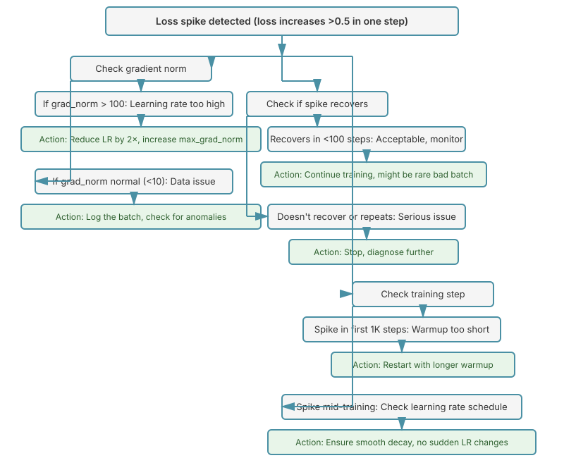

# Chapter 17: Optimizers and Training Techniques

This chapter covers the optimization techniques and best practices that enable stable, efficient training of large language models. Mastering these techniques is crucial for successful LLM training runs.

## Table of Contents

1. [Introduction](#introduction)
2. [Optimizers for LLM Training](#optimizers-for-llm-training)
   - [AdamW](#adamw)
   - [Optimizer Hyperparameters](#optimizer-hyperparameters)
   - [Alternative Optimizers](#alternative-optimizers)
3. [Learning Rate Schedules](#learning-rate-schedules)
   - [Warmup](#warmup)
   - [Cosine Decay Schedule](#cosine-decay-schedule)
   - [Warmup-Stable-Decay (WSD)](#warmup-stable-decay-wsd)
   - [Schedule Comparison](#schedule-comparison)
4. [Gradient Clipping](#gradient-clipping)
5. [Batch Size Scaling](#batch-size-scaling)
6. [Troubleshooting Training Issues](#troubleshooting-training-issues)
7. [Putting It All Together](#putting-it-all-together)
8. [Summary](#summary)
9. [References](#references)
10. [Exercises](#exercises)

---

## Introduction

Training large language models requires careful selection of optimization algorithms, learning rate schedules, and training hyperparameters. Small choices in these areas can mean the difference between successful training and divergence or poor final performance.

**Key Questions This Chapter Answers:**

- What optimizer should I use for LLM training?
- How should learning rates be scheduled during training?
- What optimizer settings work best for LLMs?
- How does batch size affect training efficiency?
- How do I prevent gradient explosions and training instability?

**Prerequisites:** This chapter assumes familiarity with:
- Basic gradient descent and backpropagation ([Chapter 15](15-lm-training.md))
- Distributed training concepts ([Chapter 16](16-distributed-training.md))
- Understanding of compute budgets and model sizing ([Chapter 18](18-scaling-dynamics.md))

---
## Optimizers for LLM Training

The choice of optimizer and its hyperparameters critically affects training stability and final model quality.

### AdamW

AdamW (Adam with decoupled Weight decay) is the standard optimizer for LLM training. It combines adaptive learning rates with proper weight decay regularization.

**Key Paper:** [Decoupled Weight Decay Regularization](https://arxiv.org/abs/1711.05101) (Loshchilov & Hutter, 2017)

#### Algorithm

AdamW maintains two moving averages for each parameter:
- $m_t$: First moment (mean of gradients)
- $v_t$: Second moment (uncentered variance of gradients)

$$
\begin{align}
m_t &= \beta_1 m_{t-1} + (1 - \beta_1) g_t \\
v_t &= \beta_2 v_{t-1} + (1 - \beta_2) g_t^2 \\
\hat{m}_t &= \frac{m_t}{1 - \beta_1^t} \\
\hat{v}_t &= \frac{v_t}{1 - \beta_2^t} \\
\theta_t &= \theta_{t-1} - \eta \left( \frac{\hat{m}_t}{\sqrt{\hat{v}_t} + \epsilon} + \lambda \theta_{t-1} \right)
\end{align}
$$

where:
- $g_t$ = gradient at step $t$
- $\beta_1, \beta_2$ = exponential decay rates for moments
- $\eta$ = learning rate
- $\lambda$ = weight decay coefficient
- $\epsilon$ = small constant for numerical stability

The key difference from Adam is that weight decay ($\lambda \theta_{t-1}$) is applied directly to parameters, not mixed with gradients.

#### Implementing AdamW from Scratch

**Problem:** We need an optimizer that combines adaptive learning rates (from Adam) with proper regularization (weight decay). The original Adam's approach of adding weight decay to the gradient (L2 regularization) doesn't work well with adaptive learning rates, leading to ineffective regularization.

**Theoretical Justification:**

The issue with standard Adam is that it applies weight decay as:
$$
g_t \leftarrow g_t + \lambda \theta_{t-1}
$$
This means weight decay gets scaled by the adaptive learning rate adjustment $\frac{1}{\sqrt{\hat{v}_t}}$, making it inconsistent across parameters with different gradient magnitudes.

AdamW fixes this by **decoupling** weight decay from the gradient:
$$
\theta_t \leftarrow \theta_{t-1} - \eta \left( \frac{\hat{m}_t}{\sqrt{\hat{v}_t} + \epsilon} \right) - \eta \lambda \theta_{t-1}
$$

This ensures weight decay operates directly on parameters with strength proportional only to the learning rate $\eta$, not to gradient statistics.

**How This Relates to Alternatives:**
- **SGD with momentum + L2**: Works well but no adaptive learning rates (struggles with LLMs' varying gradient scales)
- **Adam with L2**: Weight decay effectiveness varies wildly across parameters (poor regularization)
- **AdamW**: Best of both worlds - adaptive rates + consistent regularization

**Key Insights:**
1. **Bias correction** ($\frac{1}{1-\beta^t}$): Essential in early training when moving averages are biased toward zero
2. **Separate weight decay**: Applying $\lambda \theta$ directly ensures all parameters are regularized proportionally to their magnitude, not their gradient history
3. **Epsilon placement**: Added inside the square root for numerical stability when gradients are tiny

```python
import torch
import torch.nn as nn
from torch.optim import Optimizer

class AdamW(Optimizer):
    """
    AdamW optimizer implementation.

    Implements Adam with decoupled weight decay as described in
    "Decoupled Weight Decay Regularization" (Loshchilov & Hutter, 2017).

    This is a simplified educational implementation. For production,
    use torch.optim.AdamW.
    """

    def __init__(
        self,
        params,
        lr: float = 1e-3,
        betas: tuple[float, float] = (0.9, 0.999),
        eps: float = 1e-8,
        weight_decay: float = 0.01,
        amsgrad: bool = False
    ):
        """
        Args:
            params: Model parameters to optimize
            lr: Learning rate
            betas: Coefficients for computing running averages (β₁, β₂)
            eps: Term added to denominator for numerical stability (ε)
            weight_decay: Weight decay coefficient (λ)
            amsgrad: Whether to use AMSGrad variant
        """
        if lr < 0.0:
            raise ValueError(f"Invalid learning rate: {lr}")
        if not 0.0 <= betas[0] < 1.0:
            raise ValueError(f"Invalid beta1: {betas[0]}")
        if not 0.0 <= betas[1] < 1.0:
            raise ValueError(f"Invalid beta2: {betas[1]}")
        if not 0.0 <= eps:
            raise ValueError(f"Invalid epsilon: {eps}")
        if not 0.0 <= weight_decay:
            raise ValueError(f"Invalid weight_decay: {weight_decay}")

        defaults = dict(
            lr=lr,
            betas=betas,
            eps=eps,
            weight_decay=weight_decay,
            amsgrad=amsgrad
        )
        super().__init__(params, defaults)

    @torch.no_grad()
    def step(self, closure=None):
        """
        Perform a single optimization step.

        Args:
            closure: A closure that reevaluates the model and returns the loss
        """
        loss = None
        if closure is not None:
            with torch.enable_grad():
                loss = closure()

        for group in self.param_groups:
            beta1, beta2 = group['betas']

            for p in group['params']:
                if p.grad is None:
                    continue

                grad = p.grad
                if grad.is_sparse:
                    raise RuntimeError('AdamW does not support sparse gradients')

                state = self.state[p]

                # State initialization
                if len(state) == 0:
                    state['step'] = 0
                    # Exponential moving average of gradient values
                    state['exp_avg'] = torch.zeros_like(p)
                    # Exponential moving average of squared gradient values
                    state['exp_avg_sq'] = torch.zeros_like(p)
                    if group['amsgrad']:
                        # Maximum of exp_avg_sq
                        state['max_exp_avg_sq'] = torch.zeros_like(p)

                exp_avg, exp_avg_sq = state['exp_avg'], state['exp_avg_sq']

                state['step'] += 1

                # Decay the first and second moment running average coefficient
                exp_avg.mul_(beta1).add_(grad, alpha=1 - beta1)
                exp_avg_sq.mul_(beta2).addcmul_(grad, grad, value=1 - beta2)

                if group['amsgrad']:
                    max_exp_avg_sq = state['max_exp_avg_sq']
                    # Maintain max of all exp. moving avg. of sq. grad. values
                    torch.maximum(max_exp_avg_sq, exp_avg_sq, out=max_exp_avg_sq)
                    denom = max_exp_avg_sq.sqrt().add_(group['eps'])
                else:
                    denom = exp_avg_sq.sqrt().add_(group['eps'])

                # Bias correction
                step = state['step']
                bias_correction1 = 1 - beta1 ** step
                bias_correction2 = 1 - beta2 ** step
                step_size = group['lr'] / bias_correction1

                # Corrected second moment
                bias_corrected_denom = denom / (bias_correction2 ** 0.5)

                # Update parameters
                # AdamW: weight decay is decoupled
                p.mul_(1 - group['lr'] * group['weight_decay'])
                p.addcdiv_(exp_avg, bias_corrected_denom, value=-step_size)

        return loss


# Example usage
def train_with_adamw():
    """Example training loop with AdamW."""
    # Simple model
    model = nn.Sequential(
        nn.Linear(100, 256),
        nn.ReLU(),
        nn.Linear(256, 10)
    )

    # AdamW optimizer (use PyTorch's implementation in production)
    optimizer = torch.optim.AdamW(
        model.parameters(),
        lr=3e-4,
        betas=(0.9, 0.95),
        eps=1e-8,
        weight_decay=0.1
    )

    # Dummy data
    for step in range(100):
        x = torch.randn(32, 100)
        y = torch.randint(0, 10, (32,))

        # Forward pass
        logits = model(x)
        loss = nn.functional.cross_entropy(logits, y)

        # Backward pass
        optimizer.zero_grad()
        loss.backward()

        # Optimizer step
        optimizer.step()

        if step % 20 == 0:
            print(f"Step {step}, Loss: {loss.item():.4f}")
```

### Optimizer Hyperparameters

Choosing the right hyperparameters for AdamW is crucial for LLM training.

#### Standard Settings for LLMs

| Hyperparameter | Typical Value | Range | Notes |
|----------------|---------------|-------|-------|
| Learning rate ($\eta$) | 3e-4 | 1e-4 to 6e-4 | Varies with model size |
| $\beta_1$ | 0.9 | 0.9 to 0.95 | First moment decay |
| $\beta_2$ | 0.95 | 0.95 to 0.999 | Second moment decay |
| $\epsilon$ | 1e-8 | 1e-8 to 1e-6 | Numerical stability |
| Weight decay ($\lambda$) | 0.1 | 0.01 to 0.3 | Regularization strength |

**Notes on $\beta_2$:**
- GPT-3 used $\beta_2 = 0.95$ (more aggressive)
- Many models use $\beta_2 = 0.999$ (more conservative)
- Lower $\beta_2$ can help with training stability but may be noisier

#### Learning Rate Scaling with Model Size

Learning rate should generally decrease as model size increases. A common empirical formula:

$$
\eta \approx \frac{0.003}{\sqrt{N / 125\text{M}}}
$$

where $N$ is the number of parameters. This gives:

- **125M parameters**: LR ≈ 3e-4
- **1B parameters**: LR ≈ 1.06e-4
- **7B parameters**: LR ≈ 4e-5
- **70B parameters**: LR ≈ 1.3e-5

**In practice:**
- Small models (<1B): 3e-4 to 6e-4
- Medium models (1-10B): 1.5e-4 to 3e-4
- Large models (10-100B): 8e-5 to 1.5e-4
- Very large models (>100B): 4e-5 to 8e-5

```python
def compute_optimal_lr(n_params: float, base_lr: float = 3e-4, base_params: float = 125e6) -> float:
    """
    Compute optimal learning rate based on model size.

    Args:
        n_params: Number of model parameters
        base_lr: Base learning rate for base_params model
        base_params: Reference model size

    Returns:
        Scaled learning rate
    """
    scale_factor = (base_params / n_params) ** 0.5
    return base_lr * scale_factor


# Examples
print("Learning Rate Recommendations by Model Size:")
for size in [125e6, 350e6, 1e9, 7e9, 13e9, 70e9]:
    lr = compute_optimal_lr(size)
    print(f"  {size/1e9:.2f}B params: LR = {lr:.2e}")
```

These values are starting points; always validate with small-scale experiments before full training runs.

```python
def get_optimizer_config(model_size: str) -> dict:
    """
    Get recommended optimizer configuration based on model size.

    Args:
        model_size: One of 'small' (<1B), 'medium' (1-10B), 'large' (>10B)

    Returns:
        Dictionary of optimizer hyperparameters
    """
    configs = {
        'small': {
            'lr': 6e-4,
            'betas': (0.9, 0.999),
            'eps': 1e-8,
            'weight_decay': 0.1,
        },
        'medium': {
            'lr': 3e-4,
            'betas': (0.9, 0.95),
            'eps': 1e-8,
            'weight_decay': 0.1,
        },
        'large': {
            'lr': 1.2e-4,
            'betas': (0.9, 0.95),
            'eps': 1e-8,
            'weight_decay': 0.1,
        }
    }

    if model_size not in configs:
        raise ValueError(f"Unknown model size: {model_size}")

    return configs[model_size]
```

### Alternative Optimizers

While AdamW dominates, several alternatives show promise. See [Hardware, Quantization, and Training Optimization](32-hardware-quantization-optimization.md) for detailed coverage of Muon, Shampoo, and SOAP optimizers.

#### Muon Optimizer

**Muon** is a recent optimizer (2024) that combines momentum for weight matrices with Adam for other parameters, achieving roughly 2× training efficiency.

**Key innovation:**
- Uses **momentum-based updates** (not adaptive) for large weight matrices (linear layers, attention weights)
- Falls back to **Adam** for biases, LayerNorm parameters, and embeddings
- Applies **Nesterov momentum** with orthogonalization to prevent gradient explosion

**Why it works:**
- Weight matrices benefit from momentum's implicit regularization
- Simpler updates reduce computation and memory bandwidth
- Newton-Schulz orthogonalization (5 iterations) stabilizes momentum

**Typical settings:**
- Momentum: μ = 0.95
- Learning rate: 10× higher than AdamW (e.g., 3e-3 instead of 3e-4)
- Still use warmup and decay schedules

**Trade-offs:**
- ~2× faster convergence per step
- Slightly more complex implementation
- Best for models where matmuls dominate (transformers)

For full implementation details and empirical comparisons, see Chapter 31.

**Quick comparison:**

| Optimizer | Pros | Cons | Use Case |
|-----------|------|------|----------|
| **AdamW** | Stable, well-tested | Memory overhead (2× params) | Default choice |
| **Muon** | 2× efficiency for hidden layers | Only for weight matrices | Cutting-edge research |
| **Shampoo** | Better conditioning | High memory, expensive | When quality > cost |
| **SGD + Momentum** | Low memory | Requires careful tuning | Memory-constrained |

---

## Learning Rate Schedules

The learning rate schedule dramatically affects both training stability and final model quality. Modern LLM training uses sophisticated schedules with warmup and decay phases.

### Warmup

**Why warmup?** Starting with a high learning rate can destabilize training in the early steps when:
- Model parameters are randomly initialized
- Gradients can be very large and unstable
- Adam's second moment estimates are inaccurate

**Warmup phase:** Linearly increase learning rate from 0 (or small value) to maximum over initial steps.

$$
\eta(t) = \eta_{\max} \cdot \min\left(1, \frac{t}{T_{\text{warmup}}}\right) \quad \text{for } t \leq T_{\text{warmup}}
$$

**Typical warmup duration:**
- 1,000 to 2,000 steps for small models
- 2,000 to 5,000 steps for large models
- Usually <1% of total training steps

#### Understanding Warmup Theory

**Problem:** Without warmup, training often diverges in the first few hundred steps, with loss spikes or NaN values. Why does starting with the target learning rate fail?

**Theoretical Justification:**

Three factors make early training unstable:

1. **Random initialization bias**: Parameters start far from optimal values, creating large gradients with high variance
2. **Adam's moment estimates**: The second moment $v_t$ starts at zero, leading to overly aggressive learning rates initially (division by small $\sqrt{v_t}$)
3. **Distribution shift**: As the model quickly adapts early on, the effective data distribution changes rapidly, making large steps dangerous

Warmup addresses these by:
- Giving Adam's variance estimates time to stabilize ($v_t$ needs ~100-1000 steps to become reliable)
- Preventing large parameter updates when gradient direction is uncertain
- Allowing the model to find a reasonable basin before accelerating

Mathematically, warmup acts as a time-varying regularization strength that decreases as we gain confidence in gradient directions.

**How This Relates to Alternatives:**
- **No warmup**: Works for convex problems or very small learning rates, fails for LLMs
- **Lower max LR**: Could avoid instability but sacrifices final convergence speed
- **Gradient clipping only**: Helps but doesn't address the moment estimation problem in Adam
- **Warmup**: Directly targets the root cause (unreliable early gradients/statistics)

**Key Insight:** Warmup is not about the model needing to "wake up" - it's about giving the optimizer's internal statistics (especially $v_t$ in Adam) time to become reliable estimates of the true gradient variance.

**Choosing warmup duration:**

Several heuristics help determine appropriate warmup length:

1. **Token-based**: Aim for ~375M tokens during warmup
   - For batch size 4M tokens: warmup = 375M / 4M ≈ 100 steps
   - For batch size 2M tokens: warmup = 375M / 2M ≈ 190 steps

2. **Step-based**: Use a fraction of total steps
   - `warmup_steps = max(2000, 0.02 × total_steps)`
   - Ensures minimum 2K steps, scales with training length

3. **Conservative approach**: When in doubt, use longer warmup
   - Small models (<1B): 2,000 steps
   - Medium models (1-10B): 3,000-4,000 steps
   - Large models (>10B): 4,000-5,000 steps

**Why these values?**
- Too short: Early instability, loss spikes
- Too long: Wastes training time, slower convergence
- The ~375M token heuristic comes from empirical observation that models stabilize after seeing this amount of data

```python
class WarmupSchedule:
    """
    Learning rate warmup schedule.

    Linearly increases learning rate from 0 to max_lr over warmup_steps.
    """

    def __init__(self, max_lr: float, warmup_steps: int):
        self.max_lr = max_lr
        self.warmup_steps = warmup_steps

    def get_lr(self, step: int) -> float:
        """Get learning rate at given step."""
        if step < self.warmup_steps:
            # Linear warmup
            return self.max_lr * step / self.warmup_steps
        return self.max_lr


# Visualize warmup
def plot_warmup():
    import matplotlib.pyplot as plt

    warmup = WarmupSchedule(max_lr=3e-4, warmup_steps=2000)

    steps = range(5000)
    lrs = [warmup.get_lr(s) for s in steps]

    plt.figure(figsize=(10, 4))
    plt.plot(steps, lrs)
    plt.axvline(x=2000, color='r', linestyle='--', alpha=0.5, label='Warmup end')
    plt.xlabel('Step')
    plt.ylabel('Learning Rate')
    plt.title('Learning Rate Warmup')
    plt.legend()
    plt.grid(True, alpha=0.3)
    plt.tight_layout()
    plt.savefig('warmup_schedule.png', dpi=150, bbox_inches='tight')
    plt.show()
```

### Cosine Decay Schedule

The cosine schedule is the most common choice for LLM pretraining. It smoothly decays learning rate following a cosine curve.

**Key Paper:** [SGDR: Stochastic Gradient Descent with Warm Restarts](https://arxiv.org/abs/1608.03983) (Loshchilov & Hutter, 2016)

**Formula:** After warmup, learning rate follows:

$$
\eta(t) = \eta_{\min} + \frac{1}{2}(\eta_{\max} - \eta_{\min})\left(1 + \cos\left(\frac{t - T_{\text{warmup}}}{T_{\text{total}} - T_{\text{warmup}}} \pi\right)\right)
$$

where:
- $t$ = current step
- $T_{\text{warmup}}$ = warmup steps
- $T_{\text{total}}$ = total training steps
- $\eta_{\max}$ = maximum learning rate (peak LR)
- $\eta_{\min}$ = minimum learning rate (usually 0.1× max LR)

**Properties:**
- Smooth decay (no sharp drops)
- Fast decay initially, then gradual
- Reaches minimum exactly at final step
- Requires knowing total training steps in advance

#### Why Cosine Decay Works

**Problem:** After warmup, we need to reduce the learning rate over time to achieve good final performance. A constant learning rate overshoots the optimum; too-rapid decay converges to suboptimal solutions. What decay schedule balances exploration and convergence?

**Theoretical Justification:**

Cosine decay has several desirable properties:

1. **Smooth, continuous decay**: No sudden LR drops that could destabilize training
2. **Fast initial decay**: Learning rate drops quickly from peak, corresponding to when gradients are noisiest
3. **Slow final decay**: Near the end, LR decreases very gradually, allowing fine-tuning
4. **Mathematical elegance**: The cosine function naturally provides these properties

The schedule can be viewed as an **annealing strategy**: we start with large steps for rapid exploration, then gradually shrink steps as we approach a good solution, similar to simulated annealing in optimization.

**Why not linear decay?** Linear schedules decay too aggressively early and not enough late:
$$
\text{Linear: } \eta(t) = \eta_{\max}(1 - t/T) \text{ vs. Cosine: } \eta(t) \propto \frac{1}{2}(1 + \cos(\pi t/T))
$$
At $t = 0.5T$, linear is at 50% of max LR, while cosine is at ~50%. But early on (t = 0.1T), linear is at 90% while cosine is at ~97%, preserving exploration longer.

**How This Relates to Alternatives:**
- **Constant LR**: Fast early progress but poor final convergence (overshoots)
- **Step decay**: Sudden LR drops can cause loss spikes and suboptimal convergence
- **Exponential decay**: $\eta_t = \eta_0 e^{-\lambda t}$ decays too fast, never reaches true minimum
- **Linear decay**: Too aggressive early, too gentle late
- **Cosine decay**: Empirically proven best across many domains (ImageNet, LLMs, etc.)

**Key Insight:** The cosine curve's natural acceleration of decay as we approach zero matches the optimization landscape of neural networks, where we want aggressive exploration early (when far from optimum) and careful fine-tuning late (when close to optimum).

```python
import math

class CosineDecaySchedule:
    """
    Cosine decay learning rate schedule with warmup.

    Used by: GPT-3, LLaMA, Chinchilla, and most major LLMs.
    """

    def __init__(
        self,
        max_lr: float,
        min_lr: float,
        warmup_steps: int,
        total_steps: int
    ):
        """
        Args:
            max_lr: Maximum learning rate (after warmup)
            min_lr: Minimum learning rate (at end). Usually 0.1 * max_lr
            warmup_steps: Number of warmup steps
            total_steps: Total training steps
        """
        self.max_lr = max_lr
        self.min_lr = min_lr
        self.warmup_steps = warmup_steps
        self.total_steps = total_steps

        if warmup_steps >= total_steps:
            raise ValueError("warmup_steps must be < total_steps")

    def get_lr(self, step: int) -> float:
        """Get learning rate at given step."""
        if step < self.warmup_steps:
            # Linear warmup
            return self.max_lr * step / self.warmup_steps

        # Cosine decay
        progress = (step - self.warmup_steps) / (self.total_steps - self.warmup_steps)
        progress = min(progress, 1.0)  # Clamp to [0, 1]

        cosine_decay = 0.5 * (1 + math.cos(math.pi * progress))
        return self.min_lr + (self.max_lr - self.min_lr) * cosine_decay


def plot_cosine_schedule():
    """Visualize cosine decay schedule."""
    import matplotlib.pyplot as plt

    schedule = CosineDecaySchedule(
        max_lr=3e-4,
        min_lr=3e-5,
        warmup_steps=2000,
        total_steps=100000
    )

    steps = range(100000)
    lrs = [schedule.get_lr(s) for s in steps]

    plt.figure(figsize=(12, 4))
    plt.plot(steps, lrs, linewidth=2)
    plt.axvline(x=2000, color='r', linestyle='--', alpha=0.5, label='Warmup end')
    plt.xlabel('Training Step')
    plt.ylabel('Learning Rate')
    plt.title('Cosine Decay Schedule with Warmup')
    plt.legend()
    plt.grid(True, alpha=0.3)
    plt.tight_layout()
    plt.savefig('cosine_schedule.png', dpi=150, bbox_inches='tight')
    plt.show()


# PyTorch implementation helper
def get_cosine_schedule_with_warmup(
    optimizer,
    num_warmup_steps: int,
    num_training_steps: int,
    num_cycles: float = 0.5,
    last_epoch: int = -1
):
    """
    Create cosine schedule with warmup for PyTorch optimizer.

    This is similar to transformers.get_cosine_schedule_with_warmup.

    Args:
        optimizer: PyTorch optimizer
        num_warmup_steps: Warmup steps
        num_training_steps: Total training steps
        num_cycles: Number of cosine cycles (0.5 = decay to 0)
        last_epoch: Last epoch index
    """
    from torch.optim.lr_scheduler import LambdaLR

    def lr_lambda(current_step: int):
        if current_step < num_warmup_steps:
            # Warmup
            return float(current_step) / float(max(1, num_warmup_steps))

        # Cosine decay
        progress = float(current_step - num_warmup_steps) / float(
            max(1, num_training_steps - num_warmup_steps)
        )
        return max(
            0.0,
            0.5 * (1.0 + math.cos(math.pi * float(num_cycles) * 2.0 * progress))
        )

    return LambdaLR(optimizer, lr_lambda, last_epoch)
```

### Warmup-Stable-Decay (WSD)

WSD is a newer schedule gaining popularity for its flexibility and empirical performance.

**Key Paper:** [MiniCPM: Unveiling the Potential of Small Language Models](https://arxiv.org/abs/2404.06395) (Hu et al., 2024)

**Three phases:**
1. **Warmup**: Linear increase to max LR
2. **Stable**: Constant at max LR (majority of training)
3. **Decay**: Gradual decrease to min LR (usually final 10%)

**Advantages over cosine:**
- Don't need to know total steps in advance
- Can continue training from any stable-phase checkpoint
- Empirically achieves lower loss than cosine
- More flexible for continued training

**Decay variants:**
- **Linear**: $\eta(t) = \eta_{\max}(1 - p)$ where $p$ is decay progress
- **Square root**: $\eta(t) = \eta_{\max}(1 - \sqrt{p})$ (recommended)
- **Cosine**: Same as cosine schedule but only over decay phase

#### Why WSD Outperforms Cosine

**Problem:** Cosine schedules require knowing the total training steps in advance. In practice, we often want to extend training if the model hasn't converged, or we may discover we have more compute than expected. Continuing training from a low learning rate checkpoint is suboptimal.

**Theoretical Justification:**

WSD's key innovation is **separating learning phases** to match the training dynamics:

1. **Stable phase rationale**: For most of training (typically 80-90%), the model is learning the main task structure. Keeping LR constant during this phase:
   - Maximizes progress per step
   - Avoids premature convergence to suboptimal solutions
   - Allows the model to fully explore the loss landscape

2. **Decay phase rationale**: Only in the final ~10% do we want to reduce LR for fine-tuning:
   - By this point, the model has found a good basin
   - Lower LR helps refine the solution without large jumps
   - Too early decay wastes training time in high-loss regions with a low LR

**Why square root decay?** The $1 - \sqrt{p}$ decay gives:
- At $p = 0.25$: LR at 50% (rapid initial decay)
- At $p = 0.75$: LR at 13% (still decreasing meaningfully)
- At $p = 1.0$: LR at 0% (smooth landing)

This is more aggressive than cosine over the same decay period, which makes sense because we're only decaying for 10% of total training (vs cosine's ~100%).

**How This Relates to Alternatives:**
- **Cosine**: Better if you know exact training budget and won't extend
- **WSD**: Better for:
  - Uncertain training budgets
  - Experiments where you may want to continue
  - Checkpoint flexibility (can resume from stable phase anytime)
- **Constant LR**: Simpler but leaves performance on the table (no final refinement)

**Key Insight:** WSD achieves lower final loss than cosine in most experiments because it maintains high LR longer (during stable phase), then decays more aggressively in the final stretch. This matches the "explore first, refine later" principle more explicitly than cosine's continuous decay.

```python
class WSDSchedule:
    """
    Warmup-Stable-Decay (WSD) learning rate schedule.

    Three phases:
    1. Warmup: Linear increase (e.g., 2K steps)
    2. Stable: Constant LR (e.g., 90% of training)
    3. Decay: Smooth decrease (e.g., 10% of training)

    Reference: MiniCPM (Hu et al., 2024)
    """

    def __init__(
        self,
        max_lr: float,
        min_lr: float,
        warmup_steps: int,
        stable_steps: int,
        decay_steps: int,
        decay_type: str = 'sqrt'
    ):
        """
        Args:
            max_lr: Maximum learning rate
            min_lr: Minimum learning rate (can be 0)
            warmup_steps: Warmup duration
            stable_steps: Stable phase duration
            decay_steps: Decay phase duration (typically 10% of total)
            decay_type: 'linear', 'sqrt', or 'cosine'
        """
        self.max_lr = max_lr
        self.min_lr = min_lr
        self.warmup_steps = warmup_steps
        self.stable_steps = stable_steps
        self.decay_steps = decay_steps
        self.decay_type = decay_type

        self.stable_end = warmup_steps + stable_steps
        self.total_steps = self.stable_end + decay_steps

    def get_lr(self, step: int) -> float:
        """Get learning rate at given step."""
        if step < self.warmup_steps:
            # Warmup phase
            return self.max_lr * step / self.warmup_steps

        if step < self.stable_end:
            # Stable phase
            return self.max_lr

        # Decay phase
        decay_progress = (step - self.stable_end) / self.decay_steps
        decay_progress = min(decay_progress, 1.0)

        if self.decay_type == 'linear':
            decay_factor = 1 - decay_progress
        elif self.decay_type == 'sqrt':
            decay_factor = 1 - math.sqrt(decay_progress)
        elif self.decay_type == 'cosine':
            decay_factor = 0.5 * (1 + math.cos(math.pi * decay_progress))
        else:
            raise ValueError(f"Unknown decay type: {self.decay_type}")

        return self.min_lr + (self.max_lr - self.min_lr) * decay_factor

    def can_extend_training(self, current_step: int) -> bool:
        """Check if training can be extended without penalty."""
        # Can extend anytime during stable phase
        return self.warmup_steps <= current_step < self.stable_end


def plot_wsd_schedule():
    """Visualize WSD schedule."""
    import matplotlib.pyplot as plt

    schedule = WSDSchedule(
        max_lr=3e-4,
        min_lr=0,
        warmup_steps=2000,
        stable_steps=88000,
        decay_steps=10000,
        decay_type='sqrt'
    )

    steps = range(100000)
    lrs = [schedule.get_lr(s) for s in steps]

    plt.figure(figsize=(12, 4))
    plt.plot(steps, lrs, linewidth=2)
    plt.axvline(x=2000, color='r', linestyle='--', alpha=0.5, label='Warmup end')
    plt.axvline(x=90000, color='orange', linestyle='--', alpha=0.5, label='Stable end')
    plt.axhspan(3e-4 * 0.95, 3e-4, alpha=0.2, color='green', label='Stable phase')
    plt.xlabel('Training Step')
    plt.ylabel('Learning Rate')
    plt.title('Warmup-Stable-Decay (WSD) Schedule')
    plt.legend()
    plt.grid(True, alpha=0.3)
    plt.tight_layout()
    plt.savefig('wsd_schedule.png', dpi=150, bbox_inches='tight')
    plt.show()


def compare_wsd_variants():
    """Compare different WSD decay types."""
    import matplotlib.pyplot as plt

    schedules = {
        'Linear': WSDSchedule(3e-4, 0, 2000, 88000, 10000, 'linear'),
        'Square Root': WSDSchedule(3e-4, 0, 2000, 88000, 10000, 'sqrt'),
        'Cosine': WSDSchedule(3e-4, 0, 2000, 88000, 10000, 'cosine'),
    }

    steps = range(85000, 100000)  # Focus on decay phase

    plt.figure(figsize=(10, 5))
    for name, schedule in schedules.items():
        lrs = [schedule.get_lr(s) for s in steps]
        plt.plot(steps, lrs, label=name, linewidth=2)

    plt.axvline(x=90000, color='gray', linestyle='--', alpha=0.5, label='Decay start')
    plt.xlabel('Training Step')
    plt.ylabel('Learning Rate')
    plt.title('WSD Decay Type Comparison')
    plt.legend()
    plt.grid(True, alpha=0.3)
    plt.tight_layout()
    plt.savefig('wsd_variants.png', dpi=150, bbox_inches='tight')
    plt.show()
```

### Schedule Comparison

| Schedule | Pros | Cons | Use Case |
|----------|------|------|----------|
| **Cosine** | Smooth, well-tested | Requires knowing total steps | Fixed training budget |
| **WSD** | Flexible, better empirical results | More hyperparameters | Uncertain compute budget |
| **Linear** | Simple | Abrupt changes | Research/debugging |
| **Constant** | No tuning needed | Poor final performance | Short runs only |

**Modern recommendations:**
- **Pretraining**: WSD with sqrt decay (10% decay phase)
- **Fine-tuning**: Cosine or linear (shorter runs, fixed steps)
- **Research**: WSD for flexibility in extending runs

---

## Gradient Clipping

Gradient clipping prevents training instability from exploding gradients by capping gradient norms.

### Why Gradient Clipping?

Large gradients can cause:
- Parameter updates that overshoot optimal values
- Loss spikes and training divergence
- NaN/Inf values propagating through the network

**Common in LLMs** due to:
- Long sequences create deep computational graphs
- Attention mechanisms can amplify gradients
- Large batch sizes increase gradient variance

### Gradient Norm Clipping

The most common approach: scale gradients if total norm exceeds threshold.

**Algorithm:**

$$
\text{if } \|\mathbf{g}\| > \tau: \quad \mathbf{g} \leftarrow \frac{\tau \mathbf{g}}{\|\mathbf{g}\|}
$$

where:
- $\mathbf{g}$ = gradient vector (all parameters)
- $\tau$ = clipping threshold (typically 1.0 for LLMs)
- $\|\mathbf{g}\|$ = $L^2$ norm of gradients

#### Understanding Gradient Clipping

**Problem:** Even with careful learning rate tuning, occasional batches produce extremely large gradients that cause training to diverge. We need a safety mechanism that prevents catastrophic updates without interfering with normal training.

**Theoretical Justification:**

Gradient clipping works by ensuring no single update can move parameters too far:

1. **Preserves direction**: By rescaling instead of truncating, we maintain the gradient direction (where to move) while limiting magnitude (how far to move)

2. **Global vs per-parameter**: Using global norm ($\|\mathbf{g}\|$ across all parameters) rather than per-parameter clipping ensures:
   - Relative magnitudes between parameters are preserved
   - Small but important gradients aren't clipped unfairly
   - The update direction in parameter space is maintained

3. **Adaptive threshold**: The effective threshold adapts to the model:
   - Early training: gradients are large, clipping activates frequently
   - Late training: gradients are small, clipping rarely triggers
   - This automatic adaptation is why a fixed $\tau = 1.0$ works across model sizes

**Why does gradient explosion happen?**
- **Long sequences**: In transformers, gradients flow through many layers; numerical errors accumulate
- **Attention amplification**: Attention weights can focus heavily on few tokens, amplifying their gradients
- **Rare tokens/patterns**: Unusual inputs can produce atypical activation patterns with large gradients
- **Numerical precision**: FP16 has limited range; intermediate values can overflow

**How This Relates to Alternatives:**
- **No clipping**: Training fails completely on many LLM runs (diverges to NaN)
- **Per-parameter clipping**: `clip(g_i, -τ, τ)` distorts gradient direction, poor performance
- **Value clipping**: `clip(θ_i, min, max)` prevents divergence but limits model capacity
- **Gradient norm clipping**: Best of all - safe, direction-preserving, widely used

**Key Insight:** Think of gradient clipping as a "circuit breaker" for optimization. It almost never activates during healthy training (5-15% of steps), but when it does, it prevents a single bad batch from destroying hours of training. The threshold τ = 1.0 is remarkably universal because it's measured in the natural units of the optimizer's momentum-normalized gradient space.

```python
import torch
import torch.nn as nn

def clip_grad_norm(
    parameters,
    max_norm: float,
    norm_type: float = 2.0
) -> float:
    """
    Clip gradient norm of model parameters.

    Args:
        parameters: Model parameters (or iterable of Tensors)
        max_norm: Maximum norm threshold
        norm_type: Type of norm (2.0 for L2 norm)

    Returns:
        Total norm before clipping
    """
    if isinstance(parameters, torch.Tensor):
        parameters = [parameters]

    parameters = [p for p in parameters if p.grad is not None]

    max_norm = float(max_norm)
    norm_type = float(norm_type)

    if len(parameters) == 0:
        return torch.tensor(0.)

    device = parameters[0].grad.device

    # Compute total norm
    if norm_type == float('inf'):
        # Max norm
        total_norm = max(p.grad.data.abs().max() for p in parameters)
    else:
        # L^p norm
        total_norm = torch.norm(
            torch.stack([
                torch.norm(p.grad.data, norm_type)
                for p in parameters
            ]),
            norm_type
        )

    # Clip
    clip_coef = max_norm / (total_norm + 1e-6)
    if clip_coef < 1:
        for p in parameters:
            p.grad.data.mul_(clip_coef)

    return total_norm


# Usage in training loop
def training_step_with_clipping(model, optimizer, batch, max_grad_norm=1.0):
    """Training step with gradient clipping."""
    # Forward pass
    loss = model(batch)

    # Backward pass
    optimizer.zero_grad()
    loss.backward()

    # Gradient clipping (BEFORE optimizer step)
    total_norm = torch.nn.utils.clip_grad_norm_(
        model.parameters(),
        max_norm=max_grad_norm
    )

    # Optimizer step
    optimizer.step()

    return loss.item(), total_norm.item()


# Monitor gradient norms
class GradientMonitor:
    """Monitor gradient statistics during training."""

    def __init__(self, window_size: int = 100):
        self.window_size = window_size
        self.norms = []
        self.clipped_count = 0
        self.total_count = 0

    def update(self, grad_norm: float, max_norm: float):
        """Update statistics."""
        self.norms.append(grad_norm)
        if len(self.norms) > self.window_size:
            self.norms.pop(0)

        self.total_count += 1
        if grad_norm > max_norm:
            self.clipped_count += 1

    def get_stats(self) -> dict:
        """Get gradient statistics."""
        if not self.norms:
            return {}

        return {
            'mean_norm': sum(self.norms) / len(self.norms),
            'max_norm': max(self.norms),
            'min_norm': min(self.norms),
            'clip_rate': self.clipped_count / max(1, self.total_count)
        }
```

**Recommended settings:**
- **max_norm = 1.0**: Standard for most LLMs (GPT-3, LLaMA, etc.)
- **max_norm = 0.5**: More aggressive, for unstable training
- **max_norm = 5.0**: More lenient, for stable models

**Monitoring:** Track clipping frequency. If >50% of steps clip, consider:
- Reducing learning rate
- Increasing warmup duration
- Checking for data quality issues

---

## Batch Size Scaling

Batch size affects both training speed and model quality. Finding the right balance is crucial.

### Effective Batch Size

The **effective batch size** is the total number of examples used per optimizer step:

$$
B_{\text{eff}} = B_{\text{micro}} \times N_{\text{acc}} \times N_{\text{devices}}
$$

where:
- $B_{\text{micro}}$ = batch size per device (limited by memory)
- $N_{\text{acc}}$ = gradient accumulation steps
- $N_{\text{devices}}$ = number of GPUs/TPUs

### Critical Batch Size

The **critical batch size** is the point beyond which increasing batch size gives diminishing returns.

**Key insight:** There's a sweet spot where:
- Below critical: larger batches improve efficiency
- Above critical: larger batches waste compute (no quality improvement)

**Typical values for LLMs:**
- Small models (<1B): 0.5M - 1M tokens
- Medium models (1-10B): 2M - 4M tokens
- Large models (>10B): 4M - 8M tokens

#### Critical Batch Size Formula

From McCandlish et al. (2018), the critical batch size can be estimated as:

$$
B_{\text{crit}} \approx \left(\frac{G_{\text{noise}}}{\eta}\right)^2
$$

where:
- $G_{\text{noise}}$ = gradient noise scale (measures gradient variance)
- $\eta$ = learning rate

**Gradient noise scale** measures how noisy gradients are:

$$
G_{\text{noise}} = \frac{\|\mathbb{E}[\mathbf{g}]\|^2}{\text{Var}[\mathbf{g}]}
$$

**Practical implications:**
- Higher learning rate → smaller critical batch size
- Noisier gradients → larger critical batch size needed
- As training progresses, $G_{\text{noise}}$ typically decreases

#### Understanding Critical Batch Size

**Problem:** Larger batches improve hardware efficiency (better GPU utilization), but beyond a certain point, they don't improve model quality. Finding this "critical batch size" is essential for efficient training.

**Theoretical Justification:**

The critical batch size concept comes from analyzing the **noise in stochastic gradients**:

1. **Signal-to-noise ratio**: Each gradient is noisy estimate of true gradient. The "signal" is $\|\mathbb{E}[\mathbf{g}]\|^2$ (true gradient), while "noise" is $\text{Var}[\mathbf{g}]$ (variance across batches)

2. **Batch size effect**: Larger batches reduce noise by $1/\sqrt{B}$ (Central Limit Theorem), so:
   $$
   \text{Effective noise} \propto \frac{\text{Var}[\mathbf{g}]}{B}
   $$

3. **Learning rate interaction**: Higher LR amplifies both signal and noise. The critical batch size occurs when:
   $$
   \frac{\eta^2 \text{Var}[\mathbf{g}]}{B} \approx \|\mathbb{E}[\mathbf{g}]\|^2
   $$

   Solving for $B$:
   $$
   B_{\text{crit}} \approx \frac{\eta^2 \text{Var}[\mathbf{g}]}{\|\mathbb{E}[\mathbf{g}]\|^2} = \left(\frac{G_{\text{noise}}}{\eta}\right)^2
   $$

**What happens at different batch sizes?**
- **$B < B_{\text{crit}}$**: Gradient noise dominates, can't increase LR safely, leaving performance on table
- **$B = B_{\text{crit}}$**: Optimal trade-off between noise reduction and parallelism
- **$B > B_{\text{crit}}$**: Noise is already small enough; larger batches don't help convergence (just waste compute)

**How This Relates to Alternatives:**
- **Very small batches** (B = 1-32): Maximum noise, requires tiny LR, slow convergence
- **Medium batches** (B = 256-2048): Good for small models, below critical for LLMs
- **Large batches** (B = 4096+): Necessary for LLMs to reach critical batch size
- **Too large batches**: Waste compute with no quality improvement (generalization can even degrade)

**Key Insight:** The critical batch size is not a fixed number - it depends on where you are in training! Early on, gradients are large and noisy ($G_{\text{noise}}$ is high), so $B_{\text{crit}}$ is large. Later, as gradients become smaller and more aligned, $B_{\text{crit}}$ decreases. This is why some advanced schedules decrease batch size during training, though this is rare in practice due to implementation complexity.

```python
import torch

def estimate_gradient_noise_scale(
    model: torch.nn.Module,
    data_loader,
    n_samples: int = 100
) -> float:
    """
    Estimate gradient noise scale from sample gradients.

    This helps determine the critical batch size.

    Args:
        model: The model to analyze
        data_loader: Data loader (use small batches)
        n_samples: Number of gradient samples to collect

    Returns:
        Gradient noise scale estimate
    """
    model.eval()
    gradients = []

    for i, batch in enumerate(data_loader):
        if i >= n_samples:
            break

        # Compute gradient for this mini-batch
        model.zero_grad()
        loss = model(batch)
        loss.backward()

        # Flatten and collect gradients
        grad = torch.cat([
            p.grad.flatten() for p in model.parameters() if p.grad is not None
        ])
        gradients.append(grad)

    # Stack gradients: [n_samples, n_params]
    gradients = torch.stack(gradients)

    # Compute mean and variance
    mean_grad = gradients.mean(dim=0)
    var_grad = gradients.var(dim=0)

    # Gradient noise scale
    signal = (mean_grad ** 2).sum()
    noise = var_grad.sum()

    g_noise = (signal / noise).item()

    return g_noise


def compute_critical_batch_size(
    gradient_noise_scale: float,
    learning_rate: float
) -> float:
    """
    Compute critical batch size given gradient noise scale and LR.

    Args:
        gradient_noise_scale: Estimated G_noise
        learning_rate: Training learning rate

    Returns:
        Critical batch size (in examples)
    """
    return (gradient_noise_scale / learning_rate) ** 2


# Example
print("Critical Batch Size Estimation:")
print("For LR = 3e-4, G_noise = 1e-3:")
print(f"  B_crit = {compute_critical_batch_size(1e-3, 3e-4):.0f} examples")
print("\nFor LR = 1e-4, G_noise = 1e-3:")
print(f"  B_crit = {compute_critical_batch_size(1e-3, 1e-4):.0f} examples")
```

**Using critical batch size:**
1. **Below $B_{\text{crit}}$**: Increase batch size for better efficiency
2. **At $B_{\text{crit}}$**: Optimal training speed vs. compute trade-off
3. **Above $B_{\text{crit}}$**: Diminishing returns; consider increasing LR instead

**Note:** Critical batch size changes during training as gradients become less noisy. It's typically measured early in training.

```python
class BatchSizeCalculator:
    """Calculate optimal batch size configurations."""

    def __init__(
        self,
        gpu_memory_gb: float,
        model_params: float,
        sequence_length: int,
        dtype_bytes: int = 2  # 2 for FP16/BF16
    ):
        self.gpu_memory_gb = gpu_memory_gb
        self.model_params = model_params
        self.sequence_length = sequence_length
        self.dtype_bytes = dtype_bytes

    def max_micro_batch_size(self, use_activation_checkpointing: bool = False) -> int:
        """
        Estimate maximum micro batch size that fits in GPU memory.

        This is a rough approximation for planning purposes only.
        For precise estimates, see the Megatron-LM paper or use profiling tools.

        Actual memory usage depends on:
        - Activation recomputation (checkpointing)
        - Optimizer states
        - Framework overhead
        - Attention implementation (Flash Attention reduces memory)

        Args:
            use_activation_checkpointing: If True, assumes gradient checkpointing
                                          which trades compute for memory
        """
        # Model parameters (in bytes)
        model_memory = self.model_params * self.dtype_bytes

        # Optimizer states (Adam: 2x parameters for m and v)
        optimizer_memory = 2 * self.model_params * 4  # FP32

        # Gradients (same as parameters)
        gradient_memory = model_memory

        # Activations (very rough estimate: 12 * batch * seq * hidden)
        # This is highly approximate
        hidden_size = (self.model_params / (12 * 32)) ** 0.5  # Rough estimate
        activation_per_token = 12 * hidden_size

        # Activation checkpointing reduces memory by ~L (number of layers)
        # Typical transformer has ~32 layers, so ~4-5x reduction
        if use_activation_checkpointing:
            activation_per_token = activation_per_token / 4

        # Available memory (leave 20% headroom)
        available = self.gpu_memory_gb * 1e9 * 0.8

        # Memory for static components
        static_memory = model_memory + optimizer_memory + gradient_memory

        # Remaining for activations
        activation_budget = available - static_memory

        if activation_budget <= 0:
            return 0

        # Compute max batch size
        max_batch = int(
            activation_budget / (self.sequence_length * activation_per_token * self.dtype_bytes)
        )

        return max(1, max_batch)

    def compute_gradient_accumulation(
        self,
        target_batch_size: int,
        micro_batch_size: int,
        n_gpus: int
    ) -> int:
        """
        Compute required gradient accumulation steps.

        Args:
            target_batch_size: Desired effective batch size
            micro_batch_size: Batch size per GPU
            n_gpus: Number of GPUs

        Returns:
            Number of gradient accumulation steps needed
        """
        total_per_step = micro_batch_size * n_gpus
        grad_acc_steps = max(1, target_batch_size // total_per_step)
        return grad_acc_steps


# Example configurations
def print_batch_configurations():
    """Print example batch configurations for different model sizes."""
    configs = [
        # (name, params, seq_len, target_tokens, n_gpus, gpu_mem)
        ("Small (350M)", 350e6, 2048, 512_000, 8, 80),
        ("Medium (1.3B)", 1.3e9, 2048, 2_000_000, 64, 80),
        ("Large (7B)", 7e9, 4096, 4_000_000, 256, 80),
        ("XLarge (70B)", 70e9, 4096, 4_000_000, 1024, 80),
    ]

    print("Batch Size Configurations")
    print("=" * 80)
    print(f"{'Model':<15} {'Micro BS':<10} {'Grad Acc':<10} {'Eff. Tokens':<15} {'GPUs':<8}")
    print("-" * 80)

    for name, params, seq_len, target_tokens, n_gpus, gpu_mem in configs:
        calc = BatchSizeCalculator(gpu_mem, params, seq_len)

        # Estimate micro batch size (simplified)
        if params < 1e9:
            micro_batch = 8
        elif params < 10e9:
            micro_batch = 4
        else:
            micro_batch = 1

        # Compute gradient accumulation
        target_batch = target_tokens // seq_len
        grad_acc = calc.compute_gradient_accumulation(target_batch, micro_batch, n_gpus)

        # Actual effective batch
        eff_batch = micro_batch * grad_acc * n_gpus
        eff_tokens = eff_batch * seq_len

        print(f"{name:<15} {micro_batch:<10} {grad_acc:<10} {eff_tokens:>12,}  {n_gpus:>6}")


# Learning rate scaling with batch size
def scale_learning_rate(
    base_lr: float,
    base_batch_size: int,
    new_batch_size: int,
    scaling_rule: str = 'linear'
) -> float:
    """
    Scale learning rate with batch size.

    Args:
        base_lr: Learning rate for base_batch_size
        base_batch_size: Reference batch size
        new_batch_size: New batch size
        scaling_rule: 'linear' or 'sqrt'

    Returns:
        Scaled learning rate
    """
    ratio = new_batch_size / base_batch_size

    if scaling_rule == 'linear':
        # Linear scaling: LR ∝ batch_size
        # From "Accurate, Large Minibatch SGD" (Goyal et al., 2017)
        return base_lr * ratio
    elif scaling_rule == 'sqrt':
        # Square root scaling: LR ∝ sqrt(batch_size)
        # More conservative, often better for large batches
        return base_lr * (ratio ** 0.5)
    else:
        raise ValueError(f"Unknown scaling rule: {scaling_rule}")


# Example
print(f"\nLearning Rate Scaling:")
print(f"Base: LR=3e-4, BS=2M tokens")
print(f"New (linear): LR={scale_learning_rate(3e-4, 2_000_000, 4_000_000, 'linear'):.2e}, BS=4M tokens")
print(f"New (sqrt): LR={scale_learning_rate(3e-4, 2_000_000, 4_000_000, 'sqrt'):.2e}, BS=4M tokens")
```

### Memory-Compute Tradeoffs

Training efficiency involves balancing memory usage and computational cost. Several techniques trade one for the other.

#### Activation Checkpointing (Gradient Checkpointing)

**What it does:**
- Saves memory by **not storing** intermediate activations during forward pass
- **Recomputes** activations during backward pass when needed
- Reduces memory by ~O(L) where L is number of layers

**Impact on batch size:**
- Without checkpointing: micro_batch_size = 1-2 for 7B model on A100
- With checkpointing: micro_batch_size = 4-8 for same setup
- Enables **2-4× larger micro batches**

**Cost:**
- ~20-30% increase in training time (one extra forward pass)
- Worthwhile trade-off for memory-bound scenarios

#### Understanding Activation Checkpointing

**Problem:** Transformer models store activations for every layer during the forward pass (needed for backpropagation). For a 32-layer model with large batch sizes, this consumes enormous GPU memory, limiting batch sizes to 1-2 examples per GPU.

**Theoretical Justification:**

Standard backpropagation trades **compute for memory**:
- **Forward pass**: Compute and **store** all activations
- **Backward pass**: Use stored activations to compute gradients

Activation checkpointing reverses this trade-off:
- **Forward pass**: Compute activations but only **store** some (e.g., every 4th layer)
- **Backward pass**: When needed, **recompute** activations from the nearest checkpoint

**Memory savings analysis:**
- Without checkpointing: Store activations for all $L$ layers → $O(L)$ memory
- With checkpointing every $k$ layers: Store $L/k$ checkpoints, recompute up to $k$ layers → $O(L/k)$ memory
- Typical $k=4$ gives **4× memory reduction**

**Compute overhead:**
- Each activation is computed twice: once in forward, once during backward
- But GPUs are fast at forward passes (highly optimized matmuls)
- Overhead is only **20-30%** for typical transformers (much less than 2× because backward is more expensive than forward anyway)

**How This Relates to Alternatives:**
- **No checkpointing**: Maximum speed, but tiny batch sizes (GPU underutilized)
- **Full checkpointing** (checkpoint every layer): Maximum memory savings but 2× slower
- **Selective checkpointing** (every 4 layers): Sweet spot - 4× memory for 1.25× time
- **Offloading to CPU**: Can save more memory but much slower (100× for data transfer)

**Key Insight:** Modern GPUs are **compute-abundant but memory-constrained**. A transformer layer takes ~5ms to compute but its activations need 2GB of memory. Recomputing is essentially "free" if it allows a 4× larger batch that better utilizes the GPU. The wall-clock time often *decreases* with checkpointing because of higher GPU utilization from larger batches.

```python
# PyTorch example
import torch.utils.checkpoint as checkpoint

class TransformerLayer(nn.Module):
    def forward(self, x):
        # Use checkpointing for this layer
        return checkpoint.checkpoint(self._forward, x)

    def _forward(self, x):
        # Actual layer computation
        return self.attn(x) + self.ffn(x)
```

#### Mixed Precision Training

**What it does:**
- Uses **FP16 or BF16** for most computations
- Keeps **FP32** master copy of weights for optimizer
- Reduces memory for activations and gradients by 2×

**Impact on batch size:**
- Activations: 2× larger batches possible
- Weights: No change (FP32 master copy still needed)
- Combined with checkpointing: 4-8× larger batches

**Standard practice:**
- BF16 preferred for training (better numeric range, no loss scaling needed)
- FP16 acceptable with loss scaling

```python
# PyTorch AMP (Automatic Mixed Precision)
from torch.cuda.amp import autocast, GradScaler

scaler = GradScaler()

for batch in dataloader:
    optimizer.zero_grad()

    # Forward in FP16/BF16
    with autocast(dtype=torch.bfloat16):
        loss = model(batch)

    # Backward with scaling (for FP16)
    scaler.scale(loss).backward()
    scaler.step(optimizer)
    scaler.update()
```

#### Flash Attention

**What it does:**
- Optimized attention that reduces memory from O(N²) to O(N)
- Enables longer sequences and larger batches
- See Chapter 12 for details

**Impact on batch size:**
- For seq_len=4096: ~2× larger batches possible
- For seq_len=8192: ~4× larger batches possible
- Critical for long-context models

#### Memory-Compute Tradeoff Summary

| Technique | Memory Saved | Compute Cost | Batch Size Increase | When to Use |
|-----------|--------------|--------------|---------------------|-------------|
| **Activation Checkpointing** | ~4× | +20-30% | 2-4× | Always for large models |
| **Mixed Precision (BF16)** | 2× | None (faster!) | 2× | Always |
| **Flash Attention** | O(N²) → O(N) | None (faster!) | 2-4× | Always for long sequences |
| **Gradient Accumulation** | None | None | Any | When micro batch is limited |

**Recommended stack for 7B model on A100 80GB:**
```python
config = {
    'mixed_precision': 'bf16',           # 2× memory savings
    'activation_checkpointing': True,     # 4× memory savings
    'flash_attention': True,              # 2× memory savings for long sequences
    'micro_batch_size': 4,                # With above: fits comfortably
    'gradient_accumulation': 256,         # To reach 4M token effective batch
}
# Total: Can train with micro_batch_size=4 instead of 1
# This is 4× better hardware utilization
```

**Note:** All modern LLM training uses these techniques. Not using them means wasting 10× compute efficiency.

### Batch Size Best Practices

1. **Start with target effective batch size** based on model size
2. **Enable all memory optimizations** (mixed precision, checkpointing, Flash Attention)
3. **Maximize micro batch size** to fit GPU memory with optimizations
4. **Use gradient accumulation** to reach target effective batch size
5. **Scale learning rate** if changing batch size significantly
6. **Monitor training dynamics** - large batches can hurt generalization
7. **Profile memory usage** - theoretical estimates can be off by 20-30%

---

## Troubleshooting Training Issues

Training large language models is complex, and problems will arise. This section provides guidance for diagnosing and fixing common issues.

### Common Pitfalls and Solutions

| Problem | Symptoms | Root Cause | Solution |
|---------|----------|------------|----------|
| **Learning rate too high** | Loss spikes, NaN/Inf values, divergence | LR exceeds stable region | Reduce LR by 2×, increase warmup to 4K-5K steps |
| **Learning rate too low** | Very slow convergence, high final loss | LR in flat region | Increase LR by 1.5-2×, verify with smaller test |
| **Insufficient warmup** | Early loss spikes, unstable first 1K steps | Cold start with high LR | Increase warmup_steps to 3K-5K |
| **Batch size too small** | Very noisy gradients, erratic loss curve | High gradient variance | Increase via gradient accumulation |
| **Batch size too large** | Smooth loss but poor generalization | Over-smoothed gradients | Reduce batch size or increase LR |
| **Gradient clipping too aggressive** | Very slow convergence despite stable loss | Clipping >80% of steps | Increase max_norm to 2.0-5.0 |
| **Gradient clipping too lenient** | Occasional loss spikes | Large gradients not clipped | Decrease max_norm to 0.5-1.0 |
| **Data quality issues** | Sudden loss spikes at specific steps | Bad batches (corruption, repetition) | Check data, add data filtering |
| **Numerical instability** | NaN in specific layers (often LayerNorm) | FP16 underflow/overflow | Use BF16 or increase epsilon in LayerNorm |

### Loss Spike Diagnosis

Loss spikes are common in LLM training. Use this flowchart to diagnose:



### Debugging Flowchart

When training is unstable or suboptimal:

**Step 1: Identify the Issue**
- [ ] Loss increasing or NaN?
- [ ] Loss decreasing but too slowly?
- [ ] Loss oscillating wildly?
- [ ] Training crashes?

**Step 2: Check Gradient Health**
```python
# Monitor these metrics every 100 steps
grad_norm = torch.nn.utils.clip_grad_norm_(model.parameters(), max_norm)

stats = {
    'grad_norm': grad_norm.item(),
    'clip_rate': 1.0 if grad_norm > max_norm else 0.0,
    'param_norm': sum(p.norm().item() ** 2 for p in model.parameters()) ** 0.5
}

# Red flags:
# - grad_norm > 100: LR too high or data issue
# - grad_norm < 0.01: LR too low or vanishing gradients
# - clip_rate > 0.8: Too much clipping, increase max_norm or reduce LR
# - param_norm growing exponentially: Instability, reduce LR
```

**Step 3: Check Data**
```python
# Validate current batch
def check_batch_health(batch):
    """Check for data issues."""
    # Check for NaN/Inf
    if torch.isnan(batch).any() or torch.isinf(batch).any():
        return "NaN/Inf in input data"

    # Check for duplicates (can cause spikes)
    unique_ratio = len(torch.unique(batch)) / batch.numel()
    if unique_ratio < 0.01:
        return "Highly repetitive data"

    # Check token distribution
    token_counts = torch.bincount(batch.flatten())
    if (token_counts.max() / token_counts.sum()) > 0.5:
        return "Single token dominates batch"

    return "OK"
```

**Step 4: Adjust Hyperparameters**

Try adjustments in this order (one at a time):

1. **If loss spikes:**
   ```python
   # Reduce LR (safest fix)
   new_lr = current_lr * 0.5
   # OR increase warmup
   new_warmup = warmup_steps * 2
   ```

2. **If loss too high:**
   ```python
   # Increase LR cautiously
   new_lr = current_lr * 1.5
   # Verify with small test run first
   ```

3. **If gradients unstable:**
   ```python
   # Adjust clipping
   if clip_rate > 0.8:
       max_grad_norm *= 1.5  # Less aggressive clipping
   elif clip_rate < 0.1:
       max_grad_norm *= 0.7  # More aggressive clipping
   ```

### Learning Rate Sensitivity Analysis

Before full training, do a learning rate sweep to find the stable range:

#### Why Learning Rate Range Tests Matter

**Problem:** The optimal learning rate for a specific model, dataset, and architecture is not known a priori. Using a learning rate that's too low wastes time; too high causes divergence. We need an empirical method to find the right range quickly.

**Theoretical Justification:**

The LR range test (also called "LR finder") works by observing how loss responds to increasing learning rates:

1. **Low LR region**: Loss decreases slowly - we're in a safe but inefficient regime
2. **Optimal LR region**: Loss decreases rapidly - we're taking maximum-size steps without instability
3. **High LR region**: Loss starts increasing or oscillating - we're overshooting the optimum

The test finds the **sweet spot** where:
$$
\frac{d L}{d \eta} \text{ is minimized (most negative)}
$$

This corresponds to the learning rate that provides the steepest descent in loss per training step.

**Why exponentially increase LR?**
- Learning rate effects span orders of magnitude (1e-6 to 1e-3)
- Linear spacing would oversample low LRs, undersample high LRs
- Exponential spacing: $\eta_t = \eta_0 \cdot \alpha^t$ gives equal representation on log scale

**How This Relates to Alternatives:**
- **Grid search**: Requires multiple full training runs (expensive)
- **Bayesian optimization**: More efficient but still needs multiple runs
- **LR range test**: Finds optimal LR in <1000 steps (~10 minutes), single run
- **Default values from papers**: May not transfer to your specific setup

**Key Insight:** The steepest point on the loss curve (maximum negative gradient w.r.t. LR) gives the most aggressive learning rate that's still stable. In practice, use this LR or 0.5× this value as your max_lr to ensure training stability. The test is so fast and informative that it should be standard practice before any serious training run.

```python
def lr_sweep(model, data_loader, lr_range=(1e-6, 1e-3), num_steps=1000):
    """
    Perform learning rate range test.

    Gradually increase LR and plot loss to find:
    - Minimum LR where learning happens (lower bound)
    - Maximum LR before divergence (upper bound)
    - Optimal LR (steepest descent region)
    """
    lrs = []
    losses = []

    # Exponential increase from lr_range[0] to lr_range[1]
    lr_mult = (lr_range[1] / lr_range[0]) ** (1 / num_steps)

    optimizer = torch.optim.AdamW(model.parameters(), lr=lr_range[0])
    current_lr = lr_range[0]

    for step, batch in enumerate(data_loader):
        if step >= num_steps:
            break

        # Forward/backward
        loss = model(batch)
        optimizer.zero_grad()
        loss.backward()
        optimizer.step()

        # Record
        lrs.append(current_lr)
        losses.append(loss.item())

        # Increase LR exponentially
        current_lr *= lr_mult
        for param_group in optimizer.param_groups:
            param_group['lr'] = current_lr

        # Stop if diverged
        if loss.item() > losses[0] * 4:
            print(f"Diverged at LR={current_lr:.2e}")
            break

    # Plot results
    import matplotlib.pyplot as plt
    import numpy as np

    plt.figure(figsize=(10, 6))
    plt.semilogx(lrs, losses)
    plt.xlabel('Learning Rate')
    plt.ylabel('Loss')
    plt.title('Learning Rate Range Test')
    plt.grid(True, alpha=0.3)

    # Find optimal LR (steepest descent)
    gradients = np.gradient(losses)
    optimal_idx = np.argmin(gradients)
    optimal_lr = lrs[optimal_idx]

    plt.axvline(optimal_lr, color='r', linestyle='--',
                label=f'Optimal LR: {optimal_lr:.2e}')
    plt.legend()
    plt.savefig('lr_range_test.png')

    return optimal_lr

# Usage
# optimal_lr = lr_sweep(model, train_loader)
# Use this as max_lr in your schedule
```

**Interpreting the LR range test:**
- **Flat region** (left): LR too low, no learning
- **Steep descent** (middle): Optimal LR range
- **Increasing loss** (right): LR too high, instability
- **Rule of thumb:** Use LR at steepest point, or 10× lower for safety

### When to Restart vs. Adjust

**Restart training if:**
- Loss has diverged to NaN or >10× initial loss
- Early instability (first 10% of training)
- Wrong hyperparameters identified (e.g., LR too high by 10×)
- Data quality issues fixed that affected early training

**Adjust and continue if:**
- Loss spike is temporary and recovers
- Mid/late training instability (>50% through)
- Minor hyperparameter adjustment needed
- Checkpoint is available from before spike

```python
def should_restart(current_step, total_steps, loss_history, spike_severity):
    """
    Decide whether to restart or continue training.

    Args:
        current_step: Current training step
        total_steps: Total planned steps
        loss_history: List of recent losses
        spike_severity: How bad the spike is (ratio of spike to normal)

    Returns:
        bool: True if should restart
    """
    progress = current_step / total_steps

    # Early training (<10%): restart on any major issue
    if progress < 0.1 and spike_severity > 2.0:
        return True

    # NaN/Inf: always restart
    if any(np.isnan(loss_history[-10:])) or any(np.isinf(loss_history[-10:])):
        return True

    # Severe spike (>5× normal) mid-training: restart from checkpoint
    if spike_severity > 5.0:
        return True

    # Otherwise: try to recover
    return False
```

### Monitoring Checklist

Track these metrics to catch issues early:

```python
# Every 100 steps, log:
metrics = {
    # Loss
    'loss': loss.item(),
    'loss_ma': moving_average(loss, window=100),

    # Gradients
    'grad_norm': grad_norm,
    'grad_norm_ma': moving_average(grad_norm, window=100),
    'clip_rate': clip_rate,

    # Learning rate
    'lr': current_lr,

    # Parameters
    'param_norm': param_norm,
    'param_update_ratio': grad_norm * lr / param_norm,  # Should be ~1e-3

    # System
    'gpu_memory_gb': torch.cuda.max_memory_allocated() / 1e9,
    'step_time_ms': step_time * 1000,
}

# Alert if:
# - loss_ma increasing over 1K steps
# - grad_norm > 100 for >10 consecutive steps
# - clip_rate > 0.9 for >100 steps
# - param_update_ratio > 0.1 (too aggressive) or < 1e-5 (too conservative)
```

---

## Putting It All Together

A complete training configuration combining all optimization techniques.

### Integrating All Optimization Components

**Problem:** We've covered many optimization techniques individually (AdamW, warmup, cosine/WSD schedules, gradient clipping, batch size tuning). How do they fit together into a coherent training pipeline? What are the dependencies and interactions?

**System Design Rationale:**

A robust LLM training configuration must handle:

1. **Compute planning** → Determines model size and token budget (Chinchilla scaling)
2. **Batch configuration** → Sets micro-batch size, gradient accumulation, and effective batch size
3. **Optimizer setup** → Configures AdamW with model-size-appropriate hyperparameters
4. **Learning rate schedule** → Implements warmup + decay (cosine or WSD)
5. **Gradient management** → Applies clipping before optimizer step
6. **Training loop** → Orchestrates all components with proper sequencing

**Critical Interactions:**

- **LR and batch size**: If you change batch size, scale LR proportionally (or √proportionally)
- **Warmup and stability**: Longer warmup needed for larger models and higher max LR
- **Clipping and LR**: Aggressive clipping (low threshold) can compensate for high LR, but reduces convergence speed
- **Schedule and total steps**: Cosine requires knowing total steps; WSD doesn't

**Implementation Principles:**

1. **Configuration over magic numbers**: All hyperparameters explicit and tunable
2. **Sensible defaults**: Based on empirical best practices (AdamW β₂=0.95, grad_norm=1.0, etc.)
3. **Derived values**: Compute gradient accumulation, total steps automatically from targets
4. **Verification**: Print summary to catch configuration errors before starting

**Key Insight:** The training configuration is the "recipe" for your training run. Just as important as the model architecture, it should be versioned, documented, and reproducible. The configuration below serves as a template - adjust based on your compute budget and model size, but keep the interactions between components in mind.

```python
import torch
import torch.nn as nn
from typing import Optional

class LLMTrainingConfig:
    """Complete training configuration for LLMs."""

    def __init__(
        self,
        # Model
        model_params: int,
        sequence_length: int,

        # Data
        total_tokens: int,

        # Optimization
        learning_rate: float = 3e-4,
        min_lr_ratio: float = 0.1,
        weight_decay: float = 0.1,
        beta1: float = 0.9,
        beta2: float = 0.95,
        eps: float = 1e-8,

        # Schedule
        schedule_type: str = 'wsd',  # 'cosine' or 'wsd'
        warmup_ratio: float = 0.02,  # Warmup as fraction of total
        stable_ratio: float = 0.88,  # For WSD only

        # Gradient
        max_grad_norm: float = 1.0,

        # Batch
        batch_size_tokens: int = 4_000_000,
        micro_batch_size: int = 4,
        n_gpus: int = 64,
    ):
        self.model_params = model_params
        self.sequence_length = sequence_length
        self.total_tokens = total_tokens

        # Compute total steps
        self.total_steps = total_tokens // batch_size_tokens
        self.warmup_steps = int(self.total_steps * warmup_ratio)

        # Learning rate
        self.max_lr = learning_rate
        self.min_lr = learning_rate * min_lr_ratio

        # Optimizer
        self.weight_decay = weight_decay
        self.betas = (beta1, beta2)
        self.eps = eps

        # Schedule
        self.schedule_type = schedule_type
        if schedule_type == 'wsd':
            self.stable_steps = int(self.total_steps * stable_ratio)
            self.decay_steps = self.total_steps - self.warmup_steps - self.stable_steps

        # Gradient clipping
        self.max_grad_norm = max_grad_norm

        # Batch configuration
        self.batch_size_tokens = batch_size_tokens
        self.micro_batch_size = micro_batch_size
        self.n_gpus = n_gpus

        # Compute gradient accumulation
        tokens_per_step = micro_batch_size * sequence_length * n_gpus
        self.grad_accum_steps = max(1, batch_size_tokens // tokens_per_step)

        # Effective batch size (actual)
        self.effective_batch_tokens = tokens_per_step * self.grad_accum_steps

    def create_optimizer(self, model: nn.Module):
        """Create AdamW optimizer with this configuration."""
        return torch.optim.AdamW(
            model.parameters(),
            lr=self.max_lr,
            betas=self.betas,
            eps=self.eps,
            weight_decay=self.weight_decay
        )

    def create_scheduler(self, optimizer):
        """Create learning rate scheduler."""
        if self.schedule_type == 'cosine':
            return CosineDecaySchedule(
                max_lr=self.max_lr,
                min_lr=self.min_lr,
                warmup_steps=self.warmup_steps,
                total_steps=self.total_steps
            )
        elif self.schedule_type == 'wsd':
            return WSDSchedule(
                max_lr=self.max_lr,
                min_lr=self.min_lr,
                warmup_steps=self.warmup_steps,
                stable_steps=self.stable_steps,
                decay_steps=self.decay_steps,
                decay_type='sqrt'
            )
        else:
            raise ValueError(f"Unknown schedule: {self.schedule_type}")

    def print_summary(self):
        """Print configuration summary."""
        print("=" * 70)
        print("LLM Training Configuration")
        print("=" * 70)
        print(f"\nModel:")
        print(f"  Parameters: {self.model_params/1e9:.1f}B")
        print(f"  Sequence length: {self.sequence_length:,}")

        print(f"\nTraining:")
        print(f"  Total tokens: {self.total_tokens/1e12:.2f}T")
        print(f"  Total steps: {self.total_steps:,}")
        print(f"  Tokens per param: {self.total_tokens/self.model_params:.1f}")

        print(f"\nOptimization:")
        print(f"  Optimizer: AdamW")
        print(f"  Max LR: {self.max_lr:.2e}")
        print(f"  Min LR: {self.min_lr:.2e}")
        print(f"  Weight decay: {self.weight_decay}")
        print(f"  Betas: {self.betas}")

        print(f"\nSchedule: {self.schedule_type.upper()}")
        print(f"  Warmup steps: {self.warmup_steps:,} ({self.warmup_steps/self.total_steps*100:.1f}%)")
        if self.schedule_type == 'wsd':
            print(f"  Stable steps: {self.stable_steps:,} ({self.stable_steps/self.total_steps*100:.1f}%)")
            print(f"  Decay steps: {self.decay_steps:,} ({self.decay_steps/self.total_steps*100:.1f}%)")

        print(f"\nGradient:")
        print(f"  Max norm: {self.max_grad_norm}")

        print(f"\nBatch Size:")
        print(f"  Micro batch: {self.micro_batch_size} per GPU")
        print(f"  Gradient accumulation: {self.grad_accum_steps} steps")
        print(f"  Number of GPUs: {self.n_gpus}")
        print(f"  Effective batch: {self.effective_batch_tokens/1e6:.2f}M tokens")
        print("=" * 70)


# Example configurations
def example_7b_model():
    """Example: LLaMA-style 7B model."""
    config = LLMTrainingConfig(
        model_params=7e9,
        sequence_length=4096,
        total_tokens=1e12,  # 1T tokens (Chinchilla-optimal would be ~140B)
        learning_rate=3e-4,
        batch_size_tokens=4_000_000,
        micro_batch_size=2,
        n_gpus=256,
        schedule_type='wsd'
    )
    config.print_summary()
    return config


def example_70b_model():
    """Example: LLaMA-style 70B model."""
    config = LLMTrainingConfig(
        model_params=70e9,
        sequence_length=4096,
        total_tokens=2e12,  # 2T tokens
        learning_rate=1.5e-4,  # Lower LR for larger model
        batch_size_tokens=4_000_000,
        micro_batch_size=1,
        n_gpus=1024,
        schedule_type='wsd'
    )
    config.print_summary()
    return config


# Complete training loop
class LLMTrainer:
    """Complete training loop with all optimizations."""

    def __init__(self, model: nn.Module, config: LLMTrainingConfig):
        self.model = model
        self.config = config

        # Create optimizer and scheduler
        self.optimizer = config.create_optimizer(model)
        self.scheduler = config.create_scheduler(self.optimizer)

        # Gradient accumulation state
        self.accum_steps = 0
        self.global_step = 0

    def training_step(self, batch: torch.Tensor) -> dict:
        """
        Single training step with gradient accumulation.

        Args:
            batch: Input batch [batch_size, seq_len]

        Returns:
            Dictionary of metrics
        """
        # Forward pass
        loss = self.model(batch)

        # Scale loss by accumulation steps for proper gradient averaging
        # Note: This is for logging consistency. Mathematically, gradients are
        # averaged automatically when we accumulate and divide by batch size.
        # We scale here so that loss.item() reflects the true per-example loss.
        loss = loss / self.config.grad_accum_steps

        # Backward pass
        loss.backward()

        self.accum_steps += 1

        # Only update when accumulation is complete
        if self.accum_steps == self.config.grad_accum_steps:
            # Gradient clipping
            grad_norm = torch.nn.utils.clip_grad_norm_(
                self.model.parameters(),
                self.config.max_grad_norm
            )

            # Optimizer step
            self.optimizer.step()
            self.optimizer.zero_grad()

            # Update learning rate
            lr = self.scheduler.get_lr(self.global_step)
            for param_group in self.optimizer.param_groups:
                param_group['lr'] = lr

            # Reset accumulation
            self.accum_steps = 0
            self.global_step += 1

            return {
                'loss': loss.item() * self.config.grad_accum_steps,
                'lr': lr,
                'grad_norm': grad_norm.item(),
                'step': self.global_step
            }
        else:
            # Accumulating gradients
            return {
                'loss': loss.item() * self.config.grad_accum_steps,
                'accumulating': True
            }
```

---


## Summary

### Key Takeaways

1. **Optimizer Choice**
   - AdamW is the standard optimizer: β₁=0.9, β₂=0.95, weight_decay=0.1
   - Muon shows promise with ~2× efficiency for large weight matrices
   - Learning rate: 1e-4 to 3e-4 (scale with model size)

2. **Learning Rate Schedules**
   - Warmup: Essential for stability (2K-5K steps, <1% of training)
   - Cosine: Standard choice, requires knowing total steps
   - WSD (Warmup-Stable-Decay): More flexible, empirically better

3. **Gradient Clipping**
   - Essential for training stability
   - max_norm=1.0 is standard
   - Apply before optimizer step, after gradient accumulation

4. **Batch Size**
   - Target: 2M-4M tokens for most models
   - Use gradient accumulation to reach target batch size
   - Scale LR with sqrt(batch_size) if changing significantly

5. **Training Stability**
   - Monitor gradient norms (should be 0.1-10)
   - Watch for loss spikes (reduce LR if frequent)
   - Check activation statistics (mean near 0, std near 1)

### Quick Reference Table

| Aspect | Recommended Value | Notes |
|--------|------------------|-------|
| **Optimizer** | AdamW | Standard choice |
| **Learning rate** | 3e-4 (small), 1.5e-4 (large) | Scale with size |
| **β₁** | 0.9 | First moment |
| **β₂** | 0.95 or 0.999 | Second moment |
| **Weight decay** | 0.1 | Regularization |
| **Warmup** | 2,000 steps | <1% of training |
| **Schedule** | WSD or Cosine | WSD more flexible |
| **Grad clip** | 1.0 | Stability |
| **Batch size** | 4M tokens | 2-8M range |

### Training Setup Workflow

1. **Choose optimizer and hyperparameters** (AdamW with standard settings)
2. **Set batch size** based on model size and available memory
3. **Configure learning rate schedule** (WSD for flexibility, Cosine for fixed runs)
4. **Set up gradient clipping** (max_norm=1.0)
5. **Start training** with monitoring
6. **Adjust if needed** based on loss curves and gradient norms

For guidance on choosing model size and compute budgets, see [Chapter 18: Scaling Laws and Training Dynamics](18-scaling-dynamics.md).

---

## References

### Optimization

1. [Decoupled Weight Decay Regularization](https://arxiv.org/abs/1711.05101) (Loshchilov & Hutter, 2017) - AdamW
2. [Adam: A Method for Stochastic Optimization](https://arxiv.org/abs/1412.6980) (Kingma & Ba, 2014)
3. [On the Convergence of Adam and Beyond](https://arxiv.org/abs/1904.09237) (Reddi et al., 2019)

### Learning Rate Schedules

4. [SGDR: Stochastic Gradient Descent with Warm Restarts](https://arxiv.org/abs/1608.03983) (Loshchilov & Hutter, 2016) - Cosine schedule
5. [MiniCPM: Unveiling the Potential of Small Language Models](https://arxiv.org/abs/2404.06395) (Hu et al., 2024) - WSD schedule
6. [Understanding Warmup-Stable-Decay Learning Rates](https://arxiv.org/abs/2410.05192) (2024)

### Batch Size and Gradient Clipping

7. [Accurate, Large Minibatch SGD: Training ImageNet in 1 Hour](https://arxiv.org/abs/1706.02677) (Goyal et al., 2017) - Batch size scaling
8. [Measuring the Effects of Data Parallelism on Neural Network Training](https://arxiv.org/abs/1811.03600) (Shallue et al., 2018)
9. [On the Difficulty of Training Recurrent Neural Networks](https://arxiv.org/abs/1211.5063) (Pascanu et al., 2012) - Gradient clipping

### Alternative Optimizers

10. [Shampoo: Preconditioned Stochastic Tensor Optimization](https://arxiv.org/abs/1802.09568) (Gupta et al., 2018)
11. See [Chapter 32: Hardware, Quantization, and Training Optimization](32-hardware-quantization-optimization.md) for Muon and SOAP

### Model Papers (for training details)

12. [Language Models are Few-Shot Learners](https://arxiv.org/abs/2005.14165) (Brown et al., 2020) - GPT-3
13. [LLaMA: Open and Efficient Foundation Language Models](https://arxiv.org/abs/2302.13971) (Touvron et al., 2023)
14. [Llama 2: Open Foundation and Fine-Tuned Chat Models](https://arxiv.org/abs/2307.09288) (Touvron et al., 2023)

---

## Exercises

1. **Learning Rate Schedule Implementation**
   - Implement a custom learning rate scheduler that combines warmup with inverse square root decay: $\eta(t) = \eta_{\max} \cdot \min(t / T_{\text{warmup}}, \sqrt{T_{\text{warmup}} / t})$
   - Compare it to cosine and WSD schedules visually
   - When might this schedule be preferable?

2. **Gradient Clipping Experiment**
   - Train a small transformer (e.g., 100M parameters) with different gradient clipping thresholds: 0.5, 1.0, 5.0, and no clipping
   - Plot training loss curves
   - At what point does clipping hurt vs. help?

3. **Batch Size Optimization**
   - Given a model with 7B parameters and access to 64 A100 GPUs (80GB each), calculate:
     - Maximum micro batch size for sequence length 4096
     - Gradient accumulation steps needed for effective batch size of 4M tokens
     - Wall-clock time to train on 1T tokens
   - How would this change with 256 GPUs?

4. **Optimizer Comparison**
   - Implement SGD with momentum and compare it to AdamW on a small language modeling task
   - Try different momentum values (0.9, 0.95, 0.99) for SGD
   - Under what conditions does SGD match AdamW?

5. **Learning Rate Scaling**
   - Start with a baseline: LR=3e-4, batch_size=2M tokens
   - Double the batch size to 4M tokens
   - Compare linear scaling (LR=6e-4) vs. sqrt scaling (LR=4.24e-4) vs. no scaling
   - Which performs best? Why?

6. **AdamW from Scratch**
   - Implement AdamW optimizer from scratch following the equations in this chapter
   - Test it on a simple neural network and compare results to PyTorch's `torch.optim.AdamW`
   - Verify that bias correction works correctly in early training steps

7. **Warmup Duration Study**
   - Train a small language model with different warmup durations: 100, 500, 1000, 2000, 5000 steps
   - Plot loss curves and final perplexity
   - What warmup duration works best for your model size?

8. **Training Stability Analysis**
   - Monitor gradient norms, loss, and learning rate during training
   - Identify loss spikes and correlate them with gradient norm spikes
   - How does gradient clipping affect these spikes?

9. **Schedule Comparison**
   - Implement and compare three learning rate schedules: linear warmup + constant, linear warmup + cosine decay, and WSD
   - Train identical models with each schedule
   - Which achieves the best final perplexity?

10. **Hyperparameter Sensitivity**
    - Run an ablation study varying β₂ (0.95, 0.98, 0.999) and weight decay (0.01, 0.1, 0.3)
    - Which combination works best for your task?
    - How sensitive is training to these choices?

---

**Previous Chapter**: [Distributed Training and Parallelism](16-distributed-training.md) - Multi-GPU training strategies.

**Next Chapter**: [Scaling Laws and Training Dynamics](18-scaling-dynamics.md) - Understanding how model performance scales and fascinating training phenomena.
