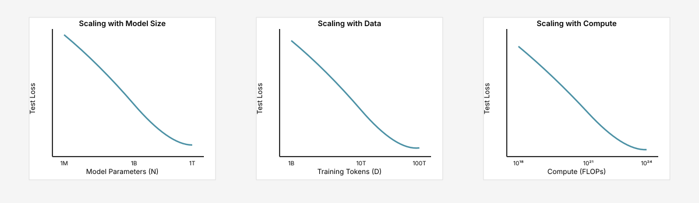
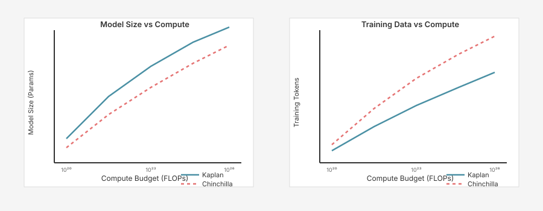
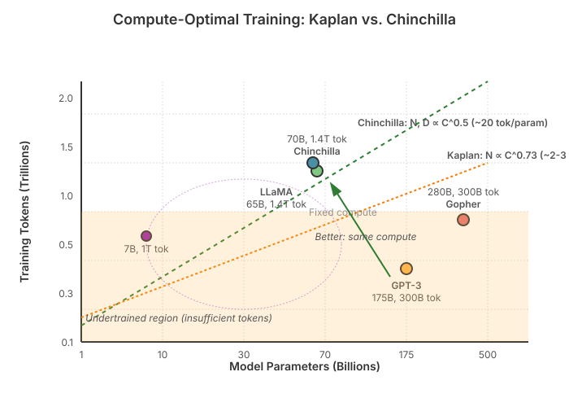
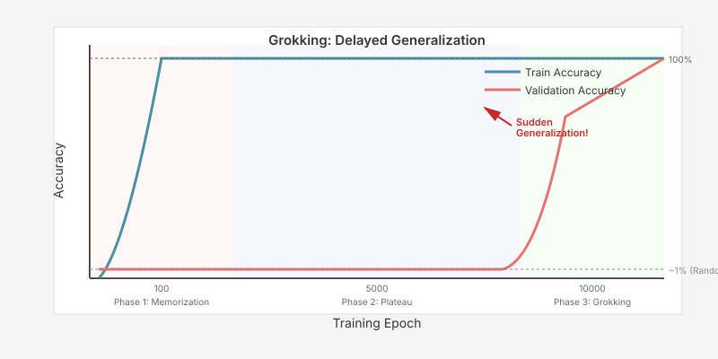
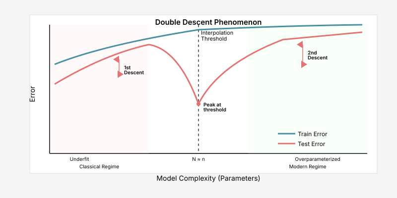
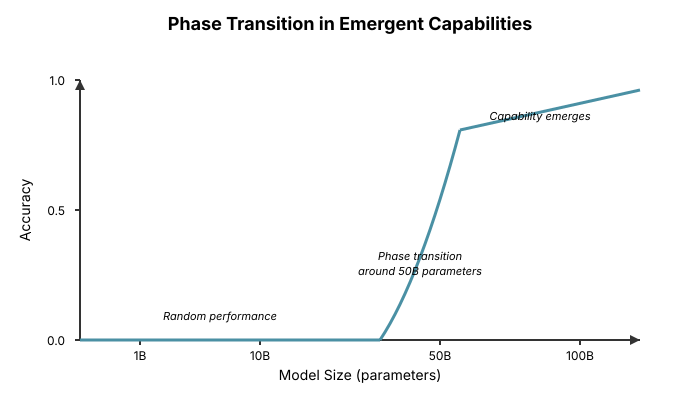

# Chapter 18: Scaling Laws and Training Dynamics

This chapter explores the empirical relationships that govern how language model performance scales with size, data, and compute, along with fascinating phenomena that emerge during training. Understanding these dynamics helps predict model performance, allocate resources optimally, and reveals deep insights about how neural networks learn.

## Table of Contents

1. [Introduction](#introduction)
2. [Scaling Laws for Neural Language Models](#scaling-laws-for-neural-language-models)
   - [The Kaplan Scaling Laws](#the-kaplan-scaling-laws)
   - [The Chinchilla Scaling Laws](#the-chinchilla-scaling-laws)
   - [Practical Implications](#practical-implications)
3. [Compute-Optimal Training](#compute-optimal-training)
4. [Grokking: Delayed Generalization](#grokking-delayed-generalization)
   - [The Grokking Phenomenon](#the-grokking-phenomenon)
   - [Mathematical Setup](#mathematical-setup)
   - [Phases of Learning](#phases-of-learning)
   - [Theories and Mechanisms](#theories-and-mechanisms)
   - [Implementation](#implementation)
5. [Double Descent](#double-descent)
   - [Classical vs Modern Learning Curves](#classical-vs-modern-learning-curves)
   - [Three Types of Double Descent](#three-types-of-double-descent)
   - [The Interpolation Threshold](#the-interpolation-threshold)
   - [Implementation](#implementation-1)
6. [Emergent Capabilities](#emergent-capabilities)
   - [What is Emergence?](#what-is-emergence)
   - [Examples of Emergent Capabilities](#examples-of-emergent-capabilities)
   - [Phase Transitions](#phase-transitions)
   - [The Emergence Debate](#the-emergence-debate)
7. [Neural Scaling Phenomena](#neural-scaling-phenomena)
8. [Summary](#summary)
9. [References](#references)
10. [Exercises](#exercises)

---

## Introduction

Understanding how language models scale is one of the most important questions in modern machine learning. Scaling laws provide predictable relationships between model size, training data, compute budget, and final performance. But training dynamics reveal surprising phenomena that challenge our understanding of how neural networks learn.

**Key Questions This Chapter Answers:**

- How does model performance scale with size, data, and compute?
- What is the optimal allocation of compute between model size and training tokens?
- Why do models sometimes suddenly "grok" concepts after appearing to merely memorize?
- What is double descent and why do larger models sometimes perform better even when overfitting?
- When do emergent capabilities appear and are they predictable?

**Prerequisites:** This chapter assumes familiarity with:

- Basic neural network training ([Chapter 15](15-lm-training.md))
- Understanding of optimization and training dynamics ([Chapter 17](17-scaling-optimization.md))

---

## Scaling Laws for Neural Language Models

Scaling laws describe how model performance (typically measured by loss) changes as we vary model parameters, training data, and compute budget. These empirical relationships help us predict performance and make informed architectural decisions.

### The Kaplan Scaling Laws

In 2020, researchers at OpenAI published seminal work establishing power-law relationships for language model scaling.

**Key Paper:** [Scaling Laws for Neural Language Models](https://arxiv.org/abs/2001.08361) (Kaplan et al., 2020)

#### Power Law Relationships

The Kaplan scaling laws identify three primary factors affecting model performance:

1. **Model size** ($N$): Number of non-embedding parameters
2. **Dataset size** ($D$): Number of training tokens
3. **Compute** ($C$): Total floating-point operations used for training

The test loss $L$ follows power laws:

```math
L(N) = \left(\frac{N_c}{N}\right)^{\alpha_N}
```

```math
L(D) = \left(\frac{D_c}{D}\right)^{\alpha_D}
```

```math
L(C) = \left(\frac{C_c}{C}\right)^{\alpha_C}
```

where $N_c$, $D_c$, $C_c$ are constants and $\alpha_{N} \approx 0.076$, $\alpha_{D} \approx 0.095$, $\alpha_{C} \approx 0.050$.

#### Key Findings from Kaplan et al.

1. **Model size dominates**: Performance depends most strongly on model size, weakly on dataset size
2. **Large models are sample-efficient**: Larger models reach the same performance with fewer training steps
3. **Convergence is slow**: Models continue to improve even when trained far beyond one epoch
4. **Optimal allocation**: For a fixed compute budget, most resources should go to larger models rather than more data

**Recommendation:** Train very large models on relatively limited data (e.g., 200B tokens for a 175B parameter model like GPT-3).

**Kaplan Scaling Laws Visualization:**



### The Chinchilla Scaling Laws

In 2022, DeepMind published revised scaling laws that challenged Kaplan's conclusions, showing that models should be trained on much more data.

**Key Paper:** [Training Compute-Optimal Large Language Models](https://arxiv.org/abs/2203.15556) (Hoffmann et al., 2022)

#### Key Findings from Chinchilla

1. **Equal scaling**: Model parameters and training tokens should scale equally with compute
2. **Data matters**: Previous models (including GPT-3) were significantly undertrained
3. **Smaller models can match large ones**: With enough data, smaller models can match the performance of larger models trained on less data

**Chinchilla's Law:** For compute-optimal training:

```math
N_{opt} \propto C^{0.5}, \quad D_{opt} \propto C^{0.5}
```

More specifically:

```math
N_{opt} \approx \left(\frac{C}{6}\right)^{0.49}, \quad D_{opt} \approx 20 \times N_{opt}
```

**Rule of thumb:** Use approximately **20 tokens per parameter**.

#### The Chinchilla Model

The paper's namesake model, Chinchilla:

- **Parameters**: 70B (4× smaller than Gopher's 280B)
- **Training tokens**: 1.4T (4× more than Gopher)
- **Performance**: Outperformed Gopher on most benchmarks
- **Efficiency**: Same compute budget, better results

#### Implementing Chinchilla Scaling Laws

**Problem:** Given a fixed compute budget, we need to determine the optimal allocation between model size and training data. The Kaplan laws suggested prioritizing model size, but empirical evidence from Chinchilla shows this leads to undertrained models.

**Theoretical Justification:** Chinchilla's key insight is that the loss function has approximately equal sensitivity to model parameters and training tokens. Mathematically, if we model loss as:

```math
L(N, D) = \frac{a}{N^\alpha} + \frac{b}{D^\beta} + L_\infty
```

Optimizing this under the compute constraint $C = 6ND$ shows that $N_{opt}$ and $D_{opt}$ should both scale as $C^{0.5}$, rather than prioritizing one over the other. This is derived by:

1. Taking partial derivatives: $\frac{\partial L}{\partial N}$ and $\frac{\partial L}{\partial D}$
2. Setting them equal (for optimal allocation)
3. Solving under the constraint $C = 6ND$

**How This Relates to Alternatives:**

- **Kaplan scaling**: Recommended $N \propto C^{0.73}$ and $D \propto C^{0.27}$ (heavily favoring model size)
- **Chinchilla scaling**: Recommends $N \propto C^{0.5}$ and $D \propto C^{0.5}$ (balanced allocation)
- **Impact**: For the same compute, Chinchilla approach trains a 4× smaller model on 4× more data, achieving better performance

**Key Insight:** The "bigger is better" intuition from Kaplan was misleading. While larger models are more sample-efficient per token, they need far more tokens to reach their potential. The optimal strategy balances both dimensions equally.

**Kaplan vs Chinchilla Comparison:**



**Examples of Models and Their Training Regimes:**

| Model | Parameters | Training Tokens | Tokens/Param | Scaling Approach |
|-------|-----------|-----------------|--------------|------------------|
| GPT-3 | 175B | 300B | ~2 | Kaplan (undertrained) |
| Chinchilla | 70B | 1.4T | 20 | Chinchilla optimal |
| LLaMA | 65B | 1.4T | 22 | Chinchilla-like |
| LLaMA 2 | 70B | 2T | 29 | Beyond Chinchilla |
| LLaMA 3 | 70B | 15T | 214 | Far beyond Chinchilla |

The trend shows modern models training far beyond the Chinchilla optimal point of ~20 tokens per parameter, trading additional compute for quality improvements.

### Practical Implications

The shift from Kaplan to Chinchilla scaling laws had major implications:

| Aspect | Kaplan (2020) | Chinchilla (2022) | Impact |
|--------|---------------|-------------------|--------|
| **Recommendation** | Large model, less data | Balanced scaling | Changed training strategies |
| **GPT-3 assessment** | Well-allocated | Undertrained by 4× | Showed inefficiency |
| **Tokens per param** | ~2-3 | ~20 | 10× more data needed |
| **Model size trend** | Maximize size | Smaller models OK | Enabled efficient models |

**Modern practice** (2024-2025):

- Most models follow Chinchilla or train even longer
- LLaMA 3 8B: trained on 15T tokens (~1875 tokens/param)
- Extended training beyond Chinchilla optimal is common
- Quality improvements justify extra compute

**Compute-Optimal Frontier Visualization:**



This visualization maps different models in the parameter-token space, showing the stark contrast between Kaplan's approach (favoring larger models with less data) and Chinchilla's optimal line (balanced scaling). GPT-3 and Gopher fall in the undertrained region, while Chinchilla and LLaMA align closer to the compute-optimal frontier. The equal scaling law (N, D ∝ $C^{0.5}$) represents the efficient frontier where both dimensions contribute equally to performance improvement.

---

## Compute-Optimal Training

Computing optimal model size and training duration for a given compute budget.

### Compute Estimation

The total compute $C$ for training a transformer model is approximately:

```math
C \approx 6ND
```

where:

- $N$ = number of parameters (non-embedding)
- $D$ = number of training tokens
- Factor of 6 accounts for forward pass (2ND) and backward pass (4ND)

#### Computing Training Costs

**Problem:** Before committing to a training run, we need to estimate how long it will take and how much it will cost. Underestimating leads to incomplete training; overestimating wastes budget planning.

**Theoretical Justification:** The $C \approx 6ND$ formula comes from counting floating-point operations in transformers:

- **Forward pass**: Each matrix multiplication of size $d \times d$ with batch size $B$ and sequence length $L$ requires $\approx 2BLd^2$ FLOPs (2 FLOPs per multiply-add)
- **Backward pass**: Requires computing gradients w.r.t. inputs and weights, which is roughly 2× the forward pass compute
- **Total**: Forward (1×) + Backward (2×) = 3×, and each operation processes 2 FLOPs per parameter, giving $6ND$

**Real-World Adjustments:**

- **Efficiency factor**: GPUs rarely achieve 100% utilization. Typical: 30-60% for LLM training
- **Attention overhead**: Flash Attention is near-optimal, but standard attention adds overhead
- **Communication**: Multi-GPU training has data transfer costs (typically 10-20% overhead)

**How This Relates to Alternatives:**

- **Simple estimate** ($C = ND$): Ignores backward pass, off by 6×
- **Detailed counting**: Track every operation in every layer (too complex, gives similar result)
- **Empirical measurement**: Profile actual runs (most accurate, but requires training to start)

**Key Insight:** The factor of 6 is approximate but remarkably accurate across different architectures. Use it for planning, then apply an efficiency factor (0.3-0.6) based on your hardware and implementation quality.

**Example Compute Calculations:**

For a 70B parameter model trained on 1.4T tokens (Chinchilla):

- Total FLOPs: $C \approx 6 \times 70 \times 10^9 \times 1.4 \times 10^{12} = 5.88 \times 10^{23}$ FLOPs
- With efficiency factor of 0.4: $\approx 1.47 \times 10^{24}$ FLOPs actual
- On 1024 A100 GPUs (312 TFLOPS each): $\approx 1.47 \times 10^{24} / (312 \times 10^{12} \times 1024) \approx 4.6$ million seconds $\approx 53$ days

---


## Grokking: Delayed Generalization

Grokking is a fascinating phenomenon where neural networks suddenly generalize to unseen data long after they have perfectly memorized the training set. This challenges our traditional understanding of overfitting and reveals insights about how neural networks form internal representations.

### The Grokking Phenomenon

**Key Paper:** [Grokking: Generalization Beyond Overfitting on Small Algorithmic Datasets](https://arxiv.org/abs/2201.02177) (Power et al., 2022)

**What is Grokking?**

Traditional machine learning wisdom says that once a model perfectly fits the training data (100% training accuracy) while test accuracy stagnates, the model has overfit and further training won't help. Grokking violates this intuition:

1. **Phase 1 (Memorization)**: Model quickly achieves perfect training accuracy
2. **Phase 2 (Plateau)**: Training loss stays near zero, validation loss stays high (appears overfit)
3. **Phase 3 (Grokking)**: Suddenly, after many more epochs, validation loss drops and the model generalizes

This transition can happen thousands or even millions of steps after achieving perfect training accuracy.

### Mathematical Setup

Grokking was first observed on algorithmic tasks, particularly modular arithmetic:

**Task: Modular Addition**

- Input: Two integers $a, b \in \{0, 1, \ldots, p-1\}$
- Output: $(a + b) \mod p$
- Dataset: All $p^2$ possible pairs (for small primes like $p=97$ or $p=113$)
- Split: Random 50% train, 50% validation

**Why this task?**

- Small, finite dataset (easy to memorize)
- Clear generalization signal (modular structure)
- Algorithmic task requires learning the underlying rule, not just pattern matching

**Typical observation:**

- Training accuracy → 100% after 50-200 epochs
- Validation accuracy stays ~random (1/p) for 1000-10000 epochs
- Then suddenly jumps to ~100% (grokking!)

### Phases of Learning

**Problem:** During training, we observe three distinct phases. Understanding what the model is doing in each phase reveals how it transitions from memorization to true understanding.

**Phase 1: Memorization (epochs 0-50)**

- Model learns to map specific training examples to outputs
- Uses lookup-table-like approach
- Training loss → 0, validation loss stays high
- Internal representations are scattered, not structured

**Phase 2: Circuit Formation (epochs 50-5000)**

- *This is the key mysterious phase*
- Training metrics plateau (appears converged)
- Model is actually still learning, but imperceptibly
- Gradually building structured internal representations
- Weight decay is crucial here (see below)

**Phase 3: Generalization (epochs 5000+)**

- Sudden transition to algorithmic solution
- Validation accuracy → 100%
- Internal circuits now implement the modular arithmetic operation
- Model "understands" the underlying structure

**Theoretical Justification:**

Why does the model eventually prefer the algorithmic solution over memorization?

1. **Weight Decay as Driver**: Weight decay penalizes complex solutions. Memorization requires many large weights (one pathway per training example). The algorithmic solution uses fewer, more structured weights.

2. **Simplicity Bias**: Neural networks trained with gradient descent exhibit a "simplicity bias" - they prefer simpler functions when multiple solutions fit the training data equally well.

3. **Representation Learning**: During the plateau phase, the model gradually reorganizes its internal representations. This happens through tiny weight updates that don't affect training loss but build toward the structured solution.

**How This Relates to Alternatives:**

- **Early stopping**: Would prevent grokking by stopping during Phase 2
- **No weight decay**: Grokking often doesn't occur (model stays in memorization mode)
- **Larger models**: Can grok faster (more capacity to find efficient representations)

**Key Insight:** Grokking shows that generalization can be a phase transition, not a continuous process. The model doesn't gradually improve on validation data - it stays at random performance for thousands of epochs, then suddenly "clicks."

### Theories and Mechanisms

Several mechanisms have been proposed to explain grokking:

#### 1. Weight Decay as Essential Ingredient

**Observation:** Grokking rarely happens without weight decay (or other regularization).

**Why?** 

- Memorization solutions have high complexity (many parameters, large weights)
- Algorithmic solutions have low complexity (structured, sparse)
- Weight decay provides gradient toward simpler solutions
- During the plateau, weight decay slowly shifts the model from complex → simple

```math
L_{\text{total}} = L_{\text{train}} + \lambda \|\theta\|^2
```

Even when $L_{\text{train}} = 0$, the weight decay term keeps driving updates.

#### 2. Circuit Formation and Lottery Tickets

**Connection to Lottery Ticket Hypothesis:**

- During memorization, model explores many subnetworks
- Weight decay prunes ineffective pathways
- Eventually discovers a "winning ticket" - a subnetwork that implements the algorithm
- This subnetwork then gets amplified

#### 3. Representation Reorganization

**Mechanistic interpretability studies show:**

- Early training: representations are basis-aligned (one neuron per training example)
- Late training: representations are Fourier-aligned (neurons represent frequency components)
- Transition is gradual but acceleration is sudden

For modular arithmetic, the final solution often uses Fourier features:

```math
\text{Embedding}(x) = [\cos(2\pi kx/p), \sin(2\pi kx/p)]_{k=1}^{K}
```

### Implementation

Let's implement a demonstration of grokking on modular addition:

```python
import torch
import torch.nn as nn
import torch.nn.functional as F
import numpy as np
from torch.utils.data import Dataset, DataLoader

class ModularArithmeticDataset(Dataset):
    """
    Dataset for modular arithmetic tasks.
    
    Task: Given (a, b), predict (a op b) mod p
    where op is +, -, *, or /
    """
    
    def __init__(self, p: int, operation: str = 'add', fraction: float = 0.5, train: bool = True):
        """
        Args:
            p: Prime modulus
            operation: 'add', 'sub', 'mul', or 'div'
            fraction: Fraction of data to use for training
            train: If True, return training split; else validation split
        """
        self.p = p
        self.operation = operation
        
        # Generate all possible pairs
        all_pairs = [(a, b) for a in range(p) for b in range(p)]
        
        # Shuffle and split
        np.random.seed(42)
        np.random.shuffle(all_pairs)
        
        split_idx = int(len(all_pairs) * fraction)
        if train:
            self.pairs = all_pairs[:split_idx]
        else:
            self.pairs = all_pairs[split_idx:]
    
    def __len__(self):
        return len(self.pairs)
    
    def __getitem__(self, idx):
        a, b = self.pairs[idx]
        
        # Compute target based on operation
        if self.operation == 'add':
            target = (a + b) % self.p
        elif self.operation == 'sub':
            target = (a - b) % self.p
        elif self.operation == 'mul':
            target = (a * b) % self.p
        elif self.operation == 'div':
            # Modular division: a / b ≡ a * b^(-1) (mod p)
            # Only defined when gcd(b, p) = 1 (always true for prime p, b != 0)
            if b == 0:
                target = 0  # Handle division by zero
            else:
                # Fermat's little theorem: b^(p-1) ≡ 1 (mod p)
                # So b^(-1) ≡ b^(p-2) (mod p)
                b_inv = pow(b, self.p - 2, self.p)
                target = (a * b_inv) % self.p
        else:
            raise ValueError(f"Unknown operation: {self.operation}")
        
        return torch.tensor([a, b], dtype=torch.long), torch.tensor(target, dtype=torch.long)


class ModularMLP(nn.Module):
    """
    Simple MLP for modular arithmetic.
    
    Architecture:

    - Embedding layer for inputs
    - Hidden layers
    - Output layer (logits over p classes)

    """
    
    def __init__(self, p: int, d_model: int = 128, n_layers: int = 2, dropout: float = 0.0):
        """
        Args:
            p: Modulus (also vocab size)
            d_model: Hidden dimension
            n_layers: Number of hidden layers
            dropout: Dropout probability
        """
        super().__init__()
        self.p = p
        self.d_model = d_model
        
        # Embeddings for both inputs
        self.embed = nn.Embedding(p, d_model)
        
        # Hidden layers
        layers = []
        for _ in range(n_layers):
            layers.extend([
                nn.Linear(d_model, d_model),
                nn.ReLU(),
                nn.Dropout(dropout) if dropout > 0 else nn.Identity()
            ])
        self.layers = nn.Sequential(*layers)
        
        # Output layer
        self.output = nn.Linear(d_model, p)
    
    def forward(self, x):
        """
        Args:
            x: [batch_size, 2] - pairs of integers
        
        Returns:
            logits: [batch_size, p]
        """
        # Embed both inputs
        a_emb = self.embed(x[:, 0])  # [batch_size, d_model]
        b_emb = self.embed(x[:, 1])  # [batch_size, d_model]
        
        # Combine (element-wise product works well for multiplication)
        # For addition, sum also works
        h = a_emb * b_emb  # or a_emb + b_emb
        
        # Process through hidden layers
        h = self.layers(h)
        
        # Output logits
        logits = self.output(h)
        return logits


def train_grokking_demo(
    p: int = 97,
    operation: str = 'add',
    epochs: int = 10000,
    lr: float = 1e-3,
    weight_decay: float = 1.0,
    d_model: int = 128,
    n_layers: int = 2,
    batch_size: int = 512,
):
    """
    Train a model on modular arithmetic and observe grokking.
    
    Args:
        p: Prime modulus (97 or 113 work well)
        operation: 'add', 'sub', 'mul', or 'div'
        epochs: Number of epochs (10k+ to see grokking)
        lr: Learning rate
        weight_decay: Weight decay (essential for grokking!)
        d_model: Model hidden dimension
        n_layers: Number of layers
        batch_size: Batch size
    """
    device = torch.device('cuda' if torch.cuda.is_available() else 'cpu')
    
    # Create datasets
    train_dataset = ModularArithmeticDataset(p, operation, fraction=0.5, train=True)
    val_dataset = ModularArithmeticDataset(p, operation, fraction=0.5, train=False)
    
    train_loader = DataLoader(train_dataset, batch_size=batch_size, shuffle=True)
    val_loader = DataLoader(val_dataset, batch_size=batch_size, shuffle=False)
    
    # Create model
    model = ModularMLP(p, d_model, n_layers).to(device)
    
    # Optimizer with weight decay
    optimizer = torch.optim.AdamW(model.parameters(), lr=lr, weight_decay=weight_decay)
    
    # Training loop
    train_accs = []
    val_accs = []
    train_losses = []
    val_losses = []
    
    print(f"Training modular {operation} (mod {p})")
    print(f"Training samples: {len(train_dataset)}, Validation samples: {len(val_dataset)}")
    print(f"Weight decay: {weight_decay}")
    print("-" * 80)
    
    for epoch in range(epochs):
        # Training
        model.train()
        train_correct = 0
        train_total = 0
        train_loss_sum = 0
        
        for x, y in train_loader:
            x, y = x.to(device), y.to(device)
            
            logits = model(x)
            loss = F.cross_entropy(logits, y)
            
            optimizer.zero_grad()
            loss.backward()
            optimizer.step()
            
            train_loss_sum += loss.item() * x.size(0)
            preds = logits.argmax(dim=1)
            train_correct += (preds == y).sum().item()
            train_total += x.size(0)
        
        train_acc = train_correct / train_total
        train_loss = train_loss_sum / train_total
        
        # Validation
        model.eval()
        val_correct = 0
        val_total = 0
        val_loss_sum = 0
        
        with torch.no_grad():
            for x, y in val_loader:
                x, y = x.to(device), y.to(device)
                
                logits = model(x)
                loss = F.cross_entropy(logits, y)
                
                val_loss_sum += loss.item() * x.size(0)
                preds = logits.argmax(dim=1)
                val_correct += (preds == y).sum().item()
                val_total += x.size(0)
        
        val_acc = val_correct / val_total
        val_loss = val_loss_sum / val_total
        
        train_accs.append(train_acc)
        val_accs.append(val_acc)
        train_losses.append(train_loss)
        val_losses.append(val_loss)
        
        # Log progress
        if epoch % 100 == 0 or epoch < 10:
            print(f"Epoch {epoch:5d} | Train: {train_acc:.3f} ({train_loss:.4f}) | "
                  f"Val: {val_acc:.3f} ({val_loss:.4f})")
    
    return model, train_accs, val_accs


# Run the experiment
if __name__ == "__main__":
    # Experiment 1: With weight decay (should grok)
    print("\n=== Experiment 1: With Weight Decay ===\n")
    model_wd, train_wd, val_wd = train_grokking_demo(
        p=97,
        operation='add',
        epochs=10000,
        weight_decay=1.0,  # Essential!
        lr=1e-3
    )
    
    # Experiment 2: Without weight decay (likely won't grok)
    print("\n\n=== Experiment 2: Without Weight Decay ===\n")
    model_no_wd, train_no_wd, val_no_wd = train_grokking_demo(
        p=97,
        operation='add',
        epochs=10000,
        weight_decay=0.0,  # No regularization
        lr=1e-3
    )

```

**Grokking Phenomenon Visualization:**



**Key Observations from the Implementation:**

1. **Weight decay is critical**: Without it, grokking often doesn't happen
2. **Grokking is sudden**: Validation accuracy stays near random (1/p ≈ 1%) for thousands of epochs, then jumps to ~100%
3. **Training accuracy is perfect throughout**: The plateau phase shows train accuracy = 100% but val accuracy ≈ random
4. **Longer training required**: Unlike typical ML where we stop when validation plateaus, grokking requires patience

**Practical Implications:**

- **Don't stop early**: If training data is small, keep training even after perfect training accuracy
- **Use regularization**: Weight decay, dropout, or other regularization helps grokking
- **Algorithmic tasks benefit most**: Grokking is most pronounced on tasks with underlying structure
- **Computational cost**: Grokking can require 10-100× more training than achieving perfect train accuracy

### Connection to LLMs

Does grokking happen in large language models?

**Evidence suggests yes, but differently:**

1. **In-context learning**: LLMs suddenly "get" certain tasks during training
2. **Reasoning emergence**: Chain-of-thought reasoning appears suddenly at certain scales
3. **Compositional generalization**: Models suddenly compose learned concepts

**Difference from toy examples:**

- LLMs have massive, diverse data (not small algorithmic datasets)
- Emergence happens during pre-training, not just memorization → generalization
- Scale-dependent: larger models grok faster or at different points


## Double Descent

Double descent is a surprising phenomenon that challenges the classical bias-variance tradeoff. It shows that test error can *decrease* again after initially increasing with model complexity, leading to a U-shaped curve that descends twice.

### Classical vs Modern Learning Curves

**Classical Machine Learning Wisdom (Bias-Variance Tradeoff):**

Traditional statistical learning theory predicts a U-shaped risk curve:

1. **Underfitting regime**: Small models, high bias, high training and test error
2. **Sweet spot**: Optimal model complexity, balanced bias-variance
3. **Overfitting regime**: Large models, high variance, low training error but increasing test error

The classical recipe: Use cross-validation to find the sweet spot and stop there.

**Modern Deep Learning Reality:**

Large neural networks violate this wisdom:

- Massively overparameterized (far beyond classical "sweet spot")
- Train to zero training error (perfect interpolation)
- Yet generalize well on test data

**Key Papers:**

- [Reconciling modern machine learning practice and the bias-variance trade-off](https://arxiv.org/abs/1812.11118) (Belkin et al., 2019)
- [Deep Double Descent: Where Bigger Models and More Data Hurt](https://arxiv.org/abs/1912.02292) (Nakkiran et al., 2019)

### Three Types of Double Descent

Nakkiran et al. (2019) identified three distinct manifestations of double descent:

#### 1. Model-wise Double Descent

**Setup:** Fix dataset and training epochs, vary model size.

**Observation:** Test error follows a double-descent curve:

1. **First descent**: Increasing model size from small → optimal reduces test error (classical regime)
2. **Peak**: At the interpolation threshold (model barely large enough to fit training data), test error spikes
3. **Second descent**: Increasing model size beyond interpolation threshold reduces test error again

**Interpolation threshold:** The model size at which the network can just barely fit the training set.

Why does this happen?

- **Below threshold**: Model is underparameterized, can't fit training data perfectly, regularized by model capacity
- **At threshold**: Model barely fits data using all available parameters in a fragile, unstructured way (high test error)
- **Above threshold**: Model has many ways to interpolate the data, can choose smooth, structured solutions (implicit regularization via SGD)

#### 2. Epoch-wise (Sample-wise) Double Descent

**Setup:** Fix model size and dataset, vary training epochs.

**Observation:** For certain model sizes (near interpolation threshold), test error can:

1. Decrease during early training
2. Increase as model starts to overfit
3. Decrease again with more training (!)

This is especially counterintuitive: training *longer* after overfitting can improve generalization.

**Why?** Similar to grokking - the model transitions from memorization to finding structured solutions.

#### 3. Data-wise (Sample-wise) Double Descent

**Setup:** Fix model and training epochs, vary dataset size.

**Observation:** Adding more training data can sometimes *hurt* test performance!

Specifically:

- Small dataset: Model underfits or barely interpolates
- Medium dataset (near interpolation threshold): Model overfits badly
- Large dataset: Model regularized by data quantity, generalizes well

### The Interpolation Threshold

**Definition:** The interpolation threshold is the critical point where the model has just enough capacity to perfectly fit the training data.

**Mathematical intuition:**

- Let $N$ = number of model parameters
- Let $n$ = number of training examples
- Interpolation threshold: $N \approx n$

**Why does the peak occur here?**

When $N \approx n$, the model must use *all* of its parameters to fit the data, leaving no room for finding a simple, structured solution. The resulting interpolant is "maximally stressed" - it barely fits the data using a brittle, unstructured solution that doesn't generalize.

When $N \gg n$, the model has many degrees of freedom. SGD's implicit bias toward simple solutions means it can find an interpolant that is smooth and generalizes well.

**Connection to linear algebra:**

- $N < n$: Underdetermined system, can't fit all data
- $N = n$: Exactly determined, unique solution (often high-norm, poor generalization)
- $N > n$: Overdetermined, infinitely many interpolating solutions (SGD finds good ones)

### Implementation

Let's demonstrate double descent on a simple polynomial regression task:

```python
import numpy as np
import torch
import torch.nn as nn

def generate_polynomial_data(n_samples=100, degree=3, noise=0.1, seed=42):
    """
    Generate noisy polynomial data.
    
    Args:
        n_samples: Number of samples
        degree: True polynomial degree
        noise: Noise standard deviation
        seed: Random seed
    
    Returns:
        X, y: Input features and targets
    """
    np.random.seed(seed)
    X = np.random.uniform(-1, 1, n_samples)
    
    # True function: polynomial
    y_true = sum(X**i for i in range(degree + 1))
    
    # Add noise
    y = y_true + np.random.normal(0, noise, n_samples)
    
    return X.reshape(-1, 1), y

def polynomial_features(X, degree):
    """Create polynomial features up to given degree."""
    X_poly = np.column_stack([X**i for i in range(degree + 1)])
    return X_poly

class PolynomialRegressor(nn.Module):
    """Simple linear model for polynomial regression."""
    
    def __init__(self, input_dim):
        super().__init__()
        self.linear = nn.Linear(input_dim, 1, bias=False)
    
    def forward(self, x):
        return self.linear(x).squeeze()

def train_polynomial_model(X_train, y_train, X_test, y_test, epochs=10000, lr=0.01):
    """Train polynomial regression model."""
    device = torch.device('cpu')  # Use CPU for small models
    
    # Convert to tensors
    X_train_t = torch.tensor(X_train, dtype=torch.float32).to(device)
    y_train_t = torch.tensor(y_train, dtype=torch.float32).to(device)
    X_test_t = torch.tensor(X_test, dtype=torch.float32).to(device)
    y_test_t = torch.tensor(y_test, dtype=torch.float32).to(device)
    
    # Create model
    model = PolynomialRegressor(X_train.shape[1]).to(device)
    optimizer = torch.optim.SGD(model.parameters(), lr=lr)
    
    # Train
    for epoch in range(epochs):
        model.train()
        optimizer.zero_grad()
        
        pred = model(X_train_t)
        loss = nn.functional.mse_loss(pred, y_train_t)
        
        loss.backward()
        optimizer.step()
    
    # Evaluate
    model.eval()
    with torch.no_grad():
        train_pred = model(X_train_t)
        test_pred = model(X_test_t)
        
        train_error = nn.functional.mse_loss(train_pred, y_train_t).item()
        test_error = nn.functional.mse_loss(test_pred, y_test_t).item()
    
    return train_error, test_error

def double_descent_experiment(
    n_train=20,
    max_degree=40,
    epochs=10000,
    n_runs=5
):
    """
    Demonstrate double descent by varying model complexity (polynomial degree).
    
    Args:
        n_train: Number of training samples
        max_degree: Maximum polynomial degree to try
        epochs: Training epochs per model
        n_runs: Number of random seeds to average over
    """
    # Generate test data once
    X_test, y_test = generate_polynomial_data(n_samples=1000, degree=3, noise=0.1, seed=999)
    
    degrees = range(1, max_degree + 1)
    train_errors_all = []
    test_errors_all = []
    
    for run in range(n_runs):
        train_errors = []
        test_errors = []
        
        # Generate training data with different seed each run
        X_train, y_train = generate_polynomial_data(
            n_samples=n_train,
            degree=3,
            noise=0.1,
            seed=run
        )
        
        for degree in degrees:
            # Create polynomial features
            X_train_poly = polynomial_features(X_train, degree)
            X_test_poly = polynomial_features(X_test, degree)
            
            # Train model
            train_err, test_err = train_polynomial_model(
                X_train_poly, y_train,
                X_test_poly, y_test,
                epochs=epochs,
                lr=0.001
            )
            
            train_errors.append(train_err)
            test_errors.append(test_err)
            
            if degree % 5 == 0:
                print(f"Run {run+1}/{n_runs}, Degree {degree}: "
                      f"Train MSE = {train_err:.4f}, Test MSE = {test_err:.4f}")
        
        train_errors_all.append(train_errors)
        test_errors_all.append(test_errors)
    
    # Average over runs
    train_errors_mean = np.mean(train_errors_all, axis=0)
    test_errors_mean = np.mean(test_errors_all, axis=0)
    train_errors_std = np.std(train_errors_all, axis=0)
    test_errors_std = np.std(test_errors_all, axis=0)
    
    return degrees, train_errors_mean, test_errors_mean


# Run experiment
if __name__ == "__main__":
    print("Running Double Descent Experiment...")
    print("=" * 80)
    degrees, train_errs, test_errs = double_descent_experiment(
        n_train=20,
        max_degree=40,
        epochs=10000,
        n_runs=5
    )
    
    # Find the peak
    peak_idx = np.argmax(test_errs)
    print(f"\nPeak test error occurs at degree {degrees[peak_idx]}")
    print(f"Interpolation threshold is at n_train = 20")
```

**Double Descent Visualization:**



**What to observe in the results:**

1. **First descent (degrees 1-15)**: Test error decreases as we add complexity (classical regime)
2. **Peak (degree ~ 20-25)**: Test error spikes near the interpolation threshold
3. **Second descent (degrees 25-40)**: Test error decreases again as we continue adding parameters
4. **Train error**: Monotonically decreases, eventually reaching near-zero

### Practical Implications

**For LLM Training:**

1. **Don't fear overparameterization**: Models with billions of parameters can generalize despite zero training loss
2. **Scaling helps**: When in doubt, use a larger model (you're likely past the interpolation threshold)
3. **Data quality matters more than quantity near threshold**: At the interpolation threshold, noisy or mislabeled data hurts most
4. **Regularization changes curves**: Weight decay, dropout, and early stopping affect where/whether the peak occurs

**For Model Selection:**

- Classical wisdom: Stop at the first descent minimum
- Modern practice: Train a larger model longer (you're past the peak)
- Practical constraint: Compute and memory limits

**Connection to other phenomena:**

- **Grokking**: Related but different - grokking is temporal (training time), double descent is structural (model size)
- **Lottery tickets**: Overparameterized models contain many subnetworks, SGD finds good ones
- **Neural tangent kernel**: Explains why overparameterized networks generalize (they behave like kernel methods)


## Emergent Capabilities

Emergent capabilities are abilities that appear in large language models that are not present in smaller models, often appearing suddenly at a particular scale threshold. Understanding emergence helps us predict what capabilities future models might develop and informs decisions about model scaling.

### What is Emergence?

**Definition:** A capability is **emergent** if it is:

1. Not present in smaller models
2. Appears in larger models
3. Not explicitly trained for or directly predictable from training

**Key Paper:** [Emergent Abilities of Large Language Models](https://arxiv.org/abs/2206.07682) (Wei et al., 2022)

**Philosophical questions:**

- Are emergent capabilities truly discontinuous, or do they emerge gradually?
- Are they artifacts of our evaluation metrics?
- Can we predict which capabilities will emerge at what scale?

### Examples of Emergent Capabilities

#### 1. Few-Shot Learning (In-Context Learning)

**What is it?** The ability to learn from examples provided in the prompt without gradient updates.

**Emergence:**

- GPT-2 (1.5B): Minimal in-context learning
- GPT-3 (175B): Strong few-shot learning on many tasks
- Threshold: ~10-100B parameters

**Example:**

```text
Translate English to French:
sea otter => loutre de mer
peppermint => menthe poivrée
plush girafe => girafe en peluche
cheese => 
```

Small models fail this task. Large models generalize the pattern.

#### 2. Chain-of-Thought Reasoning

**What is it?** The ability to solve complex reasoning problems by generating intermediate reasoning steps.

**Key Paper:** [Chain-of-Thought Prompting Elicits Reasoning in Large Language Models](https://arxiv.org/abs/2201.11903) (Wei et al., 2022)

**Emergence:**

- Models <10B parameters: Chain-of-thought prompting doesn't help (sometimes hurts)
- Models >50B parameters: Significant improvements with chain-of-thought
- Sharp transition around 10-50B parameters

**Example:**

```text
Q: Roger has 5 tennis balls. He buys 2 more cans of tennis balls. 
Each can has 3 tennis balls. How many tennis balls does he have now?

A: Let's think step by step.
Roger started with 5 balls.
2 cans of 3 balls each is 6 tennis balls.
5 + 6 = 11. The answer is 11.
```

Small models either don't produce the reasoning chain or produce nonsensical ones.

#### 3. Multi-Step Reasoning

**Tasks where emergence is observed:**

- Multi-digit arithmetic
- Logical deduction
- Physical reasoning
- Code synthesis

**Pattern:**

- <1B parameters: Random or near-random performance
- 1-10B: Slight improvement, still poor
- 10-100B: Rapid improvement
- >100B: Near-human or superhuman performance on some tasks

#### 4. Instruction Following

**What is it?** The ability to follow complex, multi-step instructions from natural language prompts.

**Emergence:**

- Enhanced by instruction tuning (SFT), but base capability emerges with scale
- Smaller models struggle with multi-part instructions
- Larger models can parse and execute complex instruction sequences

### Phase Transitions

Emergent capabilities often show **phase transition** behavior:

**Smooth scaling:** Loss decreases smoothly with model size (predictable)

```math
L(N) = a N^{-b} + c
```

**Sharp transition:** Capability appears suddenly (unpredictable from smaller scales)

**Why sharp transitions occur:**

1. **Threshold effects**: Task requires minimum capability level (e.g., must solve all sub-problems)
2. **Metric discretization**: Evaluation metrics (e.g., exact match) create artificial discontinuities
3. **Prompt sensitivity**: Small models are very sensitive to prompt wording, large models more robust

**Visualization:**



### The Emergence Debate

Recent work has challenged whether emergent capabilities are truly discontinuous or artifacts of how we measure them.

**Key Paper:** [Are Emergent Abilities of Large Language Models a Mirage?](https://arxiv.org/abs/2304.15004) (Schaeffer et al., 2023)

#### The "Mirage" Hypothesis

**Claim:** Emergent abilities are not fundamental properties of model scaling, but artifacts of:

1. **Nonlinear metrics**: Using discrete metrics (e.g., exact match accuracy) creates artificial discontinuities
   - If we used smooth metrics (e.g., token-level log probability), we'd see smooth scaling
   - Example: "What is 2+2?" - small model might say "4.1" (wrong by exact match, close by loss)

2. **Threshold effects in tasks**: Some tasks require solving multiple steps correctly
   - Overall accuracy shows sharp transition even if per-step capability scales smoothly
   - Example: Multi-digit arithmetic requires getting all digits correct

3. **Sampling effects**: With limited evaluation samples, noise creates appearance of sharp transitions

**Counter-arguments:**

1. **Some capabilities are genuinely emergent**: In-context learning shows qualitative differences, not just quantitative
2. **Human perception matters**: If a capability is useful only when it exceeds a threshold, the emergence is practically real
3. **Mechanism changes**: Larger models may use fundamentally different algorithms (e.g., memorization → reasoning)

**Current consensus:**

- Some "emergent" capabilities are indeed artifacts of measurement
- Some capabilities show genuine phase transitions
- The distinction is important for predicting future model capabilities

### Predicting Emergence

**Can we predict which capabilities will emerge?**

**Approaches:**

1. **Scaling law extrapolation**: If capability scales smoothly on log-scale, extrapolate to larger models
   - Works for: Perplexity, basic language understanding
   - Fails for: Truly emergent capabilities (by definition)

2. **Probe smaller models**: Look for weak signals in smaller models that might amplify
   - Example: Tiny amounts of reasoning in 1B model → strong reasoning in 100B model

3. **Task decomposition**: Break complex tasks into subtasks, predict when all subtasks pass threshold
   - If task requires 5 steps each with 90% accuracy, overall accuracy is $0.9^5 = 59\%$
   - Small improvement per step can cause large jump in overall performance

4. **Theoretical understanding**: Better mechanistic interpretability could predict emergence
   - If we understand the circuits/algorithms models learn, we could predict when complexity threshold is met

**Practical implications:**

- **Training decisions**: Should you train a 10B or 100B model? Depends on whether your target capabilities emerge in that range
- **Research planning**: Studying phenomena that only emerge at scale requires large compute budgets
- **Safety considerations**: Potentially dangerous capabilities might emerge unexpectedly

## Neural Scaling Phenomena

Beyond specific capabilities, several general phenomena characterize neural scaling:

### 1. Loss Curve Predictability

**Observation:** Training and validation loss curves are remarkably predictable across scales.

**Chinchilla scaling law for loss:**

```math
L(N, D) = \frac{A}{N^\alpha} + \frac{B}{D^\beta} + L_\infty
```

- Predicts loss for any (N, D) combination
- Accurate across 3+ orders of magnitude
- Enables planning without expensive experiments

**Practical use:**

- Predict final loss before training
- Decide whether to increase model size or training tokens
- Estimate ROI of additional compute

### 2. Transfer of Scaling Laws

**Question:** Do scaling laws learned on one domain transfer to others?

**Findings:**

- Exponents ($\alpha$, $\beta$) are relatively universal across domains
- Coefficients (A, B) vary by domain
- Can calibrate with small-scale experiments, then extrapolate

**Example:** Scaling law from English → applies to other languages with coefficient adjustment

### 3. Capability Acquisition Order

**Observation:** Different capabilities emerge in a relatively consistent order as models scale:

1. **Basic language modeling** (1-10B): Grammar, simple facts
2. **In-context learning** (10-100B): Few-shot task adaptation
3. **Complex reasoning** (100B+): Multi-step logic, mathematics
4. **Compositional generalization** (100B+): Combining concepts in novel ways

**Why this order?**

- Simpler capabilities require less model capacity
- Complex capabilities build on simpler ones
- Data distribution: more examples of simple tasks

### 4. Plateaus and Breakthroughs

**Observation:** Scaling is not uniformly smooth. Some capabilities improve gradually, others show sudden jumps.

**Patterns:**

- **Smooth improvement**: Basic language modeling, next-token prediction
- **Sudden improvement**: Reasoning, compositional tasks, specialized knowledge
- **Plateaus**: Some capabilities plateau at certain scales (may need architectural changes)

**Example - Arithmetic:**

- 1-digit addition: smooth scaling
- 2-digit addition: sharp transition around 10B
- 3-digit addition: sharp transition around 100B
- Pattern suggests each additional digit requires ~10× more parameters

---

## Summary

### Key Takeaways

1. **Scaling Laws**
   - Kaplan (2020): Model size matters most (N ∝ $C^{0.73}$)
   - Chinchilla (2022): Equal scaling of model and data (N, D ∝ $C^{0.5}$)
   - Modern practice: Train beyond Chinchilla optimal for quality improvements
   - Tokens per parameter: ~20 (Chinchilla optimal), but many models train longer

2. **Grokking**
   - Sudden generalization long after memorization
   - Requires strong regularization (weight decay essential)
   - Transitions from memorization to algorithmic solution
   - Relevant for understanding in-context learning emergence

3. **Double Descent**
   - Test error can decrease beyond classical overfitting regime
   - Peak at interpolation threshold (N ≈ n)
   - Overparameterized models generalize well despite zero training loss
   - Don't fear large models - you're likely past the dangerous peak

4. **Emergent Capabilities**
   - Abilities that appear suddenly at scale thresholds
   - Examples: in-context learning, chain-of-thought, complex reasoning
   - Debate: true emergence vs. measurement artifacts?
   - Practical impact regardless of interpretation

5. **Implications for Practice**
   - Bigger models generalize better (past interpolation threshold)
   - Training longer can help even after "overfitting"
   - Regularization (weight decay) enables better generalization
   - Scale is predictable; specific capabilities less so

### Scaling Strategy Workflow

1. **Determine compute budget** (FLOPs or GPU-hours)
2. **Apply Chinchilla scaling** to get N and D: $N, D \propto C^{0.5}$
3. **Consider training longer** than Chinchilla optimal if quality matters
4. **Use scaling laws** to predict final loss
5. **Monitor for emergent capabilities** during training
6. **Don't stop early** - grokking and double descent reward patience

For practical training techniques (optimizers, learning rates, etc.), see [Chapter 17: Optimizers and Training Techniques](17-scaling-optimization.md).

---

## References

### Scaling Laws

1. [Scaling Laws for Neural Language Models](https://arxiv.org/abs/2001.08361) (Kaplan et al., 2020)
2. [Training Compute-Optimal Large Language Models](https://arxiv.org/abs/2203.15556) (Hoffmann et al., 2022) - Chinchilla
3. [Scaling Laws for Autoregressive Generative Modeling](https://arxiv.org/abs/2010.14701) (Henighan et al., 2020)

### Grokking

4. [Grokking: Generalization Beyond Overfitting on Small Algorithmic Datasets](https://arxiv.org/abs/2201.02177) (Power et al., 2022)
5. [Towards Understanding Grokking: An Effective Theory of Representation Learning](https://arxiv.org/abs/2205.10343) (Nanda et al., 2023)
6. [Progress measures for grokking via mechanistic interpretability](https://arxiv.org/abs/2301.05217) (Nanda et al., 2023)

### Double Descent

7. [Reconciling modern machine learning practice and the classical bias-variance trade-off](https://arxiv.org/abs/1812.11118) (Belkin et al., 2019)
8. [Deep Double Descent: Where Bigger Models and More Data Hurt](https://arxiv.org/abs/1912.02292) (Nakkiran et al., 2019)
9. [The Deep Bootstrap Framework: Good Online Learners are Good Offline Generalizers](https://arxiv.org/abs/2010.08127) (Nakkiran et al., 2020)

### Emergent Capabilities

10. [Emergent Abilities of Large Language Models](https://arxiv.org/abs/2206.07682) (Wei et al., 2022)
11. [Chain-of-Thought Prompting Elicits Reasoning in Large Language Models](https://arxiv.org/abs/2201.11903) (Wei et al., 2022)
12. [Are Emergent Abilities of Large Language Models a Mirage?](https://arxiv.org/abs/2304.15004) (Schaeffer et al., 2023)
13. [Challenging BIG-Bench Tasks and Whether Chain-of-Thought Can Solve Them](https://arxiv.org/abs/2210.09261) (Suzgun et al., 2022)

### Related Theory

14. [The Lottery Ticket Hypothesis: Finding Sparse, Trainable Neural Networks](https://arxiv.org/abs/1803.03635) (Frankle & Carbin, 2019)
15. [Neural Tangent Kernel: Convergence and Generalization in Neural Networks](https://arxiv.org/abs/1806.07572) (Jacot et al., 2018)
16. [A Kernel Two-Sample Test](https://arxiv.org/abs/1206.6440) (Gretton et al., 2012) - Background for understanding interpolation

### Model Papers

17. [Language Models are Few-Shot Learners](https://arxiv.org/abs/2005.14165) (Brown et al., 2020) - GPT-3
18. [LLaMA: Open and Efficient Foundation Language Models](https://arxiv.org/abs/2302.13971) (Touvron et al., 2023)
19. [Llama 2: Open Foundation and Fine-Tuned Chat Models](https://arxiv.org/abs/2307.09288) (Touvron et al., 2023)
20. [PaLM: Scaling Language Modeling with Pathways](https://arxiv.org/abs/2204.02311) (Chowdhery et al., 2022)

---

## Exercises

1. **Scaling Law Analysis**
   - Use the Chinchilla scaling law to determine the optimal model size and training tokens for a compute budget of 1e24 FLOPs
   - Compare this to what Kaplan scaling would recommend
   - Which models from the past 2 years followed which paradigm?

2. **Grokking Experiment**
   - Implement and run the grokking experiment on modular addition
   - Try different values of weight decay (0.0, 0.1, 1.0, 10.0)
   - At what weight decay does grokking occur fastest?
   - What happens with other modular operations (multiplication, division)?

3. **Double Descent Observation**
   - Run the polynomial regression double descent experiment
   - Vary the training set size (n=10, 20, 50, 100)
   - How does the position of the peak change?
   - Does the peak always occur at degree ≈ n?

4. **Emergence Investigation**
   - Choose a task that shows emergent behavior (e.g., arithmetic, reasoning)
   - Evaluate models of different sizes on this task
   - Plot performance vs. model size
   - Is the transition smooth or sharp?

5. **Compute Estimation**
   - Estimate the total FLOPs required to train a 70B parameter model on 2T tokens
   - If using H100 GPUs (1,979 TFLOPS FP8), how many GPU-days would this require?
   - What would be the cloud cost at $3/GPU-hour?

6. **Scaling Law Fitting**
   - Given loss values at different (N, D) points, fit the Chinchilla scaling law
   - Use your fitted law to predict loss for a new configuration
   - Compare prediction to actual training (if you have resources)

7. **Grokking vs Double Descent**
   - Compare and contrast grokking and double descent
   - Are they the same phenomenon in different contexts?
   - Design an experiment that could exhibit both

8. **Emergent Capability Prediction**
   - Choose a capability you want in a model (e.g., 3-digit arithmetic)
   - Based on scaling laws and emergence patterns, estimate the model size needed
   - What data would you need? What training compute?

9. **Regularization Impact**
   - Train small models on an algorithmic task with different regularization strengths
   - Does stronger regularization always help grokking?
   - Is there a sweet spot?

10. **Interpolation Threshold Analysis**
    - For a given dataset size n, create models with N < n, N ≈ n, and N > n parameters
    - Train all models to convergence
    - Measure train and test error for each
    - Verify the double descent peak at N ≈ n

---

**Previous Chapter**: [Optimizers and Training Techniques](17-scaling-optimization.md) - AdamW, learning rate schedules, and training best practices.

**Next Chapter**: [Supervised Fine-tuning (SFT)](19-sft.md) - Instruction tuning and task-specific adaptation.

