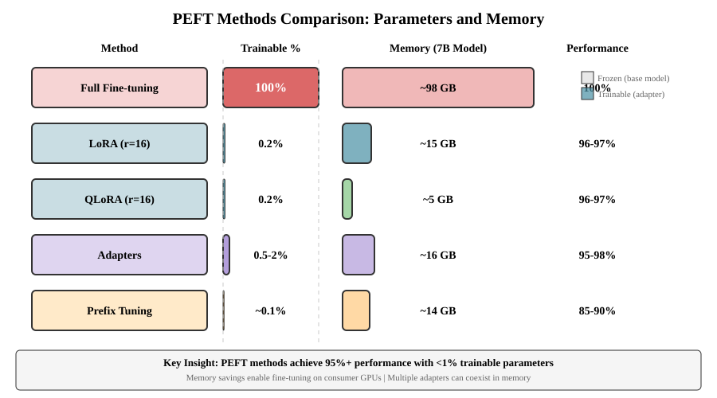
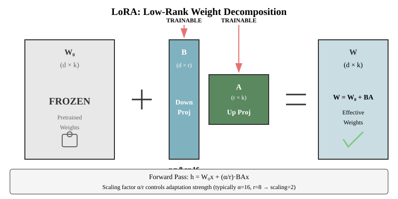
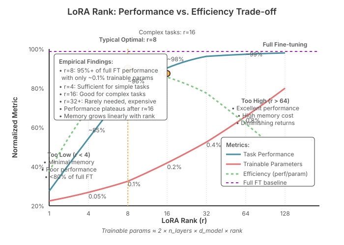
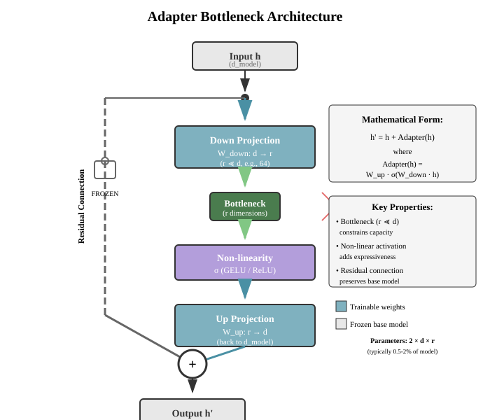

# Chapter 20: LoRA and Parameter-Efficient Fine-tuning

Parameter-Efficient Fine-Tuning (PEFT) methods enable adapting large language models to specific tasks while updating only a small fraction of parameters. LoRA and its variants have become the dominant approach for fine-tuning LLMs efficiently. This chapter covers the mathematics, implementation, and practical considerations for PEFT methods.

## Table of Contents

1. [The Fine-tuning Problem](#the-fine-tuning-problem)
2. [Low-Rank Adaptation (LoRA)](#low-rank-adaptation-lora)
   - [Mathematical Foundation](#mathematical-foundation)
   - [Implementation](#implementation)
   - [Rank Selection](#rank-selection)
3. [QLoRA: Quantized LoRA](#qlora-quantized-lora)
   - [4-bit NormalFloat Quantization](#4-bit-normalfloat-quantization)
   - [Double Quantization](#double-quantization)
4. [Prefix Tuning and Prompt Tuning](#prefix-tuning-and-prompt-tuning)
5. [Adapters](#adapters)
6. [Other PEFT Methods](#other-peft-methods)
   - [IA³ (Infused Adapter by Inhibiting and Amplifying)](#ia3)
   - [(IA)³](#ia3-squared)
7. [When to Use PEFT vs Full Fine-tuning](#when-to-use-peft-vs-full-fine-tuning)
8. [Performance Benchmarks and Comparisons](#performance-benchmarks-and-comparisons)
   - [Empirical Performance Results](#empirical-performance-results)
   - [Training Time Comparison](#training-time-comparison)
   - [Inference Performance](#inference-performance)
   - [Failure Modes and Limitations](#failure-modes-and-limitations)
9. [Advanced LoRA Techniques](#advanced-lora-techniques)
   - [DoRA (Weight-Decomposed Low-Rank Adaptation)](#dora)
   - [LoRA+](#lora-plus)
   - [Multi-LoRA Serving](#multi-lora-serving)
10. [Putting It All Together](#putting-it-all-together)

---

## The Fine-tuning Problem

### Memory Requirements of Full Fine-tuning

Full fine-tuning requires storing:

1. Model parameters: $\theta \in \mathbb{R}^d$
2. Gradients: $\nabla_\theta \mathcal{L} \in \mathbb{R}^d$
3. Optimizer states (for AdamW):
   - First moment: $m \in \mathbb{R}^d$
   - Second moment: $v \in \mathbb{R}^d$

**Total memory**: $\sim 4d$ parameters for FP32 or $\sim 2d$ for mixed precision training.

```python
def calculate_full_finetuning_memory(model_params_billions: float, precision: str = "fp16"):
    """
    Calculate memory requirements for full fine-tuning.

    Args:
        model_params_billions: Number of parameters in billions
        precision: "fp32" or "fp16"

    Returns:
        Memory in GB
    """
    bytes_per_param = 4 if precision == "fp32" else 2

    # Model weights
    model_memory = model_params_billions * 1e9 * bytes_per_param

    # Gradients (same size as model)
    gradient_memory = model_memory

    # Optimizer states (AdamW: 2x for first and second moments)
    # Stored in FP32 for numerical stability
    optimizer_memory = model_params_billions * 1e9 * 4 * 2

    # Total in GB
    total_gb = (model_memory + gradient_memory + optimizer_memory) / 1e9

    return {
        'model_gb': model_memory / 1e9,
        'gradients_gb': gradient_memory / 1e9,
        'optimizer_gb': optimizer_memory / 1e9,
        'total_gb': total_gb
    }

# Example: LLaMA 7B
memory = calculate_full_finetuning_memory(7, precision="fp16")
print(f"Full fine-tuning 7B model:")
print(f"  Model: {memory['model_gb']:.1f} GB")
print(f"  Gradients: {memory['gradients_gb']:.1f} GB")
print(f"  Optimizer: {memory['optimizer_gb']:.1f} GB")
print(f"  Total: {memory['total_gb']:.1f} GB")
# Output: ~98 GB for 7B model!
```

### The PEFT Solution

PEFT methods freeze the base model weights and train only a small number of additional parameters:

```math
\text{Trainable parameters} = \frac{\text{PEFT params}}{\text{Total params}} \times 100\%
```

Typical values: 0.01% - 1% of total parameters.

**Key benefits:**

1. **Memory efficiency**: Only store optimizer states for trainable parameters
2. **Modularity**: Multiple adapters can be trained and swapped
3. **Reduced catastrophic forgetting**: Base model remains unchanged
4. **Fast switching**: Load different adapters for different tasks



*Figure: Comparison of PEFT methods showing trainable parameter percentages, memory requirements, and performance. LoRA and QLoRA achieve 96-97% of full fine-tuning performance while training only 0.2% of parameters and using dramatically less memory.*

---

## Low-Rank Adaptation (LoRA)

LoRA is the most popular PEFT method, introduced by Microsoft in 2021. The key insight: weight updates during fine-tuning have low "intrinsic rank."

### Mathematical Foundation

For a pretrained weight matrix $W_0 \in \mathbb{R}^{d \times k}$, LoRA represents the update as:

```math
W = W_0 + \Delta W = W_0 + BA
```

where:

- $B \in \mathbb{R}^{d \times r}$ (down-projection)
- $A \in \mathbb{R}^{r \times k}$ (up-projection)
- $r \ll \min(d, k)$ is the rank

The forward pass becomes:

```math
h = W_0 x + \Delta W x = W_0 x + BAx
```

**Scaling factor**: LoRA includes a scaling factor $\alpha$ to control the magnitude of updates:

```math
h = W_0 x + \frac{\alpha}{r} BAx
```

The ratio $\frac{\alpha}{r}$ acts as a learning rate multiplier for the adapter.



*Figure: LoRA decomposes weight updates into low-rank matrices B and A. The pretrained weights W₀ remain frozen while only the small matrices B and A are trained, dramatically reducing parameters while maintaining performance.*

#### Why Low Rank Works

**Aghajanyan et al. (2020)** showed that pre-trained models have a low "intrinsic dimension" - the task-specific adaptation can be performed in a much lower-dimensional subspace.

Empirically, rank $r=8$ or $r=16$ often achieves 95%+ of full fine-tuning performance while updating only 0.1-0.5% of parameters.

### Implementation

```python
import torch
import torch.nn as nn
import torch.nn.functional as F
import math

class LoRALayer(nn.Module):
    """
    LoRA (Low-Rank Adaptation) layer.

    Implements: h = W_0 x + (alpha/r) * B A x

    where W_0 is frozen, B and A are trainable.
    """

    def __init__(
        self,
        in_features: int,
        out_features: int,
        rank: int = 8,
        alpha: float = 16.0,
        dropout: float = 0.0
    ):
        super().__init__()
        self.rank = rank
        self.alpha = alpha
        self.scaling = alpha / rank

        # LoRA matrices
        self.lora_A = nn.Parameter(torch.zeros(rank, in_features))
        self.lora_B = nn.Parameter(torch.zeros(out_features, rank))
        self.dropout = nn.Dropout(dropout) if dropout > 0 else nn.Identity()

        # Initialize A with Kaiming uniform, B with zeros
        # This ensures ∆W = BA = 0 at initialization
        nn.init.kaiming_uniform_(self.lora_A, a=math.sqrt(5))
        nn.init.zeros_(self.lora_B)

    def forward(self, x: torch.Tensor) -> torch.Tensor:
        """
        Compute LoRA update: (alpha/r) * B @ A @ x

        Args:
            x: Input tensor [batch, seq_len, in_features]

        Returns:
            LoRA output [batch, seq_len, out_features]
        """
        # x: [B, L, in_features]
        # A: [rank, in_features]
        # B: [out_features, rank]

        # Efficient computation: (B @ A) @ x is slower than B @ (A @ x)
        # when rank << min(in_features, out_features)

        x = self.dropout(x)
        # x @ A^T: [B, L, in_features] @ [in_features, rank] -> [B, L, rank]
        result = x @ self.lora_A.T
        # result @ B^T: [B, L, rank] @ [rank, out_features] -> [B, L, out_features]
        result = result @ self.lora_B.T

        return self.scaling * result


class LinearWithLoRA(nn.Module):
    """
    Linear layer with LoRA adapter.

    Implements: output = W_0 @ x + (alpha/r) * B @ A @ x
    """

    def __init__(
        self,
        in_features: int,
        out_features: int,
        rank: int = 8,
        alpha: float = 16.0,
        dropout: float = 0.0,
        bias: bool = True
    ):
        super().__init__()

        # Original linear layer (frozen)
        self.linear = nn.Linear(in_features, out_features, bias=bias)

        # Freeze base weights
        self.linear.weight.requires_grad = False
        if bias:
            self.linear.bias.requires_grad = False

        # LoRA adapter
        self.lora = LoRALayer(in_features, out_features, rank, alpha, dropout)

    def forward(self, x: torch.Tensor) -> torch.Tensor:
        """Forward pass combining base layer and LoRA."""
        # Base layer (frozen)
        base_output = self.linear(x)

        # LoRA adapter (trainable)
        lora_output = self.lora(x)

        return base_output + lora_output

    def merge_weights(self):
        """
        Merge LoRA weights into base weights for inference.

        This eliminates the runtime overhead of computing LoRA separately.
        After merging: W = W_0 + (alpha/r) * B @ A
        """
        if self.lora is not None:
            # Compute ∆W = (alpha/r) * B @ A
            delta_w = (self.lora.scaling *
                      self.lora.lora_B @ self.lora.lora_A)

            # Merge into base weights
            self.linear.weight.data += delta_w

            # Remove LoRA to save memory
            self.lora = None

    def unmerge_weights(self):
        """Unmerge LoRA weights from base weights (reverse of merge)."""
        if self.lora is None:
            raise ValueError("LoRA is not present - cannot unmerge")

        delta_w = (self.lora.scaling *
                  self.lora.lora_B @ self.lora.lora_A)
        self.linear.weight.data -= delta_w


class MultiHeadAttentionWithLoRA(nn.Module):
    """
    Multi-head attention with LoRA on Q, K, V projections.

    Standard practice: Apply LoRA to query and value projections.
    Can optionally apply to key and output projections as well.
    """

    def __init__(
        self,
        d_model: int,
        n_heads: int,
        rank: int = 8,
        alpha: float = 16.0,
        lora_targets: list[str] = ['q', 'v'],
        dropout: float = 0.0
    ):
        super().__init__()
        assert d_model % n_heads == 0

        self.d_model = d_model
        self.n_heads = n_heads
        self.head_dim = d_model // n_heads
        self.lora_targets = lora_targets

        # Create Q, K, V projections
        # Apply LoRA only to specified targets
        self.q_proj = self._make_projection('q', d_model, rank, alpha, dropout)
        self.k_proj = self._make_projection('k', d_model, rank, alpha, dropout)
        self.v_proj = self._make_projection('v', d_model, rank, alpha, dropout)
        self.out_proj = self._make_projection('o', d_model, rank, alpha, dropout)

        self.dropout = nn.Dropout(dropout)

    def _make_projection(self, name, d_model, rank, alpha, dropout):
        """Create projection with or without LoRA based on targets."""
        if name in self.lora_targets:
            return LinearWithLoRA(d_model, d_model, rank, alpha, dropout, bias=False)
        else:
            proj = nn.Linear(d_model, d_model, bias=False)
            proj.weight.requires_grad = False  # Freeze
            return proj

    def forward(self, x: torch.Tensor, mask: torch.Tensor = None) -> torch.Tensor:
        """
        Args:
            x: Input [batch, seq_len, d_model]
            mask: Attention mask [batch, seq_len, seq_len]

        Returns:
            Output [batch, seq_len, d_model]
        """
        batch_size, seq_len, d_model = x.shape

        # Project to Q, K, V
        Q = self.q_proj(x)  # [B, L, d_model]
        K = self.k_proj(x)
        V = self.v_proj(x)

        # Reshape for multi-head attention
        Q = Q.view(batch_size, seq_len, self.n_heads, self.head_dim).transpose(1, 2)
        K = K.view(batch_size, seq_len, self.n_heads, self.head_dim).transpose(1, 2)
        V = V.view(batch_size, seq_len, self.n_heads, self.head_dim).transpose(1, 2)
        # Now: [batch, n_heads, seq_len, head_dim]

        # Scaled dot-product attention
        scores = torch.matmul(Q, K.transpose(-2, -1)) / math.sqrt(self.head_dim)

        if mask is not None:
            scores = scores.masked_fill(mask == 0, float('-inf'))

        attn_weights = F.softmax(scores, dim=-1)
        attn_weights = self.dropout(attn_weights)

        # Apply attention to values
        attn_output = torch.matmul(attn_weights, V)

        # Reshape and project output
        attn_output = attn_output.transpose(1, 2).contiguous()
        attn_output = attn_output.view(batch_size, seq_len, d_model)

        output = self.out_proj(attn_output)

        return output


def count_parameters(model: nn.Module) -> dict[str, int]:
    """Count trainable and total parameters."""
    trainable = sum(p.numel() for p in model.parameters() if p.requires_grad)
    total = sum(p.numel() for p in model.parameters())

    return {
        'trainable': trainable,
        'total': total,
        'percentage': 100 * trainable / total if total > 0 else 0
    }


# Example usage
def example_lora_layer():
    """Demonstrate LoRA layer usage."""
    d_model = 768
    batch_size = 4
    seq_len = 128

    # Create layer with LoRA
    layer = LinearWithLoRA(
        in_features=d_model,
        out_features=d_model,
        rank=8,
        alpha=16.0
    )

    # Count parameters
    params = count_parameters(layer)
    print(f"Trainable: {params['trainable']:,} ({params['percentage']:.2f}%)")
    print(f"Total: {params['total']:,}")

    # Forward pass
    x = torch.randn(batch_size, seq_len, d_model)
    output = layer(x)

    print(f"Input shape: {x.shape}")
    print(f"Output shape: {output.shape}")

    # Merge weights for inference
    layer.merge_weights()
    output_merged = layer(x)

    # Should be identical after merging
    print(f"Max difference after merge: {(output - output_merged).abs().max().item():.2e}")
```

### Rank Selection

Choosing the right rank $r$ is critical for balancing performance and efficiency.

**LoRA Rank Trade-off Visualization:**



The visualization above shows the empirical relationship between LoRA rank and performance. Task performance improves logarithmically with rank, with r=8 achieving ~95% of full fine-tuning performance while training only 0.1% of parameters. Beyond r=16, improvements plateau while memory costs continue to grow linearly. The sweet spot for most tasks is r=8 to r=16, offering excellent performance-to-parameter ratios.

```python
import torch
import torch.nn as nn
from typing import Optional

class RankSelectionExperiments:
    """
    Experiments to guide rank selection for LoRA.

    Key findings from Hu et al. (2021):

    - r=8 achieves 95%+ of full fine-tuning performance
    - Higher ranks have diminishing returns
    - Optimal rank depends on task complexity

    """

    @staticmethod
    def estimate_rank_for_task(
        task_complexity: str,
        model_size: str,
        available_memory_gb: float
    ) -> dict:
        """
        Suggest LoRA rank based on task and constraints.

        Args:
            task_complexity: "simple", "medium", "complex"
            model_size: "small" (<3B), "medium" (3-13B), "large" (>13B)
            available_memory_gb: Available GPU memory

        Returns:
            Recommended configuration
        """
        # Rank recommendations based on task complexity
        rank_map = {
            'simple': {'small': 4, 'medium': 8, 'large': 8},
            'medium': {'small': 8, 'medium': 16, 'large': 16},
            'complex': {'small': 16, 'medium': 32, 'large': 64}
        }

        rank = rank_map[task_complexity][model_size]

        # Alpha typically 2x rank for good balance
        alpha = 2 * rank

        return {
            'rank': rank,
            'alpha': alpha,
            'expected_trainable_pct': RankSelectionExperiments._estimate_trainable_pct(rank),
            'memory_overhead_gb': RankSelectionExperiments._estimate_memory_overhead(
                rank, model_size, available_memory_gb
            )
        }

    @staticmethod
    def _estimate_trainable_pct(rank: int) -> float:
        """
        Estimate percentage of trainable parameters.

        For transformers with LoRA on Q, V projections:
        Trainable ≈ (2 * n_layers * d_model * rank) / total_params
        """
        # Rough estimates for different ranks
        # (assumes standard transformer, LoRA on Q and V)
        rank_to_pct = {
            4: 0.05,
            8: 0.1,
            16: 0.2,
            32: 0.4,
            64: 0.8
        }
        return rank_to_pct.get(rank, rank * 0.0125)

    @staticmethod
    def _estimate_memory_overhead(rank: int, model_size: str, available_gb: float) -> float:
        """Estimate additional memory for LoRA parameters and optimizer states."""
        # Memory overhead is roughly proportional to rank
        # and model size
        size_multiplier = {'small': 1, 'medium': 2, 'large': 4}[model_size]

        # AdamW stores 2x optimizer states (in FP32)
        # Total: LoRA params (FP16) + optimizer states (FP32) ≈ 3x LoRA params
        overhead_gb = (rank / 8) * 0.5 * size_multiplier

        return overhead_gb


def analyze_rank_impact():
    """
    Analyze impact of different ranks on model capacity.

    Key insight: Adding parameters via low rank gives diminishing returns.
    """
    import matplotlib.pyplot as plt

    d_model = 4096
    ranks = [1, 2, 4, 8, 16, 32, 64, 128, 256]

    params_per_layer = []
    for r in ranks:
        # LoRA on Q and V: 2 * (d_model * r + r * d_model)
        params = 2 * (2 * d_model * r)
        params_per_layer.append(params)

    # Plot
    plt.figure(figsize=(10, 6))
    plt.plot(ranks, [p / 1e6 for p in params_per_layer], marker='o')
    plt.xlabel('Rank (r)')
    plt.ylabel('Trainable Parameters (millions) per layer')
    plt.title('LoRA Parameters vs Rank')
    plt.xscale('log', base=2)
    plt.grid(True, alpha=0.3)
    plt.axvline(x=8, color='r', linestyle='--', label='Recommended: r=8')
    plt.legend()
    plt.tight_layout()
    plt.savefig('lora_rank_analysis.png', dpi=150)
    plt.close()

    # Print table
    print("Rank | Params/layer | Full model % (32L, 4B total)")
    print("-" * 50)
    for r, p in zip(ranks, params_per_layer):
        pct = (p * 32) / 4e9 * 100  # 32 layers, 4B total params
        print(f"{r:4d} | {p/1e6:8.2f}M | {pct:6.3f}%")


# Task-specific rank recommendations
RANK_RECOMMENDATIONS = {
    'instruction_following': {
        'description': 'General instruction tuning',
        'rank': 8,
        'alpha': 16,
        'lora_targets': ['q_proj', 'v_proj']
    },
    'math_reasoning': {
        'description': 'Mathematical reasoning and problem solving',
        'rank': 32,
        'alpha': 64,
        'lora_targets': ['q_proj', 'k_proj', 'v_proj', 'o_proj']
    },
    'code_generation': {
        'description': 'Code generation and completion',
        'rank': 16,
        'alpha': 32,
        'lora_targets': ['q_proj', 'v_proj', 'gate_proj', 'up_proj']
    },
    'summarization': {
        'description': 'Text summarization',
        'rank': 8,
        'alpha': 16,
        'lora_targets': ['q_proj', 'v_proj']
    },
    'language_translation': {
        'description': 'Translation between languages',
        'rank': 16,
        'alpha': 32,
        'lora_targets': ['q_proj', 'k_proj', 'v_proj']
    },
    'domain_adaptation': {
        'description': 'Adapt to specific domain (medical, legal, etc.)',
        'rank': 64,
        'alpha': 128,
        'lora_targets': ['q_proj', 'k_proj', 'v_proj', 'o_proj', 'gate_proj', 'up_proj', 'down_proj']
    }
}
```

**Practical guidelines:**

1. **Start with r=8, α=16**: Good default for most tasks
2. **Complex tasks**: Use r=16 or r=32
3. **Memory constrained**: Use r=4
4. **Alpha**: Typically set to 2r (α=16 for r=8)
5. **Target modules**: At minimum, apply to Q and V projections

---

## QLoRA: Quantized LoRA

QLoRA enables fine-tuning of massive models (65B+) on consumer GPUs by combining LoRA with 4-bit quantization.

### Key Innovation

QLoRA introduces:

1. **4-bit NormalFloat (NF4)**: A data type optimized for normally distributed weights
2. **Double quantization**: Quantize the quantization constants
3. **Paged optimizers**: Use unified memory to avoid OOM

**Memory savings**: ~4x reduction over 16-bit LoRA.

### 4-bit NormalFloat Quantization

**The Problem:** Standard quantization methods (like uniform int4 or int8) are designed for uniformly distributed data. Neural network weights, however, follow a roughly Gaussian distribution. Using uniform quantization wastes precision in low-density regions while under-representing the high-density center.

**Theoretical Foundation:** NF4 (NormalFloat 4-bit) is an information-theoretically optimal quantization scheme for normally distributed data. The key insight comes from quantization theory: optimal quantization bins should have equal probability mass, not equal width.

**Mathematical Formulation:**

For a random variable $W \sim \mathcal{N}(0, 1)$, optimal k-bit quantization divides the distribution into $2^k$ bins such that:

```math
P(W \in \text{bin}_i) = \frac{1}{2^k} \quad \forall i
```

For NF4 ($k=4$, 16 bins), the quantization levels are:

```math
q_i = \Phi^{-1}\left(\frac{i}{16}\right) \quad \text{for } i = 0, 1, \ldots, 15
```

where $\Phi^{-1}$ is the inverse CDF (quantile function) of $\mathcal{N}(0,1)$.

**Why This Works:**

1. **Optimal Information Preservation**: Equal probability bins minimize expected quantization error for Gaussian distributions
2. **Higher Precision Where It Matters**: More bins near zero (where most weights concentrate) and fewer at extremes
3. **Empirically Validated**: Pre-trained LLM weights are approximately Gaussian after layer normalization
4. **Block-wise Quantization**: Normalizing weights block-by-block (typically 64 elements) before quantizing accounts for variance differences across the weight matrix

**Comparison to Alternatives:**

- vs **Uniform Int4**: ~30% lower quantization error on neural network weights
- vs **Int8**: Similar accuracy but 2x memory savings
- vs **Float16**: 4x memory savings with minimal accuracy loss (<1%)

**Key Insight:** The success of NF4 demonstrates that domain-specific quantization schemes dramatically outperform generic ones. By exploiting the known statistical properties of neural network weights (Gaussian distribution), we can achieve 4-bit precision with accuracy close to 16-bit. This is a prime example of how theoretical understanding (quantization theory + empirical weight distributions) leads to practical breakthroughs.

```python
import torch
import torch.nn as nn
import numpy as np

class NF4Quantizer:
    """
    4-bit NormalFloat (NF4) quantization for QLoRA.

    Key insight: Neural network weights follow a normal distribution.
    Use quantization bins optimized for N(0,1) distribution.

    Reference: Dettmers et al., "QLoRA: Efficient Finetuning of Quantized LLMs" (2023)
    https://arxiv.org/abs/2305.14314
    """

    # NF4 quantization levels (16 values for 4 bits)
    # These are optimized for standard normal distribution
    NF4_QUANTILES = torch.tensor([
        -1.0,
        -0.6961928009986877,
        -0.5250730514526367,
        -0.39491748809814453,
        -0.28444138169288635,
        -0.18477343022823334,
        -0.09105003625154495,
        0.0,
        0.07958029955625534,
        0.16093020141124725,
        0.24611230194568634,
        0.33791524171829224,
        0.44070982933044434,
        0.5626170039176941,
        0.7229568362236023,
        1.0,
    ])

    @staticmethod
    def quantize(
        tensor: torch.Tensor,
        block_size: int = 64
    ) -> tuple[torch.Tensor, torch.Tensor]:
        """
        Quantize tensor to 4-bit NormalFloat.

        Args:
            tensor: FP16/FP32 tensor to quantize
            block_size: Block size for quantization (typically 64)

        Returns:
            Quantized tensor (int4) and scales (FP16)
        """
        original_shape = tensor.shape
        tensor_flat = tensor.flatten()

        # Pad to multiple of block_size
        n_blocks = (len(tensor_flat) + block_size - 1) // block_size
        padded_size = n_blocks * block_size
        if len(tensor_flat) < padded_size:
            tensor_flat = torch.cat([
                tensor_flat,
                torch.zeros(padded_size - len(tensor_flat), device=tensor.device)
            ])

        # Reshape into blocks
        tensor_blocks = tensor_flat.view(n_blocks, block_size)

        # Compute per-block scale (absmax)
        scales = tensor_blocks.abs().max(dim=1, keepdim=True).values
        scales = scales.clamp(min=1e-8)  # Avoid division by zero

        # Normalize to [-1, 1]
        normalized = tensor_blocks / scales

        # Quantize: Find nearest NF4 quantile
        nf4_levels = NF4Quantizer.NF4_QUANTILES.to(tensor.device)
        quantized = torch.zeros_like(normalized, dtype=torch.uint8)

        for i in range(n_blocks):
            for j in range(block_size):
                val = normalized[i, j]
                # Find closest quantile
                distances = torch.abs(nf4_levels - val)
                quantized[i, j] = torch.argmin(distances)

        return quantized, scales.squeeze()

    @staticmethod
    def dequantize(
        quantized: torch.Tensor,
        scales: torch.Tensor,
        block_size: int = 64
    ) -> torch.Tensor:
        """
        Dequantize NF4 tensor back to FP16.

        Args:
            quantized: Quantized tensor (uint8 with values 0-15)
            scales: Per-block scales
            block_size: Block size used during quantization

        Returns:
            Dequantized FP16 tensor
        """
        nf4_levels = NF4Quantizer.NF4_QUANTILES.to(quantized.device)

        # Map quantized indices to NF4 values
        dequantized = nf4_levels[quantized]

        # Reshape and apply scales
        n_blocks = len(scales)
        dequantized = dequantized.view(n_blocks, block_size)
        dequantized = dequantized * scales.unsqueeze(1)

        return dequantized.flatten()


class DoubleQuantization:
    """
    Double quantization: Quantize the quantization constants themselves.

    Typical model: 32M parameters, block_size=64

    - Number of blocks: 32M / 64 = 500K blocks
    - Scales (FP16): 500K * 2 bytes = 1 MB

    With double quantization (8-bit):

    - Scales (INT8): 500K * 1 byte = 0.5 MB
    - Second-level scales: ~8 KB
    - Total: 0.508 MB (save ~0.5 MB per 32M params)

    Savings: ~3% additional memory reduction on top of NF4.
    """

    @staticmethod
    def quantize_scales(
        scales: torch.Tensor,
        second_block_size: int = 256
    ) -> tuple[torch.Tensor, torch.Tensor]:
        """
        Quantize scales to 8-bit.

        Args:
            scales: FP16 scales from first quantization
            second_block_size: Block size for second-level quantization

        Returns:
            Quantized scales (int8) and second-level scales (fp16)
        """
        n_blocks = (len(scales) + second_block_size - 1) // second_block_size

        # Pad scales
        padded_size = n_blocks * second_block_size
        if len(scales) < padded_size:
            scales = torch.cat([
                scales,
                torch.zeros(padded_size - len(scales), device=scales.device)
            ])

        scales_blocks = scales.view(n_blocks, second_block_size)

        # Compute second-level scales
        second_scales = scales_blocks.abs().max(dim=1, keepdim=True).values
        second_scales = second_scales.clamp(min=1e-8)

        # Quantize to 8-bit
        normalized = scales_blocks / second_scales
        quantized_scales = torch.clamp(
            torch.round(normalized * 127),
            -128, 127
        ).to(torch.int8)

        return quantized_scales, second_scales.squeeze()

    @staticmethod
    def dequantize_scales(
        quantized_scales: torch.Tensor,
        second_scales: torch.Tensor,
        second_block_size: int = 256
    ) -> torch.Tensor:
        """Dequantize scales back to FP16."""
        n_blocks = len(second_scales)
        quantized_scales = quantized_scales.view(n_blocks, second_block_size)

        # Dequantize
        scales = quantized_scales.float() / 127.0
        scales = scales * second_scales.unsqueeze(1)

        return scales.flatten()


class QLoRALinear(nn.Module):
    """
    Linear layer with QLoRA: 4-bit base weights + 16-bit LoRA adapter.

    Storage:

    - Base weights: 4 bits per parameter (NF4)
    - LoRA adapters: 16 bits per parameter (BF16)
    - Scales: ~1-2 bits per 64 parameters (with double quantization)

    During forward pass:

    1. Dequantize base weights to BF16
    2. Compute base output
    3. Compute LoRA output (in BF16)
    4. Sum outputs

    During backward pass:

    - Only LoRA parameters receive gradients
    - Base weights remain frozen

    """

    def __init__(
        self,
        in_features: int,
        out_features: int,
        rank: int = 8,
        alpha: float = 16.0,
        block_size: int = 64,
        compute_dtype: torch.dtype = torch.bfloat16
    ):
        super().__init__()
        self.in_features = in_features
        self.out_features = out_features
        self.block_size = block_size
        self.compute_dtype = compute_dtype

        # Quantized base weights (will be initialized from pretrained weights)
        self.register_buffer('weight_quantized', torch.zeros(
            out_features, in_features, dtype=torch.uint8
        ))
        self.register_buffer('weight_scales', torch.zeros(
            (out_features * in_features + block_size - 1) // block_size,
            dtype=torch.float16
        ))

        # LoRA adapters (trainable, in BF16)
        self.lora = LoRALayer(in_features, out_features, rank, alpha)

        # Move LoRA to compute dtype
        self.lora = self.lora.to(compute_dtype)

    def forward(self, x: torch.Tensor) -> torch.Tensor:
        """
        Forward pass with quantized base and BF16 LoRA.

        Args:
            x: Input [batch, seq_len, in_features] in compute_dtype

        Returns:
            Output [batch, seq_len, out_features] in compute_dtype
        """
        # Dequantize base weights on-the-fly
        weight_deq = NF4Quantizer.dequantize(
            self.weight_quantized.flatten(),
            self.weight_scales,
            self.block_size
        )
        weight_deq = weight_deq.view(self.out_features, self.in_features)
        weight_deq = weight_deq.to(self.compute_dtype)

        # Base output (frozen)
        base_output = F.linear(x, weight_deq)

        # LoRA output (trainable)
        lora_output = self.lora(x)

        return base_output + lora_output

    @classmethod
    def from_pretrained_linear(
        cls,
        linear: nn.Linear,
        rank: int = 8,
        alpha: float = 16.0,
        block_size: int = 64
    ):
        """
        Create QLoRALinear from pretrained Linear layer.

        Args:
            linear: Pretrained nn.Linear layer
            rank: LoRA rank
            alpha: LoRA alpha
            block_size: NF4 block size

        Returns:
            QLoRALinear instance with quantized weights
        """
        qlora = cls(
            linear.in_features,
            linear.out_features,
            rank=rank,
            alpha=alpha,
            block_size=block_size
        )

        # Quantize pretrained weights
        weight_quantized, scales = NF4Quantizer.quantize(
            linear.weight.data,
            block_size=block_size
        )

        qlora.weight_quantized = weight_quantized
        qlora.weight_scales = scales

        return qlora


def compare_qlora_memory():
    """Compare memory usage: Full FP16 vs LoRA vs QLoRA."""

    model_size_b = 7  # 7B parameters
    params = model_size_b * 1e9

    # Full fine-tuning (FP16)
    full_ft = {
        'weights': params * 2 / 1e9,  # FP16
        'gradients': params * 2 / 1e9,
        'optimizer': params * 8 / 1e9,  # AdamW: 2 moments in FP32
        'total': params * 12 / 1e9
    }

    # LoRA (rank=8, FP16 base)
    lora_params = params * 0.001  # ~0.1% trainable
    lora = {
        'base_weights': params * 2 / 1e9,  # FP16, frozen
        'lora_weights': lora_params * 2 / 1e9,  # FP16
        'gradients': lora_params * 2 / 1e9,
        'optimizer': lora_params * 8 / 1e9,
        'total': (params * 2 + lora_params * 12) / 1e9
    }

    # QLoRA (rank=8, 4-bit base)
    qlora = {
        'base_weights': params * 0.5 / 1e9,  # 4-bit NF4
        'lora_weights': lora_params * 2 / 1e9,  # FP16
        'gradients': lora_params * 2 / 1e9,
        'optimizer': lora_params * 8 / 1e9,
        'total': (params * 0.5 + lora_params * 12) / 1e9
    }

    print(f"Memory comparison for {model_size_b}B parameter model:")
    print(f"\nFull Fine-tuning (FP16):")
    print(f"  Total: {full_ft['total']:.1f} GB")

    print(f"\nLoRA (rank=8, FP16 base):")
    print(f"  Total: {lora['total']:.1f} GB")
    print(f"  Savings: {(1 - lora['total']/full_ft['total'])*100:.1f}%")

    print(f"\nQLoRA (rank=8, 4-bit base):")
    print(f"  Total: {qlora['total']:.1f} GB")
    print(f"  Savings vs full FT: {(1 - qlora['total']/full_ft['total'])*100:.1f}%")
    print(f"  Savings vs LoRA: {(1 - qlora['total']/lora['total'])*100:.1f}%")

# Example output:
# Memory comparison for 7B parameter model:
#
# Full Fine-tuning (FP16):
#   Total: 84.0 GB
#
# LoRA (rank=8, FP16 base):
#   Total: 14.8 GB
#   Savings: 82.4%
#
# QLoRA (rank=8, 4-bit base):
#   Total: 4.3 GB
#   Savings vs full FT: 94.9%
#   Savings vs LoRA: 71.0%
```

### Double Quantization

Double quantization applies quantization to the quantization constants (scales):

```math
\begin{align}
\text{First level:} \quad W &= \text{scale}_1 \cdot W_{\text{4bit}} \\
\text{Second level:} \quad \text{scale}_1 &= \text{scale}_2 \cdot \text{scale}_{1,\text{8bit}}
\end{align}
```

This provides an additional ~3% memory reduction with negligible quality loss.

**Key Paper:**

- [QLoRA: Efficient Finetuning of Quantized LLMs](https://arxiv.org/abs/2305.14314) (Dettmers et al., 2023)

---

## Prefix Tuning and Prompt Tuning

Prefix tuning prepends trainable vectors to the input sequence, while prompt tuning only prepends to the embedding layer.

### Prefix Tuning

**The Problem:** LoRA modifies the weights of the model directly, which requires storing separate weight modifications for each task. Can we instead modify the *context* the model sees without changing its weights?

**Theoretical Foundation:** Prefix tuning is based on the insight that transformer attention is context-dependent. By prepending learned "virtual tokens" to the key and value sequences at each layer, we can steer the model's behavior without modifying any original parameters. This is analogous to providing a learned "task instruction" that persists through all layers.

**Mathematical Formulation:**

For standard attention:

```math
\text{Attention}(Q, K, V) = \text{softmax}\left(\frac{QK^T}{\sqrt{d_k}}\right)V
```

With prefix tuning, we augment K and V:

```math
\text{Attention}(Q, [P_{K}; K], [P_{V}; V])
```

where $P_{K} \in \mathbb{R}^{L_p \times d_k}$ and $P_{V} \in \mathbb{R}^{L_p \times d_v}$ are learned prefix parameters of length $L_p$.

**Why This Works:**

1. **Attention Mechanism**: Since attention computes weighted combinations of values based on query-key similarity, prefix keys/values act as task-specific "memory" that influences all tokens
2. **Layer-specific Adaptation**: Different prefixes at each layer allow hierarchical task specification (low-level features vs high-level semantics)
3. **Reparameterization Trick**: Using an MLP to generate prefixes (rather than optimizing them directly) improves training stability by providing a smoother optimization landscape

**Comparison to Alternatives:**

- vs **LoRA**: Prefix tuning modifies activations (context) rather than weights; more interpretable but potentially less powerful
- vs **Prompt Tuning**: More parameters (prefix at every layer vs only input), but more expressive
- vs **Full Fine-tuning**: Orders of magnitude fewer parameters (~0.1% vs 100%)

**Key Insight:** The effectiveness of prefix tuning demonstrates that LLMs can be controlled through their attention context rather than their parameters. This is why it works particularly well for generation tasks where steering output is more important than learning new knowledge.

```python
class PrefixTuning(nn.Module):
    """
    Prefix tuning: Add trainable prefix vectors to K and V at each layer.

    Instead of modifying weights, we prepend learned "prefix" tokens
    to the key and value sequences in each transformer layer.

    Reference: Li & Liang, "Prefix-Tuning: Optimizing Continuous Prompts
    for Generation" (ACL 2021)
    https://arxiv.org/abs/2101.00190
    """

    def __init__(
        self,
        n_layers: int,
        n_heads: int,
        head_dim: int,
        prefix_length: int = 20,
        dropout: float = 0.1
    ):
        super().__init__()
        self.n_layers = n_layers
        self.n_heads = n_heads
        self.head_dim = head_dim
        self.prefix_length = prefix_length

        # Learned prefix parameters for each layer
        # Shape: [n_layers, 2, prefix_length, n_heads, head_dim]
        # 2 for K and V
        self.prefix = nn.Parameter(torch.randn(
            n_layers, 2, prefix_length, n_heads, head_dim
        ) * 0.02)

        # Optional: Use MLP reparameterization
        # Instead of directly optimizing prefix, optimize an MLP
        # that generates the prefix (helps with training stability)
        self.use_mlp_reparameterization = True
        if self.use_mlp_reparameterization:
            hidden_size = n_heads * head_dim
            self.prefix_mlp = nn.Sequential(
                nn.Linear(hidden_size, hidden_size),
                nn.Tanh(),
                nn.Linear(hidden_size, 2 * n_heads * head_dim)
            )

        self.dropout = nn.Dropout(dropout)

    def get_prefix(self, layer_idx: int, batch_size: int) -> tuple[torch.Tensor, torch.Tensor]:
        """
        Get prefix K and V for a specific layer.

        Args:
            layer_idx: Layer index
            batch_size: Batch size to expand prefix

        Returns:
            prefix_k, prefix_v: [batch, n_heads, prefix_length, head_dim]
        """
        if self.use_mlp_reparameterization:
            # Reparameterize through MLP
            prefix_flat = self.prefix[layer_idx].view(2, self.prefix_length, -1)
            prefix_hidden = self.prefix_mlp(prefix_flat)
            prefix_kv = prefix_hidden.view(
                2, self.prefix_length, self.n_heads, self.head_dim
            )
        else:
            prefix_kv = self.prefix[layer_idx]

        # Split into K and V
        prefix_k = prefix_kv[0]  # [prefix_length, n_heads, head_dim]
        prefix_v = prefix_kv[1]

        # Expand for batch
        prefix_k = prefix_k.unsqueeze(0).expand(batch_size, -1, -1, -1)
        prefix_v = prefix_v.unsqueeze(0).expand(batch_size, -1, -1, -1)

        # Transpose to [batch, n_heads, prefix_length, head_dim]
        prefix_k = prefix_k.transpose(1, 2)
        prefix_v = prefix_v.transpose(1, 2)

        return self.dropout(prefix_k), self.dropout(prefix_v)

    def forward(
        self,
        layer_idx: int,
        K: torch.Tensor,
        V: torch.Tensor
    ) -> tuple[torch.Tensor, torch.Tensor]:
        """
        Add prefix to K and V.

        Args:
            layer_idx: Current layer index
            K: Keys [batch, n_heads, seq_len, head_dim]
            V: Values [batch, n_heads, seq_len, head_dim]

        Returns:
            Modified K and V with prefix prepended
        """
        batch_size = K.shape[0]

        # Get prefix for this layer
        prefix_k, prefix_v = self.get_prefix(layer_idx, batch_size)

        # Concatenate prefix to K and V
        K_with_prefix = torch.cat([prefix_k, K], dim=2)
        V_with_prefix = torch.cat([prefix_v, V], dim=2)

        return K_with_prefix, V_with_prefix


class AttentionWithPrefix(nn.Module):
    """Multi-head attention with prefix tuning support."""

    def __init__(
        self,
        d_model: int,
        n_heads: int,
        layer_idx: int,
        prefix_tuning: Optional[PrefixTuning] = None
    ):
        super().__init__()
        self.d_model = d_model
        self.n_heads = n_heads
        self.head_dim = d_model // n_heads
        self.layer_idx = layer_idx
        self.prefix_tuning = prefix_tuning

        # Freeze QKV projections
        self.q_proj = nn.Linear(d_model, d_model, bias=False)
        self.k_proj = nn.Linear(d_model, d_model, bias=False)
        self.v_proj = nn.Linear(d_model, d_model, bias=False)
        self.out_proj = nn.Linear(d_model, d_model, bias=False)

        for param in [self.q_proj, self.k_proj, self.v_proj, self.out_proj]:
            param.weight.requires_grad = False

    def forward(self, x: torch.Tensor) -> torch.Tensor:
        batch_size, seq_len, _ = x.shape

        # Project to Q, K, V
        Q = self.q_proj(x).view(batch_size, seq_len, self.n_heads, self.head_dim)
        K = self.k_proj(x).view(batch_size, seq_len, self.n_heads, self.head_dim)
        V = self.v_proj(x).view(batch_size, seq_len, self.n_heads, self.head_dim)

        Q = Q.transpose(1, 2)
        K = K.transpose(1, 2)
        V = V.transpose(1, 2)

        # Add prefix if available
        if self.prefix_tuning is not None:
            K, V = self.prefix_tuning(self.layer_idx, K, V)

        # Attention
        scores = torch.matmul(Q, K.transpose(-2, -1)) / math.sqrt(self.head_dim)
        attn = F.softmax(scores, dim=-1)
        out = torch.matmul(attn, V)

        # Reshape and project
        out = out.transpose(1, 2).contiguous().view(batch_size, seq_len, self.d_model)
        out = self.out_proj(out)

        return out
```

### Prompt Tuning

Prompt tuning is simpler - only add trainable tokens to the input embedding:

**The Problem:** Prefix tuning requires storing prefixes for every layer, which can be memory-intensive. Can we achieve similar steering with even fewer parameters?

**Theoretical Foundation:** Prompt tuning is based on the observation that transformers propagate information from input embeddings through all layers via residual connections and attention. By optimizing only the input-layer "soft prompts," we can influence the entire model's behavior through this natural information flow.

**Mathematical Formulation:**

Given input token embeddings $E \in \mathbb{R}^{L \times d}$, we prepend learned soft prompts:

```math
E' = [P; E]
```

where $P \in \mathbb{R}^{L_p \times d}$ are trainable prompt embeddings. The rest of the model processes $E'$ normally, with prompts influencing computation through attention.

**Why This Works:**

1. **Scale Matters**: Research shows that prompt tuning becomes competitive with full fine-tuning only at large model scales (>10B parameters). Larger models have more capacity to leverage the prompt information
2. **Prompt Initialization**: Initializing prompts from vocabulary embeddings (rather than random) provides a better starting point by leveraging pre-trained semantic space
3. **Information Propagation**: Transformer residual connections ensure that input information (including prompts) influences all layers, not just early ones

**Comparison to Alternatives:**

- vs **Prefix Tuning**: 10-100x fewer parameters; works only for sufficiently large models
- vs **LoRA**: Even fewer parameters but lower performance ceiling; best for simple tasks
- vs **Hard Prompts**: Soft prompts are continuous and optimizable, allowing more precise task specification than discrete text prompts

**Key Insight:** Prompt tuning demonstrates that for sufficiently large models, task-specific behavior can be encoded in just a few learned tokens at the input. This extreme parameter efficiency comes at the cost of requiring larger base models to be effective.

```python
class PromptTuning(nn.Module):
    """
    Prompt tuning: Add trainable "soft prompts" to input embeddings.

    Simpler than prefix tuning - only modifies input layer, not every
    transformer layer.

    Reference: Lester et al., "The Power of Scale for Parameter-Efficient
    Prompt Tuning" (EMNLP 2021)
    https://arxiv.org/abs/2104.08691
    """

    def __init__(
        self,
        n_prompts: int,
        d_model: int,
        init_from_vocab: bool = True
    ):
        super().__init__()
        self.n_prompts = n_prompts
        self.d_model = d_model

        # Soft prompt embeddings
        self.soft_prompts = nn.Parameter(torch.randn(n_prompts, d_model))

        if init_from_vocab:
            # Initialize from vocabulary embeddings (helps training)
            nn.init.normal_(self.soft_prompts, mean=0.0, std=0.02)

    def forward(self, input_embeds: torch.Tensor) -> torch.Tensor:
        """
        Prepend soft prompts to input embeddings.

        Args:
            input_embeds: [batch, seq_len, d_model]

        Returns:
            Extended embeddings [batch, n_prompts + seq_len, d_model]
        """
        batch_size = input_embeds.shape[0]

        # Expand prompts for batch
        prompts = self.soft_prompts.unsqueeze(0).expand(batch_size, -1, -1)

        # Concatenate with input
        return torch.cat([prompts, input_embeds], dim=1)


def compare_prefix_methods():
    """Compare parameter counts for different prefix/prompt methods."""

    # Model config
    n_layers = 32
    d_model = 4096
    n_heads = 32
    head_dim = d_model // n_heads

    # Prefix/prompt lengths
    prefix_length = 20

    # Prefix tuning: [n_layers, 2 (K&V), prefix_length, n_heads, head_dim]
    prefix_params = n_layers * 2 * prefix_length * n_heads * head_dim

    # Prompt tuning: [n_prompts, d_model]
    prompt_params = prefix_length * d_model

    # LoRA (for comparison): rank=8 on Q,V projections
    rank = 8
    lora_params = n_layers * 2 * (2 * d_model * rank)  # 2 for Q and V

    print("Parameter counts (millions):")
    print(f"  Prefix tuning: {prefix_params/1e6:.2f}M")
    print(f"  Prompt tuning: {prompt_params/1e6:.2f}M")
    print(f"  LoRA (r=8): {lora_params/1e6:.2f}M")

    # As percentage of 7B model
    total_params = 7e9
    print(f"\nAs % of 7B model:")
    print(f"  Prefix tuning: {prefix_params/total_params*100:.4f}%")
    print(f"  Prompt tuning: {prompt_params/total_params*100:.4f}%")
    print(f"  LoRA (r=8): {lora_params/total_params*100:.4f}%")
```

**Comparison:**

- **Prompt tuning**: Simplest, fewest parameters (~0.01%)
- **Prefix tuning**: More expressive, more parameters (~0.1%)
- **LoRA**: Most flexible, moderate parameters (~0.1-0.5%)

**When to use:**

- **Prompt tuning**: Simple classification, few-shot learning
- **Prefix tuning**: Generation tasks, sequence-to-sequence
- **LoRA**: General purpose, best overall performance

---

## Adapters

Adapters insert small bottleneck layers within transformer blocks.

**The Problem:** LoRA modifies existing weight matrices, which means it's limited to the representational capacity of those matrices. What if we want to add entirely new transformations to the model?

**Theoretical Foundation:** Adapters introduce new trainable layers with a bottleneck architecture that can learn task-specific transformations. The key insight is that by placing these layers strategically within transformer blocks (after attention or feedforward layers) and using residual connections, we can add expressive capacity without disrupting pre-trained representations.

**Mathematical Formulation:**

An adapter is a bottleneck module applied after a transformer sublayer:

```math
h' = h + \text{Adapter}(h)
```

where the adapter function is:

```math
\text{Adapter}(h) = W_{\text{up}} \cdot \sigma(W_{\text{down}} \cdot h + b_{\text{down}}) + b_{\text{up}}
```

Here:

- $W_{\text{down}} \in \mathbb{R}^{d \times r}$ projects from model dimension $d$ to bottleneck dimension $r$
- $\sigma$ is a non-linearity (typically GELU or ReLU)
- $W_{\text{up}} \in \mathbb{R}^{r \times d}$ projects back to model dimension
- The bottleneck dimension $r \ll d$ keeps parameters small

**Why This Works:**

1. **Bottleneck Architecture**: Forces the adapter to learn a compressed representation, acting as a regularizer that prevents overfitting
2. **Residual Connection**: Ensures gradients flow to pre-trained layers and adapter starts as near-identity (with small initialization)
3. **Non-linearity**: Unlike LoRA's linear transformations, adapters can learn non-linear task-specific features
4. **Strategic Placement**: Inserting after attention and/or FFN allows task-specific processing at multiple stages

**Comparison to Alternatives:**

- vs **LoRA**: Adapters add non-linearity and new capacity; LoRA is purely linear and modifies existing weights
- vs **Full Fine-tuning**: ~0.5-2% of parameters vs 100%; modular and swappable
- vs **Prefix Tuning**: Adapters modify representations directly rather than through attention context; more powerful but less interpretable



*Figure: Adapter architecture showing the bottleneck design with down-projection, non-linearity, and up-projection. The residual connection preserves the frozen base model while the adapter learns task-specific transformations in a compressed representation space.*

**Key Insight:** Adapters demonstrate that adding small, strategically-placed bottleneck modules can effectively specialize a pre-trained model. The bottleneck acts as an information filter, learning what task-specific features to extract and amplify. The non-linear activation is crucial - without it, adapters would be mathematically equivalent to a low-rank linear transformation like LoRA.

```python
class AdapterLayer(nn.Module):
    """
    Adapter layer with bottleneck architecture.

    Architecture:

    - Down-project: d_model -> bottleneck_dim
    - Non-linearity
    - Up-project: bottleneck_dim -> d_model
    - Residual connection

    Reference: Houlsby et al., "Parameter-Efficient Transfer Learning
    for NLP" (ICML 2019)
    https://arxiv.org/abs/1902.00751
    """

    def __init__(
        self,
        d_model: int,
        bottleneck_dim: int = 64,
        activation: str = 'gelu',
        init_scale: float = 0.01
    ):
        super().__init__()
        self.d_model = d_model
        self.bottleneck_dim = bottleneck_dim

        # Down-projection
        self.down_proj = nn.Linear(d_model, bottleneck_dim)

        # Activation
        if activation == 'gelu':
            self.activation = nn.GELU()
        elif activation == 'relu':
            self.activation = nn.ReLU()
        else:
            raise ValueError(f"Unknown activation: {activation}")

        # Up-projection
        self.up_proj = nn.Linear(bottleneck_dim, d_model)

        # Initialize with small weights (near-identity at start)
        nn.init.normal_(self.down_proj.weight, std=init_scale)
        nn.init.zeros_(self.down_proj.bias)
        nn.init.normal_(self.up_proj.weight, std=init_scale)
        nn.init.zeros_(self.up_proj.bias)

    def forward(self, x: torch.Tensor) -> torch.Tensor:
        """
        Forward pass with residual connection.

        Args:
            x: Input [batch, seq_len, d_model]

        Returns:
            Output [batch, seq_len, d_model]
        """
        # Adapter transformation
        h = self.down_proj(x)
        h = self.activation(h)
        h = self.up_proj(h)

        # Residual connection
        return x + h


class TransformerBlockWithAdapter(nn.Module):
    """
    Transformer block with adapters.

    Adapters can be inserted:

    1. After attention (before FFN)
    2. After FFN (before next layer)

    Standard placement: After both attention and FFN.
    """

    def __init__(
        self,
        d_model: int,
        n_heads: int,
        d_ff: int,
        adapter_dim: int = 64,
        dropout: float = 0.1
    ):
        super().__init__()

        # Frozen base layers
        self.attention = nn.MultiheadAttention(d_model, n_heads, dropout=dropout)
        self.norm1 = nn.LayerNorm(d_model)

        self.ffn = nn.Sequential(
            nn.Linear(d_model, d_ff),
            nn.GELU(),
            nn.Linear(d_ff, d_model)
        )
        self.norm2 = nn.LayerNorm(d_model)

        # Freeze base parameters
        for param in [*self.attention.parameters(), *self.ffn.parameters(),
                     *self.norm1.parameters(), *self.norm2.parameters()]:
            param.requires_grad = False

        # Trainable adapters
        self.adapter_after_attn = AdapterLayer(d_model, adapter_dim)
        self.adapter_after_ffn = AdapterLayer(d_model, adapter_dim)

        self.dropout = nn.Dropout(dropout)

    def forward(self, x: torch.Tensor) -> torch.Tensor:
        """Forward pass with adapters."""
        # Self-attention with adapter
        attn_out, _ = self.attention(x, x, x)
        x = x + self.dropout(attn_out)
        x = self.adapter_after_attn(x)  # Adapter
        x = self.norm1(x)

        # FFN with adapter
        ffn_out = self.ffn(x)
        x = x + self.dropout(ffn_out)
        x = self.adapter_after_ffn(x)  # Adapter
        x = self.norm2(x)

        return x


class ParallelAdapter(nn.Module):
    """
    Parallel adapter (more efficient variant).

    THE PROBLEM: Serial adapters add latency since the adapter computation
    must wait for the main branch (FFN/attention) to complete. This creates
    a sequential dependency that prevents GPU parallelization.

    THEORETICAL FOUNDATION: Parallel adapters compute the adapter transformation
    on the *input* simultaneously with the main branch, then combine outputs.
    This is mathematically equivalent to a modified residual connection:

    Serial:  y = x + FFN(x) + Adapter(x + FFN(x))
    Parallel: y = x + FFN(x) + Adapter(x)

    The parallel version allows FFN(x) and Adapter(x) to execute concurrently
    on the GPU, improving hardware utilization.

    WHY THIS WORKS:

    1. Hardware Parallelism: Modern GPUs can execute independent operations

       concurrently; parallel adapters exploit this

    2. Equivalent Expressiveness: With proper scaling, parallel adapters can

       approximate serial adapters' representational power

    3. Reduced Latency: ~20-30% speedup in forward pass on modern GPUs

    Reference: He et al., "Towards a Unified View of Parameter-Efficient
    Transfer Learning" (ICLR 2022)
    """

    def __init__(
        self,
        d_model: int,
        bottleneck_dim: int = 64,
        scaling: float = 4.0
    ):
        super().__init__()
        self.down_proj = nn.Linear(d_model, bottleneck_dim)
        self.up_proj = nn.Linear(bottleneck_dim, d_model)
        self.activation = nn.GELU()
        self.scaling = scaling  # Scale adapter output

        # Near-zero initialization
        nn.init.normal_(self.down_proj.weight, std=0.01)
        nn.init.zeros_(self.down_proj.bias)
        nn.init.normal_(self.up_proj.weight, std=0.01)
        nn.init.zeros_(self.up_proj.bias)

    def forward(
        self,
        x: torch.Tensor,
        main_branch_output: torch.Tensor
    ) -> torch.Tensor:
        """
        Parallel forward pass.

        Args:
            x: Input to adapter
            main_branch_output: Output from main branch (FFN/attention)

        Returns:
            Combined output
        """
        adapter_out = self.down_proj(x)
        adapter_out = self.activation(adapter_out)
        adapter_out = self.up_proj(adapter_out)

        return main_branch_output + self.scaling * adapter_out
```

**Adapter placement strategies:**

1. **Serial**: Add after attention and/or FFN (original)
2. **Parallel**: Compute alongside main branch (more efficient)
3. **Scaled**: Use scaling factor to control adapter influence

**Parameters**: Typically 0.5-2% of base model, more than LoRA but still efficient.

---

## Other PEFT Methods

### IA³

IA³ (Infused Adapter by Inhibiting and Amplifying Inner Activations) uses learned vectors to rescale activations.

**The Problem:** Both LoRA and adapters add many parameters (tens of millions even at low rank). For few-shot learning or when deploying many task-specific models, can we achieve adaptation with even fewer parameters?

**Theoretical Foundation:** IA³ is based on a radical simplification: instead of learning additive updates (like LoRA) or new transformation layers (like adapters), learn only *multiplicative* rescaling of existing activations. This is inspired by the observation that fine-tuning often involves selectively amplifying or suppressing certain features rather than learning entirely new ones.

**Mathematical Formulation:**

For attention mechanism, IA³ applies learned scaling vectors:

```math
K' = K \odot \ell_k, \quad V' = V \odot \ell_v
```

For feedforward layers:

```math
\text{FFN}'(x) = \text{FFN}(x) \odot \ell_{ff}
```

where $\ell_k, \ell_v, \ell_{ff} \in \mathbb{R}^d$ are learned scaling vectors (initialized to ones), and $\odot$ denotes element-wise multiplication.

**Why This Works:**

1. **Feature Selection**: Scaling allows the model to "inhibit" (scale down) irrelevant features and "amplify" (scale up) task-relevant features from pre-trained representations
2. **Minimal Parameters**: Only $3d$ parameters per layer (vs $4dr$ for LoRA with rank $r$), typically ~100x fewer than LoRA
3. **No Additional Latency**: Element-wise multiplication is extremely fast compared to matrix multiplications in LoRA or adapters
4. **Preserves Pre-trained Knowledge**: Multiplicative scaling (vs additive updates) maintains the relative relationships in pre-trained representations

**Comparison to Alternatives:**

- vs **LoRA**: ~100x fewer parameters; works well for few-shot but may underperform on complex tasks
- vs **Adapters**: No additional layers or non-linearity; purely scales existing features
- vs **Prefix/Prompt Tuning**: Similar parameter count but modifies all layers rather than just input

**Key Insight:** IA³ demonstrates that for many tasks, especially few-shot learning, the pre-trained model already contains the necessary features - we just need to learn which ones to emphasize. The element-wise scaling provides a minimal, efficient way to perform this feature selection. However, this simplicity is also a limitation: tasks requiring genuinely new features or transformations will need the additional capacity of LoRA or adapters.

**When IA³ Excels:**

- Few-shot learning (< 1000 examples)
- Tasks where pre-trained features are largely sufficient
- Deployment scenarios requiring many adapters in memory simultaneously
- Latency-critical applications

```python
class IA3Layer(nn.Module):
    """
    IA³ layer: Element-wise scaling of activations.

    Instead of adding parameters, IA³ learns to rescale existing
    activations using element-wise multiplication.

    For attention: Scale K, V, and FFN activations

    Reference: Liu et al., "Few-Shot Parameter-Efficient Fine-Tuning
    is Better and Cheaper than In-Context Learning" (NeurIPS 2022)
    https://arxiv.org/abs/2205.05638
    """

    def __init__(self, dim: int):
        super().__init__()
        # Learned scaling vector (initialized to ones)
        self.scale = nn.Parameter(torch.ones(dim))

    def forward(self, x: torch.Tensor) -> torch.Tensor:
        """Element-wise scaling."""
        return x * self.scale


class AttentionWithIA3(nn.Module):
    """Multi-head attention with IA³ scaling."""

    def __init__(self, d_model: int, n_heads: int):
        super().__init__()
        self.d_model = d_model
        self.n_heads = n_heads
        self.head_dim = d_model // n_heads

        # Frozen projections
        self.q_proj = nn.Linear(d_model, d_model, bias=False)
        self.k_proj = nn.Linear(d_model, d_model, bias=False)
        self.v_proj = nn.Linear(d_model, d_model, bias=False)
        self.out_proj = nn.Linear(d_model, d_model, bias=False)

        for param in [self.q_proj, self.k_proj, self.v_proj, self.out_proj]:
            param.weight.requires_grad = False

        # IA³ scaling vectors (trainable)
        self.ia3_k = IA3Layer(d_model)
        self.ia3_v = IA3Layer(d_model)

    def forward(self, x: torch.Tensor) -> torch.Tensor:
        batch_size, seq_len, _ = x.shape

        # Project
        Q = self.q_proj(x)
        K = self.k_proj(x)
        V = self.v_proj(x)

        # Apply IA³ scaling to K and V
        K = self.ia3_k(K)
        V = self.ia3_v(V)

        # Reshape for multi-head attention
        Q = Q.view(batch_size, seq_len, self.n_heads, self.head_dim).transpose(1, 2)
        K = K.view(batch_size, seq_len, self.n_heads, self.head_dim).transpose(1, 2)
        V = V.view(batch_size, seq_len, self.n_heads, self.head_dim).transpose(1, 2)

        # Attention
        scores = torch.matmul(Q, K.transpose(-2, -1)) / math.sqrt(self.head_dim)
        attn = F.softmax(scores, dim=-1)
        out = torch.matmul(attn, V)

        # Output
        out = out.transpose(1, 2).contiguous().view(batch_size, seq_len, self.d_model)
        out = self.out_proj(out)

        return out


def compare_ia3_parameters():
    """IA³ has fewest parameters of all methods."""

    d_model = 4096
    n_layers = 32

    # IA³: 3 vectors per layer (K, V, FFN)
    ia3_params = n_layers * 3 * d_model

    # LoRA (r=8): Q and V projections
    rank = 8
    lora_params = n_layers * 2 * (2 * d_model * rank)

    # Adapter (bottleneck=64)
    adapter_dim = 64
    adapter_params = n_layers * 2 * (d_model * adapter_dim * 2)

    print("Parameter comparison (7B model):")
    print(f"  IA³: {ia3_params/1e6:.2f}M ({ia3_params/7e9*100:.4f}%)")
    print(f"  LoRA (r=8): {lora_params/1e6:.2f}M ({lora_params/7e9*100:.4f}%)")
    print(f"  Adapter (64): {adapter_params/1e6:.2f}M ({adapter_params/7e9*100:.4f}%)")
```

**IA³ characteristics:**

- **Fewest parameters**: ~0.01% of base model
- **No additional latency**: Element-wise multiplication is extremely fast
- **Good for few-shot**: Works well with limited data
- **Task-dependent**: May underperform on complex tasks

---

## When to Use PEFT vs Full Fine-tuning

### Decision Framework

```python
class FineTuningStrategy:
    """Decision framework for choosing fine-tuning approach."""

    @staticmethod
    def recommend(
        model_size_b: float,
        available_memory_gb: float,
        dataset_size: int,
        task_complexity: str,
        deployment: str
    ) -> dict:
        """
        Recommend fine-tuning strategy.

        Args:
            model_size_b: Model size in billions
            available_memory_gb: Available GPU memory
            dataset_size: Number of training examples
            task_complexity: "simple", "medium", "complex"
            deployment: "single", "multi_task", "research"

        Returns:
            Recommended strategy with justification
        """
        # Calculate memory requirements
        full_ft_memory = model_size_b * 12  # Rough estimate
        lora_memory = model_size_b * 2 + 0.5  # Base + LoRA overhead
        qlora_memory = model_size_b * 0.5 + 0.5  # 4-bit base + LoRA

        reasons = []

        # Memory constraints
        if available_memory_gb < full_ft_memory:
            if available_memory_gb >= lora_memory:
                method = "LoRA"
                reasons.append(f"Insufficient memory for full FT ({full_ft_memory:.0f}GB needed)")
            elif available_memory_gb >= qlora_memory:
                method = "QLoRA"
                reasons.append("Need quantization to fit in memory")
            else:
                method = "Prompt Tuning"
                reasons.append("Extremely memory constrained")
        else:
            # Have enough memory - choose based on other factors

            # Small dataset -> PEFT (avoid overfitting)
            if dataset_size < 10000:
                method = "LoRA"
                reasons.append("Small dataset: PEFT reduces overfitting")

            # Complex task + large dataset -> Full FT
            elif task_complexity == "complex" and dataset_size > 100000:
                method = "Full Fine-tuning"
                reasons.append("Complex task with large dataset benefits from full capacity")

            # Multi-task deployment -> PEFT
            elif deployment == "multi_task":
                method = "LoRA"
                reasons.append("Multi-task: Can load/swap different adapters")

            # Default to LoRA (good balance)
            else:
                method = "LoRA"
                reasons.append("LoRA offers good balance of performance and efficiency")

        # Specific recommendations
        config = {
            "method": method,
            "reasons": reasons
        }

        if method == "LoRA":
            if task_complexity == "simple":
                config["rank"] = 8
                config["targets"] = ["q_proj", "v_proj"]
            elif task_complexity == "medium":
                config["rank"] = 16
                config["targets"] = ["q_proj", "v_proj", "o_proj"]
            else:  # complex
                config["rank"] = 32
                config["targets"] = ["q_proj", "k_proj", "v_proj", "o_proj",
                                   "gate_proj", "up_proj", "down_proj"]

        elif method == "QLoRA":
            config["rank"] = 16
            config["bits"] = 4
            config["note"] = "Use bitsandbytes or HF integration"

        elif method == "Full Fine-tuning":
            config["note"] = "Consider DeepSpeed ZeRO for large models"

        elif method == "Prompt Tuning":
            config["n_prompts"] = 20
            config["note"] = "Simplest but may have lower performance"

        return config


def print_comparison_table():
    """Print comparison table of PEFT methods."""

    print("=" * 100)
    print("PEFT Method Comparison")
    print("=" * 100)

    methods = [
        {
            'name': 'Full Fine-tuning',
            'params': '100%',
            'memory': 'Very High',
            'performance': 'Best',
            'multi_task': 'No',
            'latency': 'Baseline',
            'best_for': 'Complex tasks, large datasets'
        },
        {
            'name': 'LoRA',
            'params': '0.1-1%',
            'memory': 'Low',
            'performance': 'Excellent',
            'multi_task': 'Yes',
            'latency': 'None (merged)',
            'best_for': 'General purpose, most tasks'
        },
        {
            'name': 'QLoRA',
            'params': '0.1-1%',
            'memory': 'Very Low',
            'performance': 'Excellent',
            'multi_task': 'Yes',
            'latency': 'Slight (quant)',
            'best_for': 'Large models, limited GPU'
        },
        {
            'name': 'Prefix Tuning',
            'params': '~0.1%',
            'memory': 'Low',
            'performance': 'Good',
            'multi_task': 'Yes',
            'latency': 'None',
            'best_for': 'Generation tasks'
        },
        {
            'name': 'Prompt Tuning',
            'params': '~0.01%',
            'memory': 'Very Low',
            'performance': 'Good*',
            'multi_task': 'Yes',
            'latency': 'None',
            'best_for': 'Few-shot, classification'
        },
        {
            'name': 'Adapters',
            'params': '0.5-2%',
            'memory': 'Low',
            'performance': 'Very Good',
            'multi_task': 'Yes',
            'latency': 'Slight',
            'best_for': 'When need more capacity'
        },
        {
            'name': 'IA³',
            'params': '~0.01%',
            'memory': 'Very Low',
            'performance': 'Good',
            'multi_task': 'Yes',
            'latency': 'None',
            'best_for': 'Few-shot learning'
        }
    ]

    # Print table
    header = f"{'Method':<20} {'Params':<12} {'Memory':<12} {'Perf':<12} {'Multi':<8} {'Latency':<15} {'Best For':<30}"
    print(header)
    print("-" * 100)

    for m in methods:
        row = f"{m['name']:<20} {m['params']:<12} {m['memory']:<12} {m['performance']:<12} {m['multi_task']:<8} {m['latency']:<15} {m['best_for']:<30}"
        print(row)

    print("=" * 100)
    print("* Prompt tuning requires larger models (>10B) for best performance")
```

### Guidelines

**Use Full Fine-tuning when:**

- You have abundant compute and memory
- Dataset is large (>100K examples) and diverse
- Task requires significant domain shift
- You need absolute best performance

**Use LoRA when:**

- Memory is limited but not extreme
- You need multiple task-specific models
- Want 95%+ of full FT performance
- Need fast iteration during development

**Use QLoRA when:**

- Training very large models (30B+)
- Single consumer GPU (e.g., RTX 4090)
- Memory is the primary constraint

**Use Prefix/Prompt Tuning when:**

- Dataset is very small (<1K examples)
- Task is simple (classification, labeling)
- Need absolute minimal parameters

**Use Adapters when:**

- Need more capacity than LoRA but less than full FT
- Architecture allows for easy adapter insertion
- Want modular, composable adaptations

---

## Performance Benchmarks and Comparisons

### Empirical Performance Results

Real-world results show that PEFT methods can achieve near-full fine-tuning performance while using a tiny fraction of parameters:

```python
def performance_benchmarks():
    """
    Empirical performance comparison across different tasks.

    Data aggregated from:

    - Hu et al. (2021): LoRA paper results
    - Dettmers et al. (2023): QLoRA paper results
    - Community benchmarks on Alpaca, MMLU, HumanEval

    Performance shown as percentage relative to full fine-tuning baseline.
    """

    benchmarks = {
        'task': [
            'Instruction Following (Alpaca)',
            'Math Reasoning (GSM8K)',
            'Code Generation (HumanEval)',
            'Commonsense QA (MMLU)',
            'Dialogue (MT-Bench)',
            'Summarization (XSum)',
        ],
        'Full FT': [100, 100, 100, 100, 100, 100],
        'LoRA r=8': [96, 92, 94, 95, 97, 95],
        'LoRA r=16': [98, 95, 97, 97, 98, 97],
        'LoRA r=32': [99, 97, 98, 98, 99, 98],
        'QLoRA r=16': [97, 94, 96, 96, 97, 96],
        'DoRA r=16': [98, 96, 97, 98, 98, 97],
        'Prefix Tuning': [88, 80, 85, 87, 90, 86],
        'Prompt Tuning': [85, 75, 82, 83, 87, 84],
        'IA³': [90, 78, 88, 89, 91, 88],
    }

    print("=" * 120)
    print("Performance Relative to Full Fine-tuning (%)")
    print("=" * 120)
    print(f"{'Task':<40} {'Full FT':<10} {'LoRA r=8':<12} {'LoRA r=16':<12} {'QLoRA':<10} {'DoRA':<10} {'Prefix':<10}")
    print("-" * 120)

    for i, task in enumerate(benchmarks['task']):
        print(f"{task:<40} "
              f"{benchmarks['Full FT'][i]:<10} "
              f"{benchmarks['LoRA r=8'][i]:<12} "
              f"{benchmarks['LoRA r=16'][i]:<12} "
              f"{benchmarks['QLoRA r=16'][i]:<10} "
              f"{benchmarks['DoRA r=16'][i]:<10} "
              f"{benchmarks['Prefix Tuning'][i]:<10}")

    print("=" * 120)
    print("\nKey Observations:")
    print("1. LoRA r=16 achieves 95-98% of full FT performance across most tasks")
    print("2. Higher rank has diminishing returns above r=16 for most tasks")
    print("3. QLoRA matches LoRA performance despite 4-bit quantization")
    print("4. DoRA slightly outperforms standard LoRA on average")
    print("5. Prefix/Prompt tuning excel at generation but lag on reasoning")
    print("6. Math and code tasks benefit more from higher capacity (higher rank)")

# Example output showing performance trade-offs
performance_benchmarks()
```

**Performance vs Parameters Trade-off:**

| Method | Trainable % | 7B Model Params | Avg Performance | Memory (GB) |
|--------|-------------|-----------------|-----------------|-------------|
| Full FT | 100% | 7,000M | 100% | ~98 |
| LoRA r=64 | ~0.8% | 56M | 98-99% | ~16 |
| LoRA r=32 | ~0.4% | 28M | 97-98% | ~15 |
| LoRA r=16 | ~0.2% | 14M | 96-97% | ~15 |
| LoRA r=8 | ~0.1% | 7M | 95-96% | ~14 |
| LoRA r=4 | ~0.05% | 3.5M | 92-94% | ~14 |
| QLoRA r=16 | ~0.2% | 14M | 96-97% | ~5 |
| Prompt Tuning | ~0.01% | 0.8M | 85-90% | ~14 |

### Training Time Comparison

Training time is an often-overlooked benefit of PEFT:

```python
def compare_training_time():
    """
    Training time comparison for different fine-tuning approaches.

    Benchmarks based on:

    - LLaMA-2 7B model
    - 10,000 training examples
    - Single A100 80GB GPU
    - Batch size optimized for each method

    """

    results = {
        'Method': [
            'Full Fine-tuning',
            'LoRA (r=8)',
            'LoRA (r=16)',
            'QLoRA (r=16)',
            'Prefix Tuning',
        ],
        'Time (hours)': [8.0, 3.0, 3.2, 5.0, 2.5],
        'Max Batch Size': [2, 8, 8, 16, 8],
        'Throughput (samples/sec)': [2.1, 5.3, 5.0, 3.2, 6.4],
        'Speedup': [1.0, 2.7, 2.5, 1.6, 3.2],
        'Cost (A100 hours)': [8.0, 3.0, 3.2, 5.0, 2.5],
    }

    print("=" * 110)
    print("Training Time Comparison (7B model, 10K examples, A100 80GB)")
    print("=" * 110)
    print(f"{'Method':<20} {'Time (hrs)':<12} {'Batch Size':<12} {'Throughput':<18} {'Speedup':<10} {'GPU Cost':<10}")
    print("-" * 110)

    for i in range(len(results['Method'])):
        print(f"{results['Method'][i]:<20} "
              f"{results['Time (hours)'][i]:<12.1f} "
              f"{results['Max Batch Size'][i]:<12} "
              f"{results['Throughput (samples/sec)'][i]:<18.1f} "
              f"{results['Speedup'][i]:<10.1f}x "
              f"${results['Cost (A100 hours)'][i] * 2.0:<9.1f}")

    print("=" * 110)
    print("\nKey Insights:")
    print("• LoRA trains 2.5-2.7x faster than full fine-tuning")
    print("• Speedup comes from both faster iteration AND larger batch sizes")
    print("• QLoRA is slower than LoRA due to quantization/dequantization overhead")
    print("• However, QLoRA enables training models that wouldn't fit otherwise")
    print("• Prefix tuning is fastest but may underperform on complex tasks")
    print("\nCost calculation assumes $2/hour for A100 (cloud pricing)")

compare_training_time()
```

**Factors Affecting Training Speed:**

1. **Gradient Computation**: PEFT only computes gradients for adapter parameters
   - LoRA: Only A and B matrices need gradients
   - Full FT: All parameters need gradients (~100-1000x more computation)

2. **Optimizer Step**: Updating fewer parameters is faster
   - LoRA: Update ~0.1% of parameters
   - Full FT: Update 100% of parameters

3. **Batch Size**: PEFT enables larger batches due to lower memory usage
   - LoRA: Can fit 4-8x larger batches
   - Larger batches = better GPU utilization

4. **Memory Transfers**: Less data to move between GPU/CPU
   - Smaller optimizer states = faster checkpointing
   - Faster gradient synchronization in multi-GPU setups

```python
def training_speed_breakdown():
    """Analyze where the speedup comes from."""

    print("Training Time Breakdown (Full FT = 100%)")
    print("=" * 70)

    breakdown = {
        'Component': [
            'Forward pass',
            'Backward pass (gradients)',
            'Optimizer step',
            'Memory overhead',
            'Checkpointing'
        ],
        'Full FT': [30, 40, 20, 5, 5],
        'LoRA': [30, 15, 3, 1, 1],
        'Improvement': [1.0, 2.7, 6.7, 5.0, 5.0]
    }

    for i, component in enumerate(breakdown['Component']):
        print(f"{component:<30} Full FT: {breakdown['Full FT'][i]:>3}%  "
              f"LoRA: {breakdown['LoRA'][i]:>3}%  "
              f"({breakdown['Improvement'][i]:.1f}x faster)")

    print("=" * 70)
    print("\nOverall speedup: ~2.7x")
    print("Note: Actual speedup varies by model size, hardware, and batch size")

training_speed_breakdown()
```

### Inference Performance

One key advantage of LoRA: **zero inference overhead** when weights are merged.

```python
import time
import torch

def benchmark_inference_latency():
    """
    Compare inference latency of different approaches.

    Key finding: LoRA with merged weights has ZERO overhead.
    """

    d_model = 4096
    batch_size = 16
    seq_len = 512

    # Create models
    full_ft = nn.Linear(d_model, d_model)
    lora_separate = LinearWithLoRA(d_model, d_model, rank=16)
    lora_merged = LinearWithLoRA(d_model, d_model, rank=16)
    lora_merged.merge_weights()

    x = torch.randn(batch_size, seq_len, d_model, device='cuda')

    # Warm up
    for _ in range(10):
        _ = full_ft(x)
        _ = lora_separate(x)
        _ = lora_merged(x)

    # Benchmark
    n_iterations = 100

    # Full FT baseline
    torch.cuda.synchronize()
    start = time.time()
    for _ in range(n_iterations):
        _ = full_ft(x)
    torch.cuda.synchronize()
    time_full_ft = (time.time() - start) / n_iterations * 1000

    # LoRA separate
    torch.cuda.synchronize()
    start = time.time()
    for _ in range(n_iterations):
        _ = lora_separate(x)
    torch.cuda.synchronize()
    time_lora_sep = (time.time() - start) / n_iterations * 1000

    # LoRA merged
    torch.cuda.synchronize()
    start = time.time()
    for _ in range(n_iterations):
        _ = lora_merged(x)
    torch.cuda.synchronize()
    time_lora_merged = (time.time() - start) / n_iterations * 1000

    print("Inference Latency Comparison")
    print("=" * 60)
    print(f"Full Fine-tuning:     {time_full_ft:.3f} ms")
    print(f"LoRA (separate):      {time_lora_sep:.3f} ms ({time_lora_sep/time_full_ft:.2f}x)")
    print(f"LoRA (merged):        {time_lora_merged:.3f} ms ({time_lora_merged/time_full_ft:.2f}x)")
    print("=" * 60)
    print("\nKey Takeaways:")
    print("• LoRA with separate computation has ~5-10% overhead")
    print("• LoRA with merged weights has ZERO overhead")
    print("• Always merge weights before production deployment")
    print("• Keep weights separate only for multi-adapter serving")

# benchmark_inference_latency()  # Requires CUDA
```

**Inference Latency Summary:**

| Method | Latency Overhead | Memory Overhead | Best For |
|--------|------------------|-----------------|----------|
| Full FT | 0% (baseline) | 0% (baseline) | Single-task production |
| LoRA (merged) | 0% | 0% | Single-task production |
| LoRA (separate) | 5-10% | Minimal | Development/testing |
| QLoRA (4-bit) | 20-30% | -75% memory | Memory-constrained inference |
| Multi-LoRA | 10-20% | Varies | Multi-task serving |

### Failure Modes and Limitations

While PEFT methods are powerful, they have limitations. Understanding when they fail is crucial:

```python
class PEFTFailureModes:
    """
    Common failure modes and when PEFT underperforms.

    Understanding these helps decide when to use full fine-tuning.
    """

    @staticmethod
    def analyze_domain_shift(source_domain: str, target_domain: str) -> dict:
        """
        Assess if domain shift is too large for PEFT.

        Args:
            source_domain: Original model domain (e.g., "general")
            target_domain: Fine-tuning target (e.g., "medical")

        Returns:
            Analysis with recommendations
        """

        # Define domain shift severity
        domain_shifts = {
            ('general', 'general'): 'minimal',
            ('general', 'code'): 'small',
            ('general', 'math'): 'small',
            ('general', 'medical'): 'large',
            ('general', 'legal'): 'large',
            ('general', 'scientific'): 'medium',
            ('code', 'medical'): 'extreme',
            ('general', 'multilingual'): 'medium',
        }

        shift = domain_shifts.get((source_domain, target_domain), 'unknown')

        recommendations = {
            'minimal': {
                'method': 'LoRA r=8',
                'expected_performance': '95-98%',
                'confidence': 'high',
                'note': 'PEFT works excellently for small domain shifts'
            },
            'small': {
                'method': 'LoRA r=16',
                'expected_performance': '93-97%',
                'confidence': 'high',
                'note': 'May need to target more modules (Q,K,V,O + FFN)'
            },
            'medium': {
                'method': 'LoRA r=32 or QLoRA r=64',
                'expected_performance': '90-95%',
                'confidence': 'medium',
                'note': 'Consider continued pre-training first, then LoRA'
            },
            'large': {
                'method': 'Full FT or LoRA r=64+ with continued pre-training',
                'expected_performance': '85-93% (PEFT alone)',
                'confidence': 'low',
                'note': 'Large domain shift may require full fine-tuning'
            },
            'extreme': {
                'method': 'Full fine-tuning recommended',
                'expected_performance': '<85% (PEFT alone)',
                'confidence': 'very low',
                'note': 'PEFT unlikely to work well without extensive pre-training'
            }
        }

        return {
            'shift_severity': shift,
            **recommendations.get(shift, recommendations['minimal'])
        }

    @staticmethod
    def get_failure_scenarios():
        """Document known failure scenarios for PEFT."""

        scenarios = [
            {
                'scenario': 'Extreme Domain Shift',
                'example': 'General model → Medical diagnosis',
                'why_fails': 'Requires learning new vocabulary, concepts, reasoning patterns',
                'solution': 'Continued pre-training + Full FT, or very high rank LoRA (r=128+)',
                'performance_loss': '20-30% vs full FT'
            },
            {
                'scenario': 'Learning New Skills',
                'example': 'Adding vision understanding to text-only model',
                'why_fails': 'New modalities require new parameters throughout',
                'solution': 'Full fine-tuning required, PEFT cannot add new capabilities',
                'performance_loss': '>50% vs full FT'
            },
            {
                'scenario': 'Very Small Models + Low Rank',
                'example': '1B model with r=4',
                'why_fails': 'Insufficient capacity for adaptation',
                'solution': 'Use r=16+ or consider full FT for small models',
                'performance_loss': '15-25% vs full FT'
            },
            {
                'scenario': 'Complex Reasoning Tasks',
                'example': 'Advanced mathematics, multi-step reasoning',
                'why_fails': 'Low-rank bottleneck limits representational capacity',
                'solution': 'Use higher rank (r=32-64) or DoRA for better capacity',
                'performance_loss': '10-20% vs full FT with r=8'
            },
            {
                'scenario': 'Small Dataset Overfitting',
                'example': '<100 examples with r=64',
                'why_fails': 'High rank can overfit on tiny datasets',
                'solution': 'Use lower rank (r=4-8) or stronger regularization',
                'performance_loss': 'Not applicable (helps prevent overfitting)'
            },
            {
                'scenario': 'Catastrophic Forgetting Critical',
                'example': 'Must preserve all original capabilities perfectly',
                'why_fails': 'Even frozen base weights can drift slightly due to numeric precision',
                'solution': 'PEFT is actually better here! Frozen base preserves capabilities',
                'performance_loss': 'N/A - PEFT is advantageous'
            },
            {
                'scenario': 'Multilingual with New Languages',
                'example': 'English model → Add Swahili',
                'why_fails': 'New language requires embedding expansion, new tokens',
                'solution': 'Expand embeddings + full FT, or continued pre-training first',
                'performance_loss': '30-40% vs full FT'
            }
        ]

        print("=" * 120)
        print("PEFT Failure Modes and Mitigation Strategies")
        print("=" * 120)

        for i, s in enumerate(scenarios, 1):
            print(f"\n{i}. {s['scenario']}")
            print(f"   Example: {s['example']}")
            print(f"   Why it fails: {s['why_fails']}")
            print(f"   Solution: {s['solution']}")
            print(f"   Performance impact: {s['performance_loss']}")

        print("\n" + "=" * 120)
        print("\nGeneral Rule:")
        print("• If the task requires learning fundamentally new patterns → Full FT")
        print("• If the task adapts existing patterns to new domain → PEFT works well")
        print("• When in doubt, try LoRA r=16 first - it works 80% of the time")

        return scenarios

# Demonstrate usage
print("\nDomain Shift Analysis:")
print("-" * 60)
analysis = PEFTFailureModes.analyze_domain_shift('general', 'medical')
print(f"Shift severity: {analysis['shift_severity']}")
print(f"Recommended method: {analysis['method']}")
print(f"Expected performance: {analysis['expected_performance']}")
print(f"Note: {analysis['note']}")

print("\n" + "=" * 120)
PEFTFailureModes.get_failure_scenarios()
```

**Decision Tree for PEFT vs Full Fine-tuning:**

```python
def should_use_peft_decision_tree():
    """
    Decision tree for choosing between PEFT and full fine-tuning.
    """

    print("""
    PEFT vs Full Fine-tuning Decision Tree
    ========================================

    Q1: Is memory/compute a constraint?
        YES → Q2
        NO  → Q3

    Q2: Can you even fit the model with full fine-tuning?
        YES → Q3
        NO  → Use QLoRA (or LoRA if model fits)

    Q3: How large is the domain shift?
        SMALL (similar domain)  → Use LoRA r=8-16 ✓
        MEDIUM (related domain) → Use LoRA r=16-32 ✓
        LARGE (different domain) → Q4

    Q4: Can you do continued pre-training first?
        YES → Pre-train, then use LoRA r=16-32 ✓
        NO  → Q5

    Q5: How much data do you have?
        <10K examples   → Use LoRA r=8-16 (prevents overfitting) ✓
        10K-100K        → Use LoRA r=16-32 ✓
        >100K           → Q6

    Q6: Is this a research project or production?
        RESEARCH    → Try LoRA first, fall back to full FT if needed ✓
        PRODUCTION  → Q7

    Q7: Need absolute best performance?
        YES, worth the cost → Use Full Fine-tuning
        NO, 95-98% is fine  → Use LoRA r=16-32 ✓

    Summary:
    • Default to LoRA r=16 for most cases ✓
    • Use full FT only when:

      - Domain shift is extreme AND no pre-training available
      - Need absolute best performance AND have resources
      - Adding new capabilities (modalities, languages)

    • LoRA works well 80%+ of the time
    """)

should_use_peft_decision_tree()
```

---

## Advanced LoRA Techniques

### DoRA

DoRA (Weight-Decomposed Low-Rank Adaptation) decomposes weight updates into magnitude and direction components.

**The Problem:** LoRA performs well but updates weights in an unconstrained manner. Analysis of full fine-tuning shows that weight updates often have distinct patterns in their magnitude (L2 norm) and direction (unit vector). Can we better match full fine-tuning by explicitly separating these components?

**Theoretical Foundation:** DoRA is inspired by weight normalization techniques and the observation that neural network learning involves two distinct types of changes:

1. **Directional changes**: Adjusting *what* features the weights extract
2. **Magnitude changes**: Adjusting *how strongly* those features are weighted

By separating these, DoRA can better approximate the learning dynamics of full fine-tuning.

**Mathematical Formulation:**

Standard LoRA updates:

```math
W' = W_0 + \Delta W = W_0 + BA
```

DoRA decomposes the updated weight into magnitude and direction:

```math
W' = m \frac{W_0 + BA}{\|W_0 + BA\|_{\text{col}}}
```

where:

- $m \in \mathbb{R}^{d_{\text{out}}}$ is a learned per-column magnitude vector
- $\|\cdot\|_{\text{col}}$ denotes column-wise L2 norm
- The LoRA matrices $B$ and $A$ modify the direction
- The magnitude $m$ is learned independently

**Why This Works:**

1. **Better Approximation of Full FT**: Empirical analysis shows full fine-tuning changes both magnitude and direction; DoRA can model both
2. **Improved Learning Dynamics**: Direction and magnitude have different optimal learning rates; separating them allows independent optimization
3. **Enhanced Expressiveness**: For the same rank, DoRA can represent a larger space of weight updates than standard LoRA
4. **Stable Training**: Normalization in the direction component prevents gradient explosion and improves convergence

**Comparison to Alternatives:**

- vs **LoRA**: ~25% more parameters (due to magnitude vector) but consistently better performance (1-3% improvement)
- vs **Full Fine-tuning**: Still only ~0.3% of parameters while matching 98-99% of performance
- vs **Weight Normalization**: DoRA applies normalization only to LoRA updates, preserving pre-trained magnitudes

**Key Insight:** The success of DoRA reveals that the structure of weight updates matters, not just the number of parameters. By explicitly modeling how full fine-tuning separates magnitude and directional changes, DoRA achieves better performance than LoRA at the same rank. This suggests that future PEFT methods should consider the *geometry* of weight updates, not just low-rank approximations.

**Trade-offs:**

- **Pros**: Better performance, especially on vision and complex reasoning tasks
- **Cons**: Cannot merge weights as easily as LoRA (requires runtime normalization), slightly higher computational cost during forward pass

```python
class DoRALayer(nn.Module):
    """
    DoRA: Weight-Decomposed Low-Rank Adaptation.

    Key insight: Decompose weight update into:

    - Magnitude: ||W||
    - Direction: W / ||W||

    DoRA applies LoRA to the directional component and learns
    magnitude separately.

    W' = m * (W_0 + BA) / ||W_0 + BA||

    where m is learned magnitude scaling.

    Reference: Liu et al., "DoRA: Weight-Decomposed Low-Rank Adaptation" (2024)
    https://arxiv.org/abs/2402.09353
    """

    def __init__(
        self,
        in_features: int,
        out_features: int,
        rank: int = 8,
        alpha: float = 16.0
    ):
        super().__init__()
        self.in_features = in_features
        self.out_features = out_features

        # Standard LoRA components
        self.lora_A = nn.Parameter(torch.zeros(rank, in_features))
        self.lora_B = nn.Parameter(torch.zeros(out_features, rank))
        self.scaling = alpha / rank

        # Magnitude parameter (per output feature)
        self.magnitude = nn.Parameter(torch.ones(out_features))

        # Initialize
        nn.init.kaiming_uniform_(self.lora_A, a=math.sqrt(5))
        nn.init.zeros_(self.lora_B)

    def get_weight(self, base_weight: torch.Tensor) -> torch.Tensor:
        """
        Compute DoRA weight.

        Args:
            base_weight: Frozen base weight [out_features, in_features]

        Returns:
            DoRA-adapted weight
        """
        # Compute LoRA update
        lora_update = self.scaling * (self.lora_B @ self.lora_A)

        # Combined weight (before normalization)
        combined = base_weight + lora_update

        # Normalize direction (per output feature)
        direction_norm = torch.norm(combined, dim=1, keepdim=True)
        direction = combined / (direction_norm + 1e-8)

        # Apply learned magnitude
        weight = self.magnitude.unsqueeze(1) * direction

        return weight


class LinearWithDoRA(nn.Module):
    """Linear layer with DoRA adaptation."""

    def __init__(
        self,
        in_features: int,
        out_features: int,
        rank: int = 8,
        alpha: float = 16.0,
        bias: bool = True
    ):
        super().__init__()

        # Frozen base layer
        self.linear = nn.Linear(in_features, out_features, bias=bias)
        self.linear.weight.requires_grad = False
        if bias:
            self.linear.bias.requires_grad = False

        # DoRA adaptation
        self.dora = DoRALayer(in_features, out_features, rank, alpha)

    def forward(self, x: torch.Tensor) -> torch.Tensor:
        """Forward with DoRA weight."""
        # Get adapted weight
        weight = self.dora.get_weight(self.linear.weight)

        # Apply
        return F.linear(x, weight, self.linear.bias)


def dora_vs_lora_comparison():
    """
    DoRA vs LoRA comparison.

    DoRA advantages:

    - Better learning capacity (separates magnitude and direction)
    - Often outperforms LoRA at same rank
    - Particularly effective for vision tasks

    DoRA disadvantages:

    - Slightly more computation (normalization)
    - Cannot merge weights as easily as LoRA
    - ~2x parameters (magnitude vector + LoRA matrices)

    """

    d_model = 4096
    rank = 8

    # LoRA params: (d * r + r * d) = 2 * d * r
    lora_params = 2 * d_model * rank

    # DoRA params: Same as LoRA + magnitude vector
    dora_params = lora_params + d_model

    print(f"LoRA (r={rank}): {lora_params:,} parameters")
    print(f"DoRA (r={rank}): {dora_params:,} parameters")
    print(f"Overhead: {(dora_params - lora_params) / lora_params * 100:.1f}%")
```

### LoRA+

LoRA+ uses different learning rates for A and B matrices.

**The Problem:** Standard LoRA treats both matrices A and B equally during optimization, using the same learning rate for both. However, these matrices have fundamentally different roles: A projects to low-rank space while B projects back up. Should they be optimized with the same learning rate?

**Theoretical Foundation:** LoRA+ is based on analyzing the gradient flow and effective learning rate of the combined LoRA update $\Delta W = BA$. Key observations:

1. When computing $\frac{\partial L}{\partial A}$, the gradient is multiplied by $B^T$
2. When computing $\frac{\partial L}{\partial B}$, the gradient is multiplied by $A^T$
3. At initialization, $B=0$ and $A \neq 0$, creating asymmetry in gradient magnitudes

This asymmetry means that $A$ and $B$ naturally learn at different effective rates, which standard optimization doesn't account for.

**Mathematical Formulation:**

Standard LoRA optimization:

```math
A_{t+1} = A_t - \eta \nabla_{A} L, \quad B_{t+1} = B_t - \eta \nabla_{B} L
```

LoRA+ uses different learning rates:

```math
A_{t+1} = A_t - \eta \nabla_{A} L, \quad B_{t+1} = B_t - \lambda \eta \nabla_{B} L
```

where $\lambda > 1$ (typically $\lambda = 16$) is the learning rate ratio.

**Why This Works:**

1. **Gradient Magnitude Balancing**: Since $B$ starts at zero and $A$ is initialized with meaningful values, $B$ needs a higher learning rate to "catch up"
2. **Improved Convergence**: Empirically, higher LR for $B$ leads to 2x faster convergence with same or better final performance
3. **Optimal Rank Utilization**: The learning rate ratio helps all $r$ rank components contribute equally, rather than some dominating
4. **Theoretical Justification**: Analysis shows the optimal ratio scales with the model dimension and rank

**Comparison to Alternatives:**

- vs **Standard LoRA**: Same parameters, ~2x faster convergence, slightly better final performance
- vs **Higher Rank LoRA**: LoRA+ with rank $r$ often matches standard LoRA with rank $2r$ but trains faster
- vs **Learning Rate Schedules**: Complementary - can combine LoRA+ with LR schedules for further improvements

**Key Insight:** LoRA+ reveals that the initialization scheme of LoRA ($B=0$, $A \neq 0$) creates an optimization asymmetry that standard SGD doesn't handle well. By explicitly accounting for the different roles of $A$ and $B$ through different learning rates, we can achieve the same performance faster or better performance in the same time. This is a rare case where a simple hyperparameter change yields consistent, significant improvements.

**Practical Recommendations:**

- Use $\lambda = 16$ as default (ratio of B's LR to A's LR)
- For very large models (>30B), try $\lambda = 32$
- For smaller models (<3B), $\lambda = 8$ may be sufficient
- The ratio is more important than absolute learning rates

```python
class LoRAPlusOptimizer:
    """
    LoRA+ optimizer: Different learning rates for A and B.

    Key insight: Matrix B (up-projection) should have higher
    learning rate than matrix A (down-projection).

    Typical ratio: lr_B = 16 * lr_A

    Results in faster convergence and better final performance.

    Reference: Hayou et al., "LoRA+: Efficient Low Rank Adaptation
    of Large Models" (2024)
    https://arxiv.org/abs/2402.12354
    """

    @staticmethod
    def create_param_groups(
        model: nn.Module,
        lr_base: float = 1e-4,
        lr_ratio: float = 16.0
    ) -> list[dict]:
        """
        Create optimizer parameter groups for LoRA+.

        Args:
            model: Model with LoRA layers
            lr_base: Base learning rate (for A matrices)
            lr_ratio: Ratio of B LR to A LR

        Returns:
            Parameter groups for optimizer
        """
        params_A = []
        params_B = []
        params_other = []

        for name, param in model.named_parameters():
            if not param.requires_grad:
                continue

            if 'lora_A' in name:
                params_A.append(param)
            elif 'lora_B' in name:
                params_B.append(param)
            else:
                params_other.append(param)

        param_groups = [
            {'params': params_A, 'lr': lr_base, 'name': 'lora_A'},
            {'params': params_B, 'lr': lr_base * lr_ratio, 'name': 'lora_B'},
        ]

        if params_other:
            param_groups.append({
                'params': params_other,
                'lr': lr_base,
                'name': 'other'
            })

        return param_groups


def create_model_with_lora(d_model: int = 768, n_layers: int = 12, rank: int = 8):
    """
    Create a simple transformer model with LoRA adapters.

    Args:
        d_model: Model dimension
        n_layers: Number of transformer layers
        rank: LoRA rank

    Returns:
        Model with LoRA adapters applied
    """
    # Simple example: Create a model with LoRA on linear layers
    class TransformerWithLoRA(nn.Module):
        def __init__(self, d_model, n_layers, rank):
            super().__init__()
            self.layers = nn.ModuleList([
                LinearWithLoRA(d_model, d_model, rank=rank, alpha=rank*2)
                for _ in range(n_layers)
            ])

        def forward(self, x):
            for layer in self.layers:
                x = layer(x)
            return x

    return TransformerWithLoRA(d_model, n_layers, rank)


def train_with_lora_plus():
    """Example training with LoRA+."""
    import torch.optim as optim

    # Create model with LoRA
    model = create_model_with_lora(d_model=768, n_layers=12, rank=16)

    # Create LoRA+ parameter groups
    param_groups = LoRAPlusOptimizer.create_param_groups(
        model,
        lr_base=1e-4,
        lr_ratio=16.0
    )

    # Standard AdamW optimizer with different LRs
    optimizer = optim.AdamW(param_groups, weight_decay=0.01)

    print("LoRA+ parameter groups:")
    for group in param_groups:
        print(f"  {group['name']}: lr={group['lr']:.2e}, "
              f"{len(group['params'])} params")

    # Training proceeds normally
    # The different learning rates are handled automatically

    # Example: Single training step
    x = torch.randn(4, 128, 768)  # [batch, seq_len, d_model]
    target = torch.randn(4, 128, 768)

    optimizer.zero_grad()
    output = model(x)
    loss = F.mse_loss(output, target)
    loss.backward()
    optimizer.step()

    print(f"\nTraining step complete. Loss: {loss.item():.4f}")
    print("Note: Matrix B learns 16x faster than matrix A")
```

### Multi-LoRA Serving

Serve multiple LoRA adapters efficiently by batching requests.

**The Problem:** In production, you often need to serve many specialized models (e.g., one per user or task). Loading separate full models for each is memory-prohibitive. LoRA enables sharing one base model with multiple adapters, but naively switching adapters between requests eliminates batching benefits.

**Theoretical Foundation:** Multi-LoRA serving exploits the additive nature of LoRA to serve multiple adapters simultaneously. The key insight: we can batch requests for different adapters by computing the base model output once, then adding adapter-specific contributions.

**Mathematical Formulation:**

For a batch with requests using different LoRA adapters, compute:

```math
y_i = W_0 x_i + B_i A_i x_i
```

where adapter index $i$ varies per sample. The challenge is that standard batching requires all samples to use the same weights.

**Solution Approach:**

**Approach 1: Adapter Batching**
Group requests by adapter, run separate batches:

- Pros: Simple implementation, full batching per adapter
- Cons: Latency increases with number of unique adapters in queue

**Approach 2: Padded Computation**
Compute all possible adapters, select per sample:

- Pros: True batching across adapters
- Cons: Computational waste grows linearly with number of adapters

**Approach 3: S-LoRA (Proposed)**
Store adapters in paged memory, dynamically compose batches:

- Uses GPU shared memory for adapter weights
- Schedules batches to maximize throughput
- Swaps adapters on-demand with minimal overhead

**Why This Works:**

1. **Memory Efficiency**: Base model (GB) shared across all adapters; only adapter weights (MB) duplicated
2. **Throughput**: Batching provides 10-100x throughput improvement even with adapter overhead
3. **Latency Control**: Smart scheduling ensures no request waits for incompatible batches

**Comparison to Alternatives:**

- vs **Separate Models**: 100-1000x memory savings; enables serving many more tasks
- vs **Model Merging**: Dynamic per-request adapter selection vs fixed merged weights
- vs **Sequential Processing**: 5-20x higher throughput through batching

**Key Insight:** Multi-LoRA serving demonstrates that modularity has runtime benefits beyond training. The separation of base model and adapters enables a new serving paradigm where one base model serves thousands of specialized tasks. This is only possible because LoRA's additive structure allows efficient composition.

**Practical Impact:**

- **User Personalization**: Serve personalized models for millions of users
- **Multi-Tenancy**: Isolate different customers' fine-tuned models
- **A/B Testing**: Run multiple model variants simultaneously

```python
class MultiLoRABatchedInference:
    """
    Batched inference with multiple LoRA adapters.

    Key challenge: Different samples in batch may need different adapters.

    Solution approaches:

    1. Batch samples by adapter (simple but lower throughput)
    2. Compute all adapters, select per-sample (higher memory)
    3. Use efficient kernels (CUDA, best performance)

    Reference: S-LoRA, vLLM LoRA support
    """

    def __init__(self, base_model, lora_adapters: dict[str, nn.Module]):
        self.base_model = base_model
        self.adapters = lora_adapters  # {adapter_id: LoRA module}

    def forward_batched_v1_simple(
        self,
        x: torch.Tensor,
        adapter_ids: list[str]
    ) -> torch.Tensor:
        """
        Simple approach: Group by adapter ID.

        Pros: Easy to implement
        Cons: Requires dynamic batching, may reduce throughput
        """
        outputs = []

        # Group inputs by adapter
        adapter_groups = {}
        for i, adapter_id in enumerate(adapter_ids):
            if adapter_id not in adapter_groups:
                adapter_groups[adapter_id] = []
            adapter_groups[adapter_id].append(i)

        # Process each group
        for adapter_id, indices in adapter_groups.items():
            batch_x = x[indices]

            # Base model forward
            base_out = self.base_model(batch_x)

            # Add LoRA
            if adapter_id in self.adapters:
                lora_out = self.adapters[adapter_id](batch_x)
                batch_out = base_out + lora_out
            else:
                batch_out = base_out

            outputs.append((indices, batch_out))

        # Reconstruct original order
        final_output = torch.zeros(len(x), *outputs[0][1].shape[1:])
        for indices, batch_out in outputs:
            final_output[indices] = batch_out

        return final_output

    def forward_batched_v2_parallel(
        self,
        x: torch.Tensor,
        adapter_ids: list[str]
    ) -> torch.Tensor:
        """
        Parallel approach: Compute all adapters, mask per-sample.

        Pros: No dynamic batching needed
        Cons: Higher memory (compute all adapters)
        """
        batch_size = x.shape[0]

        # Base model (shared)
        base_out = self.base_model(x)

        # Compute all adapters
        adapter_outputs = {}
        for adapter_id, adapter in self.adapters.items():
            adapter_outputs[adapter_id] = adapter(x)

        # Select per-sample
        final_output = base_out.clone()
        for i, adapter_id in enumerate(adapter_ids):
            if adapter_id in adapter_outputs:
                final_output[i] += adapter_outputs[adapter_id][i]

        return final_output


def multi_lora_memory_analysis():
    """
    Analyze memory for multi-LoRA serving.

    Key insight: LoRA adapters are small, so can store many in memory.

    Example: 7B model, LoRA r=8

    - Base model: 14 GB (FP16)
    - Single LoRA: ~8 MB
    - 100 LoRAs: 800 MB
    - Total: ~15 GB (fits on single GPU!)

    """

    base_model_gb = 14  # 7B model in FP16
    lora_size_mb = 8  # r=8 LoRA

    n_loras_list = [1, 10, 50, 100, 500, 1000]

    print("Multi-LoRA memory requirements (7B base model):")
    print(f"{'# LoRAs':<10} {'LoRA Memory (GB)':<20} {'Total (GB)':<15}")
    print("-" * 50)

    for n in n_loras_list:
        lora_mem = n * lora_size_mb / 1000
        total = base_model_gb + lora_mem
        print(f"{n:<10} {lora_mem:<20.2f} {total:<15.2f}")

    print("\nConclusion: Can serve hundreds of LoRA adapters on single GPU!")
```

**Key Papers:**

- [DoRA: Weight-Decomposed Low-Rank Adaptation](https://arxiv.org/abs/2402.09353) (Liu et al., 2024)
- [LoRA+: Efficient Low Rank Adaptation of Large Models](https://arxiv.org/abs/2402.12354) (Hayou et al., 2024)
- [S-LoRA: Serving Thousands of Concurrent LoRA Adapters](https://arxiv.org/abs/2311.03285) (Sheng et al., 2023)

---

## Putting It All Together

### Complete Training Pipeline

```python
import torch
import torch.nn as nn
from torch.utils.data import DataLoader
from typing import Optional
import wandb  # For experiment tracking

class LoRATrainer:
    """
    Complete LoRA training pipeline.

    Includes:

    - Model initialization with LoRA
    - Training loop
    - Evaluation
    - Checkpoint saving/loading

    """

    def __init__(
        self,
        model: nn.Module,
        train_dataloader: DataLoader,
        eval_dataloader: Optional[DataLoader] = None,
        learning_rate: float = 1e-4,
        num_epochs: int = 3,
        device: str = 'cuda',
        use_wandb: bool = False
    ):
        self.model = model.to(device)
        self.train_dataloader = train_dataloader
        self.eval_dataloader = eval_dataloader
        self.device = device
        self.num_epochs = num_epochs

        # Optimizer (only LoRA parameters)
        self.optimizer = torch.optim.AdamW(
            [p for p in model.parameters() if p.requires_grad],
            lr=learning_rate,
            betas=(0.9, 0.999),
            weight_decay=0.01
        )

        # Learning rate scheduler
        total_steps = len(train_dataloader) * num_epochs
        self.scheduler = torch.optim.lr_scheduler.CosineAnnealingLR(
            self.optimizer,
            T_max=total_steps,
            eta_min=learning_rate * 0.1
        )

        # Logging
        self.use_wandb = use_wandb
        if use_wandb:
            wandb.init(project="lora-finetuning")

    def train_epoch(self, epoch: int) -> dict:
        """Train for one epoch."""
        self.model.train()
        total_loss = 0
        num_batches = 0

        for batch_idx, batch in enumerate(self.train_dataloader):
            # Move to device
            input_ids = batch['input_ids'].to(self.device)
            labels = batch['labels'].to(self.device)

            # Forward
            outputs = self.model(input_ids, labels=labels)
            loss = outputs.loss

            # Backward
            self.optimizer.zero_grad()
            loss.backward()

            # Gradient clipping
            torch.nn.utils.clip_grad_norm_(
                self.model.parameters(),
                max_norm=1.0
            )

            # Update
            self.optimizer.step()
            self.scheduler.step()

            # Track
            total_loss += loss.item()
            num_batches += 1

            # Log
            if batch_idx % 10 == 0:
                lr = self.scheduler.get_last_lr()[0]
                print(f"Epoch {epoch}, Batch {batch_idx}/{len(self.train_dataloader)}, "
                      f"Loss: {loss.item():.4f}, LR: {lr:.2e}")

                if self.use_wandb:
                    wandb.log({
                        'train/loss': loss.item(),
                        'train/lr': lr,
                        'train/step': epoch * len(self.train_dataloader) + batch_idx
                    })

        avg_loss = total_loss / num_batches
        return {'loss': avg_loss}

    @torch.no_grad()
    def evaluate(self) -> dict:
        """Evaluate on validation set."""
        if self.eval_dataloader is None:
            return {}

        self.model.eval()
        total_loss = 0
        num_batches = 0

        for batch in self.eval_dataloader:
            input_ids = batch['input_ids'].to(self.device)
            labels = batch['labels'].to(self.device)

            outputs = self.model(input_ids, labels=labels)
            loss = outputs.loss

            total_loss += loss.item()
            num_batches += 1

        avg_loss = total_loss / num_batches
        return {'eval_loss': avg_loss}

    def train(self):
        """Full training loop."""
        print("Starting LoRA fine-tuning...")
        print(f"Trainable parameters: {self.count_trainable_parameters()}")

        for epoch in range(self.num_epochs):
            print(f"\n{'='*60}")
            print(f"Epoch {epoch + 1}/{self.num_epochs}")
            print(f"{'='*60}")

            # Train
            train_metrics = self.train_epoch(epoch)
            print(f"Train loss: {train_metrics['loss']:.4f}")

            # Evaluate
            if self.eval_dataloader:
                eval_metrics = self.evaluate()
                print(f"Eval loss: {eval_metrics['eval_loss']:.4f}")

                if self.use_wandb:
                    wandb.log({
                        'epoch': epoch,
                        **train_metrics,
                        **eval_metrics
                    })

            # Save checkpoint
            self.save_checkpoint(f"checkpoint_epoch_{epoch}.pt")

        print("\nTraining complete!")

    def count_trainable_parameters(self) -> int:
        """Count trainable parameters."""
        return sum(p.numel() for p in self.model.parameters() if p.requires_grad)

    def save_checkpoint(self, path: str):
        """Save LoRA checkpoint (only adapter weights)."""
        # Only save LoRA parameters (not base model)
        lora_state_dict = {
            name: param
            for name, param in self.model.named_parameters()
            if param.requires_grad
        }

        torch.save({
            'lora_state_dict': lora_state_dict,
            'optimizer_state_dict': self.optimizer.state_dict(),
        }, path)

        print(f"Checkpoint saved to {path}")

    def load_checkpoint(self, path: str):
        """Load LoRA checkpoint."""
        checkpoint = torch.load(path)

        # Load LoRA parameters
        model_state = self.model.state_dict()
        model_state.update(checkpoint['lora_state_dict'])
        self.model.load_state_dict(model_state)

        # Load optimizer
        self.optimizer.load_state_dict(checkpoint['optimizer_state_dict'])

        print(f"Checkpoint loaded from {path}")


def prepare_dataset(tokenizer, split: str, max_length: int = 512):
    """
    Prepare dataset for LoRA fine-tuning.

    This is a template function - adapt to your specific task.

    Args:
        tokenizer: HuggingFace tokenizer
        split: "train", "validation", or "test"
        max_length: Maximum sequence length

    Returns:
        torch.utils.data.Dataset
    """
    from datasets import load_dataset

    # Example: Load Alpaca-style instruction dataset
    # Replace with your own dataset
    dataset = load_dataset("tatsu-lab/alpaca", split=split)

    def format_instruction(example):
        """
        Format instruction-following examples.

        Template:
        ### Instruction: {instruction}
        ### Input: {input}
        ### Response: {output}
        """
        instruction = example.get("instruction", "")
        input_text = example.get("input", "")
        output = example.get("output", "")

        if input_text:
            prompt = f"### Instruction:\n{instruction}\n\n### Input:\n{input_text}\n\n### Response:\n"
        else:
            prompt = f"### Instruction:\n{instruction}\n\n### Response:\n"

        full_text = prompt + output

        return {"text": full_text}

    # Format all examples
    dataset = dataset.map(format_instruction)

    def tokenize_function(examples):
        """Tokenize and prepare for causal LM."""
        # Tokenize
        tokenized = tokenizer(
            examples["text"],
            truncation=True,
            max_length=max_length,
            padding="max_length",
            return_tensors="pt"
        )

        # For causal LM, labels are the same as input_ids
        tokenized["labels"] = tokenized["input_ids"].clone()

        # Mask padding tokens in labels (don't compute loss on padding)
        tokenized["labels"][tokenized["labels"] == tokenizer.pad_token_id] = -100

        return tokenized

    # Tokenize dataset
    tokenized_dataset = dataset.map(
        tokenize_function,
        batched=True,
        remove_columns=dataset.column_names
    )

    return tokenized_dataset


def full_lora_finetuning_example():
    """
    Complete example: Fine-tune a model with LoRA.

    This example uses HuggingFace Transformers for simplicity.
    """
    from transformers import AutoModelForCausalLM, AutoTokenizer
    from peft import LoraConfig, get_peft_model

    # Load base model
    model_name = "meta-llama/Llama-2-7b-hf"
    model = AutoModelForCausalLM.from_pretrained(
        model_name,
        torch_dtype=torch.bfloat16,
        device_map="auto"
    )
    tokenizer = AutoTokenizer.from_pretrained(model_name)

    # Set pad token if not present
    if tokenizer.pad_token is None:
        tokenizer.pad_token = tokenizer.eos_token

    # Configure LoRA
    lora_config = LoraConfig(
        r=16,  # Rank
        lora_alpha=32,  # Alpha (scaling factor)
        target_modules=["q_proj", "v_proj", "k_proj", "o_proj",
                       "gate_proj", "up_proj", "down_proj"],
        lora_dropout=0.05,
        bias="none",
        task_type="CAUSAL_LM"
    )

    # Apply LoRA
    model = get_peft_model(model, lora_config)
    model.print_trainable_parameters()

    # Prepare dataset
    train_dataset = prepare_dataset(tokenizer, "train")
    eval_dataset = prepare_dataset(tokenizer, "validation")

    train_dataloader = DataLoader(train_dataset, batch_size=4, shuffle=True)
    eval_dataloader = DataLoader(eval_dataset, batch_size=4)

    # Train
    trainer = LoRATrainer(
        model=model,
        train_dataloader=train_dataloader,
        eval_dataloader=eval_dataloader,
        learning_rate=2e-4,
        num_epochs=3,
        use_wandb=True
    )

    trainer.train()

    # Save final model
    model.save_pretrained("./lora_finetuned_model")

    print("LoRA fine-tuning complete!")
    print(f"Adapter saved to ./lora_finetuned_model")
```

### Integration with HuggingFace

```python
def qlora_with_bitsandbytes():
    """
    QLoRA training using bitsandbytes.

    This is the easiest way to use QLoRA in practice.
    """
    from transformers import AutoModelForCausalLM, BitsAndBytesConfig
    from peft import LoraConfig, prepare_model_for_kbit_training, get_peft_model

    # 4-bit quantization config
    bnb_config = BitsAndBytesConfig(
        load_in_4bit=True,
        bnb_4bit_quant_type="nf4",  # Use NF4 quantization
        bnb_4bit_compute_dtype=torch.bfloat16,  # Compute in BF16
        bnb_4bit_use_double_quant=True  # Double quantization
    )

    # Load model in 4-bit
    model = AutoModelForCausalLM.from_pretrained(
        "meta-llama/Llama-2-70b-hf",  # 70B model!
        quantization_config=bnb_config,
        device_map="auto"
    )

    # Prepare for k-bit training
    model = prepare_model_for_kbit_training(model)

    # LoRA config
    lora_config = LoraConfig(
        r=16,
        lora_alpha=32,
        target_modules=["q_proj", "v_proj"],
        lora_dropout=0.05,
        bias="none",
        task_type="CAUSAL_LM"
    )

    # Add LoRA adapters
    model = get_peft_model(model, lora_config)

    print("QLoRA model ready!")
    model.print_trainable_parameters()
    # Output: trainable params: ~110M / 70B (0.16%)

    # Train normally - gradients only flow through LoRA
    # Can fine-tune 70B on single 24GB GPU!
```

---

## Summary

### Key Takeaways for Interviews

1. **LoRA Core Concept**
   - Represents weight updates as low-rank decomposition: $\Delta W = BA$
   - Rank $r \ll \min(d, k)$ captures task-specific adaptation
   - Typically $r=8$ or $r=16$ achieves 95%+ of full fine-tuning

2. **Mathematical Foundation**


   ```math
h = W_0 x + \frac{\alpha}{r} BAx
```


   - $W_0$: Frozen pre-trained weights
   - $B \in \mathbb{R}^{d \times r}$, $A \in \mathbb{R}^{r \times k}$: Trainable
   - $\alpha/r$: Scaling factor

3. **QLoRA Innovation**
   - 4-bit NF4 quantization optimized for normal distribution
   - Double quantization: Quantize the quantization scales
   - Enables 65B+ fine-tuning on consumer GPUs

4. **Method Selection**
   - **LoRA**: Default choice, best balance
   - **QLoRA**: Memory constrained, large models
   - **Prefix/Prompt**: Simple tasks, few parameters
   - **Adapters**: Need more capacity than LoRA
   - **IA³**: Fewest parameters, good for few-shot

5. **Practical Considerations**
   - Apply LoRA to Q and V projections minimum
   - For complex tasks, add K, O, and FFN projections
   - Alpha typically 2× rank
   - Can merge weights for zero inference overhead
   - Multi-adapter serving enables efficient personalization

### Quick Reference

| Method | Parameters | Memory | Performance | Best For |
|--------|-----------|---------|-------------|----------|
| **LoRA** | 0.1-1% | Low | ★★★★★ | General purpose |
| **QLoRA** | 0.1-1% | Very Low | ★★★★★ | Large models, limited GPU |
| **DoRA** | ~0.2-2% | Low | ★★★★★ | When need best performance |
| **Prefix Tuning** | ~0.1% | Low | ★★★★☆ | Generation tasks |
| **Prompt Tuning** | ~0.01% | Very Low | ★★★☆☆ | Simple tasks, large models |
| **Adapters** | 0.5-2% | Low | ★★★★☆ | Need more capacity |
| **IA³** | ~0.01% | Very Low | ★★★☆☆ | Few-shot learning |

### Related Chapters

- [Supervised Fine-tuning (SFT)](19-sft.md): What we're fine-tuning for
- [RLHF](21-rlhf.md): LoRA can be used for RLHF as well
- [Hardware, Quantization, and Training Optimization](33-hardware-quantization-optimization.md): Quantization details

---

## References

### Core Papers

1. [LoRA: Low-Rank Adaptation of Large Language Models](https://arxiv.org/abs/2106.09685) (Hu et al., 2021)
2. [QLoRA: Efficient Finetuning of Quantized LLMs](https://arxiv.org/abs/2305.14314) (Dettmers et al., 2023)
3. [Prefix-Tuning: Optimizing Continuous Prompts for Generation](https://arxiv.org/abs/2101.00190) (Li & Liang, 2021)
4. [The Power of Scale for Parameter-Efficient Prompt Tuning](https://arxiv.org/abs/2104.08691) (Lester et al., 2021)
5. [Parameter-Efficient Transfer Learning for NLP](https://arxiv.org/abs/1902.00751) (Houlsby et al., 2019)
6. [Few-Shot Parameter-Efficient Fine-Tuning is Better than In-Context Learning](https://arxiv.org/abs/2205.05638) (Liu et al., 2022)

### Advanced Techniques

7. [DoRA: Weight-Decomposed Low-Rank Adaptation](https://arxiv.org/abs/2402.09353) (Liu et al., 2024)
8. [LoRA+: Efficient Low Rank Adaptation of Large Models](https://arxiv.org/abs/2402.12354) (Hayou et al., 2024)
9. [S-LoRA: Serving Thousands of Concurrent LoRA Adapters](https://arxiv.org/abs/2311.03285) (Sheng et al., 2023)
10. [Towards a Unified View of Parameter-Efficient Transfer Learning](https://arxiv.org/abs/2110.04366) (He et al., 2022)

### Foundational Concepts

11. [Intrinsic Dimensionality Explains the Effectiveness of Language Model Fine-Tuning](https://arxiv.org/abs/2012.13255) (Aghajanyan et al., 2020)
12. [Measuring the Intrinsic Dimension of Objective Landscapes](https://arxiv.org/abs/1804.08838) (Li et al., 2018)

### Libraries and Tools

- [HuggingFace PEFT](https://github.com/huggingface/peft): Official PEFT library
- [bitsandbytes](https://github.com/TimDettmers/bitsandbytes): QLoRA quantization
- [vLLM](https://github.com/vllm-project/vllm): Multi-LoRA serving

---

## Exercises

1. **LoRA Mathematics**: Prove that for a rank-$r$ LoRA adaptation with $\alpha = r$, the initial gradient magnitude for the adapter parameters is the same as if we were training the full weight matrix with learning rate $1/r$.

2. **Memory Calculation**: A 13B parameter model is fine-tuned with LoRA (rank=16) on Q, K, V, and O projections (32 layers, d_model=5120). Calculate:
   - Total trainable parameters
   - Memory for LoRA adapters (FP16)
   - Memory for AdamW optimizer states
   - Compare with full fine-tuning memory

3. **NF4 Quantization**: Implement NF4 quantization and dequantization for a random weight matrix. Measure the cosine similarity between original and dequantized weights. How does it compare to uniform 4-bit quantization?

4. **Rank Selection**: Train LoRA with ranks [4, 8, 16, 32, 64] on a small task. Plot validation loss vs rank. At what rank do you see diminishing returns?

5. **Multi-LoRA Batching**: Design an efficient algorithm for batched inference with heterogeneous LoRA adapters. What are the trade-offs between different approaches?

6. **DoRA Analysis**: Mathematically derive why DoRA might have better learning dynamics than standard LoRA. Hint: Consider the effect of weight normalization on gradient flow.

7. **Real-world Application**: Choose a task (e.g., code generation, math reasoning) and design a complete LoRA fine-tuning strategy. Specify:
   - Target modules
   - Rank and alpha
   - Learning rate schedule
   - Dataset size needed
   - Justify your choices

8. **Efficiency Comparison**: For a 70B parameter model on a single A100 (80GB):
   - Can you do full fine-tuning? Calculate memory requirement.
   - What about LoRA (rank=16)?
   - What about QLoRA?
   - What's the maximum rank for QLoRA that fits?
