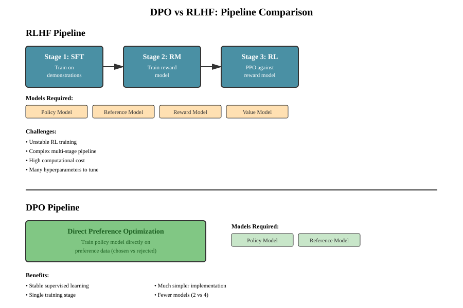
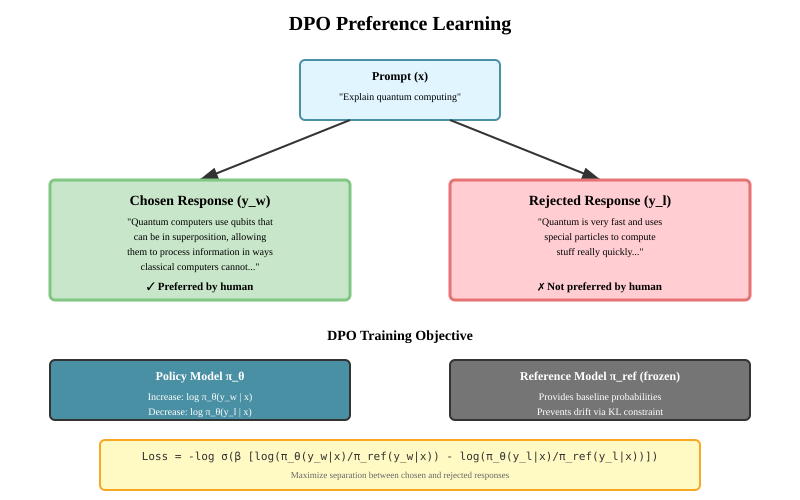
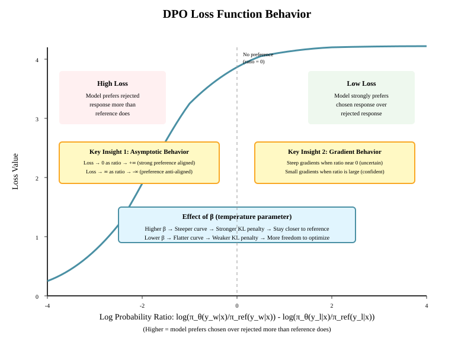

# Chapter 21: Direct Preference Optimization (DPO)

## Introduction

Direct Preference Optimization (DPO) is a powerful technique for aligning language models with human preferences without the complexity of reinforcement learning. Introduced by Rafailov et al. in 2023, DPO simplifies the [RLHF](20-rlhf.md) pipeline by directly optimizing the language model using preference data, eliminating the need for a separate reward model and reinforcement learning optimization.

**Key Benefits:**

- No reward model training required
- No RL optimization (PPO, etc.)
- More stable training
- Simpler implementation
- Often better performance

## From RLHF to DPO: Motivation

### The RLHF Pipeline Complexity

As covered in [Chapter 19: RLHF](20-rlhf.md), the traditional RLHF pipeline involves:

1. **Supervised Fine-tuning (SFT)**: Train a model on demonstrations ([Chapter 13: SFT](18-sft.md))
2. **Reward Modeling**: Train a separate reward model on preference data
3. **RL Optimization**: Use PPO or similar to optimize the policy against the reward model

This pipeline has several challenges:

- **Instability**: RL training can be unstable
- **Complexity**: Multiple models and training stages
- **Hyperparameter sensitivity**: KL penalty coefficient, learning rates, etc.
- **Computational cost**: Requires running multiple models during training

### The DPO Insight

DPO makes a key observation: we can derive a closed-form expression for the optimal policy in terms of the reward function, then rearrange this to express the reward in terms of the policy. This allows us to:

1. Skip reward model training entirely
2. Optimize the policy directly using preference data
3. Implicitly maintain the KL constraint from RLHF



## Mathematical Foundation

### The Bradley-Terry Model

Human preferences are typically modeled using the Bradley-Terry model, which states that the probability of preferring response $y_w$ (chosen/winner) over $y_l$ (rejected/loser) given prompt $x$ is:

```math
\large P(y_w \succ y_l \mid x) = \frac{\exp(r(x, y_w))}{\exp(r(x, y_w)) + \exp(r(x, y_l))} = \sigma(r(x, y_w) - r(x, y_l))
```

where $r(x, y)$ is the reward function and $\sigma$ is the sigmoid function.

### The RLHF Objective

In RLHF, we maximize:

```math
\large \max_{\pi_\theta} \mathbb{E}_{x \sim \mathcal{D}, y \sim \pi_\theta(y \mid x)} [r(x, y)] - \beta \mathbb{D}_{\text{KL}}[\pi_\theta(y \mid x) \| \pi_{\text{ref}}(y \mid x)]
```

where:

- $\pi_\theta$ is our policy (language model)
- $\pi_{\text{ref}}$ is the reference model (typically the SFT model)
- $\beta$ is the KL penalty coefficient
- $\mathbb{D}_{\text{KL}}$ is the KL divergence

### Closed-Form Optimal Policy

The optimal solution to this constrained optimization problem has a closed form:

```math
\large \pi^*(y \mid x) = \frac{1}{Z(x)} \pi_{\text{ref}}(y \mid x) \exp\left(\frac{1}{\beta} r(x, y)\right)
```

where $Z(x) = \sum_y \pi_{\text{ref}}(y \mid x) \exp\left(\frac{1}{\beta} r(x, y)\right)$ is the partition function.

### Reparameterizing the Reward

We can rearrange the above to express the reward in terms of the optimal policy:

```math
\large r(x, y) = \beta \log \frac{\pi^*(y \mid x)}{\pi_{\text{ref}}(y \mid x)} + \beta \log Z(x)
```

**Key insight**: The partition function $Z(x)$ depends only on $x$, not $y$. When we compute reward differences, it cancels out! This is the central mathematical insight that makes DPO possible—it transforms an intractable problem (computing $Z(x)$ requires summing over all $V^{L} \approx 10^{4,699}$ possible responses) into tractable supervised learning. See [Appendix: Partition Functions](../appendices/partition-functions.md) for a detailed explanation of why $Z(x)$ is intractable and why this cancellation is so significant.

```math
\large r(x, y_w) - r(x, y_l) = \beta \log \frac{\pi^*(y_w \mid x)}{\pi_{\text{ref}}(y_w \mid x)} - \beta \log \frac{\pi^*(y_l \mid x)}{\pi_{\text{ref}}(y_l \mid x)}
```

### The DPO Objective

Substituting our reward reparameterization into the Bradley-Terry model:

```math
\large P(y_w \succ y_l \mid x) = \sigma\left(\beta \log \frac{\pi_\theta(y_w \mid x)}{\pi_{\text{ref}}(y_w \mid x)} - \beta \log \frac{\pi_\theta(y_l \mid x)}{\pi_{\text{ref}}(y_l \mid x)}\right)
```

The DPO loss is the negative log-likelihood of the preference data:

```math
\large \mathcal{L}_{\text{DPO}}(\pi_\theta; \pi_{\text{ref}}) = -\mathbb{E}_{(x, y_w, y_l) \sim \mathcal{D}} \left[\log \sigma\left(\beta \log \frac{\pi_\theta(y_w \mid x)}{\pi_{\text{ref}}(y_w \mid x)} - \beta \log \frac{\pi_\theta(y_l \mid x)}{\pi_{\text{ref}}(y_l \mid x)}\right)\right]
```

This can be rewritten more compactly as:

```math
\large \mathcal{L}_{\text{DPO}}(\pi_\theta; \pi_{\text{ref}}) = -\mathbb{E}_{(x, y_w, y_l) \sim \mathcal{D}} \left[\log \sigma\left(\beta \left[\log \frac{\pi_\theta(y_w \mid x)}{\pi_{\text{ref}}(y_w \mid x)} - \log \frac{\pi_\theta(y_l \mid x)}{\pi_{\text{ref}}(y_l \mid x)}\right]\right)\right]
```



The diagram above illustrates how DPO learns from preference data. Given a prompt and two responses (one chosen, one rejected), DPO trains the policy model to increase the probability of the chosen response while decreasing the probability of the rejected response, all relative to the frozen reference model.



The loss function has several important properties:

- **Asymptotic behavior**: Loss approaches 0 when the model strongly prefers the chosen response, and increases unboundedly when it prefers the rejected response
- **Gradient behavior**: Gradients are strongest when the model is uncertain (ratio near 0) and weaker when the model is confident
- **β parameter**: Controls the strength of the implicit KL constraint - higher β keeps the policy closer to the reference model

## Implementation

### Basic DPO Training Loop

**Problem:** Implementing the DPO objective requires careful handling of multiple forward passes (policy and reference models) and correct computation of log probabilities for chosen vs. rejected responses. We need a trainer that can efficiently manage both models while maintaining numerical stability.

**Why This Matters:** The implementation must correctly compute sequence log probabilities, handle gradient flow only through the policy model, and properly mask padding tokens. Mistakes in any of these areas will cause training to fail or produce incorrect results.

**Theoretical Justification:** The DPO loss requires computing log probabilities under both the policy (trainable) and reference (frozen) models. We freeze the reference model to prevent it from being updated, ensuring it remains the anchor point for the KL constraint. The log probability computation must account for the causal language modeling objective where we predict the next token.

**Key Insights:**

1. **Two-model architecture**: Policy model trains while reference stays frozen as a baseline
2. **Log probability aggregation**: Sum log probabilities across the sequence to get total likelihood
3. **Gradient isolation**: Only the policy model needs gradients; reference uses `torch.no_grad()`
4. **Numerical stability**: Use `F.logsigmoid` instead of computing `log(sigmoid())` to avoid numerical issues

**How This Relates to Alternatives:**

- Unlike RLHF which needs 4 models (policy, reference, reward, value), DPO only needs 2
- Unlike supervised fine-tuning which only needs one forward pass, DPO needs 4 per batch (2 policy, 2 reference)
- The loss computation is simpler than PPO's clipped objective, making training more stable

```python
import torch
import torch.nn as nn
import torch.nn.functional as F
from torch.utils.data import DataLoader, Dataset
from transformers import AutoModelForCausalLM, AutoTokenizer
from typing import Dict, List, Tuple
import numpy as np

class DPOTrainer:
    """
    Direct Preference Optimization (DPO) trainer.

    Based on: "Direct Preference Optimization: Your Language Model is
    Secretly a Reward Model" (Rafailov et al., 2023)
    https://arxiv.org/abs/2305.18290
    """

    def __init__(
        self,
        model: nn.Module,
        ref_model: nn.Module,
        beta: float = 0.1,
        learning_rate: float = 1e-6,
        max_length: int = 512,
    ):
        """
        Args:
            model: The policy model to train
            ref_model: The reference model (frozen, typically the SFT model)
            beta: Temperature parameter controlling KL divergence from reference
            learning_rate: Learning rate for optimization
            max_length: Maximum sequence length
        """
        self.model = model
        self.ref_model = ref_model
        self.beta = beta
        self.max_length = max_length

        # Freeze reference model
        for param in self.ref_model.parameters():
            param.requires_grad = False
        self.ref_model.eval()

        # Optimizer for the policy model
        self.optimizer = torch.optim.AdamW(
            self.model.parameters(),
            lr=learning_rate,
            betas=(0.9, 0.999),
            weight_decay=0.0
        )

    def get_log_probs(
        self,
        model: nn.Module,
        input_ids: torch.Tensor,
        attention_mask: torch.Tensor,
        labels: torch.Tensor,
    ) -> torch.Tensor:
        """
        Compute log probabilities of the labels under the model.

        Args:
            model: Language model
            input_ids: Input token ids [batch_size, seq_len]
            attention_mask: Attention mask [batch_size, seq_len]
            labels: Target token ids [batch_size, seq_len] (same as input_ids for causal LM)

        Returns:
            log_probs: Sum of log probabilities for each sequence [batch_size]
        """
        with torch.set_grad_enabled(model.training):
            outputs = model(
                input_ids=input_ids,
                attention_mask=attention_mask,
            )
            logits = outputs.logits  # [batch_size, seq_len, vocab_size]

            # Shift logits and labels for next-token prediction
            # logits: [batch_size, seq_len-1, vocab_size]
            # labels: [batch_size, seq_len-1]
            shift_logits = logits[:, :-1, :].contiguous()
            shift_labels = labels[:, 1:].contiguous()
            shift_attention_mask = attention_mask[:, 1:].contiguous()

            # Compute log probabilities
            log_probs = F.log_softmax(shift_logits, dim=-1)

            # Gather log probs of the actual tokens
            # [batch_size, seq_len-1]
            per_token_log_probs = torch.gather(
                log_probs,
                dim=2,
                index=shift_labels.unsqueeze(2)
            ).squeeze(2)

            # Mask out padding tokens and sum
            # Only compute log prob where attention_mask and label != -100
            valid_mask = (shift_labels != -100) & (shift_attention_mask == 1)
            per_token_log_probs = per_token_log_probs * valid_mask

            # Sum log probs for each sequence
            sequence_log_probs = per_token_log_probs.sum(dim=1)

            return sequence_log_probs

    def compute_dpo_loss(
        self,
        policy_chosen_log_probs: torch.Tensor,
        policy_rejected_log_probs: torch.Tensor,
        reference_chosen_log_probs: torch.Tensor,
        reference_rejected_log_probs: torch.Tensor,
    ) -> Tuple[torch.Tensor, Dict[str, float]]:
        """
        Compute the DPO loss.

        Args:
            policy_chosen_log_probs: Log probs of chosen responses under policy
            policy_rejected_log_probs: Log probs of rejected responses under policy
            reference_chosen_log_probs: Log probs of chosen responses under reference
            reference_rejected_log_probs: Log probs of rejected responses under reference

        Returns:
            loss: The DPO loss (scalar)
            metrics: Dictionary of metrics for logging
        """
        # Compute log ratios
        policy_log_ratios = policy_chosen_log_probs - policy_rejected_log_probs
        reference_log_ratios = reference_chosen_log_probs - reference_rejected_log_probs

        # DPO loss: -log sigmoid(beta * (policy_log_ratio - ref_log_ratio))
        logits = self.beta * (policy_log_ratios - reference_log_ratios)
        loss = -F.logsigmoid(logits).mean()

        # Compute metrics
        with torch.no_grad():
            # Implicit reward (for logging/analysis)
            chosen_rewards = self.beta * (policy_chosen_log_probs - reference_chosen_log_probs)
            rejected_rewards = self.beta * (policy_rejected_log_probs - reference_rejected_log_probs)
            reward_margin = chosen_rewards - rejected_rewards

            # Accuracy: how often does the model prefer the chosen response?
            accuracy = (reward_margin \gt 0).float().mean()

            metrics = {
                'loss': loss.item(),
                'accuracy': accuracy.item(),
                'chosen_reward_mean': chosen_rewards.mean().item(),
                'rejected_reward_mean': rejected_rewards.mean().item(),
                'reward_margin_mean': reward_margin.mean().item(),
            }

        return loss, metrics

    def train_step(
        self,
        batch: Dict[str, torch.Tensor],
    ) -> Dict[str, float]:
        """
        Perform a single training step.

        Args:
            batch: Dictionary with keys:

                - chosen_input_ids: [batch_size, seq_len]
                - chosen_attention_mask: [batch_size, seq_len]
                - chosen_labels: [batch_size, seq_len]
                - rejected_input_ids: [batch_size, seq_len]
                - rejected_attention_mask: [batch_size, seq_len]
                - rejected_labels: [batch_size, seq_len]

        Returns:
            metrics: Dictionary of metrics from this step
        """
        self.model.train()

        # Get log probs from policy model
        policy_chosen_log_probs = self.get_log_probs(
            self.model,
            batch['chosen_input_ids'],
            batch['chosen_attention_mask'],
            batch['chosen_labels'],
        )

        policy_rejected_log_probs = self.get_log_probs(
            self.model,
            batch['rejected_input_ids'],
            batch['rejected_attention_mask'],
            batch['rejected_labels'],
        )

        # Get log probs from reference model (no gradients)
        with torch.no_grad():
            reference_chosen_log_probs = self.get_log_probs(
                self.ref_model,
                batch['chosen_input_ids'],
                batch['chosen_attention_mask'],
                batch['chosen_labels'],
            )

            reference_rejected_log_probs = self.get_log_probs(
                self.ref_model,
                batch['rejected_input_ids'],
                batch['rejected_attention_mask'],
                batch['rejected_labels'],
            )

        # Compute loss
        loss, metrics = self.compute_dpo_loss(
            policy_chosen_log_probs,
            policy_rejected_log_probs,
            reference_chosen_log_probs,
            reference_rejected_log_probs,
        )

        # Backward pass
        self.optimizer.zero_grad()
        loss.backward()

        # Gradient clipping
        torch.nn.utils.clip_grad_norm_(self.model.parameters(), max_norm=1.0)

        # Optimizer step
        self.optimizer.step()

        return metrics

    def save_checkpoint(
        self,
        path: str,
        epoch: int,
        additional_info: Dict = None,
    ):
        """
        Save a training checkpoint.

        Args:
            path: Path to save checkpoint
            epoch: Current epoch number
            additional_info: Optional dictionary of additional information to save
        """
        checkpoint = {
            'epoch': epoch,
            'model_state_dict': self.model.state_dict(),
            'optimizer_state_dict': self.optimizer.state_dict(),
            'beta': self.beta,
            'max_length': self.max_length,
        }

        if additional_info:
            checkpoint.update(additional_info)

        torch.save(checkpoint, path)
        print(f"Checkpoint saved to {path}")

    def load_checkpoint(
        self,
        path: str,
        load_optimizer: bool = True,
    ) -> int:
        """
        Load a training checkpoint.

        Args:
            path: Path to checkpoint file
            load_optimizer: Whether to load optimizer state (set False for inference)

        Returns:
            epoch: The epoch number from the checkpoint
        """
        checkpoint = torch.load(path, map_location=next(self.model.parameters()).device)

        self.model.load_state_dict(checkpoint['model_state_dict'])

        if load_optimizer and 'optimizer_state_dict' in checkpoint:
            self.optimizer.load_state_dict(checkpoint['optimizer_state_dict'])

        if 'beta' in checkpoint:
            self.beta = checkpoint['beta']

        if 'max_length' in checkpoint:
            self.max_length = checkpoint['max_length']

        epoch = checkpoint.get('epoch', 0)
        print(f"Checkpoint loaded from {path} (epoch {epoch})")

        return epoch

    def save_model_for_inference(
        self,
        path: str,
        tokenizer=None,
    ):
        """
        Save only the trained model for inference (no optimizer, no reference model).

        Args:
            path: Directory path to save model
            tokenizer: Optional tokenizer to save alongside model
        """
        # Save model
        self.model.save_pretrained(path)
        print(f"Model saved to {path}")

        # Save tokenizer if provided
        if tokenizer is not None:
            tokenizer.save_pretrained(path)
            print(f"Tokenizer saved to {path}")

    @classmethod
    def load_model_for_inference(
        cls,
        model_path: str,
        device: str = 'cuda',
    ):
        """
        Load a trained model for inference only.

        Args:
            model_path: Path to saved model directory
            device: Device to load model on

        Returns:
            model: Loaded model ready for inference
        """
        from transformers import AutoModelForCausalLM

        model = AutoModelForCausalLM.from_pretrained(model_path)
        model = model.to(device)
        model.eval()

        print(f"Model loaded from {model_path} for inference")
        return model


class PreferenceDataset(Dataset):
    """
    Dataset for preference pairs (chosen vs. rejected responses).
    """

    def __init__(
        self,
        data: List[Dict[str, str]],
        tokenizer,
        max_length: int = 512,
    ):
        """
        Args:
            data: List of dictionaries with keys 'prompt', 'chosen', 'rejected'
            tokenizer: Tokenizer for the model
            max_length: Maximum sequence length
        """
        self.data = data
        self.tokenizer = tokenizer
        self.max_length = max_length

    def __len__(self) -> int:
        return len(self.data)

    def __getitem__(self, idx: int) -> Dict[str, torch.Tensor]:
        item = self.data[idx]
        prompt = item['prompt']
        chosen = item['chosen']
        rejected = item['rejected']

        # Tokenize chosen response
        chosen_text = prompt + chosen
        chosen_encodings = self.tokenizer(
            chosen_text,
            max_length=self.max_length,
            padding='max_length',
            truncation=True,
            return_tensors='pt',
        )

        # Tokenize rejected response
        rejected_text = prompt + rejected
        rejected_encodings = self.tokenizer(
            rejected_text,
            max_length=self.max_length,
            padding='max_length',
            truncation=True,
            return_tensors='pt',
        )

        # Create labels (same as input_ids for causal LM, -100 for padding)
        chosen_labels = chosen_encodings['input_ids'].clone()
        chosen_labels[chosen_encodings['attention_mask'] == 0] = -100

        rejected_labels = rejected_encodings['input_ids'].clone()
        rejected_labels[rejected_encodings['attention_mask'] == 0] = -100

        return {
            'chosen_input_ids': chosen_encodings['input_ids'].squeeze(0),
            'chosen_attention_mask': chosen_encodings['attention_mask'].squeeze(0),
            'chosen_labels': chosen_labels.squeeze(0),
            'rejected_input_ids': rejected_encodings['input_ids'].squeeze(0),
            'rejected_attention_mask': rejected_encodings['attention_mask'].squeeze(0),
            'rejected_labels': rejected_labels.squeeze(0),
        }


# Example usage
def train_dpo_model():
    """
    Example training script for DPO.
    """
    # Initialize models
    model_name = 'gpt2'  # Or your SFT model
    tokenizer = AutoTokenizer.from_pretrained(model_name)
    tokenizer.pad_token = tokenizer.eos_token

    # Policy model (will be trained)
    policy_model = AutoModelForCausalLM.from_pretrained(model_name)

    # Reference model (frozen copy of SFT model)
    ref_model = AutoModelForCausalLM.from_pretrained(model_name)

    # Create synthetic preference data
    preference_data = [
        {
            'prompt': 'Explain quantum computing in simple terms.',
            'chosen': ' Quantum computing uses quantum mechanics to perform computations that would be impossible for classical computers. It leverages superposition and entanglement to process information in fundamentally different ways.',
            'rejected': ' Quantum computing is really complicated and involves lots of physics stuff.',
        },
        {
            'prompt': 'What is the capital of France?',
            'chosen': ' The capital of France is Paris.',
            'rejected': ' I think it might be London or maybe Berlin.',
        },
        # Add more examples...
    ]

    # Create dataset and dataloader
    dataset = PreferenceDataset(preference_data, tokenizer, max_length=128)
    dataloader = DataLoader(dataset, batch_size=2, shuffle=True)

    # Initialize trainer
    trainer = DPOTrainer(
        model=policy_model,
        ref_model=ref_model,
        beta=0.1,
        learning_rate=1e-6,
    )

    # Training loop
    num_epochs = 3
    device = torch.device('cuda' if torch.cuda.is_available() else 'cpu')
    policy_model.to(device)
    ref_model.to(device)

    for epoch in range(num_epochs):
        epoch_metrics = []

        for batch_idx, batch in enumerate(dataloader):
            # Move batch to device
            batch = {k: v.to(device) for k, v in batch.items()}

            # Training step
            metrics = trainer.train_step(batch)
            epoch_metrics.append(metrics)

            if batch_idx % 10 == 0:
                print(f"Epoch {epoch}, Batch {batch_idx}: "
                      f"Loss = {metrics['loss']:.4f}, "
                      f"Accuracy = {metrics['accuracy']:.4f}")

        # Compute epoch averages
        avg_metrics = {
            key: np.mean([m[key] for m in epoch_metrics])
            for key in epoch_metrics[0].keys()
        }
        print(f"\nEpoch {epoch} Summary: {avg_metrics}\n")

    return policy_model, trainer


def train_dpo_with_checkpointing():
    """
    Example training script with checkpointing and model saving.
    """
    # Initialize models and trainer
    model_name = 'gpt2'
    tokenizer = AutoTokenizer.from_pretrained(model_name)
    tokenizer.pad_token = tokenizer.eos_token

    policy_model = AutoModelForCausalLM.from_pretrained(model_name)
    ref_model = AutoModelForCausalLM.from_pretrained(model_name)

    trainer = DPOTrainer(
        model=policy_model,
        ref_model=ref_model,
        beta=0.1,
        learning_rate=1e-6,
    )

    # Create dataset
    preference_data = [
        {
            'prompt': 'Explain quantum computing.',
            'chosen': ' Quantum computing uses quantum mechanics for computation.',
            'rejected': ' Quantum computing is complicated.',
        },
        # Add more examples...
    ]
    dataset = PreferenceDataset(preference_data, tokenizer, max_length=128)
    dataloader = DataLoader(dataset, batch_size=2, shuffle=True)

    # Training loop with checkpointing
    num_epochs = 10
    device = torch.device('cuda' if torch.cuda.is_available() else 'cpu')
    policy_model.to(device)
    ref_model.to(device)

    checkpoint_dir = './checkpoints'
    import os
    os.makedirs(checkpoint_dir, exist_ok=True)

    best_accuracy = 0.0

    for epoch in range(num_epochs):
        epoch_metrics = []

        for batch_idx, batch in enumerate(dataloader):
            batch = {k: v.to(device) for k, v in batch.items()}
            metrics = trainer.train_step(batch)
            epoch_metrics.append(metrics)

        # Compute epoch averages
        avg_accuracy = np.mean([m['accuracy'] for m in epoch_metrics])
        avg_loss = np.mean([m['loss'] for m in epoch_metrics])

        print(f"Epoch {epoch}: Loss = {avg_loss:.4f}, Accuracy = {avg_accuracy:.4f}")

        # Save checkpoint every epoch
        trainer.save_checkpoint(
            path=f"{checkpoint_dir}/checkpoint_epoch_{epoch}.pt",
            epoch=epoch,
            additional_info={
                'avg_accuracy': avg_accuracy,
                'avg_loss': avg_loss,
            }
        )

        # Save best model
        if avg_accuracy \gt best_accuracy:
            best_accuracy = avg_accuracy
            trainer.save_checkpoint(
                path=f"{checkpoint_dir}/best_model.pt",
                epoch=epoch,
                additional_info={'best_accuracy': best_accuracy}
            )

    # Save final model for inference
    trainer.save_model_for_inference(
        path='./dpo_trained_model',
        tokenizer=tokenizer
    )

    print(f"Training complete! Best accuracy: {best_accuracy:.4f}")
    return trainer


def resume_training_from_checkpoint():
    """
    Example of resuming training from a checkpoint.
    """
    # Initialize models
    model_name = 'gpt2'
    tokenizer = AutoTokenizer.from_pretrained(model_name)
    tokenizer.pad_token = tokenizer.eos_token

    policy_model = AutoModelForCausalLM.from_pretrained(model_name)
    ref_model = AutoModelForCausalLM.from_pretrained(model_name)

    trainer = DPOTrainer(
        model=policy_model,
        ref_model=ref_model,
        beta=0.1,
        learning_rate=1e-6,
    )

    # Load checkpoint
    start_epoch = trainer.load_checkpoint('./checkpoints/checkpoint_epoch_5.pt')

    print(f"Resuming training from epoch {start_epoch}")
    # Continue training...


def use_trained_model_for_inference():
    """
    Example of loading a trained model for inference.
    """
    from transformers import AutoTokenizer

    # Load model and tokenizer
    model = DPOTrainer.load_model_for_inference('./dpo_trained_model')
    tokenizer = AutoTokenizer.from_pretrained('./dpo_trained_model')

    # Generate response
    prompt = "Explain machine learning in simple terms:"
    inputs = tokenizer(prompt, return_tensors='pt').to(model.device)

    with torch.no_grad():
        outputs = model.generate(
            **inputs,
            max_length=100,
            do_sample=True,
            temperature=0.7,
            top_p=0.9,
        )

    response = tokenizer.decode(outputs[0], skip_special_tokens=True)
    print(f"Prompt: {prompt}")
    print(f"Response: {response}")

    return model


if __name__ == "__main__":
    # Run example training
    trained_model, trainer = train_dpo_model()
```

### Label Masking for Prompt Tokens

**Problem:** When computing DPO loss, we want the model to prefer better completions, not memorize prompts. If we include prompt tokens in the log probability calculation, the model might learn to predict the prompt rather than improve its responses.

**Why This Matters:** Without prompt masking, the preference signal gets diluted by shared prompt tokens. Since both chosen and rejected responses have identical prompts, including them adds noise without providing useful training signal. This can slow convergence and reduce alignment effectiveness.

**Theoretical Justification:** The DPO objective aims to increase the relative probability of chosen completions over rejected ones. Mathematically, if we denote prompt tokens as $x$ and completion as $y$, we want to optimize:

```math
\large \log \frac{\pi_\theta(y_w \mid x)}{\pi_\theta(y_l \mid x)}
```

not $\log \frac{\pi_\theta(x, y_w)}{\pi_\theta(x, y_l)}$. The prompt $x$ appears in both numerator and denominator, so its contribution should be excluded. We achieve this by masking prompt tokens with a special value (-100) that PyTorch's loss functions ignore.

**Key Insights:**

1. **Separate tokenization**: Tokenize prompt separately to know exactly how many tokens to mask
2. **Label masking with -100**: PyTorch convention for tokens to ignore in loss computation
3. **Mask both prompt and padding**: Ensure only actual completion tokens contribute to loss
4. **Per-sequence masking**: Each example might have different prompt lengths

**How This Relates to Alternatives:**

- Standard supervised fine-tuning often includes prompts in loss, which is fine for next-token prediction
- RLHF reward models typically score entire sequences, but DPO needs completion-only scoring
- Some implementations use attention masking, but label masking is more explicit and reliable

In practice, we often want to only compute the loss on the completion tokens, not the prompt tokens. Here's an improved version:

```python
def create_labels_with_prompt_masking(
    input_ids: torch.Tensor,
    attention_mask: torch.Tensor,
    prompt_length: int,
) -> torch.Tensor:
    """
    Create labels that mask out prompt tokens.

    Args:
        input_ids: [batch_size, seq_len]
        attention_mask: [batch_size, seq_len]
        prompt_length: Number of prompt tokens to mask

    Returns:
        labels: [batch_size, seq_len] with -100 for prompt and padding
    """
    labels = input_ids.clone()

    # Mask prompt tokens
    labels[:, :prompt_length] = -100

    # Mask padding tokens
    labels[attention_mask == 0] = -100

    return labels


class ImprovedPreferenceDataset(Dataset):
    """
    Improved dataset that properly masks prompt tokens.
    """

    def __init__(
        self,
        data: List[Dict[str, str]],
        tokenizer,
        max_length: int = 512,
        max_prompt_length: int = 256,
    ):
        self.data = data
        self.tokenizer = tokenizer
        self.max_length = max_length
        self.max_prompt_length = max_prompt_length

    def __len__(self) -> int:
        return len(self.data)

    def __getitem__(self, idx: int) -> Dict[str, torch.Tensor]:
        item = self.data[idx]
        prompt = item['prompt']
        chosen = item['chosen']
        rejected = item['rejected']

        # Tokenize prompt separately to get its length
        prompt_encodings = self.tokenizer(
            prompt,
            max_length=self.max_prompt_length,
            truncation=True,
            return_tensors='pt',
        )
        prompt_length = prompt_encodings['input_ids'].shape[1]

        # Tokenize full sequences
        chosen_text = prompt + chosen
        chosen_encodings = self.tokenizer(
            chosen_text,
            max_length=self.max_length,
            padding='max_length',
            truncation=True,
            return_tensors='pt',
        )

        rejected_text = prompt + rejected
        rejected_encodings = self.tokenizer(
            rejected_text,
            max_length=self.max_length,
            padding='max_length',
            truncation=True,
            return_tensors='pt',
        )

        # Create labels with prompt masking
        chosen_labels = create_labels_with_prompt_masking(
            chosen_encodings['input_ids'],
            chosen_encodings['attention_mask'],
            prompt_length,
        )

        rejected_labels = create_labels_with_prompt_masking(
            rejected_encodings['input_ids'],
            rejected_encodings['attention_mask'],
            prompt_length,
        )

        return {
            'chosen_input_ids': chosen_encodings['input_ids'].squeeze(0),
            'chosen_attention_mask': chosen_encodings['attention_mask'].squeeze(0),
            'chosen_labels': chosen_labels.squeeze(0),
            'rejected_input_ids': rejected_encodings['input_ids'].squeeze(0),
            'rejected_attention_mask': rejected_encodings['attention_mask'].squeeze(0),
            'rejected_labels': rejected_labels.squeeze(0),
        }
```

## DPO Variants

### Identity Preference Optimization (IPO)

IPO addresses a potential issue with DPO: the loss can be minimized by the model assigning very low probability to rejected responses, which can hurt generation quality. IPO replaces the sigmoid with a squared error:

```math
\large \mathcal{L}_{\text{IPO}}(\pi_\theta; \pi_{\text{ref}}) = \mathbb{E}_{(x, y_w, y_l) \sim \mathcal{D}} \left[\left(\log \frac{\pi_\theta(y_w \mid x)}{\pi_{\text{ref}}(y_w \mid x)} - \log \frac{\pi_\theta(y_l \mid x)}{\pi_{\text{ref}}(y_l \mid x)} - \frac{1}{2\beta}\right)^2\right]
```

**Paper**: [A General Theoretical Paradigm to Understand Learning from Human Preferences](https://arxiv.org/abs/2310.12036) (Azar et al., 2023)

```python
def compute_ipo_loss(
    policy_chosen_log_probs: torch.Tensor,
    policy_rejected_log_probs: torch.Tensor,
    reference_chosen_log_probs: torch.Tensor,
    reference_rejected_log_probs: torch.Tensor,
    beta: float = 0.1,
) -> Tuple[torch.Tensor, Dict[str, float]]:
    """
    Compute the IPO (Identity Preference Optimization) loss.

    IPO uses a squared error instead of log-sigmoid, which can
    prevent the model from assigning very low probabilities to
    rejected responses.
    """
    # Compute log ratios
    policy_log_ratios = policy_chosen_log_probs - policy_rejected_log_probs
    reference_log_ratios = reference_chosen_log_probs - reference_rejected_log_probs

    # IPO loss: (log_ratio_diff - 1/(2*beta))^2
    log_ratio_diff = policy_log_ratios - reference_log_ratios
    loss = ((log_ratio_diff - 1.0 / (2 * beta)) ** 2).mean()

    # Metrics
    with torch.no_grad():
        chosen_rewards = beta * (policy_chosen_log_probs - reference_chosen_log_probs)
        rejected_rewards = beta * (policy_rejected_log_probs - reference_rejected_log_probs)
        reward_margin = chosen_rewards - rejected_rewards
        accuracy = (reward_margin \gt 0).float().mean()

        metrics = {
            'loss': loss.item(),
            'accuracy': accuracy.item(),
            'chosen_reward_mean': chosen_rewards.mean().item(),
            'rejected_reward_mean': rejected_rewards.mean().item(),
            'reward_margin_mean': reward_margin.mean().item(),
        }

    return loss, metrics
```

### Kahneman-Tversky Optimization (KTO)

KTO is designed for scenarios where you have unpaired preference data - i.e., examples labeled as "good" or "bad" but not explicitly compared. This is useful when you have thumbs up/down feedback but not pairwise comparisons.

```math
\large \mathcal{L}_{\text{KTO}}(\pi_\theta; \pi_{\text{ref}}) = \mathbb{E}_{x, y \sim \mathcal{D}} \left[w(y) \left(1 - \sigma\left(\beta \log \frac{\pi_\theta(y \mid x)}{\pi_{\text{ref}}(y \mid x)} - z_{\text{ref}}\right)\right)\right]
```

where $w(y) = \lambda_{D}$ if $y$ is desirable, $\lambda_{U}$ otherwise, and $z_{\text{ref}}$ is a reference point.

**Paper**: [KTO: Model Alignment as Prospect Theoretic Optimization](https://arxiv.org/abs/2402.01306) (Ethayarajh et al., 2024)

```python
def compute_kto_loss(
    policy_log_probs: torch.Tensor,
    reference_log_probs: torch.Tensor,
    labels: torch.Tensor,  # 1 for desirable, 0 for undesirable
    beta: float = 0.1,
    lambda_d: float = 1.0,
    lambda_u: float = 1.0,
) -> Tuple[torch.Tensor, Dict[str, float]]:
    """
    Compute the KTO (Kahneman-Tversky Optimization) loss.

    KTO works with unpaired preference data (thumbs up/down)
    rather than pairwise comparisons.

    Args:
        policy_log_probs: Log probs under policy [batch_size]
        reference_log_probs: Log probs under reference [batch_size]
        labels: 1 for desirable, 0 for undesirable [batch_size]
        beta: Temperature parameter
        lambda_d: Weight for desirable examples
        lambda_u: Weight for undesirable examples
    """
    # Compute KL term
    kl = policy_log_probs - reference_log_probs

    # Compute reference point (mean KL across batch)
    z_ref = kl.mean().detach()

    # Compute weights
    weights = torch.where(labels == 1, lambda_d, lambda_u)

    # KTO loss: weight * (1 - sigma(beta * (kl - z_ref)))
    # For desirable: want to maximize kl (move away from ref toward better)
    # For undesirable: want to minimize kl (stay close to ref or move away from worse)
    loss = weights * (1 - torch.sigmoid(beta * (kl - z_ref)))

    return loss.mean(), {
        'loss': loss.mean().item(),
        'kl_mean': kl.mean().item(),
        'z_ref': z_ref.item(),
    }
```

### Odds Ratio Preference Optimization (ORPO)

ORPO combines SFT and preference optimization in a single stage, eliminating the need for a separate reference model. It adds a penalty term that increases the odds ratio between chosen and rejected responses.

```math
\large \mathcal{L}_{\text{ORPO}} = \mathcal{L}_{\text{SFT}} + \lambda \cdot \mathcal{L}_{\text{OR}}
```

where:

```math
\large \mathcal{L}_{\text{OR}} = -\mathbb{E}_{(x, y_w, y_l)} \left[\log \sigma\left(\log \frac{\text{odds}_\theta(y_w \mid x)}{\text{odds}_\theta(y_l \mid x)}\right)\right]
```

and $\large \text{odds}_\theta(y \mid x) = \frac{\pi_\theta(y \mid x)}{1 - \pi_\theta(y \mid x)}$

**Paper**: [ORPO: Monolithic Preference Optimization without Reference Model](https://arxiv.org/abs/2403.07691) (Hong et al., 2024)

```python
def compute_orpo_loss(
    policy_chosen_log_probs: torch.Tensor,
    policy_rejected_log_probs: torch.Tensor,
    chosen_lengths: torch.Tensor,
    rejected_lengths: torch.Tensor,
    sft_loss: torch.Tensor,
    lambda_or: float = 0.1,
) -> Tuple[torch.Tensor, Dict[str, float]]:
    """
    Compute the ORPO (Odds Ratio Preference Optimization) loss.

    ORPO combines SFT loss with an odds ratio term, eliminating
    the need for a reference model.

    Args:
        policy_chosen_log_probs: Sum of log probs for chosen [batch_size]
        policy_rejected_log_probs: Sum of log probs for rejected [batch_size]
        chosen_lengths: Number of tokens in chosen responses [batch_size]
        rejected_lengths: Number of tokens in rejected responses [batch_size]
        sft_loss: Standard SFT loss (negative log likelihood)
        lambda_or: Weight for odds ratio term
    """
    # Compute average log probs (to normalize by length)
    chosen_avg_log_prob = policy_chosen_log_probs / chosen_lengths
    rejected_avg_log_prob = policy_rejected_log_probs / rejected_lengths

    # Compute log odds: log(p / (1 - p)) = log(p) - log(1 - p)
    # For small p, log(1 - p) ≈ log(exp(log(1-p))) = log(1 - exp(log_p))
    # We approximate: log_odds ≈ log_prob - log(1 - exp(log_prob))

    # Alternative formulation: use the ratio directly
    # log(odds_w / odds_l) = log(p_w/(1-p_w)) - log(p_l/(1-p_l))
    log_odds_ratio = chosen_avg_log_prob - rejected_avg_log_prob

    # Odds ratio loss
    or_loss = -F.logsigmoid(log_odds_ratio).mean()

    # Total loss
    total_loss = sft_loss + lambda_or * or_loss

    return total_loss, {
        'total_loss': total_loss.item(),
        'sft_loss': sft_loss.item(),
        'or_loss': or_loss.item(),
    }
```

### Simple Preference Optimization (SimPO)

SimPO simplifies DPO by:

1. Removing the reference model (like ORPO)
2. Using length-normalized rewards
3. Adding a target reward margin

```math
\large \mathcal{L}_{\text{SimPO}} = -\mathbb{E}_{(x, y_w, y_l)} \left[\log \sigma\left(\beta \left(\frac{\log \pi_\theta(y_w \mid x)}{|y_w|} - \frac{\log \pi_\theta(y_l \mid x)}{|y_l|}\right) - \gamma\right)\right]
```

where $|y|$ is the length of sequence $y$ and $\gamma$ is a target reward margin.

**Paper**: [SimPO: Simple Preference Optimization with a Reference-Free Reward](https://arxiv.org/abs/2405.14734) (Meng et al., 2024)

```python
def compute_simpo_loss(
    policy_chosen_log_probs: torch.Tensor,
    policy_rejected_log_probs: torch.Tensor,
    chosen_lengths: torch.Tensor,
    rejected_lengths: torch.Tensor,
    beta: float = 2.0,
    gamma: float = 0.5,
) -> Tuple[torch.Tensor, Dict[str, float]]:
    """
    Compute the SimPO (Simple Preference Optimization) loss.

    SimPO uses length-normalized rewards without a reference model
    and includes a target reward margin.

    Args:
        policy_chosen_log_probs: Sum of log probs for chosen [batch_size]
        policy_rejected_log_probs: Sum of log probs for rejected [batch_size]
        chosen_lengths: Number of tokens in chosen responses [batch_size]
        rejected_lengths: Number of tokens in rejected responses [batch_size]
        beta: Temperature parameter (typically higher than DPO, e.g., 2.0)
        gamma: Target reward margin
    """
    # Length-normalized log probs (average per token)
    chosen_avg_log_prob = policy_chosen_log_probs / chosen_lengths
    rejected_avg_log_prob = policy_rejected_log_probs / rejected_lengths

    # SimPO logits with target margin
    logits = beta * (chosen_avg_log_prob - rejected_avg_log_prob) - gamma

    # Loss
    loss = -F.logsigmoid(logits).mean()

    # Metrics
    with torch.no_grad():
        accuracy = (logits \gt 0).float().mean()
        reward_margin = chosen_avg_log_prob - rejected_avg_log_prob

        metrics = {
            'loss': loss.item(),
            'accuracy': accuracy.item(),
            'chosen_avg_log_prob': chosen_avg_log_prob.mean().item(),
            'rejected_avg_log_prob': rejected_avg_log_prob.mean().item(),
            'reward_margin': reward_margin.mean().item(),
        }

    return loss, metrics
```

## Comparison: DPO vs RLHF

| Aspect | RLHF | DPO |
|--------|------|-----|
| **Training Stages** | 3 (SFT, Reward Model, RL) | 1 (Direct optimization) |
| **Models Required** | 3-4 (SFT, Reward, Policy, Value) | 2 (Policy, Reference) |
| **Stability** | Can be unstable (RL training) | More stable (supervised learning) |
| **Hyperparameters** | Many (RL-specific) | Fewer (mainly $\beta$) |
| **Computational Cost** | High (multiple models in loop) | Lower (single training loop) |
| **Sample Efficiency** | Lower | Higher |
| **Flexibility** | High (can optimize complex rewards) | Limited to preference data |
| **Implementation** | Complex | Simpler |
| **Performance** | Strong | Often matches or exceeds RLHF |

### When to Use Each

**Use RLHF when:**

- You have complex, compositional reward functions
- You need to optimize for metrics beyond pairwise preferences
- You have extensive computational resources
- You need fine-grained control over the optimization process

**Use DPO when:**

- You have high-quality preference data
- You want simpler, more stable training
- You have limited computational resources
- You want faster iteration cycles
- Your goal is alignment with human preferences

## Practical Considerations

### Computational Complexity

**Problem:** Training large language models requires significant computational resources. Understanding DPO's resource requirements is essential for planning deployments, estimating costs, and making architecture decisions.

**Why This Matters:** Computational complexity determines:

- How many GPUs you need
- How long training takes
- How much it costs
- Whether you can fit the model in memory
- Whether you need to use approximations (LoRA, quantization, etc.)

**Theoretical Justification:** DPO requires 2 models in memory (policy and reference) and performs 4 forward passes per batch (2 through each model). The policy model also needs backward passes and optimizer states. This makes the complexity higher than standard training but significantly lower than RLHF's 4-model setup.

**Key Insights:**

1. **Forward passes dominate**: 4 forward passes per batch vs. 1 for standard training
2. **Memory vs. compute trade-off**: Can offload reference to CPU (saves memory, costs compute)
3. **LoRA reduces trainable parameters**: From billions to millions without much performance loss
4. **Gradient checkpointing**: Trade 40% more compute for 50% less memory

**How This Relates to Alternatives:**

- **Standard training**: 1 model, 1 forward + 1 backward = baseline
- **DPO**: 2 models, 4 forward + 2 backward ≈ 3x memory, 2x time
- **RLHF**: 4 models, 6-8 forward passes ≈ 6x memory, 3x time
- **SimPO**: 1 model (no reference) ≈ 2x memory, 1.5x time

Understanding the computational requirements of DPO is crucial for practical deployment and interview discussions.

**Time Complexity:**

- Per training step: $O(2 \times \text{forward\_pass})$
  - One forward pass for chosen response through policy model
  - One forward pass for rejected response through policy model
  - Two forward passes through reference model (no gradients)
- Total: Approximately 4 forward passes per batch

**Memory Complexity:**

- Model parameters: $2 \times |\theta|$ (policy model + reference model)
- Activations: $\sim 2 \times |\text{activations}|$ for policy model (forward + backward)
- Total GPU memory: $\sim 3 \times \text{model\_size}$ (policy + ref + gradients/activations)

**Comparison to RLHF:**

| Metric | RLHF | DPO | Speedup |
|--------|------|-----|---------|
| Models in memory | 4 (policy, ref, reward, value) | 2 (policy, ref) | 2x fewer |
| Forward passes/batch | 6-8 | 4 | 1.5-2x faster |
| Training stages | 3 (SFT, RM, RL) | 1 (direct) | 3x simpler |
| Memory usage | ~5-6x model size | ~3x model size | ~2x less memory |

**Memory Optimization Strategies:**

**Problem:** A 7B parameter model requires ~28GB just for weights (fp32), plus additional memory for activations, gradients, and optimizer states. With 2 models, this easily exceeds typical GPU memory (24-40GB for A100/H100).

**Why This Matters:** Without optimization, DPO training of large models requires expensive multi-GPU setups or is simply impossible. Memory optimizations can reduce requirements by 50-90%, enabling training on consumer hardware or reducing cloud costs significantly.

**Theoretical Justification:**

- **LoRA (Low-Rank Adaptation)**: Instead of updating all parameters $\theta$, we update low-rank matrices: $W' = W + BA$ where $B \in \mathbb{R}^{d \times r}, A \in \mathbb{R}^{r \times k}$ with $r \ll d$. This reduces trainable parameters from $d \times k$ to $(d + k) \times r$.
- **Gradient checkpointing**: Trades compute for memory by not storing intermediate activations during forward pass. Recomputes them during backward pass when needed.
- **CPU offloading**: Reference model is only used for forward passes (no gradients), so can be on CPU with minimal performance impact.

**Key Insights:**

1. **LoRA typically uses r=8-16**: Reduces trainable params by ~99% with <1% performance loss
2. **Target attention layers**: Q and V projection matrices give best quality/efficiency trade-off
3. **Keep reference model full precision**: It's frozen, so no optimizer states needed
4. **Gradient checkpointing is almost free**: ~40% more compute for ~50% less memory

**How This Relates to Alternatives:**

- **QLoRA**: Combines LoRA with 4-bit quantization for even more memory savings
- **DeepSpeed ZeRO**: Shards optimizer states across GPUs, different approach to same problem
- **Full fine-tuning**: Maximum quality but requires 3-4x more memory than LoRA
- **Adapter tuning**: Similar to LoRA but less parameter-efficient

```python
# Strategy 1: Use LoRA/PEFT for policy while keeping full reference
from peft import get_peft_model, LoraConfig, TaskType

def create_memory_efficient_dpo_models(base_model_name: str):
    """
    Create policy and reference models with reduced memory footprint.
    """
    # Full reference model (frozen, so no optimizer states)
    ref_model = AutoModelForCausalLM.from_pretrained(base_model_name)
    for param in ref_model.parameters():
        param.requires_grad = False

    # Policy model with LoRA (only train adapters)
    policy_model = AutoModelForCausalLM.from_pretrained(base_model_name)

    # Configure LoRA
    lora_config = LoraConfig(
        task_type=TaskType.CAUSAL_LM,
        r=16,  # Rank
        lora_alpha=32,
        lora_dropout=0.1,
        target_modules=["q_proj", "v_proj"],  # Attention matrices
    )

    policy_model = get_peft_model(policy_model, lora_config)

    # Print trainable parameters
    trainable_params = sum(p.numel() for p in policy_model.parameters() if p.requires_grad)
    total_params = sum(p.numel() for p in policy_model.parameters())
    print(f"Trainable params: {trainable_params:,} / {total_params:,} "
          f"({100 * trainable_params / total_params:.2f}%)")

    return policy_model, ref_model


# Strategy 2: Gradient checkpointing
def enable_gradient_checkpointing(model):
    """
    Enable gradient checkpointing to trade compute for memory.
    """
    if hasattr(model, 'gradient_checkpointing_enable'):
        model.gradient_checkpointing_enable()
    return model


# Strategy 3: CPU offloading for reference model
class DPOTrainerWithCPUOffload(DPOTrainer):
    """
    DPO trainer that offloads reference model to CPU.
    """
    def __init__(self, *args, offload_ref_model: bool = True, **kwargs):
        super().__init__(*args, **kwargs)
        self.offload_ref_model = offload_ref_model

        if offload_ref_model:
            self.ref_model = self.ref_model.cpu()
            self.ref_device = torch.device('cpu')
        else:
            self.ref_device = next(self.ref_model.parameters()).device

    def get_reference_log_probs(self, input_ids, attention_mask, labels):
        """Get log probs from reference model, handling device transfers."""
        # Move to reference device
        input_ids_ref = input_ids.to(self.ref_device)
        attention_mask_ref = attention_mask.to(self.ref_device)
        labels_ref = labels.to(self.ref_device)

        with torch.no_grad():
            log_probs = self.get_log_probs(
                self.ref_model,
                input_ids_ref,
                attention_mask_ref,
                labels_ref
            )

        # Move result back to main device
        return log_probs.to(input_ids.device)
```

**Typical Resource Requirements:**

For a 7B parameter model with DPO:

- GPU Memory: ~40-50 GB (with LoRA: ~20-25 GB)
- Training time: ~1-3 days on 8x A100 (40GB) for 10K examples
- Inference: Same as base model (no overhead)

### Choosing Beta

**Problem:** The beta parameter is the most critical hyperparameter in DPO, but there's no universal "best" value. Choosing beta wrong can cause training to fail (too low → instability, too high → no learning).

**Why This Matters:** Beta ($\beta$) directly controls the strength of the KL constraint, affecting:

- How much the model can deviate from the reference
- Training stability and convergence speed
- Whether the model over-optimizes or under-optimizes
- The final model's balance between alignment and capability

**Theoretical Justification:** In the original RLHF objective, $\beta$ is the coefficient on the KL penalty:

```math
\large \max_\pi \mathbb{E}[r(y)] - \beta \text{KL}(\pi \| \pi_{\text{ref}})
```

- **Large $\beta$**: Heavy penalty for deviating from reference, keeps model close to $\pi_{\text{ref}}$
- **Small $\beta$**: Light penalty, allows more deviation to maximize preference satisfaction

In DPO, this appears as the temperature in the Bradley-Terry model. Higher $\beta$ makes the preference signal "sharper" - small reward differences matter more.

**Key Insights:**

1. **Start with 0.1**: Works well for most cases as a default
2. **Monitor KL divergence**: Should gradually increase but stay \lt 1.0
3. **Task-dependent**: Simpler tasks can use lower beta (faster alignment)
4. **Model-dependent**: Larger models may need higher beta (more conservative)

**How This Relates to Alternatives:**

- **RLHF**: Uses same beta but also has learning rate, PPO clip ratio, value loss coefficient
- **IPO**: Beta has same role but loss function differs (squared vs. sigmoid)
- **SimPO**: Uses higher beta (2.0+) because no reference model
- **Reward modeling**: No beta equivalent, uses classification margin

The $\beta$ parameter controls the trade-off between:

- **High $\beta$**: Stay close to reference model (more conservative)
- **Low $\beta$**: Deviate more from reference (more aggressive optimization)

**Recommended Beta Values by Variant:**

| Variant | Typical Range | Default | Notes |
|---------|--------------|---------|-------|
| DPO | 0.1 - 0.5 | 0.1 | Lower = more aggressive alignment |
| IPO | 0.1 - 0.5 | 0.1 | Similar to DPO |
| SimPO | 1.0 - 5.0 | 2.0 | Higher due to no reference model |
| KTO | 0.1 - 1.0 | 0.1 | Depends on data distribution |
| ORPO | N/A | N/A | Uses lambda_or instead |

```python
def analyze_beta_sensitivity(
    trainer: DPOTrainer,
    batch: Dict[str, torch.Tensor],
    beta_values: List[float] = [0.01, 0.05, 0.1, 0.2, 0.5, 1.0],
):
    """
    Analyze how different beta values affect the loss and metrics.
    """
    results = {}
    original_beta = trainer.beta

    for beta in beta_values:
        trainer.beta = beta
        with torch.no_grad():
            # Get log probs
            policy_chosen_log_probs = trainer.get_log_probs(
                trainer.model,
                batch['chosen_input_ids'],
                batch['chosen_attention_mask'],
                batch['chosen_labels'],
            )
            policy_rejected_log_probs = trainer.get_log_probs(
                trainer.model,
                batch['rejected_input_ids'],
                batch['rejected_attention_mask'],
                batch['rejected_labels'],
            )
            reference_chosen_log_probs = trainer.get_log_probs(
                trainer.ref_model,
                batch['chosen_input_ids'],
                batch['chosen_attention_mask'],
                batch['chosen_labels'],
            )
            reference_rejected_log_probs = trainer.get_log_probs(
                trainer.ref_model,
                batch['rejected_input_ids'],
                batch['rejected_attention_mask'],
                batch['rejected_labels'],
            )

            # Compute metrics
            _, metrics = trainer.compute_dpo_loss(
                policy_chosen_log_probs,
                policy_rejected_log_probs,
                reference_chosen_log_probs,
                reference_rejected_log_probs,
            )
            results[beta] = metrics

    # Restore original beta
    trainer.beta = original_beta

    # Print results
    print(f"{'Beta':<10} {'Loss':<10} {'Accuracy':<10} {'Reward Margin':<15}")
    print("-" * 50)
    for beta, metrics in results.items():
        print(f"{beta:<10.2f} {metrics['loss']:<10.4f} "
              f"{metrics['accuracy']:<10.4f} {metrics['reward_margin_mean']:<15.4f}")

    return results
```

### Data Quality

**Problem:** DPO directly optimizes preferences, so the quality of preference data determines the quality of alignment. Poor data leads to poor models, regardless of hyperparameter tuning or implementation quality.

**Why This Matters:** Unlike supervised learning where the model averages over noisy labels, DPO tries to satisfy each preference. Low-quality data (inconsistent labels, ambiguous preferences, or biased annotations) gets directly embedded into model behavior. This can cause:

- Low training accuracy (model can't learn the preferences)
- Reward hacking (model exploits spurious correlations)
- Mode collapse (model learns to generate safe but uninformative responses)
- Poor generalization (model overfits to annotation artifacts)

**Theoretical Justification:** The DPO loss assumes preferences follow the Bradley-Terry model: $P(y_w \succ y_l) = \sigma(\beta(r(y_w) - r(y_l)))$. This assumes:

1. Preferences are transitive (if A \gt B and B \gt C, then A \gt C)
2. There exists an underlying reward function $r$
3. Annotator noise is bounded

When these assumptions are violated (e.g., random labels, contradictory preferences), the optimization objective becomes ill-defined and training fails.

**Key Insights:**

1. **Inter-annotator agreement**: If humans disagree, the model can't learn
2. **Clear preference gaps**: Win rate of chosen vs. rejected should be >70%
3. **Diversity matters**: Need wide coverage of prompt types and response styles
4. **Quantity threshold**: Typically need 1000s of examples for small models, 10Ks for large models

**How This Relates to Alternatives:**

- **RLHF reward modeling**: Can smooth over noisy data by learning average preferences
- **Constitutional AI**: Uses AI-generated preferences with more consistency
- **RLAIF**: Uses LLM judgments instead of human annotations, often more consistent but may have biases

DPO's performance heavily depends on preference data quality:

1. **Clear preferences**: Chosen should be clearly better than rejected
2. **Diverse examples**: Cover wide range of prompts and response types
3. **Consistent labels**: Multiple annotators should agree
4. **Sufficient quantity**: Typically need thousands of examples

```python
def analyze_preference_data_quality(
    dataset: PreferenceDataset,
    model: nn.Module,
    tokenizer,
    trainer: DPOTrainer,  # Added: needed for get_log_probs method
    num_samples: int = 100,
):
    """
    Analyze the quality of preference data using a trained model.

    Args:
        dataset: Preference dataset to analyze
        model: Trained model for evaluation
        tokenizer: Tokenizer for the model
        trainer: DPOTrainer instance (for accessing get_log_probs method)
        num_samples: Number of samples to analyze
    """
    model.eval()
    device = next(model.parameters()).device

    stats = {
        'win_rates': [],
        'log_prob_differences': [],
        'length_ratios': [],
    }

    for idx in range(min(num_samples, len(dataset))):
        item = dataset[idx]

        # Move to device
        chosen_input_ids = item['chosen_input_ids'].unsqueeze(0).to(device)
        chosen_attention_mask = item['chosen_attention_mask'].unsqueeze(0).to(device)
        rejected_input_ids = item['rejected_input_ids'].unsqueeze(0).to(device)
        rejected_attention_mask = item['rejected_attention_mask'].unsqueeze(0).to(device)

        with torch.no_grad():
            # Get log probs using trainer's method
            chosen_log_prob = trainer.get_log_probs(
                model,
                chosen_input_ids,
                chosen_attention_mask,
                item['chosen_labels'].unsqueeze(0).to(device),
            )
            rejected_log_prob = trainer.get_log_probs(
                model,
                rejected_input_ids,
                rejected_attention_mask,
                item['rejected_labels'].unsqueeze(0).to(device),
            )

            # Compute statistics
            log_prob_diff = (chosen_log_prob - rejected_log_prob).item()
            stats['log_prob_differences'].append(log_prob_diff)
            stats['win_rates'].append(1.0 if log_prob_diff \gt 0 else 0.0)

            chosen_len = (item['chosen_attention_mask'] == 1).sum().item()
            rejected_len = (item['rejected_attention_mask'] == 1).sum().item()
            stats['length_ratios'].append(chosen_len / max(rejected_len, 1))

    # Print statistics
    print(f"Model Win Rate: {np.mean(stats['win_rates']):.2%}")
    print(f"Average Log Prob Difference: {np.mean(stats['log_prob_differences']):.4f}")
    print(f"Average Length Ratio (chosen/rejected): {np.mean(stats['length_ratios']):.2f}")

    return stats
```

### Debugging Tips and Common Pitfalls

**Problem:** DPO training can fail in subtle ways - loss decreasing but model not improving, high accuracy but poor generation quality, or training appearing to work but the model degenerating. Debugging requires understanding what each metric indicates.

**Why This Matters:** Unlike supervised learning where you can simply watch loss decrease, DPO requires monitoring multiple metrics simultaneously:

- **Loss**: Should decrease but doesn't directly correlate with quality
- **Accuracy**: Model's preference alignment with training data
- **Reward margin**: Separation between chosen and rejected responses
- **KL divergence**: How much the model deviates from the reference

Misinterpreting these metrics leads to wasted compute on failing runs or stopping successful runs prematurely.

**Theoretical Justification:** Each metric corresponds to a different aspect of the DPO objective:

- **Accuracy = $P(\beta(\log \pi/\pi_{\text{ref}})_w \gt \beta(\log \pi/\pi_{\text{ref}})_l)$**: Measures if implicit rewards are ordered correctly
- **Reward margin = $\mathbb{E}[\beta \log \pi_w/\pi_{\text{ref}} - \beta \log \pi_l/\pi_{\text{ref}}]$**: Magnitude of preference signal
- **KL divergence = $\mathbb{E}[\log \pi/\pi_{\text{ref}}]$**: How much policy has moved from reference

When these metrics don't align with expectations, it indicates specific failure modes that require targeted interventions.

**Key Insights:**

1. **Accuracy \lt 55% → data quality issue**: Model can't learn anything beyond random guessing
2. **High accuracy, low margin → beta too high**: Model barely updates from reference
3. **High margin, mode collapse → beta too low**: Model overfits to preference data
4. **NaN loss → numerical instability**: Usually in log computations or gradient explosion

**How This Relates to Alternatives:**

- **RLHF debugging**: Also requires multi-metric monitoring but adds reward model accuracy and PPO-specific metrics
- **SFT debugging**: Simpler, only need to watch loss and perplexity
- **Reward model debugging**: Need to track ranking accuracy and margin calibration

When training with DPO, several common issues can arise. Here's how to diagnose and fix them:

**Troubleshooting Guide:**

| Symptom | Likely Cause | Diagnostic Check | Solution |
|---------|--------------|------------------|----------|
| **Accuracy \lt 55%** | Poor data quality or random labels | Check label agreement | Review/filter preference data |
| **Accuracy plateaus at 60-70%** | Ambiguous preferences in data | Analyze margin distribution | Remove low-confidence pairs |
| **Reward margin → 0** | Beta too low, model not learning | Plot margin over training | Increase beta (e.g., 0.1 → 0.3) |
| **Model = reference** | Beta too high, over-regularized | Check KL divergence | Decrease beta (e.g., 0.5 → 0.2) |
| **Loss increases** | Learning rate too high | Check gradient norms | Lower learning rate by 10x |
| **Loss not decreasing** | Learning rate too low or frozen layers | Verify parameters update | Increase LR or check grad flow |
| **Very long generations** | Length exploitation | Track avg generation length | Add length penalty/normalization |
| **Mode collapse** | Over-optimization | Check response diversity | Lower beta, add regularization |
| **OOM errors** | Batch size or model too large | Check GPU memory usage | Reduce batch size, use LoRA |
| **NaN loss** | Numerical instability | Check log prob values | Add epsilon to log, gradient clipping |

**Detailed Debugging Functions:**

```python
def diagnose_dpo_training(
    trainer: DPOTrainer,
    dataloader: DataLoader,
    num_batches: int = 10,
):
    """
    Comprehensive diagnostic tool for DPO training issues.

    Args:
        trainer: DPOTrainer instance
        dataloader: Training data loader
        num_batches: Number of batches to analyze
    """
    trainer.model.eval()
    device = next(trainer.model.parameters()).device

    diagnostics = {
        'accuracies': [],
        'losses': [],
        'reward_margins': [],
        'kl_divergences': [],
        'gradient_norms': [],
        'chosen_log_probs': [],
        'rejected_log_probs': [],
    }

    for batch_idx, batch in enumerate(dataloader):
        if batch_idx >= num_batches:
            break

        batch = {k: v.to(device) for k, v in batch.items()}

        # Get log probs
        with torch.set_grad_enabled(True):
            policy_chosen = trainer.get_log_probs(
                trainer.model,
                batch['chosen_input_ids'],
                batch['chosen_attention_mask'],
                batch['chosen_labels'],
            )
            policy_rejected = trainer.get_log_probs(
                trainer.model,
                batch['rejected_input_ids'],
                batch['rejected_attention_mask'],
                batch['rejected_labels'],
            )

        with torch.no_grad():
            ref_chosen = trainer.get_log_probs(
                trainer.ref_model,
                batch['chosen_input_ids'],
                batch['chosen_attention_mask'],
                batch['chosen_labels'],
            )
            ref_rejected = trainer.get_log_probs(
                trainer.ref_model,
                batch['rejected_input_ids'],
                batch['rejected_attention_mask'],
                batch['rejected_labels'],
            )

            # Compute metrics
            loss, metrics = trainer.compute_dpo_loss(
                policy_chosen, policy_rejected,
                ref_chosen, ref_rejected
            )

            # KL divergence from reference
            kl_chosen = (policy_chosen - ref_chosen).abs().mean().item()
            kl_rejected = (policy_rejected - ref_rejected).abs().mean().item()
            avg_kl = (kl_chosen + kl_rejected) / 2

            # Gradient norm (compute loss with gradients)
            loss.backward()
            grad_norm = torch.nn.utils.clip_grad_norm_(
                trainer.model.parameters(), float('inf')
            ).item()
            trainer.optimizer.zero_grad()

            # Store diagnostics
            diagnostics['accuracies'].append(metrics['accuracy'])
            diagnostics['losses'].append(metrics['loss'])
            diagnostics['reward_margins'].append(metrics['reward_margin_mean'])
            diagnostics['kl_divergences'].append(avg_kl)
            diagnostics['gradient_norms'].append(grad_norm)
            diagnostics['chosen_log_probs'].append(policy_chosen.mean().item())
            diagnostics['rejected_log_probs'].append(policy_rejected.mean().item())

    # Print diagnostics
    print("=== DPO Training Diagnostics ===\n")

    print(f"Accuracy: {np.mean(diagnostics['accuracies']):.2%} "
          f"(±{np.std(diagnostics['accuracies']):.2%})")
    if np.mean(diagnostics['accuracies']) \lt 0.55:
        print("  ⚠️  WARNING: Accuracy very low - check data quality!")
    elif np.mean(diagnostics['accuracies']) \gt 0.95:
        print("  ⚠️  WARNING: Accuracy very high - possible overfitting!")

    print(f"\nLoss: {np.mean(diagnostics['losses']):.4f} "
          f"(±{np.std(diagnostics['losses']):.4f})")

    print(f"\nReward Margin: {np.mean(diagnostics['reward_margins']):.4f} "
          f"(±{np.std(diagnostics['reward_margins']):.4f})")
    if np.mean(diagnostics['reward_margins']) \lt 0.01:
        print("  ⚠️  WARNING: Very small margin - increase beta!")

    print(f"\nKL Divergence: {np.mean(diagnostics['kl_divergences']):.4f} "
          f"(±{np.std(diagnostics['kl_divergences']):.4f})")
    if np.mean(diagnostics['kl_divergences']) \lt 0.001:
        print("  ⚠️  WARNING: Model not diverging from reference - decrease beta!")
    elif np.mean(diagnostics['kl_divergences']) \gt 1.0:
        print("  ⚠️  WARNING: Large KL divergence - increase beta!")

    print(f"\nGradient Norm: {np.mean(diagnostics['gradient_norms']):.4f} "
          f"(±{np.std(diagnostics['gradient_norms']):.4f})")
    if np.mean(diagnostics['gradient_norms']) \lt 0.01:
        print("  ⚠️  WARNING: Very small gradients - increase learning rate!")
    elif np.mean(diagnostics['gradient_norms']) \gt 10.0:
        print("  ⚠️  WARNING: Large gradients - decrease learning rate!")

    print(f"\nChosen Log Prob: {np.mean(diagnostics['chosen_log_probs']):.4f}")
    print(f"Rejected Log Prob: {np.mean(diagnostics['rejected_log_probs']):.4f}")

    if np.isnan(diagnostics['losses']).any():
        print("\n  🚨 ERROR: NaN detected in loss! Check for:")
        print("     - Very small probabilities causing log(0)")
        print("     - Gradient explosion")
        print("     - Numerical instability in loss computation")

    return diagnostics


def detect_mode_collapse(
    model: nn.Module,
    tokenizer,
    prompts: List[str],
    num_samples_per_prompt: int = 5,
    max_length: int = 100,
):
    """
    Detect mode collapse by checking diversity of generations.

    Args:
        model: The policy model to evaluate
        tokenizer: Tokenizer for the model
        prompts: List of prompts to test
        num_samples_per_prompt: Number of samples to generate per prompt
        max_length: Maximum generation length
    """
    model.eval()
    device = next(model.parameters()).device

    all_generations = []
    unique_generations = set()

    for prompt in prompts:
        for _ in range(num_samples_per_prompt):
            inputs = tokenizer(prompt, return_tensors='pt').to(device)

            with torch.no_grad():
                outputs = model.generate(
                    **inputs,
                    max_length=max_length,
                    do_sample=True,
                    temperature=1.0,
                    top_p=0.9,
                )

            generation = tokenizer.decode(outputs[0], skip_special_tokens=True)
            all_generations.append(generation)
            unique_generations.add(generation)

    # Compute diversity metrics
    total_gens = len(all_generations)
    unique_gens = len(unique_generations)
    diversity_ratio = unique_gens / total_gens

    print(f"Total generations: {total_gens}")
    print(f"Unique generations: {unique_gens}")
    print(f"Diversity ratio: {diversity_ratio:.2%}")

    if diversity_ratio \lt 0.5:
        print("  ⚠️  WARNING: Low diversity - possible mode collapse!")
        print("     Solutions: Decrease beta, add diversity penalties")
    elif diversity_ratio \gt 0.95:
        print("  ✓  Good diversity - model is exploring well")

    return {
        'total': total_gens,
        'unique': unique_gens,
        'diversity_ratio': diversity_ratio,
        'generations': all_generations,
    }


def check_length_exploitation(
    trainer: DPOTrainer,
    dataloader: DataLoader,
    num_batches: int = 10,
):
    """
    Check if the model is exploiting length to increase reward.

    Args:
        trainer: DPOTrainer instance
        dataloader: Training data loader
        num_batches: Number of batches to check
    """
    trainer.model.eval()
    device = next(trainer.model.parameters()).device

    chosen_lengths = []
    rejected_lengths = []
    chosen_probs = []
    rejected_probs = []

    for batch_idx, batch in enumerate(dataloader):
        if batch_idx >= num_batches:
            break

        batch = {k: v.to(device) for k, v in batch.items()}

        with torch.no_grad():
            # Get log probs
            chosen_log_prob = trainer.get_log_probs(
                trainer.model,
                batch['chosen_input_ids'],
                batch['chosen_attention_mask'],
                batch['chosen_labels'],
            )
            rejected_log_prob = trainer.get_log_probs(
                trainer.model,
                batch['rejected_input_ids'],
                batch['rejected_attention_mask'],
                batch['rejected_labels'],
            )

            # Get lengths
            chosen_len = (batch['chosen_attention_mask'] == 1).sum(dim=1).float()
            rejected_len = (batch['rejected_attention_mask'] == 1).sum(dim=1).float()

            chosen_lengths.extend(chosen_len.cpu().numpy())
            rejected_lengths.extend(rejected_len.cpu().numpy())
            chosen_probs.extend(chosen_log_prob.cpu().numpy())
            rejected_probs.extend(rejected_log_prob.cpu().numpy())

    # Compute correlation between length and log prob
    chosen_corr = np.corrcoef(chosen_lengths, chosen_probs)[0, 1]
    rejected_corr = np.corrcoef(rejected_lengths, rejected_probs)[0, 1]

    print(f"Chosen length-logprob correlation: {chosen_corr:.3f}")
    print(f"Rejected length-logprob correlation: {rejected_corr:.3f}")
    print(f"Average chosen length: {np.mean(chosen_lengths):.1f}")
    print(f"Average rejected length: {np.mean(rejected_lengths):.1f}")

    if chosen_corr \gt 0.7:
        print("  ⚠️  WARNING: Strong positive correlation - length exploitation detected!")
        print("     Solutions: Use length-normalized rewards (SimPO), add length penalty")

    return {
        'chosen_corr': chosen_corr,
        'rejected_corr': rejected_corr,
        'avg_chosen_len': np.mean(chosen_lengths),
        'avg_rejected_len': np.mean(rejected_lengths),
    }
```

**Quick Debugging Checklist:**

1. **Before training:**
   - [ ] Check data quality (run `analyze_preference_data_quality`)
   - [ ] Verify chosen responses are actually better than rejected
   - [ ] Ensure sufficient data diversity
   - [ ] Confirm models load correctly and reference is frozen

2. **During training:**
   - [ ] Monitor accuracy (should be \gt 60% and improving)
   - [ ] Track reward margin (should be positive and stable)
   - [ ] Check KL divergence (should increase slowly)
   - [ ] Watch for NaN or inf in losses

3. **After training:**
   - [ ] Test on held-out preference data
   - [ ] Check for mode collapse (run `detect_mode_collapse`)
   - [ ] Verify no length exploitation (run `check_length_exploitation`)
   - [ ] Compare generations to reference model

### Preventing Reward Hacking

**Problem:** Even though DPO doesn't have an explicit reward model, the implicit reward (log probability ratio) can still be gamed. Models find shortcuts that maximize the training objective without actually improving response quality.

**Why This Matters:** Reward hacking undermines the entire alignment process. Common hacks include:

1. **Length exploitation**: Longer sequences have more tokens, higher total log probability
2. **Mode collapse**: Generate safe, generic responses that never get rejected
3. **Repetition**: Repeat high-probability tokens to boost log likelihood
4. **Distribution shift**: Deviate so far from reference that capabilities are lost

These behaviors satisfy the training objective but produce poor real-world performance.

**Theoretical Justification:** DPO optimizes $\mathbb{E}[\log \pi_\theta(y_w|x) - \log \pi_\theta(y_l|x)]$. This can be maximized by:

- Increasing $\log \pi_\theta(y_w|x)$ (legitimate: make chosen responses more likely)
- Decreasing $\log \pi_\theta(y_l|x)$ (problematic: can over-penalize rejected responses)

Without constraints, the model can assign infinitely low probability to rejected responses, which often hurts generation quality. The KL penalty from the reference model provides some regularization, but additional constraints help.

**Key Insights:**

1. **Length normalization**: Divide by sequence length to prevent length exploitation (used in SimPO)
2. **KL regularization**: Explicitly penalize deviation from reference beyond the implicit penalty
3. **Diversity penalties**: Encourage varied responses to prevent mode collapse
4. **Early stopping**: Stop before over-optimization occurs

**How This Relates to Alternatives:**

- **RLHF with KL penalty**: Explicit constraint prevents reward hacking, but can be circumvented
- **IPO**: Uses squared loss instead of sigmoid to prevent assigning very low probabilities
- **SimPO**: Length normalization built into the loss function
- **Constitutional AI**: Uses multi-step refinement to prevent simple hacks

Even without an explicit reward model, DPO can exhibit reward hacking behaviors:

1. **Length exploitation**: Model generates very long responses
2. **Mode collapse**: Model generates only safe, generic responses
3. **Distribution shift**: Model deviates too far from reference

**Mitigation strategies:**

```python
def compute_dpo_loss_with_regularization(
    policy_chosen_log_probs: torch.Tensor,
    policy_rejected_log_probs: torch.Tensor,
    reference_chosen_log_probs: torch.Tensor,
    reference_rejected_log_probs: torch.Tensor,
    beta: float = 0.1,
    kl_penalty: float = 0.0,
    length_penalty: float = 0.0,
    chosen_lengths: torch.Tensor = None,
    rejected_lengths: torch.Tensor = None,
) -> Tuple[torch.Tensor, Dict[str, float]]:
    """
    DPO loss with additional regularization terms.
    """
    # Standard DPO loss
    policy_log_ratios = policy_chosen_log_probs - policy_rejected_log_probs
    reference_log_ratios = reference_chosen_log_probs - reference_rejected_log_probs
    logits = beta * (policy_log_ratios - reference_log_ratios)
    dpo_loss = -F.logsigmoid(logits).mean()

    # KL regularization: penalize deviation from reference
    kl_loss = 0.0
    if kl_penalty \gt 0:
        kl_chosen = policy_chosen_log_probs - reference_chosen_log_probs
        kl_rejected = policy_rejected_log_probs - reference_rejected_log_probs
        kl_loss = kl_penalty * (kl_chosen.mean() + kl_rejected.mean())

    # Length regularization: penalize very long generations
    length_loss = 0.0
    if length_penalty \gt 0 and chosen_lengths is not None:
        length_loss = length_penalty * chosen_lengths.float().mean()

    # Total loss
    total_loss = dpo_loss + kl_loss + length_loss

    metrics = {
        'loss': total_loss.item(),
        'dpo_loss': dpo_loss.item(),
        'kl_loss': kl_loss if isinstance(kl_loss, float) else kl_loss.item(),
        'length_loss': length_loss if isinstance(length_loss, float) else length_loss.item(),
    }

    return total_loss, metrics
```

## Advanced Topics

### Online DPO

Standard DPO uses a fixed dataset. Online DPO generates new preference pairs during training:

1. Sample responses from current policy
2. Evaluate with reward model or human feedback
3. Add to preference dataset
4. Continue training

This can improve sample efficiency and help the model explore better responses.

### Multi-Objective DPO

Optimize for multiple objectives simultaneously (e.g., helpfulness AND harmlessness):

```math
\large \mathcal{L}_{\text{multi}} = \sum_{i=1}^{k} \alpha_i \mathcal{L}_{\text{DPO}}^{(i)}
```

where each $\mathcal{L}_{\text{DPO}}^{(i)}$ uses preference data for objective $i$.

### Conditional DPO

Condition the optimization on different personas or styles:

```math
\large P(y_w \succ y_l \mid x, c) = \sigma\left(\beta \log \frac{\pi_\theta(y_w \mid x, c)}{\pi_{\text{ref}}(y_w \mid x, c)} - \beta \log \frac{\pi_\theta(y_l \mid x, c)}{\pi_{\text{ref}}(y_l \mid x, c)}\right)
```

where $c$ is a conditioning variable (e.g., "be concise" vs "be detailed").

## Connection to Alignment

DPO is a key technique in the broader landscape of [AI safety and alignment](22-safety-alignment.md):

1. **Value Alignment**: Ensures model behavior aligns with human preferences
2. **Scalable Oversight**: Can incorporate feedback from various sources
3. **Robustness**: More stable than RL-based approaches
4. **Interpretability**: Preference data is more interpretable than reward scores

## Common Interview Questions

When interviewing for ML/LLM positions, DPO is a hot topic. Here are common questions and how to answer them:

### Question 1: Why does DPO work without a reward model?

**Answer:**

DPO works by reparameterizing the reward function in terms of the policy itself. The key insight is:

1. In RLHF, we optimize: $\max_\pi \mathbb{E}[r(x,y)] - \beta \text{KL}(\pi \| \pi_{\text{ref}})$
2. This has a closed-form optimal solution: $\pi^*(y|x) \propto \pi_{\text{ref}}(y|x) \exp(r(x,y)/\beta)$
3. Rearranging: $r(x,y) = \beta \log \frac{\pi^*(y|x)}{\pi_{\text{ref}}(y|x)} + \beta \log Z(x)$
4. When computing reward differences (for Bradley-Terry model), the partition function $Z(x)$ cancels out
5. Therefore, we can express preferences directly in terms of policy log probabilities

This eliminates the need for a separate reward model while maintaining the same theoretical objective.

**Follow-up:** "What are the limitations of this approach?"

- DPO is limited to optimizing pairwise preferences (can't handle complex reward functions)
- Assumes the Bradley-Terry preference model is accurate
- Requires high-quality preference data

### Question 2: When would you choose DPO over RLHF?

**Answer:**

Choose DPO when:

1. **You have high-quality preference data** - DPO requires clear pairwise comparisons
2. **You want simpler, more stable training** - No RL complexity, no value function
3. **Limited computational resources** - DPO needs 2 models vs RLHF's 4 (policy, ref, reward, value)
4. **Faster iteration** - Single training stage vs 3-stage RLHF pipeline
5. **Your goal is preference alignment** - Not optimizing for specific metrics

Choose RLHF when:

1. **Complex reward functions** - Need to optimize for multiple objectives or non-preference metrics
2. **Fine-grained control** - Want to tune reward model separately
3. **Extensive resources** - Can handle the computational cost
4. **Dynamic feedback** - Can collect feedback during training (online RL)

**Key point for interviews:** "DPO has become the default for most modern LLM alignment because it's simpler and works well in practice."

### Question 3: How do you choose the beta hyperparameter?

**Answer:**

Beta ($\beta$) controls the KL penalty from the reference model. The trade-offs are:

- **High $\beta$ (e.g., 0.5-1.0)**:
  - Stays close to reference model
  - More conservative, safer outputs
  - Slower alignment progress
  - Use when: preserving capabilities is critical

- **Low $\beta$ (e.g., 0.05-0.1)**:
  - Deviates more from reference
  - Faster alignment
  - Risk of mode collapse or over-optimization
  - Use when: strong preference signal, good data quality

**Practical approach:**

1. Start with $\beta = 0.1$ (common default)
2. Monitor KL divergence and reward margin during training
3. If KL divergence is too small → decrease beta
4. If model deviates too much or quality drops → increase beta
5. Run beta sensitivity analysis on validation set

**Note:** Different DPO variants use different ranges (e.g., SimPO typically uses $\beta = 2.0$)

### Question 4: What are the failure modes of DPO?

**Answer:**

Main failure modes:

1. **Length exploitation**
   - Model learns to generate longer responses to increase log probability
   - Detection: Monitor avg response length, check length-logprob correlation
   - Solution: Use SimPO (length-normalized), add length penalty

2. **Mode collapse**
   - Model generates safe but generic responses
   - Detection: Check diversity metrics, sample multiple generations
   - Solution: Decrease beta, add diversity penalty, use better data

3. **Reward hacking**
   - Model exploits spurious correlations in preference data
   - Detection: Qualitative evaluation, compare to reference model
   - Solution: Improve data quality, use regularization

4. **Poor data quality**
   - Training fails if preferences are noisy or random
   - Detection: Accuracy plateaus below 60%, small reward margins
   - Solution: Filter low-confidence pairs, improve annotation process

5. **Distribution shift**
   - Model deviates too far from reference, loses capabilities
   - Detection: Evaluate on downstream tasks, check KL divergence
   - Solution: Increase beta, use early stopping

### Question 5: Derive the DPO loss function

**Answer:**

This is a common whiteboard question. Walk through step-by-step:

1. Start with Bradley-Terry model:


   ```math
\large P(y_w \succ y_l | x) = \frac{\exp(r(x, y_w))}{\exp(r(x, y_w)) + \exp(r(x, y_l))} = \sigma(r(x, y_w) - r(x, y_l))
   ```

2. Substitute reward reparameterization:


   ```math
\large r(x, y) = \beta \log \frac{\pi_\theta(y|x)}{\pi_{\text{ref}}(y|x)} + \beta \log Z(x)
   ```

3. Compute reward difference (Z cancels):


   ```math
\large r(x, y_w) - r(x, y_l) = \beta \left[\log \frac{\pi_\theta(y_w|x)}{\pi_{\text{ref}}(y_w|x)} - \log \frac{\pi_\theta(y_l|x)}{\pi_{\text{ref}}(y_l|x)}\right]
   ```

4. Substitute into Bradley-Terry:


   ```math
\large P(y_w \succ y_l | x) = \sigma\left(\beta \left[\log \frac{\pi_\theta(y_w|x)}{\pi_{\text{ref}}(y_w|x)} - \log \frac{\pi_\theta(y_l|x)}{\pi_{\text{ref}}(y_l|x)}\right]\right)
   ```

5. Negative log-likelihood gives DPO loss:


   ```math
\large \mathcal{L}_{\text{DPO}} = -\mathbb{E}_{(x,y_w,y_l)} \left[\log \sigma(\beta[\log \pi_\theta(y_w|x)/\pi_{\text{ref}}(y_w|x) - \log \pi_\theta(y_l|x)/\pi_{\text{ref}}(y_l|x)])\right]
   ```

**Emphasize:** The key step is recognizing that $Z(x)$ cancels in the difference.

### Question 6: What is the computational complexity of DPO training?

**Answer:**

**Time complexity per batch:**

- 4 forward passes: 2 through policy (chosen + rejected), 2 through reference
- 2 backward passes: only through policy model (reference is frozen)
- Total: $O(2 \times \text{forward} + 2 \times \text{backward})$

**Memory complexity:**

- Policy model parameters + gradients: $2 \times |\theta|$
- Reference model parameters (no gradients): $|\theta|$
- Activations for backprop: $\sim 2 \times |\text{activation}|$
- Total: $\sim 3-4 \times$ single model size

**Comparison to RLHF:**

- RLHF: 4 models (policy, reference, reward, value), ~5-6x model size in memory
- DPO: 2 models, ~3x model size in memory
- DPO is approximately 2x more memory efficient and 1.5-2x faster per batch

**Optimization strategies:**

- Use LoRA on policy (reduces trainable params by ~99%)
- Offload reference to CPU (slower but saves GPU memory)
- Gradient checkpointing (trades compute for memory)

### Question 7: How does DPO compare to recent variants (IPO, SimPO, ORPO)?

**Answer:**

| Variant | Key Difference | When to Use |
|---------|---------------|-------------|
| **DPO** | Original, uses sigmoid loss with reference model | Default choice, well-tested |
| **IPO** | Squared loss instead of sigmoid | When concerned about assigning very low prob to rejected |
| **SimPO** | No reference model, length-normalized, target margin | When memory is tight, to prevent length exploitation |
| **ORPO** | Combines SFT + preference in one stage | When you don't have a pre-trained SFT model |
| **KTO** | Works with unpaired feedback (thumbs up/down) | When you only have binary labels, not pairs |

**Practical advice:** Start with standard DPO. Switch to variants only if you encounter specific issues (length exploitation → SimPO, memory constraints → SimPO/ORPO, unpaired data → KTO).

### Question 8: How would you debug a DPO training run where accuracy is only 52%?

**Answer:**

Systematic debugging approach:

1. **Check data quality first** (most common issue)
   - Inspect random samples - are chosen actually better than rejected?
   - Check inter-annotator agreement
   - Look for label noise or reversed labels
   - Action: Filter or re-label low-quality pairs

2. **Verify implementation**
   - Check that reference model is frozen
   - Verify log probability computation (especially label masking)
   - Ensure correct model/tokenizer compatibility
   - Action: Add assertions, print intermediate values

3. **Analyze training dynamics**
   - Is loss decreasing? If not → learning rate issue
   - Is reward margin positive? If not → beta too low
   - Check gradient norms → too large or too small?
   - Action: Adjust hyperparameters

4. **Test on simple baseline**
   - Create synthetic data where preferences are obvious
   - If model can't learn simple cases → implementation bug
   - If model learns simple but not real data → data quality issue

**Key insight for interviews:** "52% is barely better than random (50%), which almost always indicates data quality problems, not algorithmic issues."

## Exercises

### Exercise 1: Implement Basic DPO

Implement the DPO training loop for a small GPT-2 model on a synthetic preference dataset.

**Tasks:**

1. Create 100 preference pairs (prompt, chosen, rejected)
2. Train for 5 epochs
3. Track loss, accuracy, and reward margins
4. Generate samples before and after training to see the difference

### Exercise 2: Compare DPO Variants

Implement and compare DPO, IPO, and SimPO on the same dataset.

**Questions to answer:**

1. Which achieves the best accuracy?
2. Which is most stable during training?
3. How do the final model outputs differ?
4. What are the computational trade-offs?

### Exercise 3: Beta Sensitivity Analysis

**Tasks:**

1. Train models with $\beta \in \{0.01, 0.1, 0.5, 1.0\}$
2. Measure KL divergence from reference model
3. Evaluate win rate on a held-out test set
4. Plot the trade-off between alignment and diversity

### Exercise 4: Data Quality Impact

**Tasks:**

1. Create three datasets with different quality levels:
   - High quality: clear preferences, diverse prompts
   - Medium quality: some ambiguous pairs
   - Low quality: random or reversed labels
2. Train DPO models on each
3. Compare final performance
4. Analyze what makes preference data "good"

### Exercise 5: Reward Hacking Detection

**Tasks:**

1. Train a DPO model that might exhibit length hacking
2. Implement metrics to detect:
   - Average response length over training
   - Diversity of responses (entropy)
   - KL divergence from reference
3. Add regularization to prevent hacking
4. Compare before/after behavior

### Exercise 6: From RLHF to DPO

**Tasks:**

1. Implement a simple reward model on preference data
2. Train using the reward model (RLHF-style)
3. Train using DPO on the same data
4. Compare:
   - Training time
   - Memory usage
   - Final performance
   - Stability

### Exercise 7: Conditional Preference Optimization

**Tasks:**

1. Extend DPO to support conditioning on style (e.g., "concise" vs "detailed")
2. Create preference data with style annotations
3. Train a conditional model
4. Test that the model follows style instructions

## Summary

Direct Preference Optimization (DPO) represents a major simplification of the alignment pipeline:

1. **Core Idea**: Directly optimize policy on preference data without reward modeling or RL
2. **Mathematical Foundation**: Derives from the closed-form solution to the RLHF objective
3. **Practical Benefits**: Simpler, more stable, and often more effective than RLHF
4. **Variants**: IPO, KTO, ORPO, SimPO offer different trade-offs
5. **Considerations**: Requires high-quality preference data, careful $\beta$ tuning

DPO has become the dominant approach for aligning modern LLMs, used in models like Claude, GPT-4, and Llama 3. Its simplicity and effectiveness make it an essential technique for ML practitioners working on language model alignment.

## References

1. **Direct Preference Optimization: Your Language Model is Secretly a Reward Model**

   Rafailov et al., 2023
   [https://arxiv.org/abs/2305.18290](https://arxiv.org/abs/2305.18290)

2. **A General Theoretical Paradigm to Understand Learning from Human Preferences**

   Azar et al., 2023
   [https://arxiv.org/abs/2310.12036](https://arxiv.org/abs/2310.12036)

3. **KTO: Model Alignment as Prospect Theoretic Optimization**

   Ethayarajh et al., 2024
   [https://arxiv.org/abs/2402.01306](https://arxiv.org/abs/2402.01306)

4. **ORPO: Monolithic Preference Optimization without Reference Model**

   Hong et al., 2024
   [https://arxiv.org/abs/2403.07691](https://arxiv.org/abs/2403.07691)

5. **SimPO: Simple Preference Optimization with a Reference-Free Reward**

   Meng et al., 2024
   [https://arxiv.org/abs/2405.14734](https://arxiv.org/abs/2405.14734)

6. **Training language models to follow instructions with human feedback**

   Ouyang et al., 2022
   [https://arxiv.org/abs/2203.02155](https://arxiv.org/abs/2203.02155)

## Next Steps

- [Chapter 22: Safety and Alignment Techniques](22-safety-alignment.md): Explore broader alignment methods
- [Chapter 19: RLHF](20-rlhf.md): Review the method DPO simplifies
- [Chapter 18: Supervised Fine-tuning](18-sft.md): Understand the foundation for preference optimization
