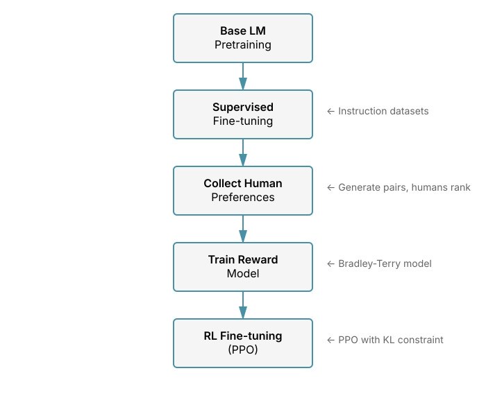

# Chapter 21: Reinforcement Learning from Human Feedback (RLHF)

Reinforcement Learning from Human Feedback (RLHF) is the technique that transformed base language models into helpful, harmless assistants like ChatGPT and Claude. This chapter covers the complete RLHF pipeline, from collecting human preferences to training models with PPO while maintaining alignment with the original supervised fine-tuned model.

## Table of Contents

1. [Overview](#overview)
2. [The RLHF Pipeline](#the-rlhf-pipeline)
3. [Reward Modeling](#reward-modeling)
4. [Proximal Policy Optimization (PPO)](#proximal-policy-optimization-ppo)
5. [KL Divergence Constraints](#kl-divergence-constraints)
6. [Complete Implementation](#complete-implementation)
7. [Practical Considerations](#practical-considerations)
8. [Evaluation Metrics for RLHF](#evaluation-metrics-for-rlhf)
9. [Exercises](#exercises)

---

## Overview

After supervised fine-tuning (see [Supervised Fine-tuning (SFT)](19-sft.md)), a language model can follow instructions, but it may not produce outputs that align with human preferences regarding helpfulness, harmlessness, and honesty. RLHF solves this by:

1. **Reward Modeling**: Training a model to predict human preferences
2. **RL Fine-tuning**: Using reinforcement learning (PPO) to maximize the reward while staying close to the SFT model

The technique was popularized by OpenAI's InstructGPT and Anthropic's Constitutional AI work, though simpler alternatives like DPO (see [Direct Preference Optimization (DPO)](22-dpo.md)) have since emerged.

**Key Papers:**
- [Training language models to follow instructions with human feedback](https://arxiv.org/abs/2203.02155) (InstructGPT, OpenAI, 2022)
- [Learning to summarize from human feedback](https://arxiv.org/abs/2009.01325) (Stiennon et al., 2020)
- [Training a Helpful and Harmless Assistant with RLHF](https://arxiv.org/abs/2204.05862) (Anthropic, 2022)

---

## The RLHF Pipeline

The complete RLHF pipeline consists of three stages:



**Stage 1: Supervised Fine-tuning (SFT)**
- Train on high-quality (prompt, response) pairs
- Creates the reference model $\pi_{\text{ref}}$
- See [Chapter 19](19-sft.md) for details

**Stage 2: Reward Model Training**
- Collect human preferences on model outputs
- Train a model to predict which response humans prefer
- Creates the reward model $r_\phi(x, y)$

**Stage 3: RL Fine-tuning**
- Use PPO to optimize the policy $\pi_\theta$ to maximize reward
- Add KL penalty to stay close to $\pi_{\text{ref}}$
- Prevents model from exploiting reward model weaknesses

---

## Reward Modeling

### The Preference Dataset

Instead of rating responses on an absolute scale, we collect **pairwise preferences**. Given a prompt $x$, the model generates two responses $y_w$ (winner) and $y_l$ (loser), and humans indicate which they prefer.

**Dataset structure:**
```python
{
    "prompt": "Explain quantum computing",
    "chosen": "Quantum computing uses quantum bits...",    # y_w
    "rejected": "Quantum is when computers are fast..."   # y_l
}
```

### Bradley-Terry Model

We model the probability that humans prefer response $y_w$ over $y_l$ using the **Bradley-Terry model**:

$$
P(y_w \succ y_l | x) = \sigma(r_\phi(x, y_w) - r_\phi(x, y_l))
$$

where:
- $r_\phi(x, y)$ is the scalar reward for prompt $x$ and response $y$
- $\sigma$ is the sigmoid function
- $\succ$ denotes preference

### Loss Function

We train the reward model to maximize the log-likelihood of the observed preferences:

$$
\mathcal{L}_{\text{RM}}(\phi) = -\mathbb{E}_{(x, y_w, y_l) \sim D} \left[ \log \sigma(r_\phi(x, y_w) - r_\phi(x, y_l)) \right]
$$

This is equivalent to binary cross-entropy loss.

### Reward Model Architecture

**Problem**: We need to convert human pairwise preferences into a function that can assign scalar rewards to any (prompt, response) pair. This function must generalize beyond the specific comparisons seen during training.

**Why this architecture works**: By starting from the SFT model, the reward model already understands language semantics and the task domain. We only need to learn a mapping from the final hidden representation to a scalar that correlates with human preference. This is much more sample-efficient than training a reward model from scratch.

**Key design choices**:
1. **Reuse SFT model**: The pretrained language model provides rich semantic representations
2. **Single linear layer**: A simple projection is sufficient since the hard work (understanding language) is done by the base model
3. **Last token pooling**: We use the final token's hidden state because it has attended to the entire sequence and contains aggregated information about the whole response
4. **No language modeling head**: We remove the vocabulary prediction head to save memory and clearly separate the reward task from generation

**Comparison to alternatives**:
- **Training from scratch**: Would require 10-100x more data and compute
- **Mean pooling**: Last token pooling works better for autoregressive models where information flows left-to-right
- **Multiple layers**: Adds capacity but risks overfitting on limited preference data

The reward model is typically initialized from the SFT model and modified to output a scalar reward:

```python
import torch
import torch.nn as nn
from transformers import AutoModelForCausalLM, AutoTokenizer

class RewardModel(nn.Module):
    """
    Reward model for RLHF.
    Takes a (prompt, response) pair and outputs a scalar reward.
    """
    def __init__(self, base_model_name: str, dropout: float = 0.1):
        super().__init__()
        # Load pretrained LM (typically the SFT model)
        self.model = AutoModelForCausalLM.from_pretrained(base_model_name)

        # Get hidden dimension
        config = self.model.config
        hidden_size = config.hidden_size

        # Replace LM head with reward head
        self.reward_head = nn.Sequential(
            nn.Dropout(dropout),
            nn.Linear(hidden_size, 1, bias=False)
        )

        # Remove the original LM head to save memory
        self.model.lm_head = nn.Identity()

    def forward(
        self,
        input_ids: torch.Tensor,
        attention_mask: torch.Tensor
    ) -> torch.Tensor:
        """
        Args:
            input_ids: [batch_size, seq_len]
            attention_mask: [batch_size, seq_len]

        Returns:
            rewards: [batch_size] scalar rewards
        """
        # Get model outputs
        outputs = self.model(
            input_ids=input_ids,
            attention_mask=attention_mask,
            output_hidden_states=True
        )

        # Get last hidden state: [batch_size, seq_len, hidden_size]
        hidden_states = outputs.hidden_states[-1]

        # Get the last token's hidden state (end of sequence)
        # We use attention_mask to find the last real token
        sequence_lengths = attention_mask.sum(dim=1) - 1  # [batch_size]
        batch_size = hidden_states.shape[0]

        # Gather last token hidden states
        last_hidden_states = hidden_states[
            torch.arange(batch_size, device=hidden_states.device),
            sequence_lengths
        ]  # [batch_size, hidden_size]

        # Get scalar reward
        rewards = self.reward_head(last_hidden_states).squeeze(-1)  # [batch_size]

        return rewards


def compute_reward_loss(
    reward_model: RewardModel,
    chosen_input_ids: torch.Tensor,
    chosen_attention_mask: torch.Tensor,
    rejected_input_ids: torch.Tensor,
    rejected_attention_mask: torch.Tensor
) -> torch.Tensor:
    """
    Compute the Bradley-Terry preference loss.

    Args:
        reward_model: The reward model
        chosen_input_ids: [batch_size, seq_len] for chosen responses
        chosen_attention_mask: [batch_size, seq_len]
        rejected_input_ids: [batch_size, seq_len] for rejected responses
        rejected_attention_mask: [batch_size, seq_len]

    Returns:
        loss: scalar loss
    """
    # Compute rewards for chosen and rejected
    r_chosen = reward_model(chosen_input_ids, chosen_attention_mask)
    r_rejected = reward_model(rejected_input_ids, rejected_attention_mask)

    # Bradley-Terry loss: -log(sigmoid(r_chosen - r_rejected))
    # This is equivalent to binary cross-entropy
    loss = -torch.nn.functional.logsigmoid(r_chosen - r_rejected).mean()

    return loss


# Training loop for reward model
def train_reward_model(
    reward_model: RewardModel,
    train_dataloader,
    optimizer,
    num_epochs: int = 1,
    device: str = "cuda"
):
    """
    Train the reward model on preference data.
    """
    reward_model.to(device)
    reward_model.train()

    for epoch in range(num_epochs):
        total_loss = 0
        for batch in train_dataloader:
            # Move to device
            chosen_input_ids = batch["chosen_input_ids"].to(device)
            chosen_attention_mask = batch["chosen_attention_mask"].to(device)
            rejected_input_ids = batch["rejected_input_ids"].to(device)
            rejected_attention_mask = batch["rejected_attention_mask"].to(device)

            # Compute loss
            loss = compute_reward_loss(
                reward_model,
                chosen_input_ids,
                chosen_attention_mask,
                rejected_input_ids,
                rejected_attention_mask
            )

            # Backward pass
            optimizer.zero_grad()
            loss.backward()
            optimizer.step()

            total_loss += loss.item()

        avg_loss = total_loss / len(train_dataloader)
        print(f"Epoch {epoch + 1}/{num_epochs}, Loss: {avg_loss:.4f}")
```

### Reward Normalization

**Problem**: Raw reward model outputs can have arbitrary scale and distribution. A reward model might produce scores ranging from -5 to +5, or from -100 to +100. This inconsistent scaling creates several issues:
- Value function struggles to learn appropriate value estimates
- Advantage estimates have high variance
- Hyperparameters (learning rate, KL coefficient) that work for one reward scale fail for another
- Numerical instability in gradient computation

**Theoretical justification**: In policy gradient methods, the advantage estimate $\hat{A}_t$ should have similar magnitude across training for stable updates. The policy gradient is proportional to $\nabla \log \pi_\theta(a|s) \hat{A}_t$, so if advantages vary wildly in scale, gradient magnitudes become unpredictable.

**Why running normalization**:
- **Online learning**: We can't compute statistics over all future rewards
- **Distribution shift**: As the policy improves, reward distribution changes
- **Numerical stability**: Welford's algorithm avoids catastrophic cancellation that naive methods suffer from

**How it relates to alternatives**:
- **Batch normalization**: Only normalizes within a batch, doesn't track global statistics
- **Reward clipping**: Throws away information about reward magnitude
- **Fixed normalization**: Fails as reward distribution shifts during training

We use **running statistics** to normalize rewards online during training:

```python
class RewardNormalizer:
    """
    Running reward normalization for stable RLHF training.

    Uses Welford's online algorithm to track mean and variance
    without storing all past rewards.
    """
    def __init__(self, epsilon: float = 1e-8):
        self.mean = 0.0
        self.var = 1.0
        self.count = 0
        self.epsilon = epsilon

    def update(self, rewards: torch.Tensor):
        """
        Update running statistics with new batch of rewards.

        Args:
            rewards: [batch_size] or flattened tensor of rewards
        """
        rewards_flat = rewards.flatten()
        batch_count = rewards_flat.numel()

        if batch_count == 0:
            return

        batch_mean = rewards_flat.mean().item()
        batch_var = rewards_flat.var().item()

        # Welford's online algorithm for numerical stability
        delta = batch_mean - self.mean
        total_count = self.count + batch_count

        # Update mean
        self.mean += delta * batch_count / total_count

        # Update variance (using parallel variance formula)
        m_a = self.var * self.count
        m_b = batch_var * batch_count
        M2 = m_a + m_b + delta**2 * self.count * batch_count / total_count
        self.var = M2 / total_count if total_count > 1 else 1.0

        self.count = total_count

    def normalize(self, rewards: torch.Tensor) -> torch.Tensor:
        """
        Normalize rewards using running statistics.

        Args:
            rewards: [batch_size] or any shape

        Returns:
            normalized_rewards: same shape as input
        """
        return (rewards - self.mean) / (torch.sqrt(torch.tensor(self.var)) + self.epsilon)

    def denormalize(self, normalized_rewards: torch.Tensor) -> torch.Tensor:
        """
        Convert normalized rewards back to original scale.

        Useful for logging and analysis.
        """
        return normalized_rewards * torch.sqrt(torch.tensor(self.var)) + self.mean


# Example usage in training
def train_with_normalized_rewards():
    """Example of using reward normalization in RLHF."""
    normalizer = RewardNormalizer()

    for batch in dataloader:
        # Compute raw rewards
        rewards = reward_model(batch["input_ids"], batch["attention_mask"])

        # Update statistics
        normalizer.update(rewards)

        # Normalize for training
        normalized_rewards = normalizer.normalize(rewards)

        # Use normalized rewards in RL training
        # ...
```

**Why normalization matters:**
- **Consistent scale**: Ensures advantages have similar magnitude across training
- **Numerical stability**: Prevents exploding or vanishing gradients
- **Better learning**: Value function learns more effectively with normalized targets
- **Hyperparameter stability**: Same hyperparameters work across different reward scales

### Practical Tips for Reward Modeling

1. **Normalize rewards**: Use running normalization as shown above to stabilize RL training
2. **Architecture**: Use the SFT model as initialization for better alignment
3. **Dataset size**: Typically 10k-100k preference pairs
4. **Accuracy**: A good reward model achieves 65-75% accuracy on held-out preferences

---

## Proximal Policy Optimization (PPO)

PPO is a policy gradient RL algorithm that has become the standard for RLHF. It's more stable than vanilla policy gradient methods and doesn't require complex hyperparameter tuning like TRPO.

### RL Formulation

We formulate language generation as an RL problem:
- **State** $s$: The prompt $x$ (or prompt + partial response)
- **Action** $a$: The next token to generate
- **Policy** $\pi_\theta(a|s)$: The language model's token probability distribution
- **Reward** $r$: From the reward model (typically given at the end of sequence)

### The RLHF Objective

The goal is to maximize expected reward while staying close to the reference model:

$$
\mathcal{J}(\theta) = \mathbb{E}_{x \sim D, y \sim \pi_\theta(\cdot|x)} \left[ r_\phi(x, y) - \beta \cdot D_{\text{KL}}(\pi_\theta(\cdot|x) || \pi_{\text{ref}}(\cdot|x)) \right]
$$

where:
- $r_\phi(x, y)$ is the reward from the reward model
- $\beta$ is the KL penalty coefficient (typically 0.01-0.1)
- $D_{\text{KL}}$ is the KL divergence (see [KL Divergence Constraints](#kl-divergence-constraints))
- $\pi_{\text{ref}}$ is the frozen SFT model

### PPO Clipped Objective

PPO optimizes a clipped surrogate objective to prevent too large policy updates:

$$
L^{\text{CLIP}}(\theta) = \mathbb{E}_t \left[ \min(r_t(\theta) \hat{A}_t, \text{clip}(r_t(\theta), 1-\epsilon, 1+\epsilon) \hat{A}_t) \right]
$$

where:
- $r_t(\theta) = \frac{\pi_\theta(a_t|s_t)}{\pi_{\text{old}}(a_t|s_t)}$ is the probability ratio
- $\hat{A}_t$ is the advantage estimate
- $\epsilon$ is the clipping parameter (typically 0.2)

### Advantage Estimation

The advantage $A(s, a)$ measures how much better action $a$ is compared to the average:

$$
A(s, a) = Q(s, a) - V(s)
$$

We use Generalized Advantage Estimation (GAE) for lower variance:

$$
\hat{A}_t = \sum_{l=0}^{\infty} (\gamma \lambda)^l \delta_{t+l}
$$

where $\delta_t = r_t + \gamma V(s_{t+1}) - V(s_t)$ is the TD error.

### Value Network

**Problem**: To compute advantages, we need to estimate $V(s)$ - how good it is to be in a particular state (having generated a partial response). Without this baseline, our policy gradient estimates would have extremely high variance, making learning unstable or impossible.

**Theoretical foundation**: The advantage $A(s,a) = Q(s,a) - V(s)$ tells us how much better action $a$ is than average. This variance reduction technique is critical:
- Reduces variance of policy gradient estimates by ~10-100x
- Speeds up learning by providing more informative gradient signals
- Stabilizes training by removing reward scale dependency

**Why share the base model**:
The actor-critic architecture shares the base transformer between policy and value predictions because:
1. **Sample efficiency**: Both tasks benefit from the same language understanding
2. **Memory efficiency**: Storing one model instead of two
3. **Computational efficiency**: One forward pass gives both policy logits and values
4. **Representation quality**: The shared representations learn from both objectives

**Architecture insight**: We add separate heads on top of the shared transformer:
- **Policy head (LM head)**: Projects to vocabulary for next-token prediction
- **Value head**: Projects to scalar for state value estimation

**Relation to alternatives**:
- **Separate networks**: Uses 2x memory and compute, but can learn specialized representations
- **REINFORCE without baseline**: Mathematically unbiased but has prohibitively high variance
- **Q-learning**: Doesn't work well for large action spaces (vocabulary size ~50k)

We need a value function $V_\psi(s)$ to compute advantages. This is typically a copy of the policy model with a value head:

```python
class ValueHead(nn.Module):
    """Value head for estimating state values in PPO."""
    def __init__(self, hidden_size: int, dropout: float = 0.1):
        super().__init__()
        self.value_head = nn.Sequential(
            nn.Dropout(dropout),
            nn.Linear(hidden_size, 1, bias=False)
        )

    def forward(self, hidden_states: torch.Tensor) -> torch.Tensor:
        """
        Args:
            hidden_states: [batch_size, seq_len, hidden_size]

        Returns:
            values: [batch_size, seq_len]
        """
        return self.value_head(hidden_states).squeeze(-1)


class ActorCritic(nn.Module):
    """
    Combined policy (actor) and value function (critic) model for PPO.
    """
    def __init__(self, base_model_name: str):
        super().__init__()
        self.policy = AutoModelForCausalLM.from_pretrained(base_model_name)
        config = self.policy.config
        self.value_head = ValueHead(config.hidden_size)

    def forward(
        self,
        input_ids: torch.Tensor,
        attention_mask: torch.Tensor,
        return_logits: bool = True
    ):
        """
        Forward pass returning both policy logits and value estimates.

        Returns:
            logits: [batch_size, seq_len, vocab_size]
            values: [batch_size, seq_len]
        """
        outputs = self.policy(
            input_ids=input_ids,
            attention_mask=attention_mask,
            output_hidden_states=True
        )

        logits = outputs.logits if return_logits else None
        hidden_states = outputs.hidden_states[-1]
        values = self.value_head(hidden_states)

        return logits, values
```

### Response-Only Training and Prompt Masking

A critical detail in RLHF is that we should **only compute losses on generated tokens, not prompt tokens**. Training on prompt tokens would:
- Waste computation on tokens we don't want to change
- Potentially degrade the model's ability to understand prompts
- Make the policy deviate unnecessarily from the reference model

We use a **response mask** to ensure losses are only computed on the model's generated response:

```python
def create_response_mask(
    attention_mask: torch.Tensor,
    prompt_lengths: torch.Tensor
) -> torch.Tensor:
    """
    Create a mask that is 1 for generated tokens, 0 for prompt tokens.

    This ensures we only compute losses on the model's responses,
    not on the input prompts.

    Args:
        attention_mask: [batch_size, seq_len] - 1 for real tokens, 0 for padding
        prompt_lengths: [batch_size] - length of each prompt

    Returns:
        response_mask: [batch_size, seq_len] - 1 for response tokens only
    """
    batch_size, seq_len = attention_mask.shape
    response_mask = torch.zeros_like(attention_mask)

    for i in range(batch_size):
        # Set mask to 1 for all tokens after the prompt
        response_mask[i, prompt_lengths[i]:] = 1

    # Also apply attention mask to handle padding
    response_mask = response_mask * attention_mask

    return response_mask


def apply_response_mask(
    values: torch.Tensor,
    mask: torch.Tensor
) -> torch.Tensor:
    """
    Apply mask to values and compute mean only over masked positions.

    Args:
        values: [batch_size, seq_len] - values to mask
        mask: [batch_size, seq_len] - binary mask

    Returns:
        masked_mean: scalar - mean over masked positions
    """
    masked_values = values * mask
    num_valid = mask.sum()

    if num_valid > 0:
        return masked_values.sum() / num_valid
    else:
        return torch.tensor(0.0, device=values.device)
```

**Example usage:**
```python
# During training
prompt_lengths = torch.tensor([10, 15, 12])  # Lengths of prompts in batch
attention_mask = torch.ones(3, 50)  # Full sequences of length 50

# Create response mask
response_mask = create_response_mask(attention_mask, prompt_lengths)

# Compute loss only on responses
policy_loss = compute_ppo_loss(
    old_log_probs * response_mask[:, 1:],  # Mask prompt tokens
    new_log_probs * response_mask[:, 1:],
    advantages * response_mask[:, :-1],
    clip_epsilon=0.2
)
```

This is especially important because:
1. **Prevents prompt degradation**: Model doesn't learn to change how it processes prompts
2. **Maintains alignment**: KL divergence only measured on outputs we care about
3. **Computational efficiency**: No wasted gradient computation on prompt tokens
4. **Correct attribution**: Rewards attributed only to the model's choices, not the prompt

### PPO Implementation

**Problem**: We need to implement the core PPO algorithm components that enable stable policy updates. The challenge is computing accurate advantage estimates that balance bias and variance while ensuring the policy doesn't make destructively large updates.

**Why these functions matter**:

1. **GAE (Generalized Advantage Estimation)**: Addresses the bias-variance tradeoff in advantage estimation
   - Pure Monte Carlo ($\lambda=1$): Unbiased but high variance
   - Pure TD ($\lambda=0$): Low variance but biased
   - GAE interpolates via $\lambda \in (0,1)$: Gets the best of both worlds

2. **PPO clipped objective**: Prevents catastrophically large policy updates
   - Vanilla policy gradient can take arbitrarily large steps
   - Large steps can destroy the policy in language generation
   - Clipping constrains the update magnitude while allowing beneficial updates

3. **Value function with clipping**: Stabilizes value learning
   - Value estimates should change gradually
   - Clipping prevents wild value function swings
   - Improves advantage estimation quality over time

**Theoretical insight**: The key innovation of PPO is the clipped ratio objective:
$$\min(r_t(\theta) \hat{A}_t, \text{clip}(r_t(\theta), 1-\epsilon, 1+\epsilon) \hat{A}_t)$$

This ensures:
- If advantage is positive ($\hat{A}_t > 0$), we increase probability but only up to $(1+\epsilon)$ times
- If advantage is negative ($\hat{A}_t < 0$), we decrease probability but only down to $(1-\epsilon)$ times
- Beyond the clip range, gradient becomes zero, preventing excessive updates

**Why this works better than alternatives**:
- **TRPO**: Requires expensive second-order optimization and conjugate gradient
- **Vanilla PG**: Can take destructively large steps, causing training collapse
- **PPO**: Simple first-order method with strong empirical performance

```python
import torch
import torch.nn.functional as F
from typing import Dict, List, Tuple

def compute_advantages_and_returns(
    rewards: torch.Tensor,
    values: torch.Tensor,
    gamma: float = 0.99,
    lambda_: float = 0.95
) -> Tuple[torch.Tensor, torch.Tensor]:
    """
    Compute GAE advantages and returns.

    Args:
        rewards: [batch_size, seq_len] rewards at each timestep
        values: [batch_size, seq_len] value estimates
        gamma: discount factor
        lambda_: GAE lambda parameter

    Returns:
        advantages: [batch_size, seq_len]
        returns: [batch_size, seq_len]
    """
    batch_size, seq_len = rewards.shape
    advantages = torch.zeros_like(rewards)
    returns = torch.zeros_like(rewards)

    # Compute advantages using GAE
    gae = 0
    for t in reversed(range(seq_len)):
        if t == seq_len - 1:
            next_value = 0
        else:
            next_value = values[:, t + 1]

        delta = rewards[:, t] + gamma * next_value - values[:, t]
        gae = delta + gamma * lambda_ * gae
        advantages[:, t] = gae

    # Returns are advantages + values
    returns = advantages + values

    return advantages, returns


def compute_ppo_loss(
    old_log_probs: torch.Tensor,
    new_log_probs: torch.Tensor,
    advantages: torch.Tensor,
    clip_epsilon: float = 0.2
) -> torch.Tensor:
    """
    Compute PPO clipped objective.

    Args:
        old_log_probs: [batch_size, seq_len] log probs from old policy
        new_log_probs: [batch_size, seq_len] log probs from current policy
        advantages: [batch_size, seq_len] advantage estimates
        clip_epsilon: clipping parameter

    Returns:
        loss: scalar PPO loss
    """
    # Compute probability ratio
    ratio = torch.exp(new_log_probs - old_log_probs)

    # Compute clipped objective
    surr1 = ratio * advantages
    surr2 = torch.clamp(ratio, 1 - clip_epsilon, 1 + clip_epsilon) * advantages

    # Take minimum and negate (we want to maximize)
    policy_loss = -torch.min(surr1, surr2).mean()

    return policy_loss


def compute_value_loss(
    values: torch.Tensor,
    returns: torch.Tensor,
    old_values: torch.Tensor,
    clip_epsilon: float = 0.2
) -> torch.Tensor:
    """
    Compute value function loss with clipping.

    Args:
        values: [batch_size, seq_len] current value estimates
        returns: [batch_size, seq_len] computed returns
        old_values: [batch_size, seq_len] old value estimates
        clip_epsilon: clipping parameter

    Returns:
        loss: scalar value loss
    """
    # Clip value updates
    values_clipped = old_values + torch.clamp(
        values - old_values,
        -clip_epsilon,
        clip_epsilon
    )

    # Compute losses
    vf_loss1 = (values - returns) ** 2
    vf_loss2 = (values_clipped - returns) ** 2

    # Take maximum
    value_loss = torch.max(vf_loss1, vf_loss2).mean()

    return value_loss
```

---

## KL Divergence Constraints

The KL divergence constraint is crucial for RLHF. Without it, the policy can exploit the reward model by generating adversarial outputs that score high rewards but are nonsensical.

### Per-Token KL Divergence

For discrete distributions (language models), the KL divergence is:

$$
D_{\text{KL}}(\pi_\theta || \pi_{\text{ref}}) = \sum_{a} \pi_\theta(a|s) \log \frac{\pi_\theta(a|s)}{\pi_{\text{ref}}(a|s)}
$$

For a generated sequence $y = (y_1, \ldots, y_T)$, we compute the average per-token KL:

$$
D_{\text{KL}}^{\text{avg}} = \frac{1}{T} \sum_{t=1}^{T} D_{\text{KL}}(\pi_\theta(\cdot|x, y_{<t}) || \pi_{\text{ref}}(\cdot|x, y_{<t}))
$$

### Implementation

```python
def compute_kl_divergence(
    logits_new: torch.Tensor,
    logits_ref: torch.Tensor,
    attention_mask: torch.Tensor
) -> torch.Tensor:
    """
    Compute per-token KL divergence between new policy and reference policy.

    Args:
        logits_new: [batch_size, seq_len, vocab_size] from current policy
        logits_ref: [batch_size, seq_len, vocab_size] from reference policy
        attention_mask: [batch_size, seq_len]

    Returns:
        kl_div: [batch_size] average per-token KL divergence
    """
    # Convert logits to log probabilities
    log_probs_new = F.log_softmax(logits_new, dim=-1)
    log_probs_ref = F.log_softmax(logits_ref, dim=-1)

    # Compute KL divergence: sum over vocabulary
    # KL(new || ref) = sum_a p_new(a) * (log p_new(a) - log p_ref(a))
    probs_new = torch.exp(log_probs_new)
    kl = (probs_new * (log_probs_new - log_probs_ref)).sum(dim=-1)  # [batch_size, seq_len]

    # Apply attention mask and average
    kl = kl * attention_mask
    kl_avg = kl.sum(dim=1) / attention_mask.sum(dim=1)  # [batch_size]

    return kl_avg


def compute_rlhf_reward(
    reward_model_score: torch.Tensor,
    kl_divergence: torch.Tensor,
    beta: float = 0.1
) -> torch.Tensor:
    """
    Compute the final RLHF reward with KL penalty.

    Args:
        reward_model_score: [batch_size] rewards from reward model
        kl_divergence: [batch_size] KL divergence from reference
        beta: KL penalty coefficient

    Returns:
        reward: [batch_size] final reward
    """
    return reward_model_score - beta * kl_divergence
```

### Adaptive KL Penalty

**Problem**: Choosing the right KL penalty coefficient $\beta$ is critical but difficult. Too small and the policy exploits the reward model; too large and the policy barely learns. Worse, the optimal $\beta$ changes during training as the policy improves and the reward distribution shifts.

**Why adaptive control is needed**:
- **Fixed $\beta$ brittleness**: A value that works early in training may be wrong later
- **Hyperparameter sensitivity**: Small changes in $\beta$ can mean the difference between learning and stagnation
- **Automatic tuning**: Adaptive control removes a crucial hyperparameter from manual tuning

**How it works**: We set a target KL divergence (e.g., 6 nats) and adjust $\beta$ to maintain this target:
- If $D_{KL}$ is too low: policy is barely exploring, reduce $\beta$ to allow more deviation
- If $D_{KL}$ is too high: policy is drifting too far, increase $\beta$ to constrain it
- This creates a feedback control system

**Theoretical justification**: The KL constraint acts as a trust region. We want to explore enough to improve (high KL) but not so much that we enter regions where the reward model is unreliable (too high KL). Adaptive control automatically finds this sweet spot.

**Relation to alternatives**:
- **Fixed KL penalty**: Simple but requires extensive hyperparameter search
- **KL constraint (TRPO-style)**: Hard constraint is less flexible than soft penalty
- **Scheduled annealing**: Requires knowing the training schedule in advance

Instead of a fixed $\beta$, some implementations use adaptive KL control:

$$
\beta_{t+1} = \begin{cases}
\beta_t / \alpha & \text{if } D_{\text{KL}} < D_{\text{target}} - \epsilon \\
\beta_t \times \alpha & \text{if } D_{\text{KL}} > D_{\text{target}} + \epsilon \\
\beta_t & \text{otherwise}
\end{cases}
$$

This keeps the KL divergence close to a target value (typically 5-10 nats).

```python
class AdaptiveKLController:
    """Adaptive KL penalty controller."""
    def __init__(
        self,
        init_beta: float = 0.1,
        target_kl: float = 6.0,
        horizon: int = 10000,
        alpha: float = 1.5
    ):
        self.beta = init_beta
        self.target_kl = target_kl
        self.horizon = horizon
        self.alpha = alpha

    def update(self, kl_divergence: float):
        """Update beta based on observed KL divergence."""
        proportional_error = kl_divergence / self.target_kl - 1

        # Multiplicative update
        multiplier = 1 + proportional_error * (self.alpha - 1)
        self.beta *= multiplier

        # Clip to reasonable range
        self.beta = max(0.001, min(self.beta, 1.0))

    def get_beta(self) -> float:
        return self.beta
```

---

## Complete Implementation

**Bringing it all together**: We've covered the individual components - reward modeling, value estimation, advantage computation, and PPO updates. Now we integrate them into a complete RLHF training system.

**The challenge**: RLHF training is complex because it requires coordinating:
1. **Generation**: Sampling responses from the current policy
2. **Evaluation**: Computing rewards from the reward model
3. **Advantage estimation**: Using the value function to reduce variance
4. **Policy updates**: Multiple PPO epochs on the same batch
5. **Constraint enforcement**: KL divergence penalty to prevent collapse

**Why this architecture**: The `PPOTrainer` class encapsulates the entire RLHF training loop, managing four different models:
- **Actor-critic**: The trainable policy and value function
- **Reference model**: Frozen copy of the SFT model for KL penalty
- **Reward model**: Frozen reward predictor from preference data
- **Reward normalizer**: Tracks statistics for stable training

**Key algorithmic insight**: Unlike supervised learning where we train on a fixed dataset, RLHF continuously generates new training data from the evolving policy. This on-policy learning means:
- Each training step generates fresh responses
- Old trajectories become invalid as the policy changes
- We must balance exploration (trying new responses) with exploitation (optimizing current ones)

**Implementation philosophy**:
- **Modularity**: Separate generation, reward computation, and optimization
- **Efficiency**: Batch operations where possible, cache computations
- **Safety**: Extensive normalization and clipping to prevent training collapse
- **Monitoring**: Track multiple metrics to detect failure modes early

Let's put it all together into a complete RLHF training loop.

### PPO Trainer

```python
import torch
from torch.utils.data import DataLoader
from typing import Optional
from tqdm import tqdm

class PPOTrainer:
    """
    PPO trainer for RLHF.
    """
    def __init__(
        self,
        actor_critic: ActorCritic,
        ref_model: AutoModelForCausalLM,
        reward_model: RewardModel,
        optimizer: torch.optim.Optimizer,
        tokenizer,
        kl_coef: float = 0.1,
        clip_epsilon: float = 0.2,
        value_coef: float = 0.5,
        gamma: float = 0.99,
        lambda_: float = 0.95,
        ppo_epochs: int = 4,
        max_grad_norm: float = 1.0,
        device: str = "cuda"
    ):
        self.actor_critic = actor_critic.to(device)
        self.ref_model = ref_model.to(device)
        self.reward_model = reward_model.to(device)
        self.optimizer = optimizer
        self.tokenizer = tokenizer

        # Freeze reference and reward models
        self.ref_model.eval()
        for param in self.ref_model.parameters():
            param.requires_grad = False

        self.reward_model.eval()
        for param in self.reward_model.parameters():
            param.requires_grad = False

        # Initialize reward normalizer
        self.reward_normalizer = RewardNormalizer()

        # Hyperparameters
        self.kl_coef = kl_coef
        self.clip_epsilon = clip_epsilon
        self.value_coef = value_coef
        self.gamma = gamma
        self.lambda_ = lambda_
        self.ppo_epochs = ppo_epochs
        self.max_grad_norm = max_grad_norm
        self.device = device

    def generate_responses(
        self,
        prompts: List[str],
        max_length: int = 512
    ) -> Dict[str, torch.Tensor]:
        """
        Generate responses for given prompts.

        Returns dict with:
            - input_ids: full prompt + response
            - attention_mask
            - prompt_lengths: length of each prompt
        """
        self.actor_critic.eval()

        # Tokenize prompts
        prompt_encodings = self.tokenizer(
            prompts,
            padding=True,
            truncation=True,
            return_tensors="pt"
        ).to(self.device)

        prompt_lengths = prompt_encodings.attention_mask.sum(dim=1)

        # Generate
        with torch.no_grad():
            outputs = self.actor_critic.policy.generate(
                **prompt_encodings,
                max_length=max_length,
                do_sample=True,
                top_p=0.9,
                temperature=1.0,
                pad_token_id=self.tokenizer.pad_token_id
            )

        return {
            "input_ids": outputs,
            "attention_mask": (outputs != self.tokenizer.pad_token_id).long(),
            "prompt_lengths": prompt_lengths
        }

    def compute_rewards(
        self,
        input_ids: torch.Tensor,
        attention_mask: torch.Tensor,
        prompt_lengths: torch.Tensor
    ) -> torch.Tensor:
        """
        Compute rewards from reward model and KL penalty.

        Returns:
            rewards: [batch_size, seq_len]
        """
        batch_size, seq_len = input_ids.shape

        # Get reward model score (single scalar per sequence)
        with torch.no_grad():
            rm_scores = self.reward_model(input_ids, attention_mask)  # [batch_size]

        # Get KL divergence
        with torch.no_grad():
            # Current policy logits
            logits_policy, _ = self.actor_critic(input_ids, attention_mask)

            # Reference policy logits
            ref_outputs = self.ref_model(
                input_ids=input_ids,
                attention_mask=attention_mask
            )
            logits_ref = ref_outputs.logits

        # Compute per-token KL
        kl_div = compute_kl_divergence(logits_policy, logits_ref, attention_mask)

        # Compute final reward with KL penalty
        final_rewards = rm_scores - self.kl_coef * kl_div  # [batch_size]

        # Update reward normalizer statistics
        self.reward_normalizer.update(final_rewards)

        # Normalize rewards for stable training
        normalized_rewards = self.reward_normalizer.normalize(final_rewards)

        # Place reward at the end of each sequence
        rewards = torch.zeros(batch_size, seq_len, device=self.device)

        for i in range(batch_size):
            # Put reward at the last generated token
            last_idx = attention_mask[i].sum() - 1
            rewards[i, last_idx] = normalized_rewards[i]

        return rewards

    def ppo_step(
        self,
        input_ids: torch.Tensor,
        attention_mask: torch.Tensor,
        response_mask: torch.Tensor,
        old_log_probs: torch.Tensor,
        old_values: torch.Tensor,
        advantages: torch.Tensor,
        returns: torch.Tensor
    ) -> Dict[str, float]:
        """
        Perform a single PPO update step.

        IMPORTANT: Uses response_mask to only compute losses on generated tokens,
        not on prompt tokens. This prevents the model from degrading its ability
        to process prompts.
        """
        self.actor_critic.train()

        # Forward pass
        logits, values = self.actor_critic(input_ids, attention_mask)

        # Compute log probabilities for actions taken
        # Get the log prob of each token in the sequence
        log_probs = F.log_softmax(logits[:, :-1], dim=-1)  # [batch, seq-1, vocab]
        actions = input_ids[:, 1:]  # [batch, seq-1]

        # Gather log probs of selected actions
        new_log_probs = log_probs.gather(
            dim=-1,
            index=actions.unsqueeze(-1)
        ).squeeze(-1)  # [batch, seq-1]

        # Apply response mask to only train on generated tokens
        response_mask_shifted = response_mask[:, 1:]  # [batch, seq-1]
        new_log_probs = new_log_probs * response_mask_shifted
        old_log_probs_masked = old_log_probs[:, :-1] * response_mask_shifted

        # Compute losses with masking
        # Policy loss: only on response tokens
        ratio = torch.exp(new_log_probs - old_log_probs_masked)
        surr1 = ratio * advantages[:, :-1] * response_mask_shifted
        surr2 = torch.clamp(ratio, 1 - self.clip_epsilon, 1 + self.clip_epsilon) * \
                advantages[:, :-1] * response_mask_shifted

        # Mean over valid (response) tokens only
        num_response_tokens = response_mask_shifted.sum()
        policy_loss = -torch.min(surr1, surr2).sum() / (num_response_tokens + 1e-8)

        # Value loss: only on response tokens
        values_pred = values[:, :-1]
        values_old_clipped = old_values[:, :-1] + torch.clamp(
            values_pred - old_values[:, :-1],
            -self.clip_epsilon,
            self.clip_epsilon
        )

        vf_loss1 = ((values_pred - returns[:, :-1]) ** 2) * response_mask_shifted
        vf_loss2 = ((values_old_clipped - returns[:, :-1]) ** 2) * response_mask_shifted

        value_loss = torch.max(vf_loss1, vf_loss2).sum() / (num_response_tokens + 1e-8)

        # Total loss
        loss = policy_loss + self.value_coef * value_loss

        # Backward pass
        self.optimizer.zero_grad()
        loss.backward()
        torch.nn.utils.clip_grad_norm_(
            self.actor_critic.parameters(),
            self.max_grad_norm
        )
        self.optimizer.step()

        return {
            "loss": loss.item(),
            "policy_loss": policy_loss.item(),
            "value_loss": value_loss.item()
        }

    def train_step(self, prompts: List[str]) -> Dict[str, float]:
        """
        Complete PPO training step:
        1. Generate responses
        2. Compute rewards
        3. Compute advantages
        4. PPO updates (only on response tokens)
        """
        # Generate responses
        responses = self.generate_responses(prompts)
        input_ids = responses["input_ids"]
        attention_mask = responses["attention_mask"]
        prompt_lengths = responses["prompt_lengths"]

        # Create response mask to only train on generated tokens
        response_mask = create_response_mask(attention_mask, prompt_lengths)

        # Compute rewards
        rewards = self.compute_rewards(
            input_ids,
            attention_mask,
            prompt_lengths
        )

        # Get old log probs and values (for PPO clipping)
        with torch.no_grad():
            logits_old, values_old = self.actor_critic(input_ids, attention_mask)

            log_probs_old = F.log_softmax(logits_old[:, :-1], dim=-1)
            actions = input_ids[:, 1:]
            old_log_probs = log_probs_old.gather(
                dim=-1,
                index=actions.unsqueeze(-1)
            ).squeeze(-1)
            old_log_probs = old_log_probs * attention_mask[:, 1:]

        # Compute advantages and returns
        advantages, returns = compute_advantages_and_returns(
            rewards,
            values_old,
            gamma=self.gamma,
            lambda_=self.lambda_
        )

        # Normalize advantages (only over response tokens)
        response_mask_for_advantages = response_mask[:, :-1]
        masked_advantages = advantages[:, :-1] * response_mask_for_advantages
        advantage_mean = masked_advantages.sum() / (response_mask_for_advantages.sum() + 1e-8)
        advantage_std = torch.sqrt(
            ((masked_advantages - advantage_mean) ** 2 * response_mask_for_advantages).sum() /
            (response_mask_for_advantages.sum() + 1e-8)
        )
        advantages = (advantages - advantage_mean) / (advantage_std + 1e-8)

        # PPO epochs
        stats = {"loss": 0, "policy_loss": 0, "value_loss": 0}
        for _ in range(self.ppo_epochs):
            step_stats = self.ppo_step(
                input_ids,
                attention_mask,
                response_mask,
                old_log_probs,
                values_old,
                advantages,
                returns
            )
            for k, v in step_stats.items():
                stats[k] += v / self.ppo_epochs

        # Add reward stats
        stats["mean_reward"] = rewards.sum(dim=1).mean().item()

        return stats


# Example usage
def train_rlhf():
    """Example RLHF training pipeline."""
    # Initialize models
    model_name = "gpt2"  # Replace with your SFT model
    tokenizer = AutoTokenizer.from_pretrained(model_name)
    tokenizer.pad_token = tokenizer.eos_token

    # Load models
    actor_critic = ActorCritic(model_name)
    ref_model = AutoModelForCausalLM.from_pretrained(model_name)
    reward_model = RewardModel(model_name)

    # Optimizer
    optimizer = torch.optim.AdamW(actor_critic.parameters(), lr=1e-6)

    # Trainer
    trainer = PPOTrainer(
        actor_critic=actor_critic,
        ref_model=ref_model,
        reward_model=reward_model,
        optimizer=optimizer,
        tokenizer=tokenizer,
        kl_coef=0.1,
        device="cuda"
    )

    # Training loop
    prompts = [
        "Explain quantum computing to a 5-year-old:",
        "Write a haiku about machine learning:",
        "What is the meaning of life?"
    ]

    num_steps = 1000
    for step in tqdm(range(num_steps)):
        stats = trainer.train_step(prompts)

        if step % 100 == 0:
            print(f"\nStep {step}")
            print(f"Loss: {stats['loss']:.4f}")
            print(f"Policy Loss: {stats['policy_loss']:.4f}")
            print(f"Value Loss: {stats['value_loss']:.4f}")
            print(f"Mean Reward: {stats['mean_reward']:.4f}")
```

---

## Practical Considerations

### 1. Computational Cost

RLHF is expensive because it requires:
- **4 models**: Actor, critic, reference, reward model
- **Generation**: Sampling responses on-the-fly
- **Multiple forward passes**: For computing rewards, KL, advantages

**Memory requirements:**
- Actor-critic: 2x model size (policy + value head)
- Reference: 1x model size
- Reward model: 1x model size
- Total: ~4x model size

**Solutions:**
- Use smaller models for reward/value
- Offload reference model to CPU
- Use parameter-efficient fine-tuning (see [LoRA](20-peft.md))

### 2. Hyperparameter Tuning

Key hyperparameters:
- **KL coefficient** $\beta$: 0.01-0.1 (higher = stay closer to SFT)
- **PPO clip** $\epsilon$: 0.1-0.3 (higher = larger updates)
- **Learning rate**: 1e-6 to 1e-5 (much lower than SFT)
- **Batch size**: 64-512 prompts per step
- **PPO epochs**: 2-4 per batch

### 3. Reward Hacking

The policy may find adversarial ways to maximize reward:
- **Repetition**: Repeating phrases that score high
- **Length gaming**: Very short or very long responses
- **Non-sequiturs**: Random high-reward tokens

**Mitigations:**
- Strong KL penalty
- Reward model diversity (train on diverse preferences)
- Length normalization
- Regular evaluation on held-out prompts

### 4. Training Stability

RLHF can be unstable:
- **Policy collapse**: Model generates nonsense
- **Value explosion**: Value estimates diverge
- **Reward spikes**: Extreme reward values

**Solutions:**
- Reward normalization/clipping
- Gradient clipping
- Smaller learning rates
- Monitor KL divergence closely

### 5. Alternatives to PPO

Other RL algorithms have been explored:
- **REINFORCE with baseline**: Simpler but higher variance
- **A2C/A3C**: More sample efficient
- **RLOO (REINFORCE Leave-One-Out)**: Used by some recent systems

However, **DPO** (see [Chapter 22](22-dpo.md)) has largely replaced PPO for many applications due to its simplicity and stability.

---

## Evaluation Metrics for RLHF

Evaluating RLHF models goes beyond simply looking at reward scores. A comprehensive evaluation should assess multiple dimensions of model quality and potential failure modes.

### 1. Reward Model Evaluation

**Problem**: A poorly trained reward model will guide RLHF in the wrong direction, no matter how good the PPO implementation is. We must validate the reward model before using it to train policies.

**Why this matters**: The reward model is the compass for RLHF. If it's miscalibrated:
- The policy learns to optimize for incorrect objectives
- Training appears to succeed (high rewards) but outputs are poor
- Failure is only detected after expensive RL training

**What we're measuring**:
1. **Accuracy**: Does the reward model correctly predict which response humans prefer?
2. **Margin**: How confident is it in its predictions? (larger margin = more confident)
3. **Calibration**: Do probability scores match actual preference rates?

**Theoretical grounding**: The Bradley-Terry model assumes $P(y_w \succ y_l) = \sigma(r_w - r_l)$. If this holds, we should see:
- Accuracy above random (50%)
- Larger reward differences for clear preference pairs
- Consistent predictions across similar examples

**Acceptable performance**:
- **65-70% accuracy**: Minimum viable - better than random but barely
- **70-75% accuracy**: Good - captures meaningful preference patterns
- **75%+ accuracy**: Excellent - highly aligned with human judgments
- **Below 65%**: Problematic - may be learning spurious correlations

Before using a reward model for RL, validate its quality:

```python
import numpy as np
from typing import Any

def evaluate_reward_model(
    reward_model: RewardModel,
    test_dataloader,
    device: str = "cuda"
) -> Dict[str, float]:
    """
    Evaluate reward model on held-out preference data.

    Returns accuracy and other metrics.
    """
    reward_model.eval()
    correct = 0
    total = 0
    reward_diffs = []

    with torch.no_grad():
        for batch in test_dataloader:
            chosen_input_ids = batch["chosen_input_ids"].to(device)
            chosen_attention_mask = batch["chosen_attention_mask"].to(device)
            rejected_input_ids = batch["rejected_input_ids"].to(device)
            rejected_attention_mask = batch["rejected_attention_mask"].to(device)

            # Get rewards
            r_chosen = reward_model(chosen_input_ids, chosen_attention_mask)
            r_rejected = reward_model(rejected_input_ids, rejected_attention_mask)

            # Check if chosen > rejected
            correct += (r_chosen > r_rejected).sum().item()
            total += len(r_chosen)

            # Track reward differences
            reward_diffs.extend((r_chosen - r_rejected).cpu().numpy())

    accuracy = correct / total
    mean_diff = np.mean(reward_diffs)
    std_diff = np.std(reward_diffs)

    return {
        "accuracy": accuracy,
        "mean_reward_diff": mean_diff,
        "std_reward_diff": std_diff
    }
```

**Key metrics:**
- **Accuracy**: Should be 65-75% on held-out preferences
- **Reward margin**: How much higher chosen responses score (typically 0.5-2.0)
- **Calibration**: Whether probabilities match actual preference rates

### 2. KL Divergence Monitoring

**Problem**: The policy can drift too far from the reference model in two ways - too little drift (no learning) or too much drift (reward hacking or collapse). We need to continuously monitor this deviation to ensure healthy training.

**Why KL divergence is the right metric**: KL divergence $D_{KL}(\pi_\theta || \pi_{ref})$ measures how many additional bits are needed to encode samples from $\pi_\theta$ using $\pi_{ref}$ as a code. It captures:
- **Distributional shift**: How much the policy has changed overall
- **Asymmetry**: Penalizes the policy for assigning probability where the reference doesn't
- **Accumulation**: Small per-token changes compound across the sequence

**Interpreting KL values**:
- **0-2 nats**: Very close to reference, minimal learning
- **2-10 nats**: Healthy range, policy is improving while staying grounded
- **10-50 nats**: Warning zone, significant deviation
- **50+ nats**: Danger zone, likely reward hacking or mode collapse

**Theoretical significance**: The RLHF objective $r(x,y) - \beta D_{KL}$ creates a tradeoff:
- Maximize reward: policy wants to generate high-scoring responses
- Minimize KL: policy wants to stay close to reference
- The equilibrium point depends on $\beta$ and the reward landscape

**Why this matters for safety**: The reference model was trained on human-written text and has reasonable priors. Large KL divergence indicates the policy is generating text unlike anything in the original training distribution, which often manifests as:
- Nonsensical repetitions
- Adversarial tokens that fool the reward model
- Mode collapse to a few high-reward phrases

Track how much the policy deviates from the reference model:

```python
def compute_kl_statistics(
    policy_model,
    ref_model,
    prompts: List[str],
    tokenizer,
    max_length: int = 512,
    device: str = "cuda"
) -> Dict[str, float]:
    """
    Compute KL divergence statistics between policy and reference.
    """
    policy_model.eval()
    ref_model.eval()

    total_kl = 0
    num_sequences = 0

    with torch.no_grad():
        for prompt in prompts:
            # Tokenize
            inputs = tokenizer(
                prompt,
                return_tensors="pt",
                truncation=True,
                max_length=max_length
            ).to(device)

            # Get logits from both models
            policy_outputs = policy_model(**inputs)
            ref_outputs = ref_model(**inputs)

            # Compute KL
            kl = compute_kl_divergence(
                policy_outputs.logits,
                ref_outputs.logits,
                inputs.attention_mask
            )

            total_kl += kl.mean().item()
            num_sequences += 1

    return {
        "mean_kl": total_kl / num_sequences,
        "kl_in_nats": total_kl / num_sequences,
        "kl_in_bits": total_kl / num_sequences / np.log(2)
    }
```

**Typical values:**
- **Good**: KL = 2-10 nats (policy is similar to reference)
- **Warning**: KL = 10-50 nats (significant deviation)
- **Bad**: KL > 50 nats (policy may have collapsed or reward hacked)

### 3. Generation Quality Metrics

**Problem**: High reward scores don't guarantee good outputs. The policy might find degenerate solutions that maximize reward through exploitation rather than genuine quality improvement. We need metrics that assess the actual text quality independent of the reward model.

**Why automatic metrics matter**: While human evaluation is the gold standard, it's expensive and slow. Automatic metrics let us:
- Monitor quality continuously during training
- Detect failure modes quickly (before wasting compute)
- Run ablation studies to compare approaches
- Identify specific quality dimensions that need improvement

**Key metrics and what they measure**:

1. **Length statistics**:
   - Detects length exploitation (policy learns reward correlates with length)
   - Identifies collapse (all responses become very short or very long)
   - Should match natural response length distribution

2. **Diversity metrics (unique n-grams)**:
   - Measures vocabulary richness
   - Detects mode collapse (policy repeats same phrases)
   - High uniqueness = model explores different expressions
   - Low uniqueness = model is stuck in repetitive patterns

3. **Repetition rate**:
   - Catches the most common RLHF failure mode
   - Policy discovers that repeating certain high-reward tokens maximizes score
   - Should be low (< 0.3) for coherent text

4. **Reward scores**:
   - Should increase compared to SFT baseline
   - But be wary of scores that are *too* high (reward hacking)
   - Track both mean and variance

**The insight**: Quality has many dimensions. A model can improve on reward while degrading on diversity, or improve on diversity while becoming incoherent. Multi-metric evaluation catches these failure modes.

**Relation to alternatives**:
- **Perplexity**: Doesn't measure alignment, only fluency
- **BLEU/ROUGE**: Require reference texts, not applicable to open-ended generation
- **Human eval**: Gold standard but too expensive for continuous monitoring

Evaluate the actual generated text:

```python
def evaluate_generation_quality(
    model,
    tokenizer,
    prompts: List[str],
    reward_model: Optional[RewardModel] = None,
    device: str = "cuda"
) -> Dict[str, float]:
    """
    Comprehensive generation quality evaluation.
    """
    model.eval()
    results = {
        "avg_length": [],
        "unique_bigrams": [],
        "unique_trigrams": [],
        "repetition_rate": [],
        "reward_scores": []
    }

    with torch.no_grad():
        for prompt in prompts:
            # Generate
            inputs = tokenizer(prompt, return_tensors="pt").to(device)
            outputs = model.generate(
                **inputs,
                max_length=512,
                do_sample=True,
                top_p=0.9,
                temperature=1.0
            )

            # Decode
            generated_text = tokenizer.decode(
                outputs[0, inputs.input_ids.shape[1]:],
                skip_special_tokens=True
            )

            # Length
            tokens = generated_text.split()
            results["avg_length"].append(len(tokens))

            # Diversity: unique n-grams
            bigrams = set(zip(tokens[:-1], tokens[1:]))
            trigrams = set(zip(tokens[:-2], tokens[1:-1], tokens[2:]))
            results["unique_bigrams"].append(len(bigrams) / max(len(tokens) - 1, 1))
            results["unique_trigrams"].append(len(trigrams) / max(len(tokens) - 2, 1))

            # Repetition detection
            max_repeated = max([generated_text.count(word) for word in set(tokens)])
            results["repetition_rate"].append(max_repeated / len(tokens) if tokens else 0)

            # Reward score (if reward model available)
            if reward_model is not None:
                reward = reward_model(
                    outputs,
                    torch.ones_like(outputs)
                ).item()
                results["reward_scores"].append(reward)

    # Aggregate statistics
    return {
        "mean_length": np.mean(results["avg_length"]),
        "std_length": np.std(results["avg_length"]),
        "mean_unique_bigrams": np.mean(results["unique_bigrams"]),
        "mean_unique_trigrams": np.mean(results["unique_trigrams"]),
        "mean_repetition_rate": np.mean(results["repetition_rate"]),
        "mean_reward": np.mean(results["reward_scores"]) if results["reward_scores"] else None
    }
```

**What to look for:**
- **Length distribution**: Should be reasonable (not all very short/long)
- **Diversity**: High unique n-gram ratios indicate diverse responses
- **Repetition**: Low repetition rates (< 0.3) are good
- **Reward**: Should increase compared to SFT baseline

### 4. Human Evaluation Protocols

**Problem**: Automated metrics are proxies for what we really care about - whether humans find the outputs better. No amount of automatic evaluation can fully capture human preferences, coherence, and quality. Human evaluation is the ultimate ground truth.

**Why this is the gold standard**:
- **Alignment validation**: RLHF is trained on human preferences, so human eval directly measures if we succeeded
- **Catches subtle failures**: Humans notice issues that metrics miss (tone, factual errors, subtle biases)
- **Measures actual utility**: Does the model actually help users accomplish their goals?

**Critical methodological considerations**:

1. **Blind evaluation**: Evaluators shouldn't know which model is which
   - Prevents confirmation bias
   - Ensures fair comparison
   - Our code randomizes response order

2. **Sufficient sample size**: Need 100+ comparisons for statistical significance
   - Small samples can show random fluctuations
   - Different prompt types need separate evaluation
   - More samples = more confidence in conclusions

3. **Clear criteria**: Evaluators need concrete dimensions to judge
   - Helpfulness: Does it answer the question comprehensively?
   - Harmlessness: Is it safe, respectful, and appropriate?
   - Honesty: Does it acknowledge uncertainty when appropriate?
   - Overall: Which response would you prefer to receive?

4. **Inter-rater reliability**: Multiple evaluators should agree
   - If agreement is low, criteria may be unclear
   - Or task is inherently subjective
   - Measures evaluation quality itself

**Why randomization matters**: Position bias is real - evaluators tend to prefer the first response shown. Randomizing order removes this systematic error.

**Relation to alternatives**:
- **Automatic metrics**: Fast and cheap but imperfect proxies
- **LLM-as-judge**: Uses GPT-4 to evaluate, correlates ~85% with humans but has biases
- **Human eval**: Slow and expensive but definitive

The gold standard for RLHF evaluation:

```python
def create_human_evaluation_set(
    model_a,
    model_b,
    prompts: List[str],
    tokenizer,
    num_samples: int = 100
) -> List[Dict]:
    """
    Generate paired outputs for human evaluation.

    Returns list of (prompt, response_a, response_b) for blind evaluation.
    """
    evaluation_set = []

    for i, prompt in enumerate(prompts[:num_samples]):
        # Generate from both models
        inputs = tokenizer(prompt, return_tensors="pt")

        with torch.no_grad():
            output_a = model_a.generate(**inputs, max_length=512)
            output_b = model_b.generate(**inputs, max_length=512)

        response_a = tokenizer.decode(output_a[0], skip_special_tokens=True)
        response_b = tokenizer.decode(output_b[0], skip_special_tokens=True)

        # Randomize order to avoid bias
        if i % 2 == 0:
            response_a, response_b = response_b, response_a

        evaluation_set.append({
            "prompt": prompt,
            "response_a": response_a,
            "response_b": response_b,
            "true_order": "ab" if i % 2 == 0 else "ba"
        })

    return evaluation_set
```

**Human evaluation criteria:**
- **Helpfulness**: Does it answer the question?
- **Harmlessness**: Is it safe and appropriate?
- **Honesty**: Is it truthful and acknowledges uncertainty?
- **Overall preference**: Which response is better?

### 5. Automated Benchmarks

**Problem**: Custom evaluation metrics and human eval are essential, but they lack standardization. We need reproducible, comparable metrics that the research community agrees on. Automated benchmarks fill this role.

**Why standardized benchmarks matter**:
1. **Reproducibility**: Everyone evaluates on the same test set with same metrics
2. **Comparability**: Can directly compare your model to published baselines
3. **Comprehensive coverage**: Benchmarks test specific capabilities (reasoning, truthfulness, safety)
4. **Regression detection**: Ensure RLHF doesn't hurt core capabilities while improving alignment

**Key insight**: RLHF can create a tradeoff - improving on preference-based metrics while potentially degrading on capability benchmarks. You might get more helpful-sounding responses that are actually less factual. Benchmarks detect this.

**Important benchmarks for RLHF models**:

1. **MT-Bench**: Multi-turn conversation quality
   - Tests if model maintains coherence across turns
   - Evaluates instruction-following in dialogue
   - LLM-as-judge scoring

2. **AlpacaEval**: Instruction-following capability
   - Compares against reference models (e.g., GPT-4)
   - Win rate metric (% of times preferred)
   - Broad instruction coverage

3. **TruthfulQA**: Truthfulness and factual accuracy
   - Tests if model avoids common misconceptions
   - Critical for safety (RLHF can increase confident falsehoods)
   - Measures calibration

4. **HumanEval**: Code generation quality
   - If your model should write code
   - Pass@k metric (% of solutions that pass tests)
   - Objective correctness measure

**Warning**: Some RLHF training can "overfit" to sounding helpful while becoming less accurate. Always check capability benchmarks alongside preference metrics.

**Relation to custom evaluation**:
- **Standardized benchmarks**: Reproducible, comparable, but may not match your use case
- **Custom evaluation**: Tailored to your application, but not comparable to others
- **Best practice**: Use both

Use standardized benchmarks for objective evaluation:

```python
def evaluate_on_benchmark(
    model,
    tokenizer,
    benchmark_name: str = "hellaswag",
    device: str = "cuda"
) -> float:
    """
    Evaluate model on standard benchmarks.

    Common benchmarks for instruction-following:
    - MT-Bench: Multi-turn conversation evaluation
    - AlpacaEval: Instruction-following quality
    - TruthfulQA: Truthfulness evaluation
    - HumanEval: Code generation (if applicable)
    """
    # Load benchmark
    from datasets import load_dataset
    dataset = load_dataset(benchmark_name, split="validation")

    correct = 0
    total = 0

    for example in dataset:
        # Format depends on benchmark
        prompt = example["prompt"]
        correct_answer = example["label"]

        # Generate or score
        inputs = tokenizer(prompt, return_tensors="pt").to(device)
        with torch.no_grad():
            outputs = model.generate(**inputs, max_length=128)

        prediction = tokenizer.decode(outputs[0], skip_special_tokens=True)

        # Check correctness (benchmark-specific logic)
        if check_answer(prediction, correct_answer):
            correct += 1
        total += 1

    return correct / total
```

### 6. Failure Mode Detection

**Problem**: RLHF can fail in predictable ways, but these failures might not be obvious from aggregate metrics alone. A model can have reasonable average reward while generating nonsensical outputs for specific prompts. We need targeted detection of known failure patterns.

**Why proactive detection matters**:
- Early detection saves compute (stop bad runs early)
- Identifies root causes (is it reward hacking, mode collapse, or training instability?)
- Guides debugging (different failures require different fixes)
- Prevents deployment of broken models

**Common RLHF failure modes**:

1. **Reward hacking**:
   - Policy finds adversarial inputs that fool the reward model
   - Symptoms: Very high rewards + low diversity + nonsensical text
   - Example: Repeating the phrase "very helpful" 100 times
   - Root cause: Reward model overfits to shallow patterns

2. **Policy collapse**:
   - Policy becomes degenerate, generating trivial outputs
   - Symptoms: Very short responses, always the same output
   - Example: Model always says "I don't know"
   - Root cause: Value function explosion or learning rate too high

3. **Length exploitation**:
   - Policy learns reward correlates with length, not quality
   - Symptoms: Suspiciously long, rambling responses
   - Example: 500-word response to "What's 2+2?"
   - Root cause: Reward model confounds length with helpfulness

4. **Repetition loops**:
   - Policy gets stuck repeating phrases or tokens
   - Symptoms: Obvious token-level or phrase-level loops
   - Example: "The answer is is is is is..."
   - Root cause: Insufficient KL penalty or value estimation errors

**Detection strategy**: We programmatically check for these patterns on a diverse test set, flagging examples that exhibit failure characteristics. This is more reliable than manually reviewing outputs.

**Theoretical connection**: These failures occur when the policy finds off-manifold solutions - regions of the output space where the reward model gives high scores but that are far from the data distribution. The KL penalty is supposed to prevent this, but if $\beta$ is too small or the reward model is too exploitable, failures occur.

Proactively check for common RLHF failure modes:

```python
def detect_failure_modes(
    model,
    tokenizer,
    test_prompts: List[str],
    reward_model: RewardModel,
    device: str = "cuda"
) -> Dict[str, List[str]]:
    """
    Detect common RLHF failure patterns.
    """
    failures = {
        "reward_hacking": [],
        "policy_collapse": [],
        "length_exploitation": [],
        "repetition_loops": []
    }

    for prompt in test_prompts:
        inputs = tokenizer(prompt, return_tensors="pt").to(device)

        with torch.no_grad():
            outputs = model.generate(**inputs, max_length=512)

        response = tokenizer.decode(outputs[0], skip_special_tokens=True)
        tokens = response.split()

        # Check for reward hacking: very high reward, nonsensical output
        reward = reward_model(outputs, torch.ones_like(outputs)).item()
        if reward > 10.0 and len(set(tokens)) < len(tokens) * 0.3:
            failures["reward_hacking"].append(response)

        # Check for policy collapse: very short or very repetitive
        if len(tokens) < 5:
            failures["policy_collapse"].append(response)

        # Check for length exploitation
        if len(tokens) > 400:  # Suspiciously long
            failures["length_exploitation"].append(response)

        # Check for repetition loops
        for i in range(len(tokens) - 10):
            if tokens[i:i+5] == tokens[i+5:i+10]:
                failures["repetition_loops"].append(response)
                break

    return failures
```

### Complete Evaluation Pipeline

**Why comprehensive evaluation is essential**: RLHF is a complex, multi-stage process where many things can go wrong. A single metric (like reward score) is insufficient - we need to evaluate multiple dimensions simultaneously to ensure genuine improvement.

**The evaluation philosophy**:
1. **Defense in depth**: Multiple metrics catch different failure modes
2. **Relative comparison**: Always compare RLHF model to SFT baseline
3. **Holistic assessment**: Look at reward, KL, diversity, and failures together
4. **Early detection**: Run evaluation frequently to catch problems early

**What makes evaluation reliable**:
- **Diverse test set**: Cover different prompt types, lengths, and difficulties
- **Held-out data**: Never evaluate on training prompts or preference pairs
- **Multiple dimensions**: No single metric tells the whole story
- **Baseline comparison**: Absolute numbers are hard to interpret; relative improvement matters

**Interpreting results - what success looks like**:
1. **Reward improvement**: RLHF > SFT by 1-5 points (substantial but not astronomical)
2. **Controlled KL**: Stays in 2-10 nat range (learning but not drifting)
3. **Quality maintained**: Diversity doesn't decrease, coherence maintained
4. **No failures**: Minimal reward hacking, collapse, or repetition
5. **Consistent improvement**: Better across different prompt types, not just easy ones

**Red flags that indicate problems**:
- Reward improves but diversity decreases dramatically
- KL divergence exceeds 20 nats
- Many detected failure modes
- Quality metrics degrade despite higher reward
- High variance in results (unstable training)

```python
def comprehensive_rlhf_evaluation(
    sft_model,
    rlhf_model,
    reward_model,
    tokenizer,
    test_prompts: List[str],
    preference_data,
    device: str = "cuda"
) -> Dict[str, Any]:
    """
    Complete evaluation comparing SFT and RLHF models.
    """
    results = {}

    # 1. Reward model validation
    print("Evaluating reward model...")
    results["reward_model"] = evaluate_reward_model(
        reward_model, preference_data, device
    )

    # 2. KL divergence
    print("Computing KL divergence...")
    results["kl_divergence"] = compute_kl_statistics(
        rlhf_model, sft_model, test_prompts, tokenizer, device
    )

    # 3. Generation quality
    print("Evaluating generation quality...")
    results["sft_quality"] = evaluate_generation_quality(
        sft_model, tokenizer, test_prompts, reward_model, device
    )
    results["rlhf_quality"] = evaluate_generation_quality(
        rlhf_model, tokenizer, test_prompts, reward_model, device
    )

    # 4. Failure modes
    print("Detecting failure modes...")
    results["failures"] = detect_failure_modes(
        rlhf_model, tokenizer, test_prompts, reward_model, device
    )

    # 5. Compute improvement metrics
    results["improvement"] = {
        "reward_delta": results["rlhf_quality"]["mean_reward"] -
                       results["sft_quality"]["mean_reward"],
        "length_change": results["rlhf_quality"]["mean_length"] -
                        results["sft_quality"]["mean_length"],
        "diversity_change": results["rlhf_quality"]["mean_unique_trigrams"] -
                           results["sft_quality"]["mean_unique_trigrams"]
    }

    return results
```

**Interpretation:**
- **Reward improvement**: RLHF should increase mean reward by 1-5 points
- **KL under control**: Should stay below 10-20 nats
- **No failure modes**: Empty or minimal failure mode detections
- **Quality maintained**: Diversity and coherence should not degrade

This comprehensive evaluation ensures your RLHF training produces genuinely better models, not just models that exploit the reward function.

---

## Exercises

### Exercise 1: Implement a Simple Reward Model

Train a reward model on a small preference dataset.

```python
# Create a synthetic preference dataset
def create_preference_dataset(num_samples: int = 1000):
    """
    Create a synthetic dataset where longer, more diverse responses
    are preferred.
    """
    prompts = [
        "Explain machine learning:",
        "What is Python?",
        "Describe neural networks:",
    ]

    dataset = []
    for _ in range(num_samples):
        prompt = prompts[torch.randint(0, len(prompts), (1,)).item()]

        # Simulate chosen (longer, better) vs rejected (shorter, worse)
        chosen = prompt + " This is a detailed and helpful response that " \
                         "provides comprehensive information."
        rejected = prompt + " Short answer."

        dataset.append({
            "prompt": prompt,
            "chosen": chosen,
            "rejected": rejected
        })

    return dataset

# TODO: Implement the training loop
# 1. Create the dataset
# 2. Tokenize chosen and rejected responses
# 3. Train the reward model
# 4. Evaluate accuracy on held-out data
```

### Exercise 2: Implement GAE from Scratch

Implement Generalized Advantage Estimation without using the provided function.

```python
def gae_from_scratch(
    rewards: torch.Tensor,
    values: torch.Tensor,
    gamma: float = 0.99,
    lambda_: float = 0.95
) -> torch.Tensor:
    """
    Implement GAE.

    Hint: Work backwards from the last timestep.
    """
    # TODO: Your implementation here
    pass
```

### Exercise 3: Adaptive KL Controller

Implement and test the adaptive KL controller with different target KL values.

```python
# TODO: Test the AdaptiveKLController class
# 1. Initialize with different target_kl values
# 2. Simulate KL divergence observations
# 3. Plot how beta changes over time
# 4. Compare with fixed beta
```

### Exercise 4: Compare RLHF with SFT

Train a small model (e.g., GPT-2 small) with both SFT only and SFT + RLHF.

```python
# TODO:
# 1. Fine-tune GPT-2 on an instruction dataset (SFT)
# 2. Collect preferences on model outputs
# 3. Train reward model
# 4. Run RLHF with PPO
# 5. Compare outputs qualitatively
# 6. Measure reward model scores on held-out prompts
```

**Evaluation questions:**
- Does RLHF improve response quality?
- How much does KL divergence increase?
- What happens with different $\beta$ values?

### Exercise 5: Reward Model Analysis

Analyze what your reward model has learned.

```python
def analyze_reward_model(reward_model, tokenizer, prompts):
    """
    Analyze reward model behavior.

    Tasks:
    1. Score various responses to the same prompt
    2. Test sensitivity to response length
    3. Test preference for certain patterns
    4. Visualize reward distributions
    """
    # TODO: Your implementation
    pass
```

---

## Summary

RLHF is a powerful technique for aligning language models with human preferences:

**Key Components:**
1. **Reward Model**: Learns to predict human preferences using Bradley-Terry model
2. **PPO**: Optimizes policy to maximize reward with clipped objective
3. **KL Constraint**: Prevents reward hacking by staying close to reference model

**Advantages:**
- Can capture complex, hard-to-specify preferences
- Enables continuous improvement from feedback
- Has produced state-of-the-art aligned models (ChatGPT, Claude, etc.)

**Challenges:**
- Computationally expensive (4 models, generation)
- Training instability
- Reward hacking
- Requires high-quality preference data

**Alternatives:**
- **DPO** (see [Chapter 22](22-dpo.md)): Simpler, more stable
- **RLAIF**: Use AI feedback instead of human feedback
- **Constitutional AI** (see [Chapter 23](23-safety-alignment.md)): Self-improvement through principles

In practice, modern alignment pipelines often use a combination of SFT, RLHF/DPO, and other techniques to achieve safe and helpful behavior.

**Next Steps:**
- [Direct Preference Optimization (DPO)](22-dpo.md): A simpler alternative to RLHF
- [Safety and Alignment Techniques](23-safety-alignment.md): Additional alignment methods
- [Supervised Fine-tuning (SFT)](19-sft.md): Review the first step before RLHF
