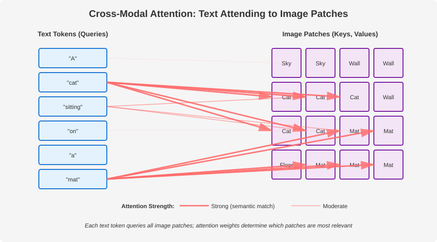
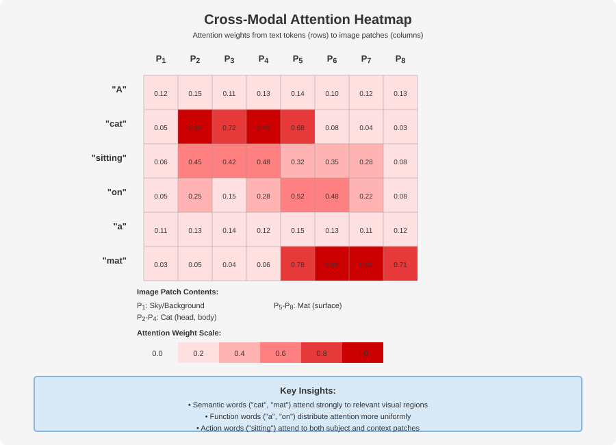
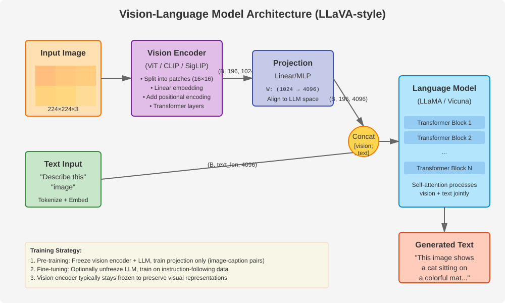
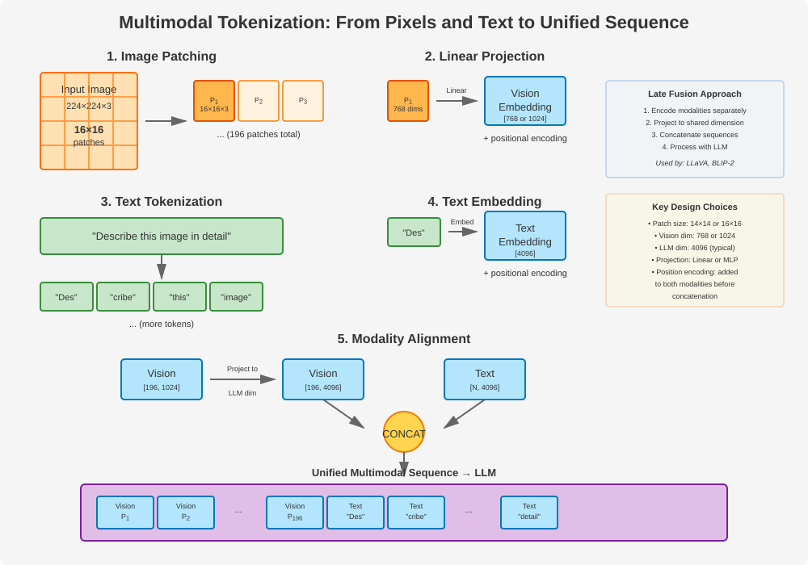

# Chapter 25: Multimodality

Multimodal models extend language models to understand and generate content across multiple modalities—vision, audio, and text. This chapter covers the architectures and techniques that enable models like GPT-4V, LLaVA, and Gemini to process images, audio, and text together.

Understanding multimodality is crucial for modern ML interviews, as the frontier of AI research increasingly focuses on models that can reason across different input types.

## Table of Contents

1. [Introduction to Multimodality](#introduction-to-multimodality)
2. [Vision Encoders](#vision-encoders)
   - [Vision Transformer (ViT)](#vision-transformer-vit)
   - [CLIP](#clip)
   - [SigLIP](#siglip)
3. [Cross-Modal Attention](#cross-modal-attention)
4. [Vision-Language Models](#vision-language-models)
   - [LLaVA Architecture](#llava-architecture)
   - [GPT-4V and Gemini](#gpt-4v-and-gemini)
   - [Flamingo and GIT](#flamingo-and-git)
   - [Recent Open-Source Models](#recent-open-source-models)
     - [Llama 3.2 Vision](#llama-32-vision)
     - [Qwen2-VL](#qwen2-vl)
5. [Memory and Compute Analysis](#memory-and-compute-analysis)
6. [Production Considerations](#production-considerations)
7. [Audio and Speech Integration](#audio-and-speech-integration)
   - [Whisper](#whisper)
   - [Speech-Language Models](#speech-language-models)
8. [Video Understanding](#video-understanding)
9. [Visual Grounding](#visual-grounding)
10. [Multimodal Tokenization Strategies](#multimodal-tokenization-strategies)
11. [Training Multimodal Models](#training-multimodal-models)
12. [Putting It All Together](#putting-it-all-together)

---

## Introduction to Multimodality

Language models traditionally operate on text, but the world contains information in many forms. Multimodal models bridge this gap by:

1. **Encoding** non-text data (images, audio) into representations compatible with language models
2. **Fusing** information from different modalities using attention mechanisms
3. **Generating** outputs that can be text, images, or other modalities

### Key Challenges

| Challenge | Solution Approaches |
|-----------|-------------------|
| **Representation Gap** | Learn shared embedding spaces (CLIP) |
| **Data Alignment** | Contrastive learning, caption generation |
| **Computational Cost** | Efficient encoders, adapter layers |
| **Training Data** | Web-scraped image-text pairs, synthetic data |

---

## Vision Encoders

Vision encoders transform images into token sequences that can be processed by language models.

### Vision Transformer (ViT)

ViT applies the transformer architecture directly to image patches, treating them as tokens.

**The Problem:** Convolutional neural networks (CNNs) have dominated computer vision, but they have inductive biases (locality, translation equivariance) that may limit their flexibility. Can we apply the same architecture that succeeded in NLP (transformers) directly to vision?

**Theoretical Justification:** The key insight is that images can be treated as sequences of patches, analogous to how text is a sequence of tokens. By flattening 2D spatial structure into a 1D sequence, we can apply standard transformer architectures without modification. The self-attention mechanism can learn spatial relationships without built-in locality assumptions.

**Relation to Alternatives:**

- **vs CNNs**: CNNs use local receptive fields and build up global understanding through stacking. ViT uses global self-attention from the start, allowing each patch to attend to all other patches.
- **vs Hybrid Models**: Some approaches combine CNN feature extractors with transformers. Pure ViT is simpler and more scalable to large datasets.

**Key Insights:**

1. **Patch Embedding**: Using convolution with kernel_size = stride = patch_size is mathematically equivalent to splitting into patches and linear projection, but more efficient
2. **Positional Embeddings**: Since transformers are permutation-invariant, we must explicitly encode spatial position (unlike CNNs where position is implicit in the architecture)
3. **CLS Token**: Borrowed from BERT, this learnable token aggregates global image information through self-attention
4. **Scaling**: ViT requires large datasets (ImageNet-21K or JFT-300M) to outperform CNNs, as it has fewer inductive biases

**Architecture:**

1. Split image into fixed-size patches (e.g., 16x16 pixels)
2. Linearly embed each patch
3. Add positional embeddings
4. Process with standard transformer encoder
5. Use [CLS] token for image-level representation

```python
import torch
import torch.nn as nn
from typing import Tuple

class PatchEmbedding(nn.Module):
    """Convert image into sequence of patch embeddings.

    For a 224x224 image with 16x16 patches:

    - Number of patches: (224/16)^2 = 196
    - Each patch: 16*16*3 = 768 values (for RGB)

    """
    def __init__(
        self,
        img_size: int = 224,
        patch_size: int = 16,
        in_channels: int = 3,
        embed_dim: int = 768
    ):
        super().__init__()
        self.img_size = img_size
        self.patch_size = patch_size
        self.n_patches = (img_size // patch_size) ** 2

        # Convolution to extract patches and project to embed_dim
        # This is equivalent to splitting into patches + linear projection
        self.proj = nn.Conv2d(
            in_channels,
            embed_dim,
            kernel_size=patch_size,
            stride=patch_size
        )

    def forward(self, x: torch.Tensor) -> torch.Tensor:
        """
        Args:
            x: (batch, channels, height, width)
        Returns:
            (batch, n_patches, embed_dim)
        """
        # Conv2d output: (batch, embed_dim, n_patches_h, n_patches_w)
        x = self.proj(x)

        # Flatten spatial dimensions
        x = x.flatten(2)  # (batch, embed_dim, n_patches)

        # Transpose to (batch, n_patches, embed_dim)
        x = x.transpose(1, 2)
        return x


class VisionTransformer(nn.Module):
    """Vision Transformer (ViT) implementation.

    Key insight: Images can be treated as sequences of patches,
    just like text is a sequence of tokens.

    Architecture:

    1. Patch embedding
    2. Position embedding
    3. Transformer encoder
    4. Classification head (or use as encoder)

    """
    def __init__(
        self,
        img_size: int = 224,
        patch_size: int = 16,
        in_channels: int = 3,
        embed_dim: int = 768,
        depth: int = 12,
        n_heads: int = 12,
        mlp_ratio: float = 4.0,
        dropout: float = 0.1,
        num_classes: int = 1000
    ):
        super().__init__()

        self.patch_embed = PatchEmbedding(
            img_size, patch_size, in_channels, embed_dim
        )
        n_patches = self.patch_embed.n_patches

        # Learnable [CLS] token for image representation
        self.cls_token = nn.Parameter(torch.zeros(1, 1, embed_dim))

        # Positional embeddings for patches + CLS token
        self.pos_embed = nn.Parameter(
            torch.zeros(1, n_patches + 1, embed_dim)
        )

        self.dropout = nn.Dropout(dropout)

        # Transformer encoder blocks
        # In practice, use nn.TransformerEncoder
        self.blocks = nn.ModuleList([
            TransformerBlock(embed_dim, n_heads, mlp_ratio, dropout)
            for _ in range(depth)
        ])

        self.norm = nn.LayerNorm(embed_dim)

        # Classification head (optional)
        self.head = nn.Linear(embed_dim, num_classes)

    def forward(self, x: torch.Tensor) -> torch.Tensor:
        """
        Args:
            x: (batch, channels, height, width)
        Returns:
            Image embeddings (batch, n_patches+1, embed_dim)
            or class logits if using as classifier
        """
        batch_size = x.shape[0]

        # Patch embeddings
        x = self.patch_embed(x)  # (batch, n_patches, embed_dim)

        # Prepend CLS token
        cls_tokens = self.cls_token.expand(batch_size, -1, -1)
        x = torch.cat([cls_tokens, x], dim=1)  # (batch, n_patches+1, embed_dim)

        # Add positional embeddings
        x = x + self.pos_embed
        x = self.dropout(x)

        # Apply transformer blocks
        for block in self.blocks:
            x = block(x)

        x = self.norm(x)

        # Return all tokens (for multimodal) or just CLS (for classification)
        return x

    def get_image_features(self, x: torch.Tensor) -> torch.Tensor:
        """Extract image features for multimodal models."""
        return self.forward(x)  # Returns all patch embeddings


class TransformerBlock(nn.Module):
    """Standard transformer block for ViT."""
    def __init__(
        self,
        dim: int,
        n_heads: int,
        mlp_ratio: float = 4.0,
        dropout: float = 0.1
    ):
        super().__init__()
        self.norm1 = nn.LayerNorm(dim)
        self.attn = nn.MultiheadAttention(
            dim, n_heads, dropout=dropout, batch_first=True
        )
        self.norm2 = nn.LayerNorm(dim)
        self.mlp = nn.Sequential(
            nn.Linear(dim, int(dim * mlp_ratio)),
            nn.GELU(),
            nn.Dropout(dropout),
            nn.Linear(int(dim * mlp_ratio), dim),
            nn.Dropout(dropout)
        )

    def forward(self, x: torch.Tensor) -> torch.Tensor:
        # Self-attention with residual
        attn_out, _ = self.attn(self.norm1(x), self.norm1(x), self.norm1(x))
        x = x + attn_out

        # MLP with residual
        x = x + self.mlp(self.norm2(x))
        return x
```

**Key Papers:**

- [An Image is Worth 16x16 Words: Transformers for Image Recognition at Scale](https://arxiv.org/abs/2010.11929) (Dosovitskiy et al., 2020)

### CLIP

CLIP (Contrastive Language-Image Pre-training) learns aligned representations of images and text through contrastive learning.

**Architecture:**

- **Image Encoder**: ViT or ResNet
- **Text Encoder**: Transformer
- **Training**: Contrastive loss on image-text pairs

```math
\mathcal{L}_{\text{CLIP}} = -\frac{1}{N} \sum_{i=1}^{N} \left[ \log \frac{\exp(\text{sim}(I_i, T_i) / \tau)}{\sum_{j=1}^{N} \exp(\text{sim}(I_i, T_j) / \tau)} \right]
```

where $\text{sim}(I, T) = \frac{I \cdot T}{\|I\| \|T\|}$ is cosine similarity and $\tau$ is temperature.

```python
class CLIP(nn.Module):
    """Simplified CLIP implementation.

    CLIP learns to align image and text representations by
    maximizing similarity between matching pairs and minimizing
    similarity between non-matching pairs.

    Training data: 400M image-text pairs from the web
    """
    def __init__(
        self,
        embed_dim: int = 512,
        vision_width: int = 768,
        text_width: int = 512,
        vocab_size: int = 49408,
        max_text_len: int = 77
    ):
        super().__init__()

        # Vision encoder (ViT)
        self.visual = VisionTransformer(
            embed_dim=vision_width,
            depth=12,
            n_heads=12
        )

        # Text encoder (Transformer)
        self.text_encoder = nn.TransformerEncoder(
            nn.TransformerEncoderLayer(
                d_model=text_width,
                nhead=8,
                dim_feedforward=2048,
                batch_first=True
            ),
            num_layers=12
        )

        self.token_embedding = nn.Embedding(vocab_size, text_width)
        self.positional_embedding = nn.Parameter(
            torch.zeros(max_text_len, text_width)
        )

        # Projection heads to shared embedding space
        self.visual_projection = nn.Linear(vision_width, embed_dim, bias=False)
        self.text_projection = nn.Linear(text_width, embed_dim, bias=False)

        # Learnable temperature parameter
        self.logit_scale = nn.Parameter(torch.ones([]) * torch.log(torch.tensor(1/0.07)))

    def encode_image(self, image: torch.Tensor) -> torch.Tensor:
        """Encode image to shared embedding space."""
        x = self.visual(image)
        # Use CLS token (first token)
        x = x[:, 0]
        x = self.visual_projection(x)
        # L2 normalize
        x = x / x.norm(dim=-1, keepdim=True)
        return x

    def encode_text(self, text: torch.Tensor) -> torch.Tensor:
        """Encode text to shared embedding space.

        Args:
            text: (batch, seq_len) token indices
        """
        # Embed tokens
        x = self.token_embedding(text)
        x = x + self.positional_embedding[:text.shape[1]]

        # Encode with transformer
        x = self.text_encoder(x)

        # Use last token (EOS token) as text representation
        x = x[torch.arange(x.shape[0]), text.argmax(dim=-1)]
        x = self.text_projection(x)

        # L2 normalize
        x = x / x.norm(dim=-1, keepdim=True)
        return x

    def forward(
        self,
        image: torch.Tensor,
        text: torch.Tensor
    ) -> Tuple[torch.Tensor, torch.Tensor]:
        """
        Compute similarity matrix between images and texts.

        Returns:
            logits_per_image: (batch, batch) - image-to-text similarities
            logits_per_text: (batch, batch) - text-to-image similarities
        """
        image_features = self.encode_image(image)
        text_features = self.encode_text(text)

        # Compute similarity matrix
        logit_scale = self.logit_scale.exp()
        logits_per_image = logit_scale * image_features @ text_features.T
        logits_per_text = logits_per_image.T

        return logits_per_image, logits_per_text


def clip_loss(logits_per_image: torch.Tensor, logits_per_text: torch.Tensor) -> torch.Tensor:
    """Symmetric cross-entropy loss for CLIP.

    The diagonal represents correct image-text pairs.
    Off-diagonal elements are negatives.
    """
    batch_size = logits_per_image.shape[0]
    labels = torch.arange(batch_size, device=logits_per_image.device)

    loss_i2t = nn.functional.cross_entropy(logits_per_image, labels)
    loss_t2i = nn.functional.cross_entropy(logits_per_text, labels)

    return (loss_i2t + loss_t2i) / 2


# Example usage
def train_clip_step(model: CLIP, images: torch.Tensor, texts: torch.Tensor):
    """Single training step for CLIP."""
    logits_per_image, logits_per_text = model(images, texts)
    loss = clip_loss(logits_per_image, logits_per_text)
    return loss
```

**Key Capabilities:**

- Zero-shot image classification by comparing image embeddings with text embeddings of class names
- Image retrieval from text queries
- Foundation for vision-language models

**Key Papers:**

- [Learning Transferable Visual Models From Natural Language Supervision](https://arxiv.org/abs/2103.00020) (Radford et al., 2021)

### SigLIP

SigLIP (Sigmoid Loss for Language Image Pre-training) improves upon CLIP by using a sigmoid loss instead of softmax.

**The Problem:** CLIP's softmax-based contrastive loss has practical limitations. It treats all negative pairs in a batch equally and requires very large batch sizes (often 32K+) for good performance. This creates memory constraints and makes training difficult on smaller hardware.

**Theoretical Justification:** Instead of normalizing over the entire batch with softmax, SigLIP treats each image-text pair independently as a binary classification problem. For matching pairs, the model should output high similarity; for non-matching pairs, low similarity. This formulation is more aligned with the fundamental task and doesn't require global normalization.

**Relation to Alternatives:**

- **vs CLIP Softmax**: CLIP's loss couples all examples in a batch through the softmax normalization. SigLIP's sigmoid loss makes each pair independent, allowing gradient updates to be more stable and less sensitive to batch composition.
- **vs Triplet Loss**: Triplet loss requires careful mining of hard negatives. SigLIP automatically handles all positive and negative pairs without mining.

**Key Insights:**

1. **Batch Size Independence**: Works well with smaller batches (e.g., 1K vs 32K), making it more accessible
2. **Label Smoothing**: The sigmoid formulation naturally incorporates uncertainty about negative pairs
3. **Better Performance**: Often achieves better zero-shot performance than CLIP with the same model size
4. **Training Stability**: Gradients are more stable because they don't depend on the hardest negatives in a large batch

**Key Difference:**

- **CLIP**: Uses softmax over all pairs in batch (requires large batches)
- **SigLIP**: Uses sigmoid on individual pairs (more stable, smaller batches)

```math
\mathcal{L}_{\text{SigLIP}} = -\frac{1}{N^2} \sum_{i,j} \log \sigma(y_{ij} \cdot z_{ij})
```

where $y_{ij} = 1$ if image $i$ matches text $j$ else $-1$, and $z_{ij}$ is the similarity score.

```python
def siglip_loss(
    image_features: torch.Tensor,
    text_features: torch.Tensor,
    temperature: float = 1.0
) -> torch.Tensor:
    """SigLIP loss using sigmoid instead of softmax.

    Benefits:

    - More stable training
    - Works with smaller batch sizes
    - Better performance on some tasks

    """
    batch_size = image_features.shape[0]

    # Compute similarity matrix
    similarities = temperature * image_features @ text_features.T

    # Create labels: 1 for diagonal (matching pairs), -1 for off-diagonal
    labels = 2 * torch.eye(batch_size, device=similarities.device) - 1

    # Sigmoid loss
    loss = -torch.log(torch.sigmoid(labels * similarities)).mean()

    return loss
```

**Key Papers:**

- [Sigmoid Loss for Language Image Pre-Training](https://arxiv.org/abs/2303.15343) (Zhai et al., 2023)

---

## Cross-Modal Attention

Cross-modal attention allows the language model to attend to visual features. See [Cross-Attention](06-cross-attention.md) for the general mechanism.



The diagram above illustrates how text tokens (queries) attend to image patches (keys and values). Notice how semantic words like "cat" and "mat" have strong attention weights to their corresponding visual regions, while function words distribute attention more broadly.



The heatmap shows the attention weight matrix between text tokens and image patches. Each cell represents how strongly a text token attends to a specific image patch. Darker colors indicate stronger attention. This visualization reveals how the model creates cross-modal semantic alignment.

```python
class CrossModalAttention(nn.Module):
    """Cross-attention from text (query) to visual features (key, value).

    This allows language tokens to attend to relevant parts of an image.
    Used in models like Flamingo, BLIP-2, and others.
    """
    def __init__(
        self,
        text_dim: int,
        visual_dim: int,
        n_heads: int = 8,
        dropout: float = 0.1
    ):
        super().__init__()
        self.n_heads = n_heads
        self.head_dim = text_dim // n_heads

        # Query from text
        self.q_proj = nn.Linear(text_dim, text_dim)

        # Key and Value from visual features
        self.k_proj = nn.Linear(visual_dim, text_dim)
        self.v_proj = nn.Linear(visual_dim, text_dim)

        self.out_proj = nn.Linear(text_dim, text_dim)
        self.dropout = nn.Dropout(dropout)

    def forward(
        self,
        text: torch.Tensor,
        visual: torch.Tensor,
        mask: torch.Tensor = None
    ) -> torch.Tensor:
        """
        Args:
            text: (batch, text_len, text_dim) - language model hidden states
            visual: (batch, n_patches, visual_dim) - visual encoder outputs
            mask: Optional attention mask

        Returns:
            (batch, text_len, text_dim) - attended text features
        """
        batch_size, text_len, _ = text.shape

        # Project to Q, K, V
        Q = self.q_proj(text).view(batch_size, text_len, self.n_heads, self.head_dim)
        K = self.k_proj(visual).view(batch_size, -1, self.n_heads, self.head_dim)
        V = self.v_proj(visual).view(batch_size, -1, self.n_heads, self.head_dim)

        # Transpose for attention: (batch, n_heads, seq_len, head_dim)
        Q = Q.transpose(1, 2)
        K = K.transpose(1, 2)
        V = V.transpose(1, 2)

        # Compute attention scores
        scores = torch.matmul(Q, K.transpose(-2, -1)) / (self.head_dim ** 0.5)

        if mask is not None:
            scores = scores.masked_fill(mask == 0, float('-inf'))

        attn = torch.softmax(scores, dim=-1)
        attn = self.dropout(attn)

        # Apply attention to values
        out = torch.matmul(attn, V)  # (batch, n_heads, text_len, head_dim)

        # Concatenate heads
        out = out.transpose(1, 2).contiguous().view(batch_size, text_len, -1)

        return self.out_proj(out)


class PerceiverResampler(nn.Module):
    """Perceiver Resampler from Flamingo.

    **The Problem:** Vision encoders produce variable numbers of tokens (e.g., 196 patches for 224x224 images,
    768 patches for 448x448 images). Having the LLM attend to all visual tokens is computationally expensive:
    attention has O(n²) complexity, so doubling image resolution quadruples computation. For high-resolution
    images or videos with many frames, this becomes prohibitive.

    **Theoretical Justification:** The Perceiver architecture showed that you can use a fixed set of learnable
    "query" tokens to extract information from variable-length inputs via cross-attention. These queries act
    as a learned compression mechanism, distilling the most important visual information into a compact,
    fixed-size representation. The queries learn to "ask" for task-relevant features.

    **Relation to Alternatives:**

    - **vs Direct Concatenation (LLaVA)**: LLaVA concatenates all visual tokens, making sequence length

      proportional to image resolution. Perceiver uses fixed tokens regardless of input size.

    - **vs Simple Pooling**: Average/max pooling loses fine-grained information. Perceiver learns

      what to extract via attention.

    - **vs Convolutional Downsampling**: Preserves spatial structure but uses fixed patterns.

      Perceiver learns task-specific compression.

    **Key Insights:**

    1. **Fixed Computational Cost**: Always outputs n_queries tokens (typically 64-256), making LLM

       attention cost predictable and manageable

    2. **Learned Compression**: Queries learn to extract task-relevant features through training
    3. **Iterative Refinement**: Multiple layers of cross-attention + self-attention allow queries

       to refine their representations

    4. **Flexibility**: Handles arbitrary input resolutions and video without architecture changes

    Compresses variable-length visual features into fixed number of tokens.
    This is more efficient than attending to all image patches.

    Key idea: Use learnable query tokens that attend to all visual features.
    """
    def __init__(
        self,
        visual_dim: int,
        output_dim: int,
        n_queries: int = 64,
        depth: int = 6,
        n_heads: int = 8
    ):
        super().__init__()

        # Learnable query tokens
        self.queries = nn.Parameter(torch.randn(1, n_queries, output_dim))

        # Cross-attention layers
        self.layers = nn.ModuleList([
            nn.ModuleDict({
                'cross_attn': CrossModalAttention(output_dim, visual_dim, n_heads),
                'self_attn': nn.MultiheadAttention(output_dim, n_heads, batch_first=True),
                'mlp': nn.Sequential(
                    nn.Linear(output_dim, output_dim * 4),
                    nn.GELU(),
                    nn.Linear(output_dim * 4, output_dim)
                ),
                'norm1': nn.LayerNorm(output_dim),
                'norm2': nn.LayerNorm(output_dim),
                'norm3': nn.LayerNorm(output_dim),
            })
            for _ in range(depth)
        ])

    def forward(self, visual_features: torch.Tensor) -> torch.Tensor:
        """
        Args:
            visual_features: (batch, n_patches, visual_dim)

        Returns:
            (batch, n_queries, output_dim) - compressed visual features
        """
        batch_size = visual_features.shape[0]

        # Expand queries for batch
        x = self.queries.expand(batch_size, -1, -1)

        for layer in self.layers:
            # Cross-attention to visual features
            x = x + layer['cross_attn'](layer['norm1'](x), visual_features)

            # Self-attention among query tokens
            attn_out, _ = layer['self_attn'](
                layer['norm2'](x), layer['norm2'](x), layer['norm2'](x)
            )
            x = x + attn_out

            # MLP
            x = x + layer['mlp'](layer['norm3'](x))

        return x
```

---

## Vision-Language Models

### LLaVA Architecture

LLaVA (Large Language and Vision Assistant) connects a vision encoder to an LLM using a simple projection layer.

**Architecture Components:**

1. **Vision Encoder**: Pre-trained CLIP ViT
2. **Projection**: Linear layer to map visual features to LLM embedding space
3. **Language Model**: Pre-trained LLM (Vicuna, LLaMA)



This diagram shows the complete flow from image and text inputs through the vision encoder, projection layer, concatenation, and final processing by the LLM. The key insight is that vision features are projected into the same embedding space as text, allowing the LLM to process them jointly through its transformer layers.

```python
class LLaVA(nn.Module):
    """LLaVA: Large Language and Vision Assistant.

    Simple but effective architecture:

    1. Encode image with CLIP
    2. Project visual features to LLM embedding space
    3. Concatenate with text embeddings
    4. Process with LLM

    Training stages:

    1. Pre-training: Align vision and language (projection layer only)
    2. Instruction tuning: Fine-tune on visual instruction data

    """
    def __init__(
        self,
        vision_encoder: nn.Module,  # Pre-trained CLIP
        language_model: nn.Module,   # Pre-trained LLM
        vision_dim: int = 1024,
        language_dim: int = 4096
    ):
        super().__init__()

        self.vision_encoder = vision_encoder
        self.language_model = language_model

        # Simple linear projection (can also use MLP)
        self.vision_projection = nn.Linear(vision_dim, language_dim)

        # Freeze encoders initially
        for param in self.vision_encoder.parameters():
            param.requires_grad = False
        for param in self.language_model.parameters():
            param.requires_grad = False

    def encode_image(self, images: torch.Tensor) -> torch.Tensor:
        """Encode images and project to language space."""
        # Get visual features from CLIP
        with torch.no_grad():
            visual_features = self.vision_encoder.get_image_features(images)

        # visual_features: (batch, n_patches, vision_dim)
        # Project to language dimension
        visual_embeds = self.vision_projection(visual_features)

        return visual_embeds

    def forward(
        self,
        images: torch.Tensor,
        input_ids: torch.Tensor,
        attention_mask: torch.Tensor = None
    ) -> torch.Tensor:
        """
        Args:
            images: (batch, channels, height, width)
            input_ids: (batch, text_len) - text tokens
            attention_mask: Optional mask

        Returns:
            Language model outputs
        """
        # Encode image
        visual_embeds = self.encode_image(images)
        batch_size, n_visual_tokens, _ = visual_embeds.shape

        # Get text embeddings from language model
        text_embeds = self.language_model.get_input_embeddings()(input_ids)

        # Concatenate visual and text embeddings
        # Format: [visual tokens] [text tokens]
        combined_embeds = torch.cat([visual_embeds, text_embeds], dim=1)

        # Create attention mask for combined sequence
        if attention_mask is not None:
            visual_mask = torch.ones(
                batch_size, n_visual_tokens,
                dtype=attention_mask.dtype,
                device=attention_mask.device
            )
            combined_mask = torch.cat([visual_mask, attention_mask], dim=1)
        else:
            combined_mask = None

        # Forward through language model
        outputs = self.language_model(
            inputs_embeds=combined_embeds,
            attention_mask=combined_mask
        )

        return outputs

    def generate(
        self,
        images: torch.Tensor,
        prompts: torch.Tensor,
        max_length: int = 512,
        **generation_kwargs
    ) -> torch.Tensor:
        """Generate text from image and prompt."""
        visual_embeds = self.encode_image(images)
        prompt_embeds = self.language_model.get_input_embeddings()(prompts)

        # Combine embeddings
        combined_embeds = torch.cat([visual_embeds, prompt_embeds], dim=1)

        # Generate (simplified - actual implementation more complex)
        return self.language_model.generate(
            inputs_embeds=combined_embeds,
            max_length=max_length,
            **generation_kwargs
        )


# Training LLaVA
def train_llava_stage1(
    model: LLaVA,
    image_text_pairs: list,
    num_epochs: int = 1
):
    """Stage 1: Pre-training for vision-language alignment.

    Only train the projection layer.
    Use image captioning data (e.g., CC3M, LAION).
    """
    # Freeze everything except projection
    for param in model.parameters():
        param.requires_grad = False
    for param in model.vision_projection.parameters():
        param.requires_grad = True

    optimizer = torch.optim.AdamW(
        model.vision_projection.parameters(),
        lr=1e-3
    )

    # Training loop (simplified)
    for epoch in range(num_epochs):
        for images, captions in image_text_pairs:
            # Forward pass
            outputs = model(images, captions)

            # Language modeling loss
            loss = outputs.loss  # Cross-entropy on next token prediction

            # Backward pass
            optimizer.zero_grad()
            loss.backward()
            optimizer.step()


def train_llava_stage2(
    model: LLaVA,
    instruction_data: list,
    num_epochs: int = 3
):
    """Stage 2: Instruction tuning.

    Fine-tune projection + LLM on visual instruction data.
    Keep vision encoder frozen.
    """
    # Unfreeze LLM and projection
    for param in model.language_model.parameters():
        param.requires_grad = True
    for param in model.vision_projection.parameters():
        param.requires_grad = True

    # Use LoRA for efficient fine-tuning (see Chapter 18)
    optimizer = torch.optim.AdamW(
        [p for p in model.parameters() if p.requires_grad],
        lr=2e-5
    )

    # Training loop (simplified)
    for epoch in range(num_epochs):
        for images, instructions, responses in instruction_data:
            # Forward pass
            outputs = model(images, instructions)

            # Only compute loss on response tokens
            loss = compute_instruction_loss(outputs, responses)

            optimizer.zero_grad()
            loss.backward()
            optimizer.step()


def compute_instruction_loss(
    outputs: torch.Tensor,
    responses: torch.Tensor,
    instruction_mask: torch.Tensor
) -> torch.Tensor:
    """Compute loss only on response tokens, not instruction.

    Args:
        outputs: Model logits (batch, seq_len, vocab_size)
        responses: Target tokens (batch, seq_len)
        instruction_mask: Boolean mask, True for response tokens to compute loss on

    Returns:
        Scalar loss value

    Example:
        For input "USER: What's in the image? ASSISTANT: A cat"

        - instruction_mask is False for "USER: What's in the image? ASSISTANT:"
        - instruction_mask is True for "A cat"

    """
    import torch.nn.functional as F

    # Flatten for cross-entropy
    # outputs: (batch * seq_len, vocab_size)
    # targets: (batch * seq_len,)
    logits = outputs.view(-1, outputs.size(-1))
    targets = responses.view(-1)

    # Compute loss without reduction
    loss = F.cross_entropy(logits, targets, reduction='none')

    # Apply mask to only include response tokens
    # instruction_mask: (batch, seq_len) -> (batch * seq_len,)
    mask = instruction_mask.view(-1).float()
    loss = loss * mask

    # Average over valid tokens only
    return loss.sum() / mask.sum().clamp(min=1.0)
```

**LLaVA Training Data:**

- **Stage 1**: 595K image-caption pairs from COCO (filtered for quality)
- **Stage 2**: 158K visual instruction-following samples (GPT-4 generated)

**Key Papers:**

- [Visual Instruction Tuning](https://arxiv.org/abs/2304.08485) (Liu et al., 2023)
- [Improved Baselines with Visual Instruction Tuning](https://arxiv.org/abs/2310.03744) (Liu et al., 2023)

### GPT-4V and Gemini

GPT-4V (GPT-4 with Vision) and Gemini are proprietary multimodal models with unpublished architectures.

**Known Characteristics:**

| Model | Vision Integration | Context | Key Features |
|-------|-------------------|---------|--------------|
| **GPT-4V** | Late fusion | Text + images | OCR, charts, complex reasoning |
| **Gemini** | Native multimodal | 1M+ tokens | Video, audio, text, images |

**Gemini Architecture (from papers):**

- Trained multimodally from scratch (not vision encoder + LLM)
- Sparse Mixture of Experts
- Native support for images, video, and audio
- Uses interleaved image-text sequences during training

```python
# Conceptual Gemini-style multimodal tokenization
class MultimodalTokenizer:
    """Conceptual approach for native multimodal models.

    Instead of separate encoders + fusion, learn a unified
    tokenizer that handles all modalities.
    """
    def __init__(self, vocab_size: int = 256000):
        # Text tokens: 0-128K
        # Image tokens: 128K-200K (learned via VQ-VAE)
        # Audio tokens: 200K-256K
        self.vocab_size = vocab_size
        self.text_vocab_size = 128000
        self.image_vocab_size = 72000
        self.audio_vocab_size = 56000

    def tokenize(self, data: dict) -> torch.Tensor:
        """
        Tokenize multimodal data into unified token sequence.

        Args:
            data: Dict with 'text', 'images', 'audio' keys

        Returns:
            Unified token sequence
        """
        tokens = []

        if 'text' in data:
            tokens.extend(self.tokenize_text(data['text']))

        if 'images' in data:
            # Use VQ-VAE or similar to discretize images
            image_tokens = self.tokenize_images(data['images'])
            tokens.extend(image_tokens + self.text_vocab_size)

        if 'audio' in data:
            audio_tokens = self.tokenize_audio(data['audio'])
            tokens.extend(
                audio_tokens + self.text_vocab_size + self.image_vocab_size
            )

        return torch.tensor(tokens)

    def tokenize_text(self, text: str) -> list:
        """Standard text tokenization (BPE, etc.)."""
        pass

    def tokenize_images(self, images: torch.Tensor) -> list:
        """Discretize images into tokens using VQ-VAE."""
        pass

    def tokenize_audio(self, audio: torch.Tensor) -> list:
        """Discretize audio into tokens."""
        pass
```

### Flamingo and GIT

**Flamingo** (DeepMind) uses Perceiver Resampler and gated cross-attention.

**GIT** (Generative Image-to-Text) uses a simpler architecture similar to early LLaVA.

**Key Papers:**

- [Flamingo: a Visual Language Model for Few-Shot Learning](https://arxiv.org/abs/2204.14198) (Alayrac et al., 2022)
- [GIT: A Generative Image-to-text Transformer for Vision and Language](https://arxiv.org/abs/2205.14100) (Wang et al., 2022)

### Recent Open-Source Models

#### Llama 3.2 Vision

Llama 3.2 Vision (Meta, 2024) brings multimodal capabilities to the Llama family.

**Architecture:**

- **Vision Encoder**: Pre-trained vision transformer (similar to CLIP)
- **Adapter**: Cross-attention adapter layers inserted into Llama
- **Language Model**: Llama 3.2 (11B or 90B parameters)
- **Image Resolution**: Supports high-resolution images via tiling

**Key Features:**

1. **High-Resolution Support**: Splits images into tiles for detailed understanding
2. **Cross-Attention Adapter**: Lightweight adapter layers instead of full fine-tuning
3. **Instruction Following**: Strong instruction-following capabilities inherited from Llama

```python
class Llama32VisionAdapter(nn.Module):
    """
    Cross-attention adapter for Llama 3.2 Vision.

    Instead of modifying the base Llama model, insert adapter layers
    that allow attending to visual features.
    """
    def __init__(
        self,
        llama_dim: int = 4096,
        vision_dim: int = 1024,
        n_heads: int = 32,
        adapter_layers: list = [3, 7, 11, 15, 19, 23]  # Which layers get adapters
    ):
        super().__init__()

        self.adapter_layers = adapter_layers

        # Cross-attention modules for selected layers
        self.cross_attentions = nn.ModuleDict({
            str(layer_idx): nn.MultiheadAttention(
                llama_dim, n_heads, batch_first=True
            )
            for layer_idx in adapter_layers
        })

        # Project vision features to Llama dimension
        self.vision_proj = nn.Linear(vision_dim, llama_dim)

        # Gating mechanism to control adapter influence
        self.gates = nn.ModuleDict({
            str(layer_idx): nn.Linear(llama_dim, 1)
            for layer_idx in adapter_layers
        })

    def forward(
        self,
        hidden_states: torch.Tensor,
        visual_features: torch.Tensor,
        layer_idx: int
    ) -> torch.Tensor:
        """
        Apply cross-attention adapter at specific layer.

        Args:
            hidden_states: (batch, seq_len, llama_dim) - from Llama layer
            visual_features: (batch, n_patches, vision_dim) - from vision encoder
            layer_idx: Which Llama layer this is

        Returns:
            (batch, seq_len, llama_dim) - updated hidden states
        """
        if layer_idx not in self.adapter_layers:
            return hidden_states

        # Project visual features
        visual_embeds = self.vision_proj(visual_features)

        # Cross-attention from text to image
        cross_attn_out, _ = self.cross_attentions[str(layer_idx)](
            hidden_states,     # query
            visual_embeds,     # key
            visual_embeds      # value
        )

        # Gating: learn how much to mix in cross-attention
        gate = torch.sigmoid(self.gates[str(layer_idx)](hidden_states))

        # Mix original and cross-attended features
        output = hidden_states + gate * cross_attn_out

        return output


class Llama32Vision(nn.Module):
    """
    Llama 3.2 Vision model architecture.

    Combines:

    1. Vision encoder for images
    2. Image tiling for high resolution
    3. Cross-attention adapters in Llama layers

    """
    def __init__(
        self,
        vision_encoder: nn.Module,
        llama_model: nn.Module,
        max_tiles: int = 4
    ):
        super().__init__()

        self.vision_encoder = vision_encoder
        self.llama_model = llama_model
        self.max_tiles = max_tiles

        # Adapter for cross-attention
        self.adapter = Llama32VisionAdapter(
            llama_dim=4096,
            vision_dim=1024
        )

        # Position embeddings for tiles
        self.tile_pos_embed = nn.Parameter(
            torch.randn(max_tiles, 1024)
        )

    def process_high_res_image(
        self,
        image: torch.Tensor,
        tile_size: int = 224
    ) -> torch.Tensor:
        """
        Process high-resolution image by tiling.

        For a 448x448 image with 224x224 tiles:

        - Split into 4 tiles (2x2 grid)
        - Encode each tile separately
        - Combine with positional embeddings

        Args:
            image: (batch, channels, height, width) - high-res image

        Returns:
            (batch, n_tiles * n_patches, vision_dim)
        """
        batch_size, channels, height, width = image.shape

        # Calculate number of tiles needed
        n_tiles_h = (height + tile_size - 1) // tile_size
        n_tiles_w = (width + tile_size - 1) // tile_size

        tiles = []
        for i in range(n_tiles_h):
            for j in range(n_tiles_w):
                # Extract tile
                tile = image[
                    :,
                    :,
                    i * tile_size:(i + 1) * tile_size,
                    j * tile_size:(j + 1) * tile_size
                ]

                # Pad if necessary
                if tile.shape[2] < tile_size or tile.shape[3] < tile_size:
                    tile = nn.functional.pad(
                        tile,
                        (0, tile_size - tile.shape[3], 0, tile_size - tile.shape[2])
                    )

                tiles.append(tile)

        # Stack tiles: (batch * n_tiles, channels, tile_size, tile_size)
        tiles = torch.stack(tiles, dim=1).flatten(0, 1)

        # Encode all tiles
        tile_features = self.vision_encoder(tiles)
        # (batch * n_tiles, n_patches, vision_dim)

        n_tiles = n_tiles_h * n_tiles_w
        n_patches = tile_features.shape[1]
        vision_dim = tile_features.shape[2]

        # Reshape to (batch, n_tiles, n_patches, vision_dim)
        tile_features = tile_features.view(batch_size, n_tiles, n_patches, vision_dim)

        # Add tile positional embeddings
        for tile_idx in range(n_tiles):
            tile_features[:, tile_idx] += self.tile_pos_embed[tile_idx].unsqueeze(0).unsqueeze(0)

        # Flatten: (batch, n_tiles * n_patches, vision_dim)
        return tile_features.flatten(1, 2)

    def forward(
        self,
        images: torch.Tensor,
        input_ids: torch.Tensor
    ) -> torch.Tensor:
        """Forward pass with cross-attention adapters."""
        # Process image (with tiling for high-res)
        visual_features = self.process_high_res_image(images)

        # Forward through Llama with adapters
        # This requires modifying Llama's forward to call adapters
        # Simplified version shown here
        outputs = self.llama_model(
            input_ids,
            visual_features=visual_features,
            adapter=self.adapter
        )

        return outputs
```

**Training Strategy:**

1. **Phase 1**: Train vision encoder and projection layers
2. **Phase 2**: Train adapter layers with Llama frozen
3. **Phase 3**: (Optional) Fine-tune everything with LoRA

**Key Papers:**

- [Llama 3.2: Revolutionizing edge AI and vision with open, customizable models](https://ai.meta.com/blog/llama-3-2-connect-2024-vision-edge-mobile-devices/) (Meta, 2024)

#### Qwen2-VL

Qwen2-VL (Alibaba, 2024) is a state-of-the-art open vision-language model with strong performance.

**Key Innovations:**

1. **Dynamic Resolution**: Handles arbitrary image resolutions without fixed tiling
2. **Multimodal Rotary Position Embedding (M-RoPE)**: Extends RoPE to 2D spatial positions
3. **Native Video Support**: Treats video as 3D input (time + spatial)
4. **Vision-Language Joint Training**: Trained jointly on vision and language from scratch

```python
class MultimodalRoPE(nn.Module):
    """
    Multimodal Rotary Position Embedding (M-RoPE) from Qwen2-VL.

    **The Problem:** Standard RoPE (Rotary Position Embedding) encodes 1D sequential positions for text.
    Images and videos have inherent 2D/3D structure (height, width, and optionally time), but when we flatten
    patches into a sequence, we lose this structural information. How can we encode multi-dimensional
    positional relationships in attention mechanisms?

    **Theoretical Justification:** RoPE works by rotating query and key vectors based on position, which
    makes relative position information emerge naturally in attention scores. For multi-dimensional data,
    we can apply RoPE independently to each dimension (t, h, w) by partitioning the embedding space.
    This preserves the relative position benefits of RoPE while respecting the structure of the data.

    **Relation to Alternatives:**

    - **vs Learned 2D Positional Embeddings**: Learned embeddings are fixed to specific resolutions.

      M-RoPE generalizes to arbitrary resolutions like standard RoPE.

    - **vs Absolute Positional Embeddings**: Absolute embeddings don't capture relative relationships

      as naturally. RoPE-style embeddings make relative position explicit in the attention mechanism.

    - **vs Concatenating Coordinates**: Simply adding (x,y) coordinates loses the beneficial properties

      of rotary embeddings (length preservation, relative position encoding).

    **Key Insights:**

    1. **Dimension Factorization**: Split the embedding dimension into 3 parts for (t, h, w), applying

       RoPE independently to each. This allows the model to learn separate importance for each axis.

    2. **Resolution Invariance**: Like 1D RoPE, M-RoPE generalizes to resolutions not seen during training

       because it's based on continuous functions (sin/cos), not lookup tables.

    3. **Temporal Extension**: By adding a temporal dimension, the same mechanism handles both images

       (t=0 for all patches) and videos (t varies across frames) in a unified way.

    4. **Relative Position Preservation**: The dot product between rotated embeddings still encodes

       relative position, now in multi-dimensional space.

    Extends standard RoPE to handle 2D spatial positions for images.

    Standard RoPE: Applies rotation based on 1D position
    M-RoPE: Applies rotation based on (temporal, height, width) position

    For a patch at position (t, h, w):

    - Apply RoPE separately for each dimension
    - Combine rotations

    """
    def __init__(self, dim: int, max_seq_len: int = 8192):
        super().__init__()
        self.dim = dim

        # Standard 1D position for text
        self.text_rope = self._compute_rope_embeddings(dim, max_seq_len)

        # 2D spatial positions for images (reuse computation)
        # For images, we'll compute on-the-fly based on actual resolution

    def _compute_rope_embeddings(self, dim: int, max_len: int) -> torch.Tensor:
        """Compute standard RoPE embeddings."""
        position = torch.arange(max_len).unsqueeze(1)
        div_term = torch.exp(
            torch.arange(0, dim, 2) * (-torch.log(torch.tensor(10000.0)) / dim)
        )

        embeddings = torch.zeros(max_len, dim)
        embeddings[:, 0::2] = torch.sin(position * div_term)
        embeddings[:, 1::2] = torch.cos(position * div_term)

        return embeddings

    def forward(
        self,
        x: torch.Tensor,
        positions: torch.Tensor,
        position_type: str = 'text'
    ) -> torch.Tensor:
        """
        Apply M-RoPE to input.

        Args:
            x: (batch, seq_len, dim) - input features
            positions: Position indices

              - For text: (batch, seq_len) - 1D positions
              - For images: (batch, seq_len, 3) - (t, h, w) positions

            position_type: 'text' or 'image'

        Returns:
            (batch, seq_len, dim) with RoPE applied
        """
        if position_type == 'text':
            # Standard 1D RoPE
            pos_embed = self.text_rope[positions]
            return x * pos_embed

        elif position_type == 'image':
            # 2D spatial RoPE (simplified)
            # In practice, apply separate RoPE to each dimension
            # and combine

            batch_size, seq_len, dim = x.shape
            t_pos, h_pos, w_pos = positions.unbind(dim=-1)

            # Split dimension into 3 parts for (t, h, w)
            dim_per_axis = dim // 3

            # Apply RoPE separately per dimension
            x_t = x[:, :, :dim_per_axis]
            x_h = x[:, :, dim_per_axis:2*dim_per_axis]
            x_w = x[:, :, 2*dim_per_axis:]

            # Compute embeddings for each dimension
            t_embed = self._compute_rope_embeddings(dim_per_axis, seq_len)[t_pos]
            h_embed = self._compute_rope_embeddings(dim_per_axis, seq_len)[h_pos]
            w_embed = self._compute_rope_embeddings(dim_per_axis, seq_len)[w_pos]

            # Apply rotations
            x_t = x_t * t_embed
            x_h = x_h * h_embed
            x_w = x_w * w_embed

            return torch.cat([x_t, x_h, x_w], dim=-1)


class Qwen2VL(nn.Module):
    """
    Qwen2-VL architecture.

    Key features:

    1. Dynamic resolution handling
    2. M-RoPE for spatial positions
    3. Unified vision-language processing

    """
    def __init__(
        self,
        vision_encoder: nn.Module,
        language_model: nn.Module,
        vision_dim: int = 1024,
        language_dim: int = 4096
    ):
        super().__init__()

        self.vision_encoder = vision_encoder
        self.language_model = language_model

        # Projection from vision to language space
        self.vision_projection = nn.Linear(vision_dim, language_dim)

        # M-RoPE for positional encoding
        self.mrope = MultimodalRoPE(language_dim)

    def encode_image_dynamic_resolution(
        self,
        image: torch.Tensor
    ) -> tuple[torch.Tensor, torch.Tensor]:
        """
        Encode image with dynamic resolution.

        Instead of fixed patches, adapt patch count to image resolution.

        Args:
            image: (batch, channels, height, width) - arbitrary resolution

        Returns:
            features: (batch, n_patches, vision_dim)
            positions: (batch, n_patches, 3) - (0, h_pos, w_pos) for each patch
        """
        batch_size, channels, height, width = image.shape

        # Encode image
        visual_features = self.vision_encoder(image)
        # (batch, n_patches, vision_dim)

        # Compute 2D positions for each patch
        # Assuming 16x16 patches
        patch_size = 16
        n_patches_h = height // patch_size
        n_patches_w = width // patch_size

        # Create position grid
        h_positions = torch.arange(n_patches_h, device=image.device).unsqueeze(1).repeat(1, n_patches_w)
        w_positions = torch.arange(n_patches_w, device=image.device).unsqueeze(0).repeat(n_patches_h, 1)

        # Flatten and stack
        h_positions = h_positions.flatten()
        w_positions = w_positions.flatten()
        t_positions = torch.zeros_like(h_positions)  # Time dimension = 0 for images

        positions = torch.stack([t_positions, h_positions, w_positions], dim=-1)
        positions = positions.unsqueeze(0).repeat(batch_size, 1, 1)

        # Project visual features
        visual_embeds = self.vision_projection(visual_features)

        return visual_embeds, positions

    def forward(
        self,
        images: torch.Tensor = None,
        text_tokens: torch.Tensor = None,
        text_positions: torch.Tensor = None
    ) -> torch.Tensor:
        """Forward with M-RoPE for both image and text."""

        embeddings = []
        positions = []

        # Process images
        if images is not None:
            visual_embeds, visual_positions = self.encode_image_dynamic_resolution(images)
            embeddings.append(visual_embeds)
            positions.append(visual_positions)

        # Process text
        if text_tokens is not None:
            text_embeds = self.language_model.get_input_embeddings()(text_tokens)
            embeddings.append(text_embeds)

            # Create 1D positions for text
            batch_size, seq_len = text_tokens.shape
            text_pos_1d = torch.arange(seq_len, device=text_tokens.device).unsqueeze(0).repeat(batch_size, 1)
            positions.append(text_pos_1d)

        # Concatenate all embeddings
        combined_embeds = torch.cat(embeddings, dim=1)

        # Note: In practice, M-RoPE is applied within attention layers
        # This is a simplified version

        outputs = self.language_model(inputs_embeds=combined_embeds)

        return outputs
```

**Performance Highlights:**

- **Competitive with GPT-4V** on many vision-language benchmarks
- **Strong OCR capabilities**: Can read and understand text in images
- **Video understanding**: Native support for video inputs
- **Open source**: Fully open weights and code

**Key Papers:**

- [Qwen2-VL: Enhancing Vision-Language Model's Perception of the World at Any Resolution](https://arxiv.org/abs/2409.12191) (Alibaba, 2024)

---

## Memory and Compute Analysis

Understanding the computational requirements of multimodal models is crucial for deployment.

### Memory Requirements

```python
def calculate_multimodal_memory(
    image_resolution: int = 224,
    patch_size: int = 16,
    vision_dim: int = 1024,
    llm_hidden_dim: int = 4096,
    llm_layers: int = 32,
    llm_vocab_size: int = 32000,
    context_length: int = 2048,
    batch_size: int = 1,
    dtype: str = 'fp16'
) -> dict:
    """
    Calculate memory usage for multimodal inference.

    Args:
        image_resolution: Image size (assumed square)
        patch_size: ViT patch size
        vision_dim: Vision encoder output dimension
        llm_hidden_dim: LLM hidden dimension
        llm_layers: Number of LLM layers
        llm_vocab_size: Vocabulary size
        context_length: Maximum sequence length
        batch_size: Batch size
        dtype: 'fp32', 'fp16', or 'int8'

    Returns:
        Dictionary with memory breakdown
    """
    bytes_per_element = {'fp32': 4, 'fp16': 2, 'int8': 1}[dtype]

    # Vision encoder memory
    n_patches = (image_resolution // patch_size) ** 2
    vision_embeddings = batch_size * n_patches * vision_dim * bytes_per_element

    # Text embeddings
    text_tokens = context_length - n_patches  # Remaining context for text
    text_embeddings = batch_size * text_tokens * llm_hidden_dim * bytes_per_element

    # KV cache for generation (most memory-intensive)
    # For each layer: key and value, each (batch, context_length, hidden_dim)
    kv_cache = (
        2 *  # key and value
        llm_layers *
        batch_size *
        context_length *
        llm_hidden_dim *
        bytes_per_element
    )

    # Model parameters
    # Simplified estimate for 7B model
    model_params = 7_000_000_000 * bytes_per_element

    # Activation memory (for training)
    # Rough estimate: ~10x model params for batch_size=1
    activations = model_params * 10 * batch_size if dtype == 'fp32' else model_params * 5 * batch_size

    total_inference = (
        vision_embeddings +
        text_embeddings +
        kv_cache +
        model_params
    )

    total_training = total_inference + activations

    return {
        'vision_embeddings_mb': vision_embeddings / (1024**2),
        'text_embeddings_mb': text_embeddings / (1024**2),
        'kv_cache_mb': kv_cache / (1024**2),
        'model_params_mb': model_params / (1024**2),
        'activations_mb': activations / (1024**2),
        'total_inference_gb': total_inference / (1024**3),
        'total_training_gb': total_training / (1024**3),
        'image_tokens': n_patches,
        'text_tokens': text_tokens,
        'total_tokens': context_length
    }


# Example usage
print("=== 7B Multimodal Model (224x224 image) ===")
stats = calculate_multimodal_memory()
for key, value in stats.items():
    if isinstance(value, float):
        print(f"{key}: {value:.2f}")
    else:
        print(f"{key}: {value}")

# Output:
# vision_embeddings_mb: 0.39
# text_embeddings_mb: 14.88
# kv_cache_mb: 1024.00
# model_params_mb: 14000.00
# activations_mb: 70000.00
# total_inference_gb: 14.74
# total_training_gb: 83.08
# image_tokens: 196
# text_tokens: 1852
# total_tokens: 2048
```

### Compute Analysis

```python
def calculate_attention_flops(
    seq_len: int,
    hidden_dim: int,
    n_heads: int
) -> int:
    """
    Calculate FLOPs for single attention layer.

    Attention computation:

    1. QKV projection: 3 * seq_len * hidden_dim * hidden_dim
    2. Attention scores: seq_len * seq_len * hidden_dim
    3. Attention output: seq_len * seq_len * hidden_dim
    4. Output projection: seq_len * hidden_dim * hidden_dim

    Args:
        seq_len: Sequence length (text + image tokens)
        hidden_dim: Hidden dimension
        n_heads: Number of attention heads

    Returns:
        Total FLOPs
    """
    # QKV projections
    qkv_flops = 3 * seq_len * hidden_dim * hidden_dim

    # Attention scores (Q @ K^T)
    scores_flops = seq_len * seq_len * hidden_dim

    # Attention output (scores @ V)
    output_flops = seq_len * seq_len * hidden_dim

    # Output projection
    proj_flops = seq_len * hidden_dim * hidden_dim

    total = qkv_flops + scores_flops + output_flops + proj_flops

    return total


def compare_multimodal_efficiency():
    """
    Compare efficiency of different multimodal architectures.
    """
    image_tokens = 196  # 224x224 / 16x16
    text_tokens = 512
    hidden_dim = 4096

    print("=== Multimodal Architecture Efficiency ===\n")

    # 1. Direct concatenation (LLaVA style)
    total_tokens_direct = image_tokens + text_tokens
    flops_direct = calculate_attention_flops(total_tokens_direct, hidden_dim, 32)
    print(f"1. Direct Concatenation (LLaVA):")
    print(f"   Total tokens: {total_tokens_direct}")
    print(f"   FLOPs per layer: {flops_direct:.2e}")
    print(f"   Memory for attention: {total_tokens_direct * total_tokens_direct * 2 / (1024**2):.2f} MB\n")

    # 2. Perceiver Resampler (Flamingo style)
    n_queries = 64
    # Perceiver cost + reduced attention cost
    perceiver_flops = calculate_attention_flops(n_queries, hidden_dim, 32)
    total_tokens_perceiver = n_queries + text_tokens
    flops_perceiver = calculate_attention_flops(total_tokens_perceiver, hidden_dim, 32)
    print(f"2. Perceiver Resampler (Flamingo):")
    print(f"   Visual tokens after resampling: {n_queries}")
    print(f"   Total tokens: {total_tokens_perceiver}")
    print(f"   FLOPs per layer: {flops_perceiver:.2e}")
    print(f"   Reduction vs direct: {flops_direct / flops_perceiver:.2f}x")
    print(f"   Memory for attention: {total_tokens_perceiver * total_tokens_perceiver * 2 / (1024**2):.2f} MB\n")

    # 3. Cross-attention (adapter style)
    # Text tokens do self-attention, then cross-attention to image
    self_attn_flops = calculate_attention_flops(text_tokens, hidden_dim, 32)
    # Cross-attention: text attends to image
    cross_attn_flops = text_tokens * image_tokens * hidden_dim * 2  # Simplified
    total_adapter_flops = self_attn_flops + cross_attn_flops
    print(f"3. Cross-Attention Adapter (Llama 3.2 Vision):")
    print(f"   Text tokens: {text_tokens}, Image tokens: {image_tokens}")
    print(f"   FLOPs per layer: {total_adapter_flops:.2e}")
    print(f"   Reduction vs direct: {flops_direct / total_adapter_flops:.2f}x\n")


compare_multimodal_efficiency()
```

### Optimization Strategies

```python
class OptimizedMultimodalModel(nn.Module):
    """
    Production-optimized multimodal model with:

    1. Gradient checkpointing
    2. Flash attention
    3. Mixed precision training
    4. Efficient image encoding

    """
    def __init__(
        self,
        vision_encoder: nn.Module,
        language_model: nn.Module,
        use_flash_attention: bool = True,
        use_gradient_checkpointing: bool = True
    ):
        super().__init__()

        self.vision_encoder = vision_encoder
        self.language_model = language_model

        # Enable gradient checkpointing to save memory
        if use_gradient_checkpointing:
            self.vision_encoder.gradient_checkpointing_enable()
            self.language_model.gradient_checkpointing_enable()

        self.use_flash_attention = use_flash_attention

    def forward(self, images, text_tokens):
        """Forward with optimizations."""

        # Use autocast for mixed precision
        with torch.cuda.amp.autocast():
            # Encode images (frozen, no gradients)
            with torch.no_grad():
                visual_features = self.vision_encoder(images)

            # Process with language model
            # Flash attention is used automatically in newer PyTorch
            outputs = self.language_model(
                text_tokens,
                visual_features=visual_features
            )

        return outputs


def training_with_optimizations():
    """Example training loop with all optimizations."""

    model = OptimizedMultimodalModel(vision_encoder, llm)

    # Mixed precision scaler
    scaler = torch.cuda.amp.GradScaler()

    # Optimizer with gradient accumulation
    optimizer = torch.optim.AdamW(model.parameters(), lr=1e-5)

    accumulation_steps = 4  # Effective batch size = batch_size * 4

    for batch_idx, (images, text) in enumerate(dataloader):
        with torch.cuda.amp.autocast():
            outputs = model(images, text)
            loss = outputs.loss / accumulation_steps

        # Backward with scaling
        scaler.scale(loss).backward()

        if (batch_idx + 1) % accumulation_steps == 0:
            scaler.step(optimizer)
            scaler.update()
            optimizer.zero_grad()
```

**Key Optimization Techniques:**

| Technique | Memory Savings | Speed Improvement | Trade-off |
|-----------|---------------|-------------------|-----------|
| **Gradient Checkpointing** | 50-70% | -20% (recomputation) | Training only |
| **Flash Attention** | 10-20% | 2-4x | None (same quality) |
| **Mixed Precision (FP16)** | 50% | 2-3x | Minimal accuracy loss |
| **Perceiver Resampler** | 30-40% | 1.5-2x | Slight quality loss |
| **Quantization (INT8)** | 75% | 2-4x | Some accuracy loss |
| **LoRA Fine-tuning** | 90% (trainable params) | 1.2x | Fine-tuning only |

---

## Production Considerations

Deploying multimodal models in production requires careful consideration of several factors.

### Inference Optimization

```python
class ProductionMultimodalModel:
    """
    Production-ready multimodal model with optimizations.

    Features:

    - Model quantization
    - Batched inference
    - Caching
    - Error handling

    """
    def __init__(
        self,
        model_path: str,
        device: str = 'cuda',
        quantize: bool = True
    ):
        # Load model
        self.model = self.load_model(model_path)

        if quantize:
            # Quantize to INT8 for faster inference
            self.model = torch.quantization.quantize_dynamic(
                self.model,
                {torch.nn.Linear},
                dtype=torch.qint8
            )

        self.model.eval()
        self.model.to(device)
        self.device = device

        # Cache for repeated queries
        self.cache = {}

    def load_model(self, model_path: str):
        """Load model with error handling."""
        try:
            model = torch.load(model_path)
            return model
        except Exception as e:
            print(f"Error loading model: {e}")
            raise

    @torch.no_grad()
    def inference(
        self,
        images: list,
        prompts: list,
        max_length: int = 512,
        temperature: float = 0.7
    ) -> list:
        """
        Batched inference with error handling.

        Args:
            images: List of PIL Images or paths
            prompts: List of text prompts
            max_length: Maximum generation length
            temperature: Sampling temperature

        Returns:
            List of generated texts
        """
        # Preprocess images
        processed_images = []
        for img in images:
            try:
                if isinstance(img, str):
                    img = Image.open(img)
                processed_img = self.preprocess_image(img)
                processed_images.append(processed_img)
            except Exception as e:
                print(f"Error processing image: {e}")
                processed_images.append(None)

        # Batch images
        valid_images = [img for img in processed_images if img is not None]
        if not valid_images:
            return ["Error: No valid images"] * len(images)

        image_batch = torch.stack(valid_images).to(self.device)

        # Tokenize prompts
        prompt_tokens = self.tokenize_batch(prompts)

        # Generate
        try:
            outputs = self.model.generate(
                images=image_batch,
                prompts=prompt_tokens,
                max_length=max_length,
                temperature=temperature,
                do_sample=temperature > 0
            )

            # Decode outputs
            texts = self.decode_batch(outputs)
            return texts

        except torch.cuda.OutOfMemoryError:
            # Handle OOM by reducing batch size
            print("OOM error, falling back to sequential processing")
            return [
                self.inference([img], [prompt], max_length, temperature)[0]
                for img, prompt in zip(images, prompts)
            ]

    def preprocess_image(self, image):
        """Preprocess single image."""
        # Resize, normalize, etc.
        from torchvision import transforms

        transform = transforms.Compose([
            transforms.Resize((224, 224)),
            transforms.ToTensor(),
            transforms.Normalize(
                mean=[0.485, 0.456, 0.406],
                std=[0.229, 0.224, 0.225]
            )
        ])

        return transform(image)

    def tokenize_batch(self, texts: list) -> torch.Tensor:
        """Batch tokenization."""
        # Use tokenizer
        # This is a placeholder
        pass

    def decode_batch(self, token_ids: torch.Tensor) -> list:
        """Batch decoding."""
        # Use tokenizer
        # This is a placeholder
        pass
```

### Deployment Strategies

```python
# 1. API Serving with FastAPI
from fastapi import FastAPI, File, UploadFile
from PIL import Image
import io

app = FastAPI()
model = ProductionMultimodalModel("path/to/model")

@app.post("/generate")
async def generate(
    image: UploadFile = File(...),
    prompt: str = "Describe this image"
):
    """API endpoint for multimodal generation."""
    # Read image
    image_bytes = await image.read()
    pil_image = Image.open(io.BytesIO(image_bytes))

    # Generate
    result = model.inference([pil_image], [prompt])

    return {"result": result[0]}


# 2. Batch Processing for Large Datasets
def batch_process_dataset(
    image_paths: list,
    prompts: list,
    model: ProductionMultimodalModel,
    batch_size: int = 8,
    output_path: str = "results.json"
):
    """
    Process large dataset efficiently.

    Args:
        image_paths: List of paths to images
        prompts: List of prompts (can be same for all)
        model: Production model
        batch_size: Batch size for inference
        output_path: Where to save results
    """
    import json
    from tqdm import tqdm

    results = []

    for i in tqdm(range(0, len(image_paths), batch_size)):
        batch_images = image_paths[i:i+batch_size]
        batch_prompts = prompts[i:i+batch_size] if len(prompts) > 1 else [prompts[0]] * len(batch_images)

        try:
            outputs = model.inference(batch_images, batch_prompts)

            for img_path, prompt, output in zip(batch_images, batch_prompts, outputs):
                results.append({
                    'image': img_path,
                    'prompt': prompt,
                    'output': output
                })

        except Exception as e:
            print(f"Error processing batch {i}: {e}")
            continue

    # Save results
    with open(output_path, 'w') as f:
        json.dump(results, f, indent=2)

    return results
```

### Monitoring and Debugging

```python
class MonitoredMultimodalModel:
    """Model wrapper with monitoring."""

    def __init__(self, model):
        self.model = model
        self.stats = {
            'total_requests': 0,
            'successful_requests': 0,
            'failed_requests': 0,
            'total_latency': 0,
            'oom_errors': 0
        }

    def inference(self, images, prompts, **kwargs):
        """Inference with monitoring."""
        import time

        self.stats['total_requests'] += 1
        start_time = time.time()

        try:
            outputs = self.model.inference(images, prompts, **kwargs)
            self.stats['successful_requests'] += 1
            return outputs

        except torch.cuda.OutOfMemoryError:
            self.stats['oom_errors'] += 1
            self.stats['failed_requests'] += 1
            raise

        except Exception as e:
            self.stats['failed_requests'] += 1
            raise

        finally:
            latency = time.time() - start_time
            self.stats['total_latency'] += latency

    def get_metrics(self) -> dict:
        """Get performance metrics."""
        avg_latency = (
            self.stats['total_latency'] / self.stats['total_requests']
            if self.stats['total_requests'] > 0
            else 0
        )

        return {
            'total_requests': self.stats['total_requests'],
            'success_rate': self.stats['successful_requests'] / max(self.stats['total_requests'], 1),
            'average_latency_ms': avg_latency * 1000,
            'oom_errors': self.stats['oom_errors']
        }
```

**Production Checklist:**

1. **Model Optimization**:
   - [ ] Quantize model (INT8 or FP16)
   - [ ] Use Flash Attention
   - [ ] Implement model caching
   - [ ] Enable torch.compile() for PyTorch 2.0+

2. **Error Handling**:
   - [ ] Handle OOM errors gracefully
   - [ ] Validate image formats
   - [ ] Set timeout limits
   - [ ] Implement retry logic

3. **Scaling**:
   - [ ] Use batch inference
   - [ ] Implement request queuing
   - [ ] Set up multi-GPU support
   - [ ] Consider model parallelism for large models

4. **Monitoring**:
   - [ ] Track latency metrics
   - [ ] Monitor GPU memory usage
   - [ ] Log failure cases
   - [ ] Set up alerts for errors

5. **Testing**:
   - [ ] Test with various image sizes
   - [ ] Benchmark throughput
   - [ ] Load testing
   - [ ] Test edge cases (corrupted images, etc.)

---

## Audio and Speech Integration

### Whisper

Whisper is an encoder-decoder model for speech recognition and translation.

**The Problem:** Traditional speech recognition systems require carefully curated training data with clean audio and precise transcriptions. They struggle with accents, background noise, and domain shifts. Can we build a robust speech model using weakly supervised web-scale data, similar to how CLIP succeeded for vision-language?

**Theoretical Justification:** By training on 680,000 hours of diverse audio from the web (multiple languages, accents, noise conditions), the model learns robust representations through sheer scale and variety. The multi-task setup (transcription, translation, language ID, timestamp prediction) acts as a strong regularizer, forcing the model to learn generalizable features rather than overfitting to any single task.

**Relation to Alternatives:**

- **vs Traditional ASR (HMM-based)**: Traditional systems use hand-crafted features (MFCCs) and language models. Whisper is end-to-end learned and doesn't require linguistic expertise.
- **vs Supervised-only Models**: Models trained on clean datasets (LibriSpeech) fail on noisy/accented speech. Whisper's diverse training data provides robustness.
- **vs Wav2Vec 2.0**: Wav2Vec uses self-supervised pre-training then fine-tuning. Whisper uses weakly supervised learning at scale, which is simpler and more direct.

**Key Insights:**

1. **Mel Spectrogram Input**: Converting audio to mel spectrograms provides a time-frequency representation that transformers can process like 2D images
2. **Convolutional Front-End**: Two conv layers downsample the temporal dimension before the transformer, reducing computational cost
3. **Multi-Task Learning**: Training on transcription, translation, and language ID simultaneously improves generalization
4. **Weak Supervision**: Using subtitles and web audio (imperfect alignment) still produces excellent results with enough data
5. **Zero-Shot Transfer**: The model generalizes to new domains and accents without fine-tuning

**Architecture:**

1. **Audio Encoder**: Convolutional layers + Transformer encoder
2. **Decoder**: Transformer decoder for text generation
3. **Multi-task Training**: Transcription, translation, language ID

```python
class WhisperEncoder(nn.Module):
    """Whisper audio encoder.

    Processes raw audio waveforms into embeddings suitable for
    transformer processing.
    """
    def __init__(
        self,
        n_mels: int = 80,
        n_ctx: int = 1500,
        d_model: int = 512,
        n_heads: int = 8,
        n_layers: int = 6
    ):
        super().__init__()

        # Mel spectrogram will be computed externally
        # Input: (batch, n_mels, time_steps)

        # Convolutional layers
        self.conv1 = nn.Conv1d(n_mels, d_model, kernel_size=3, padding=1)
        self.conv2 = nn.Conv1d(d_model, d_model, kernel_size=3, stride=2, padding=1)

        # Positional embedding
        self.positional_embedding = nn.Parameter(torch.zeros(n_ctx, d_model))

        # Transformer encoder
        self.blocks = nn.ModuleList([
            TransformerBlock(d_model, n_heads)
            for _ in range(n_layers)
        ])

        self.ln_post = nn.LayerNorm(d_model)

    def forward(self, mel: torch.Tensor) -> torch.Tensor:
        """
        Args:
            mel: (batch, n_mels, time) - mel spectrogram

        Returns:
            (batch, time, d_model) - audio embeddings
        """
        # Convolutional layers
        x = torch.relu(self.conv1(mel))
        x = torch.relu(self.conv2(x))

        # Transpose to (batch, time, d_model)
        x = x.transpose(1, 2)

        # Add positional embeddings
        x = x + self.positional_embedding[:x.shape[1]]

        # Transformer blocks
        for block in self.blocks:
            x = block(x)

        return self.ln_post(x)


class WhisperDecoder(nn.Module):
    """Whisper text decoder."""
    def __init__(
        self,
        vocab_size: int = 51865,
        n_ctx: int = 448,
        d_model: int = 512,
        n_heads: int = 8,
        n_layers: int = 6
    ):
        super().__init__()

        self.token_embedding = nn.Embedding(vocab_size, d_model)
        self.positional_embedding = nn.Parameter(torch.zeros(n_ctx, d_model))

        # Transformer decoder blocks with cross-attention
        # See [Cross-Attention](06-cross-attention.md)
        self.blocks = nn.ModuleList([
            nn.ModuleDict({
                'self_attn': nn.MultiheadAttention(d_model, n_heads, batch_first=True),
                'cross_attn': nn.MultiheadAttention(d_model, n_heads, batch_first=True),
                'mlp': nn.Sequential(
                    nn.Linear(d_model, d_model * 4),
                    nn.GELU(),
                    nn.Linear(d_model * 4, d_model)
                ),
                'ln1': nn.LayerNorm(d_model),
                'ln2': nn.LayerNorm(d_model),
                'ln3': nn.LayerNorm(d_model),
            })
            for _ in range(n_layers)
        ])

        self.ln = nn.LayerNorm(d_model)

    def forward(
        self,
        tokens: torch.Tensor,
        audio_features: torch.Tensor
    ) -> torch.Tensor:
        """
        Args:
            tokens: (batch, seq_len) - text token IDs
            audio_features: (batch, audio_len, d_model) - from encoder

        Returns:
            (batch, seq_len, vocab_size) - logits
        """
        # Embed tokens
        x = self.token_embedding(tokens)
        x = x + self.positional_embedding[:tokens.shape[1]]

        # Create causal mask for self-attention
        causal_mask = torch.triu(
            torch.ones(tokens.shape[1], tokens.shape[1], device=tokens.device),
            diagonal=1
        ).bool()

        # Decoder blocks
        for block in self.blocks:
            # Self-attention (causal)
            attn_out, _ = block['self_attn'](
                block['ln1'](x),
                block['ln1'](x),
                block['ln1'](x),
                attn_mask=causal_mask
            )
            x = x + attn_out

            # Cross-attention to audio
            attn_out, _ = block['cross_attn'](
                block['ln2'](x),
                audio_features,
                audio_features
            )
            x = x + attn_out

            # MLP
            x = x + block['mlp'](block['ln3'](x))

        x = self.ln(x)

        # Project to vocabulary (weight tying with embeddings)
        logits = x @ self.token_embedding.weight.T

        return logits


class Whisper(nn.Module):
    """Complete Whisper model."""
    def __init__(self):
        super().__init__()
        self.encoder = WhisperEncoder()
        self.decoder = WhisperDecoder()

    def forward(self, mel: torch.Tensor, tokens: torch.Tensor) -> torch.Tensor:
        audio_features = self.encoder(mel)
        logits = self.decoder(tokens, audio_features)
        return logits

    @torch.no_grad()
    def transcribe(self, audio: torch.Tensor) -> str:
        """Transcribe audio to text."""
        # Convert audio to mel spectrogram (using librosa or similar)
        mel = audio_to_mel(audio)

        # Encode audio
        audio_features = self.encoder(mel)

        # Decode autoregressively
        tokens = [self.START_TOKEN]
        for _ in range(self.max_length):
            logits = self.decoder(torch.tensor([tokens]), audio_features)
            next_token = logits[0, -1].argmax().item()
            if next_token == self.END_TOKEN:
                break
            tokens.append(next_token)

        return self.decode_tokens(tokens)


def audio_to_mel(audio: torch.Tensor, n_mels: int = 80) -> torch.Tensor:
    """Convert audio waveform to mel spectrogram."""
    # Using torchaudio or librosa
    import torchaudio

    mel_transform = torchaudio.transforms.MelSpectrogram(
        sample_rate=16000,
        n_fft=400,
        n_mels=n_mels
    )

    mel = mel_transform(audio)
    # Convert to log scale
    mel = torch.log(mel + 1e-8)

    return mel
```

**Whisper Training:**

- 680,000 hours of multilingual and multitask data
- Trained on: transcription, translation, language identification, voice activity detection

**Key Papers:**

- [Robust Speech Recognition via Large-Scale Weak Supervision](https://arxiv.org/abs/2212.04356) (Radford et al., 2022)

### Speech-Language Models

Modern speech-language models combine speech encoding with LLMs.

**Approaches:**

1. **Cascaded**: Whisper → LLM (simple but loses paralinguistic info)
2. **End-to-End**: Direct audio encoder → LLM (preserves tone, emotion)

```python
class SpeechLLM(nn.Module):
    """End-to-end speech language model.

    Similar to LLaVA but for audio instead of images.
    """
    def __init__(
        self,
        audio_encoder: nn.Module,  # e.g., Whisper encoder
        language_model: nn.Module,
        audio_dim: int = 512,
        language_dim: int = 4096
    ):
        super().__init__()

        self.audio_encoder = audio_encoder
        self.language_model = language_model

        # Project audio features to LLM space
        self.audio_projection = nn.Linear(audio_dim, language_dim)

    def forward(
        self,
        audio: torch.Tensor,
        text_tokens: torch.Tensor
    ) -> torch.Tensor:
        """Process audio and text together."""
        # Encode audio
        audio_features = self.audio_encoder(audio)
        audio_embeds = self.audio_projection(audio_features)

        # Get text embeddings
        text_embeds = self.language_model.get_input_embeddings()(text_tokens)

        # Concatenate
        combined_embeds = torch.cat([audio_embeds, text_embeds], dim=1)

        # Forward through LLM
        return self.language_model(inputs_embeds=combined_embeds)
```

---

## Video Understanding

Video extends static image understanding by adding temporal dynamics. Modern multimodal models can process video to understand actions, events, and temporal relationships.

### Key Challenges

1. **Temporal Modeling**: Understanding motion and temporal relationships
2. **Computational Cost**: Video has many more tokens than single images
3. **Long-Range Dependencies**: Important events may be far apart in time
4. **Redundancy**: Adjacent frames are often similar

### Video Processing Approaches

#### 1. Uniform Frame Sampling

The simplest approach: sample N frames uniformly from the video and treat each as an independent image.

**The Problem:** Videos can be thousands of frames long, making it infeasible to process every frame. We need to select a representative subset that captures the key events and dynamics while remaining computationally tractable.

**Theoretical Justification:** Uniform sampling ensures coverage across the entire video duration. By sampling at regular intervals, we avoid bias toward any temporal region and have a higher chance of capturing important events regardless of when they occur. This is the video equivalent of patch sampling in images.

**Relation to Alternatives:**

- **vs Random Sampling**: Uniform sampling is deterministic and ensures temporal coverage. Random sampling might cluster samples in one region.
- **vs Keyframe Detection**: Keyframe methods try to identify "interesting" frames but require additional processing and may miss context.
- **vs Dense Sampling**: Processing all frames is too expensive and redundant (adjacent frames are often nearly identical).

**Key Insights:**

1. **Temporal Coverage**: Uniform spacing ensures we don't miss entire segments of the video
2. **Simplicity**: No additional computation needed beyond indexing
3. **Works for Variable Lengths**: Automatically adapts to videos of any duration
4. **Sufficient for Many Tasks**: Despite its simplicity, uniform sampling works well for action recognition and video QA

```python
def sample_frames_uniform(video: torch.Tensor, n_frames: int = 8) -> torch.Tensor:
    """
    Sample frames uniformly from video.

    Args:
        video: (n_total_frames, channels, height, width)
        n_frames: Number of frames to sample

    Returns:
        (n_frames, channels, height, width)
    """
    total_frames = video.shape[0]
    indices = torch.linspace(0, total_frames - 1, n_frames).long()
    return video[indices]


class VideoLLM(nn.Module):
    """Simple video-language model using frame sampling.

    Process:

    1. Sample N frames from video
    2. Encode each frame with vision encoder
    3. Concatenate or pool frame features
    4. Feed to LLM along with text

    """
    def __init__(
        self,
        vision_encoder: nn.Module,
        language_model: nn.Module,
        vision_dim: int = 1024,
        language_dim: int = 4096,
        n_frames: int = 8
    ):
        super().__init__()

        self.vision_encoder = vision_encoder
        self.language_model = language_model
        self.n_frames = n_frames

        # Project each frame's features
        self.vision_projection = nn.Linear(vision_dim, language_dim)

    def forward(
        self,
        video: torch.Tensor,
        text_tokens: torch.Tensor
    ) -> torch.Tensor:
        """
        Args:
            video: (batch, n_frames, channels, height, width)
            text_tokens: (batch, seq_len)
        """
        batch_size, n_frames = video.shape[:2]

        # Flatten batch and frames for vision encoder
        # (batch * n_frames, channels, height, width)
        video_flat = video.view(-1, *video.shape[2:])

        # Encode all frames
        with torch.no_grad():
            frame_features = self.vision_encoder.get_image_features(video_flat)

        # Reshape to (batch, n_frames, n_patches, vision_dim)
        frame_features = frame_features.view(
            batch_size, n_frames, *frame_features.shape[1:]
        )

        # Flatten frames and patches: (batch, n_frames * n_patches, vision_dim)
        frame_features = frame_features.flatten(1, 2)

        # Project to language space
        video_embeds = self.vision_projection(frame_features)

        # Get text embeddings
        text_embeds = self.language_model.get_input_embeddings()(text_tokens)

        # Concatenate video and text
        combined_embeds = torch.cat([video_embeds, text_embeds], dim=1)

        return self.language_model(inputs_embeds=combined_embeds)
```

#### 2. Temporal Pooling

Average or max-pool features across time to create a single representation.

```python
class TemporalPoolingVideoEncoder(nn.Module):
    """Encode video by pooling across temporal dimension.

    Reduces n_frames of tokens to a single set of tokens.
    """
    def __init__(
        self,
        vision_encoder: nn.Module,
        pooling: str = 'mean'  # 'mean', 'max', or 'attention'
    ):
        super().__init__()
        self.vision_encoder = vision_encoder
        self.pooling = pooling

        if pooling == 'attention':
            # Learnable temporal attention pooling
            vision_dim = 768  # ViT dimension
            self.temporal_attn = nn.MultiheadAttention(
                vision_dim, num_heads=8, batch_first=True
            )
            self.query = nn.Parameter(torch.randn(1, 1, vision_dim))

    def forward(self, video: torch.Tensor) -> torch.Tensor:
        """
        Args:
            video: (batch, n_frames, channels, height, width)

        Returns:
            (batch, n_patches, vision_dim) - temporally pooled features
        """
        batch_size, n_frames = video.shape[:2]

        # Encode all frames
        video_flat = video.view(-1, *video.shape[2:])
        frame_features = self.vision_encoder(video_flat)
        # (batch * n_frames, n_patches, vision_dim)

        n_patches = frame_features.shape[1]
        vision_dim = frame_features.shape[2]

        # Reshape to (batch, n_frames, n_patches, vision_dim)
        frame_features = frame_features.view(batch_size, n_frames, n_patches, vision_dim)

        if self.pooling == 'mean':
            # Average across frames
            return frame_features.mean(dim=1)

        elif self.pooling == 'max':
            # Max across frames
            return frame_features.max(dim=1)[0]

        elif self.pooling == 'attention':
            # Attention-based pooling
            # Process each patch position separately
            pooled = []
            for i in range(n_patches):
                # Get all frames for this patch position
                patch_across_time = frame_features[:, :, i, :]  # (batch, n_frames, dim)

                # Attention pooling
                query = self.query.expand(batch_size, -1, -1)
                pooled_patch, _ = self.temporal_attn(
                    query, patch_across_time, patch_across_time
                )
                pooled.append(pooled_patch)

            return torch.cat(pooled, dim=1)  # (batch, n_patches, vision_dim)
```

#### 3. Temporal Transformer

Use transformer layers to model temporal relationships explicitly.

```python
class TemporalTransformer(nn.Module):
    """
    Temporal transformer for video understanding.

    Architecture:

    1. Encode each frame with ViT (spatial attention)
    2. Apply temporal attention across frames
    3. Optionally use factorized space-time attention

    This is similar to TimeSformer and ViViT architectures.
    """
    def __init__(
        self,
        spatial_encoder: nn.Module,
        vision_dim: int = 768,
        n_temporal_layers: int = 4,
        n_heads: int = 8
    ):
        super().__init__()

        self.spatial_encoder = spatial_encoder

        # Temporal transformer layers
        self.temporal_layers = nn.ModuleList([
            nn.TransformerEncoderLayer(
                d_model=vision_dim,
                nhead=n_heads,
                dim_feedforward=vision_dim * 4,
                batch_first=True
            )
            for _ in range(n_temporal_layers)
        ])

        # Temporal positional embeddings
        self.temporal_pos_embed = nn.Parameter(
            torch.randn(1, 32, vision_dim)  # Max 32 frames
        )

    def forward(self, video: torch.Tensor) -> torch.Tensor:
        """
        Args:
            video: (batch, n_frames, channels, height, width)

        Returns:
            (batch, n_frames, n_patches, vision_dim) with temporal modeling
        """
        batch_size, n_frames = video.shape[:2]

        # Spatial encoding of each frame
        video_flat = video.view(-1, *video.shape[2:])
        spatial_features = self.spatial_encoder(video_flat)
        # (batch * n_frames, n_patches, vision_dim)

        n_patches = spatial_features.shape[1]
        vision_dim = spatial_features.shape[2]

        # Reshape to (batch, n_frames, n_patches, vision_dim)
        spatial_features = spatial_features.view(
            batch_size, n_frames, n_patches, vision_dim
        )

        # Apply temporal attention to each patch position
        # Process each spatial location across time
        temporal_features = []

        for patch_idx in range(n_patches):
            # Get this patch across all frames: (batch, n_frames, vision_dim)
            patch_sequence = spatial_features[:, :, patch_idx, :]

            # Add temporal positional embeddings
            patch_sequence = patch_sequence + self.temporal_pos_embed[:, :n_frames, :]

            # Apply temporal transformer layers
            for layer in self.temporal_layers:
                patch_sequence = layer(patch_sequence)

            temporal_features.append(patch_sequence)

        # Stack back: (batch, n_patches, n_frames, vision_dim)
        temporal_features = torch.stack(temporal_features, dim=1)

        # Transpose to (batch, n_frames, n_patches, vision_dim)
        return temporal_features.transpose(1, 2)
```

#### 4. Factorized Space-Time Attention

Separate spatial and temporal attention for efficiency (used in TimeSformer, ViViT).

**The Problem:** Applying full self-attention to all space-time tokens (n_frames × n_patches) has quadratic complexity in the total number of tokens. For a video with 8 frames of 224×224 images (196 patches each), we'd have 1,568 tokens, requiring ~2.5M attention operations per layer. This quickly becomes prohibitive for longer videos or higher resolutions.

**Theoretical Justification:** The key insight is that spatial and temporal dependencies can be modeled separately. Objects typically have strong spatial coherence within a frame (nearby patches relate to the same object) and temporal coherence across frames (the same patch position tracks object motion). By factorizing attention into spatial-then-temporal (or vice versa), we capture both types of relationships with much lower computational cost.

**Relation to Alternatives:**

- **vs Joint Space-Time**: Joint attention is more expressive but O((n_frames × n_patches)²). Factorized is O(n_frames × n_patches² + n_patches × n_frames²), often 5-10× faster.
- **vs 3D Convolutions**: 3D CNNs have fixed receptive fields. Factorized attention is adaptive and can model long-range dependencies.
- **vs Temporal Pooling**: Pooling loses fine-grained temporal information. Factorized attention preserves it while being efficient.

**Key Insights:**

1. **Computational Savings**: For typical videos, factorized attention reduces operations by 5-10× with minimal accuracy loss
2. **Independence Assumption**: Assumes spatial and temporal features can be separated, which holds well for most natural videos
3. **Order Matters**: Spatial-first or temporal-first can give different results; spatial-first is more common
4. **Scalability**: Enables processing longer videos and higher resolutions than joint attention

```python
class SpaceTimeAttentionBlock(nn.Module):
    """
    Factorized space-time attention.

    Instead of joint attention over (n_frames * n_patches) tokens,
    separate into:

    1. Spatial attention within each frame
    2. Temporal attention across frames for each patch

    Complexity:

    - Joint: O((n_frames * n_patches)^2)
    - Factorized: O(n_frames * n_patches^2 + n_patches * n_frames^2)

    For n_frames=8, n_patches=196:

    - Joint: ~2.5M operations
    - Factorized: ~316K operations (8x reduction)

    """
    def __init__(self, dim: int, n_heads: int = 8):
        super().__init__()

        self.spatial_attn = nn.MultiheadAttention(dim, n_heads, batch_first=True)
        self.temporal_attn = nn.MultiheadAttention(dim, n_heads, batch_first=True)

        self.norm1 = nn.LayerNorm(dim)
        self.norm2 = nn.LayerNorm(dim)
        self.norm3 = nn.LayerNorm(dim)

        self.mlp = nn.Sequential(
            nn.Linear(dim, dim * 4),
            nn.GELU(),
            nn.Linear(dim * 4, dim)
        )

    def forward(self, x: torch.Tensor) -> torch.Tensor:
        """
        Args:
            x: (batch, n_frames, n_patches, dim)

        Returns:
            (batch, n_frames, n_patches, dim)
        """
        batch_size, n_frames, n_patches, dim = x.shape

        # Spatial attention: attend within each frame
        # Reshape to (batch * n_frames, n_patches, dim)
        x_spatial = x.view(batch_size * n_frames, n_patches, dim)

        attn_out, _ = self.spatial_attn(
            self.norm1(x_spatial),
            self.norm1(x_spatial),
            self.norm1(x_spatial)
        )
        x_spatial = x_spatial + attn_out

        # Reshape back
        x = x_spatial.view(batch_size, n_frames, n_patches, dim)

        # Temporal attention: attend across frames for each patch
        # Reshape to (batch * n_patches, n_frames, dim)
        x_temporal = x.transpose(1, 2).reshape(batch_size * n_patches, n_frames, dim)

        attn_out, _ = self.temporal_attn(
            self.norm2(x_temporal),
            self.norm2(x_temporal),
            self.norm2(x_temporal)
        )
        x_temporal = x_temporal + attn_out

        # Reshape back
        x = x_temporal.view(batch_size, n_patches, n_frames, dim).transpose(1, 2)

        # MLP
        x_flat = x.view(-1, dim)
        x_flat = x_flat + self.mlp(self.norm3(x_flat))
        x = x_flat.view(batch_size, n_frames, n_patches, dim)

        return x
```

### Video-Specific Training Objectives

```python
def video_temporal_contrastive_loss(
    video_features: torch.Tensor,
    text_features: torch.Tensor,
    temporal_order_labels: torch.Tensor
) -> torch.Tensor:
    """
    Contrastive loss that encourages temporal ordering understanding.

    Args:
        video_features: (batch, n_frames, dim)
        text_features: (batch, dim) - descriptions like "a person jumps"
        temporal_order_labels: (batch,) - indicates if video is in correct order

    Training data can include:

    - Correct order videos
    - Reversed videos
    - Shuffled frame videos

    """
    # Pool video features
    video_pooled = video_features.mean(dim=1)  # (batch, dim)

    # Standard contrastive loss
    similarity = torch.matmul(video_pooled, text_features.T)
    similarity = similarity / 0.07  # temperature

    batch_size = video_features.shape[0]
    labels = torch.arange(batch_size, device=video_features.device)

    loss_vtc = nn.functional.cross_entropy(similarity, labels)

    # Additional loss for temporal order
    # Use a binary classifier head to predict if frames are in order
    # This is a simplified version

    return loss_vtc
```

### Production Considerations for Video

```python
def efficient_video_encoding(
    video_path: str,
    n_frames: int = 8,
    max_resolution: int = 224
) -> torch.Tensor:
    """
    Efficiently process videos for multimodal models.

    Strategies:

    1. Decode only needed frames (not entire video)
    2. Resize during decoding
    3. Use hardware decoding when available

    """
    import cv2
    import numpy as np

    cap = cv2.VideoCapture(video_path)
    total_frames = int(cap.get(cv2.CAP_PROP_FRAME_COUNT))

    # Calculate which frames to extract
    frame_indices = torch.linspace(0, total_frames - 1, n_frames).long()

    frames = []
    for idx in frame_indices:
        cap.set(cv2.CAP_PROP_POS_FRAMES, idx)
        ret, frame = cap.read()
        if ret:
            # Resize
            frame = cv2.resize(frame, (max_resolution, max_resolution))
            # Convert BGR to RGB
            frame = cv2.cvtColor(frame, cv2.COLOR_BGR2RGB)
            frames.append(frame)

    cap.release()

    # Stack and convert to tensor
    video_tensor = torch.from_numpy(np.stack(frames)).float()
    # Normalize to [0, 1]
    video_tensor = video_tensor / 255.0

    # Rearrange to (n_frames, channels, height, width)
    video_tensor = video_tensor.permute(0, 3, 1, 2)

    return video_tensor


# Memory optimization
def get_video_memory_usage(
    n_frames: int = 8,
    n_patches: int = 196,
    vision_dim: int = 1024,
    batch_size: int = 1
) -> dict:
    """
    Calculate memory usage for video processing.

    For 8 frames at 224x224 with 16x16 patches:

    - Each frame: 196 patches
    - Total patches: 8 * 196 = 1568 patches
    - With vision_dim=1024, fp16: 1568 * 1024 * 2 bytes = 3.2 MB per sample

    Compare to single image: 196 * 1024 * 2 = 400 KB
    Video is 8x larger (as expected for 8 frames)
    """
    bytes_per_element = 2  # fp16

    patch_embeddings_size = (
        batch_size * n_frames * n_patches * vision_dim * bytes_per_element
    )

    return {
        'patch_embeddings_mb': patch_embeddings_size / (1024 ** 2),
        'patches_per_sample': n_frames * n_patches,
        'equivalent_images': n_frames
    }
```

**Key Papers on Video Understanding:**

- [TimeSformer: Is Space-Time Attention All You Need for Video Understanding?](https://arxiv.org/abs/2102.05095) (Bertasius et al., 2021)
- [ViViT: A Video Vision Transformer](https://arxiv.org/abs/2103.15691) (Arnab et al., 2021)
- [Video-LLaMA: An Instruction-tuned Audio-Visual Language Model for Video Understanding](https://arxiv.org/abs/2306.02858) (Zhang et al., 2023)

---

## Visual Grounding

Visual grounding connects text spans to image regions, enabling models to understand spatial references like "the cat on the left" or "the red car in the background."

### Referring Expression Comprehension

Given a text description, predict the bounding box of the referred object.

**The Problem:** Understanding language requires connecting words to the visual world. When someone says "the cat on the left" or "the red book," we need to identify which specific pixels/regions they're referring to. This is crucial for embodied AI, robotics, and interactive vision systems. Standard vision-language models understand "what" is in an image but not precisely "where."

**Theoretical Justification:** Visual grounding combines language understanding with spatial localization. By using cross-attention from text to image patches, the model learns to weight image regions based on textual relevance. The attention weights naturally highlight which patches correspond to the referring expression. A regression head can then convert these attended features into precise bounding box coordinates.

**Relation to Alternatives:**

- **vs Object Detection + Matching**: Traditional two-stage approaches detect all objects, then match to text. Grounding models are end-to-end and handle complex referring expressions better.
- **vs Segmentation Models**: Segmentation gives pixel-level masks but is computationally expensive. Bounding boxes are often sufficient and much faster.
- **vs Heatmap Prediction**: Some models predict heatmaps over image regions. Direct box regression is more efficient and easier to train.

**Key Insights:**

1. **Cross-Attention is Key**: Allows the model to dynamically focus on relevant image regions based on the text query
2. **Normalized Coordinates**: Predicting [x, y, w, h] in [0, 1] makes the model resolution-invariant
3. **GIoU Loss**: Generalized IoU handles scale differences better than L1 loss alone—it penalizes both location and size errors
4. **Language Compositionality**: Models must understand complex descriptions like "the person to the left of the car" which require spatial reasoning

```python
class VisualGroundingHead(nn.Module):
    """
    Head for referring expression comprehension.

    Task: Given "the dog on the right", predict bounding box [x, y, w, h]

    Architecture:

    1. Encode image and text together
    2. Use cross-attention to find relevant regions
    3. Predict normalized bounding box coordinates

    """
    def __init__(
        self,
        hidden_dim: int = 768,
        n_layers: int = 3
    ):
        super().__init__()

        # MLP to predict bounding box from fused features
        layers = []
        for i in range(n_layers - 1):
            layers.extend([
                nn.Linear(hidden_dim, hidden_dim),
                nn.ReLU(),
                nn.Dropout(0.1)
            ])
        layers.append(nn.Linear(hidden_dim, 4))  # [x, y, w, h]

        self.bbox_head = nn.Sequential(*layers)

    def forward(self, text_features: torch.Tensor) -> torch.Tensor:
        """
        Args:
            text_features: (batch, hidden_dim) - features from final token
                          after cross-attending to image

        Returns:
            (batch, 4) - predicted bounding box [x, y, w, h] in [0, 1]
        """
        bbox = self.bbox_head(text_features)

        # Sigmoid to ensure coordinates in [0, 1]
        bbox = torch.sigmoid(bbox)

        return bbox


class GroundingModel(nn.Module):
    """
    Complete model for visual grounding.

    Combines vision encoder, language encoder, and grounding head.
    """
    def __init__(
        self,
        vision_encoder: nn.Module,
        text_encoder: nn.Module,
        vision_dim: int = 768,
        text_dim: int = 768,
        hidden_dim: int = 768
    ):
        super().__init__()

        self.vision_encoder = vision_encoder
        self.text_encoder = text_encoder

        # Project to common dimension if needed
        self.vision_proj = nn.Linear(vision_dim, hidden_dim)
        self.text_proj = nn.Linear(text_dim, hidden_dim)

        # Cross-attention from text to image
        self.cross_attention = CrossModalAttention(
            text_dim=hidden_dim,
            visual_dim=hidden_dim,
            n_heads=8
        )

        # Grounding head
        self.grounding_head = VisualGroundingHead(hidden_dim)

    def forward(
        self,
        image: torch.Tensor,
        text: torch.Tensor
    ) -> torch.Tensor:
        """
        Args:
            image: (batch, channels, height, width)
            text: (batch, seq_len) - text token IDs

        Returns:
            (batch, 4) - predicted bounding boxes
        """
        # Encode image
        image_features = self.vision_encoder(image)  # (batch, n_patches, vision_dim)
        image_features = self.vision_proj(image_features)

        # Encode text
        text_features = self.text_encoder(text)  # (batch, seq_len, text_dim)
        text_features = self.text_proj(text_features)

        # Cross-attend from text to image
        grounded_features = self.cross_attention(
            text_features,  # query
            image_features  # key, value
        )

        # Use last token's features for grounding
        final_features = grounded_features[:, -1, :]  # (batch, hidden_dim)

        # Predict bounding box
        bbox = self.grounding_head(final_features)

        return bbox


def grounding_loss(
    pred_boxes: torch.Tensor,
    target_boxes: torch.Tensor
) -> torch.Tensor:
    """
    Loss for visual grounding.

    Typically uses:

    1. L1 loss for box coordinates
    2. GIoU (Generalized Intersection over Union) loss

    Args:
        pred_boxes: (batch, 4) - predicted [x, y, w, h]
        target_boxes: (batch, 4) - ground truth [x, y, w, h]

    Returns:
        Scalar loss
    """
    # L1 loss
    l1_loss = nn.functional.l1_loss(pred_boxes, target_boxes)

    # GIoU loss (simplified version)
    # Convert [x, y, w, h] to [x1, y1, x2, y2]
    pred_xyxy = torch.cat([
        pred_boxes[:, :2] - pred_boxes[:, 2:] / 2,  # x1, y1
        pred_boxes[:, :2] + pred_boxes[:, 2:] / 2   # x2, y2
    ], dim=1)

    target_xyxy = torch.cat([
        target_boxes[:, :2] - target_boxes[:, 2:] / 2,
        target_boxes[:, :2] + target_boxes[:, 2:] / 2
    ], dim=1)

    # Compute IoU
    inter_x1 = torch.max(pred_xyxy[:, 0], target_xyxy[:, 0])
    inter_y1 = torch.max(pred_xyxy[:, 1], target_xyxy[:, 1])
    inter_x2 = torch.min(pred_xyxy[:, 2], target_xyxy[:, 2])
    inter_y2 = torch.min(pred_xyxy[:, 3], target_xyxy[:, 3])

    inter_area = (inter_x2 - inter_x1).clamp(min=0) * (inter_y2 - inter_y1).clamp(min=0)

    pred_area = (pred_xyxy[:, 2] - pred_xyxy[:, 0]) * (pred_xyxy[:, 3] - pred_xyxy[:, 1])
    target_area = (target_xyxy[:, 2] - target_xyxy[:, 0]) * (target_xyxy[:, 3] - target_xyxy[:, 1])

    union_area = pred_area + target_area - inter_area
    iou = inter_area / union_area.clamp(min=1e-6)

    # GIoU loss
    giou_loss = 1 - iou.mean()

    return l1_loss + giou_loss
```

### Phrase Grounding in Multimodal LLMs

Modern multimodal LLMs can output bounding boxes inline with text generation.

```python
class GroundingMultimodalLLM(nn.Module):
    """
    Multimodal LLM with grounding capabilities.

    Can generate text like: "The <box>dog</box> is chasing a <box>ball</box>"
    where <box> tokens are followed by 4 special tokens for [x, y, w, h].

    Similar to Kosmos-2, GPT-4V (with grounding), Shikra.
    """
    def __init__(
        self,
        base_model: LLaVA,
        vocab_size: int = 32000
    ):
        super().__init__()

        self.base_model = base_model

        # Add special tokens for bounding boxes
        # <box>, <loc_x>, <loc_y>, <loc_w>, <loc_h>
        self.box_token_id = vocab_size
        self.loc_token_start = vocab_size + 1

        # Extend vocabulary
        new_vocab_size = vocab_size + 1 + 1000  # 1000 location bins

        # Box detection head (optional, for direct box prediction)
        hidden_dim = 4096
        self.box_head = nn.Linear(hidden_dim, 4)

    def forward(
        self,
        images: torch.Tensor,
        input_ids: torch.Tensor,
        box_targets: torch.Tensor = None
    ) -> dict:
        """
        Args:
            images: (batch, channels, height, width)
            input_ids: (batch, seq_len) with special box tokens
            box_targets: (batch, max_boxes, 4) optional ground truth boxes

        Returns:
            Dict with 'logits' and optionally 'boxes'
        """
        # Forward through base multimodal model
        outputs = self.base_model(images, input_ids)

        # Detect positions of <box> tokens
        box_token_mask = (input_ids == self.box_token_id)

        if box_token_mask.any():
            # Extract hidden states at box token positions
            box_positions = box_token_mask.nonzero(as_tuple=True)
            box_features = outputs[box_positions]

            # Predict boxes
            boxes = self.box_head(box_features)
            boxes = torch.sigmoid(boxes)

            return {'logits': outputs, 'boxes': boxes}

        return {'logits': outputs}


# Training example
def train_grounding_llm(
    model: GroundingMultimodalLLM,
    images: torch.Tensor,
    text_with_boxes: list,  # ["The <box>cat<loc>0.2,0.3,0.4,0.2</loc></box> is sleeping"]
    box_targets: torch.Tensor
):
    """
    Train multimodal LLM with grounding capabilities.

    Training data format:

    - Text includes special box tokens
    - Location tokens can be binned (e.g., 0.24 -> token for "0.2-0.3")

    """
    outputs = model(images, text_with_boxes, box_targets)

    # Language modeling loss on text
    lm_loss = outputs['logits']  # Standard next-token prediction

    # Box regression loss
    if 'boxes' in outputs:
        box_loss = grounding_loss(outputs['boxes'], box_targets)
        total_loss = lm_loss + box_loss
    else:
        total_loss = lm_loss

    return total_loss
```

**Mathematical Formulation:**

Given image $I$ and referring expression $T = \{w_1, w_2, ..., w_n\}$, predict bounding box $B = (x, y, w, h)$:

```math
B = f_{\text{ground}}(\text{CrossAttn}(f_{\text{text}}(T), f_{\text{vision}}(I)))
```

Where:

- $f_{\text{vision}}(I) \in \mathbb{R}^{N \times d}$ encodes image into $N$ patch features
- $f_{\text{text}}(T) \in \mathbb{R}^{n \times d}$ encodes text
- $\text{CrossAttn}$ allows text to attend to relevant image regions
- $f_{\text{ground}}$ predicts normalized box coordinates

**Loss Function:**

```math
\mathcal{L}_{\text{grounding}} = \lambda_1 \mathcal{L}_{\text{L1}}(B, B^*) + \lambda_2 \mathcal{L}_{\text{GIoU}}(B, B^*)
```

Where:

- $\mathcal{L}_{\text{L1}}$ is L1 distance between predicted and ground truth boxes
- $\mathcal{L}_{\text{GIoU}}$ is Generalized IoU loss (handles scale/size better)

**Key Papers:**

- [MDETR: Modulated Detection for End-to-End Multi-Modal Understanding](https://arxiv.org/abs/2104.12763) (Kamath et al., 2021)
- [Kosmos-2: Grounding Multimodal Large Language Models to the World](https://arxiv.org/abs/2306.14824) (Peng et al., 2023)
- [Shikra: Unleashing Multimodal LLM's Referential Dialogue Magic](https://arxiv.org/abs/2306.15195) (Chen et al., 2023)

---

## Multimodal Tokenization Strategies

Different approaches to handling multiple modalities:

**The Problem:** Text is naturally discrete (words/subwords), but images, audio, and video are continuous signals. How do we represent all modalities in a way that a transformer can process them together? The tokenization strategy fundamentally affects model architecture, training requirements, and performance.



The visualization above shows the complete multimodal tokenization pipeline: images are split into patches and linearly embedded, text is tokenized and embedded, both are projected to a shared dimension space, and finally concatenated into a unified sequence that the LLM can process. This late fusion approach is used by models like LLaVA and BLIP-2.

**Three Main Approaches:**

### 1. Late Fusion (LLaVA, BLIP-2)

Encode each modality separately with specialized encoders, then concatenate the embeddings.

**Theoretical Justification:** Leverage existing high-quality pre-trained encoders (CLIP for vision, Whisper for audio) and pre-trained LLMs. The encoders provide rich semantic representations in their native spaces, and a simple projection layer aligns them to the LLM's embedding space. Cross-modal reasoning happens in the LLM's transformer layers.

**Relation to Alternatives:**

- **Pros**: Can use powerful pre-trained components; requires minimal training (often just the projection layer); modular (swap encoders independently)
- **Cons**: Limited interaction between modalities until after encoding; vision encoder doesn't benefit from language supervision during inference

```python
def late_fusion(image_tokens, text_tokens):
    """
    Pros: Simple, can use pre-trained encoders
    Cons: Limited early interaction between modalities
    """
    return torch.cat([image_tokens, text_tokens], dim=1)
```

### 2. Early Fusion (Gemini approach)

Use a unified tokenizer that converts all modalities to discrete tokens in the same vocabulary.

**Theoretical Justification:** If we can discretize all modalities (via VQ-VAE for images, codec models for audio), we can treat everything uniformly as token sequences. The model learns cross-modal relationships from the ground up, enabling richer interaction. This is conceptually similar to how humans process multiple senses in an integrated way.

**Relation to Alternatives:**

- **Pros**: Deepest cross-modal interaction; no architectural asymmetry between modalities; can generate non-text modalities more naturally
- **Cons**: Requires massive training from scratch; loses benefits of pre-trained encoders; discrete tokenization can lose information

```python
def early_fusion(image, text):
    """
    Pros: Rich cross-modal interaction from start
    Cons: Requires training from scratch, more data
    """
    image_tokens = vq_vae.encode(image)  # Discrete image tokens
    text_tokens = tokenizer.encode(text)
    return interleave(image_tokens, text_tokens)
```

### 3. Hybrid (Flamingo)

Use Perceiver Resampler to compress visual tokens into a fixed set, then inject into LLM via gated cross-attention layers.

**Theoretical Justification:** Combine the best of both worlds: use pre-trained vision encoders for strong visual representations, but allow cross-modal interaction within transformer layers via cross-attention. The Perceiver compression makes this efficient, and gating lets the model learn when to use visual information.

**Relation to Alternatives:**

- **Pros**: Efficient with variable visual input sizes; pre-trained components; richer fusion than late fusion via cross-attention in every layer
- **Cons**: More complex architecture; requires careful initialization and training; gating adds parameters

```python
def hybrid_fusion(image_features, text_tokens, perceiver):
    """
    Pros: Efficient, flexible number of visual tokens
    Cons: More complex architecture
    """
    compressed_visual = perceiver(image_features)  # Fixed size
    # Use gated cross-attention in LM layers
    return process_with_cross_attention(compressed_visual, text_tokens)
```

---

## Training Multimodal Models

### Pre-training Strategies

```python
class MultimodalPretraining:
    """Common pre-training objectives for multimodal models."""

    @staticmethod
    def image_text_matching(image_emb, text_emb):
        """Binary classification: do image and text match?"""
        similarity = torch.cosine_similarity(image_emb, text_emb)
        # Labels: 1 for matching pairs, 0 for random pairs
        return similarity

    @staticmethod
    def masked_language_modeling(text_tokens, image_features, model):
        """MLM conditioned on image."""
        # Mask some text tokens
        masked_tokens = mask_tokens(text_tokens)

        # Predict masked tokens using image context
        predictions = model(image_features, masked_tokens)

        return predictions

    @staticmethod
    def image_captioning(image, caption, model):
        """Generate caption from image (autoregressive)."""
        # Standard language modeling loss
        logits = model(image, caption[:-1])
        loss = cross_entropy(logits, caption[1:])
        return loss

    @staticmethod
    def visual_question_answering(image, question, answer, model):
        """Answer questions about images."""
        outputs = model(image, question)
        # Generate answer or classify
        return outputs
```

### Data Efficiency

```python
def create_instruction_data_from_gpt4(images, captions):
    """
    LLaVA approach: Use GPT-4 to generate diverse instructions.

    Given image captions, GPT-4 generates:

    - Detailed descriptions
    - Questions and answers
    - Reasoning tasks

    """
    instruction_data = []

    for image, caption in zip(images, captions):
        # Prompt GPT-4 (text-only)
        prompt = f"""
        Given an image with caption: "{caption}"

        Generate:

        1. A detailed description instruction
        2. Three question-answer pairs
        3. A reasoning task

        """

        gpt4_response = call_gpt4(prompt)

        # Parse response and create training examples
        instruction_data.append({
            'image': image,
            'conversations': parse_gpt4_response(gpt4_response)
        })

    return instruction_data
```

---

## Putting It All Together

### Complete Multimodal Model Example

**The Problem:** Real-world applications require handling multiple modalities simultaneously—images, audio, video, and text—in a unified framework. Each modality has different characteristics (continuous vs discrete, spatial vs temporal), and we need a cohesive architecture that can process any combination efficiently.

**Theoretical Justification:** The key insight is that all modalities can be represented as sequences of embeddings in a shared semantic space. By using modality-specific encoders to convert inputs to this common representation, we can leverage a single transformer-based LLM to reason across modalities. Perceiver Resamplers normalize the sequence length from each modality, making the architecture scalable and predictable.

**Relation to Alternatives:**

- **vs Modality-Specific Models**: Separate models for image QA, audio transcription, etc. require complex routing logic. A unified model handles all tasks with one forward pass.
- **vs Early Fusion Transformers**: Models trained from scratch on all modalities (like Gemini) require enormous datasets and compute. This approach leverages pre-trained components.
- **vs Late Fusion Ensembles**: Simply averaging predictions from separate models loses cross-modal interactions. True multimodal fusion happens in the transformer layers.

**Key Insights:**

1. **Modular Design**: Each encoder can be swapped independently (e.g., upgrade vision encoder without retraining audio components)
2. **Fixed-Size Bottleneck**: Perceiver Resamplers ensure consistent computational cost regardless of input resolution/duration
3. **Shared Semantic Space**: All modalities project to the same embedding dimension, enabling natural cross-modal attention
4. **Flexible Inputs**: Can handle any subset of modalities (image-only, audio-only, or combined) with the same architecture

```python
class CompleteMultimodalModel(nn.Module):
    """
    Production-ready multimodal model combining best practices.

    Components:

    1. Vision encoder (CLIP or SigLIP)
    2. Audio encoder (Whisper)
    3. Perceiver resampler for each modality
    4. LLM with cross-modal attention

    """
    def __init__(
        self,
        vision_encoder: nn.Module,
        audio_encoder: nn.Module,
        language_model: nn.Module,
        vision_dim: int = 1024,
        audio_dim: int = 512,
        lm_dim: int = 4096,
        n_visual_queries: int = 64,
        n_audio_queries: int = 32
    ):
        super().__init__()

        self.vision_encoder = vision_encoder
        self.audio_encoder = audio_encoder
        self.language_model = language_model

        # Perceiver resamplers to compress modalities
        self.vision_resampler = PerceiverResampler(
            vision_dim, lm_dim, n_visual_queries
        )
        self.audio_resampler = PerceiverResampler(
            audio_dim, lm_dim, n_audio_queries
        )

    def forward(
        self,
        images: torch.Tensor = None,
        audio: torch.Tensor = None,
        text_tokens: torch.Tensor = None
    ) -> torch.Tensor:
        """Process any combination of image, audio, and text."""

        modal_embeds = []

        # Process image if provided
        if images is not None:
            visual_features = self.vision_encoder(images)
            visual_embeds = self.vision_resampler(visual_features)
            modal_embeds.append(visual_embeds)

        # Process audio if provided
        if audio is not None:
            audio_features = self.audio_encoder(audio)
            audio_embeds = self.audio_resampler(audio_features)
            modal_embeds.append(audio_embeds)

        # Process text
        if text_tokens is not None:
            text_embeds = self.language_model.get_input_embeddings()(text_tokens)
            modal_embeds.append(text_embeds)

        # Concatenate all modalities
        combined_embeds = torch.cat(modal_embeds, dim=1)

        # Forward through language model
        outputs = self.language_model(inputs_embeds=combined_embeds)

        return outputs

    @torch.no_grad()
    def generate(
        self,
        images: torch.Tensor = None,
        audio: torch.Tensor = None,
        prompt: str = "",
        max_length: int = 512
    ) -> str:
        """Generate text response from multimodal inputs."""

        # Tokenize prompt
        prompt_tokens = self.tokenizer.encode(prompt)

        # Get outputs
        outputs = self.forward(images, audio, prompt_tokens)

        # Decode (simplified)
        return self.tokenizer.decode(outputs)


# Example usage
def example_multimodal_usage():
    """Demonstrate multimodal model usage."""

    # Initialize model
    model = CompleteMultimodalModel(
        vision_encoder=VisionTransformer(),
        audio_encoder=WhisperEncoder(),
        language_model=load_pretrained_llm()
    )

    # Load inputs
    image = load_image("cat.jpg")
    audio = load_audio("question.wav")
    prompt = "What is in this image and what does the audio say?"

    # Generate response
    response = model.generate(
        images=image,
        audio=audio,
        prompt=prompt
    )

    print(response)
    # "The image shows a cat sitting on a couch.
    #  The audio asks 'What color is the cat?'"
```

---

## Summary

### Key Takeaways

1. **Vision Encoders**:
   - ViT treats images as sequences of patches
   - CLIP aligns vision and language through contrastive learning
   - SigLIP improves CLIP with sigmoid loss

2. **Cross-Modal Fusion**:
   - Late fusion: Simple, uses pre-trained models
   - Early fusion: Rich interaction, requires more training
   - Perceiver Resampler: Efficient compression

3. **Architecture Patterns**:
   - **LLaVA**: Vision encoder → Projection → LLM (simple, effective)
   - **Flamingo**: Perceiver + gated cross-attention (efficient)
   - **Gemini**: Native multimodal from scratch (most capable)

4. **Training Stages**:
   - Pre-training: Align modalities (freeze most parameters)
   - Instruction tuning: Teach instruction following (fine-tune)

5. **Audio Integration**:
   - Whisper: Encoder-decoder for speech
   - Can integrate with LLMs similarly to vision

### Best Practices

1. **Use pre-trained encoders** when possible (CLIP, Whisper)
2. **Stage training**: Align first, then instruct
3. **LoRA for efficiency** when fine-tuning large LLMs (see [LoRA and PEFT](19-peft.md))
4. **Perceiver Resampler** for variable-length inputs
5. **Data quality over quantity** for instruction tuning

---

## References

### Key Papers

1. Dosovitskiy et al. (2020). [An Image is Worth 16x16 Words: Transformers for Image Recognition at Scale](https://arxiv.org/abs/2010.11929) (ViT)
2. Radford et al. (2021). [Learning Transferable Visual Models From Natural Language Supervision](https://arxiv.org/abs/2103.00020) (CLIP)
3. Zhai et al. (2023). [Sigmoid Loss for Language Image Pre-Training](https://arxiv.org/abs/2303.15343) (SigLIP)
4. Liu et al. (2023). [Visual Instruction Tuning](https://arxiv.org/abs/2304.08485) (LLaVA)
5. Liu et al. (2023). [Improved Baselines with Visual Instruction Tuning](https://arxiv.org/abs/2310.03744) (LLaVA-1.5)
6. Alayrac et al. (2022). [Flamingo: a Visual Language Model for Few-Shot Learning](https://arxiv.org/abs/2204.14198)
7. Wang et al. (2022). [GIT: A Generative Image-to-text Transformer for Vision and Language](https://arxiv.org/abs/2205.14100)
8. Radford et al. (2022). [Robust Speech Recognition via Large-Scale Weak Supervision](https://arxiv.org/abs/2212.04356) (Whisper)
9. Gemini Team (2023). [Gemini: A Family of Highly Capable Multimodal Models](https://arxiv.org/abs/2312.11805)
10. Li et al. (2023). [BLIP-2: Bootstrapping Language-Image Pre-training with Frozen Image Encoders and Large Language Models](https://arxiv.org/abs/2301.12597)

### Additional Resources

- [LLaVA GitHub](https://github.com/haotian-liu/LLaVA)
- [OpenAI CLIP GitHub](https://github.com/openai/CLIP)
- [Whisper GitHub](https://github.com/openai/whisper)
- [Hugging Face Transformers Vision](https://huggingface.co/docs/transformers/modality_vision)

---

## Exercises

1. **Implement Patch Embedding**: Write a patch embedding layer that converts a 224x224 image into patches. Compare Conv2d approach vs. manual patch extraction.

2. **CLIP Zero-Shot Classification**: Implement zero-shot image classification using CLIP. Given an image and a list of class names, predict the most likely class.

3. **Vision-Language Alignment**: Train a simple projection layer to align CLIP image features with a small LM's embedding space. Measure alignment quality.

4. **Perceiver Resampler**: Implement a Perceiver Resampler and compare its efficiency to using all image patches as input to an LLM. Calculate memory savings.

5. **Multimodal Data Pipeline**: Create a data pipeline that processes image-text pairs for LLaVA-style training. Include data augmentation and proper formatting.

6. **Audio Mel Spectrogram**: Convert audio waveforms to mel spectrograms suitable for Whisper. Visualize the spectrograms and understand the parameters ($n_{\text{fft}}$, hop_length, n_mels).

7. **Cross-Modal Retrieval**: Implement image-text retrieval using CLIP. Given a text query, retrieve the most similar images from a dataset.

8. **Architecture Comparison**: Calculate the computational cost (FLOPs and memory) of:
   - LLaVA-style late fusion
   - Flamingo-style perceiver resampler
   - Processing all 196 ViT patches directly

   For a 7B parameter LLM with 2048 context length.

9. **Instruction Data Generation**: Write prompts to generate diverse visual instruction data from image captions. Compare quality with different prompt strategies.

10. **Multimodal Tokenization**: Design a tokenization scheme for a native multimodal model. How would you allocate vocabulary space for text, image, and audio tokens? What are the trade-offs?
