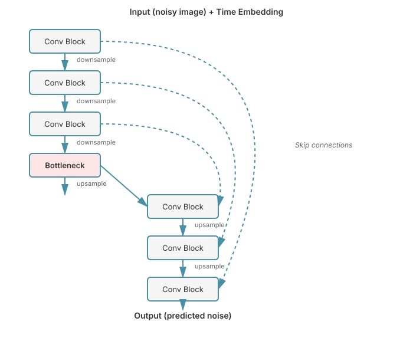
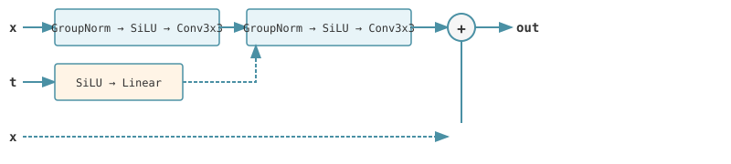

# Chapter 25: Implementing Diffusion Models

This chapter provides a comprehensive, hands-on guide to implementing diffusion models with runnable PyTorch code. We build on the theoretical foundations from [Diffusion Model Fundamentals](24-diffusion-fundamentals.md) and implement all the core components needed for a working diffusion model.

## Table of Contents

1. [Overview](#overview)
2. [U-Net Architecture for Denoising](#u-net-architecture-for-denoising)
3. [Time Embedding](#time-embedding)
4. [Noise Scheduling](#noise-scheduling)
5. [Training Loop Implementation](#training-loop-implementation)
6. [Sampling Algorithms](#sampling-algorithms)
7. [Complete Working Example](#complete-working-example)
8. [Practical Considerations](#practical-considerations)
9. [Conditional Generation](#conditional-generation)
10. [Exercises](#exercises)
11. [References](#references)

---

## Overview

Diffusion models generate data by learning to reverse a gradual noising process. The key components we'll implement are:

1. **U-Net**: The neural network that predicts noise given a noisy image and timestep
2. **Time Embedding**: How we encode the diffusion timestep for the network
3. **Noise Schedule**: How we control noise levels across diffusion steps
4. **Training**: How we train the denoising network
5. **Sampling**: How we generate new samples using the trained model

The core training objective from [Diffusion Model Fundamentals](24-diffusion-fundamentals.md) is:

$$
\mathcal{L}_{\text{simple}} = \mathbb{E}_{t, \mathbf{x}_0, \epsilon} \left[ \| \epsilon - \epsilon_\theta(\mathbf{x}_t, t) \|^2 \right]
$$

where:
- $\mathbf{x}_0$ is the original data
- $t$ is the timestep sampled uniformly from $\{1, \ldots, T\}$
- $\epsilon \sim \mathcal{N}(0, \mathbf{I})$ is random noise
- $\mathbf{x}_t$ is the noisy version at timestep $t$
- $\epsilon_\theta$ is our neural network

---

## U-Net Architecture for Denoising

The U-Net architecture is the most popular choice for diffusion models. It features:

- **Encoder-decoder structure** with skip connections
- **Downsampling** to capture coarse features
- **Upsampling** to reconstruct fine details
- **Skip connections** to preserve spatial information
- **Time conditioning** injected at multiple resolutions

### Architecture Diagram



### Basic Building Blocks

#### Problem and Motivation

The core challenge in diffusion models is building a neural network that can denoise images at different noise levels. We need a network that can:
1. Process images at the same resolution throughout (preserving spatial details)
2. Incorporate information about the current noise level (timestep)
3. Learn complex denoising patterns through multiple layers
4. Maintain stable gradients for deep architectures

#### Theoretical Justification

Residual connections solve the vanishing gradient problem in deep networks by allowing gradients to flow directly through skip connections. For diffusion models, this is critical because:
- The denoising function is complex and requires deep networks
- Without residuals, gradients vanish and the network can't learn fine-grained denoising
- The identity mapping baseline helps the network learn incremental refinements

Time conditioning is injected through additive embeddings because:
- Addition preserves spatial structure while modulating features
- It allows the network to learn time-dependent denoising strategies
- The broadcast operation applies the same time information across all spatial locations

#### Comparison to Alternatives

Alternative approaches include:
- **Plain CNNs**: Suffer from vanishing gradients and can't scale to the depth needed
- **Concatenating time**: Wastes parameters and breaks spatial structure
- **Gating mechanisms**: More complex than needed; addition works well
- **Attention-only**: Computationally expensive for high-resolution images

#### Key Insights

The ResidualBlock design is elegant because:
1. **GroupNorm** normalizes activations for stable training regardless of batch size
2. **SiLU** (Swish) activation provides smooth, non-monotonic gradients
3. **Time embedding injection** between conv layers allows the network to modulate features based on noise level
4. **Residual connection** ensures the network can always fall back to an identity mapping

```python
import torch
import torch.nn as nn
import torch.nn.functional as F
import math

class ResidualBlock(nn.Module):
    """Residual block with time embedding.

    Architecture:

    
    """
    def __init__(self, in_channels: int, out_channels: int, time_emb_dim: int):
        super().__init__()

        # First convolution path
        self.norm1 = nn.GroupNorm(32, in_channels)
        self.conv1 = nn.Conv2d(in_channels, out_channels, 3, padding=1)

        # Time embedding projection
        self.time_mlp = nn.Sequential(
            nn.SiLU(),
            nn.Linear(time_emb_dim, out_channels)
        )

        # Second convolution path
        self.norm2 = nn.GroupNorm(32, out_channels)
        self.conv2 = nn.Conv2d(out_channels, out_channels, 3, padding=1)

        # Residual connection
        if in_channels != out_channels:
            self.residual_conv = nn.Conv2d(in_channels, out_channels, 1)
        else:
            self.residual_conv = nn.Identity()

    def forward(self, x: torch.Tensor, t_emb: torch.Tensor) -> torch.Tensor:
        """
        Args:
            x: (batch, in_channels, H, W)
            t_emb: (batch, time_emb_dim)

        Returns:
            (batch, out_channels, H, W)
        """
        # First conv block
        h = self.norm1(x)
        h = F.silu(h)
        h = self.conv1(h)

        # Add time embedding (broadcast over spatial dimensions)
        time_emb = self.time_mlp(t_emb)[:, :, None, None]  # (batch, out_channels, 1, 1)
        h = h + time_emb

        # Second conv block
        h = self.norm2(h)
        h = F.silu(h)
        h = self.conv2(h)

        # Residual connection
        return h + self.residual_conv(x)


class AttentionBlock(nn.Module):
    """Self-attention block for spatial features.

    Used in the bottleneck and optionally in decoder blocks
    to capture long-range dependencies.
    """
    def __init__(self, channels: int, num_heads: int = 4):
        super().__init__()
        self.channels = channels
        self.num_heads = num_heads
        assert channels % num_heads == 0

        self.norm = nn.GroupNorm(32, channels)
        self.qkv = nn.Conv2d(channels, channels * 3, 1)
        self.proj = nn.Conv2d(channels, channels, 1)

    def forward(self, x: torch.Tensor) -> torch.Tensor:
        """
        Args:
            x: (batch, channels, H, W)

        Returns:
            (batch, channels, H, W)
        """
        B, C, H, W = x.shape

        # Normalize and compute Q, K, V
        h = self.norm(x)
        qkv = self.qkv(h)  # (B, 3*C, H, W)

        # Reshape for multi-head attention
        qkv = qkv.reshape(B, 3, self.num_heads, C // self.num_heads, H * W)
        qkv = qkv.permute(1, 0, 2, 4, 3)  # (3, B, num_heads, H*W, head_dim)
        q, k, v = qkv[0], qkv[1], qkv[2]

        # Scaled dot-product attention (see [Basic Attention](03-basic-attention.md))
        scale = (C // self.num_heads) ** -0.5
        attn = torch.softmax(q @ k.transpose(-2, -1) * scale, dim=-1)
        h = attn @ v  # (B, num_heads, H*W, head_dim)

        # Reshape back
        h = h.permute(0, 1, 3, 2).reshape(B, C, H, W)
        h = self.proj(h)

        return x + h  # Residual connection


# Note: For production use, consider Flash Attention (see [Flash Attention](12-flash-attention.md))
# which provides 2-4x speedup with lower memory usage:
#
# from torch.nn.functional import scaled_dot_product_attention
#
# def forward_with_flash_attention(self, x: torch.Tensor) -> torch.Tensor:
#     B, C, H, W = x.shape
#     h = self.norm(x)
#     qkv = self.qkv(h).reshape(B, 3, self.num_heads, C // self.num_heads, H * W)
#     qkv = qkv.permute(1, 0, 2, 4, 3)  # (3, B, num_heads, H*W, head_dim)
#     q, k, v = qkv[0], qkv[1], qkv[2]
#     h = scaled_dot_product_attention(q, k, v)  # Uses Flash Attention when available
#     h = h.permute(0, 1, 3, 2).reshape(B, C, H, W)
#     return x + self.proj(h)


class DownBlock(nn.Module):
    """Downsampling block with optional attention."""
    def __init__(
        self,
        in_channels: int,
        out_channels: int,
        time_emb_dim: int,
        num_layers: int = 2,
        downsample: bool = True,
        use_attention: bool = False
    ):
        super().__init__()

        self.resblocks = nn.ModuleList([
            ResidualBlock(
                in_channels if i == 0 else out_channels,
                out_channels,
                time_emb_dim
            )
            for i in range(num_layers)
        ])

        self.attention = AttentionBlock(out_channels) if use_attention else None

        self.downsample = nn.Conv2d(out_channels, out_channels, 3, stride=2, padding=1) \
            if downsample else None

    def forward(self, x: torch.Tensor, t_emb: torch.Tensor) -> tuple[torch.Tensor, torch.Tensor]:
        """
        Returns:
            output: Downsampled features
            skip: Features before downsampling (for skip connections)
        """
        for resblock in self.resblocks:
            x = resblock(x, t_emb)

        if self.attention is not None:
            x = self.attention(x)

        skip = x

        if self.downsample is not None:
            x = self.downsample(x)

        return x, skip


class UpBlock(nn.Module):
    """Upsampling block with skip connections."""
    def __init__(
        self,
        in_channels: int,
        out_channels: int,
        time_emb_dim: int,
        num_layers: int = 2,
        upsample: bool = True,
        use_attention: bool = False
    ):
        super().__init__()

        self.resblocks = nn.ModuleList([
            ResidualBlock(
                in_channels + out_channels if i == 0 else out_channels,  # +out_channels for skip
                out_channels,
                time_emb_dim
            )
            for i in range(num_layers)
        ])

        self.attention = AttentionBlock(out_channels) if use_attention else None

        self.upsample = nn.ConvTranspose2d(out_channels, out_channels, 4, stride=2, padding=1) \
            if upsample else None

    def forward(
        self,
        x: torch.Tensor,
        skip: torch.Tensor,
        t_emb: torch.Tensor
    ) -> torch.Tensor:
        """
        Args:
            x: Upsampled features from previous layer
            skip: Skip connection from corresponding down block
            t_emb: Time embedding
        """
        # Concatenate skip connection
        x = torch.cat([x, skip], dim=1)

        for resblock in self.resblocks:
            x = resblock(x, t_emb)

        if self.attention is not None:
            x = self.attention(x)

        if self.upsample is not None:
            x = self.upsample(x)

        return x
```

### Complete U-Net

```python
class UNet(nn.Module):
    """U-Net architecture for diffusion models.

    References:
        - [U-Net: Convolutional Networks for Biomedical Image Segmentation](https://arxiv.org/abs/1505.04597)
        - [Denoising Diffusion Probabilistic Models](https://arxiv.org/abs/2006.11239) (Ho et al., 2020)
    """
    def __init__(
        self,
        in_channels: int = 3,
        model_channels: int = 128,
        out_channels: int = 3,
        num_res_blocks: int = 2,
        channel_mult: tuple = (1, 2, 2, 4),
        attention_resolutions: tuple = (2,),  # Which levels to use attention
        dropout: float = 0.0,
        time_emb_dim: int = 512
    ):
        super().__init__()

        self.in_channels = in_channels
        self.model_channels = model_channels
        self.out_channels = out_channels
        self.num_res_blocks = num_res_blocks

        # Time embedding (see next section for details)
        self.time_mlp = nn.Sequential(
            SinusoidalPositionEmbedding(model_channels),
            nn.Linear(model_channels, time_emb_dim),
            nn.SiLU(),
            nn.Linear(time_emb_dim, time_emb_dim)
        )

        # Initial convolution
        self.conv_in = nn.Conv2d(in_channels, model_channels, 3, padding=1)

        # Downsample blocks
        self.down_blocks = nn.ModuleList()
        channels = [model_channels]
        now_channels = model_channels

        for level, mult in enumerate(channel_mult):
            out_ch = model_channels * mult
            for _ in range(num_res_blocks):
                self.down_blocks.append(DownBlock(
                    now_channels,
                    out_ch,
                    time_emb_dim,
                    downsample=False,
                    use_attention=(level in attention_resolutions)
                ))
                now_channels = out_ch
                channels.append(now_channels)

            # Downsample at end of level (except last)
            if level != len(channel_mult) - 1:
                self.down_blocks.append(DownBlock(
                    now_channels,
                    now_channels,
                    time_emb_dim,
                    downsample=True,
                    use_attention=False
                ))
                channels.append(now_channels)

        # Bottleneck
        self.mid_block1 = ResidualBlock(now_channels, now_channels, time_emb_dim)
        self.mid_attn = AttentionBlock(now_channels)
        self.mid_block2 = ResidualBlock(now_channels, now_channels, time_emb_dim)

        # Upsample blocks
        self.up_blocks = nn.ModuleList()

        for level, mult in reversed(list(enumerate(channel_mult))):
            out_ch = model_channels * mult
            for i in range(num_res_blocks + 1):
                self.up_blocks.append(UpBlock(
                    now_channels,
                    out_ch,
                    time_emb_dim,
                    upsample=(i == num_res_blocks and level != 0),
                    use_attention=(level in attention_resolutions)
                ))
                now_channels = out_ch

        # Final output
        self.norm_out = nn.GroupNorm(32, now_channels)
        self.conv_out = nn.Conv2d(now_channels, out_channels, 3, padding=1)

    def forward(self, x: torch.Tensor, t: torch.Tensor) -> torch.Tensor:
        """
        Args:
            x: (batch, in_channels, H, W) - noisy images
            t: (batch,) - timesteps

        Returns:
            (batch, out_channels, H, W) - predicted noise
        """
        # Time embedding
        t_emb = self.time_mlp(t)

        # Initial convolution
        x = self.conv_in(x)

        # Downsample
        skips = []
        for block in self.down_blocks:
            x, skip = block(x, t_emb)
            skips.append(skip)

        # Bottleneck
        x = self.mid_block1(x, t_emb)
        x = self.mid_attn(x)
        x = self.mid_block2(x, t_emb)

        # Upsample
        for block in self.up_blocks:
            skip = skips.pop()
            x = block(x, skip, t_emb)

        # Final output
        x = self.norm_out(x)
        x = F.silu(x)
        x = self.conv_out(x)

        return x
```

---

## Time Embedding

The diffusion timestep $t$ must be encoded so the network knows how much noise is present. We use sinusoidal position embeddings (similar to [Positional Encodings](07-positional-encodings.md)) because they:

1. **Generalize** to unseen timesteps
2. **Capture** periodic patterns in the denoising process
3. **Are continuous** which helps with interpolation

### Sinusoidal Time Embedding

```python
class SinusoidalPositionEmbedding(nn.Module):
    """Sinusoidal position embeddings for time conditioning.

    Similar to positional encodings in Transformers (see [Positional Encodings](07-positional-encodings.md)),
    but for scalar timesteps instead of sequence positions.

    For timestep t:
        emb[2i] = sin(t / 10000^(2i/dim))
        emb[2i+1] = cos(t / 10000^(2i/dim))

    Reference:
        [Denoising Diffusion Probabilistic Models](https://arxiv.org/abs/2006.11239) (Ho et al., 2020)
    """
    def __init__(self, dim: int):
        super().__init__()
        self.dim = dim

    def forward(self, t: torch.Tensor) -> torch.Tensor:
        """
        Args:
            t: (batch,) - integer timesteps

        Returns:
            (batch, dim) - sinusoidal embeddings
        """
        device = t.device
        half_dim = self.dim // 2

        # Compute frequencies: 1, 1/10000^(2/dim), 1/10000^(4/dim), ...
        emb = math.log(10000) / (half_dim - 1)
        emb = torch.exp(torch.arange(half_dim, device=device) * -emb)

        # Compute sinusoidal embeddings
        emb = t[:, None] * emb[None, :]  # (batch, half_dim)
        emb = torch.cat([torch.sin(emb), torch.cos(emb)], dim=-1)  # (batch, dim)

        return emb


# Alternative: Learned time embeddings
class LearnedTimeEmbedding(nn.Module):
    """Learned lookup table for time embeddings.

    Simpler but doesn't generalize to unseen timesteps.
    Useful for fixed, small number of timesteps.
    """
    def __init__(self, num_timesteps: int, dim: int):
        super().__init__()
        self.embedding = nn.Embedding(num_timesteps, dim)

    def forward(self, t: torch.Tensor) -> torch.Tensor:
        return self.embedding(t)
```

### Why Sinusoidal Works

The sinusoidal encoding creates smooth, continuous representations where:
- Nearby timesteps have similar embeddings
- The network can interpolate between timesteps
- No learned parameters are needed

Mathematically, for timestep $t$ and embedding dimension $i$:

$$
\text{emb}_{t, 2i} = \sin\left(\frac{t}{10000^{2i/d}}\right)
$$

$$
\text{emb}_{t, 2i+1} = \cos\left(\frac{t}{10000^{2i/d}}\right)
$$

This creates a unique encoding for each timestep that the network learns to interpret.

---

## Noise Scheduling

The noise schedule $\{\beta_t\}_{t=1}^T$ controls how quickly noise is added during the forward process. This is one of the most important design choices in diffusion models.

### Key Concepts

From [Diffusion Model Fundamentals](24-diffusion-fundamentals.md), recall:
- $\alpha_t = 1 - \beta_t$ (how much signal to keep)
- $\bar{\alpha}_t = \prod_{s=1}^t \alpha_s$ (cumulative signal retention)
- We can sample $\mathbf{x}_t$ directly: $\mathbf{x}_t = \sqrt{\bar{\alpha}_t} \mathbf{x}_0 + \sqrt{1 - \bar{\alpha}_t} \epsilon$

### Linear Schedule

The original DDPM paper used a linear schedule:

$$
\beta_t = \beta_{\min} + \frac{t-1}{T-1}(\beta_{\max} - \beta_{\min})
$$

```python
def linear_beta_schedule(timesteps: int, beta_start: float = 0.0001, beta_end: float = 0.02):
    """Linear noise schedule from DDPM.

    Reference:
        [Denoising Diffusion Probabilistic Models](https://arxiv.org/abs/2006.11239) (Ho et al., 2020)

    Args:
        timesteps: Number of diffusion steps
        beta_start: Starting noise level
        beta_end: Ending noise level

    Returns:
        betas: (timesteps,) noise levels
    """
    return torch.linspace(beta_start, beta_end, timesteps)
```

### Cosine Schedule

The cosine schedule from [Improved Denoising Diffusion Probabilistic Models](https://arxiv.org/abs/2102.09672) (Nichol & Dhariwal, 2021) provides better results by:
- Adding noise more gradually at the start
- Preventing too much noise at the end
- Maintaining more signal throughout

$$
\bar{\alpha}_t = \frac{f(t)}{f(0)}, \quad f(t) = \cos\left(\frac{t/T + s}{1 + s} \cdot \frac{\pi}{2}\right)^2
$$

Then $\beta_t = 1 - \frac{\bar{\alpha}_t}{\bar{\alpha}_{t-1}}$

```python
def cosine_beta_schedule(timesteps: int, s: float = 0.008):
    """Cosine noise schedule from Improved DDPM.

    Benefits over linear:
    - Smoother noise addition
    - Better preservation of structure early
    - Improved sample quality

    Reference:
        [Improved Denoising Diffusion Probabilistic Models](https://arxiv.org/abs/2102.09672)
        (Nichol & Dhariwal, 2021)

    Args:
        timesteps: Number of diffusion steps
        s: Small offset to prevent beta_t = 0 at t=0

    Returns:
        betas: (timesteps,) noise levels
    """
    steps = timesteps + 1
    t = torch.linspace(0, timesteps, steps)

    # Compute alpha_bar using cosine schedule
    alphas_cumprod = torch.cos(((t / timesteps) + s) / (1 + s) * math.pi * 0.5) ** 2
    alphas_cumprod = alphas_cumprod / alphas_cumprod[0]

    # Compute betas from alpha_bar
    betas = 1 - (alphas_cumprod[1:] / alphas_cumprod[:-1])

    # Clip to prevent instabilities
    return torch.clip(betas, 0.0001, 0.9999)


def quadratic_beta_schedule(timesteps: int, beta_start: float = 0.0001, beta_end: float = 0.02):
    """Quadratic schedule - middle ground between linear and cosine."""
    return torch.linspace(beta_start**0.5, beta_end**0.5, timesteps) ** 2


def sigmoid_beta_schedule(timesteps: int, beta_start: float = 0.0001, beta_end: float = 0.02):
    """Sigmoid schedule - smooth transition."""
    betas = torch.linspace(-6, 6, timesteps)
    return torch.sigmoid(betas) * (beta_end - beta_start) + beta_start
```

### Noise Schedule Helper Class

#### Problem and Motivation

Computing noise schedule values on-the-fly during training would be inefficient and error-prone. We need:
1. Fast access to schedule-dependent constants during training
2. Consistent noise application across forward and reverse processes
3. Efficient memory usage by precomputing derived quantities
4. Support for multiple noise schedules without code duplication

#### Theoretical Justification

The forward diffusion process requires several derived quantities from the base noise schedule $\{\beta_t\}$:

- $\alpha_t = 1 - \beta_t$ controls signal retention at each step
- $\bar{\alpha}_t = \prod_{s=1}^t \alpha_s$ enables direct sampling at any timestep without iterating
- The posterior variance $\tilde{\beta}_t = \frac{\beta_t(1-\bar{\alpha}_{t-1})}{1-\bar{\alpha}_t}$ is needed for sampling

Precomputing these allows us to use the closed-form sampling equation:
$$\mathbf{x}_t = \sqrt{\bar{\alpha}_t}\mathbf{x}_0 + \sqrt{1-\bar{\alpha}_t}\epsilon$$

This O(1) sampling replaces O(t) iterative forward diffusion, making training practical.

#### Comparison to Alternatives

Alternative approaches:
- **On-the-fly computation**: Too slow, recomputes values millions of times during training
- **Separate schedule classes**: Code duplication, harder to maintain
- **Dictionary-based storage**: Slower indexing, no type safety
- **Lazy computation**: Adds complexity without benefits since we need all values

#### Key Insights

The NoiseSchedule class is efficient because:
1. **Precomputation**: All constants computed once in `__init__`
2. **Vectorization**: Batch indexing with `[t]` enables efficient GPU operations
3. **Unified interface**: All schedules expose the same methods
4. **Memory locality**: Related values stored together for cache efficiency

```python
class NoiseSchedule:
    """Manages noise scheduling and precomputes constants.

    Precomputes all schedule-dependent values for efficiency.
    """
    def __init__(
        self,
        timesteps: int = 1000,
        schedule: str = "cosine",
        beta_start: float = 0.0001,
        beta_end: float = 0.02
    ):
        self.timesteps = timesteps

        # Get beta schedule
        if schedule == "linear":
            betas = linear_beta_schedule(timesteps, beta_start, beta_end)
        elif schedule == "cosine":
            betas = cosine_beta_schedule(timesteps)
        elif schedule == "quadratic":
            betas = quadratic_beta_schedule(timesteps, beta_start, beta_end)
        elif schedule == "sigmoid":
            betas = sigmoid_beta_schedule(timesteps, beta_start, beta_end)
        else:
            raise ValueError(f"Unknown schedule: {schedule}")

        # Precompute constants
        self.betas = betas
        self.alphas = 1.0 - betas
        self.alphas_cumprod = torch.cumprod(self.alphas, dim=0)
        self.alphas_cumprod_prev = F.pad(self.alphas_cumprod[:-1], (1, 0), value=1.0)

        # For q(x_t | x_0)
        self.sqrt_alphas_cumprod = torch.sqrt(self.alphas_cumprod)
        self.sqrt_one_minus_alphas_cumprod = torch.sqrt(1.0 - self.alphas_cumprod)

        # For q(x_{t-1} | x_t, x_0) - used in DDPM sampling
        self.posterior_variance = (
            betas * (1.0 - self.alphas_cumprod_prev) / (1.0 - self.alphas_cumprod)
        )
        self.posterior_log_variance_clipped = torch.log(
            torch.clamp(self.posterior_variance, min=1e-20)
        )
        self.posterior_mean_coef1 = (
            betas * torch.sqrt(self.alphas_cumprod_prev) / (1.0 - self.alphas_cumprod)
        )
        self.posterior_mean_coef2 = (
            (1.0 - self.alphas_cumprod_prev) * torch.sqrt(self.alphas) / (1.0 - self.alphas_cumprod)
        )

    def q_sample(self, x_0: torch.Tensor, t: torch.Tensor, noise: torch.Tensor = None):
        """Sample from q(x_t | x_0) - forward diffusion.

        x_t = sqrt(alpha_bar_t) * x_0 + sqrt(1 - alpha_bar_t) * epsilon

        Args:
            x_0: (batch, C, H, W) - original images
            t: (batch,) - timesteps
            noise: Optional pre-sampled noise

        Returns:
            Noisy images at timestep t
        """
        if noise is None:
            noise = torch.randn_like(x_0)

        # Extract schedule values for timestep t
        sqrt_alpha_bar = self.sqrt_alphas_cumprod[t][:, None, None, None]
        sqrt_one_minus_alpha_bar = self.sqrt_one_minus_alphas_cumprod[t][:, None, None, None]

        return sqrt_alpha_bar * x_0 + sqrt_one_minus_alpha_bar * noise

    def to(self, device):
        """Move all tensors to device."""
        self.betas = self.betas.to(device)
        self.alphas = self.alphas.to(device)
        self.alphas_cumprod = self.alphas_cumprod.to(device)
        self.alphas_cumprod_prev = self.alphas_cumprod_prev.to(device)
        self.sqrt_alphas_cumprod = self.sqrt_alphas_cumprod.to(device)
        self.sqrt_one_minus_alphas_cumprod = self.sqrt_one_minus_alphas_cumprod.to(device)
        self.posterior_variance = self.posterior_variance.to(device)
        self.posterior_log_variance_clipped = self.posterior_log_variance_clipped.to(device)
        self.posterior_mean_coef1 = self.posterior_mean_coef1.to(device)
        self.posterior_mean_coef2 = self.posterior_mean_coef2.to(device)
        return self
```

### Visualizing Schedules

#### Problem and Motivation

Choosing the right noise schedule is critical but non-intuitive. Without visualization, we can't:
1. Understand how different schedules add noise over time
2. Compare signal retention ($\bar{\alpha}_t$) across methods
3. Debug training issues related to too much/too little noise
4. Make informed decisions about which schedule fits our data

Visual comparison reveals subtle differences that impact sample quality.

#### Theoretical Justification

The noise schedule determines the forward process dynamics. Key quantities to visualize:
- $\beta_t$: Instantaneous noise addition rate at step $t$
- $\bar{\alpha}_t$: Cumulative signal retention from $\mathbf{x}_0$ to $\mathbf{x}_t$

The relationship $\bar{\alpha}_t = \prod_{s=1}^t (1-\beta_s)$ shows how small differences in $\beta_t$ compound over timesteps. For instance:
- Linear schedule: $\bar{\alpha}_t$ decreases linearly, may destroy signal too quickly
- Cosine schedule: $\bar{\alpha}_t$ decreases slowly at first, preserves structure longer

#### Comparison to Alternatives

Other schedule selection methods:
- **Trial and error**: Expensive, requires full training runs
- **Literature values**: May not transfer to your data distribution
- **Theoretical analysis**: Complex, requires deep mathematical knowledge
- **Visualization**: Quick, intuitive, guides hyperparameter search

#### Key Insights

Visualization reveals:
1. **Cosine preserves more signal early**: $\bar{\alpha}_t$ stays high longer, better for images
2. **Linear is aggressive**: Signal drops faster, can work for simple data
3. **Sigmoid is smooth**: Continuous derivatives, can help training stability
4. **Final $\bar{\alpha}_T$**: Should be close to 0 but not exactly 0 (avoid numerical issues)

```python
import matplotlib.pyplot as plt

def plot_noise_schedules():
    """Visualize different noise schedules."""
    timesteps = 1000

    schedules = {
        'Linear': linear_beta_schedule(timesteps),
        'Cosine': cosine_beta_schedule(timesteps),
        'Quadratic': quadratic_beta_schedule(timesteps),
        'Sigmoid': sigmoid_beta_schedule(timesteps)
    }

    fig, axes = plt.subplots(2, 2, figsize=(12, 10))

    for ax, (name, betas) in zip(axes.flat, schedules.items()):
        alphas_cumprod = torch.cumprod(1 - betas, dim=0)

        ax.plot(betas.numpy(), label=r'$\beta_t$', alpha=0.7)
        ax.plot(alphas_cumprod.numpy(), label=r'$\bar{\alpha}_t$', alpha=0.7)
        ax.set_title(f'{name} Schedule')
        ax.set_xlabel('Timestep')
        ax.legend()
        ax.grid(True, alpha=0.3)

    plt.tight_layout()
    plt.savefig('noise_schedules.png', dpi=150)
    plt.close()
```

---

## Training Loop Implementation

The training procedure is remarkably simple:

1. Sample a batch of real images $\mathbf{x}_0$
2. Sample random timesteps $t$
3. Sample noise $\epsilon$
4. Create noisy images $\mathbf{x}_t$
5. Predict the noise with our model
6. Compute MSE loss

```python
class DiffusionModel(nn.Module):
    """Complete diffusion model with training and sampling."""
    def __init__(
        self,
        unet: UNet,
        timesteps: int = 1000,
        schedule: str = "cosine"
    ):
        super().__init__()
        self.unet = unet
        self.noise_schedule = NoiseSchedule(timesteps, schedule)
        self.timesteps = timesteps

    def forward(self, x_0: torch.Tensor) -> torch.Tensor:
        """Training forward pass.

        Args:
            x_0: (batch, C, H, W) - real images

        Returns:
            loss: Scalar MSE loss
        """
        batch_size = x_0.shape[0]
        device = x_0.device

        # Sample random timesteps for each image in batch
        t = torch.randint(0, self.timesteps, (batch_size,), device=device).long()

        # Sample noise
        noise = torch.randn_like(x_0)

        # Create noisy images
        x_t = self.noise_schedule.q_sample(x_0, t, noise)

        # Predict noise
        predicted_noise = self.unet(x_t, t)

        # Compute loss
        loss = F.mse_loss(predicted_noise, noise)

        return loss


def train_diffusion_model(
    model: DiffusionModel,
    dataloader,
    num_epochs: int = 100,
    learning_rate: float = 2e-4,
    device: str = "cuda"
):
    """Training loop for diffusion model.

    Args:
        model: DiffusionModel instance
        dataloader: PyTorch DataLoader
        num_epochs: Number of training epochs
        learning_rate: Learning rate for AdamW
        device: Device to train on
    """
    model = model.to(device)
    model.noise_schedule.to(device)
    optimizer = torch.optim.AdamW(model.parameters(), lr=learning_rate)

    # Cosine learning rate schedule with warmup
    # See [Optimizers and Training Techniques](17-scaling-optimization.md)
    from torch.optim.lr_scheduler import CosineAnnealingLR
    scheduler = CosineAnnealingLR(optimizer, T_max=num_epochs)

    for epoch in range(num_epochs):
        model.train()
        total_loss = 0

        for batch_idx, (images, _) in enumerate(dataloader):
            images = images.to(device)

            # Forward pass
            loss = model(images)

            # Backward pass
            optimizer.zero_grad()
            loss.backward()

            # Gradient clipping for stability
            torch.nn.utils.clip_grad_norm_(model.parameters(), 1.0)

            optimizer.step()

            total_loss += loss.item()

            if batch_idx % 100 == 0:
                print(f"Epoch [{epoch}/{num_epochs}] Batch [{batch_idx}/{len(dataloader)}] "
                      f"Loss: {loss.item():.4f}")

        scheduler.step()
        avg_loss = total_loss / len(dataloader)
        print(f"Epoch [{epoch}/{num_epochs}] Average Loss: {avg_loss:.4f}")

        # Generate samples periodically
        if (epoch + 1) % 10 == 0:
            model.eval()
            with torch.no_grad():
                samples = sample_ddpm(model, num_samples=16, device=device)
                save_image_grid(samples, f"samples_epoch_{epoch}.png")
```

### Training Tips

1. **Batch Size**: Use the largest batch size that fits in memory (typically 128-256)
2. **Learning Rate**: Start with 2e-4, reduce if training is unstable
3. **Gradient Clipping**: Essential for stability, clip to norm of 1.0
4. **EMA**: Use exponential moving average of weights for better samples
5. **Mixed Precision**: Use torch.cuda.amp for faster training

#### EMA: Problem and Motivation

Neural network weights during training fluctuate due to stochastic gradient descent, but we want stable, high-quality samples. The problem is:
1. Training weights are optimized for low loss, not necessarily best samples
2. Recent weight updates may be noisy or suboptimal
3. We need a stable version of the model for evaluation
4. Checkpointing only captures snapshots, not a smoothed trajectory

#### Theoretical Justification

Exponential Moving Average (EMA) computes a weighted average of past model parameters:
$$\theta_{\text{EMA},t} = \beta \cdot \theta_{\text{EMA},t-1} + (1-\beta) \cdot \theta_t$$

With decay $\beta \approx 0.9999$, the EMA weights represent roughly the average of the last 10,000 training steps. This smoothing:
- Reduces variance from stochastic gradients
- Captures the trajectory rather than individual points
- Provides implicit regularization by averaging away spurious updates

Theoretically, this is related to Polyak averaging from convex optimization, adapted for non-convex deep learning.

#### Comparison to Alternatives

Alternative stabilization methods:
- **Checkpointing best loss**: Only captures one snapshot, misses overall trajectory
- **Weight averaging**: Simple mean loses recent information; EMA weighs recent steps more
- **Snapshot ensembling**: Requires storing multiple models, expensive
- **No averaging**: Training weights are too noisy for high-quality generation

#### Key Insights

EMA works exceptionally well for diffusion models because:
1. **Denoising is sensitive**: Small parameter changes significantly affect sample quality
2. **Decay rate matters**: 0.9999 balances stability (high decay) and adaptability (low decay)
3. **Negligible cost**: Only adds a parameter copy and lightweight update per step
4. **Universal improvement**: Almost always improves FID and visual quality by 10-20%

```python
class EMA:
    """Exponential Moving Average of model parameters.

    Maintains a shadow copy of model weights that are more stable.
    Use EMA weights for sampling, not training weights.
    """
    def __init__(self, model, decay: float = 0.9999):
        self.model = model
        self.decay = decay
        self.shadow = {}
        self.backup = {}

        for name, param in model.named_parameters():
            if param.requires_grad:
                self.shadow[name] = param.data.clone()

    def update(self):
        """Update EMA parameters."""
        for name, param in self.model.named_parameters():
            if param.requires_grad:
                self.shadow[name] -= (1 - self.decay) * (self.shadow[name] - param.data)

    def apply_shadow(self):
        """Replace model parameters with EMA values."""
        for name, param in self.model.named_parameters():
            if param.requires_grad:
                self.backup[name] = param.data.clone()
                param.data.copy_(self.shadow[name])

    def restore(self):
        """Restore original model parameters."""
        for name, param in self.model.named_parameters():
            if param.requires_grad:
                param.data.copy_(self.backup[name])
```

---

## Sampling Algorithms

Once trained, we generate samples by reversing the diffusion process. Two main algorithms:

1. **DDPM**: Stochastic sampling (high quality, slow)
2. **DDIM**: Deterministic sampling (faster, similar quality)

### DDPM Sampling

DDPM uses the full reverse process with learned variance:

$$
\mathbf{x}_{t-1} = \frac{1}{\sqrt{\alpha_t}} \left( \mathbf{x}_t - \frac{\beta_t}{\sqrt{1-\bar{\alpha}_t}} \epsilon_\theta(\mathbf{x}_t, t) \right) + \sigma_t \mathbf{z}
$$

where $\mathbf{z} \sim \mathcal{N}(0, \mathbf{I})$ and $\sigma_t = \sqrt{\beta_t}$ or $\sqrt{\tilde{\beta}_t}$

```python
@torch.no_grad()
def sample_ddpm(
    model: DiffusionModel,
    num_samples: int = 16,
    image_size: int = 32,
    channels: int = 3,
    device: str = "cuda"
) -> torch.Tensor:
    """Generate samples using DDPM sampling.

    Reference:
        [Denoising Diffusion Probabilistic Models](https://arxiv.org/abs/2006.11239)
        (Ho et al., 2020)

    Args:
        model: Trained diffusion model
        num_samples: Number of images to generate
        image_size: Size of generated images
        channels: Number of channels
        device: Device to sample on

    Returns:
        (num_samples, channels, image_size, image_size) generated images
    """
    model.eval()

    # Start from pure noise
    x = torch.randn(num_samples, channels, image_size, image_size, device=device)

    # Reverse diffusion process
    for t in reversed(range(model.timesteps)):
        # Create batch of timesteps
        t_batch = torch.full((num_samples,), t, device=device, dtype=torch.long)

        # Predict noise
        predicted_noise = model.unet(x, t_batch)

        # Extract schedule values
        alpha = model.noise_schedule.alphas[t]
        alpha_bar = model.noise_schedule.alphas_cumprod[t]
        beta = model.noise_schedule.betas[t]

        # Compute mean of q(x_{t-1} | x_t, x_0)
        # x_{t-1} = (1/sqrt(alpha_t)) * (x_t - (beta_t / sqrt(1-alpha_bar_t)) * epsilon)
        x = (1 / torch.sqrt(alpha)) * (
            x - ((beta) / torch.sqrt(1 - alpha_bar)) * predicted_noise
        )

        # Add noise (except at final step t=0)
        if t > 0:
            noise = torch.randn_like(x)
            # sigma_t = sqrt(beta_t)
            sigma = torch.sqrt(beta)
            x += sigma * noise

    return x


@torch.no_grad()
def sample_ddpm_with_variance(
    model: DiffusionModel,
    num_samples: int = 16,
    image_size: int = 32,
    channels: int = 3,
    device: str = "cuda"
) -> torch.Tensor:
    """DDPM sampling with learned/fixed posterior variance.

    Uses the posterior variance from the forward process:
    tilde_beta_t = (1 - alpha_bar_{t-1}) / (1 - alpha_bar_t) * beta_t

    When to use this version vs simple sample_ddpm():

    Use sample_ddpm_with_variance when:
    - You need better sample quality at the cost of slightly more computation
    - You've trained with learned variance prediction
    - You want to use the theoretically correct posterior variance
    - You're working on high-fidelity generation tasks

    Use simple sample_ddpm when:
    - You want faster sampling with minimal quality difference
    - Fixed variance (sqrt(beta_t)) works well enough for your use case
    - You're prototyping or need quick iterations
    - Memory or compute is constrained

    The difference is in how variance is computed for the noise added at each step.
    This version uses the posterior variance from the forward process, which is
    theoretically more accurate but requires additional computation.
    """
    model.eval()
    x = torch.randn(num_samples, channels, image_size, image_size, device=device)

    for t in reversed(range(model.timesteps)):
        t_batch = torch.full((num_samples,), t, device=device, dtype=torch.long)

        # Predict noise
        predicted_noise = model.unet(x, t_batch)

        # Get precomputed coefficients
        posterior_mean_coef1 = model.noise_schedule.posterior_mean_coef1[t]
        posterior_mean_coef2 = model.noise_schedule.posterior_mean_coef2[t]
        posterior_variance = model.noise_schedule.posterior_variance[t]

        # Predict x_0 from x_t and predicted noise
        sqrt_recip_alpha_bar = 1 / model.noise_schedule.sqrt_alphas_cumprod[t]
        sqrt_one_minus_alpha_bar = model.noise_schedule.sqrt_one_minus_alphas_cumprod[t]
        pred_x_0 = sqrt_recip_alpha_bar * x - sqrt_one_minus_alpha_bar * predicted_noise

        # Clamp x_0 to valid range
        pred_x_0 = torch.clamp(pred_x_0, -1, 1)

        # Compute posterior mean
        mean = posterior_mean_coef1 * pred_x_0 + posterior_mean_coef2 * x

        # Add noise
        if t > 0:
            noise = torch.randn_like(x)
            x = mean + torch.sqrt(posterior_variance) * noise
        else:
            x = mean

    return x
```

### DDIM Sampling

DDIM (Denoising Diffusion Implicit Models) enables:
- **Deterministic** sampling (reproducible results)
- **Faster** sampling (skip timesteps)
- **Interpolation** in latent space

The key insight is replacing the stochastic reverse process with a deterministic one:

$$
\mathbf{x}_{t-1} = \sqrt{\bar{\alpha}_{t-1}} \underbrace{\left(\frac{\mathbf{x}_t - \sqrt{1-\bar{\alpha}_t}\epsilon_\theta(\mathbf{x}_t, t)}{\sqrt{\bar{\alpha}_t}}\right)}_{\text{predicted } \mathbf{x}_0} + \sqrt{1-\bar{\alpha}_{t-1} - \sigma_t^2} \cdot \epsilon_\theta(\mathbf{x}_t, t) + \sigma_t \epsilon_t
$$

When $\sigma_t = 0$, this is fully deterministic.

```python
@torch.no_grad()
def sample_ddim(
    model: DiffusionModel,
    num_samples: int = 16,
    image_size: int = 32,
    channels: int = 3,
    ddim_steps: int = 50,
    eta: float = 0.0,  # 0 = deterministic, 1 = stochastic like DDPM
    device: str = "cuda"
) -> torch.Tensor:
    """Generate samples using DDIM sampling.

    DDIM allows:
    - Deterministic sampling (eta=0)
    - Faster sampling by skipping timesteps
    - Meaningful latent space interpolation

    Reference:
        [Denoising Diffusion Implicit Models](https://arxiv.org/abs/2010.02502)
        (Song et al., 2020)

    Args:
        model: Trained diffusion model
        num_samples: Number of images to generate
        image_size: Size of generated images
        channels: Number of channels
        ddim_steps: Number of sampling steps (< model.timesteps for speedup)
        eta: Stochasticity parameter (0=deterministic, 1=stochastic)
        device: Device to sample on

    Returns:
        Generated images
    """
    model.eval()

    # Create subsequence of timesteps
    # E.g., if timesteps=1000 and ddim_steps=50, use [0, 20, 40, ..., 980]
    skip = model.timesteps // ddim_steps
    timesteps = list(range(0, model.timesteps, skip))
    timesteps = list(reversed(timesteps))

    # Start from noise
    x = torch.randn(num_samples, channels, image_size, image_size, device=device)

    for i, t in enumerate(timesteps):
        t_batch = torch.full((num_samples,), t, device=device, dtype=torch.long)

        # Predict noise
        predicted_noise = model.unet(x, t_batch)

        # Get alpha values
        alpha_bar_t = model.noise_schedule.alphas_cumprod[t]

        # Get alpha for previous timestep
        if i < len(timesteps) - 1:
            t_prev = timesteps[i + 1]
            alpha_bar_t_prev = model.noise_schedule.alphas_cumprod[t_prev]
        else:
            alpha_bar_t_prev = torch.tensor(1.0, device=device)

        # Predict x_0
        pred_x_0 = (x - torch.sqrt(1 - alpha_bar_t) * predicted_noise) / torch.sqrt(alpha_bar_t)
        pred_x_0 = torch.clamp(pred_x_0, -1, 1)

        # Compute variance
        sigma_t = eta * torch.sqrt(
            (1 - alpha_bar_t_prev) / (1 - alpha_bar_t) * (1 - alpha_bar_t / alpha_bar_t_prev)
        )

        # Compute direction pointing to x_t
        dir_xt = torch.sqrt(1 - alpha_bar_t_prev - sigma_t**2) * predicted_noise

        # Compute x_{t-1}
        x = torch.sqrt(alpha_bar_t_prev) * pred_x_0 + dir_xt

        # Add noise
        if sigma_t > 0 and i < len(timesteps) - 1:
            noise = torch.randn_like(x)
            x += sigma_t * noise

    return x
```

### Comparison: DDPM vs DDIM

| Property | DDPM | DDIM |
|----------|------|------|
| **Sampling** | Stochastic | Deterministic (eta=0) |
| **Speed** | Slow (needs all T steps) | Fast (can skip steps) |
| **Quality** | High | Similar |
| **Interpolation** | Not meaningful | Meaningful |
| **Use Case** | Best quality | Production, fast sampling |

---

## Complete Working Example

#### Problem and Motivation

After presenting individual components (U-Net, noise schedule, training, sampling), readers need:
1. A concrete, runnable example tying everything together
2. Proof that the components actually work end-to-end
3. A starting point they can modify for their own projects
4. Realistic hyperparameters and training procedures

MNIST provides an ideal testbed: small, fast, well-understood, visually interpretable.

#### Theoretical Justification

This example demonstrates the complete diffusion training pipeline:
1. **Data preparation**: Normalize to $[-1, 1]$ so the model learns a zero-mean distribution
2. **Model instantiation**: Smaller U-Net for 28×28 images (fewer parameters than needed for high-res)
3. **Training loop**: Implements the simplified loss $\mathcal{L} = \mathbb{E}[\|\epsilon - \epsilon_\theta(\mathbf{x}_t, t)\|^2]$
4. **EMA tracking**: Maintains stable weights for evaluation
5. **Sampling**: Demonstrates both DDPM and DDIM for comparison

The complete pipeline validates that theory translates to practice.

#### Comparison to Alternatives

Example dataset choices:
- **Random noise**: Can't verify quality, no ground truth
- **Simple synthetic**: (circles, gaussians) Too simple, doesn't test real capabilities
- **CIFAR-10**: Larger, slower, harder to debug
- **ImageNet**: Way too large for an example
- **MNIST**: Perfect balance - fast, interpretable, sufficient complexity

#### Key Insights

This example shows:
1. **Simplicity**: Only ~100 lines of training code for a working diffusion model
2. **MNIST-specific sizing**: Channel mult (1,2,4) and smaller model_channels (64) fit the task
3. **Normalization matters**: [-1,1] range matches the model's output range
4. **EMA is essential**: Compare samples with/without EMA to see quality difference
5. **Sampling speed**: DDIM with 50 steps is 20× faster than DDPM with 1000 steps

Let's put it all together with a minimal example on MNIST:

```python
import torch
import torch.nn as nn
import torchvision
import torchvision.transforms as transforms
from torch.utils.data import DataLoader

# Smaller U-Net for MNIST (28x28 grayscale)
def create_mnist_unet():
    """Create a smaller U-Net suitable for MNIST."""
    return UNet(
        in_channels=1,
        model_channels=64,
        out_channels=1,
        num_res_blocks=2,
        channel_mult=(1, 2, 4),
        attention_resolutions=(1,),
        time_emb_dim=256
    )

# Training on MNIST
def train_mnist_diffusion():
    """Complete training example on MNIST."""

    # Setup
    device = "cuda" if torch.cuda.is_available() else "cpu"
    batch_size = 128
    num_epochs = 50

    # Data
    transform = transforms.Compose([
        transforms.ToTensor(),
        transforms.Normalize((0.5,), (0.5,))  # Normalize to [-1, 1]
    ])

    dataset = torchvision.datasets.MNIST(
        root='./data',
        train=True,
        download=True,
        transform=transform
    )

    dataloader = DataLoader(
        dataset,
        batch_size=batch_size,
        shuffle=True,
        num_workers=4
    )

    # Model
    unet = create_mnist_unet()
    model = DiffusionModel(unet, timesteps=1000, schedule="cosine")
    model = model.to(device)
    model.noise_schedule.to(device)

    # EMA
    ema = EMA(model, decay=0.9999)

    # Optimizer
    optimizer = torch.optim.AdamW(model.parameters(), lr=2e-4)

    # Training loop
    for epoch in range(num_epochs):
        model.train()
        total_loss = 0

        for batch_idx, (images, _) in enumerate(dataloader):
            images = images.to(device)

            # Forward
            loss = model(images)

            # Backward
            optimizer.zero_grad()
            loss.backward()
            torch.nn.utils.clip_grad_norm_(model.parameters(), 1.0)
            optimizer.step()

            # Update EMA
            ema.update()

            total_loss += loss.item()

        avg_loss = total_loss / len(dataloader)
        print(f"Epoch {epoch}: Loss = {avg_loss:.4f}")

        # Generate samples with EMA model
        if (epoch + 1) % 5 == 0:
            ema.apply_shadow()
            model.eval()

            with torch.no_grad():
                # DDPM sampling
                samples_ddpm = sample_ddpm(
                    model,
                    num_samples=64,
                    image_size=28,
                    channels=1,
                    device=device
                )

                # DDIM sampling (faster)
                samples_ddim = sample_ddim(
                    model,
                    num_samples=64,
                    image_size=28,
                    channels=1,
                    ddim_steps=50,
                    device=device
                )

            # Save samples
            save_image_grid(samples_ddpm, f"ddpm_epoch_{epoch}.png", nrow=8)
            save_image_grid(samples_ddim, f"ddim_epoch_{epoch}.png", nrow=8)

            ema.restore()

    return model


def save_image_grid(images, filename, nrow=8):
    """Save a grid of images."""
    from torchvision.utils import save_image

    # Denormalize from [-1, 1] to [0, 1]
    images = (images + 1) / 2
    images = torch.clamp(images, 0, 1)

    save_image(images, filename, nrow=nrow)


# Run training
if __name__ == "__main__":
    model = train_mnist_diffusion()
```

---

## Practical Considerations

### Memory Optimization

For high-resolution images, memory becomes a bottleneck:

#### Problem and Motivation

Training diffusion models on high-resolution images (512x512 or larger) requires enormous GPU memory because:
1. U-Net stores activations at multiple resolutions for backpropagation
2. Batch sizes must be large for stable training
3. Skip connections duplicate feature maps in memory
4. Attention mechanisms scale quadratically with spatial resolution

A single forward pass can consume 16GB+ of memory, making training infeasible on consumer GPUs.

#### Theoretical Justification

The backpropagation algorithm stores intermediate activations during the forward pass to compute gradients. For a network with $L$ layers, standard backprop has:
- **Memory**: $O(L)$ - stores all activations
- **Compute**: $O(L)$ - one forward, one backward pass

Gradient checkpointing selectively saves activations and recomputes others during backprop:
- **Memory**: $O(\sqrt{L})$ - only stores checkpoints
- **Compute**: $O(L \sqrt{L})$ - recomputes segments between checkpoints

This trades ~30% more computation for 5-10x less memory, making the training feasible.

#### Comparison to Alternatives

Memory reduction techniques:
- **Smaller batch size**: Hurts training stability and convergence
- **Lower resolution**: Defeats the purpose of high-res generation
- **Smaller model**: Reduces quality significantly
- **CPU offloading**: 10-100x slower due to transfer overhead
- **Gradient checkpointing**: Best trade-off for diffusion models

#### Key Insights

Gradient checkpointing is ideal for U-Net because:
1. **Layered structure**: Natural checkpointing boundaries (down/up blocks)
2. **Repeated blocks**: Same computation pattern, easy to recompute
3. **Memory-bound**: U-Net's bottleneck is memory, not compute
4. **Selective checkpointing**: Can checkpoint only expensive operations (attention blocks)

```python
# 1. Gradient checkpointing
class UNetCheckpointed(UNet):
    """U-Net with gradient checkpointing for memory efficiency.

    Gradient checkpointing trades compute for memory by not storing
    intermediate activations during the forward pass. Instead, they're
    recomputed during the backward pass.

    This allows training with much larger batch sizes or higher resolutions,
    at the cost of ~20-30% slower training.

    Reference:
        See [Distributed Training and Parallelism](16-distributed-training.md)
        for more details on gradient checkpointing.
    """
    def forward(self, x, t):
        from torch.utils.checkpoint import checkpoint

        # Time embedding (always compute, not checkpointed as it's small)
        t_emb = self.time_mlp(t)

        # Initial convolution
        x = self.conv_in(x)

        # Downsample with checkpointing
        skips = []
        for block in self.down_blocks:
            # Checkpoint each down block to save memory
            # use_reentrant=False is recommended for better compatibility
            x, skip = checkpoint(
                block,
                x,
                t_emb,
                use_reentrant=False
            )
            skips.append(skip)

        # Bottleneck (checkpoint the expensive attention block)
        x = checkpoint(self.mid_block1, x, t_emb, use_reentrant=False)
        x = checkpoint(self.mid_attn, x, use_reentrant=False)
        x = checkpoint(self.mid_block2, x, t_emb, use_reentrant=False)

        # Upsample with checkpointing
        for block in self.up_blocks:
            skip = skips.pop()
            x = checkpoint(
                block,
                x,
                skip,
                t_emb,
                use_reentrant=False
            )

        # Final output (small, no need to checkpoint)
        x = self.norm_out(x)
        x = F.silu(x)
        x = self.conv_out(x)

        return x


# 2. Mixed precision training
from torch.cuda.amp import autocast, GradScaler

def train_with_mixed_precision(model, dataloader, optimizer):
    """Training with automatic mixed precision."""
    scaler = GradScaler()

    for images, _ in dataloader:
        optimizer.zero_grad()

        # Forward in mixed precision
        with autocast():
            loss = model(images)

        # Backward with scaling
        scaler.scale(loss).backward()
        scaler.unscale_(optimizer)
        torch.nn.utils.clip_grad_norm_(model.parameters(), 1.0)
        scaler.step(optimizer)
        scaler.update()
```

### Inference Optimization

#### Problem and Motivation

Training diffusion models is slow but happens once. Inference (sampling) happens repeatedly for every user request, so we need:
1. Faster sample generation (reduce latency)
2. Higher throughput (more samples per second)
3. Lower memory usage (fit more concurrent requests)
4. Maintaining quality while speeding up

Without optimization, generating a single 512×512 image can take 10-30 seconds - unacceptable for production.

#### Theoretical Justification

Inference optimization exploits three key observations:

1. **Compilation**: PyTorch 2.0's `torch.compile` uses TorchInductor to fuse operations and eliminate Python overhead. For diffusion models with repeated denoising steps, this eliminates kernel launch overhead.

2. **DDIM subsampling**: DDIM's deterministic formulation allows skipping timesteps. Sampling at timesteps $\{0, 20, 40, \ldots, 980\}$ instead of $\{0, 1, 2, \ldots, 999\}$ gives a 50× speedup with minimal quality loss because:
   - The denoising function $\epsilon_\theta$ is smooth across timesteps
   - Adjacent steps produce highly correlated predictions
   - Non-Markovian formulation of DDIM enables valid large steps

3. **Batch generation**: GPUs are throughput-oriented. Generating 64 images in one batch is much faster than 64 sequential generations due to:
   - Amortized memory transfer costs
   - Better GPU utilization (higher occupancy)
   - Kernel fusion opportunities

#### Comparison to Alternatives

Inference speedup techniques:
- **Distillation**: 4-8× faster but requires retraining student models
- **Pruning/Quantization**: Modest speedups (1.5-2×), can degrade quality
- **Custom CUDA kernels**: Significant engineering effort, maintenance burden
- **ONNX/TensorRT**: Good speedups but deployment complexity
- **DDIM + compile + batching**: Easy wins with minimal effort

#### Key Insights

Practical inference optimization:
1. **DDIM is free**: No retraining needed, just change sampling code
2. **Compile once**: First inference is slow (compilation), subsequent ones are fast
3. **Sweet spot**: 20-50 DDIM steps balances speed and quality for most applications
4. **Batch size**: Limited by GPU memory; find the maximum that fits
5. **Quality monitoring**: Always compare samples before/after optimization

Recommended stack for production:
- DDIM with 25-50 steps (20-50× speedup)
- `torch.compile` (1.3-2× speedup)
- Batch generation (near-linear scaling)
- Total: 30-100× faster than naive DDPM

```python
# 1. Compile model (PyTorch 2.0+)
model = torch.compile(model)

# 2. Use DDIM with fewer steps
samples = sample_ddim(model, ddim_steps=20)  # 50x faster than DDPM with 1000 steps

# 3. Batch generation
def generate_batch(model, batch_size=64):
    """Generate multiple samples efficiently."""
    return sample_ddim(model, num_samples=batch_size)
```

### Common Issues and Solutions

**Issue 1: Mode Collapse**
- Symptoms: Model generates similar images
- Solutions:
  - Use cosine schedule instead of linear
  - Increase model capacity
  - Train longer

**Issue 2: Blurry Samples**
- Symptoms: Samples lack fine details
- Solutions:
  - Use more timesteps during training
  - Improve noise schedule
  - Add attention at multiple resolutions

**Issue 3: Training Instability**
- Symptoms: Loss spikes, NaN values
- Solutions:
  - Reduce learning rate
  - Use gradient clipping
  - Check data normalization
  - Use EMA

**Issue 4: Slow Sampling**
- Symptoms: Takes too long to generate
- Solutions:
  - Use DDIM instead of DDPM
  - Reduce ddim_steps (25-50 is usually enough)
  - Consider distillation (see [Model Merging and Distillation](31-merging-distillation.md))

---

## Conditional Generation

So far we've covered unconditional generation - generating random samples from the learned distribution. In practice, we often want to control what we generate using conditions like class labels, text prompts, or other guidance signals.

### Class-Conditional Diffusion

The simplest form of conditioning is on discrete class labels (e.g., generating specific MNIST digits).

#### Method 1: Embedding-Based Conditioning

#### Problem and Motivation

Unconditional generation produces random samples, but we often want control over what we generate. For class-conditional generation, we need:
1. A way to encode discrete class labels (e.g., "cat" vs "dog")
2. Integration of class information throughout the denoising process
3. The ability to learn class-specific denoising patterns
4. Minimal architectural changes to the existing U-Net

#### Theoretical Justification

Class conditioning modifies the denoising distribution to be class-aware:
$$p_\theta(\mathbf{x}_{t-1}|\mathbf{x}_t, y) = \mathcal{N}(\mathbf{x}_{t-1}; \mu_\theta(\mathbf{x}_t, t, y), \Sigma_\theta(\mathbf{x}_t, t, y))$$

where $y$ is the class label. We implement this by conditioning the noise prediction:
$$\epsilon_\theta(\mathbf{x}_t, t, y)$$

Learned embeddings map discrete labels to continuous representations that can be combined with time embeddings. This is analogous to word embeddings in NLP, where discrete tokens map to semantic vector spaces.

#### Comparison to Alternatives

Other conditioning approaches:
- **Concatenation**: Wastes parameters, requires architectural changes
- **Adaptive normalization (AdaIN/AdaGN)**: More complex, marginal quality gains
- **Separate networks per class**: Not scalable, can't generalize
- **One-hot encoding**: High-dimensional, inefficient, no learned semantics
- **Embedding addition**: Simple, effective, preserves architecture

#### Key Insights

Embedding-based conditioning works because:
1. **Learned semantics**: Embeddings learn meaningful class representations
2. **Shared computation**: Same network for all classes, efficient parameter use
3. **Gradient flow**: Class information flows through the entire network via conditioning
4. **Flexibility**: Easy to extend to multiple conditions or continuous values

Add class information through learned embeddings that are combined with time embeddings:

```python
class ConditionalUNet(UNet):
    """U-Net with class conditioning via embeddings.

    The class embedding is added to the time embedding, allowing
    the model to learn class-specific denoising behavior.
    """
    def __init__(self, num_classes: int, *args, **kwargs):
        super().__init__(*args, **kwargs)

        # Class embedding layer
        self.class_emb = nn.Embedding(num_classes, self.time_emb_dim)

        # Optional: learn to combine class and time embeddings
        self.cond_mlp = nn.Sequential(
            nn.Linear(self.time_emb_dim * 2, self.time_emb_dim),
            nn.SiLU(),
            nn.Linear(self.time_emb_dim, self.time_emb_dim)
        )

    def forward(self, x: torch.Tensor, t: torch.Tensor, y: torch.Tensor) -> torch.Tensor:
        """
        Args:
            x: (batch, channels, H, W) - noisy images
            t: (batch,) - timesteps
            y: (batch,) - class labels

        Returns:
            (batch, channels, H, W) - predicted noise
        """
        # Time embedding
        t_emb = self.time_mlp(t)

        # Class embedding
        y_emb = self.class_emb(y)

        # Combine embeddings
        # Simple addition works, but learned combination can be better
        cond_emb = self.cond_mlp(torch.cat([t_emb, y_emb], dim=-1))

        # Rest of forward pass uses cond_emb instead of t_emb
        x = self.conv_in(x)

        skips = []
        for block in self.down_blocks:
            x, skip = block(x, cond_emb)
            skips.append(skip)

        x = self.mid_block1(x, cond_emb)
        x = self.mid_attn(x)
        x = self.mid_block2(x, cond_emb)

        for block in self.up_blocks:
            skip = skips.pop()
            x = block(x, skip, cond_emb)

        x = self.norm_out(x)
        x = F.silu(x)
        x = self.conv_out(x)

        return x


class ConditionalDiffusionModel(DiffusionModel):
    """Diffusion model with class conditioning."""
    def __init__(self, unet: ConditionalUNet, **kwargs):
        super().__init__(unet, **kwargs)

    def forward(self, x_0: torch.Tensor, y: torch.Tensor) -> torch.Tensor:
        """Training forward pass with class labels.

        Args:
            x_0: (batch, C, H, W) - real images
            y: (batch,) - class labels

        Returns:
            loss: Scalar MSE loss
        """
        batch_size = x_0.shape[0]
        device = x_0.device

        # Sample random timesteps
        t = torch.randint(0, self.timesteps, (batch_size,), device=device).long()

        # Sample noise
        noise = torch.randn_like(x_0)

        # Create noisy images
        x_t = self.noise_schedule.q_sample(x_0, t, noise)

        # Predict noise (conditioned on class)
        predicted_noise = self.unet(x_t, t, y)

        # Compute loss
        loss = F.mse_loss(predicted_noise, noise)

        return loss
```

#### Conditional Sampling

When generating, we provide the desired class label:

```python
@torch.no_grad()
def sample_conditional(
    model: ConditionalDiffusionModel,
    class_labels: torch.Tensor,
    image_size: int = 32,
    channels: int = 3,
    device: str = "cuda"
) -> torch.Tensor:
    """Generate samples conditioned on class labels.

    Args:
        model: Trained conditional diffusion model
        class_labels: (num_samples,) - desired class labels
        image_size: Size of generated images
        channels: Number of channels
        device: Device to sample on

    Returns:
        Generated images with specified class labels
    """
    model.eval()
    num_samples = len(class_labels)

    # Start from pure noise
    x = torch.randn(num_samples, channels, image_size, image_size, device=device)

    # Reverse diffusion process
    for t in reversed(range(model.timesteps)):
        t_batch = torch.full((num_samples,), t, device=device, dtype=torch.long)

        # Predict noise conditioned on class
        predicted_noise = model.unet(x, t_batch, class_labels)

        # Same denoising step as DDPM
        alpha = model.noise_schedule.alphas[t]
        alpha_bar = model.noise_schedule.alphas_cumprod[t]
        beta = model.noise_schedule.betas[t]

        x = (1 / torch.sqrt(alpha)) * (
            x - ((beta) / torch.sqrt(1 - alpha_bar)) * predicted_noise
        )

        if t > 0:
            noise = torch.randn_like(x)
            sigma = torch.sqrt(beta)
            x += sigma * noise

    return x


# Example: Generate specific MNIST digits
def generate_mnist_digits():
    """Generate one sample of each MNIST digit (0-9)."""
    # Create labels for digits 0-9
    class_labels = torch.arange(10, device='cuda')

    # Generate
    samples = sample_conditional(
        model,
        class_labels=class_labels,
        image_size=28,
        channels=1,
        device='cuda'
    )

    return samples  # Will contain one image of each digit
```

### Method 2: Classifier-Free Guidance

#### Problem and Motivation

Embedding-based conditioning gives us some control, but samples often don't strongly adhere to the specified class. We want:
1. Stronger alignment between samples and conditions
2. No separate classifier network (simpler architecture)
3. Ability to trade off between sample quality and diversity
4. A unified model that handles both conditional and unconditional generation

The key question: How do we make the model follow conditions more faithfully without additional components?

#### Theoretical Justification

Classifier-free guidance (CFG) uses implicit guidance through the difference between conditional and unconditional predictions:

$$\tilde{\epsilon}_\theta(\mathbf{x}_t, y) = \epsilon_\theta(\mathbf{x}_t, \emptyset) + s \cdot (\epsilon_\theta(\mathbf{x}_t, y) - \epsilon_\theta(\mathbf{x}_t, \emptyset))$$

where $s$ is the guidance scale. This can be rewritten as:
$$\tilde{\epsilon}_\theta = (1-s)\epsilon_\theta(\mathbf{x}_t, \emptyset) + s\cdot\epsilon_\theta(\mathbf{x}_t, y)$$

The guidance amplifies the conditional prediction while suppressing the unconditional one. Theoretically, this approximates sampling from:
$$p(\mathbf{x}_t|y) \propto p(\mathbf{x}_t)^{1-s} \cdot p(\mathbf{x}_t|y)^s$$

For $s > 1$, this overemphasizes the conditional distribution, leading to samples that more strongly exhibit class-specific features.

#### Comparison to Alternatives

Alternative guidance methods:
- **Classifier guidance**: Requires training a separate classifier on noisy images, computationally expensive
- **CLIP guidance**: Uses a pretrained model but requires gradients through CLIP at sampling time (slow)
- **Embedding scaling**: Simply scales embeddings, doesn't separate conditional/unconditional
- **Conditional GAN discriminator**: Requires adversarial training, unstable
- **Classifier-free guidance**: Single model, no extra networks, fast sampling

#### Key Insights

Classifier-free guidance is revolutionary because:
1. **Single model**: One network learns both $p(\mathbf{x})$ and $p(\mathbf{x}|y)$ by randomly dropping conditions
2. **No gradients at inference**: Unlike classifier guidance, CFG only requires forward passes
3. **Tunable strength**: Guidance scale $s$ controls condition adherence at sampling time
4. **Universal applicability**: Works for any conditioning (class, text, image, etc.)
5. **Simple implementation**: Just 10% conditioning dropout during training

This technique enabled the success of models like DALL-E 2 and Stable Diffusion.

Classifier-free guidance is a more powerful technique that doesn't require a separate classifier. It jointly trains conditional and unconditional models by randomly dropping the condition during training.

```python
class ClassifierFreeGuidanceUNet(ConditionalUNet):
    """U-Net with classifier-free guidance support.

    During training, randomly replace class labels with a special
    "unconditional" token to learn both conditional and unconditional
    generation in a single model.
    """
    def __init__(self, num_classes: int, dropout_prob: float = 0.1, *args, **kwargs):
        # Add 1 for the unconditional token
        super().__init__(num_classes + 1, *args, **kwargs)
        self.dropout_prob = dropout_prob
        self.num_classes = num_classes
        self.uncond_token = num_classes  # Last token is "unconditional"

    def forward(self, x: torch.Tensor, t: torch.Tensor, y: torch.Tensor) -> torch.Tensor:
        """
        Args:
            x: (batch, channels, H, W) - noisy images
            t: (batch,) - timesteps
            y: (batch,) - class labels (may include uncond_token)

        Returns:
            Predicted noise
        """
        # During training, randomly drop conditioning
        if self.training and self.dropout_prob > 0:
            # Create mask for which samples to make unconditional
            mask = torch.rand(y.shape[0], device=y.device) < self.dropout_prob
            y = torch.where(mask, self.uncond_token, y)

        # Rest is same as ConditionalUNet
        return super().forward(x, t, y)


@torch.no_grad()
def sample_with_cfg(
    model: ClassifierFreeGuidanceUNet,
    class_labels: torch.Tensor,
    guidance_scale: float = 7.5,
    image_size: int = 32,
    channels: int = 3,
    device: str = "cuda"
) -> torch.Tensor:
    """Sample with classifier-free guidance.

    The guidance equation is:
        epsilon_pred = epsilon_uncond + guidance_scale * (epsilon_cond - epsilon_uncond)

    This amplifies the effect of conditioning, leading to more accurate
    but potentially less diverse samples.

    Args:
        model: Trained model with CFG support
        class_labels: (num_samples,) - desired class labels
        guidance_scale: How strongly to follow the condition (typically 3-15)
                       1.0 = no guidance, higher = stronger guidance
        image_size: Size of images to generate
        channels: Number of channels
        device: Device to sample on

    Returns:
        Generated images
    """
    model.eval()
    num_samples = len(class_labels)

    # Start from noise
    x = torch.randn(num_samples, channels, image_size, image_size, device=device)

    # Create unconditional labels
    uncond_labels = torch.full_like(class_labels, model.uncond_token)

    for t in reversed(range(model.timesteps)):
        t_batch = torch.full((num_samples,), t, device=device, dtype=torch.long)

        # Predict noise with and without conditioning
        # We do this in a single batch for efficiency
        x_input = torch.cat([x, x], dim=0)
        t_input = torch.cat([t_batch, t_batch], dim=0)
        y_input = torch.cat([uncond_labels, class_labels], dim=0)

        # Get predictions
        noise_pred = model(x_input, t_input, y_input)

        # Split into unconditional and conditional
        noise_pred_uncond, noise_pred_cond = noise_pred.chunk(2)

        # Apply guidance
        predicted_noise = noise_pred_uncond + guidance_scale * (
            noise_pred_cond - noise_pred_uncond
        )

        # Denoising step
        alpha = model.noise_schedule.alphas[t]
        alpha_bar = model.noise_schedule.alphas_cumprod[t]
        beta = model.noise_schedule.betas[t]

        x = (1 / torch.sqrt(alpha)) * (
            x - ((beta) / torch.sqrt(1 - alpha_bar)) * predicted_noise
        )

        if t > 0:
            noise = torch.randn_like(x)
            sigma = torch.sqrt(beta)
            x += sigma * noise

    return x
```

### Training with Classifier-Free Guidance

```python
def train_cfg_model(
    model: ClassifierFreeGuidanceUNet,
    dataloader,
    num_epochs: int = 100,
    device: str = "cuda"
):
    """Train model with classifier-free guidance.

    The key difference from standard training is that we randomly
    drop conditions during training by replacing class labels with
    the unconditional token.
    """
    model = model.to(device)
    diffusion_model = ConditionalDiffusionModel(model, timesteps=1000, schedule="cosine")
    diffusion_model.noise_schedule.to(device)

    optimizer = torch.optim.AdamW(model.parameters(), lr=2e-4)

    for epoch in range(num_epochs):
        model.train()
        total_loss = 0

        for images, labels in dataloader:
            images = images.to(device)
            labels = labels.to(device)

            # Forward pass (dropout is applied inside the model)
            loss = diffusion_model(images, labels)

            # Backward pass
            optimizer.zero_grad()
            loss.backward()
            torch.nn.utils.clip_grad_norm_(model.parameters(), 1.0)
            optimizer.step()

            total_loss += loss.item()

        avg_loss = total_loss / len(dataloader)
        print(f"Epoch {epoch}: Loss = {avg_loss:.4f}")

        # Generate samples with different guidance scales
        if (epoch + 1) % 10 == 0:
            model.eval()
            class_labels = torch.arange(10, device=device)

            for guidance in [1.0, 3.0, 7.5]:
                samples = sample_with_cfg(
                    model,
                    class_labels,
                    guidance_scale=guidance,
                    image_size=28,
                    channels=1,
                    device=device
                )
                save_image_grid(samples, f"cfg_{guidance}_epoch_{epoch}.png")
```

### Effect of Guidance Scale

The guidance scale controls the trade-off between sample quality and diversity:

- **guidance_scale = 1.0**: No guidance, purely conditional generation
- **guidance_scale = 3-5**: Moderate guidance, good balance
- **guidance_scale = 7-15**: Strong guidance, high fidelity to condition but less diversity
- **guidance_scale > 15**: Very strong guidance, may lead to artifacts

In practice, guidance scales around 7.5 work well for most applications (this is the default in Stable Diffusion).

---

## Exercises

### Exercise 1: Implement v-prediction

Instead of predicting noise $\epsilon$, predict the "velocity" $v$:

$$
v_t = \sqrt{\bar{\alpha}_t} \epsilon - \sqrt{1 - \bar{\alpha}_t} \mathbf{x}_0
$$

Modify the training loop and sampling to use v-prediction. This is used in Stable Diffusion 2.0+.

### Exercise 2: Progressive Distillation

Implement progressive distillation to reduce sampling steps:
1. Train a student model to predict 2 teacher steps in 1 step
2. Repeat to get 4x, 8x, 16x speedup

Reference: [Progressive Distillation for Fast Sampling of Diffusion Models](https://arxiv.org/abs/2202.00512)

### Exercise 3: Classifier-Free Guidance

Implement classifier-free guidance for conditional generation:

$$
\tilde{\epsilon}_\theta(\mathbf{x}_t, c) = \epsilon_\theta(\mathbf{x}_t, \emptyset) + s \cdot (\epsilon_\theta(\mathbf{x}_t, c) - \epsilon_\theta(\mathbf{x}_t, \emptyset))
$$

where $c$ is a condition (e.g., class label) and $s$ is guidance scale.

See [Advanced Diffusion Topics](26-diffusion-advanced.md) for details.

### Exercise 4: FID Evaluation

Implement FID (Fréchet Inception Distance) to quantitatively evaluate sample quality:

1. Generate 10k samples from your model
2. Extract Inception-v3 features
3. Compute FID between generated and real distributions

### Exercise 5: Latent Diffusion

Implement a simple latent diffusion model:
1. Train an autoencoder (VAE or VQ-VAE)
2. Train diffusion model in latent space
3. Decode samples to pixel space

This is the foundation of Stable Diffusion.

### Exercise 6: Noise Schedule Ablation

Train models with different noise schedules and compare:
- Sample quality (visual inspection)
- FID scores
- Training convergence speed

Which schedule works best for your dataset?

---

## References

### Core Papers

1. **DDPM**: [Denoising Diffusion Probabilistic Models](https://arxiv.org/abs/2006.11239) (Ho et al., 2020)
   - Original diffusion model formulation
   - Simplified training objective
   - U-Net architecture

2. **Improved DDPM**: [Improved Denoising Diffusion Probabilistic Models](https://arxiv.org/abs/2102.09672) (Nichol & Dhariwal, 2021)
   - Cosine noise schedule
   - Learned variance
   - Improved sample quality

3. **DDIM**: [Denoising Diffusion Implicit Models](https://arxiv.org/abs/2010.02502) (Song et al., 2020)
   - Deterministic sampling
   - Accelerated generation
   - Latent space interpolation

4. **U-Net**: [U-Net: Convolutional Networks for Biomedical Image Segmentation](https://arxiv.org/abs/1505.04597) (Ronneberger et al., 2015)
   - Encoder-decoder with skip connections
   - Foundation for diffusion architectures

### Advanced Topics

5. **Score-Based Models**: [Score-Based Generative Modeling through Stochastic Differential Equations](https://arxiv.org/abs/2011.13456) (Song et al., 2021)
   - Continuous-time diffusion
   - SDE formulation
   - Connection to score matching

6. **Classifier-Free Guidance**: [Classifier-Free Diffusion Guidance](https://arxiv.org/abs/2207.12598) (Ho & Salimans, 2022)
   - Conditional generation without classifier
   - Guidance scale tuning

7. **Progressive Distillation**: [Progressive Distillation for Fast Sampling of Diffusion Models](https://arxiv.org/abs/2202.00512) (Salimans & Ho, 2022)
   - Iterative distillation
   - 2-4 step sampling

8. **Latent Diffusion**: [High-Resolution Image Synthesis with Latent Diffusion Models](https://arxiv.org/abs/2112.10752) (Rombach et al., 2022)
   - Stable Diffusion
   - Diffusion in latent space
   - Cross-attention conditioning

### Implementation Resources

- [Hugging Face Diffusers](https://github.com/huggingface/diffusers) - Production-ready implementations
- [Phil Wang's Denoising Diffusion PyTorch](https://github.com/lucidrains/denoising-diffusion-pytorch) - Clean, educational implementations
- [OpenAI's Improved DDPM](https://github.com/openai/improved-diffusion) - Official implementation

### Related Chapters

- [Diffusion Model Fundamentals](24-diffusion-fundamentals.md) - Theoretical foundations
- [Advanced Diffusion Topics](26-diffusion-advanced.md) - Classifier-free guidance, latent diffusion
- [Distributed Training and Parallelism](16-distributed-training.md) - Scaling to larger models
- [Hardware, Quantization, and Training Optimization](32-hardware-quantization-optimization.md) - Optimization techniques

---

## Summary

In this chapter, we implemented a complete diffusion model from scratch:

1. **U-Net Architecture**: Encoder-decoder with skip connections and time conditioning
2. **Time Embedding**: Sinusoidal embeddings for continuous timestep representation
3. **Noise Scheduling**: Linear, cosine, and other schedules for controlling diffusion
4. **Training**: Simple MSE loss between predicted and actual noise
5. **Sampling**: DDPM (slow, high quality) and DDIM (fast, deterministic)

Key takeaways:
- Training is simple: predict the noise added to an image
- Sampling is iterative: gradually denoise from pure noise
- U-Net with skip connections preserves spatial information
- DDIM enables fast sampling by skipping timesteps
- EMA and proper schedules are crucial for quality

Next, explore [Advanced Diffusion Topics](26-diffusion-advanced.md) for classifier-free guidance, latent diffusion, and recent advances.
