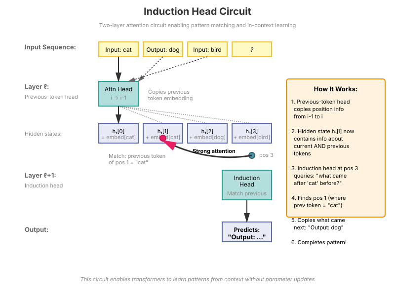
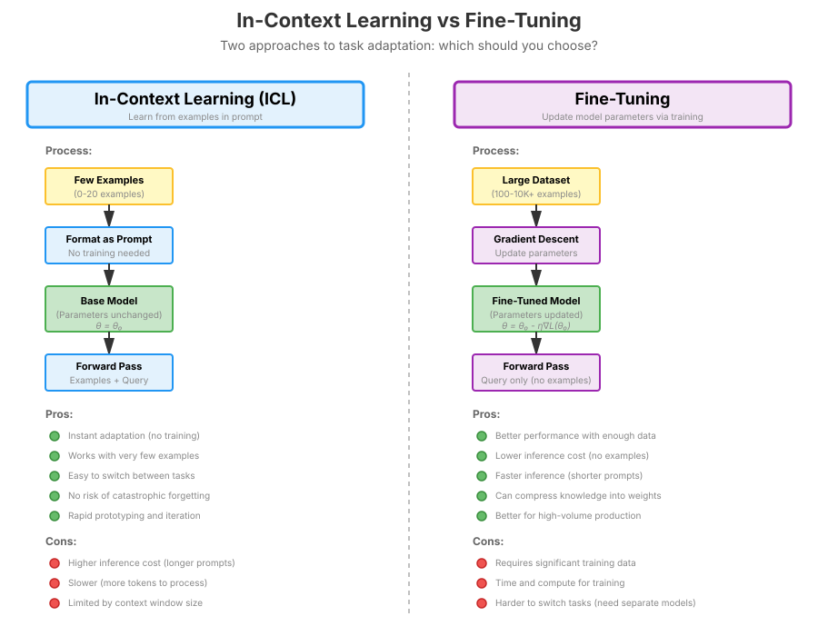

# Chapter 26: In-Context Learning

In-Context Learning (ICL) is a remarkable capability of large language models where they can learn to perform tasks from examples provided in the prompt, without any parameter updates. This chapter explores the mechanisms behind ICL, theoretical frameworks for understanding it, and practical implications for using LLMs.

## Table of Contents

1. [Introduction to In-Context Learning](#introduction-to-in-context-learning)
2. [Zero-Shot, One-Shot, and Few-Shot Learning](#zero-shot-one-shot-and-few-shot-learning)
3. [Mechanistic Interpretability of ICL](#mechanistic-interpretability-of-icl)
4. [Theoretical Frameworks for ICL](#theoretical-frameworks-for-icl)
5. [How ICL Emerges During Training](#how-icl-emerges-during-training)
6. [Factors Affecting ICL Performance](#factors-affecting-icl-performance)
7. [ICL vs Fine-Tuning: When to Use Each](#icl-vs-fine-tuning-when-to-use-each)
8. [Advanced ICL Techniques](#advanced-icl-techniques)
9. [Connection to Reasoning](#connection-to-reasoning)
10. [Implementation: Building ICL Systems](#implementation-building-icl-systems)
11. [Interview Questions](#interview-questions)
12. [Exercises](#exercises)

## Introduction to In-Context Learning

In-Context Learning (ICL) refers to the ability of language models to perform tasks by conditioning on a few examples provided in the prompt, without updating model parameters. This capability was famously demonstrated by GPT-3 (Brown et al., 2020) and has become a defining characteristic of large language models.

### What Makes ICL Special?

Unlike traditional machine learning where models require explicit training (gradient descent on parameters), ICL works entirely through **prompting**:

```text
Standard ML:
  Training Data → Gradient Updates → New Model → Predictions

In-Context Learning:
  Examples in Prompt → Forward Pass → Predictions
  (No parameter updates!)
```

### The ICL Paradigm

**Traditional approach:**
```python
# Fine-tune on task-specific data
model.train()
for batch in task_data:
    loss = model(batch)
    loss.backward()
    optimizer.step()
```

**ICL approach:**
```python
# Provide examples in the prompt
prompt = """Translate English to French:
English: Hello
French: Bonjour

English: Goodbye
French: Au revoir

English: Thank you
French:"""

output = model.generate(prompt)  # "Merci"
```

### Why ICL Matters

1. **Flexibility**: Adapt to new tasks instantly without retraining
2. **Efficiency**: No gradient computation or parameter updates needed
3. **Data efficiency**: Can work with just a few examples
4. **Rapid prototyping**: Test task performance immediately
5. **Emergent capability**: Only appears in sufficiently large models (~10B+ parameters)

### Historical Context

- **Pre-2020**: Task-specific fine-tuning was the standard approach
- **GPT-3 (2020)**: Demonstrated that scaling models enables strong few-shot learning
- **2021-2023**: Research into mechanisms (induction heads, task vectors)
- **2024-2025**: Theoretical understanding deepens (Bayesian inference, implicit gradient descent)

## Zero-Shot, One-Shot, and Few-Shot Learning

ICL comes in different flavors depending on how many examples are provided:

### Zero-Shot Learning

The model performs a task with **no examples**, relying only on the task description:

```python
def zero_shot_prompt(task_description, query):
    """
    Zero-shot prompting: task description only.

    Args:
        task_description: What the model should do
        query: The input to process

    Returns:
        Formatted prompt string
    """
    return f"""{task_description}

Input: {query}
Output:"""

# Example
prompt = zero_shot_prompt(
    "Classify the sentiment of the following text as positive, negative, or neutral.",
    "This movie was absolutely fantastic!"
)
# Model generates: "positive"
```

**Key characteristics:**
- Relies on task understanding from pre-training
- Works best for common tasks seen during pre-training
- Performance varies greatly by task

### One-Shot Learning

The model sees **exactly one example** before the query:

```python
def one_shot_prompt(example_input, example_output, query):
    """
    One-shot prompting: single example.

    Args:
        example_input: Input from one example
        example_output: Output from one example
        query: The new input to process

    Returns:
        Formatted prompt string
    """
    return f"""Input: {example_input}
Output: {example_output}

Input: {query}
Output:"""

# Example
prompt = one_shot_prompt(
    "I loved this restaurant!",
    "positive",
    "The service was terrible."
)
# Model generates: "negative"
```

**Key characteristics:**
- Shows the input-output pattern
- Helps disambiguate the task format
- Significant improvement over zero-shot

### Few-Shot Learning

The model sees **multiple examples** (typically 2-10) before the query:

```python
def few_shot_prompt(examples, query):
    """
    Few-shot prompting: multiple examples.

    Args:
        examples: List of (input, output) tuples
        query: The new input to process

    Returns:
        Formatted prompt string
    """
    prompt_parts = []

    for input_text, output_text in examples:
        prompt_parts.append(f"Input: {input_text}")
        prompt_parts.append(f"Output: {output_text}")
        prompt_parts.append("")  # Blank line

    prompt_parts.append(f"Input: {query}")
    prompt_parts.append("Output:")

    return "\n".join(prompt_parts)

# Example
examples = [
    ("I loved this restaurant!", "positive"),
    ("The service was terrible.", "negative"),
    ("The food was okay, nothing special.", "neutral"),
    ("Best meal I've had in years!", "positive"),
]

prompt = few_shot_prompt(examples, "It was fine, I guess.")
# Model generates: "neutral"
```

### Performance Scaling with Examples

The relationship between number of examples and performance typically follows a **logarithmic curve**:

$$
\large
\text{Performance} \approx \alpha + \beta \log(N + 1)
$$

where $N$ is the number of examples, and $\alpha, \beta$ are task-dependent constants.

**Empirical observations:**
- 0 → 1 examples: Large improvement (20-40%)
- 1 → 4 examples: Moderate improvement (10-20%)
- 4 → 16 examples: Diminishing returns (2-10%)
- Beyond 16: Marginal gains, may hit context length limits

### Practical Implementation

```python
import torch
from transformers import AutoModelForCausalLM, AutoTokenizer

def evaluate_icl_scaling(model, tokenizer, task_examples, test_query, max_shots=10):
    """
    Evaluate how performance changes with number of examples.

    Args:
        model: Language model
        tokenizer: Tokenizer
        task_examples: List of (input, output) training examples
        test_query: Input to test
        max_shots: Maximum number of examples to try

    Returns:
        results: Dict mapping num_shots to generated output
    """
    results = {}

    for num_shots in range(0, min(max_shots + 1, len(task_examples) + 1)):
        if num_shots == 0:
            # Zero-shot
            prompt = f"Input: {test_query}\nOutput:"
        else:
            # Few-shot
            selected_examples = task_examples[:num_shots]
            prompt = few_shot_prompt(selected_examples, test_query)

        # Generate
        inputs = tokenizer(prompt, return_tensors="pt").to(model.device)

        with torch.no_grad():
            outputs = model.generate(
                **inputs,
                max_new_tokens=50,
                temperature=0.0,  # Deterministic for comparison
                do_sample=False,
                pad_token_id=tokenizer.eos_token_id
            )

        generated = tokenizer.decode(outputs[0], skip_special_tokens=True)
        # Extract just the answer part
        answer = generated.split("Output:")[-1].strip()

        results[num_shots] = answer

    return results


# Example usage
model_name = "meta-llama/Llama-2-7b-hf"
model = AutoModelForCausalLM.from_pretrained(model_name, torch_dtype=torch.bfloat16)
tokenizer = AutoTokenizer.from_pretrained(model_name)
model.to("cuda")

# Sentiment classification task
task_examples = [
    ("I loved this restaurant!", "positive"),
    ("The service was terrible.", "negative"),
    ("The food was okay.", "neutral"),
    ("Best meal ever!", "positive"),
    ("Absolutely awful experience.", "negative"),
]

test_query = "It was pretty good overall."

results = evaluate_icl_scaling(model, tokenizer, task_examples, test_query, max_shots=5)

print("ICL Performance vs Number of Examples:")
for num_shots, answer in results.items():
    print(f"{num_shots}-shot: {answer}")
```

## Mechanistic Interpretability of ICL

Understanding **how** transformers implement ICL at the circuit level has been a major research focus. Key mechanisms include induction heads and task vectors.

### Induction Heads

**Induction heads** are a critical circuit discovered by Olsson et al. (2022) that enable pattern matching and copying behavior.

#### What Are Induction Heads?

An induction head is a two-layer attention pattern that:

1. **Layer 1**: A previous-token attention head copies positional information
2. **Layer 2**: An induction head looks for patterns and completes them

**Example behavior:**
```text
Input: "The cat sat on the mat. The cat"
Induction head predicts: "sat" (completing the repeated pattern)
```

#### The Induction Circuit



The circuit works through **composition of attention heads**:

**Step 1** (Previous-token head at layer $\ell$):

$$
\large
\text{Attn}_{\text{prev}}[i] \approx \text{embed}[i-1]
$$

Copies the embedding from the previous token position.

**Step 2** (Induction head at layer $\ell + 1$):

$$
\large
\text{Attn}_{\text{ind}}[i] = \text{softmax}\left(\frac{Q_i K^T}{\sqrt{d}}\right) V
$$

Where the key $K_j$ includes the previous-token information:

$$
\large
K_j = W_{K} (\text{embed}[j] + \text{Attn}_{\text{prev}}[j])
$$

This allows the induction head to match based on "what came before this token" rather than just the token itself.

**Why this enables ICL:**

When you provide few-shot examples like:
```text
Input: cat → Output: dog
Input: bird → Output: ?
```

The induction head can:
1. Recognize that "Input: bird" is structurally similar to "Input: cat"
2. Look up what came after "Input: cat" (which was "→ Output: dog")
3. Complete the pattern by outputting "→ Output: [something similar]"

#### Detecting Induction Heads

```python
import torch
import torch.nn.functional as F

def detect_induction_heads(model, tokenizer, device="cuda"):
    """
    Detect induction heads by testing on repeated sequences.

    Induction heads should attend strongly to positions where
    the previous token matches the current query.

    Args:
        model: Transformer model with access to attention weights
        tokenizer: Tokenizer
        device: Device to run on

    Returns:
        induction_scores: Tensor of shape (num_layers, num_heads)
    """
    # Create a repeated random sequence: A B C A B C
    test_tokens = [1, 2, 3, 1, 2, 3]  # Token IDs
    input_ids = torch.tensor([test_tokens]).to(device)

    # Forward pass with attention output
    with torch.no_grad():
        outputs = model(input_ids, output_attentions=True)
        attentions = outputs.attentions  # Tuple of (num_layers, batch, num_heads, seq_len, seq_len)

    num_layers = len(attentions)
    num_heads = attentions[0].shape[1]

    induction_scores = torch.zeros(num_layers, num_heads)

    for layer_idx in range(num_layers):
        attn = attentions[layer_idx][0]  # (num_heads, seq_len, seq_len)

        for head_idx in range(num_heads):
            head_attn = attn[head_idx]  # (seq_len, seq_len)

            # For induction, at position i in second sequence,
            # should attend to position i in first sequence
            # Position 3 (second "1") should attend to position 0 (first "1")
            # Position 4 (second "2") should attend to position 1 (first "2")
            # etc.

            induction_score = 0.0
            count = 0

            for i in range(3, 6):  # Second sequence positions
                # Attention from position i to position i-3 (corresponding position in first sequence)
                induction_score += head_attn[i, i - 3].item()
                count += 1

            induction_scores[layer_idx, head_idx] = induction_score / count

    return induction_scores


# Usage
induction_scores = detect_induction_heads(model, tokenizer)

# Find strongest induction heads
top_k = 5
flat_indices = torch.topk(induction_scores.flatten(), top_k).indices
top_heads = [(idx.item() // induction_scores.shape[1],
              idx.item() % induction_scores.shape[1])
             for idx in flat_indices]

print(f"Top {top_k} induction heads:")
for layer, head in top_heads:
    score = induction_scores[layer, head]
    print(f"  Layer {layer}, Head {head}: {score:.4f}")
```

### Task Vectors and Task Subspaces

Another mechanism for ICL involves **task vectors** - directions in activation space that encode task information.

#### Task Vector Hypothesis

When a model processes few-shot examples, it forms an internal representation of the task in its activation space. This "task vector" then influences how it processes the query.

$$
\large
h_{\text{query}} = h_{\text{base}} + \alpha \cdot v_{\text{task}}
$$

where:
- $h_{\text{query}}$ is the hidden state for processing the query
- $h_{\text{base}}$ is the base representation
- $v_{\text{task}}$ is the task vector extracted from examples
- $\alpha$ is a scaling factor

#### Extracting Task Vectors

```python
def extract_task_vector(model, tokenizer, examples, layer_idx=-1):
    """
    Extract task vector from few-shot examples.

    The task vector is the difference between activations when
    processing examples vs processing random text.

    Args:
        model: Language model
        tokenizer: Tokenizer
        examples: List of (input, output) pairs
        layer_idx: Which layer to extract from (-1 = last layer)

    Returns:
        task_vector: Mean activation difference encoding the task
    """
    # Format examples as a prompt
    prompt_parts = []
    for inp, out in examples:
        prompt_parts.append(f"Input: {inp}\nOutput: {out}")

    examples_prompt = "\n\n".join(prompt_parts)

    # Get activations for examples
    inputs_with_examples = tokenizer(examples_prompt, return_tensors="pt").to(model.device)

    with torch.no_grad():
        outputs_with = model(**inputs_with_examples, output_hidden_states=True)
        hidden_with = outputs_with.hidden_states[layer_idx]  # (batch, seq_len, hidden_dim)

        # Use mean over sequence
        task_activation = hidden_with.mean(dim=1)  # (batch, hidden_dim)

    # Get activations for random baseline (no task examples)
    baseline_prompt = "The quick brown fox jumps over the lazy dog."
    inputs_baseline = tokenizer(baseline_prompt, return_tensors="pt").to(model.device)

    with torch.no_grad():
        outputs_baseline = model(**inputs_baseline, output_hidden_states=True)
        hidden_baseline = outputs_baseline.hidden_states[layer_idx]
        baseline_activation = hidden_baseline.mean(dim=1)

    # Task vector is the difference
    task_vector = task_activation - baseline_activation

    return task_vector.squeeze()  # (hidden_dim,)


# Usage example
examples = [
    ("happy", "sad"),
    ("hot", "cold"),
    ("big", "small"),
]

task_vector = extract_task_vector(model, tokenizer, examples, layer_idx=-1)
print(f"Task vector shape: {task_vector.shape}")
print(f"Task vector norm: {task_vector.norm().item():.4f}")
```

### Attention Pattern Analysis

We can visualize how attention patterns change with few-shot examples:

```python
def visualize_icl_attention(model, tokenizer, few_shot_prompt, layer_idx=0, head_idx=0):
    """
    Visualize attention patterns for ICL.

    Shows how the model attends to few-shot examples when processing the query.

    Args:
        model: Transformer model
        tokenizer: Tokenizer
        few_shot_prompt: Complete prompt with examples and query
        layer_idx: Which layer to visualize
        head_idx: Which attention head to visualize

    Returns:
        attention_matrix: Attention weights for visualization
        tokens: List of token strings
    """
    inputs = tokenizer(few_shot_prompt, return_tensors="pt").to(model.device)

    with torch.no_grad():
        outputs = model(**inputs, output_attentions=True)
        attentions = outputs.attentions[layer_idx][0]  # (num_heads, seq_len, seq_len)

    attention_matrix = attentions[head_idx].cpu().numpy()  # (seq_len, seq_len)

    # Get tokens
    token_ids = inputs['input_ids'][0].cpu().tolist()
    tokens = [tokenizer.decode([tid]) for tid in token_ids]

    return attention_matrix, tokens


# Example visualization (would need matplotlib for actual plotting)
prompt = """Input: cat
Output: dog

Input: bird
Output:"""

attn_matrix, tokens = visualize_icl_attention(model, tokenizer, prompt)

print(f"Attention matrix shape: {attn_matrix.shape}")
print(f"Tokens: {tokens}")
print(f"\nAttention from final position to example positions:")
print(f"Final token attends to:")
for i, token in enumerate(tokens):
    attn_weight = attn_matrix[-1, i]
    if attn_weight > 0.05:  # Significant attention
        print(f"  {token}: {attn_weight:.4f}")
```

## Theoretical Frameworks for ICL

Several theoretical perspectives help explain why and how ICL works:

### 1. Meta-Learning / Learning to Learn

**Core idea**: During pre-training, the model learns a **meta-learning algorithm** that can quickly adapt to new tasks from examples.

From a meta-learning perspective, pre-training is optimizing:

$$
\large
\min_{\theta} \mathbb{E}_{p(\mathcal{T})} \left[ \mathbb{E}_{(x,y) \sim \mathcal{T}} \left[ \mathcal{L}(f_{\theta}(x | C_{\mathcal{T}}), y) \right] \right]
$$

where $C_{\mathcal{T}}$ is the context containing examples from task $\mathcal{T}$, $\mathcal{T}$ is a distribution over tasks, and the model $f_{\theta}$ learns to use context to perform well on new examples from the same task.

**Key insight**: Language modeling naturally creates a meta-learning setup because:
- Documents often have consistent style/topic (define a "task")
- Predicting later tokens requires adapting to earlier tokens (few-shot learning)

**Evidence**:
- ICL performance correlates with pre-training "burstiness" (same concepts appearing multiple times)
- Models trained on more diverse data show better ICL

### 2. Bayesian Inference

**Core idea**: ICL approximates **Bayesian posterior inference** over task parameters.

The model implicitly performs:

$$
\large
p(y | x, \text{examples}) = \int p(y | x, \theta) p(\theta | \text{examples}) d\theta
$$

where $\theta$ represents task parameters (e.g., classification weights).

**Derivation**:

Given examples $\mathcal{D} = \{(x_1, y_1), ..., (x_k, y_k)\}$ and a new input $x$:

$$
\large
p(y | x, \mathcal{D}) = \int p(y | x, \theta) p(\theta | \mathcal{D}) d\theta
$$

The posterior over task parameters updates via Bayes' rule:

$$
\large
p(\theta | \mathcal{D}) \propto p(\mathcal{D} | \theta) p(\theta)
$$

**Connection to transformers**:

Transformers can be viewed as performing approximate Bayesian inference:
- Prior $p(\theta)$ is encoded in pre-trained weights
- Likelihood $p(\mathcal{D} | \theta)$ is computed via attention to examples
- Posterior $p(\theta | \mathcal{D})$ is implicitly represented in activations

**Xie et al. (2022)** showed that transformers trained on simple function classes provably learn to perform Bayesian inference.

### 3. ICL as Implicit Gradient Descent

**Core idea**: ICL implements **gradient descent in forward pass**, without explicit backpropagation.

Von Oswald et al. (2023) and others showed that transformer attention can implement gradient-based learning:

**Standard gradient descent** (fine-tuning):

$$
\large
\theta_{t+1} = \theta_t - \eta \nabla_{\theta} \mathcal{L}(y_t | x_t, \theta_t)
$$

**ICL as implicit gradient descent**:

The transformer's forward pass computes something equivalent to:

$$
\large
f_{\text{ICL}}(x | \mathcal{D}) \approx f(x; \theta - \eta \sum_{(x_i, y_i) \in \mathcal{D}} \nabla_{\theta} \mathcal{L}(y_i | x_i, \theta))
$$

where $\theta$ is the pre-trained parameters, but **the gradient update happens implicitly in activations** rather than explicitly updating weights.

#### How Attention Implements Gradient Descent

A single attention layer can implement one step of gradient descent on a linear model:

**Linear regression setup**:
- Task: predict $y = w^T x$ for unknown weights $w$
- Examples: $\{(x_i, y_i)\}_{i=1}^k$
- Query: new input $x$

**Gradient descent solution**:

$$
\large
w^* = \arg\min_w \sum_{i=1}^k (y_i - w^T x_i)^2 = (X^T X)^{-1} X^T y
$$

**Attention computation**:

$$
\large
\text{Attn}(x, \{x_i, y_i\}) = \sum_{i=1}^k \frac{\exp(x^T x_i)}{\sum_j \exp(x^T x_j)} y_i
$$

With appropriate parameterization, this is exactly gradient descent on squared loss!

#### Implementing Gradient Descent with Attention

```python
def attention_as_gradient_descent(query, keys, values, num_steps=1, learning_rate=0.1):
    """
    Demonstrate how attention can implement gradient descent.

    For linear regression: y = w^T x
    Attention computes: w = (X^T X)^{-1} X^T y (exact least squares)

    Args:
        query: New input x (shape: d,)
        keys: Training inputs X (shape: n, d)
        values: Training outputs y (shape: n,)
        num_steps: Number of gradient steps (depth of transformer)
        learning_rate: Step size

    Returns:
        prediction: Predicted output for query
        learned_weights: Implicitly learned weights
    """
    d = query.shape[0]
    n = keys.shape[0]

    # Initialize weights (bias in transformer)
    w = torch.zeros(d)

    # Gradient descent steps (mimicked by transformer layers)
    for step in range(num_steps):
        # Compute predictions on training data
        predictions = keys @ w  # (n,)

        # Gradient of squared loss: -X^T (y - Xw)
        errors = values - predictions  # (n,)
        gradient = -keys.T @ errors  # (d,)

        # Update weights
        w = w - learning_rate * gradient

    # Final prediction on query
    prediction = query @ w

    # Compare to what attention would compute
    # Attention: softmax(x^T X^T) @ y
    attention_scores = torch.exp(query @ keys.T)  # (n,)
    attention_weights = attention_scores / attention_scores.sum()
    attention_prediction = attention_weights @ values

    print(f"Gradient descent prediction: {prediction.item():.4f}")
    print(f"Attention prediction: {attention_prediction.item():.4f}")
    print(f"Difference: {(prediction - attention_prediction).abs().item():.6f}")

    return prediction, w


# Example: Linear regression task
torch.manual_seed(42)

# True weights
true_w = torch.tensor([2.0, -1.0, 0.5])

# Training data
n_train = 10
X_train = torch.randn(n_train, 3)
y_train = X_train @ true_w + 0.1 * torch.randn(n_train)

# Query
x_query = torch.randn(3)
y_true = x_query @ true_w

print(f"True output: {y_true.item():.4f}\n")

prediction, learned_w = attention_as_gradient_descent(
    x_query, X_train, y_train, num_steps=10, learning_rate=0.01
)

print(f"\nTrue weights: {true_w}")
print(f"Learned weights: {learned_w}")
```

### 4. Task Representation Learning

**Core idea**: The model learns to encode tasks in its activation space, forming **task embeddings** from examples.

This perspective views ICL as:

1. **Encoding**: Map examples to a task embedding $z_{\text{task}}$

   $$
   \large
   z_{\text{task}} = \text{Encoder}(\{(x_i, y_i)\}_{i=1}^k)
   $$

2. **Conditioning**: Use task embedding to process query

   $$
   \large
   y = \text{Decoder}(x | z_{\text{task}})
   $$

**Implementation**:

Different transformer layers may specialize:
- **Early layers**: Encode individual examples
- **Middle layers**: Aggregate into task representation
- **Late layers**: Apply task representation to query

**Evidence**:
- Probing classifiers can predict the task from middle-layer activations
- Task representations are often linearly separable
- Similar tasks have similar activation patterns

## How ICL Emerges During Training

ICL is an **emergent capability** that appears during pre-training when models reach sufficient scale. Understanding when and why it emerges is crucial.

### The Emergence of ICL

**Empirical observations**:

1. **Scale threshold**: ICL appears around 10B parameters
2. **Training dynamics**: ICL ability develops suddenly (phase transition-like)
3. **Data diversity**: Models trained on diverse data show stronger ICL

**Why scale matters**:

$$
\large
\text{ICL capability} \propto f(\text{model size}, \text{data diversity}, \text{training compute})
$$

Possible explanations:
- **Capacity**: Larger models can store more task templates
- **Optimization**: Larger models can learn more complex algorithms
- **Generalization**: Overparameterized models learn more general solutions

### Training Dynamics of Induction Heads

Olsson et al. (2022) tracked when induction heads emerge during training:

**Phase 1** (early training):
- Random attention patterns
- No systematic copying behavior

**Phase 2** (sudden transition ~10-20% through training):
- Induction heads appear abruptly
- Loss drops significantly on repeated sequences
- **This coincides with ICL capability appearing**

**Phase 3** (continued training):
- Induction heads strengthen and specialize
- More complex patterns can be learned

```python
def track_induction_head_emergence(model, train_loader, check_every=1000):
    """
    Track when induction heads emerge during training.

    Args:
        model: Transformer being trained
        train_loader: DataLoader for training
        check_every: How often to check (in steps)

    Returns:
        emergence_curve: List of (step, induction_score) tuples
    """
    emergence_curve = []

    # Define test sequence for induction
    # Pattern: A B C A B C (should predict C after B in second occurrence)
    test_sequence = torch.tensor([[10, 20, 30, 10, 20, 30]])

    step = 0
    for batch in train_loader:
        # Training step (not shown)
        # ...

        if step % check_every == 0:
            # Evaluate induction capability
            model.eval()
            with torch.no_grad():
                outputs = model(test_sequence, output_attentions=True)

                # Check if model predicts correctly at positions 4, 5
                logits = outputs.logits[0]  # (seq_len, vocab_size)

                # Position 4 should predict 20 (after seeing "10 20 30 10")
                pred_4 = logits[3].argmax().item()
                correct_4 = (pred_4 == 20)

                # Position 5 should predict 30 (after seeing "10 20 30 10 20")
                pred_5 = logits[4].argmax().item()
                correct_5 = (pred_5 == 30)

                induction_score = (correct_4 + correct_5) / 2.0
                emergence_curve.append((step, induction_score))

            model.train()

        step += 1

    return emergence_curve


# Plotting emergence (pseudo-code)
# import matplotlib.pyplot as plt
# steps, scores = zip(*emergence_curve)
# plt.plot(steps, scores)
# plt.xlabel("Training Steps")
# plt.ylabel("Induction Score")
# plt.title("Emergence of Induction Heads During Training")
```

### What Data Teaches ICL?

Not all pre-training data is equally important for ICL:

**High ICL value**:
- Documents with repeated patterns (code, structured text)
- Multi-turn conversations (Q&A pairs)
- Lists and examples within documents
- Structured data (tables, forms)

**Lower ICL value**:
- Single-topic monologues
- Highly varied content with no repetition
- Very short documents

**Optimal pre-training for ICL**:

```python
def icl_optimized_data_mixing():
    """
    Suggested data mixture for strong ICL capabilities.

    Based on research showing what types of data encourage ICL.
    """
    data_mixture = {
        "code": 0.30,              # High repetition, clear patterns
        "qa_pairs": 0.20,          # Direct few-shot structure
        "structured_text": 0.15,   # Tables, forms, lists
        "diverse_web": 0.25,       # General knowledge
        "books": 0.10,             # Long-range coherence
    }

    return data_mixture
```

## Factors Affecting ICL Performance

ICL performance depends on many factors beyond just model size:

### 1. Example Selection and Ordering

**Not all examples are equally useful**:

```python
def select_icl_examples(train_examples, query, k=5, method="similar"):
    """
    Select best k examples for ICL.

    Args:
        train_examples: Pool of available examples
        query: The input we want to make prediction on
        k: Number of examples to include
        method: Selection strategy

    Returns:
        selected_examples: Best k examples for this query
    """
    if method == "random":
        # Random selection (baseline)
        import random
        return random.sample(train_examples, k)

    elif method == "similar":
        # Select examples most similar to query (k-NN)
        from sklearn.metrics.pairwise import cosine_similarity
        import numpy as np

        # Embed query and examples (simplified - use actual embeddings)
        query_embedding = embed_text(query)
        example_embeddings = [embed_text(ex[0]) for ex in train_examples]

        # Compute similarities
        similarities = cosine_similarity(
            query_embedding.reshape(1, -1),
            np.array(example_embeddings)
        )[0]

        # Select top-k
        top_k_indices = similarities.argsort()[-k:][::-1]
        return [train_examples[i] for i in top_k_indices]

    elif method == "diverse":
        # Select diverse examples covering different patterns
        # Use clustering or maximum marginal relevance
        pass

    elif method == "balanced":
        # For classification: balance classes in examples
        from collections import Counter

        # Count examples per class
        class_counts = Counter([ex[1] for ex in train_examples])
        num_classes = len(class_counts)
        per_class = k // num_classes

        selected = []
        for class_label in class_counts:
            class_examples = [ex for ex in train_examples if ex[1] == class_label]
            selected.extend(random.sample(class_examples, min(per_class, len(class_examples))))

        return selected[:k]

def embed_text(text):
    """Placeholder for text embedding function"""
    import numpy as np
    return np.random.randn(384)  # Replace with actual embeddings
```

**Ordering effects**:

Research shows **recency bias** - examples later in the prompt have more influence:

```python
def test_ordering_effects(model, tokenizer, examples, query):
    """
    Test how example ordering affects ICL predictions.

    Args:
        model: Language model
        tokenizer: Tokenizer
        examples: List of (input, output) examples
        query: Test input

    Returns:
        results: Dict mapping ordering to prediction
    """
    import itertools

    results = {}

    # Try different orderings
    orderings = [
        ("original", examples),
        ("reversed", examples[::-1]),
        ("random1", random.sample(examples, len(examples))),
    ]

    for name, ordered_examples in orderings:
        prompt = few_shot_prompt(ordered_examples, query)

        inputs = tokenizer(prompt, return_tensors="pt").to(model.device)
        with torch.no_grad():
            outputs = model.generate(**inputs, max_new_tokens=20)

        prediction = tokenizer.decode(outputs[0], skip_special_tokens=True)
        results[name] = prediction.split("Output:")[-1].strip()

    return results
```

### 2. Instruction Format and Phrasing

**Format matters significantly**:

```python
# Format A: Label-first
format_a = """positive: I loved it!
negative: It was terrible.
positive: Amazing!

{query}:"""

# Format B: Sentence-first
format_b = """I loved it! [positive]
It was terrible. [negative]
Amazing! [positive]

{query} ["""

# Format C: Natural language
format_c = """Q: What is the sentiment of "I loved it!"?
A: positive

Q: What is the sentiment of "It was terrible."?
A: negative

Q: What is the sentiment of "{query}"?
A:"""
```

**Best practices**:
- Be consistent in format across examples and query
- Use clear delimiters (colons, newlines, special tokens)
- Match the style of pre-training data when possible
- For instruction-tuned models, use natural language instructions

### 3. Label Space and Verbalization

How you express the output matters:

```python
# Different label verbalizations for sentiment
verbalizations = {
    "short": {"positive": "pos", "negative": "neg"},
    "full": {"positive": "positive", "negative": "negative"},
    "natural": {"positive": "good", "negative": "bad"},
    "emoji": {"positive": "😊", "negative": "😞"},
    "numeric": {"positive": "1", "negative": "0"},
}

def test_verbalizations(model, tokenizer, examples, query, verbalizations):
    """
    Test different output verbalizations.

    Shows that label choice affects ICL performance significantly.
    """
    results = {}

    for name, label_map in verbalizations.items():
        # Remap examples to use this verbalization
        remapped_examples = [
            (inp, label_map.get(out, out))
            for inp, out in examples
        ]

        prompt = few_shot_prompt(remapped_examples, query)
        # Generate and evaluate...

    return results
```

**Findings**:
- Natural, common words work better than arbitrary labels
- Labels seen frequently in pre-training are more effective
- Consistency is more important than the specific choice

### 4. Number of Examples vs Context Length

There's a tradeoff between number of examples and context length:

$$
\large
\text{Optimal k} = \arg\max_k \left[ \text{ICL benefit}(k) - \text{Context cost}(k) \right]
$$

**Considerations**:
- More examples → better task understanding
- BUT longer context → slower, more expensive, potential lost-in-the-middle effects
- Optimal k is typically 5-20 for most tasks

### 5. Model Scale and Architecture

**Scale effects**:
```text
Model Size     ICL Capability
-----------    ---------------
< 1B           Weak/absent
1B - 10B       Emerging
10B - 100B     Strong
> 100B         State-of-the-art
```

**Architectural factors**:
- **Attention type**: MHA, MQA, GQA all support ICL
- **Position encoding**: RoPE, ALiBi enable longer contexts
- **Normalization**: Pre-norm (better for ICL than post-norm)
- **Activation**: SwiGLU slightly better than GELU

## ICL vs Fine-Tuning: When to Use Each

A critical practical question: when should you use ICL vs fine-tuning?



### Comparison Table

| Aspect | In-Context Learning | Fine-Tuning |
|--------|-------------------|-------------|
| **Training** | None (just prompt design) | Gradient descent on task data |
| **Data required** | 0-20 examples | 100-10,000+ examples |
| **Latency** | Higher (longer prompts) | Lower (no examples needed) |
| **Cost per query** | Higher (more tokens) | Lower (cheaper inference) |
| **Adaptability** | Instant task switching | Need separate models or LoRA |
| **Performance** | Good with strong base model | Better with sufficient data |
| **Generalization** | Can generalize from few examples | Risk of overfitting |
| **Privacy** | Examples in every query | Data used only during training |

### Decision Framework

```python
def should_use_icl_or_finetune(
    num_examples,
    query_volume,
    task_diversity,
    latency_requirements,
    base_model_capability
):
    """
    Decision framework for ICL vs fine-tuning.

    Args:
        num_examples: How many labeled examples available
        query_volume: Expected number of queries (per day)
        task_diversity: How many different tasks to support
        latency_requirements: Max acceptable latency (ms)
        base_model_capability: How good is base model (0-1 scale)

    Returns:
        recommendation: "ICL", "fine-tuning", or "hybrid"
    """
    score_icl = 0
    score_ft = 0

    # Data availability
    if num_examples < 50:
        score_icl += 3
    elif num_examples < 500:
        score_icl += 1
        score_ft += 1
    else:
        score_ft += 3

    # Query volume (cost considerations)
    if query_volume < 100:
        score_icl += 2  # Low volume, cost matters less
    elif query_volume < 10000:
        score_icl += 1
        score_ft += 1
    else:
        score_ft += 3  # High volume, inference cost matters

    # Task diversity
    if task_diversity > 10:
        score_icl += 3  # Easy to switch tasks
    elif task_diversity > 3:
        score_icl += 2
        score_ft += 1  # Can use LoRA for multiple tasks
    else:
        score_ft += 2

    # Latency requirements
    if latency_requirements < 100:  # < 100ms
        score_ft += 3
    elif latency_requirements < 500:
        score_ft += 1
    else:
        score_icl += 1

    # Base model capability
    if base_model_capability > 0.8:
        score_icl += 2  # Good base model works well with ICL
    else:
        score_ft += 2  # Weak base needs fine-tuning

    # Make recommendation
    if score_icl > score_ft + 2:
        return "ICL"
    elif score_ft > score_icl + 2:
        return "fine-tuning"
    else:
        return "hybrid"  # Use both!


# Example usage
recommendation = should_use_icl_or_finetune(
    num_examples=30,
    query_volume=500,
    task_diversity=5,
    latency_requirements=200,
    base_model_capability=0.85
)
print(f"Recommendation: {recommendation}")
```

### Hybrid Approaches

Often the best solution combines both:

**1. ICL-augmented fine-tuning**:
- Fine-tune on broad task category
- Use ICL for task-specific adaptation

**2. Fine-tuning for efficiency, ICL for adaptation**:
- Fine-tune to compress knowledge (reduce tokens needed)
- Use small number of ICL examples for edge cases

**3. Multi-stage approach**:
- Start with ICL for prototyping
- Collect data and fine-tune when volume justifies it
- Keep ICL for rare cases

## Advanced ICL Techniques

Several advanced techniques can improve ICL performance:

### 1. Instruction Tuning for Better ICL

Instruction-tuned models (like GPT-3.5, GPT-4, Claude) often perform better at ICL:

```python
# Instruction-tuned models benefit from explicit instructions

# Base model prompt
base_prompt = """cat → dog
bird → eagle
fish →"""

# Instruction-tuned prompt
instruction_prompt = """Task: For each animal, provide a related animal.

Examples:
- cat → dog
- bird → eagle

Now complete:
- fish → """
```

**Why it works**:
- Instruction tuning teaches models to follow meta-level instructions
- Makes task specification more explicit
- Reduces ambiguity in what the examples demonstrate

### 2. Chain-of-Thought for ICL

Combining ICL with chain-of-thought reasoning:

```python
def icl_with_cot(examples_with_reasoning, query):
    """
    ICL where examples include reasoning traces.

    Args:
        examples_with_reasoning: List of (input, reasoning, output)
        query: New input

    Returns:
        prompt: Formatted prompt with reasoning examples
    """
    prompt_parts = []

    for inp, reasoning, out in examples_with_reasoning:
        prompt_parts.append(f"Input: {inp}")
        prompt_parts.append(f"Reasoning: {reasoning}")
        prompt_parts.append(f"Output: {out}")
        prompt_parts.append("")

    prompt_parts.append(f"Input: {query}")
    prompt_parts.append("Reasoning:")

    return "\n".join(prompt_parts)


# Example: Math word problems with reasoning
examples_with_reasoning = [
    (
        "John has 5 apples. He buys 3 more. How many does he have?",
        "John starts with 5 apples. He buys 3 more. 5 + 3 = 8.",
        "8"
    ),
    (
        "A box has 12 items. Sarah takes 4. How many remain?",
        "The box starts with 12 items. Sarah takes 4. 12 - 4 = 8.",
        "8"
    ),
]

prompt = icl_with_cot(examples_with_reasoning, "Bob has 7 cookies and eats 2. How many are left?")
```

### 3. Self-Generated ICL Examples

Use the model to generate its own examples:

```python
def self_generated_icl(model, tokenizer, task_description, num_examples=5):
    """
    Generate ICL examples using the model itself.

    Useful when you have task description but few labeled examples.

    Args:
        model: Language model
        tokenizer: Tokenizer
        task_description: Description of the task
        num_examples: How many examples to generate

    Returns:
        generated_examples: List of (input, output) pairs
    """
    generation_prompt = f"""{task_description}

Generate {num_examples} diverse examples for this task:

Example 1:
Input:"""

    inputs = tokenizer(generation_prompt, return_tensors="pt").to(model.device)

    with torch.no_grad():
        outputs = model.generate(
            **inputs,
            max_new_tokens=500,
            temperature=0.8,  # Higher temperature for diversity
            do_sample=True,
        )

    generated_text = tokenizer.decode(outputs[0], skip_special_tokens=True)

    # Parse generated examples (simplified)
    examples = parse_generated_examples(generated_text)

    return examples

def parse_generated_examples(text):
    """Parse generated examples from text"""
    # Simplified parsing logic
    import re
    examples = []

    # Look for "Input: ... Output: ..." patterns
    pattern = r"Input:\s*(.+?)\s*Output:\s*(.+?)(?=Input:|$)"
    matches = re.findall(pattern, text, re.DOTALL)

    for inp, out in matches:
        examples.append((inp.strip(), out.strip()))

    return examples
```

### 4. Example Calibration

Calibrate output probabilities based on examples:

```python
def calibrated_icl(model, tokenizer, examples, query, label_space):
    """
    Calibrate ICL predictions using content-free baseline.

    Idea: Measure model's label bias from examples alone,
    then adjust predictions on actual query.

    Args:
        model: Language model
        tokenizer: Tokenizer
        examples: Few-shot examples
        query: Actual query
        label_space: List of possible labels

    Returns:
        calibrated_probs: Calibrated probability distribution
    """
    import torch.nn.functional as F

    # Step 1: Get baseline bias (content-free input)
    baseline_prompt = few_shot_prompt(examples, "N/A")
    baseline_inputs = tokenizer(baseline_prompt, return_tensors="pt").to(model.device)

    with torch.no_grad():
        baseline_outputs = model(**baseline_inputs)
        baseline_logits = baseline_outputs.logits[0, -1, :]  # Last position

    # Get probabilities for each label
    baseline_probs = {}
    for label in label_space:
        label_id = tokenizer.encode(label, add_special_tokens=False)[0]
        baseline_probs[label] = F.softmax(baseline_logits, dim=-1)[label_id].item()

    # Step 2: Get actual predictions
    actual_prompt = few_shot_prompt(examples, query)
    actual_inputs = tokenizer(actual_prompt, return_tensors="pt").to(model.device)

    with torch.no_grad():
        actual_outputs = model(**actual_inputs)
        actual_logits = actual_outputs.logits[0, -1, :]

    actual_probs = {}
    for label in label_space:
        label_id = tokenizer.encode(label, add_special_tokens=False)[0]
        actual_probs[label] = F.softmax(actual_logits, dim=-1)[label_id].item()

    # Step 3: Calibrate (divide by baseline to remove bias)
    calibrated_probs = {}
    for label in label_space:
        if baseline_probs[label] > 1e-10:
            calibrated_probs[label] = actual_probs[label] / baseline_probs[label]
        else:
            calibrated_probs[label] = actual_probs[label]

    # Normalize
    total = sum(calibrated_probs.values())
    calibrated_probs = {k: v / total for k, v in calibrated_probs.items()}

    return calibrated_probs


# Example usage
examples = [
    ("I loved it!", "positive"),
    ("Terrible experience.", "negative"),
]
query = "It was okay."
label_space = ["positive", "negative", "neutral"]

calibrated = calibrated_icl(model, tokenizer, examples, query, label_space)
print("Calibrated probabilities:", calibrated)
```

## Connection to Reasoning

ICL and reasoning (Chapter 26) are deeply connected:

### ICL Enables Reasoning

Chain-of-thought prompting (see Chapter 26) is essentially **ICL for reasoning processes**:

```text
Standard ICL: Learn input → output mapping
CoT ICL: Learn input → reasoning → output mapping
```

Few-shot CoT examples teach the model to:
1. Break down problems (from examples showing decomposition)
2. Show intermediate steps (from examples with explicit reasoning)
3. Verify answers (from examples that check their work)

### Reasoning Improves ICL

Reasoning techniques enhance ICL:

**Self-consistency for ICL**: Generate multiple predictions with different example orderings, then vote:

```python
def self_consistent_icl(model, tokenizer, examples, query, num_samples=5):
    """
    Use self-consistency (Chapter 26) to make ICL more robust.

    Generate predictions with different example orderings,
    then take majority vote.
    """
    import random
    from collections import Counter

    predictions = []

    for _ in range(num_samples):
        # Shuffle examples
        shuffled = random.sample(examples, len(examples))

        prompt = few_shot_prompt(shuffled, query)
        prediction = generate_prediction(model, tokenizer, prompt)
        predictions.append(prediction)

    # Majority vote
    vote_counts = Counter(predictions)
    final_answer = vote_counts.most_common(1)[0][0]

    return final_answer
```

**Least-to-most for ICL**: Decompose complex ICL tasks:

```python
def least_to_most_icl(model, tokenizer, complex_task_examples, complex_query):
    """
    Apply least-to-most prompting to ICL.

    First learn simple sub-tasks, then compose them.
    """
    # Step 1: Decompose into sub-tasks
    subtask_1_examples = extract_subtask(complex_task_examples, subtask_id=1)
    subtask_2_examples = extract_subtask(complex_task_examples, subtask_id=2)

    # Step 2: Solve sub-tasks with ICL
    subquery_1 = extract_subquery(complex_query, subtask_id=1)
    subanswer_1 = icl_predict(model, tokenizer, subtask_1_examples, subquery_1)

    subquery_2 = extract_subquery(complex_query, subtask_id=2)
    subanswer_2 = icl_predict(model, tokenizer, subtask_2_examples, subquery_2)

    # Step 3: Combine sub-answers
    final_answer = combine_subanswers(subanswer_1, subanswer_2)

    return final_answer
```

### Shared Mechanisms

ICL and reasoning share underlying mechanisms:
- **Induction heads**: Enable both pattern completion (ICL) and analogical reasoning
- **Task vectors**: Encode both task identity (ICL) and reasoning strategy
- **Attention patterns**: Route information for both example lookup (ICL) and step-by-step thinking

This suggests they're not separate capabilities but different manifestations of the same underlying meta-learning ability.

## Implementation: Building ICL Systems

Let's build a complete ICL system with best practices:

```python
import torch
from transformers import AutoModelForCausalLM, AutoTokenizer
from typing import List, Tuple, Dict, Optional
import numpy as np
from collections import Counter
import random


class ICLSystem:
    """
    A complete In-Context Learning system with advanced features.

    Features:
    - Example selection (similarity-based, diverse, balanced)
    - Calibration
    - Self-consistency
    - Format optimization
    """

    def __init__(
        self,
        model_name: str = "meta-llama/Llama-2-7b-hf",
        device: str = "cuda"
    ):
        """
        Initialize the ICL system.

        Args:
            model_name: HuggingFace model identifier
            device: Device to run on
        """
        self.model = AutoModelForCausalLM.from_pretrained(
            model_name,
            torch_dtype=torch.bfloat16,
            device_map="auto"
        )
        self.tokenizer = AutoTokenizer.from_pretrained(model_name)
        self.device = device

        # Cache for embeddings (for example selection)
        self.embedding_cache = {}

    def embed_text(self, text: str) -> np.ndarray:
        """
        Get embedding for text (simplified - use mean of last layer).

        In practice, use a separate embedding model like sentence-transformers.
        """
        if text in self.embedding_cache:
            return self.embedding_cache[text]

        inputs = self.tokenizer(text, return_tensors="pt", truncation=True, max_length=512)
        inputs = {k: v.to(self.device) for k, v in inputs.items()}

        with torch.no_grad():
            outputs = self.model(**inputs, output_hidden_states=True)
            # Use mean of last hidden state as embedding
            embedding = outputs.hidden_states[-1].mean(dim=1).cpu().numpy()[0]

        self.embedding_cache[text] = embedding
        return embedding

    def select_examples(
        self,
        train_pool: List[Tuple[str, str]],
        query: str,
        k: int = 5,
        method: str = "similar"
    ) -> List[Tuple[str, str]]:
        """
        Select k best examples from training pool.

        Args:
            train_pool: Available training examples (input, output)
            query: Query input
            k: Number of examples to select
            method: Selection strategy ("similar", "diverse", "balanced", "random")

        Returns:
            selected: Best k examples
        """
        if method == "random":
            return random.sample(train_pool, min(k, len(train_pool)))

        elif method == "similar":
            # k-NN based on embedding similarity
            query_emb = self.embed_text(query)

            similarities = []
            for inp, out in train_pool:
                example_emb = self.embed_text(inp)
                similarity = np.dot(query_emb, example_emb) / (
                    np.linalg.norm(query_emb) * np.linalg.norm(example_emb) + 1e-10
                )
                similarities.append(similarity)

            # Select top-k
            top_k_indices = np.argsort(similarities)[-k:][::-1]
            return [train_pool[i] for i in top_k_indices]

        elif method == "balanced":
            # Balance across output classes
            output_counts = Counter([out for _, out in train_pool])
            num_classes = len(output_counts)
            per_class = max(1, k // num_classes)

            selected = []
            for output_class in output_counts.keys():
                class_examples = [ex for ex in train_pool if ex[1] == output_class]
                selected.extend(random.sample(
                    class_examples,
                    min(per_class, len(class_examples))
                ))

            # If we didn't get enough, add random ones
            while len(selected) < k and len(selected) < len(train_pool):
                remaining = [ex for ex in train_pool if ex not in selected]
                if remaining:
                    selected.append(random.choice(remaining))
                else:
                    break

            return selected[:k]

        else:
            raise ValueError(f"Unknown selection method: {method}")

    def format_prompt(
        self,
        examples: List[Tuple[str, str]],
        query: str,
        instruction: Optional[str] = None,
        format_style: str = "simple"
    ) -> str:
        """
        Format examples and query into a prompt.

        Args:
            examples: List of (input, output) examples
            query: Query input
            instruction: Optional task instruction
            format_style: "simple", "detailed", or "natural"

        Returns:
            formatted_prompt: Complete prompt string
        """
        if format_style == "simple":
            parts = []
            if instruction:
                parts.append(instruction)
                parts.append("")

            for inp, out in examples:
                parts.append(f"Input: {inp}")
                parts.append(f"Output: {out}")
                parts.append("")

            parts.append(f"Input: {query}")
            parts.append("Output:")

            return "\n".join(parts)

        elif format_style == "natural":
            parts = []
            if instruction:
                parts.append(instruction)
                parts.append("")

            for inp, out in examples:
                parts.append(f"Q: {inp}")
                parts.append(f"A: {out}")
                parts.append("")

            parts.append(f"Q: {query}")
            parts.append("A:")

            return "\n".join(parts)

        else:
            raise ValueError(f"Unknown format style: {format_style}")

    def predict(
        self,
        prompt: str,
        max_new_tokens: int = 50,
        temperature: float = 0.0,
        do_sample: bool = False
    ) -> str:
        """
        Generate prediction from prompt.

        Args:
            prompt: Complete ICL prompt
            max_new_tokens: Maximum tokens to generate
            temperature: Sampling temperature
            do_sample: Whether to sample or use greedy decoding

        Returns:
            prediction: Model's prediction
        """
        inputs = self.tokenizer(prompt, return_tensors="pt")
        inputs = {k: v.to(self.device) for k, v in inputs.items()}

        with torch.no_grad():
            outputs = self.model.generate(
                **inputs,
                max_new_tokens=max_new_tokens,
                temperature=temperature if do_sample else 1.0,
                do_sample=do_sample,
                pad_token_id=self.tokenizer.eos_token_id
            )

        generated = self.tokenizer.decode(outputs[0], skip_special_tokens=True)

        # Extract just the answer part (after last "Output:" or "A:")
        if "Output:" in generated:
            prediction = generated.split("Output:")[-1].strip()
        elif "A:" in generated:
            prediction = generated.split("A:")[-1].strip()
        else:
            prediction = generated.strip()

        # Take only first line if multiple lines
        prediction = prediction.split("\n")[0].strip()

        return prediction

    def predict_with_self_consistency(
        self,
        examples: List[Tuple[str, str]],
        query: str,
        num_samples: int = 5,
        temperature: float = 0.7,
        **kwargs
    ) -> Tuple[str, Dict[str, int]]:
        """
        Use self-consistency: sample multiple predictions and vote.

        Args:
            examples: ICL examples
            query: Query input
            num_samples: Number of samples to generate
            temperature: Sampling temperature
            **kwargs: Additional arguments for format_prompt

        Returns:
            final_prediction: Majority-voted prediction
            vote_counts: Counter of all predictions
        """
        predictions = []

        for i in range(num_samples):
            # Optionally shuffle examples for diversity
            shuffled_examples = examples.copy()
            if i > 0:  # Keep first sample with original order
                random.shuffle(shuffled_examples)

            prompt = self.format_prompt(shuffled_examples, query, **kwargs)
            prediction = self.predict(
                prompt,
                temperature=temperature,
                do_sample=True
            )
            predictions.append(prediction)

        # Vote
        vote_counts = Counter(predictions)
        final_prediction = vote_counts.most_common(1)[0][0]

        return final_prediction, dict(vote_counts)

    def evaluate(
        self,
        test_examples: List[Tuple[str, str]],
        train_pool: List[Tuple[str, str]],
        k: int = 5,
        selection_method: str = "similar",
        use_self_consistency: bool = False,
        **kwargs
    ) -> Dict[str, float]:
        """
        Evaluate ICL performance on test set.

        Args:
            test_examples: Test set (input, output)
            train_pool: Training pool for selecting examples
            k: Number of examples to use
            selection_method: How to select examples
            use_self_consistency: Whether to use self-consistency
            **kwargs: Additional arguments for prediction

        Returns:
            metrics: Dictionary of evaluation metrics
        """
        correct = 0
        total = len(test_examples)

        for test_input, test_output in test_examples:
            # Select examples (excluding test example if it's in train_pool)
            available_pool = [ex for ex in train_pool if ex[0] != test_input]

            selected_examples = self.select_examples(
                available_pool,
                test_input,
                k=k,
                method=selection_method
            )

            # Predict
            if use_self_consistency:
                prediction, _ = self.predict_with_self_consistency(
                    selected_examples,
                    test_input,
                    **kwargs
                )
            else:
                prompt = self.format_prompt(selected_examples, test_input)
                prediction = self.predict(prompt)

            # Check correctness (exact match)
            if prediction.strip().lower() == test_output.strip().lower():
                correct += 1

            print(f"Input: {test_input}")
            print(f"Predicted: {prediction}")
            print(f"Actual: {test_output}")
            print(f"Correct: {prediction.strip().lower() == test_output.strip().lower()}")
            print("-" * 50)

        accuracy = correct / total if total > 0 else 0.0

        return {
            "accuracy": accuracy,
            "correct": correct,
            "total": total
        }


# Example usage
if __name__ == "__main__":
    # Initialize system
    icl_system = ICLSystem(model_name="meta-llama/Llama-2-7b-hf")

    # Define task: sentiment classification
    train_examples = [
        ("I absolutely loved this movie!", "positive"),
        ("Terrible experience, would not recommend.", "negative"),
        ("It was okay, nothing special.", "neutral"),
        ("Best purchase I've ever made!", "positive"),
        ("Waste of money and time.", "negative"),
        ("Pretty decent overall.", "neutral"),
        ("Amazing quality and fast shipping!", "positive"),
        ("Very disappointed with this product.", "negative"),
    ]

    test_examples = [
        ("This is fantastic!", "positive"),
        ("Not good at all.", "negative"),
        ("It's fine I guess.", "neutral"),
    ]

    # Evaluate with different settings
    print("=" * 80)
    print("Evaluation: Random selection, no self-consistency")
    print("=" * 80)

    metrics = icl_system.evaluate(
        test_examples,
        train_examples,
        k=3,
        selection_method="random",
        use_self_consistency=False
    )
    print(f"\nMetrics: {metrics}")

    print("\n" + "=" * 80)
    print("Evaluation: Similarity-based selection, with self-consistency")
    print("=" * 80)

    metrics = icl_system.evaluate(
        test_examples,
        train_examples,
        k=3,
        selection_method="similar",
        use_self_consistency=True,
        num_samples=5
    )
    print(f"\nMetrics: {metrics}")
```

## Interview Questions

### Conceptual Questions

**Q1: What is In-Context Learning and how does it differ from fine-tuning?**

**Answer**: In-Context Learning (ICL) is the ability of language models to learn tasks from examples provided in the prompt, without any parameter updates. Unlike fine-tuning which uses gradient descent to update model weights, ICL works entirely through conditioning on examples in the forward pass. This makes it more flexible (instant task switching) but less parameter-efficient (examples in every query) than fine-tuning.

**Q2: Why does ICL only work in large models (typically >10B parameters)?**

**Answer**: ICL is an emergent capability that requires:
1. **Capacity**: Sufficient parameters to store diverse task templates and patterns
2. **Meta-learning**: Ability to learn the meta-algorithm of "learning from examples"
3. **Generalization**: Overparameterization that enables learning general solutions rather than memorizing specific patterns

Smaller models lack the capacity to implement the complex circuits (like induction heads) needed for ICL.

**Q3: Explain how induction heads enable In-Context Learning.**

**Answer**: Induction heads are two-layer attention circuits that:
1. **Layer 1**: Previous-token head copies position information
2. **Layer 2**: Induction head matches patterns based on "what came before"

This enables pattern completion: when seeing "Input: cat → Output: dog" followed by "Input: bird →", the induction head can:
- Recognize "Input: bird" is structurally similar to "Input: cat"
- Look up what came after "Input: cat" (i.e., "→ Output: dog")
- Complete the pattern by outputting "→ Output: [something]"

**Q4: What are the three main theoretical frameworks for understanding ICL?**

**Answer**:
1. **Meta-learning**: ICL is a learned meta-algorithm that quickly adapts to new tasks
2. **Bayesian inference**: ICL approximates posterior inference over task parameters
3. **Implicit gradient descent**: Attention implements gradient-based learning in forward pass

Each framework provides different insights into why ICL works.

**Q5: How does example selection affect ICL performance?**

**Answer**: Example selection significantly impacts ICL:
- **Similarity-based**: Select examples most similar to query (k-NN) - works well when task has local structure
- **Diverse**: Cover different patterns - better for complex tasks
- **Balanced**: Equal representation of classes - crucial for classification
- **Ordering**: Recent examples have more influence (recency bias)

Optimal selection is task-dependent, but similarity-based often works well.

### Technical Questions

**Q6: Implement a function to detect induction heads in a transformer.**

**Answer**:
```python
def detect_induction_heads(model, test_sequence=[1, 2, 3, 1, 2, 3]):
    """
    Detect induction heads using repeated sequence test.

    Induction heads should strongly attend from position i in second
    occurrence to position i in first occurrence.
    """
    input_ids = torch.tensor([test_sequence]).to(model.device)

    with torch.no_grad():
        outputs = model(input_ids, output_attentions=True)
        attentions = outputs.attentions

    num_layers = len(attentions)
    num_heads = attentions[0].shape[1]
    induction_scores = torch.zeros(num_layers, num_heads)

    repeat_length = len(test_sequence) // 2

    for layer_idx in range(num_layers):
        attn = attentions[layer_idx][0]  # (num_heads, seq_len, seq_len)

        for head_idx in range(num_heads):
            head_attn = attn[head_idx]

            # Score: attention from second occurrence to first occurrence
            score = 0.0
            for i in range(repeat_length):
                score += head_attn[repeat_length + i, i].item()

            induction_scores[layer_idx, head_idx] = score / repeat_length

    return induction_scores
```

**Q7: Why might few-shot ICL sometimes perform worse than zero-shot?**

**Answer**: Few-shot ICL can underperform zero-shot when:

1. **Poor example selection**: Misleading or non-representative examples
2. **Format mismatch**: Examples use different format than model expects
3. **Label bias**: Examples over-represent one class, biasing predictions
4. **Distraction**: Examples add noise rather than signal for simple tasks
5. **Context length**: Long prompts may cause attention to diffuse

This is why careful example selection and formatting matters.

**Q8: How can we calibrate ICL predictions to remove label bias?**

**Answer**:
```python
def calibrate_icl_predictions(model, tokenizer, examples, query, labels):
    """
    Calibrate predictions by dividing by content-free baseline.
    """
    # Step 1: Get baseline probabilities with content-free input
    baseline_prompt = format_prompt(examples, "N/A")
    baseline_probs = get_label_probabilities(model, tokenizer, baseline_prompt, labels)

    # Step 2: Get actual probabilities
    actual_prompt = format_prompt(examples, query)
    actual_probs = get_label_probabilities(model, tokenizer, actual_prompt, labels)

    # Step 3: Calibrate: divide by baseline
    calibrated = {}
    for label in labels:
        calibrated[label] = actual_probs[label] / (baseline_probs[label] + 1e-10)

    # Normalize
    total = sum(calibrated.values())
    calibrated = {k: v / total for k, v in calibrated.items()}

    return calibrated
```

**Q9: Explain the relationship between ICL and chain-of-thought prompting.**

**Answer**: Chain-of-thought (CoT) is ICL applied to reasoning processes:

- **Standard ICL**: Learn input → output mapping from examples
- **CoT ICL**: Learn input → reasoning → output mapping from examples

CoT examples demonstrate *how* to solve problems (intermediate steps), not just *what* the answer is. This is more powerful because:
1. Shows the reasoning process explicitly
2. Enables verification of intermediate steps
3. Generalizes better to complex problems

Both rely on the same ICL mechanisms (induction heads, task vectors) but CoT teaches a more sophisticated task.

**Q10: When would you choose ICL over fine-tuning in production?**

**Answer**: Choose ICL when:

**Favor ICL**:
- Few labeled examples (<100)
- Multiple diverse tasks (>10 different tasks)
- Tasks change frequently
- Need rapid prototyping/iteration
- Low query volume (<1000/day)
- Strong base model available

**Favor Fine-tuning**:
- Abundant data (>1000 examples)
- Single or few tasks
- High query volume (>10,000/day)
- Strict latency requirements (<100ms)
- Need maximum performance

**Hybrid**: Use ICL for prototyping, then fine-tune when data and volume justify it. Keep ICL for edge cases.

### Research Questions

**Q11: How do we know that transformers perform implicit Bayesian inference during ICL?**

**Answer**: Evidence includes:

1. **Theoretical**: Xie et al. (2022) proved that transformers trained on simple function classes converge to Bayesian optimal predictors
2. **Empirical**: ICL predictions match Bayesian posterior predictions on synthetic tasks
3. **Behavioral**: ICL shows Bayesian properties like updating beliefs with more examples
4. **Mechanistic**: Attention patterns can implement Bayes' rule via weighted combinations

The "prior" is encoded in pre-trained weights, the "likelihood" is computed via attention to examples, and the "posterior" is implicit in activations.

**Q12: Describe the emergence of induction heads during training.**

**Answer**: Induction heads emerge through a phase transition:

**Phase 1** (0-10% of training): Random attention, no induction behavior

**Phase 2** (10-20% transition): Induction heads suddenly appear, loss drops on repeated sequences

**Phase 3** (20-100%): Induction heads strengthen and specialize

This coincides with ICL capability appearing, suggesting induction heads are crucial for ICL. The emergence is sudden (not gradual), suggesting a critical threshold in capacity or optimization.

## Exercises

### Exercise 1: Build an Example Selector

Implement an advanced example selector that combines multiple strategies:

```python
class AdvancedExampleSelector:
    """
    Advanced example selection combining multiple strategies.

    TODO:
    1. Implement similarity-based selection using embeddings
    2. Add diversity constraint (maximum marginal relevance)
    3. Balance class distribution
    4. Consider example difficulty (prefer medium-difficulty)
    5. Implement caching for efficiency
    """

    def __init__(self, embedding_model):
        self.embedding_model = embedding_model
        self.cache = {}

    def select(
        self,
        train_pool: List[Tuple[str, str]],
        query: str,
        k: int = 5,
        diversity_weight: float = 0.3
    ) -> List[Tuple[str, str]]:
        """
        Select k examples using maximum marginal relevance.

        MMR balances:
        - Similarity to query (relevance)
        - Diversity among selected examples

        TODO: Implement MMR algorithm
        """
        pass
```

### Exercise 2: Evaluate ICL Scaling Laws

Study how ICL performance scales with model size and number of examples:

```python
def study_icl_scaling(
    model_sizes: List[str],
    num_examples_range: List[int],
    test_task: str
):
    """
    Study ICL scaling laws.

    TODO:
    1. For each model size and number of examples:
       - Measure accuracy on test task
       - Measure inference latency
       - Measure token usage (cost)

    2. Plot:
       - Accuracy vs model size (for fixed num_examples)
       - Accuracy vs num_examples (for fixed model size)
       - Accuracy vs compute (model_size * num_examples)

    3. Fit scaling law: accuracy = a * (size^b) * log(examples + 1)
    """
    results = {}

    for model_size in model_sizes:
        for num_examples in num_examples_range:
            # TODO: Evaluate
            pass

    return results
```

### Exercise 3: Implement Task Vector Arithmetic

Explore task vector manipulation:

```python
def task_vector_arithmetic(model, tokenizer):
    """
    Experiment with task vector arithmetic.

    Ideas:
    1. Extract task vectors for different tasks
    2. Try combining task vectors:
       - v_translation_fr + v_sentiment = v_french_sentiment ?
       - v_QA + v_medical = v_medical_QA ?

    3. Test if combined vectors enable multi-task ICL

    TODO: Implement task vector extraction and combination
    """

    # Extract task vectors
    v_translation = extract_task_vector(model, translation_examples)
    v_sentiment = extract_task_vector(model, sentiment_examples)

    # Combine
    v_combined = v_translation + v_sentiment

    # Test: Can we do French sentiment with combined vector?
    # TODO: Implement testing

    pass
```

### Exercise 4: Build a Multi-Task ICL System

Create a system that handles multiple tasks with shared examples:

```python
class MultiTaskICL:
    """
    Multi-task ICL system.

    Features:
    - Maintain example pools for different tasks
    - Cross-task transfer (use examples from similar tasks)
    - Task identification from query
    - Optimal example mixing across tasks

    TODO: Implement complete multi-task system
    """

    def __init__(self, model, tokenizer):
        self.model = model
        self.tokenizer = tokenizer
        self.task_pools = {}  # task_name -> examples
        self.task_vectors = {}  # task_name -> vector

    def add_task(self, task_name: str, examples: List):
        """Add a new task with examples"""
        self.task_pools[task_name] = examples
        self.task_vectors[task_name] = self.extract_task_vector(examples)

    def predict(self, query: str, task: Optional[str] = None):
        """
        Predict for query.

        If task is None, automatically identify task.
        Use cross-task transfer if beneficial.

        TODO: Implement
        """
        if task is None:
            task = self.identify_task(query)

        # Select examples (possibly from multiple tasks)
        examples = self.select_cross_task_examples(query, primary_task=task)

        # Predict
        # TODO: Implement

        pass
```

**References:**

- [Language Models are Few-Shot Learners (Brown et al., 2020)](https://arxiv.org/abs/2005.14165) - GPT-3 paper introducing few-shot learning
- [In-context Learning and Induction Heads (Olsson et al., 2022)](https://arxiv.org/abs/2209.11895) - Mechanistic analysis of induction heads
- [What learning algorithm is in-context learning? (von Oswald et al., 2023)](https://arxiv.org/abs/2211.15661) - ICL as implicit gradient descent
- [Transformers Learn In-Context by Gradient Descent (Akyürek et al., 2023)](https://arxiv.org/abs/2212.07677) - Attention implements gradient descent
- [An Explanation of In-context Learning as Implicit Bayesian Inference (Xie et al., 2022)](https://arxiv.org/abs/2111.02080) - Bayesian perspective on ICL
- [Rethinking the Role of Demonstrations (Min et al., 2022)](https://arxiv.org/abs/2202.12837) - What matters in ICL examples
- [Calibrate Before Use (Zhao et al., 2021)](https://arxiv.org/abs/2102.09690) - Calibration for ICL
- [Fantastically Ordered Prompts (Lu et al., 2022)](https://arxiv.org/abs/2104.08786) - Example ordering effects
