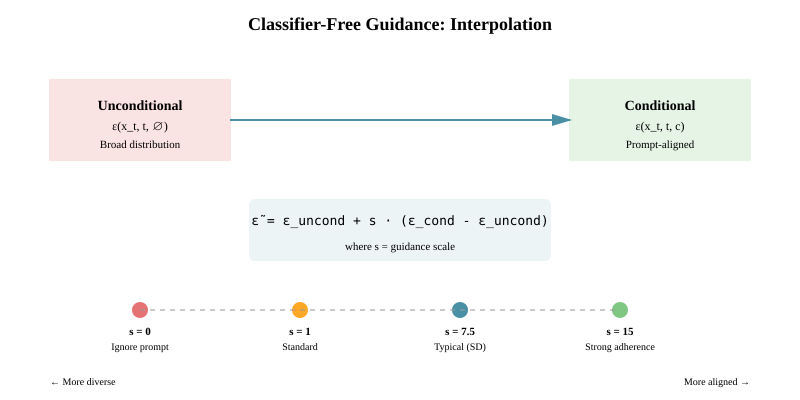
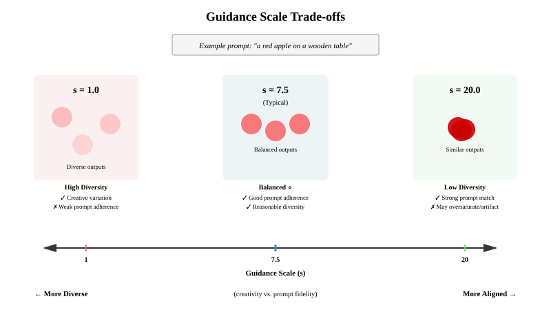
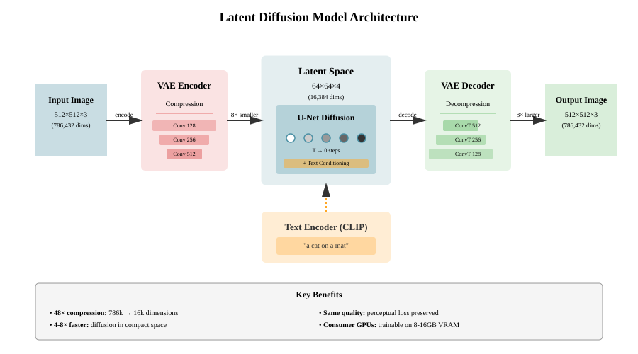

# Chapter 26: Advanced Diffusion Topics

This chapter explores advanced techniques in diffusion models, building on the fundamentals covered in previous chapters. We focus on key innovations that have made diffusion models practical for production use, including classifier-free guidance, latent diffusion, conditioning mechanisms, and recent advances like flow matching. We also cover discrete diffusion for language modeling.

For foundational diffusion concepts, see [Diffusion Model Fundamentals](24-diffusion-fundamentals.md) and [Implementing Diffusion Models](25-diffusion-implementation.md).

## Table of Contents

1. [Classifier-Free Guidance (CFG)](#classifier-free-guidance-cfg)
2. [Latent Diffusion Models](#latent-diffusion-models)
   - [Stable Diffusion Architecture](#stable-diffusion-architecture)
   - [VAE Encoder/Decoder](#vae-encoderdecoder)
3. [Noise Schedulers](#noise-schedulers)
   - [DDPM Scheduler](#ddpm-scheduler)
   - [DDIM Scheduler](#ddim-scheduler)
4. [Conditioning Mechanisms](#conditioning-mechanisms)
   - [Text Conditioning](#text-conditioning)
   - [Cross-Attention for Conditioning](#cross-attention-for-conditioning)
   - [Image Conditioning](#image-conditioning)
5. [Evaluation Metrics](#evaluation-metrics)
   - [Frechet Inception Distance (FID)](#frechet-inception-distance-fid)
   - [CLIP Score](#clip-score)
   - [Inception Score (IS)](#inception-score-is)
6. [Recent Advances](#recent-advances)
   - [Flow Matching](#flow-matching)
   - [Rectified Flows](#rectified-flows)
   - [Consistency Models](#consistency-models)
   - [State-of-the-Art Production Techniques](#state-of-the-art-production-techniques)
     - [SDXL](#sdxl-stable-diffusion-xl)
     - [EDM](#edm-elucidating-diffusion-models)
     - [DPM-Solver++](#dpm-solver-fast-high-quality-sampling)
7. [Diffusion for Language Models](#diffusion-for-language-models)
   - [Discrete Diffusion](#discrete-diffusion)
   - [Continuous Relaxations](#continuous-relaxations)
8. [Putting It All Together](#putting-it-all-together)

---

## Classifier-Free Guidance (CFG)

Classifier-Free Guidance (CFG) is a technique for steering diffusion models toward conditional generation without requiring a separate classifier. It has become the standard approach for conditional diffusion models.

### The Problem with Classifier Guidance

Original classifier guidance (Dhariwal & Nichol, 2021) required training a separate noise-robust classifier $p_\phi(y|x_t)$ to guide the diffusion process:

```math
\nabla_{x_t} \log p(x_t|y) = \nabla_{x_t} \log p(x_t) + s \cdot \nabla_{x_t} \log p_\phi(y|x_t)
```

where $s$ is the guidance scale.

**Problems:**

- Requires training a separate classifier on noisy images
- Classifier must be noise-robust across all timesteps
- Additional computational cost and complexity

### Classifier-Free Guidance Solution

Classifier-Free Guidance (Ho & Salimans, 2021) eliminates the need for a separate classifier by training a single conditional model that can perform both conditional and unconditional generation.

**Key Insight:** Train one model that learns both:

- Conditional distribution: $\epsilon_\theta(x_t, t, c)$ (with condition $c$)
- Unconditional distribution: $\epsilon_\theta(x_t, t, \emptyset)$ (without condition)

During sampling, interpolate between conditional and unconditional predictions:

```math
\tilde{\epsilon}_\theta(x_t, t, c) = \epsilon_\theta(x_t, t, \emptyset) + s \cdot (\epsilon_\theta(x_t, t, c) - \epsilon_\theta(x_t, t, \emptyset))
```

where:

- $s$ is the guidance scale (typically 7.5 for Stable Diffusion)
- $s = 0$: unconditional generation
- $s = 1$: standard conditional generation
- $s > 1$: stronger adherence to condition (at cost of diversity)

**Mathematical Intuition:**

The CFG formulation approximates:

```math
\nabla_{x_t} \log p(x_t|c) \approx \nabla_{x_t} \log p(x_t) + s \cdot (\nabla_{x_t} \log p(x_t|c) - \nabla_{x_t} \log p(x_t))
```

This pushes the sample toward the conditional distribution while moving away from the unconditional distribution.



The diagram above illustrates how CFG interpolates between unconditional and conditional predictions. The guidance scale $s$ controls the strength of this interpolation, with higher values pushing the output closer to the conditional prediction at the cost of diversity.



Different guidance scale values produce different trade-offs:

- **Low scale (s=1)**: High diversity but weak prompt adherence
- **Medium scale (s=7.5)**: Balanced between diversity and prompt fidelity (typical for Stable Diffusion)
- **High scale (s=20)**: Strong prompt adherence but may produce oversaturated images or artifacts

### Implementation

```python
import torch
import torch.nn as nn
from typing import Optional

class ClassifierFreeGuidanceMixin:
    """
    Mixin for classifier-free guidance in diffusion models.

    During training:

    - Randomly drop condition with probability p_uncond
    - Model learns both conditional and unconditional distributions

    During sampling:

    - Compute both conditional and unconditional predictions
    - Interpolate with guidance scale

    """

    def __init__(self, p_uncond: float = 0.1):
        """
        Args:
            p_uncond: Probability of unconditional training (typically 0.1)
        """
        self.p_uncond = p_uncond

    def apply_cfg_training(
        self,
        condition: torch.Tensor,
        training: bool = True
    ) -> torch.Tensor:
        """
        Apply dropout to condition during training.

        Args:
            condition: Conditioning tensor [batch, ...]
            training: Whether in training mode

        Returns:
            Condition with random samples set to null condition
        """
        if not training:
            return condition

        # Create mask for unconditional samples
        batch_size = condition.shape[0]
        mask = torch.rand(batch_size, device=condition.device) < self.p_uncond

        # Replace masked conditions with zeros (null condition)
        # In practice, you might use a learned null embedding
        masked_condition = condition.clone()
        masked_condition[mask] = 0

        return masked_condition

    def apply_cfg_sampling(
        self,
        noise_pred_fn,
        x_t: torch.Tensor,
        t: torch.Tensor,
        condition: torch.Tensor,
        guidance_scale: float = 7.5,
        null_condition: Optional[torch.Tensor] = None
    ) -> torch.Tensor:
        """
        Apply classifier-free guidance during sampling.

        Args:
            noise_pred_fn: Function that predicts noise given (x_t, t, c)
            x_t: Noisy input at timestep t
            t: Current timestep
            condition: Conditioning tensor
            guidance_scale: Guidance strength (s in formula)
            null_condition: Explicit null condition (default: zeros)

        Returns:
            Guided noise prediction
        """
        if guidance_scale == 1.0:
            # Standard conditional generation, no guidance
            return noise_pred_fn(x_t, t, condition)

        # Prepare null condition
        if null_condition is None:
            null_condition = torch.zeros_like(condition)

        # Compute unconditional prediction
        noise_uncond = noise_pred_fn(x_t, t, null_condition)

        # Compute conditional prediction
        noise_cond = noise_pred_fn(x_t, t, condition)

        # Apply classifier-free guidance
        noise_pred = noise_uncond + guidance_scale * (noise_cond - noise_uncond)

        return noise_pred


class ConditionalUNet(nn.Module):
    """
    Example U-Net with classifier-free guidance support.

    This is a simplified version - production models like Stable Diffusion
    use more sophisticated architectures with attention and cross-attention.
    """

    def __init__(
        self,
        in_channels: int = 3,
        out_channels: int = 3,
        cond_dim: int = 768,  # e.g., CLIP embedding dimension
        base_channels: int = 128,
        p_uncond: float = 0.1
    ):
        super().__init__()
        self.p_uncond = p_uncond

        # Simplified U-Net encoder
        self.enc1 = nn.Conv2d(in_channels, base_channels, 3, padding=1)
        self.enc2 = nn.Conv2d(base_channels, base_channels * 2, 3, padding=1)

        # Condition projection
        self.cond_proj = nn.Linear(cond_dim, base_channels * 2)

        # Time embedding
        self.time_mlp = nn.Sequential(
            nn.Linear(base_channels, base_channels * 2),
            nn.SiLU(),
            nn.Linear(base_channels * 2, base_channels * 2)
        )

        # Simplified decoder
        self.dec1 = nn.Conv2d(base_channels * 2, base_channels, 3, padding=1)
        self.dec2 = nn.Conv2d(base_channels, out_channels, 3, padding=1)

    def forward(
        self,
        x: torch.Tensor,
        t: torch.Tensor,
        condition: torch.Tensor,
        return_dict: bool = False
    ) -> torch.Tensor:
        """
        Forward pass with conditioning.

        Args:
            x: Input tensor [batch, channels, height, width]
            t: Timestep [batch]
            condition: Conditioning tensor [batch, cond_dim]
            return_dict: Whether to return dictionary (for compatibility)

        Returns:
            Noise prediction
        """
        # Apply CFG training (randomly drop condition)
        if self.training:
            condition = self._apply_cfg_training(condition)

        # Time embedding
        t_emb = self._get_timestep_embedding(t, self.enc1.out_channels)
        t_emb = self.time_mlp(t_emb)

        # Condition embedding
        c_emb = self.cond_proj(condition)

        # Combine time and condition
        emb = t_emb + c_emb

        # Simplified U-Net forward
        h = self.enc1(x)
        h = h + emb.unsqueeze(-1).unsqueeze(-1)
        h = self.enc2(h)
        h = self.dec1(h)
        out = self.dec2(h)

        return out

    def _apply_cfg_training(self, condition: torch.Tensor) -> torch.Tensor:
        """Apply unconditional training dropout."""
        batch_size = condition.shape[0]
        mask = torch.rand(batch_size, device=condition.device) < self.p_uncond
        masked_condition = condition.clone()
        masked_condition[mask] = 0
        return masked_condition

    def _get_timestep_embedding(self, timesteps: torch.Tensor, dim: int) -> torch.Tensor:
        """Sinusoidal timestep embeddings."""
        half_dim = dim // 2
        emb = torch.log(torch.tensor(10000.0)) / (half_dim - 1)
        emb = torch.exp(torch.arange(half_dim, device=timesteps.device) * -emb)
        emb = timesteps[:, None] * emb[None, :]
        emb = torch.cat([torch.sin(emb), torch.cos(emb)], dim=-1)
        return emb


def cfg_sampling_example():
    """Example of classifier-free guidance sampling."""
    import torch.nn.functional as F

    # Setup
    model = ConditionalUNet()
    model.eval()

    # Initialize from noise
    x = torch.randn(1, 3, 64, 64)
    condition = torch.randn(1, 768)  # e.g., CLIP text embedding

    # Sampling parameters
    num_steps = 50
    guidance_scale = 7.5

    # DDPM sampling with CFG
    for i in reversed(range(num_steps)):
        t = torch.tensor([i])

        # Predict noise with CFG
        with torch.no_grad():
            # Unconditional prediction
            noise_uncond = model(x, t, torch.zeros_like(condition))

            # Conditional prediction
            noise_cond = model(x, t, condition)

            # Apply guidance
            noise_pred = noise_uncond + guidance_scale * (noise_cond - noise_uncond)

        # Denoise step (simplified)
        alpha_t = 1 - i / num_steps
        x = (x - (1 - alpha_t) * noise_pred) / torch.sqrt(torch.tensor(alpha_t))

    return x
```

**Key Papers:**

- [Classifier-Free Diffusion Guidance](https://arxiv.org/abs/2207.12598) (Ho & Salimans, 2022)
- [Diffusion Models Beat GANs on Image Synthesis](https://arxiv.org/abs/2105.05233) (Dhariwal & Nichol, 2021) - Original classifier guidance

---

## Latent Diffusion Models

Latent Diffusion Models (LDMs) perform diffusion in a compressed latent space rather than directly in pixel space. This is the key innovation behind Stable Diffusion.

### Motivation

**Pixel-Space Diffusion Problems:**

1. **Computational Cost**: High-resolution images require massive compute
   - 1024×1024 RGB image = 3.1M dimensions
   - Each denoising step processes all pixels
2. **Memory**: Storing intermediate states is expensive
3. **Redundancy**: Natural images have high redundancy

**Latent Diffusion Solution:**

- Train VAE to compress images to latent space (4-8× smaller)
- Run diffusion in latent space
- Decode final latent to pixel space

**Benefits:**

- 4-8× faster than pixel diffusion
- Same quality with much less compute
- Can train on consumer GPUs

### Stable Diffusion Architecture

Stable Diffusion consists of three main components:

1. **VAE (Variational Autoencoder)**: Compress images to/from latent space
2. **U-Net**: Diffusion model operating in latent space
3. **Text Encoder**: CLIP for text conditioning



The architecture above shows the complete Latent Diffusion pipeline:

- **VAE Encoder** compresses the 512×512×3 image (786k dimensions) to a 64×64×4 latent (16k dimensions) - a 48× reduction
- **U-Net** performs diffusion in this compact latent space, conditioned on text embeddings from CLIP
- **VAE Decoder** reconstructs the final image from the denoised latent
- This approach is 4-8× faster than pixel-space diffusion while maintaining the same quality

```python
import torch
import torch.nn as nn
import torch.nn.functional as F

class LatentDiffusionModel(nn.Module):
    """
    Latent Diffusion Model architecture (Stable Diffusion style).

    Components:

    1. VAE encoder: Image → Latent (compression)
    2. U-Net: Diffusion in latent space
    3. VAE decoder: Latent → Image (decompression)
    4. Text encoder: Text → Embeddings (conditioning)

    Latent space is typically 8× smaller per dimension:

    - 512×512 image → 64×64×4 latent
    - Compression ratio: 8×8×3/4 = 48×

    """

    def __init__(
        self,
        vae_encoder,
        vae_decoder,
        unet,
        text_encoder,
        latent_channels: int = 4,
        scaling_factor: float = 0.18215
    ):
        super().__init__()
        self.vae_encoder = vae_encoder
        self.vae_decoder = vae_decoder
        self.unet = unet
        self.text_encoder = text_encoder
        self.scaling_factor = scaling_factor

    @torch.no_grad()
    def encode_image(self, image: torch.Tensor) -> torch.Tensor:
        """
        Encode image to latent space.

        Args:
            image: [batch, 3, height, width] in range [-1, 1]

        Returns:
            Latent: [batch, 4, height//8, width//8]
        """
        # VAE encoder outputs mean and log_variance
        posterior = self.vae_encoder(image)
        latent = posterior.sample()

        # Scale latent (important for stable training)
        latent = latent * self.scaling_factor

        return latent

    @torch.no_grad()
    def decode_latent(self, latent: torch.Tensor) -> torch.Tensor:
        """
        Decode latent to image space.

        Args:
            latent: [batch, 4, height//8, width//8]

        Returns:
            Image: [batch, 3, height, width]
        """
        # Unscale latent
        latent = latent / self.scaling_factor

        # VAE decoder
        image = self.vae_decoder(latent)

        return image

    @torch.no_grad()
    def encode_text(self, text_tokens: torch.Tensor) -> torch.Tensor:
        """
        Encode text to conditioning embeddings.

        Args:
            text_tokens: [batch, seq_len] token IDs

        Returns:
            Text embeddings: [batch, seq_len, embed_dim]
        """
        return self.text_encoder(text_tokens)

    def forward(
        self,
        latent: torch.Tensor,
        t: torch.Tensor,
        text_embeddings: torch.Tensor
    ) -> torch.Tensor:
        """
        Predict noise in latent space.

        Args:
            latent: Noisy latent [batch, 4, h, w]
            t: Timestep [batch]
            text_embeddings: Text conditioning [batch, seq_len, dim]

        Returns:
            Predicted noise [batch, 4, h, w]
        """
        return self.unet(latent, t, text_embeddings)

    @torch.no_grad()
    def generate(
        self,
        prompt: str,
        height: int = 512,
        width: int = 512,
        num_inference_steps: int = 50,
        guidance_scale: float = 7.5,
        generator: Optional[torch.Generator] = None
    ) -> torch.Tensor:
        """
        Generate image from text prompt.

        This is a simplified version of Stable Diffusion's pipeline.
        """
        # 1. Encode text
        text_tokens = self._tokenize(prompt)
        text_embeddings = self.encode_text(text_tokens)

        # 2. Also get unconditional embeddings for CFG
        uncond_tokens = self._tokenize("")
        uncond_embeddings = self.encode_text(uncond_tokens)

        # 3. Initialize latent from noise
        latent_h, latent_w = height // 8, width // 8
        latent = torch.randn(
            (1, 4, latent_h, latent_w),
            generator=generator,
            device=text_embeddings.device
        )

        # 4. Denoising loop
        for t in self.scheduler.timesteps:
            # Expand latent for CFG (unconditional + conditional)
            latent_model_input = torch.cat([latent, latent] * 2)

            # Predict noise
            noise_pred = self.unet(
                latent_model_input,
                t,
                torch.cat([uncond_embeddings, text_embeddings])
            )

            # Perform CFG
            noise_pred_uncond, noise_pred_text = noise_pred.chunk(2)
            noise_pred = noise_pred_uncond + guidance_scale * (
                noise_pred_text - noise_pred_uncond
            )

            # Denoise step
            latent = self.scheduler.step(noise_pred, t, latent)

        # 5. Decode latent to image
        image = self.decode_latent(latent)

        return image
```

### VAE Encoder/Decoder

The VAE compresses images to a lower-dimensional latent space while preserving perceptual quality.

```python
class VAEEncoder(nn.Module):
    """
    VAE Encoder for Latent Diffusion.

    Architecture (simplified):

    - Series of downsampling blocks (conv + downsample)
    - ResNet blocks at each resolution
    - Final conv to latent distribution parameters

    Stable Diffusion uses 4 downsampling stages:
    512×512 → 256×256 → 128×128 → 64×64 → 64×64
    (Last stage doesn't downsample spatially)
    """

    def __init__(
        self,
        in_channels: int = 3,
        latent_channels: int = 4,
        base_channels: int = 128,
        channel_multipliers: tuple = (1, 2, 4, 4)
    ):
        super().__init__()

        # Initial convolution
        self.conv_in = nn.Conv2d(in_channels, base_channels, 3, padding=1)

        # Downsampling blocks
        self.down_blocks = nn.ModuleList()
        channels = base_channels

        for i, mult in enumerate(channel_multipliers):
            out_channels = base_channels * mult

            # ResNet block
            self.down_blocks.append(
                ResnetBlock(channels, out_channels)
            )

            # Downsample (except last layer)
            if i < len(channel_multipliers) - 1:
                self.down_blocks.append(Downsample(out_channels))

            channels = out_channels

        # Middle blocks
        self.mid_block1 = ResnetBlock(channels, channels)
        self.mid_attn = AttentionBlock(channels)
        self.mid_block2 = ResnetBlock(channels, channels)

        # Output projection to latent distribution
        self.norm_out = nn.GroupNorm(32, channels)
        self.conv_out = nn.Conv2d(channels, 2 * latent_channels, 3, padding=1)

    def forward(self, x: torch.Tensor) -> 'DiagonalGaussianDistribution':
        """
        Encode image to latent distribution.

        Args:
            x: Image tensor [batch, 3, height, width]

        Returns:
            Posterior distribution over latents
        """
        # Initial conv
        h = self.conv_in(x)

        # Downsample
        for block in self.down_blocks:
            h = block(h)

        # Middle
        h = self.mid_block1(h)
        h = self.mid_attn(h)
        h = self.mid_block2(h)

        # Output
        h = self.norm_out(h)
        h = F.silu(h)
        h = self.conv_out(h)

        # Split into mean and log_variance
        return DiagonalGaussianDistribution(h)


class VAEDecoder(nn.Module):
    """
    VAE Decoder for Latent Diffusion.

    Mirror of encoder with upsampling instead of downsampling.
    """

    def __init__(
        self,
        latent_channels: int = 4,
        out_channels: int = 3,
        base_channels: int = 128,
        channel_multipliers: tuple = (1, 2, 4, 4)
    ):
        super().__init__()

        # Input projection
        channels = base_channels * channel_multipliers[-1]
        self.conv_in = nn.Conv2d(latent_channels, channels, 3, padding=1)

        # Middle blocks
        self.mid_block1 = ResnetBlock(channels, channels)
        self.mid_attn = AttentionBlock(channels)
        self.mid_block2 = ResnetBlock(channels, channels)

        # Upsampling blocks
        self.up_blocks = nn.ModuleList()

        for i, mult in enumerate(reversed(channel_multipliers)):
            out_channels = base_channels * mult

            # ResNet block
            self.up_blocks.append(
                ResnetBlock(channels, out_channels)
            )

            # Upsample (except last layer)
            if i < len(channel_multipliers) - 1:
                self.up_blocks.append(Upsample(out_channels))

            channels = out_channels

        # Output
        self.norm_out = nn.GroupNorm(32, channels)
        self.conv_out = nn.Conv2d(channels, out_channels, 3, padding=1)

    def forward(self, z: torch.Tensor) -> torch.Tensor:
        """
        Decode latent to image.

        Args:
            z: Latent tensor [batch, 4, height, width]

        Returns:
            Image [batch, 3, height*8, width*8]
        """
        # Input
        h = self.conv_in(z)

        # Middle
        h = self.mid_block1(h)
        h = self.mid_attn(h)
        h = self.mid_block2(h)

        # Upsample
        for block in self.up_blocks:
            h = block(h)

        # Output
        h = self.norm_out(h)
        h = F.silu(h)
        h = self.conv_out(h)

        return h


class DiagonalGaussianDistribution:
    """
    Diagonal Gaussian distribution for VAE latent.

    The encoder outputs parameters of a Gaussian distribution.
    During training, we sample from this distribution (reparameterization trick).
    During inference, we can use the mean or sample.
    """

    def __init__(self, parameters: torch.Tensor):
        """
        Args:
            parameters: [batch, 2*latent_dim, height, width]
                       First half is mean, second half is log_variance
        """
        self.mean, self.logvar = torch.chunk(parameters, 2, dim=1)
        self.logvar = torch.clamp(self.logvar, -30.0, 20.0)
        self.std = torch.exp(0.5 * self.logvar)

    def sample(self, generator: Optional[torch.Generator] = None) -> torch.Tensor:
        """Sample from the distribution using reparameterization trick."""
        # z = μ + σ * ε, where ε ~ N(0, 1)
        epsilon = torch.randn(
            self.mean.shape,
            generator=generator,
            device=self.mean.device,
            dtype=self.mean.dtype
        )
        return self.mean + self.std * epsilon

    def mode(self) -> torch.Tensor:
        """Return the mode (mean) of the distribution."""
        return self.mean

    def kl(self, other: 'DiagonalGaussianDistribution' = None) -> torch.Tensor:
        """
        Compute KL divergence.

        If other is None, compute KL(self || N(0,1))
        """
        if other is None:
            # KL(N(μ, σ²) || N(0, 1)) = 0.5 * (μ² + σ² - 1 - log(σ²))
            return 0.5 * torch.sum(
                self.mean ** 2 + self.std ** 2 - 1.0 - self.logvar,
                dim=[1, 2, 3]
            )
        else:
            # KL between two Gaussians
            return 0.5 * torch.sum(
                (self.mean - other.mean) ** 2 / other.std ** 2

                + self.std ** 2 / other.std ** 2
                - 1.0
                - self.logvar
                + other.logvar,

                dim=[1, 2, 3]
            )


# Helper modules
class ResnetBlock(nn.Module):
    """ResNet block with GroupNorm and skip connection."""

    def __init__(self, in_channels: int, out_channels: int):
        super().__init__()
        self.norm1 = nn.GroupNorm(32, in_channels)
        self.conv1 = nn.Conv2d(in_channels, out_channels, 3, padding=1)
        self.norm2 = nn.GroupNorm(32, out_channels)
        self.conv2 = nn.Conv2d(out_channels, out_channels, 3, padding=1)

        # Skip connection
        if in_channels != out_channels:
            self.skip = nn.Conv2d(in_channels, out_channels, 1)
        else:
            self.skip = nn.Identity()

    def forward(self, x: torch.Tensor) -> torch.Tensor:
        h = self.norm1(x)
        h = F.silu(h)
        h = self.conv1(h)
        h = self.norm2(h)
        h = F.silu(h)
        h = self.conv2(h)
        return h + self.skip(x)


class Downsample(nn.Module):
    """Downsample by factor of 2 using strided convolution."""

    def __init__(self, channels: int):
        super().__init__()
        self.conv = nn.Conv2d(channels, channels, 3, stride=2, padding=1)

    def forward(self, x: torch.Tensor) -> torch.Tensor:
        return self.conv(x)


class Upsample(nn.Module):
    """Upsample by factor of 2 using nearest neighbor + convolution."""

    def __init__(self, channels: int):
        super().__init__()
        self.conv = nn.Conv2d(channels, channels, 3, padding=1)

    def forward(self, x: torch.Tensor) -> torch.Tensor:
        x = F.interpolate(x, scale_factor=2.0, mode='nearest')
        return self.conv(x)


class AttentionBlock(nn.Module):
    """Self-attention block for spatial features."""

    def __init__(self, channels: int, num_heads: int = 1):
        super().__init__()
        self.norm = nn.GroupNorm(32, channels)
        self.qkv = nn.Conv2d(channels, channels * 3, 1)
        self.proj = nn.Conv2d(channels, channels, 1)
        self.num_heads = num_heads

    def forward(self, x: torch.Tensor) -> torch.Tensor:
        batch, channels, height, width = x.shape

        # Normalize
        h = self.norm(x)

        # QKV
        qkv = self.qkv(h)
        q, k, v = qkv.chunk(3, dim=1)

        # Reshape for attention
        q = q.view(batch, self.num_heads, channels // self.num_heads, height * width)
        k = k.view(batch, self.num_heads, channels // self.num_heads, height * width)
        v = v.view(batch, self.num_heads, channels // self.num_heads, height * width)

        # Attention
        scale = (channels // self.num_heads) ** -0.5
        attn = torch.softmax(torch.einsum('bhci,bhcj->bhij', q, k) * scale, dim=-1)
        h = torch.einsum('bhij,bhcj->bhci', attn, v)

        # Reshape back
        h = h.reshape(batch, channels, height, width)
        h = self.proj(h)

        return x + h
```

**Key Papers:**

- [High-Resolution Image Synthesis with Latent Diffusion Models](https://arxiv.org/abs/2112.10752) (Rombach et al., 2022) - Stable Diffusion
- [Auto-Encoding Variational Bayes](https://arxiv.org/abs/1312.6114) (Kingma & Welling, 2013) - VAE

---

## Noise Schedulers

Noise schedulers control how noise is added during training and removed during sampling. The choice of scheduler significantly impacts both training dynamics and generation quality.

### DDPM Scheduler

The DDPM (Denoising Diffusion Probabilistic Model) scheduler is the original diffusion scheduler.

**The Problem Being Solved:**

Noise schedulers determine how noise is added during training and removed during sampling. The choice of schedule critically impacts:

1. **Training stability**: Poor schedules lead to mode collapse or training instability
2. **Sample quality**: Different noise levels capture different frequency information
3. **Sampling efficiency**: Some schedules enable faster sampling with fewer steps

**Theoretical Justification:**

The noise schedule is controlled by the variance schedule $\beta_t$, which determines the forward diffusion process:

```math
q(x_t|x_{t-1}) = \mathcal{N}(x_{t}; \sqrt{1-\beta_t}x_{t-1}, \beta_t I)
```

The cumulative effect is characterized by $\bar{\alpha}_t = \prod_{s=1}^t (1-\beta_s)$, which allows us to sample $x_t$ directly from $x_0$:

```math
q(x_t|x_0) = \mathcal{N}(x_{t}; \sqrt{\bar{\alpha}_t}x_0, (1-\bar{\alpha}_t)I)
```

This enables efficient training by sampling any timestep directly without iterating through all previous steps.

**How This Relates to Alternatives:**

- **Linear Schedule**: Original DDPM approach, simple but suboptimal at extreme timesteps
- **Cosine Schedule**: Improved DDPM (Nichol & Dhariwal 2021), more uniform signal-to-noise ratio
- **Scaled Linear**: Used in Stable Diffusion, balances between linear and cosine
- **Learned Schedules**: Some recent work learns $\beta_t$ but adds complexity

**Key Insights:**

1. **Signal-to-Noise Ratio (SNR)**: Good schedules maintain reasonable SNR across timesteps
   - Linear schedule has too little noise early, too much late
   - Cosine schedule provides more uniform SNR distribution

2. **Precomputed Values**: We precompute $\bar{\alpha}_t$, $\sqrt{\bar{\alpha}_t}$, etc. to:
   - Avoid redundant computation during training
   - Enable direct sampling at any timestep $t$
   - Simplify the training objective to pure noise prediction

3. **Posterior Variance**: The scheduler also defines the posterior $q(x_{t-1}|x_t, x_0)$ variance:


   ```math
\tilde{\beta}_t = \frac{1-\bar{\alpha}_{t-1}}{1-\bar{\alpha}_t}\beta_t
```

   This is crucial for proper sampling dynamics.

```python
import torch
import torch.nn as nn

class DDPMScheduler:
    """
    DDPM noise scheduler for diffusion models.

    Implements the noise schedule and sampling procedures from
    "Denoising Diffusion Probabilistic Models" (Ho et al., 2020).

    Key components:

    - Beta schedule: Controls noise level at each timestep
    - Alpha_bar: Cumulative product for efficient noise addition
    - Sampling: Step-by-step denoising

    Args:
        num_train_timesteps: Number of diffusion steps (typically 1000)
        beta_start: Starting beta value
        beta_end: Ending beta value
        beta_schedule: Schedule type ('linear', 'cosine', 'scaled_linear')
    """

    def __init__(
        self,
        num_train_timesteps: int = 1000,
        beta_start: float = 0.0001,
        beta_end: float = 0.02,
        beta_schedule: str = "linear"
    ):
        self.num_train_timesteps = num_train_timesteps

        # Generate beta schedule
        if beta_schedule == "linear":
            self.betas = torch.linspace(beta_start, beta_end, num_train_timesteps)
        elif beta_schedule == "scaled_linear":
            # Used by Stable Diffusion
            self.betas = torch.linspace(
                beta_start ** 0.5, beta_end ** 0.5, num_train_timesteps
            ) ** 2
        elif beta_schedule == "cosine":
            self.betas = self._cosine_beta_schedule(num_train_timesteps)
        else:
            raise ValueError(f"Unknown beta schedule: {beta_schedule}")

        # Precompute values for training and sampling
        self.alphas = 1.0 - self.betas
        self.alphas_cumprod = torch.cumprod(self.alphas, dim=0)
        self.alphas_cumprod_prev = torch.cat([
            torch.tensor([1.0]),
            self.alphas_cumprod[:-1]
        ])

        # For q(x_t | x_0) - efficient training
        self.sqrt_alphas_cumprod = torch.sqrt(self.alphas_cumprod)
        self.sqrt_one_minus_alphas_cumprod = torch.sqrt(1.0 - self.alphas_cumprod)

        # For q(x_{t-1} | x_t, x_0) - sampling
        self.sqrt_recip_alphas = torch.sqrt(1.0 / self.alphas)
        self.posterior_variance = (
            self.betas * (1.0 - self.alphas_cumprod_prev) / (1.0 - self.alphas_cumprod)
        )

        # Timesteps for sampling
        self.timesteps = torch.arange(num_train_timesteps - 1, -1, -1)

    def _cosine_beta_schedule(self, timesteps: int, s: float = 0.008) -> torch.Tensor:
        """
        Cosine schedule as proposed in "Improved Denoising Diffusion Probabilistic Models".

        More uniform noise distribution across timesteps.
        """
        steps = timesteps + 1
        x = torch.linspace(0, timesteps, steps)
        alphas_cumprod = torch.cos(((x / timesteps) + s) / (1 + s) * torch.pi * 0.5) ** 2
        alphas_cumprod = alphas_cumprod / alphas_cumprod[0]
        betas = 1 - (alphas_cumprod[1:] / alphas_cumprod[:-1])
        return torch.clamp(betas, 0.0001, 0.9999)

    def add_noise(
        self,
        original_samples: torch.Tensor,
        noise: torch.Tensor,
        timesteps: torch.Tensor
    ) -> torch.Tensor:
        """
        Add noise to samples according to noise schedule.

        Implements: x_t = sqrt(alpha_bar_t) * x_0 + sqrt(1 - alpha_bar_t) * epsilon

        Args:
            original_samples: Original images/latents [batch, ...]
            noise: Gaussian noise [batch, ...]
            timesteps: Timestep indices [batch]

        Returns:
            Noisy samples x_t
        """
        # Get coefficients
        sqrt_alpha_prod = self.sqrt_alphas_cumprod[timesteps]
        sqrt_one_minus_alpha_prod = self.sqrt_one_minus_alphas_cumprod[timesteps]

        # Reshape for broadcasting
        while len(sqrt_alpha_prod.shape) < len(original_samples.shape):
            sqrt_alpha_prod = sqrt_alpha_prod.unsqueeze(-1)
            sqrt_one_minus_alpha_prod = sqrt_one_minus_alpha_prod.unsqueeze(-1)

        # Add noise
        noisy_samples = (
            sqrt_alpha_prod * original_samples +
            sqrt_one_minus_alpha_prod * noise
        )

        return noisy_samples

    def step(
        self,
        model_output: torch.Tensor,
        timestep: int,
        sample: torch.Tensor,
        generator: torch.Generator = None
    ) -> torch.Tensor:
        """
        Reverse diffusion step: x_t -> x_{t-1}

        Args:
            model_output: Predicted noise from model
            timestep: Current timestep t
            sample: Current sample x_t
            generator: Random generator for sampling

        Returns:
            Denoised sample x_{t-1}
        """
        t = timestep

        # Get schedule values
        beta_t = self.betas[t]
        sqrt_one_minus_alpha_bar_t = self.sqrt_one_minus_alphas_cumprod[t]
        sqrt_recip_alpha_t = self.sqrt_recip_alphas[t]

        # Predict x_0 from x_t and predicted noise
        # x_0 = (x_t - sqrt(1 - alpha_bar_t) * epsilon) / sqrt(alpha_bar_t)
        pred_original_sample = (
            sample - sqrt_one_minus_alpha_bar_t * model_output
        ) / self.sqrt_alphas_cumprod[t]

        # Compute x_{t-1} mean
        # μ = sqrt(alpha_t) * (1 - alpha_bar_{t-1}) / (1 - alpha_bar_t) * x_t
        #   + sqrt(alpha_bar_{t-1}) * beta_t / (1 - alpha_bar_t) * x_0
        pred_sample_mean = (
            sqrt_recip_alpha_t * (
                sample - beta_t / sqrt_one_minus_alpha_bar_t * model_output
            )
        )

        # Add noise (except at t=0)
        if t > 0:
            noise = torch.randn(
                sample.shape,
                generator=generator,
                device=sample.device,
                dtype=sample.dtype
            )
            variance = torch.sqrt(self.posterior_variance[t]) * noise
            pred_sample = pred_sample_mean + variance
        else:
            pred_sample = pred_sample_mean

        return pred_sample

    def set_timesteps(self, num_inference_steps: int):
        """
        Set timesteps for inference (can use fewer steps than training).

        Args:
            num_inference_steps: Number of steps for sampling
        """
        # Uniform spacing
        step_ratio = self.num_train_timesteps // num_inference_steps
        self.timesteps = torch.arange(
            self.num_train_timesteps - 1, -1, -step_ratio
        )


class DDIMScheduler(DDPMScheduler):
    """
    DDIM (Denoising Diffusion Implicit Models) scheduler.

    Allows deterministic sampling and can use much fewer steps than DDPM
    while maintaining quality.

    Key difference from DDPM:

    - Deterministic (no noise added during sampling)
    - Supports arbitrary timestep schedules
    - Can interpolate in latent space

    Reference: Song et al., "Denoising Diffusion Implicit Models" (2021)
    """

    def __init__(
        self,
        num_train_timesteps: int = 1000,
        beta_start: float = 0.0001,
        beta_end: float = 0.02,
        beta_schedule: str = "linear"
    ):
        super().__init__(num_train_timesteps, beta_start, beta_end, beta_schedule)

    def step(
        self,
        model_output: torch.Tensor,
        timestep: int,
        sample: torch.Tensor,
        eta: float = 0.0,
        generator: torch.Generator = None
    ) -> torch.Tensor:
        """
        DDIM sampling step.

        Args:
            model_output: Predicted noise
            timestep: Current timestep
            sample: Current sample
            eta: Stochasticity parameter (0 = deterministic, 1 = DDPM)
            generator: Random generator

        Returns:
            Previous sample x_{t-1}
        """
        # Get current and previous alpha values
        alpha_prod_t = self.alphas_cumprod[timestep]

        # Find previous timestep
        prev_timestep = timestep - self.num_train_timesteps // len(self.timesteps)
        if prev_timestep >= 0:
            alpha_prod_t_prev = self.alphas_cumprod[prev_timestep]
        else:
            alpha_prod_t_prev = torch.tensor(1.0)

        beta_prod_t = 1 - alpha_prod_t
        beta_prod_t_prev = 1 - alpha_prod_t_prev

        # Predict x_0
        pred_original_sample = (
            sample - torch.sqrt(beta_prod_t) * model_output
        ) / torch.sqrt(alpha_prod_t)

        # Compute variance
        variance = (beta_prod_t_prev / beta_prod_t) * (1 - alpha_prod_t / alpha_prod_t_prev)
        std_dev_t = eta * torch.sqrt(variance)

        # Compute direction to x_t
        pred_sample_direction = torch.sqrt(1 - alpha_prod_t_prev - std_dev_t ** 2) * model_output

        # Compute x_{t-1}
        prev_sample = (
            torch.sqrt(alpha_prod_t_prev) * pred_original_sample +
            pred_sample_direction
        )

        # Add noise if eta > 0
        if eta > 0 and timestep > 0:
            noise = torch.randn(
                model_output.shape,
                generator=generator,
                device=model_output.device,
                dtype=model_output.dtype
            )
            prev_sample = prev_sample + std_dev_t * noise

        return prev_sample


def scheduler_comparison_example():
    """
    Example comparing DDPM and DDIM schedulers.
    """
    # Setup
    model = load_diffusion_model()

    # DDPM: Slower but high quality
    ddpm_scheduler = DDPMScheduler(num_train_timesteps=1000)
    ddpm_scheduler.set_timesteps(50)  # 50 inference steps

    # DDIM: Faster, deterministic
    ddim_scheduler = DDIMScheduler(num_train_timesteps=1000)
    ddim_scheduler.set_timesteps(25)  # Only 25 steps needed!

    # Sample with DDPM
    x = torch.randn(1, 3, 64, 64)
    for t in ddpm_scheduler.timesteps:
        with torch.no_grad():
            noise_pred = model(x, t)
        x = ddpm_scheduler.step(noise_pred, t, x)

    print("DDPM: 50 steps, stochastic")

    # Sample with DDIM (deterministic, faster)
    x = torch.randn(1, 3, 64, 64)
    for t in ddim_scheduler.timesteps:
        with torch.no_grad():
            noise_pred = model(x, t)
        x = ddim_scheduler.step(noise_pred, t, x, eta=0.0)  # eta=0 for deterministic

    print("DDIM: 25 steps, deterministic")
```

**Scheduler Comparison:**

| Scheduler | Steps | Deterministic | Speed | Quality | Use Case |
|-----------|-------|---------------|-------|---------|----------|
| DDPM | 100-1000 | No | Slow | Excellent | Training, high quality |
| DDIM | 20-50 | Yes | Fast | Excellent | Inference, latent interpolation |
| DPM-Solver++ | 10-20 | Yes | Very Fast | Excellent | Production inference |
| Euler | 30-50 | No | Fast | Good | Quick sampling |

**Key Papers:**

- [Denoising Diffusion Probabilistic Models](https://arxiv.org/abs/2006.11239) (Ho et al., 2020) - DDPM
- [Denoising Diffusion Implicit Models](https://arxiv.org/abs/2010.02502) (Song et al., 2021) - DDIM
- [Improved Denoising Diffusion Probabilistic Models](https://arxiv.org/abs/2102.09672) (Nichol & Dhariwal, 2021) - Cosine schedule

---

## Conditioning Mechanisms

### Text Conditioning

Text conditioning allows generating images from text descriptions. The key is to encode text into a representation the diffusion model can use.

**CLIP Text Encoder:**

Stable Diffusion uses OpenAI's CLIP text encoder to convert text to embeddings:

```python
class CLIPTextEncoder(nn.Module):
    """
    CLIP text encoder for conditioning.

    CLIP (Contrastive Language-Image Pre-training) learns aligned
    text and image representations. We use only the text encoder.

    Architecture:

    - Token embedding
    - Positional embedding
    - Transformer encoder (12 layers for CLIP-ViT-L)
    - Final layer norm and projection

    Output: [batch, seq_len, 768] for ViT-L
    """

    def __init__(
        self,
        vocab_size: int = 49408,
        max_position_embeddings: int = 77,
        embed_dim: int = 768,
        num_heads: int = 12,
        num_layers: int = 12
    ):
        super().__init__()

        # Embeddings
        self.token_embedding = nn.Embedding(vocab_size, embed_dim)
        self.position_embedding = nn.Embedding(max_position_embeddings, embed_dim)

        # Transformer encoder
        self.layers = nn.ModuleList([
            CLIPEncoderLayer(embed_dim, num_heads)
            for _ in range(num_layers)
        ])

        self.final_layer_norm = nn.LayerNorm(embed_dim)

    def forward(
        self,
        input_ids: torch.Tensor,
        attention_mask: Optional[torch.Tensor] = None
    ) -> torch.Tensor:
        """
        Encode text tokens.

        Args:
            input_ids: Token IDs [batch, seq_len]
            attention_mask: Mask for padding [batch, seq_len]

        Returns:
            Text embeddings [batch, seq_len, embed_dim]
        """
        seq_len = input_ids.shape[1]

        # Token embeddings
        x = self.token_embedding(input_ids)

        # Add positional embeddings
        positions = torch.arange(seq_len, device=input_ids.device)
        x = x + self.position_embedding(positions)

        # Transformer layers
        for layer in self.layers:
            x = layer(x, attention_mask)

        # Final norm
        x = self.final_layer_norm(x)

        return x


class CLIPEncoderLayer(nn.Module):
    """Single transformer layer for CLIP encoder."""

    def __init__(self, embed_dim: int, num_heads: int):
        super().__init__()
        self.self_attn = nn.MultiheadAttention(
            embed_dim, num_heads, batch_first=True
        )
        self.layer_norm1 = nn.LayerNorm(embed_dim)
        self.mlp = nn.Sequential(
            nn.Linear(embed_dim, embed_dim * 4),
            nn.GELU(),
            nn.Linear(embed_dim * 4, embed_dim)
        )
        self.layer_norm2 = nn.LayerNorm(embed_dim)

    def forward(
        self,
        x: torch.Tensor,
        attention_mask: Optional[torch.Tensor] = None
    ) -> torch.Tensor:
        # Self-attention with residual
        residual = x
        x = self.layer_norm1(x)
        x, _ = self.self_attn(x, x, x, key_padding_mask=attention_mask)
        x = residual + x

        # MLP with residual
        residual = x
        x = self.layer_norm2(x)
        x = self.mlp(x)
        x = residual + x

        return x
```

### Cross-Attention for Conditioning

The U-Net uses cross-attention to incorporate text conditioning at each layer.

**The Problem Being Solved:**

How do we condition image generation on text in a way that:

1. **Preserves spatial structure**: Different image regions should attend to different text concepts
2. **Scales efficiently**: Must work for high-resolution images and long text sequences
3. **Is learnable**: The model should learn which text features are relevant for which image regions
4. **Integrates smoothly**: Must fit into existing U-Net architectures without breaking them

Simple concatenation or element-wise addition doesn't allow fine-grained, learned relationships between text and image features.

**Theoretical Justification:**

Cross-attention provides a **differentiable routing mechanism** that lets the model learn which text features should influence which image features.

**Mathematical Formulation:**

Self-attention (within image features):

```math
\text{Attention}(Q, K, V) = \text{softmax}\left(\frac{QK^T}{\sqrt{d}}\right)V
```

where $Q, K, V$ all come from image features.

Cross-attention (image conditioned on text):

```math
\text{CrossAttention}(Q, K, V) = \text{softmax}\left(\frac{QK^T}{\sqrt{d}}\right)V
```

where:

- $Q$ comes from image features (queries) - "what does this image region need?"
- $K, V$ come from text embeddings (keys, values) - "what text concepts are available?"

This allows each image feature to attend to relevant parts of the text.

The attention weight $\alpha_{ij} = \text{softmax}(\frac{q_i^T k_j}{\sqrt{d}})$ represents how much image location $i$ should attend to text token $j$.

**How This Relates to Alternatives:**

1. **Concatenation Conditioning**: Simply concatenate text embedding to input
   - Cannot learn position-specific text-image relationships
   - Doubles the channel count throughout the network
   - Used in simpler models (e.g., DALL-E 1's VQ-VAE)

2. **Adaptive Layer Normalization (AdaLN)**: Scale and shift after normalization
   - Used in DiT (Diffusion Transformers)
   - Less expressive than cross-attention for complex text
   - More parameter-efficient

3. **FiLM (Feature-wise Linear Modulation)**: Affine transformation per channel
   - Similar to AdaLN, less flexible
   - Cannot capture multi-modal text distributions

4. **Cross-Attention (Stable Diffusion)**: Most flexible
   - Can learn arbitrary text-image alignments
   - Allows visualization of attention maps
   - Industry standard for text-to-image

**Key Insights:**

1. **Queries from Images, Keys/Values from Text**: This asymmetry is crucial:
   - Image features "ask" for what they need (queries)
   - Text provides information to draw from (keys/values)
   - Reversing this would mean text asking images for information (wrong direction)

2. **Multiple Attention Heads**: Using multi-head attention allows:
   - Different heads to capture different text-image relationships
   - Some heads focus on objects, others on style, colors, composition
   - Improves expressiveness without quadratic complexity growth

3. **Hierarchical Application**: Cross-attention at multiple U-Net resolutions:
   - High-resolution features attend to fine-grained text details
   - Low-resolution features attend to global semantic concepts
   - This multi-scale conditioning is critical for coherent generation

4. **Gradient Flow**: Cross-attention provides clean gradient paths:
   - Text encoder receives gradients about what information is useful
   - Image features learn what to ask for
   - Enables end-to-end training (though text encoder usually frozen)

```python
class CrossAttentionBlock(nn.Module):
    """
    Cross-attention block for conditioning U-Net on text.

    Architecture:

    1. Self-attention on image features
    2. Cross-attention from image to text
    3. Feed-forward network

    Each with residual connections and layer normalization.
    """

    def __init__(
        self,
        dim: int,
        context_dim: int,
        num_heads: int = 8,
        head_dim: int = 64
    ):
        super().__init__()

        inner_dim = num_heads * head_dim

        # Self-attention (image features)
        self.norm1 = nn.LayerNorm(dim)
        self.self_attn = nn.MultiheadAttention(
            dim, num_heads, batch_first=True
        )

        # Cross-attention (image → text)
        self.norm2 = nn.LayerNorm(dim)
        self.cross_attn = CrossAttention(dim, context_dim, num_heads, head_dim)

        # Feed-forward
        self.norm3 = nn.LayerNorm(dim)
        self.ff = nn.Sequential(
            nn.Linear(dim, dim * 4),
            nn.GELU(),
            nn.Linear(dim * 4, dim)
        )

    def forward(
        self,
        x: torch.Tensor,
        context: torch.Tensor
    ) -> torch.Tensor:
        """
        Apply cross-attention conditioning.

        Args:
            x: Image features [batch, height*width, dim]
            context: Text embeddings [batch, seq_len, context_dim]

        Returns:
            Conditioned features [batch, height*width, dim]
        """
        # Self-attention
        residual = x
        x = self.norm1(x)
        x, _ = self.self_attn(x, x, x)
        x = residual + x

        # Cross-attention
        residual = x
        x = self.norm2(x)
        x = self.cross_attn(x, context)
        x = residual + x

        # Feed-forward
        residual = x
        x = self.norm3(x)
        x = self.ff(x)
        x = residual + x

        return x


class CrossAttention(nn.Module):
    """
    Cross-attention layer.

    Implements: Attention(Q, K, V) where Q comes from one sequence
    and K, V come from another sequence.
    """

    def __init__(
        self,
        query_dim: int,
        context_dim: int,
        num_heads: int = 8,
        head_dim: int = 64
    ):
        super().__init__()

        inner_dim = num_heads * head_dim
        self.num_heads = num_heads
        self.head_dim = head_dim
        self.scale = head_dim ** -0.5

        # Projections
        self.to_q = nn.Linear(query_dim, inner_dim, bias=False)
        self.to_k = nn.Linear(context_dim, inner_dim, bias=False)
        self.to_v = nn.Linear(context_dim, inner_dim, bias=False)
        self.to_out = nn.Linear(inner_dim, query_dim)

    def forward(
        self,
        x: torch.Tensor,
        context: torch.Tensor
    ) -> torch.Tensor:
        """
        Args:
            x: Query tensor [batch, seq_len_q, query_dim]
            context: Context tensor [batch, seq_len_c, context_dim]

        Returns:
            Output [batch, seq_len_q, query_dim]
        """
        batch_size = x.shape[0]

        # Project to Q, K, V
        q = self.to_q(x)  # [batch, seq_len_q, inner_dim]
        k = self.to_k(context)  # [batch, seq_len_c, inner_dim]
        v = self.to_v(context)  # [batch, seq_len_c, inner_dim]

        # Reshape for multi-head attention
        # [batch, seq_len, num_heads, head_dim] -> [batch, num_heads, seq_len, head_dim]
        q = q.view(batch_size, -1, self.num_heads, self.head_dim).transpose(1, 2)
        k = k.view(batch_size, -1, self.num_heads, self.head_dim).transpose(1, 2)
        v = v.view(batch_size, -1, self.num_heads, self.head_dim).transpose(1, 2)

        # Attention: [batch, num_heads, seq_len_q, seq_len_c]
        attn = torch.matmul(q, k.transpose(-2, -1)) * self.scale
        attn = torch.softmax(attn, dim=-1)

        # Apply attention to values
        out = torch.matmul(attn, v)  # [batch, num_heads, seq_len_q, head_dim]

        # Reshape back
        out = out.transpose(1, 2).contiguous()
        out = out.view(batch_size, -1, self.num_heads * self.head_dim)

        # Output projection
        out = self.to_out(out)

        return out
```

### Image Conditioning

For tasks like inpainting, super-resolution, or image-to-image translation, we condition on input images.

**The Problem Being Solved:**

Text conditioning provides semantic guidance, but many applications require **spatial** conditioning:

1. **Inpainting**: Fill missing regions while preserving surrounding context
2. **Super-resolution**: Upscale while staying faithful to input
3. **Image-to-image translation**: Transform while preserving structure (e.g., sketch to photo)
4. **Controlled generation**: Follow specific spatial layouts (pose, edges, depth maps)

The challenge is to provide strong spatial conditioning without destroying the pretrained model's generative capabilities.

**Theoretical Justification:**

Image conditioning requires injecting spatial information at the right level of abstraction. We need the model to:

- **Respect** the conditioning signal (high fidelity to input structure)
- **Generalize** beyond the conditioning (fill in missing details)
- **Balance** between copying and generating

Different tasks require different levels of conditioning strength:

- **Strong conditioning** (ControlNet): Strict adherence to spatial structure (pose, edges)
- **Weak conditioning** (concatenation): Flexible interpretation (style transfer)

**Common Approaches:**

1. **Concatenation**: Concatenate input image with noisy latent
   - **Pros**: Simple, easy to train
   - **Cons**: Limited capacity, requires retraining from scratch
   - **Use case**: Simple tasks with similar input/output domains

2. **ControlNet**: Add parallel network for strong spatial conditioning
   - **Pros**: Preserves pretrained model, very strong spatial control
   - **Cons**: Adds parameters, slightly slower inference
   - **Use case**: Precise spatial control (pose, edges, depth)

3. **Adapter**: Lightweight conditioning module
   - **Pros**: Minimal parameters, fast
   - **Cons**: Less control than ControlNet
   - **Use case**: Fine-tuning for specific domains

**How ControlNet Relates to Alternatives:**

| Approach | Parameters | Training | Spatial Control | Pretrained Model |
|----------|------------|----------|-----------------|------------------|
| Concatenation | 0 extra | From scratch | Weak | Destroyed |
| Adapter | +5-10% | Fast | Medium | Preserved |
| ControlNet | +100% | Medium | Strong | Preserved |
| Fine-tuning | 0 extra | Slow | Weak | Modified |

**Key Insights:**

1. **Zero Convolutions**: ControlNet uses zero-initialized convolutions
   - At initialization, ControlNet has **zero impact** on outputs
   - Allows smooth training without destabilizing pretrained model
   - Gradually learns to add conditioning signal

2. **Copy-and-Train Architecture**: ControlNet clones encoder
   - Processes conditioning signal through copied U-Net encoder
   - Adds outputs to main U-Net at corresponding layers
   - Leverages pretrained features for interpreting conditioning

3. **Latent Space Conditioning**: For Stable Diffusion-style models
   - Conditioning images are encoded to latent space first
   - Concatenation happens in 64×64 latent space, not 512×512 pixel space
   - 64× fewer spatial dimensions to process

4. **Multi-Condition Composability**: ControlNets can be combined
   - Train separate ControlNets for pose, edges, depth
   - At inference, use multiple simultaneously
   - Weighted combination provides fine control

```python
class ImageConditionedUNet(nn.Module):
    """
    U-Net with image conditioning via concatenation.

    Used for:

    - Inpainting: Concatenate masked image + mask
    - Super-resolution: Concatenate low-resolution image
    - Image-to-image: Concatenate source image

    """

    def __init__(
        self,
        in_channels: int = 4,  # Latent channels
        cond_channels: int = 4,  # Conditioning image channels
        out_channels: int = 4,
        base_channels: int = 320
    ):
        super().__init__()

        # Input accepts both noisy latent and conditioning
        total_in_channels = in_channels + cond_channels

        self.conv_in = nn.Conv2d(total_in_channels, base_channels, 3, padding=1)

        # Rest of U-Net architecture...
        # (Similar to standard U-Net but with doubled input channels)

    def forward(
        self,
        x: torch.Tensor,
        t: torch.Tensor,
        cond_image: torch.Tensor,
        text_embeddings: Optional[torch.Tensor] = None
    ) -> torch.Tensor:
        """
        Args:
            x: Noisy latent [batch, 4, h, w]
            t: Timestep [batch]
            cond_image: Conditioning image latent [batch, 4, h, w]
            text_embeddings: Optional text conditioning

        Returns:
            Predicted noise [batch, 4, h, w]
        """
        # Concatenate noisy input with conditioning
        x = torch.cat([x, cond_image], dim=1)

        # Process through U-Net
        return self.unet_forward(x, t, text_embeddings)


class ControlNet(nn.Module):
    """
    ControlNet for strong spatial conditioning.

    Key idea: Create a trainable copy of the U-Net encoder that
    processes the conditioning signal. Add its outputs to the
    main U-Net at corresponding layers.

    Benefits:

    - Precise spatial control (e.g., pose, edges, depth)
    - Preserves pretrained model quality
    - Fast to train (only trains ControlNet, freezes main model)

    Reference: Zhang et al., "Adding Conditional Control to Text-to-Image
    Diffusion Models" (2023)
    """

    def __init__(
        self,
        base_unet: nn.Module,
        conditioning_channels: int = 3
    ):
        super().__init__()

        # Frozen pretrained model
        self.base_unet = base_unet
        for param in self.base_unet.parameters():
            param.requires_grad = False

        # Get encoder channel counts from base U-Net
        encoder_channels = self._get_encoder_channels(base_unet)

        # Trainable copy of encoder (ControlNet)
        self.control_encoder = self._clone_encoder(base_unet)

        # Zero-initialized projections to add to U-Net
        # (Zero initialization ensures no impact at start of training)
        self.zero_convs = nn.ModuleList([
            self._make_zero_conv(channels)
            for channels in encoder_channels
        ])

        # Input processing for conditioning
        # Converts conditioning input (e.g., Canny edges) to latent space
        self.input_hint_block = nn.Sequential(
            nn.Conv2d(conditioning_channels, 16, 3, padding=1),
            nn.SiLU(),
            nn.Conv2d(16, 32, 3, padding=1),
            nn.SiLU(),
            nn.Conv2d(32, 64, 3, padding=1),
            nn.SiLU(),
            nn.Conv2d(64, encoder_channels[0], 3, padding=1)  # Match first encoder channel
        )

    def forward(
        self,
        x: torch.Tensor,
        t: torch.Tensor,
        conditioning: torch.Tensor,
        **kwargs
    ) -> torch.Tensor:
        """
        Args:
            x: Noisy latent
            t: Timestep
            conditioning: Conditioning signal (e.g., Canny edges, pose)

        Returns:
            Predicted noise
        """
        # Process conditioning through ControlNet
        cond_features = self.input_hint_block(conditioning)
        control_outputs = self.control_encoder(x + cond_features, t)

        # Apply zero convolutions
        control_outputs = [
            zero_conv(feat) for zero_conv, feat in zip(self.zero_convs, control_outputs)
        ]

        # Run base U-Net with control additions
        return self.base_unet(x, t, control_features=control_outputs, **kwargs)

    @staticmethod
    def _make_zero_conv(channels: int) -> nn.Module:
        """Create zero-initialized 1x1 convolution."""
        conv = nn.Conv2d(channels, channels, 1)
        nn.init.zeros_(conv.weight)
        nn.init.zeros_(conv.bias)
        return conv

    def _get_encoder_channels(self, unet: nn.Module) -> list[int]:
        """
        Extract channel counts from U-Net encoder blocks.

        Args:
            unet: Base U-Net model

        Returns:
            List of channel counts at each encoder level
        """
        # This depends on your U-Net architecture
        # For Stable Diffusion-style U-Net, typical channels are:
        # [320, 640, 1280, 1280] for 4 downsampling levels

        # If the U-Net has a 'down_blocks' attribute
        if hasattr(unet, 'down_blocks'):
            channels = []
            for block in unet.down_blocks:
                # Get number of output channels from first conv in block
                if hasattr(block, 'resnets'):
                    channels.append(block.resnets[0].out_channels)
                elif hasattr(block, 'conv'):
                    channels.append(block.conv.out_channels)
            return channels

        # Default fallback for simplified example
        # Adjust based on your actual U-Net architecture
        return [320, 640, 1280, 1280]

    def _clone_encoder(self, unet: nn.Module) -> nn.Module:
        """
        Create a trainable copy of the U-Net encoder.

        Args:
            unet: Base U-Net model

        Returns:
            Cloned encoder (trainable copy)
        """
        import copy

        # Clone the entire U-Net
        encoder = copy.deepcopy(unet)

        # Keep only encoder parts, remove decoder
        # This depends on your U-Net structure
        # For a typical U-Net with 'down_blocks' and 'up_blocks':
        if hasattr(encoder, 'up_blocks'):
            encoder.up_blocks = nn.ModuleList()  # Remove decoder

        # Ensure all parameters are trainable
        for param in encoder.parameters():
            param.requires_grad = True

        return encoder
```

**Key Papers:**

- [Learning Transferable Visual Models From Natural Language Supervision](https://arxiv.org/abs/2103.00020) (Radford et al., 2021) - CLIP
- [Adding Conditional Control to Text-to-Image Diffusion Models](https://arxiv.org/abs/2302.05543) (Zhang et al., 2023) - ControlNet

---

## Evaluation Metrics

Evaluating diffusion models requires specialized metrics beyond simple pixel-wise comparisons. Here we cover the most important metrics used in research and production.

### Frechet Inception Distance (FID)

FID measures the distance between distributions of generated and real images in a feature space.

**Mathematical Formulation:**

Given real images $x_r$ and generated images $x_g$, extract features using a pretrained InceptionV3 network:

- $\mu_r, \Sigma_r$: Mean and covariance of real image features
- $\mu_g, \Sigma_g$: Mean and covariance of generated image features

```math
\text{FID} = \|\mu_r - \mu_g\|^2 + \text{Tr}(\Sigma_r + \Sigma_g - 2(\Sigma_r \Sigma_g)^{1/2})
```

**Properties:**

- Lower is better (0 = perfect match)
- Captures both quality and diversity
- Requires many samples (typically 10k-50k)
- Sensitive to mode collapse

```python
import torch
import torch.nn as nn
import numpy as np
from scipy import linalg
from torchvision.models import inception_v3

class FIDScore:
    """
    Frechet Inception Distance (FID) for evaluating generative models.

    FID measures the distance between feature distributions of
    real and generated images using InceptionV3 features.

    Lower FID = better quality and diversity
    Typical values: 1-10 (excellent), 10-50 (good), >50 (poor)

    Reference: Heusel et al., "GANs Trained by a Two Time-Scale Update
    Rule Converge to a Local Nash Equilibrium" (2017)
    """

    def __init__(self, device='cuda'):
        self.device = device

        # Load pretrained InceptionV3
        self.inception = inception_v3(pretrained=True, transform_input=False)
        self.inception.fc = nn.Identity()  # Remove final layer
        self.inception.eval()
        self.inception.to(device)

    @torch.no_grad()
    def extract_features(self, images: torch.Tensor) -> np.ndarray:
        """
        Extract InceptionV3 features from images.

        Args:
            images: Images [batch, 3, 299, 299] in range [0, 1]

        Returns:
            Features [batch, 2048]
        """
        # Normalize to [-1, 1] (Inception expects this)
        images = images * 2 - 1

        features = []
        batch_size = 32

        for i in range(0, len(images), batch_size):
            batch = images[i:i+batch_size].to(self.device)
            feat = self.inception(batch)
            features.append(feat.cpu().numpy())

        return np.concatenate(features, axis=0)

    def calculate_statistics(self, features: np.ndarray) -> tuple:
        """
        Calculate mean and covariance of features.

        Args:
            features: Feature vectors [N, 2048]

        Returns:
            (mean, covariance)
        """
        mu = np.mean(features, axis=0)
        sigma = np.cov(features, rowvar=False)
        return mu, sigma

    def calculate_fid(
        self,
        mu_real: np.ndarray,
        sigma_real: np.ndarray,
        mu_gen: np.ndarray,
        sigma_gen: np.ndarray,
        eps: float = 1e-6
    ) -> float:
        """
        Calculate FID between two distributions.

        Args:
            mu_real: Mean of real features
            sigma_real: Covariance of real features
            mu_gen: Mean of generated features
            sigma_gen: Covariance of generated features
            eps: Small value for numerical stability

        Returns:
            FID score
        """
        # Calculate squared difference of means
        diff = mu_real - mu_gen

        # Calculate sqrt of product of covariances
        # Using scipy's sqrtm for matrix square root
        covmean, _ = linalg.sqrtm(sigma_real @ sigma_gen, disp=False)

        # Handle numerical errors (imaginary components)
        if np.iscomplexobj(covmean):
            covmean = covmean.real

        # FID formula
        fid = diff.dot(diff) + np.trace(sigma_real + sigma_gen - 2 * covmean)

        return float(fid)

    def compute_fid(
        self,
        real_images: torch.Tensor,
        generated_images: torch.Tensor
    ) -> float:
        """
        Compute FID between real and generated images.

        Args:
            real_images: Real images [N, 3, 299, 299]
            generated_images: Generated images [M, 3, 299, 299]

        Returns:
            FID score
        """
        # Extract features
        features_real = self.extract_features(real_images)
        features_gen = self.extract_features(generated_images)

        # Calculate statistics
        mu_real, sigma_real = self.calculate_statistics(features_real)
        mu_gen, sigma_gen = self.calculate_statistics(features_gen)

        # Calculate FID
        fid = self.calculate_fid(mu_real, sigma_real, mu_gen, sigma_gen)

        return fid


def fid_example():
    """Example of computing FID score."""
    fid_calculator = FIDScore()

    # Load or generate images (must be 299x299 for InceptionV3)
    real_images = torch.rand(1000, 3, 299, 299)  # Real dataset
    generated_images = torch.rand(1000, 3, 299, 299)  # Generated samples

    fid_score = fid_calculator.compute_fid(real_images, generated_images)
    print(f"FID Score: {fid_score:.2f}")
```

### CLIP Score

CLIP Score measures how well generated images match text prompts using OpenAI's CLIP model.

**Formulation:**

For image $I$ and text $T$:

```math
\text{CLIP-Score}(I, T) = \max(0, 100 \cdot \cos(\text{CLIP}_{I}(I), \text{CLIP}_{T}(T)))
```

where $\text{CLIP}_{I}$ and $\text{CLIP}_{T}$ are image and text encoders, and $\cos$ is cosine similarity.

```python
class CLIPScore:
    """
    CLIP Score for text-to-image generation evaluation.

    Measures alignment between generated images and text prompts.
    Higher scores indicate better text-image correspondence.

    Typical range: 0-100
    Good text alignment: >30

    Reference: Hessel et al., "CLIPScore: A Reference-free Evaluation
    Metric for Image Captioning" (2021)
    """

    def __init__(self, model_name='ViT-B/32', device='cuda'):
        """
        Args:
            model_name: CLIP model variant
            device: Device to run on
        """
        import clip

        self.device = device
        self.model, self.preprocess = clip.load(model_name, device=device)
        self.model.eval()

    @torch.no_grad()
    def compute_clip_score(
        self,
        images: torch.Tensor,
        texts: list[str]
    ) -> torch.Tensor:
        """
        Compute CLIP score between images and texts.

        Args:
            images: Images [batch, 3, H, W] in range [0, 1]
            texts: List of text prompts

        Returns:
            CLIP scores [batch]
        """
        import clip

        # Preprocess images
        # CLIP expects specific resolution (e.g., 224x224)
        images_preprocessed = torch.stack([
            self.preprocess(img) for img in images
        ]).to(self.device)

        # Tokenize texts
        text_tokens = clip.tokenize(texts).to(self.device)

        # Get embeddings
        image_features = self.model.encode_image(images_preprocessed)
        text_features = self.model.encode_text(text_tokens)

        # Normalize
        image_features = image_features / image_features.norm(dim=-1, keepdim=True)
        text_features = text_features / text_features.norm(dim=-1, keepdim=True)

        # Compute cosine similarity
        similarity = (image_features * text_features).sum(dim=-1)

        # Scale to 0-100
        clip_score = torch.clamp(100 * similarity, min=0)

        return clip_score

    def compute_average_score(
        self,
        images: torch.Tensor,
        texts: list[str]
    ) -> float:
        """
        Compute average CLIP score over batch.

        Args:
            images: Generated images
            texts: Corresponding prompts

        Returns:
            Mean CLIP score
        """
        scores = self.compute_clip_score(images, texts)
        return scores.mean().item()


def clip_score_example():
    """Example of computing CLIP score."""
    clip_scorer = CLIPScore()

    # Generate images with your model
    prompts = ["a photo of a cat", "a beautiful sunset"]
    images = torch.rand(2, 3, 512, 512)  # Your generated images

    score = clip_scorer.compute_average_score(images, prompts)
    print(f"Average CLIP Score: {score:.2f}")
```

### Inception Score (IS)

Inception Score measures quality and diversity of generated images.

**Formulation:**

```math
\text{IS} = \exp(\mathbb{E}_x[\text{KL}(p(y|x) \| p(y))])
```

where:

- $p(y|x)$: Class distribution for image $x$ (from InceptionV3)
- $p(y)$: Marginal class distribution

**Properties:**

- Higher is better
- Captures both quality (confident predictions) and diversity (varied classes)
- Biased toward ImageNet classes

```python
class InceptionScore:
    """
    Inception Score for generative model evaluation.

    Higher scores indicate:

    1. Quality: Each image has confident class prediction
    2. Diversity: Images span different classes

    Typical range: 1-10 for natural images
    Good score: >5 for general images

    Reference: Salimans et al., "Improved Techniques for Training GANs" (2016)
    """

    def __init__(self, device='cuda'):
        self.device = device
        self.inception = inception_v3(pretrained=True, transform_input=False)
        self.inception.eval()
        self.inception.to(device)

    @torch.no_grad()
    def compute_inception_score(
        self,
        images: torch.Tensor,
        splits: int = 10,
        batch_size: int = 32
    ) -> tuple[float, float]:
        """
        Compute Inception Score.

        Args:
            images: Images [N, 3, 299, 299] in range [0, 1]
            splits: Number of splits for computing std
            batch_size: Batch size for processing

        Returns:
            (mean_score, std_score)
        """
        N = len(images)

        # Get predictions
        preds = []
        for i in range(0, N, batch_size):
            batch = images[i:i+batch_size].to(self.device)
            batch = batch * 2 - 1  # Normalize to [-1, 1]
            pred = self.inception(batch)
            pred = torch.softmax(pred, dim=1)
            preds.append(pred.cpu().numpy())

        preds = np.concatenate(preds, axis=0)

        # Compute score for each split
        scores = []
        split_size = N // splits

        for i in range(splits):
            part = preds[i * split_size:(i + 1) * split_size]

            # p(y|x): predictions for each image
            py_x = part

            # p(y): marginal distribution
            py = np.mean(part, axis=0, keepdims=True)

            # KL divergence
            kl = part * (np.log(part + 1e-16) - np.log(py + 1e-16))
            kl = np.mean(np.sum(kl, axis=1))

            # IS = exp(E[KL])
            scores.append(np.exp(kl))

        return float(np.mean(scores)), float(np.std(scores))
```

### Other Important Metrics

**Precision and Recall:**

- Precision: What fraction of generated images are realistic?
- Recall: What fraction of real data modes are covered?

**Kernel Inception Distance (KID):**

- Similar to FID but uses polynomial kernel
- More robust to small sample sizes
- Unbiased estimator

**Human Evaluation:**

- Still gold standard for perceptual quality
- Common metrics:
  - Photorealism (1-5 scale)
  - Text alignment (for text-to-image)
  - Preference ratings (A vs B comparisons)

```python
def evaluate_diffusion_model_example():
    """
    Complete evaluation pipeline for a diffusion model.
    """
    # Initialize metrics
    fid_calculator = FIDScore()
    clip_scorer = CLIPScore()
    is_calculator = InceptionScore()

    # Generate samples
    model = load_your_model()

    # 1. FID Score (distribution quality)
    real_images = load_real_dataset(n=10000)
    generated_images = generate_samples(model, n=10000)
    fid = fid_calculator.compute_fid(real_images, generated_images)
    print(f"FID: {fid:.2f} (lower is better)")

    # 2. CLIP Score (text alignment for text-to-image)
    prompts = load_prompts()
    images = generate_from_prompts(model, prompts)
    clip_score = clip_scorer.compute_average_score(images, prompts)
    print(f"CLIP Score: {clip_score:.2f} (higher is better)")

    # 3. Inception Score (quality + diversity)
    is_mean, is_std = is_calculator.compute_inception_score(generated_images)
    print(f"IS: {is_mean:.2f} ± {is_std:.2f} (higher is better)")

    return {
        'fid': fid,
        'clip_score': clip_score,
        'inception_score': (is_mean, is_std)
    }
```

**Key Papers:**

- [GANs Trained by a Two Time-Scale Update Rule Converge to a Local Nash Equilibrium](https://arxiv.org/abs/1706.08500) (Heusel et al., 2017) - FID
- [CLIPScore: A Reference-free Evaluation Metric for Image Captioning](https://arxiv.org/abs/2104.08718) (Hessel et al., 2021)
- [Improved Techniques for Training GANs](https://arxiv.org/abs/1606.03498) (Salimans et al., 2016) - Inception Score

---

## Recent Advances

### Flow Matching

Flow Matching is an alternative to diffusion that learns to transform noise to data via continuous normalizing flows (CNFs).

**Key Differences from Diffusion:**

| Aspect | Diffusion | Flow Matching |
|--------|-----------|---------------|
| Forward process | Fixed (add noise) | Learned interpolation |
| Training objective | Denoising score matching | Regression to vector field |
| Sampling | DDPM/DDIM | ODE integration |
| Flexibility | Fixed noise schedule | Arbitrary paths |

**Mathematical Framework:**

Instead of a fixed diffusion process, Flow Matching learns a time-dependent vector field $v_t(x)$ such that:

```math
\frac{dx_t}{dt} = v_t(x_t)
```

with $x_0 \sim p_\text{data}$ and $x_1 \sim p_\text{noise}$.

**Training Objective:**

```math
\mathcal{L} = \mathbb{E}_{t, x_0, x_1}\left[\|v_\theta(x_t, t) - u_t(x_t|x_0, x_1)\|^2\right]
```

where $u_t$ is the conditional vector field from $x_1$ to $x_0$.

**Simple Flow Matching:**

For straight-line paths: $x_t = t x_1 + (1-t) x_0$

The target vector field is simply: $u_t = x_1 - x_0$

```python
class FlowMatching(nn.Module):
    """
    Flow Matching for generative modeling.

    Key advantages over diffusion:

    1. Simpler training (direct regression, no noise schedules)
    2. Faster sampling (fewer ODE steps needed)
    3. More flexible (can use any interpolation path)

    Reference: Lipman et al., "Flow Matching for Generative Modeling" (2023)
    """

    def __init__(
        self,
        vector_field_model: nn.Module,
        sigma: float = 0.0  # Optional noise for conditioning
    ):
        super().__init__()
        self.model = vector_field_model
        self.sigma = sigma

    def get_conditional_flow(
        self,
        x0: torch.Tensor,
        x1: torch.Tensor,
        t: float
    ) -> tuple[torch.Tensor, torch.Tensor]:
        """
        Compute conditional flow and target vector field.

        Uses straight-line interpolation:
        x_t = t * x1 + (1 - t) * x0 + σ * noise

        Args:
            x0: Data samples [batch, ...]
            x1: Noise samples [batch, ...]
            t: Time in [0, 1]

        Returns:
            (x_t, target_velocity)
        """
        # Interpolate
        x_t = t * x1 + (1 - t) * x0

        # Add optional Gaussian conditioning
        if self.sigma > 0:
            noise = torch.randn_like(x0)
            x_t = x_t + self.sigma * noise

        # Target vector field (derivative of path)
        # For straight line: dx_t/dt = x1 - x0
        u_t = x1 - x0

        return x_t, u_t

    def training_step(
        self,
        x0: torch.Tensor,
        x1: Optional[torch.Tensor] = None
    ) -> torch.Tensor:
        """
        Compute flow matching loss.

        Args:
            x0: Real data samples
            x1: Noise samples (if None, sample from N(0,1))

        Returns:
            Loss value
        """
        if x1 is None:
            x1 = torch.randn_like(x0)

        # Sample random time
        batch_size = x0.shape[0]
        t = torch.rand(batch_size, device=x0.device)

        # Get interpolated point and target
        x_t, u_t = self.get_conditional_flow(x0, x1, t.view(-1, 1, 1, 1))

        # Predict vector field
        v_pred = self.model(x_t, t)

        # MSE loss
        loss = F.mse_loss(v_pred, u_t)

        return loss

    @torch.no_grad()
    def sample(
        self,
        shape: tuple,
        num_steps: int = 100,
        method: str = 'euler'
    ) -> torch.Tensor:
        """
        Sample by integrating the learned vector field.

        Args:
            shape: Output shape
            num_steps: Number of integration steps
            method: 'euler' or 'rk4' (Runge-Kutta 4)

        Returns:
            Generated samples
        """
        # Start from noise
        x = torch.randn(shape, device=next(self.model.parameters()).device)

        dt = 1.0 / num_steps

        for i in range(num_steps):
            t = i / num_steps
            t_tensor = torch.full((shape[0],), t, device=x.device)

            if method == 'euler':
                # Euler integration: x_{t+dt} = x_t + dt * v_t
                v = self.model(x, t_tensor)
                x = x + dt * v

            elif method == 'rk4':
                # Runge-Kutta 4th order (more accurate, slower)
                k1 = self.model(x, t_tensor)
                k2 = self.model(x + 0.5 * dt * k1, t_tensor + 0.5 * dt)
                k3 = self.model(x + 0.5 * dt * k2, t_tensor + 0.5 * dt)
                k4 = self.model(x + dt * k3, t_tensor + dt)
                x = x + (dt / 6) * (k1 + 2*k2 + 2*k3 + k4)

        return x


class OptimalTransportConditionalFlowMatching(FlowMatching):
    """
    Optimal Transport Conditional Flow Matching (OT-CFM).

    Uses optimal transport to find better interpolation paths
    between noise and data. Leads to straighter paths and
    faster sampling.

    Reference: Tong et al., "Improving and Generalizing Flow-Based
    Generative Models with Minibatch Optimal Transport" (2023)
    """

    def __init__(self, vector_field_model: nn.Module, sigma: float = 0.0):
        super().__init__(vector_field_model, sigma)

    def compute_ot_plan(
        self,
        x0: torch.Tensor,
        x1: torch.Tensor
    ) -> torch.Tensor:
        """
        Compute optimal transport plan (simplified).

        In practice, use POT library or mini-batch OT.
        For mini-batches, can use simple bipartite matching.
        """
        # Simplified: Just match based on distance
        # Real implementation would use Sinkhorn or exact OT
        batch_size = x0.shape[0]

        # Compute pairwise distances
        x0_flat = x0.view(batch_size, -1)
        x1_flat = x1.view(batch_size, -1)

        cost = torch.cdist(x0_flat, x1_flat, p=2)

        # Find matching (greedy approximation)
        # Real OT would solve assignment problem properly
        indices = cost.argmin(dim=1)

        return indices

    def training_step(self, x0: torch.Tensor) -> torch.Tensor:
        """Training with OT matching."""
        # Sample noise
        x1 = torch.randn_like(x0)

        # Compute OT plan (matching)
        indices = self.compute_ot_plan(x0, x1)
        x1_matched = x1[indices]

        # Rest is same as standard flow matching
        return super().training_step(x0, x1_matched)
```

### Rectified Flows

Rectified Flows learn to "straighten" the probability flow, making sampling faster and more efficient.

**Key Idea:**

Standard diffusion/flow paths are curved. Rectified flows iteratively straighten these paths through "reflow" operations.

**Reflow Algorithm:**

1. Train initial flow matching model
2. Generate pairs $(x_0, x_1)$ by running the flow
3. Retrain on these pairs (which have straighter paths)
4. Repeat 2-3 until paths are nearly straight

**Benefits:**

- 1-step generation possible after rectification
- Better FID scores with fewer steps
- Simpler sampling (straight lines easier to integrate)

```python
class RectifiedFlow:
    """
    Rectified Flow - Straightening probability flows.

    Algorithm:

    1. Train flow matching model M_0
    2. For k = 1, 2, ...

       a. Sample x_0 ~ data, generate x_1 by running M_{k-1}
       b. Train M_k on straight paths from x_0 to x_1

    3. M_k has increasingly straight paths

    After enough reflows, can do 1-step generation!

    Reference: Liu et al., "Flow Straight and Fast: Learning to Generate
    and Transfer Data with Rectified Flow" (2023)
    """

    def __init__(self, model: nn.Module):
        self.model = model
        self.reflow_iterations = 0

    @torch.no_grad()
    def generate_reflow_data(
        self,
        data_samples: torch.Tensor,
        num_steps: int = 100
    ) -> tuple[torch.Tensor, torch.Tensor]:
        """
        Generate (x_0, x_1) pairs by running current flow.

        Args:
            data_samples: Real data x_0
            num_steps: Steps for ODE integration

        Returns:
            (x_0, x_1) pairs where x_1 is result of flowing x_0
        """
        x_0 = data_samples

        # Start from data, flow to noise
        x = x_0
        dt = 1.0 / num_steps

        for i in range(num_steps):
            t = i / num_steps
            t_tensor = torch.full((x.shape[0],), t, device=x.device)

            # Integrate backwards (data -> noise)
            v = self.model(x, t_tensor)
            x = x + dt * v

        x_1 = x

        return x_0, x_1

    def reflow_step(
        self,
        dataloader,
        num_epochs: int = 1
    ):
        """
        Perform one reflow iteration.

        1. Generate (x_0, x_1) pairs from current model
        2. Retrain on straight paths between them

        """
        print(f"Reflow iteration {self.reflow_iterations + 1}")

        # Generate reflow data
        all_x0 = []
        all_x1 = []

        for batch in dataloader:
            x_0, x_1 = self.generate_reflow_data(batch)
            all_x0.append(x_0)
            all_x1.append(x_1)

        # Retrain on straight paths
        flow_matcher = FlowMatching(self.model)

        for epoch in range(num_epochs):
            for x_0, x_1 in zip(all_x0, all_x1):
                loss = flow_matcher.training_step(x_0, x_1)
                # Optimization step...

        self.reflow_iterations += 1

    @torch.no_grad()
    def sample_one_step(self, noise: torch.Tensor) -> torch.Tensor:
        """
        One-step generation (only works well after rectification).

        After enough reflows, the path is nearly straight, so:
        x_0 ≈ x_1 + v(x_1, t=1)
        """
        t = torch.ones(noise.shape[0], device=noise.device)
        v = self.model(noise, t)
        return noise + v


def demonstrate_rectified_flow():
    """
    Demonstrate how path straightness improves with reflows.
    """
    import matplotlib.pyplot as plt

    # After 0 reflows: Curved paths, need 100 steps
    # After 1 reflow: Less curved, need 10 steps
    # After 2 reflows: Nearly straight, need 1-2 steps

    steps_needed = {
        'Initial': 100,
        'Reflow 1': 10,
        'Reflow 2': 2,
        'Reflow 3': 1
    }

    print("Sampling steps needed:")
    for name, steps in steps_needed.items():
        print(f"  {name}: {steps} steps")
```

### Consistency Models

Consistency Models learn to map any point on a diffusion trajectory directly to the origin (data).

**Key Insight:**

Standard diffusion requires many steps: $x_T \to x_{T-1} \to \cdots \to x_0$

Consistency models learn: $x_t \to x_0$ in one step (for any $t$).

**Consistency Property:**

```math
f_\theta(x_t, t) = f_\theta(x_{t'}, t') = x_0
```

for any $t, t'$ on the same trajectory.

```python
class ConsistencyModel(nn.Module):
    """
    Consistency Models for fast sampling.

    Key property: Maps any point on trajectory to origin
    f(x_t, t) = x_0 for all t

    Training:

    - Consistency Distillation: Distill from pretrained diffusion
    - Consistency Training: Train from scratch

    Inference:

    - 1-step: f(x_T, T) = x_0
    - Multi-step: Can still use multiple steps for quality

    Reference: Song et al., "Consistency Models" (2023)
    """

    def __init__(self, denoiser: nn.Module):
        super().__init__()
        self.denoiser = denoiser

    def forward(self, x_t: torch.Tensor, t: torch.Tensor) -> torch.Tensor:
        """
        Map x_t to x_0.

        Architecture ensures f(x, 0) = x (boundary condition)
        """
        # Skip connection at t=0
        skip_weight = self._skip_scaling(t)
        out_weight = self._output_scaling(t)

        # F(x, t) = c_skip(t) * x + c_out(t) * D(x, t)
        return skip_weight * x_t + out_weight * self.denoiser(x_t, t)

    def _skip_scaling(self, t: torch.Tensor) -> torch.Tensor:
        """Ensure f(x, 0) = x."""
        # Example: c_skip(0) = 1, c_skip(T) = 0
        return torch.exp(-t)

    def _output_scaling(self, t: torch.Tensor) -> torch.Tensor:
        """Scaling for denoiser output."""
        # Example: c_out(0) = 0, c_out(T) = 1
        return 1 - torch.exp(-t)

    @torch.no_grad()
    def sample_one_step(self, noise: torch.Tensor) -> torch.Tensor:
        """One-step generation from noise."""
        T = torch.ones(noise.shape[0], device=noise.device)
        return self.forward(noise, T)

    @torch.no_grad()
    def sample_multi_step(
        self,
        noise: torch.Tensor,
        num_steps: int = 4
    ) -> torch.Tensor:
        """
        Multi-step sampling for higher quality.

        Use consistency model as iterative denoiser.
        """
        x = noise

        for i in range(num_steps):
            t = (num_steps - i) / num_steps
            t_tensor = torch.full((x.shape[0],), t, device=x.device)
            x = self.forward(x, t_tensor)

        return x
```

### State-of-the-Art Production Techniques

Beyond research innovations, several production-ready techniques have emerged for improving diffusion model quality and efficiency.

#### SDXL: Stable Diffusion XL

SDXL (2023) represents the production evolution of Stable Diffusion with several architectural improvements.

**Key Innovations:**

1. **Dual Text Encoders**: Uses both CLIP ViT-L/14 and OpenCLIP ViT-bigG
2. **Larger U-Net**: 3× more parameters than SD 1.5
3. **Higher Resolution**: Native 1024×1024 generation
4. **Refinement Model**: Two-stage pipeline for enhanced quality
5. **Improved VAE**: Better color accuracy and fine details

```python
class SDXLTextEncoder(nn.Module):
    """
    SDXL dual text encoder architecture.

    Key insight: Different text encoders capture different aspects

    - CLIP ViT-L/14: General semantic understanding
    - OpenCLIP ViT-bigG: Detailed visual concepts

    Concatenating both provides richer conditioning.
    """

    def __init__(
        self,
        clip_model_name='ViT-L/14',
        openclip_model_name='ViT-bigG-14'
    ):
        super().__init__()

        # Two text encoders
        self.clip_encoder = CLIPTextEncoder()  # From earlier
        self.openclip_encoder = OpenCLIPTextEncoder()

        # CLIP outputs 768-dim, OpenCLIP outputs 1280-dim
        self.clip_dim = 768
        self.openclip_dim = 1280

    def forward(self, text_tokens: torch.Tensor) -> tuple[torch.Tensor, torch.Tensor]:
        """
        Encode text with both encoders.

        Args:
            text_tokens: Tokenized text [batch, seq_len]

        Returns:
            (clip_embeddings, openclip_embeddings)
            clip_embeddings: [batch, 77, 768]
            openclip_embeddings: [batch, 77, 1280]
        """
        clip_emb = self.clip_encoder(text_tokens)
        openclip_emb = self.openclip_encoder(text_tokens)

        return clip_emb, openclip_emb


class SDXLUNet(nn.Module):
    """
    SDXL U-Net with dual text conditioning.

    Modifications from SD 1.5:

    - Accepts concatenated dual text embeddings
    - Larger channel counts: [320, 640, 1280] → [320, 640, 1280, 1280]
    - More transformer blocks at each resolution
    - Micro-conditioning on resolution and crop coordinates

    """

    def __init__(
        self,
        in_channels: int = 4,
        out_channels: int = 4,
        base_channels: int = 320,
        channel_mult: tuple = (1, 2, 4, 4),
        cross_attention_dim: int = 2048  # 768 + 1280 from dual encoders
    ):
        super().__init__()

        # Simplified architecture
        self.conv_in = nn.Conv2d(in_channels, base_channels, 3, padding=1)

        # Cross-attention blocks accept concatenated text embeddings
        self.cross_attn_blocks = nn.ModuleList([
            CrossAttentionBlock(
                dim=base_channels * mult,
                context_dim=cross_attention_dim
            )
            for mult in channel_mult
        ])

        # Micro-conditioning: embed image resolution and crop coords
        self.micro_cond_proj = nn.Sequential(
            nn.Linear(6, 1280),  # (height, width, crop_top, crop_left, target_h, target_w)
            nn.SiLU(),
            nn.Linear(1280, 1280)
        )

    def forward(
        self,
        x: torch.Tensor,
        t: torch.Tensor,
        clip_embeddings: torch.Tensor,
        openclip_embeddings: torch.Tensor,
        micro_conds: Optional[torch.Tensor] = None
    ) -> torch.Tensor:
        """
        Forward pass with dual text conditioning.

        Args:
            x: Latent [batch, 4, h, w]
            t: Timestep [batch]
            clip_embeddings: CLIP text features [batch, 77, 768]
            openclip_embeddings: OpenCLIP text features [batch, 77, 1280]
            micro_conds: Resolution/crop conditioning [batch, 6]

        Returns:
            Predicted noise
        """
        # Concatenate text embeddings
        text_embeddings = torch.cat([clip_embeddings, openclip_embeddings], dim=-1)
        # [batch, 77, 2048]

        # Process through U-Net with cross-attention
        # (Simplified - actual implementation has full U-Net structure)
        h = self.conv_in(x)

        # Apply cross-attention
        for block in self.cross_attn_blocks:
            h = block(h, text_embeddings)

        # Add micro-conditioning if provided
        if micro_conds is not None:
            micro_emb = self.micro_cond_proj(micro_conds)
            # Add to time embedding (not shown in this simplified version)

        return h


class SDXLRefinementModel(nn.Module):
    """
    SDXL Refiner - second stage for quality enhancement.

    Pipeline:

    1. Base model generates 1024×1024 at lower quality (25-40 steps)
    2. Refiner enhances details (15-25 steps)

    The refiner is essentially another latent diffusion model
    trained on high-quality data with specific focus on fine details.
    """

    def __init__(self, base_model: nn.Module, refiner_unet: nn.Module):
        super().__init__()
        self.base_model = base_model
        self.refiner_unet = refiner_unet

    @torch.no_grad()
    def generate_with_refinement(
        self,
        prompt: str,
        base_steps: int = 40,
        refiner_steps: int = 20,
        base_guidance: float = 7.5,
        refiner_guidance: float = 7.5
    ) -> torch.Tensor:
        """
        Two-stage generation with base + refiner.

        Args:
            prompt: Text prompt
            base_steps: Steps for base model
            refiner_steps: Steps for refinement
            base_guidance: CFG scale for base
            refiner_guidance: CFG scale for refiner

        Returns:
            Refined image
        """
        # Stage 1: Generate with base model
        latent = self.base_model.generate(
            prompt,
            num_steps=base_steps,
            guidance_scale=base_guidance
        )

        # Stage 2: Refine
        # Add small amount of noise and denoise with refiner
        noise_level = 0.15  # Typical: 15% noise
        noise = torch.randn_like(latent) * noise_level
        noisy_latent = latent + noise

        refined_latent = self.refiner_unet.denoise(
            noisy_latent,
            prompt,
            num_steps=refiner_steps,
            guidance_scale=refiner_guidance
        )

        return refined_latent


def sdxl_generation_example():
    """Example of SDXL generation pipeline."""
    # Initialize components
    text_encoder = SDXLTextEncoder()
    unet = SDXLUNet()
    refiner = SDXLRefinementModel(...)

    prompt = "A majestic lion in the savanna at sunset, highly detailed"

    # Micro-conditioning: specify resolution and crop
    micro_conds = torch.tensor([[
        1024,  # target_height
        1024,  # target_width
        0,     # crop_top
        0,     # crop_left
        1024,  # original_height
        1024   # original_width
    ]])

    # Generate with base + refiner
    image = refiner.generate_with_refinement(
        prompt=prompt,
        base_steps=40,
        refiner_steps=20
    )

    return image
```

#### EDM: Elucidating Diffusion Models

EDM (Karras et al., 2022) provides a principled framework for diffusion model design through careful analysis of noise schedules and network preconditioning.

**Key Contributions:**

1. **Improved Noise Schedule**: Better distribution of noise levels
2. **Network Preconditioning**: Scale inputs/outputs for better training
3. **Deterministic Sampler**: ODE-based sampling with better quality-speed tradeoff

```python
class EDMPreconditioner(nn.Module):
    """
    EDM-style network preconditioning.

    Key insight: Proper input/output scaling improves training dynamics.

    Preconditioned network: F(x, σ) = c_skip(σ)·x + c_out(σ)·D(c_in(σ)·x, c_noise(σ))

    where c_skip, c_out, c_in, c_noise are carefully chosen scaling functions.
    """

    def __init__(
        self,
        denoiser: nn.Module,
        sigma_data: float = 0.5  # Dataset noise scale
    ):
        super().__init__()
        self.denoiser = denoiser
        self.sigma_data = sigma_data

    def c_skip(self, sigma: torch.Tensor) -> torch.Tensor:
        """Skip connection scaling."""
        return self.sigma_data ** 2 / (sigma ** 2 + self.sigma_data ** 2)

    def c_out(self, sigma: torch.Tensor) -> torch.Tensor:
        """Output scaling."""
        return sigma * self.sigma_data / torch.sqrt(sigma ** 2 + self.sigma_data ** 2)

    def c_in(self, sigma: torch.Tensor) -> torch.Tensor:
        """Input scaling."""
        return 1 / torch.sqrt(sigma ** 2 + self.sigma_data ** 2)

    def c_noise(self, sigma: torch.Tensor) -> torch.Tensor:
        """Noise level embedding."""
        return torch.log(sigma) / 4

    def forward(self, x: torch.Tensor, sigma: torch.Tensor) -> torch.Tensor:
        """
        Preconditioned denoising.

        Args:
            x: Noisy input [batch, channels, height, width]
            sigma: Noise level [batch]

        Returns:
            Denoised output
        """
        # Reshape sigma for broadcasting
        sigma = sigma.view(-1, 1, 1, 1)

        # Apply preconditioning
        c_skip_val = self.c_skip(sigma)
        c_out_val = self.c_out(sigma)
        c_in_val = self.c_in(sigma)
        c_noise_val = self.c_noise(sigma)

        # Preconditioned network
        return c_skip_val * x + c_out_val * self.denoiser(c_in_val * x, c_noise_val)


class EDMSampler:
    """
    EDM deterministic sampler with improved noise schedule.

    Uses second-order Heun's method for better quality.
    """

    def __init__(
        self,
        model: nn.Module,
        sigma_min: float = 0.002,
        sigma_max: float = 80.0,
        rho: float = 7.0
    ):
        self.model = model
        self.sigma_min = sigma_min
        self.sigma_max = sigma_max
        self.rho = rho

    def get_sigmas(self, num_steps: int) -> torch.Tensor:
        """
        Generate noise schedule.

        EDM uses a power-law schedule for better distribution.
        """
        ramp = torch.linspace(0, 1, num_steps)
        min_inv_rho = self.sigma_min ** (1 / self.rho)
        max_inv_rho = self.sigma_max ** (1 / self.rho)
        sigmas = (max_inv_rho + ramp * (min_inv_rho - max_inv_rho)) ** self.rho
        return torch.cat([sigmas, torch.zeros(1)])  # Append 0 for final step

    @torch.no_grad()
    def sample(
        self,
        shape: tuple,
        num_steps: int = 50,
        s_churn: float = 0.0  # Stochasticity control
    ) -> torch.Tensor:
        """
        Generate samples using EDM sampler.

        Uses Heun's method (second-order) for better quality than Euler.
        """
        # Initialize from noise
        x = torch.randn(shape) * self.sigma_max

        # Get noise schedule
        sigmas = self.get_sigmas(num_steps)

        for i in range(num_steps):
            sigma_cur = sigmas[i]
            sigma_next = sigmas[i + 1]

            # Optional: add noise for stochasticity
            if s_churn > 0:
                gamma = min(s_churn / num_steps, 2 ** 0.5 - 1)
                sigma_hat = sigma_cur * (1 + gamma)
                x = x + (sigma_hat ** 2 - sigma_cur ** 2) ** 0.5 * torch.randn_like(x)
            else:
                sigma_hat = sigma_cur

            # First-order step (Euler)
            denoised = self.model(x, sigma_hat)
            d = (x - denoised) / sigma_hat

            dt = sigma_next - sigma_hat
            x_next = x + d * dt

            # Second-order correction (Heun)
            if sigma_next != 0:
                denoised_next = self.model(x_next, sigma_next)
                d_next = (x_next - denoised_next) / sigma_next
                d_prime = (d + d_next) / 2
                x_next = x + d_prime * dt

            x = x_next

        return x
```

#### DPM-Solver++: Fast High-Quality Sampling

DPM-Solver++ is a fast ODE solver specifically designed for diffusion models, achieving high quality with 10-20 steps.

**Key Features:**

- Analytically solves parts of the ODE
- Multi-step predictor-corrector approach
- Works with any diffusion model (drop-in replacement)

```python
class DPMSolverPlusPlus:
    """
    DPM-Solver++: Fast and high-quality ODE solver for diffusion.

    Achieves similar quality to 100-step DDPM with only 10-20 steps.

    Key innovation: Analytically solve the linear part of the ODE,
    only approximate the non-linear part numerically.

    Reference: Lu et al., "DPM-Solver++: Fast Solver for Guided Sampling
    of Diffusion Probabilistic Models" (2023)
    """

    def __init__(
        self,
        model: nn.Module,
        noise_schedule: str = 'linear',
        algorithm_type: str = 'dpmsolver++'
    ):
        self.model = model
        self.noise_schedule = noise_schedule
        self.algorithm_type = algorithm_type

    def noise_pred_fn(
        self,
        x: torch.Tensor,
        t: torch.Tensor,
        condition: Optional[torch.Tensor] = None
    ) -> torch.Tensor:
        """Predict noise at timestep t."""
        return self.model(x, t, condition)

    def get_timesteps(
        self,
        num_steps: int,
        skip_type: str = 'time_uniform'
    ) -> torch.Tensor:
        """
        Generate timestep schedule.

        Args:
            num_steps: Number of sampling steps
            skip_type: How to skip timesteps ('time_uniform' or 'logSNR')

        Returns:
            Timesteps [num_steps + 1]
        """
        if skip_type == 'time_uniform':
            return torch.linspace(0, 1000, num_steps + 1)
        elif skip_type == 'logSNR':
            # Uniform in log-SNR space (better quality)
            t = torch.linspace(0, 1, num_steps + 1)
            return 1000 * t  # Simplified

    @torch.no_grad()
    def sample(
        self,
        shape: tuple,
        num_steps: int = 20,
        order: int = 2,  # 1, 2, or 3 (higher = better quality, slower)
        guidance_scale: float = 7.5,
        condition: Optional[torch.Tensor] = None
    ) -> torch.Tensor:
        """
        Sample using DPM-Solver++.

        Args:
            shape: Output shape
            num_steps: Number of steps (10-20 typically sufficient)
            order: Solver order (1=Euler, 2=Heun-like, 3=even better)
            guidance_scale: CFG scale
            condition: Conditioning information

        Returns:
            Generated samples
        """
        # Initialize
        x = torch.randn(shape)
        timesteps = self.get_timesteps(num_steps)

        # Noise prediction function with CFG
        def model_fn(x_t, t):
            if guidance_scale == 1.0 or condition is None:
                return self.noise_pred_fn(x_t, t, condition)

            # Classifier-free guidance
            noise_uncond = self.noise_pred_fn(x_t, t, None)
            noise_cond = self.noise_pred_fn(x_t, t, condition)
            return noise_uncond + guidance_scale * (noise_cond - noise_uncond)

        # Multi-step solver
        if order == 1:
            # First-order (Euler-like)
            for i in range(num_steps):
                t_cur = timesteps[i]
                t_next = timesteps[i + 1]

                noise_pred = model_fn(x, t_cur)
                x = self._first_order_update(x, noise_pred, t_cur, t_next)

        elif order == 2:
            # Second-order
            old_noise = None
            for i in range(num_steps):
                t_cur = timesteps[i]
                t_next = timesteps[i + 1]

                noise_pred = model_fn(x, t_cur)

                if i == 0 or old_noise is None:
                    # First step: use first-order
                    x = self._first_order_update(x, noise_pred, t_cur, t_next)
                else:
                    # Multi-step: use current and previous noise predictions
                    x = self._second_order_update(
                        x, noise_pred, old_noise, t_cur, t_next
                    )

                old_noise = noise_pred

        return x

    def _first_order_update(
        self,
        x: torch.Tensor,
        noise: torch.Tensor,
        t_cur: torch.Tensor,
        t_next: torch.Tensor
    ) -> torch.Tensor:
        """First-order update step (Euler method)."""
        # Simplified - actual implementation uses alpha_t, sigma_t
        lambda_cur = self._get_lambda(t_cur)
        lambda_next = self._get_lambda(t_next)

        h = lambda_next - lambda_cur
        x_next = (
            (torch.exp(h)) * x

            - (torch.exp(h) - 1.0) * noise

        )

        return x_next

    def _second_order_update(
        self,
        x: torch.Tensor,
        noise_cur: torch.Tensor,
        noise_prev: torch.Tensor,
        t_cur: torch.Tensor,
        t_next: torch.Tensor
    ) -> torch.Tensor:
        """Second-order multi-step update."""
        # Uses Adams-Bashforth-style multi-step predictor
        lambda_cur = self._get_lambda(t_cur)
        lambda_next = self._get_lambda(t_next)

        h = lambda_next - lambda_cur

        # Multi-step predictor with current and previous noise
        x_next = (
            torch.exp(h) * x

            - (torch.exp(h) - 1.0) * noise_cur
            - 0.5 * (torch.exp(h) - 1.0 - h) * (noise_cur - noise_prev)

        )

        return x_next

    def _get_lambda(self, t: torch.Tensor) -> torch.Tensor:
        """Get log-SNR (lambda) for timestep t."""
        # Simplified - depends on noise schedule
        # lambda_t = log(alpha_t / sigma_t)
        return torch.log(t + 1e-8)


def dpmsolver_example():
    """Example: Replace DDPM with DPM-Solver++ for 5-10× speedup."""
    model = load_diffusion_model()
    solver = DPMSolverPlusPlus(model)

    # High quality with only 20 steps (vs 100+ for DDPM)
    samples = solver.sample(
        shape=(4, 3, 256, 256),
        num_steps=20,
        order=2,
        guidance_scale=7.5
    )

    print("Generated samples with DPM-Solver++ in 20 steps")
    return samples
```

**Comparison of Sampling Methods:**

| Method | Steps for Good Quality | Speed | Quality | Complexity |
|--------|------------------------|-------|---------|------------|
| DDPM | 100-1000 | Slowest | Good | Simple |
| DDIM | 50-100 | Slow | Good | Simple |
| DPM-Solver++ | 10-20 | Fast | Excellent | Moderate |
| EDM | 20-50 | Moderate | Excellent | Moderate |
| Consistency Models | 1-4 | Fastest | Good | Complex |

**Key Papers:**

- [SDXL: Improving Latent Diffusion Models for High-Resolution Image Synthesis](https://arxiv.org/abs/2307.01952) (Podell et al., 2023)
- [Elucidating the Design Space of Diffusion-Based Generative Models](https://arxiv.org/abs/2206.00364) (Karras et al., 2022) - EDM
- [DPM-Solver++: Fast Solver for Guided Sampling of Diffusion Probabilistic Models](https://arxiv.org/abs/2211.01095) (Lu et al., 2023)

---

## Diffusion for Language Models

### Discrete Diffusion

Applying diffusion to text is challenging because text is discrete (tokens), not continuous (pixels).

**The Problem Being Solved:**

Diffusion models excel at continuous data (images, audio) but language is fundamentally discrete (tokens). We need diffusion for text because:

1. **Non-autoregressive generation**: Generate entire sequences in parallel (faster inference)
2. **Controllability**: Easier to inject constraints than in autoregressive models
3. **Iterative refinement**: Natural fit for editing and revision workflows
4. **Parallel decoding**: Can leverage parallel hardware better than sequential generation

**Challenges:**

1. **Discrete space**: Can't add Gaussian noise to tokens
   - Tokens are categorical, not continuous
   - No natural notion of "small perturbations" to discrete symbols
2. **Autoregressive tradition**: LLMs work well autoregressively
   - Transformers with causal masking are highly optimized
   - Strong baselines (GPT, Claude) set high bar
3. **Evaluation**: Harder to define quality metrics
   - No equivalent to FID for text
   - Perplexity doesn't capture generation quality
4. **Variable length**: Text sequences have variable lengths
   - Images are fixed size, text is not
   - Need mechanisms for length control

**Theoretical Justification:**

For discrete diffusion, we replace Gaussian noise with a **transition matrix** $Q_t$ that defines corruption:

```math
q(x_t|x_{t-1}) = \text{Cat}(x_{t}; p = x_{t-1}^T Q_t)
```

where $x_t$ is a one-hot encoded token and $Q_t[i,j]$ is the probability of token $i$ transitioning to token $j$.

**Common transition matrix designs:**

1. **Absorbing State**: Gradually replace all tokens with [MASK]


   ```math
Q_t[i,j] = \begin{cases}
   \alpha_t & \text{if } i=j \\
   1-\alpha_t & \text{if } j=\text{[MASK]} \\
   0 & \text{otherwise}
   \end{cases}
```

2. **Uniform**: Replace with random tokens


   ```math
Q_t[i,j] = \begin{cases}
   \alpha_t & \text{if } i=j \\
   \frac{1-\alpha_t}{V} & \text{otherwise}
   \end{cases}
```

**Approaches:**

1. **Discrete state space diffusion**: Corruption process in token space
   - **Pros**: Theoretically clean, no embedding artifacts
   - **Cons**: Complex sampling, requires careful transition matrix design
   - **Example**: D3PM (Austin et al., 2021)

2. **Continuous embedding diffusion**: Add noise to embeddings
   - **Pros**: Can use standard diffusion machinery
   - **Cons**: Rounding to discrete tokens can cause issues
   - **Example**: Diffusion-LM (Li et al., 2022)

3. **Score-based discrete diffusion**: Define scores over discrete distributions
   - **Pros**: Flexible, can handle variable lengths
   - **Cons**: More complex training
   - **Example**: SEDD (Lou et al., 2023)

**How This Relates to Alternatives:**

| Method | Speed | Quality vs GPT | Controllability | Maturity |
|--------|-------|----------------|-----------------|----------|
| Autoregressive (GPT) | Sequential | ⭐⭐⭐⭐⭐ | ⭐⭐ | Production |
| Discrete Diffusion | Parallel | ⭐⭐⭐ | ⭐⭐⭐⭐ | Research |
| Continuous Diffusion | Parallel | ⭐⭐⭐ | ⭐⭐⭐⭐⭐ | Research |
| Flow Matching (text) | Parallel | ⭐⭐⭐ | ⭐⭐⭐⭐ | Early Research |

**Key Insights:**

1. **Absorbing State is Like Denoising**: [MASK] token is analogous to noise
   - Forward process: Replace tokens with [MASK]
   - Reverse process: Predict original tokens
   - Similar to BERT's masked language modeling objective

2. **Rounding Problem in Continuous Methods**:
   - Noisy embeddings may not be close to any valid token embedding
   - Rounding to nearest token can accumulate errors
   - Some methods use clamping or projection to token manifold

3. **Parallel Decoding Advantage**:
   - Autoregressive: $O(n)$ serial steps for length $n$
   - Diffusion: $O(T)$ steps regardless of length (typically $T \ll n$)
   - But each diffusion step processes all tokens (higher cost per step)

4. **Controllability Benefits**:
   - Can inject constraints at any diffusion timestep
   - Easier to control multiple attributes simultaneously
   - Natural fit for editing (start from partially noised real text)

```python
class DiscreteDiscreteDiffusion:
    """
    Discrete diffusion in token space.

    Forward process: Gradually corrupt tokens

    - Replace tokens with [MASK]
    - Replace with random tokens
    - Delete tokens

    Backward process: Predict original tokens

    Reference: Austin et al., "Structured Denoising Diffusion Models
    in Discrete State-Spaces" (2021)
    """

    def __init__(
        self,
        vocab_size: int,
        num_steps: int = 1000,
        mask_token_id: int = None
    ):
        self.vocab_size = vocab_size
        self.num_steps = num_steps
        self.mask_token_id = mask_token_id or vocab_size  # Use special mask token

        # Define transition matrices Q_t
        # Q_t[i,j] = probability of token i transitioning to j at step t
        self.transition_matrices = self._build_transition_matrices()

    def _build_transition_matrices(self) -> list[torch.Tensor]:
        """
        Build transition matrices for discrete diffusion.

        Common choices:

        1. Uniform: All tokens equally likely
        2. Absorbing: Gradual transition to [MASK]
        3. Discretized Gaussian: Nearby tokens more likely

        """
        matrices = []

        for t in range(self.num_steps):
            # Absorbing state diffusion (→ [MASK])
            alpha_t = 1 - (t / self.num_steps)

            # Q_t[i,j] = alpha_t if i==j else (1-alpha_t)/(vocab_size)
            Q_t = torch.ones(self.vocab_size + 1, self.vocab_size + 1)
            Q_t *= (1 - alpha_t) / (self.vocab_size + 1)
            Q_t[range(self.vocab_size + 1), range(self.vocab_size + 1)] = alpha_t

            matrices.append(Q_t)

        return matrices

    def forward_diffusion(
        self,
        x0: torch.Tensor,
        t: int
    ) -> torch.Tensor:
        """
        Apply forward diffusion: x_0 -> x_t

        Args:
            x0: Original tokens [batch, seq_len]
            t: Timestep

        Returns:
            Corrupted tokens x_t
        """
        Q_t = self.transition_matrices[t]

        # Sample x_t ~ Q_t(x_t | x_0)
        # For each token in x0, sample from Q_t[x0[i], :]
        x_t = []
        for i in range(x0.shape[0]):
            for j in range(x0.shape[1]):
                token = x0[i, j].item()
                probs = Q_t[token]
                sampled_token = torch.multinomial(probs, 1)
                x_t.append(sampled_token)

        x_t = torch.tensor(x_t).reshape(x0.shape)
        return x_t

    def reverse_diffusion_step(
        self,
        model: nn.Module,
        x_t: torch.Tensor,
        t: int
    ) -> torch.Tensor:
        """
        Reverse diffusion step: x_t -> x_{t-1}

        Model predicts p(x_0 | x_t), then we sample x_{t-1}
        """
        # Model predicts logits for x_0
        logits_x0 = model(x_t, t)  # [batch, seq_len, vocab_size]

        # Sample x_0
        probs_x0 = torch.softmax(logits_x0, dim=-1)

        # Compute p(x_{t-1} | x_t, x_0) using Bayes rule
        # This involves Q_t and Q_{t-1}
        # (Simplified - real implementation more complex)

        x_t_minus_1 = torch.multinomial(probs_x0.view(-1, self.vocab_size), 1)
        x_t_minus_1 = x_t_minus_1.reshape(x_t.shape)

        return x_t_minus_1


class ContinuousEmbeddingDiffusion(nn.Module):
    """
    Diffusion in continuous embedding space (Diffusion-LM approach).

    Key idea:

    1. Embed discrete tokens to continuous space
    2. Add Gaussian noise (standard diffusion)
    3. Denoise in embedding space
    4. Round to nearest token embeddings

    Advantage: Can use standard diffusion machinery
    Disadvantage: Rounding can cause issues

    Reference: Li et al., "Diffusion-LM Improves Controllable Text
    Generation" (2022)
    """

    def __init__(
        self,
        vocab_size: int,
        embed_dim: int,
        denoiser: nn.Module
    ):
        super().__init__()

        # Token embeddings
        self.embeddings = nn.Embedding(vocab_size, embed_dim)

        # Denoising model (operates on embeddings)
        self.denoiser = denoiser

        # Standard diffusion parameters
        self.num_steps = 1000
        self.betas = self._make_beta_schedule()
        self.alphas = 1 - self.betas
        self.alpha_bars = torch.cumprod(self.alphas, dim=0)

    def _make_beta_schedule(self) -> torch.Tensor:
        """Linear beta schedule."""
        return torch.linspace(0.0001, 0.02, self.num_steps)

    def forward_diffusion(
        self,
        x0_embeddings: torch.Tensor,
        t: torch.Tensor
    ) -> tuple[torch.Tensor, torch.Tensor]:
        """
        Add noise to embeddings.

        Args:
            x0_embeddings: Token embeddings [batch, seq_len, embed_dim]
            t: Timesteps [batch]

        Returns:
            (noisy_embeddings, noise)
        """
        noise = torch.randn_like(x0_embeddings)

        alpha_bar_t = self.alpha_bars[t].view(-1, 1, 1)

        # x_t = sqrt(alpha_bar_t) * x_0 + sqrt(1 - alpha_bar_t) * noise
        x_t = torch.sqrt(alpha_bar_t) * x0_embeddings + \
              torch.sqrt(1 - alpha_bar_t) * noise

        return x_t, noise

    def training_step(self, tokens: torch.Tensor) -> torch.Tensor:
        """
        Training step for embedding diffusion.

        Args:
            tokens: Token IDs [batch, seq_len]

        Returns:
            Loss value
        """
        # Embed tokens
        x0_embeddings = self.embeddings(tokens)

        # Sample timesteps
        t = torch.randint(0, self.num_steps, (tokens.shape[0],))

        # Add noise
        x_t, noise = self.forward_diffusion(x0_embeddings, t)

        # Predict noise
        noise_pred = self.denoiser(x_t, t)

        # MSE loss
        loss = F.mse_loss(noise_pred, noise)

        return loss

    @torch.no_grad()
    def sample(
        self,
        batch_size: int,
        seq_len: int
    ) -> torch.Tensor:
        """
        Generate text by denoising embeddings.

        Returns:
            Token IDs [batch_size, seq_len]
        """
        # Start from noise
        x = torch.randn(batch_size, seq_len, self.embeddings.embedding_dim)

        # Denoise
        for t in reversed(range(self.num_steps)):
            t_tensor = torch.full((batch_size,), t)

            # Predict noise
            noise_pred = self.denoiser(x, t_tensor)

            # DDPM update
            alpha_t = self.alphas[t]
            alpha_bar_t = self.alpha_bars[t]

            x = (x - (1 - alpha_t) / torch.sqrt(1 - alpha_bar_t) * noise_pred) / \
                torch.sqrt(alpha_t)

            # Add noise (except at t=0)
            if t > 0:
                noise = torch.randn_like(x)
                sigma_t = torch.sqrt(self.betas[t])
                x = x + sigma_t * noise

        # Round to nearest embedding
        # Compute distances to all embeddings
        # (Simplified - real implementation uses more efficient search)
        distances = torch.cdist(
            x.view(-1, x.shape[-1]),
            self.embeddings.weight
        )
        tokens = distances.argmin(dim=-1).view(batch_size, seq_len)

        return tokens
```

### Continuous Relaxations

Some approaches use continuous relaxations of discrete distributions.

**The Problem Being Solved:**

Pure discrete diffusion (with transition matrices) has challenges:

1. **Sampling complexity**: Requires multinomial sampling at each step (slow)
2. **Gradient estimation**: Discrete operations break gradients
3. **Exploration**: Hard to explore token space smoothly

Continuous relaxations solve this by representing discrete distributions as **continuous** objects that we can:

- Add noise to smoothly
- Compute gradients through
- Sample from efficiently

**Theoretical Justification:**

The **Gumbel-Softmax** trick provides a continuous, differentiable approximation to categorical distributions:

```math
y_i = \frac{\exp((\log \pi_i + g_i)/\tau)}{\sum_j \exp((\log \pi_j + g_j)/\tau)}
```

where:

- $\pi$ is the categorical distribution (logits)
- $g_i \sim \text{Gumbel}(0,1)$ adds stochasticity
- $\tau$ is temperature (controls how "discrete" the distribution is)

As $\tau \to 0$, Gumbel-Softmax approaches a true one-hot distribution (discrete).
As $\tau \to \infty$, it becomes uniform (maximum entropy).

This allows us to:

1. Sample from categorical distributions **differentiably**
2. Backpropagate through sampling operations
3. Gradually anneal from continuous to discrete

**How This Relates to Alternatives:**

| Method | Gradient Flow | Sampling Speed | Discreteness | Use Case |
|--------|--------------|----------------|--------------|----------|
| Pure Discrete | None (REINFORCE) | Slow | Perfect | Theory |
| Gumbel-Softmax | Smooth | Fast | Approximate | Training |
| Straight-Through | Biased | Fast | Perfect | Simple models |
| Continuous Embeddings | Smooth | Fast | Rounding needed | Diffusion-LM |

**Key Insights:**

1. **Temperature Annealing**: Start with high $\tau$ (smooth), decrease during training
   - Early training: Smooth gradients, easy optimization
   - Late training: Sharp distributions, better approximation to discrete
   - Inference: Can use $\tau \to 0$ for true one-hot sampling

2. **Reparameterization Trick**: Gumbel-Softmax uses the reparameterization trick
   - Sampling is expressed as deterministic function + external noise
   - Gradients flow through deterministic part
   - Similar to VAE's reparameterization for Gaussian sampling

3. **Connection to Concrete Distribution**: Gumbel-Softmax is also called "Concrete"
   - Concrete = Continuous + Discrete
   - Maddison et al. and Jang et al. independently discovered it (2016)
   - Now standard tool for discrete latent variables

4. **Diffusion on Logits**: We can diffuse the logit space
   - Logits are continuous, unbounded
   - Add Gaussian noise to logits
   - Sample tokens via Gumbel-Softmax
   - More stable than diffusing softmax probabilities directly

```python
class GumbelSoftmaxDiffusion:
    """
    Diffusion with Gumbel-Softmax relaxation.

    Key idea:

    - Represent discrete distribution as Gumbel-Softmax
    - Diffusion operates on logits
    - Can use reparameterization trick for gradients

    Gumbel-Softmax: Continuous relaxation of categorical distribution
    y_i = exp((log π_i + g_i) / τ) / Σ_j exp((log π_j + g_j) / τ)

    where g_i ~ Gumbel(0, 1) and τ is temperature.
    """

    def __init__(self, vocab_size: int, temperature: float = 1.0):
        self.vocab_size = vocab_size
        self.temperature = temperature

    def sample_gumbel(self, shape: tuple, device: str = 'cpu') -> torch.Tensor:
        """Sample from Gumbel(0, 1) distribution."""
        u = torch.rand(shape, device=device)
        return -torch.log(-torch.log(u + 1e-20) + 1e-20)

    def gumbel_softmax_sample(
        self,
        logits: torch.Tensor,
        temperature: float = None
    ) -> torch.Tensor:
        """
        Sample from Gumbel-Softmax distribution.

        Args:
            logits: [batch, seq_len, vocab_size]
            temperature: Softmax temperature

        Returns:
            Soft samples [batch, seq_len, vocab_size]
        """
        if temperature is None:
            temperature = self.temperature

        gumbel_noise = self.sample_gumbel(logits.shape, logits.device)
        y = logits + gumbel_noise
        return F.softmax(y / temperature, dim=-1)

    def forward_diffusion(
        self,
        logits_0: torch.Tensor,
        t: int,
        num_steps: int = 1000
    ) -> torch.Tensor:
        """
        Diffuse logits by adding noise.

        Gradually corrupt toward uniform distribution.
        """
        # Noise schedule
        alpha_t = 1 - t / num_steps

        # Add noise to logits
        noise = torch.randn_like(logits_0)
        logits_t = torch.sqrt(torch.tensor(alpha_t)) * logits_0 + \
                   torch.sqrt(1 - alpha_t) * noise

        return logits_t
```

**Practical Note:**

As of 2024/2025, autoregressive models (GPT-style) still dominate for text generation. Diffusion for language is an active research area but not yet production-ready for most applications.

However, some recent work like **WeDLM** (see [Architecture Comparison: Modern LLMs](31-model-architectures.md)) shows promise by using causal attention in diffusion models, making them compatible with standard LLM infrastructure.

**Key Papers:**

- [Structured Denoising Diffusion Models in Discrete State-Spaces](https://arxiv.org/abs/2107.03006) (Austin et al., 2021)
- [Diffusion-LM Improves Controllable Text Generation](https://arxiv.org/abs/2205.14217) (Li et al., 2022)
- [Categorical Reparameterization with Gumbel-Softmax](https://arxiv.org/abs/1611.01144) (Jang et al., 2017)

---

## Putting It All Together

### Complete Stable Diffusion Training Pipeline

```python
class StableDiffusionTrainer:
    """
    Complete training pipeline for Latent Diffusion Model.

    Components:

    1. VAE (pretrained or train separately)
    2. U-Net with cross-attention
    3. Text encoder (CLIP, pretrained)
    4. Noise scheduler

    """

    def __init__(
        self,
        vae: nn.Module,
        unet: nn.Module,
        text_encoder: nn.Module,
        noise_scheduler,
        device: str = 'cuda'
    ):
        self.vae = vae.to(device).eval()
        self.unet = unet.to(device)
        self.text_encoder = text_encoder.to(device).eval()
        self.scheduler = noise_scheduler
        self.device = device

        # Freeze VAE and text encoder
        for param in self.vae.parameters():
            param.requires_grad = False
        for param in self.text_encoder.parameters():
            param.requires_grad = False

    def training_step(
        self,
        images: torch.Tensor,
        captions: list[str],
        cfg_prob: float = 0.1
    ) -> torch.Tensor:
        """
        Single training step.

        Args:
            images: Batch of images [batch, 3, height, width]
            captions: List of text captions
            cfg_prob: Probability of unconditional training

        Returns:
            Loss value
        """
        batch_size = images.shape[0]

        # 1. Encode images to latent space
        with torch.no_grad():
            latents = self.vae.encode_image(images)

        # 2. Encode text
        text_tokens = self._tokenize_captions(captions)
        with torch.no_grad():
            text_embeddings = self.text_encoder(text_tokens)

        # 3. Apply CFG dropout
        if cfg_prob > 0:
            mask = torch.rand(batch_size) < cfg_prob
            text_embeddings[mask] = 0  # Replace with null embedding

        # 4. Sample noise and timesteps
        noise = torch.randn_like(latents)
        timesteps = torch.randint(
            0, self.scheduler.num_train_timesteps,
            (batch_size,), device=self.device
        )

        # 5. Add noise to latents
        noisy_latents = self.scheduler.add_noise(latents, noise, timesteps)

        # 6. Predict noise
        noise_pred = self.unet(noisy_latents, timesteps, text_embeddings)

        # 7. Compute loss
        loss = F.mse_loss(noise_pred, noise)

        return loss

    @torch.no_grad()
    def generate(
        self,
        prompt: str,
        negative_prompt: str = "",
        height: int = 512,
        width: int = 512,
        num_inference_steps: int = 50,
        guidance_scale: float = 7.5
    ) -> torch.Tensor:
        """
        Generate image from text prompt.

        Full Stable Diffusion pipeline with CFG.
        """
        # 1. Encode prompts
        text_tokens = self._tokenize_captions([prompt])
        text_embeddings = self.text_encoder(text_tokens)

        neg_tokens = self._tokenize_captions([negative_prompt])
        uncond_embeddings = self.text_encoder(neg_tokens)

        # 2. Initialize latent
        latent_h, latent_w = height // 8, width // 8
        latents = torch.randn(
            (1, 4, latent_h, latent_w),
            device=self.device
        )

        # 3. Set up scheduler
        self.scheduler.set_timesteps(num_inference_steps)

        # 4. Denoising loop
        for t in self.scheduler.timesteps:
            # Expand for CFG
            latent_model_input = torch.cat([latents] * 2)

            # Predict noise
            noise_pred = self.unet(
                latent_model_input,
                t,
                torch.cat([uncond_embeddings, text_embeddings])
            )

            # Classifier-free guidance
            noise_pred_uncond, noise_pred_text = noise_pred.chunk(2)
            noise_pred = noise_pred_uncond + guidance_scale * (
                noise_pred_text - noise_pred_uncond
            )

            # Scheduler step
            latents = self.scheduler.step(noise_pred, t, latents)

        # 5. Decode latents
        image = self.vae.decode_latent(latents)

        # 6. Post-process
        image = (image + 1) / 2  # [-1, 1] -> [0, 1]
        image = torch.clamp(image, 0, 1)

        return image


def train_stable_diffusion_example():
    """
    Example training loop for Stable Diffusion.
    """
    import torch.optim as optim
    from torch.utils.data import DataLoader

    # Initialize components
    vae = VAEEncoder(...)  # Pretrained
    unet = LatentDiffusionUNet(...)
    text_encoder = CLIPTextEncoder(...)  # Pretrained
    scheduler = DDPMScheduler(...)

    trainer = StableDiffusionTrainer(vae, unet, text_encoder, scheduler)

    # Optimizer
    optimizer = optim.AdamW(unet.parameters(), lr=1e-4)

    # Training loop
    dataloader = DataLoader(...)  # Dataset of (image, caption) pairs

    for epoch in range(num_epochs):
        for images, captions in dataloader:
            # Training step
            loss = trainer.training_step(images, captions)

            # Backward pass
            optimizer.zero_grad()
            loss.backward()
            optimizer.step()

            if step % 100 == 0:
                print(f"Step {step}, Loss: {loss.item():.4f}")

        # Generate samples
        if epoch % 10 == 0:
            sample = trainer.generate("A beautiful sunset over mountains")
            save_image(sample, f"sample_epoch_{epoch}.png")
```

---

## Summary

### Key Takeaways for Interviews

1. **Classifier-Free Guidance (CFG)**
   - Eliminates need for separate classifier
   - Train single model with dropout on conditions
   - Interpolate between conditional and unconditional predictions
   - Guidance scale controls adherence (typical: 7.5)

2. **Latent Diffusion / Stable Diffusion**
   - Run diffusion in compressed latent space (8× smaller)
   - VAE compresses images: 512×512 → 64×64×4
   - 4-8× faster than pixel-space diffusion
   - Three components: VAE, U-Net, Text Encoder

3. **Conditioning Mechanisms**
   - Text: CLIP encoder + cross-attention
   - Image: Concatenation or ControlNet
   - Cross-attention allows spatial conditioning

4. **Recent Advances**
   - Flow Matching: Simpler than diffusion, learns vector fields
   - Rectified Flows: Straighten paths for faster sampling
   - Consistency Models: One-step generation

5. **Diffusion for Language**
   - Still experimental vs. autoregressive
   - Discrete diffusion or continuous embeddings
   - WeDLM shows promise with causal attention

### Comparison Table

| Method | Training | Sampling Speed | Quality | Flexibility |
|--------|----------|----------------|---------|-------------|
| Standard Diffusion | Moderate | Slow (50-100 steps) | Excellent | High |
| Latent Diffusion | Moderate | Faster (20-50 steps) | Excellent | High |
| Flow Matching | Simpler | Fast (10-20 steps) | Excellent | Very High |
| Rectified Flow | Multiple stages | Very Fast (1-5 steps) | Excellent | High |
| Consistency Models | Complex | Fastest (1 step) | Good | Moderate |

### When to Use What

- **Stable Diffusion**: Production image generation
- **ControlNet**: Precise spatial control (pose, edges)
- **Flow Matching**: Research, new modalities
- **Rectified Flow**: When speed is critical
- **Consistency Models**: Real-time applications

---

## References

### Classifier-Free Guidance

1. [Classifier-Free Diffusion Guidance](https://arxiv.org/abs/2207.12598) (Ho & Salimans, 2022)
2. [Diffusion Models Beat GANs on Image Synthesis](https://arxiv.org/abs/2105.05233) (Dhariwal & Nichol, 2021)

### Latent Diffusion

3. [High-Resolution Image Synthesis with Latent Diffusion Models](https://arxiv.org/abs/2112.10752) (Rombach et al., 2022)
4. [Stable Diffusion GitHub](https://github.com/Stability-AI/stablediffusion)

### Conditioning

5. [Learning Transferable Visual Models From Natural Language Supervision](https://arxiv.org/abs/2103.00020) (Radford et al., 2021) - CLIP
6. [Adding Conditional Control to Text-to-Image Diffusion Models](https://arxiv.org/abs/2302.05543) (Zhang et al., 2023) - ControlNet

### Recent Advances

7. [Flow Matching for Generative Modeling](https://arxiv.org/abs/2210.02747) (Lipman et al., 2023)
8. [Improving and Generalizing Flow-Based Generative Models with Minibatch Optimal Transport](https://arxiv.org/abs/2302.00482) (Tong et al., 2023)
9. [Flow Straight and Fast: Learning to Generate and Transfer Data with Rectified Flow](https://arxiv.org/abs/2209.03003) (Liu et al., 2023)
10. [Consistency Models](https://arxiv.org/abs/2303.01469) (Song et al., 2023)

### Diffusion for Language

11. [Structured Denoising Diffusion Models in Discrete State-Spaces](https://arxiv.org/abs/2107.03006) (Austin et al., 2021)
12. [Diffusion-LM Improves Controllable Text Generation](https://arxiv.org/abs/2205.14217) (Li et al., 2022)
13. [Categorical Reparameterization with Gumbel-Softmax](https://arxiv.org/abs/1611.01144) (Jang et al., 2017)

---

## Exercises

1. **Implement CFG**: Modify a simple diffusion model to support classifier-free guidance. Train it on MNIST with digit labels as conditioning.

2. **VAE Compression**: Implement a simple VAE and measure the compression ratio and reconstruction quality. How does latent dimension affect quality vs. speed?

3. **Cross-Attention Analysis**: Visualize cross-attention maps from a text-to-image model. Which words attend to which image regions?

4. **Flow Matching vs. Diffusion**: Implement both flow matching and DDPM on a 2D toy dataset. Compare:
   - Training stability
   - Sampling speed
   - Path straightness

5. **Discrete Diffusion**: Implement discrete diffusion for a small vocabulary (e.g., DNA sequences with 4 tokens). Compare absorbing state vs. uniform transition.

6. **Rectified Flow**: Implement one reflow iteration. Visualize how the probability flow straightens. How many reflows are needed for 1-step generation?

7. **Conditioning Ablation**: Train a conditional diffusion model. Compare quality with:
   - No conditioning
   - Conditioning without CFG
   - Different guidance scales (1.0, 5.0, 10.0, 20.0)
