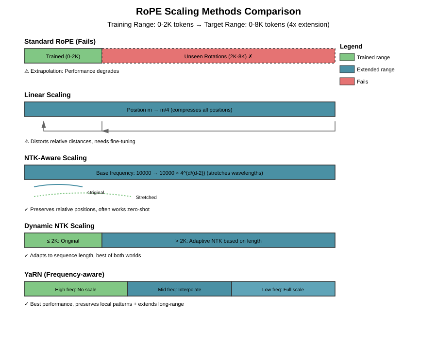
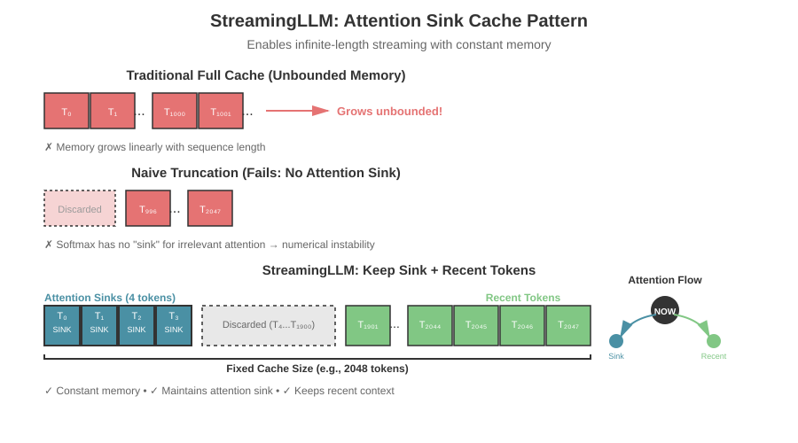
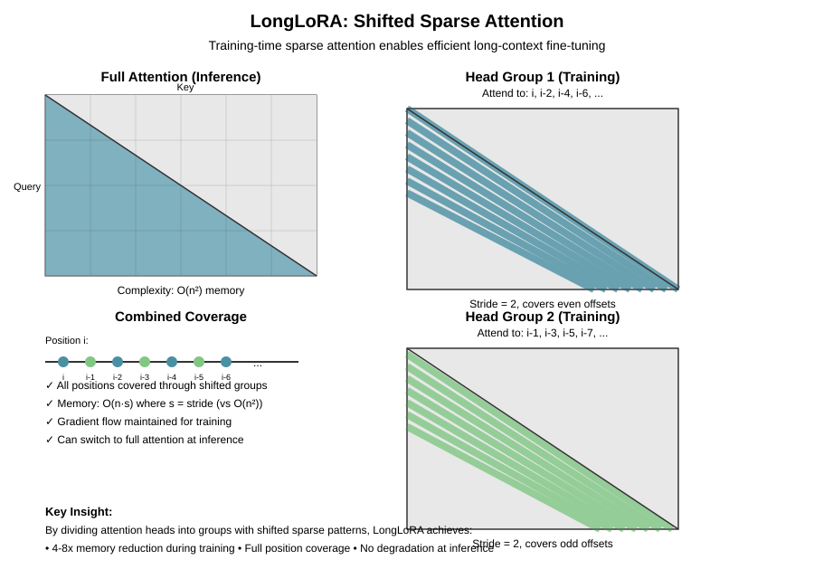

# Chapter 27: Long Context Techniques

Extending the context window of Large Language Models is one of the most active areas of research. While early models like GPT-2 were limited to 1024 tokens, modern LLMs can handle 100K+ tokens, with some models like Gemini 1.5 Pro supporting over 1 million tokens. This chapter explores the techniques that make long-context modeling possible.

## Table of Contents

1. [Introduction: The Challenge of Long Context](#introduction-the-challenge-of-long-context)
2. [RoPE Scaling Methods](#rope-scaling-methods)
3. [Attention Sinks and StreamingLLM](#attention-sinks-and-streamingllm)
4. [LongLoRA: Efficient Long-Context Fine-Tuning](#longlora-efficient-long-context-fine-tuning)
5. [Memory-Augmented Architectures](#memory-augmented-architectures)
6. [Landmark Attention](#landmark-attention)
7. [Ring Attention for Distributed Long Context](#ring-attention-for-distributed-long-context)
8. [Production Considerations for Long Context](#production-considerations-for-long-context)
9. [Evaluation on Long-Range Tasks](#evaluation-on-long-range-tasks)
10. [Complete Implementation: Long Context Transformer](#complete-implementation-long-context-transformer)
11. [Summary and Best Practices](#summary-and-best-practices)
12. [Exercises](#exercises)

---

## Introduction: The Challenge of Long Context

### Why Long Context Matters

Long context capabilities enable models to:
- Process entire books or codebases in a single forward pass
- Maintain coherent conversations over many turns
- Retrieve information from large documents
- Understand complex dependencies across long sequences

### Computational Challenges

For a sequence of length $n$, standard attention has:
- **Time complexity**: $O(n^2 d)$ where $d$ is the hidden dimension
- **Memory complexity**: $O(n^2)$ for attention scores + $O(n d)$ for KV cache
- **Position encoding**: May not extrapolate beyond training length

For $n = 100,000$ tokens, the attention matrix alone requires ~40GB of memory in FP32!

### Three Approaches to Long Context

1. **Position Encoding Extension**: Modify positional embeddings to extrapolate
2. **Attention Efficiency**: Reduce computational/memory complexity
3. **Architecture Modifications**: Fundamental changes to how information flows

This chapter covers techniques across all three categories.

---

## RoPE Scaling Methods

Rotary Position Embeddings (RoPE) (see [Rotary Position Embeddings](08-rope.md)) are the dominant positional encoding method in modern LLMs. However, they struggle to extrapolate beyond their training length due to frequency-based encoding.

### The RoPE Extrapolation Problem

Recall that RoPE applies rotation to query and key vectors:

$$
\mathbf{q}_m = \mathbf{R}_m \mathbf{q}, \quad \mathbf{k}_n = \mathbf{R}_n \mathbf{k}
$$

where $\mathbf{R}_m$ is a rotation matrix dependent on position $m$ and base frequencies $\theta_i = 10000^{-2i/d}$.

**Problem**: When inference positions exceed training positions, the model sees rotation angles it was never trained on, leading to degraded performance.

### Linear Scaling (Naive Approach)

The simplest approach: scale positions linearly.

$$
\mathbf{R}_m' = \mathbf{R}_{m/s}
$$

where $s$ is the scaling factor. If trained on 2K context and want 8K, use $s = 4$.

**Issues**:
- Compresses all positions into trained range
- Changes relative distances between tokens
- Often requires fine-tuning to recover performance

### Implementing Linear Scaling

**The Problem**: A model trained with RoPE on sequences up to 2048 tokens will fail when processing longer sequences because it encounters rotation angles outside its training distribution. Position 8000 would use a rotation angle the model has never seen.

**The Solution**: Map long positions back into the trained range. If we trained on positions [0, 2047] and want to handle [0, 8191], we linearly compress by factor 4, so position 8000 maps to position 2000.

**Why This Approach?**:
- **Pros**: Simple to implement, no architecture changes needed, keeps rotation angles within trained distribution
- **Cons**: Compresses relative distances (tokens 100 positions apart now appear 25 positions apart), which can confuse the model about temporal relationships
- **Tradeoff vs Extrapolation**: Better to interpolate within known ranges than extrapolate to unknown ones

**Key Insight**: Linear scaling prioritizes staying within the model's learned positional space at the cost of distorting relative distances. This is why fine-tuning often helps—the model needs to relearn what compressed distances mean.

```python
import torch
import torch.nn as nn
import math

class LinearScalingRoPE(nn.Module):
    """RoPE with linear position interpolation.

    Instead of extrapolating to new positions, we interpolate
    by scaling positions down to the training range.

    Example: Trained on 2048 positions, want 8192.
    Position 8000 -> 8000/4 = 2000 (within training range)
    """
    def __init__(
        self,
        dim: int,
        max_position_embeddings: int = 2048,
        base: float = 10000.0,
        scaling_factor: float = 1.0
    ):
        super().__init__()
        self.dim = dim
        self.max_position_embeddings = max_position_embeddings
        self.base = base
        self.scaling_factor = scaling_factor

        # Compute inverse frequencies
        inv_freq = 1.0 / (self.base ** (torch.arange(0, self.dim, 2).float() / self.dim))
        self.register_buffer("inv_freq", inv_freq)

    def forward(self, x: torch.Tensor, seq_len: int) -> tuple[torch.Tensor, torch.Tensor]:
        """
        Args:
            x: Input tensor (not used, just for shape)
            seq_len: Sequence length

        Returns:
            cos, sin: Cosine and sine of rotation angles [seq_len, dim]
        """
        # Scale positions to fit in training range
        positions = torch.arange(seq_len, device=x.device).float()
        positions = positions / self.scaling_factor

        # Compute angles: outer product of positions and frequencies
        freqs = torch.outer(positions, self.inv_freq)  # [seq_len, dim//2]

        # Create full frequency tensor [seq_len, dim]
        emb = torch.cat((freqs, freqs), dim=-1)

        return emb.cos(), emb.sin()


def apply_rotary_emb(
    q: torch.Tensor,
    k: torch.Tensor,
    cos: torch.Tensor,
    sin: torch.Tensor
) -> tuple[torch.Tensor, torch.Tensor]:
    """Apply rotary embeddings to query and key tensors.

    Args:
        q: Query tensor [batch, seq_len, n_heads, head_dim]
        k: Key tensor [batch, seq_len, n_heads, head_dim]
        cos, sin: Precomputed cos/sin [seq_len, head_dim]

    Returns:
        Rotated q, k tensors
    """
    # Reshape for rotation
    def rotate_half(x):
        """Split and swap for rotation."""
        x1, x2 = x[..., :x.shape[-1]//2], x[..., x.shape[-1]//2:]
        return torch.cat((-x2, x1), dim=-1)

    # Apply rotation
    q_embed = q * cos.unsqueeze(0).unsqueeze(2) + rotate_half(q) * sin.unsqueeze(0).unsqueeze(2)
    k_embed = k * cos.unsqueeze(0).unsqueeze(2) + rotate_half(k) * sin.unsqueeze(0).unsqueeze(2)

    return q_embed, k_embed
```

### NTK-Aware Scaling

**Neural Tangent Kernel (NTK) scaling** modifies the base frequency instead of positions.

**Key insight**: Instead of compressing positions, expand the wavelengths of the sinusoidal functions.

$$
\theta_i' = \theta_i \cdot s^{d/(d-2)} = 10000^{-2i/d} \cdot s^{d/(d-2)}
$$

where $s$ is the target scaling factor.

**Why it works**:
- Preserves relative position information better
- Smoothly extends to longer contexts
- Often works **without fine-tuning**

### Implementing NTK-Aware Scaling

**The Problem with Linear Scaling**: Compressing positions distorts all relative distances equally. A model trained to recognize that tokens 10 positions apart have certain relationships now sees those tokens as appearing closer, breaking learned patterns.

**The NTK-Aware Insight**: Instead of moving the positions, change the wavelengths of the sinusoidal functions. RoPE uses different frequencies to encode position—low frequencies for long-range patterns, high frequencies for local patterns. By scaling the base frequency, we effectively "stretch" all wavelengths proportionally.

**Theoretical Justification**: This approach is inspired by the Neural Tangent Kernel (NTK) theory, which suggests that scaling the frequency base maintains the model's learned kernel structure better than position scaling. The formula $\text{base}' = \text{base} \cdot s^{d/(d-2)}$ is derived from NTK scaling laws for infinite-width networks.

**Comparison to Alternatives**:
- **vs Linear Scaling**: Preserves relative position relationships better because we're changing the encoding function, not compressing the space
- **vs No Scaling**: Allows extrapolation beyond training length with minimal degradation
- **vs Fine-tuning**: Often works zero-shot, saving compute

**Key Insight**: By modifying the frequency base rather than positions, the model still sees "correct" relative distances—just encoded with longer wavelengths. This is analogous to changing from feet to meters: the relative distances stay the same, just the measurement scale changes.

```python
class NTKScalingRoPE(nn.Module):
    """RoPE with NTK-aware scaling.

    Instead of scaling positions, we scale the base frequency.
    This changes the wavelengths of the rotation functions.

    Paper: https://www.reddit.com/r/LocalLLaMA/comments/14lz7j5/ntkaware_scaled_rope_allows_llama_models_to_have/
    """
    def __init__(
        self,
        dim: int,
        max_position_embeddings: int = 2048,
        base: float = 10000.0,
        scaling_factor: float = 1.0
    ):
        super().__init__()
        self.dim = dim
        self.max_position_embeddings = max_position_embeddings
        self.scaling_factor = scaling_factor

        # NTK scaling: scale the base frequency
        # Formula: base' = base * scaling_factor^(dim / (dim - 2))
        ntk_base = base * (scaling_factor ** (dim / (dim - 2)))

        # Compute inverse frequencies with scaled base
        inv_freq = 1.0 / (ntk_base ** (torch.arange(0, dim, 2).float() / dim))
        self.register_buffer("inv_freq", inv_freq)

    def forward(self, x: torch.Tensor, seq_len: int) -> tuple[torch.Tensor, torch.Tensor]:
        positions = torch.arange(seq_len, device=x.device).float()
        freqs = torch.outer(positions, self.inv_freq)
        emb = torch.cat((freqs, freqs), dim=-1)
        return emb.cos(), emb.sin()
```

### Dynamic NTK Scaling

**Problem with static NTK**: Scaling is fixed at model load time.

**Dynamic NTK** adjusts the scaling based on actual sequence length:

$$
\alpha(L) = \begin{cases}
1 & \text{if } L \leq L_{\text{train}} \\
\left(\frac{L}{L_{\text{train}}}\right)^{d/(d-2)} & \text{otherwise}
\end{cases}
$$

Then use base frequency: $\theta_i' = \theta_i \cdot \alpha(L)$

### Implementing Dynamic NTK Scaling

**The Problem with Static Scaling**: If we always apply NTK scaling (even for short sequences), we're using modified frequencies even when processing sequences within the original training length. This is unnecessary and can hurt performance on standard-length inputs.

**The Solution**: Apply scaling only when needed. For sequences within training length, use original RoPE. For longer sequences, dynamically compute the scaling factor based on actual length.

**Why This Matters**:
- **Preserves Original Behavior**: No degradation on standard-length sequences
- **Adaptive Scaling**: Uses minimal scaling needed for current sequence
- **Best of Both Worlds**: Original RoPE for short contexts, NTK scaling for long ones

**How It Relates to Static NTK**: Static NTK is like always wearing reading glasses, even when you don't need them. Dynamic NTK is like putting on glasses only when reading—you get correction when needed without affecting normal vision.

**Key Insight**: The scaling formula $s^{d/(d-2)}$ increases superlinearly with sequence length, which means we're applying stronger frequency modifications for longer extrapolations. This adaptive behavior matches the intuition that we need more aggressive scaling to handle bigger jumps beyond training length.

```python
class DynamicNTKScalingRoPE(nn.Module):
    """Dynamic NTK scaling that adapts to sequence length.

    Key advantage: Scales only when needed, preserving original
    behavior for sequences within training length.
    """
    def __init__(
        self,
        dim: int,
        max_position_embeddings: int = 2048,
        base: float = 10000.0
    ):
        super().__init__()
        self.dim = dim
        self.max_position_embeddings = max_position_embeddings
        self.base = base

        # Store original inverse frequencies
        inv_freq = 1.0 / (base ** (torch.arange(0, dim, 2).float() / dim))
        self.register_buffer("inv_freq_base", inv_freq)

    def forward(self, x: torch.Tensor, seq_len: int) -> tuple[torch.Tensor, torch.Tensor]:
        # Compute dynamic scaling factor
        if seq_len > self.max_position_embeddings:
            scale = (seq_len / self.max_position_embeddings) ** (self.dim / (self.dim - 2))
            inv_freq = self.inv_freq_base / scale
        else:
            inv_freq = self.inv_freq_base

        positions = torch.arange(seq_len, device=x.device).float()
        freqs = torch.outer(positions, inv_freq)
        emb = torch.cat((freqs, freqs), dim=-1)
        return emb.cos(), emb.sin()
```

### YaRN: Yet another RoPE extensioN

YaRN combines multiple techniques for optimal long-context performance:

1. **NTK-by-parts**: Different scaling for high/low frequency components
2. **Attention temperature**: Scale attention scores during fine-tuning
3. **Targeted fine-tuning**: Only fine-tune on long sequences

**Key Paper**: [YaRN: Efficient Context Window Extension of Large Language Models](https://arxiv.org/abs/2309.00071) (Peng et al., 2023)

**Frequency-dependent scaling**:

$$
\theta_i' = \begin{cases}
\theta_i & \text{if } i < i_{\text{low}} \\
\theta_i \cdot s^{(i - i_{\text{low}})/(i_{\text{high}} - i_{\text{low}})} & \text{if } i_{\text{low}} \leq i < i_{\text{high}} \\
\theta_i \cdot s & \text{if } i \geq i_{\text{high}}
\end{cases}
$$

where:
- $i_{\text{low}}$, $i_{\text{high}}$ are frequency band boundaries
- $s$ is the scaling factor
- Low frequencies (encoding long-range info) are scaled more
- High frequencies (encoding local info) are scaled less

### Implementing YaRN Scaling

**The Core Problem**: Uniform scaling (NTK) applies the same adjustment to all frequency components, but different frequencies encode different types of information. High frequencies capture local patterns (adjacent token relationships), while low frequencies capture long-range dependencies.

**YaRN's Insight**: When extending context, we primarily need to handle longer-range dependencies—the local patterns remain the same. Therefore, we should scale low frequencies more aggressively (to handle extended long-range patterns) while preserving high frequencies (keeping local patterns intact).

**Theoretical Foundation**: Based on Fourier analysis of attention patterns. The attention mechanism decomposes into different wavelength components. Local attention is dominated by high-frequency components, while cross-sentence attention uses low frequencies. By scaling frequencies non-uniformly, we preserve the model's ability to handle local syntax while extending its long-range semantic capabilities.

**Comparison to Other Methods**:
- **vs Uniform NTK**: Better preserves local pattern recognition while extending long-range capabilities
- **vs Linear Scaling**: Doesn't compress relative distances; instead adapts the encoding to handle both scales
- **vs Position Interpolation**: YaRN adds frequency-aware scaling on top of interpolation

**Additional YaRN Components**:
1. **Attention Temperature Scaling (mscale)**: Prevents attention entropy collapse at long contexts
2. **Targeted Fine-tuning**: Short fine-tuning (≈400 steps) on long sequences to adapt

**Key Insight**: Different wavelengths in the RoPE encoding serve different purposes. By treating them differently during scaling, we can extend context without sacrificing the model's understanding of local structure—like upgrading a telescope's long-range capabilities without ruining its ability to focus on nearby objects.

```python
class YaRNScalingRoPE(nn.Module):
    """YaRN (Yet another RoPE extensioN) scaling.

    Applies different scaling to different frequency bands:
    - Low frequencies (long-range): More scaling
    - High frequencies (local): Less scaling

    Paper: https://arxiv.org/abs/2309.00071
    """
    def __init__(
        self,
        dim: int,
        max_position_embeddings: int = 2048,
        base: float = 10000.0,
        scaling_factor: float = 1.0,
        original_max_position_embeddings: int = 2048,
        beta_fast: int = 32,
        beta_slow: int = 1,
        mscale: float = 1.0
    ):
        super().__init__()
        self.dim = dim
        self.max_position_embeddings = max_position_embeddings
        self.base = base
        self.scaling_factor = scaling_factor
        self.original_max_position_embeddings = original_max_position_embeddings

        # Compute frequency bands
        # Low freq indices: scale more (capture long-range)
        # High freq indices: scale less (capture local patterns)
        self.beta_fast = beta_fast
        self.beta_slow = beta_slow
        self.mscale = mscale

        # Get inverse frequencies
        inv_freq = 1.0 / (base ** (torch.arange(0, dim, 2).float() / dim))

        # Compute wavelengths
        wavelengths = 2 * math.pi / inv_freq

        # Determine scaling per frequency
        freq_scales = torch.ones_like(inv_freq)
        for i, wavelength in enumerate(wavelengths):
            if wavelength < beta_fast:
                # High frequency (short wavelength): no scaling
                freq_scales[i] = 1.0
            elif wavelength > beta_slow * scaling_factor:
                # Low frequency (long wavelength): full scaling
                freq_scales[i] = scaling_factor
            else:
                # Interpolate between no scaling and full scaling
                # based on wavelength
                ratio = (wavelength - beta_fast) / (beta_slow * scaling_factor - beta_fast)
                freq_scales[i] = 1.0 + (scaling_factor - 1.0) * ratio

        # Apply frequency-dependent scaling
        inv_freq_scaled = inv_freq / freq_scales
        self.register_buffer("inv_freq", inv_freq_scaled)

        # mscale: attention entropy preservation
        self.mscale_factor = self._compute_mscale()

    def _compute_mscale(self) -> float:
        """Compute mscale to preserve attention entropy.

        YaRN uses this to prevent attention from becoming too peaked
        or too uniform when extending context.
        """
        if self.scaling_factor <= 1.0:
            return 1.0

        # Formula from YaRN paper
        return 0.1 * math.log(self.scaling_factor) + 1.0

    def forward(self, x: torch.Tensor, seq_len: int) -> tuple[torch.Tensor, torch.Tensor]:
        positions = torch.arange(seq_len, device=x.device).float()
        freqs = torch.outer(positions, self.inv_freq)
        emb = torch.cat((freqs, freqs), dim=-1)

        # Apply mscale to attention (done in attention computation)
        return emb.cos(), emb.sin()
```

### ABF (Adjusted Base Frequency)

Used in models like Qwen, ABF adjusts the base frequency (typically from 10000 to 1000000) to support longer contexts.

**Simple formula**:

$$
\text{base}_{\text{new}} = \text{base}_{\text{old}} \times \left(\frac{L_{\text{target}}}{L_{\text{original}}}\right)^{d/(d-2)}
$$

This is essentially NTK scaling with a larger base adjustment.

### Implementing ABF Scaling

**The Problem Being Solved**: Models like Qwen need to handle very long contexts (128K+ tokens) from the start, not as an afterthought. Simply applying NTK scaling to an already-trained model has limits—for extreme extensions, we need to bake long-context support into the initial training.

**The ABF Approach**: Instead of retrofitting a short-context model, adjust the base frequency dramatically during initial training. For example, Qwen changes the base from 10,000 to 1,000,000 (a 100x increase), which allows the model to naturally learn positional relationships at much longer ranges.

**Why This Works**:
- **Training from Scratch**: The model learns to use the modified frequencies from the beginning
- **Larger Wavelengths**: Higher base frequency means longer wavelengths, which naturally encode longer-range positions
- **No Extrapolation Needed**: Since the model trains on these frequencies, there's no distribution shift at inference

**Comparison to Other Approaches**:
- **vs NTK Scaling**: ABF is more aggressive and applied during pre-training, not as a post-hoc fix
- **vs Position Interpolation**: ABF doesn't compress positions; it trains with frequencies designed for long context
- **vs YaRN**: Simpler—uniform scaling rather than frequency-dependent, but requires full retraining

**Production Use Case**: Qwen uses this to offer 128K+ context windows as a standard feature, not an extension. This is the "correct" approach if you're training a new model and know you'll need long context.

**Key Insight**: ABF recognizes that retrofitting short-context models for long context is a compromise. If you know you need long context, design for it from the start by adjusting the fundamental frequency basis of your positional encoding. This is like building a highway versus widening a country road—sometimes it's better to design for scale from the beginning.

```python
class ABFScalingRoPE(nn.Module):
    """Adjusted Base Frequency (ABF) RoPE scaling.

    Used in Qwen models to extend from 32K to 128K+ context.
    Essentially NTK scaling with aggressive base frequency adjustment.
    """
    def __init__(
        self,
        dim: int,
        max_position_embeddings: int = 32768,
        base: float = 10000.0,
        target_max_position: int = 131072,  # 128K
    ):
        super().__init__()
        self.dim = dim

        # Compute scaling factor
        scaling_factor = target_max_position / max_position_embeddings

        # Apply aggressive base frequency adjustment
        # For Qwen: 10000 -> 1000000 (100x increase)
        adjusted_base = base * (scaling_factor ** (dim / (dim - 2)))

        inv_freq = 1.0 / (adjusted_base ** (torch.arange(0, dim, 2).float() / dim))
        self.register_buffer("inv_freq", inv_freq)

    def forward(self, x: torch.Tensor, seq_len: int) -> tuple[torch.Tensor, torch.Tensor]:
        positions = torch.arange(seq_len, device=x.device).float()
        freqs = torch.outer(positions, self.inv_freq)
        emb = torch.cat((freqs, freqs), dim=-1)
        return emb.cos(), emb.sin()
```

### Position Interpolation (PI)

**Position Interpolation** is Meta's approach used in Llama 2 Long, which is subtly different from linear scaling.

**Paper**: [Extending Context Window of Large Language Models via Position Interpolation](https://arxiv.org/abs/2306.15595) (Chen et al., 2023)

**Key difference from linear scaling**:
- Linear scaling: Divide positions by scale factor directly
- Position Interpolation: Interpolate into the trained position range using a specific interpolation strategy

The position encoding is modified so that for a new maximum length $L'$, positions are mapped as:

$$
m' = m \cdot \frac{L}{L'}
$$

where $L$ is the original training length and $m$ is the current position.

**Fine-tuning strategy**:
- Continue pre-training on sequences of length $L'$
- Only 1000 training steps needed (much less than original pre-training)
- Uses same data distribution as pre-training

### Implementing Position Interpolation

**The Core Problem**: We want to extend context without expensive full retraining. Linear scaling compresses positions, which works but distorts relative distances. Can we do better with minimal training?

**Position Interpolation's Insight**: Instead of extrapolating beyond the training range (which causes distribution shift) or naively compressing (which distorts distances), we interpolate positions into the trained range AND fine-tune briefly to help the model adapt to the slightly compressed space.

**Why This Works**:
- **Interpolation vs Extrapolation**: The model has seen all the rotation angles before (just now corresponding to different relative positions), so we're not introducing completely novel inputs
- **Minimal Fine-tuning**: Only 1000 steps needed because we're fine-tuning the attention patterns, not relearning positional encodings from scratch
- **Continuity**: The interpolation is smooth and continuous, minimizing the adaptation burden

**Theoretical Justification**: The paper shows that attention scores degrade gracefully under interpolation (smooth function of position), whereas extrapolation causes sharp performance cliffs (model encounters unseen rotation angles). Brief fine-tuning allows attention patterns to recalibrate to the compressed position space.

**Comparison to Alternatives**:
- **vs Linear Scaling**: Same position mapping, but PI adds targeted fine-tuning to recover performance
- **vs NTK**: PI uses position scaling (simpler), NTK uses frequency scaling (no fine-tuning needed)
- **vs Full Retraining**: 1000 steps vs millions—drastically cheaper

**Meta's Results**: Successfully extended Llama 2 from 4K to 32K context with only 1000 training steps, maintaining strong performance on both standard and long-context benchmarks.

**Key Insight**: Position Interpolation recognizes that interpolation is inherently safer than extrapolation (staying within learned space), and that brief fine-tuning can bridge the gap between naive scaling and full retraining. It's the minimum viable training approach for context extension.

```python
class PositionInterpolationRoPE(nn.Module):
    """Position Interpolation (PI) as used in Llama 2 Long.

    Similar to linear scaling but with careful interpolation
    into the trained position range.

    Paper: https://arxiv.org/abs/2306.15595
    """
    def __init__(
        self,
        dim: int,
        max_position_embeddings: int = 2048,
        base: float = 10000.0,
        scaling_factor: float = 1.0,
        original_max_position_embeddings: int = 2048
    ):
        super().__init__()
        self.dim = dim
        self.max_position_embeddings = max_position_embeddings
        self.base = base
        self.scaling_factor = scaling_factor
        self.original_max_position_embeddings = original_max_position_embeddings

        # Compute inverse frequencies (same as standard RoPE)
        inv_freq = 1.0 / (self.base ** (torch.arange(0, self.dim, 2).float() / self.dim))
        self.register_buffer("inv_freq", inv_freq)

    def forward(self, x: torch.Tensor, seq_len: int) -> tuple[torch.Tensor, torch.Tensor]:
        """
        Args:
            x: Input tensor (for device/dtype)
            seq_len: Current sequence length

        Returns:
            cos, sin: Rotary embeddings
        """
        # Interpolate positions into original range
        # If original max was 2048 and new max is 8192 (scale=4):
        # Position 8000 becomes 8000 * (2048/8192) = 2000
        positions = torch.arange(seq_len, device=x.device).float()
        positions = positions * (self.original_max_position_embeddings / self.max_position_embeddings)

        # Compute frequencies
        freqs = torch.outer(positions, self.inv_freq)
        emb = torch.cat((freqs, freqs), dim=-1)

        return emb.cos(), emb.sin()
```

**Results from paper**:
- Extended Llama 2 7B from 4K to 32K context (8x extension)
- Only 1000 training steps needed
- Minimal performance degradation on standard benchmarks
- Strong performance on long-context tasks (passkey retrieval, long-document QA)

### Comparison of RoPE Scaling Methods



| Method | Fine-tuning Required? | Strengths | Weaknesses |
|--------|----------------------|-----------|------------|
| Linear | Yes | Simple | Distorts relative positions |
| **Position Interpolation** | Yes (minimal: 1K steps) | Efficient fine-tuning, proven at scale | Still requires some training |
| NTK | No (often) | Preserves relative positions | May degrade at very long contexts |
| Dynamic NTK | No | Adaptive to length | Slight overhead |
| YaRN | Yes (minimal) | Best performance | More complex |
| ABF | Yes | Used in production (Qwen) | Requires retraining |

**Best practices**:
- For quick extension without training: **Dynamic NTK**
- For efficient fine-tuning with proven results: **Position Interpolation**
- For production deployment: **YaRN** with short fine-tuning
- For new model training: **ABF** with long context from start

---

## Attention Sinks and StreamingLLM

### The Attention Sink Phenomenon

**Surprising discovery**: In causal language models, the **first token** receives disproportionately high attention scores, even when semantically irrelevant.

**Why?** Softmax must sum to 1. When no token is particularly relevant, attention "leaks" to early tokens, especially the first.

$$
\text{Attention}(Q, K, V) = \text{softmax}\left(\frac{QK^T}{\sqrt{d}}\right)V
$$

For position $i$, if all keys are equally (ir)relevant:

$$
\text{score}_{i,j} \approx 0 \text{ for all } j \Rightarrow \text{softmax needs a "sink"}
$$

The first token becomes this sink.

**Key Paper**: [Efficient Streaming Language Models with Attention Sinks](https://arxiv.org/abs/2309.17453) (Xiao et al., 2023)

### StreamingLLM

StreamingLLM enables LLMs to handle **infinite-length** sequences by:

1. **Keep attention sink tokens**: Preserve first few tokens in KV cache
2. **Use rolling KV cache**: Keep only recent tokens
3. **Discard middle tokens**: Remove old, irrelevant history

**Algorithm**:
- Cache size: $N$ tokens
- Keep first $k$ tokens (attention sinks)
- Keep most recent $N - k$ tokens
- Discard everything in between

### Implementing StreamingLLM

**The Problem**: Traditional KV cache grows linearly with sequence length. For a streaming application (chatbot, real-time transcription), this becomes unbounded memory usage. Simply truncating old tokens causes catastrophic performance collapse.

**Why Naive Truncation Fails**: Removing the first tokens breaks the attention sink mechanism. Without the sink, softmax has nowhere to dump irrelevant attention mass, causing numerical instability and degraded predictions.

**StreamingLLM's Solution**: Keep the attention sink tokens (typically the first 4) permanently in cache, along with the most recent tokens. This maintains:
1. **Numerical Stability**: Attention sink always available for softmax normalization
2. **Recent Context**: Most recent tokens contain immediately relevant information
3. **Bounded Memory**: Fixed cache size regardless of total sequence length

**Theoretical Justification**: The attention sink phenomenon occurs because causal masks prevent attending to future tokens. When current tokens aren't relevant, attention weights must go somewhere—they accumulate on early tokens. By preserving these sink tokens, we maintain the model's learned attention distribution pattern.

**Comparison to Alternatives**:
- **vs Full Cache**: Constant memory instead of linear growth; enables infinite streaming
- **vs Simple Truncation**: Maintains performance by preserving attention sinks
- **vs Window Attention**: No architecture change needed; works with pretrained models

**Key Insight**: StreamingLLM exploits the empirical observation that models don't actually use all historical tokens semantically—they just need somewhere to put attention mass. By keeping the "attention dump" (first tokens) and recent context, we maintain the statistical structure the model expects while discarding semantically irrelevant middle tokens.

```python
class StreamingLLMCache:
    """Streaming KV cache with attention sinks.

    Maintains:
    - First k tokens (attention sinks)
    - Most recent (cache_size - k) tokens
    - Discards everything in between

    This enables infinite-length streaming while keeping memory constant.

    Paper: https://arxiv.org/abs/2309.17453
    """
    def __init__(
        self,
        cache_size: int = 2048,
        n_sink_tokens: int = 4,
        n_layers: int = 32,
        n_heads: int = 32,
        head_dim: int = 128,
        device: str = "cuda"
    ):
        self.cache_size = cache_size
        self.n_sink_tokens = n_sink_tokens
        self.recent_size = cache_size - n_sink_tokens
        self.n_layers = n_layers

        # Initialize cache for each layer
        # Separate storage for sink tokens and recent tokens
        self.sink_k = [
            torch.zeros(1, n_sink_tokens, n_heads, head_dim, device=device)
            for _ in range(n_layers)
        ]
        self.sink_v = [
            torch.zeros(1, n_sink_tokens, n_heads, head_dim, device=device)
            for _ in range(n_layers)
        ]

        # Rolling buffer for recent tokens
        self.recent_k = [
            torch.zeros(1, self.recent_size, n_heads, head_dim, device=device)
            for _ in range(n_layers)
        ]
        self.recent_v = [
            torch.zeros(1, self.recent_size, n_heads, head_dim, device=device)
            for _ in range(n_layers)
        ]

        # Track number of tokens seen
        self.n_seen = 0
        # Position in rolling buffer
        self.recent_position = 0

    def update(
        self,
        layer_idx: int,
        k: torch.Tensor,
        v: torch.Tensor
    ) -> tuple[torch.Tensor, torch.Tensor]:
        """Update cache with new K, V tensors.

        Args:
            layer_idx: Which transformer layer
            k, v: New key/value tensors [batch, seq_len, n_heads, head_dim]

        Returns:
            Full K, V to use for attention (includes sink + recent)
        """
        seq_len = k.shape[1]

        for i in range(seq_len):
            pos = self.n_seen + i

            if pos < self.n_sink_tokens:
                # Store in sink cache
                self.sink_k[layer_idx][:, pos] = k[:, i]
                self.sink_v[layer_idx][:, pos] = v[:, i]
            else:
                # Store in rolling recent cache
                idx = self.recent_position % self.recent_size
                self.recent_k[layer_idx][:, idx] = k[:, i]
                self.recent_v[layer_idx][:, idx] = v[:, i]
                self.recent_position += 1

        self.n_seen += seq_len

        # Return combined cache for attention
        if self.n_seen <= self.cache_size:
            # Haven't filled cache yet, return everything
            k_combined = torch.cat([
                self.sink_k[layer_idx][:, :min(self.n_seen, self.n_sink_tokens)],
                self.recent_k[layer_idx][:, :max(0, self.n_seen - self.n_sink_tokens)]
            ], dim=1)
            v_combined = torch.cat([
                self.sink_v[layer_idx][:, :min(self.n_seen, self.n_sink_tokens)],
                self.recent_v[layer_idx][:, :max(0, self.n_seen - self.n_sink_tokens)]
            ], dim=1)
        else:
            # Cache is full, return sink + recent (in correct order)
            # Need to reorder rolling buffer to be chronological
            start_idx = self.recent_position % self.recent_size
            k_recent = torch.cat([
                self.recent_k[layer_idx][:, start_idx:],
                self.recent_k[layer_idx][:, :start_idx]
            ], dim=1)
            v_recent = torch.cat([
                self.recent_v[layer_idx][:, start_idx:],
                self.recent_v[layer_idx][:, :start_idx]
            ], dim=1)

            k_combined = torch.cat([self.sink_k[layer_idx], k_recent], dim=1)
            v_combined = torch.cat([self.sink_v[layer_idx], v_recent], dim=1)

        return k_combined, v_combined

    def reset(self):
        """Reset cache for new sequence."""
        self.n_seen = 0
        self.recent_position = 0
```



### Practical Considerations

**When to use StreamingLLM**:
- Chatbots with very long conversations
- Document processing where full context isn't needed
- Streaming applications (video captioning, live transcription)

**Limitations**:
- Loses information in the middle of context
- Best for tasks where recent + initial context matter most
- Not suitable for retrieval tasks requiring full document access

---

## LongLoRA: Efficient Long-Context Fine-Tuning

**LongLoRA** enables efficient fine-tuning of LLMs for longer contexts by combining shifted sparse attention during training with full attention at inference.

**Paper**: [LongLoRA: Efficient Fine-tuning of Long-Context Large Language Models](https://arxiv.org/abs/2309.12307) (Chen et al., 2023)

### The Key Insight

**Problem**: Fine-tuning on long contexts requires massive memory for:
1. Full attention computation: $O(n^2)$
2. KV cache during training
3. Gradient computation and storage

**LongLoRA's solution**:
- Use **shift sparse attention** during training (cheaper)
- Keep full attention at inference (no degradation)
- Add **LoRA** (Low-Rank Adaptation) for parameter-efficient fine-tuning

### Shifted Sparse Attention

Instead of full attention, divide heads into groups and shift patterns:

$$
\text{Group 1: Attend to positions } [i, i-2, i-4, \ldots] \\
\text{Group 2: Attend to positions } [i-1, i-3, i-5, \ldots]
$$

By shifting different heads, we maintain some cross-position communication while keeping computation sparse.

### Implementing Shifted Sparse Attention

**The Problem**: Fine-tuning on long contexts (32K-100K tokens) with full attention requires:
- $O(n^2)$ memory for attention scores
- $O(n^2d)$ computation
- For 100K tokens: ~40GB just for attention matrix in FP32

This makes long-context fine-tuning impossible on consumer hardware.

**The Shifted Sparse Attention Solution**: During training only, use a sparse attention pattern where different attention heads attend to different strided positions. Head group 1 might attend to positions [i, i-2, i-4, ...], while head group 2 attends to [i-1, i-3, i-5, ...]. This maintains coverage across all positions through different heads.

**Why This Works**:
- **Preserved Coverage**: Even though each head is sparse, collectively they cover all positions
- **Reduced Memory**: Instead of $O(n^2)$ per head, we get $O(n \cdot s)$ where $s$ is the stride
- **Training-Only**: Can switch to full attention at inference (model learns to work with both)

**Theoretical Justification**: Research shows transformers are over-parameterized—not all attention heads need full context all the time. During training, sparse patterns provide enough signal for gradient flow. The key insight is that different heads can specialize in different ranges through the shift pattern.

**Comparison to Other Sparse Attention Methods**:
- **vs Fixed Window**: Shifting ensures all positions can communicate (albeit through multiple hops)
- **vs Random Sparse**: Deterministic pattern is reproducible and easier to implement efficiently
- **vs Dilated Attention**: Similar idea, but LongLoRA adds the shift between head groups for better coverage

**Key Insight**: LongLoRA recognizes that training and inference have different requirements. Training needs gradients to flow (achieved with sparse shifted patterns), while inference needs maximum quality (achieved with full attention). By using different attention patterns in each phase, we get efficient training and high-quality inference.

```python
class ShiftedSparseAttention(nn.Module):
    """Shifted Sparse Attention for efficient long-context training.

    During training:
    - Uses sparse attention with shifted patterns
    - Different heads attend to different strided positions
    - Reduces memory from O(n^2) to O(n*s) where s is stride

    During inference:
    - Can switch to full attention (model trained to handle both)

    Paper: https://arxiv.org/abs/2309.12307
    """
    def __init__(
        self,
        d_model: int,
        n_heads: int,
        group_size: int = 2048,  # Local attention window
        n_groups: int = 2,  # Number of shift groups
        training: bool = True
    ):
        super().__init__()
        self.d_model = d_model
        self.n_heads = n_heads
        self.head_dim = d_model // n_heads
        self.group_size = group_size
        self.n_groups = n_groups
        self.training = training

        assert n_heads % n_groups == 0, "n_heads must be divisible by n_groups"
        self.heads_per_group = n_heads // n_groups

        self.q_proj = nn.Linear(d_model, d_model, bias=False)
        self.k_proj = nn.Linear(d_model, d_model, bias=False)
        self.v_proj = nn.Linear(d_model, d_model, bias=False)
        self.o_proj = nn.Linear(d_model, d_model, bias=False)

    def shift_tokens(self, x: torch.Tensor, shift: int) -> torch.Tensor:
        """Shift tokens for sparse attention pattern.

        Args:
            x: Input [batch, seq_len, n_heads, head_dim]
            shift: Number of positions to shift

        Returns:
            Shifted tensor
        """
        if shift == 0:
            return x

        batch, seq_len, n_heads, head_dim = x.shape

        # Pad and shift
        padding = torch.zeros(batch, abs(shift), n_heads, head_dim, device=x.device, dtype=x.dtype)
        if shift > 0:
            x = torch.cat([padding, x[:, :-shift]], dim=1)
        else:
            x = torch.cat([x[:, -shift:], padding], dim=1)

        return x

    def forward(self, x: torch.Tensor) -> torch.Tensor:
        """
        Args:
            x: Input [batch, seq_len, d_model]
        """
        batch, seq_len, _ = x.shape

        # Project
        q = self.q_proj(x).view(batch, seq_len, self.n_heads, self.head_dim)
        k = self.k_proj(x).view(batch, seq_len, self.n_heads, self.head_dim)
        v = self.v_proj(x).view(batch, seq_len, self.n_heads, self.head_dim)

        if self.training:
            # Apply shifted sparse attention during training
            outputs = []

            for group_idx in range(self.n_groups):
                # Select heads for this group
                start_head = group_idx * self.heads_per_group
                end_head = start_head + self.heads_per_group

                q_group = q[:, :, start_head:end_head, :]
                k_group = k[:, :, start_head:end_head, :]
                v_group = v[:, :, start_head:end_head, :]

                # Apply shift for this group
                # Group 0: shift 0, Group 1: shift group_size//2, etc.
                shift = (group_idx * self.group_size) // self.n_groups
                k_group = self.shift_tokens(k_group, shift)
                v_group = self.shift_tokens(v_group, shift)

                # Transpose for attention
                q_group = q_group.transpose(1, 2)  # [batch, heads, seq_len, head_dim]
                k_group = k_group.transpose(1, 2)
                v_group = v_group.transpose(1, 2)

                # Compute local attention with stride
                # For efficiency, use strided/sparse attention
                # Here we'll compute full attention but could optimize
                scores = torch.matmul(q_group, k_group.transpose(-2, -1)) / math.sqrt(self.head_dim)

                # Apply causal mask
                mask = torch.triu(torch.ones(seq_len, seq_len, dtype=torch.bool, device=x.device), diagonal=1)
                scores.masked_fill_(mask, float('-inf'))

                attn = torch.softmax(scores, dim=-1)
                group_out = torch.matmul(attn, v_group)
                group_out = group_out.transpose(1, 2)  # [batch, seq_len, heads, head_dim]

                outputs.append(group_out)

            # Concatenate all groups
            output = torch.cat(outputs, dim=2)
        else:
            # Use full attention during inference
            q = q.transpose(1, 2)
            k = k.transpose(1, 2)
            v = v.transpose(1, 2)

            scores = torch.matmul(q, k.transpose(-2, -1)) / math.sqrt(self.head_dim)
            mask = torch.triu(torch.ones(seq_len, seq_len, dtype=torch.bool, device=x.device), diagonal=1)
            scores.masked_fill_(mask, float('-inf'))

            attn = torch.softmax(scores, dim=-1)
            output = torch.matmul(attn, v)
            output = output.transpose(1, 2)

        # Reshape and project
        output = output.contiguous().view(batch, seq_len, self.d_model)
        return self.o_proj(output)
```

### Combining with LoRA

LongLoRA combines shifted sparse attention with LoRA for parameter-efficient fine-tuning:

```python
class LongLoRAAttention(nn.Module):
    """LongLoRA: Shifted sparse attention + LoRA for efficient fine-tuning.

    Key benefits:
    1. Sparse attention reduces training memory
    2. LoRA reduces trainable parameters
    3. Can use full attention at inference

    This enables extending context from 4K to 100K with limited compute.
    """
    def __init__(
        self,
        d_model: int,
        n_heads: int,
        lora_rank: int = 8,
        lora_alpha: int = 16,
        group_size: int = 2048,
        n_groups: int = 2
    ):
        super().__init__()
        self.d_model = d_model
        self.n_heads = n_heads

        # Base attention (frozen during fine-tuning)
        self.base_attn = ShiftedSparseAttention(d_model, n_heads, group_size, n_groups)

        # LoRA adaptors for Q and V projections
        self.lora_q_A = nn.Linear(d_model, lora_rank, bias=False)
        self.lora_q_B = nn.Linear(lora_rank, d_model, bias=False)
        self.lora_v_A = nn.Linear(d_model, lora_rank, bias=False)
        self.lora_v_B = nn.Linear(lora_rank, d_model, bias=False)

        # Initialize LoRA weights
        nn.init.kaiming_uniform_(self.lora_q_A.weight, a=math.sqrt(5))
        nn.init.zeros_(self.lora_q_B.weight)
        nn.init.kaiming_uniform_(self.lora_v_A.weight, a=math.sqrt(5))
        nn.init.zeros_(self.lora_v_B.weight)

        self.scaling = lora_alpha / lora_rank

    def forward(self, x: torch.Tensor) -> torch.Tensor:
        # Base attention output
        base_out = self.base_attn(x)

        # LoRA adaptation
        # In practice, this would modify Q and V inside the attention
        # For simplicity, we apply it to the output
        lora_out = self.lora_q_B(self.lora_q_A(x)) + self.lora_v_B(self.lora_v_A(x))
        lora_out = lora_out * self.scaling

        return base_out + lora_out
```

### Training Recipe

**LongLoRA training procedure**:

1. **Start with pretrained model** (e.g., Llama 2 7B with 4K context)
2. **Add LoRA adaptors** to attention layers (typically Q and V projections)
3. **Fine-tune with shifted sparse attention**:
   - Use long sequences (32K-100K tokens)
   - Batch size 1-2 per GPU (memory limited)
   - 1000-2000 training steps
   - Learning rate: 2e-5
4. **Switch to full attention** at inference

**Memory savings**:
- Full attention training on 32K: ~80GB per GPU
- LongLoRA training on 32K: ~24GB per GPU
- **3.3x reduction** in memory



### Results

From the LongLoRA paper:

| Model | Method | Context | Training Cost | Perplexity |
|-------|--------|---------|---------------|------------|
| Llama 2 7B | Full fine-tuning | 32K | 8x A100 (expensive) | 2.72 |
| Llama 2 7B | LongLoRA | 32K | 1x A100 | 2.76 |
| Llama 2 7B | Full fine-tuning | 100K | OOM | - |
| Llama 2 7B | LongLoRA | 100K | 1x A100 | 2.81 |

**Key takeaway**: Can extend to 100K context on a single GPU with minimal performance loss.

---

## Memory-Augmented Architectures

Instead of fitting everything in context, augment the model with external memory.

### Retrieval-Augmented Generation (RAG)

Split long context into chunks, retrieve relevant ones, feed to model.

**Architecture**:
1. Embed document chunks with embedding model
2. Store in vector database
3. At query time, retrieve top-k relevant chunks
4. Concatenate with query and feed to LLM

### Implementing Simple RAG

**The Fundamental Problem**: Even with long-context models, there's a limit. Processing a 1M token document is expensive, slow, and may exceed model capacity. Furthermore, most of that context is irrelevant to any given query.

**RAG's Core Insight**: Instead of fitting everything in context, use retrieval to select only relevant information. This shifts the problem from "how do we process everything?" to "how do we find what matters?"

**Why This Approach Works**:
- **Selective Attention**: Only relevant chunks consume context window
- **Scalable**: Can "handle" documents far exceeding model capacity
- **Efficient**: Retrieval is cheaper than full attention over millions of tokens
- **Flexible**: Can update knowledge base without retraining model

**The Tradeoff**: RAG trades comprehensiveness for efficiency. Full context sees everything (potentially catching subtle cross-document patterns), while RAG sees only retrieved chunks (might miss relevant information not captured by embedding similarity).

**Comparison to Full Long Context**:
- **vs 100K Context Window**: RAG can handle 10M+ token corpora; long context limited by GPU memory
- **vs Attention Mechanisms**: RAG is $O(k)$ where $k$ is retrieved chunks; attention is $O(n^2)$ over full context
- **Complementary Use**: Can combine RAG (for corpus-scale retrieval) with long context (for processing retrieved chunks)

**Practical Considerations**:
- **Chunking Strategy**: How to split documents affects retrieval quality
- **Embedding Model**: Better embeddings = better retrieval = better final quality
- **Chunk Size**: Trade-off between granularity and context

**Key Insight**: RAG recognizes that "long context" doesn't mean "all context." For many applications, intelligent retrieval of relevant subsets is more practical than processing everything. It's the difference between reading an entire library versus using a card catalog to find the right books.

```python
class SimpleRAG:
    """Simple Retrieval-Augmented Generation system.

    Instead of fitting 100K tokens in context, we:
    1. Chunk and embed documents
    2. Retrieve most relevant chunks for query
    3. Use only those chunks (e.g., 4K tokens) as context

    This allows "accessing" much larger contexts than model supports.
    """
    def __init__(
        self,
        embedding_model,
        llm_model,
        chunk_size: int = 512,
        top_k: int = 5
    ):
        self.embedding_model = embedding_model
        self.llm_model = llm_model
        self.chunk_size = chunk_size
        self.top_k = top_k

        # Storage
        self.chunks = []
        self.embeddings = []

    def index_document(self, document: str):
        """Chunk and embed a document for later retrieval."""
        # Simple chunking (in practice, use smarter chunking)
        words = document.split()
        chunks = [
            ' '.join(words[i:i+self.chunk_size])
            for i in range(0, len(words), self.chunk_size)
        ]

        # Embed chunks
        with torch.no_grad():
            embeddings = self.embedding_model.encode(chunks)

        self.chunks.extend(chunks)
        self.embeddings.append(embeddings)

    def retrieve(self, query: str, k: int = None) -> list[str]:
        """Retrieve top-k most relevant chunks for a query."""
        k = k or self.top_k

        # Embed query
        query_emb = self.embedding_model.encode([query])[0]

        # Compute similarities
        all_embeddings = torch.cat(self.embeddings, dim=0)
        similarities = torch.cosine_similarity(
            query_emb.unsqueeze(0),
            all_embeddings,
            dim=-1
        )

        # Get top-k
        top_indices = similarities.topk(k).indices
        return [self.chunks[i] for i in top_indices]

    def generate(self, query: str) -> str:
        """Generate answer using retrieved context."""
        # Retrieve relevant chunks
        context_chunks = self.retrieve(query)
        context = '\n\n'.join(context_chunks)

        # Build prompt
        prompt = f"Context:\n{context}\n\nQuestion: {query}\n\nAnswer:"

        # Generate with LLM
        return self.llm_model.generate(prompt)
```

### Memorizing Transformers

**Key idea**: Add a kNN lookup to retrieve from past hidden states.

**Paper**: [Memorizing Transformers](https://arxiv.org/abs/2203.08913) (Wu et al., 2022)

At each layer:
1. Standard attention over recent context (e.g., 2K tokens)
2. kNN retrieval from long-term memory of past (key, value) pairs
3. Combine both sources of information

$$
\text{Output} = \text{Attention}(Q, K_{\text{local}}, V_{\text{local}}) + \lambda \cdot \text{kNN}(Q, \mathcal{M})
$$

where $\mathcal{M}$ is the external memory of past activations.

### Implementing Memorizing Attention

**The Core Problem**: Standard attention is limited to the current context window. Even with long context (100K tokens), we can't remember everything from a book-length conversation or codebase. Yet we need to occasionally recall distant information.

**Memorizing Transformers' Solution**: Augment standard attention with external memory storing past (key, value) pairs. At each step:
1. Attend to recent context (standard attention)
2. Retrieve relevant memories via k-nearest neighbors search
3. Combine both sources

This creates a two-tier memory system: recent context (fast, full attention) + long-term memory (slower, retrieved as needed).

**Why This Works**:
- **Unbounded Memory**: External memory can grow indefinitely (stored on disk/distributed)
- **Selective Retrieval**: Only retrieve what's relevant via kNN, avoiding quadratic cost
- **Learned Gating**: Model learns when to rely on local context vs distant memories

**Theoretical Foundation**: Inspired by human memory systems—working memory (recent context) + long-term memory (retrieved via associative recall). The kNN retrieval mimics how we recall related past experiences based on similarity to current situation.

**Comparison to Other Approaches**:
- **vs Full Long Context**: Memorizing Attention can access potentially unlimited history; long context bounded by GPU memory
- **vs RAG**: RAG retrieves external documents; Memorizing Attention retrieves past activations from this conversation/session
- **vs StreamingLLM**: StreamingLLM discards middle tokens; Memorizing Attention stores them in external memory

**Implementation Challenges**:
- **kNN Efficiency**: Need fast approximate nearest neighbor search (FAISS, ScaNN)
- **Memory Management**: Deciding what to keep, when to evict old memories
- **Gating**: Learning how much to trust retrieved memories vs local attention

**Key Insight**: Memorizing Transformers recognize that not all context needs to be in the attention window. By separating recent context (always attended) from long-term memory (retrieved on-demand), we can have our cake and eat it too—bounded compute with unbounded memory.

```python
class MemorizingAttention(nn.Module):
    """Attention augmented with kNN memory lookup.

    Combines:
    - Local attention over recent context
    - kNN retrieval from long-term memory

    Paper: https://arxiv.org/abs/2203.08913
    """
    def __init__(
        self,
        dim: int,
        n_heads: int,
        local_window: int = 2048,
        memory_size: int = 65536,  # 64K memory slots
        k_neighbors: int = 32
    ):
        super().__init__()
        self.dim = dim
        self.n_heads = n_heads
        self.head_dim = dim // n_heads
        self.local_window = local_window
        self.k_neighbors = k_neighbors

        # Standard attention components
        self.q_proj = nn.Linear(dim, dim, bias=False)
        self.k_proj = nn.Linear(dim, dim, bias=False)
        self.v_proj = nn.Linear(dim, dim, bias=False)
        self.o_proj = nn.Linear(dim, dim, bias=False)

        # Memory: stored keys and values
        # In practice, stored on disk or distributed
        self.memory_keys = torch.zeros(memory_size, dim)
        self.memory_values = torch.zeros(memory_size, dim)
        self.memory_position = 0

        # Gating: how much to trust memory vs local attention
        self.memory_gate = nn.Linear(dim, 1)

    def add_to_memory(self, k: torch.Tensor, v: torch.Tensor):
        """Add keys and values to long-term memory."""
        batch, seq_len, _ = k.shape

        for i in range(seq_len):
            idx = self.memory_position % len(self.memory_keys)
            self.memory_keys[idx] = k[0, i].detach()  # Assuming batch=1
            self.memory_values[idx] = v[0, i].detach()
            self.memory_position += 1

    def knn_lookup(self, q: torch.Tensor) -> torch.Tensor:
        """Retrieve k-nearest neighbors from memory for each query.

        Args:
            q: Query tensor [batch, seq_len, dim]

        Returns:
            Retrieved values [batch, seq_len, dim]
        """
        batch, seq_len, _ = q.shape

        # Compute similarities with all memory keys
        # q: [batch, seq_len, dim]
        # memory_keys: [memory_size, dim]
        similarities = torch.matmul(q, self.memory_keys.T)  # [batch, seq_len, memory_size]

        # Get top-k
        top_k_scores, top_k_indices = similarities.topk(self.k_neighbors, dim=-1)
        top_k_scores = torch.softmax(top_k_scores / math.sqrt(self.dim), dim=-1)

        # Retrieve values
        retrieved = torch.zeros(batch, seq_len, self.dim, device=q.device)
        for b in range(batch):
            for s in range(seq_len):
                indices = top_k_indices[b, s]
                scores = top_k_scores[b, s]
                retrieved[b, s] = (self.memory_values[indices] * scores.unsqueeze(-1)).sum(dim=0)

        return retrieved

    def forward(
        self,
        x: torch.Tensor,
        use_memory: bool = True
    ) -> torch.Tensor:
        """
        Args:
            x: Input [batch, seq_len, dim]
            use_memory: Whether to use kNN memory lookup
        """
        batch, seq_len, _ = x.shape

        # Project to Q, K, V
        q = self.q_proj(x)
        k = self.k_proj(x)
        v = self.v_proj(x)

        # Local attention (standard)
        # For simplicity, using full attention here
        # In practice, would use sliding window
        q_heads = q.view(batch, seq_len, self.n_heads, self.head_dim).transpose(1, 2)
        k_heads = k.view(batch, seq_len, self.n_heads, self.head_dim).transpose(1, 2)
        v_heads = v.view(batch, seq_len, self.n_heads, self.head_dim).transpose(1, 2)

        scores = torch.matmul(q_heads, k_heads.transpose(-2, -1)) / math.sqrt(self.head_dim)
        attn = torch.softmax(scores, dim=-1)
        local_out = torch.matmul(attn, v_heads)
        local_out = local_out.transpose(1, 2).contiguous().view(batch, seq_len, self.dim)

        # Memory retrieval (kNN)
        if use_memory and self.memory_position > 0:
            memory_out = self.knn_lookup(q)

            # Gate: balance local vs memory
            gate = torch.sigmoid(self.memory_gate(x))
            output = (1 - gate) * local_out + gate * memory_out
        else:
            output = local_out

        # Add current K, V to memory for future lookups
        if use_memory:
            self.add_to_memory(k, v)

        return self.o_proj(output)
```

---

## Landmark Attention

**Key idea**: Compress long sequences into "landmark" tokens that summarize blocks.

**Paper**: [Landmark Attention: Random-Access Infinite Context Length for Transformers](https://arxiv.org/abs/2305.16300) (Mohtashami & Jaggi, 2023)

**Architecture**:
- Divide sequence into blocks (e.g., 50 tokens each)
- Create a landmark token for each block (via pooling or learned compression)
- Full attention over landmarks (cheap since few landmarks)
- Local attention within each block
- Cross-attention from tokens to landmarks

### Implementing Landmark Attention

**The Core Problem**: Full attention over long sequences is $O(n^2)$. We need global information flow, but can't afford quadratic computation. Simply using local windows loses global coherence.

**Landmark Attention's Solution**: Create a hierarchical attention structure:
1. **Compress blocks into landmarks**: Each block (e.g., 50 tokens) gets summarized into one landmark token
2. **Local attention within blocks**: Tokens attend to neighbors (cheap)
3. **Global attention via landmarks**: All tokens can attend to all landmarks (cheap since few landmarks)
4. **Landmark-to-landmark attention**: Landmarks attend to each other (ultra cheap)

**Why This Works**:
- **Reduced Complexity**: For sequence length $n$ with block size $b$:
  - Local attention: $O(b^2 \cdot \frac{n}{b}) = O(bn)$
  - Landmark attention: $O(n \cdot \frac{n}{b}) = O(\frac{n^2}{b})$
  - Total: $O(\frac{n^2}{b})$ instead of $O(n^2)$
- **Global Information Flow**: Even though local attention is limited, landmarks propagate global information
- **Hierarchical Structure**: Mirrors how humans process text—local syntax, global semantics

**Theoretical Justification**: Information theory shows we can compress blocks without losing critical information if we choose the right pooling strategy. Max pooling captures salient features, mean pooling captures average context, learned compression can be optimized end-to-end.

**Comparison to Other Approaches**:
- **vs Local Windows**: Landmark adds global connectivity; pure windows can't see beyond neighbors
- **vs Sparse Attention**: Landmark is structured/hierarchical; sparse is typically unstructured
- **vs Routing/Clustering**: Landmark uses fixed spatial blocks; routing uses learned groupings

**Pooling Strategies**:
- **Max Pooling**: Captures most salient feature in block (good for keywords)
- **Mean Pooling**: Captures average semantic (good for general context)
- **Learned Compression**: Neural network learns optimal summarization

**Key Insight**: Landmark Attention exploits the hierarchical nature of language. Just as paragraphs summarize sentences and chapters summarize paragraphs, landmarks summarize blocks. This multi-scale representation enables both local coherence (within blocks) and global coherence (via landmarks), at a fraction of the computational cost.

```python
class LandmarkAttention(nn.Module):
    """Landmark Attention for long sequences.

    Divides sequence into blocks, creates landmark tokens,
    and uses hierarchical attention.

    Paper: https://arxiv.org/abs/2305.16300
    """
    def __init__(
        self,
        dim: int,
        n_heads: int,
        block_size: int = 50,
        landmark_pooling: str = "max"  # or "mean", "learned"
    ):
        super().__init__()
        self.dim = dim
        self.n_heads = n_heads
        self.head_dim = dim // n_heads
        self.block_size = block_size
        self.landmark_pooling = landmark_pooling

        # Projections
        self.q_proj = nn.Linear(dim, dim, bias=False)
        self.k_proj = nn.Linear(dim, dim, bias=False)
        self.v_proj = nn.Linear(dim, dim, bias=False)
        self.o_proj = nn.Linear(dim, dim, bias=False)

        # For learned landmark creation
        if landmark_pooling == "learned":
            self.landmark_compression = nn.Linear(dim * block_size, dim)

    def create_landmarks(self, x: torch.Tensor) -> torch.Tensor:
        """Create landmark tokens from blocks.

        Args:
            x: Input [batch, seq_len, dim]

        Returns:
            Landmarks [batch, n_blocks, dim]
        """
        batch, seq_len, dim = x.shape
        n_blocks = seq_len // self.block_size

        # Reshape into blocks
        # Truncate to multiple of block_size
        truncated_len = n_blocks * self.block_size
        x_blocks = x[:, :truncated_len].view(batch, n_blocks, self.block_size, dim)

        if self.landmark_pooling == "max":
            landmarks = x_blocks.max(dim=2)[0]
        elif self.landmark_pooling == "mean":
            landmarks = x_blocks.mean(dim=2)
        elif self.landmark_pooling == "learned":
            # Flatten blocks and project
            x_flat = x_blocks.view(batch, n_blocks, -1)
            landmarks = self.landmark_compression(x_flat)
        else:
            raise ValueError(f"Unknown pooling: {self.landmark_pooling}")

        return landmarks

    def forward(self, x: torch.Tensor) -> torch.Tensor:
        """
        Applies:
        1. Local attention within blocks
        2. Cross-attention to landmarks
        3. Attention among landmarks
        """
        batch, seq_len, dim = x.shape

        # Create landmarks
        landmarks = self.create_landmarks(x)  # [batch, n_blocks, dim]
        n_blocks = landmarks.shape[1]

        # Project queries, keys, values
        q = self.q_proj(x)
        k = self.k_proj(x)
        v = self.v_proj(x)

        # Landmark K, V
        k_landmarks = self.k_proj(landmarks)
        v_landmarks = self.v_proj(landmarks)

        # Reshape for multi-head attention
        q = q.view(batch, seq_len, self.n_heads, self.head_dim).transpose(1, 2)
        k = k.view(batch, seq_len, self.n_heads, self.head_dim).transpose(1, 2)
        v = v.view(batch, seq_len, self.n_heads, self.head_dim).transpose(1, 2)

        k_landmarks = k_landmarks.view(batch, n_blocks, self.n_heads, self.head_dim).transpose(1, 2)
        v_landmarks = v_landmarks.view(batch, n_blocks, self.n_heads, self.head_dim).transpose(1, 2)

        # 1. Local attention within blocks
        local_out = torch.zeros_like(q.transpose(1, 2)).transpose(1, 2)
        for block_idx in range(n_blocks):
            start = block_idx * self.block_size
            end = start + self.block_size

            q_block = q[:, :, start:end, :]
            k_block = k[:, :, start:end, :]
            v_block = v[:, :, start:end, :]

            scores = torch.matmul(q_block, k_block.transpose(-2, -1)) / math.sqrt(self.head_dim)
            attn = torch.softmax(scores, dim=-1)
            local_out[:, :, start:end, :] = torch.matmul(attn, v_block)

        # 2. Cross-attention to landmarks
        scores_to_landmarks = torch.matmul(q, k_landmarks.transpose(-2, -1)) / math.sqrt(self.head_dim)
        attn_to_landmarks = torch.softmax(scores_to_landmarks, dim=-1)
        landmark_out = torch.matmul(attn_to_landmarks, v_landmarks)

        # Combine local and landmark attention
        # Simple averaging here; could use learned gating
        output = (local_out + landmark_out) / 2

        # Reshape and project
        output = output.transpose(1, 2).contiguous().view(batch, seq_len, dim)
        return self.o_proj(output)
```

**Benefits**:
- Reduces complexity from $O(n^2)$ to $O(n \cdot \frac{n}{b} + (\frac{n}{b})^2) = O(\frac{n^2}{b})$
- Can handle very long sequences
- Preserves global information via landmarks

**Tradeoffs**:
- Information loss in compression
- Requires tuning block size

---

## Ring Attention for Distributed Long Context

When context is too large for a single GPU, **Ring Attention** distributes it across devices.

**Paper**: [Ring Attention with Blockwise Transformers for Near-Infinite Context](https://arxiv.org/abs/2310.01889) (Liu et al., 2023)

### The Core Idea

Instead of splitting the attention computation across sequence length (which requires all-to-all communication), Ring Attention:

1. Splits sequence into chunks across devices
2. Computes attention blockwise
3. Passes KV blocks in a ring between devices
4. Each device sees all KV pairs eventually, but one block at a time

**Complexity**:
- Communication: $O(n \cdot d)$ instead of $O(n^2)$
- Enables context lengths in the millions

### Algorithm

For $N$ devices, each holding sequence chunk of length $\frac{L}{N}$:

1. Each device computes attention using its local KV
2. Pass KV to next device in ring
3. Compute attention with new KV block and accumulate
4. Repeat $N$ times until each device has seen all KV

### Implementing Ring Attention

**The Core Problem**: A single GPU can handle perhaps 100K tokens (with optimizations). What about 1M tokens? 10M? Distributed training typically splits the batch or model, but sequence length remains bounded by single-device memory.

**Naive Sequence Parallelism Fails**: If we split a sequence across GPUs and compute attention naively, each GPU needs the full attention matrix for its queries—requiring all-to-all communication of $O(n^2)$ data. This is prohibitively expensive.

**Ring Attention's Breakthrough**: Instead of gathering all KV pairs at once, process them in blocks via ring communication:
1. Each GPU holds its chunk of the sequence (Q, K, V)
2. Compute attention between local Q and local K, V
3. Pass KV to the next GPU in a ring (like a relay race)
4. Compute attention between local Q and received K, V, accumulate results
5. Repeat until all GPUs have seen all KV pairs

**Why This Works**:
- **Communication**: Only $O(nd)$ instead of $O(n^2)$—we pass KV tensors, not attention matrices
- **Computation**: Same as full attention (still $O(n^2d)$), but distributed
- **Memory**: Each GPU stores $1/N$ of the sequence, enabling million-token contexts

**Theoretical Justification**: Attention can be computed blockwise and accumulated using numerically stable online softmax (see Flash Attention). This allows us to process KV blocks incrementally without storing the full attention matrix.

**Comparison to Other Parallelism**:
- **vs Data Parallel**: Ring Attention parallelizes sequence length, not batch size
- **vs Tensor Parallel**: Ring Attention doesn't split the model, only the sequence
- **vs Model Parallel**: Can be combined with model parallelism for even longer contexts

**Technical Challenges**:
- **Causal Masking**: Need to track which KV blocks are "in the future" for causal attention
- **Online Normalization**: Must use Flash Attention-style incremental softmax
- **Communication Overhead**: Ring passes require fast GPU interconnect (NVLink, InfiniBand)

**Key Insight**: Ring Attention recognizes that attention computation can be decomposed spatially (across sequence positions) if we use online algorithms for aggregation. By passing KV blocks in a ring rather than broadcasting everything, we achieve linear communication complexity, unlocking contexts in the millions of tokens—sufficient for entire books, codebases, or genomes.

```python
class RingAttention(nn.Module):
    """Ring Attention for distributed long-context computation.

    Enables sequence lengths in millions by distributing across GPUs.
    Each GPU processes its chunk and passes KV to neighbors in a ring.

    Paper: https://arxiv.org/abs/2310.01889

    Note: This is a simplified illustration. Real implementation uses
    NCCL or CUDA-aware MPI for efficient GPU communication.
    """
    def __init__(
        self,
        dim: int,
        n_heads: int,
        world_size: int,  # Number of GPUs
        rank: int,  # This GPU's rank
    ):
        super().__init__()
        self.dim = dim
        self.n_heads = n_heads
        self.head_dim = dim // n_heads
        self.world_size = world_size
        self.rank = rank

        self.q_proj = nn.Linear(dim, dim, bias=False)
        self.k_proj = nn.Linear(dim, dim, bias=False)
        self.v_proj = nn.Linear(dim, dim, bias=False)
        self.o_proj = nn.Linear(dim, dim, bias=False)

    def forward(self, x: torch.Tensor) -> torch.Tensor:
        """
        Args:
            x: Local chunk [batch, local_seq_len, dim]

        Each GPU processes 1/world_size of the sequence.
        """
        batch, local_seq_len, _ = x.shape

        # Project local chunk
        q = self.q_proj(x)  # Local queries
        k = self.k_proj(x)  # Local keys
        v = self.v_proj(x)  # Local values

        # Reshape for multi-head
        q = q.view(batch, local_seq_len, self.n_heads, self.head_dim).transpose(1, 2)
        k = k.view(batch, local_seq_len, self.n_heads, self.head_dim).transpose(1, 2)
        v = v.view(batch, local_seq_len, self.n_heads, self.head_dim).transpose(1, 2)

        # Initialize output and normalization terms
        output = torch.zeros_like(q)
        max_scores = torch.full(
            (batch, self.n_heads, local_seq_len, 1),
            float('-inf'),
            device=x.device
        )
        sum_exp_scores = torch.zeros(
            batch, self.n_heads, local_seq_len, 1,
            device=x.device
        )

        # Ring: receive KV from all devices
        k_block, v_block = k, v  # Start with our own

        for step in range(self.world_size):
            # Compute attention scores for this KV block
            scores = torch.matmul(q, k_block.transpose(-2, -1)) / math.sqrt(self.head_dim)

            # For causal attention, mask future positions
            # Position offset: which absolute positions is this block?
            block_start_pos = ((self.rank + step) % self.world_size) * local_seq_len
            if block_start_pos > self.rank * local_seq_len:
                # This block is in the future, mask entirely
                scores.fill_(float('-inf'))

            # Numerically stable softmax using online normalization
            # (See Flash Attention chapter for details)
            new_max_scores = torch.maximum(max_scores, scores.max(dim=-1, keepdim=True)[0])

            # Rescale previous values
            exp_scores = torch.exp(scores - new_max_scores)
            rescale_factor = torch.exp(max_scores - new_max_scores)

            output = output * rescale_factor + torch.matmul(exp_scores, v_block)
            sum_exp_scores = sum_exp_scores * rescale_factor + exp_scores.sum(dim=-1, keepdim=True)
            max_scores = new_max_scores

            # Ring communication: send KV to next GPU, receive from previous
            # In real implementation, this would be:
            # k_block = ring_send_recv(k_block, dest=(rank+1)%world_size, src=(rank-1)%world_size)
            # v_block = ring_send_recv(v_block, dest=(rank+1)%world_size, src=(rank-1)%world_size)
            # For this illustration, we'll skip actual communication

        # Final normalization
        output = output / sum_exp_scores

        # Reshape and project
        output = output.transpose(1, 2).contiguous().view(batch, local_seq_len, self.dim)
        return self.o_proj(output)
```

### Comparison with Other Parallelism Strategies

| Strategy | Splits | Communication | Max Context |
|----------|--------|---------------|-------------|
| Data Parallel | Batch | Gradients | Single GPU limit |
| Tensor Parallel | Model | Activations (all-to-all) | Single GPU limit |
| Sequence Parallel | Sequence (naively) | Attention matrix ($O(n^2)$) | Limited |
| **Ring Attention** | Sequence (ring) | KV blocks ($O(nd)$) | **Millions** |

**Use cases**:
- Training on extremely long documents
- Genomic sequences (millions of base pairs)
- Video understanding (thousands of frames)

---

## Production Considerations for Long Context

When deploying long-context models in production, several practical challenges emerge beyond algorithmic efficiency.

### Prefill vs Decode: Different Characteristics

Long-context inference has two distinct phases with different performance characteristics:

**Prefill Phase**: Processing the initial context (prompt)
- Processes all tokens at once: $n$ tokens in parallel
- Compute-bound for short contexts, memory-bound for long ones
- Attention matrix: $O(n^2)$ memory if not using Flash Attention
- Throughput measured in tokens/second
- **Example**: Processing 100K token document before generation

**Decode Phase**: Generating new tokens one at a time
- Processes 1 token at a time
- Compute-bound (small compute per token)
- Only needs to attend to KV cache (no new KV computation for old tokens)
- Latency measured in tokens/second
- **Example**: Generating a 100-token response

```python
def analyze_inference_phases(
    model,
    prompt_tokens: torch.Tensor,  # [batch, prompt_len]
    max_new_tokens: int = 100
) -> dict:
    """Analyze prefill vs decode phase performance.

    Returns timing and memory statistics for each phase.
    """
    import time
    import torch.cuda as cuda

    batch, prompt_len = prompt_tokens.shape
    stats = {}

    # Prefill phase
    cuda.synchronize()
    start_time = time.time()
    start_mem = cuda.memory_allocated()

    with torch.no_grad():
        # Process entire prompt at once
        logits, cache = model(prompt_tokens, use_cache=True)

    cuda.synchronize()
    prefill_time = time.time() - start_time
    prefill_mem = cuda.memory_allocated() - start_mem

    stats['prefill'] = {
        'time': prefill_time,
        'memory_mb': prefill_mem / 1024**2,
        'tokens': prompt_len,
        'throughput': prompt_len / prefill_time  # tokens/sec
    }

    # Decode phase
    generated_tokens = []
    decode_times = []

    next_token = logits[:, -1:].argmax(dim=-1)  # [batch, 1]

    for step in range(max_new_tokens):
        cuda.synchronize()
        step_start = time.time()

        with torch.no_grad():
            # Process only the new token
            logits, cache = model(next_token, use_cache=True, cache=cache)
            next_token = logits[:, -1:].argmax(dim=-1)

        cuda.synchronize()
        decode_times.append(time.time() - step_start)
        generated_tokens.append(next_token)

    decode_mem = cuda.memory_allocated() - start_mem - prefill_mem

    stats['decode'] = {
        'time_per_token_mean': sum(decode_times) / len(decode_times),
        'time_per_token_std': torch.tensor(decode_times).std().item(),
        'memory_mb': decode_mem / 1024**2,
        'throughput': 1.0 / (sum(decode_times) / len(decode_times))  # tokens/sec
    }

    # Key insight: prefill throughput >> decode throughput for long contexts
    stats['prefill_vs_decode_ratio'] = stats['prefill']['throughput'] / stats['decode']['throughput']

    return stats
```

**Key insights**:
- **Prefill is parallelizable**: Can use full GPU for batch processing
- **Decode is sequential**: Limited parallelism per sequence
- **Different bottlenecks**: Prefill → memory bandwidth, Decode → compute/latency
- **Optimization strategies differ**:
  - Prefill: Use Flash Attention, quantization, sparse attention
  - Decode: Optimize KV cache access, speculative decoding, batching

### KV Cache Management and Quantization

For 100K+ context, the KV cache becomes the memory bottleneck.

**KV Cache Size**: For a model with $L$ layers, $h$ heads, head dimension $d$, sequence length $n$:

$$
\text{KV Cache Size} = 2 \times L \times n \times h \times d \times \text{sizeof(dtype)}
$$

**Example** (Llama 2 70B):
- Layers: 80
- Heads: 64 (8 KV heads with GQA)
- Head dim: 128
- Sequence: 100,000
- Precision: FP16 (2 bytes)

$$
\text{Size} = 2 \times 80 \times 100000 \times 8 \times 128 \times 2 = 32.8 \text{ GB}
$$

**Just for the cache!** This is per request.

#### KV Cache Quantization

Reduce memory by quantizing the KV cache to lower precision:

### Implementing KV Cache Quantization

**The Problem**: KV cache dominates memory in long-context inference. For a 7B parameter model with 100K context, the cache can consume 30+ GB—more than the model weights themselves. This limits batch size and deployment scale.

**The Quantization Solution**: Store KV cache in reduced precision (INT8 or INT4) instead of FP16/FP32. This provides 2-4x memory reduction with minimal accuracy loss.

**Why This Works**:
- **Activation Distributions**: KV activations tend to have limited range, making them amenable to quantization
- **Per-Token Scaling**: By computing scale factors per token/head, we preserve precision where it matters
- **Inference Only**: Quantization only affects storage and retrieval, not forward pass computation (we dequantize before attention)

**Theoretical Justification**: Research shows attention is robust to small perturbations in K and V. The dot-product attention operation is inherently a "fuzzy" matching process—exact precision isn't critical. Quantization introduces noise, but below a threshold, this noise is in the tolerance range of the attention mechanism.

**Quantization Strategies**:
- **INT8 (8-bit)**: 2x memory reduction, near-zero accuracy loss
- **INT4 (4-bit)**: 4x memory reduction, small accuracy degradation
- **Per-Tensor vs Per-Channel**: Per-channel (per-head) scaling gives better accuracy at slight complexity cost
- **Dynamic Quantization**: Compute scales on-the-fly vs static quantization (precomputed scales)

**Mixed-Precision Strategy**: Recent research shows we can quantize older tokens more aggressively than recent ones (older tokens matter less), creating a tiered memory system.

**Comparison to Other Memory Optimizations**:
- **vs FlashAttention**: Flash reduces peak memory during computation; quantization reduces storage memory
- **vs Sparse Attention**: Sparse reduces compute; quantization reduces memory
- **Complementary**: Can combine quantization with other techniques

**Key Insight**: KV cache quantization exploits the observation that attention doesn't need full precision—it's computing similarity scores, not exact arithmetic. By trading a small amount of precision for significant memory savings, we can dramatically increase effective context length or batch size.

```python
class QuantizedKVCache:
    """KV cache with INT8 or INT4 quantization.

    Reduces memory by 2-4x with minimal accuracy loss.

    Key techniques:
    - Per-tensor or per-channel quantization
    - Dynamic quantization (compute scales on the fly)
    - Mixed precision (quantize older tokens more aggressively)
    """
    def __init__(
        self,
        n_layers: int,
        max_seq_len: int,
        n_heads: int,
        head_dim: int,
        quantization: str = "int8",  # or "int4", "fp16"
        device: str = "cuda"
    ):
        self.n_layers = n_layers
        self.max_seq_len = max_seq_len
        self.quantization = quantization

        # Determine dtype based on quantization
        if quantization == "int8":
            dtype = torch.int8
            self.n_bits = 8
        elif quantization == "int4":
            # PyTorch doesn't have native int4, use uint8 and pack
            dtype = torch.uint8
            self.n_bits = 4
        else:
            dtype = torch.float16
            self.n_bits = 16

        # Allocate cache
        self.k_cache = [
            torch.zeros(1, max_seq_len, n_heads, head_dim, dtype=dtype, device=device)
            for _ in range(n_layers)
        ]
        self.v_cache = [
            torch.zeros(1, max_seq_len, n_heads, head_dim, dtype=dtype, device=device)
            for _ in range(n_layers)
        ]

        # Quantization scales (for dequantization)
        if quantization in ["int8", "int4"]:
            self.k_scales = [
                torch.ones(1, max_seq_len, n_heads, 1, dtype=torch.float16, device=device)
                for _ in range(n_layers)
            ]
            self.v_scales = [
                torch.ones(1, max_seq_len, n_heads, 1, dtype=torch.float16, device=device)
                for _ in range(n_layers)
            ]

        self.seq_len = 0

    def quantize(self, x: torch.Tensor) -> tuple[torch.Tensor, torch.Tensor]:
        """Quantize FP16 tensor to INT8.

        Args:
            x: Float tensor [batch, seq_len, n_heads, head_dim]

        Returns:
            quantized: INT8 tensor
            scale: Scale factors for dequantization
        """
        if self.quantization == "fp16":
            return x, None

        # Compute scale: per-token per-head
        # Scale to use full int8 range [-128, 127]
        x_max = x.abs().max(dim=-1, keepdim=True)[0]
        scale = x_max / 127.0

        # Avoid division by zero
        scale = torch.where(scale > 0, scale, torch.ones_like(scale))

        # Quantize
        x_quantized = (x / scale).round().clamp(-128, 127).to(torch.int8)

        return x_quantized, scale

    def dequantize(self, x_quantized: torch.Tensor, scale: torch.Tensor) -> torch.Tensor:
        """Dequantize INT8 back to FP16.

        Args:
            x_quantized: INT8 tensor
            scale: Scale factors from quantization

        Returns:
            FP16 tensor
        """
        if self.quantization == "fp16":
            return x_quantized

        return x_quantized.to(torch.float16) * scale

    def update(
        self,
        layer_idx: int,
        k: torch.Tensor,
        v: torch.Tensor
    ) -> tuple[torch.Tensor, torch.Tensor]:
        """Add new K, V to cache with quantization.

        Args:
            layer_idx: Layer index
            k, v: New keys/values [batch, new_seq_len, n_heads, head_dim] in FP16

        Returns:
            Full K, V for attention (dequantized to FP16)
        """
        batch, new_seq_len, n_heads, head_dim = k.shape

        # Quantize new K, V
        k_quant, k_scale = self.quantize(k)
        v_quant, v_scale = self.quantize(v)

        # Store in cache
        self.k_cache[layer_idx][:, self.seq_len:self.seq_len+new_seq_len] = k_quant
        self.v_cache[layer_idx][:, self.seq_len:self.seq_len+new_seq_len] = v_quant

        if self.quantization in ["int8", "int4"]:
            self.k_scales[layer_idx][:, self.seq_len:self.seq_len+new_seq_len] = k_scale
            self.v_scales[layer_idx][:, self.seq_len:self.seq_len+new_seq_len] = v_scale

        # Update sequence length
        self.seq_len += new_seq_len

        # Retrieve full cache (dequantized)
        k_full = self.dequantize(
            self.k_cache[layer_idx][:, :self.seq_len],
            self.k_scales[layer_idx][:, :self.seq_len] if self.quantization in ["int8", "int4"] else None
        )
        v_full = self.dequantize(
            self.v_cache[layer_idx][:, :self.seq_len],
            self.v_scales[layer_idx][:, :self.seq_len] if self.quantization in ["int8", "int4"] else None
        )

        return k_full, v_full
```

**Memory Savings**:
- **INT8**: 2x reduction (FP16 → INT8)
- **INT4**: 4x reduction (FP16 → INT4)
- **Accuracy**: Minimal degradation (typically <1% perplexity increase)

### Context Collapse Phenomenon

**Surprising finding**: Models often degrade even **within** their trained context length.

**Paper**: [Lost in the Middle: How Language Models Use Long Contexts](https://arxiv.org/abs/2307.03172) (Liu et al., 2023)

**Key observations**:
1. Models trained on 128K context may start degrading at 32K
2. Performance varies by position: beginning and end are best, middle is worst
3. Not all tokens are equally accessible, even if "in context"

### Measuring Context Collapse

**The Problem**: Just because a model supports 100K context doesn't mean it uses all 100K effectively. Models often show degraded performance on information buried in the middle of long contexts.

**Why We Need to Measure This**: Before deploying long-context models, we need to verify they actually retrieve information throughout the context window, not just at the edges. This "needle in a haystack" test is critical for understanding real-world performance.

**The Measurement Approach**:
1. Create a long document (the "haystack")
2. Insert a fact to retrieve (the "needle") at various positions
3. Ask the model to retrieve the fact
4. Measure accuracy across different lengths and positions

**Why Context Collapse Happens**:
- **Attention Dilution**: With 100K positions, each position gets less attention weight
- **Training Distribution**: Models see shorter contexts more during training
- **Middle Bias**: Attention sink (early tokens) and recency bias (late tokens) starve middle positions

**Practical Implications**:
- Don't assume long context means uniform access
- Critical information should be placed at beginning or end
- Consider retrieval-augmented approaches for guaranteed access

**Key Insight**: This diagnostic reveals the gap between theoretical context window (what the model can process) and effective context window (what the model actually uses). Understanding this gap is crucial for production deployment.

```python
def measure_context_collapse(
    model,
    tokenizer,
    context_lengths: list[int] = [4096, 8192, 16384, 32768, 65536, 131072],
    needle_positions: list[float] = [0.1, 0.3, 0.5, 0.7, 0.9]
) -> dict:
    """Measure context collapse: performance degradation within training length.

    Tests retrieval accuracy at different context lengths and needle positions.

    Args:
        model: Long-context LLM
        tokenizer: Tokenizer
        context_lengths: Context lengths to test
        needle_positions: Where to place needle (0.0 = start, 1.0 = end)

    Returns:
        Dictionary mapping (context_length, position) -> accuracy
    """
    results = {}

    for ctx_len in context_lengths:
        for position in needle_positions:
            accuracies = []

            for trial in range(10):
                # Generate haystack
                haystack = generate_random_text(ctx_len)

                # Insert needle at specified position
                needle = f"The secret code is {random.randint(10000, 99999)}."
                insert_pos = int(len(haystack) * position)
                text = haystack[:insert_pos] + needle + haystack[insert_pos:]

                # Query at the end
                query = "\n\nWhat is the secret code?"
                full_text = text + query

                # Generate answer
                tokens = tokenizer.encode(full_text)
                output = model.generate(torch.tensor([tokens]), max_new_tokens=20)
                response = tokenizer.decode(output[0])

                # Check if correct
                # Extract code from needle for comparison
                import re
                needle_code = re.search(r'\d{5}', needle).group()
                correct = needle_code in response

                accuracies.append(correct)

            results[(ctx_len, position)] = sum(accuracies) / len(accuracies)

    return results


def plot_context_collapse(results: dict):
    """Visualize context collapse heatmap.

    Shows accuracy as function of context length and position.
    Darker regions indicate lower accuracy (context collapse).
    """
    import matplotlib.pyplot as plt
    import numpy as np

    # Extract unique context lengths and positions
    ctx_lens = sorted(set(k[0] for k in results.keys()))
    positions = sorted(set(k[1] for k in results.keys()))

    # Create matrix
    matrix = np.zeros((len(ctx_lens), len(positions)))
    for i, ctx_len in enumerate(ctx_lens):
        for j, pos in enumerate(positions):
            matrix[i, j] = results.get((ctx_len, pos), 0)

    # Plot
    plt.figure(figsize=(10, 6))
    plt.imshow(matrix, aspect='auto', cmap='RdYlGn', vmin=0, vmax=1)
    plt.colorbar(label='Accuracy')
    plt.xlabel('Needle Position')
    plt.ylabel('Context Length')
    plt.xticks(range(len(positions)), [f"{p:.1f}" for p in positions])
    plt.yticks(range(len(ctx_lens)), [f"{c//1024}K" for c in ctx_lens])
    plt.title('Context Collapse Analysis: Retrieval Accuracy')
    plt.tight_layout()
    plt.savefig('context_collapse.png')
```

**Common patterns**:
- **U-shaped performance**: Best at beginning and end, worst in middle
- **Degradation with length**: Even within training window, longer = harder
- **Task-dependent**: Retrieval tasks show collapse more than generation

**Mitigation strategies**:
1. **Prioritize important info**: Put key facts at beginning or end
2. **Explicit position markers**: Add "Document 1:", "Document 2:" headers
3. **Retrieval-augmented**: Don't rely solely on in-context retrieval
4. **Fine-tuning on long-context tasks**: Improve middle-context performance

### Batching Challenges and Cache Management

Batching variable-length sequences with large KV caches is complex.

#### The Problem

**Traditional batching**: Pad all sequences to max length in batch
- Sequence 1: 1000 tokens → pad to 50,000
- Sequence 2: 50,000 tokens → no padding
- **Wasted memory**: 49,000 tokens of padding for sequence 1!

For long contexts, this is prohibitive.

#### Solution: Continuous Batching and Paged Attention

**Continuous Batching** (also called "dynamic batching"):
- Don't wait for all sequences to finish
- Add new requests as soon as GPU has capacity
- Each sequence has its own KV cache, variable length

**Paged Attention** (vLLM):
- Treat KV cache like virtual memory with pages
- Allocate cache in blocks (e.g., 128 tokens per block)
- Non-contiguous memory for each sequence

### Implementing Paged KV Cache

**The Problem with Traditional Batching**: When batching variable-length sequences with KV cache:
- Must allocate cache for maximum sequence length in batch
- Short sequences waste memory (e.g., 1K sequence in batch with 50K sequence wastes 49K of cache)
- Memory fragmentation: gaps between allocations can't be reused
- Low GPU utilization due to memory constraints

**vLLM's Paged Attention Insight**: Treat KV cache like operating system virtual memory:
- Allocate in fixed-size blocks (pages), not entire sequences
- Each sequence has a page table mapping logical positions to physical memory blocks
- Can allocate non-contiguously (no fragmentation)
- Can share blocks between sequences (for common prompts)

**Why This Works**:
- **Eliminates Fragmentation**: All blocks same size, any free block can be used
- **Flexible Allocation**: Allocate only what each sequence needs
- **Memory Sharing**: Multiple sequences with identical prompts share blocks (copy-on-write)
- **Higher Throughput**: Better memory utilization → more concurrent requests

**Theoretical Foundation**: This is virtual memory paging applied to GPU memory. The attention computation accesses KV cache through a page table, allowing the illusion of contiguous memory while physically being scattered.

**Comparison to Alternatives**:
- **vs Padding**: Paged attention uses only needed memory; padding wastes memory
- **vs Continuous Batching Alone**: Continuous batching removes iteration-level padding; paged attention removes sequence-level padding
- **vs Quantization**: Orthogonal—can combine paged attention with quantization for even greater efficiency

**Implementation Challenges**:
- **Kernel Modifications**: Standard attention kernels assume contiguous memory; need custom kernels with page table lookups
- **Block Management**: Need allocator for managing free blocks, similar to OS memory management
- **Sharing Logic**: Detecting and managing shared blocks (copy-on-write) adds complexity

**Production Impact**: vLLM with paged attention achieves 2-4x higher throughput than traditional serving systems on the same hardware by eliminating memory waste.

**Key Insight**: Paged Attention recognizes that KV cache management is fundamentally a memory management problem. By applying decades of OS research on virtual memory to GPU memory management, we can dramatically improve utilization and throughput—treating each sequence's cache like a process's address space.

```python
class PagedKVCache:
    """Paged KV cache for efficient variable-length batching.

    Key ideas from vLLM paper:
    1. Allocate KV cache in fixed-size blocks (pages)
    2. Each sequence has a page table mapping logical to physical blocks
    3. Can share blocks between sequences (for prompts)
    4. Reduces memory fragmentation

    Paper: https://arxiv.org/abs/2309.06180
    """
    def __init__(
        self,
        n_layers: int,
        n_heads: int,
        head_dim: int,
        block_size: int = 128,  # Tokens per block
        max_blocks: int = 1000,  # Total memory pool
        device: str = "cuda"
    ):
        self.n_layers = n_layers
        self.n_heads = n_heads
        self.head_dim = head_dim
        self.block_size = block_size
        self.max_blocks = max_blocks

        # Physical memory pool: all blocks
        # [n_layers, max_blocks, block_size, n_heads, head_dim]
        self.k_blocks = [
            torch.zeros(max_blocks, block_size, n_heads, head_dim, device=device)
            for _ in range(n_layers)
        ]
        self.v_blocks = [
            torch.zeros(max_blocks, block_size, n_heads, head_dim, device=device)
            for _ in range(n_layers)
        ]

        # Free block list
        self.free_blocks = list(range(max_blocks))

        # Page tables: sequence_id -> list of block indices
        self.page_tables = {}

    def allocate_sequence(self, sequence_id: int, estimated_length: int):
        """Allocate blocks for a new sequence.

        Args:
            sequence_id: Unique sequence identifier
            estimated_length: Expected sequence length (for pre-allocation)
        """
        n_blocks_needed = (estimated_length + self.block_size - 1) // self.block_size

        if len(self.free_blocks) < n_blocks_needed:
            raise RuntimeError("Out of KV cache memory! Consider eviction or larger pool.")

        # Allocate blocks
        allocated = []
        for _ in range(n_blocks_needed):
            block_idx = self.free_blocks.pop(0)
            allocated.append(block_idx)

        self.page_tables[sequence_id] = allocated

    def free_sequence(self, sequence_id: int):
        """Free all blocks for a completed sequence."""
        if sequence_id in self.page_tables:
            blocks = self.page_tables[sequence_id]
            self.free_blocks.extend(blocks)
            del self.page_tables[sequence_id]

    def write_kv(
        self,
        sequence_id: int,
        layer_idx: int,
        position: int,
        k: torch.Tensor,
        v: torch.Tensor
    ):
        """Write K, V at a specific position.

        Args:
            sequence_id: Which sequence
            layer_idx: Which layer
            position: Token position in sequence
            k, v: Key/Value tensors [n_heads, head_dim]
        """
        # Determine which block and offset within block
        block_num = position // self.block_size
        block_offset = position % self.block_size

        # Get physical block index
        page_table = self.page_tables[sequence_id]
        if block_num >= len(page_table):
            # Need to allocate more blocks
            new_block = self.free_blocks.pop(0)
            page_table.append(new_block)

        physical_block = page_table[block_num]

        # Write to physical memory
        self.k_blocks[layer_idx][physical_block, block_offset] = k
        self.v_blocks[layer_idx][physical_block, block_offset] = v

    def read_kv(
        self,
        sequence_id: int,
        layer_idx: int,
        length: int
    ) -> tuple[torch.Tensor, torch.Tensor]:
        """Read all K, V for a sequence up to length.

        Args:
            sequence_id: Which sequence
            layer_idx: Which layer
            length: How many tokens to read

        Returns:
            k, v: [length, n_heads, head_dim]
        """
        page_table = self.page_tables[sequence_id]
        n_blocks = (length + self.block_size - 1) // self.block_size

        k_parts = []
        v_parts = []

        for block_num in range(n_blocks):
            physical_block = page_table[block_num]

            # How many tokens to read from this block?
            if block_num < n_blocks - 1:
                tokens_in_block = self.block_size
            else:
                tokens_in_block = length - block_num * self.block_size

            k_parts.append(self.k_blocks[layer_idx][physical_block, :tokens_in_block])
            v_parts.append(self.v_blocks[layer_idx][physical_block, :tokens_in_block])

        k = torch.cat(k_parts, dim=0)
        v = torch.cat(v_parts, dim=0)

        return k, v
```

**Benefits of Paged Attention**:
1. **Reduced fragmentation**: Can use nearly all allocated memory
2. **Flexible batching**: Mix sequences of any length
3. **Sharing**: Multiple sequences can share prompt blocks (for same prompt)
4. **Higher throughput**: Better GPU utilization

**Results from vLLM paper**:
- **2-4x higher throughput** than HuggingFace Transformers
- **Near-zero memory waste** (vs 30-50% waste with padding)
- Enables serving 100K context models in production

---

## Evaluation on Long-Range Tasks

How do we know if long-context techniques actually work?

### Needle-in-a-Haystack

**Setup**: Hide a "needle" (specific fact) in a "haystack" (long irrelevant text), ask model to retrieve it.

**Example**:
```
[10,000 words of Paul Graham essays]
The secret password is "strawberry".
[10,000 more words of Paul Graham essays]

Question: What is the secret password?
```

**Metrics**:
- Accuracy at different needle positions (beginning, middle, end)
- Accuracy vs. context length
- Degradation beyond training length

### Implementing Needle-in-Haystack Evaluation

**Why This Test Matters**: This is the most fundamental test for long-context models. If a model can't retrieve a simple fact from a long document, it can't handle more complex long-context tasks. This test validates that the context window is actually usable, not just theoretically supported.

**What This Reveals**:
- **Effective Context Length**: Where performance drops off
- **Position Bias**: Whether middle tokens are accessible
- **Extrapolation Capability**: Performance beyond training length
- **Practical Usability**: Whether the model can serve as a "document store"

**How to Interpret Results**:
- **100% accuracy across all positions**: Model truly supports claimed context length
- **U-shaped curve (good at edges, poor in middle)**: Attention sink + recency bias issue
- **Degradation with length**: Context collapse or insufficient scaling
- **Sharp cliff**: Likely hitting a hard limit (position encoding extrapolation failure)

**Relation to Real Tasks**: While artificial, this correlates strongly with performance on real long-context applications like document QA, code analysis, and multi-document reasoning.

**Key Insight**: Needle-in-haystack is to long-context models what "Hello World" is to programming—a simple sanity check that reveals fundamental capabilities. If a model fails this, don't trust it with complex long-context tasks.

```python
def needle_in_haystack_eval(
    model,
    tokenizer,
    context_lengths: list[int] = [1024, 2048, 4096, 8192, 16384],
    n_trials: int = 10
) -> dict:
    """Evaluate model on needle-in-haystack task.

    Returns:
        Dictionary with accuracy for each context length and position.
    """
    results = {}

    # Template
    haystack_text = load_haystack_corpus()  # Long, irrelevant text
    needle = "The magic number is 73."

    for ctx_len in context_lengths:
        accuracies = []

        for trial in range(n_trials):
            # Create haystack of appropriate length
            haystack = generate_text_of_length(haystack_text, ctx_len - 100)

            # Insert needle at random position
            needle_pos = random.randint(100, len(haystack) - 100)
            text = haystack[:needle_pos] + needle + haystack[needle_pos:]

            # Query
            query = "\n\nQuestion: What is the magic number? Answer:"
            full_prompt = text + query

            # Generate
            tokens = tokenizer.encode(full_prompt)
            output = model.generate(tokens, max_new_tokens=10)
            response = tokenizer.decode(output)

            # Check if correct
            correct = "73" in response
            accuracies.append(correct)

        results[ctx_len] = sum(accuracies) / len(accuracies)

    return results
```

### RULER: A Comprehensive Long-Context Benchmark

**Paper**: [RULER: What's the Real Context Size of Your Long-Context Language Models?](https://arxiv.org/abs/2404.06654) (Hsieh et al., 2024)

RULER tests 4 task categories across different lengths:

1. **Retrieval**: Find specific information
   - Needle-in-a-haystack (single and multi-needle)
   - Variable tracking

2. **Multi-hop Reasoning**: Connect information across distance
   - Common words extraction
   - Frequent words extraction

3. **Aggregation**: Combine information from entire context
   - QA with aggregation

4. **Length Extrapolation**: Handle lengths beyond training

### Implementing RULER Benchmark

**Why RULER Matters**: Needle-in-haystack is a start, but real applications require more than simple retrieval. RULER provides a comprehensive suite of tests that stress different aspects of long-context understanding.

**The Problem with Single-Task Evaluation**: A model might excel at retrieval but fail at reasoning across distant information. RULER's multi-task approach reveals these capability gaps.

**What Each Task Category Tests**:
1. **Retrieval**: Basic long-context access (necessary but not sufficient)
2. **Multi-hop Reasoning**: Can the model connect information scattered across the context?
3. **Aggregation**: Can the model combine information from the entire context?
4. **Length Extrapolation**: Does the scaling method actually work beyond training length?

**Why This Benchmark Design**:
- **Synthetic but Meaningful**: Controlled tasks with clear metrics, yet representative of real-world needs
- **Scalable**: Can test at any length (unlike human-annotated benchmarks limited to short contexts)
- **Diagnostic**: Failures point to specific capability gaps (retrieval vs reasoning vs aggregation)

**Comparison to Other Benchmarks**:
- **vs Needle-in-Haystack**: RULER includes needle tests but adds reasoning and aggregation
- **vs Real-World Tasks**: More controlled, easier to diagnose, but may not capture all nuances
- **vs Perplexity**: Perplexity doesn't test retrieval or reasoning; it's a different dimension

**How to Use RULER Results**:
- **Pre-deployment Validation**: Verify your long-context technique actually works
- **Technique Comparison**: Compare RoPE scaling methods, attention variants
- **Length Selection**: Find where performance degrades to choose deployment context length

**Key Insight**: RULER recognizes that "long context" is multifaceted—it's not just about fitting tokens in memory, but about retrieving, reasoning across, and aggregating information from those tokens. A comprehensive benchmark must test all these dimensions to truly validate long-context capability.

```python
class RULERBenchmark:
    """RULER: Comprehensive long-context evaluation.

    Paper: https://arxiv.org/abs/2404.06654
    """

    def __init__(self, model, tokenizer):
        self.model = model
        self.tokenizer = tokenizer

    def needle_single(self, context_length: int, needle_depth: float) -> bool:
        """Single needle in haystack.

        Args:
            context_length: Total context length
            needle_depth: Where to place needle (0.0 = start, 1.0 = end)
        """
        # Similar to above
        pass

    def needle_multi(self, context_length: int, n_needles: int) -> float:
        """Multiple needles in haystack.

        Returns:
            Fraction of needles successfully retrieved.
        """
        pass

    def variable_tracking(self, context_length: int, n_variables: int) -> float:
        """Track multiple variable assignments across context.

        Example:
        x = 5
        [many lines]
        y = 10
        [many lines]
        z = x + y
        Question: What is z?
        """
        pass

    def common_words(self, context_length: int) -> bool:
        """Multi-hop: find words appearing in all documents.

        Requires aggregating information across entire context.
        """
        pass

    def run_full_benchmark(
        self,
        lengths: list[int] = [4096, 8192, 16384, 32768, 65536, 131072]
    ) -> dict:
        """Run all RULER tasks across context lengths."""
        results = {}

        for length in lengths:
            results[length] = {
                'needle_single_depth_0.0': self.needle_single(length, 0.0),
                'needle_single_depth_0.5': self.needle_single(length, 0.5),
                'needle_single_depth_1.0': self.needle_single(length, 1.0),
                'needle_multi_5': self.needle_multi(length, 5),
                'variable_tracking': self.variable_tracking(length, 10),
                'common_words': self.common_words(length),
            }

        return results
```

### Perplexity on Long Documents

Standard language modeling evaluation on long documents (books, papers).

**Key insight**: A model that truly uses long context should achieve lower perplexity as context increases.

```python
def evaluate_perplexity_vs_context(
    model,
    tokenizer,
    documents: list[str],
    context_lengths: list[int] = [512, 1024, 2048, 4096, 8192]
) -> dict:
    """Measure perplexity with different amounts of context.

    A model that uses long context well should show:
    - Decreasing perplexity as context increases
    - Continued improvement beyond training length (if extended properly)
    """
    results = {}

    for ctx_len in context_lengths:
        total_loss = 0
        total_tokens = 0

        for doc in documents:
            tokens = tokenizer.encode(doc)

            # Skip documents shorter than context length
            if len(tokens) < ctx_len + 256:
                continue

            # Use ctx_len tokens as context, predict next 256
            context = tokens[:ctx_len]
            target = tokens[ctx_len:ctx_len+256]

            # Compute loss
            with torch.no_grad():
                logits = model(context + target)
                loss = nn.functional.cross_entropy(
                    logits[ctx_len-1:-1].view(-1, logits.shape[-1]),
                    torch.tensor(target),
                    reduction='sum'
                )

            total_loss += loss.item()
            total_tokens += len(target)

        perplexity = math.exp(total_loss / total_tokens)
        results[ctx_len] = perplexity

    return results
```

### Passkey Retrieval

Similar to needle-in-haystack but tests specific formatting:

```
There is an important info hidden inside a lot of irrelevant text.
Find it and memorize it. I will quiz you about the important
information there.

The pass key is 12345. Remember it. 12345 is the pass key.

[Many lines of irrelevant text]

What is the pass key?
```

**Metrics**: Exact match accuracy

---

## Complete Implementation: Long Context Transformer

Let's build a complete transformer with multiple long-context techniques:

### Building a Production-Ready Long Context Transformer

**Why This Implementation Matters**: Throughout this chapter, we've explored individual techniques. Now we combine them into a cohesive system that demonstrates how these pieces fit together in practice.

**Design Philosophy**: This implementation prioritizes:
1. **Modularity**: Each technique can be toggled on/off
2. **Production-Ready**: Includes optimizations needed for real deployment
3. **Educational**: Clear structure showing how components interact
4. **Flexible**: Can be adapted for different context length requirements

**Techniques Combined**:
- **YaRN RoPE Scaling**: Handles position encoding for extended contexts
- **Grouped Query Attention (GQA)**: Reduces KV cache size without sacrificing quality
- **Sliding Window Attention**: Optional memory efficiency for very long sequences
- **Flash Attention**: Memory-efficient attention computation
- **Streaming Support**: For unbounded-length inference

**Why These Specific Combinations**:
- **RoPE + YaRN**: Best-in-class position encoding extension with minimal fine-tuning
- **GQA**: Reduces KV cache memory by 4x (with 4 KV heads vs 16 query heads) while maintaining quality
- **Sliding Window**: Provides fallback for extremely long contexts where even optimized attention struggles
- **Flash Attention**: Essential for avoiding $O(n^2)$ memory usage during computation

**How This Relates to Production Models**:
- **Llama 3**: Uses RoPE + GQA
- **Mistral/Mixtral**: Adds sliding window attention
- **Qwen**: Uses ABF RoPE scaling
- **This Implementation**: Combines best practices from all of them

**Key Architectural Decisions**:
1. **Tied Embeddings**: Share input and output embeddings (saves parameters, often improves quality)
2. **RMSNorm**: Simpler, faster than LayerNorm; used in modern LLMs
3. **Optional Caching**: Support both training (no cache) and inference (with cache) modes
4. **Flexible Generation**: Includes streaming mode for unbounded conversations

**Key Insight**: A production long-context model isn't about applying one technique—it's about intelligently combining complementary techniques. Position encoding extension gets you the context window, GQA makes the cache manageable, Flash Attention makes computation feasible, and sliding windows provide a safety valve for extreme lengths.

```python
class LongContextTransformer(nn.Module):
    """Complete transformer with long-context techniques.

    Combines:
    - YaRN RoPE scaling for position encoding
    - Flash Attention for memory efficiency (see [Flash Attention](12-flash-attention.md))
    - Sliding window + global attention (Gemma-style)
    - Optional StreamingLLM for inference
    """
    def __init__(
        self,
        vocab_size: int,
        d_model: int = 2048,
        n_layers: int = 24,
        n_heads: int = 16,
        n_kv_heads: int = 4,  # GQA
        d_ff: int = 5632,
        max_seq_len: int = 4096,
        rope_scaling_factor: float = 4.0,
        sliding_window: int = 2048,
        use_flash: bool = True,
        dropout: float = 0.0
    ):
        super().__init__()
        self.d_model = d_model
        self.n_layers = n_layers
        self.max_seq_len = max_seq_len

        # Embeddings
        self.token_embedding = nn.Embedding(vocab_size, d_model)

        # RoPE with YaRN scaling
        self.rope = YaRNScalingRoPE(
            dim=d_model // n_heads,
            max_position_embeddings=max_seq_len,
            scaling_factor=rope_scaling_factor
        )

        # Transformer layers
        self.layers = nn.ModuleList([
            LongContextTransformerLayer(
                d_model=d_model,
                n_heads=n_heads,
                n_kv_heads=n_kv_heads,
                d_ff=d_ff,
                layer_idx=i,
                sliding_window=sliding_window,
                use_flash=use_flash,
                dropout=dropout
            )
            for i in range(n_layers)
        ])

        # Output
        self.norm = RMSNorm(d_model)
        self.lm_head = nn.Linear(d_model, vocab_size, bias=False)

        # Optional: tie embeddings
        self.lm_head.weight = self.token_embedding.weight

    def forward(
        self,
        input_ids: torch.Tensor,
        use_cache: bool = False,
        cache: list = None
    ) -> torch.Tensor:
        """
        Args:
            input_ids: [batch, seq_len]
            use_cache: Whether to use/update KV cache
            cache: Existing KV cache (for generation)
        """
        batch, seq_len = input_ids.shape

        # Embed tokens
        x = self.token_embedding(input_ids)  # [batch, seq_len, d_model]

        # Get RoPE embeddings
        cos, sin = self.rope(x, seq_len)

        # Initialize cache if needed
        if use_cache and cache is None:
            cache = [None] * self.n_layers

        # Apply transformer layers
        for i, layer in enumerate(self.layers):
            layer_cache = cache[i] if cache else None
            x, new_cache = layer(x, cos, sin, layer_cache)
            if use_cache:
                cache[i] = new_cache

        # Final norm and projection
        x = self.norm(x)
        logits = self.lm_head(x)

        if use_cache:
            return logits, cache
        return logits

    @torch.no_grad()
    def generate(
        self,
        input_ids: torch.Tensor,
        max_new_tokens: int = 100,
        temperature: float = 1.0,
        top_k: int = 50,
        use_streaming: bool = False,
        streaming_cache_size: int = 2048
    ) -> torch.Tensor:
        """Generate tokens autoregressively.

        Args:
            input_ids: Starting tokens [batch, seq_len]
            max_new_tokens: How many tokens to generate
            temperature: Sampling temperature
            top_k: Top-k sampling
            use_streaming: Use StreamingLLM cache
            streaming_cache_size: Size of streaming cache
        """
        if use_streaming:
            # Use StreamingLLM cache
            cache = StreamingLLMCache(
                cache_size=streaming_cache_size,
                n_layers=self.n_layers,
                device=input_ids.device
            )
        else:
            cache = None

        for _ in range(max_new_tokens):
            # Get logits for last token
            logits, cache = self.forward(input_ids, use_cache=True, cache=cache)
            next_token_logits = logits[:, -1, :] / temperature

            # Top-k sampling
            top_k_logits, top_k_indices = torch.topk(next_token_logits, top_k)
            probs = torch.softmax(top_k_logits, dim=-1)
            next_token_idx = torch.multinomial(probs, num_samples=1)
            next_token = torch.gather(top_k_indices, -1, next_token_idx)

            # Append to sequence
            input_ids = torch.cat([input_ids, next_token], dim=1)

        return input_ids


class LongContextTransformerLayer(nn.Module):
    """Single transformer layer with long-context optimizations."""

    def __init__(
        self,
        d_model: int,
        n_heads: int,
        n_kv_heads: int,
        d_ff: int,
        layer_idx: int,
        sliding_window: int,
        use_flash: bool,
        dropout: float
    ):
        super().__init__()
        self.layer_idx = layer_idx

        # Gemma-style: alternate between sliding window and global
        self.is_sliding = (layer_idx % 2 == 1)
        self.window_size = sliding_window if self.is_sliding else None

        # Attention
        self.attn = GroupedQueryAttention(
            d_model=d_model,
            n_heads=n_heads,
            n_kv_heads=n_kv_heads,
            use_flash=use_flash,
            window_size=self.window_size
        )

        # FFN
        self.ffn = SwiGLU(d_model, d_ff)

        # Norms
        self.attn_norm = RMSNorm(d_model)
        self.ffn_norm = RMSNorm(d_model)

    def forward(
        self,
        x: torch.Tensor,
        cos: torch.Tensor,
        sin: torch.Tensor,
        cache: tuple = None
    ) -> tuple[torch.Tensor, tuple]:
        # Attention with residual
        attn_out, new_cache = self.attn(self.attn_norm(x), cos, sin, cache)
        x = x + attn_out

        # FFN with residual
        x = x + self.ffn(self.ffn_norm(x))

        return x, new_cache


class GroupedQueryAttention(nn.Module):
    """GQA with optional sliding window and flash attention."""

    def __init__(
        self,
        d_model: int,
        n_heads: int,
        n_kv_heads: int,
        use_flash: bool = True,
        window_size: int = None
    ):
        super().__init__()
        self.n_heads = n_heads
        self.n_kv_heads = n_kv_heads
        self.n_groups = n_heads // n_kv_heads
        self.head_dim = d_model // n_heads
        self.use_flash = use_flash
        self.window_size = window_size

        self.q_proj = nn.Linear(d_model, n_heads * self.head_dim, bias=False)
        self.k_proj = nn.Linear(d_model, n_kv_heads * self.head_dim, bias=False)
        self.v_proj = nn.Linear(d_model, n_kv_heads * self.head_dim, bias=False)
        self.o_proj = nn.Linear(n_heads * self.head_dim, d_model, bias=False)

    def forward(
        self,
        x: torch.Tensor,
        cos: torch.Tensor,
        sin: torch.Tensor,
        cache: tuple = None
    ) -> tuple[torch.Tensor, tuple]:
        batch, seq_len, _ = x.shape

        # Project
        q = self.q_proj(x).view(batch, seq_len, self.n_heads, self.head_dim)
        k = self.k_proj(x).view(batch, seq_len, self.n_kv_heads, self.head_dim)
        v = self.v_proj(x).view(batch, seq_len, self.n_kv_heads, self.head_dim)

        # Apply RoPE
        q, k = apply_rotary_emb(q, k, cos, sin)

        # Update cache if provided
        if cache is not None:
            k_cache, v_cache = cache
            k = torch.cat([k_cache, k], dim=1)
            v = torch.cat([v_cache, v], dim=1)

        # Expand KV for GQA
        k = k.repeat_interleave(self.n_groups, dim=2)
        v = v.repeat_interleave(self.n_groups, dim=2)

        # Transpose for attention
        q = q.transpose(1, 2)  # [batch, n_heads, seq_len, head_dim]
        k = k.transpose(1, 2)
        v = v.transpose(1, 2)

        # Compute attention
        if self.use_flash and hasattr(torch.nn.functional, 'scaled_dot_product_attention'):
            # Use PyTorch's built-in flash attention
            # See [Flash Attention](12-flash-attention.md) for details
            attn_out = torch.nn.functional.scaled_dot_product_attention(
                q, k, v,
                is_causal=True,
                # Note: window_size would need custom kernel
            )
        else:
            # Manual attention
            scores = torch.matmul(q, k.transpose(-2, -1)) / math.sqrt(self.head_dim)

            # Causal mask
            mask = torch.triu(torch.ones(seq_len, k.shape[2], dtype=torch.bool, device=x.device), diagonal=1)
            scores.masked_fill_(mask, float('-inf'))

            # Sliding window mask
            if self.window_size is not None:
                window_mask = torch.ones_like(mask)
                for i in range(seq_len):
                    start = max(0, i - self.window_size)
                    window_mask[i, start:i+1] = False
                scores.masked_fill_(window_mask, float('-inf'))

            attn = torch.softmax(scores, dim=-1)
            attn_out = torch.matmul(attn, v)

        # Reshape and project
        attn_out = attn_out.transpose(1, 2).contiguous().view(batch, seq_len, -1)
        output = self.o_proj(attn_out)

        # Return output and new cache
        new_cache = (k[:, :, :seq_len], v[:, :, :seq_len]) if cache is not None else None
        return output, new_cache


class SwiGLU(nn.Module):
    """SwiGLU activation for FFN.

    See [Architecture Comparison](30-model-architectures.md) for details.
    """
    def __init__(self, d_model: int, d_ff: int):
        super().__init__()
        self.w1 = nn.Linear(d_model, d_ff, bias=False)
        self.w2 = nn.Linear(d_ff, d_model, bias=False)
        self.w3 = nn.Linear(d_model, d_ff, bias=False)

    def forward(self, x: torch.Tensor) -> torch.Tensor:
        return self.w2(nn.functional.silu(self.w1(x)) * self.w3(x))


class RMSNorm(nn.Module):
    """Root Mean Square Layer Normalization.

    See [The Transformer Block](09-transformer-block.md) for details.
    """
    def __init__(self, dim: int, eps: float = 1e-6):
        super().__init__()
        self.eps = eps
        self.weight = nn.Parameter(torch.ones(dim))

    def forward(self, x: torch.Tensor) -> torch.Tensor:
        rms = torch.sqrt(torch.mean(x ** 2, dim=-1, keepdim=True) + self.eps)
        return x / rms * self.weight
```

---

## Summary and Best Practices

### Summary of Techniques

| Technique | Type | Complexity Reduction | Fine-tuning Required? | Best For |
|-----------|------|---------------------|----------------------|----------|
| **Linear RoPE Scaling** | Position | None | Yes | Quick extension |
| **Position Interpolation** | Position | None | Minimal (1K steps) | Efficient extension with proven results |
| **NTK Scaling** | Position | None | Often No | Zero-shot extension |
| **YaRN** | Position | None | Minimal | Production deployment |
| **StreamingLLM** | Attention | $O(n^2) \to O(w \cdot n)$ | No | Infinite streaming |
| **LongLoRA** | Training | $O(n^2) \to O(n \cdot s)$ | Yes (efficient) | Memory-efficient fine-tuning to 100K+ |
| **Sliding Window** | Attention | $O(n^2) \to O(w \cdot n)$ | Architecture change | Efficient long context |
| **Landmark** | Attention | $O(n^2) \to O(n^2/b)$ | Architecture change | Hierarchical info |
| **Ring Attention** | Distributed | Same, but distributed | No | Multi-GPU, very long |
| **RAG** | Architecture | Depends on retrieval | No | External knowledge |
| **KV Cache Quantization** | Inference | None (memory only) | No | Reduce memory by 2-4x |
| **Paged Attention** | Inference | None (efficiency only) | No | Variable-length batching |

### When to Use Each Technique

**Extending existing model (minimal resources)**:
1. Start with **Dynamic NTK** (zero-shot, no training)
2. If insufficient, try **Position Interpolation** (1K steps) or **YaRN** (short fine-tuning)
3. If memory-constrained, use **LongLoRA** (enables 100K on single GPU)
4. For streaming: add **StreamingLLM**

**Training new model**:
1. Use **ABF** or **YaRN** RoPE from start
2. Consider **sliding window** attention for efficiency
3. Alternate global and local layers (Gemma-style)
4. Use **Flash Attention** for memory efficiency (see [Flash Attention](12-flash-attention.md))
5. If limited compute, use **LongLoRA** during fine-tuning

**Production deployment**:
1. **Prefill optimization**: Use Flash Attention, sparse attention for long prompts
2. **Decode optimization**: KV cache quantization (INT8), speculative decoding
3. **Batching**: Implement Paged Attention for variable-length sequences
4. **Memory**: Quantize KV cache to INT8 (2x savings) or INT4 (4x savings)
5. **Monitoring**: Watch for context collapse at different positions/lengths

**Extreme length** (1M+ tokens):
1. **Ring Attention** for distributed training
2. **RAG** for inference (don't fit everything in context)
3. **Landmark attention** for hierarchical processing
4. **Paged Attention** essential for managing memory

### Best Practices

1. **Always benchmark**: Use RULER, needle-in-haystack, and perplexity
2. **Position encoding matters most**: Often bigger bottleneck than attention
3. **Don't assume linear scaling**: Test at target lengths
4. **Mind the KV cache**: At 100K context, cache can be 100GB+
5. **Consider task requirements**: Do you really need full attention over all tokens?
6. **Beware context collapse**: Test performance at different needle positions (start/middle/end)
7. **Different phases, different optimizations**: Prefill and decode have different bottlenecks
8. **Production = batching**: Use continuous batching and paged attention for throughput
9. **Quantization is your friend**: INT8 KV cache has minimal accuracy loss
10. **Monitor memory fragmentation**: Traditional padding wastes 30-50% memory

---

## Exercises

1. **RoPE Scaling Comparison**
   - Implement all RoPE scaling methods
   - Train a small model (100M params) on 2K context
   - Evaluate each method at 4K, 8K, 16K without fine-tuning
   - Which performs best? Why?

2. **Attention Sink Analysis**
   - Visualize attention weights in a pretrained model
   - Verify the attention sink phenomenon
   - Implement StreamingLLM and compare perplexity with/without sink tokens
   - How many sink tokens are needed?

3. **Landmark Attention Implementation**
   - Implement landmark attention with different pooling strategies
   - Compare max pooling, mean pooling, and learned compression
   - Measure speed and accuracy vs. full attention
   - What block size works best?

4. **Long Context Evaluation**
   - Implement the needle-in-haystack benchmark
   - Test a model at different context lengths
   - Plot accuracy vs. needle depth and context length
   - Where does the model fail?

5. **Hybrid Architecture**
   - Build a model combining:
     - YaRN RoPE scaling
     - Sliding window attention
     - StreamingLLM for inference
   - Compare with baseline full attention
   - Measure: speed, memory, accuracy on RULER

6. **Memory-Augmented RAG**
   - Implement a simple RAG system
   - Compare RAG with 4K chunks vs. 16K full context
   - When does RAG win? When does it fail?
   - Add re-ranking and measure improvement

7. **Ring Attention Simulation**
   - Simulate Ring Attention on a single GPU (with manual KV passing)
   - Measure communication overhead
   - How does it scale with number of "devices"?
   - Calculate theoretical max context for 8 A100 GPUs

8. **Context Length Ablation**
   - Take a long-context model (e.g., Llama 3.1 with 128K context)
   - Evaluate at 4K, 8K, 16K, 32K, 64K, 128K
   - Plot perplexity vs. context length
   - Does it show "context collapse" at any length?

9. **KV Cache Quantization**
   - Implement INT8 quantization for KV cache
   - Compare memory usage: FP16 vs INT8 vs INT4
   - Measure perplexity degradation at each precision
   - Test on sequences of 4K, 16K, 64K tokens
   - What's the sweet spot for memory vs accuracy?

10. **Context Collapse Investigation**
   - Implement the needle-in-haystack test with position variation
   - Test at context lengths: 8K, 16K, 32K, 64K
   - Place needle at positions: 10%, 30%, 50%, 70%, 90%
   - Create a heatmap of accuracy vs (length, position)
   - Where does the model fail most? Why?

11. **LongLoRA Simulation**
   - Implement shifted sparse attention
   - Compare training memory: full attention vs shifted sparse
   - Measure throughput (tokens/sec) during training
   - What's the memory reduction factor?
   - Does inference with full attention recover performance?

12. **Prefill vs Decode Analysis**
   - Profile a long-context model during generation
   - Measure prefill time vs decode time for 100K context
   - Which phase is the bottleneck?
   - Try different batch sizes: how does it affect each phase?
   - What optimization would help most?

13. **Paged Attention Implementation**
   - Implement basic paged KV cache
   - Compare memory usage vs traditional padding
   - Test with variable-length sequences (1K, 10K, 50K mixed)
   - Measure memory fragmentation
   - How much memory is saved?

---

## References

### Key Papers

1. **RoPE and Scaling**
   - [RoFormer: Enhanced Transformer with Rotary Position Embedding](https://arxiv.org/abs/2104.09864) (Su et al., 2021)
   - [Extending Context Window of Large Language Models via Position Interpolation](https://arxiv.org/abs/2306.15595) (Chen et al., 2023)
   - [YaRN: Efficient Context Window Extension of Large Language Models](https://arxiv.org/abs/2309.00071) (Peng et al., 2023)

2. **Efficient Training and Fine-tuning**
   - [LongLoRA: Efficient Fine-tuning of Long-Context Large Language Models](https://arxiv.org/abs/2309.12307) (Chen et al., 2023)
   - [Efficient Streaming Language Models with Attention Sinks](https://arxiv.org/abs/2309.17453) (Xiao et al., 2023)

3. **Attention Efficiency**
   - [Ring Attention with Blockwise Transformers for Near-Infinite Context](https://arxiv.org/abs/2310.01889) (Liu et al., 2023)
   - [Landmark Attention: Random-Access Infinite Context Length for Transformers](https://arxiv.org/abs/2305.16300) (Mohtashami & Jaggi, 2023)

4. **Memory-Augmented Models**
   - [Memorizing Transformers](https://arxiv.org/abs/2203.08913) (Wu et al., 2022)
   - [Retrieval-Augmented Generation for Knowledge-Intensive NLP Tasks](https://arxiv.org/abs/2005.11401) (Lewis et al., 2020)

5. **Evaluation and Context Collapse**
   - [RULER: What's the Real Context Size of Your Long-Context Language Models?](https://arxiv.org/abs/2404.06654) (Hsieh et al., 2024)
   - [Lost in the Middle: How Language Models Use Long Contexts](https://arxiv.org/abs/2307.03172) (Liu et al., 2023)

6. **Production and Inference Optimization**
   - [Efficient Memory Management for Large Language Model Serving with PagedAttention](https://arxiv.org/abs/2309.06180) (Kwon et al., 2023) - vLLM
   - [FlashAttention: Fast and Memory-Efficient Exact Attention with IO-Awareness](https://arxiv.org/abs/2205.14135) (Dao et al., 2022)

7. **Production Systems**
   - [Gemini 1.5: Unlocking multimodal understanding across millions of tokens of context](https://arxiv.org/abs/2403.05530) (Gemini Team, 2024)
   - [The Llama 3 Herd of Models](https://arxiv.org/abs/2407.21783) (Llama Team, 2024)

### Related Chapters

- [Rotary Position Embeddings (RoPE)](08-rope.md) - Base RoPE mechanism
- [Flash Attention](12-flash-attention.md) - Memory-efficient attention
- [Other Efficient Attention Variants](13-efficient-attention.md) - Sparse and linear attention
- [Architecture Comparison: Modern LLMs](30-model-architectures.md) - Context lengths in production models
- [Distributed Training and Parallelism](16-distributed-training.md) - Parallelism strategies

### Additional Resources

- [NTK-Aware RoPE Scaling (Reddit Discussion)](https://www.reddit.com/r/LocalLLaMA/comments/14lz7j5/ntkaware_scaled_rope_allows_llama_models_to_have/)
- [LongBench: A Bilingual, Multitask Benchmark for Long Context Understanding](https://github.com/THUDM/LongBench)
- [Long Context Models Catalog](https://github.com/Mooler0410/LLMsPracticalGuide#long-context)

---

**Next Chapter**: [Multimodality](28-multimodality.md) - Extending LLMs to vision, audio, and beyond.

**Previous Chapter**: [Advanced Diffusion Topics](26-diffusion-advanced.md) - Classifier-free guidance, latent diffusion, and more.
