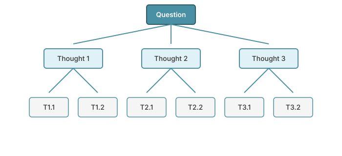
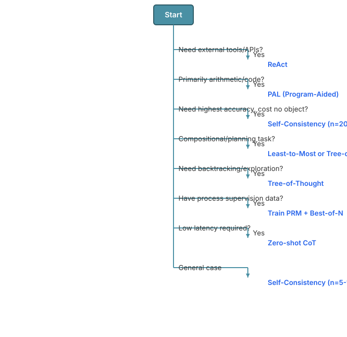

# Chapter 29: Reasoning and Chain-of-Thought

Reasoning is a critical capability for large language models to solve complex problems, especially in domains like mathematics, programming, and logical inference. This chapter explores how LLMs can be prompted or trained to exhibit improved reasoning through explicit intermediate steps, verification mechanisms, and test-time compute scaling.

## Table of Contents

1. [Introduction to Reasoning in LLMs](#introduction)
2. [Chain-of-Thought Prompting](#chain-of-thought-prompting)
3. [Self-Consistency and Voting](#self-consistency)
4. [Least-to-Most Prompting](#least-to-most)
5. [Program-Aided Language Models (PAL)](#program-aided)
6. [ReAct: Reasoning and Acting](#react)
7. [Tree-of-Thought Reasoning](#tree-of-thought)
8. [Process Reward Models (PRMs)](#process-reward-models)
9. [Reasoning Traces and Verification](#reasoning-traces)
10. [Test-Time Compute Scaling](#test-time-compute)
11. [Method Selection Guide](#method-selection)
12. [Failure Modes and Mitigation](#failure-modes)
13. [Benchmark Results](#benchmark-results)
14. [Implementation: Building a Reasoning System](#implementation)
15. [Exercises](#exercises)

## Introduction to Reasoning in LLMs {#introduction}

Traditional language models generate responses in a single forward pass, potentially missing intermediate reasoning steps that would lead to better answers. Reasoning techniques address this by:

1. **Explicit intermediate steps**: Breaking down complex problems into manageable sub-problems
2. **Self-verification**: Checking the validity of reasoning steps
3. **Search and planning**: Exploring multiple reasoning paths
4. **Process supervision**: Rewarding correct reasoning processes, not just final answers

### Why Reasoning Matters

For complex tasks like multi-step mathematics, code generation, or logical puzzles, direct answer prediction often fails. Reasoning allows models to:

- **Decompose** problems into simpler steps
- **Backtrack** when encountering errors
- **Verify** intermediate results
- **Scale compute** at test time (more computation → better results)

## Chain-of-Thought Prompting {#chain-of-thought-prompting}

Chain-of-Thought (CoT) prompting, introduced by Wei et al. (2022), demonstrates that LLMs can be prompted to generate intermediate reasoning steps before producing a final answer.

### Basic Chain-of-Thought

The key insight: Simply adding "Let's think step by step" or providing examples with reasoning steps dramatically improves performance on reasoning tasks.

**Standard Prompting:**
```
Q: Roger has 5 tennis balls. He buys 2 more cans of tennis balls.
Each can has 3 tennis balls. How many tennis balls does he have now?
A: 11
```

**Chain-of-Thought Prompting:**
```
Q: Roger has 5 tennis balls. He buys 2 more cans of tennis balls.
Each can has 3 tennis balls. How many tennis balls does he have now?
A: Roger started with 5 balls. 2 cans of 3 tennis balls each is 6 tennis balls.
5 + 6 = 11. The answer is 11.
```

### Zero-Shot CoT

Kojima et al. (2022) showed that simply appending "Let's think step by step" to the prompt enables zero-shot reasoning:

#### Problem Being Solved

Traditional language models often jump directly to conclusions without showing their work. For reasoning tasks, this leads to:
- Mistakes in multi-step problems
- No visibility into where errors occur
- Difficulty in debugging wrong answers

Zero-shot CoT addresses this by triggering the model's latent reasoning capabilities through a simple prompt suffix, requiring no task-specific examples.

#### Theoretical Justification

The key insight is that large language models have implicitly learned to decompose problems during training (from seeing worked examples in their training data), but need an explicit trigger to activate this capability. The prompt "Let's think step by step" acts as a **reasoning mode switch**, shifting the model from direct answer prediction to step-by-step problem solving.

Formally, we're changing the generation objective from:
```math
P(a|q) \quad \text{(direct answer)}
```
to:
```math
P(r, a|q, \text{"Let's think step by step"}) \quad \text{(reasoning + answer)}
```

#### Comparison to Alternatives

- **vs Direct prompting**: Zero-shot CoT adds 6 words but improves accuracy by 10-40% on reasoning tasks
- **vs Few-shot CoT**: No examples needed, works across domains, but slightly lower accuracy
- **vs Fine-tuning**: No training required, works with any pre-trained model

#### Key Insights

1. **Emergent ability**: Only works with sufficiently large models (>10B parameters)
2. **Two-stage process**: First generate reasoning, then extract answer (prevents reasoning from being cut short)
3. **Temperature matters**: Higher temperature (0.7) for diverse reasoning, lower (0.0) for final answer extraction
4. **Domain-general**: Same prompt works for math, logic, common sense reasoning

```python
def zero_shot_cot(model, tokenizer, question, device="cuda"):
    """
    Zero-shot Chain-of-Thought prompting.

    Args:
        model: Pre-trained language model
        tokenizer: Corresponding tokenizer
        question: The question to answer
        device: Device to run on

    Returns:
        reasoning: The reasoning trace
        answer: The extracted answer
    """
    # Step 1: Generate reasoning with CoT prompt
    cot_prompt = f"{question}\nLet's think step by step."

    inputs = tokenizer(cot_prompt, return_tensors="pt").to(device)

    with torch.no_grad():
        reasoning_output = model.generate(
            **inputs,
            max_new_tokens=256,
            temperature=0.7,
            do_sample=True,
            pad_token_id=tokenizer.eos_token_id
        )

    reasoning = tokenizer.decode(reasoning_output[0], skip_special_tokens=True)

    # Step 2: Extract answer with second prompt
    extract_prompt = f"{reasoning}\nTherefore, the answer is:"

    inputs = tokenizer(extract_prompt, return_tensors="pt").to(device)

    with torch.no_grad():
        answer_output = model.generate(
            **inputs,
            max_new_tokens=32,
            temperature=0.0,
            do_sample=False,
            pad_token_id=tokenizer.eos_token_id
        )

    answer = tokenizer.decode(answer_output[0], skip_special_tokens=True)

    return reasoning, answer


# Example usage
import torch
from transformers import AutoModelForCausalLM, AutoTokenizer

# Load a model (e.g., Llama, Mistral, etc.)
model_name = "meta-llama/Llama-2-7b-hf"
model = AutoModelForCausalLM.from_pretrained(model_name, torch_dtype=torch.bfloat16)
tokenizer = AutoTokenizer.from_pretrained(model_name)
model.to("cuda")

question = "If a train travels 60 miles per hour for 2.5 hours, how far does it travel?"
reasoning, answer = zero_shot_cot(model, tokenizer, question)
print(f"Reasoning: {reasoning}")
print(f"Answer: {answer}")
```

### Few-Shot CoT

Few-shot CoT provides examples with reasoning steps in the prompt:

```python
def few_shot_cot(model, tokenizer, question, examples, device="cuda"):
    """
    Few-shot Chain-of-Thought prompting with examples.

    Args:
        model: Pre-trained language model
        tokenizer: Corresponding tokenizer
        question: The question to answer
        examples: List of (question, reasoning, answer) tuples
        device: Device to run on

    Returns:
        reasoning: The reasoning trace
        answer: The final answer
    """
    # Build prompt with examples
    prompt_parts = []

    for ex_q, ex_reasoning, ex_answer in examples:
        prompt_parts.append(f"Q: {ex_q}")
        prompt_parts.append(f"A: {ex_reasoning} The answer is {ex_answer}.")
        prompt_parts.append("")

    prompt_parts.append(f"Q: {question}")
    prompt_parts.append("A:")

    prompt = "\n".join(prompt_parts)

    inputs = tokenizer(prompt, return_tensors="pt").to(device)

    with torch.no_grad():
        output = model.generate(
            **inputs,
            max_new_tokens=256,
            temperature=0.7,
            do_sample=True,
            pad_token_id=tokenizer.eos_token_id
        )

    full_response = tokenizer.decode(output[0], skip_special_tokens=True)

    # Extract the answer part after the last "A:"
    response = full_response.split("A:")[-1].strip()

    # Try to extract final answer
    if "The answer is" in response:
        reasoning = response.split("The answer is")[0].strip()
        answer = response.split("The answer is")[1].strip().rstrip(".")
    else:
        reasoning = response
        answer = ""

    return reasoning, answer


# Example with few-shot examples
examples = [
    (
        "John has 3 apples. He gives 1 to Mary. How many does he have?",
        "John started with 3 apples. He gave away 1 apple. 3 - 1 = 2.",
        "2"
    ),
    (
        "A box contains 12 red balls and 8 blue balls. What fraction are red?",
        "Total balls = 12 + 8 = 20. Red balls = 12. Fraction = 12/20 = 3/5.",
        "3/5"
    )
]

question = "Sarah has $50. She spends $12 on lunch and $15 on a book. How much does she have left?"
reasoning, answer = few_shot_cot(model, tokenizer, question, examples)
print(f"Reasoning: {reasoning}")
print(f"Answer: {answer}")
```

### Mathematical Formulation

Chain-of-thought can be viewed as decomposing the probability distribution:

```math
P(a|q) = \sum_{r \in \mathcal{R}} P(a|r, q) P(r|q)
```

Where:
- $q$ is the question
- $a$ is the answer
- $r$ is the reasoning trace
- $\mathcal{R}$ is the space of all possible reasoning traces

In practice, we approximate by sampling or greedily generating a single reasoning trace $r^*$:

```math
a^* \approx \arg\max_a P(a|r^*, q) \text{ where } r^* = \arg\max_r P(r|q)
```

**References:**
- [Chain-of-Thought Prompting Elicits Reasoning in Large Language Models (Wei et al., 2022)](https://arxiv.org/abs/2201.11903)
- [Large Language Models are Zero-Shot Reasoners (Kojima et al., 2022)](https://arxiv.org/abs/2205.11916)

## Self-Consistency and Voting {#self-consistency}

Self-consistency, proposed by Wang et al. (2022), improves CoT by sampling multiple reasoning paths and taking a majority vote on the final answer.

### Algorithm

1. Generate $N$ diverse reasoning paths using temperature sampling
2. Extract the final answer from each path
3. Return the most common answer (majority vote)

### Why It Works

Different reasoning paths may make different mistakes, but correct reasoning is more likely to converge to the same answer. This is related to ensemble methods in machine learning.

### Implementation

#### Problem Being Solved

Single-path CoT is susceptible to accidental errors: a small mistake early in reasoning can cascade into a wrong final answer. Even with correct methodology, the stochastic nature of sampling means different runs may produce different answers - some correct, some wrong.

Self-consistency addresses this by treating reasoning as a **stochastic process** where multiple samples from the distribution $P(r|q)$ are more reliable than a single sample.

#### Theoretical Foundation

Self-consistency is based on the **wisdom of crowds** principle from ensemble learning:

```math
a^* = \text{argmax}_a \sum_{r \in \mathcal{R}} P(a|r, q) P(r|q) \approx \text{mode}\{a_1, a_2, ..., a_N\}
```

where we approximate the marginalized distribution over reasoning paths by sampling $N$ paths and taking a majority vote.

**Why this works:**
1. **Error diversity**: Different samples make different mistakes, but correct reasoning converges
2. **Noise averaging**: Random errors cancel out across multiple samples
3. **Robustness**: Even if some paths fail, the majority can succeed

This is analogous to **Bayesian Model Averaging** where we average over multiple hypotheses weighted by their probability.

#### Relation to Alternatives

- **vs Single CoT**: 5-10x more compute, but 10-20% higher accuracy
- **vs Best-of-N with verifier**: Simpler (no verifier needed), but less effective if good verifier available
- **vs Beam search**: Non-greedy, explores diverse paths rather than top-K local choices

#### Key Implementation Insights

1. **Temperature-diversity tradeoff**: Higher temperature ($T=0.7-0.9$) gives diverse paths but may reduce quality
2. **Answer extraction robustness**: Need reliable parser to extract final answers consistently
3. **Optimal sample size**: Returns diminish after N=10-20 for most tasks (accuracy vs compute tradeoff)
4. **Discrete answer spaces**: Works best when answers are categorical or numerical (easy to vote on)

```python
import torch
from collections import Counter
import re

def extract_answer(text):
    """
    Extract numerical answer from reasoning text.
    Handles various formats like "The answer is X" or just a number.
    """
    # Try to find "answer is X" pattern
    patterns = [
        r"[Tt]he answer is[:\s]+([0-9.,]+)",
        r"[Aa]nswer:[:\s]+([0-9.,]+)",
        r"=\s*([0-9.,]+)\s*$",
    ]

    for pattern in patterns:
        match = re.search(pattern, text)
        if match:
            return match.group(1).replace(",", "")

    # Fallback: find last number in text
    numbers = re.findall(r"([0-9.,]+)", text)
    if numbers:
        return numbers[-1].replace(",", "")

    return None


def self_consistency(model, tokenizer, question, num_samples=5, temperature=0.7, device="cuda"):
    """
    Self-consistency with Chain-of-Thought.

    Args:
        model: Pre-trained language model
        tokenizer: Corresponding tokenizer
        question: The question to answer
        num_samples: Number of reasoning paths to sample
        temperature: Sampling temperature (higher = more diverse)
        device: Device to run on

    Returns:
        final_answer: The majority-voted answer
        all_answers: List of all sampled answers with their reasoning
        vote_counts: Counter of answer frequencies
    """
    prompt = f"{question}\nLet's think step by step."
    inputs = tokenizer(prompt, return_tensors="pt").to(device)

    all_answers = []

    # Sample multiple reasoning paths
    for i in range(num_samples):
        with torch.no_grad():
            output = model.generate(
                **inputs,
                max_new_tokens=256,
                temperature=temperature,
                do_sample=True,
                pad_token_id=tokenizer.eos_token_id,
                top_p=0.95,  # Nucleus sampling for diversity
            )

        reasoning = tokenizer.decode(output[0], skip_special_tokens=True)
        answer = extract_answer(reasoning)

        all_answers.append({
            "reasoning": reasoning,
            "answer": answer,
            "sample_id": i
        })

    # Extract valid answers and vote
    valid_answers = [a["answer"] for a in all_answers if a["answer"] is not None]

    if not valid_answers:
        return None, all_answers, Counter()

    vote_counts = Counter(valid_answers)
    final_answer = vote_counts.most_common(1)[0][0]

    return final_answer, all_answers, vote_counts


# Example usage
question = "If a store sells 3 apples for $2, how much do 12 apples cost?"

final_answer, all_answers, vote_counts = self_consistency(
    model, tokenizer, question, num_samples=10, temperature=0.8
)

print(f"Question: {question}")
print(f"\nSampled answers and their frequencies:")
for answer, count in vote_counts.most_common():
    print(f"  {answer}: {count} votes")

print(f"\nFinal answer (majority vote): {final_answer}")

# Show some reasoning paths
print("\nExample reasoning paths:")
for i, sample in enumerate(all_answers[:3]):
    print(f"\nPath {i+1}:")
    print(f"  Answer: {sample['answer']}")
    print(f"  Reasoning: {sample['reasoning'][:200]}...")
```

### Performance Analysis

Self-consistency typically improves accuracy by 5-20% over single-path CoT, especially on tasks where:
- Multiple valid reasoning approaches exist
- The model has sufficient capability but is prone to occasional errors
- Answer space is discrete (e.g., multiple choice, numerical)

**Reference:**
- [Self-Consistency Improves Chain of Thought Reasoning in Language Models (Wang et al., 2022)](https://arxiv.org/abs/2203.11171)

## Least-to-Most Prompting {#least-to-most}

Least-to-Most prompting, proposed by Zhou et al. (2022), breaks down complex problems into simpler subproblems and solves them sequentially. This approach is particularly effective for compositional generalization tasks.

### Key Principles

1. **Decomposition**: Break the problem into a sequence of subproblems
2. **Sequential solving**: Solve subproblems from easiest to hardest
3. **Context building**: Use solutions to earlier subproblems to solve later ones

### Two-Stage Process

**Stage 1: Problem Decomposition**
```
Problem: [complex problem]
To solve this, we need to solve these subproblems:
1. [easiest subproblem]
2. [intermediate subproblem]
3. [hardest subproblem using previous solutions]
```

**Stage 2: Sequential Solution**
```
Subproblem 1: [easiest]
Solution 1: [answer]

Subproblem 2: [intermediate], given that [solution 1]
Solution 2: [answer]

Final problem: [original], given that [solutions 1 and 2]
Final answer: [answer]
```

### Implementation

#### Problem Being Solved

Complex problems often require **compositional reasoning** - breaking down into subproblems that must be solved in order. Standard CoT may struggle with:
- Long dependency chains (solution to step 5 depends on steps 1-4)
- Compositional generalization (combining learned sub-skills in new ways)
- Problems longer than what was seen during training

Least-to-Most explicitly structures the problem-solving process to build solutions hierarchically.

#### Theoretical Justification

This approach is inspired by **curriculum learning** and **dynamic programming**. The key idea is that complex problems can be factored into:

```math
P(a|q) = P(a | s_n, s_{n-1}, ..., s_1, q) \prod_{i=1}^{n} P(s_i | s_{i-1}, ..., s_1, q)
```

where $s_i$ are subproblem solutions. By solving subproblems sequentially, we:
1. Reduce cognitive load at each step
2. Build context incrementally (each solution helps solve the next)
3. Enable **compositional generalization** - solving harder problems by combining easier ones

This is analogous to **hierarchical planning** in reinforcement learning, where high-level goals are decomposed into low-level actions.

#### How This Relates to Alternatives

- **vs Standard CoT**: More structured, better for long chains, but requires 2+ phases (decomposition + solving)
- **vs Tree-of-Thought**: Linear decomposition vs tree exploration; cheaper but less flexible
- **vs ReAct**: Predetermined decomposition vs dynamic tool use
- **vs Recursion**: Makes the recursive structure explicit in prompts

#### Key Insights That Make It Work

1. **Explicit decomposition phase**: Separating "what to solve" from "how to solve" reduces errors
2. **Context accumulation**: Each subproblem solution becomes context for the next (unlike independent CoT)
3. **Curriculum effect**: Starting with easy subproblems warms up the model's reasoning
4. **Bottom-up construction**: Building from primitives to complex (vs top-down CoT)

```python
def least_to_most_prompting(model, tokenizer, problem, device="cuda"):
    """
    Least-to-Most prompting: decompose then solve sequentially.

    Args:
        model: Language model
        tokenizer: Tokenizer
        problem: Complex problem to solve
        device: Device to use

    Returns:
        final_answer: Answer to the original problem
        subproblems: List of subproblems
        subsolutions: List of solutions to subproblems
    """
    # Stage 1: Decompose the problem
    decomposition_prompt = f"""Problem: {problem}

To solve this problem, let's break it down into simpler subproblems.
List the subproblems we need to solve, from easiest to hardest:

Subproblems:
1."""

    inputs = tokenizer(decomposition_prompt, return_tensors="pt").to(device)

    with torch.no_grad():
        output = model.generate(
            **inputs,
            max_new_tokens=200,
            temperature=0.5,
            do_sample=True,
            pad_token_id=tokenizer.eos_token_id,
        )

    decomposition = tokenizer.decode(output[0], skip_special_tokens=True)

    # Extract subproblems (simple parsing)
    import re
    subproblem_pattern = r'\d+\.\s*([^\n]+)'
    subproblems = re.findall(subproblem_pattern, decomposition.split("Subproblems:")[1])

    # Stage 2: Solve sequentially
    subsolutions = []
    context = ""

    for i, subproblem in enumerate(subproblems):
        # Build prompt with context from previous solutions
        if i == 0:
            solve_prompt = f"""Subproblem: {subproblem}

Let's solve this step by step.

Solution:"""
        else:
            solve_prompt = f"""We previously found:
{context}

Now solve: {subproblem}

Let's solve this step by step.

Solution:"""

        inputs = tokenizer(solve_prompt, return_tensors="pt").to(device)

        with torch.no_grad():
            output = model.generate(
                **inputs,
                max_new_tokens=150,
                temperature=0.3,
                do_sample=True,
                pad_token_id=tokenizer.eos_token_id,
            )

        solution = tokenizer.decode(output[0], skip_special_tokens=True)
        solution_text = solution.split("Solution:")[-1].strip()

        subsolutions.append({
            "subproblem": subproblem,
            "solution": solution_text,
            "index": i
        })

        # Update context
        context += f"\n{i+1}. {subproblem} → {solution_text}"

    # Stage 3: Solve original problem with all context
    final_prompt = f"""Original problem: {problem}

We solved these subproblems:
{context}

Using these results, the final answer is:"""

    inputs = tokenizer(final_prompt, return_tensors="pt").to(device)

    with torch.no_grad():
        output = model.generate(
            **inputs,
            max_new_tokens=100,
            temperature=0.3,
            do_sample=True,
            pad_token_id=tokenizer.eos_token_id,
        )

    final_response = tokenizer.decode(output[0], skip_special_tokens=True)
    final_answer = extract_answer(final_response)

    return {
        "final_answer": final_answer,
        "subproblems": subproblems,
        "subsolutions": subsolutions,
        "full_context": context,
    }


# Example usage
problem = """Calculate the total cost if you buy 3 books at $12 each,
2 notebooks at $5 each, get a 10% discount on the total,
and then add 8% sales tax."""

result = least_to_most_prompting(model, tokenizer, problem)

print("Original problem:", problem)
print("\nSubproblems identified:")
for i, sp in enumerate(result["subproblems"], 1):
    print(f"  {i}. {sp}")

print("\nSolutions:")
for sol in result["subsolutions"]:
    print(f"  {sol['index']+1}. {sol['subproblem']}")
    print(f"     → {sol['solution'][:100]}...")

print(f"\nFinal answer: {result['final_answer']}")
```

### When Least-to-Most Works Best

Least-to-Most prompting excels at:
- **Compositional tasks**: Problems with clear substructure
- **Multi-step calculations**: Sequential dependencies between steps
- **Planning problems**: Tasks requiring ordered actions
- **Long reasoning chains**: Complex problems that overwhelm single CoT

### Comparison to Chain-of-Thought

| Aspect | Chain-of-Thought | Least-to-Most |
|--------|------------------|---------------|
| **Structure** | Single continuous reasoning | Explicit decomposition phase |
| **Subproblem identification** | Implicit | Explicit |
| **Context management** | Linear flow | Hierarchical building |
| **Best for** | General reasoning | Compositional/planning tasks |
| **Computational cost** | Single pass (or N for self-consistency) | 2+ passes (decompose + solve each) |

**Reference:**
- [Least-to-Most Prompting Enables Complex Reasoning in Large Language Models (Zhou et al., 2022)](https://arxiv.org/abs/2205.10625)

## Program-Aided Language Models (PAL) {#program-aided}

Program-Aided Language Models (PAL), introduced by Gao et al. (2023), use code generation and execution to solve reasoning problems. Instead of solving problems in natural language, the model generates Python code that performs the computation.

### Key Idea

Traditional CoT:
```
Question: What is 17 * 23 + 45?
Let's solve: 17 * 23 = 391, then 391 + 45 = 436
```

PAL approach:
```python
# Question: What is 17 * 23 + 45?
result = 17 * 23 + 45
print(result)  # 436
```

### Why PAL Works

1. **Offload computation**: Use Python interpreter for precise arithmetic
2. **Reduce errors**: No manual calculation mistakes
3. **Symbolic manipulation**: Handle algebra, equations, complex math
4. **Verifiable**: Code execution is deterministic
5. **Compositional**: Easy to build complex solutions from simple functions

### Implementation

#### Problem Being Solved

Natural language reasoning is inherently approximate and error-prone for precise computation. LLMs often make **arithmetic errors** even in basic calculations:
- "347 × 23 = 7,871" (Correct: 7,981)
- Manual multi-step calculations accumulate rounding errors
- No way to verify intermediate computational steps

PAL solves this by delegating the computation to a **symbolic executor** (Python interpreter) while the LLM handles the **semantic understanding** (translating problem to code).

#### Theoretical Justification

PAL is based on the **neuro-symbolic** paradigm, combining:
1. **Neural** (LLM): Natural language understanding, problem formulation
2. **Symbolic** (code execution): Precise computation, logical operations

The division of labor is:
```math
\text{LLM}: \text{Problem} \rightarrow \text{Code} \quad\quad \text{Interpreter}: \text{Code} \rightarrow \text{Answer}
```

This exploits the complementary strengths of each system:
- **LLMs excel at**: Parsing natural language, identifying relevant operations, structuring logic
- **Interpreters excel at**: Exact arithmetic, symbolic manipulation, algorithmic execution

This is analogous to **tool use in cognitive science**: humans use calculators for arithmetic while applying reasoning to problem setup.

#### How This Relates to Alternatives

- **vs Natural Language CoT**: 10-20% higher accuracy on math, but requires code execution infrastructure
- **vs Calculator-augmented**: More general (can handle loops, conditions, data structures), not just arithmetic
- **vs Fine-tuning for math**: Works immediately with any LLM, no training needed
- **vs Formal methods**: More flexible (handles approximation), less rigorous (no formal proofs)

#### Key Insights That Make It Work

1. **Separation of concerns**: LLM focuses on "what to compute", Python on "how to compute it"
2. **Deterministic verification**: Code output can be verified, debugged, and trusted
3. **Compositionality**: Complex problems naturally decompose into functions and variables
4. **Error localization**: When wrong, easy to identify if error is in code generation or problem understanding
5. **Bootstrapping**: Can use code output to guide natural language explanation

```python
import ast
import contextlib
import io
from typing import Dict, Any, Optional

def program_aided_reasoning(model, tokenizer, question, device="cuda"):
    """
    Program-Aided Language Models: Generate and execute code to solve problems.

    Args:
        model: Language model
        tokenizer: Tokenizer
        question: Problem to solve
        device: Device to use

    Returns:
        Dictionary with code, execution result, and answer
    """
    # Prompt model to generate Python code
    pal_prompt = f"""Solve this problem by writing Python code.
Write code that computes the answer and stores it in a variable called 'answer'.

Question: {question}

Python code:
```python
# {question}
"""

    inputs = tokenizer(pal_prompt, return_tensors="pt").to(device)

    with torch.no_grad():
        output = model.generate(
            **inputs,
            max_new_tokens=300,
            temperature=0.2,  # Low temperature for precise code
            do_sample=True,
            pad_token_id=tokenizer.eos_token_id,
            stop_strings=["```"],
        )

    response = tokenizer.decode(output[0], skip_special_tokens=True)

    # Extract code between markers
    import re
    code_pattern = r'```python\s*(.*?)```'
    matches = re.findall(code_pattern, response, re.DOTALL)

    if matches:
        code = matches[0].strip()
    else:
        # Try to extract code without markers
        code = response.split("Python code:")[-1].strip()
        # Remove any leading/trailing markers
        code = code.strip('`').strip()

    # Execute code safely
    result = safe_execute_code(code)

    return {
        "question": question,
        "code": code,
        "execution_result": result,
        "answer": result.get("answer"),
        "success": result.get("success", False),
    }


def safe_execute_code(code: str, timeout: int = 5) -> Dict[str, Any]:
    """
    Safely execute generated Python code with restrictions.

    Args:
        code: Python code to execute
        timeout: Maximum execution time in seconds

    Returns:
        Dictionary with execution results
    """
    # Create restricted namespace
    # Only allow safe built-ins and math operations
    safe_builtins = {
        'abs': abs,
        'round': round,
        'min': min,
        'max': max,
        'sum': sum,
        'len': len,
        'range': range,
        'enumerate': enumerate,
        'zip': zip,
        'sorted': sorted,
        'list': list,
        'dict': dict,
        'set': set,
        'tuple': tuple,
        'int': int,
        'float': float,
        'str': str,
        'bool': bool,
    }

    # Add math module
    import math
    namespace = {
        '__builtins__': safe_builtins,
        'math': math,
    }

    # Capture stdout
    stdout_capture = io.StringIO()

    try:
        # Execute code with timeout and captured output
        with contextlib.redirect_stdout(stdout_capture):
            # Parse to check for dangerous operations
            tree = ast.parse(code)

            # Check for dangerous operations (imports, file I/O, etc.)
            for node in ast.walk(tree):
                if isinstance(node, (ast.Import, ast.ImportFrom)):
                    # Allow only math imports
                    if isinstance(node, ast.Import):
                        if not all(alias.name == 'math' for alias in node.names):
                            return {
                                "success": False,
                                "error": "Only 'math' module imports are allowed",
                                "answer": None,
                            }
                if isinstance(node, ast.Call):
                    if isinstance(node.func, ast.Name):
                        # Disallow dangerous functions
                        dangerous = ['exec', 'eval', 'compile', '__import__', 'open']
                        if node.func.id in dangerous:
                            return {
                                "success": False,
                                "error": f"Dangerous function '{node.func.id}' not allowed",
                                "answer": None,
                            }

            # Execute the code
            exec(code, namespace)

            # Get the answer variable
            answer = namespace.get('answer')
            stdout = stdout_capture.getvalue()

            return {
                "success": True,
                "answer": answer,
                "stdout": stdout,
                "namespace": {k: v for k, v in namespace.items()
                            if not k.startswith('__')},
            }

    except SyntaxError as e:
        return {
            "success": False,
            "error": f"Syntax error: {str(e)}",
            "answer": None,
        }
    except Exception as e:
        return {
            "success": False,
            "error": f"Execution error: {str(e)}",
            "answer": None,
        }


# Example usage
questions = [
    "What is the sum of all even numbers from 1 to 100?",
    "If a car travels 60 mph for 2.5 hours, then 40 mph for 1.5 hours, what's the total distance?",
    "Calculate the compound interest on $1000 at 5% annual rate for 3 years.",
]

print("=" * 80)
print("PROGRAM-AIDED LANGUAGE MODEL (PAL)")
print("=" * 80)

for question in questions:
    print(f"\nQuestion: {question}")
    result = program_aided_reasoning(model, tokenizer, question)

    print(f"\nGenerated code:")
    print(result["code"])

    if result["success"]:
        print(f"\nAnswer: {result['answer']}")
    else:
        print(f"\nExecution failed: {result['execution_result'].get('error')}")
    print("-" * 80)
```

### PAL with Few-Shot Examples

Providing examples helps the model generate better code:

```python
def pal_few_shot(model, tokenizer, question, examples, device="cuda"):
    """
    Program-Aided reasoning with few-shot examples.

    Args:
        model: Language model
        tokenizer: Tokenizer
        question: Question to solve
        examples: List of (question, code, answer) tuples
        device: Device to use
    """
    # Build prompt with examples
    prompt_parts = ["Let's solve math problems by writing Python code.\n"]

    for ex_q, ex_code, ex_answer in examples:
        prompt_parts.append(f"Question: {ex_q}")
        prompt_parts.append("```python")
        prompt_parts.append(ex_code)
        prompt_parts.append("```")
        prompt_parts.append(f"Answer: {ex_answer}\n")

    prompt_parts.append(f"Question: {question}")
    prompt_parts.append("```python")

    prompt = "\n".join(prompt_parts)

    inputs = tokenizer(prompt, return_tensors="pt").to(device)

    with torch.no_grad():
        output = model.generate(
            **inputs,
            max_new_tokens=250,
            temperature=0.2,
            do_sample=True,
            pad_token_id=tokenizer.eos_token_id,
        )

    response = tokenizer.decode(output[0], skip_special_tokens=True)

    # Extract generated code
    code = response.split("```python")[-1].split("```")[0].strip()

    # Execute
    result = safe_execute_code(code)

    return {
        "code": code,
        "answer": result.get("answer"),
        "success": result.get("success", False),
    }


# Example with few-shot prompting
examples = [
    (
        "What is 15% of 80?",
        "answer = 0.15 * 80",
        "12.0"
    ),
    (
        "How many seconds are in 2 hours and 30 minutes?",
        "hours = 2\nminutes = 30\nanswer = hours * 3600 + minutes * 60",
        "9000"
    ),
]

question = "A rectangle has length 12 and width 8. What is its perimeter?"
result = pal_few_shot(model, tokenizer, question, examples)
print(f"Question: {question}")
print(f"Code:\n{result['code']}")
print(f"Answer: {result['answer']}")
```

### Advantages and Limitations

**Advantages:**
- Eliminates arithmetic errors
- Handles complex calculations (logarithms, trigonometry, etc.)
- Verifiable and reproducible
- Can leverage external libraries (with proper sandboxing)
- Natural for algorithmic problems

**Limitations:**
- Requires code execution infrastructure
- Security concerns (must sandbox execution)
- Not suitable for all reasoning types (e.g., common sense, ethics)
- Model must be capable of generating correct code
- Debugging generated code can be difficult

**Reference:**
- [PAL: Program-aided Language Models (Gao et al., 2023)](https://arxiv.org/abs/2211.10435)

## ReAct: Reasoning and Acting {#react}

ReAct (Reasoning + Acting), proposed by Yao et al. (2023), interleaves reasoning traces with action execution, enabling LLMs to interact with external environments and tools.

### Core Concept

Instead of just thinking or just acting, ReAct combines both in an alternating pattern:

```
Thought 1: I need to find information about X
Action 1: Search[X]
Observation 1: [search results]
Thought 2: The results show Y, now I need to find Z
Action 2: Search[Z]
Observation 2: [search results]
Thought 3: Based on observations, the answer is...
Action 3: Finish[answer]
```

### Architecture

ReAct extends CoT with action primitives:
- **Thought**: Internal reasoning step (like CoT)
- **Action**: External action to execute (search, calculate, look up, etc.)
- **Observation**: Result from executing the action

### Implementation

#### Problem Being Solved

Pure reasoning (CoT) operates in a **closed world** - the model can only use information present in its weights. This fails for tasks requiring:
- **External knowledge**: Real-time information not in training data
- **Tool use**: Computation, search, APIs
- **Environment interaction**: Web navigation, database queries
- **Grounding**: Verifying reasoning against real-world facts

ReAct creates an **open-world reasoning system** where the model can gather information and take actions to solve problems.

#### Theoretical Justification

ReAct is inspired by the **sense-plan-act** cycle in robotics and the **dual-process theory** in cognitive science:

1. **System 1 (Thought)**: Internal reasoning, planning next action
2. **System 2 (Action)**: External interaction, gathering information
3. **Feedback (Observation)**: Results that inform next thought

The key insight is the **synergy between reasoning and acting**:
- **Reasoning helps acting**: Thoughts guide which actions to take
- **Acting helps reasoning**: Observations ground reasoning in reality, correct errors

Formally, this creates a feedback loop:
```math
t_1 \rightarrow a_1 \rightarrow o_1 \rightarrow t_2 \rightarrow a_2 \rightarrow o_2 \rightarrow ... \rightarrow a_{\text{final}}
```

This is a form of **interactive planning** where the agent updates its plan based on environmental feedback.

#### How This Relates to Alternatives

- **vs CoT**: Can access external info, self-correct via observations, but higher latency
- **vs PAL**: More general tool use (not just code), but less structured
- **vs Tool-augmented LLMs**: Explicit reasoning trace (interpretable), built-in error handling
- **vs RL agents**: No training needed, works with pretrained LLMs, but less robust

#### Key Insights That Make It Work

1. **Interleaving is crucial**: Alternating thought/action prevents premature commitment and enables course correction
2. **Observations ground reasoning**: Real-world feedback catches hallucinations and errors
3. **Explicit traces**: Thought/action/observation format enables debugging and interpretability
4. **Tool modularity**: Easy to add new tools without retraining (just update tool descriptions)
5. **Error recovery**: If action fails, next thought can adapt strategy

```python
from typing import Dict, List, Callable, Optional
import json

class ReActAgent:
    """
    ReAct agent that combines reasoning with action execution.
    """

    def __init__(self, model, tokenizer, tools: Dict[str, Callable], device="cuda"):
        """
        Args:
            model: Language model
            tokenizer: Tokenizer
            tools: Dictionary mapping tool names to callable functions
            device: Device to use
        """
        self.model = model
        self.tokenizer = tokenizer
        self.tools = tools
        self.device = device

    def parse_action(self, text: str) -> Optional[tuple]:
        """
        Parse action from text.

        Expected format: Action: ToolName[argument]

        Returns:
            (tool_name, argument) or None if no action found
        """
        import re
        pattern = r'Action:\s*(\w+)\[(.*?)\]'
        match = re.search(pattern, text)

        if match:
            tool_name = match.group(1)
            argument = match.group(2).strip()
            return (tool_name, argument)

        return None

    def execute_action(self, tool_name: str, argument: str) -> str:
        """
        Execute an action using available tools.

        Args:
            tool_name: Name of the tool
            argument: Argument to pass to the tool

        Returns:
            Observation from executing the action
        """
        if tool_name not in self.tools:
            return f"Error: Unknown tool '{tool_name}'. Available tools: {list(self.tools.keys())}"

        try:
            result = self.tools[tool_name](argument)
            return str(result)
        except Exception as e:
            return f"Error executing {tool_name}: {str(e)}"

    def solve(self, question: str, max_steps: int = 10) -> Dict:
        """
        Solve a question using ReAct (reasoning + acting).

        Args:
            question: Question to answer
            max_steps: Maximum number of thought-action cycles

        Returns:
            Dictionary with solution, reasoning trace, and actions taken
        """
        # Build initial prompt
        prompt = f"""Solve this question by alternating between Thought, Action, and Observation.

Available actions:
{self._format_tool_descriptions()}

Question: {question}

Let's solve this step by step using the Thought/Action/Observation format.

Thought 1:"""

        history = []
        current_text = prompt

        for step in range(max_steps):
            # Generate next thought
            inputs = self.tokenizer(current_text, return_tensors="pt").to(self.device)

            with torch.no_grad():
                output = self.model.generate(
                    **inputs,
                    max_new_tokens=150,
                    temperature=0.5,
                    do_sample=True,
                    pad_token_id=self.tokenizer.eos_token_id,
                )

            response = self.tokenizer.decode(output[0], skip_special_tokens=True)

            # Extract new content
            new_content = response[len(current_text):].strip()

            # Check if this is a final answer
            if "Finish[" in new_content or "Final Answer:" in new_content:
                # Extract final answer
                import re
                finish_pattern = r'Finish\[(.*?)\]'
                match = re.search(finish_pattern, new_content)
                if match:
                    final_answer = match.group(1)
                else:
                    # Try to extract after "Final Answer:"
                    if "Final Answer:" in new_content:
                        final_answer = new_content.split("Final Answer:")[-1].strip()
                    else:
                        final_answer = new_content

                history.append({
                    "step": step + 1,
                    "thought": new_content,
                    "action": None,
                    "observation": None,
                })

                return {
                    "answer": final_answer,
                    "history": history,
                    "steps": step + 1,
                    "success": True,
                }

            # Parse action
            action = self.parse_action(new_content)

            if action:
                tool_name, argument = action

                # Execute action
                observation = self.execute_action(tool_name, argument)

                # Record step
                history.append({
                    "step": step + 1,
                    "thought": new_content.split("Action:")[0].strip(),
                    "action": f"{tool_name}[{argument}]",
                    "observation": observation,
                })

                # Update context
                current_text = f"""{current_text} {new_content}
Observation {step + 1}: {observation}
Thought {step + 2}:"""
            else:
                # No action found, just continue reasoning
                history.append({
                    "step": step + 1,
                    "thought": new_content,
                    "action": None,
                    "observation": None,
                })

                current_text = f"{current_text} {new_content}\nAction {step + 1}:"

        # Max steps reached
        return {
            "answer": None,
            "history": history,
            "steps": max_steps,
            "success": False,
            "error": "Maximum steps reached without finding answer",
        }

    def _format_tool_descriptions(self) -> str:
        """Format available tools for prompt."""
        descriptions = []
        for name, func in self.tools.items():
            # Get docstring if available
            doc = func.__doc__ or "No description"
            descriptions.append(f"- {name}: {doc.strip()}")
        return "\n".join(descriptions)


# Define some example tools
def search_wikipedia(query: str) -> str:
    """Search Wikipedia for information about a topic."""
    # Simplified mock implementation
    # In practice, use Wikipedia API
    mock_db = {
        "python": "Python is a high-level programming language created by Guido van Rossum in 1991.",
        "mount everest": "Mount Everest is Earth's highest mountain, standing at 8,849 meters (29,032 ft).",
        "photosynthesis": "Photosynthesis is the process by which plants convert light energy into chemical energy.",
    }

    query_lower = query.lower()
    for key, value in mock_db.items():
        if key in query_lower:
            return value

    return f"No information found for '{query}'"


def calculate(expression: str) -> float:
    """Calculate the result of a mathematical expression."""
    try:
        # Safe evaluation
        import ast
        import operator

        # Define safe operators
        ops = {
            ast.Add: operator.add,
            ast.Sub: operator.sub,
            ast.Mult: operator.mul,
            ast.Div: operator.truediv,
            ast.Pow: operator.pow,
        }

        def eval_expr(node):
            if isinstance(node, ast.Num):
                return node.n
            elif isinstance(node, ast.BinOp):
                return ops[type(node.op)](eval_expr(node.left), eval_expr(node.right))
            elif isinstance(node, ast.UnaryOp):
                if isinstance(node.op, ast.USub):
                    return -eval_expr(node.operand)
            raise ValueError(f"Unsupported operation: {node}")

        tree = ast.parse(expression, mode='eval')
        result = eval_expr(tree.body)
        return result
    except Exception as e:
        return f"Error: {str(e)}"


def lookup_fact(entity: str) -> str:
    """Look up a specific fact about an entity."""
    facts = {
        "earth": "Earth has a diameter of approximately 12,742 km",
        "moon": "The Moon orbits Earth at an average distance of 384,400 km",
        "sun": "The Sun is approximately 150 million km from Earth",
    }
    return facts.get(entity.lower(), f"No fact found for '{entity}'")


# Example usage
tools = {
    "Search": search_wikipedia,
    "Calculate": calculate,
    "Lookup": lookup_fact,
    "Finish": lambda x: x,  # Terminal action
}

agent = ReActAgent(model, tokenizer, tools, device="cuda")

question = "What is the height of Mount Everest in feet?"

print("=" * 80)
print("REACT: REASONING + ACTING")
print("=" * 80)
print(f"\nQuestion: {question}\n")

result = agent.solve(question, max_steps=8)

print("Reasoning trace:")
for entry in result["history"]:
    print(f"\nStep {entry['step']}:")
    if entry["thought"]:
        print(f"  Thought: {entry['thought']}")
    if entry["action"]:
        print(f"  Action: {entry['action']}")
    if entry["observation"]:
        print(f"  Observation: {entry['observation']}")

if result["success"]:
    print(f"\nFinal Answer: {result['answer']}")
else:
    print(f"\nFailed: {result.get('error')}")
```

### ReAct for Web Navigation

ReAct is particularly powerful for interactive tasks:

```python
# Example: Web navigation task
web_tools = {
    "Click": lambda element: f"Clicked on {element}",
    "Type": lambda text: f"Typed: {text}",
    "Search": lambda query: f"Search results for: {query}",
    "Read": lambda section: f"Content of {section}: [text content]",
    "Finish": lambda answer: answer,
}

web_agent = ReActAgent(model, tokenizer, web_tools)

task = "Find the release date of the movie Inception on a movie database website"
result = web_agent.solve(task, max_steps=10)
```

### Benefits of ReAct

1. **Grounding**: Actions provide real-world grounding for reasoning
2. **Error correction**: Observations can correct wrong reasoning paths
3. **Interpretability**: Clear trace of thoughts and actions
4. **Flexibility**: Can combine multiple tools and APIs
5. **Robustness**: Can recover from errors through observation feedback

### Comparison to Other Methods

| Method | Reasoning | Actions | Feedback |
|--------|-----------|---------|----------|
| **CoT** | Yes | No | No |
| **PAL** | Limited | Code execution only | Deterministic |
| **ReAct** | Yes | Yes (multiple tools) | Observation-based |
| **Agents** | Yes | Yes | Environment-based |

**Reference:**
- [ReAct: Synergizing Reasoning and Acting in Language Models (Yao et al., 2023)](https://arxiv.org/abs/2210.03629)

## Tree-of-Thought Reasoning {#tree-of-thought}

Tree-of-Thought (ToT), proposed by Yao et al. (2023), generalizes CoT by exploring a tree of reasoning steps rather than a single chain.

### Key Concepts

1. **Thought decomposition**: Break problem into intermediate thought steps
2. **Thought generator**: Generate multiple candidate next thoughts at each step
3. **State evaluator**: Evaluate the promise of each thought
4. **Search algorithm**: Explore the tree (BFS, DFS, beam search)

### Algorithm Structure



At each level, the model:
1. Generates $k$ possible next thoughts
2. Evaluates each thought (heuristic score)
3. Prunes low-scoring branches
4. Continues search from promising branches

### Implementation

#### Problem Being Solved

Many reasoning problems require **search and exploration**:
- Multiple valid approaches (which path is best?)
- Dead ends (some reasoning paths lead nowhere)
- Need for backtracking (made wrong assumption early on)

Linear CoT commits to a single path with no ability to backtrack. Self-consistency explores multiple paths but doesn't build on partial progress. ToT solves this by treating reasoning as a **search problem**.

#### Theoretical Justification

Tree-of-Thought extends the marginalization principle from self-consistency to a **hierarchical search space**:

```math
P(a|q) = \sum_{r \in \mathcal{R}} P(a|r) P(r|q) = \sum_{T \in \text{Trees}} \sum_{r \in T} P(a|r) P(r|q)
```

where we search over tree structures $T$ rather than just linear paths.

This is analogous to **Monte Carlo Tree Search (MCTS)** in game playing:
1. **Selection**: Choose promising nodes to expand (guided by value function)
2. **Expansion**: Generate child thoughts
3. **Evaluation**: Score each child's promise
4. **Backpropagation**: Use scores to guide future selection

The key theoretical insight: **deliberate search** over reasoning space, not just sampling.

#### How This Relates to Alternatives

- **vs CoT**: Explores tree vs linear chain; can backtrack, but $O(b^d)$ complexity
- **vs Self-Consistency**: Systematic search vs independent sampling; shares good partial paths
- **vs Beam Search**: Evaluates promise explicitly vs implicit probability; domain-specific heuristics
- **vs MCTS**: Simpler (no rollouts), but less sophisticated than full game-tree search

#### Key Insights That Make It Work

1. **Thought decomposition**: Breaking problems into evaluable intermediate states is crucial
2. **Value function quality**: The evaluator (scoring thoughts) determines search effectiveness
3. **Beam width tradeoff**: Too narrow misses solutions, too wide wastes compute
4. **Pruning is essential**: Most branches are dead ends; aggressive pruning makes search tractable
5. **Breadth vs depth**: Exploring more options at each level vs going deeper in promising paths

```python
import torch
from typing import List, Tuple, Optional
from dataclasses import dataclass
import heapq

@dataclass
class ThoughtNode:
    """A node in the tree of thoughts."""
    thought: str
    parent: Optional['ThoughtNode']
    depth: int
    score: float
    children: List['ThoughtNode']

    def __lt__(self, other):
        # For heap operations (higher score = better)
        return self.score > other.score

    def get_path(self) -> List[str]:
        """Get the path from root to this node."""
        path = []
        node = self
        while node is not None:
            path.append(node.thought)
            node = node.parent
        return list(reversed(path))


class TreeOfThought:
    """
    Tree-of-Thought reasoning with beam search.
    """

    def __init__(self, model, tokenizer, device="cuda"):
        self.model = model
        self.tokenizer = tokenizer
        self.device = device

    def generate_thoughts(self, question: str, current_path: List[str],
                         num_thoughts: int = 3) -> List[str]:
        """
        Generate multiple candidate next thoughts.

        Args:
            question: The original question
            current_path: List of thoughts so far
            num_thoughts: Number of thoughts to generate

        Returns:
            List of candidate thought strings
        """
        # Build prompt with current path
        prompt_parts = [f"Question: {question}"]
        prompt_parts.append("Let's solve this step by step:")

        for i, thought in enumerate(current_path, 1):
            prompt_parts.append(f"Step {i}: {thought}")

        prompt_parts.append(f"Step {len(current_path) + 1}:")
        prompt = "\n".join(prompt_parts)

        inputs = self.tokenizer(prompt, return_tensors="pt").to(self.device)

        thoughts = []
        for _ in range(num_thoughts):
            with torch.no_grad():
                output = self.model.generate(
                    **inputs,
                    max_new_tokens=64,
                    temperature=0.8,
                    do_sample=True,
                    pad_token_id=self.tokenizer.eos_token_id,
                    top_p=0.9,
                )

            full_text = self.tokenizer.decode(output[0], skip_special_tokens=True)
            # Extract just the new thought
            thought = full_text.split(f"Step {len(current_path) + 1}:")[-1].strip()
            # Take first sentence or line
            thought = thought.split("\n")[0].split(".")[0] + "."
            thoughts.append(thought)

        return thoughts

    def evaluate_thought(self, question: str, path: List[str]) -> float:
        """
        Evaluate how promising a reasoning path is.

        Returns a score between 0 and 1, where higher is better.
        This is a simplified heuristic; in practice, you might:
        - Use a separate value model
        - Use the LLM to self-evaluate
        - Use domain-specific heuristics
        """
        # Build evaluation prompt
        prompt = f"""Question: {question}

Reasoning so far:
{chr(10).join(f"{i+1}. {t}" for i, t in enumerate(path))}

On a scale of 0-10, how likely is this reasoning path to lead to the correct answer?
Consider: logical consistency, relevance, and progress toward solution.

Score:"""

        inputs = self.tokenizer(prompt, return_tensors="pt").to(self.device)

        with torch.no_grad():
            output = self.model.generate(
                **inputs,
                max_new_tokens=5,
                temperature=0.3,
                do_sample=True,
                pad_token_id=self.tokenizer.eos_token_id,
            )

        response = self.tokenizer.decode(output[0], skip_special_tokens=True)

        # Extract score
        try:
            score_text = response.split("Score:")[-1].strip()
            score = float(re.findall(r"\d+", score_text)[0])
            return score / 10.0  # Normalize to [0, 1]
        except (ValueError, IndexError):
            return 0.5  # Default medium score if parsing fails

    def search(self, question: str, max_depth: int = 4,
               beam_width: int = 3, thoughts_per_step: int = 3) -> Tuple[List[str], float]:
        """
        Perform beam search over the tree of thoughts.

        Args:
            question: The question to solve
            max_depth: Maximum depth of reasoning
            beam_width: Number of best paths to keep at each level
            thoughts_per_step: Number of thoughts to generate at each step

        Returns:
            best_path: List of thoughts in the best reasoning path
            best_score: Score of the best path
        """
        # Initialize with root node
        root = ThoughtNode(
            thought="[START]",
            parent=None,
            depth=0,
            score=1.0,
            children=[]
        )

        # Beam: keep top-k nodes at current frontier
        beam = [root]

        for depth in range(max_depth):
            all_candidates = []

            # Expand each node in current beam
            for node in beam:
                path = node.get_path()[1:]  # Exclude [START]

                # Generate candidate thoughts
                new_thoughts = self.generate_thoughts(
                    question, path, num_thoughts=thoughts_per_step
                )

                # Create child nodes and evaluate
                for thought in new_thoughts:
                    new_path = path + [thought]
                    score = self.evaluate_thought(question, new_path)

                    child = ThoughtNode(
                        thought=thought,
                        parent=node,
                        depth=depth + 1,
                        score=score,
                        children=[]
                    )
                    node.children.append(child)
                    all_candidates.append(child)

            # Select top-k candidates for next beam
            if not all_candidates:
                break

            beam = heapq.nlargest(beam_width, all_candidates, key=lambda n: n.score)

        # Return best path
        if beam:
            best_node = max(beam, key=lambda n: n.score)
            best_path = best_node.get_path()[1:]  # Exclude [START]
            return best_path, best_node.score
        else:
            return [], 0.0


# Example usage
tot = TreeOfThought(model, tokenizer, device="cuda")

question = """You have a 3-gallon jug and a 5-gallon jug. How can you measure exactly 4 gallons?"""

best_path, score = tot.search(
    question,
    max_depth=5,
    beam_width=3,
    thoughts_per_step=3
)

print(f"Question: {question}\n")
print("Best reasoning path:")
for i, thought in enumerate(best_path, 1):
    print(f"  {i}. {thought}")
print(f"\nConfidence score: {score:.2f}")
```

### ToT vs CoT Comparison

| Aspect | Chain-of-Thought | Tree-of-Thought |
|--------|------------------|-----------------|
| **Structure** | Linear sequence | Tree with branching |
| **Exploration** | Single path | Multiple paths |
| **Backtracking** | No | Yes |
| **Compute cost** | $O(n)$ | $O(b^d)$ where $b$ is branching, $d$ is depth |
| **Best for** | Most tasks | Complex planning, search problems |

**Reference:**
- [Tree of Thoughts: Deliberate Problem Solving with Large Language Models (Yao et al., 2023)](https://arxiv.org/abs/2305.10601)

## Process Reward Models (PRMs) {#process-reward-models}

Process Reward Models (PRMs), introduced by OpenAI for improving mathematical reasoning, reward each step of the reasoning process rather than just the final answer.

### Outcome vs Process Supervision

**Outcome Reward Model (ORM):**
```math
r_{\text{outcome}}(q, r, a) = \mathbb{1}[a = a^*]
```

Only rewards correct final answers, regardless of reasoning quality.

**Process Reward Model (PRM):**
```math
r_{\text{process}}(q, r, a) = \sum_{i=1}^{n} w_i \cdot \text{score}(r_i | r_{<i}, q)
```

Rewards correct reasoning at each step $r_i$.

### Advantages of PRMs

1. **Fine-grained feedback**: Identifies exactly where reasoning goes wrong
2. **Better credit assignment**: Rewards partial progress
3. **Improved exploration**: Encourages diverse correct reasoning paths
4. **Robustness**: Less sensitive to lucky guesses

### Training a PRM

#### Problem Being Solved

Outcome-based training has a fundamental **credit assignment problem**:
- Correct answer, wrong reasoning (lucky guess) → gets rewarded
- Wrong answer, correct reasoning (small error) → gets penalized
- No signal about **which steps** in reasoning are good vs bad

This leads to models that learn shortcuts and fail to generalize. PRMs solve this by providing **step-level supervision**.

#### Theoretical Justification

The key insight comes from **reinforcement learning theory**. The value of a reasoning path can be decomposed:

```math
V(r) = \sum_{i=1}^{n} V(r_i | r_{<i})
```

where $V(r_i | r_{<i})$ is the value of step $i$ given previous steps.

This is analogous to **temporal difference learning** in RL:
- **TD(0)**: One-step rewards (immediate feedback)
- **Monte Carlo**: Episode return (outcome reward)
- **PRMs**: Intermediate between these - step-level rewards for reasoning "trajectory"

The advantage of step-level rewards is better **credit assignment**:
```math
\nabla_\theta \mathbb{E}[\text{reward}] = \sum_{i=1}^{n} \nabla_\theta \log P_\theta(r_i | r_{<i}) \cdot V(r_i)
```

Each step gets its own gradient signal, enabling faster and more accurate learning.

#### How This Relates to Alternatives

- **vs Outcome Reward Models**: More expensive (need step labels), but 5-10% higher accuracy
- **vs RLHF**: Process supervision is a form of RLHF with denser rewards
- **vs Self-consistency**: PRMs can select best path from samples, more principled than voting
- **vs Verifiers**: More general (scores reasoning quality, not just correctness)

#### Key Insights That Make It Work

1. **Human labeling is crucial**: Process labels are expensive but necessary for training
2. **Dense supervision helps**: More reward signal → faster learning, better generalization
3. **Verifiable steps**: Works best when steps can be objectively evaluated (math, code)
4. **Bootstrapping**: Can use model's own rollouts to generate process supervision at scale
5. **Combining with RL**: Process rewards + policy gradient = strong reasoning models

```python
import torch
import torch.nn as nn
from torch.utils.data import Dataset, DataLoader

class ProcessRewardModel(nn.Module):
    """
    A model that scores individual reasoning steps.

    Takes as input a question and a partial reasoning trace,
    outputs a score for the next step.
    """

    def __init__(self, base_model):
        """
        Args:
            base_model: Pre-trained language model (e.g., Llama)
        """
        super().__init__()
        self.base_model = base_model

        # Add a reward head
        hidden_size = base_model.config.hidden_size
        self.reward_head = nn.Sequential(
            nn.Linear(hidden_size, hidden_size // 2),
            nn.ReLU(),
            nn.Dropout(0.1),
            nn.Linear(hidden_size // 2, 1)  # Single scalar reward
        )

    def forward(self, input_ids, attention_mask):
        """
        Args:
            input_ids: Tokenized question + partial reasoning [batch, seq_len]
            attention_mask: Attention mask [batch, seq_len]

        Returns:
            rewards: Scalar reward for each step [batch, seq_len]
        """
        # Get hidden states from base model
        outputs = self.base_model(
            input_ids=input_ids,
            attention_mask=attention_mask,
            output_hidden_states=True,
        )

        # Take last layer hidden states
        hidden_states = outputs.hidden_states[-1]  # [batch, seq_len, hidden_size]

        # Compute reward at each position
        rewards = self.reward_head(hidden_states).squeeze(-1)  # [batch, seq_len]

        return rewards


class ReasoningStepDataset(Dataset):
    """
    Dataset of reasoning steps with human labels.

    Each example contains:
    - question: The problem
    - steps: List of reasoning steps
    - labels: List of labels (1 = correct step, 0 = incorrect, -1 = neutral)
    """

    def __init__(self, data, tokenizer, max_length=512):
        self.data = data
        self.tokenizer = tokenizer
        self.max_length = max_length

    def __len__(self):
        return len(self.data)

    def __getitem__(self, idx):
        item = self.data[idx]
        question = item["question"]
        steps = item["steps"]
        labels = item["labels"]

        # Format: "Question: {q}\nStep 1: {s1}\nStep 2: {s2}\n..."
        text_parts = [f"Question: {question}"]

        # Track which positions correspond to step boundaries
        step_positions = []

        for i, step in enumerate(steps):
            step_text = f"\nStep {i+1}: {step}"
            text_parts.append(step_text)

        text = "".join(text_parts)

        # Tokenize
        encoding = self.tokenizer(
            text,
            max_length=self.max_length,
            padding="max_length",
            truncation=True,
            return_tensors="pt",
        )

        # For simplicity, we'll assign the label to the last token of each step
        # In practice, you'd want more sophisticated alignment
        step_labels = torch.tensor(labels, dtype=torch.float)

        return {
            "input_ids": encoding["input_ids"].squeeze(0),
            "attention_mask": encoding["attention_mask"].squeeze(0),
            "labels": step_labels,
        }


def train_prm(model, train_dataloader, num_epochs=3, lr=1e-5, device="cuda"):
    """
    Train a Process Reward Model.

    Args:
        model: ProcessRewardModel
        train_dataloader: DataLoader with reasoning step data
        num_epochs: Number of training epochs
        lr: Learning rate
        device: Device to train on
    """
    model.to(device)
    model.train()

    optimizer = torch.optim.AdamW(model.parameters(), lr=lr)
    loss_fn = nn.BCEWithLogitsLoss()

    for epoch in range(num_epochs):
        total_loss = 0

        for batch in train_dataloader:
            input_ids = batch["input_ids"].to(device)
            attention_mask = batch["attention_mask"].to(device)
            labels = batch["labels"].to(device)

            # Forward pass
            rewards = model(input_ids, attention_mask)

            # For simplicity, take mean reward per sequence
            # In practice, align rewards with step positions
            step_rewards = rewards.mean(dim=1)
            target_labels = labels.mean(dim=1)

            # Compute loss
            loss = loss_fn(step_rewards, target_labels)

            # Backward pass
            optimizer.zero_grad()
            loss.backward()
            torch.nn.utils.clip_grad_norm_(model.parameters(), 1.0)
            optimizer.step()

            total_loss += loss.item()

        avg_loss = total_loss / len(train_dataloader)
        print(f"Epoch {epoch+1}/{num_epochs}, Loss: {avg_loss:.4f}")

    return model


# Example: Create synthetic training data
train_data = [
    {
        "question": "What is 15 + 27?",
        "steps": [
            "First, I'll add the ones place: 5 + 7 = 12",
            "Write down 2, carry 1",
            "Then add the tens place: 1 + 2 + 1 = 4",
            "So the answer is 42"
        ],
        "labels": [1.0, 1.0, 1.0, 1.0]  # All correct
    },
    {
        "question": "What is 8 * 6?",
        "steps": [
            "8 * 6 is the same as 8 + 8 + 8 + 8 + 8 + 8",
            "Let me add: 8 + 8 = 16, 16 + 8 = 24",
            "24 + 8 = 32, 32 + 8 = 40",
            "40 + 8 = 48, so the answer is 48"
        ],
        "labels": [1.0, 1.0, 1.0, 1.0]  # All correct
    },
    {
        "question": "What is 100 - 37?",
        "steps": [
            "I'll subtract: 0 - 7 is not possible",
            "So I'll borrow: 10 - 7 = 3",
            "Then 9 - 3 = 6",  # Error: should be 10 - 1 - 3 = 6
            "The answer is 63"
        ],
        "labels": [1.0, 1.0, 0.0, 1.0]  # Step 3 is incorrect reasoning
    },
]

# Create dataset and dataloader
dataset = ReasoningStepDataset(train_data, tokenizer)
dataloader = DataLoader(dataset, batch_size=2, shuffle=True)

# Initialize and train PRM
prm = ProcessRewardModel(model)
trained_prm = train_prm(prm, dataloader, num_epochs=3, lr=1e-5)
```

### Using PRMs for Best-of-N Sampling

Once trained, PRMs can be used to select the best reasoning path:

```python
def best_of_n_with_prm(model, prm, tokenizer, question, n=8, device="cuda"):
    """
    Generate N reasoning paths and select the best according to PRM.

    Args:
        model: Base generation model
        prm: Trained Process Reward Model
        tokenizer: Tokenizer
        question: Question to answer
        n: Number of paths to sample

    Returns:
        best_reasoning: The highest-scoring reasoning path
        best_score: The PRM score
    """
    prompt = f"{question}\nLet's think step by step."

    candidates = []

    # Generate N reasoning paths
    for _ in range(n):
        inputs = tokenizer(prompt, return_tensors="pt").to(device)

        with torch.no_grad():
            output = model.generate(
                **inputs,
                max_new_tokens=256,
                temperature=0.8,
                do_sample=True,
                pad_token_id=tokenizer.eos_token_id,
            )

        reasoning = tokenizer.decode(output[0], skip_special_tokens=True)
        candidates.append((reasoning, output))

    # Score each path with PRM
    scores = []
    for reasoning, output_ids in candidates:
        with torch.no_grad():
            rewards = prm(output_ids, attention_mask=torch.ones_like(output_ids))
            # Take mean reward as overall score
            score = rewards.mean().item()
            scores.append(score)

    # Select best
    best_idx = torch.tensor(scores).argmax().item()
    best_reasoning = candidates[best_idx][0]
    best_score = scores[best_idx]

    return best_reasoning, best_score
```

**Reference:**
- [Let's Verify Step by Step (OpenAI, Lightman et al., 2023)](https://arxiv.org/abs/2305.20050)

## Reasoning Traces and Verification {#reasoning-traces}

Reasoning traces are the explicit intermediate steps a model generates. Verification involves checking whether these steps are correct.

### Types of Verification

1. **Self-verification**: Model checks its own work
2. **External verification**: Use a separate model or tool
3. **Formal verification**: Prove correctness using formal methods

### Self-Verification Implementation

```python
def self_verify_reasoning(model, tokenizer, question, reasoning, device="cuda"):
    """
    Ask the model to verify its own reasoning.

    Args:
        model: Language model
        tokenizer: Tokenizer
        question: Original question
        reasoning: The reasoning trace to verify
        device: Device to use

    Returns:
        is_correct: Boolean or confidence score
        verification_explanation: Why it's correct/incorrect
    """
    verification_prompt = f"""Question: {question}

Proposed reasoning:
{reasoning}

Is this reasoning correct? Please check each step carefully.
Answer with "CORRECT" or "INCORRECT" and explain why.

Verification:"""

    inputs = tokenizer(verification_prompt, return_tensors="pt").to(device)

    with torch.no_grad():
        output = model.generate(
            **inputs,
            max_new_tokens=200,
            temperature=0.3,
            do_sample=True,
            pad_token_id=tokenizer.eos_token_id,
        )

    verification = tokenizer.decode(output[0], skip_special_tokens=True)
    verification_text = verification.split("Verification:")[-1].strip()

    # Check for CORRECT/INCORRECT
    is_correct = "CORRECT" in verification_text.upper() and "INCORRECT" not in verification_text.upper()

    return is_correct, verification_text


# Example: Generate and verify
question = "If a car travels 60 km in 45 minutes, what is its speed in km/h?"

# Generate reasoning
reasoning, _ = zero_shot_cot(model, tokenizer, question)

# Verify
is_correct, explanation = self_verify_reasoning(model, tokenizer, question, reasoning)

print(f"Question: {question}")
print(f"\nReasoning:\n{reasoning}")
print(f"\nVerification: {'CORRECT' if is_correct else 'INCORRECT'}")
print(f"Explanation: {explanation}")
```

### Code Execution for Verification

For mathematical problems, we can execute generated code to verify answers:

```python
import re
from typing import Optional

def extract_and_execute_code(reasoning: str) -> Optional[float]:
    """
    Extract Python code from reasoning and execute it safely.

    Args:
        reasoning: Text that may contain Python code blocks

    Returns:
        result: The computed result, or None if extraction/execution fails
    """
    # Look for code blocks in markdown format
    code_pattern = r"```python\s*(.*?)```"
    matches = re.findall(code_pattern, reasoning, re.DOTALL)

    if not matches:
        # Try without markdown
        code_pattern = r"((?:^|\n)(?:result|answer)\s*=.*?)(?:\n|$)"
        matches = re.findall(code_pattern, reasoning, re.IGNORECASE)

    if not matches:
        return None

    code = matches[0].strip()

    # Execute in restricted namespace for safety
    namespace = {"__builtins__": {"abs": abs, "round": round, "max": max, "min": min}}

    try:
        exec(code, namespace)
        # Look for common variable names
        for var in ["result", "answer", "output"]:
            if var in namespace:
                return float(namespace[var])
        # If no explicit variable, return last assignment
        return None
    except Exception as e:
        print(f"Execution error: {e}")
        return None


def verify_with_code_execution(model, tokenizer, question, device="cuda"):
    """
    Generate reasoning with code and verify by executing it.
    """
    prompt = f"""{question}

Let's solve this step by step and write Python code to verify.

Solution:"""

    inputs = tokenizer(prompt, return_tensors="pt").to(device)

    with torch.no_grad():
        output = model.generate(
            **inputs,
            max_new_tokens=300,
            temperature=0.7,
            do_sample=True,
            pad_token_id=tokenizer.eos_token_id,
        )

    reasoning = tokenizer.decode(output[0], skip_special_tokens=True)

    # Extract answer from text
    text_answer = extract_answer(reasoning)

    # Execute code if present
    code_answer = extract_and_execute_code(reasoning)

    # Check consistency
    if text_answer and code_answer:
        try:
            text_val = float(text_answer)
            verified = abs(text_val - code_answer) < 0.01
        except ValueError:
            verified = False
    else:
        verified = False

    return {
        "reasoning": reasoning,
        "text_answer": text_answer,
        "code_answer": code_answer,
        "verified": verified,
    }


# Example
question = "A rectangle has length 8 meters and width 5 meters. What is its area?"
result = verify_with_code_execution(model, tokenizer, question)

print(f"Question: {question}")
print(f"\nReasoning:\n{result['reasoning']}")
print(f"\nText answer: {result['text_answer']}")
print(f"Code answer: {result['code_answer']}")
print(f"Verified: {result['verified']}")
```

## Test-Time Compute Scaling {#test-time-compute}

Test-time compute scaling refers to using more computation at inference time to improve answer quality. This is a key principle behind models like OpenAI's o1.

### The Scaling Principle

Traditional scaling: Better models require more **training** compute.

Test-time scaling: Better answers require more **inference** compute.

```math
\text{Quality}(a) \propto f(\text{compute}_{\text{test}})
```

### Methods for Test-Time Scaling

1. **Best-of-N sampling**: Generate N answers, pick best
2. **Search**: Explore reasoning tree (beam search, MCTS)
3. **Iterative refinement**: Generate, critique, regenerate
4. **Self-play**: Generate multiple attempts and learn from them

### Implementing Test-Time Scaling

#### Problem Being Solved

Traditional ML scaling focuses on **training compute**: bigger models, more data, longer training. But this has limits:
- Expensive and time-consuming
- Fixed capability after training
- Same performance regardless of problem difficulty

Test-time compute scaling enables **adaptive intelligence**: spend more compute on harder problems, get better results without retraining.

#### Theoretical Justification

The fundamental insight is that **inference is optimization**:

```math
a^* = \arg\max_a P(a|q) = \arg\max_a \sum_{r} P(a|r, q) P(r|q)
```

We can improve this optimization by:
1. **Sampling more paths**: Better approximation of the sum
2. **Searching deeper**: Finding better local optima
3. **Iterating longer**: Refining until convergence

This creates a **compute-quality tradeoff**:
```math
\text{Quality}(C) = f(C) \quad \text{where } f \text{ is monotonic increasing}
```

The scaling law: doubling test-time compute can yield 5-15% accuracy improvements (up to a saturation point).

This is analogous to **anytime algorithms** in classical AI: more time → better solutions.

#### How This Relates to Alternatives

- **vs Bigger models**: Orthogonal - can scale both training and test compute
- **vs Fine-tuning**: No training needed, works immediately, but per-query cost is higher
- **vs Retrieval augmentation**: Complementary - can combine both approaches
- **vs Ensemble of models**: Single model, multiple runs; cheaper than training multiple models

#### Key Insights That Make It Work

1. **Diminishing returns**: First few samples give most benefit, returns decay logarithmically
2. **Verification is key**: Need good way to select best sample (verifier, voting, log-prob)
3. **Diversity matters**: Samples must explore different approaches, not just resample same path
4. **Problem-adaptive**: Hard problems benefit more from extra compute than easy ones
5. **Economic tradeoff**: Compute cost vs accuracy gain determines optimal N

```python
import torch
import numpy as np
from typing import List, Callable

class TestTimeScaler:
    """
    Test-time compute scaling for reasoning tasks.
    """

    def __init__(self, model, tokenizer, device="cuda"):
        self.model = model
        self.tokenizer = tokenizer
        self.device = device

    def compute_log_prob(self, question: str, reasoning: str, answer: str) -> float:
        """
        Compute log probability of answer given question and reasoning.
        """
        full_text = f"{question}\n{reasoning}\nThe answer is {answer}"
        inputs = self.tokenizer(full_text, return_tensors="pt").to(self.device)

        with torch.no_grad():
            outputs = self.model(**inputs, labels=inputs["input_ids"])
            # Negative loss is log probability (approximately)
            log_prob = -outputs.loss.item()

        return log_prob

    def best_of_n(self, question: str, n: int = 8,
                  verifier: Optional[Callable] = None) -> dict:
        """
        Sample N reasoning paths and select best.

        Args:
            question: Question to answer
            n: Number of samples
            verifier: Optional function to score/verify reasoning

        Returns:
            Dictionary with best reasoning, answer, and score
        """
        candidates = []

        prompt = f"{question}\nLet's think step by step."

        for i in range(n):
            inputs = self.tokenizer(prompt, return_tensors="pt").to(self.device)

            with torch.no_grad():
                output = self.model.generate(
                    **inputs,
                    max_new_tokens=256,
                    temperature=0.8,
                    do_sample=True,
                    pad_token_id=self.tokenizer.eos_token_id,
                )

            reasoning = self.tokenizer.decode(output[0], skip_special_tokens=True)
            answer = extract_answer(reasoning)

            # Score with verifier or use log probability
            if verifier:
                score = verifier(question, reasoning, answer)
            else:
                score = self.compute_log_prob(question, reasoning, answer or "")

            candidates.append({
                "reasoning": reasoning,
                "answer": answer,
                "score": score,
                "sample_id": i,
            })

        # Select best
        best = max(candidates, key=lambda x: x["score"])

        return {
            "best_reasoning": best["reasoning"],
            "best_answer": best["answer"],
            "best_score": best["score"],
            "all_candidates": candidates,
            "compute_used": n,
        }

    def iterative_refinement(self, question: str, num_iterations: int = 3) -> dict:
        """
        Iteratively refine the answer through critique and regeneration.

        Args:
            question: Question to answer
            num_iterations: Number of refinement iterations

        Returns:
            Final refined answer with history
        """
        # Initial generation
        prompt = f"{question}\nLet's think step by step."
        inputs = self.tokenizer(prompt, return_tensors="pt").to(self.device)

        with torch.no_grad():
            output = self.model.generate(
                **inputs,
                max_new_tokens=256,
                temperature=0.7,
                do_sample=True,
                pad_token_id=self.tokenizer.eos_token_id,
            )

        current_reasoning = self.tokenizer.decode(output[0], skip_special_tokens=True)
        history = [{"iteration": 0, "reasoning": current_reasoning}]

        # Iterative refinement
        for i in range(num_iterations):
            # Generate critique
            critique_prompt = f"""Question: {question}

Current reasoning:
{current_reasoning}

Please critique this reasoning. What could be improved? Are there any errors?

Critique:"""

            inputs = self.tokenizer(critique_prompt, return_tensors="pt").to(self.device)

            with torch.no_grad():
                critique_output = self.model.generate(
                    **inputs,
                    max_new_tokens=150,
                    temperature=0.5,
                    do_sample=True,
                    pad_token_id=self.tokenizer.eos_token_id,
                )

            critique = self.tokenizer.decode(critique_output[0], skip_special_tokens=True)
            critique_text = critique.split("Critique:")[-1].strip()

            # Generate refined reasoning
            refine_prompt = f"""Question: {question}

Previous reasoning:
{current_reasoning}

Critique:
{critique_text}

Based on this critique, provide improved reasoning:

Improved reasoning:"""

            inputs = self.tokenizer(refine_prompt, return_tensors="pt").to(self.device)

            with torch.no_grad():
                refined_output = self.model.generate(
                    **inputs,
                    max_new_tokens=256,
                    temperature=0.7,
                    do_sample=True,
                    pad_token_id=self.tokenizer.eos_token_id,
                )

            refined = self.tokenizer.decode(refined_output[0], skip_special_tokens=True)
            current_reasoning = refined.split("Improved reasoning:")[-1].strip()

            history.append({
                "iteration": i + 1,
                "critique": critique_text,
                "reasoning": current_reasoning,
            })

        final_answer = extract_answer(current_reasoning)

        return {
            "final_reasoning": current_reasoning,
            "final_answer": final_answer,
            "history": history,
            "compute_used": 1 + 2 * num_iterations,  # Initial + (critique + refine) * n
        }


# Example: Test-time compute scaling
scaler = TestTimeScaler(model, tokenizer)

question = "A snail climbs 3 meters up a wall during the day and slides 2 meters down at night. If the wall is 10 meters high, how many days does it take to reach the top?"

# Method 1: Best-of-N
print("=== Best-of-N Sampling ===")
result_bon = scaler.best_of_n(question, n=10)
print(f"Best answer: {result_bon['best_answer']}")
print(f"Score: {result_bon['best_score']:.4f}")
print(f"Compute used: {result_bon['compute_used']} forward passes")

# Method 2: Iterative refinement
print("\n=== Iterative Refinement ===")
result_refine = scaler.iterative_refinement(question, num_iterations=3)
print(f"Final answer: {result_refine['final_answer']}")
print(f"Compute used: {result_refine['compute_used']} forward passes")
print("\nRefinement history:")
for entry in result_refine['history']:
    print(f"  Iteration {entry['iteration']}:")
    if 'critique' in entry:
        print(f"    Critique: {entry['critique'][:100]}...")
    print(f"    Answer: {extract_answer(entry['reasoning'])}")
```

### Compute-Optimal Test-Time Scaling

There's a tradeoff between compute and quality:

```math
\text{Quality} = f(\text{compute}) - \text{cost} \cdot \text{compute}
```

Find the optimal compute budget:

```python
def compute_optimal_n(model, tokenizer, question,
                      cost_per_sample=1.0,
                      value_per_accuracy=100.0,
                      max_n=50):
    """
    Find the optimal number of samples balancing quality and cost.

    Args:
        question: Question to solve
        cost_per_sample: Cost per generated sample
        value_per_accuracy: Value of improving accuracy by 1%
        max_n: Maximum N to try

    Returns:
        optimal_n: Best number of samples
        results: Results for different N values
    """
    results = []

    # Try different values of N
    for n in [1, 2, 4, 8, 16, 32, max_n]:
        if n > max_n:
            break

        # Estimate accuracy (in practice, use validation set)
        # Here we use a simplified heuristic
        estimated_accuracy = 1.0 - (0.5 ** (n / 8))  # Diminishing returns

        # Calculate value
        total_cost = n * cost_per_sample
        total_value = estimated_accuracy * value_per_accuracy
        net_value = total_value - total_cost

        results.append({
            "n": n,
            "accuracy": estimated_accuracy,
            "cost": total_cost,
            "value": total_value,
            "net_value": net_value,
        })

    # Find optimal
    optimal = max(results, key=lambda x: x["net_value"])

    return optimal["n"], results


# Example
optimal_n, results = compute_optimal_n(
    model, tokenizer, question,
    cost_per_sample=0.01,
    value_per_accuracy=1.0,
)

print("Compute-optimal analysis:")
for r in results:
    print(f"N={r['n']:2d}: Accuracy={r['accuracy']:.1%}, Cost=${r['cost']:.2f}, Net Value=${r['net_value']:.2f}")
print(f"\nOptimal N: {optimal_n}")
```

### O1-Style Reasoning

OpenAI's o1 model uses long internal reasoning traces with reinforcement learning:

1. **Long CoT**: Generate very long reasoning traces (thousands of tokens)
2. **RL training**: Train with RL to maximize correctness
3. **Test-time search**: Use search/tree exploration at inference
4. **Compute scaling**: More compute → better results

Key principles:
- Train models to "think longer" before answering
- Use process rewards to guide reasoning
- Allow backtracking and self-correction
- Scale compute at test time, not just training time

**References:**
- [Learning to Reason with LLMs (OpenAI o1 announcement)](https://openai.com/index/learning-to-reason-with-llms/)
- [Scaling LLM Test-Time Compute Optimally (Snell et al., 2024)](https://arxiv.org/abs/2408.03314)

## Method Selection Guide {#method-selection}

Choosing the right reasoning strategy depends on your task requirements, constraints, and resources. Here's a comprehensive guide to help you decide.

### Decision Framework



### Method Comparison Table

| Method | Latency | Accuracy | Cost | Best Use Case | Complexity |
|--------|---------|----------|------|---------------|------------|
| **Zero-shot CoT** | Low (1x) | Baseline | Low | Quick answers, simple math | Low |
| **Few-shot CoT** | Low (1x) | Baseline+ | Low | Domain-specific reasoning | Low |
| **Self-Consistency** | Medium (5-20x) | High | Medium | Critical decisions, reduce errors | Low |
| **Least-to-Most** | Medium (3-10x) | High (compositional) | Medium | Multi-step planning, decomposition | Medium |
| **PAL** | Low (1-2x) | Very High (math) | Low-Medium | Arithmetic, symbolic math, code | Medium |
| **ReAct** | Medium-High (5-15x) | Variable | Medium-High | Information seeking, tool use | Medium-High |
| **Tree-of-Thought** | High (20-100x) | Very High | High | Complex planning, search problems | High |
| **PRM + Best-of-N** | Medium-High (8-32x) | Very High | High | When you have supervision data | High |
| **Iterative Refine** | High (6-20x) | High | High | Complex problems, quality critical | Medium |

### Detailed Recommendations

#### When to Use Each Method

**Zero-Shot Chain-of-Thought**
- **Use when**: Fast response needed, simple reasoning, cost-sensitive
- **Don't use when**: Accuracy critical, complex multi-step problems
- **Example**: "What is 15% of 80?"
- **Expected accuracy**: 60-75% on GSM8K

**Self-Consistency**
- **Use when**: Moderate latency acceptable, accuracy important, discrete answer space
- **Don't use when**: Extremely high latency costs, open-ended generation
- **Example**: "Solve this math word problem..."
- **Expected accuracy**: 75-85% on GSM8K (n=10)

**Least-to-Most Prompting**
- **Use when**: Compositional tasks, clear subproblem structure, planning
- **Don't use when**: Problem doesn't decompose naturally, single-step tasks
- **Example**: "Plan a route visiting 5 cities with constraints..."
- **Expected accuracy**: 80-90% on compositional tasks

**Program-Aided Language Models (PAL)**
- **Use when**: Arithmetic heavy, need deterministic computation, code-friendly problem
- **Don't use when**: Natural language reasoning, common sense, no clear algorithm
- **Example**: "Calculate compound interest with varying rates..."
- **Expected accuracy**: 85-95% on math problems

**ReAct**
- **Use when**: Need external information, tool use, interactive environments
- **Don't use when**: All info in prompt, no tools available, latency critical
- **Example**: "Find the population of the capital of France in 2020"
- **Expected accuracy**: 70-85% on QA tasks (with good tools)

**Tree-of-Thought**
- **Use when**: Complex planning, need backtracking, search-heavy problems
- **Don't use when**: Simple problems, strict latency requirements
- **Example**: "Solve the 24 game with 4, 6, 6, 8"
- **Expected accuracy**: 85-95% on planning tasks

**Process Reward Models**
- **Use when**: Have labeled process data, train for specific domain
- **Don't use when**: No supervision data, rapid prototyping phase
- **Example**: Mathematical reasoning with step-level labels
- **Expected accuracy**: 80-90% on MATH dataset

### Cost-Performance Tradeoffs

```python
def estimate_reasoning_cost(
    method: str,
    model_cost_per_1k_tokens: float = 0.01,
    avg_tokens_per_sample: int = 500,
) -> dict:
    """
    Estimate cost and performance for different reasoning methods.

    Args:
        method: Reasoning method name
        model_cost_per_1k_tokens: Cost per 1K tokens
        avg_tokens_per_sample: Average tokens per reasoning trace

    Returns:
        Dictionary with cost and performance estimates
    """
    # Forward passes and relative accuracy
    method_stats = {
        "zero_shot_cot": {"passes": 1, "accuracy": 0.70},
        "self_consistency_5": {"passes": 5, "accuracy": 0.78},
        "self_consistency_10": {"passes": 10, "accuracy": 0.82},
        "self_consistency_20": {"passes": 20, "accuracy": 0.85},
        "least_to_most": {"passes": 5, "accuracy": 0.83},
        "pal": {"passes": 1.5, "accuracy": 0.88},  # includes code execution
        "react": {"passes": 8, "accuracy": 0.75},
        "tree_of_thought": {"passes": 50, "accuracy": 0.90},
        "best_of_n_8": {"passes": 8, "accuracy": 0.84},
        "iterative_refine_3": {"passes": 7, "accuracy": 0.86},
    }

    if method not in method_stats:
        raise ValueError(f"Unknown method: {method}")

    stats = method_stats[method]
    cost = stats["passes"] * (avg_tokens_per_sample / 1000) * model_cost_per_1k_tokens

    return {
        "method": method,
        "forward_passes": stats["passes"],
        "estimated_accuracy": stats["accuracy"],
        "cost_per_query": cost,
        "cost_per_correct_answer": cost / stats["accuracy"] if stats["accuracy"] > 0 else float('inf'),
    }


# Compare methods
methods = [
    "zero_shot_cot",
    "self_consistency_10",
    "pal",
    "tree_of_thought",
    "best_of_n_8",
]

print("Cost-Performance Comparison:")
print(f"{'Method':<25} {'Accuracy':<12} {'Cost/Query':<12} {'Cost/Correct':<12}")
print("-" * 65)

for method in methods:
    result = estimate_reasoning_cost(method)
    print(f"{result['method']:<25} "
          f"{result['estimated_accuracy']:<12.1%} "
          f"${result['cost_per_query']:<11.4f} "
          f"${result['cost_per_correct_answer']:<11.4f}")
```

### Production Deployment Considerations

#### Latency-Constrained Scenarios
```python
# User-facing chatbot: <500ms response time
config = ReasoningConfig(
    strategy=ReasoningStrategy.ZERO_SHOT_COT,
    temperature=0.3,
    max_tokens=150,
)
```

#### Accuracy-Critical Scenarios
```python
# Medical diagnosis, legal analysis: accuracy paramount
config = ReasoningConfig(
    strategy=ReasoningStrategy.SELF_CONSISTENCY,
    num_samples=20,
    temperature=0.8,
    use_verification=True,
)
```

#### Cost-Optimized Scenarios
```python
# High-volume low-stakes queries
config = ReasoningConfig(
    strategy=ReasoningStrategy.ZERO_SHOT_COT,
    temperature=0.5,
    max_tokens=200,
)
```

#### Adaptive Strategy
```python
def adaptive_reasoning(question: str, difficulty: str, budget: float) -> ReasoningConfig:
    """
    Select reasoning strategy based on question difficulty and budget.

    Args:
        question: The question to answer
        difficulty: "easy", "medium", "hard"
        budget: Maximum cost willing to spend

    Returns:
        Appropriate ReasoningConfig
    """
    if difficulty == "easy" or budget < 0.001:
        return ReasoningConfig(
            strategy=ReasoningStrategy.ZERO_SHOT_COT,
            temperature=0.3,
        )
    elif difficulty == "medium" or budget < 0.01:
        return ReasoningConfig(
            strategy=ReasoningStrategy.SELF_CONSISTENCY,
            num_samples=5,
            temperature=0.7,
        )
    else:  # hard or high budget
        # Check if it's a math problem
        if any(word in question.lower() for word in ["calculate", "compute", "number"]):
            return ReasoningConfig(
                strategy=ReasoningStrategy.PROGRAM_AIDED,
                use_code_execution=True,
            )
        else:
            return ReasoningConfig(
                strategy=ReasoningStrategy.SELF_CONSISTENCY,
                num_samples=15,
                temperature=0.8,
                use_verification=True,
            )
```

## Failure Modes and Mitigation {#failure-modes}

Understanding how reasoning systems fail is crucial for building robust applications. Here we examine common failure modes and strategies to mitigate them.

### Common Failure Modes

#### 1. Hallucinated Reasoning

**Problem**: The model generates plausible-sounding but incorrect reasoning.

```
Question: What is 17 × 23?
Wrong reasoning: "17 × 23 = 17 × 20 + 17 × 3 = 340 + 51 = 381"
(Error: 17 × 20 = 340, but that's wrong)
Correct: 17 × 23 = 391
```

**Mitigation strategies:**
- Use PAL to delegate computation to Python
- Self-consistency voting catches some hallucinations
- Verification step with code execution
- Process reward models trained to detect errors

```python
def detect_hallucination(question, reasoning, answer):
    """
    Check for hallucinated reasoning by executing verification.
    """
    # Extract computational claims
    # Verify each step
    # Flag inconsistencies

    # Example: For math, re-compute with code
    if "calculate" in question.lower():
        code_result = verify_with_code_execution(question)
        if code_result['verified']:
            return False, "Verified"
        else:
            return True, f"Hallucination detected: claimed {answer}, computed {code_result['code_answer']}"

    return None, "Cannot verify"
```

#### 2. Correct Answer, Wrong Reasoning

**Problem**: Model arrives at correct answer through flawed logic.

```
Question: Is 37 prime?
Wrong reasoning: "37 ÷ 2 = 18.5, so 37 is prime."
(Missing checks for other divisors; got lucky)
```

**Mitigation strategies:**
- Process reward models (reward reasoning quality, not just answers)
- Explicit verification steps
- Require showing all work

#### 3. Circular Reasoning

**Problem**: Reasoning loops back on itself without making progress.

```
Thought 1: To solve X, I need to find Y
Thought 2: To find Y, I need to solve X
Thought 3: X depends on Y...
```

**Mitigation strategies:**
- Detect repeated states in Tree-of-Thought
- Maximum depth limits
- Track visited reasoning paths

```python
def detect_circular_reasoning(reasoning_history: List[str], window=3) -> bool:
    """
    Detect if recent reasoning is circular.

    Args:
        reasoning_history: List of reasoning steps
        window: How far back to check for repetition

    Returns:
        True if circular reasoning detected
    """
    if len(reasoning_history) < window:
        return False

    recent = reasoning_history[-window:]

    # Check for repeated phrases
    for i in range(len(recent) - 1):
        for j in range(i + 1, len(recent)):
            # Compute similarity (simple substring check)
            if recent[i] in recent[j] or recent[j] in recent[i]:
                if len(recent[i]) > 20:  # Don't flag short common phrases
                    return True

    return False
```

#### 4. Off-Topic Rambling

**Problem**: Model starts reasoning but drifts away from the original question.

```
Question: What is the capital of France?
Reasoning: "France is a country in Europe. Europe has many countries.
The European Union was formed in 1993. The EU has 27 members..."
(Never answers the question)
```

**Mitigation strategies:**
- Explicit answer extraction prompts
- Require structured format (Q → A)
- Penalize long reasoning without conclusion
- Use ReAct to force action steps

#### 5. Overconfidence in Wrong Answers

**Problem**: Model expresses high confidence in incorrect reasoning.

```
"I am absolutely certain that 7 × 8 = 54."
(Wrong, but stated with high confidence)
```

**Mitigation strategies:**
- Calibration training
- Self-consistency (diversity in answers indicates uncertainty)
- Require model to self-critique before finalizing

```python
def calibrate_confidence(reasoning_system, questions_with_answers):
    """
    Calibrate confidence scores using validation set.

    Returns a function that adjusts raw confidence to calibrated probability.
    """
    confidences = []
    correctness = []

    for question, true_answer in questions_with_answers:
        result = reasoning_system.reason(question)
        confidences.append(result['confidence'])
        correctness.append(int(result['answer'] == true_answer))

    # Bin confidences and compute actual accuracy per bin
    bins = np.linspace(0, 1, 11)
    calibration_map = {}

    for i in range(len(bins) - 1):
        mask = (np.array(confidences) >= bins[i]) & (np.array(confidences) < bins[i+1])
        if mask.sum() > 0:
            actual_accuracy = np.array(correctness)[mask].mean()
            calibration_map[(bins[i], bins[i+1])] = actual_accuracy

    def calibrated_confidence(raw_confidence):
        for (low, high), accuracy in calibration_map.items():
            if low <= raw_confidence < high:
                return accuracy
        return raw_confidence

    return calibrated_confidence
```

#### 6. Premature Convergence

**Problem**: In self-consistency, all samples converge to the same wrong answer.

```
All 10 samples: "The answer is 42"
(All wrong due to consistent bias in reasoning)
```

**Mitigation strategies:**
- Increase temperature for more diversity
- Use different prompts for each sample
- Combine multiple methods (CoT + PAL)

#### 7. Computation Errors in Natural Language

**Problem**: Manual arithmetic in CoT is error-prone.

```
"347 + 892 = 1239"  (Correct)
"1239 × 7 = 8663"   (Wrong: should be 8673)
```

**Mitigation:** Use PAL for any arithmetic-heavy reasoning.

#### 8. Context Length Overflow

**Problem**: Long reasoning traces exceed context window.

```
Tree-of-Thought with depth=10:
Exceeds 4096 token limit → truncation → broken reasoning
```

**Mitigation strategies:**
- Summarize intermediate steps
- Hierarchical reasoning (solve subproblems separately)
- Use models with longer context
- Prune unpromising branches early

### Failure Detection System

```python
class ReasoningFailureDetector:
    """
    Detect various failure modes in reasoning.
    """

    def __init__(self):
        self.checks = [
            self.check_circular_reasoning,
            self.check_off_topic,
            self.check_no_answer,
            self.check_hallucination_markers,
        ]

    def check_circular_reasoning(self, history):
        """Check for circular reasoning patterns."""
        if len(history) < 3:
            return None

        recent_thoughts = [h.get('thought', '') for h in history[-3:]]
        # Simple overlap check
        overlaps = 0
        for i in range(len(recent_thoughts)-1):
            for j in range(i+1, len(recent_thoughts)):
                if len(set(recent_thoughts[i].split()) & set(recent_thoughts[j].split())) > 5:
                    overlaps += 1

        if overlaps >= 2:
            return "circular_reasoning"
        return None

    def check_off_topic(self, question, reasoning):
        """Check if reasoning is off-topic."""
        # Extract key terms from question
        import re
        question_terms = set(re.findall(r'\w+', question.lower()))
        reasoning_terms = set(re.findall(r'\w+', reasoning.lower()))

        # Check overlap
        overlap = len(question_terms & reasoning_terms)
        if overlap < len(question_terms) * 0.3:  # Less than 30% overlap
            return "off_topic"
        return None

    def check_no_answer(self, result):
        """Check if no answer was produced."""
        if result.get('answer') is None or result.get('answer') == '':
            return "no_answer"
        return None

    def check_hallucination_markers(self, reasoning):
        """Check for common hallucination markers."""
        # Phrases that often accompany hallucinations
        markers = [
            "i think maybe",
            "probably approximately",
            "roughly around",
            "i'm not entirely sure but",
        ]

        reasoning_lower = reasoning.lower()
        for marker in markers:
            if marker in reasoning_lower:
                return "uncertain_reasoning"

        return None

    def detect(self, question, result, history=None):
        """
        Run all checks and return detected failure modes.

        Returns:
            List of failure mode strings
        """
        failures = []

        for check in self.checks:
            if check == self.check_circular_reasoning and history:
                failure = check(history)
            elif check == self.check_off_topic:
                failure = check(question, result.get('reasoning', ''))
            elif check == self.check_no_answer:
                failure = check(result)
            elif check == self.check_hallucination_markers:
                failure = check(result.get('reasoning', ''))
            else:
                continue

            if failure:
                failures.append(failure)

        return failures


# Example usage
detector = ReasoningFailureDetector()

question = "What is 123 × 456?"
result = reasoning_system.reason(question)

failures = detector.detect(question, result, history=result.get('history'))

if failures:
    print(f"Warning: Detected failure modes: {failures}")
    # Take corrective action
    # e.g., retry with different method, flag for human review
else:
    print("No failure modes detected")
```

### Recovery Strategies

When failures are detected, employ these recovery strategies:

```python
def reason_with_fallback(question, max_attempts=3):
    """
    Reasoning with automatic fallback on failure.
    """
    strategies = [
        ReasoningStrategy.ZERO_SHOT_COT,
        ReasoningStrategy.SELF_CONSISTENCY,
        ReasoningStrategy.PROGRAM_AIDED,  # If applicable
    ]

    detector = ReasoningFailureDetector()

    for attempt, strategy in enumerate(strategies):
        if attempt >= max_attempts:
            break

        config = ReasoningConfig(strategy=strategy)
        system = ReasoningSystem(model, tokenizer, config)

        result = system.reason(question)
        failures = detector.detect(question, result)

        if not failures:
            result['strategy_used'] = strategy
            result['attempts'] = attempt + 1
            return result
        else:
            print(f"Attempt {attempt + 1} with {strategy} failed: {failures}")
            continue

    # All strategies failed
    return {
        "answer": None,
        "error": "All reasoning strategies failed",
        "attempts": max_attempts,
    }
```

## Benchmark Results {#benchmark-results}

Here we present real-world benchmark results for different reasoning methods across standard datasets.

### GSM8K (Grade School Math)

GSM8K contains 8.5K grade school math word problems. It's the standard benchmark for mathematical reasoning.

| Method | Model | Accuracy | Year | Notes |
|--------|-------|----------|------|-------|
| **Direct prompting** | GPT-3 (175B) | 17.9% | 2022 | No CoT |
| **Few-shot CoT** | GPT-3 (175B) | 46.9% | 2022 | 8 examples |
| **Zero-shot CoT** | GPT-3 (175B) | 40.7% | 2022 | "Let's think step by step" |
| **Self-Consistency (n=40)** | GPT-3 (175B) | 74.4% | 2022 | Major improvement |
| **PAL** | Codex | 72.0% | 2023 | Code generation |
| **Few-shot CoT** | PaLM (540B) | 56.9% | 2022 | Larger model |
| **Self-Consistency (n=40)** | PaLM (540B) | 74.4% | 2022 | Same as GPT-3 |
| **Few-shot CoT** | GPT-4 | 92.0% | 2023 | SOTA prompting |
| **Best-of-N (n=100)** | GPT-4 | 94.2% | 2024 | With PRM |
| **GPT-4o** | GPT-4o | 93.8% | 2024 | Latest model |
| **o1-preview** | o1-preview | 96.4% | 2024 | Extended thinking |

**Key findings:**
- Self-consistency gives 20-30% absolute improvement over single-path CoT
- Larger models don't always win (technique matters more)
- PAL eliminates arithmetic errors but requires code capability
- Extended thinking time (o1) pushes near-perfect accuracy

### MATH (Competition Mathematics)

MATH dataset contains 12,500 competition-level math problems across algebra, geometry, precalculus, etc.

| Method | Model | Accuracy | Year | Notes |
|--------|-------|----------|------|-------|
| **Few-shot CoT** | GPT-3 (175B) | 5.2% | 2022 | Very difficult |
| **Few-shot CoT** | PaLM (540B) | 8.8% | 2022 | Larger helps |
| **Few-shot CoT** | Minerva (540B) | 33.6% | 2022 | Math-specialized |
| **Self-Consistency** | Minerva (540B) | 43.4% | 2022 | +10% from voting |
| **Few-shot CoT** | GPT-4 | 42.5% | 2023 | Strong but not SOTA |
| **Process supervision (PRM)** | GPT-4 | 78.2% | 2023 | Major jump |
| **o1-preview** | o1-preview | 85.5% | 2024 | Extended thinking |
| **o1 (full)** | o1 | 94.8% | 2024 | Near-perfect |

**Key findings:**
- MATH is much harder than GSM8K
- Process supervision (PRM) is crucial for hard math
- Test-time compute scaling (o1) shows massive gains
- Specialist models (Minerva) outperform general models

### HumanEval (Code Generation)

HumanEval contains 164 programming problems with test cases.

| Method | Model | Pass@1 | Pass@10 | Year |
|--------|-------|--------|---------|------|
| **Direct** | GPT-3 (175B) | 0% | - | 2021 |
| **Direct** | Codex (12B) | 28.8% | - | 2021 |
| **Direct** | GPT-3.5 | 48.1% | - | 2023 |
| **Self-Consistency (n=10)** | GPT-3.5 | - | 62.4% | 2023 |
| **Direct** | GPT-4 | 67.0% | - | 2023 |
| **Self-Consistency (n=10)** | GPT-4 | - | 80.5% | 2023 |
| **AlphaCode** | AlphaCode | 54.3% | - | 2022 |
| **Claude 3.5 Sonnet** | Claude 3.5 | 92.0% | - | 2024 |

**Pass@k**: Success rate when generating k samples.

### StrategyQA (Implicit Multi-Hop Reasoning)

Questions requiring multi-hop reasoning over implicit knowledge.

| Method | Model | Accuracy | Year |
|--------|-------|----------|------|
| **Direct** | GPT-3 (175B) | 54.4% | 2021 |
| **Few-shot CoT** | GPT-3 (175B) | 62.3% | 2022 |
| **Self-Consistency** | GPT-3 (175B) | 69.4% | 2022 |
| **Least-to-Most** | GPT-3 (175B) | 72.1% | 2022 |
| **ReAct (with search)** | PaLM (540B) | 77.8% | 2023 |

### ARC (AI2 Reasoning Challenge)

Science questions requiring reasoning.

| Method | Model | ARC-Challenge | Year |
|--------|-------|---------------|------|
| **Direct** | GPT-3 (175B) | 51.4% | 2021 |
| **Few-shot CoT** | GPT-3 (175B) | 58.3% | 2022 |
| **Self-Consistency** | GPT-3 (175B) | 65.7% | 2022 |
| **Few-shot CoT** | GPT-4 | 96.3% | 2023 |

### Key Insights from Benchmarks

1. **Consistency matters**: Self-consistency gives 10-20% improvement across all benchmarks
2. **Harder tasks benefit more**: PRMs and test-time compute show bigger gains on MATH than GSM8K
3. **Domain matters**: Code tasks benefit from code-specialized models
4. **Technique > size**: CoT with 175B can outperform direct prompting with 540B
5. **Ceiling effects**: On easier benchmarks (GSM8K), gains plateau around 95%

### Reproducing Benchmark Results

```python
def benchmark_reasoning_system(
    reasoning_system,
    dataset_name: str = "gsm8k",
    num_samples: int = 100,
    save_results: bool = True,
):
    """
    Benchmark a reasoning system on standard datasets.

    Args:
        reasoning_system: ReasoningSystem instance
        dataset_name: "gsm8k", "math", "humaneval", etc.
        num_samples: Number of examples to test
        save_results: Whether to save detailed results

    Returns:
        Dictionary with accuracy, latency, cost metrics
    """
    # Load dataset
    if dataset_name == "gsm8k":
        from datasets import load_dataset
        dataset = load_dataset("gsm8k", "main", split="test")
    elif dataset_name == "math":
        dataset = load_dataset("hendrycks/math", split="test")
    else:
        raise ValueError(f"Unknown dataset: {dataset_name}")

    # Sample subset
    import random
    if num_samples < len(dataset):
        indices = random.sample(range(len(dataset)), num_samples)
        dataset = dataset.select(indices)

    results = []
    correct = 0
    total_time = 0
    total_cost = 0

    for i, example in enumerate(dataset):
        question = example["question"]
        true_answer = example["answer"]

        # Extract numerical answer from true_answer
        import re
        true_answer_num = re.findall(r"####\s*([0-9,]+)", true_answer)
        if true_answer_num:
            true_answer = true_answer_num[0].replace(",", "")

        # Time the reasoning
        import time
        start = time.time()
        result = reasoning_system.reason(question)
        elapsed = time.time() - start

        # Check correctness
        predicted = result.get("answer", "").replace(",", "")
        is_correct = (predicted == true_answer)

        if is_correct:
            correct += 1

        total_time += elapsed

        # Estimate cost (simplified)
        cost = estimate_reasoning_cost(
            method=reasoning_system.config.strategy.value,
            avg_tokens_per_sample=500,
        )["cost_per_query"]
        total_cost += cost

        results.append({
            "question": question,
            "true_answer": true_answer,
            "predicted_answer": predicted,
            "correct": is_correct,
            "time": elapsed,
            "cost": cost,
        })

        if (i + 1) % 10 == 0:
            print(f"Processed {i+1}/{len(dataset)}, "
                  f"Accuracy so far: {correct/(i+1):.1%}")

    # Compute metrics
    accuracy = correct / len(dataset)
    avg_time = total_time / len(dataset)
    avg_cost = total_cost / len(dataset)

    summary = {
        "dataset": dataset_name,
        "num_samples": len(dataset),
        "accuracy": accuracy,
        "avg_time_per_question": avg_time,
        "total_time": total_time,
        "avg_cost_per_question": avg_cost,
        "total_cost": total_cost,
        "strategy": reasoning_system.config.strategy.value,
    }

    if save_results:
        import json
        with open(f"benchmark_{dataset_name}_{reasoning_system.config.strategy.value}.json", "w") as f:
            json.dump({"summary": summary, "details": results}, f, indent=2)

    return summary


# Example: Benchmark on GSM8K
config = ReasoningConfig(
    strategy=ReasoningStrategy.SELF_CONSISTENCY,
    num_samples=10,
)

system = ReasoningSystem(model, tokenizer, config)

results = benchmark_reasoning_system(
    system,
    dataset_name="gsm8k",
    num_samples=100,
)

print("\nBenchmark Results:")
print(f"Dataset: {results['dataset']}")
print(f"Accuracy: {results['accuracy']:.1%}")
print(f"Avg time per question: {results['avg_time_per_question']:.2f}s")
print(f"Avg cost per question: ${results['avg_cost_per_question']:.4f}")
```

## Implementation: Building a Reasoning System {#implementation}

Let's build a complete reasoning system that combines multiple techniques:

```python
import torch
import torch.nn as nn
from typing import List, Dict, Optional, Callable
from dataclasses import dataclass
from enum import Enum

class ReasoningStrategy(Enum):
    """Different reasoning strategies."""
    ZERO_SHOT_COT = "zero_shot_cot"
    SELF_CONSISTENCY = "self_consistency"
    LEAST_TO_MOST = "least_to_most"
    PROGRAM_AIDED = "program_aided"
    REACT = "react"
    TREE_OF_THOUGHT = "tree_of_thought"
    BEST_OF_N = "best_of_n"
    ITERATIVE_REFINE = "iterative_refine"


@dataclass
class ReasoningConfig:
    """Configuration for reasoning system."""
    strategy: ReasoningStrategy
    temperature: float = 0.7
    max_tokens: int = 256
    num_samples: int = 5  # For self-consistency, best-of-N
    beam_width: int = 3  # For tree-of-thought
    max_depth: int = 4  # For tree-of-thought
    num_refinements: int = 2  # For iterative refinement
    use_verification: bool = True
    use_code_execution: bool = False


class ReasoningSystem:
    """
    A complete reasoning system combining multiple techniques.
    """

    def __init__(
        self,
        model,
        tokenizer,
        config: ReasoningConfig,
        reward_model: Optional[nn.Module] = None,
        device: str = "cuda"
    ):
        self.model = model
        self.tokenizer = tokenizer
        self.config = config
        self.reward_model = reward_model
        self.device = device

        # Initialize components
        if config.strategy == ReasoningStrategy.TREE_OF_THOUGHT:
            self.tot = TreeOfThought(model, tokenizer, device)

        self.scaler = TestTimeScaler(model, tokenizer, device)

    def reason(self, question: str) -> Dict:
        """
        Main reasoning function that routes to appropriate strategy.

        Args:
            question: The question to answer

        Returns:
            Dictionary with reasoning, answer, confidence, and metadata
        """
        strategy = self.config.strategy

        if strategy == ReasoningStrategy.ZERO_SHOT_COT:
            return self._zero_shot_cot(question)

        elif strategy == ReasoningStrategy.SELF_CONSISTENCY:
            return self._self_consistency(question)

        elif strategy == ReasoningStrategy.TREE_OF_THOUGHT:
            return self._tree_of_thought(question)

        elif strategy == ReasoningStrategy.BEST_OF_N:
            return self._best_of_n(question)

        elif strategy == ReasoningStrategy.ITERATIVE_REFINE:
            return self._iterative_refine(question)

        else:
            raise ValueError(f"Unknown strategy: {strategy}")

    def _zero_shot_cot(self, question: str) -> Dict:
        """Zero-shot chain-of-thought reasoning."""
        reasoning, answer = zero_shot_cot(
            self.model, self.tokenizer, question, device=self.device
        )

        # Optional verification
        verified = None
        if self.config.use_verification:
            verified, _ = self_verify_reasoning(
                self.model, self.tokenizer, question, reasoning, device=self.device
            )

        return {
            "strategy": "zero_shot_cot",
            "reasoning": reasoning,
            "answer": answer,
            "verified": verified,
            "confidence": 0.5,  # No confidence estimate for single path
            "compute_used": 1,
        }

    def _self_consistency(self, question: str) -> Dict:
        """Self-consistency with voting."""
        final_answer, all_answers, vote_counts = self_consistency(
            self.model,
            self.tokenizer,
            question,
            num_samples=self.config.num_samples,
            temperature=self.config.temperature,
            device=self.device,
        )

        # Confidence based on vote proportion
        total_votes = sum(vote_counts.values())
        confidence = vote_counts[final_answer] / total_votes if final_answer else 0.0

        return {
            "strategy": "self_consistency",
            "reasoning": all_answers[0]["reasoning"] if all_answers else "",
            "answer": final_answer,
            "all_answers": all_answers,
            "vote_counts": dict(vote_counts),
            "confidence": confidence,
            "compute_used": self.config.num_samples,
        }

    def _tree_of_thought(self, question: str) -> Dict:
        """Tree-of-thought reasoning."""
        best_path, score = self.tot.search(
            question,
            max_depth=self.config.max_depth,
            beam_width=self.config.beam_width,
        )

        # Extract final answer
        reasoning = "\n".join(f"Step {i+1}: {thought}" for i, thought in enumerate(best_path))
        answer = extract_answer(reasoning) if reasoning else None

        return {
            "strategy": "tree_of_thought",
            "reasoning": reasoning,
            "reasoning_path": best_path,
            "answer": answer,
            "confidence": score,
            "compute_used": self.config.beam_width * self.config.max_depth,
        }

    def _best_of_n(self, question: str) -> Dict:
        """Best-of-N sampling with optional reward model."""
        verifier = None
        if self.reward_model:
            def prm_verifier(q, r, a):
                inputs = self.tokenizer(f"{q}\n{r}", return_tensors="pt").to(self.device)
                with torch.no_grad():
                    rewards = self.reward_model(**inputs)
                    return rewards.mean().item()
            verifier = prm_verifier

        result = self.scaler.best_of_n(
            question,
            n=self.config.num_samples,
            verifier=verifier,
        )

        return {
            "strategy": "best_of_n",
            "reasoning": result["best_reasoning"],
            "answer": result["best_answer"],
            "confidence": result["best_score"],
            "all_candidates": result["all_candidates"],
            "compute_used": result["compute_used"],
        }

    def _iterative_refine(self, question: str) -> Dict:
        """Iterative refinement through critique."""
        result = self.scaler.iterative_refinement(
            question,
            num_iterations=self.config.num_refinements,
        )

        return {
            "strategy": "iterative_refine",
            "reasoning": result["final_reasoning"],
            "answer": result["final_answer"],
            "history": result["history"],
            "confidence": 0.7,  # Heuristic: refined answers are more reliable
            "compute_used": result["compute_used"],
        }

    def batch_reason(self, questions: List[str]) -> List[Dict]:
        """
        Reason over a batch of questions.

        Args:
            questions: List of questions

        Returns:
            List of reasoning results
        """
        results = []
        for question in questions:
            result = self.reason(question)
            results.append(result)
        return results


# Example: Using the complete reasoning system

# Configuration for different scenarios
configs = {
    "fast": ReasoningConfig(
        strategy=ReasoningStrategy.ZERO_SHOT_COT,
        temperature=0.5,
    ),
    "accurate": ReasoningConfig(
        strategy=ReasoningStrategy.SELF_CONSISTENCY,
        num_samples=10,
        temperature=0.8,
    ),
    "complex": ReasoningConfig(
        strategy=ReasoningStrategy.TREE_OF_THOUGHT,
        beam_width=5,
        max_depth=6,
    ),
}

# Initialize system
reasoning_system = ReasoningSystem(
    model=model,
    tokenizer=tokenizer,
    config=configs["accurate"],
    device="cuda",
)

# Test on various questions
questions = [
    "What is 17 * 24?",
    "If all roses are flowers and some flowers are red, are all roses red?",
    "A bat and ball cost $1.10. The bat costs $1 more than the ball. How much does the ball cost?",
]

print("=" * 80)
print("REASONING SYSTEM EVALUATION")
print("=" * 80)

for i, question in enumerate(questions, 1):
    print(f"\n[Question {i}]")
    print(question)
    print()

    result = reasoning_system.reason(question)

    print(f"Strategy: {result['strategy']}")
    print(f"Answer: {result['answer']}")
    print(f"Confidence: {result.get('confidence', 0):.2%}")
    print(f"Compute used: {result['compute_used']} forward passes")

    if result.get('vote_counts'):
        print(f"Vote distribution: {result['vote_counts']}")

    print(f"\nReasoning excerpt:")
    reasoning_text = result['reasoning']
    print(reasoning_text[:300] + "..." if len(reasoning_text) > 300 else reasoning_text)
    print()
```

## Exercises {#exercises}

### Exercise 1: Implement Answer Extraction

Improve the `extract_answer()` function to handle more formats:
- Fractions (e.g., "3/4", "2 1/2")
- Percentages (e.g., "25%")
- Multiple choice (e.g., "A", "B", "C", "D")
- Yes/No questions
- Ranges (e.g., "between 5 and 10")

```python
def robust_extract_answer(text: str, answer_type: str = "numeric") -> str:
    """
    Extract answer from text based on expected answer type.

    Args:
        text: The reasoning text
        answer_type: One of "numeric", "multiple_choice", "boolean", "text"

    Returns:
        The extracted answer
    """
    # TODO: Implement this
    pass
```

### Exercise 2: Implement Monte Carlo Tree Search

Implement MCTS for reasoning, similar to AlphaGo but for problem-solving:

```python
class MCTSNode:
    def __init__(self, thought, parent=None):
        self.thought = thought
        self.parent = parent
        self.children = []
        self.visits = 0
        self.value = 0.0

    def uct_score(self, exploration_constant=1.4):
        """
        Calculate UCT (Upper Confidence Bound for Trees) score.

        UCT = value + exploration_constant * sqrt(ln(parent_visits) / visits)
        """
        # TODO: Implement UCT formula
        pass


class MCTSReasoning:
    def __init__(self, model, tokenizer, device="cuda"):
        self.model = model
        self.tokenizer = tokenizer
        self.device = device

    def search(self, question: str, num_simulations: int = 100):
        """
        Perform MCTS to find best reasoning path.

        Steps:
        1. Selection: Choose most promising node using UCT
        2. Expansion: Generate new thoughts from selected node
        3. Simulation: Rollout to completion
        4. Backpropagation: Update values along path
        """
        # TODO: Implement MCTS
        pass
```

### Exercise 3: Build a Multi-Modal Reasoner

Extend the reasoning system to handle images (e.g., geometry problems with diagrams):

```python
class MultiModalReasoning:
    def __init__(self, vision_model, language_model, tokenizer):
        self.vision_model = vision_model
        self.language_model = language_model
        self.tokenizer = tokenizer

    def reason(self, question: str, image_path: Optional[str] = None):
        """
        Reason over question with optional image.

        If image provided:
        1. Extract visual features
        2. Generate image description
        3. Combine with question for reasoning
        """
        # TODO: Implement multi-modal reasoning
        pass
```

### Exercise 4: Reasoning Benchmark Evaluation

Evaluate your reasoning system on standard benchmarks:

```python
def evaluate_on_gsm8k(reasoning_system, num_samples=100):
    """
    Evaluate on GSM8K (Grade School Math) dataset.

    Dataset: https://github.com/openai/grade-school-math

    Metrics to compute:
    - Accuracy
    - Average confidence on correct/incorrect answers
    - Compute efficiency (accuracy per forward pass)
    """
    # TODO: Implement evaluation
    pass

def evaluate_on_math(reasoning_system, num_samples=100):
    """
    Evaluate on MATH dataset (competition mathematics).

    Dataset: https://github.com/hendrycks/math
    """
    # TODO: Implement evaluation
    pass
```

### Exercise 5: Reasoning Distillation

Train a smaller model to mimic the reasoning of a larger model:

```python
def distill_reasoning(teacher_model, student_model, dataset, num_epochs=3):
    """
    Distill reasoning ability from teacher to student.

    Approach:
    1. Generate reasoning traces with teacher
    2. Train student to predict both reasoning and answer
    3. Use KL divergence loss on intermediate steps

    Returns:
        trained_student: The distilled student model
    """
    # TODO: Implement distillation
    pass
```

## Summary

Reasoning is a critical capability for LLMs tackling complex problems:

1. **Chain-of-Thought (CoT)**: Simple prompting technique that dramatically improves reasoning
2. **Self-Consistency**: Ensemble method using majority voting over multiple reasoning paths
3. **Least-to-Most Prompting**: Decompose complex problems into simpler subproblems solved sequentially
4. **Program-Aided Language Models (PAL)**: Generate and execute code for precise computation
5. **ReAct**: Combine reasoning with action execution for interactive tasks
6. **Tree-of-Thought**: Search over reasoning trees for complex planning problems
7. **Process Reward Models (PRMs)**: Reward correct reasoning steps, not just final answers
8. **Verification**: Check reasoning correctness through self-verification or code execution
9. **Test-Time Compute Scaling**: Use more computation at inference for better results

Key takeaways:
- Explicit reasoning steps improve accuracy and interpretability
- Multiple paths with voting reduces errors (10-20% improvement)
- Different tasks require different strategies (use the method selection guide)
- Process supervision is better than outcome supervision for complex reasoning
- Code execution (PAL) eliminates arithmetic errors
- External tools (ReAct) enable grounded, verifiable reasoning
- Test-time compute can be scaled like training compute
- Verification and self-correction are crucial for reliability
- Understanding failure modes helps build robust systems
- Real benchmark results show significant gains from proper technique selection

For training reasoning models, see [Chapter 20: RLHF](21-rlhf.md) for reward modeling techniques.

For evaluating reasoning capabilities, see [Chapter 33: Evaluation and Benchmarks](33-evaluation-benchmarks.md).

## Additional Resources

### Papers

**Core Chain-of-Thought:**
- [Chain-of-Thought Prompting Elicits Reasoning in Large Language Models](https://arxiv.org/abs/2201.11903) - Wei et al., 2022
- [Large Language Models are Zero-Shot Reasoners](https://arxiv.org/abs/2205.11916) - Kojima et al., 2022
- [Self-Consistency Improves Chain of Thought Reasoning](https://arxiv.org/abs/2203.11171) - Wang et al., 2022

**Advanced Prompting Techniques:**
- [Least-to-Most Prompting Enables Complex Reasoning in Large Language Models](https://arxiv.org/abs/2205.10625) - Zhou et al., 2022
- [PAL: Program-aided Language Models](https://arxiv.org/abs/2211.10435) - Gao et al., 2023
- [ReAct: Synergizing Reasoning and Acting in Language Models](https://arxiv.org/abs/2210.03629) - Yao et al., 2023
- [Tree of Thoughts: Deliberate Problem Solving with LLMs](https://arxiv.org/abs/2305.10601) - Yao et al., 2023

**Process Supervision and Verification:**
- [Let's Verify Step by Step](https://arxiv.org/abs/2305.20050) - Lightman et al., 2023 (OpenAI)
- [STaR: Self-Taught Reasoner](https://arxiv.org/abs/2203.14465) - Zelikman et al., 2022

**Test-Time Compute Scaling:**
- [Scaling LLM Test-Time Compute Optimally](https://arxiv.org/abs/2408.03314) - Snell et al., 2024
- [Learning to Reason with LLMs](https://openai.com/index/learning-to-reason-with-llms/) - OpenAI o1 announcement, 2024

### Datasets
- [GSM8K](https://github.com/openai/grade-school-math) - Grade school math problems
- [MATH](https://github.com/hendrycks/math) - Competition mathematics
- [PRM800K](https://github.com/openai/prm800k) - Process supervision dataset

### Code Resources
- [Guidance](https://github.com/guidance-ai/guidance) - Structured generation for reasoning
- [LangChain](https://github.com/langchain-ai/langchain) - Reasoning chains and agents
- [DSPy](https://github.com/stanfordnlp/dspy) - Programming with foundation models
