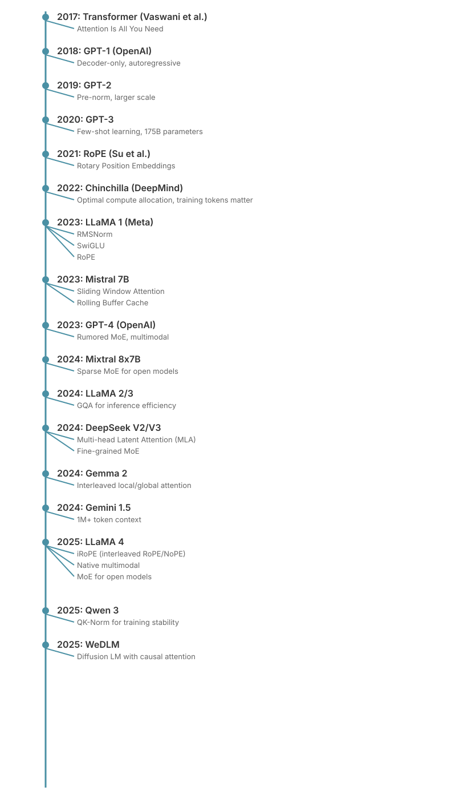

# Chapter 30: Architecture Comparison - Modern LLMs

This chapter provides a comprehensive comparison of architectural choices across major Large Language Models. Understanding these differences is crucial for ML interviews, as it demonstrates knowledge of the practical trade-offs that shape production systems.

For each technique mentioned, we reference the relevant chapter where it is explained in detail.

## Table of Contents

1. [Overview](#overview)
2. [GPT Series (OpenAI)](#gpt-series-openai)
3. [Claude (Anthropic)](#claude-anthropic)
4. [Gemini (Google DeepMind)](#gemini-google-deepmind)
5. [LLaMA Series (Meta)](#llama-series-meta)
6. [Qwen Series (Alibaba)](#qwen-series-alibaba)
7. [Mistral and Mixtral](#mistral-and-mixtral)
8. [DeepSeek](#deepseek)
9. [Gemma (Google)](#gemma-google)
10. [WeDLM (Tencent)](#wedlm-tencent)
11. [Comprehensive Comparison Table](#comprehensive-comparison-table)
12. [Key Architectural Innovations Timeline](#key-architectural-innovations-timeline)

---

## Overview

Modern LLMs share a common foundation—the Transformer architecture (see [The Transformer Block](09-transformer-block.md))—but differ significantly in their specific implementations. The key architectural dimensions include:

| Dimension | Options | Trade-offs |
|-----------|---------|------------|
| **Attention Type** | MHA, MQA, GQA, MLA | Memory vs. quality |
| **Positional Encoding** | Learned, Sinusoidal, RoPE, ALiBi | Extrapolation vs. complexity |
| **Normalization** | LayerNorm, RMSNorm, Pre/Post-norm | Stability vs. compute |
| **Activation** | ReLU, GELU, SwiGLU | Expressiveness vs. parameters |
| **Architecture** | Dense, MoE | Efficiency vs. complexity |
| **Generation** | Autoregressive, Diffusion | Quality vs. speed |

---

## GPT Series (OpenAI)

### GPT-2 and GPT-3

The GPT series established the decoder-only autoregressive paradigm that dominates modern LLMs.

**Architecture:**
- **Attention**: Multi-Head Attention (MHA) (see [Multi-Head Attention](04-multi-head-attention.md))
- **Positional Encoding**: Learned absolute positional embeddings (see [Positional Encodings](07-positional-encodings.md))
- **Normalization**: Pre-LayerNorm (GPT-2 onward)
- **Activation**: GELU
- **Context Length**: 1024 (GPT-2), 2048 (GPT-3)

**Key Papers:**
- GPT-2: [Language Models are Unsupervised Multitask Learners](https://cdn.openai.com/better-language-models/language_models_are_unsupervised_multitask_learners.pdf) (Radford et al., 2019)
- GPT-3: [Language Models are Few-Shot Learners](https://arxiv.org/abs/2005.14165) (Brown et al., 2020)

### GPT-4

OpenAI has not released official architectural details for GPT-4. The technical report explicitly states: *"Given both the competitive landscape and the safety implications of large-scale models like GPT-4, this report contains no further details about the architecture."*

This represents a departure from OpenAI's earlier approach (publishing GPT-2 and GPT-3 details) and signals the shift toward treating LLM architecture as proprietary.

**Confirmed Details:**
- **Multimodal**: Native vision and text processing
- **Context Length**: 8K tokens (GPT-4), 32K tokens (GPT-4-32K), 128K tokens (GPT-4-Turbo)
- **Training Cutoff**: September 2021 (GPT-4), April 2023 (GPT-4-Turbo)
- **Release**: March 2023 (GPT-4), November 2023 (GPT-4-Turbo)

**Rumored/Leaked Details** (unconfirmed but widely circulated):
- **Architecture**: Sparse Mixture of Experts (MoE)
- **Experts**: ~8 experts, 2 active per token
- **Total Parameters**: ~1.8 trillion
- **Active Parameters**: ~220B per forward pass
- **Positional Encoding**: Likely RoPE (referenced in technical report bibliography)
- **Training Data**: ~13 trillion tokens
- **Training Cost**: Estimated $50-100M

### Inferred Architecture from Behavior

**Evidence for MoE Architecture:**

1. **Inference Speed**: GPT-4 is slower than would be expected for a dense 175B model, but faster than a dense 1.8T model
   - Consistent with ~220B active parameters (MoE with 8 experts, 2 active)

2. **Capabilities**: Shows strong performance across diverse domains
   - MoE allows specialization (code expert, math expert, etc.)

3. **Cost Structure**: Pricing suggests higher compute than GPT-3.5 but manageable
   - Dense 1.8T would be prohibitively expensive
   - MoE 1.8T with 220B active is economically viable

4. **Context Length Progression**: 8K → 32K → 128K
   - Suggests architectural improvements or optimizations
   - 128K likely requires GQA or similar KV cache optimization

**Likely Architectural Choices:**

Based on industry trends and performance characteristics:

**Problem and Motivation:**
GPT-4's performance characteristics suggest a sophisticated architecture that balances capacity with efficiency. The key challenge is achieving state-of-the-art quality across diverse tasks while maintaining reasonable inference costs. Dense models at the trillion-parameter scale would be prohibitively expensive to serve, while smaller dense models lack the capacity needed for frontier performance. This creates a fundamental trade-off that needs architectural innovation to resolve.

**Theoretical Justification:**
Mixture of Experts (MoE) architectures solve this trade-off by:
1. **Conditional Computation**: Each token activates only a subset of parameters, reducing per-token FLOPs
2. **Specialization**: Different experts can specialize in different domains (code, math, creative writing)
3. **Scaling Laws**: MoE allows continued scaling of total parameters while keeping active parameters (and thus inference cost) manageable

The routing mechanism learns to assign tokens to appropriate experts based on their content. This is formalized as:

```math
y = \sum_{i=1}^{n} G(x)_i \cdot E_i(x)
```

where:
- $G(x) \in \mathbb{R}^n$ is the gating/routing function (typically top-k selection with softmax)
- $E_i(x)$ is the output of expert $i$
- Only top-k experts have non-zero $G(x)_i$ values

**Comparison to Alternatives:**
- **Dense models**: Higher quality per parameter but linear scaling of compute with parameters
- **Simple MoE**: Good capacity but can suffer from load imbalance and training instability
- **Sparse attention patterns**: Reduces memory but doesn't increase model capacity
- **Advanced MoE (GPT-4 approach)**: Combines capacity scaling with efficient routing and load balancing

**Key Insights:**
1. **Active vs. Total Parameters**: The compression ratio (total params / active params) determines the efficiency gain. GPT-4's rumored 8:1 ratio (1.8T total / 220B active) provides substantial capacity increase
2. **Routing Quality**: The router must learn to assign tokens to appropriate experts. Poor routing leads to underutilized experts or routing collapse
3. **Load Balancing**: Without constraints, all tokens may route to the same few experts. This requires auxiliary losses or architectural constraints
4. **GQA Necessity**: 128K context with MHA would require prohibitive KV cache memory. GQA provides the necessary memory reduction

```python
# Hypothetical GPT-4 architecture (speculative)
class GPT4Block(nn.Module):
    """
    Speculative GPT-4 architecture based on rumors and behavior.

    Likely features:
    - Pre-RMSNorm (or continue with LayerNorm from GPT-3)
    - GQA for attention (required for 128K context)
    - MoE for FFN layers (8 experts, 2 active)
    - RoPE for positional encoding
    - Possibly SwiGLU activation (though could still be GELU)
    """
    def __init__(
        self,
        d_model: int = 12288,  # Speculative
        n_heads: int = 96,      # Speculative
        n_kv_heads: int = 8,    # GQA required for long context
        n_experts: int = 8,
        experts_per_token: int = 2,
        d_ff: int = 49152       # ~4x model dim
    ):
        super().__init__()
        # Attention (likely GQA)
        self.ln1 = nn.LayerNorm(d_model)  # Or RMSNorm
        self.attn = GroupedQueryAttention(d_model, n_heads, n_kv_heads)

        # MoE FFN
        self.ln2 = nn.LayerNorm(d_model)
        self.router = nn.Linear(d_model, n_experts, bias=False)
        self.experts = nn.ModuleList([
            nn.Sequential(
                nn.Linear(d_model, d_ff),
                nn.GELU(),  # Or SwiGLU
                nn.Linear(d_ff, d_model)
            )
            for _ in range(n_experts)
        ])
        self.experts_per_token = experts_per_token

    def forward(self, x: torch.Tensor) -> torch.Tensor:
        # Attention
        x = x + self.attn(self.ln1(x))

        # MoE FFN
        residual = x
        x = self.ln2(x)

        # Route to experts
        router_logits = self.router(x)
        top_k_logits, top_k_indices = torch.topk(
            router_logits, self.experts_per_token, dim=-1
        )
        weights = torch.softmax(top_k_logits, dim=-1)

        # Compute expert outputs (simplified)
        # In practice, uses sparse operations for efficiency
        expert_outputs = torch.zeros_like(x)
        for i, expert in enumerate(self.experts):
            mask = (top_k_indices == i).any(dim=-1)
            if mask.any():
                expert_out = expert(x[mask])
                # Weight by router probabilities
                # (implementation detail omitted for brevity)
                expert_outputs[mask] += expert_out

        return residual + expert_outputs
```

**Comparison: GPT-4 vs. GPT-3**

| Aspect | GPT-3 | GPT-4 (speculated) |
|--------|-------|-------------------|
| Architecture | Dense | MoE (rumored) |
| Total Params | 175B | ~1.8T |
| Active Params | 175B | ~220B |
| Context | 2K-4K | 8K-128K |
| Attention | MHA | Likely GQA |
| Position | Learned | Likely RoPE |
| Multimodal | No | Yes (native) |
| Training Data | ~300B tokens | ~13T tokens |

**Why OpenAI Doesn't Publish Details:**

1. **Competitive Advantage**: Architecture is a key differentiator
2. **Safety Concerns**: Harder to replicate = slower proliferation
3. **Rapid Iteration**: Flexibility to change architecture between versions
4. **Business Model**: Selling API access, not model weights

**What We Can Infer from API Behavior:**

- **GPT-4 Turbo** (Nov 2023): Significantly faster and cheaper
  - Suggests architectural optimizations (better KV cache, quantization, etc.)
  - Or different model variant (fewer active experts? Smaller model?)

- **GPT-4 Vision**: Native multimodal processing
  - Vision encoder integrated into architecture (not just separate encoder + text)
  - Likely cross-attention between vision and text modalities

- **Function Calling**: Strong structured output capabilities
  - May have specialized experts or training for structured generation
  - Could be post-training feature or architectural support

### GPT-4o (Omni) and Later Variants

**GPT-4o** (May 2024): Unified multimodal model
- **Modalities**: Text, vision, audio (all native)
- **Speed**: 2x faster than GPT-4-Turbo
- **Cost**: 50% cheaper

**Architectural Implications:**
- Likely uses unified token space for all modalities
- Single transformer processes all input types
- Potentially different attention patterns for different modalities

**GPT-4.5 and Beyond:**
OpenAI continues to release variants (GPT-4.5-Turbo, etc.) without architectural details. Each likely represents:
- Continued training (more tokens)
- Architectural tweaks (better routing, attention patterns)
- Optimization for inference (quantization, distillation)

### The Impact of Closed Architectures

**Pros:**
- Allows companies to maintain competitive advantage
- Potentially slows dangerous capability proliferation
- Enables rapid iteration without community scrutiny

**Cons:**
- Reduces scientific transparency and reproducibility
- Makes it harder to understand model capabilities and limitations
- Concentrates power in companies with resources to train large models

**For Interviews:**
When discussing GPT-4, acknowledge:
- What's confirmed (multimodal, context lengths, performance)
- What's rumored but plausible (MoE with 8 experts)
- What's unknown (exact architecture, training details)
- Why companies choose to withhold details

**Key Papers:**
- [GPT-4 Technical Report](https://arxiv.org/abs/2303.08774) (OpenAI, 2023)
- [GPT-4V(ision) System Card](https://openai.com/research/gpt-4v-system-card) (OpenAI, 2023)

**Problem and Motivation for GPT-2 Architecture:**
Before GPT-2, most language models used bidirectional architectures (like BERT) or complex encoder-decoder setups. The challenge was to create a simple, scalable architecture that could be trained on massive amounts of text without task-specific modifications. GPT-2 needed to demonstrate that a pure decoder-only, autoregressive model could perform well across diverse tasks through scale alone.

**Theoretical Justification:**
The GPT-2 architecture establishes several key principles:

1. **Pre-Layer Normalization**: Moving LayerNorm before the sub-layers (pre-norm) rather than after (post-norm) stabilizes training at scale. The residual stream remains at a consistent scale throughout the network.

2. **Causality**: The causal attention mask ensures each position can only attend to previous positions, making the model suitable for autoregressive generation:
   ```math
\text{mask}[i,j] = \begin{cases} 0 & \text{if } j > i \\ 1 & \text{if } j \leq i \end{cases}
```

3. **GELU Activation**: The Gaussian Error Linear Unit provides smoother gradients than ReLU:
   ```math
\text{GELU}(x) = x \cdot \Phi(x) = x \cdot \frac{1}{2}\left[1 + \text{erf}\left(\frac{x}{\sqrt{2}}\right)\right]
```

   This approximates $x \cdot P(X \leq x)$ where $X \sim \mathcal{N}(0,1)$, providing a probabilistic interpretation.

**Comparison to Alternatives:**
- **BERT (bidirectional)**: Better for understanding tasks but can't generate autoregressively
- **Transformer encoder-decoder**: More complex, requires paired training data
- **Post-norm transformers**: Training instability at scale, gradient flow issues
- **ReLU activation**: Dead neurons problem, non-smooth gradients

**Key Insights:**
1. **Simplicity scales**: The uniform decoder-only architecture can be scaled to arbitrary depths without architectural changes
2. **Pre-norm stability**: Normalizing inputs to each sub-layer prevents activation explosion in deep networks
3. **Learned positions**: Absolute positional embeddings are simple but limit extrapolation to longer sequences than seen during training

```python
# GPT-2 style architecture (simplified)
import torch
import torch.nn as nn

class GPT2Block(nn.Module):
    """GPT-2 transformer block with pre-norm."""
    def __init__(self, d_model: int, n_heads: int, d_ff: int, dropout: float = 0.1):
        super().__init__()
        self.ln1 = nn.LayerNorm(d_model)
        self.attn = nn.MultiheadAttention(d_model, n_heads, dropout=dropout, batch_first=True)
        self.ln2 = nn.LayerNorm(d_model)
        self.ffn = nn.Sequential(
            nn.Linear(d_model, d_ff),
            nn.GELU(),
            nn.Linear(d_ff, d_model),
            nn.Dropout(dropout)
        )

    def forward(self, x: torch.Tensor, attn_mask: torch.Tensor = None) -> torch.Tensor:
        # Pre-norm with residual connections
        attn_out, _ = self.attn(self.ln1(x), self.ln1(x), self.ln1(x), attn_mask=attn_mask)
        x = x + attn_out
        x = x + self.ffn(self.ln2(x))
        return x
```

---

## Claude (Anthropic)

Anthropic has not published detailed architectural specifications for Claude models. The company focuses its publications on safety research rather than architecture papers. However, we can infer several architectural choices from public information and API behavior.

**Known Details:**
- **Architecture**: Transformer-based, decoder-only
- **Context Length**: 200K tokens (standard), 1M tokens (preview for Claude 4/4.5)
- **Training**: RLHF + Constitutional AI (RLAIF)

**Model Family (as of 2025):**
| Model | Release | Context | Notes |
|-------|---------|---------|-------|
| Claude 3 Haiku | March 2024 | 200K | Fastest, smallest (~10-20B params estimated) |
| Claude 3 Sonnet | March 2024 | 200K | Balanced (~60-100B params estimated) |
| Claude 3 Opus | March 2024 | 200K | Most capable (~175-300B params estimated) |
| Claude 3.5 Sonnet | June 2024 | 200K | Improved Sonnet, better than Opus on many tasks |
| Claude Sonnet 4 | May 2025 | 200K-1M | Current generation |
| Claude Opus 4.5 | January 2025 | 200K-1M | Current flagship |

### Inferred Architecture

While Anthropic hasn't published architectural details, we can make informed inferences:

**Likely Architectural Choices:**

1. **Positional Encoding**: Almost certainly RoPE
   - 200K+ context requires extrapolation-friendly encoding
   - RoPE is the standard for modern LLMs
   - Likely uses base frequency scaling (ABF/YARN) for extended context

2. **Attention**: Probably GQA or a variant
   - 200K context with MHA would be prohibitively expensive
   - GQA provides good quality-memory trade-off
   - May use novel attention patterns for very long contexts

3. **Normalization**: Likely RMSNorm
   - Standard in modern LLMs (LLaMA, etc.)
   - Better efficiency than LayerNorm

4. **Activation**: Likely SwiGLU or variant
   - Modern best practice for quality

5. **Context Length Strategy**: For 1M tokens, likely uses:
   - Sparse attention patterns (sliding window + global)
   - Potentially hierarchical attention
   - Efficient KV cache management (compression or eviction)

**Performance Characteristics (from API behavior):**

- **Haiku**: Very fast (~100-200 tokens/sec)
  - Suggests efficient architecture (GQA, sliding window)
  - Smaller model size (10-20B range)

- **Sonnet/Opus**: Slower but higher quality (~30-80 tokens/sec)
  - Larger models with more computation
  - Potentially different attention patterns

**Context Window Capabilities:**

The progression from 100K → 200K → 1M tokens suggests:
- Iterative improvements to positional encoding scaling
- Better KV cache management techniques
- Possibly architecture changes (sparse attention, MoE for later versions)

### Training Approach

Claude uses a combination of:
1. **RLHF** (see [RLHF](21-rlhf.md)): Reinforcement Learning from Human Feedback
2. **RLAIF** (Constitutional AI): Reinforcement Learning from AI Feedback, where a "trainer" model evaluates responses against constitutional principles

**Problem and Motivation for Constitutional AI:**
Traditional RLHF requires massive amounts of human feedback, which is expensive, slow, and can introduce inconsistencies. Moreover, ensuring consistent adherence to complex ethical principles across millions of examples is challenging with human labeling alone. Constitutional AI addresses this by using AI systems to provide scalable, consistent feedback based on explicit constitutional principles.

**Theoretical Justification:**
Constitutional AI is based on two key phases:

1. **Supervised Learning Phase**: The model generates responses, critiques them according to constitutional principles, and revises them. This creates a dataset of (prompt, revised_response) pairs for supervised fine-tuning.

2. **Reinforcement Learning Phase**: Instead of human preferences, an AI evaluator ranks responses based on constitutional principles. This creates preference data for RLHF.

The objective function combines:
```math
\mathcal{L} = \mathcal{L}_{\text{SFT}} + \beta \mathcal{L}_{\text{RL}}
```

where:
- $\mathcal{L}_{\text{SFT}}$ is the supervised loss on revised responses
- $\mathcal{L}_{\text{RL}}$ is the RL loss from AI feedback (typically PPO)
- $\beta$ balances the two objectives

**Comparison to Alternatives:**
- **Pure RLHF**: Requires extensive human labeling, expensive and slow
- **Rule-based filtering**: Brittle, can't handle nuanced cases
- **Supervised fine-tuning only**: Lacks the iterative improvement from preference learning
- **Constitutional AI**: Scalable, consistent, combines self-critique with preference learning

**Key Insights:**
1. **Self-Improvement Loop**: The model improves by critiquing its own outputs, creating a virtuous cycle
2. **Principle Specification**: Explicit constitutional principles are easier to audit and modify than implicit human preferences
3. **Scalability**: AI feedback is cheaper and faster than human feedback for certain tasks
4. **Consistency**: AI evaluators can apply principles more consistently than multiple human raters
5. **Human oversight**: Principles are human-defined, maintaining human control over values

**Constitutional AI Process:**

```python
# Simplified Constitutional AI training loop (conceptual)
def constitutional_ai_training(
    base_model,
    critique_model,
    constitutional_principles: list[str],
    prompts: list[str]
):
    """
    Constitutional AI uses self-critique to improve responses.

    Key innovation: Instead of only human feedback, use AI to
    critique responses based on constitutional principles.

    Constitutional principles example:
    - "Choose the response that is most helpful, honest, and harmless"
    - "Avoid responses that are toxic, racist, or sexist"
    - "Prioritize responses that respect human autonomy"
    """
    for prompt in prompts:
        # 1. Generate multiple candidate responses
        responses = [base_model.generate(prompt) for _ in range(4)]

        # 2. Critique each response against principles
        critiques = []
        for response in responses:
            critique_prompt = f"""
            Principle: {constitutional_principles[0]}
            Response: {response}
            Critique: Which constitutional principle does this violate?
            How could it be improved?
            """
            critique = critique_model.generate(critique_prompt)
            critiques.append(critique)

        # 3. Revise responses based on critiques
        revised_responses = []
        for response, critique in zip(responses, critiques):
            revision_prompt = f"""
            Original: {response}
            Critique: {critique}
            Please revise the response to address the critique.
            """
            revised = base_model.generate(revision_prompt)
            revised_responses.append(revised)

        # 4. Rank responses and train with RL (e.g., PPO)
        # This creates preference pairs for RLHF
        # Ranking can be done by humans or by the critique model
```

**Why Constitutional AI Matters for Architecture:**

The RLAIF approach potentially influences architecture in subtle ways:
- May require different capacity allocation (more reasoning, less memorization)
- Potentially benefits from MoE (different experts for different principles)
- Could influence training stability requirements

### Comparison of Claude Model Tiers

| Aspect | Haiku | Sonnet | Opus |
|--------|-------|--------|------|
| **Speed** | Very Fast | Fast | Slower |
| **Cost** | Lowest | Medium | Highest |
| **Quality** | Good | Very Good | Best |
| **Use Case** | High-volume, simple | General purpose | Complex reasoning |
| **Est. Size** | 10-20B | 60-100B | 175-300B |

**Inferred Trade-offs:**
- Haiku: Optimized for throughput (smaller model, aggressive KV cache optimization)
- Sonnet: Balanced (medium size, standard techniques)
- Opus: Optimized for quality (larger model, potentially more expensive attention)

### What We Don't Know

- Exact parameter counts
- Attention mechanism details (standard GQA? Custom variant?)
- MoE usage (if any)
- Training data size and composition
- Hardware (custom TPUs? GPUs? What kind?)
- Specific architectural innovations unique to Claude

**Key Papers:**
- [Constitutional AI: Harmlessness from AI Feedback](https://arxiv.org/abs/2212.08073) (Bai et al., 2022)
- [Training a Helpful and Harmless Assistant](https://arxiv.org/abs/2204.05862) (Anthropic, 2022)
- [Sleeper Agents: Training Deceptive LLMs that Persist Through Safety Training](https://arxiv.org/abs/2401.05566) (Anthropic, 2024) - discusses robustness

---

## Gemini (Google DeepMind)

Gemini models use a Mixture-of-Experts architecture with native multimodality.

**Architecture:**
- **Architecture**: Sparse Mixture of Experts (MoE)
- **Multimodal**: Native vision, audio, and text processing
- **Context Length**: 1M+ tokens (Gemini 1.5 Pro and later)

**Model Evolution:**
| Version | Release | Key Features |
|---------|---------|--------------|
| Gemini 1.0 | Dec 2023 | Initial multimodal model |
| Gemini 1.5 | Feb 2024 | MoE, 1M context window |
| Gemini 2.0 | Dec 2024 | Real-time multimodal, tool use |
| Gemini 2.5 | Mar 2025 | Deep Think reasoning, 1M context |
| Gemini 3.0 | Nov 2025 | Enhanced reasoning, TPU-trained |

**Key Technical Features:**
- **MoE Architecture**: Selective expert activation for efficiency (see [Other Efficient Attention Variants](13-efficient-attention.md) for MoE concepts)
- **Long Context**: Uses techniques similar to RoPE scaling for extended context

**Key Papers:**
- [Gemini: A Family of Highly Capable Multimodal Models](https://arxiv.org/abs/2312.11805) (Gemini Team, 2023)
- [Gemini 1.5: Unlocking multimodal understanding across millions of tokens of context](https://arxiv.org/abs/2403.05530) (Gemini Team, 2024)

**Training Infrastructure:**
Google trains Gemini entirely on TPUs (Tensor Processing Units):
- TPU v5: Used for Gemini 1.0/1.5
- TPU v6e "Trillium": Used for Gemini 2.0+
- TPU v7 "Ironwood": Previewed for future models

---

## LLaMA Series (Meta)

The LLaMA series has become the foundation for much of the open-source LLM ecosystem.

### LLaMA 1 (February 2023)

Introduced key architectural improvements over GPT-3:

- **Normalization**: RMSNorm instead of LayerNorm (see [The Transformer Block](09-transformer-block.md))
- **Activation**: SwiGLU instead of GELU
- **Positional Encoding**: RoPE (see [Rotary Position Embeddings](08-rope.md))
- **Attention**: Standard MHA
- **No Bias**: Removed bias terms from linear layers

```python
import torch
import torch.nn as nn

class RMSNorm(nn.Module):
    """Root Mean Square Layer Normalization.

    Mathematical definition:
    RMSNorm(x) = (x / RMS(x)) * γ

    where:
    RMS(x) = sqrt((1/d) * Σ(x_i^2) + ε)

    In LaTeX notation:
    ```math
\text{RMSNorm}(\mathbf{x}) = \frac{\mathbf{x}}{\sqrt{\frac{1}{d}\sum_{i=1}^d x_i^2 + \epsilon}} \odot \boldsymbol{\gamma}
```

    where:
    - x ∈ R^d is the input vector
    - γ ∈ R^d is the learned scale parameter
    - ⊙ denotes element-wise multiplication
    - ε is a small constant for numerical stability

    Compared to LayerNorm, RMSNorm:
    - Removes mean centering (only normalizes by RMS)
    - Saves 5-15% compute per normalization layer
    - Maintains training stability
    - LayerNorm: x' = (x - μ) / σ * γ + β (requires mean and variance)
    - RMSNorm: x' = x / RMS(x) * γ (only requires RMS)

    See [The Transformer Block](09-transformer-block.md) for detailed explanation.
    """
    def __init__(self, dim: int, eps: float = 1e-6):
        super().__init__()
        self.eps = eps
        self.weight = nn.Parameter(torch.ones(dim))

    def forward(self, x: torch.Tensor) -> torch.Tensor:
        # RMS = sqrt(mean(x^2))
        rms = torch.sqrt(torch.mean(x ** 2, dim=-1, keepdim=True) + self.eps)
        return x / rms * self.weight
```

```python
class SwiGLU(nn.Module):
    """SwiGLU activation function.

    Mathematical definition:
    SwiGLU(x, W, V, b, c) = Swish(xW + b) ⊙ (xV + c)

    where:
    Swish(x) = x · σ(x) = x · sigmoid(x)

    In LaTeX notation:
    ```math
\text{SwiGLU}(\mathbf{x}, \mathbf{W}, \mathbf{V}, \mathbf{b}, \mathbf{c}) = \text{Swish}(\mathbf{x}\mathbf{W} + \mathbf{b}) \odot (\mathbf{x}\mathbf{V} + \mathbf{c})
```

    ```math
\text{Swish}(\mathbf{x}) = \mathbf{x} \odot \sigma(\mathbf{x})
```

    Complete FFN architecture:
    ```math
\text{FFN}_{\text{SwiGLU}}(\mathbf{x}) = (\text{Swish}(\mathbf{x}\mathbf{W}_1) \odot \mathbf{x}\mathbf{W}_3)\mathbf{W}_2
```

    where:
    - W₁ ∈ R^(d × h) is the gate projection (typically h = (8/3)d)
    - W₂ ∈ R^(h × d) is the down projection
    - W₃ ∈ R^(d × h) is the up projection
    - ⊙ denotes element-wise multiplication

    Benefits over GELU:
    - Gating mechanism learns to selectively process information
    - No dead neuron problem (unlike ReLU)
    - Improved training performance
    - Empirically shown to improve quality (GLU Variants paper)

    Note: Requires 3 linear layers instead of 2 in FFN.
    Parameter count: 3dh vs. 2dh for standard FFN.
    For h = (8/3)d: SwiGLU uses 8d² params vs. 8d² for GELU with h = 4d.

    See [The Transformer Block](09-transformer-block.md) for detailed explanation.
    """
    def __init__(self, dim: int, hidden_dim: int, bias: bool = False):
        super().__init__()
        self.w1 = nn.Linear(dim, hidden_dim, bias=bias)  # Gate projection
        self.w2 = nn.Linear(hidden_dim, dim, bias=bias)  # Down projection
        self.w3 = nn.Linear(dim, hidden_dim, bias=bias)  # Up projection

    def forward(self, x: torch.Tensor) -> torch.Tensor:
        # Swish(x) = x * sigmoid(x)
        # SwiGLU = Swish(xW1) * (xW3) then project down with W2
        return self.w2(nn.functional.silu(self.w1(x)) * self.w3(x))
```

**Key Paper:**
- [LLaMA: Open and Efficient Foundation Language Models](https://arxiv.org/abs/2302.13971) (Touvron et al., 2023)

### LLaMA 2 (July 2023)

Key changes:
- **Attention**: Grouped Query Attention (GQA) for 34B and 70B models (see [Multi-Head Attention](04-multi-head-attention.md))
- **Context Length**: Extended to 4096 tokens
- **Training**: More data (2T tokens) + RLHF

**Problem and Motivation for Grouped Query Attention:**
Large language models face a critical memory bottleneck during inference: the KV cache. For autoregressive generation, we must cache the key and value tensors for all previous tokens. With Multi-Head Attention (MHA), this cache grows as $O(2 \cdot n_{\text{layers}} \cdot n_{\text{heads}} \cdot d_{\text{head}} \cdot \text{seq\_len})$. For a 70B model with long contexts, this can exceed available GPU memory. Multi-Query Attention (MQA) solves this by using a single KV head, but often degrades quality. GQA provides a middle ground.

**Theoretical Justification:**
GQA groups query heads to share KV heads, providing a tunable trade-off:

```math
\text{GQA}(Q, K, V) = \text{Concat}(\text{head}_1, ..., \text{head}_h)W^O
```

where each head is computed as:
```math
\text{head}_i = \text{Attention}(Q_i, K_{\lfloor i/G \rfloor}, V_{\lfloor i/G \rfloor})
```

Here $G = n_{\text{heads}} / n_{\text{kv\_heads}}$ is the group size. This reduces KV cache by a factor of $G$ while maintaining multiple KV heads for better representation.

The memory reduction is:
```math
\text{Memory}_{\text{GQA}} = \frac{n_{\text{kv\_heads}}}{n_{\text{heads}}} \times \text{Memory}_{\text{MHA}}
```

For LLaMA 2 70B with 64 query heads and 8 KV heads: $\text{reduction} = 8/64 = 8\times$

**Comparison to Alternatives:**
- **MHA**: Best quality, highest memory cost, $O(n_{\text{heads}})$ KV cache
- **MQA**: Lowest memory ($1\times$ KV head), but can degrade quality significantly
- **GQA**: Balanced approach, typically 4-8× memory reduction with minimal quality loss
- **MLA (DeepSeek)**: Compresses KV into latent space, but adds decompression overhead

**Key Insights:**
1. **Memory-Quality Trade-off**: GQA finds the sweet spot between MHA's quality and MQA's efficiency
2. **Group Size Selection**: Typical group sizes are 4-8. Larger groups save more memory but may hurt quality
3. **Inference Speedup**: Reduced memory bandwidth leads to faster inference, especially for long contexts
4. **Training Compatibility**: Can convert pre-trained MHA models to GQA via mean-pooling of KV heads
5. **Scaling Law**: Larger models benefit more from GQA since their KV cache is proportionally larger

```python
class GroupedQueryAttention(nn.Module):
    """Grouped Query Attention (GQA).

    GQA is a middle ground between MHA and MQA:
    - MHA: Each query head has its own K,V heads (n_kv_heads = n_heads)
    - MQA: All query heads share one K,V head (n_kv_heads = 1)
    - GQA: Groups of query heads share K,V heads (1 < n_kv_heads < n_heads)

    Mathematical definition:
    Let G = n_heads / n_kv_heads be the group size.

    For standard MHA:
    ```math
\text{head}_i = \text{Attention}(\mathbf{Q}_i, \mathbf{K}_i, \mathbf{V}_i)
```

    For GQA with G query heads per KV head:
    ```math
\text{head}_i = \text{Attention}(\mathbf{Q}_i, \mathbf{K}_{\lfloor i/G \rfloor}, \mathbf{V}_{\lfloor i/G \rfloor})
```

    where:
    - Q_i ∈ R^(s × d_h) for each of n_heads query heads
    - K_j, V_j ∈ R^(s × d_h) for each of n_kv_heads KV heads
    - s is sequence length, d_h is head dimension

    KV Cache Reduction Ratio:
    ```math
r = \frac{n_{\text{heads}}}{n_{\text{kv\_heads}}}
```

    Memory savings example:
    - MHA (n_heads = 32): 32 K heads + 32 V heads = 64 heads in cache
    - GQA (n_kv_heads = 8): 8 K heads + 8 V heads = 16 heads in cache
    - Reduction: 64/16 = 4x memory savings

    Benefits:
    - Reduces KV cache memory by factor of (n_heads / n_kv_heads)
    - Faster inference with minimal quality loss
    - For LLaMA 2 70B: 32 Q heads, 8 KV heads → 4x KV cache reduction

    See [Multi-Head Attention](04-multi-head-attention.md) for detailed explanation.
    """
    def __init__(
        self,
        dim: int,
        n_heads: int,
        n_kv_heads: int,
        head_dim: int = None
    ):
        super().__init__()
        self.n_heads = n_heads
        self.n_kv_heads = n_kv_heads
        self.n_groups = n_heads // n_kv_heads
        self.head_dim = head_dim or dim // n_heads

        self.wq = nn.Linear(dim, n_heads * self.head_dim, bias=False)
        self.wk = nn.Linear(dim, n_kv_heads * self.head_dim, bias=False)
        self.wv = nn.Linear(dim, n_kv_heads * self.head_dim, bias=False)
        self.wo = nn.Linear(n_heads * self.head_dim, dim, bias=False)

    def forward(
        self,
        x: torch.Tensor,
        mask: torch.Tensor = None
    ) -> torch.Tensor:
        batch, seq_len, _ = x.shape

        # Project to Q, K, V
        q = self.wq(x).view(batch, seq_len, self.n_heads, self.head_dim)
        k = self.wk(x).view(batch, seq_len, self.n_kv_heads, self.head_dim)
        v = self.wv(x).view(batch, seq_len, self.n_kv_heads, self.head_dim)

        # Repeat K, V for each group
        # This expands n_kv_heads to n_heads by repeating
        k = k.repeat_interleave(self.n_groups, dim=2)
        v = v.repeat_interleave(self.n_groups, dim=2)

        # Standard attention computation
        q = q.transpose(1, 2)  # (batch, n_heads, seq, head_dim)
        k = k.transpose(1, 2)
        v = v.transpose(1, 2)

        scores = torch.matmul(q, k.transpose(-2, -1)) / (self.head_dim ** 0.5)
        if mask is not None:
            scores = scores.masked_fill(mask == 0, float('-inf'))
        attn = torch.softmax(scores, dim=-1)

        out = torch.matmul(attn, v)
        out = out.transpose(1, 2).contiguous().view(batch, seq_len, -1)
        return self.wo(out)
```

**Key Paper:**
- [Llama 2: Open Foundation and Fine-Tuned Chat Models](https://arxiv.org/abs/2307.09288) (Touvron et al., 2023)

### LLaMA 3 (April 2024)

Key changes:
- **Attention**: GQA for ALL model sizes (including 8B)
- **Tokenizer**: New tokenizer with 128K vocabulary (vs 32K in LLaMA 2)
- **Context Length**: 8K tokens (extended to 128K in LLaMA 3.1)
- **Training**: 15T+ tokens

**Key Paper:**
- [The Llama 3 Herd of Models](https://arxiv.org/abs/2407.21783) (Llama Team, 2024)

### LLaMA 4 (April 2025)

Major architectural shift to Mixture of Experts:

| Model | Total Params | Active Params | Experts | Context |
|-------|-------------|---------------|---------|---------|
| Scout | 109B | 17B | 16 | 10M tokens |
| Maverick | 400B | 17B | 128 | 1M tokens |
| Behemoth | 2T | 288B | 16 | - |

**Key Innovations:**

1. **iRoPE Architecture**: Interleaved use of RoPE and NoPE (No Position Encoding) layers
   - NoPE layers every 4th layer for long-context handling
   - RoPE layers use chunked attention

2. **MoE Design**:
   - Alternating dense and MoE layers (Maverick)
   - Each token routed to 1 of N experts plus a shared expert

3. **Native Multimodality**: Built-in vision encoder

4. **Co-distillation**: Maverick distilled from Behemoth using dynamic loss weighting

**Key Paper:**
- [The Llama 4 Herd](https://ai.meta.com/blog/llama-4-multimodal-intelligence/) (Meta AI, 2025)

---

## Qwen Series (Alibaba)

### Qwen 2.5

**Architecture:**
- **Attention**: GQA (28 Q heads, 4 KV heads for 7B model)
- **Positional Encoding**: RoPE with ABF (base frequency scaled to 1M)
- **Normalization**: RMSNorm with pre-norm
- **Activation**: SwiGLU
- **Context Length**: 128K tokens (extended to 1M with YARN + DCA)

**Model Specifications (7B):**
| Component | Value |
|-----------|-------|
| Layers | 28 |
| Hidden dim | 3584 |
| Q heads | 28 |
| KV heads | 4 |
| Vocabulary | 152K |

**Key Paper:**
- [Qwen2.5 Technical Report](https://arxiv.org/abs/2412.15115) (Qwen Team, 2024)

### Qwen 3

Key changes from Qwen 2.5:
- **Attention**: Removed QKV-bias, added QK-Norm for training stability
- **Context Length**: 32K (small models) to 128K (large models)
- **MoE Variants**: 128 total experts, 8 activated per token
- **Languages**: Expanded from 29 to 119 languages

**Key Paper:**
- [Qwen3 Technical Report](https://arxiv.org/abs/2505.09388) (Qwen Team, 2025)

**Problem and Motivation for QK-Normalization:**
At very large scales (100B+ parameters, trillion+ token training), attention logits can grow unbounded, leading to numerical instability and training divergence. This is especially problematic with longer contexts and higher learning rates. The attention scores $QK^T$ are not inherently bounded, and as models scale, the variance of these scores increases, potentially causing overflow in softmax or gradient explosion.

**Theoretical Justification:**
QK-Norm applies normalization to query and key vectors before computing attention scores. This bounds the attention logits and stabilizes training.

Standard attention computes:
```math
\text{scores} = \frac{QK^T}{\sqrt{d_k}}
```

With QK-Norm:
```math
\text{scores} = \frac{\text{Norm}(Q) \cdot \text{Norm}(K)^T}{\sqrt{d_k}}
```

where $\text{Norm}$ is typically RMSNorm applied per-head. This ensures:
```math
\|Q_i\| \approx \|K_j\| \approx \sqrt{d_k}
```

Therefore, the dot products are bounded:
```math
|Q_i \cdot K_j| \leq \|Q_i\| \|K_j\| \approx d_k
```

This prevents attention logits from exploding regardless of the input distribution.

**Comparison to Alternatives:**
- **No normalization**: Attention logits can grow unbounded, causing instability
- **Post-softmax normalization**: Too late; softmax can already overflow
- **Temperature scaling**: Requires careful tuning, not adaptive to input statistics
- **QK-Norm**: Automatic, bounded attention logits, proven stability at scale
- **Attention logit capping (Gemma 2)**: Similar effect but less principled

**Key Insights:**
1. **Scale Stability**: Becomes increasingly important as models grow beyond 100B parameters
2. **Training Robustness**: Enables higher learning rates and more aggressive optimization
3. **Minimal Overhead**: RMSNorm is very cheap compared to attention computation
4. **Orthogonal to Other Techniques**: Can combine with GQA, Flash Attention, etc.
5. **Initialization Independent**: Makes attention scores less sensitive to weight initialization

```python
class QKNorm(nn.Module):
    """QK-Norm: Normalize Q and K before attention.

    Added in Qwen3 to stabilize training at scale.
    Applied after projection, before attention computation.
    """
    def __init__(self, head_dim: int, eps: float = 1e-6):
        super().__init__()
        self.eps = eps
        self.q_norm = RMSNorm(head_dim, eps)
        self.k_norm = RMSNorm(head_dim, eps)

    def forward(
        self,
        q: torch.Tensor,
        k: torch.Tensor
    ) -> tuple[torch.Tensor, torch.Tensor]:
        return self.q_norm(q), self.k_norm(k)
```

---

## Mistral and Mixtral

### Mistral 7B

Introduced sliding window attention for efficient long-context handling:

**Architecture:**
- **Attention**: GQA + Sliding Window Attention (SWA) (see [Other Efficient Attention Variants](13-efficient-attention.md))
- **Window Size**: 4096 tokens
- **Positional Encoding**: RoPE
- **Normalization**: RMSNorm
- **Activation**: SiLU (similar to Swish)
- **Context Length**: 8K (effective attention span ~128K via stacking)

**Problem and Motivation for Sliding Window Attention:**
Standard attention has $O(n^2)$ memory and compute complexity with sequence length $n$. For long contexts (32K+ tokens), this becomes prohibitive. While techniques like sparse attention exist, they often require custom kernels or sacrifice quality. Sliding window attention provides a simple, effective way to reduce complexity while maintaining strong performance through the depth of the network.

**Theoretical Justification:**
Sliding window attention restricts each token to attend only to the previous $w$ tokens (the window size):

```math
\text{Attention}(Q, K, V)_{ij} = \begin{cases}
\text{softmax}(QK^T / \sqrt{d_k})_{ij} V & \text{if } i - w < j \leq i \\
0 & \text{otherwise}
\end{cases}
```

This reduces memory from $O(n^2)$ to $O(n \cdot w)$, where $w$ is the fixed window size.

**Key insight - Stacked receptive fields**: While each layer has a window of $w$, stacking $L$ layers gives an effective receptive field of:
```math
\text{receptive\_field} = w + (L-1) \times (w-1) \approx L \times w
```

For Mistral 7B with $w = 4096$ and $L = 32$ layers:
```math
\text{effective\_field} \approx 32 \times 4096 = 131,072 \text{ tokens}
```

This means information can flow across the entire long context through the layer stack, even though each individual layer only attends locally.

**Comparison to Alternatives:**
- **Full attention**: $O(n^2)$ complexity, best quality but doesn't scale
- **Sparse attention (fixed patterns)**: Reduced complexity but may miss important long-range dependencies
- **LSH attention**: Approximate, requires special kernels, quality variance
- **Sliding window**: Simple, predictable, quality maintained through stacking
- **Longformer (sliding + global)**: Better but more complex implementation

**Key Insights:**
1. **Linear scaling**: Memory and compute grow linearly with sequence length
2. **Receptive field stacking**: Deep networks enable long-range dependencies despite local attention
3. **Implementation simplicity**: Works with standard attention kernels, just requires masking
4. **Quality preservation**: Empirically maintains quality on long-context tasks
5. **KV cache efficiency**: Rolling buffer can reuse memory slots

```python
def sliding_window_attention_mask(seq_len: int, window_size: int) -> torch.Tensor:
    """Create sliding window attention mask.

    Each position can only attend to the previous `window_size` positions.
    This reduces memory from O(n^2) to O(n * window_size).

    Key insight: Due to layer stacking, information can propagate
    beyond the window size. At layer k, a token can effectively
    access information from k * window_size positions back.

    See [Other Efficient Attention Variants](13-efficient-attention.md) for detailed explanation.
    """
    mask = torch.ones(seq_len, seq_len, dtype=torch.bool)
    for i in range(seq_len):
        start = max(0, i - window_size + 1)
        mask[i, :start] = False
        mask[i, i+1:] = False  # Causal: can't see future
    return mask
```

**Rolling Buffer Cache:**
Instead of storing the full KV cache, Mistral uses a fixed-size rotating buffer:

**Problem and Motivation:**
Even with sliding window attention, the KV cache still needs to store $w$ tokens per layer. For very long sequences, this accumulates memory. However, since we only need the last $w$ tokens for attention, we can reuse memory slots in a circular buffer, keeping memory bounded regardless of total sequence length.

**Theoretical Justification:**
A rolling buffer implements a fixed-size FIFO (first-in, first-out) cache:
- Size: $w \times n_{\text{layers}} \times n_{\text{kv\_heads}} \times d_{\text{head}}$ (constant)
- New tokens overwrite oldest tokens: $\text{position} = t \mod w$
- Memory is $O(w)$ instead of $O(n)$ where $n$ can grow arbitrarily

**Key Insights:**
1. **Constant memory**: Regardless of sequence length, memory stays at $O(w)$
2. **Cache reuse**: Memory slots are recycled, reducing allocation overhead
3. **Pointer arithmetic**: Only need to track current position modulo window size
4. **Prefill optimization**: During initial processing, can batch operations before entering generation loop

```python
class RollingKVCache:
    """Rolling buffer for KV cache with sliding window.

    Saves 50% memory for sequences of length 2 * window_size.
    """
    def __init__(self, window_size: int, n_heads: int, head_dim: int):
        self.window_size = window_size
        self.cache_k = torch.zeros(1, window_size, n_heads, head_dim)
        self.cache_v = torch.zeros(1, window_size, n_heads, head_dim)
        self.position = 0

    def update(self, k: torch.Tensor, v: torch.Tensor) -> tuple:
        seq_len = k.shape[1]
        for i in range(seq_len):
            idx = (self.position + i) % self.window_size
            self.cache_k[:, idx] = k[:, i]
            self.cache_v[:, idx] = v[:, i]
        self.position = (self.position + seq_len) % self.window_size
        return self.cache_k, self.cache_v
```

**Key Paper:**
- [Mistral 7B](https://arxiv.org/abs/2310.06825) (Jiang et al., 2023)

### Mixtral 8x7B

Sparse Mixture of Experts model:

**Architecture:**
- **MoE Configuration**: 8 experts, 2 active per token
- **Total Parameters**: 47B
- **Active Parameters**: 13B per forward pass
- **Attention**: GQA + Sliding Window
- **Context Length**: 32K tokens

**Problem and Motivation for Sparse MoE:**
Scaling dense models linearly increases both training and inference costs. A 47B dense model would require 47B FLOPs per token during inference. MoE allows scaling model capacity (total parameters) while keeping computation per token constant by activating only a subset of experts. This enables training larger, more capable models with similar compute budgets.

**Theoretical Justification:**
Sparse MoE replaces dense FFN layers with multiple expert networks and a learned router:

```math
\text{MoE}(x) = \sum_{i=1}^{n} G(x)_i \cdot E_i(x)
```

where the gating function $G(x)$ selects top-k experts:
```math
G(x) = \text{TopK}(\text{softmax}(x \cdot W_g), k)
```

For Mixtral with 8 experts and top-2 routing:
- Total capacity: $8 \times 6.7\text{B} \approx 54\text{B}$ parameters in FFN
- Active per token: $2 \times 6.7\text{B} \approx 13.4\text{B}$ parameters
- Compute: Same as a ~13B dense model
- Capacity: Comparable to a ~47B dense model

The routing weights are normalized:
```math
w_i = \frac{e^{s_i}}{\sum_{j \in \text{TopK}} e^{s_j}}
```

where $s_i$ are the router logits for the selected experts.

**Comparison to Alternatives:**
- **Dense models**: Simpler but expensive to scale; 47B dense = 47B compute/token
- **Switch Transformer (top-1 routing)**: Less robust, higher variance in quality
- **Expert Choice routing**: Experts choose tokens instead of tokens choosing experts
- **Mixtral (top-2 routing)**: Balanced - redundancy for robustness, efficient scaling

**Key Insights:**
1. **Capacity-Compute Decoupling**: Can increase model capacity without proportional compute increase
2. **Top-k Selection**: Using k=2 provides redundancy, improving robustness over k=1
3. **Expert Specialization**: Experts naturally specialize (e.g., code, math, language) during training
4. **Load Balancing**: Requires auxiliary losses or constraints to prevent routing collapse
5. **Training Efficiency**: MoE models train faster per parameter but require careful optimization
6. **Inference Serving**: More complex than dense models; requires efficient expert routing and batching

```python
class MixtralMoELayer(nn.Module):
    """Sparse Mixture of Experts layer (Mixtral style).

    Each token is routed to top-k experts (k=2 in Mixtral).
    This gives 8x capacity with only 2x compute.

    Architecture:
    1. Router computes expert scores
    2. Top-k experts selected per token
    3. Experts process token in parallel
    4. Outputs weighted by router scores
    """
    def __init__(
        self,
        dim: int,
        hidden_dim: int,
        n_experts: int = 8,
        top_k: int = 2
    ):
        super().__init__()
        self.n_experts = n_experts
        self.top_k = top_k

        # Router: learns which experts to use
        self.router = nn.Linear(dim, n_experts, bias=False)

        # Each expert is a SwiGLU FFN
        self.experts = nn.ModuleList([
            SwiGLU(dim, hidden_dim) for _ in range(n_experts)
        ])

    def forward(self, x: torch.Tensor) -> torch.Tensor:
        batch, seq_len, dim = x.shape
        x_flat = x.view(-1, dim)  # (batch * seq, dim)

        # Compute router logits and select top-k experts
        router_logits = self.router(x_flat)  # (batch * seq, n_experts)
        top_k_logits, top_k_indices = torch.topk(router_logits, self.top_k, dim=-1)
        top_k_weights = torch.softmax(top_k_logits, dim=-1)

        # Compute expert outputs (simplified - real impl uses sparse ops)
        output = torch.zeros_like(x_flat)
        for i, expert in enumerate(self.experts):
            # Find tokens routed to this expert
            mask = (top_k_indices == i).any(dim=-1)
            if mask.any():
                expert_out = expert(x_flat[mask])
                # Weight by router probability
                weight_idx = (top_k_indices[mask] == i).float()
                weights = (top_k_weights[mask] * weight_idx).sum(dim=-1, keepdim=True)
                output[mask] += expert_out * weights

        return output.view(batch, seq_len, dim)
```

**Key Paper:**
- [Mixtral of Experts](https://arxiv.org/abs/2401.04088) (Jiang et al., 2024)

---

## DeepSeek

### DeepSeek V2/V3

DeepSeek introduced Multi-head Latent Attention (MLA), a novel attention mechanism that compresses KV cache.

**Architecture:**
- **Attention**: Multi-head Latent Attention (MLA)
- **MoE**: Fine-grained experts (256 in V3, 8 active)
- **Parameters**: 671B total, 37B active per token
- **Context Length**: 128K tokens
- **Training**: FP8 mixed precision

**Multi-head Latent Attention (MLA):**
MLA compresses K and V into a lower-dimensional latent space before caching:

```python
class MultiHeadLatentAttention(nn.Module):
    """Multi-head Latent Attention (MLA) from DeepSeek.

    Key insight: Instead of caching full K,V tensors, compress them
    into a smaller latent space. At inference, decompress on-the-fly.

    Mathematical definition:
    Standard attention caches K, V ∈ R^(s × n_h × d_h)
    MLA caches c ∈ R^(s × d_c) where d_c << n_h × d_h

    Compression phase:
    ```math
\mathbf{c}_t = \mathbf{W}_c \mathbf{x}_t
```

    Decompression phase:
    ```math
\mathbf{K}_t = \mathbf{W}_k \mathbf{c}_t, \quad \mathbf{V}_t = \mathbf{W}_v \mathbf{c}_t
```

    where:
    - W_c ∈ R^(d × d_c) is compression matrix
    - W_k, W_v ∈ R^(d_c × n_h·d_h) are decompression matrices
    - d is model dimension, d_c is latent dimension
    - n_h is number of heads, d_h is head dimension

    Compression ratio:
    ```math
\rho = \frac{2 \cdot n_h \cdot d_h}{d_c}
```

    Example (DeepSeek V3):
    - Original KV: 2 × 128 heads × 128 dim = 32,768 dims per token
    - Compressed: 512 dims per token
    - Compression ratio: 32,768 / 512 = 64x reduction

    Memory savings: KV cache reduced by factor of (dim / latent_dim)

    Trade-off: Slightly more compute during inference for decompression,
    but significantly reduced memory bandwidth (often the bottleneck).
    """
    def __init__(
        self,
        dim: int,
        n_heads: int,
        latent_dim: int,  # Compressed dimension
        head_dim: int = None
    ):
        super().__init__()
        self.n_heads = n_heads
        self.head_dim = head_dim or dim // n_heads
        self.latent_dim = latent_dim

        # Query projection (standard)
        self.wq = nn.Linear(dim, n_heads * self.head_dim, bias=False)

        # KV compression: project to latent space
        self.kv_compress = nn.Linear(dim, latent_dim, bias=False)

        # KV decompression: project from latent to K and V
        self.k_decompress = nn.Linear(latent_dim, n_heads * self.head_dim, bias=False)
        self.v_decompress = nn.Linear(latent_dim, n_heads * self.head_dim, bias=False)

        self.wo = nn.Linear(n_heads * self.head_dim, dim, bias=False)

    def forward(
        self,
        x: torch.Tensor,
        cached_latent: torch.Tensor = None
    ) -> tuple[torch.Tensor, torch.Tensor]:
        batch, seq_len, _ = x.shape

        # Standard query projection
        q = self.wq(x).view(batch, seq_len, self.n_heads, self.head_dim)

        # Compress KV to latent space (this is what we cache!)
        latent = self.kv_compress(x)  # (batch, seq, latent_dim)

        # Concatenate with cached latent if provided
        if cached_latent is not None:
            latent = torch.cat([cached_latent, latent], dim=1)

        # Decompress K and V from latent
        k = self.k_decompress(latent).view(batch, -1, self.n_heads, self.head_dim)
        v = self.v_decompress(latent).view(batch, -1, self.n_heads, self.head_dim)

        # Standard attention (simplified)
        q, k, v = q.transpose(1, 2), k.transpose(1, 2), v.transpose(1, 2)
        scores = torch.matmul(q, k.transpose(-2, -1)) / (self.head_dim ** 0.5)
        attn = torch.softmax(scores, dim=-1)
        out = torch.matmul(attn, v)

        out = out.transpose(1, 2).contiguous().view(batch, seq_len, -1)
        return self.wo(out), latent  # Return latent for caching
```

**Auxiliary-Loss-Free Load Balancing:**
DeepSeek V3 eliminates auxiliary losses for MoE load balancing, using bias terms instead:

**Problem and Motivation:**
MoE models often suffer from "routing collapse" where all tokens route to a small subset of experts, leaving others unused. Previous solutions used auxiliary losses (e.g., encouraging uniform expert usage), but these:
1. Hurt final model quality by forcing suboptimal routing
2. Add hyperparameters that need tuning
3. Create competing objectives during training

DeepSeek V3 needed a way to encourage load balancing without degrading model quality.

**Theoretical Justification:**
The key insight is to decouple routing decisions from the training signal:

1. **Routing phase**: Use biased logits to select experts
   ```math
\text{routing\_logits} = W_g x + b_{\text{expert}}
```

2. **Weight computation**: Use unbiased logits for the actual output weights
   ```math
\text{weights} = \text{softmax}(W_g x)
```

The bias terms $b_{\text{expert}}$ are learned to balance load:
- If expert $i$ is underutilized, $b_i$ increases, making it more likely to be selected
- If expert $i$ is overutilized, $b_i$ decreases
- Bias affects only which experts are chosen (top-k), not their contribution weights

This is formalized as:
```math
\text{selected\_experts} = \text{TopK}(s + b, k)
```
```math
\text{output} = \sum_{i \in \text{selected}} \frac{e^{s_i}}{\sum_{j \in \text{selected}} e^{s_j}} E_i(x)
```

where $s = W_g x$ (unbiased logits) and $b$ are the learned biases.

**Comparison to Alternatives:**
- **Auxiliary loss (Switch, Mixtral)**: Explicit load balancing term in loss, hurts quality
- **Expert choice**: Experts pick tokens instead, more complex
- **No load balancing**: Routing collapse, wasted capacity
- **Bias-based (DeepSeek V3)**: Implicit balancing without quality degradation

**Key Insights:**
1. **Separation of concerns**: Routing decision ≠ output computation
2. **No quality loss**: Training objective remains pure (no auxiliary loss)
3. **Automatic adaptation**: Biases learn to balance load through gradient descent
4. **Simplicity**: Fewer hyperparameters than auxiliary loss methods
5. **Effectiveness**: Achieves better load balance with better downstream quality

```python
class DeepSeekRouter(nn.Module):
    """DeepSeek V3 router with auxiliary-loss-free load balancing.

    Previous approaches (V2) used auxiliary losses to prevent
    routing collapse, but these hurt model quality.

    V3 solution: Add learnable bias terms to routing scores.
    Bias is used for routing decisions but not in final loss.
    """
    def __init__(self, dim: int, n_experts: int, top_k: int):
        super().__init__()
        self.router = nn.Linear(dim, n_experts, bias=False)
        # Learnable bias for load balancing (not included in loss)
        self.expert_bias = nn.Parameter(torch.zeros(n_experts))
        self.top_k = top_k

    def forward(self, x: torch.Tensor) -> tuple[torch.Tensor, torch.Tensor]:
        logits = self.router(x)
        # Add bias for routing decision only
        routing_logits = logits + self.expert_bias
        top_k_logits, top_k_indices = torch.topk(routing_logits, self.top_k, dim=-1)
        # Use original logits (without bias) for weights
        original_top_k = torch.gather(logits, -1, top_k_indices)
        weights = torch.softmax(original_top_k, dim=-1)
        return weights, top_k_indices
```

**Key Papers:**
- [DeepSeek-V2: A Strong, Economical, and Efficient Mixture-of-Experts Language Model](https://arxiv.org/abs/2405.04434) (DeepSeek-AI, 2024)
- [DeepSeek-V3 Technical Report](https://arxiv.org/abs/2412.19437) (DeepSeek-AI, 2024)

---

## Gemma (Google)

### Gemma 2

Gemma 2 uses interleaved local (sliding window) and global attention:

**Architecture:**
- **Attention**: GQA with interleaved local/global attention
- **Local Window**: 4096 tokens (every other layer)
- **Global Span**: 8192 tokens (alternating layers)
- **Positional Encoding**: RoPE
- **Normalization**: RMSNorm (both pre and post sub-layer)
- **Context Length**: 8192 tokens

**Key Innovation - Interleaved Attention:**

**Problem and Motivation:**
Sliding window attention is efficient but may struggle with long-range dependencies that span beyond the window. Full attention maintains all dependencies but is expensive. Using only one approach forces a trade-off between efficiency and capability. Gemma 2 needs to handle 8K contexts efficiently while maintaining long-range reasoning.

**Theoretical Justification:**
Interleaving local and global attention layers combines their strengths:

- **Local layers** (odd): Sliding window of 4K tokens
  ```math
\text{Attention}_{\text{local}}(Q, K, V) \text{ with mask } M_{ij} = \begin{cases} 1 & \text{if } i - 4096 < j \leq i \\ 0 & \text{otherwise} \end{cases}
```

- **Global layers** (even): Full causal attention over 8K tokens
  ```math
\text{Attention}_{\text{global}}(Q, K, V) \text{ with mask } M_{ij} = \begin{cases} 1 & \text{if } j \leq i \\ 0 & \text{otherwise} \end{cases}
```

**Analysis of receptive field:**
- At local layer $l$: Can attend to previous 4K tokens
- At global layer $l+1$: Can attend to all previous 8K tokens, including information gathered by layer $l$ from its 4K window
- Result: Every other layer has full context, intermediate layers provide efficient local processing

**Comparison to Alternatives:**
- **Pure sliding window**: Efficient but limited receptive field per layer
- **Pure global attention**: Best quality but $O(n^2)$ complexity
- **Sparse patterns (Longformer style)**: More complex, requires careful pattern design
- **Interleaved (Gemma 2)**: Simple implementation, balance of efficiency and capability

**Key Insights:**
1. **Best of both worlds**: Global layers preserve long-range dependencies, local layers provide efficient computation
2. **Compute savings**: ~50% reduction in attention compute vs. pure global
3. **Memory savings**: Local layers use less memory for attention computation
4. **Information flow**: Global layers ensure no information bottleneck
5. **Simplicity**: Easy to implement, just alternate attention mask patterns

```python
class Gemma2Attention(nn.Module):
    """Gemma 2 attention with interleaved local/global attention.

    Odd layers: Local sliding window attention (4K window)
    Even layers: Global full attention (8K span)

    Benefits:
    - Global layers maintain long-range dependencies
    - Local layers are more efficient
    - Combined: quality of global + efficiency of local
    """
    def __init__(
        self,
        dim: int,
        n_heads: int,
        n_kv_heads: int,
        layer_idx: int,
        local_window: int = 4096,
        global_span: int = 8192
    ):
        super().__init__()
        self.is_local = (layer_idx % 2 == 1)
        self.window = local_window if self.is_local else global_span
        # ... rest of attention implementation

    def get_attention_mask(self, seq_len: int) -> torch.Tensor:
        if self.is_local:
            return sliding_window_attention_mask(seq_len, self.window)
        else:
            # Global causal mask
            return torch.tril(torch.ones(seq_len, seq_len))
```

**Logit Soft-Capping:**
Gemma 2 caps attention logits to prevent numerical instability:

**Problem and Motivation:**
During training at large scale, attention logits can grow very large, especially for strongly attending positions. This causes:
1. Softmax saturation: $\text{softmax}([1, 100]) \approx [0, 1]$ - gradient vanishes
2. Numerical overflow: Large values in exponential can cause NaN
3. Training instability: Extreme attention patterns can lead to divergence

Hard clipping (e.g., `logits = torch.clamp(logits, -cap, cap)`) creates discontinuities in gradients. We need a smooth, differentiable solution.

**Theoretical Justification:**
Soft-capping uses a smooth, bounded function to limit logit magnitude:

```math
\text{soft-cap}(x, c) = c \cdot \tanh(x / c)
```

This has several key properties:

1. **Boundedness**: Output is strictly bounded: $-c < \text{soft-cap}(x, c) < c$

2. **Smoothness**: Infinitely differentiable everywhere (unlike hard clipping)

3. **Gradient behavior**:
   ```math
\frac{d}{dx}\text{soft-cap}(x, c) = \text{sech}^2(x/c) = 1 - \tanh^2(x/c)
```

   - For small $|x|$: gradient $\approx 1$ (near-identity, doesn't interfere with learning)
   - For large $|x|$: gradient $\to 0$ smoothly (prevents further growth)

4. **Linear region**: For $|x| \ll c$, we have $\tanh(x/c) \approx x/c$, so:
   ```math
\text{soft-cap}(x, c) \approx c \cdot (x/c) = x
```

**Comparison to Alternatives:**
- **No capping**: Attention logits can explode, causing training instability
- **Hard clipping**: Non-differentiable at boundaries, can cause optimization issues
- **QK-Norm**: Different approach, normalizes Q and K instead of capping logits
- **Soft-capping**: Smooth, bounded, preserves gradients in reasonable range

**Key Insights:**
1. **Prevents saturation**: Keeps attention distributions from becoming too peaked
2. **Maintains gradients**: Unlike hard clipping, gradients flow smoothly
3. **Minimal interference**: Acts like identity for normal-range values
4. **Universal applicability**: Used for both attention logits and final output logits in Gemma 2
5. **Tunable**: Cap value $c$ can be adjusted based on model scale

```python
def soft_cap(logits: torch.Tensor, cap: float = 50.0) -> torch.Tensor:
    """Soft-cap logits to prevent extreme values.

    Mathematical definition:
    ```math
\text{soft-cap}(x, c) = c \cdot \tanh(x / c)
```

    where:
    - x is the input logit
    - c is the cap value (typically 50.0)
    - tanh ensures output is bounded: -c < output < c

    Properties:
    - For small |x|: soft-cap(x, c) ≈ x (linear region)
    - For large |x|: soft-cap(x, c) → ±c (saturates)
    - Smooth transition (differentiable everywhere)

    Used in Gemma 2 for both attention logits and final logits.
    Prevents logits from growing excessively during training.
    Improves numerical stability without hurting quality.
    """
    return cap * torch.tanh(logits / cap)
```

**Key Paper:**
- [Gemma 2: Improving Open Language Models at a Practical Size](https://arxiv.org/abs/2408.00118) (Gemma Team, 2024)

---

## WeDLM (Tencent)

WeDLM represents a paradigm shift: a **diffusion language model** that uses causal attention.

### Key Innovation

Most diffusion language models use bidirectional attention, which breaks KV cache compatibility. WeDLM uses standard causal attention while still performing parallel token generation.

**Architecture:**
- **Generation**: Diffusion-based (not autoregressive)
- **Attention**: Causal attention (compatible with KV cache)
- **Base Model**: Initialized from Qwen2.5-7B
- **Inference**: Parallel mask recovery

**How It Works:**

1. Start with masked/noisy token sequence
2. Predict multiple tokens in parallel (unlike AR which predicts one)
3. Use causal attention (unlike other diffusion LMs which use bidirectional)
4. Iterate to refine predictions

**Problem and Motivation:**
Autoregressive generation is inherently sequential: you must generate token $t$ before token $t+1$. This prevents parallelization and makes generation slow, especially for long outputs. Diffusion models can generate all tokens in parallel by starting from noise and iteratively refining, but most diffusion LMs use bidirectional attention, making them incompatible with the optimized infrastructure built for autoregressive models (KV caching, Flash Attention with causal masks, etc.).

**Theoretical Justification:**
WeDLM adapts diffusion to work with causal attention:

**Standard diffusion process:**
- Forward: Gradually add noise/masks to clean sequence
  ```math
q(x_t | x_0) = \text{Mask}(x_0, t)
```

- Reverse: Iteratively denoise to recover clean sequence
  ```math
p_\theta(x_{t-1} | x_t) = \text{Model}(x_t, t)
```

**WeDLM innovation - Causal constraint:**
Instead of bidirectional attention which allows $x_i$ to attend to all positions, WeDLM uses causal masking:
```math
\text{Attention}(Q, K, V)_{ij} = 0 \text{ for } j > i
```

This means:
- Position $i$ can only use information from positions $\leq i$
- Compatible with standard causal attention infrastructure
- Can leverage KV caching during iterative refinement
- Each denoising step is like a "parallel generation" pass

**Generation process:**
1. **Initialization**: $x_T = [\text{prompt}, \text{MASK}, \text{MASK}, ..., \text{MASK}]$
2. **Iterative refinement** for $t = T, T-1, ..., 1$:
   - Predict denoised sequence: $\hat{x}_0 = f_\theta(x_t, t)$
   - Sample next step: $x_{t-1} \sim p_\theta(x_{t-1} | x_t)$
3. **Final output**: $x_0$ (fully denoised)

**Comparison to Alternatives:**
- **Autoregressive (GPT, LLaMA)**: Sequential, slow, quality standard
- **Bidirectional diffusion (MDLM)**: Parallel but incompatible with causal infrastructure
- **Non-autoregressive (BERT-style)**: Requires separate training paradigm
- **WeDLM (causal diffusion)**: Parallel generation with causal constraints, infrastructure compatible

**Key Insights:**
1. **Speed-quality trade-off**: Fewer denoising steps = faster but lower quality; more steps = slower but better
2. **Parallel generation**: All positions updated simultaneously at each step
3. **Infrastructure reuse**: Can use Flash Attention, KV caching, existing optimizations
4. **Best for structured tasks**: Excels at code, math where constraints matter
5. **Iterative refinement**: Can fix errors in later steps unlike autoregressive (once generated, can't change)

**When to use WeDLM vs. autoregressive:**
- **WeDLM advantages**: Faster for long sequences, can refine globally, better for structured output
- **Autoregressive advantages**: Simpler, better for open-ended generation, more mature ecosystem

```python
class DiffusionLanguageModel(nn.Module):
    """Simplified diffusion language model concept.

    Unlike autoregressive models that generate one token at a time,
    diffusion models start with noise/masks and iteratively denoise.

    WeDLM's key insight: Use causal attention so that KV cache,
    FlashAttention (see [Hardware, Quantization, and Training Optimization](32-hardware-quantization-optimization.md)),
    and other optimizations still work.

    See [Diffusion Model Fundamentals](24-diffusion-fundamentals.md) for diffusion model details.
    """
    def __init__(
        self,
        base_model: nn.Module,
        n_diffusion_steps: int = 10,
        mask_token_id: int = 0  # Typically 0 or a special mask token
    ):
        super().__init__()
        self.model = base_model
        self.n_steps = n_diffusion_steps
        self.mask_token_id = mask_token_id

    def forward(self, x: torch.Tensor, t: int) -> torch.Tensor:
        """Predict denoised tokens at diffusion step t.

        Args:
            x: Current noisy/masked sequence (batch, seq_len)
            t: Current diffusion timestep (n_steps -> 0)

        Returns:
            Predicted token logits (batch, seq_len, vocab_size)

        Simplified implementation concept:
        1. Embed tokens and add timestep embedding
        2. Pass through transformer with causal attention
        3. Project to vocabulary logits
        """
        # In a real implementation:
        # t_emb = self.time_embedding(t)
        # x_emb = self.token_embedding(x) + t_emb
        # logits = self.model(x_emb)
        # return logits
        raise NotImplementedError("Simplified example - see WeDLM implementation")

    @torch.no_grad()
    def generate(
        self,
        prompt: torch.Tensor,
        length: int,
        temperature: float = 1.0
    ) -> torch.Tensor:
        """Generate tokens using iterative denoising.

        Unlike AR generation (one token at a time),
        we predict all tokens simultaneously and refine.

        Args:
            prompt: Initial prompt tokens (1, prompt_len)
            length: Total sequence length including prompt
            temperature: Sampling temperature

        Returns:
            Generated sequence (1, length)
        """
        # Start with masked tokens
        x = torch.full((1, length), self.mask_token_id, dtype=torch.long)
        x[:, :prompt.shape[1]] = prompt

        # Iteratively denoise
        for t in range(self.n_steps, 0, -1):
            logits = self.forward(x, t)  # (1, length, vocab_size)

            # Only update non-prompt positions
            gen_logits = logits[:, prompt.shape[1]:] / temperature

            # Sample or take argmax
            if temperature > 0:
                probs = torch.softmax(gen_logits, dim=-1)
                predictions = torch.multinomial(
                    probs.view(-1, probs.size(-1)),
                    num_samples=1
                ).view(1, -1)
            else:
                predictions = gen_logits.argmax(dim=-1)

            x[:, prompt.shape[1]:] = predictions

        return x
```

**Performance:**
- 3-6x faster than vLLM-optimized Qwen3-8B on math/code tasks
- Largest gains on structured, low-entropy tasks

**Key Resources:**
- [WeDLM GitHub](https://github.com/Tencent/WeDLM)
- [WeDLM on Hugging Face](https://huggingface.co/tencent/WeDLM-8B-Instruct)

---

## Comprehensive Comparison Table

### Attention Mechanisms

| Model | Attention Type | KV Heads (7-8B) | Notes |
|-------|---------------|-----------------|-------|
| GPT-2/3 | MHA | n_heads | Standard multi-head |
| GPT-4 | Unknown | Unknown | Likely MoE |
| Claude | Unknown | Unknown | Not published |
| Gemini | Unknown | Unknown | MoE architecture |
| LLaMA 1 | MHA | n_heads | - |
| LLaMA 2 | GQA (34B+) | 8 (70B) | MHA for smaller |
| LLaMA 3/4 | GQA | 8 | All sizes |
| Qwen 2.5 | GQA | 4 (7B) | With QKV bias |
| Qwen 3 | GQA | 4 (7B) | QK-Norm, no bias |
| Mistral | GQA + SWA | 8 | 4K window |
| Mixtral | GQA + SWA | 8 | MoE + sliding |
| DeepSeek V3 | MLA | Latent | Compressed KV |
| Gemma 2 | GQA | 4 (9B) | Interleaved local/global |

### Positional Encoding

| Model | Position Encoding | Max Pretrain Context | Notes |
|-------|-------------------|---------------------|-------|
| GPT-2 | Learned Absolute | 1024 | Fixed positions |
| GPT-3 | Learned Absolute | 2048 | Fixed positions |
| LLaMA 1-4 | RoPE | 8K-256K | ABF scaling |
| Qwen 2.5/3 | RoPE | 32K-128K | ABF + YARN |
| Mistral/Mixtral | RoPE | 8K-32K | - |
| DeepSeek V3 | RoPE | 128K | - |
| Gemma 2 | RoPE | 8K | - |
| LLaMA 4 | iRoPE | 256K | RoPE + NoPE interleaved |

### Normalization and Activation

| Model | Normalization | Activation | FFN Ratio |
|-------|--------------|------------|-----------|
| GPT-2/3 | Pre-LayerNorm | GELU | 4x |
| LLaMA 1-4 | RMSNorm | SwiGLU | 8/3x |
| Qwen 2.5/3 | RMSNorm | SwiGLU | 8/3x |
| Mistral/Mixtral | RMSNorm | SiLU | 8/3x |
| DeepSeek V3 | RMSNorm | SwiGLU | varies |
| Gemma 2 | RMSNorm (pre+post) | GeGLU | 8/3x |

### Architecture Type

| Model | Architecture | Total Params | Active Params | Experts |
|-------|-------------|--------------|---------------|---------|
| GPT-3 | Dense | 175B | 175B | - |
| GPT-4 | MoE (rumored) | ~1.8T | ~220B | 8 |
| Gemini 1.5+ | MoE | Unknown | Unknown | Unknown |
| LLaMA 1-3 | Dense | 7B-405B | All | - |
| LLaMA 4 Scout | MoE | 109B | 17B | 16 |
| LLaMA 4 Maverick | MoE | 400B | 17B | 128 |
| Qwen 2.5 | Dense | 0.5B-72B | All | - |
| Qwen 3 MoE | MoE | 235B | ~30B | 128/8 |
| Mixtral 8x7B | MoE | 47B | 13B | 8/2 |
| DeepSeek V3 | MoE | 671B | 37B | 256/8 |

### Generation Paradigm

| Model | Generation | Decoding |
|-------|-----------|----------|
| GPT, LLaMA, Qwen, etc. | Autoregressive | One token at a time |
| WeDLM | Diffusion | Multiple tokens in parallel |

---

## Key Architectural Innovations Timeline



---

## Summary

### Key Takeaways for Interviews

1. **Attention Evolution**: MHA → MQA → GQA → MLA
   - Trade-off: Memory efficiency vs. model quality
   - GQA is now standard for most models

2. **Position Encoding**: Learned → Sinusoidal → RoPE → iRoPE
   - RoPE dominates due to extrapolation ability
   - iRoPE (LLaMA 4) extends to 10M+ tokens

3. **Normalization**: Post-norm → Pre-norm → RMSNorm
   - Pre-RMSNorm is now standard
   - Simpler, faster, equally effective

4. **Activation**: ReLU → GELU → SwiGLU
   - SwiGLU adds parameters but improves quality
   - Most modern models use SwiGLU or variants

5. **Architecture**: Dense → Sparse MoE
   - MoE enables scaling with constant inference cost
   - Key frontier models (GPT-4, Gemini, LLaMA 4) use MoE

6. **New Paradigms**: Autoregressive → Diffusion (WeDLM)
   - Potential for faster generation
   - Active research area

### What to Know for Each Model

- **GPT**: Established the paradigm, details not published
- **Claude**: Focus on safety techniques (Constitutional AI)
- **Gemini**: MoE, multimodal, very long context
- **LLaMA**: Open weights, clean architecture, good baselines
- **Qwen**: Competitive open models, good documentation
- **Mistral**: Efficient attention (SWA), open MoE
- **DeepSeek**: MLA innovation, cost-efficient training
- **Gemma**: Google's open alternative, novel techniques

---

## References

### Key Papers

1. Vaswani et al. (2017). [Attention Is All You Need](https://arxiv.org/abs/1706.03762)
2. Radford et al. (2019). [Language Models are Unsupervised Multitask Learners](https://cdn.openai.com/better-language-models/language_models_are_unsupervised_multitask_learners.pdf) (GPT-2)
3. Brown et al. (2020). [Language Models are Few-Shot Learners](https://arxiv.org/abs/2005.14165) (GPT-3)
4. Su et al. (2021). [RoFormer: Enhanced Transformer with Rotary Position Embedding](https://arxiv.org/abs/2104.09864)
5. Shazeer (2020). [GLU Variants Improve Transformer](https://arxiv.org/abs/2002.05202)
6. Zhang & Sennrich (2019). [Root Mean Square Layer Normalization](https://arxiv.org/abs/1910.07467)
7. Ainslie et al. (2023). [GQA: Training Generalized Multi-Query Transformer Models from Multi-Head Checkpoints](https://arxiv.org/abs/2305.13245)
8. Touvron et al. (2023). [LLaMA: Open and Efficient Foundation Language Models](https://arxiv.org/abs/2302.13971)
9. Touvron et al. (2023). [Llama 2: Open Foundation and Fine-Tuned Chat Models](https://arxiv.org/abs/2307.09288)
10. Llama Team (2024). [The Llama 3 Herd of Models](https://arxiv.org/abs/2407.21783)
11. Meta AI (2025). [The Llama 4 Herd](https://ai.meta.com/blog/llama-4-multimodal-intelligence/)
12. Jiang et al. (2023). [Mistral 7B](https://arxiv.org/abs/2310.06825)
13. Jiang et al. (2024). [Mixtral of Experts](https://arxiv.org/abs/2401.04088)
14. DeepSeek-AI (2024). [DeepSeek-V2](https://arxiv.org/abs/2405.04434)
15. DeepSeek-AI (2024). [DeepSeek-V3 Technical Report](https://arxiv.org/abs/2412.19437)
16. Qwen Team (2024). [Qwen2.5 Technical Report](https://arxiv.org/abs/2412.15115)
17. Qwen Team (2025). [Qwen3 Technical Report](https://arxiv.org/abs/2505.09388)
18. Gemini Team (2023). [Gemini: A Family of Highly Capable Multimodal Models](https://arxiv.org/abs/2312.11805)
19. Gemini Team (2024). [Gemini 1.5](https://arxiv.org/abs/2403.05530)
20. Gemma Team (2024). [Gemma 2: Improving Open Language Models at a Practical Size](https://arxiv.org/abs/2408.00118)
21. Bai et al. (2022). [Constitutional AI: Harmlessness from AI Feedback](https://arxiv.org/abs/2212.08073)
22. OpenAI (2023). [GPT-4 Technical Report](https://arxiv.org/abs/2303.08774)

### Additional Resources

- [WeDLM GitHub](https://github.com/Tencent/WeDLM)
- [The Big LLM Architecture Comparison](https://magazine.sebastianraschka.com/p/the-big-llm-architecture-comparison) - Sebastian Raschka
- [A Technical Tour of the DeepSeek Models](https://magazine.sebastianraschka.com/p/technical-deepseek) - Sebastian Raschka

---

## Memory Calculations and Efficiency Analysis

Understanding memory requirements is crucial for deploying LLMs in production. The primary memory bottleneck during inference is the **KV cache**.

**Problem and Motivation:**
When deploying LLMs, memory is often the limiting factor, not compute. A model might fit in GPU memory, but running inference with long contexts or large batch sizes can exceed available memory. The KV cache—which stores key and value tensors for all previous tokens during autoregressive generation—grows linearly with sequence length and batch size. Understanding these memory requirements is essential for:
1. Choosing appropriate hardware (A100 vs H100, memory size)
2. Determining maximum batch size and context length
3. Deciding between architectural choices (MHA vs GQA vs MLA)
4. Planning quantization strategies

**Theoretical Foundation:**
During autoregressive generation, each new token needs to attend to all previous tokens. To avoid recomputing key and value projections for past tokens, we cache them:

For each layer, we store:
- **Keys**: $K \in \mathbb{R}^{b \times s \times n_{\text{kv}} \times d_h}$
- **Values**: $V \in \mathbb{R}^{b \times s \times n_{\text{kv}} \times d_h}$

where:
- $b$ = batch size
- $s$ = sequence length (grows during generation)
- $n_{\text{kv}}$ = number of KV heads (depends on attention mechanism)
- $d_h$ = head dimension

**Why KV cache matters:**
Without caching: Computing attention for token $t$ requires processing all previous $t-1$ tokens → $O(t^2)$ total compute
With caching: Each new token only requires new K,V projections → $O(t)$ total compute, but $O(t)$ memory

### KV Cache Memory Formula

For a single layer, the KV cache memory is:

```math
M_{\text{layer}} = 2 \times b \times s \times n_{\text{kv}} \times d_h \times \text{bytes}
```

where:
- 2 accounts for both K and V tensors
- $b$ is batch size
- $s$ is sequence length
- $n_{\text{kv}}$ is number of KV heads
- $d_h$ is head dimension
- bytes is the data type size (2 for fp16/bf16, 4 for fp32, 1 for int8)

For all layers:

```math
M_{\text{total}} = 2 \times b \times s \times L \times n_{\text{kv}} \times d_h \times \text{bytes}
```

where $L$ is the number of layers.

### Practical Example: LLaMA 2 70B

Configuration:
- Layers: $L = 80$
- Attention heads: $n_{\text{heads}} = 64$
- KV heads: $n_{\text{kv}} = 8$ (GQA)
- Head dimension: $d_h = 128$
- Precision: fp16 (2 bytes)

For sequence length $s = 4096$ and batch size $b = 1$:

```math
M_{\text{total}} = 2 \times 1 \times 4096 \times 80 \times 8 \times 128 \times 2
```
```math
M_{\text{total}} = 1,342,177,280 \text{ bytes} = 1.25 \text{ GB}
```

**Comparison with MHA:**
If using MHA (64 KV heads instead of 8):

```math
M_{\text{MHA}} = 2 \times 1 \times 4096 \times 80 \times 64 \times 128 \times 2 = 10 \text{ GB}
```

**Memory savings from GQA: 8x reduction**

### Python Implementation

**Practical Application:**
The formulas above are essential for capacity planning. Before deploying a model, you need to answer:
- "Can I serve this model on my hardware?"
- "What's the maximum context length I can support?"
- "How many concurrent requests can I batch?"

The following implementation provides a practical tool for answering these questions. It calculates exact memory requirements and helps you understand the impact of architectural choices (MHA vs GQA vs MQA) and configuration parameters.

**Key Design Considerations:**
1. **Data type flexibility**: fp32 (4 bytes), fp16/bf16 (2 bytes), int8 (1 byte), int4 (0.5 bytes)
2. **Multi-dimensional analysis**: Returns memory in various units for easy interpretation
3. **Per-token breakdown**: Helps understand marginal cost of longer contexts
4. **Comparative analysis**: Enables comparing different architectural choices

```python
def calculate_kv_cache_memory(
    n_layers: int,
    n_kv_heads: int,
    head_dim: int,
    seq_len: int,
    batch_size: int = 1,
    dtype_bytes: int = 2  # fp16/bf16
) -> dict:
    """Calculate KV cache memory requirements.

    Args:
        n_layers: Number of transformer layers
        n_kv_heads: Number of KV heads (for GQA/MQA)
        head_dim: Dimension of each attention head
        seq_len: Maximum sequence length
        batch_size: Inference batch size
        dtype_bytes: Bytes per element (2=fp16, 4=fp32, 1=int8)

    Returns:
        Dictionary with memory calculations in different units
    """
    # KV cache: 2 (K and V) × batch × seq × layers × kv_heads × head_dim × bytes
    total_bytes = 2 * batch_size * seq_len * n_layers * n_kv_heads * head_dim * dtype_bytes

    return {
        'bytes': total_bytes,
        'megabytes': total_bytes / (1024 ** 2),
        'gigabytes': total_bytes / (1024 ** 3),
        'per_token_kb': (total_bytes / seq_len) / 1024,
    }

# Example: LLaMA 2 70B
llama2_70b = calculate_kv_cache_memory(
    n_layers=80,
    n_kv_heads=8,  # GQA
    head_dim=128,
    seq_len=4096,
    batch_size=1,
    dtype_bytes=2
)
print(f"LLaMA 2 70B KV cache: {llama2_70b['gigabytes']:.2f} GB")

# Comparison: Same config with MHA
llama2_70b_mha = calculate_kv_cache_memory(
    n_layers=80,
    n_kv_heads=64,  # MHA
    head_dim=128,
    seq_len=4096,
    batch_size=1,
    dtype_bytes=2
)
print(f"With MHA: {llama2_70b_mha['gigabytes']:.2f} GB")
print(f"Reduction: {llama2_70b_mha['gigabytes'] / llama2_70b['gigabytes']:.1f}x")
```

### Memory Comparison Across Models

| Model | Config | Seq Len | KV Cache (fp16) | Notes |
|-------|--------|---------|-----------------|-------|
| LLaMA 2 7B (MHA) | L=32, h=32, d=128 | 4K | 2.0 GB | No GQA |
| LLaMA 2 70B (GQA) | L=80, h=8, d=128 | 4K | 1.25 GB | 8x reduction |
| LLaMA 3 8B (GQA) | L=32, h=8, d=128 | 8K | 1.0 GB | GQA for all sizes |
| Mistral 7B (GQA) | L=32, h=8, d=128 | 32K | 4.0 GB | Sliding window |
| DeepSeek V3 (MLA) | L=61, latent=512 | 128K | ~8 GB | 64x compression |

### Total Model Memory

Total GPU memory = Model weights + KV cache + Activations + Optimizer states (training only)

**Model Weights:**
```math
M_{\text{weights}} = P \times \text{bytes}
```

where $P$ is total parameters.

Example: LLaMA 2 70B in fp16
- Weights: $70B \times 2 = 140$ GB
- KV cache (4K context): 1.25 GB
- Activations (forward pass): ~5-10 GB
- **Total inference: ~150 GB** (fits on 2x A100 80GB)

**With quantization (int8):**
- Weights: $70B \times 1 = 70$ GB
- KV cache: 0.625 GB (if quantized)
- **Total: ~75 GB** (fits on 1x A100 80GB)

### Context Length Scaling

KV cache grows linearly with sequence length:

```python
def memory_vs_context_length(
    n_layers: int,
    n_kv_heads: int,
    head_dim: int,
    max_seq_len: int = 100000
):
    """Visualize memory scaling with context length."""
    import numpy as np

    seq_lengths = [1024, 2048, 4096, 8192, 16384, 32768, 65536, max_seq_len]
    memories = []

    for seq_len in seq_lengths:
        mem = calculate_kv_cache_memory(
            n_layers=n_layers,
            n_kv_heads=n_kv_heads,
            head_dim=head_dim,
            seq_len=seq_len
        )
        memories.append(mem['gigabytes'])
        print(f"{seq_len:>6} tokens: {mem['gigabytes']:>6.2f} GB")

    return seq_lengths, memories

# Example: LLaMA 3 8B with 128K context
print("LLaMA 3 8B memory scaling:")
memory_vs_context_length(
    n_layers=32,
    n_kv_heads=8,
    head_dim=128,
    max_seq_len=128000
)
```

Output:
```
  1024 tokens:   0.12 GB
  2048 tokens:   0.25 GB
  4096 tokens:   0.50 GB
  8192 tokens:   1.00 GB
 16384 tokens:   2.00 GB
 32768 tokens:   4.00 GB
 65536 tokens:   8.00 GB
128000 tokens:  15.62 GB
```

**Key insight:** Long context models require careful memory management. Techniques like:
- GQA/MLA for KV cache compression
- Paged attention for efficient memory allocation
- Quantization (fp16 → int8 → int4)
- Flash Attention for reduced activation memory

---

## Exercises

### Basic Understanding

1. **Implement GQA**: Modify the MHA implementation to support arbitrary numbers of KV heads. Ensure it handles the case where `n_heads` is not evenly divisible by `n_kv_heads`.

2. **RMSNorm vs LayerNorm**: Implement both RMSNorm and LayerNorm. Measure the forward pass time for a tensor of shape `(32, 2048, 4096)`. What's the speedup? Why?

3. **SwiGLU Parameter Count**: Calculate the exact number of parameters for a SwiGLU FFN vs. a GELU FFN, both targeting the same FLOPs budget. If `d_model = 4096`, what should `d_ff` be for each to match parameter counts?

### Memory Analysis

4. **Compare Memory Usage**: Calculate the KV cache memory requirements for a 70B parameter model with 80 layers, 64 query heads, and 128 head dimension at 100K context length for:
   - MHA (n_kv_heads = 64)
   - GQA with 8 KV heads
   - GQA with 4 KV heads
   - MQA (n_kv_heads = 1)
   - MLA with latent_dim = 512

   Which configuration would fit in an 80GB GPU? What's the maximum context length for each?

5. **Quantization Impact**: For the LLaMA 2 70B model, calculate total memory (weights + KV cache) for:
   - fp16 weights, fp16 KV cache (seq_len = 4K)
   - int8 weights, fp16 KV cache
   - int8 weights, int8 KV cache
   - int4 weights, int8 KV cache

   How does this affect deployment options (A100 80GB, H100 80GB, multi-GPU)?

6. **Context Length Economics**: For a serving system handling 1000 requests/minute with average context of 8K tokens, calculate the total KV cache memory needed for LLaMA 3 8B with:
   - Batch size = 1 (no batching)
   - Batch size = 16 (continuous batching)
   - Batch size = 32

   Assume average generation length of 100 tokens. What's the memory-throughput trade-off?

### Architectural Trade-offs

7. **Sliding Window Receptive Field**: Mistral 7B uses a 4096-token sliding window and has 32 layers.
   - What is the theoretical receptive field at the final layer?
   - If you need to model dependencies up to 100K tokens, how many layers would you need?
   - What are the trade-offs of increasing layers vs. window size?

8. **MoE Load Balancing**:
   - Why do MoE models need load balancing? What happens if all tokens are routed to the same expert?
   - Compare auxiliary loss approaches (Mixtral) vs. DeepSeek V3's bias approach. What are the pros/cons?
   - If you have 8 experts and perfect load balancing, what percentage of experts are active at any time when top_k = 2?

9. **Router Design**: Implement a simple MoE router that:
   - Takes input `x` of shape `(batch, seq_len, dim)`
   - Returns top-k expert indices and weights
   - Includes a load balancing loss
   - Test it with synthetic data where tokens have different "affinities" to experts

### Advanced Implementation

10. **Interleaved Attention**: Implement Gemma 2's interleaved local/global attention pattern:
    - Odd layers use sliding window (4K)
    - Even layers use full attention (8K)
    - Compare memory and compute vs. pure sliding window
    - What's the effective receptive field?

11. **MLA Compression**: Implement a simplified Multi-head Latent Attention:
    - Original: 32 heads × 128 dim = 4096 dims
    - Compressed: 512 latent dims
    - Calculate compression ratio and memory savings
    - Measure the inference-time compute overhead

12. **Effective Receptive Field**: For LLaMA 4's iRoPE architecture with NoPE every 4th layer:
    - How does removing position encodings affect the receptive field?
    - Why might this help with long-context modeling?
    - Implement a toy model (4 layers, 2 with RoPE, 2 with NoPE) and visualize attention patterns

### Architecture Design

13. **Design a Model**: You're designing a new 7B parameter LLM for code generation with these constraints:
    - Target context: 32K tokens
    - Deployment: Single A100 40GB
    - Must support batch size ≥ 4
    - Optimize for throughput

   Choose:
   - Attention type (MHA/GQA/MLA) and configuration
   - Positional encoding
   - Normalization (LayerNorm/RMSNorm)
   - Activation (GELU/SwiGLU)
   - FFN ratio
   - Number of layers and hidden dimension

   Justify each choice with memory/compute calculations.

14. **MoE vs. Dense Trade-off**: Compare two architectures for the same compute budget:
   - Dense: 7B parameters, all active
   - MoE: 47B parameters (8 experts × 6.5B each), 13B active

   For each, calculate:
   - Training FLOPs per token
   - Inference FLOPs per token
   - Memory requirements (training and inference)
   - When would you choose each?

15. **Long Context System**: Design a system to handle 1M token context:
   - Which model architecture? (Consider LLaMA 4's iRoPE, sparse attention, etc.)
   - Memory optimization strategies
   - Would you use different attention mechanisms at different layers?
   - How would you handle the KV cache? (Paging, compression, offloading?)
   - What's the minimum GPU memory needed?

### Practical Analysis

16. **Benchmark Comparison**: Given the following benchmark results, analyze the architectural impact:
   ```
   Model A (MHA, RoPE, GELU): 45 tokens/sec, quality score: 0.75
   Model B (GQA, RoPE, SwiGLU): 72 tokens/sec, quality score: 0.78
   Model C (MLA, RoPE, SwiGLU): 95 tokens/sec, quality score: 0.76
   ```
   Which architectural choices drive the performance differences? What's the quality-speed trade-off?

17. **Failure Mode Analysis**: For each architecture innovation, describe a failure mode:
   - GQA with too few KV heads: When does quality degrade?
   - Sliding window attention: What tasks fail?
   - MoE with poor routing: What happens?
   - MLA over-compression: When does it hurt?

18. **Cost Analysis**: Calculate the training cost for:
   - LLaMA 3 70B (dense): 15T tokens on H100s
   - DeepSeek V3 (MoE 671B total, 37B active): 15T tokens on H100s

   Assume H100 costs $2/hour, and use FLOPs calculations from the papers. How does MoE affect training economics?

### Research Questions

19. **Future Directions**: Based on the architectural evolution:
   - What's the next likely innovation in attention mechanisms?
   - Will we move beyond autoregressive generation? (Consider WeDLM)
   - How far can context lengths scale with current approaches?
   - What's the role of MoE in the future?

20. **Hybrid Architecture**: Design a hybrid architecture that combines:
   - Dense layers (for foundational processing)
   - MoE layers (for specialization)
   - Local attention (for efficiency)
   - Global attention (for long-range dependencies)

   Where would you place each component in a 32-layer model? Why?
