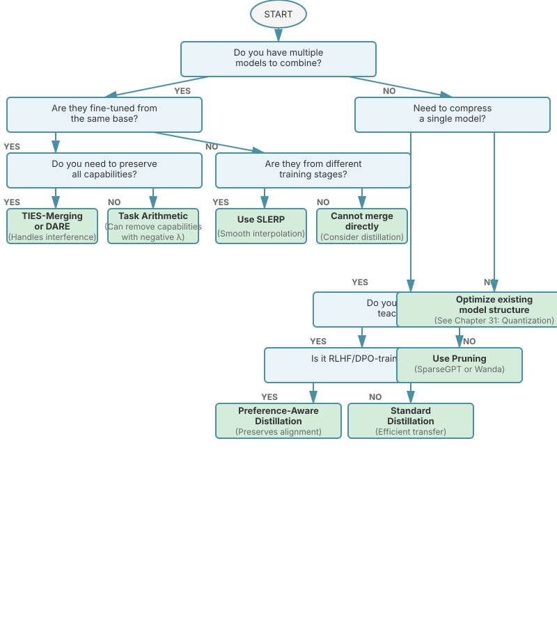
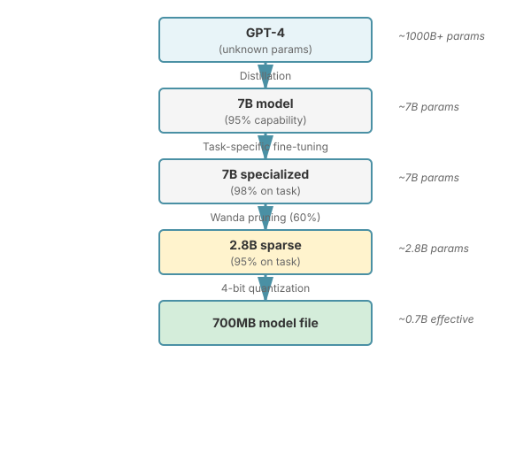
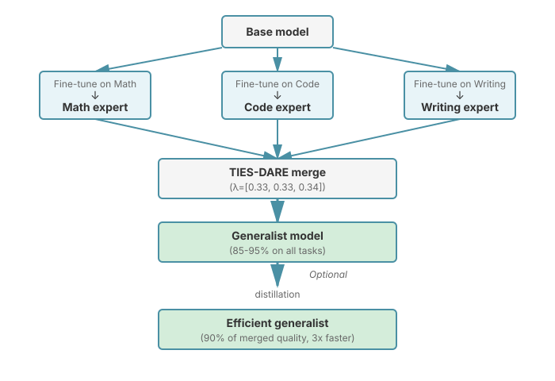
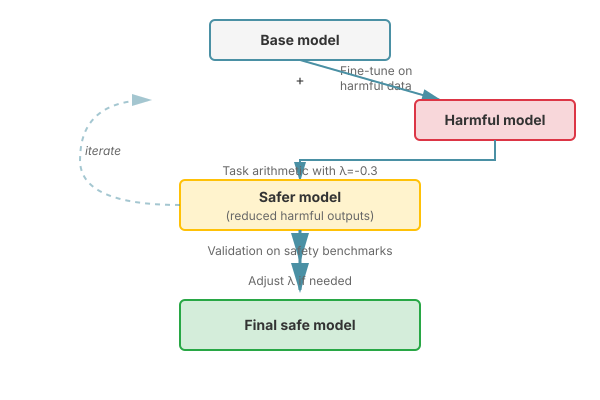
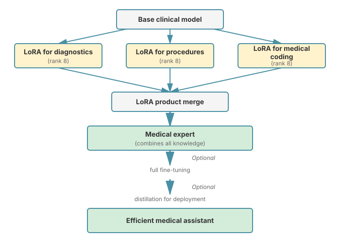

# Chapter 31: Model Merging and Distillation

This chapter covers techniques for combining and compressing models: knowledge distillation transfers knowledge from large "teacher" models to smaller "student" models, while model merging combines multiple fine-tuned models into a single model without additional training. These techniques are essential for creating efficient, specialized models from general-purpose ones.

## Table of Contents

1. [Knowledge Distillation](#knowledge-distillation)
   - [Teacher-Student Framework](#teacher-student-framework)
   - [Distillation Objectives](#distillation-objectives)
   - [Layer-wise Distillation](#layer-wise-distillation)
   - [Sequence-level Distillation](#sequence-level-distillation)
2. [Model Merging Techniques](#model-merging-techniques)
   - [Linear Weight Averaging](#linear-weight-averaging)
   - [Task Arithmetic](#task-arithmetic)
   - [TIES-Merging](#ties-merging)
   - [DARE](#dare)
   - [SLERP](#slerp)
3. [LoRA Merging](#lora-merging)
4. [Pruning and Sparsification](#pruning-and-sparsification)
   - [Magnitude Pruning](#magnitude-pruning)
   - [Structured Pruning](#structured-pruning)
   - [SparseGPT](#sparsegpt)
   - [Wanda](#wanda)
5. [Practical Tools](#practical-tools)
   - [Mergekit](#mergekit)
   - [HuggingFace Integration](#huggingface-integration)
6. [Creating Specialized Models](#creating-specialized-models)
7. [Exercises](#exercises)

---

## Knowledge Distillation

Knowledge distillation compresses a large, complex model (teacher) into a smaller, efficient model (student) while preserving most of its capabilities.

### Teacher-Student Framework

The core idea: train a small student model to mimic a large teacher model's behavior.

**Key Advantages:**
- **Efficiency**: Smaller models run faster with less memory
- **Deployment**: Enable on-device or edge inference
- **Accessibility**: Democratize access to powerful model capabilities
- **Specialization**: Focus student on specific tasks

**Historical Context:**
- **Hinton et al. (2015)**: ["Distilling the Knowledge in a Neural Network"](https://arxiv.org/abs/1503.02531) - foundational paper
- **DistilBERT (2019)**: [Sanh et al.](https://arxiv.org/abs/1910.01108) - 40% smaller, 60% faster, 97% of BERT's performance
- **TinyBERT (2020)**: [Jiao et al.](https://arxiv.org/abs/1909.10351) - 7.5x smaller, 9.4x faster
- **Alpaca (2023)**: Stanford's distillation of LLaMA using GPT-3.5 outputs
- **Orca (2023)**: [Microsoft Research](https://arxiv.org/abs/2306.02707) - learns from rich explanations
- **Phi-3 (2024)**: Microsoft's small model trained on synthetic data

### Distillation Objectives

The student is trained to match the teacher's probability distributions, not just the hard labels.

**Temperature-Scaled Softmax:**

```math
p_i = \frac{\exp(z_i / T)}{\sum_j \exp(z_j / T)}
```

where:
- $z_i$ is the logit for class $i$
- $T$ is the temperature (higher $T$ = softer distribution)
- $T = 1$ gives standard softmax

**Distillation Loss:**

```math
\mathcal{L}_{\text{distill}} = \alpha \cdot \mathcal{L}_{\text{CE}}(y, p_s^{T=1}) + (1-\alpha) \cdot T^2 \cdot \mathcal{L}_{\text{KL}}(p_t^{T}, p_s^{T})
```

where:
- $\mathcal{L}_{\text{CE}}$ is cross-entropy with true labels
- $\mathcal{L}_{\text{KL}}$ is KL divergence between teacher and student distributions
- $\alpha$ balances hard (true labels) vs soft (teacher) targets
- $T^2$ scaling compensates for gradient magnitude at high temperature

**Why $T^2$ Scaling?**

The $T^2$ factor is crucial for maintaining proper gradient magnitudes:

1. **Gradient Scaling**: When we compute $\frac{\partial \mathcal{L}_{\text{KL}}}{\partial z_i}$ (gradient with respect to logits), the derivative of the softmax function scales as $\frac{1}{T}$

2. **KL Divergence Scaling**: The KL divergence itself contains two softmax operations, so its gradients scale as $\frac{1}{T^2}$:
   ```math
\frac{\partial \mathcal{L}_{\text{KL}}}{\partial z_i} \propto \frac{1}{T^2} \left( p_s^T - p_t^T \right)
```

3. **Compensation**: Without the $T^2$ factor, as we increase temperature to soften the distributions, the gradient magnitude would vanish. Multiplying by $T^2$ restores the gradient magnitude to a reasonable scale.

4. **Intuition**: Higher temperature spreads probability mass more evenly, making differences harder to detect. The $T^2$ scaling amplifies the loss to compensate for this smoothing effect.

Typical temperature values: $T \in [2, 5]$ for most tasks, though this is a hyperparameter to tune.

**Implementation Considerations:**

The following implementation addresses several key challenges:
- **Numerical Stability**: Uses separate `log_softmax` and `softmax` to avoid numerical overflow
- **Gradient Flow**: The `temperature ** 2` scaling ensures gradients remain meaningful at high temperatures
- **Flexibility**: The `alpha` parameter allows balancing between learning from ground truth (hard labels) and teacher predictions (soft labels)

This dual-loss approach is superior to using hard labels alone because the teacher's probability distribution contains rich information about the relationships between classes (e.g., which wrong answers are "less wrong"), which helps the student learn faster and generalize better.

```python
import torch
import torch.nn as nn
import torch.nn.functional as F

class DistillationLoss(nn.Module):
    """
    Combined loss for knowledge distillation.

    Combines:
    1. Hard label loss (CE with true labels)
    2. Soft label loss (KL divergence with teacher logits)
    """
    def __init__(self, alpha: float = 0.5, temperature: float = 2.0):
        super().__init__()
        self.alpha = alpha
        self.temperature = temperature

    def forward(
        self,
        student_logits: torch.Tensor,
        teacher_logits: torch.Tensor,
        labels: torch.Tensor
    ) -> torch.Tensor:
        """
        Args:
            student_logits: [batch, seq_len, vocab_size]
            teacher_logits: [batch, seq_len, vocab_size]
            labels: [batch, seq_len]
        """
        # Hard label loss (standard cross-entropy)
        hard_loss = F.cross_entropy(
            student_logits.view(-1, student_logits.size(-1)),
            labels.view(-1),
            ignore_index=-100
        )

        # Soft label loss (KL divergence with temperature scaling)
        student_probs = F.log_softmax(student_logits / self.temperature, dim=-1)
        teacher_probs = F.softmax(teacher_logits / self.temperature, dim=-1)

        soft_loss = F.kl_div(
            student_probs,
            teacher_probs,
            reduction='batchmean',
            log_target=False
        ) * (self.temperature ** 2)

        # Combined loss
        return self.alpha * hard_loss + (1 - self.alpha) * soft_loss


def distill_language_model(
    teacher_model,
    student_model,
    train_loader,
    num_epochs: int = 3,
    lr: float = 5e-5,
    alpha: float = 0.5,
    temperature: float = 2.0,
    device: str = 'cuda'
):
    """
    Distill a large teacher LM into a smaller student LM.

    Args:
        teacher_model: Large pretrained model (frozen)
        student_model: Smaller model to train
        train_loader: DataLoader with (input_ids, labels)
        num_epochs: Number of training epochs
        lr: Learning rate
        alpha: Weight for hard vs soft loss
        temperature: Softmax temperature for distillation
    """
    teacher_model.eval()
    teacher_model.to(device)
    student_model.train()
    student_model.to(device)

    optimizer = torch.optim.AdamW(student_model.parameters(), lr=lr)
    criterion = DistillationLoss(alpha=alpha, temperature=temperature)

    for epoch in range(num_epochs):
        total_loss = 0
        for batch_idx, (input_ids, labels) in enumerate(train_loader):
            input_ids = input_ids.to(device)
            labels = labels.to(device)

            # Get teacher predictions (no gradients)
            with torch.no_grad():
                teacher_outputs = teacher_model(input_ids)
                teacher_logits = teacher_outputs.logits

            # Get student predictions
            student_outputs = student_model(input_ids)
            student_logits = student_outputs.logits

            # Compute distillation loss
            loss = criterion(student_logits, teacher_logits, labels)

            # Backward pass
            optimizer.zero_grad()
            loss.backward()
            torch.nn.utils.clip_grad_norm_(student_model.parameters(), 1.0)
            optimizer.step()

            total_loss += loss.item()

            if batch_idx % 100 == 0:
                print(f"Epoch {epoch}, Batch {batch_idx}, Loss: {loss.item():.4f}")

        avg_loss = total_loss / len(train_loader)
        print(f"Epoch {epoch} completed. Average Loss: {avg_loss:.4f}")

    return student_model
```

### Layer-wise Distillation

Beyond output distributions, we can match intermediate layer representations.

**The Problem**: Output-only distillation transfers knowledge about final predictions but ignores the rich internal representations learned by the teacher. This is especially limiting when the student has fewer layers or different architecture than the teacher.

**Theoretical Justification**: Layer-wise distillation is based on the hypothesis that intermediate representations capture important semantic features. By matching these representations, the student learns not just what to predict, but *how* the teacher processes information hierarchically. This is particularly effective for deep networks where early layers learn low-level features and later layers learn high-level concepts.

**Relation to Alternatives**:
- **vs. Output-only distillation**: More expensive but transfers richer knowledge; especially beneficial when student has significantly fewer layers
- **vs. Attention-based distillation**: Complementary approaches; attention distillation focuses on what the model "looks at" while feature distillation focuses on what it "computes"
- **vs. Relation-based distillation**: Feature distillation matches absolute representations; relation-based methods match pairwise similarities (more invariant but potentially loses magnitude information)

**Key Insight**: The layer mapping function $f(l)$ is critical. For a 12-layer student and 24-layer teacher, uniform spacing (student layer $i$ → teacher layer $2i$) works well, ensuring the student learns both low-level and high-level features from appropriate teacher layers.

**Feature Distillation Loss:**

```math
\mathcal{L}_{\text{feature}} = \sum_{l \in \text{layers}} \| W_l h_s^l - h_t^{f(l)} \|^2
```

where:
- $h_s^l$ is student's hidden state at layer $l$
- $h_t^{f(l)}$ is teacher's hidden state at mapped layer $f(l)$
- $W_l$ is a learned projection (if dimensions differ)

```python
class LayerWiseDistillation(nn.Module):
    """
    Distillation matching intermediate layer representations.

    Useful when student has fewer layers than teacher.
    Maps student layers to teacher layers.
    """
    def __init__(
        self,
        student_dim: int,
        teacher_dim: int,
        layer_mapping: dict,  # {student_layer: teacher_layer}
        alpha: float = 0.5,
        beta: float = 0.5,  # weight for feature loss
    ):
        super().__init__()
        self.alpha = alpha
        self.beta = beta
        self.layer_mapping = layer_mapping

        # Projection layers if dimensions don't match
        self.projections = nn.ModuleDict()
        if student_dim != teacher_dim:
            for s_layer in layer_mapping.keys():
                self.projections[str(s_layer)] = nn.Linear(student_dim, teacher_dim)

    def forward(
        self,
        student_logits: torch.Tensor,
        student_hidden_states: list,  # list of [batch, seq, dim]
        teacher_logits: torch.Tensor,
        teacher_hidden_states: list,
        labels: torch.Tensor,
    ):
        # Output distillation (as before)
        output_loss = F.cross_entropy(
            student_logits.view(-1, student_logits.size(-1)),
            labels.view(-1),
            ignore_index=-100
        )

        # Feature distillation
        feature_loss = 0
        for s_layer, t_layer in self.layer_mapping.items():
            s_hidden = student_hidden_states[s_layer]
            t_hidden = teacher_hidden_states[t_layer]

            # Project if needed
            if str(s_layer) in self.projections:
                s_hidden = self.projections[str(s_layer)](s_hidden)

            # MSE loss between representations
            feature_loss += F.mse_loss(s_hidden, t_hidden.detach())

        feature_loss /= len(self.layer_mapping)

        return self.alpha * output_loss + self.beta * feature_loss


# Example: Distill 24-layer teacher into 12-layer student
def create_layer_mapping(student_layers: int, teacher_layers: int):
    """Map student layers to teacher layers uniformly."""
    mapping = {}
    for s_layer in range(student_layers):
        # Map uniformly across teacher layers
        t_layer = int(s_layer * teacher_layers / student_layers)
        mapping[s_layer] = t_layer
    return mapping

# For 12-layer student and 24-layer teacher:
# {0: 0, 1: 2, 2: 4, 3: 6, 4: 8, 5: 10, 6: 12, 7: 14, 8: 16, 9: 18, 10: 20, 11: 22}
```

### Sequence-level Distillation

For autoregressive LMs, we can distill at the sequence level by having the teacher generate training data.

**The Problem**: For generative models, we care more about the quality of generated sequences than per-token probabilities. Token-level distillation may not capture the teacher's generation strategy, sampling behavior, or multi-step reasoning capabilities.

**Theoretical Justification**: Sequence-level distillation operates on the model's actual output distribution, not just individual token predictions. By training on teacher-generated sequences, the student implicitly learns:
- The teacher's sampling strategy and output style
- Multi-step reasoning patterns (if present)
- Task-specific generation behaviors that emerge from RLHF or instruction tuning

**Relation to Alternatives**:
- **vs. Token-level distillation**: Simpler but may miss generation dynamics; sequence-level captures actual model behavior
- **vs. Imitation learning**: Closely related; sequence distillation is essentially behavior cloning for language models
- **vs. RLHF**: Much cheaper (no reward model needed), but can only match teacher quality, not exceed it

**Key Insight**: This is how models like Alpaca, Vicuna, and many open-source instruction-tuned models are created. The teacher's generations become training data, transferring not just knowledge but also the style, safety, and instruction-following capabilities learned through RLHF.

**Sequence Distillation Process:**
1. Teacher generates responses to prompts
2. Student learns to reproduce teacher's generations
3. Can include intermediate reasoning steps (chain-of-thought)

```python
def sequence_level_distillation(
    teacher_model,
    student_model,
    prompts: list[str],
    tokenizer,
    max_new_tokens: int = 256,
    num_epochs: int = 3,
    device: str = 'cuda'
):
    """
    Distillation using teacher-generated sequences.

    This is how models like Alpaca and Orca are created:
    1. Use teacher to generate responses to prompts
    2. Train student to reproduce those responses
    """
    teacher_model.eval()
    teacher_model.to(device)
    student_model.train()
    student_model.to(device)

    # Step 1: Generate training data with teacher
    print("Generating training data with teacher...")
    training_pairs = []

    for prompt in prompts:
        inputs = tokenizer(prompt, return_tensors='pt').to(device)

        with torch.no_grad():
            outputs = teacher_model.generate(
                **inputs,
                max_new_tokens=max_new_tokens,
                do_sample=True,
                temperature=0.7,
                top_p=0.9,
            )

        # Full sequence (prompt + response)
        full_sequence = tokenizer.decode(outputs[0], skip_special_tokens=True)
        training_pairs.append(full_sequence)

    # Step 2: Train student on generated data
    print(f"Training student on {len(training_pairs)} examples...")
    optimizer = torch.optim.AdamW(student_model.parameters(), lr=5e-5)

    for epoch in range(num_epochs):
        total_loss = 0

        for text in training_pairs:
            # Tokenize
            tokens = tokenizer(
                text,
                return_tensors='pt',
                truncation=True,
                max_length=512
            ).to(device)

            input_ids = tokens['input_ids']
            labels = input_ids.clone()

            # Forward pass
            outputs = student_model(input_ids=input_ids, labels=labels)
            loss = outputs.loss

            # Backward pass
            optimizer.zero_grad()
            loss.backward()
            optimizer.step()

            total_loss += loss.item()

        avg_loss = total_loss / len(training_pairs)
        print(f"Epoch {epoch}: Avg Loss = {avg_loss:.4f}")

    return student_model
```

**Notable Examples:**
- **Alpaca**: LLaMA distilled using GPT-3.5-turbo completions
- **Orca**: Uses detailed explanations from GPT-4 (not just outputs)
- **Phi-3**: Trained on high-quality synthetic data generated by larger models

### Distilling from RLHF/DPO Models

When distilling from models trained with RLHF (Reinforcement Learning from Human Feedback) or DPO (Direct Preference Optimization), we can preserve both the knowledge and the preference alignment of the teacher.

**Challenge**: RLHF-trained models have learned not just to predict tokens, but to generate outputs that align with human preferences. Standard distillation may not preserve this alignment.

**Solution**: Preference-aware distillation that leverages preference data alongside standard distillation.

**Preference-Aware Distillation Loss:**

```math
\mathcal{L}_{\text{total}} = \mathcal{L}_{\text{distill}} + \beta \cdot \mathcal{L}_{\text{pref}}
```

where:
- $\mathcal{L}_{\text{distill}}$ is the standard KL distillation loss
- $\mathcal{L}_{\text{pref}}$ is a preference learning objective (DPO or ranking loss)
- $\beta$ balances knowledge transfer vs preference alignment

**DPO-style Preference Loss:**

```math
\mathcal{L}_{\text{DPO}}(p_s, \mathcal{D}_{\text{pref}}) = -\mathbb{E}_{(x, y_w, y_l) \sim \mathcal{D}} \left[ \log \sigma\left( \beta \log \frac{p_s(y_w|x)}{p_{\text{ref}}(y_w|x)} - \beta \log \frac{p_s(y_l|x)}{p_{\text{ref}}(y_l|x)} \right) \right]
```

where:
- $y_w$ is the preferred (winning) response
- $y_l$ is the less preferred (losing) response
- $p_{\text{ref}}$ is a reference model (often the pre-distillation student)
- $\beta$ is the DPO temperature parameter

```python
import torch
import torch.nn.functional as F

class RLHFDistillationLoss(torch.nn.Module):
    """
    Distillation loss for RLHF/DPO-trained teachers.

    Combines standard KL distillation with preference learning
    to preserve both knowledge and alignment.
    """
    def __init__(
        self,
        alpha: float = 0.5,  # Hard vs soft labels
        beta: float = 0.3,   # Distillation vs preference
        gamma: float = 0.1,  # DPO temperature
        temperature: float = 2.0,
    ):
        super().__init__()
        self.alpha = alpha
        self.beta = beta
        self.gamma = gamma
        self.temperature = temperature

    def forward(
        self,
        student_logits: torch.Tensor,
        teacher_logits: torch.Tensor,
        labels: torch.Tensor,
        student_model=None,
        reference_model=None,
        preference_batch=None,
    ):
        """
        Args:
            student_logits: Student predictions [batch, seq, vocab]
            teacher_logits: Teacher predictions [batch, seq, vocab]
            labels: Ground truth labels [batch, seq]
            student_model: Student model (for preference loss)
            reference_model: Reference model (for DPO)
            preference_batch: Optional dict with 'prompt', 'chosen', 'rejected'
        """
        # Standard distillation loss
        hard_loss = F.cross_entropy(
            student_logits.view(-1, student_logits.size(-1)),
            labels.view(-1),
            ignore_index=-100
        )

        student_probs = F.log_softmax(student_logits / self.temperature, dim=-1)
        teacher_probs = F.softmax(teacher_logits / self.temperature, dim=-1)

        soft_loss = F.kl_div(
            student_probs,
            teacher_probs,
            reduction='batchmean',
            log_target=False
        ) * (self.temperature ** 2)

        distill_loss = self.alpha * hard_loss + (1 - self.alpha) * soft_loss

        # Add preference loss if preference data provided
        if preference_batch is not None and student_model is not None:
            pref_loss = self.compute_dpo_loss(
                student_model,
                reference_model,
                preference_batch
            )
            total_loss = (1 - self.beta) * distill_loss + self.beta * pref_loss
            return total_loss

        return distill_loss

    def compute_dpo_loss(self, student_model, reference_model, batch):
        """
        Compute DPO preference loss.

        Args:
            student_model: Student being trained
            reference_model: Reference model (usually pretrained student)
            batch: Dict with 'prompt_ids', 'chosen_ids', 'rejected_ids'
        """
        prompt_ids = batch['prompt_ids']
        chosen_ids = batch['chosen_ids']
        rejected_ids = batch['rejected_ids']

        # Get log probabilities for chosen and rejected responses
        # Student model
        with torch.enable_grad():
            chosen_logits = student_model(
                torch.cat([prompt_ids, chosen_ids], dim=1)
            ).logits
            rejected_logits = student_model(
                torch.cat([prompt_ids, rejected_ids], dim=1)
            ).logits

            # Get log probs for the response tokens only
            chosen_logprobs = self.get_sequence_logprob(
                chosen_logits[:, prompt_ids.size(1):, :],
                chosen_ids
            )
            rejected_logprobs = self.get_sequence_logprob(
                rejected_logits[:, prompt_ids.size(1):, :],
                rejected_ids
            )

        # Reference model (no grad)
        with torch.no_grad():
            ref_chosen_logits = reference_model(
                torch.cat([prompt_ids, chosen_ids], dim=1)
            ).logits
            ref_rejected_logits = reference_model(
                torch.cat([prompt_ids, rejected_ids], dim=1)
            ).logits

            ref_chosen_logprobs = self.get_sequence_logprob(
                ref_chosen_logits[:, prompt_ids.size(1):, :],
                chosen_ids
            )
            ref_rejected_logprobs = self.get_sequence_logprob(
                ref_rejected_logits[:, prompt_ids.size(1):, :],
                rejected_ids
            )

        # DPO loss
        pi_logratios = chosen_logprobs - rejected_logprobs
        ref_logratios = ref_chosen_logprobs - ref_rejected_logprobs

        losses = -F.logsigmoid(self.gamma * (pi_logratios - ref_logratios))
        return losses.mean()

    def get_sequence_logprob(self, logits, labels):
        """Compute log probability of a sequence."""
        logprobs = F.log_softmax(logits, dim=-1)
        # Gather log probs for actual tokens
        logprobs = torch.gather(
            logprobs,
            dim=-1,
            index=labels.unsqueeze(-1)
        ).squeeze(-1)
        # Sum over sequence (could also mean)
        return logprobs.sum(dim=-1)


def distill_from_rlhf_model(
    teacher_model,  # RLHF-trained teacher
    student_model,
    reference_model,  # Untrained student (for DPO reference)
    distillation_loader,  # Standard training data
    preference_loader,   # Preference pairs (chosen/rejected)
    num_epochs: int = 3,
    lr: float = 5e-5,
    device: str = 'cuda'
):
    """
    Distill from an RLHF-trained teacher while preserving alignment.

    This approach:
    1. Uses standard distillation on general data
    2. Adds preference learning on preference pairs
    3. Maintains both capability and safety alignment

    Args:
        teacher_model: RLHF/DPO-trained teacher
        student_model: Student to train
        reference_model: Reference for DPO (frozen copy of initial student)
        distillation_loader: Regular (prompt, completion) pairs
        preference_loader: (prompt, chosen, rejected) triplets
        num_epochs: Training epochs
        lr: Learning rate
    """
    teacher_model.eval()
    teacher_model.to(device)
    student_model.train()
    student_model.to(device)
    reference_model.eval()
    reference_model.to(device)

    optimizer = torch.optim.AdamW(student_model.parameters(), lr=lr)
    criterion = RLHFDistillationLoss(
        alpha=0.5,     # Balance hard/soft targets
        beta=0.3,      # Weight for preference loss
        gamma=0.1,     # DPO temperature
        temperature=2.0
    )

    for epoch in range(num_epochs):
        # Alternate between distillation and preference batches
        distill_iter = iter(distillation_loader)
        pref_iter = iter(preference_loader)

        for batch_idx in range(min(len(distillation_loader), len(preference_loader))):
            # Standard distillation batch
            try:
                distill_batch = next(distill_iter)
                input_ids = distill_batch['input_ids'].to(device)
                labels = distill_batch['labels'].to(device)

                with torch.no_grad():
                    teacher_logits = teacher_model(input_ids).logits

                student_logits = student_model(input_ids).logits

                distill_loss = criterion(
                    student_logits,
                    teacher_logits,
                    labels
                )

                optimizer.zero_grad()
                distill_loss.backward()
                torch.nn.utils.clip_grad_norm_(student_model.parameters(), 1.0)
                optimizer.step()
            except StopIteration:
                pass

            # Preference batch
            try:
                pref_batch = next(pref_iter)
                pref_batch = {k: v.to(device) for k, v in pref_batch.items()}

                # Use a dummy batch for the standard loss components
                # (we only care about preference loss here)
                dummy_input = pref_batch['prompt_ids']
                dummy_labels = pref_batch['chosen_ids'][:, :1]  # Minimal labels

                with torch.no_grad():
                    teacher_logits = teacher_model(dummy_input).logits

                student_logits = student_model(dummy_input).logits

                pref_loss = criterion(
                    student_logits[:, :dummy_labels.size(1), :],
                    teacher_logits[:, :dummy_labels.size(1), :],
                    dummy_labels,
                    student_model=student_model,
                    reference_model=reference_model,
                    preference_batch=pref_batch
                )

                optimizer.zero_grad()
                pref_loss.backward()
                torch.nn.utils.clip_grad_norm_(student_model.parameters(), 1.0)
                optimizer.step()
            except StopIteration:
                pass

            if batch_idx % 100 == 0:
                print(f"Epoch {epoch}, Batch {batch_idx}")

        print(f"Epoch {epoch} completed")

    return student_model


# Simplified approach: On-Policy Distillation
def on_policy_distillation(
    teacher_model,
    student_model,
    prompts: list[str],
    tokenizer,
    num_epochs: int = 3,
    device: str = 'cuda'
):
    """
    Simpler approach: Distill using teacher's on-policy generations.

    Instead of using preference pairs, generate teacher responses
    and train student to match them. This implicitly transfers
    the teacher's alignment.

    This is how models like Llama-2-Chat-7B can be distilled
    from Llama-2-Chat-70B.
    """
    teacher_model.eval()
    student_model.train()

    optimizer = torch.optim.AdamW(student_model.parameters(), lr=5e-5)

    for epoch in range(num_epochs):
        for prompt in prompts:
            # Generate response with teacher
            inputs = tokenizer(prompt, return_tensors='pt').to(device)

            with torch.no_grad():
                # Use teacher's sampling (includes RLHF preferences)
                teacher_outputs = teacher_model.generate(
                    **inputs,
                    max_new_tokens=256,
                    do_sample=True,
                    temperature=0.7,
                    top_p=0.9,
                )

                # Get teacher logits for this sequence
                teacher_logits = teacher_model(teacher_outputs).logits

            # Train student to match
            student_logits = student_model(teacher_outputs).logits

            # Standard distillation loss
            loss = F.mse_loss(
                student_logits[:, :-1, :],
                teacher_logits[:, :-1, :].detach()
            )

            optimizer.zero_grad()
            loss.backward()
            optimizer.step()

    return student_model
```

**When to Use Each Approach:**

| Approach | Best For | Pros | Cons |
|----------|----------|------|------|
| **Standard Distillation** | General capability transfer | Simple, efficient | May lose alignment |
| **Preference-Aware Distillation** | Preserving safety/alignment | Maintains preferences | Requires preference data |
| **On-Policy Distillation** | RLHF models without preference data | No extra data needed | Implicit preference transfer |

**Real-World Examples:**
- **Llama-2-Chat 7B/13B**: Distilled from Llama-2-Chat 70B with on-policy approach
- **Zephyr**: Distilled from larger DPO-trained models with preference data
- **OpenAssistant**: Community effort using preference-aware distillation

---

## Model Merging Techniques

Model merging combines multiple fine-tuned models into a single model without additional training. This is useful when you have models specialized for different tasks and want to create a generalist model.

### Linear Weight Averaging

The simplest merging method: average the weights element-wise.

**The Problem**: You have multiple models fine-tuned for different tasks from the same base model, and you want a single model that can handle all tasks without switching between models or using mixture-of-experts architectures.

**Theoretical Justification**: Linear mode connectivity research has shown that models fine-tuned from the same initialization often lie in the same loss basin. Within this basin, linear paths between models typically maintain low loss, meaning averaged weights produce a functional model. This is particularly true when:
- Models start from the same pretrained checkpoint
- Fine-tuning uses small learning rates (stays near initialization)
- Tasks are somewhat related (not adversarial)

**Relation to Alternatives**:
- **vs. Multi-task training**: Merging requires no joint training data or retraining; much cheaper
- **vs. Mixture of Experts**: Simpler, no routing mechanism needed, but loses task specialization
- **vs. Task arithmetic**: Linear averaging doesn't use the base model explicitly; task arithmetic subtracts the base first

**Key Insight**: Simple averaging works surprisingly well for similar tasks but suffers from parameter interference when task-specific updates conflict. This limitation motivated more sophisticated methods like TIES and DARE.

**Simple Averaging:**

```math
\theta_{\text{merged}} = \frac{1}{N} \sum_{i=1}^{N} \theta_i
```

**Weighted Averaging:**

```math
\theta_{\text{merged}} = \sum_{i=1}^{N} w_i \theta_i, \quad \sum_{i=1}^{N} w_i = 1
```

```python
import torch
from typing import List, Dict

def linear_merge(
    models: List[torch.nn.Module],
    weights: List[float] = None
) -> Dict[str, torch.Tensor]:
    """
    Merge multiple models by averaging their weights.

    Args:
        models: List of models to merge (should have same architecture)
        weights: Optional weights for each model (default: uniform)

    Returns:
        merged_state_dict: State dict with averaged weights
    """
    if weights is None:
        weights = [1.0 / len(models)] * len(models)

    assert len(models) == len(weights), "Must have one weight per model"
    assert abs(sum(weights) - 1.0) < 1e-6, "Weights must sum to 1"

    # Get state dict from first model as template
    merged_state_dict = {}
    base_state = models[0].state_dict()

    for key in base_state.keys():
        # Skip non-parameter tensors if needed
        if not base_state[key].requires_grad:
            merged_state_dict[key] = base_state[key].clone()
            continue

        # Weighted average of this parameter across all models
        merged_param = torch.zeros_like(base_state[key])
        for model, weight in zip(models, weights):
            merged_param += weight * model.state_dict()[key]

        merged_state_dict[key] = merged_param

    return merged_state_dict


# Example usage
def merge_fine_tuned_models_example():
    """
    Example: Merge a math-specialized model with a code-specialized model.
    """
    from transformers import AutoModelForCausalLM

    # Load base and fine-tuned models
    base_model = AutoModelForCausalLM.from_pretrained("base-model")
    math_model = AutoModelForCausalLM.from_pretrained("math-finetuned")
    code_model = AutoModelForCausalLM.from_pretrained("code-finetuned")

    # Merge with equal weights
    merged_dict = linear_merge(
        models=[math_model, code_model],
        weights=[0.5, 0.5]
    )

    # Load merged weights into base model
    base_model.load_state_dict(merged_dict)
    return base_model
```

**Limitations of Simple Averaging:**
- Assumes models are in similar regions of parameter space
- Can average out task-specific improvements
- Doesn't handle parameter interference well

### Task Arithmetic

Task arithmetic treats fine-tuning as a vector in weight space.

**The Problem**: Linear averaging mixes everything together, making it hard to control the contribution of each task or to remove unwanted capabilities. We need a more principled way to combine task-specific knowledge while maintaining control over each task's influence.

**Theoretical Justification**: Task arithmetic is based on the observation that fine-tuning creates a "task vector" in parameter space: $\tau = \theta_{\text{finetuned}} - \theta_{\text{base}}$. This vector represents the knowledge added for that specific task. Key theoretical properties:
- **Linearity**: Task vectors can be added, subtracted, and scaled
- **Compositionality**: Multiple task vectors can be combined to create multi-task models
- **Reversibility**: Negative task vectors can remove capabilities (useful for safety)

The effectiveness relies on the smoothness of the loss landscape and the fact that different tasks often require orthogonal or complementary changes to the parameters.

**Relation to Alternatives**:
- **vs. Linear averaging**: Task arithmetic uses the base model as an anchor point; more principled and controllable
- **vs. Multi-task learning**: No need for joint training; can combine tasks post-hoc
- **vs. Continual learning**: Simpler and doesn't suffer from catastrophic forgetting (all tasks available simultaneously)

**Key Insight**: The lambda ($\lambda$) scaling factors provide fine-grained control. Use $\lambda > 1$ to amplify a task, $0 < \lambda < 1$ to include it conservatively, and $\lambda < 0$ to subtract capabilities (e.g., removing biases or harmful behaviors).

**Task Vector:**

```math
\tau_i = \theta_{\text{fine-tuned}, i} - \theta_{\text{base}}
```

**Merging Task Vectors:**

```math
\theta_{\text{merged}} = \theta_{\text{base}} + \sum_{i=1}^{N} \lambda_i \tau_i
```

where $\lambda_i$ controls the strength of task $i$.

**Key Paper:**
- [Editing Models with Task Arithmetic (Ilharco et al., 2022)](https://arxiv.org/abs/2212.04089)

```python
def task_arithmetic_merge(
    base_model: torch.nn.Module,
    fine_tuned_models: List[torch.nn.Module],
    lambdas: List[float] = None,
) -> Dict[str, torch.Tensor]:
    """
    Merge models using task arithmetic.

    Task vectors = (fine-tuned - base)
    Merged = base + sum(lambda_i * task_vector_i)

    Args:
        base_model: The base pretrained model
        fine_tuned_models: List of fine-tuned versions
        lambdas: Scaling factors for each task vector (default: 1.0)
    """
    if lambdas is None:
        lambdas = [1.0] * len(fine_tuned_models)

    base_state = base_model.state_dict()
    merged_state_dict = {}

    for key in base_state.keys():
        # Start with base model weights
        merged_param = base_state[key].clone()

        # Add scaled task vectors
        for model, lambda_i in zip(fine_tuned_models, lambdas):
            ft_param = model.state_dict()[key]
            task_vector = ft_param - base_state[key]
            merged_param = merged_param + lambda_i * task_vector

        merged_state_dict[key] = merged_param

    return merged_state_dict


# Example: Negative task arithmetic (remove capabilities)
def remove_task_example():
    """
    Example: Remove specific capabilities from a model.

    This can be used for safety (e.g., reduce harmful outputs).
    """
    from transformers import AutoModelForCausalLM

    base = AutoModelForCausalLM.from_pretrained("base-model")
    harmful_ft = AutoModelForCausalLM.from_pretrained("harmful-finetuned")

    # Use negative lambda to subtract the task vector
    cleaned_dict = task_arithmetic_merge(
        base_model=base,
        fine_tuned_models=[harmful_ft],
        lambdas=[-0.5]  # Negative to remove, <1.0 to be conservative
    )

    base.load_state_dict(cleaned_dict)
    return base
```

### TIES-Merging

TIES (TrIm, Elect Sign & Merge) addresses parameter interference in model merging.

**The Problem**: When merging task vectors, different tasks may push the same parameter in opposite directions (positive vs negative changes). Simple averaging cancels out these conflicting updates, leading to degraded performance on all tasks. This "parameter interference" is the main failure mode of naive merging.

**Theoretical Justification**: TIES-Merging solves interference through three principled steps:

1. **Trimming**: Most parameters change little during fine-tuning. Removing small changes reduces noise and focuses on important task-specific updates. This is similar to magnitude pruning but applied to task vectors.

2. **Sign Election**: For parameters where tasks disagree on direction, use majority voting to determine the dominant direction. This is based on the assumption that if most tasks agree on a direction, it's likely beneficial.

3. **Disjoint Merging**: Only average parameters that agree with the elected sign. This prevents conflicting updates from canceling each other out, preserving task-specific knowledge.

**Relation to Alternatives**:
- **vs. Task arithmetic**: TIES explicitly handles conflicts; task arithmetic blindly combines all updates
- **vs. Fisher merging**: TIES uses simple magnitude/sign, Fisher uses second-order information (more expensive)
- **vs. RegMean**: TIES is parameter-wise; RegMean focuses on reducing variance in activations

**Key Insight**: The trim threshold creates a sparsity-accuracy tradeoff. Keeping the top 80% (threshold=0.2) works well in practice, removing noise while retaining important updates. The sign election step is crucial: it transforms a destructive averaging process into a constructive one.

**TIES Algorithm:**
1. **Trim**: Remove small task vector values (below threshold)
2. **Elect Sign**: For each parameter, elect the dominant sign across tasks
3. **Disjoint Merge**: Average only parameters with the elected sign

**Mathematical Formulation:**

For task vector $\tau_i$ and parameter $p$:

```math
\text{trim}(\tau_{i,p}) = \begin{cases}
\tau_{i,p} & \text{if } |\tau_{i,p}| > \delta \cdot \max_i |\tau_{i,p}| \\
0 & \text{otherwise}
\end{cases}
```

```math
\text{sign}_p = \text{sign}\left(\sum_{i} \mathbb{1}[\text{trim}(\tau_{i,p}) \neq 0] \cdot \text{sign}(\tau_{i,p})\right)
```

```math
\tau_{\text{merged}, p} = \frac{\sum_{i} \lambda_i \cdot \mathbb{1}[\text{sign}(\tau_{i,p}) = \text{sign}_p] \cdot \tau_{i,p}}{\sum_{i} \mathbb{1}[\text{sign}(\tau_{i,p}) = \text{sign}_p]}
```

**Key Paper:**
- [TIES-Merging: Resolving Interference When Merging Models (Yadav et al., 2023)](https://arxiv.org/abs/2306.01708)

```python
def ties_merge(
    base_model: torch.nn.Module,
    fine_tuned_models: List[torch.nn.Module],
    lambdas: List[float] = None,
    trim_threshold: float = 0.2,  # Keep top 80% of values
) -> Dict[str, torch.Tensor]:
    """
    TIES-Merging: Trim, Elect Sign, Merge.

    Steps:
    1. Compute task vectors (fine-tuned - base)
    2. Trim small values from task vectors
    3. Elect dominant sign for each parameter
    4. Merge only values with elected sign

    Args:
        base_model: Base pretrained model
        fine_tuned_models: List of fine-tuned models
        lambdas: Optional weights for each model
        trim_threshold: Fraction to trim (0.2 = keep top 80%)
    """
    if lambdas is None:
        lambdas = [1.0] * len(fine_tuned_models)

    base_state = base_model.state_dict()
    merged_state_dict = {}

    for key in base_state.keys():
        base_param = base_state[key]

        # Step 1: Compute task vectors
        task_vectors = []
        for model in fine_tuned_models:
            ft_param = model.state_dict()[key]
            task_vector = ft_param - base_param
            task_vectors.append(task_vector)

        # Step 2: Trim small values
        trimmed_vectors = []
        for tv in task_vectors:
            # Compute threshold for this task vector
            abs_tv = torch.abs(tv)
            k = int(trim_threshold * abs_tv.numel())
            if k > 0:
                threshold = torch.topk(abs_tv.flatten(), k, largest=False)[0][-1]
                trimmed = torch.where(abs_tv > threshold, tv, torch.zeros_like(tv))
            else:
                trimmed = tv
            trimmed_vectors.append(trimmed)

        # Step 3: Elect sign (majority vote)
        sign_sum = sum(torch.sign(tv) for tv in trimmed_vectors)
        elected_sign = torch.sign(sign_sum)

        # Step 4: Disjoint merge (average values with elected sign)
        merged_vector = torch.zeros_like(base_param)
        count = torch.zeros_like(base_param)

        for tv, lambda_i in zip(trimmed_vectors, lambdas):
            # Mask for matching sign
            mask = (torch.sign(tv) == elected_sign) & (tv != 0)
            merged_vector += lambda_i * tv * mask.float()
            count += mask.float()

        # Average (avoid division by zero)
        count = torch.where(count > 0, count, torch.ones_like(count))
        merged_vector = merged_vector / count

        # Add to base
        merged_state_dict[key] = base_param + merged_vector

    return merged_state_dict
```

### DARE

DARE (Drop And REscale) randomly drops parameters from task vectors before merging.

**The Problem**: Fine-tuned models contain many redundant parameters. Most parameters contribute little to task-specific performance, creating noise during merging. We need a way to sparsify task vectors while maintaining their overall magnitude and effect.

**Theoretical Justification**: DARE is based on the lottery ticket hypothesis and dropout intuition:
- **Sparsity**: Most fine-tuning updates are redundant; a small subset of parameters captures most task-specific knowledge
- **Random selection**: Unlike magnitude-based selection, random dropout provides an unbiased sample of the parameter distribution
- **Rescaling**: The $1/(1-p)$ factor maintains expectation: $\mathbb{E}[\tilde{\tau}] = \tau$, ensuring the merged model's magnitude matches what uniform merging would produce

Surprisingly, dropping 90-95% of parameters often maintains performance, suggesting extreme redundancy in fine-tuned models.

**Relation to Alternatives**:
- **vs. TIES trimming**: DARE uses random dropout, TIES uses magnitude-based; DARE is more aggressive and unbiased
- **vs. Pruning**: DARE operates on task vectors (deltas), not absolute weights; complementary techniques
- **vs. Magnitude-based selection**: Random selection avoids bias toward large-magnitude updates

**Key Insight**: The "drop and rescale" operation is essentially dropout applied to merging. The rescaling is critical: without it, the merged model would be too close to the base. With rescaling, each kept parameter is amplified to compensate for dropped ones, maintaining the effective magnitude of the task vector. The method works because fine-tuning is highly redundant—many parameters move together, so sampling a subset captures the overall direction.

**DARE Algorithm:**
1. Compute task vectors: $\tau_i = \theta_i - \theta_{\text{base}}$
2. Randomly drop parameters with probability $p$
3. Rescale remaining parameters by $1/(1-p)$
4. Merge rescaled task vectors

**Mathematical Formulation:**

```math
\tilde{\tau}_{i,p} = \begin{cases}
\frac{\tau_{i,p}}{1-p} & \text{with probability } 1-p \\
0 & \text{with probability } p
\end{cases}
```

```math
\theta_{\text{merged}} = \theta_{\text{base}} + \frac{1}{N} \sum_{i=1}^{N} \tilde{\tau}_i
```

**Key Paper:**
- [Language Models are Super Mario: Absorbing Abilities from Homologous Models as a Free Lunch (Yu et al., 2024)](https://arxiv.org/abs/2311.03099)

```python
def dare_merge(
    base_model: torch.nn.Module,
    fine_tuned_models: List[torch.nn.Module],
    drop_rate: float = 0.9,  # Drop 90% of parameters
    lambdas: List[float] = None,
    seed: int = 42,
) -> Dict[str, torch.Tensor]:
    """
    DARE: Drop And REscale merging.

    Randomly drops task vector parameters before merging.
    Surprisingly effective - can drop 90%+ of parameters with minimal loss.

    Args:
        base_model: Base pretrained model
        fine_tuned_models: List of fine-tuned models
        drop_rate: Probability of dropping each parameter
        lambdas: Optional weights for each model
        seed: Random seed for reproducibility
    """
    if lambdas is None:
        lambdas = [1.0] * len(fine_tuned_models)

    torch.manual_seed(seed)
    base_state = base_model.state_dict()
    merged_state_dict = {}

    for key in base_state.keys():
        base_param = base_state[key]
        merged_param = base_param.clone()

        for model, lambda_i in zip(fine_tuned_models, lambdas):
            ft_param = model.state_dict()[key]
            task_vector = ft_param - base_param

            # Create dropout mask
            mask = torch.bernoulli(
                torch.full_like(task_vector, 1 - drop_rate)
            )

            # Drop and rescale
            dropped_vector = task_vector * mask / (1 - drop_rate)

            # Add to merged
            merged_param = merged_param + lambda_i * dropped_vector / len(fine_tuned_models)

        merged_state_dict[key] = merged_param

    return merged_state_dict


# Variant: TIES + DARE (combine both techniques)
def ties_dare_merge(
    base_model: torch.nn.Module,
    fine_tuned_models: List[torch.nn.Module],
    drop_rate: float = 0.9,
    trim_threshold: float = 0.2,
    lambdas: List[float] = None,
) -> Dict[str, torch.Tensor]:
    """Combine TIES and DARE for best results."""
    if lambdas is None:
        lambdas = [1.0] * len(fine_tuned_models)

    base_state = base_model.state_dict()
    merged_state_dict = {}

    for key in base_state.keys():
        base_param = base_state[key]

        # Compute task vectors
        task_vectors = []
        for model in fine_tuned_models:
            tv = model.state_dict()[key] - base_param
            task_vectors.append(tv)

        # Apply DARE (drop and rescale)
        dare_vectors = []
        for tv in task_vectors:
            mask = torch.bernoulli(torch.full_like(tv, 1 - drop_rate))
            dare_tv = tv * mask / (1 - drop_rate)
            dare_vectors.append(dare_tv)

        # Apply TIES trimming
        trimmed_vectors = []
        for tv in dare_vectors:
            abs_tv = torch.abs(tv)
            k = int(trim_threshold * abs_tv.numel())
            if k > 0:
                threshold = torch.topk(abs_tv.flatten(), k, largest=False)[0][-1]
                trimmed = torch.where(abs_tv > threshold, tv, torch.zeros_like(tv))
            else:
                trimmed = tv
            trimmed_vectors.append(trimmed)

        # TIES sign election and merge
        sign_sum = sum(torch.sign(tv) for tv in trimmed_vectors)
        elected_sign = torch.sign(sign_sum)

        merged_vector = torch.zeros_like(base_param)
        count = torch.zeros_like(base_param)

        for tv, lambda_i in zip(trimmed_vectors, lambdas):
            mask = (torch.sign(tv) == elected_sign) & (tv != 0)
            merged_vector += lambda_i * tv * mask.float()
            count += mask.float()

        count = torch.where(count > 0, count, torch.ones_like(count))
        merged_vector = merged_vector / count

        merged_state_dict[key] = base_param + merged_vector

    return merged_state_dict
```

### SLERP

SLERP (Spherical Linear intERPolation) merges models along the surface of a hypersphere.

**The Problem**: Linear interpolation in parameter space may not respect the geometry of the loss landscape. When merging models or creating intermediate checkpoints, we want smooth transitions that maintain model quality throughout the interpolation path, not just at the endpoints.

**Theoretical Justification**: SLERP operates in spherical geometry rather than Euclidean:
- **Constant angular velocity**: SLERP maintains constant rate of rotation, while linear interpolation has variable speed
- **Geodesic path**: On a sphere, SLERP follows the shortest path (great circle), preserving distances better than linear interpolation
- **Magnitude preservation**: SLERP can independently control direction and magnitude, useful when models differ in scale

This is particularly important when:
- Models represent different stages of training (early vs late checkpoints)
- The loss landscape is curved (which it typically is for neural networks)
- You want smooth interpolation for ensemble methods or model transitions

**Relation to Alternatives**:
- **vs. Linear interpolation**: SLERP respects spherical geometry; linear is faster but less principled for curved spaces
- **vs. Bezier curves**: SLERP is deterministic and parameter-free; Bezier requires control points
- **vs. Mode connectivity methods**: SLERP is simpler but may not find the optimal low-loss path

**Key Insight**: SLERP originated in computer graphics for smooth camera rotations and is applicable to neural network merging because both involve high-dimensional spaces where maintaining geometric properties matters. The method is especially effective when the two models are "different directions" from the origin (e.g., differently initialized or at different training stages), rather than small perturbations of each other.

Unlike linear interpolation, SLERP maintains constant angular velocity, which can preserve more model properties.

**SLERP Formula:**

For unit vectors $\mathbf{v}_0$ and $\mathbf{v}_1$ with angle $\Omega$ between them:

```math
\text{slerp}(\mathbf{v}_0, \mathbf{v}_1, t) = \frac{\sin((1-t)\Omega)}{\sin(\Omega)} \mathbf{v}_0 + \frac{\sin(t\Omega)}{\sin(\Omega)} \mathbf{v}_1
```

For vectors that aren't unit vectors:

```math
\text{slerp}(\mathbf{p}_0, \mathbf{p}_1, t) = \text{slerp}\left(\frac{\mathbf{p}_0}{\|\mathbf{p}_0\|}, \frac{\mathbf{p}_1}{\|\mathbf{p}_1\|}, t\right) \cdot ((1-t)\|\mathbf{p}_0\| + t\|\mathbf{p}_1\|)
```

```python
import math

def slerp(
    v0: torch.Tensor,
    v1: torch.Tensor,
    t: float,
    eps: float = 1e-8
) -> torch.Tensor:
    """
    Spherical linear interpolation between two tensors.

    Args:
        v0: First tensor
        v1: Second tensor
        t: Interpolation parameter [0, 1]
        eps: Small constant for numerical stability

    Returns:
        Interpolated tensor
    """
    # Flatten tensors
    original_shape = v0.shape
    v0_flat = v0.flatten()
    v1_flat = v1.flatten()

    # Normalize
    v0_norm = v0_flat / (torch.norm(v0_flat) + eps)
    v1_norm = v1_flat / (torch.norm(v1_flat) + eps)

    # Compute angle
    dot = torch.dot(v0_norm, v1_norm)
    dot = torch.clamp(dot, -1.0, 1.0)  # Numerical stability
    omega = torch.acos(dot)

    # Check if vectors are nearly parallel
    if omega < eps:
        # Fall back to linear interpolation
        result = (1 - t) * v0_flat + t * v1_flat
    else:
        # SLERP interpolation
        so = torch.sin(omega)
        result = (torch.sin((1.0 - t) * omega) / so) * v0_flat + \
                 (torch.sin(t * omega) / so) * v1_flat

    return result.reshape(original_shape)


def slerp_merge(
    model_a: torch.nn.Module,
    model_b: torch.nn.Module,
    t: float = 0.5,
) -> Dict[str, torch.Tensor]:
    """
    Merge two models using SLERP.

    Args:
        model_a: First model
        model_b: Second model
        t: Interpolation factor (0 = model_a, 1 = model_b)

    Returns:
        Merged state dict
    """
    state_a = model_a.state_dict()
    state_b = model_b.state_dict()
    merged_state_dict = {}

    for key in state_a.keys():
        param_a = state_a[key]
        param_b = state_b[key]

        # SLERP each parameter
        merged_state_dict[key] = slerp(param_a, param_b, t)

    return merged_state_dict


# Example: Create intermediate checkpoint
def create_intermediate_checkpoint():
    """
    Use SLERP to create smooth intermediate checkpoints.

    Useful for:
    - Creating model ensembles
    - Smooth model transitions
    - Exploring the loss landscape
    """
    from transformers import AutoModelForCausalLM

    model_a = AutoModelForCausalLM.from_pretrained("checkpoint-1000")
    model_b = AutoModelForCausalLM.from_pretrained("checkpoint-2000")

    # Create checkpoint at 25%, 50%, 75% between them
    for t in [0.25, 0.5, 0.75]:
        merged_dict = slerp_merge(model_a, model_b, t)
        intermediate_model = AutoModelForCausalLM.from_pretrained("checkpoint-1000")
        intermediate_model.load_state_dict(merged_dict)
        intermediate_model.save_pretrained(f"checkpoint-{1000 + int(t*1000)}")
```

---

## LoRA Merging

LoRA adapters (see [Chapter 20: LoRA and Parameter-Efficient Fine-tuning](20-peft.md)) can be merged into the base model or combined with other LoRAs.

**LoRA Formulation Recap:**

```math
W' = W + \alpha \cdot BA
```

where:
- $W \in \mathbb{R}^{d \times k}$ is the original weight
- $B \in \mathbb{R}^{d \times r}$, $A \in \mathbb{R}^{r \times k}$ are low-rank matrices
- $r \ll \min(d, k)$ is the rank
- $\alpha$ is a scaling factor

### Merging LoRA into Base Model

**The Problem**: LoRA adapters are efficient for training but add inference overhead (extra matrix multiplications). For deployment, we want to merge the adapter back into the base model to eliminate this overhead while keeping the adapted behavior.

**Theoretical Justification**: LoRA decomposes weight updates as $\Delta W = BA$ where $B \in \mathbb{R}^{d \times r}$ and $A \in \mathbb{R}^{r \times k}$ are low-rank matrices. The merge operation is simply:
```math
W' = W + \alpha \cdot BA
```

This is exact—there's no approximation error because matrix addition and multiplication are closed operations. The merged model behaves identically to the base+adapter model but with no runtime overhead.

**Relation to Alternatives**:
- **vs. Keeping adapters separate**: Merging eliminates inference overhead but loses modularity (can't swap adapters)
- **vs. Full fine-tuning**: LoRA merging gets same inference speed but training was more memory-efficient
- **vs. Quantized adapters**: Merging before quantization may give better quality than quantizing adapters separately

**Key Insight**: The merge is a one-time linear algebra operation. After merging, the model has the same parameter count as the base model (no increase), but incorporates all the knowledge from LoRA fine-tuning. The scaling factor $\alpha$ (typically set during LoRA training) controls the magnitude of the adaptation.

```python
def merge_lora_into_base(
    base_model: torch.nn.Module,
    lora_state_dict: Dict[str, torch.Tensor],
    alpha: float = 1.0,
) -> Dict[str, torch.Tensor]:
    """
    Merge LoRA weights back into the base model.

    For each LoRA layer:
        W_merged = W_base + alpha * (lora_B @ lora_A)

    Args:
        base_model: Base model
        lora_state_dict: State dict containing LoRA weights
        alpha: LoRA scaling factor
    """
    base_state = base_model.state_dict()
    merged_state_dict = base_state.copy()

    # Find all LoRA layers
    lora_keys = [k for k in lora_state_dict.keys() if 'lora_A' in k]

    for lora_a_key in lora_keys:
        # Get corresponding lora_B key
        lora_b_key = lora_a_key.replace('lora_A', 'lora_B')

        # Get base weight key (remove .lora_A suffix)
        base_key = lora_a_key.replace('.lora_A', '.weight')

        if base_key in base_state:
            # Get weights
            W_base = base_state[base_key]
            lora_A = lora_state_dict[lora_a_key]
            lora_B = lora_state_dict[lora_b_key]

            # Merge: W' = W + alpha * B @ A
            delta_W = alpha * (lora_B @ lora_A)
            merged_state_dict[base_key] = W_base + delta_W

    return merged_state_dict


# Example with HuggingFace PEFT
def merge_peft_lora_example():
    """Example using HuggingFace PEFT library."""
    from transformers import AutoModelForCausalLM
    from peft import PeftModel

    # Load base and LoRA
    base_model = AutoModelForCausalLM.from_pretrained("base-model")
    lora_model = PeftModel.from_pretrained(base_model, "lora-adapter")

    # Merge LoRA into base (built-in method)
    merged_model = lora_model.merge_and_unload()

    # Save merged model
    merged_model.save_pretrained("merged-model")

    return merged_model
```

### Combining Multiple LoRAs

Multiple LoRA adapters can be combined before merging into the base model.

**The Problem**: You have multiple LoRA adapters trained for different tasks and want a single merged model. Naively averaging the LoRA matrices may not preserve the magnitude of the combined updates.

**Theoretical Justification**: Two approaches exist:

1. **Matrix averaging**: Average $A$ and $B$ matrices separately: $B_{\text{avg}} = \sum w_i B_i$, $A_{\text{avg}} = \sum w_i A_i$
   - Fast but approximate: $(B_1 + B_2)(A_1 + A_2) \neq B_{1}A_{1} + B_{2}A_{2}$ due to cross terms

2. **Product merging**: Compute products first: $\Delta W = \sum w_i (B_i A_i)$
   - Exact but requires full-rank intermediate result
   - Recommended when accuracy matters

**Relation to Alternatives**:
- **vs. Sequential LoRA**: Combining is parallel composition; sequential would train LoRA-on-LoRA
- **vs. Higher-rank LoRA**: Combining low-rank adapters can exceed the rank of individual adapters
- **vs. Multi-LoRA inference**: Merging removes runtime overhead of multiple adapters

**Key Insight**: Product merging is theoretically correct but may produce a full-rank update (losing LoRA's compression). Matrix averaging keeps low-rank structure but introduces approximation error. For similar tasks, approximation error is small; for diverse tasks, use product merging.

```python
def combine_loras(
    lora_adapters: List[Dict[str, torch.Tensor]],
    weights: List[float] = None,
) -> Dict[str, torch.Tensor]:
    """
    Combine multiple LoRA adapters into a single adapter.

    For multiple LoRAs with same rank:
        (B_combined @ A_combined) = sum_i(w_i * B_i @ A_i)

    This is approximate - better to combine the products.

    Args:
        lora_adapters: List of LoRA state dicts
        weights: Weights for each adapter
    """
    if weights is None:
        weights = [1.0 / len(lora_adapters)] * len(lora_adapters)

    combined = {}

    # Get all LoRA keys from first adapter
    lora_keys = [k for k in lora_adapters[0].keys()]

    for key in lora_keys:
        if 'lora_A' in key or 'lora_B' in key:
            # Weighted average of LoRA matrices
            combined[key] = sum(
                w * adapter[key] for w, adapter in zip(weights, lora_adapters)
            )
        else:
            # Copy non-LoRA parameters
            combined[key] = lora_adapters[0][key]

    return combined


def combine_lora_products(
    base_model: torch.nn.Module,
    lora_adapters: List[Dict[str, torch.Tensor]],
    weights: List[float] = None,
    alpha: float = 1.0,
) -> Dict[str, torch.Tensor]:
    """
    Better approach: combine LoRA products, then merge.

    W_merged = W_base + sum_i(w_i * alpha * B_i @ A_i)
    """
    if weights is None:
        weights = [1.0 / len(lora_adapters)] * len(lora_adapters)

    base_state = base_model.state_dict()
    merged_state_dict = base_state.copy()

    # Find all LoRA layers (use first adapter as reference)
    lora_keys = [k for k in lora_adapters[0].keys() if 'lora_A' in k]

    for lora_a_key in lora_keys:
        lora_b_key = lora_a_key.replace('lora_A', 'lora_B')
        base_key = lora_a_key.replace('.lora_A', '.weight')

        if base_key in base_state:
            W_base = base_state[base_key]

            # Combine LoRA products
            delta_W = torch.zeros_like(W_base)
            for adapter, weight in zip(lora_adapters, weights):
                lora_A = adapter[lora_a_key]
                lora_B = adapter[lora_b_key]
                delta_W += weight * alpha * (lora_B @ lora_A)

            merged_state_dict[base_key] = W_base + delta_W

    return merged_state_dict


# Example: Multi-task LoRA merging
def merge_specialist_loras_example():
    """
    Combine specialist LoRAs (math, code, writing) into generalist.
    """
    from transformers import AutoModelForCausalLM
    import torch

    base = AutoModelForCausalLM.from_pretrained("base-model")

    # Load LoRA state dicts (simplified)
    math_lora = torch.load("math_lora.pt")
    code_lora = torch.load("code_lora.pt")
    writing_lora = torch.load("writing_lora.pt")

    # Combine with equal weights
    merged = combine_lora_products(
        base_model=base,
        lora_adapters=[math_lora, code_lora, writing_lora],
        weights=[0.33, 0.33, 0.34],
        alpha=1.0
    )

    base.load_state_dict(merged)
    return base
```

---

## Pruning and Sparsification

Pruning removes weights from a model to reduce size and computational cost.

### Magnitude Pruning

Remove weights with smallest absolute values.

**The Problem**: Neural networks are overparameterized—many weights contribute little to the output. We want to remove these weights to reduce model size and computational cost while maintaining accuracy.

**Theoretical Justification**: Magnitude pruning is based on a simple heuristic: small weights have small impact on outputs. Taylor expansion of the loss change when removing a weight:
```math
\Delta \mathcal{L} \approx \left|\frac{\partial \mathcal{L}}{\partial w}\right| \cdot |w|
```

For trained networks with small gradients, $|w|$ dominates, making magnitude a reasonable proxy for importance.

**Relation to Alternatives**:
- **vs. Gradient-based pruning**: Magnitude is simpler and doesn't require backprop; gradient-based is more accurate
- **vs. Second-order methods** (SparseGPT): Magnitude ignores parameter interactions; second-order uses Hessian
- **vs. Structured pruning**: Magnitude is unstructured (arbitrary sparsity pattern); structured removes entire units

**Key Insight**: Magnitude pruning works best when applied globally (across all layers) rather than per-layer. Different layers have different scales, so a global threshold prevents over-pruning small-magnitude but important layers. The method is simple and effective for moderate sparsity (30-60%) but deteriorates at high sparsity where parameter interactions matter.

```python
def magnitude_prune(
    model: torch.nn.Module,
    sparsity: float = 0.5,
) -> torch.nn.Module:
    """
    Prune weights with smallest magnitude.

    Args:
        model: Model to prune
        sparsity: Fraction of weights to prune (0.5 = prune 50%)

    Returns:
        Pruned model (in-place modification)
    """
    import torch.nn.utils.prune as prune

    # Prune all Linear and Conv layers
    for name, module in model.named_modules():
        if isinstance(module, (torch.nn.Linear, torch.nn.Conv2d)):
            prune.l1_unstructured(module, name='weight', amount=sparsity)
            # Make pruning permanent
            prune.remove(module, 'weight')

    return model


# Global magnitude pruning (across all layers)
def global_magnitude_prune(
    model: torch.nn.Module,
    sparsity: float = 0.5,
) -> torch.nn.Module:
    """
    Prune globally - find smallest magnitudes across entire model.

    More effective than layer-wise pruning.
    """
    # Collect all weights
    all_weights = []
    for name, param in model.named_parameters():
        if 'weight' in name and param.requires_grad:
            all_weights.append(param.data.abs().flatten())

    # Concatenate and find threshold
    all_weights = torch.cat(all_weights)
    k = int(sparsity * len(all_weights))
    threshold = torch.topk(all_weights, k, largest=False)[0][-1]

    # Apply threshold to all parameters
    for name, param in model.named_parameters():
        if 'weight' in name and param.requires_grad:
            mask = param.data.abs() > threshold
            param.data *= mask.float()

    return model
```

### Structured Pruning

Remove entire neurons, channels, or attention heads.

**The Problem**: Unstructured pruning creates irregular sparsity patterns that don't map well to hardware. Modern GPUs/TPUs are optimized for dense operations, so scattered zero weights don't improve speed. We need to remove entire structural units (neurons, heads, channels) to actually accelerate inference.

**Theoretical Justification**: Structured pruning trades compression for hardware efficiency:
- **Hardware compatibility**: Removing entire rows/columns creates smaller dense matrices that run faster on GPUs
- **Granularity**: Neuron-level or head-level removal is coarse-grained, so each removal must be carefully chosen
- **Importance metrics**: Head importance can be measured by gradient magnitude, attention entropy, or layer output variance

For transformers, attention head pruning is particularly effective because:
- Heads are independent within a layer
- Many heads are redundant (learn similar attention patterns)
- Removing a head requires only removing corresponding slices from Q, K, V, and output projections

**Relation to Alternatives**:
- **vs. Unstructured pruning**: Structured gives actual speedup; unstructured gives better compression but needs sparse kernels
- **vs. Layer dropping**: Removing entire layers is more aggressive; head pruning is fine-grained within layers
- **vs. Knowledge distillation**: Complementary; can prune then distill, or distill then prune

**Key Insight**: Not all attention heads are equally important. Empirical studies show that 20-40% of heads can often be removed with minimal accuracy loss. The challenge is identifying which heads to prune—gradient-based importance scores work well, measuring how much each head's parameters contribute to the loss on representative data.

```python
def prune_attention_heads(
    model: torch.nn.Module,
    heads_to_prune: Dict[int, List[int]],  # {layer_idx: [head_indices]}
) -> torch.nn.Module:
    """
    Prune entire attention heads from transformer.

    Args:
        model: Transformer model
        heads_to_prune: Which heads to prune per layer
            e.g., {0: [2, 5], 1: [3]} prunes heads 2,5 from layer 0, head 3 from layer 1
    """
    # Implementation depends on model architecture
    # For HuggingFace transformers:
    from transformers.models.bert.modeling_bert import BertLayer

    for layer_idx, head_indices in heads_to_prune.items():
        layer = model.encoder.layer[layer_idx]

        # Get attention dimensions
        num_heads = layer.attention.self.num_attention_heads
        head_dim = layer.attention.self.attention_head_size

        # Create mask for heads to keep
        keep_heads = [i for i in range(num_heads) if i not in head_indices]

        # Prune Q, K, V projection weights
        for proj in ['query', 'key', 'value']:
            weight = getattr(layer.attention.self, proj).weight
            bias = getattr(layer.attention.self, proj).bias

            # Reshape to [num_heads, head_dim, hidden_size]
            weight_heads = weight.view(num_heads, head_dim, -1)
            bias_heads = bias.view(num_heads, head_dim)

            # Keep only selected heads
            weight_pruned = weight_heads[keep_heads].reshape(-1, weight.size(-1))
            bias_pruned = bias_heads[keep_heads].reshape(-1)

            # Update parameters
            getattr(layer.attention.self, proj).weight = torch.nn.Parameter(weight_pruned)
            getattr(layer.attention.self, proj).bias = torch.nn.Parameter(bias_pruned)

        # Update number of heads
        layer.attention.self.num_attention_heads = len(keep_heads)

    return model


# Determine which heads to prune based on importance
def compute_head_importance(
    model: torch.nn.Module,
    dataloader,
    device: str = 'cuda'
) -> Dict[int, torch.Tensor]:
    """
    Compute importance scores for each attention head.

    Importance = gradient magnitude with respect to loss
    """
    model.eval()
    head_importance = {}

    # Initialize importance scores
    for layer_idx, layer in enumerate(model.encoder.layer):
        num_heads = layer.attention.self.num_attention_heads
        head_importance[layer_idx] = torch.zeros(num_heads).to(device)

    # Accumulate gradients
    for batch in dataloader:
        inputs = batch['input_ids'].to(device)
        labels = batch['labels'].to(device)

        outputs = model(inputs, labels=labels)
        loss = outputs.loss
        loss.backward()

        # Compute head importance from gradients
        for layer_idx, layer in enumerate(model.encoder.layer):
            # Accumulate gradient magnitudes for each head
            for head_idx in range(layer.attention.self.num_attention_heads):
                # Get gradients for this head's parameters
                head_grad = layer.attention.self.query.weight.grad[
                    head_idx * layer.attention.self.attention_head_size:
                    (head_idx + 1) * layer.attention.self.attention_head_size
                ]
                head_importance[layer_idx][head_idx] += head_grad.abs().sum()

        model.zero_grad()

    return head_importance
```

### SparseGPT

SparseGPT enables one-shot pruning of large language models with minimal accuracy loss.

**The Problem**: Pruning large language models (billions of parameters) is expensive if it requires iterative training. Standard magnitude pruning degrades quality significantly at high sparsity (60%+). We need a method that can prune very large models in one shot while maintaining quality.

**Theoretical Justification**: SparseGPT is based on Optimal Brain Surgeon (OBS), which uses second-order information:
- **Hessian approximation**: The Hessian $H = \frac{\partial^2 \mathcal{L}}{\partial W^2}$ captures parameter interactions
- **Importance score**: Weight importance is $w^2 / H_{ii}^{-1}$ (combines magnitude with curvature)
- **Weight update**: When pruning weight $w_i$, update remaining weights to compensate: $\Delta w_j = -w_i H_{ij}^{-1} / H_{ii}^{-1}$

The key insight: pruning a weight creates an error; we can compensate by adjusting correlated weights. The Hessian tells us which weights are correlated and how to adjust them.

**Relation to Alternatives**:
- **vs. Magnitude pruning**: SparseGPT accounts for parameter interactions; magnitude doesn't
- **vs. Iterative magnitude pruning**: SparseGPT is one-shot; iterative requires multiple training runs
- **vs. Wanda**: SparseGPT uses Hessian (expensive but accurate); Wanda uses activations (cheaper)

**Key Insight**: The Hessian is computed from activations: $H \approx X^T X$ where $X$ is the layer input. This is the Gauss-Newton approximation, which is positive semi-definite and computationally tractable. By processing layer-by-layer and using calibration data, SparseGPT can prune even 175B parameter models to 60% sparsity with <1% perplexity increase.

**Key Ideas:**
- Prune weights layer-by-layer
- Use second-order information (Hessian approximation)
- Adjust remaining weights to compensate for pruned ones

**Key Paper:**
- [SparseGPT: Massive Language Models Can Be Accurately Pruned in One-Shot (Frantar & Alistarh, 2023)](https://arxiv.org/abs/2301.00774)

```python
class SparseGPTPruner:
    """
    Simplified SparseGPT pruning implementation.

    Key idea: Use second-order information to determine which weights
    to prune and how to adjust remaining weights.
    """
    def __init__(self, sparsity: float = 0.5):
        self.sparsity = sparsity

    def prune_layer(
        self,
        weight: torch.Tensor,
        inputs: torch.Tensor,  # Collected layer inputs
    ) -> torch.Tensor:
        """
        Prune a single layer using Optimal Brain Surgeon-style approach.

        Args:
            weight: Layer weight matrix [out_features, in_features]
            inputs: Collected inputs to this layer [num_samples, in_features]

        Returns:
            Pruned weight matrix
        """
        # Compute Hessian approximation (Fisher information)
        # H ≈ X^T X where X is input activations
        H = inputs.T @ inputs / inputs.size(0)

        # Add damping for numerical stability
        H_inv = torch.linalg.inv(H + 1e-5 * torch.eye(H.size(0), device=H.device))

        # Prune weights with smallest "importance" scores
        # Importance: w^2 / (H^{-1})_{ii}
        importance = weight ** 2 / (torch.diag(H_inv).unsqueeze(0) + 1e-8)

        # Select weights to prune
        k = int(self.sparsity * weight.numel())
        threshold = torch.topk(importance.flatten(), k, largest=False)[0][-1]
        mask = importance > threshold

        # Prune and compensate
        pruned_weight = weight * mask

        # Optimal weight update for remaining weights
        # (Simplified - full SparseGPT uses block-wise updates)
        for i in range(weight.size(0)):
            for j in range(weight.size(1)):
                if not mask[i, j]:
                    # Distribute pruned weight to remaining weights
                    delta = weight[i, j] / (H_inv[j, j] + 1e-8)
                    pruned_weight[i, :] -= delta * H_inv[j, :] * mask[i, :]
                    pruned_weight[i, j] = 0

        return pruned_weight

    def prune_model(
        self,
        model: torch.nn.Module,
        calibration_data: torch.utils.data.DataLoader,
        device: str = 'cuda'
    ):
        """Prune entire model layer-by-layer."""
        model.eval()

        # Collect inputs for each layer
        layer_inputs = {}
        hooks = []

        def get_hook(name):
            def hook(module, input, output):
                layer_inputs[name] = input[0].detach()
            return hook

        # Register hooks
        for name, module in model.named_modules():
            if isinstance(module, torch.nn.Linear):
                hooks.append(module.register_forward_hook(get_hook(name)))

        # Forward pass to collect activations
        with torch.no_grad():
            for batch in calibration_data:
                model(batch['input_ids'].to(device))

        # Remove hooks
        for hook in hooks:
            hook.remove()

        # Prune each layer
        for name, module in model.named_modules():
            if isinstance(module, torch.nn.Linear) and name in layer_inputs:
                print(f"Pruning layer: {name}")
                pruned_weight = self.prune_layer(
                    module.weight.data,
                    layer_inputs[name]
                )
                module.weight.data = pruned_weight

        return model
```

### Wanda

Wanda (Pruning by Weights And activations) is a simpler alternative to SparseGPT.

**The Problem**: SparseGPT requires computing and inverting Hessians, which is expensive for very large models. We need a simpler metric that approximates importance without second-order computation.

**Theoretical Justification**: Wanda combines two intuitions:
1. **Weight magnitude**: Large weights have large impact (standard magnitude pruning)
2. **Input magnitude**: Weights connected to frequently-activated features are more important

The score $S_{i,j} = |W_{i,j}| \cdot \|X_j\|_2$ captures both:
- If $W_{i,j}$ is large, it directly impacts the output
- If $X_j$ is large (frequently activated), $W_{i,j}$ contributes more to the output variance

This is a first-order approximation to SparseGPT's Hessian-based importance. The activation norm $\|X_j\|_2$ approximates the diagonal of the Hessian ($H_{jj} \approx \sum X_j^2$), making Wanda much cheaper to compute.

**Relation to Alternatives**:
- **vs. Magnitude pruning**: Wanda adds activation information; more accurate with similar simplicity
- **vs. SparseGPT**: Simpler (no Hessian inversion) but less accurate at very high sparsity
- **vs. Movement pruning**: Wanda is data-driven (uses activations); movement uses gradients during training

**Key Insight**: The method is embarrassingly simple yet highly effective. By collecting activation statistics during a single forward pass on calibration data, Wanda identifies weights that are both large and connected to active pathways. This gives 90-95% of SparseGPT's quality with 10x less computation. The calibration data should be representative but doesn't need to be large (128-512 samples suffice).

**Wanda Criterion:**

```math
S_{i,j} = |W_{i,j}| \cdot \|X_j\|_2
```

where:
- $W_{i,j}$ is the weight magnitude
- $X_j$ is the $j$-th input feature (across calibration data)

Prune weights with lowest $S_{i,j}$ scores.

**Key Paper:**
- [A Simple and Effective Pruning Approach for Large Language Models (Sun et al., 2023)](https://arxiv.org/abs/2306.11695)

```python
def wanda_prune(
    model: torch.nn.Module,
    calibration_data: torch.utils.data.DataLoader,
    sparsity: float = 0.5,
    device: str = 'cuda'
) -> torch.nn.Module:
    """
    Wanda pruning: prune by weight magnitude × activation magnitude.

    Simpler than SparseGPT, often comparable performance.
    """
    model.eval()

    # Collect activation statistics
    activation_norms = {}
    hooks = []

    def get_hook(name):
        def hook(module, input, output):
            # Compute L2 norm of each input feature
            inp = input[0].detach()
            if name not in activation_norms:
                activation_norms[name] = torch.zeros(inp.size(-1), device=device)
            activation_norms[name] += inp.pow(2).mean(dim=(0, 1))
        return hook

    # Register hooks
    for name, module in model.named_modules():
        if isinstance(module, torch.nn.Linear):
            hooks.append(module.register_forward_hook(get_hook(name)))

    # Forward pass to collect activations
    num_batches = 0
    with torch.no_grad():
        for batch in calibration_data:
            model(batch['input_ids'].to(device))
            num_batches += 1

    # Average activation norms
    for name in activation_norms:
        activation_norms[name] = torch.sqrt(activation_norms[name] / num_batches)

    # Remove hooks
    for hook in hooks:
        hook.remove()

    # Prune each layer
    for name, module in model.named_modules():
        if isinstance(module, torch.nn.Linear) and name in activation_norms:
            weight = module.weight.data
            act_norm = activation_norms[name]

            # Compute Wanda scores: |weight| × activation_norm
            scores = weight.abs() * act_norm.unsqueeze(0)

            # Prune lowest-scoring weights
            k = int(sparsity * weight.numel())
            threshold = torch.topk(scores.flatten(), k, largest=False)[0][-1]
            mask = scores > threshold

            # Apply mask
            module.weight.data *= mask.float()

    return model
```

---

## Practical Tools

### Mergekit

[Mergekit](https://github.com/cg123/mergekit) is a popular toolkit for merging LLMs.

**Installation:**

```bash
pip install mergekit
```

**Usage Example:**

```yaml
# config.yaml for TIES merge
merge_method: ties
slices:
  - sources:
      - model: base-model
        layer_range: [0, 32]
      - model: math-model
        layer_range: [0, 32]
        parameters:
          weight: 0.5
          density: 0.6
      - model: code-model
        layer_range: [0, 32]
        parameters:
          weight: 0.5
          density: 0.6
base_model: base-model
parameters:
  normalize: true
dtype: bfloat16
```

**Running Mergekit:**

```bash
mergekit-yaml config.yaml merged-output --copy-tokenizer
```

**Python API:**

```python
from mergekit.config import MergeConfiguration
from mergekit.merge import run_merge

# Load configuration
config = MergeConfiguration.from_file("config.yaml")

# Run merge
run_merge(
    config,
    out_path="merged-output",
    copy_tokenizer=True,
    lazy_unpickle=False,
)
```

**Supported Merge Methods in Mergekit:**
- `linear` - Simple weighted average
- `ties` - TIES-Merging
- `dare_ties` - DARE + TIES
- `dare_linear` - DARE + linear
- `slerp` - Spherical interpolation
- `task_arithmetic` - Task arithmetic
- `model_stock` - Model stock (ensemble)

### HuggingFace Integration

```python
def merge_models_huggingface():
    """Example of merging models with HuggingFace transformers."""
    from transformers import AutoModelForCausalLM, AutoTokenizer

    # Load models
    base = AutoModelForCausalLM.from_pretrained("base-model")
    math = AutoModelForCausalLM.from_pretrained("math-model")
    code = AutoModelForCausalLM.from_pretrained("code-model")

    # Merge using TIES (implemented above)
    merged_dict = ties_merge(
        base_model=base,
        fine_tuned_models=[math, code],
        lambdas=[0.5, 0.5],
        trim_threshold=0.2
    )

    # Load merged weights
    merged_model = AutoModelForCausalLM.from_pretrained("base-model")
    merged_model.load_state_dict(merged_dict)

    # Save
    merged_model.save_pretrained("merged-model")

    # Don't forget tokenizer
    tokenizer = AutoTokenizer.from_pretrained("base-model")
    tokenizer.save_pretrained("merged-model")

    return merged_model


# Upload to HuggingFace Hub
def upload_merged_model():
    """Upload merged model to HuggingFace Hub."""
    from transformers import AutoModelForCausalLM, AutoTokenizer

    model = AutoModelForCausalLM.from_pretrained("merged-model")
    tokenizer = AutoTokenizer.from_pretrained("merged-model")

    # Push to hub
    model.push_to_hub("username/merged-model-name")
    tokenizer.push_to_hub("username/merged-model-name")
```

---

## Creating Specialized Models

Combining distillation and merging to create efficient specialized models.

### Workflow 1: Distill then Specialize

```python
def distill_then_specialize_workflow():
    """
    1. Distill large general model → small general model
    2. Fine-tune small model on specialized tasks
    3. Merge specialized models
    """
    # Step 1: Distill GPT-4 → Small model
    teacher = load_model("gpt-4-equivalent")
    student = create_small_model(num_layers=12, hidden_size=768)

    distilled_student = distill_language_model(
        teacher_model=teacher,
        student_model=student,
        train_loader=general_data_loader,
    )

    # Step 2: Fine-tune on specialized tasks
    math_student = fine_tune(distilled_student, math_data)
    code_student = fine_tune(distilled_student, code_data)
    writing_student = fine_tune(distilled_student, writing_data)

    # Step 3: Merge specialized models
    merged = ties_merge(
        base_model=distilled_student,
        fine_tuned_models=[math_student, code_student, writing_student],
        lambdas=[0.33, 0.33, 0.34]
    )

    return merged


def load_model(name):
    """Placeholder for loading models."""
    pass

def create_small_model(num_layers, hidden_size):
    """Placeholder for creating small model."""
    pass

def fine_tune(model, data):
    """Placeholder for fine-tuning."""
    pass
```

### Workflow 2: Specialize then Distill

```python
def specialize_then_distill_workflow():
    """
    1. Create specialized large models
    2. Merge specialized models
    3. Distill merged model → small efficient model
    """
    # Step 1: Fine-tune large models
    base_large = load_model("llama-70b")
    math_large = fine_tune(base_large, math_data)
    code_large = fine_tune(base_large, code_data)

    # Step 2: Merge specialists
    merged_large = ties_merge(
        base_model=base_large,
        fine_tuned_models=[math_large, code_large],
        lambdas=[0.5, 0.5]
    )

    # Step 3: Distill to small model
    student_small = create_small_model(num_layers=12, hidden_size=768)
    final_model = distill_language_model(
        teacher_model=merged_large,
        student_model=student_small,
        train_loader=mixed_data_loader
    )

    return final_model
```

### Workflow 3: Multi-stage Distillation

```python
def multistage_distillation():
    """
    Progressive distillation through intermediate sizes.

    GPT-4 → 30B → 7B → 1B

    Can preserve more capability than direct distillation.
    """
    # Stage 1: Large → Medium
    teacher_large = load_model("gpt-4-equivalent")
    student_medium = create_small_model(num_layers=40, hidden_size=4096)

    medium_model = distill_language_model(
        teacher_model=teacher_large,
        student_model=student_medium,
        train_loader=data_loader,
        num_epochs=2
    )

    # Stage 2: Medium → Small
    student_small = create_small_model(num_layers=24, hidden_size=2048)

    small_model = distill_language_model(
        teacher_model=medium_model,
        student_model=student_small,
        train_loader=data_loader,
        num_epochs=3
    )

    # Stage 3: Small → Tiny
    student_tiny = create_small_model(num_layers=12, hidden_size=768)

    tiny_model = distill_language_model(
        teacher_model=small_model,
        student_model=student_tiny,
        train_loader=data_loader,
        num_epochs=4
    )

    return tiny_model
```

### Example: Creating a Domain Expert

```python
def create_medical_expert_model():
    """
    Create an efficient medical domain expert model.

    Combines:
    - Base medical knowledge
    - Clinical reasoning
    - Medical coding
    - Patient communication
    """
    from transformers import AutoModelForCausalLM

    # Load base and specialized models
    base = AutoModelForCausalLM.from_pretrained("llama-2-7b")
    medical_kb = AutoModelForCausalLM.from_pretrained("llama-2-7b-medical")
    clinical = AutoModelForCausalLM.from_pretrained("llama-2-7b-clinical")
    coding = AutoModelForCausalLM.from_pretrained("llama-2-7b-medcode")

    # Merge with domain-specific weights
    merged = ties_dare_merge(
        base_model=base,
        fine_tuned_models=[medical_kb, clinical, coding],
        lambdas=[0.4, 0.4, 0.2],  # More weight on KB and clinical
        drop_rate=0.85,
        trim_threshold=0.15
    )

    # Load into model
    expert = AutoModelForCausalLM.from_pretrained("llama-2-7b")
    expert.load_state_dict(merged)

    # Optional: Distill to smaller size for deployment
    small_expert = create_small_model(num_layers=16, hidden_size=2048)
    final_model = distill_language_model(
        teacher_model=expert,
        student_model=small_expert,
        train_loader=medical_data_loader,
        temperature=2.0,
        alpha=0.7  # More weight on soft labels
    )

    return final_model
```

---

## Choosing the Right Technique

When faced with model compression or combination tasks, selecting the right approach is crucial. Here's a decision guide to help you choose.

### Decision Guide: Technique Selection



### Detailed Comparison Table

| Goal | Technique | Accuracy Retention | Efficiency Gain | Complexity | Training Required |
|------|-----------|-------------------|-----------------|------------|------------------|
| **Combine Skills** | Linear Merge | 70-85% | None | Low | No |
| | Task Arithmetic | 75-90% | None | Medium | No |
| | TIES-Merging | 85-95% | None | Medium | No |
| | DARE | 85-95% | None | Medium | No |
| | TIES+DARE | 90-97% | None | High | No |
| **Compress Model** | Standard Distillation | 92-97% | 2-10x faster | Medium | Yes |
| | Layer-wise Distillation | 94-98% | 2-10x faster | High | Yes |
| | Sequence Distillation | 90-95% | 2-10x faster | Medium | Yes |
| | RLHF Distillation | 92-96% | 2-10x faster | High | Yes |
| **Reduce Parameters** | Magnitude Pruning | 80-95% | 1.5-3x faster | Low | Optional |
| | SparseGPT | 90-97% | 1.5-3x faster | High | No |
| | Wanda | 88-95% | 1.5-3x faster | Medium | No |
| | Head Pruning | 85-92% | 1.2-2x faster | Medium | Optional |
| **Combine LoRAs** | LoRA Averaging | 80-90% | None | Low | No |
| | LoRA Product Merge | 85-95% | None | Medium | No |

### Use Case Recommendations

#### Production Deployment (Mobile/Edge)
**Best Approach**: Multi-stage pipeline
1. Distill large model → medium model (70B → 7B)
2. Fine-tune medium model on target tasks
3. Prune with Wanda or SparseGPT (50-70% sparsity)
4. Quantize (see Chapter 31)

**Example**: Deploy GPT-4 level capability on mobile



#### Multi-Task Learning
**Best Approach**: Specialize-then-merge
1. Fine-tune base model on each task separately
2. Merge specialists with TIES-DARE
3. Optional: Distill merged model for efficiency

**Example**: Create generalist assistant



#### Research/Safety
**Best Approach**: Task arithmetic with ablation
1. Identify capability to remove
2. Use negative task arithmetic
3. Validate extensively
4. Iterate on lambda values

**Example**: Remove harmful capabilities



#### Domain Adaptation
**Best Approach**: LoRA specialization + merging
1. Train LoRA adapters for each domain aspect
2. Merge LoRA products
3. Fine-tune merged model if needed

**Example**: Medical domain expert



### Hyperparameter Guidelines

#### Distillation
- **Temperature (T)**: Start with 2-3, tune in range [1, 5]
  - Lower (1-2): Sharper distributions, harder task
  - Higher (3-5): Softer distributions, easier transfer
- **Alpha (α)**: Start with 0.5, tune in range [0.3, 0.7]
  - Lower: More weight on soft targets (teacher knowledge)
  - Higher: More weight on hard targets (ground truth)
- **Learning rate**: 5e-5 to 1e-4 (typically lower than from-scratch training)

#### Merging
- **TIES trim threshold**: 0.1-0.3 (20 = keep top 80%)
  - Lower: Keep more parameters, less aggressive
  - Higher: More aggressive trimming, may lose capability
- **DARE drop rate**: 0.8-0.95 (drop 80-95% of task vector)
  - Surprisingly, 0.9-0.95 often works best
  - Lower is more conservative
- **Task arithmetic lambda**: 0.3-1.5
  - 0.3-0.7: Conservative merging
  - 0.8-1.2: Standard merging
  - 1.3-1.5: Aggressive merging (may amplify)
  - Negative: Remove capabilities

#### Pruning
- **Sparsity level**: Start conservative, increase gradually
  - 30-50%: Minimal accuracy loss
  - 50-70%: Moderate loss, good efficiency
  - 70-90%: Significant loss, maximum efficiency
  - 90%+: Experimental, often breaks model
- **Calibration data size**: 128-1024 samples
  - More diverse is better than more quantity

### Common Pitfalls and Solutions

| Pitfall | Symptom | Solution |
|---------|---------|----------|
| **Merged model forgets tasks** | Poor multi-task performance | Use TIES/DARE instead of linear merge |
| **Distilled model loses alignment** | Unsafe outputs | Use preference-aware distillation |
| **Pruned model degrades rapidly** | Accuracy drops at low sparsity | Use Wanda or SparseGPT, not magnitude |
| **Merged model has mode collapse** | Outputs are generic/repetitive | Try SLERP instead of linear |
| **Distillation doesn't transfer** | Student accuracy much lower | Increase temperature, add layer-wise loss |
| **LoRA merge ineffective** | Merged model worse than individuals | Use product merge, not averaging |
| **High variance in merged outputs** | Inconsistent quality | Reduce lambda values, increase TIES trim |

### Evaluation Metrics

When choosing and validating techniques, measure:

1. **Task Performance**: Accuracy on each individual task
2. **Multi-task Interference**: Performance drop when combining tasks
3. **Efficiency**: Inference time, memory usage
4. **Calibration**: Confidence alignment with accuracy
5. **Robustness**: Performance on out-of-distribution data
6. **Safety**: Harmful output rate (for RLHF models)

**Recommended Evaluation Code:**

```python
def evaluate_compression_technique(
    original_model,
    compressed_model,
    test_loaders: dict,  # {task_name: dataloader}
    device: str = 'cuda'
):
    """
    Comprehensive evaluation of compression techniques.

    Returns:
        dict with metrics for comparison
    """
    import time

    results = {
        'task_performance': {},
        'efficiency': {},
        'model_size': {}
    }

    # Task performance
    for task_name, loader in test_loaders.items():
        orig_acc = evaluate_accuracy(original_model, loader, device)
        comp_acc = evaluate_accuracy(compressed_model, loader, device)

        results['task_performance'][task_name] = {
            'original': orig_acc,
            'compressed': comp_acc,
            'retention': comp_acc / orig_acc
        }

    # Inference efficiency
    sample_batch = next(iter(test_loaders[list(test_loaders.keys())[0]]))
    sample_input = sample_batch['input_ids'].to(device)

    # Warmup
    for _ in range(10):
        with torch.no_grad():
            _ = compressed_model(sample_input)

    # Time original
    start = time.time()
    for _ in range(100):
        with torch.no_grad():
            _ = original_model(sample_input)
    orig_time = (time.time() - start) / 100

    # Time compressed
    start = time.time()
    for _ in range(100):
        with torch.no_grad():
            _ = compressed_model(sample_input)
    comp_time = (time.time() - start) / 100

    results['efficiency'] = {
        'original_time': orig_time,
        'compressed_time': comp_time,
        'speedup': orig_time / comp_time
    }

    # Model size
    import os
    original_model.save_pretrained('/tmp/orig_model')
    compressed_model.save_pretrained('/tmp/comp_model')

    orig_size = sum(
        os.path.getsize(f'/tmp/orig_model/{f}')
        for f in os.listdir('/tmp/orig_model')
    )
    comp_size = sum(
        os.path.getsize(f'/tmp/comp_model/{f}')
        for f in os.listdir('/tmp/comp_model')
    )

    results['model_size'] = {
        'original_mb': orig_size / 1024 / 1024,
        'compressed_mb': comp_size / 1024 / 1024,
        'compression_ratio': orig_size / comp_size
    }

    return results


def evaluate_accuracy(model, loader, device):
    """Simple accuracy evaluation."""
    model.eval()
    correct = 0
    total = 0

    with torch.no_grad():
        for batch in loader:
            inputs = batch['input_ids'].to(device)
            labels = batch['labels'].to(device)

            outputs = model(inputs)
            predictions = outputs.logits.argmax(dim=-1)

            correct += (predictions == labels).sum().item()
            total += labels.numel()

    return correct / total if total > 0 else 0
```

### When NOT to Use These Techniques

Sometimes, these techniques aren't the right choice:

1. **Don't merge** if:
   - Models are from completely different architectures
   - Models are trained on conflicting objectives
   - You need guaranteed performance on each task (use LoRA adapters instead)

2. **Don't distill** if:
   - You need interpretability (distilled models are often less interpretable)
   - The task requires the full model capacity (some tasks don't compress well)
   - You don't have a good teacher model

3. **Don't prune** if:
   - You can't afford any accuracy loss
   - Your model is already small and efficient
   - You don't have calibration data

4. **Don't use task arithmetic** if:
   - Tasks are unrelated or conflicting
   - Models weren't trained from the same initialization
   - You need precise control over task performance

---

## Exercises

### Exercise 1: Basic Distillation

Implement knowledge distillation for a small text classification task.

```python
def exercise_distillation():
    """
    1. Train a large BERT model on text classification
    2. Distill to a smaller 6-layer model
    3. Compare accuracy and inference speed
    """
    # TODO: Implement
    pass
```

**Tasks:**
- Load a pretrained BERT-large as teacher
- Create a 6-layer BERT-small as student
- Implement distillation with temperature=3.0, alpha=0.5
- Compare accuracy on test set
- Measure inference time difference

### Exercise 2: Model Merging

Merge two fine-tuned models and compare methods.

```python
def exercise_merging():
    """
    1. Fine-tune base model on two different tasks
    2. Merge using: linear, task arithmetic, TIES, DARE
    3. Evaluate each merge on both tasks
    4. Compare multi-task performance
    """
    # TODO: Implement
    pass
```

**Tasks:**
- Fine-tune on sentiment analysis and NER
- Implement all four merging methods
- Evaluate on both tasks separately
- Measure multi-task performance
- Which method works best?

### Exercise 3: LoRA Merging

Combine multiple LoRA adapters efficiently.

```python
def exercise_lora_merging():
    """
    1. Train LoRA adapters for 3 different tasks
    2. Merge LoRAs using different strategies
    3. Compare with full fine-tuning merge
    """
    # TODO: Implement
    pass
```

**Tasks:**
- Train LoRA adapters (rank=8) on 3 tasks
- Merge LoRAs before adding to base
- Compare with merging full fine-tuned models
- Analyze parameter efficiency
- Test task transfer capabilities

### Exercise 4: Pruning

Implement and compare pruning methods.

```python
def exercise_pruning():
    """
    1. Implement magnitude pruning
    2. Implement Wanda pruning
    3. Compare accuracy vs sparsity trade-off
    4. Measure actual speedup
    """
    # TODO: Implement
    pass
```

**Tasks:**
- Prune at 50%, 70%, 90% sparsity
- Compare magnitude vs Wanda
- Plot accuracy degradation curves
- Measure inference speedup (if using sparse kernels)
- Find optimal sparsity point

### Exercise 5: End-to-End Pipeline

Build a complete specialized model creation pipeline.

```python
def exercise_full_pipeline():
    """
    Create an efficient code assistant:
    1. Distill large model to 7B
    2. Fine-tune on: Python, JavaScript, debugging
    3. Merge specialists with TIES-DARE
    4. Prune to 70% sparsity
    5. Evaluate on code benchmarks
    """
    # TODO: Implement
    pass
```

**Tasks:**
- Set up multi-stage distillation
- Fine-tune on code datasets
- Merge with optimal hyperparameters
- Apply pruning without breaking model
- Benchmark on HumanEval/MBPP
- Compare with base model

### Exercise 6: Layer-wise Distillation

Implement feature-matching distillation.

```python
def exercise_layerwise_distillation():
    """
    1. Map 12-layer student to 24-layer teacher
    2. Implement feature distillation loss
    3. Compare with output-only distillation
    """
    # TODO: Implement
    pass
```

**Tasks:**
- Create uniform layer mapping
- Implement MSE feature loss
- Combine with output distillation
- Tune beta (feature loss weight)
- Compare final model quality

---

## Summary

This chapter covered:

1. **Knowledge Distillation**
   - Teacher-student framework with temperature scaling
   - Layer-wise and sequence-level distillation
   - Real-world examples: DistilBERT, Orca, Phi-3

2. **Model Merging**
   - Linear averaging and weighted merging
   - Task arithmetic for combining capabilities
   - TIES-Merging to resolve parameter interference
   - DARE for efficient sparse merging
   - SLERP for smooth interpolation

3. **LoRA Merging**
   - Merging adapters into base models
   - Combining multiple LoRA adapters
   - Efficient multi-task learning

4. **Pruning and Sparsification**
   - Magnitude and structured pruning
   - SparseGPT for one-shot LLM pruning
   - Wanda for simpler weight-activation pruning

5. **Practical Tools**
   - Mergekit for production merging
   - HuggingFace integration
   - End-to-end workflows

6. **Creating Specialized Models**
   - Distill-then-specialize pipeline
   - Specialize-then-distill pipeline
   - Multi-stage distillation
   - Domain expert creation

**Key Takeaways for Interviews:**
- Distillation transfers knowledge from large to small models
- Model merging combines capabilities without retraining
- TIES and DARE solve parameter interference problems
- Pruning reduces model size with minimal accuracy loss
- Combining techniques creates efficient specialized models

**Next Chapter:**
[Hardware, Quantization, and Training Optimization](32-hardware-quantization-optimization.md) - Learn about efficient deployment and training.

**Related Chapters:**
- [Supervised Fine-tuning (SFT)](19-sft.md) - Creating models to merge
- [LoRA and Parameter-Efficient Fine-tuning](20-peft.md) - Efficient adaptation
- [Architecture Comparison: Modern LLMs](30-model-architectures.md) - Understanding distilled models
