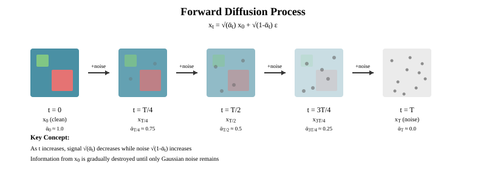
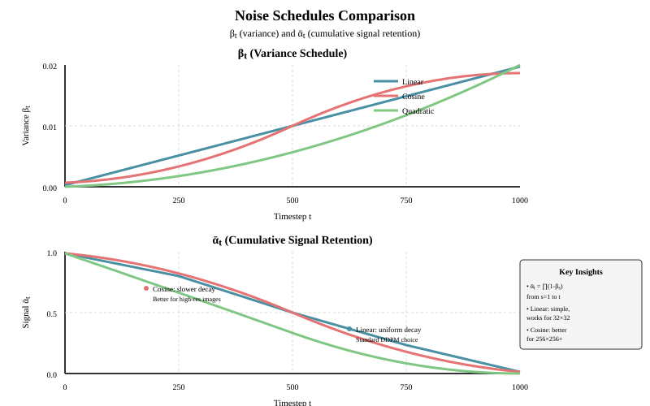
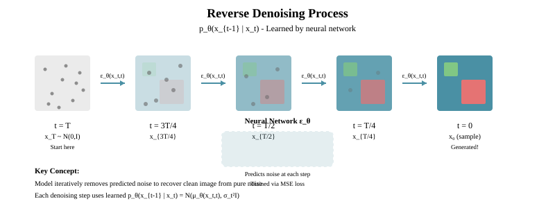
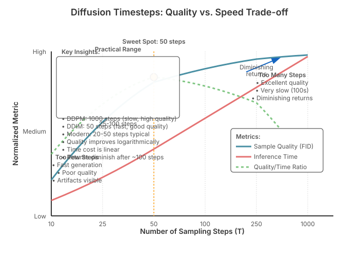

# Chapter 32: Diffusion Model Fundamentals

## Prerequisites

Before diving into diffusion models, you should be familiar with:

- **Basic probability and statistics**: Gaussian distributions, expectation, variance, KL divergence
- **Neural networks and PyTorch**: Basic model building, training loops, gradient descent
- **Linear algebra**: Vector operations, matrix multiplication, understanding of high-dimensional spaces
- **Calculus**: Gradients, partial derivatives (for understanding score functions)
- **Optional but helpful**:
  - VAEs and the ELBO/VLB framework (helpful for understanding theoretical connections)
  - Positional encodings from transformers (similar to time embeddings used here)
  - Markov chains (for understanding the forward/reverse processes)

If you need background on positional encodings, see earlier chapters on attention mechanisms. We'll build everything else from first principles.

## Introduction

Diffusion models have emerged as one of the most powerful classes of generative models, achieving state-of-the-art results in image generation, audio synthesis, and even text generation. Unlike autoregressive models (like GPT) or variational autoencoders (VAEs), diffusion models learn to generate data by reversing a gradual noising process.

This chapter covers the mathematical foundations and core concepts behind diffusion models, preparing you for implementation in [Chapter 33: Implementing Diffusion Models](33-diffusion-implementation.md) and advanced techniques in [Chapter 34: Advanced Diffusion Topics](34-diffusion-advanced.md).

**Key Papers:**

- [Denoising Diffusion Probabilistic Models (DDPM)](https://arxiv.org/abs/2006.11239) - Ho et al., 2020
- [Score-Based Generative Modeling through SDEs](https://arxiv.org/abs/2011.13456) - Song et al., 2021
- [Improved Denoising Diffusion Probabilistic Models](https://arxiv.org/abs/2102.09672) - Nichol & Dhariwal, 2021
- [Generative Modeling by Estimating Gradients of the Data Distribution](https://arxiv.org/abs/1907.05600) - Song & Ermon, 2019

## Overview of Generative Models

Before diving into diffusion models, let's briefly compare them to other generative model families:

| Model Type | Training Objective | Sampling Process | Likelihood |
|------------|-------------------|------------------|------------|
| **VAEs** | ELBO maximization | Single forward pass | Tractable (approximate) |
| **GANs** | Adversarial min-max | Single forward pass | Intractable |
| **Autoregressive** | Log-likelihood | Sequential generation | Tractable |
| **Normalizing Flows** | Exact likelihood | Single invertible pass | Tractable |
| **Diffusion Models** | Denoising objective | Iterative refinement | Tractable |

Diffusion models offer several advantages:

- **Stable training**: Unlike GANs, no adversarial dynamics
- **High-quality samples**: State-of-the-art image generation
- **Flexible architectures**: Can use various neural network backbones
- **Principled framework**: Strong theoretical foundations

## The Diffusion Process: Intuition

The core idea behind diffusion models is beautifully simple:

1. **Forward Process**: Gradually add Gaussian noise to data until it becomes pure noise
2. **Reverse Process**: Learn to reverse this process, starting from noise and recovering data

This is analogous to:

- Watching a drop of ink diffuse in water (forward)
- Learning to reverse time and reconstitute the original drop (reverse)

### Why Visualization Matters

**The Problem:** Understanding diffusion intuitively requires seeing how data progressively degrades into noise. Without visualization, it's hard to grasp what "gradually adding Gaussian noise" actually means at each timestep.

**Theoretical Foundation:** The forward process follows a noise schedule where at each step $t$, we can sample $\mathbf{x}_t$ directly using:

```math
\mathbf{x}_t = \sqrt{\bar{\alpha}_t} \mathbf{x}_0 + \sqrt{1 - \bar{\alpha}_t} \boldsymbol{\epsilon}
```

This means the noisy image is a weighted combination of the original image (scaled by $\sqrt{\bar{\alpha}_t}$) and pure noise (scaled by $\sqrt{1-\bar{\alpha}_t}$). As $t$ increases, $\bar{\alpha}_t$ decreases, so the image contribution diminishes while noise increases.

**Key Insight:** The beauty of this formulation is that we can jump to any noise level $t$ in one step without iterating through all intermediate steps. This is critical for efficient training, where we need to sample random timesteps during each training iteration.



```python
import torch
import torch.nn as nn
import matplotlib.pyplot as plt
import numpy as np

# Simple visualization of the diffusion process
def visualize_diffusion_process(x0, num_steps=10):
    """
    Visualize how an image gets progressively noisier

    Args:
        x0: Original image tensor [C, H, W]
        num_steps: Number of diffusion steps to show
    """
    # Define variance schedule (we'll explain this later)
    betas = torch.linspace(0.0001, 0.02, num_steps)
    alphas = 1.0 - betas
    alphas_cumprod = torch.cumprod(alphas, dim=0)

    images = [x0]
    x_t = x0

    for t in range(num_steps):
        # Add noise according to the schedule
        noise = torch.randn_like(x_t)
        alpha_t = alphas_cumprod[t]
        x_t = torch.sqrt(alpha_t) * x0 + torch.sqrt(1 - alpha_t) * noise
        images.append(x_t)

    return images

# Example usage (requires actual image data)
# x0 = load_image()  # Shape: [C, H, W]
# noisy_images = visualize_diffusion_process(x0)
```

## Forward Diffusion Process

### Mathematical Formulation

The forward diffusion process is a **fixed** Markov chain that gradually adds Gaussian noise to data $\mathbf{x}_0 \sim q(\mathbf{x}_0)$ over $T$ timesteps:

```math
q(\mathbf{x}_t | \mathbf{x}_{t-1}) = \mathcal{N}(\mathbf{x}_{t}; \sqrt{1 - \beta_t} \mathbf{x}_{t-1}, \beta_t \mathbf{I})
```

where:

- $\beta_t \in (0, 1)$ is the **variance schedule** (controls how much noise to add at step $t$)
- $t \in \{1, ..., T\}$ is the timestep
- $\mathbf{x}_0$ is the original data
- $\mathbf{x}_T$ is approximately pure Gaussian noise

### Key Property: Closed-Form Sampling

A crucial property of this process is that we can sample $\mathbf{x}_t$ at any timestep $t$ directly from $\mathbf{x}_0$ without iterating through all previous steps. Define:

```math
\alpha_t := 1 - \beta_t, \quad \bar{\alpha}_t := \prod_{s=1}^{t} \alpha_s
```

Then:

```math
q(\mathbf{x}_t | \mathbf{x}_0) = \mathcal{N}(\mathbf{x}_{t}; \sqrt{\bar{\alpha}_t} \mathbf{x}_0, (1 - \bar{\alpha}_t) \mathbf{I})
```

This can be rewritten using the **reparameterization trick**:

```math
\mathbf{x}_t = \sqrt{\bar{\alpha}_t} \mathbf{x}_0 + \sqrt{1 - \bar{\alpha}_t} \boldsymbol{\epsilon}, \quad \boldsymbol{\epsilon} \sim \mathcal{N}(\mathbf{0}, \mathbf{I})
```

**Proof sketch:**
Starting from $q(\mathbf{x}_t | \mathbf{x}_{t-1}) = \mathcal{N}(\sqrt{\alpha_t} \mathbf{x}_{t-1}, (1-\alpha_t)\mathbf{I})$, we can use the property that the sum of Gaussians is Gaussian to recursively derive this formula.

### Implementation Strategy

**The Problem:** We need an efficient way to add noise to images during training. Naively, we would need to iterate through all timesteps 1 to $t$ to get $\mathbf{x}_t$, which would be computationally expensive.

**Theoretical Justification:** The closed-form sampling property allows us to compute $\mathbf{x}_t$ directly from $\mathbf{x}_0$ without any iteration. This is possible because:

1. Each step of Gaussian noise addition is a linear transformation
2. Compositions of linear Gaussian transformations yield another Gaussian
3. The cumulative product $\bar{\alpha}_t$ captures the effect of all previous steps

**How This Relates to Alternatives:**

- **Compared to VAEs:** VAEs sample latent $z$ once; diffusion samples at multiple noise levels
- **Compared to normalizing flows:** Flows require invertible transformations; diffusion forward process is non-invertible (information-destroying)
- **Compared to autoregressive models:** Autoregressive generates sequentially; diffusion adds noise in parallel but denoises iteratively

**Key Insights:**

1. **Precomputation is crucial:** We precompute $\sqrt{\bar{\alpha}_t}$, $\sqrt{1-\bar{\alpha}_t}$, etc., to avoid redundant calculations
2. **Broadcasting:** Using `_extract()` method ensures proper broadcasting across batch and spatial dimensions
3. **Reparameterization trick:** Sampling $\mathbf{x}_t$ uses the same trick as VAEs: deterministic function + external randomness

```python
class ForwardDiffusion:
    """
    Implements the forward diffusion process q(x_t | x_0)
    """
    def __init__(self, num_timesteps=1000, beta_start=0.0001, beta_end=0.02):
        """
        Args:
            num_timesteps: Total number of diffusion steps T
            beta_start: Initial variance (β_1)
            beta_end: Final variance (β_T)
        """
        self.num_timesteps = num_timesteps

        # Define beta schedule (linear schedule)
        self.betas = torch.linspace(beta_start, beta_end, num_timesteps)

        # Precompute useful quantities
        self.alphas = 1.0 - self.betas
        self.alphas_cumprod = torch.cumprod(self.alphas, dim=0)
        self.alphas_cumprod_prev = torch.cat([
            torch.tensor([1.0]),
            self.alphas_cumprod[:-1]
        ])

        # Calculations for posterior q(x_{t-1} | x_t, x_0)
        self.sqrt_alphas_cumprod = torch.sqrt(self.alphas_cumprod)
        self.sqrt_one_minus_alphas_cumprod = torch.sqrt(1.0 - self.alphas_cumprod)
        self.sqrt_recip_alphas_cumprod = torch.sqrt(1.0 / self.alphas_cumprod)
        self.sqrt_recipm1_alphas_cumprod = torch.sqrt(1.0 / self.alphas_cumprod - 1)

        # Posterior variance
        self.posterior_variance = (
            self.betas * (1.0 - self.alphas_cumprod_prev) / (1.0 - self.alphas_cumprod)
        )

    def q_sample(self, x_0, t, noise=None):
        """
        Sample from q(x_t | x_0) using the closed-form formula

        Args:
            x_0: Original data [batch_size, ...]
            t: Timestep tensor [batch_size] with values in [0, T-1]
            noise: Optional pre-sampled noise (for reproducibility)

        Returns:
            x_t: Noised data at timestep t
            noise: The noise that was added
        """
        if noise is None:
            noise = torch.randn_like(x_0)

        # Extract the appropriate values for timestep t
        sqrt_alphas_cumprod_t = self._extract(self.sqrt_alphas_cumprod, t, x_0.shape)
        sqrt_one_minus_alphas_cumprod_t = self._extract(
            self.sqrt_one_minus_alphas_cumprod, t, x_0.shape
        )

        # Apply the forward diffusion formula
        x_t = sqrt_alphas_cumprod_t * x_0 + sqrt_one_minus_alphas_cumprod_t * noise

        return x_t, noise

    def _extract(self, a, t, x_shape):
        """
        Extract values from a at indices t and reshape for broadcasting

        Args:
            a: Tensor to extract from [T]
            t: Timestep indices [batch_size]
            x_shape: Shape of data for broadcasting

        Returns:
            Extracted values reshaped to [batch_size, 1, 1, ...]
        """
        batch_size = t.shape[0]
        out = a.gather(-1, t)
        return out.reshape(batch_size, *((1,) * (len(x_shape) - 1)))

# Example usage
forward_diffusion = ForwardDiffusion(num_timesteps=1000)

# Create sample data
x_0 = torch.randn(4, 3, 32, 32)  # Batch of 4 images

# Sample at different timesteps
t = torch.tensor([0, 250, 500, 999])  # Different noise levels
x_t, noise = forward_diffusion.q_sample(x_0, t)

print(f"Original data shape: {x_0.shape}")
print(f"Noised data shape: {x_t.shape}")
print(f"Noise shape: {noise.shape}")
```

### Variance Schedules

The choice of $\beta_t$ (variance schedule) significantly impacts training and sampling. Common schedules include:

1. **Linear Schedule** (DDPM):


   ```math
\beta_t = \beta_1 + \frac{t-1}{T-1}(\beta_T - \beta_1)
   ```

2. **Cosine Schedule** (Improved DDPM):


   ```math
\bar{\alpha}_t = \frac{f(t)}{f(0)}, \quad f(t) = \cos\left(\frac{t/T + s}{1 + s} \cdot \frac{\pi}{2}\right)^2
   ```

3. **Quadratic Schedule**:


   ```math
\beta_t = \beta_1 + \left(\frac{t-1}{T-1}\right)^2 (\beta_T - \beta_1)
   ```



### Understanding Variance Schedules

**The Problem:** Different data types (images vs audio) and resolutions require different rates of noise addition. A schedule that's too aggressive destroys information too quickly; too conservative wastes timesteps.

**Theoretical Justification:**

- **Linear schedule:** Simple and works well for low-resolution images (32×32, 64×64). It provides uniform noise increase, which matches the uniform importance of timesteps in the simplified objective.
- **Cosine schedule:** Better for high-resolution images because it adds noise more slowly at the beginning and end, preserving fine details longer. The cosine shape ensures $\bar{\alpha}_t$ doesn't drop too quickly near $t=0$.
- **Quadratic schedule:** Aggressive noise addition, useful when you want faster convergence to pure noise.

**How Schedules Relate to Each Other:**

- All schedules must ensure $\bar{\alpha}_0 \approx 1$ (minimal noise) and $\bar{\alpha}_T \approx 0$ (pure noise)
- The rate of change $\frac{d\bar{\alpha}_t}{dt}$ determines how quickly information is destroyed
- Cosine schedule has slower changes at boundaries, better for high-frequency details

**Key Insights:**

1. **The schedule affects both training and sampling:** A good schedule makes the model's job easier at each timestep
2. **Clipping is important:** For cosine schedule, we clip betas to prevent numerical instability
3. **Empirical tuning matters:** Despite theory, the best schedule is often found experimentally

```python
def get_beta_schedule(schedule_name, num_timesteps, beta_start=0.0001, beta_end=0.02):
    """
    Generate various beta schedules

    Args:
        schedule_name: One of 'linear', 'cosine', 'quadratic'
        num_timesteps: Number of diffusion steps
        beta_start: Starting beta value (for linear/quadratic)
        beta_end: Ending beta value (for linear/quadratic)

    Returns:
        betas: Tensor of shape [num_timesteps]
    """
    if schedule_name == 'linear':
        return torch.linspace(beta_start, beta_end, num_timesteps)

    elif schedule_name == 'cosine':
        # Cosine schedule from Improved DDPM
        steps = num_timesteps + 1
        s = 0.008  # Offset to prevent beta_t from being too small near t=0
        x = torch.linspace(0, num_timesteps, steps)
        alphas_cumprod = torch.cos(((x / num_timesteps) + s) / (1 + s) * torch.pi * 0.5) ** 2
        alphas_cumprod = alphas_cumprod / alphas_cumprod[0]
        betas = 1 - (alphas_cumprod[1:] / alphas_cumprod[:-1])
        return torch.clip(betas, 0.0001, 0.9999)

    elif schedule_name == 'quadratic':
        t = torch.linspace(0, 1, num_timesteps)
        return beta_start + (beta_end - beta_start) * t ** 2

    else:
        raise ValueError(f"Unknown schedule: {schedule_name}")

# Visualize different schedules
import matplotlib.pyplot as plt

schedules = ['linear', 'cosine', 'quadratic']
fig, axes = plt.subplots(1, 3, figsize=(15, 4))

for schedule, ax in zip(schedules, axes):
    betas = get_beta_schedule(schedule, 1000)
    alphas_cumprod = torch.cumprod(1 - betas, dim=0)

    ax.plot(betas.numpy(), label='beta_t', alpha=0.7)
    ax.plot(alphas_cumprod.numpy(), label='alpha_bar_t', alpha=0.7)
    ax.set_title(f'{schedule.capitalize()} Schedule')
    ax.set_xlabel('Timestep t')
    ax.legend()
    ax.grid(True, alpha=0.3)

plt.tight_layout()
# plt.savefig('variance_schedules.png')
```

## Reverse Diffusion Process

### Learning to Denoise

The reverse process aims to **undo** the forward diffusion, transforming noise back into data. We want to learn:

```math
p_\theta(\mathbf{x}_{t-1} | \mathbf{x}_t)
```

Starting from $\mathbf{x}_T \sim \mathcal{N}(\mathbf{0}, \mathbf{I})$, we iteratively sample:

```math
p_\theta(\mathbf{x}_{0:T}) = p(\mathbf{x}_T) \prod_{t=1}^{T} p_\theta(\mathbf{x}_{t-1} | \mathbf{x}_t)
```



### Reverse Process is Gaussian (with small $\beta_t$)

A key insight: if $\beta_t$ is small, the reverse process $q(\mathbf{x}_{t-1} | \mathbf{x}_t)$ is also Gaussian (when conditioned on $\mathbf{x}_0$):

```math
q(\mathbf{x}_{t-1} | \mathbf{x}_t, \mathbf{x}_0) = \mathcal{N}(\mathbf{x}_{t-1}; \tilde{\boldsymbol{\mu}}_t(\mathbf{x}_t, \mathbf{x}_0), \tilde{\beta}_t \mathbf{I})
```

where:

```math
\tilde{\boldsymbol{\mu}}_t(\mathbf{x}_t, \mathbf{x}_0) = \frac{\sqrt{\bar{\alpha}_{t-1}} \beta_t}{1 - \bar{\alpha}_t} \mathbf{x}_0 + \frac{\sqrt{\alpha_t}(1 - \bar{\alpha}_{t-1})}{1 - \bar{\alpha}_t} \mathbf{x}_t
```

```math
\tilde{\beta}_t = \frac{1 - \bar{\alpha}_{t-1}}{1 - \bar{\alpha}_t} \beta_t
```

### Parameterization Choices

We can parameterize $p_\theta(\mathbf{x}_{t-1} | \mathbf{x}_t)$ in several ways:

1. **Predict $\mathbf{x}_0$ directly**: $\mathbf{x}_\theta(\mathbf{x}_t, t)$
2. **Predict the noise $\boldsymbol{\epsilon}$**: $\boldsymbol{\epsilon}_\theta(\mathbf{x}_t, t)$ (DDPM approach)
3. **Predict the mean directly**: $\boldsymbol{\mu}_\theta(\mathbf{x}_t, t)$
4. **Predict the score**: $\mathbf{s}_\theta(\mathbf{x}_t, t) = \nabla_{\mathbf{x}_t} \log p(\mathbf{x}_t)$ (Score-based models)

The DDPM paper showed that **predicting the noise $\boldsymbol{\epsilon}$** works best. Given $\boldsymbol{\epsilon}_\theta(\mathbf{x}_t, t)$, we can compute:

```math
\mathbf{x}_0 = \frac{1}{\sqrt{\bar{\alpha}_t}} \left(\mathbf{x}_t - \sqrt{1 - \bar{\alpha}_t} \boldsymbol{\epsilon}_\theta(\mathbf{x}_t, t)\right)
```

Then plug this into $\tilde{\boldsymbol{\mu}}_t$ to get the mean of the reverse distribution.

## Score Matching and Score Functions

### What is a Score Function?

The **score function** is the gradient of the log-probability density:

```math
\mathbf{s}(\mathbf{x}) = \nabla_\mathbf{x} \log p(\mathbf{x})
```

The score function points in the direction of increasing probability density. If we know the score at any point, we can:

1. Move toward higher-density regions (sampling)
2. Estimate the underlying distribution

### Connection to Denoising

There's a deep connection between denoising and score matching. The optimal denoiser for Gaussian noise is:

```math
\mathbb{E}[\mathbf{x}_0 | \mathbf{x}_t] = \mathbf{x}_t + (1 - \bar{\alpha}_t) \nabla_{\mathbf{x}_t} \log p(\mathbf{x}_t)
```

This means learning to denoise is equivalent to learning the score function!

Since $\mathbf{x}_t = \sqrt{\bar{\alpha}_t} \mathbf{x}_0 + \sqrt{1 - \bar{\alpha}_t} \boldsymbol{\epsilon}$, we have:

```math
\nabla_{\mathbf{x}_t} \log p(\mathbf{x}_t) = -\frac{\boldsymbol{\epsilon}}{\sqrt{1 - \bar{\alpha}_t}}
```

Therefore, predicting the noise $\boldsymbol{\epsilon}$ is equivalent to predicting the score (up to scaling).

### Score-Based Generative Models

Score-based models (Song et al.) directly learn the score function $\mathbf{s}_\theta(\mathbf{x}, \sigma)$ at different noise levels $\sigma$. They use **score matching** objectives like:

```math
\mathcal{L}_{\text{DSM}}(\theta) = \mathbb{E}_{p(\mathbf{x})} \mathbb{E}_{p(\tilde{\mathbf{x}}|\mathbf{x})} \left[\left\| \mathbf{s}_\theta(\tilde{\mathbf{x}}, \sigma) - \nabla_{\tilde{\mathbf{x}}} \log p(\tilde{\mathbf{x}} | \mathbf{x}) \right\|^2 \right]
```

where $p(\tilde{\mathbf{x}} | \mathbf{x}) = \mathcal{N}(\mathbf{x}, \sigma^2 \mathbf{I})$.

This is closely related to DDPM's formulation, and both frameworks can be unified under the **Stochastic Differential Equation (SDE)** perspective.

### Why Score Matching Works for Diffusion

**The Problem:** Directly maximizing likelihood $p_\theta(\mathbf{x})$ is intractable for complex distributions because the normalizing constant is unknown. We need an alternative training objective.

**Theoretical Justification:**
The **denoising score matching** objective trains a model to predict the score without knowing the normalizing constant. For perturbed data $\tilde{\mathbf{x}} = \mathbf{x} + \sigma \boldsymbol{\epsilon}$, the true score is:

```math
\nabla_{\tilde{\mathbf{x}}} \log p(\tilde{\mathbf{x}} | \mathbf{x}) = -\frac{\boldsymbol{\epsilon}}{\sigma}
```

This is tractable! We can train by minimizing $\|\mathbf{s}_\theta(\tilde{\mathbf{x}}, \sigma) - (-\boldsymbol{\epsilon}/\sigma)\|^2$, which is exactly what diffusion models do when predicting noise.

**Relationship to Alternatives:**

- **Compared to GAN discriminator:** Score function provides gradients toward data, not just real/fake classification
- **Compared to VAE:** VAEs maximize ELBO; score matching directly estimates density gradients
- **Compared to normalizing flows:** Flows need invertibility; scores only need gradients

**Key Insights:**

1. **Score = Direction to data:** The score points toward higher probability regions, naturally guiding sampling
2. **Multi-scale is crucial:** Training at multiple noise levels $\sigma$ helps capture both coarse and fine structure
3. **Equivalence to diffusion:** DDPM's noise prediction is mathematically equivalent to score prediction with scaling $-\sqrt{1-\bar{\alpha}_t}$

```python
class ScoreNetwork(nn.Module):
    """
    Simple score network that predicts the score function
    (gradient of log probability)
    """
    def __init__(self, data_dim, hidden_dim=128):
        super().__init__()
        self.net = nn.Sequential(
            nn.Linear(data_dim + 1, hidden_dim),  # +1 for noise level
            nn.ReLU(),
            nn.Linear(hidden_dim, hidden_dim),
            nn.ReLU(),
            nn.Linear(hidden_dim, hidden_dim),
            nn.ReLU(),
            nn.Linear(hidden_dim, data_dim)
        )

    def forward(self, x, sigma):
        """
        Args:
            x: Data [batch_size, data_dim]
            sigma: Noise level [batch_size, 1]

        Returns:
            score: Predicted score [batch_size, data_dim]
        """
        # Concatenate data with noise level
        inp = torch.cat([x, sigma], dim=-1)
        return self.net(inp)

# Denoising score matching loss
def dsm_loss(score_net, x, sigma_min=0.01, sigma_max=1.0):
    """
    Denoising score matching loss

    Args:
        score_net: Score network
        x: Clean data [batch_size, data_dim]
        sigma_min, sigma_max: Range of noise levels

    Returns:
        loss: DSM loss
    """
    # Sample noise level
    sigma = torch.exp(torch.rand(x.shape[0], 1) * (np.log(sigma_max) - np.log(sigma_min)) + np.log(sigma_min))
    sigma = sigma.to(x.device)

    # Add noise
    noise = torch.randn_like(x)
    x_noisy = x + sigma * noise

    # Predict score
    score = score_net(x_noisy, sigma)

    # True score for Gaussian perturbation: -noise / sigma
    target_score = -noise / sigma

    # MSE between predicted and true score
    loss = torch.mean((score - target_score) ** 2)

    return loss
```

## Continuous-Time Formulation: SDEs

### From Discrete to Continuous Time

So far, we've described diffusion as a **discrete-time** process with $T$ steps. However, diffusion can also be formulated in **continuous time** using Stochastic Differential Equations (SDEs). This perspective unifies DDPM and score-based models into a single framework.

### The Forward SDE

In continuous time, the forward diffusion process is described by an SDE:

```math
d\mathbf{x} = \mathbf{f}(\mathbf{x}, t) dt + g(t) d\mathbf{w}
```

where:

- $t \in [0, T]$ is continuous time
- $\mathbf{f}(\mathbf{x}, t)$ is the **drift coefficient** (deterministic evolution)
- $g(t)$ is the **diffusion coefficient** (noise scale)
- $d\mathbf{w}$ is the standard Wiener process (Brownian motion)

### Variance-Preserving (VP) SDE

The DDPM formulation corresponds to the **Variance-Preserving (VP) SDE**:

```math
d\mathbf{x} = -\frac{1}{2}\beta(t) \mathbf{x} dt + \sqrt{\beta(t)} d\mathbf{w}
```

where $\beta(t)$ is the continuous-time noise schedule. This SDE:

- Gradually adds noise while "pulling" toward zero (drift term)
- Preserves the overall variance of the distribution
- Has the solution: $\mathbf{x}_t \sim \mathcal{N}(\sqrt{\bar{\alpha}_t} \mathbf{x}_0, (1 - \bar{\alpha}_t)\mathbf{I})$ (same as discrete DDPM)

### Variance-Exploding (VE) SDE

An alternative is the **Variance-Exploding (VE) SDE** from score-based models:

```math
d\mathbf{x} = \sqrt{\frac{d[\sigma^2(t)]}{dt}} d\mathbf{w}
```

This SDE:

- Has no drift term ($\mathbf{f} = 0$)
- Only adds noise with increasing variance $\sigma^2(t)$
- Has the solution: $\mathbf{x}_t \sim \mathcal{N}(\mathbf{x}_0, \sigma^2(t)\mathbf{I})$

Typical choice: $\sigma(t) = \sigma_{\min} \left(\frac{\sigma_{\max}}{\sigma_{\min}}\right)^t$

### The Reverse SDE

Given the forward SDE, Anderson (1982) showed that the **reverse-time SDE** is:

```math
d\mathbf{x} = \left[\mathbf{f}(\mathbf{x}, t) - g(t)^2 \nabla_\mathbf{x} \log p_t(\mathbf{x})\right] dt + g(t) d\bar{\mathbf{w}}
```

where:

- $d\bar{\mathbf{w}}$ is a reverse-time Wiener process
- $\nabla_\mathbf{x} \log p_t(\mathbf{x})$ is the **score function** at time $t$

**Key Insight:** If we can estimate the score function $\mathbf{s}_\theta(\mathbf{x}, t) \approx \nabla_\mathbf{x} \log p_t(\mathbf{x})$, we can simulate the reverse SDE to generate samples!

### VP-SDE Reverse Process

For the VP-SDE, the reverse process becomes:

```math
d\mathbf{x} = \left[-\frac{1}{2}\beta(t) \mathbf{x} - \beta(t) \nabla_\mathbf{x} \log p_t(\mathbf{x})\right] dt + \sqrt{\beta(t)} d\bar{\mathbf{w}}
```

Since we know that $\nabla_\mathbf{x} \log p_t(\mathbf{x}) = -\frac{\boldsymbol{\epsilon}}{\sqrt{1 - \bar{\alpha}_t}}$, this is equivalent to DDPM's reverse process!

### Why Care About the SDE View?

**Theoretical Benefits:**

1. **Unified framework**: DDPM, score-based models, and their variants are all special cases
2. **Flexible sampling**: Can use different SDE solvers (Euler-Maruyama, predictor-corrector, etc.)
3. **Continuous control**: Can choose any time discretization, not limited to training schedule

**Practical Benefits:**

1. **Better samplers**: Probability flow ODE (deterministic sampling)
2. **Likelihood computation**: Can compute exact likelihoods using continuous normalizing flows
3. **Interpolation**: Easy to interpolate between different noise schedules

### Probability Flow ODE

Every SDE has a corresponding **probability flow ODE** with the same marginals:

```math
d\mathbf{x} = \left[\mathbf{f}(\mathbf{x}, t) - \frac{1}{2} g(t)^2 \nabla_\mathbf{x} \log p_t(\mathbf{x})\right] dt
```

This ODE:

- Is **deterministic** (no stochastic term)
- Generates the same distribution as the SDE
- Enables exact likelihood computation
- Relates to DDIM (deterministic sampling)

For VP-SDE, the probability flow ODE is:

```math
d\mathbf{x} = -\frac{1}{2}\beta(t) \left[\mathbf{x} + \nabla_\mathbf{x} \log p_t(\mathbf{x})\right] dt
```

### Implementing SDE-Based Sampling

**The Problem:** We have continuous-time SDEs but need discrete algorithms to simulate them on computers. How do we numerically integrate these equations while maintaining sample quality?

**Theoretical Justification:**
The **Euler-Maruyama method** is the simplest discretization of an SDE:

```math
\mathbf{x}_{t+\Delta t} = \mathbf{x}_t + f(\mathbf{x}_t, t)\Delta t + g(t)\sqrt{\Delta t}\boldsymbol{\epsilon}_t
```

This is essentially a first-order approximation where we:

1. Apply the drift (deterministic) for duration $\Delta t$
2. Add diffusion (stochastic) scaled by $\sqrt{\Delta t}$ (from Brownian motion properties)

For the **probability flow ODE**, we can use standard ODE solvers (like RK45) because there's no stochastic term. This gives deterministic sampling with the same marginal distributions as the SDE.

**Relationship to Alternatives:**

- **Compared to DDPM sampling:** DDPM is a discretized VP-SDE with specific step size
- **Compared to DDIM:** DDIM approximates the probability flow ODE
- **Compared to predictor-corrector:** P-C methods alternate SDE steps with Langevin dynamics corrections

**Key Insights:**

1. **Continuous formulation enables flexibility:** Can change discretization without retraining
2. **ODE sampling is deterministic:** Same noise input → same output (useful for interpolation)
3. **SDE vs ODE trade-off:** SDE gives better diversity; ODE gives better consistency

```python
import torch
from scipy.integrate import solve_ivp

class VPSDE:
    """
    Variance-Preserving SDE for diffusion models
    """
    def __init__(self, beta_min=0.1, beta_max=20.0, T=1.0):
        """
        Args:
            beta_min: Minimum beta value
            beta_max: Maximum beta value
            T: Terminal time
        """
        self.beta_min = beta_min
        self.beta_max = beta_max
        self.T = T

    def beta(self, t):
        """Linear schedule for beta(t)"""
        return self.beta_min + t * (self.beta_max - self.beta_min)

    def marginal_prob(self, x_0, t):
        """
        Compute mean and std of p(x_t | x_0)

        Args:
            x_0: Initial data
            t: Time (can be tensor)

        Returns:
            mean, std of the marginal distribution
        """
        log_mean_coeff = -0.25 * t ** 2 * (self.beta_max - self.beta_min) - 0.5 * t * self.beta_min
        mean = torch.exp(log_mean_coeff[:, None, None, None]) * x_0
        std = torch.sqrt(1.0 - torch.exp(2.0 * log_mean_coeff))
        return mean, std

    def forward_sde(self, x, t):
        """
        Compute drift and diffusion for forward SDE

        Args:
            x: Current state
            t: Current time (scalar)

        Returns:
            drift, diffusion coefficient
        """
        drift = -0.5 * self.beta(t) * x
        diffusion = torch.sqrt(torch.tensor(self.beta(t)))
        return drift, diffusion

    def reverse_sde(self, x, t, score):
        """
        Compute drift and diffusion for reverse SDE

        Args:
            x: Current state
            t: Current time
            score: Score function ∇log p(x_t)

        Returns:
            drift, diffusion coefficient
        """
        drift = -0.5 * self.beta(t) * x - self.beta(t) * score
        diffusion = torch.sqrt(torch.tensor(self.beta(t)))
        return drift, diffusion


class VESDE:
    """
    Variance-Exploding SDE for score-based models
    """
    def __init__(self, sigma_min=0.01, sigma_max=50.0, T=1.0):
        self.sigma_min = sigma_min
        self.sigma_max = sigma_max
        self.T = T

    def sigma(self, t):
        """Exponential schedule for sigma(t)"""
        return self.sigma_min * (self.sigma_max / self.sigma_min) ** t

    def marginal_prob(self, x_0, t):
        """
        Compute mean and std of p(x_t | x_0)
        For VE-SDE: mean = x_0, std = sigma(t)
        """
        mean = x_0
        std = self.sigma(t)
        return mean, std

    def reverse_sde(self, x, t, score):
        """
        Reverse SDE for VE process
        """
        sigma_t = self.sigma(t)
        drift = -sigma_t ** 2 * score
        diffusion = sigma_t * torch.sqrt(2 * torch.log(torch.tensor(self.sigma_max / self.sigma_min)))
        return drift, diffusion


def euler_maruyama_sampler(sde, score_model, shape, num_steps=1000, device='cuda'):
    """
    Sample from reverse SDE using Euler-Maruyama method

    Args:
        sde: SDE instance (VPSDE or VESDE)
        score_model: Neural network that predicts the score
        shape: Shape of samples to generate
        num_steps: Number of discretization steps
        device: Device to run on

    Returns:
        Generated samples
    """
    dt = sde.T / num_steps
    x = torch.randn(shape, device=device) * sde.sigma(sde.T)  # Start from prior

    with torch.no_grad():
        for i in range(num_steps):
            t = sde.T - i * dt
            t_tensor = torch.ones(shape[0], device=device) * t

            # Predict score
            score = score_model(x, t_tensor)

            # Reverse SDE step
            drift, diffusion = sde.reverse_sde(x, t, score)

            # Euler-Maruyama update
            x = x + drift * dt + diffusion * torch.sqrt(torch.tensor(dt)) * torch.randn_like(x)

    return x


def probability_flow_ode_sampler(sde, score_model, shape, rtol=1e-5, atol=1e-5, device='cuda'):
    """
    Sample using the probability flow ODE (deterministic)

    Args:
        sde: SDE instance
        score_model: Score network
        shape: Sample shape
        rtol, atol: ODE solver tolerances
        device: Device

    Returns:
        Generated samples
    """
    def ode_func(t, x_flat):
        """ODE function for scipy's solver"""
        x = torch.from_numpy(x_flat.reshape(shape)).to(device).float()
        t_tensor = torch.ones(shape[0], device=device) * t

        with torch.no_grad():
            score = score_model(x, t_tensor)

        # Probability flow ODE drift
        if isinstance(sde, VPSDE):
            drift = -0.5 * sde.beta(t) * (x + score)
        else:  # VESDE
            sigma_t = sde.sigma(t)
            drift = -0.5 * sigma_t ** 2 * score

        return drift.cpu().numpy().flatten()

    # Initial condition: sample from prior
    x_init = torch.randn(shape, device=device) * sde.sigma(sde.T)

    # Solve ODE backwards in time
    solution = solve_ivp(
        ode_func,
        (sde.T, 0.0),
        x_init.cpu().numpy().flatten(),
        rtol=rtol,
        atol=atol,
        method='RK45'
    )

    x_final = torch.from_numpy(solution.y[:, -1].reshape(shape)).to(device)
    return x_final


# Example usage
# vpsde = VPSDE()
# score_model = ScoreNetwork(...)  # Your trained score model
# samples = euler_maruyama_sampler(vpsde, score_model, (64, 3, 32, 32))
# samples_ode = probability_flow_ode_sampler(vpsde, score_model, (64, 3, 32, 32))
```

### VP-SDE vs VE-SDE: When to Use Each?

| Aspect | VP-SDE | VE-SDE |
|--------|--------|--------|
| **Noise schedule** | Preserves variance | Exploding variance |
| **Best for** | Image generation | Score-based modeling |
| **Connection** | DDPM formulation | Original score matching |
| **Sampling** | Typically faster | More flexible |
| **Likelihood** | Better via ODE | Also good via ODE |

**Practical Recommendation:** For most image generation tasks, VP-SDE (DDPM-style) works well and has more established best practices. VE-SDE can be better when you need very flexible noise schedules or are doing pure score-based modeling research.

## DDPM Formulation

### Training Objective

The DDPM training objective is derived from the **variational lower bound (VLB)** on the negative log-likelihood:

```math
\mathcal{L}_{\text{VLB}} = \mathbb{E}_q \left[ \underbrace{D_{KL}(q(\mathbf{x}_T | \mathbf{x}_0) \| p(\mathbf{x}_T))}_{L_T} + \sum_{t=2}^T \underbrace{D_{KL}(q(\mathbf{x}_{t-1} | \mathbf{x}_t, \mathbf{x}_0) \| p_\theta(\mathbf{x}_{t-1} | \mathbf{x}_t))}_{L_{t-1}} \underbrace{- \log p_\theta(\mathbf{x}_0 | \mathbf{x}_1)}_{L_0} \right]
```

However, Ho et al. showed that a **simplified objective** works better in practice:

```math
\mathcal{L}_{\text{simple}}(\theta) = \mathbb{E}_{t, \mathbf{x}_0, \boldsymbol{\epsilon}} \left[ \left\| \boldsymbol{\epsilon} - \boldsymbol{\epsilon}_\theta(\mathbf{x}_t, t) \right\|^2 \right]
```

where:

- $t \sim \text{Uniform}(\{1, ..., T\})$
- $\mathbf{x}_0 \sim q(\mathbf{x}_0)$
- $\boldsymbol{\epsilon} \sim \mathcal{N}(\mathbf{0}, \mathbf{I})$
- $\mathbf{x}_t = \sqrt{\bar{\alpha}_t} \mathbf{x}_0 + \sqrt{1 - \bar{\alpha}_t} \boldsymbol{\epsilon}$

This is simply **mean squared error** between the true noise and predicted noise!

### Why Does the Simplified Objective Work?

The simplified objective can be seen as a weighted version of the VLB where certain terms are reweighted. Empirically, it leads to:

- Better sample quality
- Faster training
- Simpler implementation

The connection to score matching also provides theoretical justification: we're learning the score function at different noise levels.

### DDPM Algorithm

**Training:**

1. Sample $\mathbf{x}_0 \sim q(\mathbf{x}_0)$
2. Sample $t \sim \text{Uniform}(\{1, ..., T\})$
3. Sample $\boldsymbol{\epsilon} \sim \mathcal{N}(\mathbf{0}, \mathbf{I})$
4. Compute $\mathbf{x}_t = \sqrt{\bar{\alpha}_t} \mathbf{x}_0 + \sqrt{1 - \bar{\alpha}_t} \boldsymbol{\epsilon}$
5. Compute loss $\mathcal{L} = \| \boldsymbol{\epsilon} - \boldsymbol{\epsilon}_\theta(\mathbf{x}_t, t) \|^2$
6. Update $\theta$ using gradient descent

**Sampling:**

1. Sample $\mathbf{x}_T \sim \mathcal{N}(\mathbf{0}, \mathbf{I})$
2. For $t = T, ..., 1$:
   - Predict $\boldsymbol{\epsilon}_\theta(\mathbf{x}_t, t)$
   - Compute predicted $\mathbf{x}_0$: $\hat{\mathbf{x}}_0 = \frac{1}{\sqrt{\bar{\alpha}_t}} (\mathbf{x}_t - \sqrt{1 - \bar{\alpha}_t} \boldsymbol{\epsilon}_\theta(\mathbf{x}_t, t))$
   - Compute mean: $\boldsymbol{\mu}_\theta(\mathbf{x}_t, t)$ using $\tilde{\boldsymbol{\mu}}_t$ formula
   - Sample $\mathbf{x}_{t-1} \sim \mathcal{N}(\boldsymbol{\mu}_\theta(\mathbf{x}_t, t), \tilde{\beta}_t \mathbf{I})$
3. Return $\mathbf{x}_0$

### Implementing the DDPM Algorithm

**The Problem:** We need to translate the mathematical formulation into practical code that efficiently trains and samples from diffusion models.

**Theoretical Justification:**
The algorithm implements the simplified training objective:

```math
\mathcal{L}_{\text{simple}} = \mathbb{E}_{t, \mathbf{x}_0, \boldsymbol{\epsilon}} \|\boldsymbol{\epsilon} - \boldsymbol{\epsilon}_\theta(\mathbf{x}_t, t)\|^2
```

This is remarkably simple: just predict the noise that was added. The key mathematical insight is that this simple objective is equivalent to a weighted version of the full variational bound where we:

1. Ignore the weighting factors from the KL divergences
2. Focus purely on noise prediction quality
3. Sample timesteps uniformly (giving equal importance to all noise levels)

**Relationship to Alternatives:**

- **Compared to VAE training:** VAEs optimize reconstruction + KL; DDPM only optimizes "reconstruction" of noise
- **Compared to GAN training:** GANs need adversarial balance; DDPM is pure supervised regression
- **Compared to score matching:** Identical objective with different parameterization (noise vs score)

**Key Insights:**

1. **Training is embarrassingly parallel:** Each sample can use different $t$ independently
2. **Sampling requires sequential steps:** Can't parallelize the denoising trajectory (except with special methods)
3. **Mean computation is critical:** The formula for $\boldsymbol{\mu}_\theta$ carefully combines predicted $\mathbf{x}_0$ and current $\mathbf{x}_t$ to match the true posterior

```python
import torch.nn.functional as F

class DDPM:
    """
    Denoising Diffusion Probabilistic Model (DDPM)
    """
    def __init__(self, model, num_timesteps=1000, beta_start=0.0001, beta_end=0.02):
        """
        Args:
            model: Neural network that predicts noise epsilon_theta(x_t, t)
            num_timesteps: Number of diffusion steps T
            beta_start, beta_end: Variance schedule parameters
        """
        self.model = model
        self.num_timesteps = num_timesteps

        # Use the ForwardDiffusion class we defined earlier
        self.diffusion = ForwardDiffusion(num_timesteps, beta_start, beta_end)

    def train_step(self, x_0):
        """
        Single training step for DDPM

        Args:
            x_0: Clean data [batch_size, ...]

        Returns:
            loss: Simplified DDPM loss (MSE between predicted and true noise)
        """
        batch_size = x_0.shape[0]

        # Sample random timesteps
        t = torch.randint(0, self.num_timesteps, (batch_size,), device=x_0.device)

        # Sample noise
        noise = torch.randn_like(x_0)

        # Get noisy data at timestep t
        x_t, _ = self.diffusion.q_sample(x_0, t, noise=noise)

        # Predict noise
        noise_pred = self.model(x_t, t)

        # Compute loss (simple MSE)
        loss = F.mse_loss(noise_pred, noise)

        return loss

    @torch.no_grad()
    def sample(self, shape, device='cuda'):
        """
        Generate samples using the reverse diffusion process

        Args:
            shape: Shape of samples to generate [batch_size, ...]
            device: Device to generate samples on

        Returns:
            x_0: Generated samples
        """
        # Start from pure noise
        x_t = torch.randn(shape, device=device)

        # Iteratively denoise
        for t in reversed(range(self.num_timesteps)):
            # Create timestep tensor
            t_batch = torch.full((shape[0],), t, device=device, dtype=torch.long)

            # Predict noise
            noise_pred = self.model(x_t, t_batch)

            # Compute x_0 prediction
            alpha_t = self.diffusion.alphas_cumprod[t]
            alpha_t_prev = self.diffusion.alphas_cumprod_prev[t]
            beta_t = self.diffusion.betas[t]

            # Predict x_0
            x_0_pred = (x_t - torch.sqrt(1 - alpha_t) * noise_pred) / torch.sqrt(alpha_t)

            # Compute mean of p_theta(x_{t-1} | x_t)
            coef1 = torch.sqrt(alpha_t_prev) * beta_t / (1 - alpha_t)
            coef2 = torch.sqrt(self.diffusion.alphas[t]) * (1 - alpha_t_prev) / (1 - alpha_t)
            mean = coef1 * x_0_pred + coef2 * x_t

            if t > 0:
                # Add noise (except at t=0)
                variance = self.diffusion.posterior_variance[t]
                noise = torch.randn_like(x_t)
                x_t = mean + torch.sqrt(variance) * noise
            else:
                x_t = mean

        return x_t

    @torch.no_grad()
    def sample_progressive(self, shape, device='cuda', save_every=100):
        """
        Generate samples and save intermediate steps

        Args:
            shape: Shape of samples
            device: Device
            save_every: Save every N steps

        Returns:
            intermediates: List of intermediate samples
        """
        x_t = torch.randn(shape, device=device)
        intermediates = [x_t.cpu()]

        for t in reversed(range(self.num_timesteps)):
            t_batch = torch.full((shape[0],), t, device=device, dtype=torch.long)
            noise_pred = self.model(x_t, t_batch)

            alpha_t = self.diffusion.alphas_cumprod[t]
            alpha_t_prev = self.diffusion.alphas_cumprod_prev[t]
            beta_t = self.diffusion.betas[t]

            x_0_pred = (x_t - torch.sqrt(1 - alpha_t) * noise_pred) / torch.sqrt(alpha_t)

            coef1 = torch.sqrt(alpha_t_prev) * beta_t / (1 - alpha_t)
            coef2 = torch.sqrt(self.diffusion.alphas[t]) * (1 - alpha_t_prev) / (1 - alpha_t)
            mean = coef1 * x_0_pred + coef2 * x_t

            if t > 0:
                variance = self.diffusion.posterior_variance[t]
                noise = torch.randn_like(x_t)
                x_t = mean + torch.sqrt(variance) * noise
            else:
                x_t = mean

            if t % save_every == 0:
                intermediates.append(x_t.cpu())

        return intermediates
```

### Simple UNet for Noise Prediction

For images, the DDPM paper uses a UNet architecture with time embeddings. Here's a simplified version:

### Building the Noise Prediction Network

**The Problem:** The model must predict noise $\boldsymbol{\epsilon}_\theta(\mathbf{x}_t, t)$ conditioned on both the noisy image $\mathbf{x}_t$ and the timestep $t$. How do we effectively incorporate timestep information into the network?

**Theoretical Justification:**
The timestep $t$ controls which noise level we're dealing with, and the denoising task is fundamentally different at $t=1$ (barely noisy) vs $t=999$ (almost pure noise). We use **sinusoidal time embeddings** because:

1. They're continuous and smooth (neighboring timesteps get similar embeddings)
2. They're positionally unique (each $t$ has a distinct embedding)
3. They generalize to unseen timesteps (can interpolate)

This is the same principle as positional encodings in Transformers, extended from position to time.

**Relationship to Alternatives:**

- **Compared to learned embeddings:** Sinusoidal embeddings generalize better and don't need to be learned
- **Compared to concatenating $t$ directly:** High-dimensional embeddings give the network more expressiveness
- **Compared to FiLM conditioning:** Time embeddings are added/concatenated; FiLM uses affine transformations (both work, FiLM slightly better)

**Key Insights:**

1. **Time embedding dimensionality matters:** Typically 128-512 dimensions; too low loses information, too high wastes capacity
2. **Injection at multiple layers:** Adding time info at each layer (not just input) helps the network adapt processing based on noise level
3. **UNet architecture is crucial:** Skip connections preserve spatial information while allowing semantic processing in the bottleneck

```python
class TimeEmbedding(nn.Module):
    """
    Sinusoidal time embedding (similar to positional encoding in Transformers)
    """
    def __init__(self, dim):
        super().__init__()
        self.dim = dim

    def forward(self, t):
        """
        Args:
            t: Timestep tensor [batch_size]

        Returns:
            Time embeddings [batch_size, dim]
        """
        device = t.device
        half_dim = self.dim // 2
        embeddings = np.log(10000) / (half_dim - 1)
        embeddings = torch.exp(torch.arange(half_dim, device=device) * -embeddings)
        embeddings = t[:, None] * embeddings[None, :]
        embeddings = torch.cat([torch.sin(embeddings), torch.cos(embeddings)], dim=-1)
        return embeddings


class SimpleDiffusionModel(nn.Module):
    """
    Simplified diffusion model for demonstration
    (For real applications, use UNet architecture)
    """
    def __init__(self, channels=3, time_dim=128):
        super().__init__()

        self.time_embedding = TimeEmbedding(time_dim)

        # Simple convolutional network
        self.conv1 = nn.Conv2d(channels, 64, 3, padding=1)
        self.conv2 = nn.Conv2d(64, 64, 3, padding=1)
        self.conv3 = nn.Conv2d(64, channels, 3, padding=1)

        # Time projection layers
        self.time_proj1 = nn.Linear(time_dim, 64)
        self.time_proj2 = nn.Linear(time_dim, 64)

        self.act = nn.SiLU()  # Swish activation

    def forward(self, x, t):
        """
        Args:
            x: Noisy input [batch_size, channels, height, width]
            t: Timestep [batch_size]

        Returns:
            Predicted noise [batch_size, channels, height, width]
        """
        # Get time embeddings
        t_emb = self.time_embedding(t)  # [batch_size, time_dim]

        # First conv block
        h = self.act(self.conv1(x))
        h = h + self.time_proj1(t_emb)[:, :, None, None]  # Add time info

        # Second conv block
        h = self.act(self.conv2(h))
        h = h + self.time_proj2(t_emb)[:, :, None, None]

        # Output
        h = self.conv3(h)

        return h


# Example: Training loop
def train_ddpm(model, dataloader, num_epochs=100, device='cuda'):
    """
    Simple training loop for DDPM

    Args:
        model: SimpleDiffusionModel instance
        dataloader: DataLoader providing training images
        num_epochs: Number of training epochs
        device: Device to train on
    """
    model = model.to(device)
    ddpm = DDPM(model, num_timesteps=1000)
    optimizer = torch.optim.Adam(model.parameters(), lr=2e-4)

    model.train()
    for epoch in range(num_epochs):
        total_loss = 0
        for batch_idx, (x_0, _) in enumerate(dataloader):
            x_0 = x_0.to(device)

            # Training step
            loss = ddpm.train_step(x_0)

            # Backward pass
            optimizer.zero_grad()
            loss.backward()
            optimizer.step()

            total_loss += loss.item()

        avg_loss = total_loss / len(dataloader)
        print(f"Epoch {epoch+1}/{num_epochs}, Loss: {avg_loss:.4f}")

    return model

# Example: Generate samples
# model = SimpleDiffusionModel(channels=3)
# trained_model = train_ddpm(model, dataloader)
# samples = ddpm.sample((16, 3, 32, 32), device='cuda')
```

## Variance Prediction: Beyond Fixed Variance

### Learned Variance in Improved DDPM

The original DDPM uses a **fixed** posterior variance $\tilde{\beta}_t$ during sampling. However, Nichol & Dhariwal (2021) showed that **learning the variance** can improve sample quality and likelihood.

Instead of only predicting noise $\boldsymbol{\epsilon}_\theta$, the model can also predict variance:

```math
p_\theta(\mathbf{x}_{t-1} | \mathbf{x}_t) = \mathcal{N}(\mathbf{x}_{t-1}; \boldsymbol{\mu}_\theta(\mathbf{x}_t, t), \Sigma_\theta(\mathbf{x}_t, t))
```

### Variance Parameterization

The variance is typically parameterized to interpolate between two extremes:

```math
\Sigma_\theta(\mathbf{x}_t, t) = \exp(v_\theta(\mathbf{x}_t, t) \log \beta_t + (1 - v_\theta(\mathbf{x}_t, t)) \log \tilde{\beta}_t) \mathbf{I}
```

where:

- $v_\theta \in [0, 1]$ is a learned interpolation coefficient
- $\beta_t$ is the forward process variance (upper bound)
- $\tilde{\beta}_t = \frac{1 - \bar{\alpha}_{t-1}}{1 - \bar{\alpha}_t} \beta_t$ is the posterior variance (lower bound)

Alternatively, the model can directly output $v_\theta$:

```math
\sigma_t^2 = \exp(v \log \beta_t + (1-v) \log \tilde{\beta}_t)
```

### Why Learn Variance?

**Benefits:**

1. **Better log-likelihood**: Improved DDPM achieves better NLL scores
2. **Faster sampling**: Can use fewer timesteps with learned variance
3. **Adaptive uncertainty**: Model learns when to be more/less certain

**Trade-offs:**

- More complex training (need to predict both $\boldsymbol{\epsilon}$ and $v$)
- Sample quality improvements are often marginal
- Most practical applications stick with fixed variance

### Implementation

```python
class ImprovedDiffusionModel(nn.Module):
    """
    Diffusion model that predicts both noise and variance
    """
    def __init__(self, channels=3, time_dim=128):
        super().__init__()

        self.time_embedding = TimeEmbedding(time_dim)

        # Network outputs 2x channels: noise prediction and variance
        self.conv1 = nn.Conv2d(channels, 64, 3, padding=1)
        self.conv2 = nn.Conv2d(64, 64, 3, padding=1)
        self.conv3 = nn.Conv2d(64, channels * 2, 3, padding=1)  # 2x for epsilon and v

        self.time_proj1 = nn.Linear(time_dim, 64)
        self.time_proj2 = nn.Linear(time_dim, 64)
        self.act = nn.SiLU()

    def forward(self, x, t):
        """
        Args:
            x: Noisy input [batch_size, channels, H, W]
            t: Timestep [batch_size]

        Returns:
            epsilon: Predicted noise [batch_size, channels, H, W]
            v: Variance interpolation [batch_size, channels, H, W]
        """
        t_emb = self.time_embedding(t)

        h = self.act(self.conv1(x))
        h = h + self.time_proj1(t_emb)[:, :, None, None]

        h = self.act(self.conv2(h))
        h = h + self.time_proj2(t_emb)[:, :, None, None]

        out = self.conv3(h)

        # Split output into noise and variance predictions
        epsilon, v = torch.chunk(out, 2, dim=1)

        return epsilon, v


class DDPMWithLearnedVariance:
    """
    DDPM with learned variance (Improved DDPM)
    """
    def __init__(self, model, num_timesteps=1000, beta_start=0.0001, beta_end=0.02):
        self.model = model
        self.num_timesteps = num_timesteps
        self.diffusion = ForwardDiffusion(num_timesteps, beta_start, beta_end)

    def train_step(self, x_0, lambda_vlb=0.001):
        """
        Training step with VLB loss for variance prediction

        Args:
            x_0: Clean data
            lambda_vlb: Weight for VLB loss term

        Returns:
            loss: Combined simple loss + VLB loss
        """
        batch_size = x_0.shape[0]
        t = torch.randint(0, self.num_timesteps, (batch_size,), device=x_0.device)

        noise = torch.randn_like(x_0)
        x_t, _ = self.diffusion.q_sample(x_0, t, noise=noise)

        # Predict both noise and variance
        epsilon_pred, v_pred = self.model(x_t, t)

        # Simple MSE loss for noise prediction
        loss_simple = F.mse_loss(epsilon_pred, noise)

        # VLB loss for variance (more complex, requires true posterior)
        # Simplified version: encourage v to be in [0,1]
        v_pred_sigmoid = torch.sigmoid(v_pred)

        # Compute predicted variance
        betas_t = self.diffusion.betas[t].reshape(-1, 1, 1, 1)
        posterior_var_t = self.diffusion.posterior_variance[t].reshape(-1, 1, 1, 1)

        predicted_var = torch.exp(
            v_pred_sigmoid * torch.log(betas_t) +
            (1 - v_pred_sigmoid) * torch.log(posterior_var_t)
        )

        # Compute true posterior mean
        x_0_pred = (x_t - torch.sqrt(1 - self.diffusion.alphas_cumprod[t].reshape(-1, 1, 1, 1)) * epsilon_pred) / \
                   torch.sqrt(self.diffusion.alphas_cumprod[t].reshape(-1, 1, 1, 1))

        # VLB term (simplified - full version requires computing KL divergence)
        loss_vlb = lambda_vlb * torch.mean((predicted_var - posterior_var_t) ** 2)

        return loss_simple + loss_vlb

    @torch.no_grad()
    def sample(self, shape, device='cuda'):
        """
        Sampling with learned variance
        """
        x_t = torch.randn(shape, device=device)

        for t in reversed(range(self.num_timesteps)):
            t_batch = torch.full((shape[0],), t, device=device, dtype=torch.long)

            # Predict both noise and variance
            epsilon_pred, v_pred = self.model(x_t, t_batch)
            v_pred = torch.sigmoid(v_pred)

            # Compute variance
            beta_t = self.diffusion.betas[t]
            posterior_var_t = self.diffusion.posterior_variance[t]
            variance = torch.exp(
                v_pred * torch.log(beta_t) +
                (1 - v_pred) * torch.log(posterior_var_t)
            )

            # Compute mean (same as before)
            alpha_t = self.diffusion.alphas_cumprod[t]
            alpha_t_prev = self.diffusion.alphas_cumprod_prev[t]

            x_0_pred = (x_t - torch.sqrt(1 - alpha_t) * epsilon_pred) / torch.sqrt(alpha_t)

            coef1 = torch.sqrt(alpha_t_prev) * beta_t / (1 - alpha_t)
            coef2 = torch.sqrt(self.diffusion.alphas[t]) * (1 - alpha_t_prev) / (1 - alpha_t)
            mean = coef1 * x_0_pred + coef2 * x_t

            if t > 0:
                noise = torch.randn_like(x_t)
                x_t = mean + torch.sqrt(variance) * noise
            else:
                x_t = mean

        return x_t


# Example usage
# model_learned_var = ImprovedDiffusionModel(channels=3)
# ddpm_improved = DDPMWithLearnedVariance(model_learned_var)
# loss = ddpm_improved.train_step(x_0)
```

### Fixed vs Learned Variance: Practical Guidance

**Use Fixed Variance When:**

- You prioritize sample quality over likelihood
- Training time/complexity is a concern
- You're working with standard image generation tasks

**Use Learned Variance When:**

- You need good log-likelihood scores (e.g., for model comparison)
- You want to minimize the number of sampling steps
- You're working on research comparing to likelihood-based models

**Key Insight:** Most state-of-the-art diffusion models (Stable Diffusion, DALL-E 2) use **fixed variance** in practice, as the sample quality improvement from learned variance is often minimal.

### Understanding Learned Variance

**The Problem:** The original DDPM fixes the posterior variance $\tilde{\beta}_t$ during sampling, but is this optimal? Could the model learn better variances that improve sample quality or likelihood?

**Theoretical Justification:**
The true posterior $q(\mathbf{x}_{t-1}|\mathbf{x}_t, \mathbf{x}_0)$ has variance $\tilde{\beta}_t$, but this assumes we know $\mathbf{x}_0$. Since we only have an estimate $\hat{\mathbf{x}}_0$, there's uncertainty. The learned variance can interpolate between:

- **Lower bound $\tilde{\beta}_t$:** Minimum uncertainty (if $\mathbf{x}_0$ were known exactly)
- **Upper bound $\beta_t$:** Maximum uncertainty (forward process variance)

By learning where in this range to be, the model can:

1. Express uncertainty when predictions are less confident
2. Be more certain when predictions are reliable
3. Optimize the full VLB (not just the simplified objective)

**Relationship to Alternatives:**

- **Compared to fixed variance:** More flexible but requires more complex training
- **Compared to predicting variance directly:** Parameterizing as interpolation prevents instability
- **Compared to variance scheduling:** Learned variance adapts per-sample, not just per-timestep

**Key Insights:**

1. **Better likelihood ≠ better samples:** Models with learned variance often get better NLL but similar visual quality
2. **Numerical stability matters:** Direct variance prediction can become unstable; interpolation with sigmoid constrains the range
3. **VLB vs simplified objective:** Need both losses (noise MSE + variance KL) for proper training

## Connection to VAEs and Other Generative Models

### Variational Lower Bound

Both VAEs and diffusion models optimize a variational lower bound (ELBO/VLB) on the log-likelihood:

**VAE:**

```math
\log p(x) \geq \mathbb{E}_{q_\phi(z|x)}[\log p_\theta(x|z)] - D_{KL}(q_\phi(z|x) \| p(z))
```

**Diffusion:**

```math
\log p(x_0) \geq \mathbb{E}_q[-D_{KL}(q(x_T|x_0) \| p(x_T))] - \sum_{t=2}^T \mathbb{E}_q[D_{KL}(q(x_{t-1}|x_t, x_0) \| p_\theta(x_{t-1}|x_t))] + \mathbb{E}_q[\log p_\theta(x_0|x_1)]
```

### Key Differences

| Aspect | VAE | Diffusion Model |
|--------|-----|-----------------|
| **Latent structure** | Single latent $z$ | Hierarchical $x_1, ..., x_T$ |
| **Encoder** | Learned $q_\phi(z\|x)$ | Fixed $q(x_t\|x_0)$ |
| **Decoder** | Learned $p_\theta(x\|z)$ | Learned $p_\theta(x_{t-1}\|x_t)$ |
| **Latent prior** | Simple $\mathcal{N}(0, I)$ | Simple $\mathcal{N}(0, I)$ |
| **Training** | Single-step reconstruction | Multi-step denoising |
| **Sampling** | Single forward pass | Iterative refinement |

### Hierarchical VAE Connection

Diffusion models can be viewed as a **hierarchical VAE** where:

- The encoder $q(x_{1:T} | x_0) = \prod_{t=1}^T q(x_t | x_{t-1})$ is fixed (not learned)
- All latents $x_1, ..., x_T$ have the same dimensionality as the data
- The prior $p(x_T)$ is a simple Gaussian

This connection was explored in detail in the paper ["Variational Diffusion Models"](https://arxiv.org/abs/2107.00630).

### Comparison with Other Models

### Contrasting Generative Model Paradigms

**The Problem:** With so many types of generative models (VAEs, GANs, flows, diffusion), how do we understand their fundamental differences and when to use each?

**Theoretical Justification:**
All these models solve the same core problem—learning $p(\mathbf{x})$—but with different strategies:

1. **VAEs:** Learn an encoder-decoder pair with a bottleneck latent variable. Training maximizes ELBO, balancing reconstruction and regularization.

2. **GANs:** Adversarial game where generator fools discriminator. No explicit likelihood, but powerful for high-quality samples.

3. **Diffusion:** Hierarchical VAE with fixed encoder and same-dimensional latents. Trains by denoising at multiple noise levels.

**Relationship Insights:**

- **Diffusion vs VAE:** Diffusion uses many latent variables (all same size as data) instead of one small latent. The "encoder" (forward process) is fixed, not learned.
- **Diffusion vs GAN:** Both generate high-quality samples, but diffusion has stable training and computes likelihoods; GANs are faster to sample but unstable to train.
- **Diffusion vs Flow:** Flows use invertible functions (expensive); diffusion uses non-invertible noise addition (cheaper per step) but requires many steps.

**Key Insights:**

1. **Sampling speed hierarchy:** Flow/VAE (1 step) > GAN (1 step) > Diffusion (1000 steps) > Autoregressive (N steps)
2. **Training stability hierarchy:** Diffusion > VAE/Flow > GAN > Autoregressive
3. **Sample quality hierarchy:** Diffusion ≈ GAN > Flow > VAE (though this gap is narrowing)

```python
# Pseudocode comparison

# VAE
class VAE:
    def encode(self, x):
        return mu, log_var  # q(z|x)

    def decode(self, z):
        return x_recon  # p(x|z)

    def sample(self):
        z = torch.randn(latent_dim)
        return self.decode(z)

# GAN
class GAN:
    def generator(self, z):
        return x_fake

    def discriminator(self, x):
        return real_or_fake

    def sample(self):
        z = torch.randn(latent_dim)
        return self.generator(z)

# Diffusion Model
class DiffusionModel:
    def add_noise(self, x, t):
        return x_noisy  # q(x_t|x_0) - fixed

    def denoise(self, x_t, t):
        return x_t_minus_1  # p(x_{t-1}|x_t) - learned

    def sample(self):
        x = torch.randn(data_shape)
        for t in reversed(range(T)):
            x = self.denoise(x, t)
        return x
```

## Practical Considerations

### Computational Cost

- **Training**: Comparable to VAEs (single forward/backward pass per sample)
- **Sampling**: Much slower than VAEs/GANs (requires T forward passes, typically T=1000)
- **Solution**: Fast sampling methods (DDIM, DPM-Solver) covered in [Chapter 34: Advanced Diffusion Topics](34-diffusion-advanced.md)

### Concrete Performance Numbers

To give you a sense of what to expect when training and deploying diffusion models, here are typical benchmarks:

#### Training Time (DDPM on standard datasets)

| Dataset | Resolution | Model Size | GPU | Training Time | Epochs |
|---------|-----------|------------|-----|---------------|--------|
| **CIFAR-10** | 32x32 | ~35M params | A100 (40GB) | 12-18 hours | 500-800 |
| **CIFAR-10** | 32x32 | ~35M params | RTX 3090 | 20-30 hours | 500-800 |
| **CelebA-HQ** | 256x256 | ~100M params | A100 (40GB) | 3-5 days | 300-500 |
| **ImageNet** | 256x256 | ~280M params | 8x A100 | 7-10 days | 500-1000 |

**Note:** These are approximate times to reach good sample quality. State-of-the-art results may require longer training.

#### Memory Requirements

| Operation | Image Size | Batch Size | Memory Usage | Notes |
|-----------|-----------|------------|--------------|-------|
| **Training** | 32x32 (CIFAR) | 128 | ~8-12 GB | Single A100/3090 |
| **Training** | 256x256 | 32 | ~24-32 GB | A100 40GB recommended |
| **Training** | 512x512 | 8 | ~36-40 GB | Needs A100 80GB or multi-GPU |
| **Sampling (1000 steps)** | 256x256 | 16 | ~8-10 GB | No gradient storage |
| **Sampling (50 steps, DDIM)** | 256x256 | 64 | ~8-10 GB | Fast sampling |

**Memory-efficient training tips:**

- Use gradient checkpointing: 2-3x memory reduction, 20% slower
- Mixed precision (FP16): ~40% memory reduction
- Smaller batch sizes with gradient accumulation

#### Sampling Speed

| Method | Steps | Time (256x256, batch=1) | Quality | Hardware |
|--------|-------|------------------------|---------|----------|
| **DDPM** | 1000 | ~15-20 seconds | Excellent | RTX 3090 |
| **DDIM** | 50 | ~1-2 seconds | Very good | RTX 3090 |
| **DPM-Solver++** | 20 | ~0.5-1 second | Very good | RTX 3090 |
| **Consistency Models** | 1-2 | ~0.05-0.1 seconds | Good | RTX 3090 |

**Trade-off:** Fewer steps = faster sampling but potentially lower quality. DDIM with 50 steps is often a good practical choice.

**Timesteps vs. Quality Trade-off Visualization:**



This visualization shows the fundamental trade-off in diffusion sampling. Sample quality improves logarithmically with more steps, while inference time increases linearly. DDPM's original 1000 steps provides excellent quality but is very slow. DDIM and modern samplers achieve 90-95% of the quality with just 50 steps, making them practical for production use. Beyond 100 steps, quality improvements become negligible while cost continues to grow.

#### Sample Quality Metrics (Expected FID Scores)

These are typical FID scores (lower is better) you should expect after training:

| Dataset | Resolution | DDPM (1000 steps) | DDIM (50 steps) | Notes |
|---------|-----------|-------------------|-----------------|-------|
| **CIFAR-10** | 32x32 | 3-5 | 4-8 | Should reach <5 with good training |
| **CelebA-HQ** | 256x256 | 5-10 | 8-15 | Faces are easier to model |
| **ImageNet** | 256x256 | 10-20 | 15-30 | More diverse, harder dataset |

**Debugging tips using FID:**

- FID > 50: Model is broken, check implementation
- FID 20-50: Training issues, check hyperparameters
- FID 10-20: Reasonable but not great, may need more training
- FID < 10: Good to excellent quality

#### Learning Curves: What to Expect

**Typical loss behavior during training:**

```python
# Approximate MSE loss values at different stages
Initial loss:      ~0.8-1.2  # Random initialization
After 10k steps:   ~0.3-0.5  # Model learning basic structure
After 50k steps:   ~0.1-0.2  # Good sample quality emerging
After 200k steps:  ~0.05-0.1 # Near convergence
Well-trained:      ~0.03-0.08 # State-of-the-art range
```

**Warning signs:**

- Loss not decreasing after 10k steps → check learning rate, data normalization
- Loss increasing → learning rate too high, check for NaNs
- Loss plateaus early (>0.2) → model capacity too small or data issues

### Memory Requirements

```python
# Memory-efficient training: don't need to store all x_t
def memory_efficient_training_step(x_0, model, diffusion):
    """
    Only compute x_t on-the-fly, don't store intermediate steps
    """
    t = torch.randint(0, diffusion.num_timesteps, (x_0.shape[0],))
    noise = torch.randn_like(x_0)
    x_t, _ = diffusion.q_sample(x_0, t, noise)

    noise_pred = model(x_t, t)
    loss = F.mse_loss(noise_pred, noise)

    return loss  # x_t is automatically freed after this


# Estimate memory usage for your setup
def estimate_memory_usage(image_size, batch_size, model_params, precision='fp32'):
    """
    Rough estimation of GPU memory needed for training

    Args:
        image_size: (height, width) tuple
        batch_size: Training batch size
        model_params: Number of model parameters (in millions)
        precision: 'fp32', 'fp16', or 'bf16'

    Returns:
        Estimated memory in GB
    """
    h, w = image_size
    channels = 3

    # Data memory (input + noisy input + noise + prediction)
    bytes_per_param = 4 if precision == 'fp32' else 2
    data_memory = 4 * batch_size * channels * h * w * bytes_per_param

    # Model parameters (weights + gradients + optimizer states)
    param_memory = model_params * 1e6 * bytes_per_param
    optimizer_memory = 2 * param_memory  # Adam keeps 2 states

    # Activations (rough estimate)
    activation_memory = 4 * data_memory  # Multiple layers

    total_memory = data_memory + param_memory + optimizer_memory + activation_memory
    return total_memory / (1024 ** 3)  # Convert to GB


# Example: CIFAR-10 training
memory_cifar = estimate_memory_usage((32, 32), batch_size=128, model_params=35)
print(f"Estimated memory for CIFAR-10: {memory_cifar:.1f} GB")

# Example: High-res training
memory_highres = estimate_memory_usage((256, 256), batch_size=32, model_params=100)
print(f"Estimated memory for 256x256: {memory_highres:.1f} GB")
```

### Hyperparameter Sensitivity

Key hyperparameters to tune:

1. **Variance schedule** ($\beta_1$, $\beta_T$, schedule type)
2. **Number of timesteps** $T$ (typically 1000, but can be reduced)
3. **Model architecture** (UNet depth, channels, attention)
4. **Learning rate** (typically 1e-4 to 2e-4)

**Recommended starting points:**

```python
# Good default configuration for CIFAR-10 / 32x32 images
config_small = {
    'timesteps': 1000,
    'beta_start': 0.0001,
    'beta_end': 0.02,
    'schedule': 'linear',
    'learning_rate': 2e-4,
    'batch_size': 128,
    'model_channels': 128,
    'num_res_blocks': 2,
}

# Good default for 256x256 images
config_large = {
    'timesteps': 1000,
    'beta_start': 0.0001,
    'beta_end': 0.02,
    'schedule': 'cosine',  # Better for high-res
    'learning_rate': 1e-4,
    'batch_size': 16,
    'model_channels': 256,
    'num_res_blocks': 3,
}
```

### Common Pitfalls

1. **Improper variance schedule**: Too aggressive → training instability
2. **Not enough timesteps**: Poor sample quality
3. **Insufficient model capacity**: Can't model complex distributions
4. **Wrong noise prediction scaling**: Check that noise and $x_t$ are properly normalized
5. **Data not normalized to [-1, 1]**: Most implementations expect this range
6. **Forgetting to call model.eval() during sampling**: Causes BatchNorm issues
7. **Not moving diffusion parameters to GPU**: Causes device mismatch errors

### Why These Performance Numbers Matter

**The Problem:** When starting with diffusion models, it's hard to know if your implementation is working correctly or if you should expect better results with more training.

**Theoretical Context:**
These benchmarks reflect fundamental trade-offs:

1. **Training time vs convergence:** Diffusion models need many gradient steps because they learn a complex multi-scale denoising task
2. **Memory vs resolution:** Quadratic scaling with resolution (256×256 needs 64× more memory than 32×32)
3. **Steps vs quality:** More sampling steps → better quality, but diminishing returns after 50-100 steps

**Practical Insights:**

- **FID scores are noisy:** Same model can vary ±2 FID points across runs
- **Loss doesn't directly predict quality:** MSE loss of 0.05 vs 0.03 can look similar visually
- **Hardware matters significantly:** Batch size affects convergence; larger batches can train faster but need careful LR tuning

**Key Takeaway:** Use these numbers as calibration points. If you're way off (e.g., FID > 50 on CIFAR-10), check your implementation. If you're close (within 20%), hyperparameter tuning will help.

## Interview Questions and Answers

### Q1: Explain the forward diffusion process mathematically.

**Answer:**
The forward process adds Gaussian noise over $T$ steps:

```math
q(\mathbf{x}_t | \mathbf{x}_{t-1}) = \mathcal{N}(\mathbf{x}_{t}; \sqrt{1-\beta_t}\mathbf{x}_{t-1}, \beta_t\mathbf{I})
```

The key insight is we can sample any $\mathbf{x}_t$ directly from $\mathbf{x}_0$ using:

```math
\mathbf{x}_t = \sqrt{\bar{\alpha}_t}\mathbf{x}_0 + \sqrt{1-\bar{\alpha}_t}\boldsymbol{\epsilon}
```

where $\bar{\alpha}_t = \prod_{s=1}^t (1-\beta_s)$ and $\boldsymbol{\epsilon} \sim \mathcal{N}(0, \mathbf{I})$.

This closed-form expression makes training efficient because we don't need to actually perform $t$ steps of noise addition.

### Q2: Why do diffusion models predict noise instead of the data directly?

**Answer:**
Several reasons:

1. **Empirical performance**: Ho et al. found noise prediction works better than predicting $\mathbf{x}_0$ directly
2. **Connection to score matching**: Predicting $\boldsymbol{\epsilon}$ is equivalent to predicting the score function $\nabla_{\mathbf{x}_t} \log p(\mathbf{x}_t)$ (up to scaling)
3. **Training stability**: Noise has consistent scale across timesteps, whereas $\mathbf{x}_0$ predictions can have varying scales
4. **Theoretical justification**: Minimizing noise prediction error corresponds to maximizing a weighted VLB

### Q3: How do diffusion models compare to GANs and VAEs?

**Answer:**

**vs GANs:**

- **Pros**: More stable training (no adversarial dynamics), better mode coverage, explicit likelihood
- **Cons**: Much slower sampling (1000 steps vs 1 step)

**vs VAEs:**

- **Pros**: Better sample quality, no posterior collapse issues
- **Cons**: Slower sampling, higher computational cost

**Unique advantages:**

- Iterative refinement allows trading off quality vs speed
- Strong theoretical foundations
- Flexible architectures

### Q4: What is the relationship between diffusion models and score-based models?

**Answer:**
They are deeply connected:

1. **Score function**: $\nabla_{\mathbf{x}} \log p(\mathbf{x}) = -\frac{\boldsymbol{\epsilon}}{\sqrt{1-\bar{\alpha}_t}}$ for diffusion models
2. **Noise prediction = Score prediction**: $\boldsymbol{\epsilon}_\theta = -\sqrt{1-\bar{\alpha}_t} \cdot \mathbf{s}_\theta$
3. **Unified view**: Both can be described using SDEs (Stochastic Differential Equations)
4. **Same objective**: Denoising score matching ≈ DDPM simplified objective

The main difference is the parameterization and how they're presented, but mathematically they learn the same quantity.

### Q5: Derive the simplified DDPM objective from the variational lower bound.

**Answer:**
The VLB contains multiple KL divergence terms. For $L_{t-1}$, we compare:

- $q(\mathbf{x}_{t-1}|\mathbf{x}_t, \mathbf{x}_0)$ (known, Gaussian)
- $p_\theta(\mathbf{x}_{t-1}|\mathbf{x}_t)$ (learned, Gaussian)

Both are Gaussians, so the KL divergence reduces to comparing means:

```math
L_{t-1} = \mathbb{E}_q\left[\frac{1}{2\sigma_t^2}\|\tilde{\boldsymbol{\mu}}_t - \boldsymbol{\mu}_\theta\|^2\right]
```

Substituting the reparameterization $\boldsymbol{\mu}_\theta = f(\boldsymbol{\epsilon}_\theta)$ and simplifying (ignoring constant factors):

```math
L_{t-1} \propto \mathbb{E}_{t,\mathbf{x}_0,\boldsymbol{\epsilon}}\left[\|\boldsymbol{\epsilon} - \boldsymbol{\epsilon}_\theta(\mathbf{x}_t, t)\|^2\right]
```

This is the simplified objective. The full derivation involves careful algebraic manipulation shown in the DDPM paper appendix.

## Exercises

### Exercise 1: Implement Variance Schedules
Implement and compare three variance schedules (linear, cosine, quadratic) on a simple 2D dataset. Visualize how $\bar{\alpha}_t$ affects the noise level at different timesteps.

<details>
<summary>Solution Sketch</summary>

```python
import matplotlib.pyplot as plt

# Generate 2D Gaussian data
data = torch.randn(1000, 2) * 0.5 + torch.tensor([2.0, 2.0])

# Test schedules
for schedule in ['linear', 'cosine', 'quadratic']:
    betas = get_beta_schedule(schedule, 1000)
    diffusion = ForwardDiffusion(1000, beta_start=0.0001, beta_end=0.02)

    # Sample at different timesteps
    fig, axes = plt.subplots(1, 4, figsize=(16, 4))
    for idx, t in enumerate([0, 250, 500, 999]):
        x_t, _ = diffusion.q_sample(data, torch.full((1000,), t))
        axes[idx].scatter(x_t[:, 0], x_t[:, 1], alpha=0.5)
        axes[idx].set_title(f't={t}')
    plt.suptitle(f'{schedule} schedule')
    plt.show()
```

</details>

### Exercise 2: Train on 2D Data
Train a small diffusion model on a 2D mixture of Gaussians. Visualize the reverse diffusion process.

<details>
<summary>Solution Sketch</summary>

```python
class Simple2DModel(nn.Module):
    def __init__(self, time_dim=16):
        super().__init__()
        self.time_emb = TimeEmbedding(time_dim)
        self.net = nn.Sequential(
            nn.Linear(2 + time_dim, 128),
            nn.ReLU(),
            nn.Linear(128, 128),
            nn.ReLU(),
            nn.Linear(128, 2)
        )

    def forward(self, x, t):
        t_emb = self.time_emb(t)
        inp = torch.cat([x, t_emb], dim=-1)
        return self.net(inp)

# Create mixture of Gaussians dataset
# Train model
# Visualize sampling process
```

</details>

### Exercise 3: Implement DDIM Sampling
Implement the DDIM (Denoising Diffusion Implicit Models) deterministic sampling method and compare with DDPM.

<details>
<summary>Hint</summary>
DDIM uses the same model but different sampling:

```math
\mathbf{x}_{t-1} = \sqrt{\bar{\alpha}_{t-1}}\mathbf{x}_0^{pred} + \sqrt{1-\bar{\alpha}_{t-1}}\boldsymbol{\epsilon}_\theta
```

This is deterministic (no added noise) and allows skipping timesteps.
</details>

### Exercise 4: Analyze the Score Function
Given a trained diffusion model, visualize the learned score function $\mathbf{s}_\theta(\mathbf{x}_t, t)$ at different noise levels for a 2D dataset.

### Exercise 5: Compare Parameterizations
Implement both noise prediction ($\boldsymbol{\epsilon}_\theta$) and data prediction ($\mathbf{x}_\theta$) versions. Train both on the same dataset and compare convergence speed and sample quality.

## Summary

In this chapter, we covered:

1. **Forward Diffusion**: Fixed noise-adding process with closed-form sampling
2. **Reverse Process**: Learned denoising using neural networks
3. **Score Functions**: Connection between denoising and score matching
4. **DDPM**: Simplified training objective (noise prediction MSE)
5. **Connections**: Relationship to VAEs and other generative models

**Key Takeaways:**

- Diffusion models learn to reverse a noise-adding process
- The simplified objective (predict noise) is just MSE, making training stable
- Score matching provides theoretical foundations
- Iterative sampling trades speed for quality

**Next Steps:**

- [Chapter 33: Implementing Diffusion Models](33-diffusion-implementation.md): Build complete image generation models with UNet architecture
- [Chapter 34: Advanced Diffusion Topics](34-diffusion-advanced.md): Fast sampling, conditional generation, guidance, and latent diffusion
- [Chapter 27: Architecture Comparison: Modern LLMs](27-model-architectures.md): See how diffusion applies to language models (WeDLM)

## References

1. **DDPM**: [Denoising Diffusion Probabilistic Models](https://arxiv.org/abs/2006.11239) - Ho et al., NeurIPS 2020
2. **Score-Based Models**: [Score-Based Generative Modeling through SDEs](https://arxiv.org/abs/2011.13456) - Song et al., ICLR 2021
3. **Improved DDPM**: [Improved Denoising Diffusion Probabilistic Models](https://arxiv.org/abs/2102.09672) - Nichol & Dhariwal, ICML 2021
4. **Score Matching**: [Generative Modeling by Estimating Gradients of the Data Distribution](https://arxiv.org/abs/1907.05600) - Song & Ermon, NeurIPS 2019
5. **Variational Diffusion**: [Variational Diffusion Models](https://arxiv.org/abs/2107.00630) - Kingma et al., NeurIPS 2021
6. **DDIM**: [Denoising Diffusion Implicit Models](https://arxiv.org/abs/2010.02502) - Song et al., ICLR 2021
7. **Tutorial**: [What are Diffusion Models?](https://lilianweng.github.io/posts/2021-07-11-diffusion-models/) - Lilian Weng's blog
