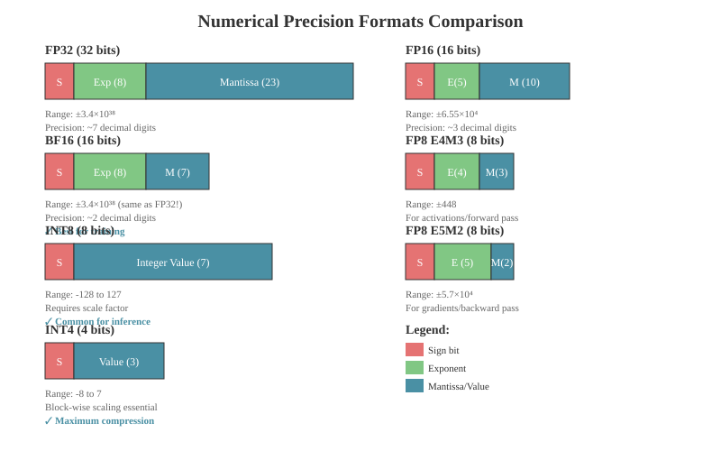
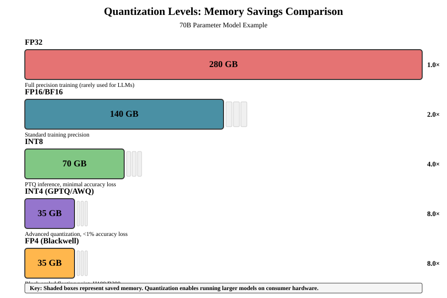
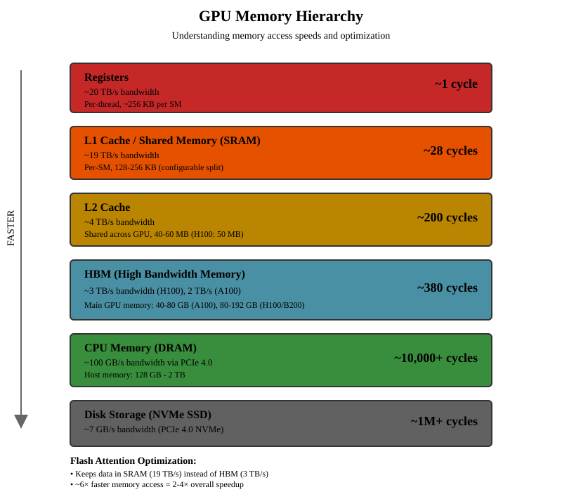

# Chapter 32: Hardware, Quantization, and Training Optimization

This chapter covers the practical aspects of training and deploying LLMs efficiently: hardware considerations, quantization techniques, optimizers, and learning rate schedules. Understanding these topics is essential for ML interviews, as they bridge the gap between theoretical architecture and real-world deployment.

## Table of Contents

1. [Hardware Overview](#hardware-overview)
   - [NVIDIA GPUs](#nvidia-gpus)
   - [Google TPUs](#google-tpus)
   - [Other Accelerators](#other-accelerators)
2. [Numerical Precision and Data Types](#numerical-precision-and-data-types)
3. [Quantization Techniques](#quantization-techniques)
   - [Post-Training Quantization (PTQ)](#post-training-quantization-ptq)
   - [Quantization-Aware Training (QAT)](#quantization-aware-training-qat)
   - [GPTQ](#gptq)
   - [AWQ](#awq)
   - [GGUF and CPU Inference](#gguf-and-cpu-inference)
4. [Mixed Precision Training](#mixed-precision-training)
   - [FP16/BF16 Training](#fp16bf16-training)
   - [FP8 Training](#fp8-training)
5. [Memory Optimization](#memory-optimization)
   - [Flash Attention](#flash-attention)
   - [Gradient Checkpointing](#gradient-checkpointing)
   - [KV Cache Optimization](#kv-cache-optimization)
   - [PagedAttention](#pagedattention)
6. [Inference Acceleration](#inference-acceleration)
   - [Speculative Decoding](#speculative-decoding)
   - [Continuous Batching](#continuous-batching)
7. [Distributed Training Strategies](#distributed-training-strategies)
   - [Data Parallelism](#data-parallelism)
   - [Model Parallelism](#model-parallelism)
   - [ZeRO Optimizer](#zero-optimizer)
   - [Fully Sharded Data Parallel (FSDP)](#fully-sharded-data-parallel-fsdp)
8. [Optimizers](#optimizers)
   - [AdamW](#adamw)
   - [Muon](#muon)
   - [Shampoo and SOAP](#shampoo-and-soap)
9. [Learning Rate Schedules](#learning-rate-schedules)
   - [Cosine Schedule](#cosine-schedule)
   - [Warmup-Stable-Decay (WSD)](#warmup-stable-decay-wsd)
10. [Putting It All Together](#putting-it-all-together)

---

## Hardware Overview

### NVIDIA GPUs

NVIDIA dominates the LLM training and inference landscape. Understanding GPU generations and their capabilities is crucial.

#### GPU Generations for LLMs

| Generation | Architecture | Key GPUs | FP16 TFLOPS | FP8 TFLOPS | Memory | Key Features |
|------------|-------------|----------|-------------|------------|--------|--------------|
| Ampere (2020) | GA100 | A100 | 312 | N/A | 40/80GB HBM2e | First Tensor Core for FP64 |
| Ada Lovelace (2022) | AD102 | RTX 4090, L40 | 165 (4090) | 330 | 24GB GDDR6X | FP8 Tensor Cores |
| Hopper (2022) | GH100 | H100, H200 | 990 | 1,979 | 80GB HBM3 | Transformer Engine, FP8 |
| Blackwell (2024) | GB100 | B100, B200 | 2,250 | 4,500 | 192GB HBM3e | FP4 Tensor Cores, 2nd gen TE |

#### Tensor Cores

Tensor Cores are specialized hardware units for matrix multiply-accumulate operations, essential for transformer training and inference.

**Problem and Motivation:**
Matrix multiplications dominate LLM computation (attention's QK^T, attention output, feed-forward layers). Standard CUDA cores process one multiply-add per cycle, which is inefficient for the massive matrix operations in transformers. For a 70B parameter model, billions of matrix operations occur per token.

**Theoretical Justification:**
Tensor Cores implement fused multiply-accumulate (FMA) operations on matrix tiles (e.g., 16×16 elements) in a single clock cycle. This provides:
- **10-20x throughput** compared to CUDA cores for matrix operations
- **Mixed precision computation**: FP16/BF16/FP8 input with FP32 accumulation prevents numerical errors
- **Memory bandwidth optimization**: Tiles fit in on-chip memory, reducing HBM access

**Relation to Alternatives:**
- CUDA cores: General purpose, flexible, but 10-20x slower for matrix ops
- TPU Matrix Units: Similar concept but systolic array architecture vs. NVIDIA's approach
- CPU SIMD: 4-8x parallelism vs. 256x for Tensor Cores

**Key Insights:**
1. Tensor Cores are automatically utilized when tensors are FP16/BF16/FP8 and dimensions are multiples of 8
2. The performance gain comes from processing entire matrix tiles atomically rather than element-wise
3. Mixed precision (FP16 compute, FP32 accumulate) maintains numerical stability while maximizing throughput

```python
# Tensor Core operations conceptually
# Standard matrix multiply: O(n³) individual operations
# Tensor Cores: Process 4x4 or larger matrix tiles in single operations

# Example: FP16 matrix multiply with FP32 accumulation
# D = A @ B + C where A, B are FP16, C, D are FP32

import torch

def tensor_core_matmul_simulation():
    """Simulate what Tensor Cores do (actual execution is in hardware)."""
    # Tensor Cores work on tiles (e.g., 16x16 for FP16)
    # They compute: D[16x16] = A[16x16] @ B[16x16] + C[16x16]

    # In PyTorch, you get Tensor Cores automatically with:
    # 1. Use FP16/BF16/FP8 tensors
    # 2. Matrix dimensions divisible by 8 (ideally 64 or 128)
    # 3. Tensors are contiguous

    a = torch.randn(1024, 1024, dtype=torch.float16, device='cuda')
    b = torch.randn(1024, 1024, dtype=torch.float16, device='cuda')

    # This will use Tensor Cores automatically
    c = torch.matmul(a, b)
    return c
```

#### NVIDIA Blackwell and FP4

Blackwell introduces FP4 (4-bit floating point) for inference, using a format called NVFP4:

```python
# NVFP4 Format (Blackwell-specific)
# - 4 bits per value (1 sign, 2 exponent, 1 mantissa)
# - Block-wise scaling: FP8 scale per 16 values
# - Tensor-level FP32 scale

# Memory savings:
# - ~3.5x reduction vs FP16
# - ~1.8x reduction vs FP8

# NVFP4 achieves <1% accuracy loss on most LLM benchmarks
# Some tasks (like AIME 2024) show FP4 outperforming FP8

# Blackwell FP4 performance:
# - B200: 20 PFLOPS FP4 (10 PFLOPS FP8)
# - DGX B200: 144 PFLOPS FP4 inference
# - 4x faster tokens/sec vs H100 on Llama 2 70B
```

**Key Papers:**
- [Introducing NVFP4 for Efficient and Accurate Low-Precision Inference](https://developer.nvidia.com/blog/introducing-nvfp4-for-efficient-and-accurate-low-precision-inference/)

### Google TPUs

TPUs (Tensor Processing Units) are Google's custom ASICs for ML workloads. Gemini models are trained entirely on TPUs.

#### TPU Generations

| Generation | Name | BF16 TFLOPS | HBM | Memory BW | Key Features |
|------------|------|-------------|-----|-----------|--------------|
| v5e (2023) | - | 197 | 16 GB | 819 GB/s | Inference-optimized |
| v5p (2023) | - | 459 | 95 GB | 2,765 GB/s | Training-focused |
| v6e (2024) | Trillium | 918 | 32 GB | 1,640 GB/s | 256×256 MXU, 4.7x v5e |
| v7 (2025) | Ironwood | ~2,300 | 192 GB | 7,400 GB/s | Native FP8, 2x efficiency |

#### TPU Architecture

```python
# TPU Matrix Multiply Unit (MXU) conceptual structure
# TPUs use a systolic array architecture

class TPUMXUConceptual:
    """
    Conceptual representation of TPU's Matrix Multiply Unit.

    TPU v5: 128×128 multiply-accumulators
    TPU v6 (Trillium): 256×256 multiply-accumulators

    The systolic array streams data through a 2D grid of processing
    elements, achieving very high utilization for matrix operations.
    """
    def __init__(self, size: int = 256):
        self.size = size  # 256 for Trillium

    def ops_per_cycle(self) -> int:
        """Number of multiply-accumulate ops per cycle."""
        return self.size * self.size * 2  # multiply + add

    def describe(self):
        """
        Key TPU characteristics:

        1. BF16 native: TPUs pioneered BF16 for deep learning
        2. Large on-chip memory: 16-32 MB SRAM per core
        3. Inter-chip interconnect (ICI): High-bandwidth mesh
        4. Deterministic execution: Easier debugging
        5. XLA compilation: Graph-level optimization
        """
        pass
```

#### TPU vs GPU Trade-offs

| Aspect | NVIDIA GPU | Google TPU |
|--------|-----------|------------|
| **Precision** | FP32, FP16, BF16, FP8, FP4 | BF16, FP8 (v7+), INT8 |
| **Memory** | HBM2e/HBM3/HBM3e | HBM2e/HBM3e |
| **Programming** | CUDA (mature ecosystem) | JAX/XLA (Google stack) |
| **Availability** | Broad cloud + on-prem | Google Cloud only |
| **Flexibility** | General-purpose | ML-optimized |
| **Sparsity** | Structured sparsity support | SparseCore (v6+) |

**Key Resources:**
- [TPU v6e Documentation](https://docs.cloud.google.com/tpu/docs/v6e)
- [Introducing Trillium](https://cloud.google.com/blog/products/compute/introducing-trillium-6th-gen-tpus)

### Other Accelerators

| Accelerator | Company | Notes |
|-------------|---------|-------|
| **Trainium/Inferentia** | AWS | Cost-effective for AWS workloads |
| **Gaudi** | Intel/Habana | Alternative to NVIDIA |
| **Groq LPU** | Groq | Ultra-low latency inference |
| **Cerebras WSE** | Cerebras | Wafer-scale chip, unique architecture |
| **Apple M-series** | Apple | Unified memory, efficient for local inference |

---

## Numerical Precision and Data Types

Understanding data types is fundamental to quantization and mixed-precision training.

### Common Data Types



```python
import torch
import struct

def analyze_data_types():
    """Compare different floating-point formats used in LLMs."""

    formats = {
        # Format: (sign_bits, exponent_bits, mantissa_bits, bias)
        'FP32': (1, 8, 23, 127),
        'FP16': (1, 5, 10, 15),
        'BF16': (1, 8, 7, 127),   # Same range as FP32, less precision
        'FP8_E4M3': (1, 4, 3, 7),  # Higher precision, smaller range
        'FP8_E5M2': (1, 5, 2, 15), # Larger range, lower precision
        'FP4': (1, 2, 1, 1),       # Blackwell NVFP4
    }

    print("Data Type Comparison:")
    print("-" * 70)
    for name, (s, e, m, bias) in formats.items():
        total_bits = s + e + m
        max_val = (2 - 2**(-m)) * 2**(2**e - 1 - bias)
        precision = 2**(-m)  # Relative precision
        print(f"{name:12} | {total_bits:2d} bits | "
              f"Max: {max_val:>12.2f} | Rel precision: {precision:.4f}")

# Output:
# FP32         | 32 bits | Max: 3.40e+38 | Rel precision: 0.0000
# FP16         | 16 bits | Max:    65504 | Rel precision: 0.0010
# BF16         | 16 bits | Max: 3.39e+38 | Rel precision: 0.0078
# FP8_E4M3     |  8 bits | Max:      448 | Rel precision: 0.1250
# FP8_E5M2     |  8 bits | Max:    57344 | Rel precision: 0.2500
# FP4          |  4 bits | Max:        6 | Rel precision: 0.5000
```

### Why BF16 Dominates Training

```python
def bf16_vs_fp16():
    """
    BF16 (Brain Float 16) advantages over FP16:

    1. Same dynamic range as FP32 (8 exponent bits)
       - No gradient underflow issues
       - No need for loss scaling in most cases

    2. Direct truncation from FP32
       - Just drop lower 16 bits of mantissa
       - Very fast conversion

    3. Hardware support
       - NVIDIA Ampere+, Google TPUs, Intel, AMD

    Disadvantage:
    - Lower precision (7 vs 10 mantissa bits)
    - Can affect tasks requiring high numerical precision
    """

    # FP32 to BF16 conversion is simple truncation
    fp32_val = torch.tensor([3.14159265], dtype=torch.float32)
    bf16_val = fp32_val.to(torch.bfloat16)
    fp16_val = fp32_val.to(torch.float16)

    print(f"FP32: {fp32_val.item():.10f}")
    print(f"BF16: {bf16_val.item():.10f}")  # Less precision
    print(f"FP16: {fp16_val.item():.10f}")  # More precision but limited range
```

---

## Quantization Techniques

Quantization reduces model size and speeds up inference by using lower-precision representations.



### Post-Training Quantization (PTQ)

PTQ quantizes a trained model without retraining. It's fast but may lose accuracy.

**Problem and Motivation:**
Modern LLMs require hundreds of gigabytes of memory (70B model = ~140GB in FP16). This makes deployment expensive and limits accessibility. Most weight values don't need full FP16 precision - quantization to INT8 or INT4 can reduce memory by 2-4x with minimal accuracy loss.

**Theoretical Justification:**
Neural network weights often follow a Gaussian-like distribution with most values near zero. Quantization maps continuous floating-point values to discrete integers:
$$q = \text{round}\left(\frac{x}{\text{scale}}\right), \quad \hat{x} = q \times \text{scale}$$

The quantization error $\epsilon = x - \hat{x}$ is bounded by $\pm \frac{\text{scale}}{2}$. With appropriate scale factors (per-tensor or per-channel), this error is negligible for inference.

**Relation to Alternatives:**
- **PTQ vs QAT**: PTQ is fast (no retraining) but less accurate; QAT requires full retraining but adapts weights to quantization
- **Symmetric vs Asymmetric**: Symmetric quantization (zero-point = 0) is faster; asymmetric handles biased distributions better
- **Per-tensor vs Per-channel**: Per-channel uses different scales for each output channel, reducing error at minimal cost

**Key Insights:**
1. **Block-wise quantization** (used by GPTQ, AWQ) captures local statistics better than global quantization
2. **Outlier handling** is critical - a few large values can dominate the scale factor
3. **Calibration data quality** matters more than quantity - representative samples suffice

```python
import torch
import torch.nn as nn

class SimpleQuantizer:
    """Basic symmetric quantization implementation."""

    @staticmethod
    def quantize_symmetric(
        tensor: torch.Tensor,
        bits: int = 8
    ) -> tuple[torch.Tensor, float]:
        """
        Symmetric quantization: maps [-max, max] to [-2^(n-1), 2^(n-1)-1]

        Args:
            tensor: Float tensor to quantize
            bits: Number of bits for quantized values

        Returns:
            Quantized tensor and scale factor
        """
        qmin = -(2 ** (bits - 1))
        qmax = 2 ** (bits - 1) - 1

        # Compute scale
        max_val = tensor.abs().max()
        scale = max_val / qmax

        # Quantize
        quantized = torch.clamp(
            torch.round(tensor / scale),
            qmin, qmax
        ).to(torch.int8 if bits == 8 else torch.int16)

        return quantized, scale.item()

    @staticmethod
    def dequantize(
        quantized: torch.Tensor,
        scale: float
    ) -> torch.Tensor:
        """Dequantize back to float."""
        return quantized.float() * scale


class BlockwiseQuantizer:
    """
    Block-wise quantization (used by GPTQ, AWQ, GGUF).

    Instead of one scale for the entire tensor, use one scale
    per block (e.g., 128 values). This captures local statistics
    better and reduces quantization error.
    """

    @staticmethod
    def quantize_blockwise(
        tensor: torch.Tensor,
        bits: int = 4,
        block_size: int = 128
    ) -> tuple[torch.Tensor, torch.Tensor]:
        """
        Quantize with per-block scales.

        Args:
            tensor: 2D weight matrix [out_features, in_features]
            bits: Bits per weight
            block_size: Number of weights per block

        Returns:
            Quantized weights and scales
        """
        original_shape = tensor.shape

        # Reshape to blocks
        # Flatten and pad if necessary
        flat = tensor.flatten()
        pad_size = (block_size - len(flat) % block_size) % block_size
        if pad_size > 0:
            flat = torch.cat([flat, torch.zeros(pad_size)])

        blocks = flat.view(-1, block_size)

        # Compute per-block scales
        qmax = 2 ** (bits - 1) - 1
        scales = blocks.abs().max(dim=1, keepdim=True).values / qmax
        scales = scales.clamp(min=1e-10)  # Avoid division by zero

        # Quantize each block
        quantized = torch.clamp(
            torch.round(blocks / scales),
            -qmax - 1, qmax
        ).to(torch.int8)

        return quantized, scales.squeeze()
```

### Quantization-Aware Training (QAT)

QAT simulates quantization during training, allowing the model to adapt to lower precision.

**Problem and Motivation:**
Post-training quantization can suffer significant accuracy degradation, especially at aggressive quantization levels (INT4 or below). The model was optimized for full precision and may rely on precision that quantization eliminates.

**Theoretical Justification:**
QAT uses "fake quantization" - applying quantization in forward pass but using straight-through estimators (STE) in backward pass. This allows gradients to flow despite non-differentiable rounding:

$$\text{Forward: } \tilde{x} = \text{dequant}(\text{quant}(x)) \quad \text{Backward: } \frac{\partial L}{\partial x} \approx \frac{\partial L}{\partial \tilde{x}}$$

The model learns to represent information within quantization constraints. Weights shift to values that minimize quantization error, and the model becomes robust to precision loss.

**Relation to Alternatives:**
- **QAT vs PTQ**: QAT achieves better accuracy (especially <8-bit) but requires full training cycle
- **Full QAT vs Partial QAT**: Full QAT quantizes all layers; partial quantizes only weights (activations stay FP16)
- **Static vs Dynamic**: Static uses fixed scales; dynamic computes scales at runtime (more accurate, slower)

**Key Insights:**
1. **Straight-through estimator** is crucial - gradients "pass through" the non-differentiable quantization
2. **Learned scales** (vs. fixed) allow the model to optimize quantization ranges
3. **Batch normalization** helps by normalizing activations to quantization-friendly ranges

```python
class FakeQuantize(torch.autograd.Function):
    """
    Fake quantization for QAT.

    Forward: Quantize then immediately dequantize (simulates quantization error)
    Backward: Straight-through estimator (gradient passes through unchanged)
    """

    @staticmethod
    def forward(ctx, x: torch.Tensor, scale: float, bits: int = 8):
        qmax = 2 ** (bits - 1) - 1
        qmin = -qmax - 1

        # Quantize
        x_q = torch.clamp(torch.round(x / scale), qmin, qmax)

        # Dequantize (fake quantize)
        x_dq = x_q * scale

        # Save for backward
        ctx.save_for_backward(x, torch.tensor([qmin, qmax, scale]))

        return x_dq

    @staticmethod
    def backward(ctx, grad_output):
        x, params = ctx.saved_tensors
        qmin, qmax, scale = params[0], params[1], params[2]

        # Straight-through estimator with clipping
        # Gradient is zero outside quantization range
        x_q = x / scale
        mask = (x_q >= qmin) & (x_q <= qmax)

        return grad_output * mask.float(), None, None


class QATLinear(nn.Module):
    """Linear layer with quantization-aware training."""

    def __init__(self, in_features: int, out_features: int, bits: int = 8):
        super().__init__()
        self.linear = nn.Linear(in_features, out_features)
        self.bits = bits
        self.weight_scale = nn.Parameter(torch.tensor(1.0))
        self.activation_scale = nn.Parameter(torch.tensor(1.0))

    def forward(self, x: torch.Tensor) -> torch.Tensor:
        # Fake quantize weights
        w_q = FakeQuantize.apply(self.linear.weight, self.weight_scale, self.bits)

        # Fake quantize activations
        x_q = FakeQuantize.apply(x, self.activation_scale, self.bits)

        return nn.functional.linear(x_q, w_q, self.linear.bias)
```

### GPTQ

GPTQ (GPT Quantization) uses layer-wise quantization with inverse Hessian information to minimize output error.

```python
class GPTQQuantizer:
    """
    Simplified GPTQ implementation.

    GPTQ key insights:
    1. Quantize weights layer by layer
    2. Use calibration data to compute Hessian (H = X^T X)
    3. Inverse Hessian tells us which weights are "safe" to quantize
    4. Update remaining weights to compensate for quantization error

    Reference: Frantar et al., "GPTQ: Accurate Post-Training Quantization
    for Generative Pre-trained Transformers" (2022)
    https://arxiv.org/abs/2210.17323
    """

    def __init__(self, bits: int = 4, block_size: int = 128):
        self.bits = bits
        self.block_size = block_size

    def quantize_layer(
        self,
        weight: torch.Tensor,       # [out_features, in_features]
        hessian: torch.Tensor       # [in_features, in_features]
    ) -> tuple[torch.Tensor, torch.Tensor]:
        """
        Quantize a single linear layer using GPTQ algorithm.

        The algorithm processes columns in order of Hessian diagonal
        (inverse of "importance"). For each column:
        1. Quantize the weight
        2. Compute quantization error
        3. Update remaining columns to compensate
        """
        out_features, in_features = weight.shape
        W = weight.clone()

        # Compute inverse Hessian diagonal
        H_diag = torch.diag(hessian)
        H_inv_diag = 1.0 / (H_diag + 1e-6)  # Add damping

        # Order columns by inverse Hessian (least important first)
        order = torch.argsort(H_inv_diag, descending=True)

        scales = []
        quantized = torch.zeros_like(W, dtype=torch.int8)

        # Process in blocks
        for block_start in range(0, in_features, self.block_size):
            block_end = min(block_start + self.block_size, in_features)
            block_cols = order[block_start:block_end]

            # Quantize this block
            block_weights = W[:, block_cols]

            qmax = 2 ** (self.bits - 1) - 1
            scale = block_weights.abs().max() / qmax
            scales.append(scale)

            block_q = torch.clamp(
                torch.round(block_weights / scale),
                -qmax - 1, qmax
            )
            quantized[:, block_cols] = block_q.to(torch.int8)

            # Compute error and update remaining weights
            block_dq = block_q * scale
            error = block_weights - block_dq

            # Update unprocessed columns (simplified)
            remaining_cols = order[block_end:]
            if len(remaining_cols) > 0:
                # W[:, remaining] -= error @ H[block, remaining] / H[block, block]
                # Simplified: just propagate error directly
                pass

        return quantized, torch.tensor(scales)
```

**Key Paper:**
- [GPTQ: Accurate Post-Training Quantization for Generative Pre-trained Transformers](https://arxiv.org/abs/2210.17323) (Frantar et al., 2022)

### AWQ

AWQ (Activation-Aware Weight Quantization) identifies important weights based on activation patterns and protects them.

```python
class AWQQuantizer:
    """
    Simplified AWQ implementation.

    AWQ key insights:
    1. Not all weights are equally important
    2. ~1% of weights have disproportionate impact on output
    3. Identify these by looking at activation magnitudes
    4. Protect salient weights with higher precision or scaling

    AWQ advantages over GPTQ:
    - Less calibration data needed (10x less)
    - Better generalization (less overfitting to calibration)
    - Slightly better accuracy on average

    Reference: Lin et al., "AWQ: Activation-aware Weight Quantization for
    LLM Compression and Acceleration" (2023)
    https://arxiv.org/abs/2306.00978
    """

    def __init__(self, bits: int = 4, group_size: int = 128):
        self.bits = bits
        self.group_size = group_size

    def compute_activation_scales(
        self,
        activations: torch.Tensor  # [n_samples, seq_len, hidden]
    ) -> torch.Tensor:
        """
        Compute per-channel activation importance.

        Channels with larger activation magnitudes are more important
        because they have larger impact on output.
        """
        # Average activation magnitude per channel
        return activations.abs().mean(dim=(0, 1))

    def find_salient_weights(
        self,
        weight: torch.Tensor,
        activation_scales: torch.Tensor,
        threshold_percentile: float = 99
    ) -> torch.Tensor:
        """
        Find salient (important) weight columns.

        Importance = weight_magnitude * activation_magnitude
        """
        # Per-column importance
        weight_importance = weight.abs().mean(dim=0)
        combined_importance = weight_importance * activation_scales

        threshold = torch.quantile(combined_importance, threshold_percentile / 100)
        salient_mask = combined_importance > threshold

        return salient_mask

    def quantize_layer(
        self,
        weight: torch.Tensor,
        activation_scales: torch.Tensor
    ) -> tuple[torch.Tensor, torch.Tensor, torch.Tensor]:
        """
        Quantize with activation-aware scaling.

        For salient channels, apply additional scaling before quantization
        to preserve their precision.
        """
        salient_mask = self.find_salient_weights(weight, activation_scales)

        # Apply protective scaling to salient channels
        # This effectively gives them higher precision after quantization
        scale_factors = torch.ones(weight.shape[1])
        scale_factors[salient_mask] = activation_scales[salient_mask]

        # Scale weights
        scaled_weight = weight * scale_factors.unsqueeze(0)

        # Quantize (group-wise)
        quantized, quant_scales = self._group_quantize(scaled_weight)

        return quantized, quant_scales, scale_factors

    def _group_quantize(
        self,
        weight: torch.Tensor
    ) -> tuple[torch.Tensor, torch.Tensor]:
        """Group-wise quantization."""
        out_features, in_features = weight.shape
        n_groups = in_features // self.group_size

        weight_grouped = weight.view(out_features, n_groups, self.group_size)

        qmax = 2 ** (self.bits - 1) - 1
        scales = weight_grouped.abs().amax(dim=2) / qmax

        quantized = torch.clamp(
            torch.round(weight_grouped / scales.unsqueeze(-1)),
            -qmax - 1, qmax
        ).to(torch.int8)

        return quantized.view(out_features, in_features), scales
```

**Key Paper:**
- [AWQ: Activation-aware Weight Quantization for LLM Compression and Acceleration](https://arxiv.org/abs/2306.00978) (Lin et al., 2023)

### GGUF and CPU Inference

GGUF is the file format used by llama.cpp for efficient CPU inference.

```python
class GGUFQuantizationTypes:
    """
    GGUF quantization types available in llama.cpp.

    Naming convention: Q{bits}_{type}_{size}
    - bits: number of bits (2-8)
    - type: 0 (simple), 1 (with min), K (k-quant)
    - size: S (small), M (medium), L (large)

    K-quants use different bit widths for different parts of the tensor.
    """

    TYPES = {
        # Type-0: w = d * q (scale only)
        'Q4_0': {'bits': 4, 'block_size': 32, 'bytes_per_block': 18},
        'Q8_0': {'bits': 8, 'block_size': 32, 'bytes_per_block': 34},

        # Type-1: w = d * q + m (scale and minimum)
        'Q4_1': {'bits': 4, 'block_size': 32, 'bytes_per_block': 20},

        # K-quants: Mixed precision within blocks
        'Q2_K': {'bits': 2.5, 'desc': '2-bit with some 4-bit'},
        'Q3_K_S': {'bits': 3.4, 'desc': 'Smallest Q3_K'},
        'Q3_K_M': {'bits': 3.9, 'desc': 'Medium Q3_K'},
        'Q3_K_L': {'bits': 4.3, 'desc': 'Largest Q3_K'},
        'Q4_K_S': {'bits': 4.5, 'desc': 'Smallest Q4_K'},
        'Q4_K_M': {'bits': 4.8, 'desc': 'Medium Q4_K, recommended'},
        'Q5_K_S': {'bits': 5.5, 'desc': 'Smallest Q5_K'},
        'Q5_K_M': {'bits': 5.8, 'desc': 'Medium Q5_K'},
        'Q6_K': {'bits': 6.6, 'desc': 'High quality'},
    }

    @staticmethod
    def estimate_size(model_params_billions: float, quant_type: str) -> float:
        """Estimate model size in GB for given quantization."""
        bits = GGUFQuantizationTypes.TYPES.get(quant_type, {}).get('bits', 4)
        # Size ≈ params * bits / 8 + overhead
        base_size = model_params_billions * 1e9 * bits / 8 / 1e9
        overhead = 0.1  # ~10% for metadata, scales, etc.
        return base_size * (1 + overhead)


def gguf_k_quant_explained():
    """
    K-quant explanation (used in Q4_K_M, etc.)

    K-quants use "super-blocks" containing multiple sub-blocks.
    Different parts of the tensor get different bit widths:

    Super-block (256 values):
    - 16 sub-blocks of 16 values each
    - Each sub-block has its own 6-bit scale
    - Super-block has one FP16 scale and min

    This adaptive approach captures outliers better than
    uniform quantization while maintaining efficiency.
    """
    pass


# Usage example with llama.cpp
def quantize_model_gguf():
    """
    Command-line quantization with llama.cpp:

    # Convert HuggingFace model to GGUF
    python convert_hf_to_gguf.py ./my_model --outtype f16

    # Quantize to Q4_K_M
    ./llama-quantize ./my_model/model-f16.gguf ./my_model/model-Q4_K_M.gguf Q4_K_M

    # Run inference
    ./llama-cli -m ./my_model/model-Q4_K_M.gguf -p "Hello, world!"
    """
    pass
```

**Importance Matrix (imatrix):**

```python
def importance_matrix_quantization():
    """
    Using importance matrix for better quantization.

    The importance matrix measures how sensitive each weight is
    to quantization error. Weights with high importance get
    more bits or better treatment.

    1. Run model on calibration data
    2. Record activation patterns
    3. Compute importance scores
    4. Use during quantization

    Command:
    ./llama-imatrix -m model-f16.gguf -f calibration.txt -o imatrix.dat
    ./llama-quantize --imatrix imatrix.dat model-f16.gguf model-Q4_K_M.gguf Q4_K_M
    """
    pass
```

**Key Resources:**
- [llama.cpp GitHub](https://github.com/ggml-org/llama.cpp)
- [GGUF Quantization Guide](https://github.com/ggml-org/llama.cpp/blob/master/tools/quantize/README.md)

---

## Mixed Precision Training

### FP16/BF16 Training

Mixed precision training uses lower precision for most operations while maintaining FP32 for critical computations.

```python
import torch
from torch.cuda.amp import autocast, GradScaler

class MixedPrecisionTrainer:
    """
    Mixed precision training with automatic loss scaling.

    Key components:
    1. autocast: Automatically use FP16/BF16 for eligible ops
    2. GradScaler: Scale loss to prevent gradient underflow (FP16 only)
    """

    def __init__(self, model, optimizer, use_bf16: bool = True):
        self.model = model
        self.optimizer = optimizer
        self.use_bf16 = use_bf16

        # GradScaler only needed for FP16, not BF16
        self.scaler = GradScaler() if not use_bf16 else None
        self.dtype = torch.bfloat16 if use_bf16 else torch.float16

    def training_step(self, batch):
        """Single training step with mixed precision."""
        self.optimizer.zero_grad()

        # Forward pass in lower precision
        with autocast(dtype=self.dtype):
            loss = self.model(batch)

        if self.use_bf16:
            # BF16: Direct backward, no scaling needed
            loss.backward()
            self.optimizer.step()
        else:
            # FP16: Use gradient scaling
            self.scaler.scale(loss).backward()
            self.scaler.step(self.optimizer)
            self.scaler.update()

        return loss.item()


def why_bf16_no_scaling():
    """
    Why BF16 doesn't need loss scaling but FP16 does:

    FP16 range: ~6×10^-5 to 65504
    BF16 range: ~1×10^-38 to 3.4×10^38 (same as FP32!)

    Gradients often have very small values (10^-6 or smaller).
    - FP16: Underflows to zero -> training fails
    - BF16: Keeps small values -> training works

    Loss scaling for FP16:
    1. Multiply loss by large scale (e.g., 1024)
    2. Backward pass computes scaled gradients
    3. Divide gradients by scale before optimizer step
    4. If overflow detected, skip update and reduce scale
    """
    pass
```

### FP8 Training

FP8 training is now viable for large models, pioneered by DeepSeek V3.

```python
class FP8TrainingConfig:
    """
    FP8 training configuration and considerations.

    FP8 formats:
    - E4M3: 4 exponent, 3 mantissa (range ±448, precision 1/8)
    - E5M2: 5 exponent, 2 mantissa (range ±57344, precision 1/4)

    Typical usage:
    - Forward: E4M3 (more precision for activations)
    - Backward: E5M2 (more range for gradients)

    DeepSeek V3 approach:
    - Store weights in FP8
    - All matrix multiplies in FP8
    - Accumulate in FP32
    - Block-wise scaling (128×128 for weights, 1×128 for activations)
    """

    def __init__(self):
        self.forward_dtype = 'e4m3'
        self.backward_dtype = 'e5m2'
        self.accumulation_dtype = torch.float32
        self.weight_block_size = (128, 128)
        self.activation_block_size = (1, 128)


class DeepSeekFP8Strategy:
    """
    DeepSeek's FP8 training innovations.

    Key discoveries:
    1. Tensor Core accumulation issue:
       - H100 FP8 Tensor Cores use ~14-bit fixed-point accumulation
       - Causes accuracy loss for large models

    2. Solution: Manual accumulation
       - Run 4 consecutive WGMMA ops in Tensor Core
       - Accumulate results in separate FP32 register
       - Reduces throughput slightly but maintains accuracy

    3. Block-wise scaling:
       - Each 128×128 weight block has its own scale
       - Each 1×128 activation vector has its own scale
       - Handles outliers much better than per-tensor scaling
    """

    @staticmethod
    def quantize_weights_fp8(
        weight: torch.Tensor,
        block_size: tuple = (128, 128)
    ) -> tuple[torch.Tensor, torch.Tensor]:
        """
        Quantize weights to FP8 with block-wise scaling.

        Args:
            weight: FP32/BF16 weight tensor [out, in]
            block_size: Size of quantization blocks

        Returns:
            FP8 weights and per-block scales
        """
        out_features, in_features = weight.shape
        block_h, block_w = block_size

        # Reshape into blocks
        weight_blocks = weight.view(
            out_features // block_h, block_h,
            in_features // block_w, block_w
        )

        # Compute per-block scales
        block_max = weight_blocks.abs().amax(dim=(1, 3), keepdim=True)
        e4m3_max = 448.0
        scales = block_max / e4m3_max

        # Quantize (simulated - actual FP8 requires hardware support)
        scaled_weights = weight_blocks / scales.clamp(min=1e-12)
        # In practice: convert to torch.float8_e4m3fn

        return scaled_weights, scales.squeeze()
```

**NVIDIA Transformer Engine:**

```python
def transformer_engine_usage():
    """
    NVIDIA Transformer Engine for FP8 training.

    Transformer Engine provides:
    1. Drop-in replacements for linear layers
    2. Automatic scale management
    3. FP8 recipe configuration

    Installation:
    pip install transformer-engine[pytorch]

    Usage:
    import transformer_engine.pytorch as te

    # Replace nn.Linear with TE Linear
    layer = te.Linear(hidden_size, ffn_size)

    # Wrap forward pass
    with te.fp8_autocast(enabled=True):
        output = model(input)

    # DeepSeek-style block scaling (v2.0+)
    recipe = te.recipe.Float8BlockScaling()
    with te.fp8_autocast(enabled=True, fp8_recipe=recipe):
        output = model(input)
    """
    pass
```

**Key Resources:**
- [NVIDIA Transformer Engine](https://github.com/NVIDIA/TransformerEngine)
- [DeepSeek V3 Technical Report](https://arxiv.org/abs/2412.19437)
- [DeepSeek FP8 Training Analysis](https://research.colfax-intl.com/deepseek-r1-and-fp8-mixed-precision-training/)

---

## Memory Optimization

### Flash Attention

Flash Attention is an IO-aware attention algorithm that reduces memory usage from O(N²) to O(N) and speeds up computation by 2-4x.



```python
class FlashAttentionConcept:
    """
    Flash Attention conceptual implementation.

    Key insight: Standard attention is memory-bound, not compute-bound.
    The N×N attention matrix must be:
    1. Written to HBM (slow)
    2. Read back for softmax (slow)
    3. Written again after softmax (slow)
    4. Read for matmul with V (slow)

    Flash Attention solution: Never materialize the full N×N matrix.
    Instead, compute attention in blocks using online softmax.

    See [Flash Attention](12-flash-attention.md) for detailed explanation.
    """

    @staticmethod
    def standard_attention(Q, K, V):
        """
        Standard attention: O(N²) memory.

        Memory accesses:
        1. Load Q, K -> Compute QK^T -> Store N×N matrix to HBM
        2. Load N×N matrix -> Softmax -> Store back
        3. Load attention weights, V -> Compute output

        Total HBM access: O(N² + Nd) reads/writes
        """
        d = Q.shape[-1]
        scores = torch.matmul(Q, K.transpose(-2, -1)) / (d ** 0.5)
        attention = torch.softmax(scores, dim=-1)
        return torch.matmul(attention, V)

    @staticmethod
    def flash_attention_tiled(Q, K, V, block_size=64):
        """
        Flash Attention (simplified tiled version).

        Key techniques:
        1. Tiling: Process Q, K, V in blocks that fit in SRAM
        2. Online softmax: Compute softmax incrementally
        3. Recomputation: Recompute in backward instead of storing

        Memory: O(N) - only store final output
        """
        batch, n_heads, seq_len, head_dim = Q.shape

        # Initialize output and softmax statistics
        O = torch.zeros_like(Q)
        L = torch.zeros(batch, n_heads, seq_len, 1, device=Q.device)  # log-sum-exp

        # Process K, V in blocks
        for j in range(0, seq_len, block_size):
            K_block = K[:, :, j:j+block_size]
            V_block = V[:, :, j:j+block_size]

            # Compute attention scores for this K block
            scores = torch.matmul(Q, K_block.transpose(-2, -1)) / (head_dim ** 0.5)

            # Online softmax update
            # This is the key: we can update running softmax incrementally
            block_max = scores.max(dim=-1, keepdim=True).values
            exp_scores = torch.exp(scores - block_max)
            block_sum = exp_scores.sum(dim=-1, keepdim=True)

            # Update output using online softmax formula
            # (Details omitted - see paper for exact formulation)
            O = O + torch.matmul(exp_scores, V_block)
            L = L + block_sum

        # Normalize
        O = O / L
        return O


def flash_attention_versions():
    """
    Flash Attention version comparison.

    Flash Attention 1 (2022):
    - Original algorithm
    - 2-4x speedup over PyTorch
    - O(N) memory

    Flash Attention 2 (2023):
    - Better parallelism (across sequence length)
    - Non-matmul FLOPs reduction
    - ~2x faster than FA1
    - Support for head dim up to 256

    Flash Attention 3 (2024):
    - Optimized for Hopper (H100)
    - Uses asynchronous operations (warp specialization)
    - FP8 support
    - ~75% Tensor Core utilization (vs 35% for FA2 on H100)

    Hardware requirements:
    - FA2: Ampere+ (A100, RTX 3090, RTX 4090, H100)
    - FA3: Hopper (H100, H200)
    """
    pass
```

**Using Flash Attention in PyTorch:**

```python
import torch
import torch.nn.functional as F

def use_flash_attention():
    """
    Flash Attention in PyTorch (2.0+).

    PyTorch 2.0+ includes scaled_dot_product_attention which
    automatically uses Flash Attention when available.
    """
    Q = torch.randn(2, 8, 1024, 64, device='cuda', dtype=torch.float16)
    K = torch.randn(2, 8, 1024, 64, device='cuda', dtype=torch.float16)
    V = torch.randn(2, 8, 1024, 64, device='cuda', dtype=torch.float16)

    # This automatically uses Flash Attention on compatible hardware
    output = F.scaled_dot_product_attention(
        Q, K, V,
        attn_mask=None,
        dropout_p=0.0,
        is_causal=True  # For autoregressive models
    )

    # To force a specific backend:
    with torch.backends.cuda.sdp_kernel(
        enable_flash=True,
        enable_math=False,
        enable_mem_efficient=False
    ):
        output = F.scaled_dot_product_attention(Q, K, V, is_causal=True)

    return output
```

**Key Papers:**
- [FlashAttention: Fast and Memory-Efficient Exact Attention with IO-Awareness](https://arxiv.org/abs/2205.14135) (Dao et al., 2022)
- [FlashAttention-2: Faster Attention with Better Parallelism and Work Partitioning](https://arxiv.org/abs/2307.08691) (Dao, 2023)
- [FlashAttention-3: Fast and Accurate Attention with Asynchrony and Low-precision](https://arxiv.org/abs/2407.08608) (Shah et al., 2024)

### Gradient Checkpointing

Gradient checkpointing (also called activation checkpointing) is a fundamental memory optimization technique that trades computation for memory during training.

```python
import torch
import torch.nn as nn
from torch.utils.checkpoint import checkpoint

class GradientCheckpointingAnalysis:
    """
    Gradient checkpointing memory analysis.

    Problem: During training, we must store all intermediate activations
    for the backward pass. For a transformer with N layers:
    - Memory for activations: O(N) per layer = O(N²) total
    - For 70B models, activations can exceed 100 GB

    Solution: Don't store all activations. Instead:
    - Store activations only at checkpoints (e.g., every k layers)
    - During backward, recompute missing activations from checkpoints

    Memory-Compute Trade-off:
    - Memory: O(N) → O(√N) with optimal checkpointing
    - Compute: 1 forward pass → ~1.3-1.5 forward passes (30-50% overhead)

    Key insight: Recomputation is fast (compute-bound) while storing
    activations is slow (memory-bound). This trade-off is favorable.
    """

    @staticmethod
    def memory_analysis(
        n_layers: int,
        batch_size: int,
        seq_len: int,
        hidden_size: int,
        n_checkpoints: int = None
    ) -> dict:
        """
        Analyze memory usage with and without gradient checkpointing.

        Args:
            n_layers: Number of transformer layers
            batch_size: Batch size
            seq_len: Sequence length
            hidden_size: Hidden dimension
            n_checkpoints: Number of checkpoint segments (default: √n_layers)

        Returns:
            Memory statistics in GB
        """
        # Bytes per activation tensor (assuming FP16)
        bytes_per_activation = batch_size * seq_len * hidden_size * 2

        # Without checkpointing: store all layer activations
        memory_no_checkpoint = n_layers * bytes_per_activation / 1e9

        # With checkpointing: store only checkpoint boundaries
        if n_checkpoints is None:
            n_checkpoints = int(n_layers ** 0.5)  # Optimal: √N

        memory_with_checkpoint = n_checkpoints * bytes_per_activation / 1e9

        return {
            'no_checkpoint_gb': memory_no_checkpoint,
            'with_checkpoint_gb': memory_with_checkpoint,
            'memory_reduction': memory_no_checkpoint / memory_with_checkpoint,
            'n_checkpoints': n_checkpoints,
            'recompute_overhead': n_layers / n_checkpoints - 1
        }


class CheckpointedTransformerBlock(nn.Module):
    """
    Transformer block with gradient checkpointing.

    PyTorch provides torch.utils.checkpoint.checkpoint which wraps
    a function to enable gradient checkpointing automatically.
    """

    def __init__(self, hidden_size: int, n_heads: int):
        super().__init__()
        self.attention = nn.MultiheadAttention(hidden_size, n_heads)
        self.norm1 = nn.LayerNorm(hidden_size)
        self.mlp = nn.Sequential(
            nn.Linear(hidden_size, 4 * hidden_size),
            nn.GELU(),
            nn.Linear(4 * hidden_size, hidden_size)
        )
        self.norm2 = nn.LayerNorm(hidden_size)

    def forward_impl(self, x: torch.Tensor) -> torch.Tensor:
        """Actual forward computation (will be checkpointed)."""
        # Self-attention with residual
        attn_out, _ = self.attention(x, x, x)
        x = self.norm1(x + attn_out)

        # MLP with residual
        mlp_out = self.mlp(x)
        x = self.norm2(x + mlp_out)

        return x

    def forward(self, x: torch.Tensor, use_checkpoint: bool = True) -> torch.Tensor:
        """
        Forward pass with optional gradient checkpointing.

        When use_checkpoint=True, PyTorch will:
        1. Run forward normally
        2. NOT store intermediate activations
        3. During backward, recompute forward to get activations
        """
        if use_checkpoint and self.training:
            # Use gradient checkpointing
            # Note: checkpoint requires tensors as input, not modules
            return checkpoint(self.forward_impl, x, use_reentrant=False)
        else:
            return self.forward_impl(x)


class SelectiveCheckpointing:
    """
    Advanced: Selective gradient checkpointing strategies.

    Different layers have different memory/compute trade-offs:
    - Attention: High memory, moderate compute → checkpoint
    - MLP: Moderate memory, high compute → maybe skip
    - Small layers (norm, residual): Low memory → skip

    Strategy 1: Checkpoint every k layers
    - Simple, predictable overhead
    - k = √N for optimal memory reduction

    Strategy 2: Checkpoint only attention
    - Attention often dominates memory
    - Lower recomputation overhead

    Strategy 3: Adaptive checkpointing
    - Profile memory usage per layer
    - Checkpoint high-memory layers
    """

    @staticmethod
    def checkpoint_every_k_layers(
        layers: nn.ModuleList,
        x: torch.Tensor,
        k: int = 4
    ) -> torch.Tensor:
        """
        Run through layers, checkpointing every k layers.

        Example: 32 layers, k=4 → 8 checkpoints
        Memory: O(32) → O(8)
        """
        for i, layer in enumerate(layers):
            if i % k == 0:
                # Checkpoint this segment
                x = checkpoint(layer, x, use_reentrant=False)
            else:
                x = layer(x)
        return x

    @staticmethod
    def checkpoint_attention_only(block: nn.Module, x: torch.Tensor) -> torch.Tensor:
        """
        Checkpoint only the attention computation.

        Attention has O(N²) memory for the attention matrix.
        MLP has O(N) memory for activations.
        """
        # Checkpoint attention (high memory)
        def attention_fn(x):
            attn_out, _ = block.attention(x, x, x)
            return block.norm1(x + attn_out)

        x = checkpoint(attention_fn, x, use_reentrant=False)

        # No checkpoint for MLP (lower memory, higher compute)
        x = block.norm2(x + block.mlp(x))

        return x


def gradient_checkpointing_example():
    """
    Complete example: Training with gradient checkpointing.

    Practical guidelines:
    1. Enable for large models where memory is constrained
    2. Checkpoint every √N layers for optimal memory/compute trade-off
    3. Consider checkpointing only attention for lower overhead
    4. Disable during inference (no backward pass needed)
    5. Use use_reentrant=False for better compatibility with autograd
    """
    import torch
    import torch.nn as nn
    from torch.utils.checkpoint import checkpoint_sequential

    # Build model
    n_layers = 32
    hidden_size = 4096

    layers = nn.ModuleList([
        CheckpointedTransformerBlock(hidden_size, n_heads=32)
        for _ in range(n_layers)
    ])

    # Dummy input
    x = torch.randn(8, 2048, hidden_size, device='cuda', requires_grad=True)

    # Method 1: Manual checkpointing per layer
    for layer in layers:
        x = layer(x, use_checkpoint=True)

    # Method 2: checkpoint_sequential (checkpoints segments)
    # Divides layers into segments and checkpoints each
    n_segments = 8  # √32 ≈ 5.6, round up to 8
    x = checkpoint_sequential(layers, n_segments, x, use_reentrant=False)

    # Memory saved: ~4x reduction (32 layers → 8 checkpoints)
    # Compute overhead: ~30% more time

    return x


class MemoryProfiler:
    """
    Profile memory usage with and without checkpointing.

    Example usage:
    >>> profiler = MemoryProfiler()
    >>> profiler.compare_checkpointing(model, input_data)
    """

    @staticmethod
    def get_memory_usage() -> float:
        """Get current GPU memory usage in GB."""
        return torch.cuda.memory_allocated() / 1e9

    @staticmethod
    def compare_checkpointing(
        model: nn.Module,
        input_data: torch.Tensor,
        n_steps: int = 10
    ) -> dict:
        """
        Compare memory usage with and without checkpointing.

        Returns:
            Dictionary with memory stats and timing
        """
        import time

        results = {}

        # Test 1: Without checkpointing
        torch.cuda.reset_peak_memory_stats()
        start = time.time()

        for _ in range(n_steps):
            output = model(input_data, use_checkpoint=False)
            loss = output.sum()
            loss.backward()
            model.zero_grad()

        results['no_checkpoint'] = {
            'time': time.time() - start,
            'peak_memory_gb': torch.cuda.max_memory_allocated() / 1e9
        }

        # Test 2: With checkpointing
        torch.cuda.reset_peak_memory_stats()
        start = time.time()

        for _ in range(n_steps):
            output = model(input_data, use_checkpoint=True)
            loss = output.sum()
            loss.backward()
            model.zero_grad()

        results['with_checkpoint'] = {
            'time': time.time() - start,
            'peak_memory_gb': torch.cuda.max_memory_allocated() / 1e9
        }

        # Compute ratios
        results['memory_reduction'] = (
            results['no_checkpoint']['peak_memory_gb'] /
            results['with_checkpoint']['peak_memory_gb']
        )
        results['time_overhead'] = (
            results['with_checkpoint']['time'] /
            results['no_checkpoint']['time'] - 1
        ) * 100

        return results
```

**When to Use Gradient Checkpointing:**

| Scenario | Recommendation |
|----------|----------------|
| **Large models (>13B)** | Always use (memory-bound) |
| **Long sequences (>4K)** | Strongly recommended |
| **Small batch size** | Less beneficial (already memory-efficient) |
| **Inference only** | Never (no backward pass) |
| **Limited GPU memory** | Essential for fitting model |
| **Abundant memory** | Optional (trades speed for memory) |

**Optimal Checkpointing Strategy:**

For a model with $N$ layers and $M$ memory units:

$$
\text{Optimal checkpoints} = \sqrt{N}
$$

$$
\text{Memory savings} = \frac{N}{\sqrt{N}} = \sqrt{N}
$$

$$
\text{Recomputation overhead} \approx \sqrt{N} - 1 \text{ forward passes}
$$

**Key Papers:**
- [Training Deep Nets with Sublinear Memory Cost](https://arxiv.org/abs/1604.06174) (Chen et al., 2016)
- [Gradient Checkpointing for Transformers](https://github.com/cybertronai/gradient-checkpointing) (Implementation guide)

### KV Cache Optimization

The KV cache stores key and value tensors from previous tokens during autoregressive generation.

**Problem and Motivation:**
During autoregressive generation, each new token attends to all previous tokens. Without caching, we'd recompute K and V projections for all previous tokens at each step - O(N²) memory and compute. For a 70B model with 100K context, KV cache can exceed 260GB, often dominating memory usage over model weights.

**Theoretical Justification:**
The key observation is that K and V projections are deterministic given the input tokens:
$$K_i = W_K x_i, \quad V_i = W_V x_i$$

Once computed, they never change. We cache them and only compute K,V for the new token:
$$\text{Attention}(Q_{\text{new}}, [K_1, \ldots, K_n, K_{\text{new}}], [V_1, \ldots, V_n, V_{\text{new}}])$$

This reduces computation from O(N²) to O(N) per token, but requires storing all historical K,V.

**Relation to Alternatives:**
- **No cache**: O(N²) time, O(1) memory - impractical for long contexts
- **Full cache**: O(N) time, O(N) memory - standard approach
- **Quantized cache**: O(N) time, O(N/2 to N/4) memory - FP8/INT8 quantization
- **PagedAttention**: O(N) time, O(N) memory but better utilization through paging

**Key Insights:**
1. **KV cache size scales with sequence length**, not batch size - long contexts are memory-critical
2. **Grouped Query Attention (GQA)** reduces KV heads, directly reducing cache size (e.g., 8x reduction)
3. **Multi-Query Attention (MQA)** uses single KV head - maximum cache reduction but may hurt quality
4. **FP8 quantization** of KV cache provides ~2x memory reduction with <1% quality loss

```python
class KVCacheAnalysis:
    """
    KV Cache memory analysis.

    For each token generated, we need KV from all previous tokens.

    Memory per token = 2 (K and V) × n_layers × n_heads × head_dim × dtype_size

    Example: LLaMA 70B
    - 80 layers, 64 heads, 128 head_dim, FP16
    - Per token: 2 × 80 × 64 × 128 × 2 = 2.6 MB
    - 100K context: 260 GB (!!)

    This is why KV cache optimization is critical.
    """

    @staticmethod
    def compute_kv_cache_size(
        n_layers: int,
        n_kv_heads: int,  # May differ from n_heads with GQA
        head_dim: int,
        seq_len: int,
        batch_size: int = 1,
        dtype_bytes: int = 2
    ) -> float:
        """Compute KV cache size in GB."""
        bytes_per_token = 2 * n_layers * n_kv_heads * head_dim * dtype_bytes
        total_bytes = bytes_per_token * seq_len * batch_size
        return total_bytes / 1e9


class KVCacheQuantization:
    """
    Quantizing KV cache to reduce memory.

    Options:
    - FP8: ~2x memory reduction, minimal quality loss
    - INT8: ~2x reduction, slightly more quality loss
    - INT4: ~4x reduction, noticeable quality loss

    vLLM supports FP8 KV cache (E4M3 and E5M2).
    TensorRT-LLM supports both FP8 and INT8.
    """

    @staticmethod
    def quantize_kv_cache_fp8(
        k: torch.Tensor,
        v: torch.Tensor
    ) -> tuple[torch.Tensor, torch.Tensor, torch.Tensor]:
        """
        Quantize KV cache to FP8.

        Returns quantized K, V and scales for dequantization.
        """
        def to_fp8(x):
            scale = x.abs().max() / 448.0  # E4M3 max
            # In practice, use torch.float8_e4m3fn
            x_scaled = x / scale.clamp(min=1e-12)
            return x_scaled.to(torch.int8), scale  # Simulated

        k_q, k_scale = to_fp8(k)
        v_q, v_scale = to_fp8(v)

        return k_q, v_q, torch.stack([k_scale, v_scale])
```

### PagedAttention

PagedAttention manages KV cache memory like virtual memory pages.

**Problem and Motivation:**
Traditional KV cache allocation pre-allocates contiguous memory for maximum sequence length, leading to massive waste (often 60-80% unused). Different sequences have different lengths, causing fragmentation. Batch serving requires individual allocations per sequence, further reducing GPU utilization.

**Theoretical Justification:**
PagedAttention applies virtual memory concepts from operating systems to KV cache management. The key idea:
1. Divide KV cache into fixed-size blocks (e.g., 16 tokens)
2. Allocate blocks on-demand as sequences grow
3. Use a block table to map logical positions to physical blocks

This provides O(1) block access while eliminating internal fragmentation. Memory utilization approaches 100% vs. ~40% with traditional allocation.

**Relation to Alternatives:**
- **Contiguous allocation**: Simple but 60-80% memory waste
- **Dynamic reallocation**: Avoids waste but requires expensive memory copies
- **PagedAttention**: Near-zero waste, no copying, enables sharing (for beam search, multi-turn chat)
- **FlashAttention**: Orthogonal - reduces memory for attention computation, not KV cache storage

**Key Insights:**
1. **Block tables** enable non-contiguous memory access with minimal overhead
2. **Copy-on-write** allows prefix sharing across sequences (crucial for chat applications)
3. **Memory sharing** enables efficient beam search and parallel sampling
4. **vLLM** achieves 23x higher throughput than baseline through PagedAttention + continuous batching

```python
class PagedAttentionConcept:
    """
    PagedAttention (vLLM) - Virtual memory for KV cache.

    Problem: Different sequences have different lengths.
    - Pre-allocating max length wastes memory
    - Dynamic allocation causes fragmentation

    Solution: Divide KV cache into fixed-size "pages" (blocks).
    - Each block holds KV for a fixed number of tokens
    - Blocks allocated on-demand
    - Non-contiguous blocks linked via block table

    Benefits:
    - Near-zero memory waste
    - Memory sharing across requests (for prefix caching)
    - Dynamic batch size adjustment
    """

    def __init__(
        self,
        block_size: int = 16,
        n_layers: int = 32,
        n_kv_heads: int = 8,
        head_dim: int = 128
    ):
        self.block_size = block_size
        self.n_layers = n_layers
        self.n_kv_heads = n_kv_heads
        self.head_dim = head_dim

        # Block pool and allocation tracking
        self.block_pool = {}  # block_id -> tensor
        self.sequence_tables = {}  # seq_id -> list of block_ids

    def bytes_per_block(self) -> int:
        """Memory for one block (all layers)."""
        return (2 * self.n_layers * self.n_kv_heads *
                self.head_dim * self.block_size * 2)  # FP16

    def allocate_block(self, seq_id: int) -> int:
        """Allocate a new block for a sequence."""
        block_id = len(self.block_pool)
        self.block_pool[block_id] = torch.zeros(
            2, self.n_layers, self.block_size,
            self.n_kv_heads, self.head_dim
        )

        if seq_id not in self.sequence_tables:
            self.sequence_tables[seq_id] = []
        self.sequence_tables[seq_id].append(block_id)

        return block_id

    def copy_on_write(self, seq_id: int, block_idx: int) -> int:
        """
        Copy-on-write for prefix sharing.

        When two sequences share a prefix, they share KV cache blocks.
        If one sequence diverges, copy the shared block.
        """
        old_block_id = self.sequence_tables[seq_id][block_idx]
        new_block_id = len(self.block_pool)

        # Copy block data
        self.block_pool[new_block_id] = self.block_pool[old_block_id].clone()
        self.sequence_tables[seq_id][block_idx] = new_block_id

        return new_block_id
```

**Key Paper:**
- [Efficient Memory Management for Large Language Model Serving with PagedAttention](https://arxiv.org/abs/2309.06180) (Kwon et al., 2023)

---

## Inference Acceleration

### Speculative Decoding

Speculative decoding uses a smaller "draft" model to predict multiple tokens, then verifies them with the target model in parallel.

**Problem and Motivation:**
Autoregressive generation is inherently sequential - each token depends on previous tokens, preventing parallelization. For large models, this results in low GPU utilization (<20%) because memory bandwidth dominates over compute. We spend most time loading model weights for each token, with computation taking minimal time.

**Theoretical Justification:**
Speculative decoding exploits two observations:
1. **Small models are fast** (10-50x faster than large models)
2. **Verification is parallelizable** - checking K tokens takes the same time as generating 1 token

The algorithm:
1. Draft model generates k tokens autoregressively: $x_1, \ldots, x_k$ (fast)
2. Target model verifies all k in one forward pass (parallel)
3. Accept tokens where $p_{\text{target}}(x_i|x_{<i}) \geq p_{\text{draft}}(x_i|x_{<i})$

Expected speedup: $\mathbb{E}[\text{tokens}] = 1 + \alpha + \alpha^2 + \ldots + \alpha^k$ where $\alpha$ is acceptance rate.

**Relation to Alternatives:**
- **Standard decoding**: Memory-bound, sequential, predictable latency
- **Speculative decoding**: Compute-bound, variable latency (but faster average)
- **Parallel sampling**: Generates multiple sequences independently (different use case)
- **Early exit**: Uses same model with adaptive depth (simpler but less effective)

**Key Insights:**
1. **No quality degradation** - mathematically equivalent to standard sampling when done correctly
2. **Acceptance rate critical** - draft model must be reasonably aligned (typically 60-90%)
3. **Model size ratio** - draft should be 10-50x smaller; too small = low acceptance, too large = not fast enough
4. **Typical speedup**: 2-4x for well-matched draft/target models

```python
class SpeculativeDecoder:
    """
    Speculative decoding implementation.

    Key insight: Verification is parallelizable.
    - Draft model generates k tokens autoregressively (fast)
    - Target model verifies all k tokens in one forward pass
    - If token i is rejected, discard tokens i+1..k

    Speedup depends on:
    1. Draft model speed (should be 10-50x smaller)
    2. Acceptance rate (how often draft matches target)

    Typical speedup: 2-4x
    """

    def __init__(
        self,
        target_model,
        draft_model,
        draft_tokens: int = 4  # Number of speculative tokens
    ):
        self.target = target_model
        self.draft = draft_model
        self.k = draft_tokens

    @torch.no_grad()
    def generate_step(
        self,
        input_ids: torch.Tensor,
        past_key_values=None
    ) -> tuple[torch.Tensor, int]:
        """
        Generate tokens using speculative decoding.

        Returns:
            New tokens and number of accepted draft tokens
        """
        # Step 1: Draft model generates k tokens
        draft_tokens = []
        draft_probs = []
        draft_ids = input_ids.clone()

        for _ in range(self.k):
            logits = self.draft(draft_ids)[:, -1, :]
            probs = torch.softmax(logits, dim=-1)
            next_token = torch.multinomial(probs, 1)

            draft_tokens.append(next_token)
            draft_probs.append(probs)
            draft_ids = torch.cat([draft_ids, next_token], dim=1)

        # Step 2: Target model verifies all k tokens at once
        # This is the key: one forward pass instead of k
        verify_ids = torch.cat([input_ids] + draft_tokens, dim=1)
        target_logits = self.target(verify_ids)[:, len(input_ids)-1:-1, :]
        target_probs = torch.softmax(target_logits, dim=-1)

        # Step 3: Accept/reject each token
        accepted_tokens = []
        for i, (draft_token, draft_prob, target_prob) in enumerate(
            zip(draft_tokens, draft_probs, target_probs.unbind(1))
        ):
            token_id = draft_token.item()

            # Acceptance probability: min(1, target_p / draft_p)
            acceptance_ratio = target_prob[0, token_id] / (draft_prob[0, token_id] + 1e-10)

            if torch.rand(1) < acceptance_ratio:
                accepted_tokens.append(draft_token)
            else:
                # Sample from residual distribution
                residual = torch.clamp(target_prob - draft_prob, min=0)
                residual = residual / (residual.sum() + 1e-10)
                corrected_token = torch.multinomial(residual, 1)
                accepted_tokens.append(corrected_token)
                break  # Reject remaining tokens

        new_tokens = torch.cat(accepted_tokens, dim=1)
        return new_tokens, len(accepted_tokens)


class SelfSpeculativeDecoding:
    """
    Self-speculative decoding (no separate draft model).

    Key insight: Use the same model but skip some layers for drafting.

    Draft phase: Run with layer skipping (faster, lower quality)
    Verify phase: Run full model

    Benefits:
    - No need to train/maintain separate draft model
    - Same tokenizer guaranteed
    - No additional memory for draft model

    Reference: Zhang et al., "Draft & Verify: Lossless Large Language Model
    Acceleration via Self-Speculative Decoding" (ACL 2024)
    """

    def __init__(self, model, skip_layers: list[int]):
        self.model = model
        self.skip_layers = set(skip_layers)

    def draft_forward(self, input_ids):
        """Forward pass with layer skipping."""
        # Implementation would modify the model's forward to skip layers
        pass
```

**Key Papers:**
- [Fast Inference from Transformers via Speculative Decoding](https://arxiv.org/abs/2211.17192) (Leviathan et al., 2022)
- [Draft & Verify: Lossless Large Language Model Acceleration via Self-Speculative Decoding](https://aclanthology.org/2024.acl-long.607/) (Zhang et al., 2024)

### Continuous Batching

**Problem and Motivation:**
Traditional static batching processes a fixed batch of sequences together. All sequences must complete before new ones can start. Since sequences have variable lengths (some finish in 10 tokens, others in 1000), this causes idle GPUs - we wait for the longest sequence while shorter ones sit completed.

**Theoretical Justification:**
Continuous batching (also called iteration-level batching or dynamic batching) operates at the token level rather than sequence level:
- After generating each token, check which sequences are complete
- Remove completed sequences from the batch immediately
- Add new sequences from the waiting queue to fill available slots

This maximizes GPU utilization by ensuring the batch is always full. If batch size is B and sequences complete uniformly, we process B sequences concurrently instead of sequentially.

**Relation to Alternatives:**
- **Static batching**: Process batch → wait for all to finish → process next batch (low utilization)
- **Continuous batching**: Add/remove sequences every iteration (high utilization)
- **Batching without KV cache management**: Would fragment memory and fail
- **PagedAttention + Continuous batching**: Synergistic - paging enables efficient add/remove

**Key Insights:**
1. **Throughput improvement**: vLLM shows 23x higher throughput vs. static batching baselines
2. **Latency trade-off**: Individual requests may have slightly higher latency, but overall system throughput is much higher
3. **Requires efficient memory management**: PagedAttention makes this practical by avoiding memory fragmentation
4. **Queue management**: Priority queues and preemption enable quality-of-service guarantees

```python
class ContinuousBatching:
    """
    Continuous batching for inference servers.

    Problem with static batching:
    - All sequences in batch must finish before new ones start
    - Short sequences wait for long ones
    - Low GPU utilization

    Solution: Continuous batching (iteration-level batching)
    - Check for completion after each token
    - Remove completed sequences immediately
    - Add new sequences to available slots

    Result: ~23x higher throughput (vLLM paper)
    """

    def __init__(self, model, max_batch_size: int = 32):
        self.model = model
        self.max_batch_size = max_batch_size
        self.active_sequences = {}
        self.waiting_queue = []

    def step(self):
        """One iteration of continuous batching."""
        # 1. Check for completed sequences
        completed = []
        for seq_id, seq_data in self.active_sequences.items():
            if seq_data['done']:
                completed.append(seq_id)

        # 2. Remove completed sequences
        for seq_id in completed:
            del self.active_sequences[seq_id]

        # 3. Add waiting sequences
        while (len(self.active_sequences) < self.max_batch_size
               and self.waiting_queue):
            new_seq = self.waiting_queue.pop(0)
            self.active_sequences[new_seq['id']] = new_seq

        # 4. Run one forward pass for all active sequences
        if self.active_sequences:
            self._forward_step()
```

---

## Distributed Training Strategies

Training large language models requires multiple GPUs or TPUs. Understanding distributed training strategies is essential for efficient LLM training.

### Data Parallelism

Data parallelism replicates the model across devices and splits data across them.

```python
import torch
import torch.nn as nn
import torch.distributed as dist
from torch.nn.parallel import DistributedDataParallel as DDP

class DataParallelismExplained:
    """
    Data Parallelism (DP) vs Distributed Data Parallelism (DDP).

    Data Parallelism (nn.DataParallel):
    - Single-process, multi-GPU
    - Master GPU broadcasts model to workers
    - Workers compute forward/backward on their data splits
    - Master GPU aggregates gradients and updates
    - Bottleneck: Master GPU communication overhead

    Distributed Data Parallelism (nn.parallel.DistributedDataParallel):
    - Multi-process (one process per GPU)
    - All-reduce gradient synchronization
    - More efficient communication (ring all-reduce)
    - Better scaling to many GPUs

    Memory per GPU:
    - Model parameters: Full model on each GPU
    - Gradients: Full gradients (synchronized)
    - Optimizer states: Full optimizer state
    - Activations: 1/N of batch (N = num GPUs)

    Example: 70B model, 8 GPUs
    - Parameters: 70B × 2 bytes = 140 GB per GPU
    - Gradients: 140 GB per GPU
    - Optimizer (AdamW): 2× params = 280 GB per GPU
    - Total: ~560 GB per GPU (doesn't fit in 80GB!)
    → Need model parallelism or ZeRO
    """

    @staticmethod
    def setup_ddp():
        """
        Setup Distributed Data Parallel training.

        Usage:
        # Launch with: torchrun --nproc_per_node=8 train.py
        """
        # Initialize process group
        dist.init_process_group(backend='nccl')  # NCCL for NVIDIA GPUs

        # Get local rank
        local_rank = int(os.environ['LOCAL_RANK'])
        device = torch.device(f'cuda:{local_rank}')

        # Create model and move to device
        model = MyModel().to(device)

        # Wrap with DDP
        model = DDP(model, device_ids=[local_rank])

        return model, device

    @staticmethod
    def all_reduce_gradients(gradients: list[torch.Tensor]):
        """
        Conceptual all-reduce operation.

        All-reduce sums gradients across all GPUs and broadcasts result.
        PyTorch DDP does this automatically during backward().

        Ring All-Reduce algorithm:
        - N GPUs arranged in a ring
        - Each GPU sends to next, receives from previous
        - N-1 steps to reduce, N-1 steps to broadcast
        - Bandwidth optimal: each GPU sends/receives same amount

        Communication cost: 2(N-1)/N × data_size ≈ 2 × data_size
        """
        for grad in gradients:
            dist.all_reduce(grad, op=dist.ReduceOp.SUM)
            grad /= dist.get_world_size()


def ddp_training_example():
    """
    Complete DDP training example.

    Key points:
    1. Use torchrun to launch (replaces torch.distributed.launch)
    2. One process per GPU
    3. Use DistributedSampler for data loading
    4. Model automatically syncs gradients during backward()
    """
    import os
    import torch.multiprocessing as mp
    from torch.utils.data import DataLoader, DistributedSampler

    # Initialize distributed training
    dist.init_process_group(backend='nccl')
    local_rank = int(os.environ['LOCAL_RANK'])
    torch.cuda.set_device(local_rank)

    # Create model
    model = MyLLM().cuda()
    model = DDP(model)

    # Create dataset with distributed sampler
    dataset = MyDataset()
    sampler = DistributedSampler(dataset)
    dataloader = DataLoader(dataset, sampler=sampler, batch_size=32)

    optimizer = torch.optim.AdamW(model.parameters())

    for epoch in range(num_epochs):
        # Set epoch for shuffling
        sampler.set_epoch(epoch)

        for batch in dataloader:
            batch = batch.cuda()

            # Forward and backward (gradients auto-synced)
            loss = model(batch)
            loss.backward()

            optimizer.step()
            optimizer.zero_grad()
```

### Model Parallelism

Model parallelism splits the model across devices when it doesn't fit on a single device.

```python
class ModelParallelismTypes:
    """
    Three types of model parallelism for LLMs:

    1. Pipeline Parallelism:
       - Split layers across GPUs
       - GPU 0: layers 0-7, GPU 1: layers 8-15, etc.
       - Sequential execution with pipelining
       - Micro-batching to hide pipeline bubbles

    2. Tensor Parallelism:
       - Split individual tensors (matrices) across GPUs
       - Each GPU computes part of matrix multiply
       - All-reduce to combine results
       - Used for very large layers

    3. Sequence Parallelism:
       - Split sequence dimension across GPUs
       - Used with tensor parallelism
       - Reduces activation memory

    Typically combined: Tensor + Pipeline + Data parallelism
    Example: GPT-3 used tensor=8, pipeline=16, data=32 (4096 GPUs total)
    """
    pass


class PipelineParallelism:
    """
    Pipeline parallelism with micro-batching.

    Key concept: GPipe algorithm
    1. Divide model into stages (sequential layer groups)
    2. Divide batch into micro-batches
    3. Pipeline micro-batches through stages
    4. Accumulate gradients from all micro-batches
    5. Update once per batch

    Memory savings: Only need activations for one stage
    Pipeline bubble: Some GPUs idle during warmup/cooldown

    Bubble overhead = (num_stages - 1) / num_microbatches
    Example: 4 stages, 16 microbatches → 18.75% bubble
    """

    def __init__(self, model_stages: list[nn.Module], num_microbatches: int = 8):
        self.stages = model_stages
        self.num_stages = len(model_stages)
        self.num_microbatches = num_microbatches

    def forward_backward(self, batch: torch.Tensor) -> torch.Tensor:
        """
        Pipeline parallel forward and backward pass.

        Visualization (4 stages, 4 microbatches):
        Time →
        GPU 0: F0 F1 F2 F3 B0 B1 B2 B3
        GPU 1:    F0 F1 F2 F3 B0 B1 B2 B3
        GPU 2:       F0 F1 F2 F3 B0 B1 B2 B3
        GPU 3:          F0 F1 F2 F3 B0 B1 B2 B3

        F = forward, B = backward, numbers = microbatch index
        """
        # Split batch into micro-batches
        microbatches = torch.chunk(batch, self.num_microbatches)

        # Forward pass: pipeline micro-batches
        activations = []
        for mb in microbatches:
            x = mb
            for stage in self.stages:
                x = stage(x)
            activations.append(x)

        # Backward pass: reverse pipeline
        # (Actual implementation uses communication between GPUs)
        return activations


class TensorParallelism:
    """
    Tensor parallelism: Split matrices across GPUs.

    Key idea: Parallelize matrix multiplication
    Y = XW where W is split column-wise across N GPUs

    Column parallel:
    W = [W_0 | W_1 | ... | W_N]
    Each GPU computes: Y_i = X @ W_i
    Concatenate outputs: Y = [Y_0 | Y_1 | ... | Y_N]

    Row parallel:
    W = [W_0; W_1; ...; W_N] (stacked rows)
    Each GPU computes: Y_i = X @ W_i
    All-reduce to sum: Y = sum(Y_i)

    Megatron-LM pattern for transformer:
    - QKV projection: column parallel
    - Attention output: row parallel
    - MLP first layer: column parallel
    - MLP second layer: row parallel

    Communication: 2 all-reduces per layer (forward + backward)
    """

    @staticmethod
    def column_parallel_linear(
        x: torch.Tensor,
        weight: torch.Tensor,
        world_size: int
    ) -> torch.Tensor:
        """
        Column-parallel linear layer.

        weight: [hidden_size, ffn_size]
        Split ffn_size across GPUs
        """
        rank = dist.get_rank()

        # Split weight columns
        weight_split = torch.chunk(weight, world_size, dim=1)[rank]

        # Each GPU computes its portion
        output_partial = torch.matmul(x, weight_split)

        # No communication needed (outputs concatenated logically)
        return output_partial

    @staticmethod
    def row_parallel_linear(
        x: torch.Tensor,
        weight: torch.Tensor,
        world_size: int
    ) -> torch.Tensor:
        """
        Row-parallel linear layer.

        weight: [ffn_size, hidden_size]
        Split ffn_size (rows) across GPUs
        """
        rank = dist.get_rank()

        # Split weight rows
        weight_split = torch.chunk(weight, world_size, dim=0)[rank]

        # Each GPU computes its portion
        output_partial = torch.matmul(x, weight_split)

        # All-reduce to sum partial results
        dist.all_reduce(output_partial, op=dist.ReduceOp.SUM)

        return output_partial


class MegatronLMParallelism:
    """
    Megatron-LM: Combined tensor + pipeline + data parallelism.

    Configuration example (GPT-3 scale):
    - Tensor parallel: 8 GPUs (split within layer)
    - Pipeline parallel: 16 stages (split across layers)
    - Data parallel: 32 replicas
    - Total: 8 × 16 × 32 = 4096 GPUs

    Key optimizations:
    1. Sequence parallelism: Split activations in sequence dim
    2. Selective activation recomputation: Checkpoint some layers
    3. Interleaved pipeline scheduling: Better GPU utilization

    Reference: "Megatron-LM: Training Multi-Billion Parameter Language
    Models Using Model Parallelism" (Shoeybi et al., 2019)
    """
    pass
```

### ZeRO Optimizer

ZeRO (Zero Redundancy Optimizer) partitions optimizer states, gradients, and parameters across GPUs.

**Problem and Motivation:**
Standard data parallelism replicates the entire model, gradients, and optimizer states on each GPU. For a 70B model with AdamW, this requires ~560GB per GPU (140GB params + 140GB grads + 280GB optimizer states). This is highly redundant - 8 GPUs store identical copies, using 4.5TB total when only 560GB is unique.

**Theoretical Justification:**
ZeRO eliminates redundancy by partitioning instead of replicating. The key insight: each GPU only needs the full model state during its local computation. We can partition memory and gather on-demand via communication:

**Stage 1**: Partition optimizer states → 4x memory reduction (for AdamW)
- Each GPU stores 1/N of optimizer states
- Before optimizer step, gather relevant states

**Stage 2**: Partition gradients + optimizer → 8x reduction
- Each GPU only stores gradients for its parameter partition
- Reduce-scatter during backward instead of all-reduce

**Stage 3**: Partition everything → Linear scaling (Nx reduction for N GPUs)
- Each GPU stores 1/N of parameters, gradients, and optimizer states
- Gather parameters for forward, scatter results after backward

Memory per GPU: $\frac{M_{\text{total}}}{N} + M_{\text{activations}}$ where $M_{\text{total}}$ is total model memory.

**Relation to Alternatives:**
- **Data Parallelism (DDP)**: Simple but doesn't reduce memory per GPU
- **Model Parallelism**: Reduces memory but has pipeline bubbles and communication overhead
- **ZeRO Stage 1-3**: Progressive memory reduction with increasing communication
- **FSDP**: PyTorch's native implementation of ZeRO-3 with similar performance

**Key Insights:**
1. **Communication overhead** is acceptable - modern interconnects (NVLink, InfiniBand) have sufficient bandwidth
2. **Stage selection**: Use Stage 3 for models that don't fit; Stage 2 if they fit (lower communication)
3. **Activation checkpointing synergy**: Combine with ZeRO for maximum memory efficiency
4. **ZeRO-Offload**: Can offload to CPU memory for even larger models (at speed cost)

```python
class ZeROOptimizer:
    """
    ZeRO: Zero Redundancy Optimizer.

    Problem with data parallelism:
    - Each GPU stores full model, gradients, and optimizer states
    - For 70B model with AdamW: ~560 GB per GPU
    - Highly redundant across GPUs

    ZeRO solution: Partition and communicate on-demand

    ZeRO Stage 1: Partition optimizer states
    - Memory: Optimizer / N
    - Communication: Same as standard DP
    - Savings: 4x for AdamW

    ZeRO Stage 2: Partition optimizer states + gradients
    - Memory: (Optimizer + Gradients) / N
    - Communication: Slightly more than DP
    - Savings: 8x for AdamW

    ZeRO Stage 3: Partition optimizer states + gradients + parameters
    - Memory: (Optimizer + Gradients + Parameters) / N
    - Communication: More than Stage 2 (gather params for forward)
    - Savings: Up to 64x (depends on model)
    - Enables training 100B+ models on consumer GPUs

    Example: 70B model, 8× A100 80GB
    - Standard DP: 560 GB per GPU (OOM!)
    - ZeRO Stage 1: 280 GB per GPU (OOM!)
    - ZeRO Stage 2: 140 GB per GPU (OOM!)
    - ZeRO Stage 3: 70 GB per GPU (fits!)

    Reference: "ZeRO: Memory Optimizations Toward Training Trillion
    Parameter Models" (Rajbhandari et al., 2020)
    """

    def __init__(self, params, lr: float = 1e-4):
        """
        Conceptual ZeRO Stage 3 optimizer.

        In practice, use DeepSpeed or PyTorch FSDP.
        """
        self.params = list(params)
        self.lr = lr
        self.world_size = dist.get_world_size()
        self.rank = dist.get_rank()

        # Partition parameters
        self.param_partition = self._partition_parameters()

        # Each GPU only stores optimizer state for its partition
        self.optimizer_states = self._init_optimizer_states()

    def _partition_parameters(self) -> list[torch.Tensor]:
        """
        Partition parameters across GPUs.

        GPU 0: params[0::N]
        GPU 1: params[1::N]
        etc.
        """
        my_params = [p for i, p in enumerate(self.params)
                     if i % self.world_size == self.rank]
        return my_params

    def step(self):
        """
        ZeRO Stage 3 optimizer step.

        1. Each GPU updates its parameter partition
        2. Broadcast updated parameters to all GPUs (for next forward)
        """
        # Update my partition
        for param in self.param_partition:
            if param.grad is not None:
                # Update using optimizer state (Adam, etc.)
                param.data -= self.lr * param.grad

        # Broadcast my updated params to all GPUs
        for i, param in enumerate(self.params):
            owner_rank = i % self.world_size
            dist.broadcast(param.data, src=owner_rank)


class ZeROConfiguration:
    """
    Choosing the right ZeRO stage.

    Stage 1: Use when
    - Model fits in GPU memory but optimizer states don't
    - Minimal communication overhead acceptable
    - 4x memory reduction sufficient

    Stage 2: Use when
    - Model + gradients fit but optimizer states don't
    - Can tolerate gradient communication overhead
    - 8x memory reduction needed

    Stage 3: Use when
    - Even model parameters don't fit
    - Training very large models (>13B on consumer GPUs)
    - Can tolerate parameter communication overhead
    - Need maximum memory efficiency

    DeepSpeed ZeRO-Offload:
    - Offload optimizer states to CPU
    - Train even larger models
    - Slower but enables 100B+ on single GPU

    DeepSpeed ZeRO-Infinity:
    - Offload everything (params, grads, optimizer) to NVMe
    - Train trillion-parameter models
    - Much slower but unprecedented scale
    """

    # Memory breakdown for 70B model (FP16/BF16)
    MEMORY_70B = {
        'parameters': 140,      # GB
        'gradients': 140,       # GB
        'optimizer': 280,       # GB (AdamW: 2× params for m, v)
        'activations': 60,      # GB (depends on batch/sequence)
        'total': 620            # GB
    }

    @staticmethod
    def get_memory_per_gpu(num_gpus: int, stage: int) -> dict:
        """Calculate memory per GPU for different ZeRO stages."""
        params = ZeROConfiguration.MEMORY_70B['parameters']
        grads = ZeROConfiguration.MEMORY_70B['gradients']
        opt = ZeROConfiguration.MEMORY_70B['optimizer']
        acts = ZeROConfiguration.MEMORY_70B['activations'] / num_gpus

        if stage == 0:  # Standard DDP
            return {
                'parameters': params,
                'gradients': grads,
                'optimizer': opt,
                'activations': acts,
                'total': params + grads + opt + acts
            }
        elif stage == 1:
            return {
                'parameters': params,
                'gradients': grads,
                'optimizer': opt / num_gpus,
                'activations': acts,
                'total': params + grads + opt / num_gpus + acts
            }
        elif stage == 2:
            return {
                'parameters': params,
                'gradients': grads / num_gpus,
                'optimizer': opt / num_gpus,
                'activations': acts,
                'total': params + (grads + opt) / num_gpus + acts
            }
        elif stage == 3:
            return {
                'parameters': params / num_gpus,
                'gradients': grads / num_gpus,
                'optimizer': opt / num_gpus,
                'activations': acts,
                'total': (params + grads + opt) / num_gpus + acts
            }
```

### Fully Sharded Data Parallel (FSDP)

FSDP is PyTorch's native implementation of ZeRO, integrated directly into PyTorch.

```python
from torch.distributed.fsdp import FullyShardedDataParallel as FSDP
from torch.distributed.fsdp import MixedPrecision, ShardingStrategy
from torch.distributed.fsdp.wrap import transformer_auto_wrap_policy

class FSDPExplained:
    """
    FSDP: PyTorch's native ZeRO implementation.

    Key features:
    - Integrated into PyTorch (no external dependencies)
    - Similar to DeepSpeed ZeRO Stage 3
    - Automatic mixed precision support
    - Flexible sharding strategies
    - CPU offloading support

    Sharding strategies:
    - FULL_SHARD: ZeRO Stage 3 (shard params, grads, optimizer)
    - SHARD_GRAD_OP: ZeRO Stage 2 (shard grads, optimizer)
    - NO_SHARD: Standard DDP (no sharding)
    - HYBRID_SHARD: Shard within node, replicate across nodes

    Auto-wrapping:
    - Automatically wrap transformer layers
    - Fine-grained control over communication
    - Better memory/communication trade-off
    """

    @staticmethod
    def setup_fsdp(model: nn.Module) -> FSDP:
        """
        Setup FSDP with best practices for LLMs.

        Key settings:
        1. ShardingStrategy.FULL_SHARD: Maximum memory savings
        2. Mixed precision: BF16 for compute, FP32 for params
        3. Auto-wrap: Wrap each transformer layer
        4. CPU offload: Optional for very large models
        """
        from functools import partial

        # Mixed precision policy
        mp_policy = MixedPrecision(
            param_dtype=torch.bfloat16,
            reduce_dtype=torch.bfloat16,
            buffer_dtype=torch.bfloat16,
        )

        # Auto-wrap policy for transformers
        # Wraps each TransformerBlock separately
        auto_wrap_policy = partial(
            transformer_auto_wrap_policy,
            transformer_layer_cls={TransformerBlock}  # Your layer class
        )

        model = FSDP(
            model,
            sharding_strategy=ShardingStrategy.FULL_SHARD,
            mixed_precision=mp_policy,
            auto_wrap_policy=auto_wrap_policy,
            device_id=torch.cuda.current_device(),
            # cpu_offload=CPUOffload(offload_params=True),  # Optional
        )

        return model


def fsdp_training_example():
    """
    Complete FSDP training example.

    Advantages over DeepSpeed:
    - Native PyTorch (no external dependencies)
    - Simpler API
    - Better integration with PyTorch features

    Advantages of DeepSpeed:
    - More mature
    - More optimization options
    - Better support for very large models (>100B)
    - ZeRO-Offload and ZeRO-Infinity
    """
    import torch
    from torch.distributed.fsdp import FullyShardedDataParallel as FSDP

    # Initialize distributed
    dist.init_process_group(backend='nccl')

    # Create model
    model = MyLLM()

    # Wrap with FSDP
    model = FSDPExplained.setup_fsdp(model)

    optimizer = torch.optim.AdamW(model.parameters())

    for batch in dataloader:
        batch = batch.cuda()

        # Forward
        loss = model(batch)

        # Backward (FSDP handles sharding automatically)
        loss.backward()

        # Optimizer step
        optimizer.step()
        optimizer.zero_grad()


class DistributedTrainingComparison:
    """
    Comparison of distributed training approaches.

    | Approach | Memory | Communication | Complexity | Best For |
    |----------|--------|---------------|------------|----------|
    | DDP | High | Low | Low | Models that fit in GPU |
    | Pipeline | Medium | Low | Medium | Very deep models |
    | Tensor | Low | High | High | Very wide layers |
    | ZeRO-1 | Medium | Low | Low | Optimizer memory bound |
    | ZeRO-2 | Medium | Medium | Low | Gradient memory bound |
    | ZeRO-3/FSDP | Low | High | Medium | Very large models |
    | Megatron | Low | High | High | Maximum efficiency |

    Recommendations:
    - <7B models: DDP (simple, efficient)
    - 7B-30B: FSDP/ZeRO-2 (good balance)
    - 30B-100B: FSDP/ZeRO-3 (memory critical)
    - >100B: Megatron or ZeRO-3 + offload
    - Research/prototyping: FSDP (easier)
    - Production: Megatron (more control)
    """
    pass
```

**Key Resources:**
- [PyTorch FSDP Tutorial](https://pytorch.org/tutorials/intermediate/FSDP_tutorial.html)
- [DeepSpeed ZeRO Documentation](https://www.deepspeed.ai/tutorials/zero/)
- [Megatron-LM GitHub](https://github.com/NVIDIA/Megatron-LM)

**Cross-reference:** For more on distributed training patterns and frameworks, see [Chapter 16: Distributed Training](16-distributed-training.md) (if available).

---

## Optimizers

### AdamW

AdamW remains the default optimizer for LLM training.

```python
class AdamW:
    """
    AdamW optimizer implementation.

    AdamW fixes weight decay handling in Adam:
    - Original Adam: decay is part of gradient -> scaled by adaptive LR
    - AdamW: decay applied directly to weights -> consistent regularization

    Hyperparameters for LLMs (typical):
    - lr: 1e-4 to 3e-4 (peak)
    - betas: (0.9, 0.95) or (0.9, 0.999)
    - eps: 1e-8
    - weight_decay: 0.1

    Reference: Loshchilov & Hutter, "Decoupled Weight Decay Regularization" (2017)
    """

    def __init__(
        self,
        params,
        lr: float = 1e-4,
        betas: tuple = (0.9, 0.95),
        eps: float = 1e-8,
        weight_decay: float = 0.1
    ):
        self.params = list(params)
        self.lr = lr
        self.beta1, self.beta2 = betas
        self.eps = eps
        self.weight_decay = weight_decay

        # State: first and second moment estimates
        self.m = [torch.zeros_like(p) for p in self.params]
        self.v = [torch.zeros_like(p) for p in self.params]
        self.t = 0

    def step(self):
        """Perform one optimization step."""
        self.t += 1

        for i, p in enumerate(self.params):
            if p.grad is None:
                continue

            g = p.grad

            # Update moments
            self.m[i] = self.beta1 * self.m[i] + (1 - self.beta1) * g
            self.v[i] = self.beta2 * self.v[i] + (1 - self.beta2) * g ** 2

            # Bias correction
            m_hat = self.m[i] / (1 - self.beta1 ** self.t)
            v_hat = self.v[i] / (1 - self.beta2 ** self.t)

            # AdamW update: weight decay is decoupled
            p.data = p.data - self.lr * (
                m_hat / (torch.sqrt(v_hat) + self.eps) +
                self.weight_decay * p.data  # Decoupled weight decay
            )
```

### Muon

Muon is a newer optimizer showing ~2x efficiency improvement over AdamW for hidden layers.

**Problem and Motivation:**
AdamW uses per-parameter adaptive learning rates, which is effective but computationally expensive. For weight matrices in neural networks, this ignores the geometric structure - treating each element independently when the matrix as a whole has intrinsic properties. This leads to suboptimal convergence and requires storing both first and second moment estimates.

**Theoretical Justification:**
Muon leverages the observation that optimal updates for weight matrices lie on the Stiefel manifold (matrices with orthonormal columns). Instead of adaptive per-parameter scaling, it finds the closest orthogonal matrix to the gradient:

$$G_{\text{orth}} = \arg\min_{Q: Q^T Q = I} \|G - Q\|_F$$

This is computed efficiently via Newton-Schulz iteration:
$$X_{k+1} = X_k \frac{3I - X_k^T X_k}{2}$$

The orthogonalized gradient provides better conditioning and faster convergence. Theoretically, this relates to natural gradient descent on the manifold of orthogonal matrices.

**Relation to Alternatives:**
- **SGD with momentum**: First-order only, no adaptation
- **Adam/AdamW**: Per-parameter adaptation, high memory (2x params for moments)
- **Muon**: Matrix-level adaptation, low memory (1x params for momentum), 2x faster convergence
- **Shampoo**: Full second-order, even better but much more expensive

**Key Insights:**
1. **Orthogonalization as preconditioner**: Finding nearest orthogonal matrix provides optimal conditioning
2. **Memory efficient**: Only stores momentum (vs. Adam's momentum + variance)
3. **Limited applicability**: Works for 2D weight matrices only - use AdamW for embeddings, biases, norms
4. **Complementary use**: Combine Muon (hidden layers) + AdamW (other parameters) for best results

```python
class Muon:
    """
    Muon optimizer for hidden layers.

    Key insight: Use matrix orthogonalization instead of per-parameter scaling.

    Benefits:
    - ~2x compute efficiency vs AdamW (same loss with half the steps)
    - Lower memory than AdamW (only first moment, no second moment)
    - Best for hidden weight matrices

    Limitations:
    - Only for 2D weight matrices (hidden layers)
    - Use AdamW for embeddings, biases, layer norms

    Implementation uses Newton-Schulz iteration for orthogonalization:
    X_{k+1} = X_k (3I - X_k^T X_k) / 2

    Reference: Jordan, "Muon: An optimizer for hidden layers in neural networks" (2024)
    https://github.com/KellerJordan/Muon
    """

    def __init__(
        self,
        params,
        lr: float = 0.02,
        momentum: float = 0.95,
        weight_decay: float = 0.0,
        ns_steps: int = 5  # Newton-Schulz iterations
    ):
        self.params = list(params)
        self.lr = lr
        self.momentum = momentum
        self.weight_decay = weight_decay
        self.ns_steps = ns_steps

        # Only first moment (momentum buffer)
        self.m = [torch.zeros_like(p) for p in self.params]

    def newton_schulz_orthogonalize(self, G: torch.Tensor) -> torch.Tensor:
        """
        Orthogonalize gradient matrix using Newton-Schulz iteration.

        This finds the closest orthogonal matrix to G.
        """
        # Normalize for numerical stability
        G = G / (G.norm() + 1e-7)

        X = G
        for _ in range(self.ns_steps):
            A = X @ X.T
            X = X @ (3 * torch.eye(A.shape[0], device=A.device) - A) / 2

        return X

    def step(self):
        """Perform one Muon optimization step."""
        for i, p in enumerate(self.params):
            if p.grad is None:
                continue

            g = p.grad

            # Only works for 2D matrices
            if g.ndim != 2:
                # Fall back to SGD with momentum for non-matrices
                self.m[i] = self.momentum * self.m[i] + g
                p.data = p.data - self.lr * self.m[i]
                continue

            # Orthogonalize gradient
            g_orth = self.newton_schulz_orthogonalize(g)

            # Momentum
            self.m[i] = self.momentum * self.m[i] + g_orth

            # Update with optional weight decay
            update = self.m[i]
            if self.weight_decay > 0:
                update = update + self.weight_decay * p.data

            p.data = p.data - self.lr * update
```

**Key Resource:**
- [Muon GitHub](https://github.com/KellerJordan/Muon)

### Shampoo and SOAP

Shampoo uses full-matrix preconditioning for faster convergence.

**Problem and Motivation:**
First-order optimizers (SGD, Adam) use only gradient information, ignoring curvature of the loss landscape. This leads to slow convergence in ill-conditioned problems (common in deep learning). Second-order methods (Newton's method) are impractical due to memory (O(N²) for N parameters) and computation (O(N³) for matrix inversion).

**Theoretical Justification:**
Shampoo approximates the inverse Hessian using Kronecker factorization. For a weight matrix $W \in \mathbb{R}^{m \times n}$ with gradient $G$:

1. Maintain statistics: $L = \mathbb{E}[GG^T]$ (left preconditioner), $R = \mathbb{E}[G^TG]$ (right preconditioner)
2. Update: $W \leftarrow W - \eta \cdot L^{-1/4} G R^{-1/4}$

This approximates Newton's method: $W \leftarrow W - \eta \cdot H^{-1} g$ where $H \approx L \otimes R$ (Kronecker product).

Computing $L^{-1/4}$ requires eigendecomposition (O(m³)), expensive but done infrequently (every 100 steps).

**Relation to Alternatives:**
- **Adam**: Diagonal preconditioning (per-parameter), O(N) memory, fast but ignores correlations
- **BFGS/L-BFGS**: Full approximation, O(N²) memory, impractical for LLMs
- **Shampoo**: Kronecker factored, O(m² + n²) memory, captures row/column correlations
- **SOAP**: Shampoo + Adam in eigenbasis, more stable and faster

**Key Insights:**
1. **Kronecker factorization** reduces O(N²) Hessian to O(m² + n²) statistics while capturing important correlations
2. **Matrix fourth root** ($L^{-1/4}$) provides better conditioning than square root while being more stable
3. **Infrequent updates** (every 100 steps) amortize the O(m³) eigendecomposition cost
4. **AlgoPerf benchmark**: 28% faster wall-clock time than Adam, despite higher per-step cost

```python
class ShampooSimplified:
    """
    Simplified Shampoo optimizer.

    Shampoo uses second-order information via Kronecker-factored
    preconditioners. For a weight matrix W, it maintains:
    - L: Left preconditioner (row-wise statistics)
    - R: Right preconditioner (column-wise statistics)

    Update: W -= lr * L^{-1/4} @ G @ R^{-1/4}

    Benefits:
    - 28% faster wall-clock time than Adam (AlgoPerf benchmark)
    - Better conditioning of optimization landscape

    Drawbacks:
    - High memory cost (store L, R matrices)
    - Expensive inverse root computation

    Reference: Gupta et al., "Shampoo: Preconditioned Stochastic Tensor
    Optimization" (ICML 2018)
    """

    def __init__(
        self,
        params,
        lr: float = 0.01,
        beta: float = 0.9,
        epsilon: float = 1e-12,
        update_freq: int = 100  # Update preconditioners every N steps
    ):
        self.params = list(params)
        self.lr = lr
        self.beta = beta
        self.epsilon = epsilon
        self.update_freq = update_freq
        self.t = 0

        # Preconditioner matrices
        self.L = []
        self.R = []
        for p in self.params:
            if p.ndim == 2:
                self.L.append(torch.zeros(p.shape[0], p.shape[0], device=p.device))
                self.R.append(torch.zeros(p.shape[1], p.shape[1], device=p.device))
            else:
                self.L.append(None)
                self.R.append(None)

    def step(self):
        self.t += 1

        for i, p in enumerate(self.params):
            if p.grad is None:
                continue

            g = p.grad

            if g.ndim != 2:
                # Fall back to SGD for non-matrices
                p.data = p.data - self.lr * g
                continue

            # Update preconditioners
            self.L[i] = self.beta * self.L[i] + (1 - self.beta) * g @ g.T
            self.R[i] = self.beta * self.R[i] + (1 - self.beta) * g.T @ g

            # Compute inverse fourth roots (expensive!)
            if self.t % self.update_freq == 0:
                L_inv_root = self._matrix_power(self.L[i] + self.epsilon * torch.eye(
                    self.L[i].shape[0], device=p.device), -0.25)
                R_inv_root = self._matrix_power(self.R[i] + self.epsilon * torch.eye(
                    self.R[i].shape[0], device=p.device), -0.25)

                # Preconditioned update
                update = L_inv_root @ g @ R_inv_root
            else:
                update = g

            p.data = p.data - self.lr * update

    def _matrix_power(self, M: torch.Tensor, p: float) -> torch.Tensor:
        """Compute M^p using eigendecomposition."""
        eigenvalues, eigenvectors = torch.linalg.eigh(M)
        return eigenvectors @ torch.diag(eigenvalues ** p) @ eigenvectors.T


class SOAP:
    """
    SOAP: Shampoo with Adam in the Preconditioner's eigenbasis.

    Key insight: Run AdamW in the coordinate system defined by
    Shampoo's preconditioner eigenvectors.

    Benefits over Shampoo:
    - 40% fewer iterations in large batch regime
    - 35% less wall-clock time
    - More stable (combines Shampoo's preconditioning with Adam's adaptivity)

    Reference: Vyas et al., "SOAP: Improving and Stabilizing Shampoo Using Adam" (2024)
    https://arxiv.org/abs/2409.11321
    """
    pass
```

**Key Papers:**
- [Shampoo: Preconditioned Stochastic Tensor Optimization](https://arxiv.org/abs/1802.09568) (Gupta et al., 2018)
- [SOAP: Improving and Stabilizing Shampoo Using Adam](https://arxiv.org/abs/2409.11321) (Vyas et al., 2024)
- [Muon is Scalable for LLM Training](https://arxiv.org/abs/2502.16982) (Liu et al., 2025)

---

## Learning Rate Schedules

### Cosine Schedule

The cosine learning rate schedule is the most widely used for LLM pretraining.

```python
import math

class CosineSchedule:
    """
    Cosine learning rate schedule with warmup.

    Used by: GPT-3, Chinchilla, LLaMA, and most major LLMs.

    Schedule:
    1. Warmup: Linear increase from 0 to max_lr
    2. Decay: Cosine decay to min_lr

    Key insight from Chinchilla: Optimal loss is achieved only when
    the cosine cycle length matches total training duration.
    """

    def __init__(
        self,
        max_lr: float = 3e-4,
        min_lr: float = 3e-5,  # Usually 10% of max
        warmup_steps: int = 2000,
        total_steps: int = 100000
    ):
        self.max_lr = max_lr
        self.min_lr = min_lr
        self.warmup_steps = warmup_steps
        self.total_steps = total_steps

    def get_lr(self, step: int) -> float:
        """Get learning rate at given step."""
        if step < self.warmup_steps:
            # Linear warmup
            return self.max_lr * step / self.warmup_steps

        # Cosine decay
        progress = (step - self.warmup_steps) / (self.total_steps - self.warmup_steps)
        cosine_decay = 0.5 * (1 + math.cos(math.pi * progress))

        return self.min_lr + (self.max_lr - self.min_lr) * cosine_decay


def plot_cosine_schedule():
    """Visualize cosine schedule."""
    import matplotlib.pyplot as plt

    schedule = CosineSchedule(
        max_lr=3e-4,
        min_lr=3e-5,
        warmup_steps=2000,
        total_steps=100000
    )

    steps = range(100000)
    lrs = [schedule.get_lr(s) for s in steps]

    plt.figure(figsize=(10, 4))
    plt.plot(steps, lrs)
    plt.xlabel('Step')
    plt.ylabel('Learning Rate')
    plt.title('Cosine Schedule with Warmup')
    plt.axvline(x=2000, color='r', linestyle='--', label='Warmup end')
    plt.legend()
    plt.show()
```

### Warmup-Stable-Decay (WSD)

WSD is gaining popularity for its flexibility and strong performance.

**Problem and Motivation:**
Cosine schedules require knowing the total training duration in advance. If you want to train longer, the learning rate is already decayed to near-zero, making additional training ineffective. This inflexibility prevents adaptive training decisions (e.g., "model isn't converged, let's continue"). Additionally, checkpoints from the middle of training have poor learning rates for continuation.

**Theoretical Justification:**
WSD separates training into three distinct phases with different learning dynamics:

1. **Warmup** (0-2k steps): Linear increase prevents initial instability from large gradients
   - Large learning rates + random init = divergence
   - Gradual increase allows weights to stabilize

2. **Stable** (90% of training): Constant maximum learning rate enables exploration
   - Model continues learning at full speed
   - Most actual learning happens here
   - Can checkpoint and continue indefinitely

3. **Decay** (final 10%): Controlled reduction fine-tunes solution
   - Allows convergence to sharper minima
   - Reduces learning rate noise in final stages
   - Can use sqrt/linear/cosine decay profiles

Empirically, WSD achieves lower final loss than cosine with equal compute, suggesting the constant-LR phase enables better exploration.

**Relation to Alternatives:**
- **Cosine schedule**: Fixed duration, smooth decay, widely used (GPT-3, LLaMA)
- **WSD**: Flexible duration, distinct phases, better continuation (MiniCPM, newer models)
- **Constant LR**: No decay, continues forever but doesn't fully converge
- **Step decay**: Abrupt changes can cause instability

**Key Insights:**
1. **Checkpoint flexibility**: Can resume from any point in stable phase without loss penalty
2. **Decay ratio**: 10% decay phase is optimal - more wastes training, less hurts final quality
3. **Decay profile**: Sqrt decay (1 - √t) works slightly better than linear for LLMs
4. **Training extensions**: Easy to extend training by increasing stable phase length

```python
class WSDSchedule:
    """
    Warmup-Stable-Decay learning rate schedule.

    Three phases:
    1. Warmup: Linear increase to max_lr
    2. Stable: Constant at max_lr (majority of training)
    3. Decay: Linear/sqrt/cosine decay to min_lr

    Advantages over cosine:
    - Continue training from stable phase checkpoint
    - Don't need to know total training duration upfront
    - Empirically achieves lower loss than cosine

    Typical config:
    - Decay phase = 10% of total training
    - Decay shape: sqrt or "lowered linear" (0.7) works best

    Reference: Hu et al., "MiniCPM: Unveiling the Potential of Small Language
    Models with Scalable Training Strategies" (2024)
    """

    def __init__(
        self,
        max_lr: float = 3e-4,
        min_lr: float = 0.0,  # Can go to zero
        warmup_steps: int = 2000,
        stable_steps: int = 80000,
        decay_steps: int = 10000,  # 10% of total
        decay_type: str = 'sqrt'  # 'linear', 'sqrt', 'cosine'
    ):
        self.max_lr = max_lr
        self.min_lr = min_lr
        self.warmup_steps = warmup_steps
        self.stable_steps = stable_steps
        self.decay_steps = decay_steps
        self.decay_type = decay_type

        self.stable_end = warmup_steps + stable_steps
        self.total_steps = self.stable_end + decay_steps

    def get_lr(self, step: int) -> float:
        """Get learning rate at given step."""
        if step < self.warmup_steps:
            # Warmup
            return self.max_lr * step / self.warmup_steps

        if step < self.stable_end:
            # Stable
            return self.max_lr

        # Decay
        decay_progress = (step - self.stable_end) / self.decay_steps
        decay_progress = min(decay_progress, 1.0)

        if self.decay_type == 'linear':
            decay = 1 - decay_progress
        elif self.decay_type == 'sqrt':
            decay = 1 - math.sqrt(decay_progress)
        elif self.decay_type == 'cosine':
            decay = 0.5 * (1 + math.cos(math.pi * decay_progress))
        else:
            raise ValueError(f"Unknown decay type: {self.decay_type}")

        return self.min_lr + (self.max_lr - self.min_lr) * decay

    def can_continue_from(self, checkpoint_step: int) -> bool:
        """Check if training can continue from checkpoint without loss penalty."""
        # Can continue from any point in stable phase
        return self.warmup_steps <= checkpoint_step < self.stable_end


class WSMSchedule:
    """
    WSM (Warmup-Stable-Merge) schedule.

    Novel approach: Instead of decaying learning rate, merge checkpoints.

    1. Train with constant LR (after warmup)
    2. Save checkpoints periodically during "decay" period
    3. Merge checkpoints using exponential moving average

    Benefits:
    - Completely decay-free training
    - More flexible checkpoint utilization
    - Competitive with WSD

    Reference: "WSM: Decay-Free Learning Rate Schedule via Checkpoint Merging
    for LLM Pre-training" (2025)
    """
    pass
```

**Key Papers:**
- [Chinchilla: Training Compute-Optimal Large Language Models](https://arxiv.org/abs/2203.15556) (Hoffmann et al., 2022)
- [MiniCPM: Unveiling the Potential of Small Language Models](https://arxiv.org/abs/2404.06395) (Hu et al., 2024)
- [Understanding Warmup-Stable-Decay Learning Rates](https://arxiv.org/abs/2410.05192) (2024)

---

## Putting It All Together

### Example: Optimal Training Configuration

```python
class OptimalLLMTrainingConfig:
    """
    Example configuration for training a modern LLM.

    This combines the best practices from this chapter.
    """

    # Hardware
    hardware = {
        'gpus': 'H100 SXM 80GB',
        'num_gpus': 8,
        'precision': 'bf16',  # or fp8 with Transformer Engine
        'flash_attention': True,
    }

    # Model
    model = {
        'attention': 'GQA',  # Grouped Query Attention
        'n_heads': 32,
        'n_kv_heads': 8,
        'positional_encoding': 'RoPE',
        'normalization': 'RMSNorm',
        'activation': 'SwiGLU',
    }

    # Optimizer
    optimizer = {
        'type': 'AdamW',  # or Muon for hidden layers
        'lr': 3e-4,
        'betas': (0.9, 0.95),
        'weight_decay': 0.1,
        'eps': 1e-8,
    }

    # Learning rate schedule
    schedule = {
        'type': 'WSD',  # Warmup-Stable-Decay
        'warmup_steps': 2000,
        'stable_fraction': 0.9,
        'decay_fraction': 0.1,
        'decay_type': 'sqrt',
        'min_lr_ratio': 0.1,
    }

    # Training
    training = {
        'batch_size': 4 * 1024 * 1024,  # 4M tokens
        'gradient_accumulation': 32,
        'max_grad_norm': 1.0,
        'tokens': 1_000_000_000_000,  # 1T tokens
    }

    # Quantization (for inference)
    quantization = {
        'type': 'AWQ',  # or GPTQ
        'bits': 4,
        'group_size': 128,
    }


def full_training_loop():
    """Complete training loop with best practices."""
    import torch
    from torch.cuda.amp import autocast

    model = create_model()
    optimizer = torch.optim.AdamW(
        model.parameters(),
        lr=3e-4,
        betas=(0.9, 0.95),
        weight_decay=0.1
    )
    schedule = WSDSchedule(
        max_lr=3e-4,
        warmup_steps=2000,
        stable_steps=90000,
        decay_steps=10000
    )

    for step, batch in enumerate(dataloader):
        # Update learning rate
        lr = schedule.get_lr(step)
        for param_group in optimizer.param_groups:
            param_group['lr'] = lr

        # Forward pass with mixed precision
        with autocast(dtype=torch.bfloat16):
            loss = model(batch)

        # Backward pass
        loss.backward()

        # Gradient clipping
        torch.nn.utils.clip_grad_norm_(model.parameters(), max_norm=1.0)

        # Optimizer step
        optimizer.step()
        optimizer.zero_grad()

        # Logging
        if step % 100 == 0:
            print(f"Step {step}, Loss: {loss.item():.4f}, LR: {lr:.2e}")
```

---

## Summary

### Key Takeaways for Interviews

1. **Hardware Landscape**
   - NVIDIA dominates (H100 → Blackwell)
   - Google TPUs competitive for Google Cloud workloads
   - Know FP8, FP4, and Tensor Core capabilities

2. **Quantization**
   - AWQ generally better than GPTQ (better generalization)
   - GGUF for CPU inference (llama.cpp)
   - FP8 viable for both training and inference

3. **Memory Optimization**
   - Flash Attention: Essential for long contexts
   - Gradient checkpointing: O(N) → O(√N) memory with ~30% overhead
   - PagedAttention: Key for inference throughput
   - KV cache quantization: ~2x memory reduction

4. **Distributed Training**
   - DDP: Models that fit on one GPU
   - FSDP/ZeRO-3: Essential for large models (>13B)
   - Megatron: Tensor + pipeline parallelism for maximum scale
   - Know trade-offs: memory vs communication vs complexity

5. **Optimizers**
   - AdamW: Default, well-understood
   - Muon: 2x efficiency for hidden layers
   - Shampoo/SOAP: Better but expensive

6. **Learning Rate Schedules**
   - Cosine: Standard, requires knowing total steps
   - WSD: Flexible, slightly better results

### Quick Reference

| Topic | Best Practice |
|-------|---------------|
| Training precision | BF16 (or FP8 with Transformer Engine) |
| Inference quantization | AWQ 4-bit or GPTQ 4-bit |
| CPU inference | GGUF Q4_K_M |
| Long context | Flash Attention 3 (Hopper) |
| KV cache | FP8 quantization, PagedAttention |
| Gradient checkpointing | Every √N layers for large models |
| Distributed (7-30B) | FSDP Stage 2 or 3 |
| Distributed (>30B) | FSDP Stage 3 or Megatron |
| Optimizer | AdamW (β1=0.9, β2=0.95, wd=0.1) |
| LR schedule | WSD (10% decay) or Cosine |

---

## References

### Hardware
1. [NVIDIA Blackwell Architecture](https://www.nvidia.com/en-us/data-center/technologies/blackwell-architecture/)
2. [Introducing NVFP4](https://developer.nvidia.com/blog/introducing-nvfp4-for-efficient-and-accurate-low-precision-inference/)
3. [Google TPU v6 Documentation](https://docs.cloud.google.com/tpu/docs/v6e)
4. [Introducing Trillium](https://cloud.google.com/blog/products/compute/introducing-trillium-6th-gen-tpus)

### Quantization
5. [GPTQ: Accurate Post-Training Quantization](https://arxiv.org/abs/2210.17323) (Frantar et al., 2022)
6. [AWQ: Activation-aware Weight Quantization](https://arxiv.org/abs/2306.00978) (Lin et al., 2023)
7. [llama.cpp Quantization Guide](https://github.com/ggml-org/llama.cpp/blob/master/tools/quantize/README.md)

### Mixed Precision
8. [DeepSeek-V3 Technical Report](https://arxiv.org/abs/2412.19437) (FP8 training)
9. [NVIDIA Transformer Engine](https://github.com/NVIDIA/TransformerEngine)
10. [DeepL FP8 Training](https://www.deepl.com/en/blog/tech/next-generation-llm-fp8-training)

### Memory Optimization
11. [FlashAttention](https://arxiv.org/abs/2205.14135) (Dao et al., 2022)
12. [FlashAttention-2](https://arxiv.org/abs/2307.08691) (Dao, 2023)
13. [FlashAttention-3](https://arxiv.org/abs/2407.08608) (Shah et al., 2024)
14. [PagedAttention (vLLM)](https://arxiv.org/abs/2309.06180) (Kwon et al., 2023)

### Inference
15. [Speculative Decoding](https://arxiv.org/abs/2211.17192) (Leviathan et al., 2022)
16. [Self-Speculative Decoding](https://aclanthology.org/2024.acl-long.607/) (Zhang et al., 2024)
17. [vLLM GitHub](https://github.com/vllm-project/vllm)

### Optimizers
18. [AdamW: Decoupled Weight Decay Regularization](https://arxiv.org/abs/1711.05101) (Loshchilov & Hutter, 2017)
19. [Muon GitHub](https://github.com/KellerJordan/Muon)
20. [Shampoo](https://arxiv.org/abs/1802.09568) (Gupta et al., 2018)
21. [SOAP](https://arxiv.org/abs/2409.11321) (Vyas et al., 2024)
22. [Practical Efficiency of Muon for Pretraining](https://arxiv.org/abs/2505.02222) (2025)

### Learning Rate Schedules
23. [Chinchilla: Training Compute-Optimal LLMs](https://arxiv.org/abs/2203.15556) (Hoffmann et al., 2022)
24. [MiniCPM (WSD Schedule)](https://arxiv.org/abs/2404.06395) (Hu et al., 2024)
25. [Understanding Warmup-Stable-Decay](https://arxiv.org/abs/2410.05192) (2024)

### Gradient Checkpointing
26. [Training Deep Nets with Sublinear Memory Cost](https://arxiv.org/abs/1604.06174) (Chen et al., 2016)
27. [Memory-Efficient Backpropagation Through Time](https://arxiv.org/abs/1606.03401) (Gruslys et al., 2016)

### Distributed Training
28. [PyTorch FSDP: Experiences on Scaling Fully Sharded Data Parallel](https://arxiv.org/abs/2304.11277) (Zhao et al., 2023)
29. [ZeRO: Memory Optimizations Toward Training Trillion Parameter Models](https://arxiv.org/abs/1910.02054) (Rajbhandari et al., 2020)
30. [Megatron-LM: Training Multi-Billion Parameter Language Models Using Model Parallelism](https://arxiv.org/abs/1909.08053) (Shoeybi et al., 2019)
31. [GPipe: Easy Scaling with Micro-Batch Pipeline Parallelism](https://arxiv.org/abs/1811.06965) (Huang et al., 2019)
32. [DeepSpeed: System Optimizations Enable Training Deep Learning Models with Over 100 Billion Parameters](https://www.microsoft.com/en-us/research/blog/deepspeed-extreme-scale-model-training-for-everyone/)

---

## Exercises

### Basic Exercises

1. **Memory Calculation**: Calculate the memory requirements for training a 7B parameter LLM with batch size 4, sequence length 4096, using BF16. Include:
   - Model parameters
   - Gradients
   - Optimizer states (AdamW)
   - Activations (estimate for transformer)
   - KV cache (for inference)

   How does this change with gradient checkpointing enabled (every 4 layers)?

2. **Quantization Comparison**: Implement a simple 4-bit quantization function and compare the output quality (cosine similarity) with the original FP16 weights for a small matrix.
   ```python
   # Implement symmetric 4-bit quantization
   # Compare with block-wise quantization (block size = 32)
   # Measure reconstruction error (MSE and cosine similarity)
   ```

3. **Flash Attention Complexity**: Explain why Flash Attention's memory complexity is O(N) instead of O(N²). What are the key data structures that enable this? Draw a diagram showing memory access patterns for standard attention vs Flash Attention.

4. **Data Type Selection**: For each scenario below, choose the best data type (FP32, BF16, FP16, FP8, INT8) and justify:
   - Training a 70B model from scratch
   - Fine-tuning a 7B model for chat
   - Deploying a 13B model for API serving
   - Running a 7B model on CPU
   - Running a 70B model on H100 for inference

5. **Optimizer Selection**: You're training a 70B model with limited GPU memory. Would you use AdamW, Muon, or a combination? Consider:
   - Memory constraints
   - Convergence speed
   - Implementation complexity
   - Which layers get which optimizer?

### Intermediate Exercises

6. **Learning Rate Schedule Design**: Design a learning rate schedule for a training run where you're uncertain about the total compute budget. Compare:
   - Cosine schedule with initial estimate
   - WSD schedule with 10% decay
   - What happens if you need to extend training by 20%?

7. **Gradient Checkpointing Trade-offs**: For a 32-layer transformer:
   - Calculate optimal number of checkpoints
   - Estimate memory savings vs recomputation overhead
   - Compare: checkpoint every layer, every 4 layers, every √N layers
   - When would you checkpoint only attention layers?

8. **Distributed Training Strategy**: You have 64 H100 GPUs to train a 175B parameter model. Design a distributed training strategy:
   - How many ways to split data/tensor/pipeline parallelism?
   - What are the communication costs?
   - Would you use FSDP or Megatron-LM? Why?
   - Estimate tokens/second throughput

9. **KV Cache Memory Analysis**: Calculate KV cache memory for:
   - Model: LLaMA 70B (80 layers, 64 heads, 128 head dim, GQA with 8 KV heads)
   - Sequence length: 128K tokens
   - Batch size: 16
   - Data type: FP16, then FP8
   - Will it fit in a single H100 (80GB)? What about batch size 1?

10. **ZeRO Stage Selection**: For a 30B parameter model on 8× A100 (40GB):
    - Calculate memory per GPU for ZeRO Stage 0, 1, 2, 3
    - Which stage is minimum to fit the model?
    - What batch size can you use with each stage?
    - What's the communication overhead for each?

### Advanced Exercises

11. **Quantization Strategy Design**: Design a quantization strategy for deploying a 70B model:
    - Target: 24GB GPU for inference
    - Constraint: <5% quality degradation on MMLU
    - Options: AWQ, GPTQ, GGUF, FP8
    - Would you use different quantization for different layers?
    - How would you handle outliers?

12. **Pipeline Parallelism Bubble Analysis**: For pipeline parallelism with 4 stages and microbatches:
    - Calculate bubble overhead for 4, 8, 16, 32 microbatches
    - Plot efficiency vs number of microbatches
    - What's the minimum microbatches to achieve >95% efficiency?
    - How does this change with 8 stages?

13. **Mixed Precision Training**: Implement a training loop with:
    - BF16 for forward/backward
    - FP32 for parameter updates
    - Gradient clipping in FP32
    - Loss scaling (if using FP16 instead of BF16)
    - When would you see numerical issues?

14. **Speculative Decoding Analysis**: For speculative decoding with draft model size 1/10 of target:
    - Draft model: 7B, 100 tokens/sec
    - Target model: 70B, 15 tokens/sec
    - Assume 70% acceptance rate
    - Calculate effective tokens/second
    - How does this change with 50% or 90% acceptance?
    - What if draft model is 1/20 of target size?

15. **Full System Design**: Design a complete training and inference system for a 30B model:
    - **Training**: Hardware, parallelism strategy, optimizer, schedule
    - **Inference**: Quantization, KV cache optimization, batching strategy
    - **Deployment**: Latency target <100ms, throughput >1000 tokens/sec
    - Calculate costs (GPU hours for training, inference cost per token)
    - What are the bottlenecks? How would you optimize further?

### Implementation Exercises

16. **Implement Block-wise Quantization**: Write a PyTorch implementation of block-wise 4-bit quantization:
    - Support different block sizes
    - Implement dequantization for inference
    - Compare accuracy vs block size
    - Measure speedup on matrix multiplication

17. **Implement Gradient Checkpointing**: Modify a simple transformer to support:
    - Manual checkpointing every k layers
    - Selective checkpointing (attention only)
    - Measure memory savings and time overhead
    - Compare with PyTorch's built-in checkpointing

18. **Implement PagedAttention**: Create a simplified PagedAttention implementation:
    - Block-based KV cache allocation
    - Support for variable sequence lengths
    - Prefix sharing with copy-on-write
    - Compare memory usage vs contiguous allocation

19. **Implement WSD Schedule**: Write a complete learning rate scheduler:
    - Warmup, stable, and decay phases
    - Support for continuing from checkpoints
    - Plot schedule for different configurations
    - Compare with PyTorch's CosineAnnealingLR

20. **Profile Mixed Precision Training**: Profile a training run with:
    - FP32, BF16, and FP16 mixed precision
    - Measure: throughput, memory usage, time per step
    - Identify memory/compute bottlenecks
    - Use PyTorch profiler to generate traces

### Discussion Questions

21. **Hardware Evolution**: How will upcoming hardware changes (e.g., GB200, TPU v8) affect LLM training strategies? What new optimizations become possible with FP4 or higher memory bandwidth?

22. **Quantization Trade-offs**: When is post-training quantization insufficient and you need quantization-aware training? Give specific examples where each approach succeeds or fails.

23. **Distributed Training at Scale**: GPT-3 used 4096 GPUs with specific parallelism configuration. How would you scale to 10,000 GPUs? What new challenges arise?

24. **Inference Optimization Priorities**: Rank these optimizations by impact for serving a 70B model: Flash Attention, KV cache quantization, speculative decoding, continuous batching, tensor parallelism. Justify your ranking.

25. **Future of Training**: Predict how LLM training will evolve in the next 2 years. Which optimizations will become standard? What new techniques might emerge?
