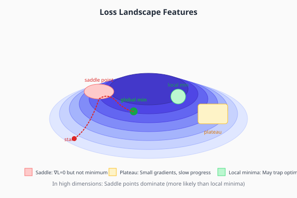
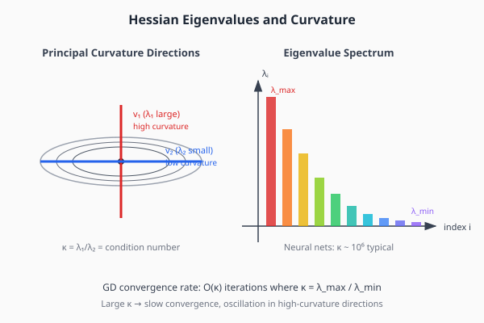
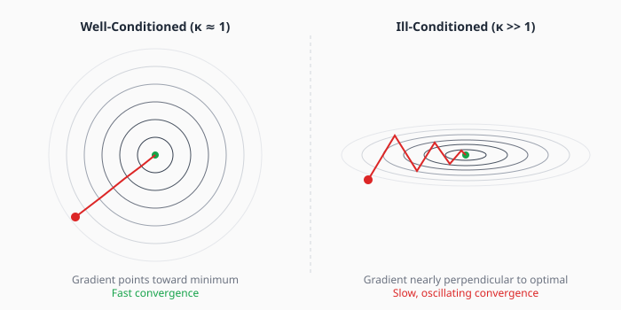
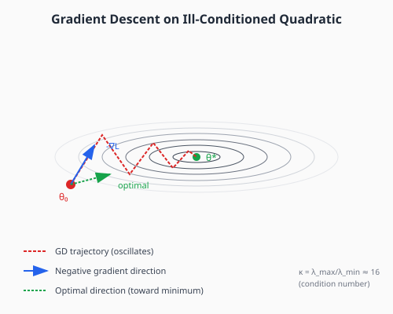
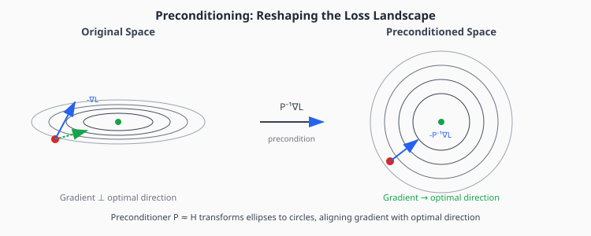

# Chapter 1: Gradient Descent and Its Limitations

This chapter establishes why vanilla gradient descent is suboptimal for training neural networks and motivates the need for more sophisticated optimization methods. Understanding these limitations is essential for appreciating why methods like momentum, Adam, and second-order optimizers exist.

## Table of Contents

1. [The Gradient Descent Update](#the-gradient-descent-update)
2. [The Loss Landscape](#the-loss-landscape)
3. [Curvature and the Hessian](#curvature-and-the-hessian)
4. [Ill-Conditioning](#ill-conditioning)
5. [Why Gradients Point in Suboptimal Directions](#why-gradients-point-in-suboptimal-directions)
6. [A Geometric View: Preconditioning](#a-geometric-view-preconditioning)
7. [Implementation](#implementation)
8. [Exercises](#exercises)

---

## The Gradient Descent Update

Gradient descent is the foundation of all neural network optimization. The update rule is deceptively simple:

```math
\large \theta_{t+1} = \theta_t - \eta \nabla L(\theta_t)
```

where:
- $\theta_t$ is the parameter vector at step $t$
- $\eta$ is the learning rate (step size)
- $\nabla L(\theta_t)$ is the gradient of the loss function at $\theta_t$

**Interpretation**: The gradient $\nabla L$ points in the direction of steepest *ascent*. By moving in the opposite direction $-\nabla L$, we descend the loss surface.

### Convergence for Convex Functions

For smooth, convex functions with Lipschitz-continuous gradients, gradient descent converges at rate $O(1/t)$:

```math
\large L(\theta_t) - L(\theta^*) \leq \frac{\|\theta_0 - \theta^*\|^2}{2\eta t}
```

This means the error decreases as $1/t$—slow, but guaranteed.

### Learning Rate Selection

The learning rate $\eta$ is critical:

- **Too large**: The updates overshoot, causing oscillation or divergence
- **Too small**: Convergence is painfully slow
- **Just right**: Depends on the curvature of the loss function

For a quadratic loss with Hessian $H$, the optimal learning rate is:

```math
\large \eta^* = \frac{2}{\lambda_{\max} + \lambda_{\min}}
```

where $\lambda_{\max}$ and $\lambda_{\min}$ are the largest and smallest eigenvalues of $H$.

---

## The Loss Landscape

Neural network loss functions create complex, high-dimensional surfaces with several challenging features:



### Key Features

**Local Minima**: Points where $\nabla L = 0$ and all eigenvalues of the Hessian are positive. The optimization can get trapped here.

**Saddle Points**: Points where $\nabla L = 0$ but the Hessian has both positive and negative eigenvalues. The loss curves up in some directions and down in others.

**Plateaus**: Regions where the gradient magnitude is very small, causing slow progress even though we haven't reached a minimum.

### The Blessing of Dimensionality

A crucial insight: **In high dimensions, saddle points vastly outnumber local minima.**

Consider a critical point where $\nabla L = 0$. For it to be a local minimum, *all* eigenvalues of the Hessian must be positive. In a random landscape, each eigenvalue is equally likely to be positive or negative. For $n$ parameters:

```math
\large P(\text{local minimum}) = \left(\frac{1}{2}\right)^n
```

For $n = 1000$ parameters, this probability is $\approx 10^{-301}$—essentially zero.

**Implication**: Neural networks don't get stuck in local minima; they get stuck near *saddle points*. This changes how we think about optimization.

---

## Curvature and the Hessian

To understand why gradient descent struggles, we need to examine the local curvature of the loss function.

### Second-Order Taylor Expansion

Near any point $\theta$, the loss can be approximated:

```math
\large L(\theta + \delta) \approx L(\theta) + \nabla L^\top \delta + \frac{1}{2} \delta^\top H \delta
```

where $H = \nabla^2 L$ is the **Hessian matrix**:

```math
\large H_{ij} = \frac{\partial^2 L}{\partial \theta_i \partial \theta_j}
```

The Hessian is symmetric and encodes the local curvature in every direction.

### Eigenvalues and Curvature

The Hessian's eigenvalues tell us how curved the loss surface is in each principal direction:



- **Large eigenvalue** $\lambda_i$ → High curvature in direction $v_i$ (steep walls)
- **Small eigenvalue** $\lambda_i$ → Low curvature in direction $v_i$ (gentle slope)
- **Negative eigenvalue** → Saddle point (curves downward in that direction)

### The Eigenvalue Spectrum of Neural Networks

In practice, neural network Hessians have:

1. **Bulk of small eigenvalues**: Most directions are nearly flat
2. **Few large eigenvalues**: A small number of "sharp" directions
3. **Ratio of $10^4$ to $10^8$** between largest and smallest positive eigenvalues

This extreme spread is the root cause of optimization difficulty.

---

## Ill-Conditioning

### Definition

The **condition number** of the Hessian measures how "stretched" the loss landscape is:

```math
\large \kappa = \frac{\lambda_{\max}}{\lambda_{\min}}
```

A large condition number means the landscape is highly elliptical—steep in some directions, flat in others.

### Impact on Convergence

For a quadratic loss, gradient descent requires:

```math
\large O(\kappa \log(1/\epsilon))
```

iterations to reach error $\epsilon$. This is devastating when $\kappa \sim 10^6$:

| Condition Number | Iterations to $10^{-6}$ Error |
|-----------------|------------------------------|
| $\kappa = 1$ | ~14 |
| $\kappa = 10^2$ | ~1,400 |
| $\kappa = 10^4$ | ~140,000 |
| $\kappa = 10^6$ | ~14,000,000 |

### Visual: Well-Conditioned vs Ill-Conditioned



**Well-conditioned** ($\kappa \approx 1$): The contours are circular. The gradient points directly toward the minimum. Convergence is fast and direct.

**Ill-conditioned** ($\kappa \gg 1$): The contours are highly elliptical. The gradient is nearly perpendicular to the optimal direction, causing oscillation and slow convergence.

---

## Why Gradients Point in Suboptimal Directions

Here's the key insight: **The gradient is the steepest descent direction in *Euclidean* space, but parameter space is not naturally Euclidean.**

### The Fundamental Problem



Consider the figure above. The gradient (blue arrow) points perpendicular to the contour—this is the direction of steepest descent in terms of Euclidean distance. But the optimal direction (green arrow) points toward the minimum.

These directions differ because:
1. The gradient measures "steepest" with respect to $\|\delta\|_2 = \sqrt{\sum_i \delta_i^2}$
2. But progress toward the minimum should be measured differently

### A Concrete Example

Consider a 2D quadratic:

```math
\large L(\theta_1, \theta_2) = \frac{1}{2}(\lambda_1 \theta_1^2 + \lambda_2 \theta_2^2)
```

with $\lambda_1 = 100$ and $\lambda_2 = 1$ (so $\kappa = 100$).

At point $(1, 1)$:
- Gradient: $\nabla L = (100, 1)$ — mostly in the $\theta_1$ direction
- Optimal step: $(\theta_1^*, \theta_2^*) - (\theta_1, \theta_2) = (-1, -1)$ — equal in both directions

The gradient vastly overemphasizes $\theta_1$ because its curvature is higher, even though both parameters are equally far from optimal.

---

## A Geometric View: Preconditioning

The solution is **preconditioning**: transform the gradient to account for the local geometry.



### The Preconditioned Gradient

Instead of updating with $-\nabla L$, we update with $-P^{-1}\nabla L$ where $P$ is a **preconditioner** matrix:

```math
\large \theta_{t+1} = \theta_t - \eta P^{-1} \nabla L(\theta_t)
```

### Ideal Preconditioner: The Hessian

If $P = H$ (the Hessian), we get **Newton's method**:

```math
\large \theta_{t+1} = \theta_t - H^{-1} \nabla L(\theta_t)
```

This is equivalent to:
1. Locally approximating the loss as a quadratic
2. Jumping directly to the minimum of that quadratic

For quadratics, Newton's method converges in **one step**. Near a minimum, it converges quadratically (error squares each iteration).

### The Problem with Newton's Method

Computing and inverting $H$ is impractical:
- **Memory**: $H$ has $n^2$ elements. For 7B parameters: $4.9 \times 10^{19}$ numbers
- **Computation**: Inversion is $O(n^3)$. Completely infeasible.

The rest of this guide explores *practical approximations* to the Hessian inverse:
- **Diagonal** approximations → Adam
- **Block-diagonal** → K-FAC
- **Kronecker-factored** → Shampoo
- **Orthogonalization** → Muon

---

## Implementation

Let's implement gradient descent and visualize its behavior on ill-conditioned problems.

```python
import torch
import torch.nn as nn
import matplotlib.pyplot as plt
import numpy as np
from typing import Callable, List, Tuple


class GradientDescent:
    """
    Vanilla gradient descent optimizer.

    This is the simplest optimizer, updating parameters in the direction
    of the negative gradient scaled by a learning rate.

    Update rule: θ_{t+1} = θ_t - η * ∇L(θ_t)

    Limitations:
    - Slow convergence on ill-conditioned problems (high condition number)
    - Oscillates when learning rate is too high
    - No adaptation to local curvature
    """

    def __init__(self, params, lr: float = 0.01):
        """
        Args:
            params: Iterable of parameters to optimize
            lr: Learning rate (step size)
        """
        self.params = list(params)
        self.lr = lr

    def step(self):
        """Perform a single optimization step."""
        for p in self.params:
            if p.grad is not None:
                # The fundamental update: θ = θ - η * ∇L
                p.data = p.data - self.lr * p.grad

    def zero_grad(self):
        """Zero out gradients (call before backward pass)."""
        for p in self.params:
            if p.grad is not None:
                p.grad.zero_()


def quadratic_loss(theta: torch.Tensor, eigenvalues: torch.Tensor) -> torch.Tensor:
    """
    Quadratic loss function: L(θ) = (1/2) Σ λ_i θ_i²

    This is the simplest non-trivial loss function and serves as a
    testbed for understanding optimizer behavior. The eigenvalues
    control the curvature in each direction.

    Args:
        theta: Parameter vector of shape (n,)
        eigenvalues: Eigenvalues defining curvature in each direction

    Returns:
        Scalar loss value
    """
    return 0.5 * torch.sum(eigenvalues * theta ** 2)


def compute_condition_number(eigenvalues: torch.Tensor) -> float:
    """Compute condition number κ = λ_max / λ_min."""
    return (eigenvalues.max() / eigenvalues.min()).item()


def run_gd_on_quadratic(
    eigenvalues: torch.Tensor,
    theta_init: torch.Tensor,
    lr: float,
    num_steps: int
) -> Tuple[List[float], List[torch.Tensor]]:
    """
    Run gradient descent on a quadratic and record trajectory.

    Args:
        eigenvalues: Curvature in each direction
        theta_init: Starting point
        lr: Learning rate
        num_steps: Number of optimization steps

    Returns:
        losses: List of loss values at each step
        trajectory: List of parameter vectors at each step
    """
    theta = theta_init.clone().requires_grad_(True)
    optimizer = GradientDescent([theta], lr=lr)

    losses = []
    trajectory = [theta.detach().clone()]

    for _ in range(num_steps):
        optimizer.zero_grad()
        loss = quadratic_loss(theta, eigenvalues)
        loss.backward()
        optimizer.step()

        losses.append(loss.item())
        trajectory.append(theta.detach().clone())

    return losses, trajectory


# Demonstration: Compare well-conditioned vs ill-conditioned
if __name__ == "__main__":
    torch.manual_seed(42)

    # Well-conditioned: κ = 2
    eigenvalues_good = torch.tensor([1.0, 2.0])
    kappa_good = compute_condition_number(eigenvalues_good)

    # Ill-conditioned: κ = 100
    eigenvalues_bad = torch.tensor([1.0, 100.0])
    kappa_bad = compute_condition_number(eigenvalues_bad)

    # Same starting point
    theta_init = torch.tensor([1.0, 1.0])

    # Optimal learning rate for each (based on theory)
    lr_good = 2.0 / (eigenvalues_good.max() + eigenvalues_good.min()).item()
    lr_bad = 2.0 / (eigenvalues_bad.max() + eigenvalues_bad.min()).item()

    print(f"Well-conditioned: κ = {kappa_good:.1f}, optimal lr = {lr_good:.4f}")
    print(f"Ill-conditioned:  κ = {kappa_bad:.1f}, optimal lr = {lr_bad:.4f}")

    # Run optimization
    losses_good, traj_good = run_gd_on_quadratic(
        eigenvalues_good, theta_init, lr_good, num_steps=50
    )
    losses_bad, traj_bad = run_gd_on_quadratic(
        eigenvalues_bad, theta_init, lr_bad, num_steps=50
    )

    print(f"\nAfter 50 steps:")
    print(f"  Well-conditioned loss: {losses_good[-1]:.2e}")
    print(f"  Ill-conditioned loss:  {losses_bad[-1]:.2e}")
```

### Visualizing Trajectories

```python
def plot_contours_and_trajectory(
    eigenvalues: torch.Tensor,
    trajectory: List[torch.Tensor],
    title: str
):
    """
    Plot loss contours and optimization trajectory.

    This visualization shows why ill-conditioning causes oscillation:
    the gradient points perpendicular to the elliptical contours,
    not toward the minimum.
    """
    fig, ax = plt.subplots(figsize=(8, 6))

    # Create grid for contours
    x = np.linspace(-1.5, 1.5, 100)
    y = np.linspace(-1.5, 1.5, 100)
    X, Y = np.meshgrid(x, y)

    # Compute loss at each point
    Z = 0.5 * (eigenvalues[0].item() * X**2 + eigenvalues[1].item() * Y**2)

    # Plot contours
    levels = np.logspace(-2, 2, 20)
    ax.contour(X, Y, Z, levels=levels, cmap='Blues', alpha=0.7)

    # Plot trajectory
    traj_np = np.array([t.numpy() for t in trajectory])
    ax.plot(traj_np[:, 0], traj_np[:, 1], 'r.-', linewidth=1.5, markersize=4)
    ax.plot(traj_np[0, 0], traj_np[0, 1], 'go', markersize=10, label='Start')
    ax.plot(0, 0, 'g*', markersize=15, label='Optimum')

    ax.set_xlabel(r'$\theta_1$')
    ax.set_ylabel(r'$\theta_2$')
    ax.set_title(title)
    ax.legend()
    ax.set_aspect('equal')
    ax.grid(True, alpha=0.3)

    return fig


def compute_hessian(loss_fn: Callable, params: torch.Tensor) -> torch.Tensor:
    """
    Compute the full Hessian matrix using automatic differentiation.

    WARNING: This is O(n²) in memory and O(n³) to invert—never use
    for large models! Shown here for educational purposes only.

    Args:
        loss_fn: Function that takes params and returns scalar loss
        params: Parameter tensor

    Returns:
        Hessian matrix of shape (n, n)
    """
    n = params.numel()
    hessian = torch.zeros(n, n)

    # Compute gradient
    params = params.detach().requires_grad_(True)
    loss = loss_fn(params)
    grad = torch.autograd.grad(loss, params, create_graph=True)[0]

    # Compute each row of Hessian
    for i in range(n):
        grad_i = grad[i]
        hess_row = torch.autograd.grad(grad_i, params, retain_graph=True)[0]
        hessian[i] = hess_row

    return hessian


def analyze_hessian_spectrum(hessian: torch.Tensor) -> dict:
    """
    Analyze the eigenvalue spectrum of a Hessian matrix.

    Returns:
        Dictionary with eigenvalue statistics
    """
    eigenvalues, eigenvectors = torch.linalg.eigh(hessian)

    return {
        'eigenvalues': eigenvalues,
        'eigenvectors': eigenvectors,
        'condition_number': (eigenvalues.max() / eigenvalues.min()).item(),
        'max_eigenvalue': eigenvalues.max().item(),
        'min_eigenvalue': eigenvalues.min().item(),
    }
```

---

## Key Takeaways

1. **Gradient descent converges slowly on ill-conditioned problems** (high $\kappa = \lambda_{\max}/\lambda_{\min}$)

2. **The gradient is not the optimal direction**—it's perpendicular to contours, not pointing at the minimum

3. **Neural networks are severely ill-conditioned** with $\kappa \sim 10^4$ to $10^8$

4. **In high dimensions, saddle points dominate** over local minima

5. **Preconditioning** (multiplying by $P^{-1}$) corrects the gradient direction

6. **Perfect preconditioning** ($P = H$) gives Newton's method, but is computationally infeasible

7. All practical optimizers are **approximations to preconditioning**

---

## Exercises

### Exercise 1: Convergence Rate Verification

Implement gradient descent on a 2D quadratic with $\lambda_1 = 1$, $\lambda_2 = 100$. Verify that:
- With optimal learning rate, convergence takes $O(\kappa)$ iterations
- Doubling the learning rate above optimal causes divergence

### Exercise 2: Optimal Learning Rate

For a quadratic $L(\theta) = \frac{1}{2}\theta^\top H \theta$ with $H = \text{diag}(\lambda_1, \ldots, \lambda_n)$:
1. Derive the optimal learning rate $\eta^* = 2/(\lambda_{\max} + \lambda_{\min})$
2. Show that this is the largest stable learning rate

### Exercise 3: One-Step Convergence

Show that gradient descent converges in exactly one step when:
1. $H = I$ (identity Hessian, i.e., $\kappa = 1$)
2. Learning rate $\eta = 1$

### Exercise 4: Hessian Computation

Compute the Hessian of a small neural network (2-layer MLP with 10 hidden units) on a single training example. Examine:
1. The eigenvalue spectrum
2. The condition number
3. How this changes as training progresses

### Exercise 5: Saddle Point Probability

For a random symmetric matrix with i.i.d. entries:
1. What is the expected number of positive eigenvalues?
2. Estimate the probability of a random critical point being a local minimum in $n=10, 100, 1000$ dimensions

---

## Connections

- **Next**: [Momentum](02-momentum.md) addresses oscillation by accumulating velocity
- **Chapter 4**: [Second-Order Methods](04-second-order.md) covers Newton's method and approximations
- **Chapter 5**: [Natural Gradient](05-natural-gradient.md) shows another geometry where gradient descent is optimal
- **Related**: Loss landscape analysis appears in the scaling laws chapter
