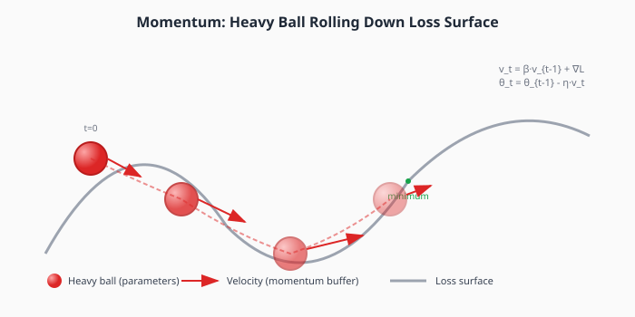
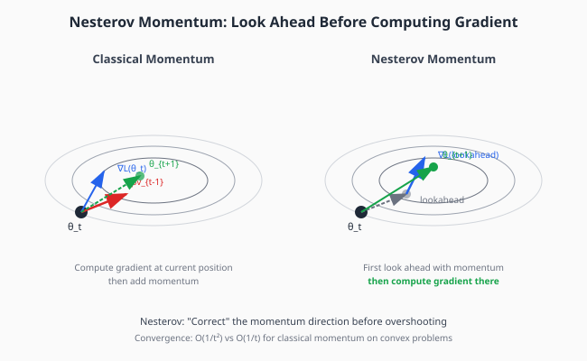
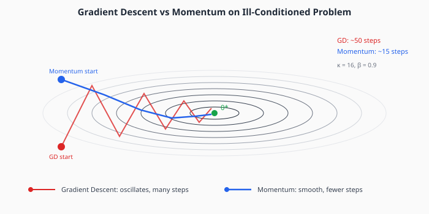
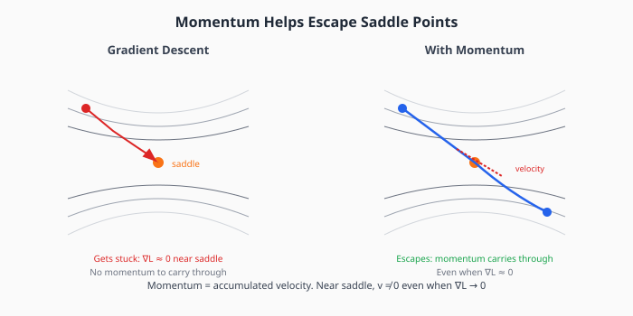

# Chapter 2: Momentum and Acceleration

Momentum methods accelerate convergence by accumulating velocity over time. This simple modification to gradient descent dramatically improves optimization, especially on ill-conditioned problems and near saddle points.

## Table of Contents

1. [Physical Intuition](#physical-intuition)
2. [Classical Momentum](#classical-momentum)
3. [Nesterov Accelerated Gradient](#nesterov-accelerated-gradient)
4. [Why Momentum Helps](#why-momentum-helps)
5. [Convergence Analysis](#convergence-analysis)
6. [Momentum in Stochastic Settings](#momentum-in-stochastic-settings)
7. [Connection to Differential Equations](#connection-to-differential-equations)
8. [Implementation](#implementation)
9. [Exercises](#exercises)

---

## Physical Intuition

Imagine a heavy ball rolling down a hilly landscape. Unlike a massless particle that would stop the instant the slope becomes flat, the ball has **inertia**—it continues moving in its current direction even when the local gradient is zero.



This physical analogy captures the key insight:

- **Without momentum**: The optimizer only sees the local gradient. If the gradient is small (plateau, saddle point), it barely moves.
- **With momentum**: The optimizer remembers where it was heading. It can coast through flat regions and resist sudden changes in gradient direction.

### Key Properties from the Physics Analogy

1. **Velocity accumulates** in directions of consistent gradient
2. **Oscillations are damped** because velocity averages out zigzags
3. **Flat regions are traversed** using accumulated momentum
4. **Overshooting is possible** if momentum is too high

---

## Classical Momentum

The classical momentum update (Polyak, 1964) introduces a **velocity** term that accumulates gradient information:

```math
\large v_{t+1} = \beta v_t + \nabla L(\theta_t)
```
```math
\large \theta_{t+1} = \theta_t - \eta v_{t+1}
```

where:
- $v_t$ is the velocity (momentum buffer) at step $t$
- $\beta \in [0, 1)$ is the momentum coefficient (typically 0.9)
- $\eta$ is the learning rate

### Interpretation as Exponential Moving Average

Unrolling the recursion:

```math
\large v_t = \sum_{i=0}^{t} \beta^{t-i} \nabla L(\theta_i)
```

The velocity is an **exponentially weighted average** of all past gradients. Recent gradients have weight $\approx 1$, while gradients from $k$ steps ago have weight $\beta^k$.

### Effective Learning Rate

When the gradient is constant (same direction every step), the velocity converges to:

```math
\large v_\infty = \frac{\nabla L}{1 - \beta}
```

So the effective step size becomes $\eta / (1 - \beta)$. With $\beta = 0.9$, this is a **10× amplification**!

This explains why momentum allows larger effective learning rates while remaining stable.

---

## Nesterov Accelerated Gradient

Nesterov momentum (NAG, 1983) adds a crucial refinement: **look ahead before computing the gradient**.



### The Key Insight

In classical momentum, we:
1. Compute gradient at current position
2. Update velocity
3. Take a step

In Nesterov momentum, we:
1. Take a "lookahead" step in the direction of current velocity
2. Compute gradient at that lookahead position
3. Update velocity and position

This lets us **correct** the momentum direction before we overshoot.

### Nesterov Update Rule

```math
\large v_{t+1} = \beta v_t + \nabla L(\theta_t - \eta \beta v_t)
```
```math
\large \theta_{t+1} = \theta_t - \eta v_{t+1}
```

The gradient is evaluated at $\theta_t - \eta \beta v_t$, not at $\theta_t$.

### Equivalent Formulation (Common in Practice)

The above formulation requires evaluating the gradient at an intermediate point. An equivalent form that's easier to implement:

```math
\large v_{t+1} = \beta v_t + \eta \nabla L(\theta_t)
```
```math
\large \theta_{t+1} = \theta_t - \beta v_{t+1} - \eta \nabla L(\theta_t)
```

This computes the gradient at the current position but adjusts how velocity is applied.

### Convergence Improvement

For convex, smooth functions:
- **Gradient descent**: $O(1/t)$ convergence
- **Classical momentum**: $O(1/t)$ convergence (same rate!)
- **Nesterov momentum**: $O(1/t^2)$ convergence

This quadratic speedup is provably optimal for first-order methods on convex functions.

---

## Why Momentum Helps

### 1. Reduces Oscillation in High-Curvature Directions



On ill-conditioned problems, vanilla GD oscillates in the high-curvature direction while making slow progress in the low-curvature direction.

Momentum **averages out** these oscillations:
- Consistent gradient direction → velocity accumulates → faster movement
- Alternating gradient direction → velocity cancels → reduced oscillation

### 2. Accelerates Through Low-Curvature Directions

In directions with small gradients (but far from optimal), momentum accumulates velocity over many steps, eventually building enough speed to make progress.

### 3. Escapes Saddle Points



Near saddle points, $\nabla L \approx 0$, causing GD to stall. But momentum doesn't rely solely on the current gradient—accumulated velocity carries the optimizer through.

This is crucial because neural network loss surfaces are dominated by saddle points in high dimensions.

### 4. Smooths Stochastic Gradients

In SGD, each minibatch gives a noisy estimate of the true gradient. Momentum acts as a **low-pass filter**, averaging out high-frequency noise while preserving the underlying signal.

---

## Convergence Analysis

### For Quadratic Functions

Consider $L(\theta) = \frac{1}{2}\theta^\top H \theta$ where $H$ has eigenvalues $\lambda_1 \geq \cdots \geq \lambda_n > 0$.

**Gradient descent** converges at rate:
```math
\large \left(1 - \frac{2}{\kappa + 1}\right)^t \approx e^{-2t/\kappa}
```

where $\kappa = \lambda_1/\lambda_n$ is the condition number.

**Momentum** with optimal $\beta$ converges at rate:
```math
\large \left(\frac{\sqrt{\kappa} - 1}{\sqrt{\kappa} + 1}\right)^t \approx e^{-2t/\sqrt{\kappa}}
```

### The Speedup

| Condition Number | GD Iterations | Momentum Iterations | Speedup |
|-----------------|---------------|---------------------|---------|
| $\kappa = 100$ | ~230 | ~23 | 10× |
| $\kappa = 10^4$ | ~23,000 | ~230 | 100× |
| $\kappa = 10^6$ | ~2.3M | ~2,300 | 1000× |

Momentum changes $O(\kappa)$ convergence to $O(\sqrt{\kappa})$—a dramatic improvement!

### Optimal Momentum Coefficient

For quadratics, the optimal $\beta$ approaches 1 as $\kappa$ increases:

```math
\large \beta^* = \left(\frac{\sqrt{\kappa} - 1}{\sqrt{\kappa} + 1}\right)^2 \approx 1 - \frac{4}{\sqrt{\kappa}}
```

For $\kappa = 100$: $\beta^* \approx 0.67$
For $\kappa = 10^4$: $\beta^* \approx 0.96$

In practice, $\beta = 0.9$ works well across many problems.

---

## Momentum in Stochastic Settings

### SGD with Momentum

The standard training algorithm for neural networks:

```math
\large v_{t+1} = \beta v_t + \nabla L_{\mathcal{B}_t}(\theta_t)
```
```math
\large \theta_{t+1} = \theta_t - \eta v_{t+1}
```

where $\nabla L_{\mathcal{B}_t}$ is the gradient on minibatch $\mathcal{B}_t$.

### Interaction with Batch Size

Momentum interacts with batch size in subtle ways:

- **Small batches**: High gradient variance. Momentum smooths this, but effective momentum is reduced (noise "resets" the velocity).
- **Large batches**: Low gradient variance. Momentum fully accumulates, behaving more like the deterministic case.

This is why large-batch training often uses higher momentum (e.g., $\beta = 0.95$ or $0.99$).

### Warmup and Momentum

At the start of training:
- Gradients are large and unstable
- Momentum buffer is zero
- High learning rate can cause divergence

**Solution**: Start with small $\eta$ (or small $\beta$) and gradually increase. This lets the momentum buffer stabilize before aggressive updates begin.

---

## Connection to Differential Equations

### Gradient Descent as Gradient Flow

In the continuous-time limit, gradient descent becomes **gradient flow**:

```math
\large \frac{d\theta}{dt} = -\nabla L(\theta)
```

This is a first-order ODE: the parameters flow downhill at a rate proportional to the local gradient.

### Momentum as a Second-Order ODE

Momentum corresponds to a **damped oscillator**:

```math
\large \frac{d^2\theta}{dt^2} + \gamma \frac{d\theta}{dt} = -\nabla L(\theta)
```

where $\gamma > 0$ is the damping coefficient (related to $1 - \beta$).

### Why This Matters

1. **Acceleration**: Second-order ODEs can exhibit acceleration that first-order cannot
2. **Oscillation**: Without damping, the system would oscillate forever; $\gamma$ controls decay
3. **Numerical analysis**: Understanding the ODE helps choose discretization (step size, momentum)

### Nesterov as a Specific Discretization

Nesterov momentum can be viewed as a particular discretization of an accelerated gradient flow ODE discovered by Su, Boyd, and Candès (2014):

```math
\large \frac{d^2\theta}{dt^2} + \frac{3}{t}\frac{d\theta}{dt} = -\nabla L(\theta)
```

The time-varying damping $3/t$ is key to achieving $O(1/t^2)$ convergence.

---

## Implementation

```python
import torch
from typing import List, Optional


class SGDMomentum:
    """
    SGD with classical (Polyak) momentum.

    Update rules:
        v_{t+1} = β * v_t + ∇L(θ_t)
        θ_{t+1} = θ_t - η * v_{t+1}

    The momentum buffer v accumulates gradients over time, providing:
    - Acceleration in consistent gradient directions
    - Damping of oscillations
    - Ability to traverse flat regions

    Args:
        params: Iterable of parameters to optimize
        lr: Learning rate η
        momentum: Momentum coefficient β (typically 0.9)
        weight_decay: L2 regularization coefficient (optional)
    """

    def __init__(
        self,
        params,
        lr: float = 0.01,
        momentum: float = 0.9,
        weight_decay: float = 0.0
    ):
        self.params = list(params)
        self.lr = lr
        self.momentum = momentum
        self.weight_decay = weight_decay

        # Initialize velocity buffers to zero
        self.velocity = [torch.zeros_like(p) for p in self.params]

    def step(self):
        """Perform one optimization step."""
        for i, p in enumerate(self.params):
            if p.grad is None:
                continue

            grad = p.grad

            # Add weight decay (L2 regularization)
            if self.weight_decay != 0:
                grad = grad + self.weight_decay * p.data

            # Update velocity: v = β * v + grad
            self.velocity[i] = self.momentum * self.velocity[i] + grad

            # Update parameters: θ = θ - η * v
            p.data = p.data - self.lr * self.velocity[i]

    def zero_grad(self):
        """Zero out gradients."""
        for p in self.params:
            if p.grad is not None:
                p.grad.zero_()


class NesterovSGD:
    """
    SGD with Nesterov accelerated gradient.

    The key insight: compute gradient at a "lookahead" position,
    anticipating where momentum will take us.

    Update rules (equivalent formulation):
        v_{t+1} = β * v_t + η * ∇L(θ_t)
        θ_{t+1} = θ_t - β * v_{t+1} - η * ∇L(θ_t)

    This achieves O(1/t²) convergence on convex functions,
    compared to O(1/t) for classical momentum.

    Args:
        params: Iterable of parameters to optimize
        lr: Learning rate η
        momentum: Momentum coefficient β (typically 0.9)
        weight_decay: L2 regularization coefficient (optional)
    """

    def __init__(
        self,
        params,
        lr: float = 0.01,
        momentum: float = 0.9,
        weight_decay: float = 0.0
    ):
        self.params = list(params)
        self.lr = lr
        self.momentum = momentum
        self.weight_decay = weight_decay

        self.velocity = [torch.zeros_like(p) for p in self.params]

    def step(self):
        """Perform one Nesterov momentum step."""
        for i, p in enumerate(self.params):
            if p.grad is None:
                continue

            grad = p.grad

            if self.weight_decay != 0:
                grad = grad + self.weight_decay * p.data

            # Update velocity
            v_new = self.momentum * self.velocity[i] + self.lr * grad

            # Nesterov update: apply extra momentum correction
            # θ = θ - β * v_new - η * grad
            #   = θ - v_new - (β - 1) * v_new
            #   = θ - v_new + (1 - β) * v_new
            p.data = p.data - v_new - self.momentum * (v_new - self.velocity[i])

            self.velocity[i] = v_new

    def zero_grad(self):
        for p in self.params:
            if p.grad is not None:
                p.grad.zero_()


def compare_optimizers_on_quadratic(
    eigenvalues: torch.Tensor,
    num_steps: int = 100,
    lr: float = 0.01,
    momentum: float = 0.9
) -> dict:
    """
    Compare GD, momentum, and Nesterov on a quadratic loss.

    Returns dictionary with loss histories for each optimizer.
    """
    results = {}

    for name, opt_class in [
        ('GD', lambda p: SGDMomentum(p, lr=lr, momentum=0.0)),
        ('Momentum', lambda p: SGDMomentum(p, lr=lr, momentum=momentum)),
        ('Nesterov', lambda p: NesterovSGD(p, lr=lr, momentum=momentum))
    ]:
        theta = torch.tensor([1.0, 1.0], requires_grad=True)
        optimizer = opt_class([theta])

        losses = []
        for _ in range(num_steps):
            optimizer.zero_grad()
            loss = 0.5 * torch.sum(eigenvalues * theta ** 2)
            loss.backward()
            optimizer.step()
            losses.append(loss.item())

        results[name] = losses

    return results


def demonstrate_saddle_escape():
    """
    Show that momentum helps escape saddle points.

    Creates a loss function with a saddle at origin:
    L(x, y) = x² - y²

    GD initialized near the saddle will stall;
    momentum will escape in the y direction.
    """
    def saddle_loss(theta):
        return theta[0]**2 - theta[1]**2

    results = {}

    for name, opt_class in [
        ('GD', lambda p: SGDMomentum(p, lr=0.1, momentum=0.0)),
        ('Momentum', lambda p: SGDMomentum(p, lr=0.1, momentum=0.9))
    ]:
        # Start near saddle point with slight y-direction perturbation
        theta = torch.tensor([0.1, 0.01], requires_grad=True)
        optimizer = opt_class([theta])

        trajectory = [theta.detach().clone()]

        for _ in range(50):
            optimizer.zero_grad()
            loss = saddle_loss(theta)
            loss.backward()
            optimizer.step()
            trajectory.append(theta.detach().clone())

        results[name] = trajectory

    return results


# Demonstration
if __name__ == "__main__":
    torch.manual_seed(42)

    # Ill-conditioned problem
    eigenvalues = torch.tensor([100.0, 1.0])  # κ = 100

    # Compare optimizers
    results = compare_optimizers_on_quadratic(
        eigenvalues,
        num_steps=100,
        lr=0.015,
        momentum=0.9
    )

    print("Loss after 100 steps:")
    for name, losses in results.items():
        print(f"  {name}: {losses[-1]:.2e}")

    # Saddle point escape
    saddle_results = demonstrate_saddle_escape()
    print("\nFinal distance from origin (saddle):")
    for name, traj in saddle_results.items():
        final = traj[-1]
        dist = torch.sqrt(final[0]**2 + final[1]**2).item()
        print(f"  {name}: {dist:.4f}")
```

---

## Key Takeaways

1. **Momentum accumulates velocity**, enabling faster movement in consistent directions

2. **Classical momentum** uses $v = \beta v + \nabla L$, improving convergence from $O(\kappa)$ to $O(\sqrt{\kappa})$

3. **Nesterov momentum** looks ahead before computing gradients, achieving $O(1/t^2)$ on convex problems

4. **Momentum helps escape saddle points** by carrying velocity through flat regions

5. **The momentum coefficient $\beta$** controls the "memory" of past gradients (typically 0.9)

6. **Momentum smooths SGD noise**, acting as a low-pass filter on gradient estimates

---

## Exercises

### Exercise 1: Implement and Compare

Implement both momentum variants and run on the Rosenbrock function:
```math
L(x, y) = (1-x)^2 + 100(y - x^2)^2
```
Compare trajectories and iteration counts to reach tolerance $10^{-4}$.

### Exercise 2: Optimal Momentum

For a 2D quadratic with eigenvalues $\lambda_1 = 100$, $\lambda_2 = 1$:
1. Derive the optimal $\beta$ using the formula in the text
2. Verify experimentally that this $\beta$ gives fastest convergence

### Exercise 3: Effective Learning Rate

Show analytically that for constant gradient $g$, the velocity converges to $v_\infty = g / (1 - \beta)$.

### Exercise 4: Continuous-Time Limit

Implement the continuous-time ODE $\ddot{\theta} + \gamma \dot{\theta} = -\nabla L$ using a numerical ODE solver. Compare trajectories to discrete momentum updates.

### Exercise 5: Saddle Escape

Create a 10D function with a saddle point. Compare escape times for:
- Vanilla GD
- Momentum with $\beta = 0.5, 0.9, 0.99$
- Nesterov momentum

---

## Connections

- **Previous**: [Gradient Descent](01-gradient-descent.md) — the foundation momentum builds on
- **Next**: [Adaptive Methods](03-adaptive.md) — combining momentum with per-parameter learning rates (Adam)
- **Chapter 5**: [Natural Gradient](05-natural-gradient.md) — momentum in non-Euclidean geometry
- **Related**: Learning rate warmup (Chapter 8) interacts with momentum initialization
