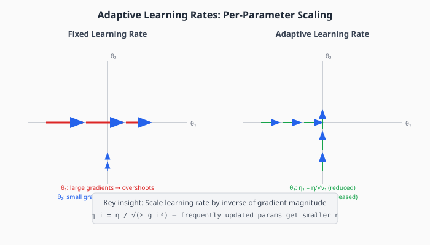
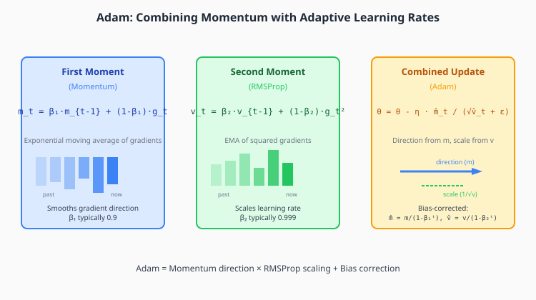
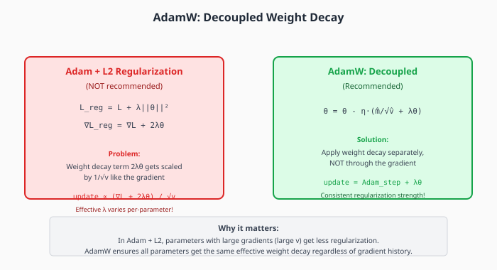

# Chapter 3: Adaptive Learning Rates

Adaptive methods assign different learning rates to different parameters based on their gradient history. This automatically addresses ill-conditioning without requiring explicit second-order computation.

## Table of Contents

1. [The Key Insight](#the-key-insight)
2. [AdaGrad](#adagrad)
3. [RMSProp](#rmsprop)
4. [Adam](#adam)
5. [AdamW: Decoupled Weight Decay](#adamw-decoupled-weight-decay)
6. [Adam Variants](#adam-variants)
7. [Understanding Adaptive Methods Geometrically](#understanding-adaptive-methods-geometrically)
8. [Implementation](#implementation)
9. [Exercises](#exercises)

---

## The Key Insight

Different parameters in a neural network have vastly different gradient magnitudes:

- **Embedding layers**: Sparse gradients (most are zero), large when active
- **Early layers**: Small gradients (vanishing gradient)
- **Output layers**: Often large gradients
- **Rarely-used features**: Infrequent but informative updates

A single global learning rate cannot accommodate all of these. The solution: **per-parameter learning rates** based on gradient history.



### The Core Principle

Parameters with **large gradients** need **smaller learning rates** to avoid overshooting.
Parameters with **small gradients** need **larger learning rates** to make progress.

We can estimate gradient magnitude from history and scale accordingly:

```math
\large \eta_i = \frac{\eta}{\sqrt{\sum_{t} g_{i,t}^2} + \epsilon}
```

This is the essence of all adaptive methods.

---

## AdaGrad

**Adaptive Gradient Algorithm** (Duchi et al., 2011) was the first widely-used adaptive method.

### Algorithm

Maintain a running sum of squared gradients for each parameter:

```math
\large G_t = G_{t-1} + g_t \odot g_t
```

Update parameters with scaled learning rate:

```math
\large \theta_{t+1} = \theta_t - \frac{\eta}{\sqrt{G_t} + \epsilon} \odot g_t
```

where $\odot$ denotes element-wise multiplication and $\epsilon \approx 10^{-8}$ prevents division by zero.

### Strengths

**Excellent for sparse gradients**: In NLP (before embeddings) or recommender systems, most features are zero on any given example. AdaGrad gives large learning rates to rarely-seen features, allowing quick learning when they do appear.

**Automatic learning rate decay**: The denominator $\sqrt{G_t}$ only grows, so learning rates naturally decrease over time.

### Weakness: Premature Stopping

The accumulated sum $G_t$ grows without bound. Eventually, $\sqrt{G_t}$ becomes so large that the effective learning rate approaches zero, and learning stops—even if we haven't converged.

For deep learning with long training, this is fatal.

---

## RMSProp

**Root Mean Square Propagation** (Hinton, unpublished lecture notes, 2012) fixes AdaGrad's decay problem with a simple modification: use an exponential moving average instead of a sum.

### Algorithm

```math
\large v_t = \beta v_{t-1} + (1 - \beta) g_t^2
```
```math
\large \theta_{t+1} = \theta_t - \frac{\eta}{\sqrt{v_t} + \epsilon} g_t
```

Typically $\beta = 0.99$ (longer memory than momentum's 0.9).

### Why It Works

The exponential moving average "forgets" old gradients. If a parameter had large gradients in the past but small ones now, $v_t$ will decrease, allowing the learning rate to increase again.

This makes RMSProp suitable for non-stationary problems (like training neural networks, where the gradient distribution shifts as we learn).

### Connection to Second-Order Methods

RMSProp approximates the diagonal of the Fisher information matrix:

```math
\large F_{ii} \approx \mathbb{E}[g_i^2] \approx v_i
```

So $\eta / \sqrt{v_i}$ approximates the natural gradient update $\eta F^{-1/2}$ on the diagonal.

---

## Adam

**Adaptive Moment Estimation** (Kingma & Ba, 2015) combines the best of momentum and RMSProp.



### Algorithm

Maintain two moving averages:

**First moment** (momentum): Direction of update
```math
\large m_t = \beta_1 m_{t-1} + (1 - \beta_1) g_t
```

**Second moment** (RMSProp): Scale of update
```math
\large v_t = \beta_2 v_{t-1} + (1 - \beta_2) g_t^2
```

**Bias correction** (crucial at start of training):
```math
\large \hat{m}_t = \frac{m_t}{1 - \beta_1^t}, \quad \hat{v}_t = \frac{v_t}{1 - \beta_2^t}
```

**Update**:
```math
\large \theta_{t+1} = \theta_t - \eta \frac{\hat{m}_t}{\sqrt{\hat{v}_t} + \epsilon}
```

### Default Hyperparameters

- $\beta_1 = 0.9$ — Momentum coefficient
- $\beta_2 = 0.999$ — Second moment coefficient
- $\eta = 0.001$ — Learning rate
- $\epsilon = 10^{-8}$ — Numerical stability

These defaults work well across many problems, which is why Adam became so popular.

### Why Bias Correction?

At $t=1$, with $m_0 = 0$:
```math
m_1 = 0.9 \cdot 0 + 0.1 \cdot g_1 = 0.1 g_1
```

The first moment is only 10% of the actual gradient! This would make early steps too small.

Bias correction compensates:
```math
\hat{m}_1 = \frac{0.1 g_1}{1 - 0.9^1} = \frac{0.1 g_1}{0.1} = g_1
```

As $t \to \infty$, $\beta^t \to 0$, so correction disappears.

### Adam's Convergence Issues

Reddi et al. (2018) showed Adam can fail to converge on simple convex problems. The issue: $v_t$ can decrease, causing the learning rate to increase unexpectedly.

**AMSGrad** fix: Ensure $\hat{v}_t$ never decreases:
```math
\large \hat{v}_t = \max(\hat{v}_{t-1}, v_t)
```

In practice, vanilla Adam usually works fine. Use AMSGrad if you observe convergence issues.

---

## AdamW: Decoupled Weight Decay

**This is the optimizer for LLM training.** Loshchilov & Hutter (2019) showed that L2 regularization and weight decay are *not equivalent* in adaptive optimizers.



### The Problem with L2 in Adam

With L2 regularization, the loss becomes $L_{reg} = L + \lambda \|\theta\|^2$.

The gradient is $\nabla L_{reg} = \nabla L + 2\lambda\theta$.

In Adam, this gradient gets scaled by $1/\sqrt{v}$. But $v$ depends on $\nabla L$, not on $\theta$. This means:
- Parameters with large gradients (large $v$) get less regularization
- Parameters with small gradients (small $v$) get more regularization

This is not what we want!

### AdamW Solution: Decouple

Apply weight decay directly to the update, not through the gradient:

```math
\large \theta_{t+1} = \theta_t - \eta \left( \frac{\hat{m}_t}{\sqrt{\hat{v}_t} + \epsilon} + \lambda \theta_t \right)
```

Now all parameters get the same regularization strength $\lambda$, regardless of their gradient history.

### Why It Matters for LLMs

In large language models:
- Different layers have very different gradient magnitudes
- We want consistent regularization across all parameters
- L2 + Adam would under-regularize layers with large gradients

**Always use AdamW for LLM training**, not Adam + L2.

---

## Adam Variants

### AdaFactor (Shazeer & Stern, 2018)

Reduces memory by factorizing the second moment:
- Instead of storing $v \in \mathbb{R}^{m \times n}$, store row and column factors
- Memory: $O(m + n)$ instead of $O(mn)$

Used in T5 and other large models before AdamW became standard.

### LAMB (You et al., 2020)

Layer-wise adaptive learning rates for large-batch training:
```math
\large \eta_l = \eta \cdot \frac{\|\theta_l\|}{\|u_l\|}
```

where $u_l$ is the Adam update for layer $l$. This allows training with batch sizes of 32K+.

### Lion (Chen et al., 2023)

Discovered via AutoML, uses sign of momentum:
```math
\large \theta_{t+1} = \theta_t - \eta \cdot \text{sign}(\beta_1 m_{t-1} + (1-\beta_1) g_t)
```

More memory-efficient (no second moment), but less robust than AdamW.

### Sophia (Liu et al., 2023)

Uses diagonal Hessian estimation for adaptive preconditioning:
```math
\large \theta_{t+1} = \theta_t - \eta \frac{m_t}{\max(h_t, \epsilon)}
```

where $h_t$ estimates diagonal Hessian via Hutchinson's method.

---

## Understanding Adaptive Methods Geometrically

All adaptive methods perform **diagonal preconditioning**:

```math
\large \theta_{t+1} = \theta_t - \eta P^{-1} g_t
```

where $P = \text{diag}(\sqrt{v_1}, \ldots, \sqrt{v_n})$.

### What This Means

The preconditioner $P$ rescales each axis independently:
- Axes with large gradient variance get compressed
- Axes with small gradient variance get stretched

This transforms the elliptical contours of the loss (from ill-conditioning) into more circular contours, making gradient descent more effective.

### Limitation: No Cross-Parameter Correlations

Diagonal preconditioning can't capture correlations between parameters. If parameters $\theta_1$ and $\theta_2$ are highly correlated, Adam treats them independently.

This is why methods like K-FAC and Shampoo (Chapter 6) go beyond diagonal approximations.

---

## Implementation

```python
import torch
from typing import Optional


class AdaGrad:
    """
    AdaGrad optimizer.

    Accumulates squared gradients to scale learning rate per-parameter.
    Excellent for sparse problems; less suited for deep learning due to
    monotonically decreasing learning rates.

    Update rule:
        G_t = G_{t-1} + g_t²
        θ = θ - η * g_t / (√G_t + ε)
    """

    def __init__(
        self,
        params,
        lr: float = 0.01,
        eps: float = 1e-8
    ):
        self.params = list(params)
        self.lr = lr
        self.eps = eps

        # Accumulated squared gradients
        self.G = [torch.zeros_like(p) for p in self.params]

    def step(self):
        for i, p in enumerate(self.params):
            if p.grad is None:
                continue

            # Accumulate squared gradient
            self.G[i] = self.G[i] + p.grad ** 2

            # Update with scaled learning rate
            p.data = p.data - self.lr * p.grad / (torch.sqrt(self.G[i]) + self.eps)

    def zero_grad(self):
        for p in self.params:
            if p.grad is not None:
                p.grad.zero_()


class RMSProp:
    """
    RMSProp optimizer.

    Uses exponential moving average of squared gradients, solving
    AdaGrad's diminishing learning rate problem.

    Update rule:
        v_t = β * v_{t-1} + (1-β) * g_t²
        θ = θ - η * g_t / (√v_t + ε)
    """

    def __init__(
        self,
        params,
        lr: float = 0.01,
        beta: float = 0.99,
        eps: float = 1e-8
    ):
        self.params = list(params)
        self.lr = lr
        self.beta = beta
        self.eps = eps

        # Exponential moving average of squared gradients
        self.v = [torch.zeros_like(p) for p in self.params]

    def step(self):
        for i, p in enumerate(self.params):
            if p.grad is None:
                continue

            # Update EMA of squared gradients
            self.v[i] = self.beta * self.v[i] + (1 - self.beta) * p.grad ** 2

            # Update parameters
            p.data = p.data - self.lr * p.grad / (torch.sqrt(self.v[i]) + self.eps)

    def zero_grad(self):
        for p in self.params:
            if p.grad is not None:
                p.grad.zero_()


class Adam:
    """
    Adam optimizer with bias correction.

    Combines momentum (first moment) with RMSProp (second moment).

    Update rules:
        m_t = β₁ * m_{t-1} + (1-β₁) * g_t           # First moment
        v_t = β₂ * v_{t-1} + (1-β₂) * g_t²          # Second moment
        m̂_t = m_t / (1 - β₁ᵗ)                       # Bias correction
        v̂_t = v_t / (1 - β₂ᵗ)                       # Bias correction
        θ = θ - η * m̂_t / (√v̂_t + ε)
    """

    def __init__(
        self,
        params,
        lr: float = 0.001,
        betas: tuple = (0.9, 0.999),
        eps: float = 1e-8
    ):
        self.params = list(params)
        self.lr = lr
        self.beta1, self.beta2 = betas
        self.eps = eps
        self.t = 0  # Step counter for bias correction

        # First moment (momentum)
        self.m = [torch.zeros_like(p) for p in self.params]
        # Second moment (squared gradient EMA)
        self.v = [torch.zeros_like(p) for p in self.params]

    def step(self):
        self.t += 1

        for i, p in enumerate(self.params):
            if p.grad is None:
                continue

            g = p.grad

            # Update biased first moment
            self.m[i] = self.beta1 * self.m[i] + (1 - self.beta1) * g

            # Update biased second moment
            self.v[i] = self.beta2 * self.v[i] + (1 - self.beta2) * g ** 2

            # Bias correction
            m_hat = self.m[i] / (1 - self.beta1 ** self.t)
            v_hat = self.v[i] / (1 - self.beta2 ** self.t)

            # Update parameters
            p.data = p.data - self.lr * m_hat / (torch.sqrt(v_hat) + self.eps)

    def zero_grad(self):
        for p in self.params:
            if p.grad is not None:
                p.grad.zero_()


class AdamW:
    """
    AdamW optimizer with decoupled weight decay.

    IMPORTANT: This is the standard optimizer for LLM training.

    The key difference from Adam + L2:
    - Adam + L2: Weight decay is scaled by 1/√v (inconsistent regularization)
    - AdamW: Weight decay is applied directly (consistent regularization)

    Update rule:
        m_t = β₁ * m_{t-1} + (1-β₁) * g_t
        v_t = β₂ * v_{t-1} + (1-β₂) * g_t²
        m̂_t = m_t / (1 - β₁ᵗ)
        v̂_t = v_t / (1 - β₂ᵗ)
        θ = θ - η * (m̂_t / (√v̂_t + ε) + λ * θ)
                                         ↑ Decoupled!
    """

    def __init__(
        self,
        params,
        lr: float = 0.001,
        betas: tuple = (0.9, 0.999),
        eps: float = 1e-8,
        weight_decay: float = 0.01
    ):
        self.params = list(params)
        self.lr = lr
        self.beta1, self.beta2 = betas
        self.eps = eps
        self.weight_decay = weight_decay
        self.t = 0

        self.m = [torch.zeros_like(p) for p in self.params]
        self.v = [torch.zeros_like(p) for p in self.params]

    def step(self):
        self.t += 1

        for i, p in enumerate(self.params):
            if p.grad is None:
                continue

            g = p.grad

            # Update moments (same as Adam)
            self.m[i] = self.beta1 * self.m[i] + (1 - self.beta1) * g
            self.v[i] = self.beta2 * self.v[i] + (1 - self.beta2) * g ** 2

            # Bias correction
            m_hat = self.m[i] / (1 - self.beta1 ** self.t)
            v_hat = self.v[i] / (1 - self.beta2 ** self.t)

            # AdamW update: Adam step PLUS decoupled weight decay
            p.data = p.data - self.lr * (
                m_hat / (torch.sqrt(v_hat) + self.eps) +
                self.weight_decay * p.data  # Decoupled weight decay
            )

    def zero_grad(self):
        for p in self.params:
            if p.grad is not None:
                p.grad.zero_()


# Demonstration: Compare optimizers on ill-conditioned problem
if __name__ == "__main__":
    torch.manual_seed(42)

    def run_optimizer(opt_class, opt_kwargs, num_steps=500):
        """Run optimizer on ill-conditioned quadratic."""
        eigenvalues = torch.tensor([100.0, 1.0])  # κ = 100
        theta = torch.tensor([1.0, 1.0], requires_grad=True)
        optimizer = opt_class([theta], **opt_kwargs)

        losses = []
        for _ in range(num_steps):
            optimizer.zero_grad()
            loss = 0.5 * torch.sum(eigenvalues * theta ** 2)
            loss.backward()
            optimizer.step()
            losses.append(loss.item())

        return losses

    # Compare different optimizers
    results = {
        'AdaGrad': run_optimizer(AdaGrad, {'lr': 0.5}),
        'RMSProp': run_optimizer(RMSProp, {'lr': 0.1}),
        'Adam': run_optimizer(Adam, {'lr': 0.1}),
        'AdamW': run_optimizer(AdamW, {'lr': 0.1, 'weight_decay': 0.01}),
    }

    print("Final loss after 500 steps:")
    for name, losses in results.items():
        print(f"  {name}: {losses[-1]:.2e}")
```

---

## Key Takeaways

1. **Adaptive methods scale learning rates per-parameter** based on gradient history

2. **AdaGrad** accumulates all past gradients — good for sparse data, bad for long training

3. **RMSProp** uses exponential moving average — allows learning rate to recover

4. **Adam** combines momentum direction with RMSProp scaling, plus bias correction

5. **AdamW is essential for LLM training** — decoupled weight decay gives consistent regularization

6. **Adaptive methods approximate diagonal preconditioning** — they can't capture cross-parameter correlations

---

## Exercises

### Exercise 1: Implement from Scratch

Implement AdaGrad, RMSProp, Adam, and AdamW. Verify they match PyTorch's implementations on a simple problem.

### Exercise 2: AdaGrad Decay

Run AdaGrad on a 1000-step training. Plot the effective learning rate $\eta / \sqrt{G_t}$ for one parameter. When does it become negligibly small?

### Exercise 3: L2 vs Weight Decay

Create a simple model and train with:
1. Adam + L2 regularization (add $\lambda\|\theta\|^2$ to loss)
2. AdamW with weight decay

Compare the final weight magnitudes for parameters with different gradient scales.

### Exercise 4: Bias Correction

Disable bias correction in Adam (set $\hat{m} = m$, $\hat{v} = v$). How does this affect the first few updates? Plot the update magnitude over the first 100 steps with and without correction.

### Exercise 5: Memory Analysis

For a 1B parameter model, calculate the memory required for:
- SGD with momentum (1 buffer)
- Adam (2 buffers)
- AdaFactor (factorized)

---

## Connections

- **Previous**: [Momentum](02-momentum.md) — Adam's first moment is momentum
- **Next**: [Second-Order Methods](04-second-order.md) — what adaptive methods approximate
- **Chapter 7**: [Muon](07-muon.md) — a different approach to preconditioning
- **Related**: Weight decay interacts with learning rate schedules (Chapter 8)
