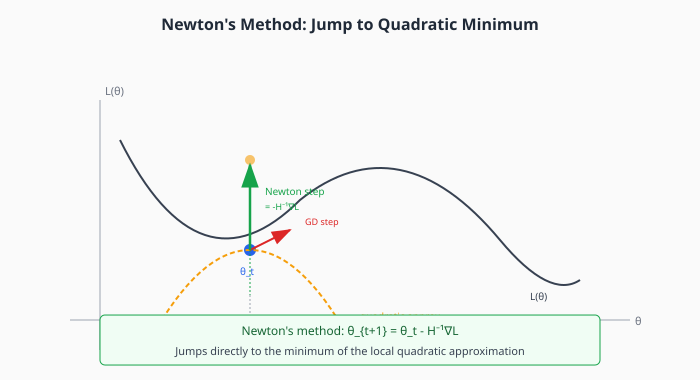
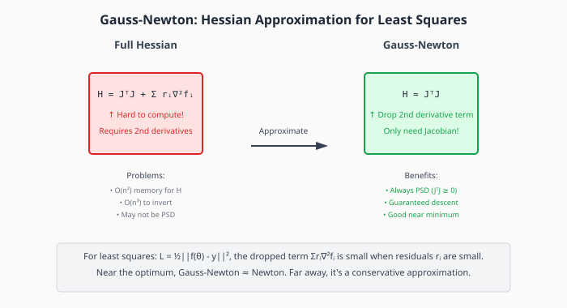
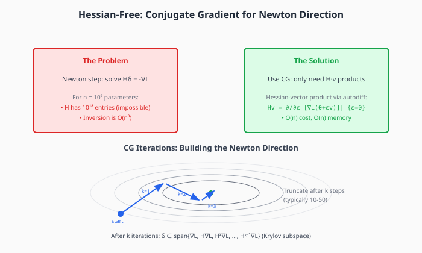
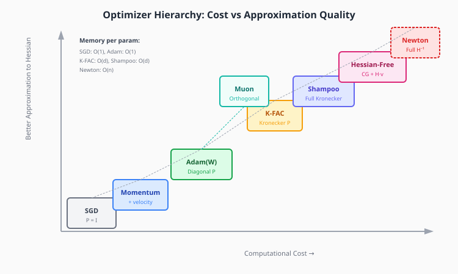

# Chapter 4: Second-Order Methods

Second-order methods use curvature information (the Hessian) to determine optimal step directions. While impractical in their pure form, understanding them is essential because all modern optimizers approximate second-order behavior.

## Table of Contents

1. [Newton's Method](#newtons-method)
2. [Why Newton's Method is Impractical](#why-newtons-method-is-impractical)
3. [Gauss-Newton Method](#gauss-newton-method)
4. [Levenberg-Marquardt](#levenberg-marquardt)
5. [Quasi-Newton Methods](#quasi-newton-methods)
6. [Hessian-Free Optimization](#hessian-free-optimization)
7. [The Computational Hierarchy](#the-computational-hierarchy)
8. [Implementation](#implementation)
9. [Exercises](#exercises)

---

## Newton's Method

Newton's method finds the minimum of a quadratic approximation to the loss function at each step.



### Derivation

Start with the second-order Taylor expansion:

```math
\large L(\theta + \delta) \approx L(\theta) + \nabla L^\top \delta + \frac{1}{2} \delta^\top H \delta
```

To find the minimum, set the gradient of this approximation to zero:

```math
\large \nabla_\delta \left[ L(\theta) + \nabla L^\top \delta + \frac{1}{2} \delta^\top H \delta \right] = \nabla L + H\delta = 0
```

Solving for $\delta$:

```math
\large \delta^* = -H^{-1} \nabla L
```

This gives the **Newton update**:

```math
\large \theta_{t+1} = \theta_t - H^{-1} \nabla L(\theta_t)
```

### Convergence Properties

**Quadratic convergence near optimum**: If we're close to a local minimum where $H$ is positive definite, the error squares each iteration:

```math
\large \|\theta_{t+1} - \theta^*\| \leq C \|\theta_t - \theta^*\|^2
```

For example, if the initial error is 0.1, after one step it's ~0.01, then ~0.0001, then ~10^{-8}. Convergence is extremely fast once we're close.

**For exact quadratics**: Newton converges in exactly one step!

### Newton's Method as Preconditioning

Newton's method can be viewed as gradient descent with optimal preconditioning:

```math
\large \theta_{t+1} = \theta_t - \underbrace{H^{-1}}_{\text{preconditioner}} \nabla L
```

The Hessian $H$ captures local curvature. Multiplying by $H^{-1}$ transforms the ill-conditioned elliptical contours into circular ones, making the gradient point directly at the minimum.

---

## Why Newton's Method is Impractical

For neural networks, Newton's method is computationally infeasible:

### Memory

The Hessian $H$ has $n^2$ elements where $n$ is the number of parameters:

| Model Size | Hessian Size | Memory (FP32) |
|-----------|-------------|---------------|
| 1M params | 10¹² elements | 4 TB |
| 100M params | 10¹⁶ elements | 40 PB |
| 7B params | 4.9×10¹⁹ elements | 200 EB |

Even for small networks, storing the full Hessian is impractical.

### Computation

Matrix inversion is $O(n^3)$:
- 1M params: 10¹⁸ operations
- 7B params: 3.4×10²⁹ operations

### Non-Positive-Definiteness

Near saddle points, $H$ has negative eigenvalues. $H^{-1}$ would amplify these directions, moving *toward* the saddle instead of away.

**All practical methods approximate or avoid these issues.**

---

## Gauss-Newton Method

For **least-squares problems**, we can approximate the Hessian more cheaply.



### Setup

Consider a least-squares loss:

```math
\large L(\theta) = \frac{1}{2} \|f(\theta) - y\|^2 = \frac{1}{2} \sum_i r_i^2(\theta)
```

where $r_i = f_i(\theta) - y_i$ are the residuals.

### The Full Hessian

The gradient is:

```math
\large \nabla L = J^\top r
```

where $J_{ij} = \partial f_i / \partial \theta_j$ is the Jacobian.

The Hessian is:

```math
\large H = J^\top J + \sum_i r_i \nabla^2 f_i
```

The second term requires second derivatives of $f$, which are expensive and may not even be positive definite.

### Gauss-Newton Approximation

**Drop the second-derivative term**:

```math
\large H \approx J^\top J
```

This approximation is:
- **Always positive semi-definite** (since $J^\top J \succeq 0$)
- **Cheap to compute** (only requires Jacobian)
- **Accurate near the optimum** (when residuals $r_i$ are small)

### Gauss-Newton Update

```math
\large \theta_{t+1} = \theta_t - (J^\top J)^{-1} J^\top r
```

This is equivalent to solving the linearized least-squares problem:

```math
\large \min_\delta \|J\delta + r\|^2
```

### When Gauss-Newton Equals Newton

For **linear** models $f(\theta) = X\theta$:
- Jacobian $J = X$
- Second derivatives $\nabla^2 f_i = 0$
- So $H = J^\top J$ exactly

For **neural networks**: Gauss-Newton is a conservative approximation that becomes accurate as training progresses and residuals shrink.

---

## Levenberg-Marquardt

Levenberg-Marquardt interpolates between Gauss-Newton and gradient descent.

### Algorithm

Add damping to the Gauss-Newton update:

```math
\large \theta_{t+1} = \theta_t - (J^\top J + \lambda I)^{-1} J^\top r
```

The damping parameter $\lambda$ controls the trade-off:
- $\lambda \to 0$: Newton/Gauss-Newton step (aggressive, for quadratic regions)
- $\lambda \to \infty$: Gradient descent step (conservative, for non-quadratic regions)

### Adaptive Damping

Adjust $\lambda$ based on step success:

```python
# After computing step:
if actual_reduction > 0.75 * predicted_reduction:
    lambda = lambda / 2  # Good step, be more aggressive
elif actual_reduction < 0.25 * predicted_reduction:
    lambda = lambda * 2  # Bad step, be more conservative
```

This creates a **trust region** that adapts to local curvature.

---

## Quasi-Newton Methods

Quasi-Newton methods build an approximation to $H$ (or $H^{-1}$) from gradient differences, without computing second derivatives.

### The Secant Equation

After taking a step from $\theta_k$ to $\theta_{k+1}$, we observe:
- Position difference: $s_k = \theta_{k+1} - \theta_k$
- Gradient difference: $y_k = \nabla L_{k+1} - \nabla L_k$

For a quadratic, these are related by: $y_k = H s_k$

We want our Hessian approximation $B_k$ to satisfy this **secant equation**:

```math
\large B_{k+1} s_k = y_k
```

### BFGS Update

The BFGS algorithm (Broyden-Fletcher-Goldfarb-Shanno) updates the inverse Hessian approximation:

```math
\large H_{k+1}^{-1} = \left(I - \rho_k s_k y_k^\top\right) H_k^{-1} \left(I - \rho_k y_k s_k^\top\right) + \rho_k s_k s_k^\top
```

where $\rho_k = 1/(y_k^\top s_k)$.

This is a rank-2 update that:
- Satisfies the secant equation
- Maintains positive definiteness (if started with PD matrix)
- Converges superlinearly (between linear and quadratic)

### L-BFGS: Limited Memory BFGS

Full BFGS stores $H^{-1}$, which is $O(n^2)$. L-BFGS stores only the last $m$ pairs $(s_k, y_k)$:

- Memory: $O(mn)$ instead of $O(n^2)$
- Computes $H^{-1} g$ implicitly using two-loop recursion
- Typical $m = 10-20$

### L-BFGS in Deep Learning

L-BFGS was popular before 2012 but lost to SGD variants because:
- **Stochastic gradients**: L-BFGS assumes exact gradients
- **Non-convexity**: The Hessian approximation can become inaccurate
- **Large batches required**: Need stable gradient estimates
- **Implicit regularization**: SGD noise helps generalization

Modern use: L-BFGS is still used for fine-tuning, RLHF reward modeling, or as a subroutine in larger algorithms.

---

## Hessian-Free Optimization

Hessian-Free (HF) optimization, also called **Truncated Newton**, was a major breakthrough around 2010-2012, showing that full Newton-like methods could work on deep networks.



### Core Idea: Never Form the Hessian

Newton's method requires solving $H\delta = -\nabla L$.

Key insight: We don't need $H$ explicitly—we only need to compute **Hessian-vector products** $Hv$.

### Hessian-Vector Products via Autodiff

For any vector $v$, we can compute $Hv$ using:

```math
\large Hv = \lim_{\epsilon \to 0} \frac{\nabla L(\theta + \epsilon v) - \nabla L(\theta)}{\epsilon}
```

Or equivalently, using the identity:

```math
\large Hv = \left.\frac{\partial}{\partial \epsilon}\right|_{\epsilon=0} \nabla L(\theta + \epsilon v)
```

This requires:
1. One forward pass (computing $L(\theta + \epsilon v)$)
2. One backward pass (computing the gradient)
3. One more backward pass through the gradient (computing $Hv$)

**Cost**: $O(n)$, same as computing the gradient.
**Memory**: $O(n)$, no $O(n^2)$ Hessian storage.

### Conjugate Gradient for Newton Direction

**Conjugate Gradient (CG)** is an iterative method for solving $Ax = b$ using only matrix-vector products $Av$.

To find the Newton direction, we run CG on $H\delta = -\nabla L$:

```python
def conjugate_gradient(H_vec_product, b, max_iters):
    """Solve Hx = b using conjugate gradient."""
    x = zeros_like(b)
    r = b.clone()  # residual
    p = r.clone()  # search direction

    for k in range(max_iters):
        Hp = H_vec_product(p)
        alpha = (r @ r) / (p @ Hp)
        x = x + alpha * p
        r_new = r - alpha * Hp

        if norm(r_new) < tolerance:
            break

        beta = (r_new @ r_new) / (r @ r)
        p = r_new + beta * p
        r = r_new

    return x
```

### Truncated CG

Running CG to full convergence would require $O(n)$ iterations. Instead, we **truncate** after $k$ iterations (typically 10-50).

After $k$ iterations, the solution lies in the **Krylov subspace**:

```math
\large \delta_k \in \text{span}\{\nabla L, H\nabla L, H^2\nabla L, \ldots, H^{k-1}\nabla L\}
```

Benefits of truncation:
- Limits computational cost
- Provides implicit regularization
- Avoids following negative curvature directions too far

### Damping

To handle non-positive-definite Hessians, add damping:

```math
\large (H + \lambda I)\delta = -\nabla L
```

The damping $\lambda$ ensures positive definiteness. CG naturally handles this.

### Historical Significance

Martens (2010) "Deep Learning via Hessian-Free Optimization":
- First to train deep networks with full second-order method
- Achieved state-of-the-art on speech recognition
- Used structural damping specific to neural networks

### Why It Lost to Adam

Despite theoretical elegance, HF lost in practice because:
- **Hyperparameter sensitivity**: CG iterations, damping schedule
- **High per-step cost**: Multiple forward/backward passes
- **Complexity**: More implementation effort than Adam
- **Adam's robustness**: "Just works" across many problems

However, the ideas live on in K-FAC and Shampoo, which approximate the same curvature information more efficiently.

---

## The Computational Hierarchy



All optimizers trade off approximation quality against computational cost:

| Method | Preconditioner | Memory | Per-Step Cost | Convergence |
|--------|---------------|--------|---------------|-------------|
| SGD | $P = I$ | $O(n)$ | $O(n)$ | $O(\kappa)$ |
| Momentum | $P = I$ + velocity | $O(n)$ | $O(n)$ | $O(\sqrt{\kappa})$ |
| Adam | $P = \text{diag}(\sqrt{v})$ | $O(n)$ | $O(n)$ | $O(\sqrt{\kappa})$ empirical |
| L-BFGS | Rank-$m$ approx | $O(mn)$ | $O(mn)$ | Superlinear |
| Hessian-Free | CG on $H$ | $O(n)$ | $O(kn)$ | ~Quadratic |
| K-FAC | Kronecker blocks | $O(\sum d_i^2)$ | $O(\sum d_i^3)$ | ~Quadratic |
| Shampoo | Full Kronecker | $O(\sum d_i^2)$ | $O(\sum d_i^3)$ | ~Quadratic |
| Newton | $P = H^{-1}$ | $O(n^2)$ | $O(n^3)$ | Quadratic |

Where $n$ is total parameters, $d_i$ is the dimension of layer $i$, $k$ is CG iterations, $m$ is L-BFGS memory.

---

## Implementation

```python
import torch
from typing import Callable, Optional


def hessian_vector_product(
    loss_fn: Callable,
    params: torch.Tensor,
    v: torch.Tensor
) -> torch.Tensor:
    """
    Compute Hessian-vector product Hv without forming H.

    Uses the identity: Hv = ∂/∂ε [∇L(θ + εv)]|_{ε=0}

    This is O(n) in computation and memory, same as computing gradient.

    Args:
        loss_fn: Function that takes params and returns scalar loss
        params: Current parameter values
        v: Vector to multiply with Hessian

    Returns:
        Hv: Hessian-vector product
    """
    params = params.detach().requires_grad_(True)

    # Compute gradient
    loss = loss_fn(params)
    grad = torch.autograd.grad(loss, params, create_graph=True)[0]

    # Compute Hv = (∂/∂params)(grad · v)
    grad_dot_v = torch.sum(grad * v)
    Hv = torch.autograd.grad(grad_dot_v, params)[0]

    return Hv


def conjugate_gradient(
    H_vec_product: Callable,
    b: torch.Tensor,
    max_iters: int = 50,
    tol: float = 1e-10,
    damping: float = 0.0
) -> torch.Tensor:
    """
    Solve (H + λI)x = b using conjugate gradient.

    This is the core of Hessian-Free optimization.

    Args:
        H_vec_product: Function computing Hv
        b: Right-hand side (-∇L for Newton direction)
        max_iters: Maximum CG iterations (truncation)
        tol: Convergence tolerance
        damping: Damping coefficient λ

    Returns:
        x: Approximate solution
    """
    x = torch.zeros_like(b)
    r = b.clone()  # residual = b - Hx, initially b since x=0
    p = r.clone()  # search direction
    rs_old = torch.dot(r, r)

    for i in range(max_iters):
        # Compute H @ p (with damping)
        Hp = H_vec_product(p)
        if damping > 0:
            Hp = Hp + damping * p

        pHp = torch.dot(p, Hp)

        # Check for negative curvature
        if pHp <= 0:
            # Stop early if we hit negative curvature
            if i == 0:
                return b  # Fall back to gradient
            return x

        alpha = rs_old / pHp
        x = x + alpha * p
        r = r - alpha * Hp

        rs_new = torch.dot(r, r)
        if torch.sqrt(rs_new) < tol:
            break

        beta = rs_new / rs_old
        p = r + beta * p
        rs_old = rs_new

    return x


class HessianFreeOptimizer:
    """
    Hessian-Free optimizer using truncated conjugate gradient.

    This implements the Martens (2010) approach:
    1. Compute gradient
    2. Use CG to approximately solve H @ delta = -gradient
    3. Take step in direction delta

    Historical note: This was state-of-the-art for deep learning
    circa 2010-2012, before Adam became dominant.
    """

    def __init__(
        self,
        params,
        lr: float = 1.0,
        cg_iters: int = 50,
        damping: float = 1.0
    ):
        self.params = list(params)
        self.lr = lr
        self.cg_iters = cg_iters
        self.damping = damping

    def step(self, loss_fn: Callable):
        """
        Perform one Hessian-Free optimization step.

        Args:
            loss_fn: Function that computes loss given current params
        """
        # Flatten all parameters
        flat_params = torch.cat([p.flatten() for p in self.params])
        flat_params = flat_params.detach().requires_grad_(True)

        def loss_from_flat(flat):
            # Unflatten and compute loss
            idx = 0
            for p in self.params:
                size = p.numel()
                p.data = flat[idx:idx+size].view(p.shape)
                idx += size
            return loss_fn()

        # Compute gradient
        loss = loss_from_flat(flat_params)
        grad = torch.autograd.grad(loss, flat_params, create_graph=True)[0]

        # Define H @ v operation
        def Hv(v):
            gv = torch.sum(grad * v)
            return torch.autograd.grad(gv, flat_params, retain_graph=True)[0]

        # Solve H @ delta = -grad using CG
        neg_grad = -grad.detach()
        delta = conjugate_gradient(
            Hv, neg_grad,
            max_iters=self.cg_iters,
            damping=self.damping
        )

        # Apply update
        flat_params = flat_params.detach() + self.lr * delta

        # Update actual parameters
        idx = 0
        for p in self.params:
            size = p.numel()
            p.data = flat_params[idx:idx+size].view(p.shape)
            idx += size


class NewtonOptimizer:
    """
    Pure Newton's method (for tiny problems only!).

    This computes and inverts the full Hessian, which is O(n³)
    and completely impractical for real neural networks.

    Included for educational purposes to demonstrate:
    1. What we're trying to approximate
    2. Quadratic convergence near optimum
    3. Why we need approximations
    """

    def __init__(self, params, lr: float = 1.0, damping: float = 0.0):
        self.params = list(params)
        self.lr = lr
        self.damping = damping

    def step(self, loss_fn: Callable):
        """Perform one Newton step (expensive!)."""
        # Flatten parameters
        flat = torch.cat([p.flatten() for p in self.params])
        n = flat.numel()
        flat = flat.detach().requires_grad_(True)

        # This is only feasible for n < ~1000
        if n > 1000:
            raise ValueError(f"Newton with {n} params is too expensive!")

        def loss_from_flat(f):
            idx = 0
            for p in self.params:
                size = p.numel()
                p.data = f[idx:idx+size].view(p.shape)
                idx += size
            return loss_fn()

        # Compute full Hessian
        loss = loss_from_flat(flat)
        grad = torch.autograd.grad(loss, flat, create_graph=True)[0]

        hessian = torch.zeros(n, n)
        for i in range(n):
            hess_row = torch.autograd.grad(
                grad[i], flat, retain_graph=True
            )[0]
            hessian[i] = hess_row

        # Add damping for numerical stability
        hessian = hessian + self.damping * torch.eye(n)

        # Newton step: delta = -H^{-1} @ grad
        delta = -torch.linalg.solve(hessian, grad.detach())

        # Apply update
        flat_new = flat.detach() + self.lr * delta
        idx = 0
        for p in self.params:
            size = p.numel()
            p.data = flat_new[idx:idx+size].view(p.shape)
            idx += size


# Demonstration
if __name__ == "__main__":
    torch.manual_seed(42)

    # Small problem where Newton is feasible
    n = 10
    H_true = torch.randn(n, n)
    H_true = H_true @ H_true.T + 0.1 * torch.eye(n)  # Make positive definite

    b = torch.randn(n)

    def quadratic_loss(theta):
        return 0.5 * theta @ H_true @ theta - b @ theta

    # Compare Newton vs CG approximation
    theta = torch.randn(n, requires_grad=True)

    # True Newton direction
    grad = H_true @ theta - b
    newton_dir = -torch.linalg.solve(H_true, grad)

    # CG approximation
    def Hv(v):
        return H_true @ v

    cg_dir = conjugate_gradient(Hv, -grad, max_iters=5)

    print(f"Newton direction norm: {newton_dir.norm():.4f}")
    print(f"CG (5 iters) direction norm: {cg_dir.norm():.4f}")
    print(f"Cosine similarity: {(newton_dir @ cg_dir) / (newton_dir.norm() * cg_dir.norm()):.4f}")
```

---

## Key Takeaways

1. **Newton's method** uses $\theta_{t+1} = \theta_t - H^{-1}\nabla L$ for quadratic convergence

2. **Newton is impractical** for neural networks: $O(n^2)$ memory, $O(n^3)$ computation

3. **Gauss-Newton** approximates $H \approx J^\top J$ for least-squares, avoiding second derivatives

4. **L-BFGS** builds Hessian approximations from gradient differences, using $O(mn)$ memory

5. **Hessian-Free** uses CG to solve $H\delta = -\nabla L$ with only $O(n)$ Hessian-vector products

6. **All practical optimizers approximate second-order behavior** at reduced cost

---

## Exercises

### Exercise 1: Newton on Quadratic

Implement Newton's method for a 2D quadratic. Verify it converges in exactly one step.

### Exercise 2: Gauss-Newton Derivation

For least-squares loss $L = \frac{1}{2}\|f(\theta) - y\|^2$, derive:
1. The gradient $\nabla L = J^\top r$
2. The full Hessian $H = J^\top J + \sum_i r_i \nabla^2 f_i$
3. Why dropping the second term gives a PSD approximation

### Exercise 3: Hessian-Vector Products

Implement Hessian-vector products using PyTorch autograd. Verify correctness by comparing to explicit Hessian computation on a small problem.

### Exercise 4: CG Iterations

Run CG on a 100×100 positive definite system. Plot the residual norm vs iteration count. How many iterations to reach machine precision?

### Exercise 5: L-BFGS vs Adam

Compare L-BFGS and Adam on logistic regression (convex, full-batch). Which converges faster in:
- Number of iterations?
- Wall-clock time?

### Exercise 6: Negative Curvature

Create a loss function with a saddle point. Show that undamped Newton moves toward the saddle, while damped Newton/CG avoids it.

### Exercise 7: Krylov Subspace

Implement CG and track which Krylov subspace vectors are used. Visualize how the solution improves as the subspace grows.

---

## Connections

- **Previous**: [Adaptive Methods](03-adaptive.md) — diagonal approximations to second-order
- **Next**: [Natural Gradient](05-natural-gradient.md) — second-order in distribution space
- **Chapter 6**: [K-FAC and Shampoo](06-practical-second-order.md) — practical second-order for deep learning
- **Chapter 7**: [Muon](07-muon.md) — a different approach using orthogonalization
