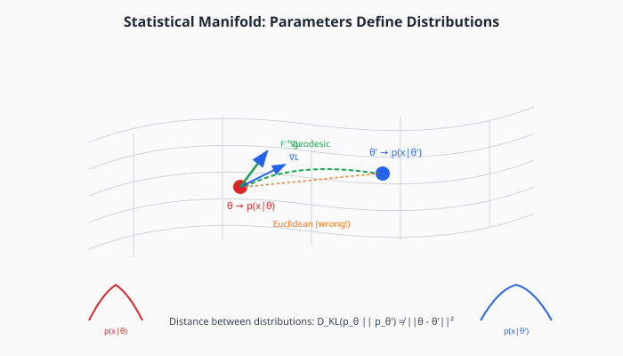
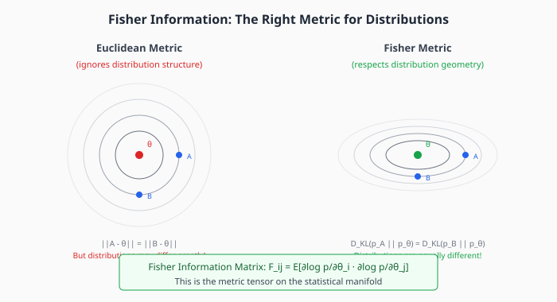
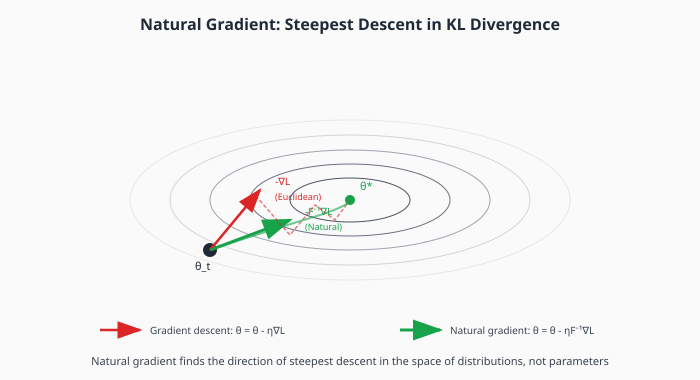

# Chapter 5: Natural Gradient and Information Geometry

Natural gradient descent recognizes that neural network parameters define probability distributions, and uses the geometry of distribution space rather than Euclidean geometry. This chapter provides the theoretical foundation for methods like K-FAC and Shampoo.

## Table of Contents

1. [The Fundamental Problem](#the-fundamental-problem)
2. [Statistical Manifolds](#statistical-manifolds)
3. [KL Divergence as Distance](#kl-divergence-as-distance)
4. [Fisher Information Matrix](#fisher-information-matrix)
5. [Natural Gradient](#natural-gradient)
6. [Fisher Equals Expected Hessian](#fisher-equals-expected-hessian)
7. [Why Natural Gradient is Better](#why-natural-gradient-is-better)
8. [The Computational Barrier](#the-computational-barrier)
9. [Implementation](#implementation)
10. [Exercises](#exercises)

---

## The Fundamental Problem

Neural network parameters $\theta$ live in $\mathbb{R}^n$, but we don't actually care about the parameters themselves—we care about the **functions** they represent.



**The issue**: A small change in $\theta$ can cause a large change in the output distribution, and vice versa. Euclidean distance $\|\theta - \theta'\|$ doesn't reflect how different the predictions are.

**Example**: For a softmax classifier:
- Changing weights by 0.01 might barely affect predictions
- Or it might flip the most likely class entirely
- The effect depends on the current values, not just the change magnitude

We need a metric that captures "how different are the predictions?" not "how far apart are the parameters?"

---

## Statistical Manifolds

A neural network with parameters $\theta$ defines a probability distribution $p(y|x, \theta)$ over outputs given inputs.

### The Manifold View

As $\theta$ varies over $\mathbb{R}^n$, we trace out a **manifold** of probability distributions:

$$\mathcal{M} = \{p_\theta : \theta \in \Theta\}$$

This is the **statistical manifold** or **model manifold**.

### Key Insight

Different parameterizations of the same family of distributions should give equivalent optimization. If we reparameterize $\theta \to \phi(\theta)$, the optimization trajectory through distribution space should be the same.

**Euclidean gradient descent is not invariant to reparameterization.** Natural gradient is.

---

## KL Divergence as Distance

The natural way to measure distance between probability distributions is **KL divergence**:

```math
\large D_{KL}(p \| q) = \mathbb{E}_{p}\left[\log \frac{p(x)}{q(x)}\right] = \int p(x) \log \frac{p(x)}{q(x)} dx
```

### Properties

- $D_{KL}(p \| q) \geq 0$ with equality iff $p = q$
- Not symmetric: $D_{KL}(p \| q) \neq D_{KL}(q \| p)$
- Not a true metric (no triangle inequality), but good enough locally

### Local Behavior

For nearby distributions $p_\theta$ and $p_{\theta + \delta}$, Taylor expansion gives:

```math
\large D_{KL}(p_\theta \| p_{\theta + \delta}) \approx \frac{1}{2} \delta^\top F(\theta) \delta
```

where $F(\theta)$ is the **Fisher Information Matrix**.

This is the key result: **KL divergence is locally quadratic, with the Fisher matrix as the metric tensor.**

---

## Fisher Information Matrix



### Definition

The Fisher Information Matrix is:

```math
\large F_{ij}(\theta) = \mathbb{E}_{p(x|\theta)}\left[\frac{\partial \log p(x|\theta)}{\partial \theta_i} \cdot \frac{\partial \log p(x|\theta)}{\partial \theta_j}\right]
```

Or in matrix form:

```math
\large F(\theta) = \mathbb{E}\left[\nabla \log p \cdot (\nabla \log p)^\top\right]
```

### Interpretation

$F(\theta)$ measures **how much information about $\theta$ is contained in observations from $p_\theta$**:

- Large $F_{ii}$: Small changes in $\theta_i$ cause large changes in the distribution (high information)
- Small $F_{ii}$: The distribution is insensitive to $\theta_i$ (low information)

### As a Metric Tensor

$F(\theta)$ is the **Riemannian metric tensor** on the statistical manifold:

- It defines the inner product on the tangent space at $\theta$
- Lengths and angles are measured using $F$, not the identity matrix
- Different points on the manifold may have different metrics (the manifold is curved)

### Properties

1. **Positive semi-definite**: $F \succeq 0$ always
2. **Symmetric**: $F_{ij} = F_{ji}$
3. **Depends on $\theta$**: The metric changes as we move through parameter space
4. **Invariant under sufficient statistics**: $F$ is uniquely determined (up to scaling) by requiring invariance

---

## Natural Gradient

### Steepest Descent in KL Divergence

We want to minimize loss $L(\theta)$ while controlling how much the distribution changes.

**Euclidean steepest descent**: Find direction $\delta$ minimizing $L(\theta + \delta)$ subject to $\|\delta\|_2^2 \leq \epsilon^2$

**Natural steepest descent**: Find direction $\delta$ minimizing $L(\theta + \delta)$ subject to $D_{KL}(p_\theta \| p_{\theta+\delta}) \leq \epsilon^2$

Using the local approximation $D_{KL} \approx \frac{1}{2}\delta^\top F \delta$:

```math
\large \min_\delta \left\{ \nabla L^\top \delta \right\} \quad \text{s.t.} \quad \delta^\top F \delta \leq \epsilon^2
```

### Derivation

Using Lagrange multipliers:

$$\mathcal{L}(\delta, \lambda) = \nabla L^\top \delta + \lambda (\delta^\top F \delta - \epsilon^2)$$

Taking gradients and setting to zero:

$$\nabla L + 2\lambda F \delta = 0 \implies \delta = -\frac{1}{2\lambda} F^{-1} \nabla L$$

The natural gradient is:

```math
\large \tilde{\nabla} L = F^{-1} \nabla L
```

### Natural Gradient Update



```math
\large \theta_{t+1} = \theta_t - \eta F^{-1}(\theta_t) \nabla L(\theta_t)
```

This is the direction of steepest descent **in KL divergence**, not Euclidean distance.

---

## Fisher Equals Expected Hessian

For log-likelihood objectives $L = -\log p(y|x, \theta)$, there's a beautiful connection:

```math
\large F = \mathbb{E}[-\nabla^2 \log p] = \mathbb{E}[H]
```

**The Fisher information is the expected Hessian!**

### Derivation

The Hessian of log-likelihood is:

$$H_{ij} = -\frac{\partial^2 \log p}{\partial \theta_i \partial \theta_j}$$

Taking expectations and using the identity $\mathbb{E}[\nabla \log p] = 0$:

$$\mathbb{E}[H_{ij}] = -\mathbb{E}\left[\frac{\partial^2 \log p}{\partial \theta_i \partial \theta_j}\right] = \mathbb{E}\left[\frac{\partial \log p}{\partial \theta_i} \cdot \frac{\partial \log p}{\partial \theta_j}\right] = F_{ij}$$

### Implications

1. **Natural gradient ≈ Newton's method** for maximum likelihood
2. $F$ is an expectation (smoother than $H$ for any single sample)
3. $F$ is always PSD, while $H$ might not be (near saddle points)

---

## Why Natural Gradient is Better

### 1. Parameterization Invariance

Consider reparameterizing $\theta \to \phi = g(\theta)$:

**Euclidean gradient** in $\phi$-space is different from the transformed $\theta$-gradient. The optimization path changes.

**Natural gradient** gives the same path through distribution space, regardless of parameterization. This is a fundamental principle: optimization shouldn't depend on arbitrary choices of coordinates.

### 2. Optimal Conditioning

The natural gradient preconditions by the Fisher matrix, which captures the local geometry. This automatically handles:
- Parameters with different sensitivities
- Correlations between parameters
- Curvature that changes during training

### 3. Faster Convergence

Empirically, natural gradient methods converge 10-100× faster on some problems, using far fewer iterations to reach the same loss.

### 4. Connection to Bayesian Inference

For probabilistic models, natural gradient is the "correct" way to do gradient descent. It arises naturally from:
- Maximum likelihood estimation
- Variational inference
- Policy gradient in reinforcement learning (TRPO, PPO)

---

## The Computational Barrier

Despite its elegance, natural gradient has a fatal flaw for deep learning:

### Memory

$F$ is an $n \times n$ matrix. For $n = 10^9$ parameters:
- $10^{18}$ elements
- 4 exabytes in FP32

### Computation

Even if we could store $F$:
- Computing $F$ requires expectations over data
- Inverting $F$ is $O(n^3)$
- Must update $F$ as $\theta$ changes

### Solutions

We can't compute $F^{-1}$ exactly, but we can **approximate**:

| Approximation | Method | Memory | Quality |
|--------------|--------|--------|---------|
| Diagonal | Adam (roughly) | $O(n)$ | Low |
| Block-diagonal | K-FAC | $O(\sum d_i^2)$ | Medium |
| Kronecker | Shampoo | $O(\sum d_i^2)$ | High |
| Low-rank | Natural gradient VI | $O(nr)$ | Medium |

These are covered in Chapter 6.

---

## Implementation

```python
import torch
import torch.nn as nn
from typing import Callable


def compute_fisher_matrix(
    model: nn.Module,
    loss_fn: Callable,
    data_loader,
    num_samples: int = 100
) -> torch.Tensor:
    """
    Compute the empirical Fisher information matrix.

    WARNING: This is O(n²) in memory and O(n²) per sample—completely
    impractical for real neural networks. Shown for educational purposes.

    The Fisher matrix is:
        F = E[∇log p · (∇log p)ᵀ]

    We approximate the expectation with samples.

    Args:
        model: Neural network model
        loss_fn: Negative log-likelihood loss
        data_loader: Data iterator
        num_samples: Number of samples for expectation

    Returns:
        F: Fisher matrix of shape (n_params, n_params)
    """
    # Flatten all parameters
    params = [p for p in model.parameters() if p.requires_grad]
    n = sum(p.numel() for p in params)

    if n > 5000:
        raise ValueError(f"Fisher matrix with {n} params would be {n**2} elements!")

    F = torch.zeros(n, n)

    count = 0
    for x, y in data_loader:
        if count >= num_samples:
            break

        # Forward pass
        model.zero_grad()
        output = model(x)
        loss = loss_fn(output, y)
        loss.backward()

        # Flatten gradients
        grad = torch.cat([p.grad.flatten() for p in params])

        # Outer product: F += grad · gradᵀ
        F += torch.outer(grad, grad)

        count += 1

    F /= count
    return F


def natural_gradient_step(
    model: nn.Module,
    loss_fn: Callable,
    x: torch.Tensor,
    y: torch.Tensor,
    F_inv: torch.Tensor,
    lr: float = 0.01
):
    """
    Perform one natural gradient step.

    Natural gradient: θ = θ - η F⁻¹ ∇L

    Args:
        model: Neural network
        loss_fn: Loss function
        x, y: Data batch
        F_inv: Precomputed inverse Fisher matrix
        lr: Learning rate
    """
    params = [p for p in model.parameters() if p.requires_grad]

    # Compute gradient
    model.zero_grad()
    output = model(x)
    loss = loss_fn(output, y)
    loss.backward()

    # Flatten gradients
    grad = torch.cat([p.grad.flatten() for p in params])

    # Natural gradient: F⁻¹ ∇L
    nat_grad = F_inv @ grad

    # Apply update
    idx = 0
    for p in params:
        size = p.numel()
        p.data -= lr * nat_grad[idx:idx + size].view(p.shape)
        idx += size


class DiagonalFisherOptimizer:
    """
    Natural gradient with diagonal Fisher approximation.

    This is essentially Adam without the momentum component,
    using empirical Fisher = E[g²] ≈ diag(F).

    The diagonal approximation ignores correlations between
    parameters but is O(n) in memory and computation.
    """

    def __init__(
        self,
        params,
        lr: float = 0.01,
        beta: float = 0.99,
        eps: float = 1e-8
    ):
        self.params = list(params)
        self.lr = lr
        self.beta = beta
        self.eps = eps

        # Diagonal Fisher estimate: E[g²]
        self.fisher_diag = [torch.zeros_like(p) for p in self.params]

    def step(self):
        """Perform one diagonal natural gradient step."""
        for i, p in enumerate(self.params):
            if p.grad is None:
                continue

            g = p.grad

            # Update diagonal Fisher estimate: F ≈ E[g²]
            self.fisher_diag[i] = (
                self.beta * self.fisher_diag[i] +
                (1 - self.beta) * g ** 2
            )

            # Natural gradient: F⁻¹ g ≈ g / sqrt(F_diag)
            nat_grad = g / (torch.sqrt(self.fisher_diag[i]) + self.eps)

            # Update
            p.data -= self.lr * nat_grad

    def zero_grad(self):
        for p in self.params:
            if p.grad is not None:
                p.grad.zero_()


# Demonstration: Compare gradient descent vs natural gradient
if __name__ == "__main__":
    torch.manual_seed(42)

    # Simple 2D problem where Fisher differs from identity
    # Logistic regression: p(y=1|x) = σ(θᵀx)
    # Fisher for logistic: F = E[x xᵀ σ(1-σ)]

    # Data with different scales in each dimension
    X = torch.randn(100, 2) * torch.tensor([1.0, 10.0])
    y = (X[:, 0] + X[:, 1] > 0).float()

    def logistic_loss(theta):
        logits = X @ theta
        return nn.functional.binary_cross_entropy_with_logits(logits, y)

    # Gradient descent
    theta_gd = torch.randn(2, requires_grad=True)
    gd_losses = []

    for _ in range(100):
        loss = logistic_loss(theta_gd)
        gd_losses.append(loss.item())
        loss.backward()
        with torch.no_grad():
            theta_gd -= 0.01 * theta_gd.grad
        theta_gd.grad.zero_()

    # Natural gradient (with empirical Fisher)
    theta_ng = torch.randn(2, requires_grad=True)
    ng_losses = []

    for _ in range(100):
        loss = logistic_loss(theta_ng)
        ng_losses.append(loss.item())
        loss.backward()

        # Compute Fisher for this batch
        with torch.no_grad():
            # For logistic regression: F = E[x xᵀ p(1-p)]
            p = torch.sigmoid(X @ theta_ng)
            weights = p * (1 - p)
            F = (X.T * weights) @ X / len(X)
            F += 0.01 * torch.eye(2)  # Damping

            # Natural gradient
            nat_grad = torch.linalg.solve(F, theta_ng.grad)
            theta_ng -= 0.1 * nat_grad

        theta_ng.grad.zero_()

    print(f"Final loss - GD: {gd_losses[-1]:.4f}, Natural Gradient: {ng_losses[-1]:.4f}")
```

---

## Key Takeaways

1. **Parameters define distributions**, not just numbers. We should optimize in distribution space.

2. **Fisher Information Matrix** $F = \mathbb{E}[\nabla \log p \cdot (\nabla \log p)^\top]$ is the natural metric.

3. **Natural gradient** $\tilde{\nabla}L = F^{-1}\nabla L$ is steepest descent in KL divergence.

4. **Fisher = Expected Hessian** for log-likelihood, connecting natural gradient to Newton's method.

5. **Parameterization invariance**: Natural gradient gives the same path regardless of how we parameterize $\theta$.

6. **Computational barrier**: Full Fisher is $O(n^2)$, requiring approximations in practice.

---

## Exercises

### Exercise 1: Fisher for Logistic Regression

For logistic regression $p(y=1|x) = \sigma(\theta^\top x)$:
1. Derive the Fisher information matrix $F = \mathbb{E}[xx^\top p(1-p)]$
2. Show that $F$ is PSD
3. How does $F$ change as $\theta$ approaches a solution where $p \approx 0$ or $1$?

### Exercise 2: Invariance Under Reparameterization

Let $\phi = A\theta$ for invertible $A$.
1. Show that the Euclidean gradient transforms as $\nabla_\phi L = A^{-\top} \nabla_\theta L$
2. Show that the Fisher transforms as $F_\phi = A^{-\top} F_\theta A^{-1}$
3. Verify that $F_\phi^{-1} \nabla_\phi L = A F_\theta^{-1} \nabla_\theta L$ (the natural gradient transforms correctly)

### Exercise 3: Fisher = Expected Hessian

Prove that for $L = -\log p(y|x, \theta)$:
$$\mathbb{E}\left[-\frac{\partial^2 \log p}{\partial \theta_i \partial \theta_j}\right] = \mathbb{E}\left[\frac{\partial \log p}{\partial \theta_i} \cdot \frac{\partial \log p}{\partial \theta_j}\right]$$

Hint: Use the identity $\mathbb{E}[\nabla \log p] = 0$.

### Exercise 4: Implement Natural Gradient

Implement natural gradient on a 2-layer MLP (small enough to compute full Fisher). Compare convergence to vanilla gradient descent.

### Exercise 5: Gaussian Fisher

For a Gaussian $p(x|\mu, \sigma^2) = \mathcal{N}(\mu, \sigma^2)$:
1. Compute the Fisher matrix (2×2)
2. Show that the natural gradient in $\sigma$ differs from the Euclidean gradient
3. Interpret why: what does "equal KL distance" mean for variance changes?

---

## Connections

- **Previous**: [Second-Order Methods](04-second-order.md) — Newton's method, which natural gradient generalizes
- **Next**: [K-FAC and Shampoo](06-practical-second-order.md) — practical approximations to Fisher
- **Chapter 7**: [Muon](07-muon.md) — a different geometry (operator norm, not Fisher)
- **Related**: TRPO/PPO in RL use Fisher-based trust regions
