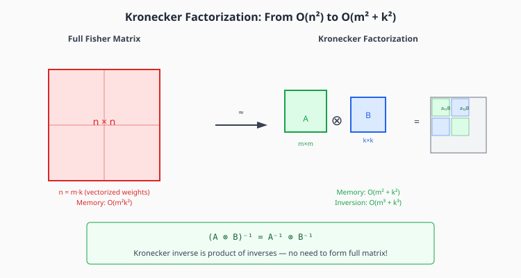

# Chapter 6: Practical Second-Order Methods

This chapter covers K-FAC, Shampoo, and SOAP—practical approximations to natural gradient that are feasible for large-scale training.

## Table of Contents

1. [The Approximation Hierarchy](#the-approximation-hierarchy)
2. [K-FAC: Kronecker-Factored Approximate Curvature](#k-fac)
3. [Shampoo](#shampoo)
4. [SOAP: Shampoo + Adam](#soap)
5. [Distributed Shampoo](#distributed-shampoo)
6. [Benchmark Results](#benchmark-results)
7. [When to Use What](#when-to-use-what)
8. [Implementation](#implementation)
9. [Exercises](#exercises)

---

## The Approximation Hierarchy

All practical second-order methods approximate the Fisher/Hessian with increasing fidelity:



| Method | Approximation | Memory | Per-Step | Captures |
|--------|--------------|--------|----------|----------|
| Adam | Diagonal | $O(n)$ | $O(n)$ | Per-param variance |
| K-FAC | Block Kronecker | $O(\sum d_i^2)$ | $O(\sum d_i^3)$ | Layer correlations |
| Shampoo | Full Kronecker | $O(\sum d_i^2)$ | $O(\sum d_i^3)$ | Row/col correlations |
| Full Newton | Exact | $O(n^2)$ | $O(n^3)$ | Everything |

The key insight: **Kronecker structure** allows efficient inversion.

---

## K-FAC

**Kronecker-Factored Approximate Curvature** (Martens & Grosse, 2015) approximates the Fisher using the structure of neural network layers.

### Setup

For a linear layer $y = Wx + b$ with gradient $g = \nabla_y L$:
- Weight gradient: $\nabla_W L = g \cdot x^\top$
- The Fisher block for this layer involves $\mathbb{E}[(\nabla_W L)(\nabla_W L)^\top]$

Vectorizing: $\text{vec}(\nabla_W L) = x \otimes g$

### The Kronecker Approximation

The layer's Fisher block is:

$$F_W = \mathbb{E}[(x \otimes g)(x \otimes g)^\top] = \mathbb{E}[xx^\top] \otimes \mathbb{E}[gg^\top]$$

This factorization assumes **independence between activations and gradients**:

$$F_W \approx A \otimes G$$

where:
- $A = \mathbb{E}[xx^\top]$ — covariance of layer inputs (size $d_{in} \times d_{in}$)
- $G = \mathbb{E}[gg^\top]$ — covariance of backprop gradients (size $d_{out} \times d_{out}$)

### Why Kronecker Structure Helps

**Memory**: Store $A$ and $G$ separately: $O(d_{in}^2 + d_{out}^2)$ instead of $O(d_{in}^2 d_{out}^2)$

**Inversion**: Use the identity $(A \otimes G)^{-1} = A^{-1} \otimes G^{-1}$

Inverting two small matrices is much cheaper than one huge matrix:
- Full: $O((d_{in} \cdot d_{out})^3)$
- Kronecker: $O(d_{in}^3 + d_{out}^3)$

### K-FAC Update

1. **Accumulate statistics** (running average):
   $$A_t = \beta A_{t-1} + (1-\beta) x x^\top$$
   $$G_t = \beta G_{t-1} + (1-\beta) g g^\top$$

2. **Invert periodically** (every 10-100 steps):
   $$A^{-1}, G^{-1} = \text{inverse}(A + \lambda I), \text{inverse}(G + \mu I)$$

3. **Precondition gradient**:
   $$\Delta W = A^{-1} \nabla_W L \cdot G^{-1}$$

4. **Update weights**: $W \leftarrow W - \eta \Delta W$

### Damping

The damping terms $\lambda, \mu$ are critical:
- Ensure $A$ and $G$ are invertible
- Control step size (trust region)
- Often set as: $\lambda = \mu = \sqrt{\text{global_damping}}$

---

## Shampoo

**Shampoo** (Gupta et al., 2018) uses a different Kronecker factorization that doesn't require the independence assumption.

### Key Difference from K-FAC

K-FAC approximates the Fisher $F \approx A \otimes G$.

Shampoo directly preconditions the gradient using **left and right factors**:

$$\Delta W = L^{-1/p} \nabla_W L \cdot R^{-1/p}$$

where:
- $L = \mathbb{E}[\nabla_W L \cdot (\nabla_W L)^\top]$ — left preconditioner ($d_{out} \times d_{out}$)
- $R = \mathbb{E}[(\nabla_W L)^\top \cdot \nabla_W L]$ — right preconditioner ($d_{in} \times d_{in}$)
- $p = 4$ (fourth root, not square root)

### Why Fourth Root?

The $p=4$ (fourth root) comes from tensor optimization theory:
- $p=2$ (square root) is too aggressive, can destabilize
- $p=4$ provides better conditioning while being more conservative
- Empirically works better across many settings

### Computing Matrix Roots

The fourth root $L^{-1/4}$ is computed via eigendecomposition:

$$L = V \Lambda V^\top \implies L^{-1/4} = V \Lambda^{-1/4} V^\top$$

This eigendecomposition is $O(d^3)$ and is done **infrequently** (every 100-1000 steps) to amortize cost.

### Shampoo Algorithm

```python
# Every step:
L = beta * L + (1 - beta) * (grad @ grad.T)
R = beta * R + (1 - beta) * (grad.T @ grad)

# Every T steps (e.g., T=100):
L_inv_root = matrix_power(L + eps*I, -1/4)
R_inv_root = matrix_power(R + eps*I, -1/4)

# Preconditioned update:
preconditioned_grad = L_inv_root @ grad @ R_inv_root
weights -= lr * preconditioned_grad
```

---

## SOAP: Shampoo + Adam

**SOAP** (Vyas et al., 2024) combines Shampoo's preconditioning with Adam's adaptive learning rates.

### Key Insight

Shampoo finds a good coordinate system (the eigenbasis of $L$ and $R$). SOAP runs **Adam in this rotated space**.

### Algorithm

1. Compute Shampoo's $L^{-1/2}$ and $R^{-1/2}$ (square root, not fourth root)
2. Rotate gradient: $\tilde{g} = L^{-1/2} \nabla W \cdot R^{-1/2}$
3. Run Adam on $\tilde{g}$: maintain $m$ and $v$ in rotated space
4. Rotate back: $\Delta W = L^{-1/2} \tilde{\Delta W} \cdot R^{-1/2}$

### Benefits

- More stable than pure Shampoo
- Better per-coordinate adaptation
- Handles dimensions that Shampoo's factors miss

---

## Distributed Shampoo

For large models, the preconditioners $L$ and $R$ can themselves be large.

### Challenge

For a layer with $d_{out} = 4096$ and $d_{in} = 4096$:
- $L$ is $4096 \times 4096$ = 67M elements = 268 MB
- Per layer, repeated across many layers

### Solution: Sharded Preconditioners

1. **Partition** $L$ and $R$ across GPUs
2. **Distribute** the eigendecomposition computation
3. **All-gather** results for the update step

This is implemented in libraries like Optax (JAX) and allows scaling Shampoo to large models.

---

## Benchmark Results

### AlgoPerf (MLCommons)

On the standardized AlgoPerf benchmark:
- **Shampoo: 28% faster wall-clock time** than AdamW
- Despite higher per-step cost, fewer steps needed

### Practical Observations

- Shampoo shines with **large batch sizes** (amortizes eigendecomposition)
- **Long training runs** benefit most (more steps to amortize setup)
- **Memory overhead** can be significant for very wide layers

---

## When to Use What

| Scenario | Recommended |
|----------|-------------|
| Quick experiments | Adam/AdamW (simplicity) |
| Memory constrained | Adam/AdamW |
| Large batch, long training | Shampoo |
| RL / online learning | K-FAC |
| Very large models | Distributed Shampoo or AdamW |
| 2D weight matrices, fast convergence | Muon (next chapter) |

---

## Implementation

```python
import torch
import torch.nn as nn
from typing import List, Dict


def matrix_power(M: torch.Tensor, p: float, eps: float = 1e-6) -> torch.Tensor:
    """
    Compute M^p via eigendecomposition.

    For p = -1/4, this gives the inverse fourth root used in Shampoo.

    Args:
        M: Symmetric positive definite matrix
        p: Power to raise eigenvalues to
        eps: Regularization for numerical stability

    Returns:
        M^p
    """
    # Eigendecomposition
    eigenvalues, eigenvectors = torch.linalg.eigh(M)

    # Clamp for numerical stability
    eigenvalues = torch.clamp(eigenvalues, min=eps)

    # Raise to power
    eigenvalues_p = eigenvalues ** p

    # Reconstruct: M^p = V @ diag(λ^p) @ V^T
    return eigenvectors @ torch.diag(eigenvalues_p) @ eigenvectors.T


class KFACOptimizer:
    """
    K-FAC optimizer for neural networks.

    Maintains Kronecker-factored approximation to the Fisher:
        F ≈ A ⊗ G

    where A = E[xx^T] (input covariance) and G = E[gg^T] (gradient covariance).

    This provides second-order-like updates at first-order cost.
    """

    def __init__(
        self,
        model: nn.Module,
        lr: float = 0.01,
        damping: float = 0.01,
        beta: float = 0.99,
        update_freq: int = 10
    ):
        self.model = model
        self.lr = lr
        self.damping = damping
        self.beta = beta
        self.update_freq = update_freq
        self.step_count = 0

        # Storage for factors
        self.A = {}  # Input covariances
        self.G = {}  # Gradient covariances
        self.A_inv = {}  # Cached inverses
        self.G_inv = {}

        # Register hooks to capture activations
        self._register_hooks()

    def _register_hooks(self):
        """Register forward hooks to capture layer inputs."""
        self.activations = {}

        def save_activation(name):
            def hook(module, input, output):
                self.activations[name] = input[0].detach()
            return hook

        for name, module in self.model.named_modules():
            if isinstance(module, nn.Linear):
                module.register_forward_hook(save_activation(name))

    def step(self):
        """Perform one K-FAC step."""
        self.step_count += 1

        for name, module in self.model.named_modules():
            if not isinstance(module, nn.Linear):
                continue
            if module.weight.grad is None:
                continue

            # Get activation and gradient
            a = self.activations.get(name)
            if a is None:
                continue

            g = module.weight.grad  # d_out x d_in

            # Update A (input covariance)
            # A = E[aa^T], but we use batch average
            a_flat = a.view(-1, a.shape[-1])  # batch*seq x d_in
            A_batch = (a_flat.T @ a_flat) / a_flat.shape[0]

            if name not in self.A:
                self.A[name] = A_batch
            else:
                self.A[name] = self.beta * self.A[name] + (1 - self.beta) * A_batch

            # Update G (gradient covariance)
            # Approximate: use weight gradient outer product
            G_batch = g @ g.T  # d_out x d_out

            if name not in self.G:
                self.G[name] = G_batch
            else:
                self.G[name] = self.beta * self.G[name] + (1 - self.beta) * G_batch

            # Periodically update inverses
            if self.step_count % self.update_freq == 0:
                A_damped = self.A[name] + self.damping * torch.eye(
                    self.A[name].shape[0], device=self.A[name].device
                )
                G_damped = self.G[name] + self.damping * torch.eye(
                    self.G[name].shape[0], device=self.G[name].device
                )

                self.A_inv[name] = torch.linalg.inv(A_damped)
                self.G_inv[name] = torch.linalg.inv(G_damped)

            # Apply preconditioned update
            if name in self.A_inv and name in self.G_inv:
                # Preconditioned gradient: G^{-1} @ grad @ A^{-1}
                precond_grad = self.G_inv[name] @ g @ self.A_inv[name]
                module.weight.data -= self.lr * precond_grad

    def zero_grad(self):
        self.model.zero_grad()


class ShampooOptimizer:
    """
    Shampoo optimizer.

    Uses left and right preconditioners:
        ΔW = L^{-1/4} @ ∇W @ R^{-1/4}

    where L = E[∇W @ ∇W^T] and R = E[∇W^T @ ∇W].

    Benefits:
    - 28% faster wall-clock time than Adam (AlgoPerf)
    - Better conditioning of optimization landscape
    """

    def __init__(
        self,
        params,
        lr: float = 0.01,
        beta: float = 0.9,
        epsilon: float = 1e-12,
        update_freq: int = 100,
        root_power: float = 4  # Use 4th root
    ):
        self.params = list(params)
        self.lr = lr
        self.beta = beta
        self.epsilon = epsilon
        self.update_freq = update_freq
        self.root_power = root_power
        self.step_count = 0

        # Preconditioners for each 2D parameter
        self.L = {}  # Left: grad @ grad.T
        self.R = {}  # Right: grad.T @ grad
        self.L_inv_root = {}  # Cached L^{-1/p}
        self.R_inv_root = {}  # Cached R^{-1/p}

    def step(self):
        self.step_count += 1

        for i, p in enumerate(self.params):
            if p.grad is None:
                continue

            g = p.grad

            # Only apply Shampoo to 2D params
            if g.ndim != 2:
                # Fall back to SGD for 1D params
                p.data -= self.lr * g
                continue

            # Update L and R
            L_batch = g @ g.T
            R_batch = g.T @ g

            if i not in self.L:
                self.L[i] = L_batch
                self.R[i] = R_batch
            else:
                self.L[i] = self.beta * self.L[i] + (1 - self.beta) * L_batch
                self.R[i] = self.beta * self.R[i] + (1 - self.beta) * R_batch

            # Periodically update inverse roots
            if self.step_count % self.update_freq == 0:
                self.L_inv_root[i] = matrix_power(
                    self.L[i] + self.epsilon * torch.eye(
                        self.L[i].shape[0], device=g.device
                    ),
                    -1.0 / self.root_power
                )
                self.R_inv_root[i] = matrix_power(
                    self.R[i] + self.epsilon * torch.eye(
                        self.R[i].shape[0], device=g.device
                    ),
                    -1.0 / self.root_power
                )

            # Apply preconditioned update
            if i in self.L_inv_root and i in self.R_inv_root:
                precond_grad = self.L_inv_root[i] @ g @ self.R_inv_root[i]
                p.data -= self.lr * precond_grad
            else:
                # Before first eigendecomposition, use raw gradient
                p.data -= self.lr * g

    def zero_grad(self):
        for p in self.params:
            if p.grad is not None:
                p.grad.zero_()


# Demonstration
if __name__ == "__main__":
    torch.manual_seed(42)

    # Create a simple model
    model = nn.Sequential(
        nn.Linear(100, 50),
        nn.ReLU(),
        nn.Linear(50, 10)
    )

    # Random data
    X = torch.randn(32, 100)
    y = torch.randint(0, 10, (32,))

    # Compare optimizers
    for opt_name in ['Adam', 'Shampoo']:
        model_copy = nn.Sequential(
            nn.Linear(100, 50),
            nn.ReLU(),
            nn.Linear(50, 10)
        )

        if opt_name == 'Adam':
            optimizer = torch.optim.Adam(model_copy.parameters(), lr=0.01)
        else:
            optimizer = ShampooOptimizer(model_copy.parameters(), lr=0.01)

        losses = []
        for step in range(100):
            if hasattr(optimizer, 'zero_grad'):
                optimizer.zero_grad()
            else:
                model_copy.zero_grad()

            output = model_copy(X)
            loss = nn.functional.cross_entropy(output, y)
            loss.backward()
            optimizer.step()
            losses.append(loss.item())

        print(f"{opt_name}: Final loss = {losses[-1]:.4f}")
```

---

## Key Takeaways

1. **Kronecker factorization** reduces $O(n^2)$ to $O(d_{in}^2 + d_{out}^2)$ per layer

2. **K-FAC** approximates $F \approx A \otimes G$ using input/gradient covariances

3. **Shampoo** uses left/right preconditioners with fourth root: $L^{-1/4} G R^{-1/4}$

4. **Infrequent updates** (every 100 steps) amortize eigendecomposition cost

5. **28% faster wall-clock** on AlgoPerf despite higher per-step cost

6. **SOAP** combines Shampoo geometry with Adam adaptation

---

## Exercises

### Exercise 1: Implement K-FAC

Implement K-FAC for a 2-layer MLP. Verify that the Kronecker approximation $A \otimes G$ is close to the true layer-wise Fisher.

### Exercise 2: Kronecker Properties

Prove the following Kronecker product identities:
1. $(A \otimes B)^{-1} = A^{-1} \otimes B^{-1}$
2. $(A \otimes B)(C \otimes D) = (AC) \otimes (BD)$
3. $\text{eigenvalues}(A \otimes B) = \{\lambda_i \mu_j\}$

### Exercise 3: Matrix Root via Eigendecomposition

Implement $M^{1/4}$ via eigendecomposition. Verify it satisfies $(M^{1/4})^4 = M$.

### Exercise 4: Shampoo vs Adam

Compare Shampoo and Adam on CIFAR-10 classification:
- Steps to reach 90% accuracy
- Wall-clock time to reach 90% accuracy
- Final test accuracy

### Exercise 5: Update Frequency

Experiment with different eigendecomposition update frequencies (1, 10, 100, 1000 steps). Plot:
- Final loss vs update frequency
- Total wall-clock time vs update frequency

---

## Connections

- **Previous**: [Natural Gradient](05-natural-gradient.md) — the theory K-FAC and Shampoo approximate
- **Next**: [Muon](07-muon.md) — a different approach using orthogonalization
- **Related**: Distributed training chapter for scaling these methods
