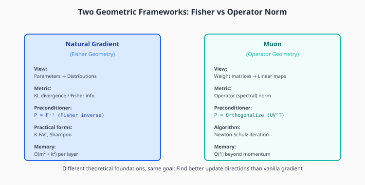
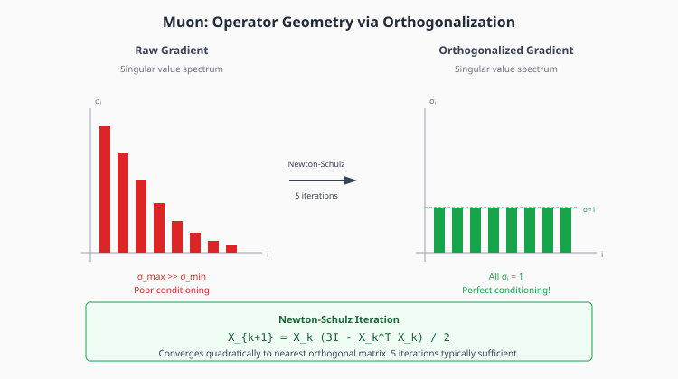

# Chapter 7: Muon and Operator Geometry

Muon represents a fundamentally different approach to optimization: instead of viewing parameters as points on a statistical manifold (Fisher geometry), it views weight matrices as **operators** and uses operator-norm geometry.

## Table of Contents

1. [Two Geometric Frameworks](#two-geometric-frameworks)
2. [Weight Matrices as Operators](#weight-matrices-as-operators)
3. [Operator Norm Geometry](#operator-norm-geometry)
4. [The Stiefel Manifold](#the-stiefel-manifold)
5. [Newton-Schulz Iteration](#newton-schulz-iteration)
6. [The Muon Algorithm](#the-muon-algorithm)
7. [Muon vs Natural Gradient](#muon-vs-natural-gradient)
8. [Scaling Muon](#scaling-muon)
9. [Implementation](#implementation)
10. [Exercises](#exercises)

---

## Two Geometric Frameworks



There are two distinct ways to think about optimizing neural networks:

| Aspect | Natural Gradient | Muon |
|--------|-----------------|------|
| **View** | Parameters → Distributions | Weight matrices → Linear maps |
| **Metric** | KL divergence / Fisher | Operator (spectral) norm |
| **Preconditioner** | $F^{-1}$ (Fisher inverse) | Orthogonalization ($UV^\top$) |
| **Memory** | $O(d^2)$ per layer | $O(1)$ beyond momentum |
| **Key papers** | Amari (1998), K-FAC | Bernstein, Jordan et al. |

Both aim to find better update directions than vanilla gradient, but they use different theoretical foundations.

---

## Weight Matrices as Operators

A linear layer computes $y = Wx$. The weight matrix $W$ is not just a collection of numbers—it's a **linear operator** that maps inputs to outputs.

### How Should We Measure Updates?

Consider an update $W \to W + \Delta W$. How "large" is this change?

**Frobenius norm** (sum of squared entries):
$$\|\Delta W\|_F = \sqrt{\sum_{ij} (\Delta W_{ij})^2}$$

**Operator norm** (how much it affects the output):
$$\|\Delta W\|_{op} = \max_{\|x\|=1} \|\Delta W \cdot x\|$$

The operator norm measures "how much can the output change for a unit input?" This is often more meaningful than counting parameter changes.

### The Key Insight

The gradient $\nabla_W L$ points in the direction of steepest descent in **Frobenius norm**.

But we care about how the **function** changes, which is measured by **operator norm**.

These give different answers! The gradient is suboptimal in operator norm.

---

## Operator Norm Geometry

### Spectral Norm

For a matrix $M$, the operator norm equals the largest singular value:

$$\|M\|_{op} = \sigma_{\max}(M)$$

This is also called the **spectral norm**.

### Singular Value Decomposition

Any matrix $M = U \Sigma V^\top$ where:
- $U, V$ are orthogonal matrices
- $\Sigma = \text{diag}(\sigma_1, \ldots, \sigma_r)$ with $\sigma_1 \geq \sigma_2 \geq \cdots \geq \sigma_r > 0$

The singular values $\sigma_i$ tell us how much $M$ stretches inputs in each direction.

### The Problem with Raw Gradients

Typical gradients have **highly non-uniform singular values**:



- A few large singular values dominate
- Many small singular values contribute little
- The ratio $\sigma_{\max}/\sigma_{\min}$ can be huge

This means the gradient update is dominated by a few directions, while other directions are underutilized.

---

## The Stiefel Manifold

The **Stiefel manifold** is the space of orthonormal matrices:

$$\text{St}(n, m) = \{Q \in \mathbb{R}^{n \times m} : Q^\top Q = I_m\}$$

For square matrices: $\text{St}(n, n) = O(n)$, the orthogonal group.

### Why Orthogonal Matrices?

Orthogonal matrices have **perfect conditioning**:
- All singular values equal 1: $\sigma_1 = \sigma_2 = \cdots = 1$
- No direction is favored over another
- Operator norm equals Frobenius norm (up to scaling)

### Projecting onto the Stiefel Manifold

Given any matrix $G$, we can find the **nearest orthogonal matrix**:

$$Q^* = \arg\min_{Q: Q^\top Q = I} \|G - Q\|_F$$

This projection is given by the **polar decomposition**: $G = QP$ where $Q$ is orthogonal and $P$ is positive semi-definite.

The orthogonal factor is $Q = UV^\top$ where $G = U\Sigma V^\top$ is the SVD.

---

## Newton-Schulz Iteration

Computing the SVD is expensive: $O(\min(m, n)^2 \cdot \max(m, n))$.

**Newton-Schulz** is a fast iterative method to find the orthogonal factor:

$$X_{k+1} = X_k \frac{3I - X_k^\top X_k}{2}$$

### Derivation

We want to solve $X^\top X = I$. Define $f(X) = X^\top X - I$.

Newton's method for finding roots:
$$X_{k+1} = X_k - [Df]^{-1} f(X_k)$$

After working through the calculus (see Appendix), this simplifies to:
$$X_{k+1} = X_k (3I - X_k^\top X_k) / 2$$

### Convergence

Starting from $X_0 = G / \|G\|_F$ (normalized gradient):
- **Quadratic convergence**: $\|X_k - Q\| \leq C \|X_{k-1} - Q\|^2$
- **5 iterations typically sufficient** for double precision

### GPU-Friendly

Each iteration is just matrix multiplications—highly optimized on GPUs:
```python
X = X @ (3*I - X.T @ X) / 2
```

---

## The Muon Algorithm

**Muon** (Matrix orthogonalization for neural networks) applies Newton-Schulz to orthogonalize the momentum buffer:

```
For each 2D weight matrix W with gradient G:
    1. Update momentum: M = β·M + G
    2. Orthogonalize: M_orth = NewtonSchulz(M, steps=5)
    3. Update: W = W - η·M_orth - λ·W  (with weight decay)
```

### Key Features

1. **Orthogonalized updates**: All singular values = 1
2. **Momentum**: Accumulates gradient information
3. **Weight decay**: Applied separately (decoupled)
4. **Only for 2D matrices**: Use AdamW for embeddings, biases, norms

### Hybrid Training

Muon only works for 2D weight matrices. For other parameters:
- **Embeddings**: 2D but very wide, use AdamW
- **Biases**: 1D, use AdamW
- **LayerNorm parameters**: 1D, use AdamW

Typically ~80% of parameters use Muon, ~20% use AdamW.

---

## Muon vs Natural Gradient

### The Debate

Some claim Muon is "like" natural gradient. This is **misleading**:

| Natural Gradient | Muon |
|-----------------|------|
| Corrects for statistical geometry | Corrects for operator geometry |
| Uses Fisher information | Uses orthogonalization |
| Based on KL divergence | Based on spectral norm |
| Stores preconditioner matrices | No extra storage beyond momentum |

### Different Theoretical Foundations

**Natural gradient** asks: "In which direction does the *distribution* change most per unit parameter change?"

**Muon** asks: "In which direction does the *linear map* change most per unit parameter change?"

Both improve over vanilla gradient descent, but for different reasons.

### Connection to Shampoo

Shampoo's update $L^{-1/4} G R^{-1/4}$ can be viewed as approximately orthogonalizing the gradient. Muon does this directly via Newton-Schulz instead of eigendecomposition.

---

## Scaling Muon

### Moonlight Results

Liu et al. (2025) scaled Muon to large language models:
- Trained 7B+ parameter models
- ~2× efficiency improvement over AdamW
- Same final quality with half the compute

### Key Hyperparameters

| Parameter | Typical Value | Notes |
|-----------|---------------|-------|
| Learning rate | 0.02 | Much higher than Adam! |
| Momentum | 0.95 | Similar to SGD |
| Weight decay | 0.0-0.1 | Decoupled |
| NS iterations | 5 | Sufficient for convergence |

### Learning Rate Scaling

Muon uses **much larger learning rates** than Adam:
- Adam: $\eta \approx 3 \times 10^{-4}$
- Muon: $\eta \approx 0.02$

This is because the orthogonalized update has norm $\approx \sqrt{d}$ regardless of gradient magnitude.

---

## Implementation

```python
import torch
from typing import List, Optional


def newton_schulz_orthogonalize(
    G: torch.Tensor,
    steps: int = 5,
    eps: float = 1e-7
) -> torch.Tensor:
    """
    Orthogonalize a matrix using Newton-Schulz iteration.

    This finds the nearest orthogonal matrix to G via the iteration:
        X_{k+1} = X_k (3I - X_k^T X_k) / 2

    The iteration converges quadratically to the orthogonal factor
    of the polar decomposition G = QP.

    Args:
        G: Input matrix to orthogonalize
        steps: Number of Newton-Schulz iterations
        eps: Normalization epsilon for stability

    Returns:
        Q: Orthogonal matrix closest to G in Frobenius norm
    """
    # Normalize for numerical stability
    X = G / (G.norm() + eps)

    # Newton-Schulz iterations
    for _ in range(steps):
        A = X.T @ X
        # X = X @ (3I - A) / 2
        X = X @ (3 * torch.eye(A.shape[0], device=A.device, dtype=A.dtype) - A) / 2

    return X


class Muon:
    """
    Muon optimizer for weight matrices.

    Muon uses Newton-Schulz orthogonalization instead of adaptive
    per-parameter scaling. This provides:
    - ~2x compute efficiency vs AdamW
    - Lower memory (only momentum buffer, no second moment)
    - Better conditioning in operator norm

    IMPORTANT: Only use for 2D weight matrices!
    For embeddings, biases, and layer norms, use AdamW.

    Reference: Jordan, "Muon: An optimizer for hidden layers" (2024)
    https://github.com/KellerJordan/Muon
    """

    def __init__(
        self,
        params,
        lr: float = 0.02,
        momentum: float = 0.95,
        weight_decay: float = 0.0,
        ns_steps: int = 5
    ):
        """
        Args:
            params: Iterable of 2D parameters (weight matrices only!)
            lr: Learning rate (typically much higher than Adam, e.g., 0.02)
            momentum: Momentum coefficient (typically 0.95)
            weight_decay: Decoupled weight decay
            ns_steps: Number of Newton-Schulz iterations
        """
        self.params = list(params)
        self.lr = lr
        self.momentum = momentum
        self.weight_decay = weight_decay
        self.ns_steps = ns_steps

        # Only momentum buffer needed (not second moment like Adam)
        self.m = [torch.zeros_like(p) for p in self.params]

    def step(self):
        """Perform one Muon optimization step."""
        for i, p in enumerate(self.params):
            if p.grad is None:
                continue

            g = p.grad

            # Only apply Muon to 2D weight matrices
            if g.ndim != 2:
                # Fall back to SGD with momentum for non-matrices
                self.m[i] = self.momentum * self.m[i] + g
                update = self.m[i]
                if self.weight_decay > 0:
                    update = update + self.weight_decay * p.data
                p.data = p.data - self.lr * update
                continue

            # Update momentum buffer
            self.m[i] = self.momentum * self.m[i] + g

            # Orthogonalize momentum
            m_orth = newton_schulz_orthogonalize(self.m[i], steps=self.ns_steps)

            # Apply update with optional weight decay
            update = m_orth
            if self.weight_decay > 0:
                update = update + self.weight_decay * p.data

            p.data = p.data - self.lr * update

    def zero_grad(self):
        for p in self.params:
            if p.grad is not None:
                p.grad.zero_()


class MuonAdamW:
    """
    Combined optimizer: Muon for weight matrices, AdamW for the rest.

    This is the recommended way to use Muon in practice. Weight matrices
    benefit from orthogonalization, while embeddings, biases, and layer
    norms are better handled by AdamW.

    Usage:
        weight_params = [p for n, p in model.named_parameters()
                        if 'weight' in n and p.ndim == 2]
        other_params = [p for n, p in model.named_parameters()
                       if 'weight' not in n or p.ndim != 2]

        optimizer = MuonAdamW(weight_params, other_params)
    """

    def __init__(
        self,
        weight_params,
        other_params,
        muon_lr: float = 0.02,
        muon_momentum: float = 0.95,
        adam_lr: float = 3e-4,
        adam_betas: tuple = (0.9, 0.999),
        weight_decay: float = 0.1,
        ns_steps: int = 5
    ):
        self.weight_params = list(weight_params)
        self.other_params = list(other_params)

        # Muon for weight matrices
        self.muon = Muon(
            self.weight_params,
            lr=muon_lr,
            momentum=muon_momentum,
            weight_decay=weight_decay,
            ns_steps=ns_steps
        )

        # AdamW for everything else
        self.adamw = torch.optim.AdamW(
            self.other_params,
            lr=adam_lr,
            betas=adam_betas,
            weight_decay=weight_decay
        )

    def step(self):
        self.muon.step()
        self.adamw.step()

    def zero_grad(self):
        self.muon.zero_grad()
        self.adamw.zero_grad()


def verify_orthogonalization():
    """Verify Newton-Schulz produces orthogonal matrices."""
    torch.manual_seed(42)

    G = torch.randn(64, 64)
    Q = newton_schulz_orthogonalize(G, steps=5)

    # Check Q^T Q ≈ I
    QtQ = Q.T @ Q
    I = torch.eye(64)

    error = (QtQ - I).abs().max().item()
    print(f"Max |Q^T Q - I|: {error:.2e}")
    assert error < 1e-5, "Orthogonalization failed!"

    # Check singular values ≈ 1
    singular_values = torch.linalg.svdvals(Q)
    print(f"Singular values: min={singular_values.min():.4f}, max={singular_values.max():.4f}")


def compare_muon_adam():
    """Compare Muon vs Adam on a simple problem."""
    torch.manual_seed(42)

    # Simple quadratic with ill-conditioning
    d = 64
    H = torch.randn(d, d)
    H = H @ H.T + 0.1 * torch.eye(d)  # Positive definite
    b = torch.randn(d)

    def loss_fn(W):
        # Quadratic loss on weight matrix
        Wv = W.flatten()
        return 0.5 * Wv @ H @ Wv - b @ Wv

    results = {}

    for name, opt_class, kwargs in [
        ('Adam', torch.optim.Adam, {'lr': 0.01}),
        ('Muon', Muon, {'lr': 0.1, 'momentum': 0.95}),
    ]:
        W = torch.randn(8, 8, requires_grad=True)
        optimizer = opt_class([W], **kwargs)

        losses = []
        for _ in range(200):
            optimizer.zero_grad()
            loss = loss_fn(W)
            loss.backward()
            optimizer.step()
            losses.append(loss.item())

        results[name] = losses
        print(f"{name}: Final loss = {losses[-1]:.4f}")

    return results


if __name__ == "__main__":
    print("=== Verifying orthogonalization ===")
    verify_orthogonalization()

    print("\n=== Comparing Muon vs Adam ===")
    compare_muon_adam()
```

---

## Key Takeaways

1. **Muon uses operator geometry**, not Fisher geometry

2. **Newton-Schulz iteration** orthogonalizes gradients in $O(d^3)$ per layer with 5 iterations

3. **Orthogonal updates** have all singular values = 1, providing perfect conditioning

4. **Higher learning rates** than Adam (0.02 vs 3e-4) because update magnitude is normalized

5. **Only for 2D matrices** — use AdamW for embeddings, biases, layer norms

6. **~2× efficiency** over AdamW for same final quality (Moonlight results)

---

## Exercises

### Exercise 1: Newton-Schulz Convergence

Implement Newton-Schulz and verify quadratic convergence:
1. Run for $k = 1, 2, \ldots, 10$ iterations
2. Plot $\|X_k^\top X_k - I\|$ vs $k$
3. Verify the error roughly squares each iteration

### Exercise 2: Derive Newton-Schulz

Starting from Newton's method for solving $X^\top X = I$:
1. Define $f(X) = X^\top X - I$
2. Compute the differential $Df[H] = X^\top H + H^\top X$
3. Show that the Newton update simplifies to $X_{k+1} = X_k(3I - X_k^\top X_k)/2$

### Exercise 3: Singular Value Comparison

Compare the singular value distributions of:
1. Raw gradient $G$
2. Orthogonalized gradient $Q$
3. Adam update $m / \sqrt{v}$
4. Shampoo update $L^{-1/4} G R^{-1/4}$

### Exercise 4: Train with Muon

Train a small transformer (e.g., GPT-2 small) with Muon + AdamW. Compare:
- Loss curves vs pure AdamW
- Wall-clock time to fixed loss
- Memory usage

### Exercise 5: Hybrid Parameter Groups

Implement proper parameter grouping for a real model:
1. Identify 2D weight matrices for Muon
2. Identify 1D and embedding parameters for AdamW
3. Verify total parameter count is correct

### Exercise 6: Operator Norm Gradient

For a linear layer $y = Wx$, compute the gradient of the loss w.r.t. $W$ that minimizes the change in operator norm $\|W_{new} - W\|_{op}$ rather than Frobenius norm.

---

## Connections

- **Previous**: [K-FAC and Shampoo](06-practical-second-order.md) — Fisher-based preconditioners
- **Next**: [Learning Rate Schedules](08-schedules.md) — how to set $\eta$ over training
- **Related**: Spectral normalization in GANs uses similar operator-norm ideas
- **Related**: μP (maximal update parameterization) controls update magnitudes
